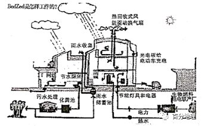

# 微专题之074 从产业结构角度分析区域发展

```
本专题摘自“百分地理”公众号，如有侵权请告之删除，谢谢。联系hhwxyhh@163.com
```

------
   
“富碳农业”指在人工密闭环境中，利用光、气、温、水、肥、种等最佳条件组合，创造高效率的光合作用环境，将二氧化碳作为气肥大量地使用，生产出丰富的粮食作物供给人类生活。下图是“富碳农业”产业链示意图，读下图回答下面小题。   
   
   
   
1．有关富碳农业生产特点的叙述，错误的是（  ）   
A．精耕细作，投入劳动力多   
B．集约化程度高   
C．商品率高   
D．对自然条件依赖较小   
2．发展富碳农业，能够（  ）   
A．减少农药使用量，保证土壤肥力   
B．减少生产要素投入，缓解耕地紧张局面   
C．消耗二氧化碳，缓解碳排放压力   
D．增加农产品供给，解决粮食短缺问题   
<span style="color: rgb(255, 0, 0);">1．A从图中可以看出，富碳农业在人工密闭环境中，利用光、气、温、水、肥、种等最佳条件组合，创造高效率的光合作用环境，在此过程中，劳动力的投入并不多，A错误，符合题意；投入设备较多，因此集约化程度高，B说法正确，不合题意；与传统的农业相比，富碳农业的产出更高，供应到市场的产品更多，商品率更高，C正确，不合题意；利用技术建构处农作物生长的环境，对于自然条件的依赖程度较小，D正确，不合题意。故选A。</span>   
<span style="color: rgb(255, 0, 0);">2．C富碳农业并没有减少农药的使用量，A错误；富碳经济发展成本较高，投入较多，B错误；富碳农业由于是将二氧化碳作为气肥大量地使用，因此可以缓解碳排放压力，C正确；富碳农业增加了粮食产量，但并没有解决粮食短缺问题，D错误，故正确选项为C。</span>   
<span style="color: rgb(255, 0, 0);">【点睛】农业按照投入可以分为：集约农业和粗放农业，按照产品用途可以分为：商品农业和自给农业。</span>   
河流有机碳输出是全球碳循环的重要组成部分。河流有机碳主要来源两大类：颗粒有机碳（POC），主要来源于本地生物作用、流水冲刷剥蚀以及土壤淋滤等物理风化作用产物；溶解有机碳（DOC），主要来自地表水和地下水的流动搬运。下图示意2004—2017年叶尼塞河和勒拿河流域溶解有机碳（DOC）、颗粒有机碳（POC）的季节分布特征。两流域生物量和人类活动极少。据此完成下面小题。   
   
   
   
3．影响图示河流DOC季节差异的主要因素是（  ）   
A．降雨多少   
B．水生植被和藻类繁殖生长快慢   
C．水温高低   
D．河流流量大小   
4．两河流的POC相比，勒拿河输出多，主要原因是（  ）   
A．勒拿河流域地表冻土广布   
B．勒拿河流域地势起伏大，土壤侵蚀速度较快   
C．勒拿河流域面积小，结冰期长   
D．勒拿河流域植被覆盖率低   
5．近年来，图示河流输出有机碳显著增多，原因可能是（  ）   
A．气候变暖   
B．降水增多   
C．农业活动增多   
D．自然灾害增加   
<span style="color: rgb(255, 0, 0);">3．D据材料可知，DOC为溶解有机碳，主要来自地表水和地下水的流动搬运。它与河流径流量密切相关，两河流位于北亚，以季节性积雪融水补给为主，春季流量大，流水的搬运作用强，所以春节DOC输出量大。D正确。两河流位于北亚，春季降雨并不多，对其影响不是主导性的。A错误。水温高低、水生植被和藻类繁殖生长快慢，不是河流DOC季节差异的主要因素，BC错误。故选D。</span>   
<span style="color: rgb(255, 0, 0);">4．B据材料可知，颗粒有机碳（POC），主要来源于本地生物作用、流水冲刷剥蚀以及土壤淋滤等物理风化作用产物。叶尼塞河和勒拿河流域地表冻土分布都很广，生物量和人类活动极少，不是勒拿河输出多的主要原因，A错误。冻土中储存着大量有机质，勒拿河流域地势起伏大，流水冲刷剥蚀作用强，土壤、岩石中的有机碳更容易被流水搬运，B正确。勒拿河流域面积小，说法错误，C错误。勒拿河流域植被覆盖流率低，本地生物作用弱，应推导得出勒拿河POC输出少，D错误。故选B。</span>   
<span style="color: rgb(255, 0, 0);">5．A图中的两河流都位于高纬度地区，随着全球气候变暖，北极地区冻土融化加剧，土壤中有机碳易被流水搬运，A正确。降水的变化对多年冻土区土壤的水环境影响不大。B错误。据材料，该区人类活动极少，该地区农业活动并未增多，C错误。自然灾害并未增加，D错误。</span>   
<span style="color: rgb(255, 0, 0);">【点睛】勒拿河，俄罗斯最长的河流。位于东西伯利亚，发源于贝加尔山西坡 ，注入北冰洋拉普捷夫海 。长4400千米 ，流域面积249万平方千米。上游 流经高原、山地，河窄岸高，多急流、险滩，具有典型山区河流特征。中游接纳奥廖克马河后，水量大增，河谷展宽，沿岸形成湖泊和河湾 ，河谷中有众多小岛 ，下游成为巨大的平原型河流。入海处每年有约1200万吨悬移质泥沙和约 4100 万吨溶解物质沉淀 ，形成俄罗斯最大的三角洲。河水径流补给以冰雪融水为主，雨水次之。主要为春汛，伏汛次之。冬季流量最小。结冰期长达8个月(9月末——翌年6月初。</span>   
(管子●度地》中说“圣人之处四者,必于不倾之地，而择地形之肥饶者，乡(同“向")山，左右经水若译。内为落渠之写,因大川而注焉。"据此完成下面小题。   
6．圣人建设都城选择不倾之地的原因有（  ）   
①地势平坦、地质稳固   
②土壤肥沃、物产丰饶   
③背后靠山,左右经过河流或湖泽   
④便于设置防洪堤、排水沟   
A．①②③   
B．②③④   
C．①③④   
D．①②③④   
7．圣人建设都城最契合的现代城市建设理念是（  ）   
A．海绵城市   
B．生态城市   
C．绿色城市   
D．低碳城市   
<span style="color: rgb(255, 0, 0);">6．D“圣人之处国者，必于不倾之地，而择地形之肥饶者。乡山，左右经水若泽。内为落渠之写，因大川而注焉。”大意是说，圣人建设都城，一定都选在地势平坦、地质稳固、土壤肥沃、物产丰饶的地方。背后靠山，左右经过河流或湖泽，可以提供水源。考虑设置防洪堤、排水沟等设施，确保城市防洪体系牢不可破。①②③④正确，D正确。故选D。</span>   
<span style="color: rgb(255, 0, 0);">7．B生态城市是社会、经济、文化和自然高度协同和谐的复合生态系统，其目标是使城市景观尽可能与山、水、河、湖、海、植被等自然景观相协调，建立一种良性循环。圣人建设都城使人工环境与自然环境协调统一，符合生态城市的理念。B正确。故选B。</span>   
（2021·山东·高三专题练习）河水空调供暖系统使用河水对建筑物进行集中供暖，其提取“热”的过程是：用水泵抽取河水进入热泵机组，河水一边流动，热泵一边“吸”取热量，从中提取5℃的“热”，转化后进入下一个流程，而水再次流回河中。下图示意“水空调”供暖系统工作原理。据此完成下面小题。   
   
   
   
8．相对于传统供暖系统，河水空调供暖系统的突出优势是（  ）   
A．前期投资少   
B．碳排放量小   
C．制暖效果好   
D．发展空间大   
9．最适合使用河水空调供暖系统的是（  ）   
A．乌鲁本齐   
B．北京   
C．贵阳   
D．三亚   
<span style="color: rgb(255, 0, 0);">8．B根据材料和图可以看出，河水空调需要用水泵抽水，程序较复杂，投资较多，A错误；河水空调是一种使用河水对建筑物进行制冷、供热的空调系统，可减少碳排放，B正确；传统供暖系统通过燃煤等方式获取热量，技术更成熟，制暖效果更好，C错误；河水空调供暖系统对自然条件要求高，相比较传统供暖系统，河水空调供暖系统发展空间有限，D错误。故选B。</span>   
<span style="color: rgb(255, 0, 0);">9．C河水空调适用于具有较大空调需求量，且容易获得适宜温度河水的区域。三亚纬度较低，河水温度较高，且冬季空调需求量不大，D错；北京和乌鲁木齐位于北方地区，冬季寒冷，河流结冰，流量小甚至断流，不适合使用河水空调供暖系统，AB错误；贵阳冬季受云贵准静止锋影响，以阴雨冷湿天气为主，气温较低，且河流较多，水源充足，适合使用河水空调供暖系统，C正确。故选C。</span>   
<span style="color: rgb(255, 0, 0);">【点睛】本题需要明确河水空调供暖系统工作原理，相比较传统供暖系统借助燃煤供暖，河水空调供暖系统更为清洁，各种污染物和碳排放较少，但对自然条件要求较高，且制暖效果相对较差。适合使用河水空调供暖系统的地区必定是冬季供暖需求量大，河水来源充足的地区。</span>   
自然界中的碳以不同的形式存在，空气、植被、土壤、水域都是碳的储存空间，下图为我国某山地从山麓到山顶的碳储量分布图。读图完成下面小题。   
   
   
   
10．影响该区域植被碳储量变化的主导因素是（  ）   
A．水热状况   
B．土壤   
C．光照   
D．坡度   
11．在该山地4000m以下高度处可以看到花草相映，在4500m以上高度处则可以看到大片的流石滩，流石滩往上走就有积雪了。推测4000m-4500m是（  ）   
A．高山苔原带   
B．高山草甸带   
C．山地针叶林带   
D．冰川带   
<span style="color: rgb(255, 0, 0);">10．A以碳储量的空间分布为载体,考查影响碳储量空间分布的主导因素,旨在考查考生获取和解读地理信息,调动和运用地理知识的能力。由图可知,该地区植被碳储量先随海拔升高呈现上升趋势,后随海拔升高呈现下降趋势,说明该地区植被数量从山麓到山腰逐渐增多,从山腰到山顶逐渐减少,而影响山地不同高度处植被数量的最主要因素是水热状况。A正确，土壤对植被的碳储量没有影响，B错误。光照会随海拔升高而增加，碳储量会随海拔升高而增加，C错误。坡度对碳储量影响不大，D错误。故选A。</span>   
<span style="color: rgb(255, 0, 0);">11．A以碳储量的空间分布为载体，考查自然带的分布,旨在考查考生获取和解读地理信息、调动和运用地理知识的能力。在该山地4000m以下高度处可以看到花草相映，在4500m以上高度处则可以看到大片的流石滩,流石滩往上就有积雪了,说明4000一4500米高度处应处于高山草甸带之上,冰川带之下,最可能为高山苔原带,且该地碳储量较低,符合高山苔原带的特点，A正确，BCD错误，故选A。</span>   
<span style="color: rgb(255, 0, 0);">【点睛】本题以碳储量为载体,旨在考查考生获取和解读地理信息,调动和运用地理知识的能力。解题的关键在于对信息的阅读和信息提取。</span>   
美国贝丁顿（BedZed）低碳生活社区建设成本比伦敦普通住宅要高50%，但从长远来看，投入多，耗费少，既减少整个社会的成本，又减少了社区的长期能耗。与同类住区相比，在保证生活质量的前提下，贝丁顿的住户的采暖能耗降低了88%，用电量减少25%，用水量只相当于全英国平均用水量的50%。社区内采用多功能公共空间的设计，运动场、菜地、洗浴、娱乐中心等一应俱全。   
结合下图完成下面小题。   
   
   
   
12．贝丁顿低碳生活区使用的清洁能源主要是   
①水电②热电③光伏电④火电   
A．①②   
B．②③   
C．③④   
D．①④   
13．贝丁顿低碳生活区用水量只相当于英国平均用水量的50%，采取的主要措施是   
A．接蓄雨水和循环用水   
B．脏衣物都采用干洗   
C．减少洗澡、洗衣次数   
D．用洗菜水冲洗马桶   
14．从低碳生活方面考虑，社区内多功能公共空间的设计可以   
A．便利居民生活   
B．减少对外联系   
C．减少居民出行   
D．减少消费开支   
<span style="color: rgb(255, 0, 0);">12．B据图分析，图中贝丁顿低碳生活区有“光电板给电动车充电”、“生物燃料热电联产厂”、“热回收式风能驱动换气扇”等能源利用形式，因此使用的清洁能源主要是热电、光伏电；②③正确，①④错误，B正确，ACD错误。故选B。</span>   
<span style="color: rgb(255, 0, 0);">13．A贝丁顿低碳生活区用水量只相当于英国平均用水量的50%，据图分析可知，通过雨水收集、雨水储蓄池、污水处理、节水厕所等主要措施实现了用水量大幅度减少，A正确；脏衣物都釆用干洗、减少洗澡、洗衣次数、用洗菜水冲洗马桶材料中没有体现，BCD错误。故选A。</span>   
<span style="color: rgb(255, 0, 0);">14．C多功能公共空间内运动场、菜地、洗浴、娱乐中心等一应俱全，可以足不出户、完成生活所需要的一些必要活动，减少出行，节省了能源消耗，符合低碳生活理念，C正确；便利居民生活、减少消费开支没有充分体现低碳理念，AD错误；减少对外联系不是多功能公共空间的设计的目的，B错误。故选C。</span>   
二、综合题   
15．阅读图文材料，完成下列问题。   
党的十九大报告提出：要坚持农业农村优先发展，按照产业兴旺、生态宜居、乡风文明、治理有效、生活富裕的总要求实施乡村振兴战略。黄土高原丘陵沟壑区针对社会可持续发展面临的问题与挑战，构建了可持续振兴模式：生态、生产与社会耦合发展，即山顶削峁建塬，发展果业和药材生态园；山腰构建草（根系多而浅）灌（根系少而深）复合生态系统；山下适当治沟造地发展现代农业；小流域源头科学建设水库，为山上药果园区和现代农业提供滴灌水源，从而形成黄土高原丘陵沟壑区山水林田湖生态景观格局。下图为黄土高原丘陵沟壑区三元景观模式示意图。   
   
   
   
(1)说明在黄土高原丘陵沟壑区实施削峁建塬的理由。   
(2)分析在山腰与沟坡进行植被建设时，选择草本、灌木结合的原因。   
(3)请为药果复合生态园的发展提出合理化建议。   
<span style="color: rgb(255, 0, 0);">【答案】(1)黄土峁地表起伏较大，削峁建塬，降低地表坡度，减轻地表径流侵蚀；有利降水及地表水下渗，涵养水源、保持水土；黄土层深厚、土质疏松，利于施工，难度小；增加耕地面积且方便田间耕作；地势较高,光照充足，有利发展林果药材种植，增加经济收入，实现生态、经济社会效益的统一。</span>   
<span style="color: rgb(255, 0, 0);">(2)草本和灌木需水少，易于成活；草本植物主要为须根系，根系数量多，相互交织成网；灌木主要为直根系，根系少，扎根较深，有利于稳固表土，所以草灌相结合，更利于保持水土。</span>   
<span style="color: rgb(255, 0, 0);">(3)选择优质、高效、高产和生态安全的农业品种；减少农药化肥使用量，发展绿色有机农业；对农产品深加工延长产业链，增加产品附加值；形成农业品牌，提高市场竞争力；增加科技投入，加强基础设施建设，发展循环经济；发展旅游观光农业，增加经济收入。</span>   
<span style="color: rgb(255, 0, 0);">【解析】本题主要结合黄土高原水土流失的治理考查区域可持续发展的措施及意义。主要考查学生图片材料信息提取能力、地理知识调用分析能力、地理事物分析表达能力，主要考查学生的区域认知、综合思维、地理实践力以及人地协调观的地理学科核心素养。</span>   
<span style="color: rgb(255, 0, 0);">(1)据图分析，黄土峁和黄土塬相比，地表起伏较大、顶部不平坦，削峁建塬可以减小坡地的坡度，减轻地表径流侵蚀强度；坡度变缓利于减缓流速，促进降水及地表水下渗，起到涵养水源、保持水土的作用；黄土层疏松深厚，利于削峁建塬施工，工程量小，难度小；削峁建塬可以增加耕地使用面积且坡度降低方便田间耕作；塬面地势较高，光照较好，利于植物进行光合作用， 对发展林果药材等种植有利，能增加当地居民的经济收入，实现生态、经济、社会效益的统一。(2)在山腰与沟坡进行植被建设时，选择草本、灌木结合，因为草本和灌木低矮，需水少，易于成活；草本植物主要为须根系，根系数量多，相互交织成网，利于保持水土，减少侵蚀；灌木主要为直根系,根系少，扎根较深，有利于稳固表土，所以草灌相结合，相得益彰，更利于保持水土。(3)药果复合生态园的发展可以从这些方面考虑∶加大科技投入，培育优质、高效、高产的绿色品种，利于提高产品质量；发展精确、处方农业，精准控制农药化肥用量，降低污染，提高品质，提高产品竞争力；促进农产品的深加工，延长产业链，增加附加值，增加经济收入；加强农业品牌建设，加强宣传，提高知名度；完善农田基础设施，提高生产效率，保障农业生产基本条件；发展第三产业，实行产业多元化，发展旅游观光农业，增加经济收入。</span>   
16．阅读图文材料，完成下列问题。   
热融湖是多年冻土区地下冰融化引起地表塌陷形成的凹坑集水而成。冻土是指0℃以下含有冰的各种岩石和土壤。活动冻土层是指多年冻土区夏季融化而冬季冻结的地表层。多年冻结层是指常年处在冻结状态的冻土层，该层中常含有冰楔（水渗入冻土裂隙中冻结成的脉状冰）。近年来，青藏高原的热融湖发展迅速。图1示意冰楔对热融湖形成的作用，图2示意热融湖的扩张及其对碳元素迁移的影响。   
   
   
   
(1)指出多年冻土层中冰楔形成的主要季节，并说明冰楔的形成过程。   
(2)分析近年来青藏高原热融湖数量增多的原因。   
(3)说明热融湖不断增多和扩张对地球大气圈的影响。   
<span style="color: rgb(255, 0, 0);">【答案】(1)夏季：夏季温度高，冻土区活动层融化，水分（融水、降水和地表水）顺着多年冻结层的裂隙下渗，遇冷凝结形成冰楔。</span>   
<span style="color: rgb(255, 0, 0);">(2)近年来伴随全球气候变暖，地温上升，多年冻结层中更多冰楔（地下冰）融化，冻土体积变小，地表塌陷形成的凹坑增多，集水形成的热融湖增多。</span>   
<span style="color: rgb(255, 0, 0);">(3)加剧冻土融化，释放到大气中的甲烷、二氧化碳等温室气体增多，加剧全球变暖。</span>   
<span style="color: rgb(255, 0, 0);">【解析】本题以热融湖的形成和影响为材料，涉及全球将气候的原因及影响、地理环境的整体性等知识。重点考查学生获取和解读信息、调动和运用知识的能力，体现了综合思维及地理实践能力的学科素养。(1)由材料可知，冰楔是水渗入冻土裂隙中冻结成的脉状冰；读图可知，形成冰楔的水来自多年冻土层上部的活动冻土层。结合材料“活动冻土层是指多年冻土区夏季融化而冬季冻结的地表层”可知，活动冻土层融化的季节应是夏季。“冰楔是水渗入冻土裂隙中冻结成的脉状冰”，因此多年冻土层中形成冰楔首先是活动冻土层融化，然后是融水沿裂隙下渗冻结。夏季地温高，活动层融化，融水和降水顺着裂隙下渗，到永动层上部再次冻结，使得裂隙中的冰体积逐渐变大，根据裂隙形态，水会冻结成上大下小的锥形冰体，形成冰楔。(2)“热融湖是多年冻土区地下冰融化引起地表塌陷形成的凹坑集水而成”，因此形成热融湖应从热、融、湖三个方面考虑。近年全球气候转暖，引起冻土受热增加，地下冰或多年冻土层发生局部融化，冻土体积变小，地表土层随之沉陷而形成热融沉陷，这些凹陷积水后便形成了湖塘。(3)由图2可知，热融湖演化过程中，积累在冻土层中的有机物分解释放出甲烷、二氧化碳等温室气体。温室气体会从土层进入大气层，这会导致大气对地表辐射的吸收能力增强，保温作用强，形成温室效应，加剧全球变暖。</span>   
17．阅读图文材料,完成下列要求。   
在全球变暖的气候背景下,土壤碳库作为陆地生态系统中最大的碳库对于维护生态系统碳平衡发挥着不可替代的作用。地形因子通过改变局部地区的水热状况影响土壤有机碳的积累和分解速率，导致区域间土壤有机碳含量存在显著的差异性。某地理研究团队以位于秦岭东段伏牛山的宝天曼自然保护区为研究区域,沿南坡和北坡从900m至1900m自下而上每间隔100m设置样地,调查宝天曼自然保护区土壤有机碳含量垂直地域分异规律,得出成果如下图所示。   
   
   
   
（1）与下层土壤相比,指出0——20cm土壤有机碳含量的特征,并简述原因。   
（2）指出南北坡土壤有机碳含量与海拔的关系,并从自然角度对此作出合理的解释。   
（3）气候变化导致各类极端天气增加,分析其对土壤有机碳含量的影响。   
（4）说明宝天曼自然保护区土壤有机碳含量对气候变化响应较为敏感的原因。   
<span style="color: rgb(255, 0, 0);">【答案】（1）特征:土壤有机碳含量较高,波动大。原因:地表接受枯枝落叶多，有机质输入量大:表层土壤受人类活动干扰及环境因子(如气温、降水等)影响明显。</span>   
<span style="color: rgb(255, 0, 0);">（2）关系;整体来说,南坡各土层的土壤有机碳含量随海拔升高呈增加趋势，北坡土壤有机碳含量随海拔升高呈降低趋势。解释:南坡为夏季风迎风坡,随肴海拔的升高,降水量增大,水分条件改善,总体生物量增加,有机质输入量较多;北坡为夏季风背风坡,降水少,且海拔越高，气温越低.生物量少,有机质输入量少。</span>   
<span style="color: rgb(255, 0, 0);">（3）暴雨出现的频率增加.降雨侵蚀力增强,导致土壤有机碳淋溶、流失;极端高温、极端严寒、干旱等天气增加，生物量及多样性减少，土壤有机碳输入量减少。</span>   
<span style="color: rgb(255, 0, 0);">（4）垂直地域分异显著，土壤有机碳量最及带谱的垂直变化受气候变化影响显著;地处南北过渡带，气候、植被、土壤具有明显的过渡性受气候变化影响明显。</span>   
<span style="color: rgb(255, 0, 0);">【解析】本题考查宝天曼自然保护区南北坡土壤有机碳含量的特征及其与海拔的关系、气候变化对土壤有机碳含量的影响，同时考查学生获取和解读地理信息、描述和阐释地理事物及论证和探讨地理问题的能力。（1）结合图表可知，表层土壤有机碳含量较高，且含量随海拔变化的波动更大。表层土壤有机碳含量高主要是因为枯枝落叶落到地表，地表接受枯枝落叶多，枯枝落叶等生物的残骸输入量大；波动大主要是因为表层受自然和人为干扰的因素较多，如冬季落叶多、人工清扫、人类活动干扰等。（2）南坡为夏季风迎风坡，随海拔升高,降水量增大,水分条件改善。生物量加大，南坡各土层的土壤有机碳含量随海拔升高呈增加趋势。北坡为夏季风背风坡，降水量较少,且随着海拔升高,气温降低,因此生物量逐渐减小，北坡土壤有机碳含量随海拔升高呈降低趋势。（3）极端气象灾害导致生物量减少,如暴雨出现的频率增加，地表径流多，降雨侵蚀力增强,导致土壤有机碳淋溶、流失，导致有机质减少；极端严寒、干旱等天气增加，生物生存环境差，生物量及多样性减少，土壤有机碳输入量减少；极端暴雨会加快对表层土壤有机碳的侵蚀。（4）宝天曼保护区地处我国南北方分界线，气候、植被、土壤具有明显的过渡性受气候变化影响明显，对气候变化敏感，且垂直带谱较多,垂直地域分异显著。土壤有机碳含量及带谱的垂直变化受气候变化影响显著。</span>