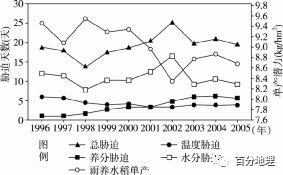
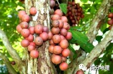
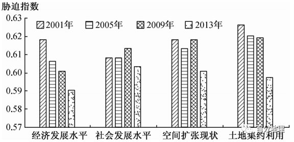
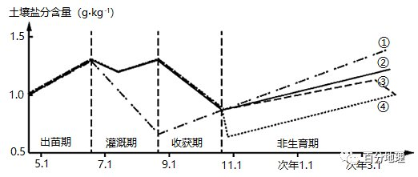
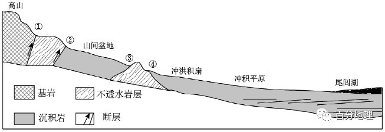
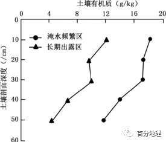
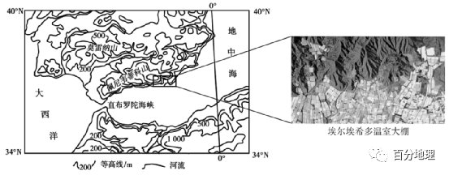
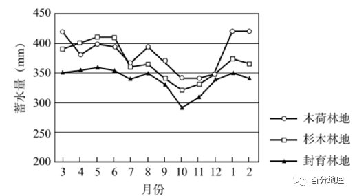
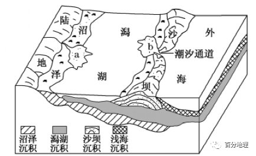
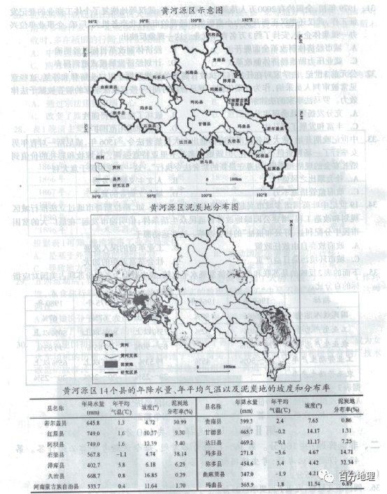

# 微专题之074 从产业结构角度分析区域发展

```
本专题摘自“百分地理”公众号，如有侵权请告之删除，谢谢。联系hhwxyhh@163.com
```

------
   
（2022·河南··高三模拟）雨养农业是指无人工灌溉，仅靠自然降水作为水分来源的农业生产。水稻在雨养农田中受到的胁迫比在灌溉农田中更为显著。下因为1996—2005年孟印缅地区雨养水稻的单产潜力与生长季各类胁迫因子的影响天数统计图。   
   
   
   
据此完成下面小题。   
1．关于图中统计数据的描述，正确的是   
A．温度胁迫对雨养水稻单产潜力的影响在逐年增强   
B．水分胁迫对雨养水稻的单产潜力影响最为显著   
C．1998年雨养水稻单产潜力最高，生长季内受胁迫天数为26天   
D．2002年雨养水稻单产潜力最低的根本原因是水田盐碱化严重   
2．1996～2005年孟印缅地区雨养水稻单产潜力呈下降趋势，其主要原因是   
A．全球温室气体排放，气候出现异常   
B．热带季风气候降水的季节和年际变化   
C．赤道附近东太平洋海水温度异常降低   
D．雨养农田的土壤肥力持续退化   
<span style="color: rgb(255, 0, 0);">1．B读图可知，温度胁迫对雨养水稻单产潜力的影响大致呈降低趋势，A错。无论图示哪个年份，水分胁迫的天数均为最大值，说明其影响最为显著，B对。1998年雨养水稻单产潜力最高，生长季内受胁迫天数为16天，C错。2002年雨养水稻单产潜力最低的根本原因是总胁迫天数多，D错。故选B。</span>   
<span style="color: rgb(255, 0, 0);">2．D读图可知，图示时间段内，孟印缅地区雨养水稻单产潜力下降，而总体胁迫天数呈波动变化，且水分胁迫及温度胁迫天数变化不大，只有养分胁迫天数增加，与生产潜力呈负相关关系，说明该地区的水稻单产潜力下降是由于雨养农田的土壤肥力持续退化所致，故选D。</span>   
（2022·湖北·高三阶段练习）木奶果属大戟科，常绿乔木，是一种茎上开花、茎上结果的树种，下图为木奶果示意图。据此完成下面小题。   
   
   
   
3．木奶果分布区的地带性植被属于（  ）   
A．热带雨林   
B．亚热带常绿阔叶林   
C．温带落叶阔叶林   
D．亚寒带针叶林   
4．木奶果的茎上开花现象有利于（  ）   
A．获得更多光照   
B．传播授粉   
C．减轻树枝压力   
D．保护脆弱树皮   
5．为研究木奶果幼苗生长与光照条件之间的关系，某科研团队选取若干幼苗进行实验观测，得出如下数据，根据表中数据可知（  ）   
<table cellspacing="0" cellpadding="0" width="577"><tbody><tr><td width="44" rowspan="2" valign="middle" style="padding: 3.75pt 6pt;border-width: 1pt;border-color: rgb(0, 0, 0);"><section style="margin-top: 0pt;margin-bottom: 0pt;margin-left: 0pt;text-indent: 0pt;font-size: 10.5pt;font-family: &quot;Times New Roman&quot;;text-align: left;line-height: 2em;"><span style="font-family: 宋体;">处理</span></section></td><td width="375" colspan="3" valign="middle" style="padding: 3.75pt 6pt;border-width: 1pt;border-color: rgb(0, 0, 0);"><section style="margin-top: 0pt;margin-bottom: 0pt;margin-left: 0pt;text-indent: 0pt;font-size: 10.5pt;font-family: &quot;Times New Roman&quot;;text-align: left;line-height: 2em;"><span style="font-family: 宋体;">指标</span></section></td></tr><tr><td width="131" valign="middle" style="padding: 3.75pt 6pt;border-width: 1pt;border-color: rgb(0, 0, 0);"><section style="margin-top: 0pt;margin-bottom: 0pt;margin-left: 0pt;text-indent: 0pt;font-size: 10.5pt;font-family: &quot;Times New Roman&quot;;text-align: left;line-height: 2em;"><span style="font-family: 宋体;">株高增长量（cm）</span></section></td><td width="136" valign="middle" style="padding: 3.75pt 6pt;border-width: 1pt;border-color: rgb(0, 0, 0);"><section style="margin-top: 0pt;margin-bottom: 0pt;margin-left: 0pt;text-indent: 0pt;font-size: 10.5pt;font-family: &quot;Times New Roman&quot;;text-align: left;line-height: 2em;"><span style="font-family: 宋体;">地径增长量（mm）</span></section></td><td width="108" valign="middle" style="padding: 3.75pt 6pt;border-width: 1pt;border-color: rgb(0, 0, 0);"><section style="margin-top: 0pt;margin-bottom: 0pt;margin-left: 0pt;text-indent: 0pt;font-size: 10.5pt;font-family: &quot;Times New Roman&quot;;text-align: left;line-height: 2em;"><span style="font-family: 宋体;">叶面积（cm</span><sup>2</sup><span style="font-family: 宋体;">）</span></section></td></tr><tr><td width="44" valign="middle" style="padding: 3.75pt 6pt;border-width: 1pt;border-color: rgb(0, 0, 0);"><section style="margin-top: 0pt;margin-bottom: 0pt;margin-left: 0pt;text-indent: 0pt;font-size: 10.5pt;font-family: &quot;Times New Roman&quot;;text-align: left;line-height: 2em;">CK</section></td><td width="131" valign="middle" style="padding: 3.75pt 6pt;border-width: 1pt;border-color: rgb(0, 0, 0);"><section style="margin-top: 0pt;margin-bottom: 0pt;margin-left: 0pt;text-indent: 0pt;font-size: 10.5pt;font-family: &quot;Times New Roman&quot;;text-align: left;line-height: 2em;">1.48</section></td><td width="136" valign="middle" style="padding: 3.75pt 6pt;border-width: 1pt;border-color: rgb(0, 0, 0);"><section style="margin-top: 0pt;margin-bottom: 0pt;margin-left: 0pt;text-indent: 0pt;font-size: 10.5pt;font-family: &quot;Times New Roman&quot;;text-align: left;line-height: 2em;">2.77</section></td><td width="108" valign="middle" style="padding: 3.75pt 6pt;border-width: 1pt;border-color: rgb(0, 0, 0);"><section style="margin-top: 0pt;margin-bottom: 0pt;margin-left: 0pt;text-indent: 0pt;font-size: 10.5pt;font-family: &quot;Times New Roman&quot;;text-align: left;line-height: 2em;">46.31</section></td></tr><tr><td width="44" valign="middle" style="padding: 3.75pt 6pt;border-width: 1pt;border-color: rgb(0, 0, 0);"><section style="margin-top: 0pt;margin-bottom: 0pt;margin-left: 0pt;text-indent: 0pt;font-size: 10.5pt;font-family: &quot;Times New Roman&quot;;text-align: left;line-height: 2em;">S3</section></td><td width="131" valign="middle" style="padding: 3.75pt 6pt;border-width: 1pt;border-color: rgb(0, 0, 0);"><section style="margin-top: 0pt;margin-bottom: 0pt;margin-left: 0pt;text-indent: 0pt;font-size: 10.5pt;font-family: &quot;Times New Roman&quot;;text-align: left;line-height: 2em;">15.03</section></td><td width="136" valign="middle" style="padding: 3.75pt 6pt;border-width: 1pt;border-color: rgb(0, 0, 0);"><section style="margin-top: 0pt;margin-bottom: 0pt;margin-left: 0pt;text-indent: 0pt;font-size: 10.5pt;font-family: &quot;Times New Roman&quot;;text-align: left;line-height: 2em;">3.52</section></td><td width="108" valign="middle" style="padding: 3.75pt 6pt;border-width: 1pt;border-color: rgb(0, 0, 0);"><section style="margin-top: 0pt;margin-bottom: 0pt;margin-left: 0pt;text-indent: 0pt;font-size: 10.5pt;font-family: &quot;Times New Roman&quot;;text-align: left;line-height: 2em;">70.63</section></td></tr><tr><td width="44" valign="middle" style="padding: 3.75pt 6pt;border-width: 1pt;border-color: rgb(0, 0, 0);"><section style="margin-top: 0pt;margin-bottom: 0pt;margin-left: 0pt;text-indent: 0pt;font-size: 10.5pt;font-family: &quot;Times New Roman&quot;;text-align: left;line-height: 2em;">S4</section></td><td width="131" valign="middle" style="padding: 3.75pt 6pt;border-width: 1pt;border-color: rgb(0, 0, 0);"><section style="margin-top: 0pt;margin-bottom: 0pt;margin-left: 0pt;text-indent: 0pt;font-size: 10.5pt;font-family: &quot;Times New Roman&quot;;text-align: left;line-height: 2em;">22.53</section></td><td width="136" valign="middle" style="padding: 3.75pt 6pt;border-width: 1pt;border-color: rgb(0, 0, 0);"><section style="margin-top: 0pt;margin-bottom: 0pt;margin-left: 0pt;text-indent: 0pt;font-size: 10.5pt;font-family: &quot;Times New Roman&quot;;text-align: left;line-height: 2em;">3.87</section></td><td width="108" valign="middle" style="padding: 3.75pt 6pt;border-width: 1pt;border-color: rgb(0, 0, 0);"><section style="margin-top: 0pt;margin-bottom: 0pt;margin-left: 0pt;text-indent: 0pt;font-size: 10.5pt;font-family: &quot;Times New Roman&quot;;text-align: left;line-height: 2em;">114.50</section></td></tr><tr><td width="44" valign="middle" style="padding: 3.75pt 6pt;border-width: 1pt;border-color: rgb(0, 0, 0);"><section style="margin-top: 0pt;margin-bottom: 0pt;margin-left: 0pt;text-indent: 0pt;font-size: 10.5pt;font-family: &quot;Times New Roman&quot;;text-align: left;line-height: 2em;">S6</section></td><td width="131" valign="middle" style="padding: 3.75pt 6pt;border-width: 1pt;border-color: rgb(0, 0, 0);"><section style="margin-top: 0pt;margin-bottom: 0pt;margin-left: 0pt;text-indent: 0pt;font-size: 10.5pt;font-family: &quot;Times New Roman&quot;;text-align: left;line-height: 2em;">22.58</section></td><td width="136" valign="middle" style="padding: 3.75pt 6pt;border-width: 1pt;border-color: rgb(0, 0, 0);"><section style="margin-top: 0pt;margin-bottom: 0pt;margin-left: 0pt;text-indent: 0pt;font-size: 10.5pt;font-family: &quot;Times New Roman&quot;;text-align: left;line-height: 2em;">4.30</section></td><td width="108" valign="middle" style="padding: 3.75pt 6pt;border-width: 1pt;border-color: rgb(0, 0, 0);"><section style="margin-top: 0pt;margin-bottom: 0pt;margin-left: 0pt;text-indent: 0pt;font-size: 10.5pt;font-family: &quot;Times New Roman&quot;;text-align: left;line-height: 2em;">145.56</section></td></tr><tr><td width="44" valign="middle" style="padding: 3.75pt 6pt;border-width: 1pt;border-color: rgb(0, 0, 0);"><section style="margin-top: 0pt;margin-bottom: 0pt;margin-left: 0pt;text-indent: 0pt;font-size: 10.5pt;font-family: &quot;Times New Roman&quot;;text-align: left;line-height: 2em;">S8</section></td><td width="131" valign="middle" style="padding: 3.75pt 6pt;border-width: 1pt;border-color: rgb(0, 0, 0);"><section style="margin-top: 0pt;margin-bottom: 0pt;margin-left: 0pt;text-indent: 0pt;font-size: 10.5pt;font-family: &quot;Times New Roman&quot;;text-align: left;line-height: 2em;">20.38</section></td><td width="136" valign="middle" style="padding: 3.75pt 6pt;border-width: 1pt;border-color: rgb(0, 0, 0);"><section style="margin-top: 0pt;margin-bottom: 0pt;margin-left: 0pt;text-indent: 0pt;font-size: 10.5pt;font-family: &quot;Times New Roman&quot;;text-align: left;line-height: 2em;">3.47</section></td><td width="108" valign="middle" style="padding: 3.75pt 6pt;border-width: 1pt;border-color: rgb(0, 0, 0);"><section style="margin-top: 0pt;margin-bottom: 0pt;margin-left: 0pt;text-indent: 0pt;font-size: 10.5pt;font-family: &quot;Times New Roman&quot;;text-align: left;line-height: 2em;">157.70</section></td></tr></tbody></table>

注:CK、S3、S4、S6、S8分别表示无遮阴，3针遮阴网（45.3%遮光率）、4针遮阴网（69.2%遮光率）、6针遮阴网（80.0%遮光率）、8针遮阴网（90.2%遮光率）处理；光胁迫指植物在不适宜的光强条件下，生长发育的各个方面受到抑制。A．木奶果幼苗各项生长指标在不同遮阴处理条件下差异不显著   
B．木奶果幼苗植株、地径和叶面积变化与光照强度变化呈负相关   
C．木奶果幼苗受到的光胁迫越大，生长受到的抑制就越严重   
D．木奶果幼苗的植株和地径增长量均与光照强度呈正相关   
<span style="color: rgb(255, 0, 0);">3．A由材料“木奶果属大戟科，常绿乔木”可知，木奶果树属于四季常绿植被；果树的果实结在植物的上部，主要是因为其花卉总在枝头上绽放，而热带雨林多层多种的森林结构，使森林的上半部植物枝叶密集，植物很难在这个空间内进行传粉活动，而下层较空旷，适合昆虫活动，使得部分热带植物在根、茎部位开花结果。因此木奶果分布区的地带性植被属于热带雨林。A正确；亚热带常绿阔叶林，群落相对简单，果实一般结在枝头，而不是在茎上，B错误；温带落叶阔叶林和亚寒带针叶林不是四季常绿乔木，CD错误。故选A。</span>   
<span style="color: rgb(255, 0, 0);">4．B热带雨林植被枝叶繁茂，下半部茎部光照条件较差，A错误；热带雨林中，下层较空旷，昆虫和其它动物传粉者主要在林冠下一定高度范围活动，而成年树木的枝叶往往高不可及，因此茎上开花，利于昆虫传播授粉，B正确；开花结果对树枝的压力影响不大，C错误；茎上开花不利于树皮的保护，D错误。故选B。</span>   
<span style="color: rgb(255, 0, 0);">5．C读表并结合材料“CK、S3、S4、S6、S8分别表示无遮阴，3针遮阴网（45.3%遮光率）、4针遮阴网（69.2%遮光率）、6针遮阴网（80.0%遮光率）、8针遮阴网（90.2%遮光率）处理”可知，木奶果幼苗在CK和S3条件下各项指标要比其它条件下的指标小很多，可见在不同遮阴处理条件下差异显著，A错误；由表可知，木奶果幼苗植株增高量和地径增长量在S6条下最多，也就是说在遮阴网的遮光率在80.0%时为最多，小于它和大于它的情况下都较小，因此木奶果幼苗植株、地径与光照强度变化没有相关性，BD错误；读表可知，相比较有遮阴条件下，木奶果幼苗在CK无遮阴条件下，植株增高量、地径增长量以及叶面积变化都小，由S3、到S4和S6条件下，遮光率越大，增长量越大，说明木奶果幼苗受到的光胁迫越大，生长受到的抑制就越严重，C正确。故选C。</span>   
<span style="color: rgb(255, 0, 0);">【点睛】老茎生花是热带雨林树木的一个特殊现象。从进化观点看，花是植物适应昆虫和动物传粉者的一种器官，花在植物体上产生的位置是最能引诱和方便昆虫或动物为其传粉的位置。热带雨林中，昆虫和其它动物传粉者主要在林冠下一定高度范围活动，而成年树木的枝叶往往高不可及。老茎上生花无疑最能显露自己和使得昆虫及其它动物传粉者最易触及。</span>   
（2022·宁夏·高三阶段练习）城市用地扩张的本质是内部经济社会的发展、人口和产业的集聚。胁迫作用是指城市扩张用地各要素对城市生态环境产生的干扰，可揭示城市用地扩张对生态环境的主要胁迫作用。下图示意松花江流域城市用地扩张对生态环境的胁迫作用。读图完成下列问题。   
   
   
   
6．城市各功能用地对城市生态环境胁迫作用最大的是   
A．经济发展水平   
B．社会发展水平   
C．空间扩张现状   
D．土地集约利用   
7．2001～2013年，导致城市各功能用地对生态环境的胁迫作用发生变化的主要原因是   
A．城市土地利用生态效率提升   
B．城市各功能用地面积减少   
C．城市产业发展水平和规模降低   
D．城市发展空间转向无序蔓延   
<span style="color: rgb(255, 0, 0);">6．D从城市各功能用地来看，土地集约利用现状对城市生态环境的胁迫作用最大。</span>   
<span style="color: rgb(255, 0, 0);">7．A城市居民生态文明意识的提高、科技文化的进步推动着产业生产、居民生活逐渐向生态、绿色、环保的方式转变，城市经济社会发展和土地利用的生态效率得到有效提升，同时近年来城市空间管理意识水平的提高，城市发展逐渐转向集约化，空间无序蔓延现象趋于改善，对生态环境的破坏力有所下降。</span>   
（2022·山西太原·一模）研究表明，农田灌溉水中仅有1%——2%被作物吸收，其余大多被蒸腾和蒸发。适当的水分亏缺有助于作物产量提高。隔沟交替灌溉技术是农业灌溉的重大突破，它不是对所有土壤进行灌溉，而是频繁交替灌溉一半左右的土壤。据此完成下面小题。   
8．与传统灌溉方式相比，隔沟交替灌溉更加关注（  ）   
A．水资源利用率   
B．土地生产力   
C．劳动生产效率   
D．农作物产量   
9．隔沟交替灌溉技术可以提高农作物的（  ）   
A．蒸腾量   
B．环境适应性   
C．种植面积   
D．熟制   
10．采用隔沟交替灌溉技术的地区一般（  ）   
A．农业技术先进   
B．人均耕地少   
C．蒸发大于降水   
D．石漠化严重   
<span style="color: rgb(255, 0, 0);">8．A根据材料信息可知，农田灌溉水中仅有1%——2%被作物吸收，其余大多被蒸腾和蒸发。相对于传统灌溉方式而言，隔沟交替灌溉不是对所有土壤进行灌溉，而是频繁交替灌溉一半左右的土壤，所以该灌溉方式更加关注水资源的利用率，A正确。虽然适当的水分亏缺有助于作物产量提高，但这种灌溉方式更加注重水资源利用率的提高，以减小水分的蒸发和蒸腾，而不是更加关注土地生产力或农作物产量，排除BD。这种灌溉只是灌溉方式的改进，对劳动生产效率影响不大，C错。故选A。</span>   
<span style="color: rgb(255, 0, 0);">9．B隔沟交替灌溉频繁交替灌溉一半左右的土壤，土地中农作物生长的土壤水分环境不断发生变化，可以提高农作物的环境适应性，B正确。随着水资源利用率的提高，农作物的蒸腾量并不会提高，A错。对种植面积影响不大，C错。熟制主要与区域热量条件有关，对熟制的影响也不大，D错。故选B。</span>   
<span style="color: rgb(255, 0, 0);">10．C结合前面分析可知，采用隔沟交替灌溉技术显著提高了水资源利用率，表明该地气候相对干旱，水资源不足，蒸发量大于降水量，C正确。这种技术并不能反映当地农业技术先进、人均耕地少、石漠化严重，ABD错。故选C。</span>   
<span style="color: rgb(255, 0, 0);">【点睛】隔沟交替灌溉就是从作物外沿投影处沿作物两侧各挖1条深约15～20厘米、宽约20～30厘米的排灌沟，灌水时沿树干一侧的沟灌水，在下一次灌水时，只灌上次没有灌过的另一侧沟，实行交替灌溉，使两次灌水之间对作物根系实行干湿交替的一种提高水资源利用效率的灌溉措施。</span>   
（2022·山东日照·一模）土壤盐碱化是指土壤底层或地下水的盐分随水上升到地表，水分蒸发，盐分积累在表层土壤的过程。某科研机构在我国西北内陆绿洲灌溉区，开展灌溉农田水盐动态变化综合观测实验。实验证明，灌溉方式和灌溉时间影响土壤盐分含量。图示意大水漫灌、膜下滴灌、膜下滴灌组合非生育期冬灌和膜下滴灌组合非生育期春灌4种灌溉方式的土壤盐分含量年变化。据此完成下面各题。   
   
   
   
11．不同灌溉方式对土壤盐碱化的影响是（  ）   
A．膜下滴灌的淋溶量不足，会加剧土壤盐碱化   
B．膜下滴灌能逐年降低土壤盐分含量，防治盐碱化   
C．大水漫灌淋盐作用突出，能有效防治土壤盐碱化   
D．大水漫灌能够降低地下水位，可减轻土壤盐碱化   
12．有利于该地棉花生产可持续发展的灌溉方式是（  ）   
A．①   
B．②   
C．③   
D．④   
<span style="color: rgb(255, 0, 0);">11．B读图可知，春季出苗期，气温回升，蒸发旺盛，盐分在膜下积累明显，盐分上升；灌溉期由于用淡水灌溉，土壤盐分被淋溶而下降，但由于灌溉水量有限，随着灌溉的进行，土壤盐分逐渐增加并与淋洗达到平衡。收获期随着地下水水位迅速下降，土壤盐分大幅度下降。到了春季的非生育期，大水漫灌用水量最多，随着蒸发量增加，地下水中的盐分在土壤表层积累，盐分最多，故①表示大水漫灌土壤表层盐分变化；结合图中大水漫灌方式盐分的变化可知，大水漫灌淋盐作用在灌溉期比较突出，但在非生育期盐分返盐作用强，因此不能有效防治土壤盐碱化，C错误；大水漫灌不能够降低地下水位，反而会引起地下水水位的上升，D错误；膜下滴灌用水量少于大水漫灌，在灌溉期淋盐作用不明显，但由于用水量少，地下水水位低，在春季地下水从地下带至土壤表层的盐分少于大水漫灌，故②表示膜下滴灌土壤表层盐分变化；膜下滴灌组合非生育期春灌既可以补充土壤水分，又可以起到一定的淋盐作用，从而使土壤表层盐分不会持续增长，故③表示膜下滴灌组合非生育期春灌土壤表层盐分变化；由于冬季气温低蒸发量小，返盐量较小，土壤表层总盐分含量最低，故④曲线表示膜下滴灌组合非生育期冬灌土壤表层盐分变化。与大水漫灌相比，在收获期，使得土壤盐分大幅度降低，且在次年非生育期，土壤中的盐分低于大水漫灌，且同样低于上一年灌溉，说明膜下滴灌能逐年降低土壤盐分含量，防治盐碱化，B正确，A错误，故选B。</span>   
<span style="color: rgb(255, 0, 0);">12．C结合材料可知，该地区位于我国西北内陆的绿洲地区，由于深居内陆，气候干旱，降水稀少，发展棉花种植面临的最大困难是水资源短缺，介于此进行分析，该地棉花生产可持续发展的灌溉方式是采取③，膜下滴灌组合非生育期春灌既可以补充土壤水分，为棉花的生长提供一定的水分，又可以起到一定的淋盐作用，从而使土壤表层盐分不会持续增长，有效防治土地盐碱化，C正确，ABD错误，故选C。</span>   
<span style="color: rgb(255, 0, 0);">【点睛】土壤盐碱化的形成条件：地下水中要含有一定盐分；地下水距离地表要浅；存在地下水上升的动力，如蒸发等作用力。在气候干旱和地下水位高（高于临界水位）的地区，容易形成土壤盐渍化。地下水含有一定的盐分，如其水面接近地面，而该地区又比较干旱，则由于毛细作用上升到地表的水蒸发后，便留下盐分在土壤中。经过日积月累，土壤含盐量会逐渐增加，形成了土壤盐碱化；对于很多地势低洼，没有排水出路的地区，当洼地水分蒸发后，盐分残留在此处，也形成盐碱地。</span>   
（2022·河南·三模）我国西北地区有诸多大型闭合沉积盆地，如塔里木盆地、准噶尔盆地、吐鲁番一哈密盆地等，它们构成了各自独立的水循环系统，盆地内地表水与地下水的多次转化是区内水资源循环的基本方式，并使得水资源可以多次利用，增加了可用水资源量，但随着转化次数的增多，水质越来越差，盐碱度也不断增高。下图是我国西北地区某内陆盆地剖面图。据此完成下面小题。   
   
   
   
13．内陆盆地的水资源最终来自（  ）   
A．高大山体截留水汽   
B．山间盆地集聚水分   
C．冲洪积扇储存水分   
D．冲积平原河流补给   
14．内陆盆地地表水和地下水会多次发生转化，图中地下水转化成地表水的地点是（  ）   
A．①②   
B．②③   
C．①③   
D．③④   
15．在某些内陆盆地，人类的开发利用使最终进入尾闾湖的水体盐碱度下降，这是由于人类改变了地下水的（  ）   
A．水量   
B．水位   
C．流向   
D．补给来源   
<span style="color: rgb(255, 0, 0);">13．A内陆盆地处于高大山=山系之间，由于高大山脉对于暖湿气流的截留能力更强，将其转化为山地降水，A正确；而山间盆地的积聚水分也是来自于山脉阻挡后的降水或冰川融水，B错误；洪积扇、冲积扇的水分最初也是来自于山脉对水汽的阻挡，C、D错误。</span>   
<span style="color: rgb(255, 0, 0);">14．C高山冰雪融水下渗，地下水向山麓渗流，遇到不透水层后，沿断层出露地表。①处的地层有裂隙，地下水转化为地表水，③④之间分布着不透水岩层，因此向山麓渗流的地下水会在③处出露地表，由地下水转化为地表水，故C正确。</span>   
<span style="color: rgb(255, 0, 0);">15．B由图文材料可知，尾闾湖的盐碱主要来自地下水，由于人类活动如不合理的灌溉，导致地下水位升高，地下水的盐碱一部分在沿途地表通过蒸发析出，一部分流入尾闾湖，导致最终进入尾闾湖的水体盐碱度下降，B正确；盐碱物质与地下水水量关系不大，A错误；流向不会使盐碱度降低，C错误；人类对于地下水的补给来源影响较小，D错误，故正确选项为B。</span>   
（2022·山东·模拟预测）水库消落带是指季节性或人为控制性水位消涨，在库周形成的反复淹没和出露的带状区，具有水域和陆地双重属性。下图示意北京市官厅水库消落带内土壤有机质含量随土壤深度的变化状况。据此完成下面小题。   
   
   
   
16．与淹水频繁区相比，长期出露区（  ）   
A．植被生长状况差   
B．植物残体分解较慢   
C．土壤盐渍化较轻   
D．土壤热量条件较差   
17．地面以下30cm处土壤有机质含量较高的原因是（  ）   
A．水分含量较多   
B．动物数量及残体较多   
C．热量条件较好   
D．根系数量及残体较多   
<span style="color: rgb(255, 0, 0);">16．A由图可知，从地表到地下，长期出露区比淹水频繁区有机质含量都低，故植被生长状况要相对差，A选项正确；长期出露区热量条件好，有机质分解快，B选项错误；长期出露区热量条件好，温度高，水分少，土壤 盐碱化较重，C选项错误；长期出露区岩土多，增温快，热量条件好，D 选项错误。故本题选择A。</span>   
<span style="color: rgb(255, 0, 0);">17．D由图可知，地面以下30cm处水分含量较少表层少，A选项错误；动物数量及残体主要存在于表层，对30cm以下影响较小，B选项错误；表层的温度高于地下，地面以下30cm处较表层的热量条件差，C选项错误；30cm以下的土层根系数量及残体较多，根系残体分解，土壤有机质含量较高，D选项正确。故本题选择D。</span>   
<span style="color: rgb(255, 0, 0);">【点睛】土壤是由岩石风化而成的矿物质、动植物、微生物残体腐解产生的有机质、土壤生物（固相物质）以及水分（液相物质）、空气（气相物质）、氧化的腐殖质等组成。</span>   
（2022·山东·模拟预测）埃尔埃希多地区（下图示意）年降水量约300mm，曾是西班牙经济落后地区。20世纪50年代后期以来，当地大力发展温室大棚种植蔬菜，逐渐成为”欧洲的蔬菜之都”。他们创新改良沙石土壤结构，使土壤剖面呈现出了下层黏土、中间层有机肥、表层沙土的“三明治”结构新土壤，并且夏季会给棚顶刷上白石灰。据此完成下面小题。   
   
   
   
18．该地区在农业生产中普及温室大棚的主要目的是（  ）   
A．提高光照的利用率   
B．减少蒸发，提高水资源利用率   
C．减轻病虫害的威胁   
D．减少水土流失，保持土壤肥力   
19．夏季，农民在温室棚顶刷上白石灰，主要目的是（  ）   
A．减少大棚内的水分散失   
B．减少地面辐射的散失，保持棚内温度   
C．反射太阳辐射，降低棚内温度   
D．增大温室的比热容，减慢增温的速度   
<span style="color: rgb(255, 0, 0);">18．B据材料可知，该地年降水量300毫米，水源是限制该地发展的重要因素，故之前曾经济落后。温室大棚使棚内相对封闭，减少土壤的水分蒸发损耗，从而提高水资源的利用率，B正确；温室在一定程度上削弱了光照，光照利用率下降，A错误；在该地使用温室大棚不会减轻病虫害，可能还会利于害虫的生存，C错误；图示可以看出，建立温室大棚区域地形较平坦，降水较少，水土流失不严重，D错误。故选B。</span>   
<span style="color: rgb(255, 0, 0);">19．C该地为地中海气候，夏季炎热干燥，在温室棚顶刷白石灰，可反射削弱太阳光照，降低棚内温度，C正确；温室棚相对封闭，水分散失较少，棚顶刷上白石灰与保持棚内水分散关系不大，A错误；夏季炎热，无需保持棚内温度，B错误；石灰是岩石的产物，与水体相比比热容小，不会增大温室的比热容，D错误。故选C。</span>   
<span style="color: rgb(255, 0, 0);">【点睛】采用地膜覆盖、塑料大棚、玻璃温室育苗的原理：因为塑料薄膜、玻璃与二氧化碳具有相似的功能，能让太阳短波辐射透射进入，温室薄膜减少了温室内外的热量交换，使得地面长波辐射传给大气的热量较多地保留在了大棚或温室里。</span>   
（2022·广东湛江·一模）土层深厚的土壤具有与水库类似的存蓄、调节水分的功能，由此常常将地下潜水位以上的土层定义为土壤水库。研究不同林地类型土壤水库蓄水量变化规律，对减少旱涝灾害，保护生态环境意义重大。下图为福建闽江上游某区域森林土壤水库蓄水量月变化图。图中木荷林地以常绿阔叶林为主，杉木林地以针叶林为主，封育林地以灌木与乔木幼树为主。研究发现，该地0-40cm土层蓄水量较底层变化大，对水分的调节能力强。据此完成下面小题。   
   
   
   
20．与夏初相比，7月该地林地土壤蓄水量偏低，可能的原因是该月份（  ）   
①降雨量减少，进入伏旱期   
②枯枝落叶增多，土壤下渗受阻   
③土壤水分达到饱和，地表径流多   
④气温高，林木蒸腾和土壤蒸发作用强   
A．①②   
B．③④   
C．②③   
D．①④   
21．为充分发挥森林土壤水库涵养水源功能，该区域应当保护和营造（  ）   
A．草甸群落或灌木丛林   
B．阔叶林或针阔混交林   
C．高大笔直的针叶林   
D．结构复杂的灌木林   
22．增加土壤水分入渗率，可以提高土壤水库防洪作用，为此可采取的有效措施是（  ）   
A．深耕土壤，促进林木根系发育   
B．防止土壤龟裂，减少坡面径流   
C．保护表层土壤，提高土壤通透性   
D．改良土壤盐碱性，增加土壤孔隙   
<span style="color: rgb(255, 0, 0);">20．D7月份，该地受副热带高压控制，进入伏旱期，降水少于5、6月份，①正确；加上气温高，林木蒸腾和土壤蒸发作用增强，森林土壤水库蓄水量减少，④正确；7月枯枝落叶量较少，②错误；土壤水分达到饱和，土壤蓄水量应较大，③错误。所以选D。</span>   
<span style="color: rgb(255, 0, 0);">21．B由图可知，该区域木荷和杉木林地土壤水库一年中平均蓄水量较高，说明木荷和杉木林地土壤水库涵养水源功能较强，即常绿阔叶林和针叶林土壤水库涵养水源功能较强，所以应该保护和营造阔叶林或针阔混交林，B正确，ACD错误。所以选B。</span>   
<span style="color: rgb(255, 0, 0);">22．C根据“研究发现，该地0——40cm土层蓄水量较底层变化大，对水分的调节能力强”可知，保护表层土壤不受侵蚀和破坏，保持良好的孔隙状况和通透性能，改善土壤水库垂直剖面上的连续性，对增加水分渗入和提升土壤水库利用率，最终提高土壤水库防洪作用有重要意义，C正确。深耕土壤会破坏表层土壤，A错误；该地气候较湿润，几乎没有土壤龟裂，B错误；该地土壤盐碱化不明显，且土壤盐碱性与土壤水库防洪关系较小，D错误。所以选C。</span>   
<span style="color: rgb(255, 0, 0);">【点睛】土壤是疏松多孔体，具有存蓄和调节土壤水分的功能。土壤入渗是降雨、灌溉等水分经山地表进入土壤，在重力势、基质势等作用下运移、存储变为土壤水的动态过程，是地表水与地下水相互转化、消耗过程的重要环节，也是影响坡面产汇流的重要因素。</span>   
（2021·浙江温州·高二阶段练习）海岸地貌和陆架沉积序列的演化能较客观地反映海平面的升降状况。沙坝是由波浪挟带泥沙堆积而成的一种狭长的、与海岸线平行的堆积体，沙坝将海水分割，内侧便形成一个封闭或半封闭的潟湖，潟湖常有潮汐通道与大海相连。下图为全新世（11700年前至今）形成的美国东海岸地貌和陆架沉积序列模式图，图中a、b为三角洲。据此完成下面小题。   
   
   
   
23．图中a、b三角洲形成的主要外力作用分别是（  ）   
A．风力堆积、退潮时波浪堆积   
B．河流堆积、退潮时波浪堆积   
C．波浪堆积、涨潮时波浪堆积   
D．河流堆积、涨潮时波浪堆积   
24．如果此后海平面显著下降，则图中（  ）   
A．沙坝向陆地方向推移   
B．潟湖的盐度逐渐降低   
C．沙坝向海洋方向推移   
D．潟湖受侵蚀水深增大   
<span style="color: rgb(255, 0, 0);">23．D由图可知，a三角洲位于潟湖靠陆地一侧，为入海河流带来的泥沙堆积而成，排除A、C选项。b三角洲则位于潟湖靠近沙坝一侧，结合材料“沙坝是由波浪挟带泥沙堆积而成”和材料“潟湖常有潮汐通道与大海相连。”可知，该三角洲是涨潮时海浪携带泥沙通过潮汐通道后流速减慢，泥沙堆积而成。排除B选项，D正确。故选D。</span>   
<span style="color: rgb(255, 0, 0);">24．B结合图示，如果此后海平面显著下降，则海浪影响的区域东移，海浪作用形成的新沙坝往海洋方向推进，但图示已经形成的沙坝则不受海浪影响，位置保持不变，A、C错误。潟湖受海浪的影响减小，受入海河流的影响为主，盐度下降，B正确。潟湖受入海河流带来的泥沙堆积影响，水深变浅，D错误。故选B。</span>   
<span style="color: rgb(255, 0, 0);">【点睛】河流形成的三角洲：河流携带大量的泥沙在注入大海时，水流分散，流速骤然减少，再加上海水的顶托作用，泥沙就在这里越积越多，最后露出水面形成河口三角形。</span>   
<span style="color: rgb(255, 0, 0);">潮汐三角洲：潮汐三角洲和潮汐水道密切共生，它是由于沿潮汐水道出现的进潮流和退潮流在潮汐口内侧和外侧发生沉积作用而形成的。在入潮口向陆一侧由涨潮流形成的称为进潮或涨潮三角洲，在入潮口向海一侧的称为退潮三角洲。由于受障壁的遮挡，涨潮三角洲很少受海浪作用的影响，退潮三角洲则经常受到海浪和沿岸流的作用。涨潮三角洲与潟湖沉积共生。</span>   
25．（2022·广西广西·高三阶段练习）阅读图文材料，完成下列要求。   
黄河源区泛指黄河上游唐乃亥水文站以上的黄河流域,面积约为13.3×10km2,海拔多为3000m以上。泥炭含有大量水分和未被彻底分解的植物残体、腐殖质以及一部分矿物质。泥炭地生长着草本植物或灌木，土壤中有泥炭层分布,是一种独特湿地生态系统。   
   
   
   
(1)指出黄河源区泥炭地的空间分布特征。   
(2)概括泥炭地分布与地貌的关系，并分析原因。   
(3)说明泥炭地的对黄河水文状况的积极影响。   
<span style="color: rgb(255, 0, 0);">【答案】(1)呈斑块状分布；总体分布不均，各县差异显著；东部和西部较多，中部较少；玛多县（诺尔盖县、称多县）面积较大，久治县（贵南县，甘德县）面积较小；多分布在水源附近。</span>   
<span style="color: rgb(255, 0, 0);">(2)关系：多数泥炭地的海拔较高、坡度较小；少数泥炭地的海拔较低、坡度较大。</span>   
<span style="color: rgb(255, 0, 0);">原因：海拔高处，气温低，微生物活动弱，分解慢，有机质积累多；坡度小的地区，排水不畅，有利于汇水，有利于植物残体的堆积；土壤淹水的厌氧环境抑制了微生物的分解作用，进一步促进了有机质在土壤中的积累。</span>   
<span style="color: rgb(255, 0, 0);">(3)泥炭地植物茂盛，可以蓄积大量水分；泥炭结构疏松，多孔隙，持水能力强；泥炭可以沉淀、吸附水中的物质，利于净化水质。</span>   
<span style="color: rgb(255, 0, 0);">【解析】该大题结合图文材料，设置三个小题，涉及土壤的空间分布特征、地形地貌、河流的水文条件等相关知识，考查学生的区域认知和综合思维能力。(1)观察图中信息可知，黄河源区泥炭地分布总体上是不均匀的，县与县之间差异较大，呈斑块状分布在东部和西部区域，中部较少；其中诺尔盖县、玛多县、称多县分布较多，面积较大，而久治县、贵南县低于1％，分布面积狭小；其泥炭地主要分布在黄河主干流附近。(2)阅读图文材料，结合所学知识，泥炭地的形成主要是含有大量水分和没有分解的有机物质或矿物质等，需要的是地形较为平坦，且气温较低，不易蒸发的的区域，观察图中泥炭地分布可知，分布区域海拔较高，地势坡度较缓；主要原因是海拔越高，气温越低，蒸发微弱，生物的活动能力也弱，分解有机物质和矿物质的能力较弱；坡缓的地区排水不畅，易于积水，有利于有机物质的堆积；进而导致水淹没的区域微生物分解起来更加不易，进一步增加了土壤有机质的储存。(3)阅读图文材料，结合所学知识，泥炭地生长着草本植物或灌木，可以对区域内的水源达到涵养的作用，且泥炭结构疏松，多孔隙，保持水的能力较强；且泥炭可以过滤和沉淀水中的有害物质等，更新净化水质。</span>