# 微专题之074 从产业结构角度分析区域发展

```
本专题摘自“百分地理”公众号，如有侵权请告之删除，谢谢。联系hhwxyhh@163.com
```

------
   
   
   
   
   
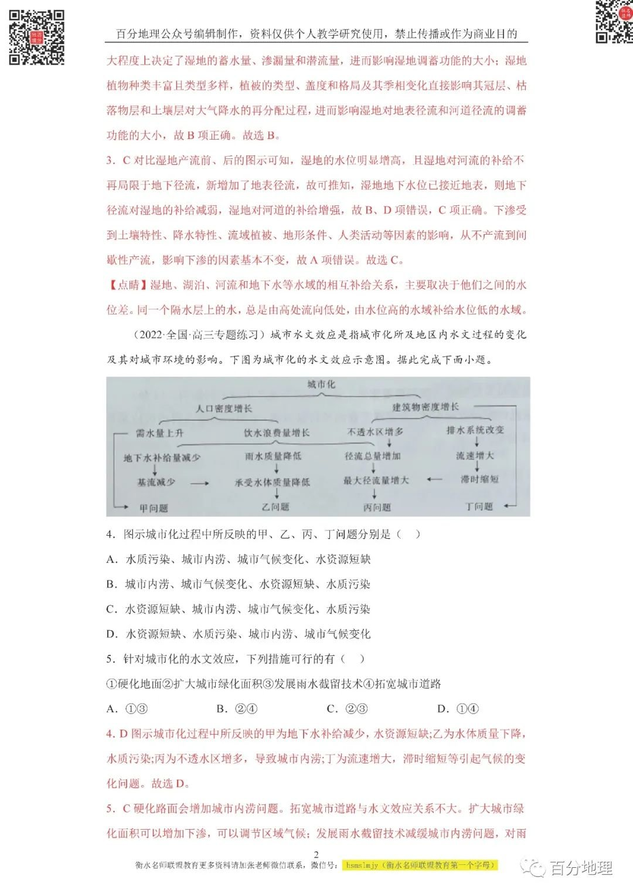   
   
   
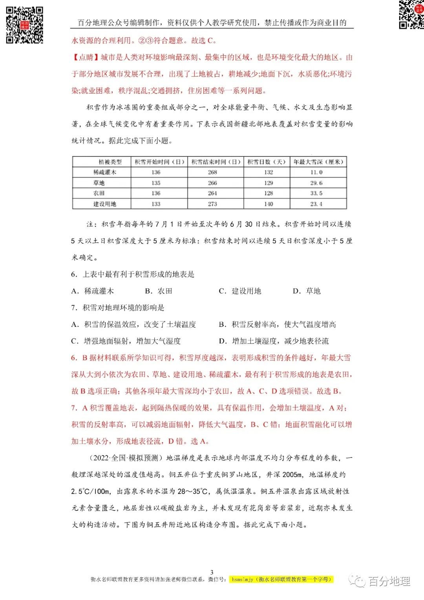   
   
   
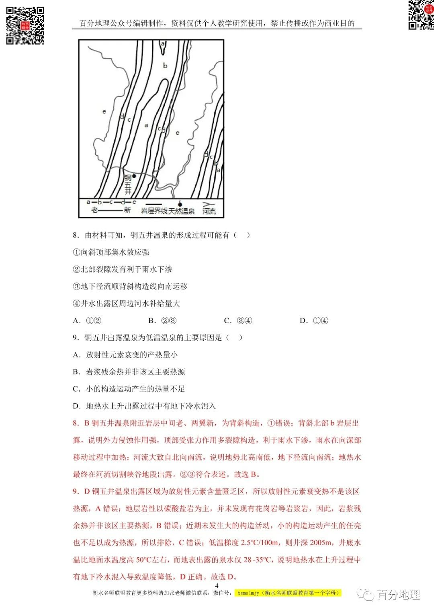   
   
   
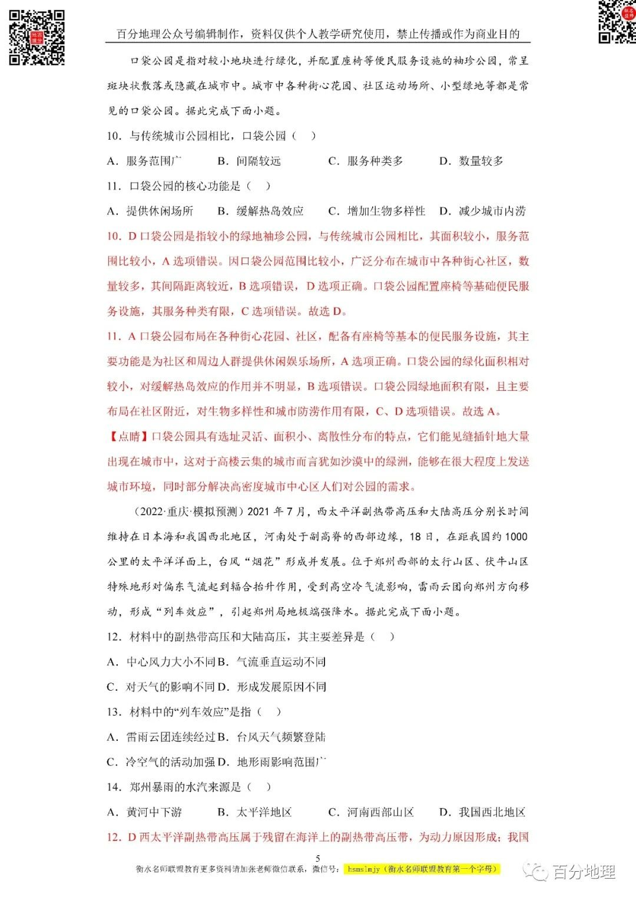   
   
   
   
   
   
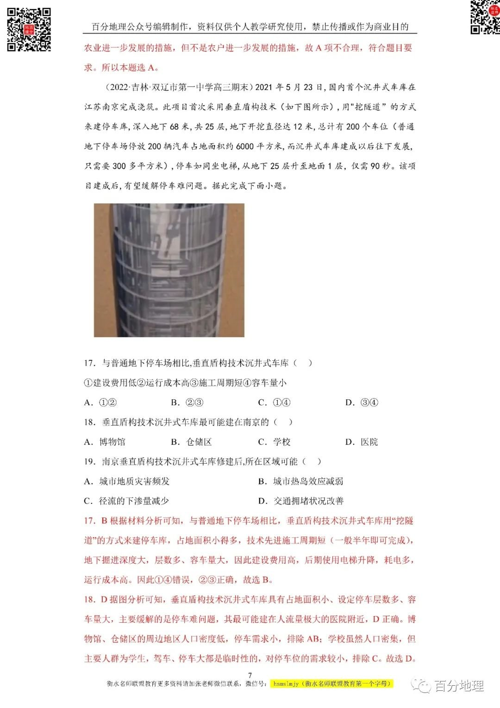   
   
   
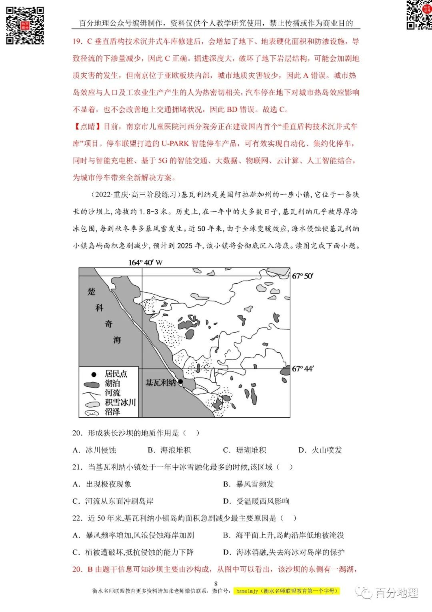   
   
   
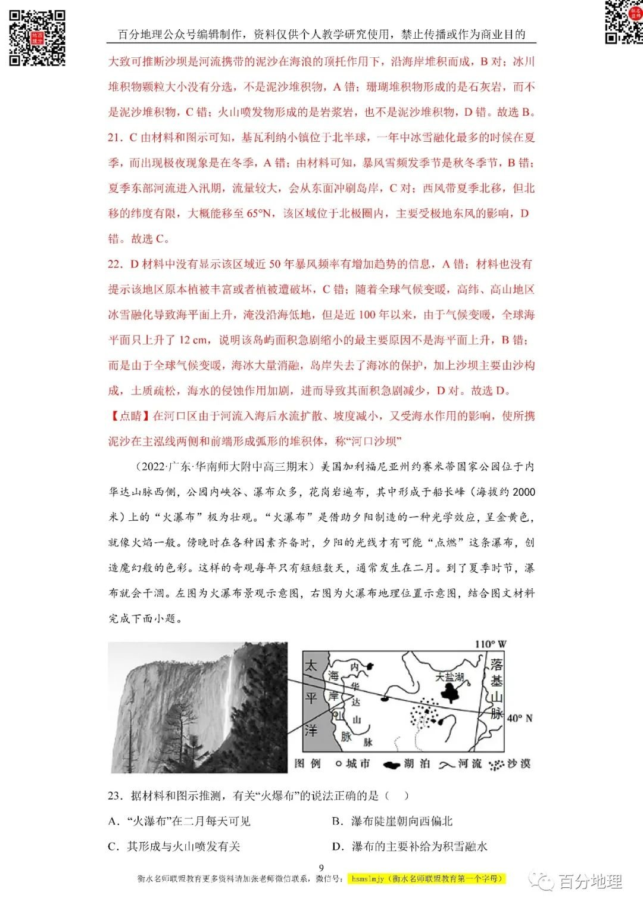   
   
   
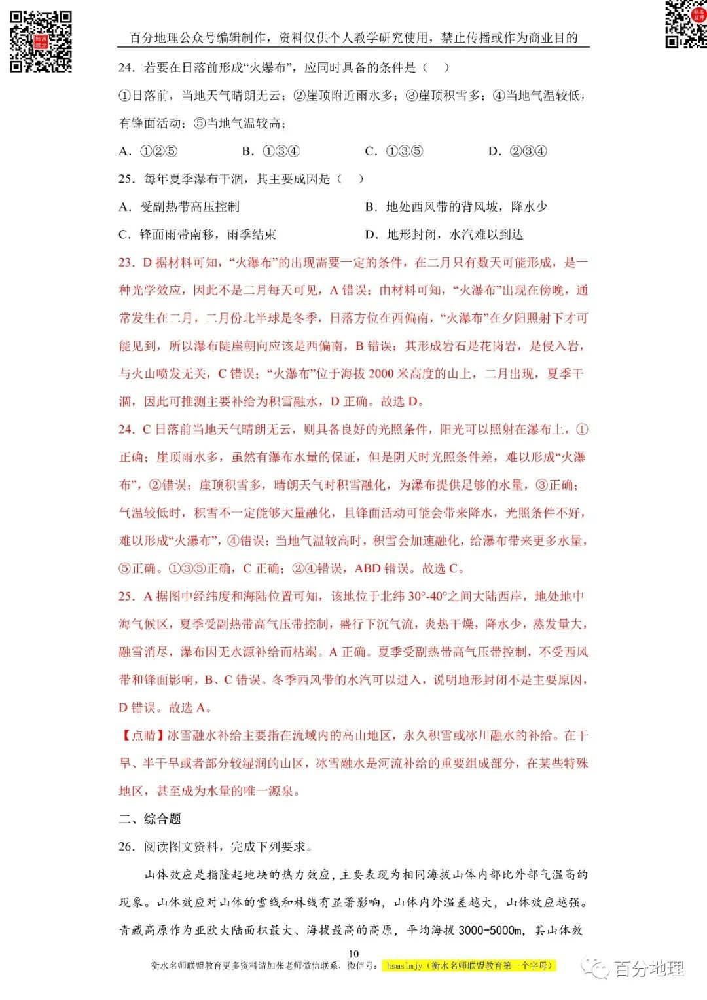   
   
   
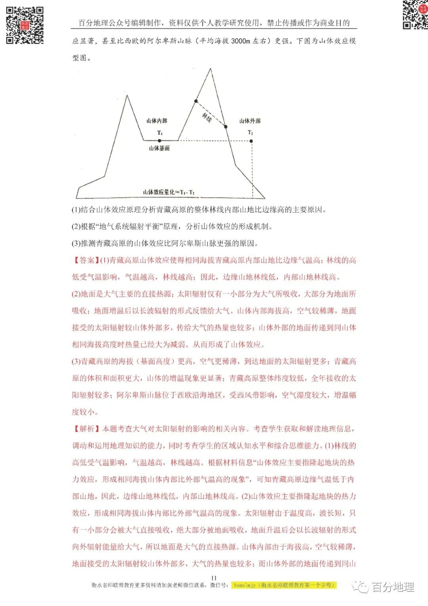   
   
   
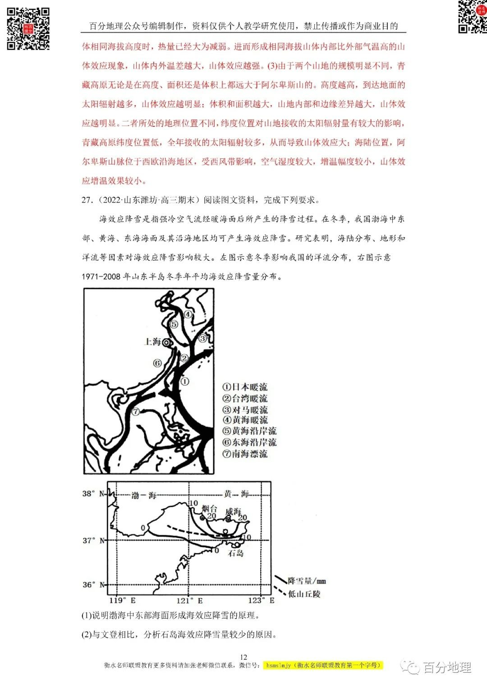   
   
   
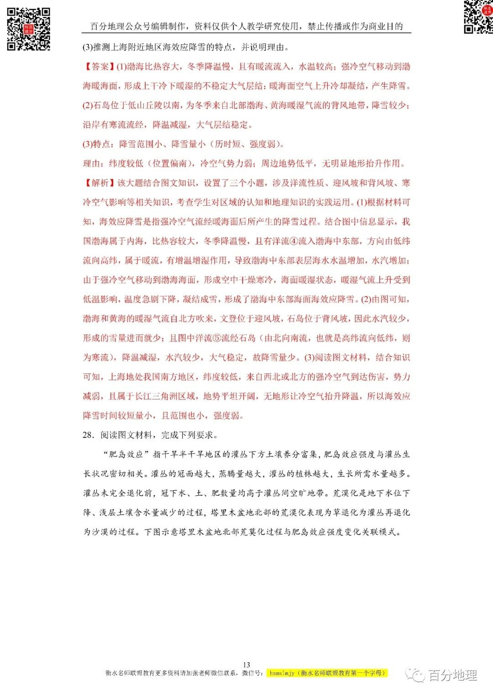   
   
   
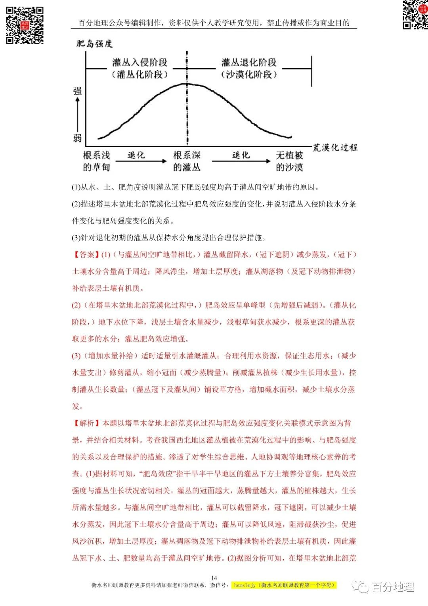   
   
   
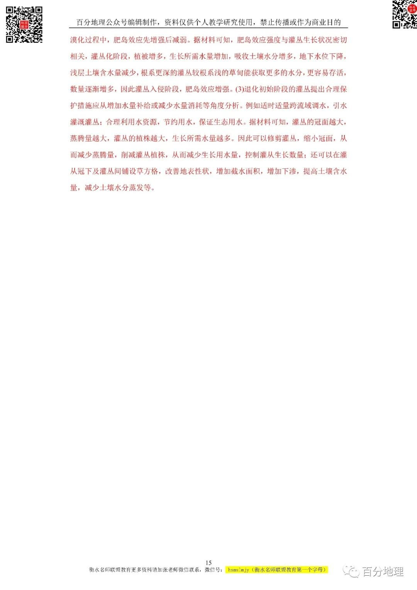   

