# 微专题之074 从产业结构角度分析区域发展

```
本专题摘自“百分地理”公众号，如有侵权请告之删除，谢谢。联系hhwxyhh@163.com
```

------
   
（2022·全国·模拟预测）天井见于中国各地的传统民居中，图1为徽州民居的基本平面布局示意图，天井布局随面宽方向呈长方形，伸到两过间的窗中线，长宽比约5：1。图2为某游客在宏村旅游时在某日17：30拍摄到的照片（从下往上拍摄）。据此完成问题。   
   
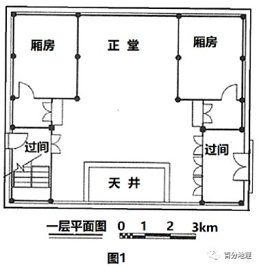   
   
   
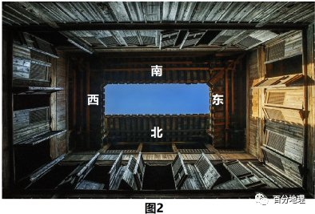   
   
1．该旅客拍摄此照片的节日最可能是（  ）   
A．元旦   
B．劳动节   
C．国庆节   
D．春节   
2．徽州民居中天井多5：1长宽尺度的原因是（  ）   
A．增加东西过间的直射光   
B．遮挡阳光直射东西过间   
C．利于阳光直射南北厅堂   
D．减少南北厅堂的直射光   
<span style="color: rgb(255, 0, 0);">1．B由材料可知，皖南宏村民居天井内正东侧过间有阳光入射，由此可判断此刻太阳位于正西方位，此时为北京时间17：30，可推知该日日落西北，太阳直射点位于北半球，时间为春分日至秋分日之间，B正确，ACD错误，所以选B</span>   
<span style="color: rgb(255, 0, 0);">2．D天井在传统民居建设中承担了采光的重任，但徽州地区纬度较低，正午太阳高度较大，所以设计天井时，也十分重视遮阳。徽州民居天井四周都挑檐，室内天井远离正堂，东西向宽、南北向断面窄，能够有效避免太阳光直射到南北厅堂内，D正确，C错误，目的是采光，但又能有效避免太阳光直射到南北厅堂内，不是为了增加东西过间的直射光和遮挡阳光直射东西过间，AB错误，所以选D。</span>   
<span style="color: rgb(255, 0, 0);">【点睛】北半球中纬度度地区，当太阳直射北半球时，太阳东北升，西北落，正午太阳在正南方向。</span>   
地表蒸散指地表土壤蒸发和植物蒸腾的总和，是土壤—植物—大气连续体系中水分运动的重要过程，是植物及农作物生长发育至关重要的水分和能量来源，是陆面生态系统与水文过程的重要纽带。下图为祁连山海拔2600～3800m内某流域不同地表实测蒸散对比和降水季节分配图。读图，据此完成下面小题。   
   
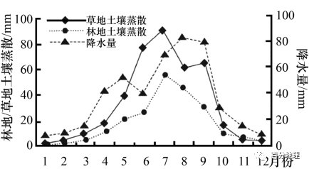   
   
3．该流域林地地表蒸散低于草地的主要原因是（  ）   
A．林地海拔低于草地   
B．林地温度低于草地   
C．林地降水少于草地   
D．林地风速大于草地   
4．影响该流域内8月草地地表蒸散相对较低的主要因素是（  ）   
A．地形   
B．坡向   
C．天气   
D．风速   
5．近年来我国加大了对祁连山各流域地表蒸散量的调查和研究工作，该数据最可能用于（  ）   
A．获取各流域内气象监测预报详实资料   
B．提取各流域内土壤肥力的变化数据   
C．掌握各流域内农田水利工程建设动态   
D．摸清各流域内水循环的动态变化状况   
<span style="color: rgb(255, 0, 0);">3．B地表蒸散是指地表土壤蒸发和植物蒸腾的总和，主要受气温的影响。气温高，蒸散大，气温低，蒸散小。相比而言，林地的生物量较草地更多，植被高大，林下光照较少，地温低，且林地对局地气温的调节更为明显，林地温度低于草地，所以林地地表蒸散低于草地，B正确。海拔低，气温高，则地表蒸散可能更大，A错。林地水分较草地更多，其降水不会少于草地，C错。林地摩擦力更大，风速更小，D错。故选B。</span>   
<span style="color: rgb(255, 0, 0);">4．C读图可知，该流域8月份降水多，阴雨天气多，气温相对较低，光照时间短，从而导致草地土壤在8月份蒸散相对较低，C正确。地形、坡向等无季节变化，AB错。图示信息无法直接反映8月风速的大小，排除D。故选C。</span>   
<span style="color: rgb(255, 0, 0);">5．D蒸散量对研究森林、草地、农田、荒漠、湿地等生态系统水量平衡的关键参数之一，由此可知，蒸散量主要与水循环和水平衡关系大，故加大了对祁连山各流域地表蒸散量的调查和研究工作，获取各流域内气象监测数据，最可能用于摸清各流域内水循环的动态变化状况，D正确。气象监测的蒸散量只是各流域内气象监测预报详实资料之一，并不能为各流域内气象监测预报提供全面的详实资料，A错误。土壤肥力和水利工程建设与地表的蒸散量关系小，可排除BC。故选D。</span>   
<span style="color: rgb(255, 0, 0);">【点睛】影响水蒸发的主要因素有：温度（水温）、天气、风速、海拔高度等。一般而言，温度越高蒸发量越大；天气晴朗、日照充足蒸发量大；风速大蒸发量大；海拔越高气温越低，蒸发较弱。</span>   
森林在改善生态环境和缓解气候变化方面发挥着重要作用。随着黄土高原的植被恢复，造林区域的地表温度及地表反照率（反射太阳辐射与入射太阳辐射的比值）、蒸散发量（地面上植物的蒸腾与植株间土壤蒸发量之和）均发生了变化。图为“造林在不同季节对白天和夜间地表温度的影响示意图”，图为“造林在不同季节对反照率和蒸散发的影响示意图”，图中数值均是与造林前相比的变化。据此完成下面小题。   
   
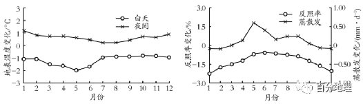   
   
6．该区域造林前后地表温度变化最明显的季节是（  ）   
A．春夏季   
B．夏秋季   
C．秋冬季   
D．冬春季   
7．造林后，年均地表温度的变化及原因是（  ）   
A．由白天地表温度变化主导，表现为升温   
B．由白天地表温度变化主导，表现为降温   
C．由夜晚地表温度变化主导，表现为升温   
D．由夜晚地表温度变化主导，表现为降温   
8．造林区域地表温度变化的根本原因是（  ）   
A．反照率变化使白天地表强烈降温   
B．蒸散发变化使夜间地表强烈增温   
C．温度变化与反照率和蒸散发呈正相关   
D．蒸散发对地表温度的影响强于反照率   
<span style="color: rgb(255, 0, 0);">6．A森林是植物分布很密集的区域，各种植物群落覆盖着地球上一个很大的面积，对气候调节起着重要的作用。结合材料，造林会导致区域地表温度降温，黄土高原造林区为温带季风气候区，植被为落叶阔叶林，而植被的生长主要在春季和夏季，该时期的蒸散发作用对造林区域温度下降发挥着重要的作用：反照率减少导致该区域变暖，蒸腾更多的水分，从而在生长季持续降温，A正确。故选A。</span>   
<span style="color: rgb(255, 0, 0);">7．B森林恢复后光合作用增强，可以吸收大气二氧化碳，减缓温室效应；森林的反照率低，吸收更多的太阳辐射，把太阳能转化为生物能储存起来：森林恢复后，森林的蒸散发对地表有降温作用，致使地表温度降低。读造林在不同季节对白天和夜间地表温度的影响示意图可知，造林区地表白天温度 变化为负值，说明黄土高原造成林区域地表温度表现为降温，因此，造林后，年地表温度变化由白天地表温度变化主导，表现为降温。B正确。故选B。</span>   
<span style="color: rgb(255, 0, 0);">8．D本题主要考查造林区域地表温度变化的根本原因，需要结合“造林在不同季节对白天和夜间地表温度的影响示意图”和“造林在不同季节对反照率和蒸散发的影响示意图” 进行分析。结合图示，造林区地表白天温度变化为负值，说明黄土高原造成林区域地表温度表现为降温，造林可促进蒸散发，致使地表温度降低，再结合图示中返照率变化为负，而蒸散发变化为正，说明图示中森林覆盖增加后蒸散发增加造成的降温作用强于反照率减小造成的增温的作用。D正确，ABC错误。故选D。</span>   
<span style="color: rgb(255, 0, 0);">【点睛】春季、秋冬季造林主要适用阔叶树种和经济林树种，雨季造林主要适用于荒山栽植油松、侧柏等针叶树种和部分阔叶树种。造林是季节性很强的一项工作，为了能取得多快好省的效果，应该选择最合适的造林季节。何时造林最合适，应根据各地区的气候。</span>   
（2022·辽宁·高三期末）流域湿地水文调蓄功能是指流域湿地对水文过程的累计影响效应，以水循环为纽带，通过影响流域蒸散发、入渗、地表径流、地下径流和河道径流等方式改变流域水文过程的能力。下图示意湿地水文调蓄功能的变化过程。据此完成下面小题。   
   
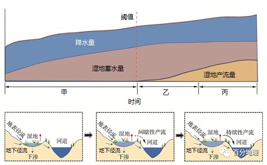   
   
9．图示湿地蓄水功能由强到弱的变化过程是（  ）   
A．甲一乙一丙   
B．乙一丙一甲   
C．丙—乙一甲   
D．甲一丙—乙   
10．影响湿地蓄水功能的主要内在因素是（  ）   
A．流域降水量和蒸发量   
B．湿地土壤质地和植被特征   
C．地下径流和地表径流   
D．湿地产流量和河流径流量   
11．当湿地出现间歇性产流时（  ）   
A．湿地水分下渗量不断增大   
B．地下径流对湿地的补给增强   
C．湿地地下水位接近地表   
D．湿地对河道的补给作用减弱   
<span style="color: rgb(255, 0, 0);">9．A读图可知，湿地的蓄水量由甲到乙再到丙，不断减少，故其蓄水功能由强到弱的变化过程是甲→乙→丙，故A项正确，B、C、D项错误。故选A。</span>   
<span style="color: rgb(255, 0, 0);">10．B流域湿地水文调蓄功能的影响因素可分为内在因素和外在因素，内在因素主要有湿地土壤特性、植被特征和初始水文条件等；外在因素主要有流域特征、降雨特征与气候变化及人类活动等。题干要求是影响湿地蓄水功能的主要内在因素，即主要从湿地的自身来进行分析。区域的降水量、蒸发量、径流都属于外在因素，故A、C、D项错误。土壤的质地、结构和孔隙度的大小决定了湿地土壤的透水性、持水性和排水能力，在很大程度上决定了湿地的蓄水量、渗漏量和潜流量，进而影响湿地调蓄功能的大小；湿地植物种类丰富且类型多样，植被的类型、盖度和格局及其季相变化直接影响其冠层、枯落物层和土壤层对大气降水的再分配过程，进而影响湿地对地表径流和河道径流的调蓄功能的大小，故B项正确。故选B。</span>   
<span style="color: rgb(255, 0, 0);">11．C对比湿地产流前、后的图示可知，湿地的水位明显增高，且湿地对河流的补给不再局限于地下径流，新增加了地表径流，故可推知，湿地地下水位已接近地表，则地下径流对湿地的补给减弱，湿地对河道的补给增强，故B、D项错误，C项正确。下渗受到土壤特性、降水特性、流域植被、地形条件、人类活动等因素的影响，从不产流到间歇性产流，影响下渗的因素基本不变，故A项错误。故选C。</span>   
<span style="color: rgb(255, 0, 0);">【点睛】湿地、湖泊、河流和地下水等水域的相互补给关系，主要取决于他们之间的水位差。同一个隔水层上的水，总是由高处流向低处，由水位高的水域补给水位低的水域。</span>   
（2022·福建·模拟预测）干旱地区常发育深根系植被，其根系深达地下潜水面，可直接吸取地下水，这类植物被定义为地下水依赖型植物，也称“抽水机式植被”。据研究，这类植物在生长季的蒸散过程（水分由叶片蒸发过程）能引起浅层地下水位的周期性昼夜波动。下图为干旱区河岸带浅层地下水埋深的昼夜波动图。据此完成下面小题。   
   
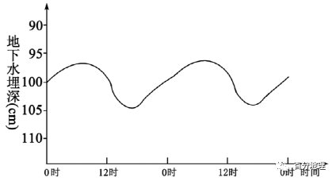   
   
12．夜间河岸带浅层地下水的主要流向为（  ）   
A．由地势高处流向低处   
B．由地势低处流向高处   
C．浅层地下水补给河水   
D．河水补给浅层地下水   
13．浅层地下水埋深昼夜波动幅度（  ）   
A．随河流流量变化幅度而增大   
B．随河流流向变化幅度而减小   
C．变幅随距离河岸变远而变小   
D．变幅随距离河岸变远而变大   
<span style="color: rgb(255, 0, 0);">12．D地下水和河流水具有相互补给的关系，根据图示，夜间河岸带的浅层地下水埋深较小，植物生命活动较弱，此时段主要是河水补给浅层地下水，使地下水位升高，C错误，D正确；河岸带地势落差小，地势对地下水流向的影响较弱，AB错误。故选D。</span>   
<span style="color: rgb(255, 0, 0);">13．C有材料可知，浅层地下水埋深昼夜波动幅度主要是因河岸带的“抽水机式植被”吸取地下水造成的。此类植物需要吸取地下水而存活，因此，该埋深昼夜波动幅度与该类植物的生命活动有关，并不是随河流流量和流向而变动，AB错误；一般而言，距离河岸越远，地下水越少，该类植物的分布越少，受其影响而形成的此类变化幅度越小。C正确，D错误。故选C。</span>   
<span style="color: rgb(255, 0, 0);">【点睛】影响地下水位高低的因素</span>   
<span style="color: rgb(255, 0, 0);">1、降雨量。降雨量越大，渗入地下的水量就越大，地下水越丰富。</span>   
<span style="color: rgb(255, 0, 0);">2、蒸发量。在干旱地区，浅层地下水也会因表层土壤水分的蒸发而损失。地下水位越深，影响越小。如果灌溉量过大，也会因此形成盐碱地。</span>   
<span style="color: rgb(255, 0, 0);">3、温度。在高寒和高纬度地区，当气温长时间低于0度时，表层地下水会凝固成冰，形成冻土。</span>   
蒸散发通常指地表土壤水分的蒸发和植物体内水分的蒸腾的总和。潜在蒸散发是指在区域供水条件十分充足条件下的区域蒸散发能力。下图是2000-2014年我国某省蒸散发、潜在蒸散发年内变化图，据此完成下面小题。   
   
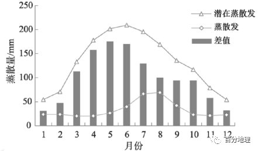   
   
14．据图推测该地区年内最干旱的时间是（  ）   
A．3-4月   
B．5-6月   
C．7-8月   
D．9-10月   
15．导致该地区7、8月蒸散发最大的根本原因是（  ）   
A．植被覆盖度高   
B．土壤含水率高   
C．日照时数增加   
D．降水多且集中   
<span style="color: rgb(255, 0, 0);">14．B据图分析，该地区3-4月、5-6月、7-8月、9-10月中，5-6月潜在蒸散发与蒸散发的差值最大，原因可能是5-6月雨季尚未来临，晴天多，日照强，气温较高，潜在蒸散发大，而降水不足，蒸散发小，因而两者差值最大，气候最干旱，B正确，ACD错误；故选B。</span>   
<span style="color: rgb(255, 0, 0);">15．D依据材料信息，蒸散发通常指地表土壤水分的蒸发和植物体内水分的蒸腾的总和，该地区7、8月蒸散发最大，说明此时该区域供水条件较充足，7-8月应当是该地雨季，降水多且集中，导致7、8月实际蒸散量大，D正确；由以上分析可知，该地位于温带季风气候区，7、8月植被覆盖度、土壤含水率、日照时数与5、6、9等月份差异不是很大，不是导致该地区7、8月蒸散发最大的根本原因，D正确，ABC错误；故选D。</span>   
<span style="color: rgb(255, 0, 0);">【点睛】蒸散量：是土壤蒸发和植物蒸腾的总耗水量，蒸散量受以下三方面的因素制约：①大气的干燥程度、辐射条件及风力大小所综合决定的蒸发力。②土壤湿润程度和导水能力所决定的上壤供水状况。③植被状况，包括植物水分输导组织、叶片气孔数量与大小以及群体结构对湍流交换系数的影响等。</span>   
（2022·全国·高三专题练习）中国东部植被带南北跨越3个气候带，具备明显的热量梯度与水热组合梯度。植被地段的燕发和蒸腾统称为蒸散。植被蒸腾与蒸散的比值（T/ET）表征植被蒸腾对生态系统蒸散的贡献率，涉及植被蒸腾和蒸发两个过程，受环境因素及植被生物因素的共同影响。下图为中国东部南北样带森林生态系统不同纬度蒸腾与蒸散比值（T/ET）。据此完成下面小题。   
   
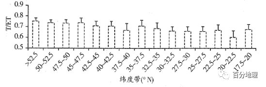   
   
16．依据图表，表述正确的是（  ）   
A．T/ET随纬度升高而逐渐增大   
B．T/ET随气候湿润度降低而增大   
C．T/ET随温度升高而逐渐变小   
D．蒸腾是蒸散耗水的主要途径   
17．造成南部T/ET偏低的原因可能是（  ）   
A．常绿林植被群落演替速度慢   
B．人类活动导致植被破坏   
C．林冠层截留蒸发比例较高   
D．吸纳储存水分的能力弱   
18．推测中国东部森林生态系统T/ET值南北空间差异较小的季节（  ）   
A．春季   
B．夏季   
C．秋季   
D．冬季   
<span style="color: rgb(255, 0, 0);">16．D据图可知，T/ET随纬度升高整体呈现增大的趋势，而不是逐渐增大，也有降低的，故A错。东北地区的东北部为湿润地区，而T/ET值高，故B错。T/ET值高受环境因素及植被生物因素的共同影响，不是温度单独决定，故C错。T/ET值处于0.6——0.8范围内，表明植被蒸腾是森林生态系统蒸散耗水的主要途径，故D正确。</span>   
<span style="color: rgb(255, 0, 0);">17．C南方常绿林水热条件好，植被生理活动旺盛，植被群落演替速度快，故A错。我国南方的植被覆盖率较高，并不是人类破坏植被导致的，故B错。南部林冠厚度大、结构复杂，吸纳储存水分的能力强，故D错。冠层截留蒸发量提高，削减了蒸腾对蒸散的贡献，故C正确。</span>   
<span style="color: rgb(255, 0, 0);">18．B受热量梯度与水热组合梯度影响，夏季，南北植被带生态系统均进入植被旺盛生长期，因此样带整体T/ET值较高，空间差异缩小。其他季节，北方落叶林开始进入落叶期，用于蒸騰的叶面积减少，植被生理活动减弱，但南方常绿林仍保持较高的蒸腾潜力，故B正确，ACD错。</span>   
<span style="color: rgb(255, 0, 0);">【点睛】蒸散包括了地表水分蒸发与植物体内水分的蒸腾。它是维持陆面水分平衡的重要组成部分，也是维持地表能量平衡的主要部分。</span>   
（2022·湖南·高三专题练习）地中蒸渗仪装置是一个较完美的降雨—径流—入渗—作物、地表蒸腾蒸发量（简称蒸散量）等水平衡要素相互转化的观测试验装置。我国部分地区依据地下水埋深和作物根系的一般特点，设计大型地中蒸渗仪装置，利用水量平衡原理，进行量化研究根系吸水层中的有效降水量。下图为地中蒸渗仪装置原理图，实验小组用该装置在一次降水过程中进行了测量，测得该次降雨量为P，蒸散量为E，量筒①的量为R，量筒②的量为D。读图，据此完成下列小题。   
   
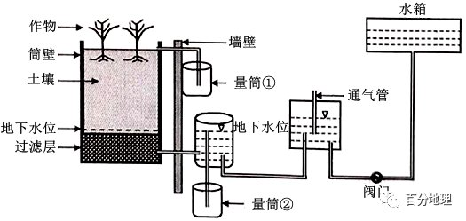   
   
19．该次实验测得的根系吸水层中的有效降水量为（  ）   
A．P R-E-DB．P-R-E-DC．P-R E-DD．P-R-D20．受该装置成本较高的影响，下列地区运用该装置效益最高的是（  ）   
A．海南三沙市   
B．珠江三角洲   
C．成都平原   
D．淮北平原   
<span style="color: rgb(255, 0, 0);">19．B据材料,量简①的量为地表径流量,量简②的量为地下径流量。所以,该次实验测得的根系吸水层中的有效降水量=P(降水量)－R（地表径流量)-E(蒸散量)-D(地下径流量)。B正确，ACD错误，故选B。</span>   
<span style="color: rgb(255, 0, 0);">20．D材料中说明,该装置是我国部分地区依据地下水埋深和作物根系的一般特点而设计,该装置成本不低,应当主要针对缺水地区的灌溉而设计,对于降水丰富的地区其价值不大,四个选项中，淮北相对缺水，D正确，故选D。</span>   
<span style="color: rgb(255, 0, 0);">【点睛】本题以实验形式考查不循环的知识及环节，解题的关键是根据材料与图形信息进行分析，根据水平衡原理得出：有效降水量=P(降水量)－R（地表径流量)-E(蒸散量)-D(地下径流量)。</span>   
地表蒸散是指地表土壤蒸发和植物蒸腾的总和。下图示意祁连山海拔2600—3800m内某流域不同地表实测蒸散对比和降水量逐月分配。据此完成下面小题。   
   
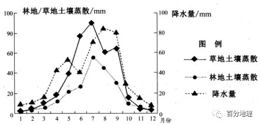   
   
21．据图可知地表蒸散量明显大于降水量的月份是（  ）   
A．4月   
B．7月   
C．10月   
D．12月   
22．12月～次年1月林地与草地蒸散量差异小是因为（  ）   
A．降雪较多   
B．草本枯萎   
C．林地落叶   
D．地表封冻   
<span style="color: rgb(255, 0, 0);">21．B读图可以看出，4月、10月、12月地表蒸散量明显小于降水量，ACD错误。7月份地表蒸散量明显大于降水量，B正确。故选B。</span>   
<span style="color: rgb(255, 0, 0);">22．D该地位于祁连山海拔2600—3800m内，12月～次年1月，气温低，地表封冻，林地与草地均被冰雪覆盖，蒸散量均很小，因此林地与草地蒸散量差异小，D正确。12月～次年1月该地降水量较小，说明降雪也较少，A错误。草本枯萎和林地落叶，地表裸露，会导致蒸散量大，与图示不符，BC错误。故选D。</span>   
<span style="color: rgb(255, 0, 0);">【点睛】结合材料，从材料中提取出有用的地理信息，再调动和运用所学知识进行分析，是正确解答本题的关键。</span>   
水以三种基本物质形态广泛存在于土壤－植被－大气连续体中。蒸散发(ET)是地表土壤水分的蒸发和植物体内水分的蒸腾的总和。潜在蒸散发(PET)是指在区域供水十分充足条件下的区域蒸散发能力，其变化直接影响着地区的水资源及生态状况。区域PET与ET的关系可以作为该地作物缺水及干旱的重要指标。山西省水资源严重缺乏、干旱频发，以蒸散发作为主要参数表征农业干旱的指标更能准确监测山西省实际情况。下表为ET、PET与气象因子相关系数，下图为2000-2014年山西省ET、PET年内变化。据此回答下面小题。   
<table cellspacing="0" cellpadding="0" width="577"><tbody><tr><td width="86" valign="bottom" style="padding: 3.75pt 6pt;border-width: 1pt;border-color: rgb(0, 0, 0);"><section style="margin-top: 0pt;margin-bottom: 0pt;margin-left: 0pt;font-size: 10.5pt;font-family: &quot;Times New Roman&quot;;text-align: left;text-indent: 21pt;line-height: 2em;"><span style="font-family: 楷体;">气象因子</span><span style="font-family: 楷体;"></span></section></td><td width="37" valign="bottom" style="padding: 3.75pt 6pt;border-width: 1pt;border-color: rgb(0, 0, 0);"></td><td width="51" valign="bottom" style="padding: 3.75pt 6pt;border-width: 1pt;border-color: rgb(0, 0, 0);"><section style="margin-top: 0pt;margin-bottom: 0pt;margin-left: 0pt;font-size: 10.5pt;font-family: &quot;Times New Roman&quot;;text-align: left;text-indent: 21pt;line-height: 2em;"><span style="font-family: 楷体;">降水</span><span style="font-family: 楷体;"></span></section></td><td width="58" valign="bottom" style="padding: 3.75pt 6pt;border-width: 1pt;border-color: rgb(0, 0, 0);"><section style="margin-top: 0pt;margin-bottom: 0pt;margin-left: 0pt;font-size: 10.5pt;font-family: &quot;Times New Roman&quot;;text-align: left;text-indent: 21pt;line-height: 2em;"><span style="font-family: 楷体;">风速</span><span style="font-family: 楷体;"></span></section></td><td width="44" valign="bottom" style="padding: 3.75pt 6pt;border-width: 1pt;border-color: rgb(0, 0, 0);"><section style="margin-top: 0pt;margin-bottom: 0pt;margin-left: 0pt;font-size: 10.5pt;font-family: &quot;Times New Roman&quot;;text-align: left;text-indent: 21pt;line-height: 2em;"><span style="font-family: 楷体;">气温</span><span style="font-family: 楷体;"></span></section></td><td width="58" valign="bottom" style="padding: 3.75pt 6pt;border-width: 1pt;border-color: rgb(0, 0, 0);"><section style="margin-top: 0pt;margin-bottom: 0pt;margin-left: 0pt;font-size: 10.5pt;font-family: &quot;Times New Roman&quot;;text-align: left;text-indent: 21pt;line-height: 2em;"><span style="font-family: 楷体;">水汽压</span><span style="font-family: 楷体;"></span></section></td><td width="72" valign="bottom" style="padding: 3.75pt 6pt;border-width: 1pt;border-color: rgb(0, 0, 0);"><section style="margin-top: 0pt;margin-bottom: 0pt;margin-left: 0pt;font-size: 10.5pt;font-family: &quot;Times New Roman&quot;;text-align: left;text-indent: 21pt;line-height: 2em;"><span style="font-family: 楷体;">相对湿度</span><span style="font-family: 楷体;"></span></section></td><td width="72" valign="bottom" style="padding: 3.75pt 6pt;border-width: 1pt;border-color: rgb(0, 0, 0);"><section style="margin-top: 0pt;margin-bottom: 0pt;margin-left: 0pt;font-size: 10.5pt;font-family: &quot;Times New Roman&quot;;text-align: left;text-indent: 21pt;line-height: 2em;"><span style="font-family: 楷体;">日照时数</span><span style="font-family: 楷体;"></span></section></td></tr><tr><td width="86" rowspan="2" valign="bottom" style="padding: 3.75pt 6pt;border-width: 1pt;border-color: rgb(0, 0, 0);"><section style="margin-top: 0pt;margin-bottom: 0pt;margin-left: 0pt;font-size: 10.5pt;font-family: &quot;Times New Roman&quot;;text-align: left;text-indent: 21pt;line-height: 2em;"><span style="font-family: 楷体;">空间相关性</span><span style="font-family: 楷体;"></span></section></td><td width="37" valign="bottom" style="padding: 3.75pt 6pt;border-width: 1pt;border-color: rgb(0, 0, 0);"><section style="margin-top: 0pt;margin-bottom: 0pt;margin-left: 0pt;font-size: 10.5pt;font-family: &quot;Times New Roman&quot;;text-align: left;text-indent: 21pt;line-height: 2em;"><span style="font-family: 楷体;">ET</span><span style="font-family: 楷体;"></span></section></td><td width="51" valign="bottom" style="padding: 3.75pt 6pt;border-width: 1pt;border-color: rgb(0, 0, 0);"><section style="margin-top: 0pt;margin-bottom: 0pt;margin-left: 0pt;font-size: 10.5pt;font-family: &quot;Times New Roman&quot;;text-align: left;text-indent: 21pt;line-height: 2em;"><span style="font-family: 楷体;">0.73</span><span style="font-family: 楷体;"></span></section></td><td width="58" valign="bottom" style="padding: 3.75pt 6pt;border-width: 1pt;border-color: rgb(0, 0, 0);"><section style="margin-top: 0pt;margin-bottom: 0pt;margin-left: 0pt;font-size: 10.5pt;font-family: &quot;Times New Roman&quot;;text-align: left;text-indent: 21pt;line-height: 2em;"><span style="font-family: 楷体;">0.23</span><span style="font-family: 楷体;"></span></section></td><td width="44" valign="bottom" style="padding: 3.75pt 6pt;border-width: 1pt;border-color: rgb(0, 0, 0);"><section style="margin-top: 0pt;margin-bottom: 0pt;margin-left: 0pt;font-size: 10.5pt;font-family: &quot;Times New Roman&quot;;text-align: left;text-indent: 21pt;line-height: 2em;"><span style="font-family: 楷体;">0.35</span><span style="font-family: 楷体;"></span></section></td><td width="58" valign="bottom" style="padding: 3.75pt 6pt;border-width: 1pt;border-color: rgb(0, 0, 0);"><section style="margin-top: 0pt;margin-bottom: 0pt;margin-left: 0pt;font-size: 10.5pt;font-family: &quot;Times New Roman&quot;;text-align: left;text-indent: 21pt;line-height: 2em;"><span style="font-family: 楷体;">0.39</span><span style="font-family: 楷体;"></span></section></td><td width="72" valign="bottom" style="padding: 3.75pt 6pt;border-width: 1pt;border-color: rgb(0, 0, 0);"><section style="margin-top: 0pt;margin-bottom: 0pt;margin-left: 0pt;font-size: 10.5pt;font-family: &quot;Times New Roman&quot;;text-align: left;text-indent: 21pt;line-height: 2em;"><span style="font-family: 楷体;">0.46</span><span style="font-family: 楷体;"></span></section></td><td width="72" valign="bottom" style="padding: 3.75pt 6pt;border-width: 1pt;border-color: rgb(0, 0, 0);"><section style="margin-top: 0pt;margin-bottom: 0pt;margin-left: 0pt;font-size: 10.5pt;font-family: &quot;Times New Roman&quot;;text-align: left;text-indent: 21pt;line-height: 2em;"><span style="font-family: 楷体;">-0.6</span><span style="font-family: 楷体;"></span></section></td></tr><tr><td width="37" valign="bottom" style="padding: 3.75pt 6pt;border-width: 1pt;border-color: rgb(0, 0, 0);"><section style="margin-top: 0pt;margin-bottom: 0pt;margin-left: 0pt;font-size: 10.5pt;font-family: &quot;Times New Roman&quot;;text-align: left;text-indent: 21pt;line-height: 2em;"><span style="font-family: 楷体;">PET</span><span style="font-family: 楷体;"></span></section></td><td width="51" valign="bottom" style="padding: 3.75pt 6pt;border-width: 1pt;border-color: rgb(0, 0, 0);"><section style="margin-top: 0pt;margin-bottom: 0pt;margin-left: 0pt;font-size: 10.5pt;font-family: &quot;Times New Roman&quot;;text-align: left;text-indent: 21pt;line-height: 2em;"><span style="font-family: 楷体;">-0.23</span><span style="font-family: 楷体;"></span></section></td><td width="58" valign="bottom" style="padding: 3.75pt 6pt;border-width: 1pt;border-color: rgb(0, 0, 0);"><section style="margin-top: 0pt;margin-bottom: 0pt;margin-left: 0pt;font-size: 10.5pt;font-family: &quot;Times New Roman&quot;;text-align: left;text-indent: 21pt;line-height: 2em;"><span style="font-family: 楷体;">-0.29</span><span style="font-family: 楷体;"></span></section></td><td width="44" valign="bottom" style="padding: 3.75pt 6pt;border-width: 1pt;border-color: rgb(0, 0, 0);"><section style="margin-top: 0pt;margin-bottom: 0pt;margin-left: 0pt;font-size: 10.5pt;font-family: &quot;Times New Roman&quot;;text-align: left;text-indent: 21pt;line-height: 2em;"><span style="font-family: 楷体;">0.57</span><span style="font-family: 楷体;"></span></section></td><td width="58" valign="bottom" style="padding: 3.75pt 6pt;border-width: 1pt;border-color: rgb(0, 0, 0);"><section style="margin-top: 0pt;margin-bottom: 0pt;margin-left: 0pt;font-size: 10.5pt;font-family: &quot;Times New Roman&quot;;text-align: left;text-indent: 21pt;line-height: 2em;"><span style="font-family: 楷体;">0.44</span><span style="font-family: 楷体;"></span></section></td><td width="72" valign="bottom" style="padding: 3.75pt 6pt;border-width: 1pt;border-color: rgb(0, 0, 0);"><section style="margin-top: 0pt;margin-bottom: 0pt;margin-left: 0pt;font-size: 10.5pt;font-family: &quot;Times New Roman&quot;;text-align: left;text-indent: 21pt;line-height: 2em;"><span style="font-family: 楷体;">-0.48</span><span style="font-family: 楷体;"></span></section></td><td width="72" valign="bottom" style="padding: 3.75pt 6pt;border-width: 1pt;border-color: rgb(0, 0, 0);"><section style="margin-top: 0pt;margin-bottom: 0pt;margin-left: 0pt;font-size: 10.5pt;font-family: &quot;Times New Roman&quot;;text-align: left;text-indent: 21pt;line-height: 2em;"><span style="font-family: 楷体;">-0.28</span><span style="font-family: 楷体;"></span></section></td></tr><tr><td width="86" rowspan="2" valign="bottom" style="padding: 3.75pt 6pt;border-width: 1pt;border-color: rgb(0, 0, 0);"><section style="margin-top: 0pt;margin-bottom: 0pt;margin-left: 0pt;font-size: 10.5pt;font-family: &quot;Times New Roman&quot;;text-align: left;text-indent: 21pt;line-height: 2em;"><span style="font-family: 楷体;">时间相关性</span><span style="font-family: 楷体;"></span></section></td><td width="37" valign="bottom" style="padding: 3.75pt 6pt;border-width: 1pt;border-color: rgb(0, 0, 0);"><section style="margin-top: 0pt;margin-bottom: 0pt;margin-left: 0pt;font-size: 10.5pt;font-family: &quot;Times New Roman&quot;;text-align: left;text-indent: 21pt;line-height: 2em;"><span style="font-family: 楷体;">ET</span><span style="font-family: 楷体;"></span></section></td><td width="51" valign="bottom" style="padding: 3.75pt 6pt;border-width: 1pt;border-color: rgb(0, 0, 0);"><section style="margin-top: 0pt;margin-bottom: 0pt;margin-left: 0pt;font-size: 10.5pt;font-family: &quot;Times New Roman&quot;;text-align: left;text-indent: 21pt;line-height: 2em;"><span style="font-family: 楷体;">0.81</span><span style="font-family: 楷体;"></span></section></td><td width="58" valign="bottom" style="padding: 3.75pt 6pt;border-width: 1pt;border-color: rgb(0, 0, 0);"><section style="margin-top: 0pt;margin-bottom: 0pt;margin-left: 0pt;font-size: 10.5pt;font-family: &quot;Times New Roman&quot;;text-align: left;text-indent: 21pt;line-height: 2em;"><span style="font-family: 楷体;">-0.64.</span><span style="font-family: 楷体;"></span></section></td><td width="44" valign="bottom" style="padding: 3.75pt 6pt;border-width: 1pt;border-color: rgb(0, 0, 0);"><section style="margin-top: 0pt;margin-bottom: 0pt;margin-left: 0pt;font-size: 10.5pt;font-family: &quot;Times New Roman&quot;;text-align: left;text-indent: 21pt;line-height: 2em;"><span style="font-family: 楷体;">0.45</span><span style="font-family: 楷体;"></span></section></td><td width="58" valign="bottom" style="padding: 3.75pt 6pt;border-width: 1pt;border-color: rgb(0, 0, 0);"><section style="margin-top: 0pt;margin-bottom: 0pt;margin-left: 0pt;font-size: 10.5pt;font-family: &quot;Times New Roman&quot;;text-align: left;text-indent: 21pt;line-height: 2em;"><span style="font-family: 楷体;">0.76</span><span style="font-family: 楷体;"></span></section></td><td width="72" valign="bottom" style="padding: 3.75pt 6pt;border-width: 1pt;border-color: rgb(0, 0, 0);"><section style="margin-top: 0pt;margin-bottom: 0pt;margin-left: 0pt;font-size: 10.5pt;font-family: &quot;Times New Roman&quot;;text-align: left;text-indent: 21pt;line-height: 2em;"><span style="font-family: 楷体;">0.8</span><span style="font-family: 楷体;"></span></section></td><td width="72" valign="bottom" style="padding: 3.75pt 6pt;border-width: 1pt;border-color: rgb(0, 0, 0);"><section style="margin-top: 0pt;margin-bottom: 0pt;margin-left: 0pt;font-size: 10.5pt;font-family: &quot;Times New Roman&quot;;text-align: left;text-indent: 21pt;line-height: 2em;"><span style="font-family: 楷体;">-0.18</span><span style="font-family: 楷体;"></span></section></td></tr><tr><td width="37" valign="bottom" style="padding: 3.75pt 6pt;border-width: 1pt;border-color: rgb(0, 0, 0);"><section style="margin-top: 0pt;margin-bottom: 0pt;margin-left: 0pt;font-size: 10.5pt;font-family: &quot;Times New Roman&quot;;text-align: left;text-indent: 21pt;line-height: 2em;"><span style="font-family: 楷体;">PET</span><span style="font-family: 楷体;"></span></section></td><td width="51" valign="bottom" style="padding: 3.75pt 6pt;border-width: 1pt;border-color: rgb(0, 0, 0);"><section style="margin-top: 0pt;margin-bottom: 0pt;margin-left: 0pt;font-size: 10.5pt;font-family: &quot;Times New Roman&quot;;text-align: left;text-indent: 21pt;line-height: 2em;"><span style="font-family: 楷体;">0.68</span><span style="font-family: 楷体;"></span></section></td><td width="58" valign="bottom" style="padding: 3.75pt 6pt;border-width: 1pt;border-color: rgb(0, 0, 0);"><section style="margin-top: 0pt;margin-bottom: 0pt;margin-left: 0pt;font-size: 10.5pt;font-family: &quot;Times New Roman&quot;;text-align: left;text-indent: 21pt;line-height: 2em;"><span style="font-family: 楷体;">0.4</span><span style="font-family: 楷体;"></span></section></td><td width="44" valign="bottom" style="padding: 3.75pt 6pt;border-width: 1pt;border-color: rgb(0, 0, 0);"><section style="margin-top: 0pt;margin-bottom: 0pt;margin-left: 0pt;font-size: 10.5pt;font-family: &quot;Times New Roman&quot;;text-align: left;text-indent: 21pt;line-height: 2em;"><span style="font-family: 楷体;">0.93</span><span style="font-family: 楷体;"></span></section></td><td width="58" valign="bottom" style="padding: 3.75pt 6pt;border-width: 1pt;border-color: rgb(0, 0, 0);"><section style="margin-top: 0pt;margin-bottom: 0pt;margin-left: 0pt;font-size: 10.5pt;font-family: &quot;Times New Roman&quot;;text-align: left;text-indent: 21pt;line-height: 2em;"><span style="font-family: 楷体;">0.74</span><span style="font-family: 楷体;"></span></section></td><td width="72" valign="bottom" style="padding: 3.75pt 6pt;border-width: 1pt;border-color: rgb(0, 0, 0);"><section style="margin-top: 0pt;margin-bottom: 0pt;margin-left: 0pt;font-size: 10.5pt;font-family: &quot;Times New Roman&quot;;text-align: left;text-indent: 21pt;line-height: 2em;"><span style="font-family: 楷体;">-0.04</span><span style="font-family: 楷体;"></span></section></td><td width="72" valign="bottom" style="padding: 3.75pt 6pt;border-width: 1pt;border-color: rgb(0, 0, 0);"><section style="margin-top: 0pt;margin-bottom: 0pt;margin-left: 0pt;font-size: 10.5pt;font-family: &quot;Times New Roman&quot;;text-align: left;text-indent: 21pt;line-height: 2em;"><span style="font-family: 楷体;">0.88</span><span style="font-family: 楷体;"></span></section></td></tr></tbody></table>

   
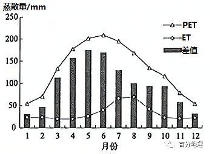   
   
23．有关ET、PET与气象因子相关系数的描述正确的是（  ）A．ET和PET的空间分布与气温、降水呈正相关关系   
B．ET和PET的时间分布与降水、日照时数呈正相关   
C．ET的空间分布往往会受风速的影响更大   
D．PET的时间分布受日照时数的影响更强   
24．山西省在5～6月ET和PET差值最大，其原因是（  ）   
A．气温回升，风速增大，植物返青   
B．气候干旱，降水少，地表水缺乏   
C．降水多，日照时数减少，蒸发弱   
D．农业灌溉引水，土壤水分蒸发大   
<span style="color: rgb(255, 0, 0);">23．D读图根据表格ET和PET的空间分布与气温呈正相关关系，ET与降水呈正相关，PET与降水呈负相关，故A错误；ET和PET的时间分布与降水呈正相关，ET与日照时间呈负相关，故B错误；与PET相比较。ET的空间分布往往会受降水的影响更大，故C错误；与ET相比较，PET的时间分布受日照时数、气温的影响更强，D正确，所以该题选D。</span>   
<span style="color: rgb(255, 0, 0);">24．B结合图可知，山西省在5～6月潜在蒸散发（PET）比蒸散发（ET）大很多，说明该时段，气候干旱，降水少，地表水缺乏，B正确；气温回升，植物返青是在开春时，即3、4月份，A错；此时段雨带还在我国南方，降水少，蒸发强，C错；山西省水资源缺乏，土壤水分蒸发小，D错，所以该题选B。</span>   
<span style="color: rgb(255, 0, 0);">【点睛】结合材料可知，蒸散发（ET）是地表土壤水分的蒸发和植物体内水分的蒸腾的总和。潜在蒸散发（PET）是指在区域供水十分充足条件下的区域蒸散发能力，其变化直接影响着地区的水资源及生态状况。区域 PET 与ET 的关系可以作为该地作物缺水及干旱的重要指标。</span>   
水分盈亏量为降水量和蒸发力(潜在蒸散量)的差。当水分盈亏量大于0时，水分有盈余，表示气候湿润；当其小于0时，水分处于亏缺状态，表示气候干燥；当其等于0时，表示水分收支平衡。量值大小反映水分盈亏程度及气候的干湿程度。某研究团队根据气象资料绘制了中国四大流域1961-2010年平均水分盈亏量月变化图(见下图)。此完成下面小题。   
   
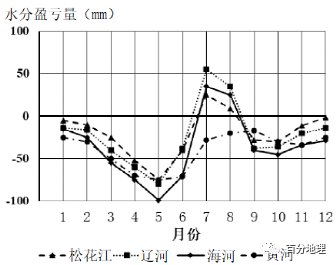   
   
25．图中水分盈亏量年变化最小的是   
A．黄河   
B．海河   
C．江河   
D．松花江   
26．不同月份各流域水分盈亏量存在一定的差异，其主要原因是   
A．植被覆盖度大小   
B．工农业用水差异   
C．厄尔尼诺现象影响   
D．锋面雨带的移动   
<span style="color: rgb(255, 0, 0);">25．A据材料可知，水分盈亏量为降水量和蒸发量的差，当水分盈亏量大于0时，水分有盈余，表示气候湿润，当其小于0时，水分处于亏缺状态，表示气候干燥，图中表示黄河的数值线全年都在0以下，黄河流域的年降水量最少，水分亏损最严重，年变化最小，故A正确。</span>   
<span style="color: rgb(255, 0, 0);">26．D由于水分盈亏量是由降水量和蒸发量决定的，而我国夏季降水量主要受雨带移动的影响，分布的规律是，3-5月在长江以南，6月在江淮流域，7-8月到华北和东北，9月返回到华南地区，所以四大流域在不同月份水分盈亏量存在一定的差异，是由锋面雨带移动造成的，故D正确。</span>   
潜在蒸散表示在一定气象条件下水分供应不受限制时，某一固定下垫面可能达到的最大蒸发蒸腾量。下图示意中、乙、丙.丁四地多年平均日降水和潜在蒸散分布。据此完成下面小题。   
   
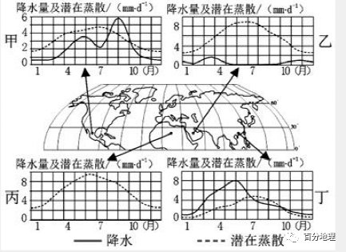   
   
27．图中四地，夏季潜在蒸散呈较大的主要原因是   
A．降水较少   
B．气温较高   
C．云量较多   
D．风速较小   
28．图中四地，年实际蒸发量最少的是   
A．甲   
B．乙   
C．丙   
D．丁   
29．丁地春季多雨的原因是   
A．热带气旋活跃   
B．空气对流旺盛   
C．东北信风控制   
D．锋面长时滞留   
<span style="color: rgb(255, 0, 0);">27．B读图可知，图中甲、乙、丙、丁四地都位于北回归线附近，纬度较低，夏季气温较高，所以潜在蒸散量都较大，B对；丁地为季风气候，夏季降水较多，A错；据图可以看出乙、丙两地夏季降水较少，云量较少，C错；风速较小不是主要原因，而且丁地为季风气候，夏季受夏季风影响、风力较大，D错。故本题选B。</span>   
<span style="color: rgb(255, 0, 0);">28．C读图可知，图中四地其夏季气温都较高，但是丙地属于热带沙漠气候，全年降水稀少，是四个地点中降水最少的，所以年实际蒸发量最少，C对，ABD错，故本题选C。</span>   
<span style="color: rgb(255, 0, 0);">29．D读图可知，丁地位于我国南部沿海地区，春季气温回升，来自低纬度海洋的暖气团与北方南下的冷气团相遇，形成锋面，春季锋面雨带在南部沿海地区滞留时间长，所以降水多，D对，影响丁地的热带气旋多发生在夏秋季节，A错；夏季气温最高空气对流旺盛，B错，丁地属于季风气候，受季风环流控制，不受东北信风影响，C错。故本题选D。</span>   
潜在蒸散发是指充分供水条件下的区域蒸散发能力。潜在蒸散发气候敏感系数是潜在蒸散发变化率与气象因子变化率之比。敏感系数为正表示潜在蒸散发随气象因子的增加而增加，敏感系数为负表示潜在蒸散发随气象因子的增加而减小，其绝对值越大表明对其影响越大。下图为潜在蒸散发对气象因子敏感系数的年内变化图。读图回答下列各题。   
   
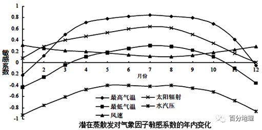   
   
30．下列关于潜在蒸散发对气象因子敏感系数的叙述不正确的是   
A．风速越大潜在蒸散发越强   
B．潜在蒸散发对最低气温最敏感的月份为7   
月   
C．水汽压越高潜在蒸散发越弱   
D．潜在蒸散发对太阳辐射的敏感系数12月份最小   
31．潜在蒸散发对气象因子的敏感性最强的是   
A．最高气温   
B．最低气温   
C．水汽压   
D．太阳辐射   
<span style="color: rgb(255, 0, 0);">30．B风速的敏感系数为正值，说明风速越大潜在蒸散发越强，A项说法正确；最低气温的敏感系数7月份为正值，一月份为负值，1月份敏感系数的绝对值大于7月份，所以最低气温最敏感的月份为1月份，B说法错误；水汽压的敏感系数为负值，说明水汽压越高潜在蒸散发越弱 ，C说法正确；太阳辐射的敏感系数在12月份最小值为0，最小，D说法正确。本题要求选择不正确选项，故选B。</span>   
<span style="color: rgb(255, 0, 0);">31．C比较各要素，水汽压的敏感指数绝对值最大，因此潜在蒸散发对气象因子的敏感性最强的是水汽压，C正确。故选C。</span>   
潜在蒸散量是指大片而均匀的自然表面在水体保持充分供应时的蒸发量，是由天气和气候条件决定的实际蒸发量的理论上限。若尔盖湿地位于青藏高原东部边缘，是中国特有的高原和高寒湿地生态系统的典型代表，是中国生物多样性关键地区之一。下表示意若尔盖湿地各季节潜在蒸散量（mm）的每十年平均值数据。据此完成下列问题。   
<table cellspacing="0" cellpadding="0" width="577"><tbody><tr><td width="44" valign="top" style="padding: 3.75pt 6pt;border-width: 1pt;border-color: rgb(0, 0, 0);"></td><td width="86" valign="top" style="padding: 3.75pt 6pt;border-top-width: 1pt;border-top-color: rgb(0, 0, 0);border-right-width: 1pt;border-right-color: rgb(0, 0, 0);border-bottom-width: 1pt;border-bottom-color: rgb(0, 0, 0);border-left: none;"><section style="margin-top: 0pt;margin-bottom: 0pt;margin-left: 0pt;text-indent: 0pt;font-size: 10.5pt;font-family: &quot;Times New Roman&quot;;text-align: left;line-height: 2em;">1971—1980</section></td><td width="86" valign="top" style="padding: 3.75pt 6pt;border-top-width: 1pt;border-top-color: rgb(0, 0, 0);border-right-width: 1pt;border-right-color: rgb(0, 0, 0);border-bottom-width: 1pt;border-bottom-color: rgb(0, 0, 0);border-left: none;"><section style="margin-top: 0pt;margin-bottom: 0pt;margin-left: 0pt;text-indent: 0pt;font-size: 10.5pt;font-family: &quot;Times New Roman&quot;;text-align: left;line-height: 2em;">1981—1990</section></td><td width="86" valign="top" style="padding: 3.75pt 6pt;border-top-width: 1pt;border-top-color: rgb(0, 0, 0);border-right-width: 1pt;border-right-color: rgb(0, 0, 0);border-bottom-width: 1pt;border-bottom-color: rgb(0, 0, 0);border-left: none;"><section style="margin-top: 0pt;margin-bottom: 0pt;margin-left: 0pt;text-indent: 0pt;font-size: 10.5pt;font-family: &quot;Times New Roman&quot;;text-align: left;line-height: 2em;">1991—2000</section></td><td width="86" valign="top" style="padding: 3.75pt 6pt;border-top-width: 1pt;border-top-color: rgb(0, 0, 0);border-right-width: 1pt;border-right-color: rgb(0, 0, 0);border-bottom-width: 1pt;border-bottom-color: rgb(0, 0, 0);border-left: none;"><section style="margin-top: 0pt;margin-bottom: 0pt;margin-left: 0pt;text-indent: 0pt;font-size: 10.5pt;font-family: &quot;Times New Roman&quot;;text-align: left;line-height: 2em;">2001—2010</section></td></tr><tr><td width="44" valign="top" style="padding: 3.75pt 6pt;border-top: none;border-right-width: 1pt;border-right-color: rgb(0, 0, 0);border-bottom-width: 1pt;border-bottom-color: rgb(0, 0, 0);border-left-width: 1pt;border-left-color: rgb(0, 0, 0);"><section style="margin-top: 0pt;margin-bottom: 0pt;margin-left: 0pt;text-indent: 0pt;font-size: 10.5pt;font-family: &quot;Times New Roman&quot;;text-align: left;line-height: 2em;"><span style="font-family: 宋体;">春季</span></section></td><td width="86" valign="top" style="padding: 3.75pt 6pt;border-top: none;border-right-width: 1pt;border-right-color: rgb(0, 0, 0);border-bottom-width: 1pt;border-bottom-color: rgb(0, 0, 0);border-left: none;"><section style="margin-top: 0pt;margin-bottom: 0pt;margin-left: 0pt;text-indent: 0pt;font-size: 10.5pt;font-family: &quot;Times New Roman&quot;;text-align: left;line-height: 2em;">229．0</section></td><td width="86" valign="top" style="padding: 3.75pt 6pt;border-top: none;border-right-width: 1pt;border-right-color: rgb(0, 0, 0);border-bottom-width: 1pt;border-bottom-color: rgb(0, 0, 0);border-left: none;"><section style="margin-top: 0pt;margin-bottom: 0pt;margin-left: 0pt;text-indent: 0pt;font-size: 10.5pt;font-family: &quot;Times New Roman&quot;;text-align: left;line-height: 2em;">220．5</section></td><td width="86" valign="top" style="padding: 3.75pt 6pt;border-top: none;border-right-width: 1pt;border-right-color: rgb(0, 0, 0);border-bottom-width: 1pt;border-bottom-color: rgb(0, 0, 0);border-left: none;"><section style="margin-top: 0pt;margin-bottom: 0pt;margin-left: 0pt;text-indent: 0pt;font-size: 10.5pt;font-family: &quot;Times New Roman&quot;;text-align: left;line-height: 2em;">225．4</section></td><td width="86" valign="top" style="padding: 3.75pt 6pt;border-top: none;border-right-width: 1pt;border-right-color: rgb(0, 0, 0);border-bottom-width: 1pt;border-bottom-color: rgb(0, 0, 0);border-left: none;"><section style="margin-top: 0pt;margin-bottom: 0pt;margin-left: 0pt;text-indent: 0pt;font-size: 10.5pt;font-family: &quot;Times New Roman&quot;;text-align: left;line-height: 2em;">233．4</section></td></tr><tr><td width="44" valign="top" style="padding: 3.75pt 6pt;border-top: none;border-right-width: 1pt;border-right-color: rgb(0, 0, 0);border-bottom-width: 1pt;border-bottom-color: rgb(0, 0, 0);border-left-width: 1pt;border-left-color: rgb(0, 0, 0);"><section style="margin-top: 0pt;margin-bottom: 0pt;margin-left: 0pt;text-indent: 0pt;font-size: 10.5pt;font-family: &quot;Times New Roman&quot;;text-align: left;line-height: 2em;"><span style="font-family: 宋体;">夏季</span></section></td><td width="86" valign="top" style="padding: 3.75pt 6pt;border-top: none;border-right-width: 1pt;border-right-color: rgb(0, 0, 0);border-bottom-width: 1pt;border-bottom-color: rgb(0, 0, 0);border-left: none;"><section style="margin-top: 0pt;margin-bottom: 0pt;margin-left: 0pt;text-indent: 0pt;font-size: 10.5pt;font-family: &quot;Times New Roman&quot;;text-align: left;line-height: 2em;">287．8</section></td><td width="86" valign="top" style="padding: 3.75pt 6pt;border-top: none;border-right-width: 1pt;border-right-color: rgb(0, 0, 0);border-bottom-width: 1pt;border-bottom-color: rgb(0, 0, 0);border-left: none;"><section style="margin-top: 0pt;margin-bottom: 0pt;margin-left: 0pt;text-indent: 0pt;font-size: 10.5pt;font-family: &quot;Times New Roman&quot;;text-align: left;line-height: 2em;">282．3</section></td><td width="86" valign="top" style="padding: 3.75pt 6pt;border-top: none;border-right-width: 1pt;border-right-color: rgb(0, 0, 0);border-bottom-width: 1pt;border-bottom-color: rgb(0, 0, 0);border-left: none;"><section style="margin-top: 0pt;margin-bottom: 0pt;margin-left: 0pt;text-indent: 0pt;font-size: 10.5pt;font-family: &quot;Times New Roman&quot;;text-align: left;line-height: 2em;">291．6</section></td><td width="86" valign="top" style="padding: 3.75pt 6pt;border-top: none;border-right-width: 1pt;border-right-color: rgb(0, 0, 0);border-bottom-width: 1pt;border-bottom-color: rgb(0, 0, 0);border-left: none;"><section style="margin-top: 0pt;margin-bottom: 0pt;margin-left: 0pt;text-indent: 0pt;font-size: 10.5pt;font-family: &quot;Times New Roman&quot;;text-align: left;line-height: 2em;">290．0</section></td></tr><tr><td width="44" valign="top" style="padding: 3.75pt 6pt;border-top: none;border-right-width: 1pt;border-right-color: rgb(0, 0, 0);border-bottom-width: 1pt;border-bottom-color: rgb(0, 0, 0);border-left-width: 1pt;border-left-color: rgb(0, 0, 0);"><section style="margin-top: 0pt;margin-bottom: 0pt;margin-left: 0pt;text-indent: 0pt;font-size: 10.5pt;font-family: &quot;Times New Roman&quot;;text-align: left;line-height: 2em;"><span style="font-family: 宋体;">秋季</span></section></td><td width="86" valign="top" style="padding: 3.75pt 6pt;border-top: none;border-right-width: 1pt;border-right-color: rgb(0, 0, 0);border-bottom-width: 1pt;border-bottom-color: rgb(0, 0, 0);border-left: none;"><section style="margin-top: 0pt;margin-bottom: 0pt;margin-left: 0pt;text-indent: 0pt;font-size: 10.5pt;font-family: &quot;Times New Roman&quot;;text-align: left;line-height: 2em;">144．8</section></td><td width="86" valign="top" style="padding: 3.75pt 6pt;border-top: none;border-right-width: 1pt;border-right-color: rgb(0, 0, 0);border-bottom-width: 1pt;border-bottom-color: rgb(0, 0, 0);border-left: none;"><section style="margin-top: 0pt;margin-bottom: 0pt;margin-left: 0pt;text-indent: 0pt;font-size: 10.5pt;font-family: &quot;Times New Roman&quot;;text-align: left;line-height: 2em;">145．4</section></td><td width="86" valign="top" style="padding: 3.75pt 6pt;border-top: none;border-right-width: 1pt;border-right-color: rgb(0, 0, 0);border-bottom-width: 1pt;border-bottom-color: rgb(0, 0, 0);border-left: none;"><section style="margin-top: 0pt;margin-bottom: 0pt;margin-left: 0pt;text-indent: 0pt;font-size: 10.5pt;font-family: &quot;Times New Roman&quot;;text-align: left;line-height: 2em;">150．2</section></td><td width="86" valign="top" style="padding: 3.75pt 6pt;border-top: none;border-right-width: 1pt;border-right-color: rgb(0, 0, 0);border-bottom-width: 1pt;border-bottom-color: rgb(0, 0, 0);border-left: none;"><section style="margin-top: 0pt;margin-bottom: 0pt;margin-left: 0pt;text-indent: 0pt;font-size: 10.5pt;font-family: &quot;Times New Roman&quot;;text-align: left;line-height: 2em;">156．4</section></td></tr><tr><td width="44" valign="top" style="padding: 3.75pt 6pt;border-top: none;border-right-width: 1pt;border-right-color: rgb(0, 0, 0);border-bottom-width: 1pt;border-bottom-color: rgb(0, 0, 0);border-left-width: 1pt;border-left-color: rgb(0, 0, 0);"><section style="margin-top: 0pt;margin-bottom: 0pt;margin-left: 0pt;text-indent: 0pt;font-size: 10.5pt;font-family: &quot;Times New Roman&quot;;text-align: left;line-height: 2em;"><span style="font-family: 宋体;">冬季</span></section></td><td width="86" valign="top" style="padding: 3.75pt 6pt;border-top: none;border-right-width: 1pt;border-right-color: rgb(0, 0, 0);border-bottom-width: 1pt;border-bottom-color: rgb(0, 0, 0);border-left: none;"><section style="margin-top: 0pt;margin-bottom: 0pt;margin-left: 0pt;text-indent: 0pt;font-size: 10.5pt;font-family: &quot;Times New Roman&quot;;text-align: left;line-height: 2em;">97．1</section></td><td width="86" valign="top" style="padding: 3.75pt 6pt;border-top: none;border-right-width: 1pt;border-right-color: rgb(0, 0, 0);border-bottom-width: 1pt;border-bottom-color: rgb(0, 0, 0);border-left: none;"><section style="margin-top: 0pt;margin-bottom: 0pt;margin-left: 0pt;text-indent: 0pt;font-size: 10.5pt;font-family: &quot;Times New Roman&quot;;text-align: left;line-height: 2em;">97．2</section></td><td width="86" valign="top" style="padding: 3.75pt 6pt;border-top: none;border-right-width: 1pt;border-right-color: rgb(0, 0, 0);border-bottom-width: 1pt;border-bottom-color: rgb(0, 0, 0);border-left: none;"><section style="margin-top: 0pt;margin-bottom: 0pt;margin-left: 0pt;text-indent: 0pt;font-size: 10.5pt;font-family: &quot;Times New Roman&quot;;text-align: left;line-height: 2em;">91．3</section></td><td width="86" valign="top" style="padding: 3.75pt 6pt;border-top: none;border-right-width: 1pt;border-right-color: rgb(0, 0, 0);border-bottom-width: 1pt;border-bottom-color: rgb(0, 0, 0);border-left: none;"><section style="margin-top: 0pt;margin-bottom: 0pt;margin-left: 0pt;text-indent: 0pt;font-size: 10.5pt;font-family: &quot;Times New Roman&quot;;text-align: left;line-height: 2em;">101．0</section></td></tr></tbody></table>

32．若尔盖湿地潜在蒸散量A．四季均为波动上升   
B．冬季变化最稳定   
C．总量呈波动上升   
D．秋冬差值大于春夏   
33．若尔盖湿地潜在蒸散量的变化预示着该地   
A．地下水位上升   
B．降水量增加   
C．气温趋于下降   
D．生物多样性减少   
<span style="color: rgb(255, 0, 0);">32．C由表格可知若尔盖湿地潜在蒸散量季节变化显著，从春季到夏季逐渐上升，秋冬季逐渐减少，并非四季均波动上升，故排除选项A；1991～2010年间夏季潜在蒸散量变化只有1．6，最稳定，1991～2010年冬季潜在蒸散量变化为10．3，较为明显，故排除选项B；1971～2010年间春夏差值（大约为60左右）大于秋冬季差值（大约为50左右），故排除选项D；若尔盖湿地潜在蒸散量总量上呈现波动上升的趋势，2001～2010年上升趋势最为显著，故选项C正确。</span>   
<span style="color: rgb(255, 0, 0);">33．D由潜在蒸散量的含义可知，若尔盖湿地潜在蒸散量总量波动上升，说明该区域蒸发量增加，气候变暖趋势显著；由于气候变暖，年均温上升，蒸发量显著增加，地下水位下降，随着蒸发量的增加湿地的水源在减少，降水量趋于减少，生态环境趋于恶化，生物多样性减少，故选项D符合题意。</span>   
<span style="color: rgb(255, 0, 0);">考点：本题考查湿地资源的开发与保护。</span>   
二、综合题   
34．（2021·全国·高三专题练习）阅读图文资料，完成下列要求。   
研究表明：黄土高原造林区域地表温度的变化主要由白天地表温度变化主导而表现为降温。森林的反照率（反射太阳辐射与入射太阳总辐射的比值）通常低于草地和农田，造林能够吸收更多的太阳辐射，导致地表温度升高；但相较于草地和农田，森林具有较大的叶面积和表面粗糙度，并且森林生理活动消耗的水分更高，因此，造林可促进蒸散发（地面上植物的蒸腾与植株间土壤蒸发量之和），致使地表温度降低。下图（a）示意黄土高原造林在不同季节对白天和晚上地表温度的影响，（b）示意黄土高原造林在不同季节对反照率和蒸散发的影响。   
   
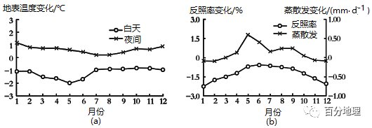   
   
(1)说出黄土高原造林区域地表温度表现为降温的依据。   
(2)黄土高原的造林对地表温度的影响具有季节性周期变化，整体上，春季和夏季的降温程度较大。分析造林地区春季和夏季的降温程度较大的原因。   
(3)从气温的角度，分析森林恢复对黄土高原气候变化的意义。   
<span style="color: rgb(255, 0, 0);">【答案】(1)造林地区地表温度的变化主要由白天地表温度变化为主导；森林覆盖增加后蒸散发增加造成的降温作用大于（强于、高于）反照率减小造成的增温的作用。</span>   
<span style="color: rgb(255, 0, 0);">(2)黄土高原为温带地区，植被的生长主要在春季和夏季，该时期的蒸散发作用对造林区域温度下降发挥着重要的作用；反照率减少导致该区域变暖，蒸腾更多的水分，从而在生长季持续降温。</span>   
<span style="color: rgb(255, 0, 0);">(3)森林恢复可以吸收大气二氧化碳，减缓温室效应；吸收更多的太阳辐射，把太阳能转化为生物能储存起来；森林恢复对地表有降温作用，在区域尺度上减缓了气候变暖的趋势。（</span>   
<span style="color: rgb(255, 0, 0);">【解析】本题以黄土高原造林后的作用为背景材料，综合考查了自然地理环境整体性的知识点。难度较大。考查学生获取和解读地理信息，调动和运用地理知识的能力，同时考查学生的区域认知水平和综合思维能力。突出考查学生的地理实践力和人地协调观的核心素养。(1)根据材料，“黄土高原造林区域地表温度的变化主要由白天地表温度变化主导而表现为降温”。再结合图示，造林区地表白天温度变化为负值，说明黄土高原造成林区域地表温度表现为降温。根据材料“森林的反照率低于草地和农田，会导致地表温度升高，而造林可促进蒸散发，致使地表温度降低”，再结合图示中返照率变化为负，而蒸散发变化为正，说明图示中森林覆盖增加后蒸散发增加造成的降温作用大于（强于、高于）反照率减小造成的增温的作用。所以说明黄土高原林区域地表温度表现为降温。(2)结合材料，造林会导致区域地表温度降温，黄土高原造林区为温带季风气候区，植被为落叶阔叶林，而植被的生长主要在春季和夏季，该时期的蒸散发作用对造林区域温度下降发挥着重要的作用；反照率减少导致该区域变暖，蒸腾更多的水分，从而在生长季持续降温。(3)根据材料和已学知识，森林恢复后光合作用增强，可以吸收大气二氧化碳，减缓温室效应；森林的反照率低，吸收更多的太阳辐射，把太阳能转化为生物能储存起来；森林恢复后，森林的蒸散发对地表有降温作用，致使地表温度降低，在区域尺度上减缓了气候变暖的趋势。</span>   
35．（2022·浙江·高三专题练习）阅读图文材料，完成下列要求。   
蒸散量是土壤蒸发和植物蒸腾的总耗水量，是农田水分平衡的重要组成部分。发源于天山南坡的阿克苏河，是塔里木河最重要的补给来源。流域上游山区是阿克苏河的产流区,下游平原绿洲为农业灌溉与生态耗水区,近年来，随着绿洲农业面积的扩大与气候变暖的影响，阿克苏河流域自然环境发生变化。   
   
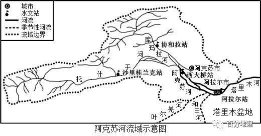   
   
阿克苏流域各水文站多年平均径流量年内分配（%）表   
<table cellspacing="0" cellpadding="0" width="577"><tbody><tr><td width="85" valign="middle" style="padding: 3.75pt 6pt;border-width: 1pt;border-color: rgb(0, 0, 0);"><section style="margin-top: 0pt;margin-bottom: 0pt;margin-left: 0pt;text-indent: 0pt;font-size: 10.5pt;font-family: &quot;Times New Roman&quot;;text-align: left;line-height: 2em;"><span style="font-family: 宋体;">水文站</span></section></td><td width="85" valign="middle" style="padding: 3.75pt 6pt;border-width: 1pt;border-color: rgb(0, 0, 0);"><section style="margin-top: 0pt;margin-bottom: 0pt;margin-left: 0pt;text-indent: 0pt;font-size: 10.5pt;font-family: &quot;Times New Roman&quot;;text-align: left;line-height: 2em;"><span style="font-family: 宋体;">春季（3—5月）</span></section></td><td width="85" valign="middle" style="padding: 3.75pt 6pt;border-width: 1pt;border-color: rgb(0, 0, 0);"><section style="margin-top: 0pt;margin-bottom: 0pt;margin-left: 0pt;text-indent: 0pt;font-size: 10.5pt;font-family: &quot;Times New Roman&quot;;text-align: left;line-height: 2em;"><span style="font-family: 宋体;">夏季（6—8月）</span></section></td><td width="85" valign="middle" style="padding: 3.75pt 6pt;border-width: 1pt;border-color: rgb(0, 0, 0);"><section style="margin-top: 0pt;margin-bottom: 0pt;margin-left: 0pt;text-indent: 0pt;font-size: 10.5pt;font-family: &quot;Times New Roman&quot;;text-align: left;line-height: 2em;"><span style="font-family: 宋体;">秋季（9—11月）</span></section></td><td width="85" valign="middle" style="padding: 3.75pt 6pt;border-width: 1pt;border-color: rgb(0, 0, 0);"><section style="margin-top: 0pt;margin-bottom: 0pt;margin-left: 0pt;text-indent: 0pt;font-size: 10.5pt;font-family: &quot;Times New Roman&quot;;text-align: left;line-height: 2em;"><span style="font-family: 宋体;">冬季（12—2月）</span></section></td></tr><tr><td width="85" valign="middle" style="padding: 3.75pt 6pt;border-width: 1pt;border-color: rgb(0, 0, 0);"><section style="margin-top: 0pt;margin-bottom: 0pt;margin-left: 0pt;text-indent: 0pt;font-size: 10.5pt;font-family: &quot;Times New Roman&quot;;text-align: left;line-height: 2em;"><span style="font-family: 宋体;">协和拉站</span></section></td><td width="85" valign="middle" style="padding: 3.75pt 6pt;border-width: 1pt;border-color: rgb(0, 0, 0);"><section style="margin-top: 0pt;margin-bottom: 0pt;margin-left: 0pt;text-indent: 0pt;font-size: 10.5pt;font-family: &quot;Times New Roman&quot;;text-align: left;line-height: 2em;">8.83</section></td><td width="85" valign="middle" style="padding: 3.75pt 6pt;border-width: 1pt;border-color: rgb(0, 0, 0);"><section style="margin-top: 0pt;margin-bottom: 0pt;margin-left: 0pt;text-indent: 0pt;font-size: 10.5pt;font-family: &quot;Times New Roman&quot;;text-align: left;line-height: 2em;">68.14</section></td><td width="85" valign="middle" style="padding: 3.75pt 6pt;border-width: 1pt;border-color: rgb(0, 0, 0);"><section style="margin-top: 0pt;margin-bottom: 0pt;margin-left: 0pt;text-indent: 0pt;font-size: 10.5pt;font-family: &quot;Times New Roman&quot;;text-align: left;line-height: 2em;">18.05</section></td><td width="85" valign="middle" style="padding: 3.75pt 6pt;border-width: 1pt;border-color: rgb(0, 0, 0);"><section style="margin-top: 0pt;margin-bottom: 0pt;margin-left: 0pt;text-indent: 0pt;font-size: 10.5pt;font-family: &quot;Times New Roman&quot;;text-align: left;line-height: 2em;">4.98</section></td></tr><tr><td width="85" valign="middle" style="padding: 3.75pt 6pt;border-width: 1pt;border-color: rgb(0, 0, 0);"><section style="margin-top: 0pt;margin-bottom: 0pt;margin-left: 0pt;text-indent: 0pt;font-size: 10.5pt;font-family: &quot;Times New Roman&quot;;text-align: left;line-height: 2em;"><span style="font-family: 宋体;">沙里桂兰站</span></section></td><td width="85" valign="middle" style="padding: 3.75pt 6pt;border-width: 1pt;border-color: rgb(0, 0, 0);"><section style="margin-top: 0pt;margin-bottom: 0pt;margin-left: 0pt;text-indent: 0pt;font-size: 10.5pt;font-family: &quot;Times New Roman&quot;;text-align: left;line-height: 2em;">17.70</section></td><td width="85" valign="middle" style="padding: 3.75pt 6pt;border-width: 1pt;border-color: rgb(0, 0, 0);"><section style="margin-top: 0pt;margin-bottom: 0pt;margin-left: 0pt;text-indent: 0pt;font-size: 10.5pt;font-family: &quot;Times New Roman&quot;;text-align: left;line-height: 2em;">60.12</section></td><td width="85" valign="middle" style="padding: 3.75pt 6pt;border-width: 1pt;border-color: rgb(0, 0, 0);"><section style="margin-top: 0pt;margin-bottom: 0pt;margin-left: 0pt;text-indent: 0pt;font-size: 10.5pt;font-family: &quot;Times New Roman&quot;;text-align: left;line-height: 2em;">17.17</section></td><td width="85" valign="middle" style="padding: 3.75pt 6pt;border-width: 1pt;border-color: rgb(0, 0, 0);"><section style="margin-top: 0pt;margin-bottom: 0pt;margin-left: 0pt;text-indent: 0pt;font-size: 10.5pt;font-family: &quot;Times New Roman&quot;;text-align: left;line-height: 2em;">4.92</section></td></tr><tr><td width="85" valign="middle" style="padding: 3.75pt 6pt;border-width: 1pt;border-color: rgb(0, 0, 0);"><section style="margin-top: 0pt;margin-bottom: 0pt;margin-left: 0pt;text-indent: 0pt;font-size: 10.5pt;font-family: &quot;Times New Roman&quot;;text-align: left;line-height: 2em;"><span style="font-family: 宋体;">西大桥站</span></section></td><td width="85" valign="middle" style="padding: 3.75pt 6pt;border-width: 1pt;border-color: rgb(0, 0, 0);"><section style="margin-top: 0pt;margin-bottom: 0pt;margin-left: 0pt;text-indent: 0pt;font-size: 10.5pt;font-family: &quot;Times New Roman&quot;;text-align: left;line-height: 2em;">9.57</section></td><td width="85" valign="middle" style="padding: 3.75pt 6pt;border-width: 1pt;border-color: rgb(0, 0, 0);"><section style="margin-top: 0pt;margin-bottom: 0pt;margin-left: 0pt;text-indent: 0pt;font-size: 10.5pt;font-family: &quot;Times New Roman&quot;;text-align: left;line-height: 2em;">56.36</section></td><td width="85" valign="middle" style="padding: 3.75pt 6pt;border-width: 1pt;border-color: rgb(0, 0, 0);"><section style="margin-top: 0pt;margin-bottom: 0pt;margin-left: 0pt;text-indent: 0pt;font-size: 10.5pt;font-family: &quot;Times New Roman&quot;;text-align: left;line-height: 2em;">19.52</section></td><td width="85" valign="middle" style="padding: 3.75pt 6pt;border-width: 1pt;border-color: rgb(0, 0, 0);"><section style="margin-top: 0pt;margin-bottom: 0pt;margin-left: 0pt;text-indent: 0pt;font-size: 10.5pt;font-family: &quot;Times New Roman&quot;;text-align: left;line-height: 2em;">10.92</section></td></tr><tr><td width="85" valign="middle" style="padding: 3.75pt 6pt;border-width: 1pt;border-color: rgb(0, 0, 0);"><section style="margin-top: 0pt;margin-bottom: 0pt;margin-left: 0pt;text-indent: 0pt;font-size: 10.5pt;font-family: &quot;Times New Roman&quot;;text-align: left;line-height: 2em;"><span style="font-family: 宋体;">阿拉尔站</span></section></td><td width="85" valign="middle" style="padding: 3.75pt 6pt;border-width: 1pt;border-color: rgb(0, 0, 0);"><section style="margin-top: 0pt;margin-bottom: 0pt;margin-left: 0pt;text-indent: 0pt;font-size: 10.5pt;font-family: &quot;Times New Roman&quot;;text-align: left;line-height: 2em;">5.91</section></td><td width="85" valign="middle" style="padding: 3.75pt 6pt;border-width: 1pt;border-color: rgb(0, 0, 0);"><section style="margin-top: 0pt;margin-bottom: 0pt;margin-left: 0pt;text-indent: 0pt;font-size: 10.5pt;font-family: &quot;Times New Roman&quot;;text-align: left;line-height: 2em;">64.74</section></td><td width="85" valign="middle" style="padding: 3.75pt 6pt;border-width: 1pt;border-color: rgb(0, 0, 0);"><section style="margin-top: 0pt;margin-bottom: 0pt;margin-left: 0pt;text-indent: 0pt;font-size: 10.5pt;font-family: &quot;Times New Roman&quot;;text-align: left;line-height: 2em;">19.26</section></td><td width="85" valign="middle" style="padding: 3.75pt 6pt;border-width: 1pt;border-color: rgb(0, 0, 0);"><section style="margin-top: 0pt;margin-bottom: 0pt;margin-left: 0pt;text-indent: 0pt;font-size: 10.5pt;font-family: &quot;Times New Roman&quot;;text-align: left;line-height: 2em;">12.13</section></td></tr></tbody></table>

（1）根据材料，归纳阿克苏河下游径流量季节变化特点，并说明原因。   
（2）近年来，阿克苏河洪水频率增加，推测其原因。   
（3）气候变暖之下，塔里木河下游绿洲区蒸散量不升反降，请从大气运动角度分析原因。   
（4）有人说，气候变暖最终会导致阿克苏河甚至塔里木河的枯竭，说明原因。   
<span style="color: rgb(255, 0, 0);">【答案】（1）径流量季节变化大；夏季径流量最多，春季径流量最少。（任选一点）</span>   
<span style="color: rgb(255, 0, 0);">原因：受高山冰雪融水补给与山地降水补给，夏季补给量较大；春季虽有季节性积雪融水补给，但农业用水量大，补给量少。（二点）</span>   
<span style="color: rgb(255, 0, 0);">（2）气候变暖，冰雪融水增多，融雪型洪灾增多；极端天气多发，暴雨频率提高。（二点）</span>   
<span style="color: rgb(255, 0, 0);">（3）绿洲地区比热容大，升温慢，气候变暖之下气温较周边沙漠地区低，空气下沉；周边沙漠快速升温，上空被加热的暖空气被输送至绿洲上空；形成上热下冷的逆温层；导致绿洲区域风速减少，气温降低，空气湿度增大，蒸散量下降。（任选三点）</span>   
<span style="color: rgb(255, 0, 0);">（4）气候变暖，蒸发加剧；长期冰川消融，导致冰川储量减少，最终枯竭；耕作条件改善，推动农业用水增多；（三点）</span>   
<span style="color: rgb(255, 0, 0);">【解析】本题以阿克苏流域为背景材料，考查河流径流量特点、成因，洪水灾害成因，蒸散量特点与成因解释以及气候变暖对河流的影响。（1）读阿克苏流域图，根据支流与干流呈锐角夹角可知，阿克苏河大体自西向东流；再读图表可知西大桥站和阿拉尔站位于河流下游；根据表格中的数据可知，阿克苏河下游径流量季节变化大；夏季径流量最多，春季径流量最少。原因：阿克苏河为内流河，主要受高山冰雪融水补给与山地降水补给，夏季补给量较大；春季虽有季节性积雪融水补给，但补给量少，再结合材料“下游平原绿洲为农业灌溉与生态耗水区”可知春季农业用水量大，故春季径流量最少。（2）材料“随着绿洲农业面积的扩大与气候变暖的影响，阿克苏河流域自然环境发生变化”可知气候变暖，导致冰雪融水增多，融雪型洪灾增多；还导致极端天气多发，暴雨频率提高。（3）大气运动主要是大气受热不均引起的运动。读材料“蒸散量是土壤蒸发和植物蒸腾的总耗水量”，可知绿洲地区地表的水源和植被较多，因此比热容大，升温慢，气候变暖之下气温较周边沙漠地区低，空气下沉；周边沙漠快速升温，上空被加热的暖空气被输送至绿洲上空；形成上热下冷的逆温层；逆温层大气稳定，导致绿洲区域风速减小，气温降低，空气湿度增大，因此抑制了地表蒸发和植被蒸腾作用，导致蒸散量下降。</span>   
<span style="color: rgb(255, 0, 0);">（4）气候变暖对河流的影响从水循环环节和过程，结合区域内用水状况分析。气候变暖，蒸发加剧，河流径流减少；长期冰川消融，导致冰川储量减少，最终枯竭，河流补给枯竭；耕作条件改善和耕作技术提高，推动农业用水增多等，最终导致阿克苏河甚至塔里木河的枯竭。</span>   
<span style="color: rgb(255, 0, 0);">【点睛】第1问正确判断阿克苏河的流向；第2问洪水类型包括多种类型；第3问是难点，明确绿洲和沙漠的区别，再结合大气水平和垂直运动分析；第4问从水循环环节和过程，结合区域内用水状况分析。</span>   
36．阅读图文资料，回答相关问题。   
无定河发源于陕西白于山区，经毛乌素沙漠及黄土沟壑区注入黄河。蒸散为生态系统中土壤蒸发、（植被）冠层蒸腾与冠层截留水蒸发之和。图甲是无定河流域示意图。图乙为无定河流域降雨、蒸散及其各分量月均值变化图。   
   
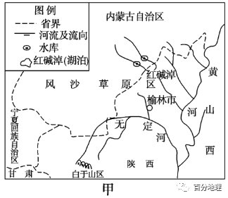   
   
   
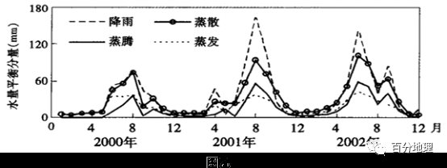   
   
（1）无定河流域在自然环境和土地利用方面具有明显的过渡性，据此说明无定河流域的降水特征和地貌特征。   
（2）推测无定河流域年蒸散量空间分布特征并分析其主要原因。   
（3）2002年8月的蒸散和蒸腾低于邻近两个月，分析其原因。   
（4）有人建议，利用工程措施恢复无定河流域植被，你是否赞同，并说明理由。   
<span style="color: rgb(255, 0, 0);">【答案】（1）降水特征:半湿润与半干旱的过渡地带，流域内降水年际变化大，降水集中夏季(或降水季节变化大)。</span>   
<span style="color: rgb(255, 0, 0);">地貌特征:黄土高原与内蒙古高原的过渡地带，流域内水土流失严重；</span>   
<span style="color: rgb(255, 0, 0);">（2）分布特征:由南向北,由东到西递减(或由东南向西北递减)。</span>   
<span style="color: rgb(255, 0, 0);">原因:无定河流域东南地区隆水较多,植被盖度高(或自然植被和农作物长势较好)；土壤含水量多，土壤蒸发量大，蒸散量高；西北地区降水少，植被类型主要为草地和荒漠,土壤蒸发量小，蒸散量低。</span>   
<span style="color: rgb(255, 0, 0);">（3）当月的降水较邻近月份要小，导致土壤水分不足，植被覆盖度低(或植被生长状况较差)，蒸腾蒸发受到限制。</span>   
<span style="color: rgb(255, 0, 0);">（4）赞成。利用工程措施可拦截坡面径流；可提高植被的成活率，增大植被覆盖率；减少水土流失，保持水土，涵养水源。</span>   
<span style="color: rgb(255, 0, 0);">不赞成。该地区生态环境脆弱，利用工程措施会破坏原有生态环境，在短期内更容易造成水土流失。(改卷说明:只答赞成或不赞成，都不给分，原因言之有理，合理答案也给分)</span>   
<span style="color: rgb(255, 0, 0);">【解析】（1）据图甲并结合资料可知，无定河发源于陕西白于山区，经毛乌素沙漠及黄土沟壑区注入黄河。结合我国的干湿状况可知，该流域属于我国半湿润与半干旱的过渡地带；据图乙分析可知，流域内降水年际变化大，且降水集中夏季。据图甲并结合我国的地形分布可知，该流域地处黄土高原与内蒙古高原的过渡地带，流域内水土流失严重；气候类型和植被对应，该地处于森林与草原、荒漠的过渡地带，农业生产方面从农耕区过度到牧区。（2）无定河流域年蒸散量空间分布特征应为由南向北、由东到西递减或由东南向西北递减。依据：据材料可知，蒸散是指生态系统中土壤蒸发、 (植被)冠层蒸腾与冠层截留水蒸发之和。据上题的分析可知，该流域地处半湿润和半干旱的过渡地带，我国降水的特点是从东南沿海向西北内陆递减。无定河流域东南地区降水量较多，植被覆盖度高，土壤含水量多，土壤蒸发量大，蒸散量高；而西北地区降水少，植被类型主要为草地和荒漠，土壤蒸发量小，因此蒸散量低。所以无定河流域年蒸散量由东南向西北递减。（3）据材料可知，地表蒸散是指地表土壤蒸发和植物蒸腾的总和，是土壤一植物一大连续体系中水分运动的重要过程。据图乙可知，2002年8月份该月的降水量较邻近月份要小，故蒸散量小；该月的降水量少，导致土壤水分不足，植被覆盖度低，因此蒸腾蒸发受到限制，蒸腾值也小。（4）该题为开放性试题，言之有理即可。赞同应从建成后植被的作用角度分析，强调工程对植被的有利作用及植被存活后的环境价值。具体而言，利用工程措施可拦截坡面径流，可提高植被的成活率，增大植被覆盖率；减少水土流失，保持水土，涵养水源。不赞成应从工程本身的建设带来的负面影响方面分析，该地区处于多种地理要素的过渡位置，生态环境脆弱，利用工程措施会破坏原有生态环境，在短期内更容易造成水土流失。</span>   
<span style="color: rgb(255, 0, 0);">【点睛】自然地理要素(大气、水、岩石、生物、土壤、地形等)通过水循环、生物循环和岩石圈物质循环等过程,进行物质迁移和能量交换,形成一个互相渗透、 互相制约和相互联系的整体,使自然地理要素的性质保持稳定的能力,通过物质和能量交换来实现。</span>
