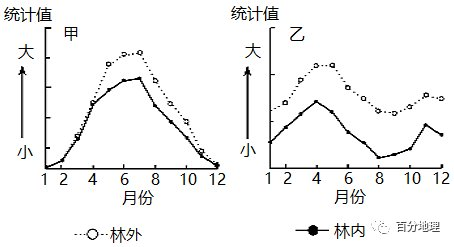
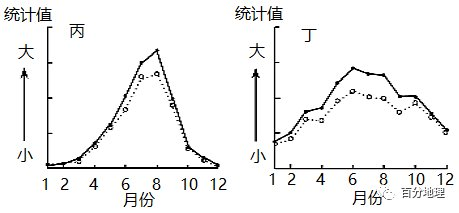
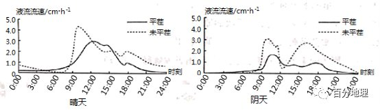
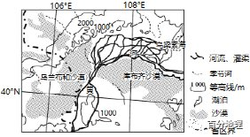
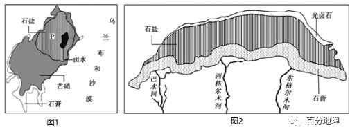
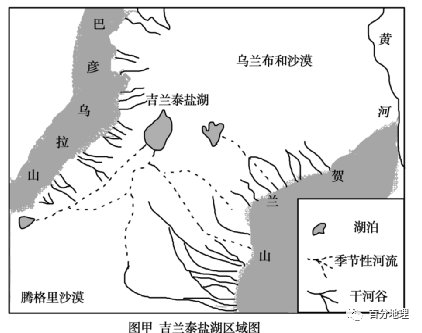
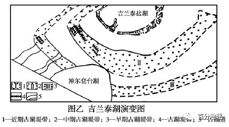
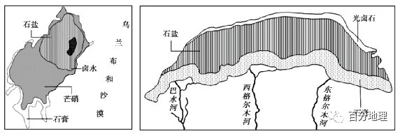
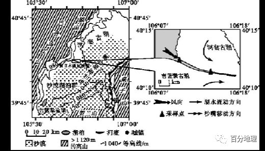

# 微专题之074 从产业结构角度分析区域发展

```
本专题摘自“百分地理”公众号，如有侵权请告之删除，谢谢。联系hhwxyhh@163.com
```

------
   
1．（2022·浙江·高三专题练习）某科研小组，对内蒙古乌兰布和沙漠中一绿洲防护林[（40°N，106°E）附近]进行小气候研究。该绿洲防护林外为固定和半固定沙丘，植被较少；防护林内地势平坦，建有完整的农田及防护林网。下图为该小组绘制的防护林内外风速、降水量、蒸发量、相对湿度年内变化统计图。完成问题。   
   
   
   
   
   
   
甲、乙、丙、丁四图表示的气象要素分别是（  ）   
A．甲——降水量   
乙——相对湿度   
丙——蒸发量   
丁——风速   
B．甲——风速   
乙——蒸发量   
丙——相对湿度   
丁——降水量   
C．甲——降水量   
乙——蒸发量   
丙——相对湿度   
丁——风速   
D．甲——蒸发量   
乙——风速   
丙——降水量   
丁——相对湿度   
<span style="color: rgb(255, 0, 0);">【答案】D林外植被覆盖率较低，蒸发量应大于林内，且6—8月为当地夏季，太阳辐射最强烈，蒸发量应最大，故甲为蒸发量；该区域冬春季节风速更大，且林内地区植被密度较大，摩擦力较大，风速更小，林外风速更大，所以乙表示风速；林内区域植被覆盖率较高，林内湿度和降水大于林外，且降水要素在年内的集中度更高，主要集中在夏季，所以丙为降水量，丁为相对湿度。D正确，ABC错误，故选D。</span>   
（2022·全国·高三专题练习）2平茬指从植物根颈处全部剪截去上面的枝条，使之重新长出通直而粗壮的主干，是灌木林经营管理的有效措施。通过测定植物树干液流速率，可以判断平茬后植物生命活动的强弱。树干液流的流量与植物蒸腾量成正比。下图示意我国乌兰布和梭梭林地夏季不同天气条件下是否平茬对树干液流的影响。据此完成下面小题。   
   
   
   
2．与晴天相比，雨天凌晨树干液流速率更小，主要因为（  ）   
A．气温低   
B．空气相对湿度大   
C．风速小   
D．大气逆辐射强   
3．与未平茬相比，平茬对抑制水分过快蒸腾总效果最显著的时段是（  ）   
A．晴天0:00——6:00   
B．晴天12:00——18:00   
C．雨天6:00——12:00   
D．雨天12:00——18:00   
<span style="color: rgb(255, 0, 0);">2．B本题考查不同天气条件对植物树干液流速率大小的影响，同时考查学生获取和解读地理信息、描述和阐释地理事物的能力。雨天云量大，大气逆辐射较强，夜晚气温比晴天高；难以比较雨天和晴天风速大小；雨天空气相对湿度大，蒸发较弱，树干液流强度较小。故B选项正确。</span>   
<span style="color: rgb(255, 0, 0);">3．D本题考查平茬对抑制水分过快蒸腾效果最显著的时段，同时考查学生获取和解读地理信息，描述和阐释地理事物的能力。由图可知,与未平茬相比,平茬的梭梭林在雨天12:00——18:00该时段内树干液流速率整体远低于未平茬，对抑制水分过快蒸腾效果最显著。故D选项正确。</span>   
<span style="color: rgb(255, 0, 0);">【点睛】判读题目原因要紧贴合材料，从材料获取信息进行推理。例如第一题液流速率小，而材料提及树干液流的流量与植物蒸腾量成正比，推测要找的因素与蒸发量弱有关，从而得出答案。</span>   
4．（2021·辽宁沈阳·高三期中）阅读材料，回答问题。   
乌兰布和沙漠地处宁夏平原西北部，南至贺兰山北麓，东临黄河，地势由南偏西倾斜，在地质构造上是一个断陷盆地，为细沙及黏土状湖积物所覆盖，其上为冲积、淤积和风积物，多为3-10米高低不等的流动、半固定沙丘地貌，北部多固定和半固定沙丘，南部多流动沙丘，下图示意乌兰布和沙漠的地理位置。   
该沙漠区地下水丰富，且水质好，宜灌溉。2017年5月20日，北京某科技公司在该沙漠建设的1500亩水稻试验区开机插秧。该公司以透气不透水的“生态保水砂”技术为依托，水稻生产耗水量很小，2017年10月16日试验区开镰收割，标志着沙漠水稻试种取得成功。该试验区生产的水稻籽粒饱满，富含蛋白质、糖分和微量元素，品质优良，公司回购价高达每斤19.8元。沙漠水稻种植对当地地理环境也起到了积极改善作用。   
乌兰布和沙漠边缘地区的农民种植的瓜果特别甜美，驰名中外。   
   
   
   
(1)推测乌兰布和沙漠地区地下水丰富的原因。   
(2)指出沙漠种植水稻对当地生态环境的积极影响。   
(3)乌兰布和沙漠边缘地区的瓜农常在西瓜田里覆盖一层砾石，说明其用意。   
<span style="color: rgb(255, 0, 0);">【答案】(1)古构造湖，有利于储水；同时地势较低，周围高处地下水汇聚；雨季降水及沙漠季节性河流的下渗；沙漠昼夜温差大，夜晚空气中水汽凝结后下渗(其他正确答案酌情给分，未体现分析的酌情扣分。</span>   
<span style="color: rgb(255, 0, 0);">(2)提高植被覆盖率，增加空气湿度；降低气温日较差；减弱风力起到防风固沙作用</span>   
<span style="color: rgb(255, 0, 0);">(3)减少土壤水分蒸发；减小风沙对土壤的侵袭；增大昼夜温差，利于西瓜糖分积累，提高西瓜产量和质量；等等。</span>   
<span style="color: rgb(255, 0, 0);">【解析】(1)乌兰布和沙漠地区地下水丰富的原因主要从地形、昼夜温差、河流下渗等角度分析。在地质构造上是一个断陷盆地，是古湖构造，有利于储水；据等高线及黄河流向判断，乌兰布和沙漠地势较低，周围高处地下水汇聚，水源多；乌兰布和沙漠有季节性河流，雨季降水及沙漠季节性河流的下渗，导致地下水较多；乌兰布和沙漠昼夜温差大，夜晚空气中水汽凝结后下渗，导致该地地下水丰富。(2)沙漠种植水稻对当地生态环境的积极影响主要从区域生态环境问题角度分析。水稻种植增加了当地植被覆盖率，可增加当地的空气湿度，改善局地小气候，降低气温日较差；由于是在沙漠地区种植，还可起到防风固沙的作用；由于种植区需水量较大，种植水稻也增加了湿地面积，有利于改善当地的生态环境。(3)乌兰布和沙漠边缘地区的瓜农常在西瓜田里覆盖一层砾石的原因要从当地生态环境特点及对于西瓜品质的影响角度分析。当地气候干旱，土壤水分含量小，覆盖砾石可以减少土壤水分蒸发；风蚀作用强烈，覆盖砾石可以减小风沙对土壤的侵袭；砾石热容量小，升温快，降温也快，故会增大昼夜温差，从而利于西瓜糖分积累，提高西瓜产量和质量等。</span>   
5．（2022·山东·高三专题练习）阅读图文资料，完成下列要求。   
在盐湖蒸发形成沉积矿床的过程中，由于各种盐类的溶解度不同，呈现出一定的沉积规律，其中溶解度较低的盐类最先析出，沉积到湖底；湖水继续蒸发，湖面缩小，溶解度稍高的盐类会沉积在之前的盐层之上；最后如果盐湖还未完全干涸，在最内圈会留下浓度较高的卤水。内蒙古乌兰布和沙漠中的吉兰泰盐湖和柴达木盆地中的东达布逊盐湖，湖底都沉积了大量盐类物质。某科研队在吉兰泰盐湖通过P地钻探采样进行湖泊沉积物研究，调查发现，吉兰泰盐湖以地下水补给为主，盐类物质呈“牛眼状”沉积（图1）；东达布逊盐湖以河流水补给为主，盐类物质呈“泪滴状”沉积（图2）。   
   
   
   
（1）说明盐矿形成过程，并判断从P地提取的各沉积盐类由上向下的名称。   
（2）分析两湖湖水盐度的季节变化存在差异的原因。   
（3）分析两湖分别形成“牛眼状”“泪滴状”沉积形态的原因。   
<span style="color: rgb(255, 0, 0);">【答案】（1）形成过程：因湖水不断蒸发，湖中各盐分会陆续析出并沉积在湖底，从而形成盐矿。</span>   
<span style="color: rgb(255, 0, 0);">P地提取的各沉积盐类由上向下依次是石盐、芒硝、石膏。</span>   
<span style="color: rgb(255, 0, 0);">（2）吉兰泰盐湖以地下水补给为主，补给水量较稳定，盐度季节变化小；东达布逊盐湖以青藏高原的河流水为主要补给方式，补给水量夏多冬少，湖水盐度夏低冬高。</span>   
<span style="color: rgb(255, 0, 0);">（3）吉兰泰盐湖无河流水注入，湖水盐度分布均匀，水分不断蒸发，湖泊逐步萎缩，不同溶解度的盐类物质由下向上先后沉积，形成“牛眼状”沉积。东达布逊盐湖由于河流水从南部注入，湖水盐度由南向北增大，不同溶解度的盐类物质由南向北分别沉积，形成“泪滴状”沉积。</span>   
<span style="color: rgb(255, 0, 0);">【解析】本题以内蒙古乌兰布和沙漠中的吉兰泰盐湖和柴达木盆地中的东达布逊盐湖为背景材料，考查自然地理环境的整体性和水循环相关知识。学科素养方面注重考查地理实践力和综合思维。（1）由材料可知，盐矿是因湖水不断蒸发盐分逐渐析出而成的。结合图中P地的位置可推测，芒硝沉积在石膏之上，石盐沉积在芒硝之上，故从P地向下钻孔，提取的各沉积盐类由上向下依次是石盐、芒硝、石膏。（2）由材料可知，两个盐湖都有补给水源，因此湖水盐度都会受到补给水源的稀释。吉兰泰盐湖是地下水补给，湖水盐度受到地下水的稀释，地下水季节变化小，导致湖水盐度季节变化不大。东达布逊盐湖是河流水补给，湖水盐度受到河流水的稀释；青藏高原河流夏季流量大，冬季流量小，入湖水量的季节差异导致湖水盐度夏低冬高。（3）盐湖盐类物质的沉积形态主要由湖水蒸发过程中不同的补给方式决定的。依据图文信息分析可知：吉兰泰盐湖，无河流水注入、湖水盐度分布均匀→水分不断蒸发，湖面逐步萎缩→不同溶解度的盐类物质由下向上先后沉积，形成“牛眼状”沉积；东达布逊盐湖，有河流水从南部注入，湖水盐度由南向北增大→水分不断蒸发，湖面逐步萎缩→不同溶解度的盐类物质由南向北分别沉积，形成“泪滴状”沉积。</span>   
6．（2021·山东·高三专题练习）阅读图文材料，完成下列要求。   
吉兰泰盐湖（图甲）是我国大型内陆盐湖之一，位于乌兰布和沙漠西南边缘的贺兰山与巴彦乌拉山之间的断陷盆地。吉兰泰盐湖南部外围分布着由大量堆积物形成的三道湖堤带（图乙），指示该区域湖泊的演化和区域环境变化。研究发现，黄河曾经和吉兰泰古湖相连。   
   
   
   
   
   
   
（1）指出该区域的水系特点和主要水源补给类型。   
（2）推测图乙所示演变阶段吉兰泰盐湖主要的变化特征。   
（3）古湖堤是由于湖水在相当长时间内的稳定沉积而形成的。指出每道湖堤带垂直方向上沉积颗粒变化特点并分析原因。   
<span style="color: rgb(255, 0, 0);">【答案】（1）水系特点：除山区洪水作用形成的季节性河流和河谷外，区内无常年性河流，水系发育较差。</span>   
<span style="color: rgb(255, 0, 0);">主要补给类型：山区季节性积雪融水和降水是区域地下水和地表水的主要补给来源。</span>   
<span style="color: rgb(255, 0, 0);">（2）湖泊面积不断变小，水位下降，湖水盐度不断增加。</span>   
<span style="color: rgb(255, 0, 0);">（3）变化特点：上粗下细。</span>   
<span style="color: rgb(255, 0, 0);">原因：湖堤带位于河湖交汇处，湖堤带形成初期，河流入湖处受湖水顶托作用，在河道中流速最慢，泥沙沉积颗粒较小；随着湖泊面积变小，河流入湖位置向湖心延伸，原先的湖堤位置流速加快，沉积颗粒不断变大。</span>   
<span style="color: rgb(255, 0, 0);">【解析】（1）从图中可以看出，该区域除山区洪水作用形成的季节性河流和干河谷外，区内无常年性河流，水系发育较差。位于乌兰布和沙漠西南边缘的贺兰山与巴彦乌拉山之间的断陷盆地，位于内陆地区，山地海拔较低，无冰川，山区季节性积雪融水和降水是区域地下水和地表水的主要补给来源。（2）从湖堤的年代可以看出，湖泊面积不断变小，水位下降；内流湖，湖泊水量减少；盐分没有外流通道排出，则湖水盐度不断增加。</span>   
<span style="color: rgb(255, 0, 0);">（3）古湖堤是由于湖水在相当长时间内的稳定沉积而形成的，湖堤带位于河湖交汇处，湖堤带形成初期，河流入湖处受湖水顶托作用，在河道中流速最慢，泥沙沉积颗粒较小；随着湖泊面积变小，河流入湖位置向湖心延伸，原先的湖堤位置流速加快，沉积颗粒不断变大，故每道湖堤带垂直方向上沉积颗粒上粗下细。</span>   
7．（2021·全国·高三专题练习）阅读图文材料，完成下列要求。   
在盐湖蒸发形成沉积矿床的过程中，由于各种盐类的溶解度不同，呈现出一定的沉积规律，其中溶解度较低的盐类最先析出，沉积到湖底；湖水继续蒸发，湖面缩小，溶解度稍高的盐类会沉积在之前的盐层之上；最后如果盐湖还未完全干涸，在最内圈会留下浓度较高的卤水。内蒙古乌兰布和沙漠中的吉兰泰盐湖和柴达木盆地中的东达布逊盐湖，湖底都沉积了大量盐类物质。调查发现，吉兰泰盐湖以地下水补给为主，盐类物质呈“牛眼状”沉积（左图）；东达布逊盐湖以河流水补给为主，盐类物质呈“泪滴状”沉积（右图）。   
   
   
   
（1）说明两个盐湖盐类物质大量沉积的共同原因。   
（2）两湖湖水盐度的季节变化存在差异，请分析原因。   
（3）分析两湖盐类物质分别形成“牛眼状”“泪滴状”沉积形态的原因。   
（4）在气候变暖的影响下，分析两个盐湖未来几十年的面积变化趋势。   
<span style="color: rgb(255, 0, 0);">【答案】（1）地形封闭，湖水不能流出；降水少，蒸发量大；湖水盐分过饱和，盐分析出并在湖底沉积。</span>   
<span style="color: rgb(255, 0, 0);">（2）吉兰泰盐湖以地下水补给为主，补给水量较稳定，盐度季节变化小；东达布逊盐湖以青藏高原的河流水补给为主，补给水量夏多冬少，湖水盐度夏低冬高。</span>   
<span style="color: rgb(255, 0, 0);">（3）吉兰泰盐湖无河流水注入，湖水盐度分布均匀；水分不断蒸发，湖泊逐步萎缩，不同溶解度的盐类物质由下向上先后析出沉积，形成“牛眼状”沉积。</span>   
<span style="color: rgb(255, 0, 0);">东达布逊盐湖由于河流水从南部注入，湖水盐度由南向北增大，不同溶解度的盐类物质由南向北分别析出沉积，形成“泪滴状”沉积。</span>   
<span style="color: rgb(255, 0, 0);">（4）在气候变暖的影响下，吉兰泰盐湖蒸发加大，湖泊面积有萎缩的趋势；在气候变暖的影响下，冰雪融水增多，东达布逊盐湖入湖河水增多，湖泊面积有增大的趋势。</span>   
<span style="color: rgb(255, 0, 0);">【解析】本题主要考查了盐度升高的原因、季节引起变化的差异及全球变暖下湖泊的发展趋势。旨在考查学生从材料、图片中获取信息、解读信息的能力。（1）由图示信息可知，柴达木盆地四周高、中间低，湖水无法流出；且远离海洋，又受四周山脉阻挡，降水稀少；再加上大风天气多，蒸发旺盛，盐分随河流进入湖泊逐步积累至过饱和，盐分析出并在湖底沉积。吉兰泰盐湖以地下水补给为主，湖水无外泄出口，且沙漠地区降水稀少，蒸发旺盛，盐分不断积累至过饱和，盐分析出并在湖底沉积。所以两个盐湖盐类物质大量沉积的共同原因：地形相对封闭，湖水没有泄水口；两地在内陆地区，气候干旱，降水少，蒸发量大；不同盐度湖水盐分过饱和，不断析出并沉积在湖底。（2）由材料可知，两个盐湖都有补给水源，因此湖水盐度都会受到补给水源的稀释。由“吉兰泰盐湖以地下水补给为主”可知，吉兰泰盐湖受地下水补给，湖水盐度受到地下水的稀释，地下水补给流量稳定且季节变化小，所以吉兰泰盐湖湖水盐度季节变化小。由“东达布逊盐湖以河流水补给为主”可知，东达布逊盐湖受河流水补给，湖水盐度受到河流水的稀释；东达布逊盐位于青藏高原，高原上河流夏季降水多，流量大，入湖水量大；冬季降水少，流量小，入湖水量小，入湖水量的季节差异大，导致湖水盐度季节变化大，夏季盐度低冬季盐度高。（3）依据图文信息分析可知：吉兰泰盐湖，以地下水补给为主，地下水补给流量稳定且季节变化小，湖水盐度分布相对均匀，随着水分的不断蒸发，湖面面积逐步缩小，不同溶解度的盐类物质由下向上先后析出，沉积在湖底，形成“牛眼状”沉积；由图中信息可知，东达布逊盐湖，南部有巴水河、西格尔木河、东格尔木河河流水注入，南部由于河流水的稀释，盐度低，北部盐度高，随着水分不断蒸发，湖面面积 逐步萎缩，不同溶解度的盐类物质由南向北分别析出，并沉积在湖底，形成“泪滴状”沉积。（4）由所学知识可知，在气候变暖的环境下，湖水蒸发不断加大，吉兰泰盐湖区地下水减少，补给量不足，可能导致湖泊面积有缩小的可能。在气候变暖的环境下，随着气温上升，导致青藏高原冰川融化，入湖河流径流量在短时间在增加，使注入东达布逊盐湖的河流水量增加，湖泊面积有增大的可能。</span>   
8．阅读图文资料，完成下列要求。   
沙嘴是从陆地突入水中的、前端尖的沙滩，其分布格局能指示湖面的升降过程。乌兰布和沙漠位于季风区边缘，研究人员在其腹地发现存在贺日木西尼沙嘴。该沙嘴从古湖岸边向湖心方向延伸，主要由磨圆度较好的砂砾石组成，层理明显，底层中保存有蓝蚬和萝卜螺壳体碎屑。下图示意贺日木西尼沙嘴位置及形成。   
   
   
   
（1）描述乌兰布和沙漠的地理位置。   
（2）简述乌兰布和沙漠突出的自然环境特征。   
（3）分析贺日木西尼沙嘴形成的条件。   
（4）推测贺日木西尼沙嘴形成过程中古地理环境的变化。   
<span style="color: rgb(255, 0, 0);">【答案】（1）①纬度位置：北半球中纬度，地处北温带；②海陆位置：地处内陆，远离海洋；③相对位置：西北起巴音乌拉山和狼山，东至黄河干流，南抵贺兰山。（答对三点得满分）</span>   
<span style="color: rgb(255, 0, 0);">（2）气候干旱；荒漠广布；生态脆弱；西南部湖泊密布</span>   
<span style="color: rgb(255, 0, 0);">（3）①大面积的古湖泊环境；②古湖不断萎缩，水位持续下降；③古湖沿岸流的相向汇合，流速减慢，泥沙堆积并向湖心方向推移；④西北季风的搬运和堆积作用；⑤古湖湖盆平坦开阔。（答对任意三点得满分）</span>   
<span style="color: rgb(255, 0, 0);">（4）气候变干；湖泊萎缩；植被退化；荒漠化不断加剧。（答对四点得满分）</span>   
<span style="color: rgb(255, 0, 0);">【解析】（1）区域的地理位置，一般从纬度位置、海陆位置及相对位置等方面描述。审图可知具体内容。（2）基于乌兰布和沙漠的纬度位置和海陆位置，可判断该地区为温带大陆性气候。结合图示信息，可知该地区突出的自然环境特征。（3）审图文信息可知，沙嘴的存在及砂砾石底层中的贝类壳体碎屑意味着该地区在地质时期存在大面积的古湖泊。沙嘴的延伸方向，表明古湖泊不断萎缩的方向。图中信息示意了沙嘴形成过程中，古湖沿岸流及盛行风的作用。沙嘴连续不间断的延伸，说明古湖湖盆开阔平坦，起伏较小。（4）由上一题，进一步分析可知，在沙嘴形成过程中该地古地理环境的变化。</span>
