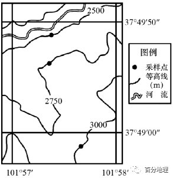

# 微专题之074 从产业结构角度分析区域发展

```
本专题摘自“百分地理”公众号，如有侵权请告之删除，谢谢。联系hhwxyhh@163.com
```

------
   
（2021·江苏·高考真题）随着乡村振兴战略的有效实施，我国乡村聚落空间分布发生了明显变化。图为“江南丘陵某区域四种乡村聚落空间演化模式示意图”。据此完成下面小题。   
   
   
   
1．模式I中乡村聚落迁移的主要目的是（  ）   
A．增强功能区竞争力   
B．保护环境敏感区域   
C．促进劳动力就业   
D．提高城镇化水平   
2．反映乡村聚落空间演化过程从受自然要素影响转向受经济社会要素影响的模式是（  ）   
A．I   
B．II   
C．III   
D．IV   
3．在我国重大战略实施的背景下，乡村聚落空间演化的总趋势是（  ）   
A．集聚扩大   
B．原地保护   
C．均衡布局   
D．分散迁移   
<span style="color: rgb(255, 0, 0);">1．B据图模式I中乡村聚落迁移的方向为从生态功能区向经济功能区迁移，可知其主要目的是保护环境敏感区域，在乡村振兴背景下，绿水青山就是金山银山，所以要将生态功能区的聚落迁移到经济功能区，B正确；增强功能区竞争力应该采取完善当地基础设施、优化产业布局、完善交通网等措施，单纯的聚落迁移无法增强功能区竞争力，A错误；乡村聚落从生态功能区迁移到经济功能区是所有人群的迁移，促进劳动力就业说法有些片面，C错误；评价城镇化水平的一个重要指标就是城镇人口占总人口的比重，据模式I图无法判断城镇化水平的变化，D错误。</span>   
<span style="color: rgb(255, 0, 0);">2．D图IV中，聚落从靠近河流向靠近公路迁移，可反映乡村聚落空间演化过程从受自然要素影响转向受经济社会要素影响，D项正确；A项只是单纯的从生态功能区迁移至经济功能区无法看出乡村聚落空间演化过程从受自然要素影响转向受经济社会要素影响转变，A错误；B项只是乡村聚落从山地迁移至丘陵然后又迁移至平原，只体现了受自然要素的影响，B错误；C项小的乡村聚落向规模大的乡村聚落迁移，与题意不符，C项错误，本题选D。</span>   
<span style="color: rgb(255, 0, 0);">3．A我国实行乡村振兴战略，结合所学可知乡村聚落未来发展呈现三大趋势：1.城乡结合趋势；2.土地规模化经营趋势；3.空心村撤并的趋势，故可以判断乡村聚落空间演化的总趋势是集聚扩大，从而提高乡村聚落的基础设施水平以及改善人们的生产生活条件，A项正确；有些乡村聚落分布在偏远地区，气候条件恶劣、生存环境艰苦，不适合原地保护，B错误；乡村聚落数量多，空间分布不均，均衡布局显然不可能，C错误；乡村聚落一般规模不大，分散迁移不太实际且没有必要，D项错误，本题选A。</span>   
<span style="color: rgb(255, 0, 0);">【点睛】乡村聚落是指乡村地区人类各种形式的居住场所（即村落），包括所有的村庄和拥有少量工业企业及商业服务设施，但未达到建制镇标准的乡村集镇。</span>   
积雪覆盖频率为不同时间尺度下积雪的累积出现次数占总统计次数的比率，反映积雪覆盖持续时间的总体特征。地形、气候、坡向等是影响积雪覆盖频率分布的重要因素，川西高原地处青藏高原东南缘，区域内地形复杂、海拔高差大，气候立体变化明显，是我国典型的生态环境脆弱区和生态气候敏感区。下表将川西高原按不同海拔划分为8个高程带，右图为各海拔高程带积雪覆盖频率分布特征。据此完成下面小题。   
<table cellspacing="0" cellpadding="0" width="577"><tbody><tr><td width="58" valign="bottom" style="padding: 3.75pt 6pt;border-width: 1pt;border-color: rgb(0, 0, 0);"><section style="margin-top: 0pt;margin-bottom: 0pt;margin-left: 0pt;text-indent: 0pt;font-size: 10.5pt;font-family: &quot;Times New Roman&quot;;text-align: left;line-height: 2em;"><span style="font-family: 宋体;">高程带</span></section></td><td width="98" valign="bottom" style="padding: 3.75pt 6pt;border-width: 1pt;border-color: rgb(0, 0, 0);"><section style="margin-top: 0pt;margin-bottom: 0pt;margin-left: 0pt;text-indent: 0pt;font-size: 10.5pt;font-family: &quot;Times New Roman&quot;;text-align: left;line-height: 2em;"><span style="font-family: 宋体;">海拔高程/m</span></section></td><td width="73" valign="bottom" style="padding: 3.75pt 6pt;border-width: 1pt;border-color: rgb(0, 0, 0);"><section style="margin-top: 0pt;margin-bottom: 0pt;margin-left: 0pt;text-indent: 0pt;font-size: 10.5pt;font-family: &quot;Times New Roman&quot;;text-align: left;line-height: 2em;"><span style="font-family: 宋体;">面积/km3</span></section></td><td width="74" valign="bottom" style="padding: 3.75pt 6pt;border-width: 1pt;border-color: rgb(0, 0, 0);"><section style="margin-top: 0pt;margin-bottom: 0pt;margin-left: 0pt;text-indent: 0pt;font-size: 10.5pt;font-family: &quot;Times New Roman&quot;;text-align: left;line-height: 2em;"><span style="font-family: 宋体;">百分比/%</span></section></td></tr><tr><td width="58" valign="bottom" style="padding: 3.75pt 6pt;border-width: 1pt;border-color: rgb(0, 0, 0);"><section style="margin-top: 0pt;margin-bottom: 0pt;margin-left: 0pt;text-indent: 0pt;font-size: 10.5pt;font-family: &quot;Times New Roman&quot;;text-align: left;line-height: 2em;">A</section></td><td width="98" valign="bottom" style="padding: 3.75pt 6pt;border-width: 1pt;border-color: rgb(0, 0, 0);"><section style="margin-top: 0pt;margin-bottom: 0pt;margin-left: 0pt;text-indent: 0pt;font-size: 10.5pt;font-family: &quot;Times New Roman&quot;;text-align: left;line-height: 2em;">H二2500</section></td><td width="73" valign="bottom" style="padding: 3.75pt 6pt;border-width: 1pt;border-color: rgb(0, 0, 0);"><section style="margin-top: 0pt;margin-bottom: 0pt;margin-left: 0pt;text-indent: 0pt;font-size: 10.5pt;font-family: &quot;Times New Roman&quot;;text-align: left;line-height: 2em;">6690.22</section></td><td width="74" valign="bottom" style="padding: 3.75pt 6pt;border-width: 1pt;border-color: rgb(0, 0, 0);"><section style="margin-top: 0pt;margin-bottom: 0pt;margin-left: 0pt;text-indent: 0pt;font-size: 10.5pt;font-family: &quot;Times New Roman&quot;;text-align: left;line-height: 2em;">2.82</section></td></tr><tr><td width="58" valign="bottom" style="padding: 3.75pt 6pt;border-width: 1pt;border-color: rgb(0, 0, 0);"><section style="margin-top: 0pt;margin-bottom: 0pt;margin-left: 0pt;text-indent: 0pt;font-size: 10.5pt;font-family: &quot;Times New Roman&quot;;text-align: left;line-height: 2em;">B</section></td><td width="98" valign="bottom" style="padding: 3.75pt 6pt;border-width: 1pt;border-color: rgb(0, 0, 0);"><section style="margin-top: 0pt;margin-bottom: 0pt;margin-left: 0pt;text-indent: 0pt;font-size: 10.5pt;font-family: &quot;Times New Roman&quot;;text-align: left;line-height: 2em;">2500</section></td><td width="73" valign="bottom" style="padding: 3.75pt 6pt;border-width: 1pt;border-color: rgb(0, 0, 0);"><section style="margin-top: 0pt;margin-bottom: 0pt;margin-left: 0pt;text-indent: 0pt;font-size: 10.5pt;font-family: &quot;Times New Roman&quot;;text-align: left;line-height: 2em;">9442.23</section></td><td width="74" valign="bottom" style="padding: 3.75pt 6pt;border-width: 1pt;border-color: rgb(0, 0, 0);"><section style="margin-top: 0pt;margin-bottom: 0pt;margin-left: 0pt;text-indent: 0pt;font-size: 10.5pt;font-family: &quot;Times New Roman&quot;;text-align: left;line-height: 2em;">3.98</section></td></tr><tr><td width="58" valign="bottom" style="padding: 3.75pt 6pt;border-width: 1pt;border-color: rgb(0, 0, 0);"><section style="margin-top: 0pt;margin-bottom: 0pt;margin-left: 0pt;text-indent: 0pt;font-size: 10.5pt;font-family: &quot;Times New Roman&quot;;text-align: left;line-height: 2em;">c</section></td><td width="98" valign="bottom" style="padding: 3.75pt 6pt;border-width: 1pt;border-color: rgb(0, 0, 0);"><section style="margin-top: 0pt;margin-bottom: 0pt;margin-left: 0pt;text-indent: 0pt;font-size: 10.5pt;font-family: &quot;Times New Roman&quot;;text-align: left;line-height: 2em;">3000</section></td><td width="73" valign="bottom" style="padding: 3.75pt 6pt;border-width: 1pt;border-color: rgb(0, 0, 0);"><section style="margin-top: 0pt;margin-bottom: 0pt;margin-left: 0pt;text-indent: 0pt;font-size: 10.5pt;font-family: &quot;Times New Roman&quot;;text-align: left;line-height: 2em;">28848.63</section></td><td width="74" valign="bottom" style="padding: 3.75pt 6pt;border-width: 1pt;border-color: rgb(0, 0, 0);"><section style="margin-top: 0pt;margin-bottom: 0pt;margin-left: 0pt;text-indent: 0pt;font-size: 10.5pt;font-family: &quot;Times New Roman&quot;;text-align: left;line-height: 2em;">12.16</section></td></tr><tr><td width="58" valign="bottom" style="padding: 3.75pt 6pt;border-width: 1pt;border-color: rgb(0, 0, 0);"><section style="margin-top: 0pt;margin-bottom: 0pt;margin-left: 0pt;text-indent: 0pt;font-size: 10.5pt;font-family: &quot;Times New Roman&quot;;text-align: left;line-height: 2em;">D</section></td><td width="98" valign="bottom" style="padding: 3.75pt 6pt;border-width: 1pt;border-color: rgb(0, 0, 0);"><section style="margin-top: 0pt;margin-bottom: 0pt;margin-left: 0pt;text-indent: 0pt;font-size: 10.5pt;font-family: &quot;Times New Roman&quot;;text-align: left;line-height: 2em;">3500</section></td><td width="73" valign="bottom" style="padding: 3.75pt 6pt;border-width: 1pt;border-color: rgb(0, 0, 0);"><section style="margin-top: 0pt;margin-bottom: 0pt;margin-left: 0pt;text-indent: 0pt;font-size: 10.5pt;font-family: &quot;Times New Roman&quot;;text-align: left;line-height: 2em;">60235.74</section></td><td width="74" valign="bottom" style="padding: 3.75pt 6pt;border-width: 1pt;border-color: rgb(0, 0, 0);"><section style="margin-top: 0pt;margin-bottom: 0pt;margin-left: 0pt;text-indent: 0pt;font-size: 10.5pt;font-family: &quot;Times New Roman&quot;;text-align: left;line-height: 2em;">25.39</section></td></tr><tr><td width="58" valign="bottom" style="padding: 3.75pt 6pt;border-width: 1pt;border-color: rgb(0, 0, 0);"><section style="margin-top: 0pt;margin-bottom: 0pt;margin-left: 0pt;text-indent: 0pt;font-size: 10.5pt;font-family: &quot;Times New Roman&quot;;text-align: left;line-height: 2em;">E</section></td><td width="98" valign="bottom" style="padding: 3.75pt 6pt;border-width: 1pt;border-color: rgb(0, 0, 0);"><section style="margin-top: 0pt;margin-bottom: 0pt;margin-left: 0pt;text-indent: 0pt;font-size: 10.5pt;font-family: &quot;Times New Roman&quot;;text-align: left;line-height: 2em;">4000</section></td><td width="73" valign="bottom" style="padding: 3.75pt 6pt;border-width: 1pt;border-color: rgb(0, 0, 0);"><section style="margin-top: 0pt;margin-bottom: 0pt;margin-left: 0pt;text-indent: 0pt;font-size: 10.5pt;font-family: &quot;Times New Roman&quot;;text-align: left;line-height: 2em;">82038.28</section></td><td width="74" valign="bottom" style="padding: 3.75pt 6pt;border-width: 1pt;border-color: rgb(0, 0, 0);"><section style="margin-top: 0pt;margin-bottom: 0pt;margin-left: 0pt;text-indent: 0pt;font-size: 10.5pt;font-family: &quot;Times New Roman&quot;;text-align: left;line-height: 2em;">34.58</section></td></tr><tr><td width="58" valign="bottom" style="padding: 3.75pt 6pt;border-width: 1pt;border-color: rgb(0, 0, 0);"><section style="margin-top: 0pt;margin-bottom: 0pt;margin-left: 0pt;text-indent: 0pt;font-size: 10.5pt;font-family: &quot;Times New Roman&quot;;text-align: left;line-height: 2em;">F</section></td><td width="98" valign="bottom" style="padding: 3.75pt 6pt;border-width: 1pt;border-color: rgb(0, 0, 0);"><section style="margin-top: 0pt;margin-bottom: 0pt;margin-left: 0pt;text-indent: 0pt;font-size: 10.5pt;font-family: &quot;Times New Roman&quot;;text-align: left;line-height: 2em;">4500</section></td><td width="73" valign="bottom" style="padding: 3.75pt 6pt;border-width: 1pt;border-color: rgb(0, 0, 0);"><section style="margin-top: 0pt;margin-bottom: 0pt;margin-left: 0pt;text-indent: 0pt;font-size: 10.5pt;font-family: &quot;Times New Roman&quot;;text-align: left;line-height: 2em;">47804.26</section></td><td width="74" valign="bottom" style="padding: 3.75pt 6pt;border-width: 1pt;border-color: rgb(0, 0, 0);"><section style="margin-top: 0pt;margin-bottom: 0pt;margin-left: 0pt;text-indent: 0pt;font-size: 10.5pt;font-family: &quot;Times New Roman&quot;;text-align: left;line-height: 2em;">20.15</section></td></tr><tr><td width="58" valign="bottom" style="padding: 3.75pt 6pt;border-width: 1pt;border-color: rgb(0, 0, 0);"><section style="margin-top: 0pt;margin-bottom: 0pt;margin-left: 0pt;text-indent: 0pt;font-size: 10.5pt;font-family: &quot;Times New Roman&quot;;text-align: left;line-height: 2em;">C</section></td><td width="98" valign="bottom" style="padding: 3.75pt 6pt;border-width: 1pt;border-color: rgb(0, 0, 0);"><section style="margin-top: 0pt;margin-bottom: 0pt;margin-left: 0pt;text-indent: 0pt;font-size: 10.5pt;font-family: &quot;Times New Roman&quot;;text-align: left;line-height: 2em;">5000</section></td><td width="73" valign="bottom" style="padding: 3.75pt 6pt;border-width: 1pt;border-color: rgb(0, 0, 0);"><section style="margin-top: 0pt;margin-bottom: 0pt;margin-left: 0pt;text-indent: 0pt;font-size: 10.5pt;font-family: &quot;Times New Roman&quot;;text-align: left;line-height: 2em;">2158.9</section></td><td width="74" valign="bottom" style="padding: 3.75pt 6pt;border-width: 1pt;border-color: rgb(0, 0, 0);"><section style="margin-top: 0pt;margin-bottom: 0pt;margin-left: 0pt;text-indent: 0pt;font-size: 10.5pt;font-family: &quot;Times New Roman&quot;;text-align: left;line-height: 2em;">0.91</section></td></tr><tr><td width="58" valign="bottom" style="padding: 3.75pt 6pt;border-width: 1pt;border-color: rgb(0, 0, 0);"><section style="margin-top: 0pt;margin-bottom: 0pt;margin-left: 0pt;text-indent: 0pt;font-size: 10.5pt;font-family: &quot;Times New Roman&quot;;text-align: left;line-height: 2em;">H</section></td><td width="98" valign="bottom" style="padding: 3.75pt 6pt;border-width: 1pt;border-color: rgb(0, 0, 0);"><section style="margin-top: 0pt;margin-bottom: 0pt;margin-left: 0pt;text-indent: 0pt;font-size: 10.5pt;font-family: &quot;Times New Roman&quot;;text-align: left;line-height: 2em;">H&gt;6000</section></td><td width="73" valign="bottom" style="padding: 3.75pt 6pt;border-width: 1pt;border-color: rgb(0, 0, 0);"><section style="margin-top: 0pt;margin-bottom: 0pt;margin-left: 0pt;text-indent: 0pt;font-size: 10.5pt;font-family: &quot;Times New Roman&quot;;text-align: left;line-height: 2em;">23.72</section></td><td width="74" valign="bottom" style="padding: 3.75pt 6pt;border-width: 1pt;border-color: rgb(0, 0, 0);"><section style="margin-top: 0pt;margin-bottom: 0pt;margin-left: 0pt;text-indent: 0pt;font-size: 10.5pt;font-family: &quot;Times New Roman&quot;;text-align: left;line-height: 2em;">0.01</section></td></tr></tbody></table>

   
   
   
4．推测川西高原积雪覆盖频率最高的坡向是（  ）   
A．东坡   
B．南坡.C．西坡   
D．北坡   
5．川西高原积雪覆盖频率季节差异最大的海拔高程是（  ）   
A．3500m——4000m   
B．4000m——4500m   
C．4500m——5000m   
D．5000m以上   
6．川西高原积雪覆盖频率秋季比春季高，主要是秋季比春季（  ）   
A．气温高   
B．气温低   
C．降水多   
D．降水少   
<span style="color: rgb(255, 0, 0);">4．D由材料可知川西高原积雪覆盖频率主要受地形、气候、坡向等因素影响，积雪多少主要受迎风坡、背风坡和阳坡、阴坡的影响；受西南季风、东南季风和太阳辐射的影响，东坡和西坡的积雪覆盖频率差异不大且低于北坡，A、C错误。南坡和北坡的积雪覆盖频率差异较大，北坡为阴坡，相较于阳坡，太阳辐射量更小，积雪消融更慢，所以北坡的积雪覆盖频率最高，B错误、D正确。故选D。</span>   
<span style="color: rgb(255, 0, 0);">5．C结合图表内容可知，F高程带的积雪覆盖频率季节差异最大，其海拔范围为4500m～5000m。C正确，A、B、D错误。故选C。</span>   
<span style="color: rgb(255, 0, 0);">6．C积雪覆盖频率与气温和降水相关。春季和秋季气温相差不大，A、B错误；但受西南季风带来的暖湿气流影响，川西高原9月、10月易受华西秋雨影响，秋季降水较多，积雪覆盖频率较高，C正确、D错误。故选C。</span>   
<span style="color: rgb(255, 0, 0);">【点睛】自然带垂直分布特点：地表景观随高度发生有规律的更替，水热状况差异是基础。1、自然带从山麓到山顶的变化规律，类似于由赤道到两极的变化规律；2、山麓的自然带基本上与当地水平自然带相一致；3、同一自然带：阳坡高于阴坡；随纬度的增加，其分布的每拔高度降低；4、山地阳坡自然带数目多于阴坡自然带数目。</span>   
（2022·全国·高三专题练习）塔里木盆地是我国最大的内陆盆地，降水稀少，年均降水量不足100mm，主要集中在夏李，属于典型的暖温带大陆性干旱气候，是气候变化的敏感区和脆弱区。下图示意1961～2005年冬季南大西洋海表温度与塔里木盆地夏季降水关系（0为距平平均值，距平是某一系列数值中的某一个数值与平均值的差，分为正距平和负距平）。据此完成下面小题。   
   
   
   
7．塔里木盆地夏季降水与冬季南大西洋海表温度关系最为密切的时间段是（  ）   
A．1961——1970年   
B．1970～1985年   
C．1985——1995年   
D．1990——2005年   
8．导致塔里木盆地成为气候变化敏感区和脆弱区的主要因素是（  ）   
①地形状况②人类活动③西风带和高原季风④地表植被   
A．①②   
B．③④   
C．①③   
D．②④   
<span style="color: rgb(255, 0, 0);">7．B读图可知，塔里木盆地降水的变化趋势与海表温度变化趋势最一致的时间段是1970～1985年，说明此时段内塔里木盆地夏季降水与冬季南大西洋海表温度关系最为密切，B正确；1965——1970年间二者的变化趋势正相反，因此A错误；1990——1995年间，二都曲线变化趋势相反，1998——2000年间，二者变化趋势也是相反的，因此CD错误。故选B。</span>   
<span style="color: rgb(255, 0, 0);">8．C塔里木盆地是我国最大的内陆盆地，降水稀少，年均降水量不足100mm，主要集中在夏李，属于典型的暖温带大陆性干旱气候，是气候变化的敏感区和脆弱区。夏季降水少的原因，是塔里木盆地封闭的盆地，周围高山环绕，水汽难以进入；冬季，西风气流受到高原的阻挡被迫分去，分别沿高原绕行，于是，在高原西北侧为暖平流，加剧塔里木盆地的干旱；受高原季风的影响，夏季高原季风阻挡印度洋来的西南季风对塔里木盆地的影响。因此降水也少。①③正确；塔里木盆地荒漠广布，地表植被少，人口稀少，人类活动少。对气候变化影响不大，②④错误。综上所述，C正确，ABD错误。故选C。</span>   
<span style="color: rgb(255, 0, 0);">【点睛】高原季风：由于高原与周围自由大气的热力差异所形成的冬夏相反的盛行风系，称为高原季风。其中，以青藏高原季风最为典型。冬季高原面上出现冷高压，气流从高原向四周流动；夏季高原面上出现热低压，气流从四周流向高原。冬季，青藏高原相对周围大气而是一个冷源，使大陆上蒙古高压势力得于加强；夏季，青藏高原相对周围大气是热源，使得印度低压势力得于加强，即对西南季风有加强作用。总之，高原季风环流的方向与东亚地区因海陆热力性质差异所形成的季风的方向完全一致，两者叠加起来，使得东亚地区的季风势力特别强盛，厚度特别大。</span>   
毛乌素沙地自然环境具有强烈过渡性是环境变化的敏感区域某科研团队运用空间分析法研究毛乌素沙地汉代古城遗址分布特征及其影响因素，用以揭示该地区人类活动与地理环境要素之间的关系。汉代是毛乌素沙地古城数量最多、范围最广的时期。下图示意毛乌素沙地汉代古城遗址分布。据此完成下面小题。   
   
   
   
9．与其他历史时期相比，汉代毛乌素沙地自然环境较（  ）   
A．温暖   
B．干燥   
C．湿润   
D．寒冷   
10．推测汉代③、④古城集聚区的水源主要取自（  ）   
A．外流河   
B．湖泊或季节性河流   
C．浅层地下水   
D．冰雪融水   
11．秦直道是一条秦代修筑用于军事的交通干道。判断图中区域分布的秦直道基本（  ）   
A．沿山脊或高地延伸   
B．沿河谷延伸   
C．沿沙漠延伸   
D．沿绿洲延伸   
<span style="color: rgb(255, 0, 0);">9．C根据图中信息可知，毛乌素沙地水系密布，古城镇多且分散，说明当时比较湿润，C正确，温暖、干燥或寒冷的自然环境均不会使该区域古城镇分布较多，ABD错误，故选C。</span>   
<span style="color: rgb(255, 0, 0);">10．B汉代③④古城集聚区不临外流河，地势较高，浅层地下水资源不足，且无高大山脉提供高山冰雪融水，说明其水源主要取自湖泊或季节性河流，B正确，ACD错误；故选B。</span>   
<span style="color: rgb(255, 0, 0);">11．A据图可知，颜色越深说明海拔越高，根据颜色深浅和河流分布可推测，图中秦直道主要沿山脊或高地延伸，A正确；图中可看出秦直道并没有沿河谷延伸，B错误；图中也不是主要的沙漠分布区，无绿洲分布，CD错误；故选A。</span>   
<span style="color: rgb(255, 0, 0);">【点睛】解题时需要明确，该区域地势较高，靠近内陆地区，降水较少，地下水资源有限，汉代时期该区域有城镇分布，说明当时该地较为湿润，适合居住。山脊是河流的天然分水岭，在古代，技术条件有限，修路等工程建设受自然条件影响大，秦直道多沿山脊修建。</span>   
河西走廊东部是典型的气候过渡带和气候变化敏感区，沙尘暴是该地一种危害极大的灾害性天气，受地—气温差（地温与气温之差）、平均风速、相对湿度等因素的影响，该地沙尘暴出现频次表现出明显的日变化和年变化特征。左下图为河西走廊东部某地区简图，右下图示意该地区某研究站点地面气象要素的逐时变化。读图完成下面小题   
   
   
   
12．据左上图推测年平均沙尘暴日数最多和最少的站点分别是（  ）   
A．古浪和凉州   
B．凉州和永昌   
C．永昌和民勤   
D．民勤和乌鞘岭   
13．右上图中，最易产生沙尘暴的时段是（  ）   
A．1:00～5:00   
B．7:00～11:00   
C．13:00～17:00   
D．19:00～23:00   
14．研究表明，该地秋季沙尘暴发生频次明显低于春季，这与地—气温差因素密切相关，对此合理的解释是该地秋季近地面（  ）   
A．地—气温差为正值，空气层结较稳定   
B．地—气温差为正值，空气层结不稳定   
C．地—气温差为负值，空气层结较稳定   
D．地—气温差为负值，空气层结不稳定   
<span style="color: rgb(255, 0, 0);">12．D读左上图可知，民勤站点靠近两大沙漠，且位于偏西风的迎风坡，最易发生沙尘暴现象；乌鞘岭位于背风坡，受山脉阻挡，发生沙尘暴概率小。因此推测年平均沙尘暴日数最多和最少的站点分别是民勤和乌鞘岭，故D正确，A、B、C错误。</span>   
<span style="color: rgb(255, 0, 0);">13．C分析材料可知，出现沙尘暴时，一般相对湿度较小，平均风速较大，地—气温差较大（即地—气温差为正值，空气层结构不稳定，对流运动显著）。结合图表可知，最易产生沙尘暴的时段是13:00—17:00，故C正确，A、B、D错误。</span>   
<span style="color: rgb(255, 0, 0);">14．C地—气温差为正值，空气层结构不稳定，对流运动显著，易发生沙尘暴现象；反之，沙尘暴现象不易发生。当地秋季近地面地—气温差为负值时，空气层结构稳定，沙尘暴发生频次少。故C正确，A、B、D错误。</span>   
（2022·河北·模拟预测）大兴安岭地区是我国天然林主要分布区之一，生态环境较为脆弱。新中国成立初期曾大规模开发建设大兴安岭，该地由人迹罕至的原始森林成为国家重要的木材生产基地。图为大兴安岭地区位置图。据此完成下列各题。   
   
   
   
15．大兴安岭地区生态环境较为脆弱的主要原因是（  ）   
①纬度较高，气候寒冷   
②冻土广布，土层浅薄   
③深居内陆，气候干旱   
④地广人稀，人迹罕至   
A．①②   
B．①③   
C．②③   
D．②④   
16．大规模采伐原始森林，可能导致大兴安岭地区（  ）   
A．林区湿度大幅增加   
B．地下径流量增加   
C．地表径流变率减小   
D．气温日较差增大   
<span style="color: rgb(255, 0, 0);">15．A由图可知，大兴安岭地区位于我国最北端，纬度高、气温低、冻土广布、土层浅薄，导致其生态环境较为脆弱，①②正确；大兴安岭地区属于温带季风气候，夏季降水较多，③错误；地广人稀，人迹罕至有利于生态环境的保护，不是生态环境较为脆弱的原因，排除④。故选A。</span>   
<span style="color: rgb(255, 0, 0);">16．D大规模采伐原始森林，破坏植被，会导致林区湿度降低，排除A；植被遭到破坏，其涵养水源的功能减弱，水分下渗减少，地下径流量减少，地表径流变率增大，排除B、C；植被遭到破坏后，其调节气候的功能减弱，气温日较差可能增大，D正确。故选D。</span>   
<span style="color: rgb(255, 0, 0);">【点睛】森林资源是陆地生态系统的主体，是自然功能最完善、最强大的资源库、基因库和蓄水库，具有调节气候、涵养水源、保持水土、防风固沙、改良土壤、减少污染、美化环境、保持生物多样性等多种功能，对改善生态环境、维护生态平衡，起着决定性的作用。</span>   
（2022·全国·高三专题练习）中国是全球最大的石油进口国，石油对外依赖度高且以海运为主。一般将流量大于均值的货流线称为显著流。下图示意中国海丝之路进口原油货流在八大区域的分布脆弱度（单位时间内港口最大流量/总流量）和集中度（某港口货流量/区域内所有港口货流总量）。据此完成下面小题。   
   
   
   
17．影响海丝之路集装箱海运网络脆弱性的因素不包括（  ）   
A．货流集中   
B．货物种类   
C．气象海况   
D．恐怖主义   
18．中国与南非之间原油货流脆弱度和集中度都较高的原因是（  ）   
A．区域内核心港口多   
B．原油贸易总流量大   
C．区域内核心港口少   
D．原油贸易总流量小   
19．可有效推动海丝之路石油贸易可持续发展的做法是（  ）   
①加强建设海丝之路沿线的潜力中小港口②提高港口的集中度和显著流的货流总量③挂靠优势港口，扩大沿边地区的开放格局④增建中国海外自贸区，增强原油贸易活力   
A．①②   
B．①④   
C．②③   
D．③④   
<span style="color: rgb(255, 0, 0);">17．B货流集中会导致单程运输量加大，港口的最大流量提高，脆弱度提高，脆弱性增强，而气象海况不稳定、恐怖主义直接导致海运网络脆弱性高，ACD与题意不符。货物种类与港口的最大流量、总流量、海运风险度关系较小，故影响海丝之路集装箱海运网络脆弱性的因素不包括货物种类。因此本题选B。</span>   
<span style="color: rgb(255, 0, 0);">18．C中国与南非原油货流脆弱度和集中度都较高是因为进口原油货流被区域内少数核心港口垄断，如中国从南非进口的显著流全部由南非区域内的德班港和开普敦港承担，以及主要由中国区域内的青岛港和杨浦港承担。根据：脆弱度=港口的最大流量/总流量，集中度=某港口货流量/区域内所有港口货流总量，并由图可知南非地区显著流占总流量比例很大（显著流集中），可推测脆弱度和集中度都较高的原因是区域内核心港口少，核心港口的最大流量较大所致，故C正确，A错误；由图可知南非地区显著流占总流量比例很大，说明中国与南非之间原油贸易总流量大，D错误；依据脆弱度=港口的最大流量/总流量可知，总流量大有利于降低原油货流脆弱度，故B错。所以本题选C。</span>   
<span style="color: rgb(255, 0, 0);">19．B中国进口原油海运网络货流分布格局不均衡，少数港口具有明显优势，但挂靠优势港口会导致泊位紧张、装卸货物不及时等，③错误。提高港口的集中度和显著流的货流总量会加大少数港口优势，增加脆弱性，②错误。加强建设海丝之路沿线的潜力中小港口，通过潜力港口分担核心港口货流量，给中国进口原油提供更多航线选择，避免因货流过度集中而导致脆弱性高，可缩减运输时间和成本，提高运输效率。此外，增建中国海外自贸区，增强中国与海丝之路沿线区域的原油贸易活力，扩大沿边地区开放格局，将有效推动海丝之路原油贸易可持续发展，①④正确，故本题排除ACD三项，选B。</span>   
<span style="color: rgb(255, 0, 0);">【点睛】海运网络是由港口、海峡等节点和航线组成的复杂网络，港口工人罢工、海盗、海上交通事故、自然灾害等的扰动都会造成海运网络节点失效。一个或多个节点失效会造成海运网络通达能力下降，影响国际贸易往来。因此海运网络脆弱性分析能够为集装箱海运网络的规划、加强重点航线的维护、应急运输备用港口及航线选择等提供理论依据。针对集装箱航线上可能发生的各种突发事件，建立相应的场景，分析脆弱度变化，为重新优化航运线路提供帮助。</span>   
（2022·全国·高三专题练习）治沟造地是陕西省延安市对黄土高原的丘陵沟壑区，在传统打坝淤地的基础上，集耕地营造、坝系修复、生态建设和新农村发展为一体的“田水路林村”综合整治模式，实现了乡村生产、生活、生态协调发展（下图）。据此完成下面小题。   
   
   
   
20．与传统的打坝淤地工程相比，治沟造地更加关注（  ）   
A．增加耕地面积   
B．防治水土流失   
C．改善人居环境   
D．提高作物产量   
21．推测开展治沟造地的地方（  ）   
①居住用地紧张②生态环境脆弱   
③坡耕地比例大④农业生产精耕细作   
A．①③   
B．①④   
C．②③   
D．②④   
<span style="color: rgb(255, 0, 0);">20．C结合材料“在传统打坝淤地的基础上，集耕地营造、坝系修复、生态建设和新农村发展为一体的“田水路林村”综合整治模式”进行分析。“传统的打坝淤地” A B D的功能都有，治沟造地“实现了乡村生产，生活、生态协调 发展”，所以与传统的打坝淤地工程相比，治沟造地更加关注“改善人居环境” 。故本题选C。</span>   
<span style="color: rgb(255, 0, 0);">21．C图中出现“复垦空废宅基地”，说明当地空废宅基地多，居住用地充裕，①错误；黄土高原的丘陵沟壑区坡度大，坡耕地比例大，水土流失严重，植被少，生态环境脆弱，②③正确；黄土高原地区生产力水平较低，农民主要采用广种薄收、粗放落后的方式发展农业，而不是精耕细作，④错误。故选C。</span>   
<span style="color: rgb(255, 0, 0);">【点睛】根据图中信息提示：复垦空废宅基和易地移民搬迁，说明该地居住用地不紧张，但生态环境脆弱，需要易地移民搬迁，坡面退耕还林，治沟造地，说明坡耕地比例大，农业生产精耕细作图中没有体现出来。</span>   
（2022·全国·高三专题练习）重庆市渝东南地区地处生态脆弱的武陵山区，2015年该地区户籍人口约372万人，常住人口约为275万人，城乡居民收入多来自外出务工人员寄回的收入。近年来，城镇优质的教育条件吸引本地区农村人口入城。据此回答下面小题。   
22．渝东南地区的户籍人口明显大于常住人口的主要原因是（  ）   
A．人口自然增长率高   
B．青壮年人口大量流出   
C．农村人口流向城市   
D．中老年人口不断外迁   
23．近年来，   
推动渝东南地区城镇化进程的主要动力是（  ）   
①现代制造业快速发展   
②优质公共资源集聚的吸引   
③矿产资源大规模开发   
④建筑业、服务业创造就业   
A．①③   
B．①④   
C．②③   
D．②④   
<span style="color: rgb(255, 0, 0);">22．B根据题干“户籍人口大于常住人口”可得常住人口较少。由于我国政策影响，户籍变动相对受限，而人口流动便利。经济发展的差异导致经济发达区吸引大量人口流入，常住人口增多，经济落后地区常住人口减少，而户籍人口变动不大，从而导致了户籍人口大于常住人口的情况。对外输出的大部分是青壮年劳动力，故B项正确。注意题干是渝东南地区，包括渝东南的城市和农村，不会影响人口，故C项错误。老年人安土重迁的观念和体力原因导致老年人口流动少，D项错误。故选B。</span>   
<span style="color: rgb(255, 0, 0);">23．D现代制造业指的是利用高端技术减少劳动力成本的制造业,与传统制造业相对，不需要大量劳动力，①错误；根据题干“城镇优质的教育条件，吸引农村人口入城”，有了外出务工的收入，为了让子女得到良好的教育，农村人口大量涌入城市，②正确；城市不利于发展采矿业，③错误;城镇化和服务业的快速发展，导致建筑和从事服务业的需求激增，需要大量劳动力从事建筑业和服务业，④正确。故选D。</span>   
<span style="color: rgb(255, 0, 0);">【点睛】本题以重庆市渝东南地区人口迁移为背景材料，主要考查考生获取和解读地理信息、调动和运用地理知识的能力，学科素养方面注重考查地理实践力和综合思维。考生需结合材料和课本人口相关知识作答。</span>   
二、综合题   
24．（2022·江西九江·二模）阅读图文材料，完成下列要求。   
大青山属于阴山山脉中部，是气候变化敏感区和构造运动活跃区。区域构造活动强烈，为洪积扇的形成提供了重要的地形与构造基础。全新世时期，大青山地区气候经历了冷干—暖湿—暖干的变化，地壳运动经历了较强—弱—较弱的强度变化。大型季节性洪水在大青山山口流出后形成三期洪积扇。Ⅰ期洪积扇形成于全新世早期,规模最大。Ⅱ期洪积扇形成于全新世中期，规模比Ⅰ期小。Ⅲ期洪积扇形成于全新世晚期，零散地分布在大青山山前，整体规模最小。下图为大青山洪积扇示意图。   
   
   
(1)根据洪积扇的成因推测大青山洪积扇形成时期降水特点。   
(2)与Ⅱ期洪积扇相比，分析I期洪积扇规模较大的原因。   
(3)Ⅲ期洪积扇规模有大有小，指出其影响因素。   
(4)说明Ⅲ期洪积扇零散分布的原因。   
<span style="color: rgb(255, 0, 0);">【答案】(1)洪积扇的成因主要是有季节性洪水。据此推测该区域降水季节变化大；多暴雨。</span>   
<span style="color: rgb(255, 0, 0);">(2)（Ⅰ期洪积扇形成时）气候冷干，植被覆盖率低，松散堆积物多；构造运动强烈，山体抬升速率加快，河流落差增大，流水的侵蚀和搬运能力强，堆积物数量大，冲积扇规模最大。</span>   
<span style="color: rgb(255, 0, 0);">(3)径流量；地形（流速，落差，地势起伏）；松散堆积物（植被覆盖度）。</span>   
<span style="color: rgb(255, 0, 0);">(4)气候变干导致河流流量变小；加上构造运动较弱，落差变小，河流搬运的沉积物较少。每个冲积扇规模都较小，未能连接成片。</span>   
<span style="color: rgb(255, 0, 0);">【解析】本题以大青山三期洪积扇为材料背景设置试题，考查洪积扇形成及其形态差异的影响因素，培养学生的材料信息提取能力以及对地理基本知识的迁移运用能力，落实综合思维和区域认知的地理学科素养。(1)由材料信息可知，大型季节性洪水在大青山山口流出后形成三期洪积扇，则可推知，洪积扇的成因主要是有季节性洪水的存在，在雨季搬运了大量的泥沙等物质，在河流出山口随着地势的变缓、流速的减慢而沉积形成。由季节性洪水可知，大青山洪积扇形成时期该区域降水季节变化大，多暴雨。(2)影响洪积扇面积大小的因素，主要有流水的作用、下垫面物质状态以及地势的高低状况。由材料可知，全新世时期，大青山地区气候经历了冷干—暖湿—暖干的变化，地壳运动经历了较强—弱—较弱的强度变化，Ⅰ期洪积扇形成于全新世早期，则对应的可以推知，Ⅰ期洪积扇形成时期，气候冷干，地球运动较强。气候冷干，则植被发育差，覆盖率低，下垫面的松散堆积物多；地球运动较强，山体抬升速率快，河流落差大，流水的侵蚀和搬运能力强，堆积物数量大，冲积扇规模最大。(3)由材料可知，全新世时期，大青山地区气候经历了冷干—暖湿—暖干的变化，地壳运动经历了较强—弱—较弱的强度变化，Ⅲ期洪积扇形成于全新世晚期，则对应的可以推知，Ⅲ期洪积扇形成时期气候暖干，地壳活动较弱。气候暖干，降水少，径流量少，流水作用弱；地壳活动较弱，山体抬升速率慢，河流的流速慢，流水的侵蚀和搬运作用弱；气候暖干，植被相对发育较好，覆盖率较高，松散堆积物少。综合分析可知，Ⅲ期洪积扇整体规模最小。但是局部区域，径流量、地势高低、植被覆盖度也存在差异，因此形成的洪积扇规模也就有大有小，则其影响因素有径流量、地形（流速，落差，地势起伏）、松散堆积物（植被覆盖度）。(4)由材料可知，全新世时期，大青山地区气候经历了冷干—暖湿—暖干的变化，地壳运动经历了较强—弱—较弱的强度变化，Ⅲ期洪积扇形成于全新世晚期，则对应的可以推知，Ⅲ期洪积扇形成时期气候暖干，地壳活动较弱。气候暖干，降水少，径流量少，流水作用弱；地壳活动较弱，山体抬升速率慢，河流的流速慢，流水的侵蚀和搬运作用弱；气候暖干，植被相对发育较好，覆盖率较高，松散堆积物少。综合分析可知，Ⅲ期洪积扇整体规模最小。此外，每个冲积扇规模都较小，未能连接成片，所以呈现零星分布。</span>   
25．（2022·湖北·高三期末）阅读图文材料，完成下列要求。   
甘肃省祁连山东部是典型的半干旱地区，也是全球气候变化的敏感区。该地青海云杉的径向生长（年轮宽度是主要观察指标）受气候变化影响显著。某科研团队选取祁连山东部三处不同海拔高度的采样点，对青海云杉的树木年轮宽度分别进行测量，并从当地气象站获知：当地年均温在1986年左右显著升高。下图为祁连山东部树轮采样点地理位置示意图，表示意显著升温前后不同海拔多年平均年轮宽度（cm）及变化。   
   
   
   
<table cellspacing="0" cellpadding="0" width="577"><tbody><tr><td width="58" valign="middle" style="padding: 3.75pt 6pt;border-width: 1pt;border-color: rgb(0, 0, 0);"><section style="margin-top: 0pt;margin-bottom: 0pt;margin-left: 0pt;text-indent: 0pt;font-size: 10.5pt;font-family: &quot;Times New Roman&quot;;text-align: left;line-height: 2em;"><span style="font-family: 宋体;">采样点</span></section></td><td width="86" valign="middle" style="padding: 3.75pt 6pt;border-width: 1pt;border-color: rgb(0, 0, 0);"><section style="margin-top: 0pt;margin-bottom: 0pt;margin-left: 0pt;text-indent: 0pt;font-size: 10.5pt;font-family: &quot;Times New Roman&quot;;text-align: left;line-height: 2em;">1961～1986</section></td><td width="86" valign="middle" style="padding: 3.75pt 6pt;border-width: 1pt;border-color: rgb(0, 0, 0);"><section style="margin-top: 0pt;margin-bottom: 0pt;margin-left: 0pt;text-indent: 0pt;font-size: 10.5pt;font-family: &quot;Times New Roman&quot;;text-align: left;line-height: 2em;">1986～2014</section></td><td width="45" valign="middle" style="padding: 3.75pt 6pt;border-width: 1pt;border-color: rgb(0, 0, 0);"><section style="margin-top: 0pt;margin-bottom: 0pt;margin-left: 0pt;text-indent: 0pt;font-size: 10.5pt;font-family: &quot;Times New Roman&quot;;text-align: left;line-height: 2em;"><span style="font-family: 宋体;">差值</span></section></td></tr><tr><td width="58" valign="middle" style="padding: 3.75pt 6pt;border-width: 1pt;border-color: rgb(0, 0, 0);"><section style="margin-top: 0pt;margin-bottom: 0pt;margin-left: 0pt;text-indent: 0pt;font-size: 10.5pt;font-family: &quot;Times New Roman&quot;;text-align: left;line-height: 2em;">2500m</section></td><td width="86" valign="middle" style="padding: 3.75pt 6pt;border-width: 1pt;border-color: rgb(0, 0, 0);"><section style="margin-top: 0pt;margin-bottom: 0pt;margin-left: 0pt;text-indent: 0pt;font-size: 10.5pt;font-family: &quot;Times New Roman&quot;;text-align: left;line-height: 2em;">1.03</section></td><td width="86" valign="middle" style="padding: 3.75pt 6pt;border-width: 1pt;border-color: rgb(0, 0, 0);"><section style="margin-top: 0pt;margin-bottom: 0pt;margin-left: 0pt;text-indent: 0pt;font-size: 10.5pt;font-family: &quot;Times New Roman&quot;;text-align: left;line-height: 2em;">0.90</section></td><td width="45" valign="middle" style="padding: 3.75pt 6pt;border-width: 1pt;border-color: rgb(0, 0, 0);"><section style="margin-top: 0pt;margin-bottom: 0pt;margin-left: 0pt;text-indent: 0pt;font-size: 10.5pt;font-family: &quot;Times New Roman&quot;;text-align: left;line-height: 2em;">-0.13</section></td></tr><tr><td width="58" valign="middle" style="padding: 3.75pt 6pt;border-width: 1pt;border-color: rgb(0, 0, 0);"><section style="margin-top: 0pt;margin-bottom: 0pt;margin-left: 0pt;text-indent: 0pt;font-size: 10.5pt;font-family: &quot;Times New Roman&quot;;text-align: left;line-height: 2em;">2750m</section></td><td width="86" valign="middle" style="padding: 3.75pt 6pt;border-width: 1pt;border-color: rgb(0, 0, 0);"><section style="margin-top: 0pt;margin-bottom: 0pt;margin-left: 0pt;text-indent: 0pt;font-size: 10.5pt;font-family: &quot;Times New Roman&quot;;text-align: left;line-height: 2em;">1.17</section></td><td width="86" valign="middle" style="padding: 3.75pt 6pt;border-width: 1pt;border-color: rgb(0, 0, 0);"><section style="margin-top: 0pt;margin-bottom: 0pt;margin-left: 0pt;text-indent: 0pt;font-size: 10.5pt;font-family: &quot;Times New Roman&quot;;text-align: left;line-height: 2em;">0.82</section></td><td width="45" valign="middle" style="padding: 3.75pt 6pt;border-width: 1pt;border-color: rgb(0, 0, 0);"><section style="margin-top: 0pt;margin-bottom: 0pt;margin-left: 0pt;text-indent: 0pt;font-size: 10.5pt;font-family: &quot;Times New Roman&quot;;text-align: left;line-height: 2em;">-0.35</section></td></tr><tr><td width="58" valign="middle" style="padding: 3.75pt 6pt;border-width: 1pt;border-color: rgb(0, 0, 0);"><section style="margin-top: 0pt;margin-bottom: 0pt;margin-left: 0pt;text-indent: 0pt;font-size: 10.5pt;font-family: &quot;Times New Roman&quot;;text-align: left;line-height: 2em;">3000m</section></td><td width="86" valign="middle" style="padding: 3.75pt 6pt;border-width: 1pt;border-color: rgb(0, 0, 0);"><section style="margin-top: 0pt;margin-bottom: 0pt;margin-left: 0pt;text-indent: 0pt;font-size: 10.5pt;font-family: &quot;Times New Roman&quot;;text-align: left;line-height: 2em;">1.29</section></td><td width="86" valign="middle" style="padding: 3.75pt 6pt;border-width: 1pt;border-color: rgb(0, 0, 0);"><section style="margin-top: 0pt;margin-bottom: 0pt;margin-left: 0pt;text-indent: 0pt;font-size: 10.5pt;font-family: &quot;Times New Roman&quot;;text-align: left;line-height: 2em;">0.86</section></td><td width="45" valign="middle" style="padding: 3.75pt 6pt;border-width: 1pt;border-color: rgb(0, 0, 0);"><section style="margin-top: 0pt;margin-bottom: 0pt;margin-left: 0pt;text-indent: 0pt;font-size: 10.5pt;font-family: &quot;Times New Roman&quot;;text-align: left;line-height: 2em;">-0.43</section></td></tr></tbody></table>

   
(1)简述青海云杉的生长习性。   
(2)分析显著升温对云杉年轮宽度的影响。   
(3)为了排除自然和人文条件的干扰，说出采样点的选址条件。   
<span style="color: rgb(255, 0, 0);">【答案】(1)地处半干旱地区，水分条件差，云杉耐旱；山区海拔高，热量条件差，云杉耐寒冷；冷干环境下，土壤发育程度低，云杉耐贫瘠。</span>   
<span style="color: rgb(255, 0, 0);">(2)显著升温导致蒸发加剧，半干旱地区土壤水分减少；不同海拔青海云杉的年轮生长均变慢；高海拔地区土壤水分减少，限制云杉生长；低海拔地区靠近河流，土壤水分得到补充，云杉生长影响较小；升温后年轮减小幅度由高海拔向低海拔下降。</span>   
<span style="color: rgb(255, 0, 0);">(3)选择植被稀疏区域；选择人类活动干扰少的区域。</span>   
<span style="color: rgb(255, 0, 0);">【解析】本大题以祁连山东部青海云杉的图文信息为材料，设置三道小题，涉及我国西北地区的自然地理环境、自然地理环境的整体性、全球气候变暖的影响、全球气候变暖的应对措施等相关内容，考查学生的区域认知、地理综合思维能力。(1)本题考查区域认知，由材料可知该区域地处半干旱环境，故云杉耐干旱；图中山区位于中纬度，海拔为2500～3000米，全年热量较差，冬季寒冷，故云杉耐寒；冷干环境下，不利于土壤的发育，土层浅薄，故云杉耐贫瘠。(2)半干旱地区限制青海云杉生长的主要因素是土壤水分，显著升温后蒸发加剧，土壤水分散失快，减缓云杉生长，年轮宽度减小；由图中纬度数值可知，该区域空间范围小，且由表格数据可知升温后年轮减小幅度由高海拔向低海拔下降，这是因为低海拔采样点距河较近，土壤水分有所补充，升温导致土壤水分较少的情况，对云杉生长影响较小；高海拔地区土壤水分减少后，对云杉生长的影响明细。(3)远离森林中心地带，减小森林内部生物活动产生的热量与水分的影响，选择植被稀疏的地带，充分与自由大气接触，更能对气候变暖产生精准反应；选择受人类活动干扰较少的区域，排除一些人为因素的干扰。</span>   
26．（2021·河南开封·一模）阅读图文材料，完成下列问题。   
蒙古高原地区属于典型的温带大陆性气候，非常干燥，大部分地区的年降水量在200毫米以下，生态环境脆弱，草地退化时，植被覆盖度降低。下图为蒙古高原部分地区年降水量分布及采样点植被覆盖度图。A地附近区域实行自由放牧，B地附近区域多年来推行禁牧、休牧和划区轮牧等草地管理举措。观察发现，A、B两地植被覆盖度差异明显。   
   
   
   
比较A、B两地植被覆盖度差异并分析这种差异的形成原因。   
<span style="color: rgb(255, 0, 0);">【答案】差异：A地比B地植被覆盖度低；</span>   
<span style="color: rgb(255, 0, 0);">A地年降水量小于200mm，降水较少，植被生长条件差；A地区域施行自由放牧，草场破坏，荒漠化严重。</span>   
<span style="color: rgb(255, 0, 0);">B地降水量大于200mm，降水较多，植被生长条件较好；B地区域多年来推行禁牧、休牧和划区轮牧等草地管理举措，合理放牧，防治草地退化效果好。</span>   
<span style="color: rgb(255, 0, 0);">【解析】根据图中图例植被覆盖度判断，A区域主要植被覆盖度以小于5%和5%——25%为主，B区域植被覆盖度以25%——50%和大于50%为主，所以A地的植被覆盖度比B地低。根据图中等降水量线可知，A地年降水量在150——200mm之间，降水较少，不利于植被生长；根据材料可知，A区域实行自由放牧，这种方式比较粗放，牧场不加区划，不实行分区轮牧，难以有计划地平衡利用，导致草场破坏，加重土地荒漠化。B地年降水量大于200mm，降水较多，有利于植被生长；根据材料可知，B地附近区域多年来推行禁牧、休牧和划区轮牧等草地管理举措，合理放牧，有利于改善草地资源、恢复草原生态有着积极推动作用。</span>   
27．（2021·全国·高三专题练习）阅读图文材料，完成下列要求。   
大屿岛位于厦门市西海城海沧区嵩屿东北侧海域，与海沧大道未来海岸隔海相望。岛岛屿面积约0.18km2最高海拔62m，呈长条形，近南北走向。受台湾海峡水体调节以及福建山地丘陵地形影响，岛上受季风影响明显，具有典型的亚热带海洋性季风气候的特征。大屿岛地势东面陡峭，西面有山坳；四面环水，具有相对独立的生态系统。与陆地相比，大屿岛乔木树种多样性指教明显较小，岛上乔木植物种类较简单。生态系统较脆弱，一旦被破坏，修复困难。下列两幅图分别为大屿岛地理位置图和大屿岛不同方位乔木种群高度、冠幅、胸径结构图。   
   
   
   
（1）指出大屿岛的自然环境特征。   
（2）分析大屿岛岛上乔木植物种类较简单的原因。   
（3）指出大屿岛不同方位乔木种群高度、冠幅和胸径的分布特征，并说出其主要影响因素。   
<span style="color: rgb(255, 0, 0);">【答案】（1）纬度低，受海水调节，气温年较差小；四周环海，水汽充足，降水丰富；岛上风速、风力大；该岛屿面积小，淡水资源不足；该岛屿东侧地形陡峭，西侧地形较平坦。(答出三点)</span>   
<span style="color: rgb(255, 0, 0);">（2）该海岛四面环水，具有相对独立的生态系统；该海岛自然环境较恶劣能够存活和生长的植物种类较少；海拔低，水热条件垂直变化小，自然带谱垂直分异不明显；该岛屿与大陆和其他海岛相隔离，难以进行物种间的基因交流，造成该海岛较陆地区域植物自然演替速度慢。(答出三点)</span>   
<span style="color: rgb(255, 0, 0);">（3）分布特征：大屿岛乔木高度、冠幅和胸径大致自南向北减小；西南侧乔木的高度、冠幅和胸径最大(或东北侧乔木高度、冠幅和胸径最小)。主要影响因素：风向、风力；地形地势。)</span>   
<span style="color: rgb(255, 0, 0);">【解析】本题以大屿岛不同方位乔木种群高度、冠幅和胸径结构差异为背景材料，考查大屿岛的自然环境特征、大屿岛乔木种类简单的原因、大屿岛不同方位乔木高度、冠幅和胸径的变化特征及其主要影响因素相关知识，同时考查学生获取和解读地理信息、调动和运用知识、描述和阐释地理原理与规律的能力。（1）大屿岛的自然环境特征可从岛屿的风速(风力)、土壤盐分、淡水资源、裸地分布情况等方面进行思考。该岛屿纬度低，且受海水的调节明显，气温年较差小；受海洋影响，降水丰富；处于东南，季风影响显著，风力大；由于岛屿面积小，淡水的储存能力低，淡水资源不足；地形东侧陡峭，西侧平坦。（2）大屿岛岛上乔木植物种类较简单的原因可从该海岛四面环水，生态系统相对独立、该海岛自然环境较恶劣，对土壤肥力、盐分要求严格的乔木难以存活，且该海岛自然环境相对独立，植物难以与陆地、其他岛屿进行物种间的基因交流，导致该海岛较陆地区域植物自然演替速度慢；海拔低，水热条件垂直变化小，自然带谱垂直分异不明显。（3）大屿岛不同方位乔木种群高度、冠幅和胸径的分布特征，可根据不同方位乔木高度、冠幅和胸径的变化特征来归纳，其影响因素可从风力、地形地势等方面进行思考。乔木高度、冠幅和胸径大致自南向北减小；西南侧乔木的高度、冠幅和胸径最大。影响因素是风向和风力的大小；地形地势的分布特点等。</span>
