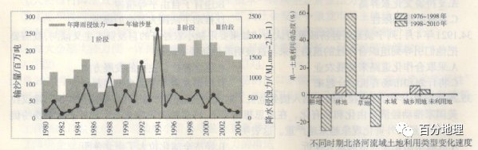

# 微专题之074 从产业结构角度分析区域发展

```
本专题摘自“百分地理”公众号，如有侵权请告之删除，谢谢。联系hhwxyhh@163.com
```

------
   
（2022·河北·模拟预测）城区型采煤塌陷湿地受城市化影响，其土地利用变化迅速且复杂，部分塌陷土地进行了回填建设，原有的塌陷湿地空间格局被打破。图是我国东部某城市城区煤矿关停后的采煤塌陷湿地空间演变示意图。据此完成问题。   
   
   
   
1．该城区（  ）   
A．人口数量大幅减少   
B．新兴产业发展迅速   
C．土地利用类型减少   
D．绝大多数居民外迁   
2．推测该城区空间变化的主要目的是（  ）   
A．吸引科技人才，增强人才引领   
B．规划空间用地，加强人口管理   
C．推动产业转型，改善生态环境   
D．大力拓宽湿地，发展渔业养殖   
<span style="color: rgb(255, 0, 0);">1．B结合示意图判断，居住空间变得集聚，规模变大，数量减少，但人口数量并不会大幅减少，大多数居民会选择留在城区，AD错误；原来该地区无新兴产业，后来新兴产业代替了煤炭产业，说明该地区对产业结构进行了升级，促进了新兴产业的发展，B正确；该地区进行产业升级改造，居住空间集中，推测该地区生态环境有所改善，原有居住地很可能改造为城市绿地或其他功能区，土地利用类型会增加，C错误。故选B。</span>   
<span style="color: rgb(255, 0, 0);">2．C由材料信息可知，该城区原来主要产业是采煤业，采煤会造成地表坍陷，煤渣等会占用土地，污染河流和空气，危害地区居民健康。后来煤炭产业转变为新兴产业，促进产业转型、改善生态环境，C正确。因新兴工业的发展，可引进科技人才，对空间用地进行规划，但不是该城区空间变化的主要目的，AB错误。由图可知，湿地面积缩小，D错误。故选C。</span>   
<span style="color: rgb(255, 0, 0);">【点睛】资源型城市的发展方向：1.大资金、技术投入；2.调整三大产业结构，实现产业结构多元化；3.治理环境污染，改善生态环境；4.优化产业布局。</span>   
（2020·全国·高三专题练习）农业化社会中，乡村以农业为主要产业，农田会紧密围绕村落住宅周边，随着社会的发展，农村产业也逐渐呈现多样化。下图为我国珠三角某乡村空间布局演变示意图。据此，完成下面小题。   
   
   
   
3．该乡村1987-2017年期间土地利用方面根本变化是（  ）   
A．土地利用方式多样化发展   
B．农业用地大幅度减少   
C．商业用地从无到有   
D．工业用地的规模扩大   
4．2017年该乡村商业区未布局在区域中心的主要影响因素是（  ）   
A．自然地理条件   
B．历史文化因素   
C．经济发展水平   
D．交通运输状况   
<span style="color: rgb(255, 0, 0);">3．D由材料信息可知，我国珠三角在改革开放以后，随着工业化的不断发展，传统住宅区变成现代住宅区，传统农业用地规模减小，工业用地规模不断扩大；结合图示可知，1987年-2017年工业用地范围扩大，使传统农业用地和住宅用地转变为建设用地，土地利用发生了根本的变化，D正确。工业化和城市化的发展使土地利用方式向多样化方向发展，A错误；农业用地大幅度减少、商业用地从无到有不是土地利用方面根本变化，BC错误。故选D。</span>   
<span style="color: rgb(255, 0, 0);">4．B根据所学知识，从经济因素考虑商业区一般分布在区域中心，历史文化因素为土地利用类型的基础，原商业用地的分布决定现在的商业区的分布，B正确，C错误；自然地理条件对商业区的分布影响较小，A错误；区域中心交通通达度较高，从交通运输状况考虑，商业区应分布在区域中心，D错误，故选B。</span>   
<span style="color: rgb(255, 0, 0);">【点睛】影响城市功能区的因素：历史因素为影响城市功能分区的基础；经济因素主要通过影响地租水平和付租能力从而影响功能分区；社会因素主要影响住宅区的分化，包括收入水平、民族、宗教等；政治因素对功能分区也有重要影响。</span>   
（2022·辽宁·高三期末）华明镇位于天津市东丽区中北部，西南靠近天津市中心区，东连天津滨海新区，具有大城市郊区的典型特征。作为城郊地区，过去华明镇土地资源浪费现象严重。通过实施城镇化整理，华明镇人居环境得到显著改善，农民享受到现代化的生活服务设施。图示意华明镇2002年和2018年土地利用对比。据此完成下面小题。   
   
   
   
5．与2002年相比，2018年华明镇土地利用变化的特征是（  ）   
A．住宅用地大量转化为工业用地   
B．农村居民点更分散，占用耕地多   
C．坑塘水面严重萎缩，湿地破碎化   
D．农业用地大量转化为建设用地   
6．华明镇西南部居民小区分布集中的主要原因是（  ）   
A．靠近工业园区，节省工人通勤时间   
B．距离市中心近，受城市辐射影响大   
C．林草地面积大，城市备用土地充足   
D．位于城郊地带，外来人口大量集聚   
<span style="color: rgb(255, 0, 0);">5．D对比2002年和2018年华明镇土地利用情况可知，2018年新增的工业用地主要来自耕地而非住宅用地，A错误；农村居民点数量减少，部分发展成城市居民小区，分布更加集中，占用的耕地面积减少，B错误；坑塘水域面积增大，湿地呈现规整化，C错误；新增的华明示范镇、乡镇企业以及设施农业园区占用了大量的耕地，所以农业用地转化为建设用地显著，D正确。</span>   
<span style="color: rgb(255, 0, 0);">6．B由图可知，工业园区位于中部地区且西南部居民多为农民，A错误；由材料可知华明镇位于城乡交界地带，华明镇西南部与天津市市中心距离近，受天津市中心城市的辐射影响作用强，B正确；天津市城市化速度快，中心城区用地不足，将部分功能区向华明镇西南部转移，使华明镇西南部耕地大量转化为住宅用地，C错误；通过实施城镇化整理，华明镇人居环境得到显著改善，农民享受到现代化的生活服务设施，材料中提到华明镇居民主要为农民，而非外来人口，D错误。</span>   
（2021·甘肃·天水市第一中学模拟预测）地名是人类认识、利用及改造自然的记录和表达，其形成有着深刻的地理、历史和文化背景。环滇池地区地处高原湖泊平坝区，地形复杂多样，其乡村“涉水”地名文化景观的分布在历史上经历了山区与河（湖）漫滩地区的多次变化过程。如表示意环滇池地区乡村“涉水”地名用字（词）分类及统计。据此，完成下面小题。   
<table cellspacing="0" cellpadding="0" width="577"><tbody><tr><td width="42" valign="middle" style="padding: 3.75pt 6pt;border-width: 1pt;border-color: rgb(0, 0, 0);"><section style="margin-top: 0pt;margin-bottom: 0pt;margin-left: 0pt;text-indent: 0pt;font-size: 10.5pt;font-family: &quot;Times New Roman&quot;;text-align: center;line-height: 2em;"><span style="font-family: 楷体;">类型</span></section></td><td width="255" valign="middle" style="padding: 3.75pt 6pt;border-width: 1pt;border-color: rgb(0, 0, 0);"><section style="margin-top: 0pt;margin-bottom: 0pt;margin-left: 0pt;text-indent: 0pt;font-size: 10.5pt;font-family: &quot;Times New Roman&quot;;text-align: center;line-height: 2em;"><span style="font-family: 楷体;">主要用字（词)</span></section></td><td width="70" valign="middle" style="padding: 3.75pt 6pt;border-width: 1pt;border-color: rgb(0, 0, 0);"><section style="margin-top: 0pt;margin-bottom: 0pt;margin-left: 0pt;text-indent: 0pt;font-size: 10.5pt;font-family: &quot;Times New Roman&quot;;text-align: center;line-height: 2em;"><span style="font-family: 楷体;">总数/个</span></section></td><td width="70" valign="middle" style="padding: 3.75pt 6pt;border-width: 1pt;border-color: rgb(0, 0, 0);"><section style="margin-top: 0pt;margin-bottom: 0pt;margin-left: 0pt;text-indent: 0pt;font-size: 10.5pt;font-family: &quot;Times New Roman&quot;;text-align: center;line-height: 2em;"><span style="font-family: 楷体;">比例%</span></section></td></tr><tr><td width="42" valign="middle" style="padding: 3.75pt 6pt;border-width: 1pt;border-color: rgb(0, 0, 0);"><section style="margin-top: 0pt;margin-bottom: 0pt;margin-left: 0pt;text-indent: 0pt;font-size: 10.5pt;font-family: &quot;Times New Roman&quot;;text-align: center;line-height: 2em;"><span style="font-family: 楷体;">①</span></section></td><td width="255" valign="middle" style="padding: 3.75pt 6pt;border-width: 1pt;border-color: rgb(0, 0, 0);"><section style="margin-top: 0pt;margin-bottom: 0pt;margin-left: 0pt;text-indent: 0pt;font-size: 10.5pt;font-family: &quot;Times New Roman&quot;;text-align: center;line-height: 2em;"><span style="font-family: 楷体;">水、河、溪、江、源、涧、洼、沟、洪、濂、洗、洞、嘴、尾、浦、湾</span></section></td><td width="70" valign="middle" style="padding: 3.75pt 6pt;border-width: 1pt;border-color: rgb(0, 0, 0);"><section style="margin-top: 0pt;margin-bottom: 0pt;margin-left: 0pt;text-indent: 0pt;font-size: 10.5pt;font-family: &quot;Times New Roman&quot;;text-align: center;line-height: 2em;"><span style="font-family: 楷体;">587</span></section></td><td width="70" valign="middle" style="padding: 3.75pt 6pt;border-width: 1pt;border-color: rgb(0, 0, 0);"><section style="margin-top: 0pt;margin-bottom: 0pt;margin-left: 0pt;text-indent: 0pt;font-size: 10.5pt;font-family: &quot;Times New Roman&quot;;text-align: center;line-height: 2em;"><span style="font-family: 楷体;">58.35</span></section></td></tr><tr><td width="42" valign="middle" style="padding: 3.75pt 6pt;border-width: 1pt;border-color: rgb(0, 0, 0);"><section style="margin-top: 0pt;margin-bottom: 0pt;margin-left: 0pt;text-indent: 0pt;font-size: 10.5pt;font-family: &quot;Times New Roman&quot;;text-align: center;line-height: 2em;"><span style="font-family: 楷体;">②</span></section></td><td width="255" valign="middle" style="padding: 3.75pt 6pt;border-width: 1pt;border-color: rgb(0, 0, 0);"><section style="margin-top: 0pt;margin-bottom: 0pt;margin-left: 0pt;text-indent: 0pt;font-size: 10.5pt;font-family: &quot;Times New Roman&quot;;text-align: center;line-height: 2em;"><span style="font-family: 楷体;">海、潮、波、滩、滇、湖、渡、鱼、咀、漾、浪、潭、池、泉、边、螺蜻</span></section></td><td width="70" valign="middle" style="padding: 3.75pt 6pt;border-width: 1pt;border-color: rgb(0, 0, 0);"><section style="margin-top: 0pt;margin-bottom: 0pt;margin-left: 0pt;text-indent: 0pt;font-size: 10.5pt;font-family: &quot;Times New Roman&quot;;text-align: center;line-height: 2em;"><span style="font-family: 楷体;">211</span></section></td><td width="70" valign="middle" style="padding: 3.75pt 6pt;border-width: 1pt;border-color: rgb(0, 0, 0);"><section style="margin-top: 0pt;margin-bottom: 0pt;margin-left: 0pt;text-indent: 0pt;font-size: 10.5pt;font-family: &quot;Times New Roman&quot;;text-align: center;line-height: 2em;"><span style="font-family: 楷体;">20.97</span></section></td></tr><tr><td width="42" valign="middle" style="padding: 3.75pt 6pt;border-width: 1pt;border-color: rgb(0, 0, 0);"><section style="margin-top: 0pt;margin-bottom: 0pt;margin-left: 0pt;text-indent: 0pt;font-size: 10.5pt;font-family: &quot;Times New Roman&quot;;text-align: center;line-height: 2em;"><span style="font-family: 楷体;">③</span></section></td><td width="255" valign="middle" style="padding: 3.75pt 6pt;border-width: 1pt;border-color: rgb(0, 0, 0);"><section style="margin-top: 0pt;margin-bottom: 0pt;margin-left: 0pt;text-indent: 0pt;font-size: 10.5pt;font-family: &quot;Times New Roman&quot;;text-align: center;line-height: 2em;"><span style="font-family: 楷体;">渔、塘、井、饮、船、坝、闸、田、洗、港、泊</span></section></td><td width="70" valign="middle" style="padding: 3.75pt 6pt;border-width: 1pt;border-color: rgb(0, 0, 0);"><section style="margin-top: 0pt;margin-bottom: 0pt;margin-left: 0pt;text-indent: 0pt;font-size: 10.5pt;font-family: &quot;Times New Roman&quot;;text-align: center;line-height: 2em;"><span style="font-family: 楷体;">208</span></section></td><td width="70" valign="middle" style="padding: 3.75pt 6pt;border-width: 1pt;border-color: rgb(0, 0, 0);"><section style="margin-top: 0pt;margin-bottom: 0pt;margin-left: 0pt;text-indent: 0pt;font-size: 10.5pt;font-family: &quot;Times New Roman&quot;;text-align: center;line-height: 2em;"><span style="font-family: 楷体;">20.68</span></section></td></tr></tbody></table>

   
7．环滇池地区乡村“涉水”地名用字主要反映了乡村所在地的（  ）   
A．距离滇池位置   
B．地貌形态特征   
C．土地利用方式   
D．人口密度状况   
8．环滇池地区乡村“涉水”地名文化景观分布位置多次变化，其主要原因是（  ）   
A．人类生产发展   
B．气候干湿变化   
C．高原间断拾升   
D．滇池水位涨落   
<span style="color: rgb(255, 0, 0);">7．B根据题目所提供的材料，①类乡村“涉水”地名用字包括洞、洼、沟、浦等等，均反映出了乡村所在地的地貌形态特征，所以B选项符合题意，对于另外三个选项“距离滇池位置”“土地利用方式”和“人口密度状况”在其中并没有直接的体现，ACD错误。故选B。</span>   
<span style="color: rgb(255, 0, 0);">8．D依据材料中信息，该地乡村“涉水”地名文化景观的分布在历史上经历了山区与河(湖)漫滩地区的多次变化过程。说明明环滇池地区，由于填池水位涨落，导致该地区土地利用方式、地貌环境情况等不断发生着较为显著的变化，所以表现出了“环滇池地区乡村'涉水’地名文化景观分布位置多次变化”，D正确。与人类生产发展、气候干湿变化、高原间断拾升关系不大，ABC错误。故选D。</span>   
<span style="color: rgb(255, 0, 0);">【点睛】地名是最典型的非物质文化景观，它包括人文地理实体地名和自然地理实体地名。我们通过对地名这一历史产物的分析也可以了解当地过去和现在的自然环境及其变化。</span>   
（2022·山东·高三专题练习）位于黄土高原的籍河流域的土地利用类型在进入21世纪后发生了较大变化，下表示意2000——2008年籍河流域的土地利用类型变化转移数据统计表。表中同一土地利用类型对应的行列交叉处数值表示该土地利用类型的现有面积（2008年），其他数值为不同土地利用类型转入该土地利用类型的面积。据此完成下面小题。   
籍河流域的土地利用类型变化转移数据统计表km2   
<table cellspacing="0" cellpadding="0" width="577"><tbody><tr><td width="142" colspan="2" rowspan="2" valign="middle" style="padding: 3.75pt 6pt;border-width: 1pt;border-color: rgb(0, 0, 0);"><section style="margin-top: 0pt;margin-bottom: 0pt;margin-left: 0pt;text-indent: 0pt;font-size: 10.5pt;font-family: &quot;Times New Roman&quot;;text-align: left;line-height: 2em;"><span style="font-family: 楷体;">土地利用类型</span></section></td><td width="402" colspan="7" valign="middle" style="padding: 3.75pt 6pt;border-width: 1pt;border-color: rgb(0, 0, 0);"><section style="margin-top: 0pt;margin-bottom: 0pt;margin-left: 0pt;text-indent: 0pt;font-size: 10.5pt;font-family: &quot;Times New Roman&quot;;text-align: left;line-height: 2em;"><span style="font-family: 楷体;">2008年</span></section></td></tr><tr><td width="57" valign="middle" style="padding: 3.75pt 6pt;border-width: 1pt;border-color: rgb(0, 0, 0);"><section style="margin-top: 0pt;margin-bottom: 0pt;margin-left: 0pt;text-indent: 0pt;font-size: 10.5pt;font-family: &quot;Times New Roman&quot;;text-align: left;line-height: 2em;"><span style="font-family: 楷体;">坡耕地</span></section></td><td width="58" valign="middle" style="padding: 3.75pt 6pt;border-width: 1pt;border-color: rgb(0, 0, 0);"><section style="margin-top: 0pt;margin-bottom: 0pt;margin-left: 0pt;text-indent: 0pt;font-size: 10.5pt;font-family: &quot;Times New Roman&quot;;text-align: left;line-height: 2em;"><span style="font-family: 楷体;">林地</span></section></td><td width="58" valign="middle" style="padding: 3.75pt 6pt;border-width: 1pt;border-color: rgb(0, 0, 0);"><section style="margin-top: 0pt;margin-bottom: 0pt;margin-left: 0pt;text-indent: 0pt;font-size: 10.5pt;font-family: &quot;Times New Roman&quot;;text-align: left;line-height: 2em;"><span style="font-family: 楷体;">草地</span></section></td><td width="44" valign="middle" style="padding: 3.75pt 6pt;border-width: 1pt;border-color: rgb(0, 0, 0);"><section style="margin-top: 0pt;margin-bottom: 0pt;margin-left: 0pt;text-indent: 0pt;font-size: 10.5pt;font-family: &quot;Times New Roman&quot;;text-align: left;line-height: 2em;"><span style="font-family: 楷体;">水域</span></section></td><td width="57" valign="middle" style="padding: 3.75pt 6pt;border-width: 1pt;border-color: rgb(0, 0, 0);"><section style="margin-top: 0pt;margin-bottom: 0pt;margin-left: 0pt;text-indent: 0pt;font-size: 10.5pt;font-family: &quot;Times New Roman&quot;;text-align: left;line-height: 2em;"><span style="font-family: 楷体;">居民地</span></section></td><td width="83" valign="middle" style="padding: 3.75pt 6pt;border-width: 1pt;border-color: rgb(0, 0, 0);"><section style="margin-top: 0pt;margin-bottom: 0pt;margin-left: 0pt;text-indent: 0pt;font-size: 10.5pt;font-family: &quot;Times New Roman&quot;;text-align: left;line-height: 2em;"><span style="font-family: 楷体;">未利用土地</span></section></td><td width="44" valign="middle" style="padding: 3.75pt 6pt;border-width: 1pt;border-color: rgb(0, 0, 0);"><section style="margin-top: 0pt;margin-bottom: 0pt;margin-left: 0pt;text-indent: 0pt;font-size: 10.5pt;font-family: &quot;Times New Roman&quot;;text-align: left;line-height: 2em;"><span style="font-family: 楷体;">梯田</span></section></td></tr><tr><td width="60" rowspan="7" valign="middle" style="padding: 3.75pt 6pt;border-width: 1pt;border-color: rgb(0, 0, 0);"><section style="margin-top: 0pt;margin-bottom: 0pt;margin-left: 0pt;text-indent: 0pt;font-size: 10.5pt;font-family: &quot;Times New Roman&quot;;text-align: left;line-height: 2em;"><span style="font-family: 楷体;">2000年</span></section></td><td width="82" valign="middle" style="padding: 3.75pt 6pt;border-width: 1pt;border-color: rgb(0, 0, 0);"><section style="margin-top: 0pt;margin-bottom: 0pt;margin-left: 0pt;text-indent: 0pt;font-size: 10.5pt;font-family: &quot;Times New Roman&quot;;text-align: left;line-height: 2em;"><span style="font-family: 楷体;">坡耕地</span></section></td><td width="57" valign="middle" style="padding: 3.75pt 6pt;border-width: 1pt;border-color: rgb(0, 0, 0);"><section style="margin-top: 0pt;margin-bottom: 0pt;margin-left: 0pt;text-indent: 0pt;font-size: 10.5pt;font-family: &quot;Times New Roman&quot;;text-align: left;line-height: 2em;"><span style="font-family: 楷体;">84.47</span></section></td><td width="58" valign="middle" style="padding: 3.75pt 6pt;border-width: 1pt;border-color: rgb(0, 0, 0);"><section style="margin-top: 0pt;margin-bottom: 0pt;margin-left: 0pt;text-indent: 0pt;font-size: 10.5pt;font-family: &quot;Times New Roman&quot;;text-align: left;line-height: 2em;"><span style="font-family: 楷体;">5.09</span></section></td><td width="58" valign="middle" style="padding: 3.75pt 6pt;border-width: 1pt;border-color: rgb(0, 0, 0);"><section style="margin-top: 0pt;margin-bottom: 0pt;margin-left: 0pt;text-indent: 0pt;font-size: 10.5pt;font-family: &quot;Times New Roman&quot;;text-align: left;line-height: 2em;"><span style="font-family: 楷体;">4.19</span></section></td><td width="44" valign="middle" style="padding: 3.75pt 6pt;border-width: 1pt;border-color: rgb(0, 0, 0);"><section style="margin-top: 0pt;margin-bottom: 0pt;margin-left: 0pt;text-indent: 0pt;font-size: 10.5pt;font-family: &quot;Times New Roman&quot;;text-align: left;line-height: 2em;"><span style="font-family: 楷体;">0.00</span></section></td><td width="57" valign="middle" style="padding: 3.75pt 6pt;border-width: 1pt;border-color: rgb(0, 0, 0);"><section style="margin-top: 0pt;margin-bottom: 0pt;margin-left: 0pt;text-indent: 0pt;font-size: 10.5pt;font-family: &quot;Times New Roman&quot;;text-align: left;line-height: 2em;"><span style="font-family: 楷体;">0.00</span></section></td><td width="83" valign="middle" style="padding: 3.75pt 6pt;border-width: 1pt;border-color: rgb(0, 0, 0);"><section style="margin-top: 0pt;margin-bottom: 0pt;margin-left: 0pt;text-indent: 0pt;font-size: 10.5pt;font-family: &quot;Times New Roman&quot;;text-align: left;line-height: 2em;"><span style="font-family: 楷体;">0.00</span></section></td><td width="44" valign="middle" style="padding: 3.75pt 6pt;border-width: 1pt;border-color: rgb(0, 0, 0);"><section style="margin-top: 0pt;margin-bottom: 0pt;margin-left: 0pt;text-indent: 0pt;font-size: 10.5pt;font-family: &quot;Times New Roman&quot;;text-align: left;line-height: 2em;"><span style="font-family: 楷体;">8.21</span></section></td></tr><tr><td width="82" valign="middle" style="padding: 3.75pt 6pt;border-width: 1pt;border-color: rgb(0, 0, 0);"><section style="margin-top: 0pt;margin-bottom: 0pt;margin-left: 0pt;text-indent: 0pt;font-size: 10.5pt;font-family: &quot;Times New Roman&quot;;text-align: left;line-height: 2em;"><span style="font-family: 楷体;">林地</span></section></td><td width="57" valign="middle" style="padding: 3.75pt 6pt;border-width: 1pt;border-color: rgb(0, 0, 0);"><section style="margin-top: 0pt;margin-bottom: 0pt;margin-left: 0pt;text-indent: 0pt;font-size: 10.5pt;font-family: &quot;Times New Roman&quot;;text-align: left;line-height: 2em;"><span style="font-family: 楷体;">0.00</span></section></td><td width="58" valign="middle" style="padding: 3.75pt 6pt;border-width: 1pt;border-color: rgb(0, 0, 0);"><section style="margin-top: 0pt;margin-bottom: 0pt;margin-left: 0pt;text-indent: 0pt;font-size: 10.5pt;font-family: &quot;Times New Roman&quot;;text-align: left;line-height: 2em;"><span style="font-family: 楷体;">121.89</span></section></td><td width="58" valign="middle" style="padding: 3.75pt 6pt;border-width: 1pt;border-color: rgb(0, 0, 0);"><section style="margin-top: 0pt;margin-bottom: 0pt;margin-left: 0pt;text-indent: 0pt;font-size: 10.5pt;font-family: &quot;Times New Roman&quot;;text-align: left;line-height: 2em;"><span style="font-family: 楷体;">0.20</span></section></td><td width="44" valign="middle" style="padding: 3.75pt 6pt;border-width: 1pt;border-color: rgb(0, 0, 0);"><section style="margin-top: 0pt;margin-bottom: 0pt;margin-left: 0pt;text-indent: 0pt;font-size: 10.5pt;font-family: &quot;Times New Roman&quot;;text-align: left;line-height: 2em;"><span style="font-family: 楷体;">0.00</span></section></td><td width="57" valign="middle" style="padding: 3.75pt 6pt;border-width: 1pt;border-color: rgb(0, 0, 0);"><section style="margin-top: 0pt;margin-bottom: 0pt;margin-left: 0pt;text-indent: 0pt;font-size: 10.5pt;font-family: &quot;Times New Roman&quot;;text-align: left;line-height: 2em;"><span style="font-family: 楷体;">0.00</span></section></td><td width="83" valign="middle" style="padding: 3.75pt 6pt;border-width: 1pt;border-color: rgb(0, 0, 0);"><section style="margin-top: 0pt;margin-bottom: 0pt;margin-left: 0pt;text-indent: 0pt;font-size: 10.5pt;font-family: &quot;Times New Roman&quot;;text-align: left;line-height: 2em;"><span style="font-family: 楷体;">0.00</span></section></td><td width="44" valign="middle" style="padding: 3.75pt 6pt;border-width: 1pt;border-color: rgb(0, 0, 0);"><section style="margin-top: 0pt;margin-bottom: 0pt;margin-left: 0pt;text-indent: 0pt;font-size: 10.5pt;font-family: &quot;Times New Roman&quot;;text-align: left;line-height: 2em;"><span style="font-family: 楷体;">0.00</span></section></td></tr><tr><td width="82" valign="middle" style="padding: 3.75pt 6pt;border-width: 1pt;border-color: rgb(0, 0, 0);"><section style="margin-top: 0pt;margin-bottom: 0pt;margin-left: 0pt;text-indent: 0pt;font-size: 10.5pt;font-family: &quot;Times New Roman&quot;;text-align: left;line-height: 2em;"><span style="font-family: 楷体;">草地</span></section></td><td width="57" valign="middle" style="padding: 3.75pt 6pt;border-width: 1pt;border-color: rgb(0, 0, 0);"><section style="margin-top: 0pt;margin-bottom: 0pt;margin-left: 0pt;text-indent: 0pt;font-size: 10.5pt;font-family: &quot;Times New Roman&quot;;text-align: left;line-height: 2em;"><span style="font-family: 楷体;">0.00</span></section></td><td width="58" valign="middle" style="padding: 3.75pt 6pt;border-width: 1pt;border-color: rgb(0, 0, 0);"><section style="margin-top: 0pt;margin-bottom: 0pt;margin-left: 0pt;text-indent: 0pt;font-size: 10.5pt;font-family: &quot;Times New Roman&quot;;text-align: left;line-height: 2em;"><span style="font-family: 楷体;">3.17</span></section></td><td width="58" valign="middle" style="padding: 3.75pt 6pt;border-width: 1pt;border-color: rgb(0, 0, 0);"><section style="margin-top: 0pt;margin-bottom: 0pt;margin-left: 0pt;text-indent: 0pt;font-size: 10.5pt;font-family: &quot;Times New Roman&quot;;text-align: left;line-height: 2em;"><span style="font-family: 楷体;">413.10</span></section></td><td width="44" valign="middle" style="padding: 3.75pt 6pt;border-width: 1pt;border-color: rgb(0, 0, 0);"><section style="margin-top: 0pt;margin-bottom: 0pt;margin-left: 0pt;text-indent: 0pt;font-size: 10.5pt;font-family: &quot;Times New Roman&quot;;text-align: left;line-height: 2em;"><span style="font-family: 楷体;">0.00</span></section></td><td width="57" valign="middle" style="padding: 3.75pt 6pt;border-width: 1pt;border-color: rgb(0, 0, 0);"><section style="margin-top: 0pt;margin-bottom: 0pt;margin-left: 0pt;text-indent: 0pt;font-size: 10.5pt;font-family: &quot;Times New Roman&quot;;text-align: left;line-height: 2em;"><span style="font-family: 楷体;">0.00</span></section></td><td width="83" valign="middle" style="padding: 3.75pt 6pt;border-width: 1pt;border-color: rgb(0, 0, 0);"><section style="margin-top: 0pt;margin-bottom: 0pt;margin-left: 0pt;text-indent: 0pt;font-size: 10.5pt;font-family: &quot;Times New Roman&quot;;text-align: left;line-height: 2em;"><span style="font-family: 楷体;">0.05</span></section></td><td width="44" valign="middle" style="padding: 3.75pt 6pt;border-width: 1pt;border-color: rgb(0, 0, 0);"><section style="margin-top: 0pt;margin-bottom: 0pt;margin-left: 0pt;text-indent: 0pt;font-size: 10.5pt;font-family: &quot;Times New Roman&quot;;text-align: left;line-height: 2em;"><span style="font-family: 楷体;">1.81</span></section></td></tr><tr><td width="82" valign="middle" style="padding: 3.75pt 6pt;border-width: 1pt;border-color: rgb(0, 0, 0);"><section style="margin-top: 0pt;margin-bottom: 0pt;margin-left: 0pt;text-indent: 0pt;font-size: 10.5pt;font-family: &quot;Times New Roman&quot;;text-align: left;line-height: 2em;"><span style="font-family: 楷体;">水域</span></section></td><td width="57" valign="middle" style="padding: 3.75pt 6pt;border-width: 1pt;border-color: rgb(0, 0, 0);"><section style="margin-top: 0pt;margin-bottom: 0pt;margin-left: 0pt;text-indent: 0pt;font-size: 10.5pt;font-family: &quot;Times New Roman&quot;;text-align: left;line-height: 2em;"><span style="font-family: 楷体;">0.00</span></section></td><td width="58" valign="middle" style="padding: 3.75pt 6pt;border-width: 1pt;border-color: rgb(0, 0, 0);"><section style="margin-top: 0pt;margin-bottom: 0pt;margin-left: 0pt;text-indent: 0pt;font-size: 10.5pt;font-family: &quot;Times New Roman&quot;;text-align: left;line-height: 2em;"><span style="font-family: 楷体;">0.00</span></section></td><td width="58" valign="middle" style="padding: 3.75pt 6pt;border-width: 1pt;border-color: rgb(0, 0, 0);"><section style="margin-top: 0pt;margin-bottom: 0pt;margin-left: 0pt;text-indent: 0pt;font-size: 10.5pt;font-family: &quot;Times New Roman&quot;;text-align: left;line-height: 2em;"><span style="font-family: 楷体;">0.53</span></section></td><td width="44" valign="middle" style="padding: 3.75pt 6pt;border-width: 1pt;border-color: rgb(0, 0, 0);"><section style="margin-top: 0pt;margin-bottom: 0pt;margin-left: 0pt;text-indent: 0pt;font-size: 10.5pt;font-family: &quot;Times New Roman&quot;;text-align: left;line-height: 2em;"><span style="font-family: 楷体;">1.97</span></section></td><td width="57" valign="middle" style="padding: 3.75pt 6pt;border-width: 1pt;border-color: rgb(0, 0, 0);"><section style="margin-top: 0pt;margin-bottom: 0pt;margin-left: 0pt;text-indent: 0pt;font-size: 10.5pt;font-family: &quot;Times New Roman&quot;;text-align: left;line-height: 2em;"><span style="font-family: 楷体;">0.00</span></section></td><td width="83" valign="middle" style="padding: 3.75pt 6pt;border-width: 1pt;border-color: rgb(0, 0, 0);"><section style="margin-top: 0pt;margin-bottom: 0pt;margin-left: 0pt;text-indent: 0pt;font-size: 10.5pt;font-family: &quot;Times New Roman&quot;;text-align: left;line-height: 2em;"><span style="font-family: 楷体;">0.00</span></section></td><td width="44" valign="middle" style="padding: 3.75pt 6pt;border-width: 1pt;border-color: rgb(0, 0, 0);"><section style="margin-top: 0pt;margin-bottom: 0pt;margin-left: 0pt;text-indent: 0pt;font-size: 10.5pt;font-family: &quot;Times New Roman&quot;;text-align: left;line-height: 2em;"><span style="font-family: 楷体;">0.00</span></section></td></tr><tr><td width="82" valign="middle" style="padding: 3.75pt 6pt;border-width: 1pt;border-color: rgb(0, 0, 0);"><section style="margin-top: 0pt;margin-bottom: 0pt;margin-left: 0pt;text-indent: 0pt;font-size: 10.5pt;font-family: &quot;Times New Roman&quot;;text-align: left;line-height: 2em;"><span style="font-family: 楷体;">居民地</span></section></td><td width="57" valign="middle" style="padding: 3.75pt 6pt;border-width: 1pt;border-color: rgb(0, 0, 0);"><section style="margin-top: 0pt;margin-bottom: 0pt;margin-left: 0pt;text-indent: 0pt;font-size: 10.5pt;font-family: &quot;Times New Roman&quot;;text-align: left;line-height: 2em;"><span style="font-family: 楷体;">0.00</span></section></td><td width="58" valign="middle" style="padding: 3.75pt 6pt;border-width: 1pt;border-color: rgb(0, 0, 0);"><section style="margin-top: 0pt;margin-bottom: 0pt;margin-left: 0pt;text-indent: 0pt;font-size: 10.5pt;font-family: &quot;Times New Roman&quot;;text-align: left;line-height: 2em;"><span style="font-family: 楷体;">0.00</span></section></td><td width="58" valign="middle" style="padding: 3.75pt 6pt;border-width: 1pt;border-color: rgb(0, 0, 0);"><section style="margin-top: 0pt;margin-bottom: 0pt;margin-left: 0pt;text-indent: 0pt;font-size: 10.5pt;font-family: &quot;Times New Roman&quot;;text-align: left;line-height: 2em;"><span style="font-family: 楷体;">0.00</span></section></td><td width="44" valign="middle" style="padding: 3.75pt 6pt;border-width: 1pt;border-color: rgb(0, 0, 0);"><section style="margin-top: 0pt;margin-bottom: 0pt;margin-left: 0pt;text-indent: 0pt;font-size: 10.5pt;font-family: &quot;Times New Roman&quot;;text-align: left;line-height: 2em;"><span style="font-family: 楷体;">0.00</span></section></td><td width="57" valign="middle" style="padding: 3.75pt 6pt;border-width: 1pt;border-color: rgb(0, 0, 0);"><section style="margin-top: 0pt;margin-bottom: 0pt;margin-left: 0pt;text-indent: 0pt;font-size: 10.5pt;font-family: &quot;Times New Roman&quot;;text-align: left;line-height: 2em;"><span style="font-family: 楷体;">24.48</span></section></td><td width="83" valign="middle" style="padding: 3.75pt 6pt;border-width: 1pt;border-color: rgb(0, 0, 0);"><section style="margin-top: 0pt;margin-bottom: 0pt;margin-left: 0pt;text-indent: 0pt;font-size: 10.5pt;font-family: &quot;Times New Roman&quot;;text-align: left;line-height: 2em;"><span style="font-family: 楷体;">0.00</span></section></td><td width="44" valign="middle" style="padding: 3.75pt 6pt;border-width: 1pt;border-color: rgb(0, 0, 0);"><section style="margin-top: 0pt;margin-bottom: 0pt;margin-left: 0pt;text-indent: 0pt;font-size: 10.5pt;font-family: &quot;Times New Roman&quot;;text-align: left;line-height: 2em;"><span style="font-family: 楷体;">0.00</span></section></td></tr><tr><td width="82" valign="middle" style="padding: 3.75pt 6pt;border-width: 1pt;border-color: rgb(0, 0, 0);"><section style="margin-top: 0pt;margin-bottom: 0pt;margin-left: 0pt;text-indent: 0pt;font-size: 10.5pt;font-family: &quot;Times New Roman&quot;;text-align: left;line-height: 2em;"><span style="font-family: 楷体;">未利用土地</span></section></td><td width="57" valign="middle" style="padding: 3.75pt 6pt;border-width: 1pt;border-color: rgb(0, 0, 0);"><section style="margin-top: 0pt;margin-bottom: 0pt;margin-left: 0pt;text-indent: 0pt;font-size: 10.5pt;font-family: &quot;Times New Roman&quot;;text-align: left;line-height: 2em;"><span style="font-family: 楷体;">0.00</span></section></td><td width="58" valign="middle" style="padding: 3.75pt 6pt;border-width: 1pt;border-color: rgb(0, 0, 0);"><section style="margin-top: 0pt;margin-bottom: 0pt;margin-left: 0pt;text-indent: 0pt;font-size: 10.5pt;font-family: &quot;Times New Roman&quot;;text-align: left;line-height: 2em;"><span style="font-family: 楷体;">0.00</span></section></td><td width="58" valign="middle" style="padding: 3.75pt 6pt;border-width: 1pt;border-color: rgb(0, 0, 0);"><section style="margin-top: 0pt;margin-bottom: 0pt;margin-left: 0pt;text-indent: 0pt;font-size: 10.5pt;font-family: &quot;Times New Roman&quot;;text-align: left;line-height: 2em;"><span style="font-family: 楷体;">0.00</span></section></td><td width="44" valign="middle" style="padding: 3.75pt 6pt;border-width: 1pt;border-color: rgb(0, 0, 0);"><section style="margin-top: 0pt;margin-bottom: 0pt;margin-left: 0pt;text-indent: 0pt;font-size: 10.5pt;font-family: &quot;Times New Roman&quot;;text-align: left;line-height: 2em;"><span style="font-family: 楷体;">0.00</span></section></td><td width="57" valign="middle" style="padding: 3.75pt 6pt;border-width: 1pt;border-color: rgb(0, 0, 0);"><section style="margin-top: 0pt;margin-bottom: 0pt;margin-left: 0pt;text-indent: 0pt;font-size: 10.5pt;font-family: &quot;Times New Roman&quot;;text-align: left;line-height: 2em;"><span style="font-family: 楷体;">0.13</span></section></td><td width="83" valign="middle" style="padding: 3.75pt 6pt;border-width: 1pt;border-color: rgb(0, 0, 0);"><section style="margin-top: 0pt;margin-bottom: 0pt;margin-left: 0pt;text-indent: 0pt;font-size: 10.5pt;font-family: &quot;Times New Roman&quot;;text-align: left;line-height: 2em;"><span style="font-family: 楷体;">2.71</span></section></td><td width="44" valign="middle" style="padding: 3.75pt 6pt;border-width: 1pt;border-color: rgb(0, 0, 0);"><section style="margin-top: 0pt;margin-bottom: 0pt;margin-left: 0pt;text-indent: 0pt;font-size: 10.5pt;font-family: &quot;Times New Roman&quot;;text-align: left;line-height: 2em;"><span style="font-family: 楷体;">0.00</span></section></td></tr><tr><td width="82" valign="middle" style="padding: 3.75pt 6pt;border-width: 1pt;border-color: rgb(0, 0, 0);"><section style="margin-top: 0pt;margin-bottom: 0pt;margin-left: 0pt;text-indent: 0pt;font-size: 10.5pt;font-family: &quot;Times New Roman&quot;;text-align: left;line-height: 2em;"><span style="font-family: 楷体;">梯田</span></section></td><td width="57" valign="middle" style="padding: 3.75pt 6pt;border-width: 1pt;border-color: rgb(0, 0, 0);"><section style="margin-top: 0pt;margin-bottom: 0pt;margin-left: 0pt;text-indent: 0pt;font-size: 10.5pt;font-family: &quot;Times New Roman&quot;;text-align: left;line-height: 2em;"><span style="font-family: 楷体;">0.00</span></section></td><td width="58" valign="middle" style="padding: 3.75pt 6pt;border-width: 1pt;border-color: rgb(0, 0, 0);"></td><td width="58" valign="middle" style="padding: 3.75pt 6pt;border-width: 1pt;border-color: rgb(0, 0, 0);"><section style="margin-top: 0pt;margin-bottom: 0pt;margin-left: 0pt;text-indent: 0pt;font-size: 10.5pt;font-family: &quot;Times New Roman&quot;;text-align: left;line-height: 2em;"><span style="font-family: 楷体;">0.00</span></section></td><td width="44" valign="middle" style="padding: 3.75pt 6pt;border-width: 1pt;border-color: rgb(0, 0, 0);"><section style="margin-top: 0pt;margin-bottom: 0pt;margin-left: 0pt;text-indent: 0pt;font-size: 10.5pt;font-family: &quot;Times New Roman&quot;;text-align: left;line-height: 2em;"><span style="font-family: 楷体;">0.00</span></section></td><td width="57" valign="middle" style="padding: 3.75pt 6pt;border-width: 1pt;border-color: rgb(0, 0, 0);"><section style="margin-top: 0pt;margin-bottom: 0pt;margin-left: 0pt;text-indent: 0pt;font-size: 10.5pt;font-family: &quot;Times New Roman&quot;;text-align: left;line-height: 2em;"><span style="font-family: 楷体;">0.00</span></section></td><td width="83" valign="middle" style="padding: 3.75pt 6pt;border-width: 1pt;border-color: rgb(0, 0, 0);"><section style="margin-top: 0pt;margin-bottom: 0pt;margin-left: 0pt;text-indent: 0pt;font-size: 10.5pt;font-family: &quot;Times New Roman&quot;;text-align: left;line-height: 2em;"><span style="font-family: 楷体;">0.00</span></section></td><td width="44" valign="middle" style="padding: 3.75pt 6pt;border-width: 1pt;border-color: rgb(0, 0, 0);"></td></tr></tbody></table>

   
9．从2000年到2008年，转入面积最大的土地利用方式及主要转入来源分别是（  ）A．梯田坡耕地   
B．林地梯田   
C．草地水域   
D．未利用地居民地   
10．推测该流域2000——2008年（  ）   
A．村庄数量减少   
B．河流径流量减少   
C．果园面积增大   
D．河流含沙量增加   
<span style="color: rgb(255, 0, 0);">9．A注意材料信息“表中同一土地利用类型对应的行列交叉处数值表示该土地利用类型的现有面积（2008年），其他数值为不同土地利用类型转入该土地利用类型的面积”。由图可知，2000年到2008年，梯田、林地、草地、未利用土地的转入面积分别为10.02、8.26、4.92、0.05平方千米，梯田转入面积最大，且梯田转入中，坡耕地转为梯田有8.21平方千米，主要转入来源为坡耕地，故选A。</span>   
<span style="color: rgb(255, 0, 0);">10．C2000-2008年期间，该流域土地利用方式的变化主要表现为坡耕地转为梯田、林地、草地，生态环境改善，水土流失减少，河流含沙量减少，D错误；有部分未利用土地转为居住用地，居住用地面积增加，村庄数量不会减少，A错；坡耕地面积减少，林地和草地面积增加，对河流的调蓄作用增强，但河流的径流量并不会减少，B错；部分坡耕地和草地转为林地，适宜发展林果业，故果园面积增加，C正确。故选C。</span>   
<span style="color: rgb(255, 0, 0);">【点睛】黄土高原水土流失严重，将坡耕地改为梯田，或者退耕还林还草，有利于水土保持，改善生态环境。图文材料获取和准确解读，是做题的关键。</span>   
（2022·全国·高三专题练习）土壤有机碳是衡量土壤肥力的主要指标，与气候、植被类型、土地利用方式及人类活动等有关，其含量大小取决于进入土壤的生物残体等有机物质的多少及土壤微生物分解作用为主的有机物质的损失。下图示意我国伊犁河谷不同植被带0——10cm土层深度土壤有机碳含量变化。据此完成下面小题。   
   
   
   
11．伊犁河谷高山草甸带多分布在海拔2800m以上的高山地带，该植被带发育的表层土壤有机碳含量最高，主要原因是（  ）   
A．土层厚   
B．降水多   
C．气温低   
D．坡度缓   
12．伊犁河谷天然草地退化严重，已达总面积的64.65%,由此带来的直接影响是（  ）   
A．土壤有机碳含量锐减   
B．碳循环减慢甚至停止   
C．气候变暖趋势减缓   
D．次生林木快速侵入   
<span style="color: rgb(255, 0, 0);">11．C据材料和图可知，伊犁河谷高山草甸带多分布在海拔2800m以上的高山地带，该植被带发育的表层土壤有机碳含量最高，原因是海拔高，气温低，微生物不活跃，分解作用慢，使土壤有机碳含量趋于增多，C正确；海拔较高处，土壤贫瘠、土层浅薄，A错误；降水多，淋溶作用强烈，使有机碳含量区趋于减少，B错误；无法得知该区域坡度陡缓状况，D错误；故选C。</span>   
<span style="color: rgb(255, 0, 0);">12．A注意设问为直接影响，伊犁河谷天然草地退化严重，直接使得植被覆盖率下降，进入土壤的生物残体减少，导致土壤有机碳含量锐减，A正确；碳循环减慢受多种因素影响且属于间接影响，B错误；局部草地退化不会导致气候变暖趋势发生变化，C错误；伊犁河谷天然草地气候条件不适合森林生长，草地退化导致土地荒漠化，不会出现次生林木快速侵入，D错误；故选A。</span>   
<span style="color: rgb(255, 0, 0);">【点睛】影响土壤肥力的主要因素有：成土母质(决定了土壤矿物质成分和养分状况 生物因素(有机质的提供以及土壤中的微生物对有机质的分解速度)、气候因素(湿热地区土壤化学风化作用以及淋溶作用强，冷湿环境有利于土壤有机质的积累)、时间因素(影响土壤层的厚度)以及人为因素等。</span>   
（2021·江苏·高三零模）“土地利用转移矩阵”常用来描述区域内不同土地利用类型之间的相互转化关系，能够反映出研究期初各类型土地的流失去向，以及研究期末各类型土地的来源构成。下表为某流城2001-2016年土地利用转移矩阵（单位：h㎡）.据此完成下面小题。   
<table cellspacing="0" cellpadding="0" width="577"><tbody><tr><td width="78" valign="middle" style="padding: 3.75pt 6pt;border-width: 1pt;border-color: rgb(0, 0, 0);"><section style="margin-top: 0pt;margin-bottom: 0pt;margin-left: 0pt;font-size: 10.5pt;font-family: &quot;Times New Roman&quot;;text-align: left;text-indent: 21pt;line-height: 2em;"><span style="font-family: 楷体;">土地利用类型</span></section></td><td width="56" valign="middle" style="padding: 3.75pt 6pt;border-width: 1pt;border-color: rgb(0, 0, 0);"><section style="margin-top: 0pt;margin-bottom: 0pt;margin-left: 0pt;font-size: 10.5pt;font-family: &quot;Times New Roman&quot;;text-align: left;text-indent: 21pt;line-height: 2em;"><span style="font-family: 楷体;">建设用地</span></section></td><td width="45" valign="middle" style="padding: 3.75pt 6pt;border-width: 1pt;border-color: rgb(0, 0, 0);"><section style="margin-top: 0pt;margin-bottom: 0pt;margin-left: 0pt;font-size: 10.5pt;font-family: &quot;Times New Roman&quot;;text-align: left;text-indent: 21pt;line-height: 2em;"><span style="font-family: 楷体;">耕地</span></section></td><td width="62" valign="middle" style="padding: 3.75pt 6pt;border-width: 1pt;border-color: rgb(0, 0, 0);"><section style="margin-top: 0pt;margin-bottom: 0pt;margin-left: 0pt;font-size: 10.5pt;font-family: &quot;Times New Roman&quot;;text-align: left;text-indent: 21pt;line-height: 2em;"><span style="font-family: 楷体;">林地/草地</span></section></td><td width="56" valign="middle" style="padding: 3.75pt 6pt;border-width: 1pt;border-color: rgb(0, 0, 0);"><section style="margin-top: 0pt;margin-bottom: 0pt;margin-left: 0pt;font-size: 10.5pt;font-family: &quot;Times New Roman&quot;;text-align: left;text-indent: 21pt;line-height: 2em;"><span style="font-family: 楷体;">未利用地</span></section></td><td width="70" valign="middle" style="padding: 3.75pt 6pt;border-width: 1pt;border-color: rgb(0, 0, 0);"><section style="margin-top: 0pt;margin-bottom: 0pt;margin-left: 0pt;font-size: 10.5pt;font-family: &quot;Times New Roman&quot;;text-align: left;text-indent: 21pt;line-height: 2em;"><span style="font-family: 楷体;">2016年总计</span></section></td></tr><tr><td width="78" valign="middle" style="padding: 3.75pt 6pt;border-width: 1pt;border-color: rgb(0, 0, 0);"><section style="margin-top: 0pt;margin-bottom: 0pt;margin-left: 0pt;font-size: 10.5pt;font-family: &quot;Times New Roman&quot;;text-align: left;text-indent: 21pt;line-height: 2em;"><span style="font-family: 楷体;">建设用地</span></section></td><td width="56" valign="middle" style="padding: 3.75pt 6pt;border-width: 1pt;border-color: rgb(0, 0, 0);"><section style="margin-top: 0pt;margin-bottom: 0pt;margin-left: 0pt;font-size: 10.5pt;font-family: &quot;Times New Roman&quot;;text-align: left;text-indent: 21pt;line-height: 2em;"><span style="font-family: 楷体;">43.47</span></section></td><td width="45" valign="middle" style="padding: 3.75pt 6pt;border-width: 1pt;border-color: rgb(0, 0, 0);"><section style="margin-top: 0pt;margin-bottom: 0pt;margin-left: 0pt;font-size: 10.5pt;font-family: &quot;Times New Roman&quot;;text-align: left;text-indent: 21pt;line-height: 2em;"><span style="font-family: 楷体;">47.46</span></section></td><td width="62" valign="middle" style="padding: 3.75pt 6pt;border-width: 1pt;border-color: rgb(0, 0, 0);"><section style="margin-top: 0pt;margin-bottom: 0pt;margin-left: 0pt;font-size: 10.5pt;font-family: &quot;Times New Roman&quot;;text-align: left;text-indent: 21pt;line-height: 2em;"><span style="font-family: 楷体;">28.14</span></section></td><td width="56" valign="middle" style="padding: 3.75pt 6pt;border-width: 1pt;border-color: rgb(0, 0, 0);"><section style="margin-top: 0pt;margin-bottom: 0pt;margin-left: 0pt;font-size: 10.5pt;font-family: &quot;Times New Roman&quot;;text-align: left;text-indent: 21pt;line-height: 2em;"><span style="font-family: 楷体;">0</span></section></td><td width="70" valign="middle" style="padding: 3.75pt 6pt;border-width: 1pt;border-color: rgb(0, 0, 0);"><section style="margin-top: 0pt;margin-bottom: 0pt;margin-left: 0pt;font-size: 10.5pt;font-family: &quot;Times New Roman&quot;;text-align: left;text-indent: 21pt;line-height: 2em;"><span style="font-family: 楷体;">119.07</span></section></td></tr><tr><td width="78" valign="middle" style="padding: 3.75pt 6pt;border-width: 1pt;border-color: rgb(0, 0, 0);"><section style="margin-top: 0pt;margin-bottom: 0pt;margin-left: 0pt;font-size: 10.5pt;font-family: &quot;Times New Roman&quot;;text-align: left;text-indent: 21pt;line-height: 2em;"><span style="font-family: 楷体;">耕地</span></section></td><td width="56" valign="middle" style="padding: 3.75pt 6pt;border-width: 1pt;border-color: rgb(0, 0, 0);"><section style="margin-top: 0pt;margin-bottom: 0pt;margin-left: 0pt;font-size: 10.5pt;font-family: &quot;Times New Roman&quot;;text-align: left;text-indent: 21pt;line-height: 2em;"><span style="font-family: 楷体;">21.47</span></section></td><td width="45" valign="middle" style="padding: 3.75pt 6pt;border-width: 1pt;border-color: rgb(0, 0, 0);"><section style="margin-top: 0pt;margin-bottom: 0pt;margin-left: 0pt;font-size: 10.5pt;font-family: &quot;Times New Roman&quot;;text-align: left;text-indent: 21pt;line-height: 2em;"><span style="font-family: 楷体;">395.2</span></section></td><td width="62" valign="middle" style="padding: 3.75pt 6pt;border-width: 1pt;border-color: rgb(0, 0, 0);"><section style="margin-top: 0pt;margin-bottom: 0pt;margin-left: 0pt;font-size: 10.5pt;font-family: &quot;Times New Roman&quot;;text-align: left;text-indent: 21pt;line-height: 2em;"><span style="font-family: 楷体;">79.53</span></section></td><td width="56" valign="middle" style="padding: 3.75pt 6pt;border-width: 1pt;border-color: rgb(0, 0, 0);"><section style="margin-top: 0pt;margin-bottom: 0pt;margin-left: 0pt;font-size: 10.5pt;font-family: &quot;Times New Roman&quot;;text-align: left;text-indent: 21pt;line-height: 2em;"><span style="font-family: 楷体;">0.11</span></section></td><td width="70" valign="middle" style="padding: 3.75pt 6pt;border-width: 1pt;border-color: rgb(0, 0, 0);"><section style="margin-top: 0pt;margin-bottom: 0pt;margin-left: 0pt;font-size: 10.5pt;font-family: &quot;Times New Roman&quot;;text-align: left;text-indent: 21pt;line-height: 2em;"><span style="font-family: 楷体;">496.31</span></section></td></tr><tr><td width="78" valign="middle" style="padding: 3.75pt 6pt;border-width: 1pt;border-color: rgb(0, 0, 0);"><section style="margin-top: 0pt;margin-bottom: 0pt;margin-left: 0pt;font-size: 10.5pt;font-family: &quot;Times New Roman&quot;;text-align: left;text-indent: 21pt;line-height: 2em;"><span style="font-family: 楷体;">林地/草地</span></section></td><td width="56" valign="middle" style="padding: 3.75pt 6pt;border-width: 1pt;border-color: rgb(0, 0, 0);"><section style="margin-top: 0pt;margin-bottom: 0pt;margin-left: 0pt;font-size: 10.5pt;font-family: &quot;Times New Roman&quot;;text-align: left;text-indent: 21pt;line-height: 2em;"><span style="font-family: 楷体;">39.41</span></section></td><td width="45" valign="middle" style="padding: 3.75pt 6pt;border-width: 1pt;border-color: rgb(0, 0, 0);"><section style="margin-top: 0pt;margin-bottom: 0pt;margin-left: 0pt;font-size: 10.5pt;font-family: &quot;Times New Roman&quot;;text-align: left;text-indent: 21pt;line-height: 2em;"><span style="font-family: 楷体;">515.03</span></section></td><td width="62" valign="middle" style="padding: 3.75pt 6pt;border-width: 1pt;border-color: rgb(0, 0, 0);"><section style="margin-top: 0pt;margin-bottom: 0pt;margin-left: 0pt;font-size: 10.5pt;font-family: &quot;Times New Roman&quot;;text-align: left;text-indent: 21pt;line-height: 2em;"><span style="font-family: 楷体;">740.36</span></section></td><td width="56" valign="middle" style="padding: 3.75pt 6pt;border-width: 1pt;border-color: rgb(0, 0, 0);"><section style="margin-top: 0pt;margin-bottom: 0pt;margin-left: 0pt;font-size: 10.5pt;font-family: &quot;Times New Roman&quot;;text-align: left;text-indent: 21pt;line-height: 2em;"><span style="font-family: 楷体;">2.45</span></section></td><td width="70" valign="middle" style="padding: 3.75pt 6pt;border-width: 1pt;border-color: rgb(0, 0, 0);"><section style="margin-top: 0pt;margin-bottom: 0pt;margin-left: 0pt;font-size: 10.5pt;font-family: &quot;Times New Roman&quot;;text-align: left;text-indent: 21pt;line-height: 2em;"><span style="font-family: 楷体;">1297.25</span></section></td></tr><tr><td width="78" valign="middle" style="padding: 3.75pt 6pt;border-width: 1pt;border-color: rgb(0, 0, 0);"><section style="margin-top: 0pt;margin-bottom: 0pt;margin-left: 0pt;font-size: 10.5pt;font-family: &quot;Times New Roman&quot;;text-align: left;text-indent: 21pt;line-height: 2em;"><span style="font-family: 楷体;">未利用地</span></section></td><td width="56" valign="middle" style="padding: 3.75pt 6pt;border-width: 1pt;border-color: rgb(0, 0, 0);"><section style="margin-top: 0pt;margin-bottom: 0pt;margin-left: 0pt;font-size: 10.5pt;font-family: &quot;Times New Roman&quot;;text-align: left;text-indent: 21pt;line-height: 2em;"><span style="font-family: 楷体;">0.05</span></section></td><td width="45" valign="middle" style="padding: 3.75pt 6pt;border-width: 1pt;border-color: rgb(0, 0, 0);"><section style="margin-top: 0pt;margin-bottom: 0pt;margin-left: 0pt;font-size: 10.5pt;font-family: &quot;Times New Roman&quot;;text-align: left;text-indent: 21pt;line-height: 2em;"><span style="font-family: 楷体;">0.07</span></section></td><td width="62" valign="middle" style="padding: 3.75pt 6pt;border-width: 1pt;border-color: rgb(0, 0, 0);"><section style="margin-top: 0pt;margin-bottom: 0pt;margin-left: 0pt;font-size: 10.5pt;font-family: &quot;Times New Roman&quot;;text-align: left;text-indent: 21pt;line-height: 2em;"><span style="font-family: 楷体;">1.93</span></section></td><td width="56" valign="middle" style="padding: 3.75pt 6pt;border-width: 1pt;border-color: rgb(0, 0, 0);"><section style="margin-top: 0pt;margin-bottom: 0pt;margin-left: 0pt;font-size: 10.5pt;font-family: &quot;Times New Roman&quot;;text-align: left;text-indent: 21pt;line-height: 2em;"><span style="font-family: 楷体;">0.07</span></section></td><td width="70" valign="middle" style="padding: 3.75pt 6pt;border-width: 1pt;border-color: rgb(0, 0, 0);"><section style="margin-top: 0pt;margin-bottom: 0pt;margin-left: 0pt;font-size: 10.5pt;font-family: &quot;Times New Roman&quot;;text-align: left;text-indent: 21pt;line-height: 2em;"><span style="font-family: 楷体;">2.12</span></section></td></tr><tr><td width="78" valign="middle" style="padding: 3.75pt 6pt;border-width: 1pt;border-color: rgb(0, 0, 0);"><section style="margin-top: 0pt;margin-bottom: 0pt;margin-left: 0pt;font-size: 10.5pt;font-family: &quot;Times New Roman&quot;;text-align: left;text-indent: 21pt;line-height: 2em;"><span style="font-family: 楷体;">2001年总计</span></section></td><td width="56" valign="middle" style="padding: 3.75pt 6pt;border-width: 1pt;border-color: rgb(0, 0, 0);"><section style="margin-top: 0pt;margin-bottom: 0pt;margin-left: 0pt;font-size: 10.5pt;font-family: &quot;Times New Roman&quot;;text-align: left;text-indent: 21pt;line-height: 2em;"><span style="font-family: 楷体;">104.4</span></section></td><td width="45" valign="middle" style="padding: 3.75pt 6pt;border-width: 1pt;border-color: rgb(0, 0, 0);"><section style="margin-top: 0pt;margin-bottom: 0pt;margin-left: 0pt;font-size: 10.5pt;font-family: &quot;Times New Roman&quot;;text-align: left;text-indent: 21pt;line-height: 2em;"><span style="font-family: 楷体;">957.76</span></section></td><td width="62" valign="middle" style="padding: 3.75pt 6pt;border-width: 1pt;border-color: rgb(0, 0, 0);"><section style="margin-top: 0pt;margin-bottom: 0pt;margin-left: 0pt;font-size: 10.5pt;font-family: &quot;Times New Roman&quot;;text-align: left;text-indent: 21pt;line-height: 2em;"><span style="font-family: 楷体;">849.96</span></section></td><td width="56" valign="middle" style="padding: 3.75pt 6pt;border-width: 1pt;border-color: rgb(0, 0, 0);"><section style="margin-top: 0pt;margin-bottom: 0pt;margin-left: 0pt;font-size: 10.5pt;font-family: &quot;Times New Roman&quot;;text-align: left;text-indent: 21pt;line-height: 2em;"><span style="font-family: 楷体;">2.63</span></section></td><td width="70" valign="middle" style="padding: 3.75pt 6pt;border-width: 1pt;border-color: rgb(0, 0, 0);"><section style="margin-top: 0pt;margin-bottom: 0pt;margin-left: 0pt;font-size: 10.5pt;font-family: &quot;Times New Roman&quot;;text-align: left;text-indent: 21pt;line-height: 2em;"><span style="font-family: 楷体;">1914.75</span></section></td></tr></tbody></table>

   
（数据说明：以建设用地为例，2001-2016年期间，43.47h㎡的建设用地未发生转移，21.47h㎡的建设用地转为耕地，47.46h㎡的耕地转为建设用地。）   
13．2001-2016年期间，该流域（  ）   
A．建设用地转出面积大于转入面积   
B．耕地面积增长最多   
C．515.03h㎡的耕地转为林地／草地   
D．未利用地的开发速度最快   
14．2001-2016年期间，该流域内林地／草地面积的变化能够（  ）   
A．减少流域内河流含沙量   
B．增大流域内河流径流量   
C．增大流域内气温年较差   
D．减小流域内降水的总量   
<span style="color: rgb(255, 0, 0);">13．C该流域建设用地转出应该为60.93h㎡，转入应该为75.6h㎡，转出小于转入，A项错误。耕地转入面积为101.11h㎡，转出面积为562.56h㎡，整体耕地面积在减少，B项错误。515.03h㎡的耕地转为林地／草地，C项正确。未开发利用的土地转出量为2.56h㎡，转入量为2.05h㎡，开发速度慢，D项错误。故选C。</span>   
<span style="color: rgb(255, 0, 0);">14．A2001-2016年期间该地区林地\草地转出量应为109.6，转入量应为556.89，林地\草地面积增加，植被覆盖率上升，水土保持功能增强，因此减少流域内河流含沙量，A项正确。草地/林地增多，下渗量增加，地表径流减少，流域内河流量较为稳定，无法增加流域内河流径流量，B项错误。植被覆盖率增加，有利于调节流域内的热量平衡，增加流域内的湿度，年温差减小，C项错误。林地/草地增加对流域内降水的影响不大，但会增加空气湿度，有可能增加降水，但不会减小降水量，D项错误。故选A。</span>   
<span style="color: rgb(255, 0, 0);">【点睛】林地/草地面积增加，增加了当地的植被覆盖率，减少地表径流，减小当地的气温年较差，增加了下渗量和地下径流量，地下水位上升。</span>   
（2022·福建省长汀县第一中学高三阶段练习）等高活篱笆是指在坡面上大致沿等高线种植的窄条状植物带。篱笆之间的土地常用来种植作物，作物与篱笆构成一种特殊的土地利用方式，称篱笆间作，是农林复合业的一种形式。某研究所在三峡库区开展了等高活篱笆的人工模拟降雨试验，左图示意活篱笆试验地与坡耕地地表径流速度对比，右图示意活篱笆试验地与坡耕地含沙量的对比。据此完成下面小题。   
   
   
   
15．该农林复合系统中，等高活篱笆的最理想植被是（  ）   
A．草本   
B．草灌结合   
C．灌木   
D．乔木   
16．若干年后，该农林复合系统能影响篱间地的（  ）   
A．土壤类型   
B．地形类型   
C．坡度大小   
D．气候变化   
<span style="color: rgb(255, 0, 0);">15．B该地位于季风区，该农林复合系统中，坡面坡度大，植被破坏后容易产生水土流失。乔木高大易遮挡农作物，从而影响农作物生长，D错误；活篱笆应选取丛生的草本植物或萌生力强的灌木树种。草灌结合，植被结构更加复杂，在近地面处紧密地结合在一起，比单纯的草本或灌木能更好地减缓地表径流流速并截留其中的土粒，B正确，AC错误。故选B。</span>   
<span style="color: rgb(255, 0, 0);">16．C根据上题分析可知，篱笆带具有延缓径流及减少泥沙含量的效果，若干年后，在坡面上沿等高线种植的篱笆带更加密集，沿着坡面流失的土壤被大量拦截，堆积在活篱笆上侧，使篱间地的坡度不断降低。故C正确。地形类型是地质作用中内外力共同作用的结果，若干年后，山地、丘陵的坡耕地还在，地形类型没有发生变化，故B错误。该农林复合系统不会改变土壤的类型，更不会改变当地气候，故AD错误。故选C。</span>   
<span style="color: rgb(255, 0, 0);">【点睛】本题主要考查水土流失的治理及对地理环境的影响等高活篱笆具有调节径流的作用，使得水土流失减轻，外力填低削高，地表起伏变小，降低坡度。</span>   
二、综合题   
17．阅读图文材料,完成下列要求。   
北洛河为渭河支流,是一条经常发生高含沙洪水的河流,是黄河中游泥沙主要来源区。研究人员对其近年来水沙变化进行相关研究，发现在自然与人类活动的影响下该地区的水沙发生较大的变化，研究人员把该河流上游地区的年降雨侵蚀力（与次降雨量以及降雨强度有关）及输沙量变化绘制成图（如下左图所示）,同时,还了解了当地的土地利用变化情况（下右图）。   
   
   
   
（1）分别描述Ⅰ、Ⅱ、Ⅲ阶段年降雨侵蚀力与年输沙量的变化特征，并归纳两者关系。   
（2）推测1994年年输沙量出现高值的原因。   
（3）结合材料判断,导致Ⅱ阶段年输沙量变化的人为原因主要是什么?其过程是如何进行的?   
（4）试分析该地区水沙的变化在未来几十年内可能会对下游河道的影响?   
<span style="color: rgb(255, 0, 0);">【答案】（1）Ⅰ阶段年降雨侵蚀力在一定范围内波动较大，94年出现极大值；年输沙量波动上升，94年出现极大值；Ⅱ阶段年降雨侵蚀力在总体较高的范围内波动，年输沙量在较低范围内波动；Ⅲ阶段年降雨侵蚀力有所下降，年输沙量大体下降。两者大体呈正相关。</span>   
<span style="color: rgb(255, 0, 0);">（2）1994年，年降雨侵蚀力明显比其他年份强，说明该年降雨量大且集中，甚至可能暴雨成灾，在植被覆盖率不高的情况下，坡面泥沙易被侵蚀入河，导致河流输沙量增加。</span>   
<span style="color: rgb(255, 0, 0);">（3）扩大林地面积。林地增加，森林截留雨水增加，降雨对地表的冲击减少；植被增加，可以延缓地表径流汇流速度，侵蚀能力减弱；植被增加，地下根系更发达，固土能力更强。所以坡面上被侵蚀的泥沙减少，河流中输沙量减少。</span>   
<span style="color: rgb(255, 0, 0);">（4）河流输沙量减少，下游河道淤积减少，侵蚀增强，河道稳定，且可能加深加宽。</span>   
<span style="color: rgb(255, 0, 0);">【解析】（1）本题考查学生图文转换能力。据图可知，Ⅰ阶段年降雨侵蚀力基本在500-1500之间波动，其中1994年达到2000，出现极大值；年输沙量在0-260之间，出现波动上升，1994年也出现极大值260；Ⅱ阶段年降雨侵蚀力在1500以上的较高范围内波动，年输沙量在100以内的较低范围内波动；Ⅲ阶段年降雨侵蚀力从2000到1500，有所下降，年输沙量大体从70下降到20，也是下降的趋势。综上可知，两者大体呈正相关。（2）本题考查输沙量高的原因。根据上题分析，可知输沙量和年降雨侵蚀力存在正相关的关系。据图可知，1994年，年降雨侵蚀力明显比其他年份强，根据材料可知年降雨侵蚀力与降雨量以及降雨强度有关，年降雨侵蚀力强说明该年降雨量大且集中，在植被覆盖率不高的情况下，坡面物质保护性差，易被降水侵蚀并进入河道，导致河流输沙量增加。（3）本题考查植被增加对河流输沙量的影响。根据“当地的土地利用变化情况图”可知，1998年以后当地扩大了林地面积，而随着林地的增加，森林截留雨水能力加强，降雨对地表的冲击减少；植被增加，还可以延缓地表径流的汇流速度，使得地表径流的侵蚀能力减弱；植被增加，地下根系更发达，保持水土能力更强。所以随着林地的增加，坡面上被侵蚀的物质减少，进入河道的泥沙减少，最终导致河流中输沙量减少。</span>   
<span style="color: rgb(255, 0, 0);">（4）本题考查某区域的地理要素的变化对其他地区的影响。该地区水土保持更好，降雨侵蚀力减弱，河流输沙量减少，会导致河流下游河道泥沙淤积减少，而侵蚀作用得到增强，受侵蚀作用影响，河道可能会加深加宽。</span>