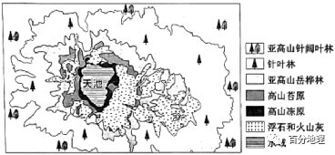

# 微专题之074 从产业结构角度分析区域发展

```
本专题摘自“百分地理”公众号，如有侵权请告之删除，谢谢。联系hhwxyhh@163.com
```

------
   
一、单选题   
长白山距今800年和距今300年经历两次火山喷发，毁灭性地破坏当地植被，使植被经历地衣—苔藓—灌丛—森林的演替过程。受偏北风影响，各坡向火山灰堆积厚度不一，而疏松的火山灰水土流失，对植被演替产生了长期影响。长白山林木植被中，岳桦林种子为风媒传播，是演替的先锋树种。下图是岳桦林平均树龄随海拔高度的变化图。据此完成下面小题。   
   
   
   
1．当前，四个坡向植被演替较为完整的是（  ）   
A．东坡   
B．南坡   
C．西坡   
D．北坡   
2．今后林线的移动趋势是（  ）   
A．向上移动   
B．向下移动   
C．水平移动   
D．高度不变   
<span style="color: rgb(255, 0, 0);">1．D根据材料可知，火山喷发毁灭性地破坏当地植被，而受偏北风影响，北坡火山灰厚度最小（火山喷发后的火山灰和浮石多，浮石等岩浆岩难以发育成土壤，其厚度大不利于植被的生长），所以北坡受其影响小，植被演替较为完整，D正确，排除ABC。故选D。</span>   
<span style="color: rgb(255, 0, 0);">2．A根据材料可知，距今300年是长白山最近的一次火山喷发，距今时间跨度相对较长，火山喷发对植被的干扰程度减弱。结合图示，随着海拔的升高，岳桦林平均树龄降低，表明岳桦林的幼树向高海拔地区拓展，今后随着全球变暖的持续，中年的岳桦林范围也会向高海拔地区推移，岳桦林结实线也会上移，种子为风媒传播，所以会推动幼树继续上移，所以今后林线的移动趋势是向上移动，故选A。</span>   
<span style="color: rgb(255, 0, 0);">【点睛】注意受火山喷发的影响，火山岩浆等喷发物会直接破坏雪线和林线植被，随着火山喷发结束，植被重新演替，雪线下移，林线上移。</span>   
（2022·吉林长春·二模）植被演替是指裸地上植被的形成和发展过程。长白山大约在800年前发生了大规模的喷发，北坡火山灰堆积量最少，东坡最多。火山喷发后长白山植被重新演替。据研究表明，火山喷发是长白山植被演替滞后的主要原因，北坡植被演替已经进入中后期，东坡植被演替还处于初期阶段。下左图、右图分别为长白山东坡、北坡植被分布和长白山亚高山区（海拔约2000米－2200米）的植被演替示意图。据此完成下面小题。   
   
   
   
   
   
   
3．影响长白山植被演替滞后的主要因素是（  ）   
A．土壤侵蚀   
B．山体高度   
C．地势起伏   
D．土壤肥力   
4．导致长白山东坡和北坡植被差异的主要因素是（  ）   
A．热量状况   
B．降水多少   
C．光照强度   
D．演替速度   
5．如果演替不受干扰，未来几年长白山北坡岳桦林分布上界将（  ）   
A．向上移动   
B．向下移动   
C．保持不变   
D．波动变化   
<span style="color: rgb(255, 0, 0);">3．A长白山植被演替滞后是由于火山喷发引起的，结合题中材料和檀被分布分析可知，火山灰盖的坡面由于长期受流水侵蚀，所以地质条件不稳定，导致植被演替滞后，故A选项正确；火山喷发后长白山植被重新演替，火山喷发是长白山植被演替滞后的主要原因，山体高度、地势起伏并不是长白山植被演替滞后的主要因素，故B、C选项错误；火山喷发后积累大量火山灰，土壤肥沃，有利于植被演替，故D选项错误；故本题选择A。</span>   
<span style="color: rgb(255, 0, 0);">4．D两坡演替总时间是一致的，北坡已进入中后期，东坡还处于初期，说明北坡演替速度快于东坡。因为长白山北坡火山灰较少，火山灰侵蚀较弱，植被演替速度更快，东坡火山灰较厚，火山灰被侵蚀程度较强，土地基础不稳定，导致植被演替速度慢。故D选项正确；长白山东坡、北坡的热量状况、 降水多少、 光照强度、等条件差异小，对植被的影响差异小，故A、B、C选项错误；故本题选择D。</span>   
<span style="color: rgb(255, 0, 0);">5．A结合长白山亚高山区的植被演替示意图，苔原带将演变为森林，从信息中可知长白山北坡处于中后期，还没有结束演替，可以推出目前长白山北坡林线还未到达理论高度，所以岳桦林分布上界将上移，故选A选项正确，B、C、D选项错。故选A。</span>   
<span style="color: rgb(255, 0, 0);">【点睛】山地垂直地域分异规律：从山麓到山顶的自然带分异类似于纬度地带分异，纬度越低，相对高度越大，自然带类型越多，自然带谱越复杂。</span>   
（2022·全国·模拟预测）植物演替指植物群落被另一植物群落代替的过程。演替一般从耐贫瘠耐旱的简单先锋植物开始，它首先占据裸露的岩石，然后随环境变化演化到复杂植物。如图分别示意我国某局部区域高山先锋植物覆盖度面积与气温、降水的关系。据此完成下面小题。   
   
   
   
6．推测图示高山4500m附近主导植被类型是（  ）   
A．先锋植物   
B．高山荒漠   
C．高山草甸   
D．常绿阔叶林   
7．影响图示高山4500～4900m先锋植被覆盖度面积变化的主导因素是（  ）   
A．土壤肥力下降   
B．气温降低明显   
C．降水逐步增加   
D．其他植被入侵   
8．随着全球气温升高，推测图示高山先锋植被变化最明显的是先锋植被（  ）   
A．下界明显下降   
B．上界略有上升   
C．彻底消失   
D．完全占据主导   
<span style="color: rgb(255, 0, 0);">6．C根据材料，植物演替一般从耐贫瘠耐旱的简单先锋植物开始的，先锋植物首先占据裸露的岩石，反映早期为干旱贫瘠的裸岩环境。如果先锋植物是高山4500米处的主导植被的话，那么说明此地应该是干旱或者裸露的岩石环境，而图示高山4500米附近年平均降水量在400mm左右，环境条件较好，而且据图知先锋植物覆盖度面积较小，都说明先锋植物不是这一高度的主导植被，而被其他较复杂植物所演替，A错误；年降水量为400毫米以上、年平均气温在2℃左右，这种气候下最明显的植被类型应该是高山草甸，C正确；根据所学，高山荒漠年降水量应该在200毫米以下，而典型的常绿阔叶林属于亚热带季风气候或亚热带季风性湿润气候区的植被，年降水量应该在800毫米以上（依据亚热带常绿阔叶林位于我国年降水量在800毫米以上的南方地区），因此B、D错误。故选C。</span>   
<span style="color: rgb(255, 0, 0);">7．D读图可知，高山4500～4900m先锋植被覆盖度面积变化表现为：低海拔处覆盖度面积明显偏小，高海拔处覆盖度面积较大，说明该地低海拔处可能由于环境变化（由开始的干旱贫瘠的裸岩环境变化为降水较多、土壤较厚较肥沃的环境），导致先锋植被被其他植被演替而覆盖度面积明显缩小，D正确。而高海拔处虽然水分条件更好，但由于可能是陡峭的裸露崖壁，土壤发育极为困难（不能说土壤肥力下降），导致只能生存先锋植物，覆盖度面积仍然较大，因此排除AC选项。据图可以看出从4500－4900米气温并没有降低非常明显，因此不是影响的主导因素，排除B。故选D。</span>   
<span style="color: rgb(255, 0, 0);">8．B随着全球气温升高，该地气温增加，热量条件增加，先锋植物上界因此会上升，B正确，A错误；先锋植被不会完全消失，C错误；先锋植物发展到一定程度，会被其他植被所替代，无法完全占据主导，D错误。故选B。</span>   
<span style="color: rgb(255, 0, 0);">【点睛】先锋植物指群落演替中最先出现的植物。先锋植物具有生长快、种子产量大、较高的扩散能力等特点，但不适应相互遮荫和根际竞争，所以很容易被后来的种群排挤掉。先锋植物 能够在严重缺乏土壤和水分的石漠化地区生长的植物；这些植物由于具有极其顽强的生命力，被科学家称为“先锋植物”。 在荒地向森林演替的过程当中，最先在荒漠生存下来的叫先锋植物。</span>   
（2022·福建省龙岩第一中学高三阶段练习）极地或高山冰川退缩区形成的冰川裸地是研究植被原生演替的理想场所。海螺沟冰川退缩区（29°34＇N，102°59＇E）位于贡嘎山东坡，青藏高原东南缘，在长达2km的范围内形成了一个具有完整植被原生演替序列的区域。下图为2017年绘制的海螺沟冰川退缩区不同原生演替阶段样地植被特征图。据此完成下面小题。   
   
   
   
9．贡嘎山东坡山麓地区所处的水平自然带为（  ）   
A．温带落叶阔叶林带   
B．亚热带常绿硬叶林带   
C．亚热带常绿阔叶林带   
D．亚寒带针叶林带   
10．推测图中S0样地的主要植被类型最可能为（  ）   
A．荒漠   
B．草原   
C．灌木   
D．乔木   
11．相较于世界上绝大多数地区冰川退缩区的植被演替，海螺沟植被演替从初始到形成成熟顶级群落的速度要快很多的原因是（  ）   
A．人类干扰更少   
B．海拔更低   
C．光照更充足   
D．水热组合条件更好   
<span style="color: rgb(255, 0, 0);">9．C结合图文信息可知，贡嘎山东坡山麓地区地处我国青藏高原东南缘，该地区的气候应为亚热带季风气候，因此贡嘎山东坡山麓地区所处的水平自然带为亚热带常绿阔叶林带，C正确。温带落叶阔叶林带对应温带季风气候区，A错误；亚热带常绿硬叶林带对应地中海气候，B错误；亚寒带针叶林带对应亚寒带针叶林气候，D错误。故选：C。</span>   
<span style="color: rgb(255, 0, 0);">10．A结合图文信息可知，青藏高原东南缘海螺沟冰川退缩区在长达2km的范围内形成了一个具有完整植被原生演替序列的区域。结合退缩时间和现今主要树种可推断，很有可能是气候变暖，冰川逐渐从S6向S0地区退缩，S1-S6的植被主要是各种乔木和灌木，而S0紧邻冰川，海拔最高气温较低，自然条件最恶劣，刚从原来的冰川覆盖区变成裸地，结合选项分析最有可能是荒漠，而出现草原、灌木和乔木的可能性较小，A正确，BCD排除。故选：A。</span>   
<span style="color: rgb(255, 0, 0);">11．D世界上绝大多数地区冰川退缩区都是无人区，基本无人类干扰，A错误；我国海螺沟相比世界纬度更高的冰川地区的冰川退缩区海拔更高，B错误；山地垂直自然带的分布和更替主要受水热组合条件的变化而变化，与光照关系不大。海螺沟地处贡嘎山东坡，青藏高原东南缘，是高原山地气候与亚热带季风气候过渡地区，相比世界其他地区的冰川地区，该地区纬度更低，降水较为丰富，水热组合条件更好，自然环境条件更优越，当冰川退缩时，植被演替从初始到形成成熟顶级群落的速度更快，C错误，D正确。故选D。</span>   
<span style="color: rgb(255, 0, 0);">【点睛】冰川退缩也称冰川消退，指由于全球气候逐渐变暖等因素，冰川的面积和体积都出现明显的减少，有些甚至消失的现象。这种现象在低和中纬度的地方尤其显著。海螺沟冰川位于横断山脉大雪山的中段，贡嘎山东坡海螺沟河源区。1930—1966年12月，该冰川退缩了1150米，平均每年退缩32米，1966—1994年该冰川后退速度变缓，退缩了373米，平均每年后退13.3米。自1994年至今，该冰川仍然处于强烈退缩状态。</span>   
白河属于黄河的一级支流，河湾迁移较频繁，基本无人为干扰。某科研团队某年夏季在白河中游某段进行河湾迁移调查，发现河湾凸岸弯顶处为面积较大的砾石边滩，上覆砾石和淤泥，从凸岸内侧(西南方)到外侧(东北方)依次发育多种植被，呈条带状环绕凸岸(下图)。凸岸不同树龄灌木的分布隐含了河湾迁移的信息。据此完成下面小题。   
   
   
   
12．推测河湾迁移过程中凸岸砾石边滩植被的演替顺序（  ）   
A．灌木植被　草本植被　湿生植被   
B．草本植被　湿生植被　灌木植被   
C．草本植被　灌木植被　湿生植被   
D．湿生植被　草本植被　灌木植被   
13．该河段凸岸灌木树龄的分布特征是（  ）   
A．自东北向西南变大   
B．自东北向西南变小   
C．自西北向东南变大   
D．自西北向东南变小   
<span style="color: rgb(255, 0, 0);">12．D砾石边滩距离河道较近，所以边滩地区最初适宜耐水植被发育，后期随着植被对泥沙阻挡，加剧了凸岸的沉积，新的砾石边滩发育，河道继续向西南方迁移，原来砾石边滩被泥沙掩盖，地势升高，地下水位下降，不再适宜湿生植被生长，原有的耐水植被逐渐被草本植物取代。随着凸岸继续向西南方向发展，土层进一步加厚，土壤含水量越来越少，更耐旱的灌木植物取代草本植物。所以凸岸砾石边滩植被的演替顺序是湿生植被－草本植被－灌木植被，D正确，ABC错。故本题选D。</span>   
<span style="color: rgb(255, 0, 0);">13．B由材料和上题分析可知，河曲处凸岸以沉积为主，白河河道凸岸内侧逐渐向西南方向迁移延伸，使得东北方向滩地形成年代最早，植被由湿生植被--草本植被--灌木植被演替，凸岸外侧（东北方）最早出现灌木植被，然后灌木植被逐渐向西南侧推进，所以东北侧的灌木树龄最长，西南侧树龄较短，形成了凸岸灌木树龄自东北向西南变小的分布规律。综合上述分析，B项正确，ACD错。所以本题选B。</span>   
<span style="color: rgb(255, 0, 0);">【点睛】“凹岸侵蚀、凸岸堆积”原理在实际生活中有许多应用：①凹岸受到侵蚀，河水较深，适宜建造港口；②凸岸接受沉积，地势平坦，土壤肥沃，有利于自然植被发育，也适宜建设村庄城镇，种植庄稼。</span>   
冰川物质平衡量等于积累量与消融量的差值，它是冰川对气候变化最直接的反映。冰川零平衡线是积累区与消融区分界线。近年来，乌鲁木齐河源1号冰川呈快速消融趋势，随着时间推移，冰川消退地区植被群落也会发生变化。通常该地冰川退缩后的裸地气温已明显上升，但直到100年后才有地衣类植物茂盛繁育，3000年后才有苔草草甸的广泛发育。甲图为乌鲁木齐河源1号冰川三次运动形成的地貌，乙图表示1号冰川物质零平衡线高度变化。据此，完成下面小题。   
   
   
   
   
   
   
14．下列关于1号冰川物质平衡的说法，正确的是（  ）   
A．冰川物质平衡量越小，冰川融化越弱   
B．冰川物质平衡量越小，冰川积累越多   
C．降水越多，冰川物质零平衡线越低   
D．气温越高，冰川物质零平衡线越低   
15．I、II、III地貌形成的先后顺序为（  ）   
A．III、I、II   
B．II、I、III   
C．I、II、III   
D．III、II、I   
16．冰川消退后，该地区植物群落演替的直接决定因素为（  ）   
A．土壤   
B．气温   
C．水分   
D．光照   
<span style="color: rgb(255, 0, 0);">14．C冰川物质平衡量等于积累量与消融量的差值，冰川物质平衡量越小，说明积累量越少，消融量越大，A、B错：降水越多，说明冰川物质积累量越大，即冰川物质平衡量大，冰川物质零平衡线越低，C对；气温越高，说明冰川物质消融量越大，即冰川物质平衡量小，冰川物质零平衡线越高，D错误。</span>   
<span style="color: rgb(255, 0, 0);">15．DI、II、III地貌属于冰川堆积形成的单冰碛垄地貌，是由冰川退缩形成的，III代表冰川运动的最远界限，是最先形成的，由于冰川退缩，II、I依次形成，排除ABC，D正确。</span>   
<span style="color: rgb(255, 0, 0);">16．A基于冰川退化后，主要留下冰碛物，冰碛物以砾石为主，初始土壤未发育，主要是荒漠植被，随着时间演化，土壤发育，A正确。由材料可知，气温上升100年后才有植物繁育，因此气温不是直接决定因素，B错误。冰川消退后，水分、光照条件会影响植物的生长，但是对于植物群落演替不会起到直接决定作用，CD错误。故选A。</span>   
<span style="color: rgb(255, 0, 0);">【点睛】冰川零平衡线与雪线的分析思路基本一致：雪线是冰雪带的下限，其高度与纬度、坡向和坡度等有关。一般来说，雪线高度与气温呈正相关；降水量越大，雪线越低，降水量越小，雪线越高；迎风坡雪线低，背风坡雪线高。</span>   
潮滩是研究植被演替（植物群落在干扰后的恢复过程或在裸地上植物群落药形成和发展过程）最理想的区域，潮滩上由潮流侵蚀作用形成的沟谷系统叫潮沟。潮滩植被（耐盐碱性：碱蓬＞大穗结缕草＞獐毛＞白茅草）的演替不止发生在水平方向，垂直方向的演替也非常明显。下图示意我国某海区潮沟分布及潮沟垂直方向植被分布。据此完成下面小题。   
   
   
   
17．推测该潮滩的地势特点（  ）   
A．东北高西南低   
B．西南高东北低   
C．西北高东南低   
D．东南高西北低   
18．乙植被可能为（  ）   
A．碱蓬   
B．大穗结缕草   
C．獐毛   
D．白茅草   
19．受全球气候变暖影响，该潮沟垂直方向的植被最先被演替的是（  ）   
A．甲   
B．乙   
C．丙   
D．丁   
<span style="color: rgb(255, 0, 0);">17．D潮滩上由潮流侵蚀作用形成的沟谷系统叫潮沟，潮水的作用越强侵蚀作用越强，靠近海洋的地区潮水的作用最强，所以图示的左侧为海洋，右侧为陆地，右侧高于西侧，结合右上角的方向标可以知道东南高，西北低，D正确。</span>   
<span style="color: rgb(255, 0, 0);">18．A乙的位置地势最低，受海水的影响大，盐碱性最强，应种植最耐盐碱的植物，结合耐盐碱性：碱蓬＞大穗结缕草＞獐毛＞白茅草可知，A正确。</span>   
<span style="color: rgb(255, 0, 0);">19．A随着全球变暖，海平面上升，海水的影响逐渐向高海拔延伸，甲地的盐碱度不断提升，甲地的植被因不适应高盐碱度逐渐被替代，A正确。</span>   
<span style="color: rgb(255, 0, 0);">【点睛】判断方向的方法：方向：1.一般指示法：上北下南，左西右东。2.有指向标的地图：指向标箭头指示北方。做题时要注意指向标箭头在地图上的实际朝向，找到北的方向。（有时候指向标是标示其他方向时要特别注意）。3.经纬网定向：经线指示南北方向；纬线指示东西方向。</span>   
（2022·全国·模拟预测）大约800年前，长白山天池火山大规模喷发，形成了全域性火山喷发物裸地。浮石和火山灰等喷发物在火山锥各坡向覆盖厚度不同，东坡最厚，北坡最薄。火山喷发改变了成土母质、地形、植被等自然条件。火山喷发后，植被重新发育，依次呈现出亚高山针阔叶林——针叶林——亚高山岳桦林——高山苔原——高山冻原的变化（下图），但这种完整的垂直变化仅局限于北坡，东坡海拔较高处的自然带呈斑块状分布，自然带演替较慢。读图，完成下面小题。   
   
   
   
20．火山喷发后，植被重新发育方向最有可能是（  ）   
A．由山麓和山顶向山腰   
B．由低海拔向高海拔   
C．由山腰向山麓和山顶   
D．由高海拔向低海拔   
21．下述造成长白山东坡自然带演替较慢的主要原因不正确（  ）   
A．降水多，火山灰等松散沉积物易流失   
B．火山喷发对东坡原有环境破坏较严重   
C．气温较低，不利植被发育   
D．浮石等岩浆岩难以发育成土壤，不利于植被发育   
<span style="color: rgb(255, 0, 0);">20．B火山喷发后，形成了全域性火山喷发物裸地，植被重新发育的方向应从水热条件比较好的低海拔开始逐渐向水热条件比较差的高海拔方向上发育，B正确，ACD错误，故选B。</span>   
<span style="color: rgb(255, 0, 0);">21．C自然带演替较慢，说明该地区自然带演替的时间要么很短，要么中途被中断过，要么是生长环境很差，演替很慢，从这三个角度来考虑的话，该地区火山喷发频繁，自然带演替过程经常被中断，植被破坏严重，加上火山灰的掩埋也不利于植物的生长，火山喷发除了有火山灰肯定也有岩浆和浮石等，不利于发育土壤。ABD叙述正确 ，不符合题意，C叙述不正确，符合题意。根据题意，答案选C。</span>   
<span style="color: rgb(255, 0, 0);">【点睛】浮石和火山灰等喷发物在火山锥各坡向覆盖厚度不同，东坡最厚，北坡最薄，主要原因在于其喷发方向及偏西风影响，当地吹偏西风，火山灰往东坡飘落，火山喷发的火山灰容易堆积，流水侵蚀作用较弱，火山灰容易保存。</span>   
（2022·全国·高三专题练习）中国东部植被带南北跨越3个气候带，具备明显的热量梯度与水热组合梯度。植被地段的燕发和蒸腾统称为蒸散。植被蒸腾与蒸散的比值（T/ET）表征植被蒸腾对生态系统蒸散的贡献率，涉及植被蒸腾和蒸发两个过程，受环境因素及植被生物因素的共同影响。下图为中国东部南北样带森林生态系统不同纬度蒸腾与蒸散比值（T/ET）。据此完成下面小题。   
   
   
   
22．依据图表，表述正确的是（  ）   
A．T/ET随纬度升高而逐渐增大   
B．T/ET随气候湿润度降低而增大   
C．T/ET随温度升高而逐渐变小   
D．蒸腾是蒸散耗水的主要途径   
23．造成南部T/ET偏低的原因可能是（  ）   
A．常绿林植被群落演替速度慢   
B．人类活动导致植被破坏   
C．林冠层截留蒸发比例较高   
D．吸纳储存水分的能力弱   
24．推测中国东部森林生态系统T/ET值南北空间差异较小的季节（  ）   
A．春季   
B．夏季   
C．秋季   
D．冬季   
<span style="color: rgb(255, 0, 0);">22．D据图可知，T/ET随纬度升高整体呈现增大的趋势，而不是逐渐增大，也有降低的，故A错。东北地区的东北部为湿润地区，而T/ET值高，故B错。T/ET值高受环境因素及植被生物因素的共同影响，不是温度单独决定，故C错。T/ET值处于0.6——0.8范围内，表明植被蒸腾是森林生态系统蒸散耗水的主要途径，故D正确。</span>   
<span style="color: rgb(255, 0, 0);">23．C南方常绿林水热条件好，植被生理活动旺盛，植被群落演替速度快，故A错。我国南方的植被覆盖率较高，并不是人类破坏植被导致的，故B错。南部林冠厚度大、结构复杂，吸纳储存水分的能力强，故D错。冠层截留蒸发量提高，削减了蒸腾对蒸散的贡献，故C正确。</span>   
<span style="color: rgb(255, 0, 0);">24．B受热量梯度与水热组合梯度影响，夏季，南北植被带生态系统均进入植被旺盛生长期，因此样带整体T/ET值较高，空间差异缩小。其他季节，北方落叶林开始进入落叶期，用于蒸騰的叶面积减少，植被生理活动减弱，但南方常绿林仍保持较高的蒸腾潜力，故B正确，ACD错。</span>   
<span style="color: rgb(255, 0, 0);">【点睛】蒸散包括了地表水分蒸发与植物体内水分的蒸腾。它是维持陆面水分平衡的重要组成部分，也是维持地表能量平衡的主要部分。</span>   
研究高山植被演替对探究全球气候变化具有重要意义。某山海拔2140～2220米处原以耐寒矮小灌木和苔藓地衣为主，草本植被难以生长，仅零星分布于“特殊区域”。近几十年来，随着气候变暖，该地区草本植物不断入侵，使原有的灌木萎缩退化。某地理科考队调查该区域时发现，不同海拔高度和坡度的草本入侵程度有显著差异（如下图）。随着草本植物入侵的加剧，被侵入地区的土壤水分增加，有机质含量减少。据此完成下面小题。   
   
   
   
25．草本入侵前“特殊区域”所在的部位是（  ）   
A．较低海拔缓坡处   
B．较高海拔缓坡处   
C．较低海拔陡坡处   
D．较高海拔陡坡处   
26．与坡度角小于20°的部位比，大于30°的部位易被草本入侵的因素是（  ）   
A．光照   
B．气温   
C．降水   
D．土壤   
<span style="color: rgb(255, 0, 0);">25．C根据图示曲线，草本易入侵的部位是低海拔处和高坡度处，说明在该自然环境下草本比灌木具有竞争优势，更适宜生长。材料“草本植被难以生长，仅零星分布于特殊区域”，说明草本入侵前的特殊区域既是适合生长的区域，故为较低海拔处陡坡。选C。</span>   
<span style="color: rgb(255, 0, 0);">26．D与灌木相比，草本植物的根系较浅，环境适应性强。坡度角大于30°的部位，受重力作用，土壤层较薄，根系较发达的灌木不易着生和定植，而草本植物更容易生存。因此大于30°的部位易被草本入侵的因素是土壤厚度，D正确；而其他因素光照 、气温 、降水因坡度增大变化不大，故排除ABC，选D。</span>   
<span style="color: rgb(255, 0, 0);">【点睛】第1题，注意理解草本入侵程度高既是适合草本生长的区域；第2题，与灌木相比，草本植物的根系较浅，环境适应性强。</span>   
（2022·广西·一模）极地或高山冰川退缩区形成的冰川裸地是研究植被原生演替的理想场所。海螺沟冰川退缩区（29°34′N，102°59′E）位于贡嘎山东坡，青藏高原东南缘，在长达2km的范围内形成了一个完整的从裸地到先锋群落再到顶级群落的连续植被原生演替序列。下表示意海螺沟冰川退缩区不同演替阶段样地植被特征。据此完成下面小题。   
<table cellspacing="0" cellpadding="0" width="577"><tbody><tr><td width="57" valign="middle" style="padding: 3.75pt 6pt;border-width: 1pt;border-color: rgb(0, 0, 0);"><section style="margin-top: 0pt;margin-bottom: 0pt;margin-left: 0pt;text-indent: 0pt;font-size: 10.5pt;font-family: &quot;Times New Roman&quot;;text-align: left;line-height: 2em;"><span style="font-family: 楷体;">样地编号</span><span style="font-family: 楷体;"></span></section></td><td width="80" valign="middle" style="padding: 3.75pt 6pt;border-width: 1pt;border-color: rgb(0, 0, 0);"><section style="margin-top: 0pt;margin-bottom: 0pt;margin-left: 0pt;text-indent: 0pt;font-size: 10.5pt;font-family: &quot;Times New Roman&quot;;text-align: left;line-height: 2em;"><span style="font-family: 楷体;">冰川退缩时间</span><span style="font-family: 楷体;"></span></section></td><td width="93" valign="middle" style="padding: 3.75pt 6pt;border-width: 1pt;border-color: rgb(0, 0, 0);"><section style="margin-top: 0pt;margin-bottom: 0pt;margin-left: 0pt;text-indent: 0pt;font-size: 10.5pt;font-family: &quot;Times New Roman&quot;;text-align: left;line-height: 2em;"><span style="font-family: 楷体;">林分密度</span><span style="font-family: 楷体;"></span></section><section style="margin-top: 0pt;margin-bottom: 0pt;margin-left: 0pt;text-indent: 0pt;font-size: 10.5pt;font-family: &quot;Times New Roman&quot;;text-align: left;line-height: 2em;"><span style="font-family: 楷体;">（株·hm</span><span style="font-family: 楷体;"><sup>-2</sup></span><span style="font-family: 楷体;">）</span><span style="font-family: 楷体;"></span></section></td><td width="55" valign="middle" style="padding: 3.75pt 6pt;border-width: 1pt;border-color: rgb(0, 0, 0);"><section style="margin-top: 0pt;margin-bottom: 0pt;margin-left: 0pt;text-indent: 0pt;font-size: 10.5pt;font-family: &quot;Times New Roman&quot;;text-align: left;line-height: 2em;"><span style="font-family: 楷体;">郁闭度</span><span style="font-family: 楷体;"></span></section></td><td width="258" valign="middle" style="padding: 3.75pt 6pt;border-width: 1pt;border-color: rgb(0, 0, 0);"><section style="margin-top: 0pt;margin-bottom: 0pt;margin-left: 0pt;text-indent: 0pt;font-size: 10.5pt;font-family: &quot;Times New Roman&quot;;text-align: left;line-height: 2em;"><span style="font-family: 楷体;">主要树种组成</span><span style="font-family: 楷体;"></span></section></td></tr><tr><td width="57" valign="middle" style="padding: 3.75pt 6pt;border-width: 1pt;border-color: rgb(0, 0, 0);"><section style="margin-top: 0pt;margin-bottom: 0pt;margin-left: 0pt;text-indent: 0pt;font-size: 10.5pt;font-family: &quot;Times New Roman&quot;;text-align: left;line-height: 2em;"><span style="font-family: 楷体;">1</span><span style="font-family: 楷体;"></span></section></td><td width="80" valign="middle" style="padding: 3.75pt 6pt;border-width: 1pt;border-color: rgb(0, 0, 0);"><section style="margin-top: 0pt;margin-bottom: 0pt;margin-left: 0pt;text-indent: 0pt;font-size: 10.5pt;font-family: &quot;Times New Roman&quot;;text-align: left;line-height: 2em;"><span style="font-family: 楷体;">20</span><span style="font-family: 楷体;">15</span><span style="font-family: 楷体;"></span></section></td><td width="93" valign="middle" style="padding: 3.75pt 6pt;border-width: 1pt;border-color: rgb(0, 0, 0);"><section style="margin-top: 0pt;margin-bottom: 0pt;margin-left: 0pt;text-indent: 0pt;font-size: 10.5pt;font-family: &quot;Times New Roman&quot;;text-align: left;line-height: 2em;"><span style="font-family: 楷体;">--</span><span style="font-family: 楷体;"></span></section></td><td width="55" valign="middle" style="padding: 3.75pt 6pt;border-width: 1pt;border-color: rgb(0, 0, 0);"><section style="margin-top: 0pt;margin-bottom: 0pt;margin-left: 0pt;text-indent: 0pt;font-size: 10.5pt;font-family: &quot;Times New Roman&quot;;text-align: left;line-height: 2em;"><span style="font-family: 楷体;">--</span><span style="font-family: 楷体;"></span></section></td><td width="258" valign="middle" style="padding: 3.75pt 6pt;border-width: 1pt;border-color: rgb(0, 0, 0);"><section style="margin-top: 0pt;margin-bottom: 0pt;margin-left: 0pt;text-indent: 0pt;font-size: 10.5pt;font-family: &quot;Times New Roman&quot;;text-align: left;line-height: 2em;"><span style="font-family: 楷体;">裸地</span><span style="font-family: 楷体;"></span></section></td></tr><tr><td width="57" valign="middle" style="padding: 3.75pt 6pt;border-width: 1pt;border-color: rgb(0, 0, 0);"><section style="margin-top: 0pt;margin-bottom: 0pt;margin-left: 0pt;text-indent: 0pt;font-size: 10.5pt;font-family: &quot;Times New Roman&quot;;text-align: left;line-height: 2em;"><span style="font-family: 楷体;">2</span><span style="font-family: 楷体;"></span></section></td><td width="80" valign="middle" style="padding: 3.75pt 6pt;border-width: 1pt;border-color: rgb(0, 0, 0);"><section style="margin-top: 0pt;margin-bottom: 0pt;margin-left: 0pt;text-indent: 0pt;font-size: 10.5pt;font-family: &quot;Times New Roman&quot;;text-align: left;line-height: 2em;"><span style="font-family: 楷体;">1998</span><span style="font-family: 楷体;"></span></section></td><td width="93" valign="middle" style="padding: 3.75pt 6pt;border-width: 1pt;border-color: rgb(0, 0, 0);"><section style="margin-top: 0pt;margin-bottom: 0pt;margin-left: 0pt;text-indent: 0pt;font-size: 10.5pt;font-family: &quot;Times New Roman&quot;;text-align: left;line-height: 2em;"><span style="font-family: 楷体;">3770</span><span style="font-family: 楷体;"></span></section></td><td width="55" valign="middle" style="padding: 3.75pt 6pt;border-width: 1pt;border-color: rgb(0, 0, 0);"><section style="margin-top: 0pt;margin-bottom: 0pt;margin-left: 0pt;text-indent: 0pt;font-size: 10.5pt;font-family: &quot;Times New Roman&quot;;text-align: left;line-height: 2em;"><span style="font-family: 楷体;">0.287</span><span style="font-family: 楷体;"></span></section></td><td width="258" valign="middle" style="padding: 3.75pt 6pt;border-width: 1pt;border-color: rgb(0, 0, 0);"><section style="margin-top: 0pt;margin-bottom: 0pt;margin-left: 0pt;text-indent: 0pt;font-size: 10.5pt;font-family: &quot;Times New Roman&quot;;text-align: left;line-height: 2em;"><span style="font-family: 楷体;">川滇柳、冬瓜杨、沙棘幼树群落</span><span style="font-family: 楷体;"></span></section></td></tr><tr><td width="57" valign="middle" style="padding: 3.75pt 6pt;border-width: 1pt;border-color: rgb(0, 0, 0);"><section style="margin-top: 0pt;margin-bottom: 0pt;margin-left: 0pt;text-indent: 0pt;font-size: 10.5pt;font-family: &quot;Times New Roman&quot;;text-align: left;line-height: 2em;"><span style="font-family: 楷体;">3</span><span style="font-family: 楷体;"></span></section></td><td width="80" valign="middle" style="padding: 3.75pt 6pt;border-width: 1pt;border-color: rgb(0, 0, 0);"><section style="margin-top: 0pt;margin-bottom: 0pt;margin-left: 0pt;text-indent: 0pt;font-size: 10.5pt;font-family: &quot;Times New Roman&quot;;text-align: left;line-height: 2em;"><span style="font-family: 楷体;">1980</span><span style="font-family: 楷体;"></span></section></td><td width="93" valign="middle" style="padding: 3.75pt 6pt;border-width: 1pt;border-color: rgb(0, 0, 0);"><section style="margin-top: 0pt;margin-bottom: 0pt;margin-left: 0pt;text-indent: 0pt;font-size: 10.5pt;font-family: &quot;Times New Roman&quot;;text-align: left;line-height: 2em;"><span style="font-family: 楷体;">31070</span><span style="font-family: 楷体;"></span></section></td><td width="55" valign="middle" style="padding: 3.75pt 6pt;border-width: 1pt;border-color: rgb(0, 0, 0);"><section style="margin-top: 0pt;margin-bottom: 0pt;margin-left: 0pt;text-indent: 0pt;font-size: 10.5pt;font-family: &quot;Times New Roman&quot;;text-align: left;line-height: 2em;"><span style="font-family: 楷体;">0.947</span><span style="font-family: 楷体;"></span></section></td><td width="258" valign="middle" style="padding: 3.75pt 6pt;border-width: 1pt;border-color: rgb(0, 0, 0);"><section style="margin-top: 0pt;margin-bottom: 0pt;margin-left: 0pt;text-indent: 0pt;font-size: 10.5pt;font-family: &quot;Times New Roman&quot;;text-align: left;line-height: 2em;"><span style="font-family: 楷体;">冬瓜杨、川滇柳、沙棘中树与大树、云冷杉幼树与小树群落</span><span style="font-family: 楷体;"></span></section></td></tr><tr><td width="57" valign="middle" style="padding: 3.75pt 6pt;border-width: 1pt;border-color: rgb(0, 0, 0);"><section style="margin-top: 0pt;margin-bottom: 0pt;margin-left: 0pt;text-indent: 0pt;font-size: 10.5pt;font-family: &quot;Times New Roman&quot;;text-align: left;line-height: 2em;"><span style="font-family: 楷体;">4</span><span style="font-family: 楷体;"></span></section></td><td width="80" valign="middle" style="padding: 3.75pt 6pt;border-width: 1pt;border-color: rgb(0, 0, 0);"><section style="margin-top: 0pt;margin-bottom: 0pt;margin-left: 0pt;text-indent: 0pt;font-size: 10.5pt;font-family: &quot;Times New Roman&quot;;text-align: left;line-height: 2em;"><span style="font-family: 楷体;">1966</span><span style="font-family: 楷体;"></span></section></td><td width="93" valign="middle" style="padding: 3.75pt 6pt;border-width: 1pt;border-color: rgb(0, 0, 0);"><section style="margin-top: 0pt;margin-bottom: 0pt;margin-left: 0pt;text-indent: 0pt;font-size: 10.5pt;font-family: &quot;Times New Roman&quot;;text-align: left;line-height: 2em;"><span style="font-family: 楷体;">16744</span><span style="font-family: 楷体;"></span></section></td><td width="55" valign="middle" style="padding: 3.75pt 6pt;border-width: 1pt;border-color: rgb(0, 0, 0);"><section style="margin-top: 0pt;margin-bottom: 0pt;margin-left: 0pt;text-indent: 0pt;font-size: 10.5pt;font-family: &quot;Times New Roman&quot;;text-align: left;line-height: 2em;"><span style="font-family: 楷体;">0.830</span><span style="font-family: 楷体;"></span></section></td><td width="258" valign="middle" style="padding: 3.75pt 6pt;border-width: 1pt;border-color: rgb(0, 0, 0);"><section style="margin-top: 0pt;margin-bottom: 0pt;margin-left: 0pt;text-indent: 0pt;font-size: 10.5pt;font-family: &quot;Times New Roman&quot;;text-align: left;line-height: 2em;"><span style="font-family: 楷体;">冬瓜杨、川滇柳、沙棘小树、云冷杉幼苗群落</span><span style="font-family: 楷体;"></span></section></td></tr><tr><td width="57" valign="middle" style="padding: 3.75pt 6pt;border-width: 1pt;border-color: rgb(0, 0, 0);"><section style="margin-top: 0pt;margin-bottom: 0pt;margin-left: 0pt;text-indent: 0pt;font-size: 10.5pt;font-family: &quot;Times New Roman&quot;;text-align: left;line-height: 2em;"><span style="font-family: 楷体;">5</span><span style="font-family: 楷体;"></span></section></td><td width="80" valign="middle" style="padding: 3.75pt 6pt;border-width: 1pt;border-color: rgb(0, 0, 0);"><section style="margin-top: 0pt;margin-bottom: 0pt;margin-left: 0pt;text-indent: 0pt;font-size: 10.5pt;font-family: &quot;Times New Roman&quot;;text-align: left;line-height: 2em;"><span style="font-family: 楷体;">1958</span><span style="font-family: 楷体;"></span></section></td><td width="93" valign="middle" style="padding: 3.75pt 6pt;border-width: 1pt;border-color: rgb(0, 0, 0);"><section style="margin-top: 0pt;margin-bottom: 0pt;margin-left: 0pt;text-indent: 0pt;font-size: 10.5pt;font-family: &quot;Times New Roman&quot;;text-align: left;line-height: 2em;"><span style="font-family: 楷体;">2574</span><span style="font-family: 楷体;"></span></section></td><td width="55" valign="middle" style="padding: 3.75pt 6pt;border-width: 1pt;border-color: rgb(0, 0, 0);"><section style="margin-top: 0pt;margin-bottom: 0pt;margin-left: 0pt;text-indent: 0pt;font-size: 10.5pt;font-family: &quot;Times New Roman&quot;;text-align: left;line-height: 2em;"><span style="font-family: 楷体;">0.757</span><span style="font-family: 楷体;"></span></section></td><td width="258" valign="middle" style="padding: 3.75pt 6pt;border-width: 1pt;border-color: rgb(0, 0, 0);"><section style="margin-top: 0pt;margin-bottom: 0pt;margin-left: 0pt;text-indent: 0pt;font-size: 10.5pt;font-family: &quot;Times New Roman&quot;;text-align: left;line-height: 2em;"><span style="font-family: 楷体;">冬瓜杨大树、云冷杉小树与中树群落</span><span style="font-family: 楷体;"></span></section></td></tr><tr><td width="57" valign="middle" style="padding: 3.75pt 6pt;border-width: 1pt;border-color: rgb(0, 0, 0);"><section style="margin-top: 0pt;margin-bottom: 0pt;margin-left: 0pt;text-indent: 0pt;font-size: 10.5pt;font-family: &quot;Times New Roman&quot;;text-align: left;line-height: 2em;"><span style="font-family: 楷体;">6</span><span style="font-family: 楷体;"></span></section></td><td width="80" valign="middle" style="padding: 3.75pt 6pt;border-width: 1pt;border-color: rgb(0, 0, 0);"><section style="margin-top: 0pt;margin-bottom: 0pt;margin-left: 0pt;text-indent: 0pt;font-size: 10.5pt;font-family: &quot;Times New Roman&quot;;text-align: left;line-height: 2em;"><span style="font-family: 楷体;">1930</span><span style="font-family: 楷体;"></span></section></td><td width="93" valign="middle" style="padding: 3.75pt 6pt;border-width: 1pt;border-color: rgb(0, 0, 0);"><section style="margin-top: 0pt;margin-bottom: 0pt;margin-left: 0pt;text-indent: 0pt;font-size: 10.5pt;font-family: &quot;Times New Roman&quot;;text-align: left;line-height: 2em;"><span style="font-family: 楷体;">576</span><span style="font-family: 楷体;"></span></section></td><td width="55" valign="middle" style="padding: 3.75pt 6pt;border-width: 1pt;border-color: rgb(0, 0, 0);"><section style="margin-top: 0pt;margin-bottom: 0pt;margin-left: 0pt;text-indent: 0pt;font-size: 10.5pt;font-family: &quot;Times New Roman&quot;;text-align: left;line-height: 2em;"><span style="font-family: 楷体;">0.843</span><span style="font-family: 楷体;"></span></section></td><td width="258" valign="middle" style="padding: 3.75pt 6pt;border-width: 1pt;border-color: rgb(0, 0, 0);"><section style="margin-top: 0pt;margin-bottom: 0pt;margin-left: 0pt;text-indent: 0pt;font-size: 10.5pt;font-family: &quot;Times New Roman&quot;;text-align: left;line-height: 2em;"><span style="font-family: 楷体;">云冷杉中树与大树、冬瓜杨大树群落</span><span style="font-family: 楷体;"></span></section></td></tr><tr><td width="57" valign="middle" style="padding: 3.75pt 6pt;border-width: 1pt;border-color: rgb(0, 0, 0);"><section style="margin-top: 0pt;margin-bottom: 0pt;margin-left: 0pt;text-indent: 0pt;font-size: 10.5pt;font-family: &quot;Times New Roman&quot;;text-align: left;line-height: 2em;"><span style="font-family: 楷体;">7</span><span style="font-family: 楷体;"></span></section></td><td width="80" valign="middle" style="padding: 3.75pt 6pt;border-width: 1pt;border-color: rgb(0, 0, 0);"><section style="margin-top: 0pt;margin-bottom: 0pt;margin-left: 0pt;text-indent: 0pt;font-size: 10.5pt;font-family: &quot;Times New Roman&quot;;text-align: left;line-height: 2em;"><span style="font-family: 楷体;">1890</span><span style="font-family: 楷体;"></span></section></td><td width="93" valign="middle" style="padding: 3.75pt 6pt;border-width: 1pt;border-color: rgb(0, 0, 0);"><section style="margin-top: 0pt;margin-bottom: 0pt;margin-left: 0pt;text-indent: 0pt;font-size: 10.5pt;font-family: &quot;Times New Roman&quot;;text-align: left;line-height: 2em;"><span style="font-family: 楷体;">378</span><span style="font-family: 楷体;"></span></section></td><td width="55" valign="middle" style="padding: 3.75pt 6pt;border-width: 1pt;border-color: rgb(0, 0, 0);"><section style="margin-top: 0pt;margin-bottom: 0pt;margin-left: 0pt;text-indent: 0pt;font-size: 10.5pt;font-family: &quot;Times New Roman&quot;;text-align: left;line-height: 2em;"><span style="font-family: 楷体;">0.807</span><span style="font-family: 楷体;"></span></section></td><td width="258" valign="middle" style="padding: 3.75pt 6pt;border-width: 1pt;border-color: rgb(0, 0, 0);"><section style="margin-top: 0pt;margin-bottom: 0pt;margin-left: 0pt;text-indent: 0pt;font-size: 10.5pt;font-family: &quot;Times New Roman&quot;;text-align: left;line-height: 2em;"><span style="font-family: 楷体;">云冷杉顶级群落</span><span style="font-family: 楷体;"></span></section></td></tr></tbody></table>

   
27．海螺沟冰川退缩区，种间竞争力最强的树种是（  ）   
A．川滇柳、冬瓜杨   
B．云冷杉、沙棘   
C．冬瓜杨、云冷杉   
D．沙棘、川滇柳   
28．在植被原生演替过程中（  ）   
A．植被郁闭度升高   
B．地表径流流速加快   
C．气温日较差增大   
D．土壤发育趋于成熟   
29．与同一演替阶段北美冰川退缩区相比，海螺沟冰川退缩区单位面积植被生物量大是由于海螺沟（  ）   
A．生物群落结构较稳定   
B．水分和热量条件较好   
C．植物的种类复杂多样   
D．人类活动干扰程度小   
<span style="color: rgb(255, 0, 0);">27．C极地或高山冰川退缩区，指原来是 冰川后来冰川融化的区域。退缩时间和成熟的 关系，退缩的越早，被风化的越久，植被也就 越成熟。比如今年2018年，2015年冰川退缩 的地方，只有三年的风化期。1890 年冰川退缩 的地方，已经有了128年的风化期。从表中可以看出，冰川退缩的时间越早，植物越成熟, 越接近顶级群落。刚开始由冰川融化而演化为裸地以后，只有一些适应能力强的物种生存, 中间有些时间段，植被种类比较多，可以说是杂草丛生，各种植被种类在相互的竞争，都没 有达到一种垄断的地位，慢慢的竞争能力最强的物种占据了主流，成为了云冷杉顶级群落，在此过程中，冬瓜杨很早就开始生长，一直到云冷杉顶级群落之前，云冷杉也开始的比较早，最终成为该区域的王者，达到了顶级群落的位置，C正确。故选C。</span>   
<span style="color: rgb(255, 0, 0);">28．D在植被演替过程中，冰川退缩的越早，裸地被风化的越严重，经过植被的不断生长、死亡，土壤中的有机质越来越多，土壤越成熟，D正确;植被的郁闭度不是一直在升高，A错误；同样由于植被的增多，植被的涵养水源功能增强，地表径流会减慢，B错误；由于植被的增多，气温日较差在减小，C错误。故选D。</span>   
<span style="color: rgb(255, 0, 0);">29．B同一演替阶段指的是,同样的时间段，相同的演替阶段才有可比性。材料中给出了海螺沟的纬度较低，所以植被生物量比较大。有些地方生物群落结构虽然稳定，但是生物量不一定大，比如华北地区，经过多年的演化，也形成了比较稳定的生物群落，但是植被量相比南方要小得多。一定要关注重点词，生物量大，就是枝繁叶茂。比如，分析热带雨林地区生物量大的原因，更多的是从气候角度去分析。植物的种类多，也可以归结到水分和热量条件较好，特别是热量条件。人类活动干扰程度应该影响不大。故选B。</span>   
<span style="color: rgb(255, 0, 0);">【点睛】本题考查物种的演替过程，考查物种对环境适应性，解题关键是材料信息进入深入分析，提取有效信息作答。</span>   
（2022·全国·高三专题练习）黄河源某河湾宽谷地区,植被以高寒草甸为主，兼有少量金露梅灌木。凸岸边津向北有规律地分布着优势植被种群。研究发现河湾横向迁移过程中各种群依次演替，在曲流地貌的循环演化过程中灌木始终无法占据河谷的优势地位。下图示意该河湾宽谷地区植物群落的分布。   
据此完成下面小题。   
   
   
   
30．河湾凸岸地区植被种群空间分异的主要影响因素是   
A．光照   
B．土壤   
C．热量   
D．降水   
31．华扁穗草--高原蒿草群落将演化为   
A．近岸水草群落   
B．华扁穗草群落   
C．华扁穗草--高原毛茛群落   
D．金露梅--鹅绒委陵菜群落   
32．灌木始终无法成为图示地区的优势植被，主要原因是   
A．河岸侧向侵蚀限制种群持续扩大   
B．载畜量增加使牲畜的啃食量较大   
C．浅根系在群落间的养分竞争力弱   
D．恶劣的气候导致灌木生长较缓慢   
<span style="color: rgb(255, 0, 0);">30．B河湾凸岸地区由泥沙沉积形成，由于形成时间不同，土壤存在一定的差异，导致河湾凸岸地区植被种群空间分异，B正确；河湾凸岸地区地形平坦，光照、热量和降水的差异较小，ACD错误。故选B。</span>   
<span style="color: rgb(255, 0, 0);">31．D河湾横向迁移过程中各种群依次演替，华扁穗草--高原蒿草群落向河岸更远处的植被种群演化，华扁穗草--高原蒿草群落更远处的植被种群为金露梅--鹅绒委陵菜群落，D正确，ABC错误。故选D。</span>   
<span style="color: rgb(255, 0, 0);">32．A河湾凸岸地区不断的堆积，凹岸不断的侵蚀，灌木生长在水淹不到的高处，随着凹岸的不断侵蚀崩塌，灌木失去生存环境，数量减少，凸岸则形成边滩，开始新的原生演替，草类开始生长，数量增多，故灌木始终无法成为图示地区的优势植被，A正确；灌木不是牲畜的主要食物来源，载畜量增加使牲畜的啃食量较大，会使草类减少，B错误；灌木根系较深，C错误；灌木的适应能力较强，D错误；故选A。</span>   
盐地碱蓬作为滨海重盐碱地植被演替的一种先锋植物，其生长对土壤盐分降低起到十分重要的作用。冀东某地位于滨海重盐碱地分布区，该地地势低洼，地下水位浅且矿化度高，土壤盐碱化极其严重，土壤含盐量高。下图示意该地盐地碱蓬地块和裸地地块0～60cm土层土壤盐分动态变化。据此完成下面小题。   
   
   
   
33．关于该地盐地碱蓬地块和裸地地块0～60cm土层土壤盐分动态变化，叙述正确的是(   
)   
A．随着土壤深度增加，裸地地块土壤盐分呈增加趋势   
B．盐地碱蓬地块0～10cm土层，盐地碱蓬降盐作用最为显著   
C．0～60cm土体中，盐地碱蓬地块各土层盐分均大于裸地   
D．10～20cm土层中，盐地碱蓬地块土壤盐分月变化幅度最大   
34．推测盐地碱蓬的生长降低土壤盐分的主要过程为(   
)   
A．盐地碱蓬通过根系吸收的盐分，随着水分一起蒸腾散失   
B．盐地碱蓬的生长增加地表植被覆盖，减少土壤水分蒸发   
C．盐地碱蓬的生长改善土壤结构，加速土壤水分入渗，促进土壤盐分淋溶   
D．盐地碱蓬的生长增加土壤中的有机质，减少土壤中的盐分   
<span style="color: rgb(255, 0, 0);">33．B根据图示信息判断，随着土深度增加，裸地地块土盐分呈减少趋势，故A项错；在0——10cm土层，盐地碱蓬地块和裸地地块土壤盐分差异最大，说明盐地破蓬对盐分的改善作用最大，故B为正确选项；0——60cm土体中，裸地各土层盐分均大于盐地碱蓬地块，故C项错；盐地碱蓬地块土壤盐分月变化幅度最大的土层深度为0——10cm土层，故D项错。故选B。</span>   
<span style="color: rgb(255, 0, 0);">34．C盐地破蓬通过根系吸收的盐分，会储存在碱蓬的枝叶中，并不会随着水分散失，故A项错；盐地碱蓬的生长会增强水分的蒸腾作用，增加土壤水分的散失，故B项错；盐地碱蓬的生长增加土壤孔隙度，进而提升了滨海盐土土壤水分入滲性能，促进土壤盐分的淋洗，利于土壤表层脱盐，降低土壤盐分，故C为正确选项；盐地碱蓬的生长可以增加土壕有机质的含量，但有机质含量的增加不会直接影响土壤盐分的含量，故D项错。故选C。</span>   
二、综合题   
35．（2022·河北保定·一模）阅读图文材料，完成下列要求。   
鼎湖山国家级自然保护区位于广东省肇庆市，多丘陵和低山，最高峰海拔1000.3m。鼎湖山分布着典型森林植被演替序列的3种森林类型，伴随自然演替进程，土壤水分储量逐步发生变化。下图示意鼎湖山各林型下土壤体积含水量的垂直变化。   
   
   
   
(1)指出鼎湖山森林演替早期、中期和晚期阶段森林类型。   
(2)描述鼎湖山森林演替从早期到晚期阶段土壤体积含水量变化特征并分析原因。   
<span style="color: rgb(255, 0, 0);">【答案】(1)森林演替早期阶段：马尾松人工林；演替中期阶段：马尾松针阔叶混交林；演替后期阶段：季风常绿阔叶林。</span>   
<span style="color: rgb(255, 0, 0);">(2)特征：鼎湖山森林演替从早期到晚期阶段，土壤体积含水量逐步提升；表层土壤体积含水量增加显著。</span>   
<span style="color: rgb(255, 0, 0);">原因：鼎湖山森林演替从早期到晚期阶段，地表植被组成与结构趋于复杂，土壤理化性质逐步改善，土壤体积含水量逐步提升；季风常绿阔叶林土壤理化性质不断完善（土壤有机质、腐殖质含量增加等），土壤蓄水、保水能力强，表层土壤体积含水量增加显著。</span>   
<span style="color: rgb(255, 0, 0);">【解析】本题与广东省肇庆市鼎山湖国家级自然保护区为材料，设置了两个小题，涉及到景区森林演替类型、土壤含水量变化特征及原因分析等知识，考查了学生对相关知识的掌握情况。(1)广东省肇庆市位于我国亚热带地区，其稳定的森林类型为亚热带常绿阔叶林，又据材料和示意图可知，鼎湖山分布着典型森林植被演替序列的3种森林类型，分别是马尾松人工林、马尾松针阔混交林、季风常绿阔叶林。马尾松是一种耐酸性土壤的乔木，适合在亚热带地区形成的红壤、黄壤上生长，是亚热带森林的先锋军，随着马尾松的生长，逐渐会形成马尾松与阔叶林混杂的针阔混交林，最后，形成稳定的季风常绿阔叶林。因此鼎湖山森林演替早期、中期和晚期阶段森林类型：马尾松人工林；马尾松针阔叶混交林；季风常绿阔叶林。(2)特征：根据上题分析鼎湖山森林演替早期、中期和晚期阶段森林类型：马尾松人工林；马尾松针阔叶混交林；季风常绿阔叶林。结合干季湿季土壤体积含水量可知，土壤体积含水量，季风常绿阔叶林&gt;马尾松针阔混交林&gt;马尾松人工林，因此鼎湖山森林演替从早期到晚期阶段，土壤体积含水量逐步提升；又据二图可知，表层土壤比下层高，表层土壤体积含水量增加显著。</span>   
<span style="color: rgb(255, 0, 0);">原因：鼎山湖森林在演替中从早期的针叶林到中期的针阔混交林，到晚期的常绿阔叶林，地表植被组成与结构趋于复杂，土壤理化性质得到改善，土壤含水量得到提升；最后形成的稳定的常绿阔叶林，土壤理化性质不断完善，土壤有机质、腐殖质含量增加，土壤蓄水保水能力增强，表层土壤体积含水量显著增加。</span>   
36．（2022·全国·高二课时练习）阅读下面图文材料，完成下列问题。   
土壤中排放的二氧化碳主要来自生物残体分解和根系呼吸，与土壤温度密切相关。土壤呼吸已成为陆地生态系统碳循环和气候变化的重要研究内容。受人类活动干扰，我国东北某山地植被群落发生了逆行演替：红松阔叶林→阔叶杂木林→灌木林→草本。某科研团队于某年8月份进行实地监测，并绘制了统计图线（如下图）。   
   
   
   
（1）概括土壤二氧化碳排放量的昼变化规律。   
（2）推测红松阔叶林土壤二氧化碳排放量峰值高且明显滞后的原因。   
（3）有人认为，由森林逆行演替为草本，土壤二氧化碳排放量减少，有利于缓解全球变暖。试对此提出自己的看法。   
<span style="color: rgb(255, 0, 0);">【答案】（1）规律：整体先上升后下降。</span>   
<span style="color: rgb(255, 0, 0);">（2）红松阔叶林生物量大，土壤中生物残体（或枯枝落叶）多，土壤微生物丰富，土壤排放二氧化碳多；8月份红松阔叶林树冠茂密，林下光照较弱，土壤升温慢。</span>   
<span style="color: rgb(255, 0, 0);">（3）此说法不正确。绿色植物通过光合作用吸收大气中的二氧化碳，通过土壤呼吸向大气中释放二氧化碳，参与全球的碳循环，有助于维持全球的碳平衡。与草本植物相比较，森林植物群落丰富，维持碳平衡的能力强，可以更多地吸收大气中的二氧化碳；演替为草本，维持碳平衡的能力减弱，吸收的二氧化碳数量减少，会使得温室效应增强。</span>   
<span style="color: rgb(255, 0, 0);">【解析】本题以土壤中排放的二氧化碳为材料背景，主要考查土壤二氧化碳排放及全球气候变暖的相关问题，难度一般，但是需要重点读图，通过读图并结合所学知识和材料进行分析，主要针对对学生读图能力的考查。（1）结合图示可分析出该地区土壤二氧化碳排放量在8时开始整体上升，在午后升至峰值后开始整体下降。所以土壤二氧化碳排放量的昼变化规律为整体先上升后下降。（2）结合图示可知，当地植物根系和土壤中的微生物呼吸作用均明显受当地气温变化的影响，中午前后气温高时排放量大，而其他时段气温较低，排放量小，但是不同植被状况下土壤温度变化会有所不同，植被覆盖率、生物量、土壤水分等都会影响土壤温度的变化。而红松阔叶林土壤二氧化碳排放量峰值最高主要是因为红松阔叶林生物量最大，土壤中枯枝落叶多，微生物丰富，土壤呼吸放出的二氧化碳多；8月份红松阔叶林树冠茂密，削弱光照，林下光照较弱，土壤升温比其他植被情况下缓慢，土壤温度高值出现的时间会滞后，土壤二氧化碳排放量峰值出现的时间也会相应滞后。</span>   
<span style="color: rgb(255, 0, 0);">（3）由森林逆行演替为草本，土壤二氧化碳排放量减少不能够缓解全球变暖现象。因为绿色植物通过光合作用吸收大气中的二氧化碳，通过土壤呼吸作用向大气释放二氧化碳进而参与全球的碳循环，维持全球的碳平衡。全球变暖主要是由人类活动排放大量的二氧化碳等温室气体和植被破坏导致二氧化碳消耗减少所造成的，因此森林植物群落丰富，能更多吸收大气中二氧化碳，维持碳平衡；森林逆行演替为草本，土壤二氧化碳排放量减少，但光合作用消耗的二氧化碳也会大减，维持碳平衡的能力减弱，反而使得温室效应增强。</span>   
37．阅读图文资料,完成下列要求。   
植被盖度足指植物地上部分投影的面积占地面面积的比率。苏贝淖是鄂尔多斯高原盆地上的一个碱化湖泊,沟泊周边地貌主要为湖盆滩地、苏贝淖处于干旱、半干旱区,海拔1290米,周边海拔1330——l370米.周边滩地地下水埋深较浅。湖盆滩地范围内湿生（苔草）、盐生（碱蓬）、中生（芦苇、马兰、芨芨草）、旱生与沙生（羊草、灰蒿、沙高）植被种群总体呈现出一定的分带现象。下图示意苏贝淖滩地单个物种盖度随地下水位埋深变化。   
   
   
   
（1）描述苏贝淖滩地优势植被随地下水埋深增加总体的空间演替序列。   
（2）指出碱蓬在苏贝淖滩地的适生优势水位,并说明判断依据。   
（3）说明地下水位埋深1.6米处各物种的分布特证。   
（4）指出鄂尔多斯干旱区的主体物种，并分析地下水开采对苏贝掉地区植被种群可能产生的影响。   
<span style="color: rgb(255, 0, 0);">【答案】（1）随着地下水埋深的增加,优势植被种群总体呈现出湿生-&gt;盐生-→中生-旱生与沙生（苔草,碱蓬→芦苇、马兰、芨芨草→羊草、灰蒿、沙蒿等）的空间演替序列。</span>   
<span style="color: rgb(255, 0, 0);">（2）水位:地下水埋深0.4——0.8米。</span>   
<span style="color: rgb(255, 0, 0);">依据:碱蓬在地下水埋深0.4——0.8米之间盖度出现峰值,最大盖度接近80%，碱蓬生长状况好,故地下水埋深0.4——0.8米为其适生优势水位。</span>   
<span style="color: rgb(255, 0, 0);">（3）各植被类型均有分布,盖度相差不大,物种多样性最大。</span>   
<span style="color: rgb(255, 0, 0);">（4）主体物种:羊草、灰蒿、沙蒿等旱生与沙生植被。</span>   
<span style="color: rgb(255, 0, 0);">影响:湿生与盐生植被生长依赖地下水，因此地下水位下降对较湿润区植被生长的影响明显,甚至会引发优势植被空间演替变化;事生与沙生植被分布基本不受水位埋深的影响，因此地下水位下降不会对干旱区植被种群造成明显的影响。</span>   
<span style="color: rgb(255, 0, 0);">【解析】本题以苏贝淖滩地地下水位与优势植被的关系为情景，考查优势植被的空间演替、适生优势水位、生态交错带及地下水开采对植被种群的影响，旨在考查考生获取和解读地理信息、调动和运用地理知识的能力，区域认知、综合思维的学科核心素养。（1）读图可知，湿生植被生存的环境地下水埋深最浅，而旱生与沙生植被生存的环境地下水埋深最深，苏贝淖滩地优势植被随着地下水埋深的增加，大致呈现出湿生→盐生→中生→旱生与沙生的空间演替规律排列。（2）读图可知，碱蓬在地下水埋深0.2米处盖度迅速增加，在地下水埋深0.4——0.8米之间盖度最大，最大盖度接近80%，说明此种地下水埋深是碱蓬生长最好的环境，故地下水埋深0.4——0.8米为其适生优势水位。（3）读图可知，在地下水位埋深1.6米处无论是湿生、盐生、中生还是旱生与沙生植被类型均有分布，盖度均大于10%，各种植被类型盖度相差不大，说明此种地下水埋深的环境物种多样性最丰富。（4）鄂尔多斯干旱区的主体物种为适生优势水位较深的羊草、灰蒿、沙蒿等旱生与沙生植被。由于湿生与盐生植被生长对地下水依赖性强，因此地下水开采导致地下水位下降对湿生与盐生植被生长的影响最明显，甚至会引发优势植被逐渐衰退，被其他植被替代；旱生与沙生植被分布受水位埋深的影响很小，因此地下水开采导致地下水位下降不会对干旱区植被种群造成明显的影响。</span>
