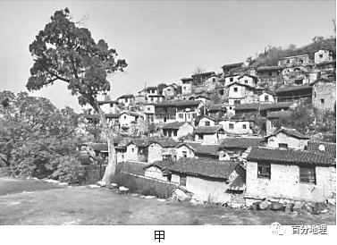

# 微专题之074 从产业结构角度分析区域发展

```
本专题摘自“百分地理”公众号，如有侵权请告之删除，谢谢。联系hhwxyhh@163.com
```

------
   
一、单选题   
（2022·山东·高三阶段练习）在同一海拔带内，坡向和坡位通过改变坡面接收的太阳辐射量和水文过程，形成影响山区小尺度上植被格局的重要微地形因子。祁连山是我国西北典型的高寒山区，海拔2500～3300m为典型的森林草原带，带内随着坡向变化，植被呈现出从山地草原到山地草甸，再到青海云杉林的镶嵌景观。下图示意祁连山森林草原带坡面地上生物量分布。据此完成下面小题。   
   
   
   
1．推测祁连山地青海云杉林主要分布在（  ）   
A．南坡上坡位   
B．西南坡中坡位   
C．西坡下坡位   
D．北坡中坡位   
2．形成祁连山森林草原带坡向差异的主导因素是（  ）   
A．大气降水量   
B．土壤含水量   
C．土壤温度   
D．土壤蒸发量   
<span style="color: rgb(255, 0, 0);">1．D由材料和图示知：祁连山森林草原带内，随着坡向由南转北，阴坡因水热组合优于阳坡，植被类型从山地草原（南-西南坡）过渡到山地草甸再到青海云杉林的变化。因为水分对云杉林的生长极其重要，且该地区是比较缺干旱的青海地区，北披为迎风坡和阴坡，降水多、蒸发较弱，土壤湿度较大，适合森林生长，而发育云杉林分布的地方植物也会比草原和草甸地区多得多，此图中符合这个特点的只有北坡，北披中坡位的生物量明显比下坡位和上坡位高，所以云杉林主要分布在北坡中坡位，D正确，排除A、B、C。故选D。</span>   
<span style="color: rgb(255, 0, 0);">2．B土壤含水量和温度是土壤的重要物理特性，受气候、地形、土壤自身物理特性等众多因子的影响。祁连山海拔2500～3300m为典型的森林草原带，带内随着坡向由南转北的变化，植被呈现出从山地草原到山地草甸，再到青海云杉林的镶嵌景观的改变，同一海拔范围内，温度差别不大，南坡是背风坡、阳坡，降水少、蒸发强，土壤含水量低，生长的是山地草原；北坡是迎风坡、阳坡，降水多、蒸发弱，土壤含水量高，生长的是森林。所以森林草原带坡向差异的主导因素是土壤含水量的不同。B正确，排除A、C、D。故选B。</span>   
<span style="color: rgb(255, 0, 0);">【点睛】地域差异 1、形成：地域外部条件与内部物质、能量运动的结果。地域外部条件包括太阳辐射量、距海远近等，常常影响自然环境要素间物质迁移和能量交换。2、表现：（1）同纬度地区：自沿海向内陆，由 湿润趋向干旱的经度地带性；（2）低纬地区与高纬地区：吸收的太阳辐射量不同，使得水循环、生物循环等物质迁移的数量存在差异，从而形成 热带与 寒带不同的景观的纬度地带性。（3）由海拔高度的不同而形成的类似纬度地带的变化的垂直地带性。3、不同空间尺度上的地域分异：（1）全球性的地域分异：带 分异和海陆分异。（2）小尺度的地域分异：热带雨林带、温带落叶阔叶林带等之间的差异，山和谷的差异、山体的阴坡和阳坡的差异。</span>   
城市景观格局对下垫面温度有较大的影响，下图为2017年通过遥感得到的我国某平原地区省会城市夏季、冬季下垫面平均温度随距离的变化示意图。研究证明工业集聚区和经济开发区比人口密集的商业中心和住宅区产生的热岛更明显。据此完成下面小题。   
   
   
   
3．该城市位于（  ）   
A．江汉平原   
B．华北平原   
C．松嫩平原   
D．珠江三角洲   
4．距市中心16km附近的城市功能区应是（  ）   
A．住宅区   
B．仓储区   
C．商业区   
D．工业区   
<span style="color: rgb(255, 0, 0);">3．A根据图示信息可知，该城市冬季平均气温大致介于6.5——7.5℃之间，应位于亚热带，最可能是江汉平原，A正确。华北平原和松嫩平原位于我国北方地区，冬季平均气温低于0℃，BC错。珠江三角洲所处纬度要比武汉低，且位于南岭以南，受北方冷空气影响小，冬季平均气温应更高，大致在12℃以上，D错误。故选A。</span>   
<span style="color: rgb(255, 0, 0);">4．D据图可知，距市中心16km附近，离市中心较远，冬季、夏季气温都较高，说明热岛效应较强，工业区排放的热量和废气较多，所以该区域应该是工业区，D正确；住宅区、仓储区热岛效应不会如此明显，AB错误；商业区一般位于市中心附近，此处离市中心较远，不应是商业区，C错误。故选D。</span>   
<span style="color: rgb(255, 0, 0);">【点睛】气候条件是造成城市热岛效应的外部因素，而城市化才是热岛形成的内因。一般认为热岛成因有三：一是城市与郊区地表面性质不同，热力性质差异较大。城区反射率小，吸收热量多，热量传导较快；二是城区排放的人为热量比郊区大；三是城区大气污染物浓度大，气溶胶微粒多，在一定程度上起了保温作用。</span>   
（2022·全国·高三专题练习）地形是塑造山区植被格局的重要环境因子。下图示意我国某山地海拔2912m处一具有完整坡向从南坡到北坡四个坡向（南坡、北坡、西坡和西南坡）坡面土壤温度（5Cm深处）的日变化。观测时间为2015年7月29日至7月31日，天气晴朗无云，植被呈典型的森林和草原镶嵌景观。据此完成下面小题。   
   
   
   
5．该观测点所在山地位于（  ）   
A．长白山脉   
B．太行山脉   
C．祁连山脉   
D．横山脉   
6．图中表示西坡坡面土壤温度日变化的曲线是（  ）   
A．①   
B．②   
C．③   
D．④   
7．影响①曲线土壤温度日变化的主要因素是（  ）   
A．太阳光照时间较短   
B．土壤含水量较丰富   
C．森林冠层遮蔽作用   
D．阴雨天气出现频繁   
<span style="color: rgb(255, 0, 0);">5．C由图中温度曲线变化可知，从南坡到北坡四个坡向5cm深处坡面土壤温度一日之中最高值出现在北京时间16点前后，可以推测该山地位于120°E以西地区，且山地海拔2912m处植被呈典型的森林和草原镶嵌景观，即植被呈显著的斑块状分布格局，可以推测出该观测点所在山地位于祁连山脉，C正确，ABD错误。故选C。</span>   
<span style="color: rgb(255, 0, 0);">6．B由于受到太阳辐射时间早晚和强弱变化的影响，从南坡到北坡四个坡向坡面土壤5Cm深处最高温度出现的时间向后推迟，温度变化幅度降低，因此可以确定①表示北坡、②表示西坡、③表示西南坡、④表示南坡的坡面土壤温度日变化的曲线，B正确，ACD错误。故选B。</span>   
<span style="color: rgb(255, 0, 0);">7．C在同一海拔带内，坡向通过改变坡面接收的太阳辐射量和水文过程，成为影响山区小尺度上植被格局的重要微地形因子。祁连山森林草原带内，随着坡向由南转北，阴坡因水热组合优于阳坡，植被类型从山地草原（南-西南坡）过渡到山地草甸（西坡），在北坡完全转变为森林（云杉林）。森林（云杉林）冠层的遮蔽作用大大减少了土壤表层接受的太阳辐射量，因此北坡林内土壤温度远低于南坡，且变化幅度小，C正确，ABD错误。故选C。</span>   
<span style="color: rgb(255, 0, 0);">【点睛】陆地上一天中最高气温出现在地方时14点前后，图中显示的为北京时间，即120°E的地方时，北京时间16点左右，该观测点约为14点，再结合该山脉森林和草原镶嵌分布的景观，可推断祁连山符合要求。一般情况下，该区域地方时6点-12点，太阳位于东南方，12点-18点太阳位于西南方。</span>   
（2021·湖北·汉阳一中二模）林盘是我国某平原地区独有的农耕聚落景观，由宅（青瓦白墙）、林（乔、灌、竹混种）、田（主要种植水稻、油菜花等）、水（都江堰灌溉水系）构成，形成“林在田中，院在林中”的空间格局。下图示意平原林盘的典型空间结构。据此完成下面小题。   
   
   
   
8．林盘聚落广泛分布于我国的（  ）   
A．成都平原   
B．华北平原   
C．长江中下游平原   
D．珠江三角洲   
9．与周边相同规模的城市绿地相比，林盘（  ）   
A．降水更多   
B．温差更大   
C．湿度更小   
D．风力更弱   
<span style="color: rgb(255, 0, 0);">8．A根据材料可知.该地农田灌溉系统的水来自都江堰灌溉水系,因此判断该地为成都平原,A正确。华北平原以旱地为主，B错误。长江中下游地区水系纵横，难以形成林盘，C错误。珠江三角洲地势低平，不适合林盘的布局，D错误。故选A。</span>   
<span style="color: rgb(255, 0, 0);">9．D林盘与周边的城市绿地都位于成都平原,降水量差异较小，A错误;与周边相同规模的城市绿地相比,林盘有水田和河道沟渠分布,水体可以增加空气湿度,减小温差,B、C错误;城市有大片建筑用地,其与城市绿地之间的热力差异明显,热力环流产生的风力较强.相反,林盘所在的农村地区建筑面积比重较小,热力环流较弱,产生的风力较弱,D正确。故选D。</span>   
<span style="color: rgb(255, 0, 0);">【点睛】本题考查聚落与环境的关系，考查地理要素的相互影响、相互联系的环境整体性原理。林盘是指成都平原及丘陵地区农家院落和周边高大乔木、竹林、河流及外围耕地等自然环境有机融合，形成的农村居住环境形态。林盘是集生产、生活和景观于一体的复合型居住模式，其生活形态和建筑形式在长期的历史积淀中，已演变为一种文化符号深深烙印于川西民风民俗之中。它不仅是川西农耕文化的载体，更是传统农耕时代文明的结晶。这一生产生活模式历时悠久，与成都平原农耕条件、传统农耕方式和居住生活需要相互协调，并扮演着维护成都平原生态环境的重要角色。</span>   
某研究团队在山西省传统村落空间分布格局及影响因素研究中发现，当地村落接受太阳辐射的量受其所在坡面的坡向影响明显（图甲为某坡向传统村落景观示意图），并根据GIS系统对不同坡向的提取结果进行重分类与传统村落进行叠加，统计出传统村落落入各类坡向地区的数量（如乙图所示），据此完成下面小题。   
   
   
   
10．若甲图为研究人员在某日北京时间12点拍摄，且发现该村落房屋在山坡排列有序，此时的影子均朝向房屋的正后方，则图示村落所处的坡向可能为（  ）   
A．南坡   
B．北坡   
C．东南坡   
D．东北坡   
11．导致山西省北坡和西北坡的传统村落数量与南坡和东南坡存在较大差异的主要影响因素是（  ）   
A．气温、降水   
B．光照、热量   
C．坡向、气候   
D．地形、水源   
12．根据图示信息，下列推测正确的是（  ）   
A．该省以窑洞为主的传统村落一般分布在西北坡   
B．图甲所示村落周围绿树成荫、四季常青   
C．该省西南坡传统村落数量较东北坡更多   
D．该省北坡传统村落建筑可能比南坡墙体更厚，窗户更小   
<span style="color: rgb(255, 0, 0);">10．C山西位于北京的西侧，此时时间为12点前，太阳从东南方向照射过来。根据影子朝向，村落坡向与太阳方向一致，位于东南坡。据此判断C正确，故选C。</span>   
<span style="color: rgb(255, 0, 0);">11．D一般北半球的房屋位于阳坡便于采光，山西地处半干旱和半湿润地区的过渡地带，阴坡蒸发弱，水源条件更好，可能地形坡度更小。据此判断D正确，故选D。</span>   
<span style="color: rgb(255, 0, 0);">12．D图中显示该地的传统村落，不能得出以窑洞为主的传统村落的分布，A错误；该地位于山西省，处于温带季风和温带大陆性气候的过度带，植被夏季绿树成荫，冬季落叶，B错误；根据由图可知，该省西南坡传统村落数量较东北坡更少，C错误；该省北坡传统村落建筑可能比南坡墙体更厚，窗户更小，D正确，故选D。</span>   
<span style="color: rgb(255, 0, 0);">【点睛】本题组考查地理环境对建筑民居的影响，要求学生结合区域地理特征分析地理环境对民居建筑布局的影响及对聚落居民点分布的影响。</span>   
巴塞罗那新城是城市建设中的奇迹，棋盘式路网的格局将其划分出500多个小街区，街区每边建筑不超过5层高，中间留出绿地空间。街道宽度为20、40和60米（一车道宽度为3.5米），每个十字路口街区转角做45度切角，形成八边形的街区。随着社会经济发展，人口增多，巴塞罗那新城的社区公共空间越发缺乏。社区公共空间是指建筑实体之间存在的供社区居民进行公共交往、举行各种活动的开放性场所。图为“巴塞罗那新城小街区景观与示意图”。根据材料完成下面小题。   
   
   
   
13．以棋盘式路网建设小街区，每边建筑不超过5层高，中间留出绿地空间的目的是   
A．让城市建筑风格统一漂亮整齐   
B．提高城市土地的垂直利用率   
C．让城市商业街区得到充分发展   
D．让每栋建筑能良好通风采光   
14．每个十字路口街区转角做45度切角的好处是   
A．增加城区道路里程   
B．缓解城区拥堵现象   
C．减慢车流过弯速度   
D．增加住宅用地比例   
15．为了增加社区公共空间，当地可以   
A．在居住区和商业区减少车道增加步行街   
B．将小街区中的绿地改造为露天广场   
C．在居住区和商业区拓宽街道增加车行道   
D．在工业区修建下穿隧道保证车辆通行   
<span style="color: rgb(255, 0, 0);">13．D街道与经纬线平行，会导致阴面房间得不到光照。街道与经纬线保持约45°的夹角，主要目的是改善建筑通风采光。新城的这种方块街区，便于车辆转弯，减少路口的拥堵。巴塞罗那新城的街道没有与经纬线保持平行，而是与其保持约45°的夹角，主要目的是改善建筑通风采光，避免阴面房屋见不到阳光，D对。让城市建筑风格统一漂亮整齐，不是主要目的，A错；提高城市土地的垂直利用率一般是高层建筑，但材料可知当地的建筑并不高，可排除B；让城市商业街区得到充分发展，与街道和经纬线保持一定的夹角无关，C错。</span>   
<span style="color: rgb(255, 0, 0);">14．B与多数普通街区相比，巴塞罗那新城这种方块街区，加快车辆过弯速度，防止路口处交通拥堵，可以更有效地缓解城市交通拥堵，B对，C错。方块街区与增加城区道路里程关系小，A错。该方块街区主要不是为了增加住宅用地，故不能增加住宅用地比例，D错。</span>   
<span style="color: rgb(255, 0, 0);">15．A结合材料“街道宽度为20、40和60米（一车道宽度为3.5米）”可知当地的街道很宽，可以在居住区和商业区减少车道增加步行街来提高社区的公共空间，A对；将街区中的绿地改造为露天广场是以牺牲环境为代价，B错；当地的街道已经很宽，在居住区和商业区拓宽街道增加车行道会造成城市用地的浪费，且会导致社区公共空间的缩减，C错；社区主要是在居住区，需要增加的是社区居民的公共空间，而住宅区一般离工业区较远，在工业区修建下穿隧道保证车辆通行，对社区影响较小，排除D。</span>   
二、综合题   
16．（2022·河南·三模）阅读图文材料，完成下列要求。   
潮沟是在沙泥质潮滩上由于潮流作用形成的冲沟，是潮滩上最活跃的微地貌单元，也是潮滩与外界连通和进行物质、能量交换的重要通道。黄河三角洲地处新、老黄河入海口两侧，潮沟纵横交叉，各种湿地景观呈斑块状分布，湿地中天然植物群落的分布由海向陆呈现光滩、碱蓬群落和芦苇群落的条带状分布格局。自1996年黄河改道以来，区域内开展了大量围垦和堤坝工程，打破了原有的生态平衡，同时随着适宜在淹水、高盐度环境中生长的互花米草的引入和扩张，黄河三角洲湿地及潮沟的形态特征发生了巨大改变。下图示意2004年、2008年和2018年黄河三角洲潮沟的分布。   
   
   
   
(1)1996年黄河向北改道导致北岸潮沟数量明显减少，说明其原因。   
(2)分析侧弯丁坝的修建对其南北两侧海岸线产生的影响。   
(3)2008年后黄河三角洲南部潮沟长度缩短，解释其原因。   
(4)分析互花米草与潮沟的相互作用对其他湿地植物的不利影响。   
<span style="color: rgb(255, 0, 0);">【答案】(1)1996年黄河向北改道，黄河三角洲北部泥沙大量淤积；导致潮沟发生淤塞,数量减少。</span>   
<span style="color: rgb(255, 0, 0);">(2)侧弯丁坝建成后，侧弯丁坝南侧潮滩失去泥沙补给，被海水侵蚀，海岸线向陆地退缩；原本应随着潮流运移到南侧的泥沙被拦截，使北侧海岸线向海延伸速度加快。</span>   
<span style="color: rgb(255, 0, 0);">(3)大面积潮滩被围垦，阻断了潮沟向上发展的通道；侧弯丁坝南侧泥沙被拦截，潮滩受海水侵蚀不断后退，所以潮沟长度缩短。</span>   
<span style="color: rgb(255, 0, 0);">(4)互花米草适宜在淹水、高盐度环境中生长，且潮沟良好的连通性有利于互花米草的人侵；随着互花米草密度的增大，其消浪、缓流作用加强，潮流侵蚀作用减弱，阻碍潮沟进一步发育；并通过减弱潮汐动力和阻碍潮汐通道而改变其他湿地植物生长发育必要的水盐条件，不利于其生长。</span>   
<span style="color: rgb(255, 0, 0);">【解析】本大题以黄河三角洲为背景材料，涉及潮沟、湿地、湿地中植物群落的分布等相关知识，考查学生获取和解读信息能力及综合思维能力，培养学生的人地协调观、综合思维、区域认知和地理实践力等地理核心素养。(1)1996年黄河向北改道，黄河三角洲北部泥沙大量淤积，当泥沙来源丰富，沉积速率很高时，不断沉降的泥沙可以填没微型浅洼地，导致潮沟发生淤塞，数量减少。(2)侧弯丁坝建成后，新黄河入海口位于侧弯丁坝北侧，北部泥沙大量淤积，使北侧海岸线向海延伸速度加快。由于侧弯丁坝的阻挡，原本应随着潮流运移到南侧的泥沙被拦截，南侧潮滩失去泥沙补给，被海水侵蚀，海岸线向陆地退缩。(3)2008年后黄河三角洲南部潮沟长度缩短，主要原因是大面积潮滩被围垦，阻断了潮沟向上发展的通道，潮沟长度缩短；侧弯丁坝建成后，侧弯丁坝南侧泥沙被拦截，南侧潮滩失去泥沙补给，潮滩受海水侵蚀不断后退，海岸线向陆地退缩，所以潮沟长度缩短。(4)依材料可知，互花米草适宜在淹水、高盐度环境中生长，潮沟为其提供良好的生存环境；潮沟是潮滩上最活跃的微地貌单元，也是潮滩与外界连通和进行物质、能量交换的重要通道，黄河三角洲潮沟纵横交叉，潮沟良好的连通性有利于互花米草的人侵；随着互花米草密度的增大，其消浪、缓流作用加强，可以增强潮坪面抗水流侵蚀能力，潮流侵蚀作用减弱，因而可抑制潮沟的形成，可阻止已有潮沟的溯源侵蚀，阻碍潮沟进一步发育；并通过减弱潮汐动力和阻碍潮汐通道而改变其他湿地植物生长发育必要的水盐条件，不利于其生长。</span>   
17．（2022·辽宁·模拟预测）阅读图文材料，完成下列要求。   
海洋水库即在海水中建立的淡水水库，有河口水库、海岸水库、海湾水库等。青草沙水库是我国目前最大的江心水库，也是世界上最难建设的海洋水库之一，位于长兴岛西北方冲积沙洲青草沙上。2006年，上海市决定将青草沙建设成为上海的水源地，以改变上海80%以上的自来水水源取自黄浦江的格局。2011年6月，青草沙水库全面建成通水。青草沙水库拥有总长43km的大堤。水库正常运行时，水位一般在3m左右，可保证连续50天不取水情况下的正常供水。青草沙水库的引排水利用长江的潮汐原理，实现了“择优蓄水”，达到“清污分流、蓄清排污、流水不腐”的目的。   
   
   
   
(1)简述青草沙水库可作为上海市主要水源地的有利条件。   
(2)说出与峡谷型水库相比，青草沙水库建设难度大的原因。   
(3)说明上游泵闸和下游水闸位置选择的优点。   
<span style="color: rgb(255, 0, 0);">【答案】(1)青草沙水库距上海市近，输水距离短：长江是我国入海径流量最大的河流，青草沙水库位于长江入海口的江心部位，可取水量大，相对于黄浦江水质较好。</span>   
<span style="color: rgb(255, 0, 0);">(2)大坝长度长，工程量大，合龙难度大：长江口风急浪高，流量大，潮汐作用强，水文条件复杂。</span>   
<span style="color: rgb(255, 0, 0);">(3)上游泵闸：位于水库西北方向，顺着长江水入海方向，便于长江水流入水库，且距海洋较远，可避免海水涨潮时流入水库。下游水闸：位于水库东南方向，距海洋较近，便于海水落潮时将水库中盐度较高的水体排出。</span>   
<span style="color: rgb(255, 0, 0);">【解析】本题以长兴岛附近海洋水库的建设为命题情境，考查水资源的综合利用知识点，人地协调观、区域认知、综合思维等学科素养在本题中均有所体现，考查了学生调动和运用地理知识、描述和阐释地理事物、论证和探讨地理问题的能力。(1)根据材料“青草沙水库是我国目前最大的江心水库”、“水位一般在3m左右，可保证连续50天不取水情况下的正常供水”结合图可知青草沙水库位于长江入海口的江心部位，而长江是我国入海径流量最大的河流，因此水库水量大，可取水量多；青草沙水库的引排水实现了“择优蓄水”，达到“清污分流、蓄清排污、流水不腐”的目的，说明青草沙水库水质优；上海毗邻长江，因此，从青草沙水库输水到上海距离近，路程短，工程量小，且输水过程中水质不容易受到污染。(2)根据材料“青草沙水库拥有总长43km的大堤”，说明在与峡谷型水库相比，大坝长度较长，大坝的合龙难度大，工程量大；青草沙水库位于长江入海口的江心部位，一方面受长江口风急浪高，径流量大的影响，一方面受海洋潮汐、风暴潮等影响，水文条件复杂，导致青草沙水库建设难度大。(3)青草沙水库是我国目前最大的江心水库，读图可知在水库西北方向修建上游泵闸，利于长江水自上而下流入水库，由于上游泵闸距海洋较远，同时可以避免因海水涨潮、风暴潮等引起海水倒灌流入水库影响水库水质；因长江携带矿物质流入水库会使水库盐度增加，在水库东南方向修建下游水闸，因距海近可利用海水落潮排除高盐度水体，降低了水库咸化的风险。</span>   
18．（2022·全国·高三专题练习）阅读图文材料，完成下列要求。   
四川自贡一带盛产井盐，食盐运输以水运为主，陆运为辅。明朝，位于沱江南岸的赵化古镇因食盐运输而兴盛，并发展成为食盐运输的枢纽。食盐运输极大程度上塑造了赵化古镇的产业空间形态，形成“西街会馆、东街食宿、南街生产”的格局：西街分布各地的会馆，在古镇经济中处于领导地位；东街多客栈、酒馆：南街多手工业作坊。清末，随着船只技术的进步、陆上交通线路的开辟和完善以及国内食盐产销的变迁，赵化古镇产业面临机遇与调整。图1示意赵化古镇位置，图2示意赵化古镇内部街道分布。   
   
   
   
(1)赵化古镇并非位于河流交汇处，却成为食盐运输的枢纽，请对此做出合理解释。   
(2)分析赵化古镇形成“西街会馆、东街食宿、南街生产”产业格局的原因。   
(3)评价水陆交通条件的改善对赵化古镇产业发展的影响。   
<span style="color: rgb(255, 0, 0);">【答案】(1)地处自贡食盐外运（通过长江运向我国大部分地区）的必经之路；位于自贡（食盐主产地）和泸州（长江转运枢纽）中间，运输过程中在此停留休整；通过陆运联系周边乡镇，成为周边乡镇与自贡、泸州（长江）物资交换的枢纽。</span>   
<span style="color: rgb(255, 0, 0);">(2)西街迎着食盐运输船的抵达方向，临近卸货的码头区，位置最为优越，设立会馆，便于商人从事盐业买卖和中转运输业务；东街沿河，交通较为便利，与西街相比，位置稍差，适合发展餐饮食宿；南街地价较低，且邻近住宅区，便于组织生产。</span>   
<span style="color: rgb(255, 0, 0);">(3)提高了货物运输的效率，促进作坊加工业发展；丧失物资中转枢纽的地位，盐运相关产业衰败。</span>   
<span style="color: rgb(255, 0, 0);">【解析】本大题以赵化古镇图文资料为背景材料，涉及赵化古镇成为食盐运输枢纽的原因、赵化古镇形成“西街会馆、东街食宿、南街生产”产业格局的原因、交通条件的改善对赵化古镇产业发展的影响等相关知识，考查学生获取和解读信息能力及综合思维能力，培养学生的综合思维、区域认知和地理实践力等地理核心素养。(1)主要从水陆交通位置的角度分析。读图1可知，赵化古镇位于自贡和泸州中间的位置，自贡是食盐主产地，而泸州是食盐水路运输长江转运枢纽，食盐的运输过程中会在此停留休整；是自贡食盐通过水路运输外运的必经之路；虽然不在河流交汇处，却在水运中间点、水陆转运枢纽的位置。(2)读图2可知，西街紧邻沱江港口，位置最为优越，迎接码头来货，商贸繁荣，设立会馆，便于商人从事盐业买卖和中转运输业务；东街沿沱江布局，位置比西街稍差，但水陆交通较为便利，适合布局客栈、酒馆等；南街地价较低且邻近住宅区，劳动力丰富，便于组织生产，多手工业作坊。(3)一方面是货物运输效率的提高能够促进赵化古镇本地加工业的发展，但另一方面赵化古镇丧失了食盐运输枢纽地位，相关配套产业可能衰落。</span>
