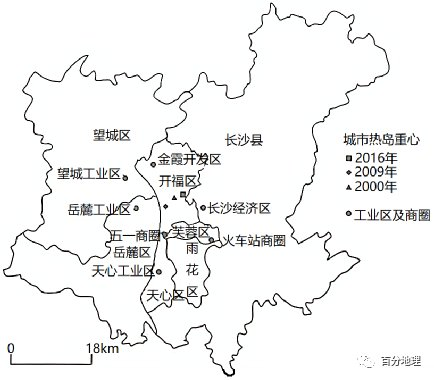
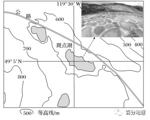
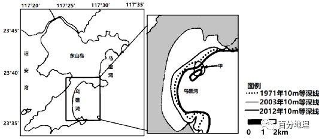
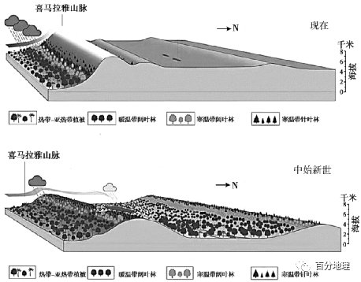
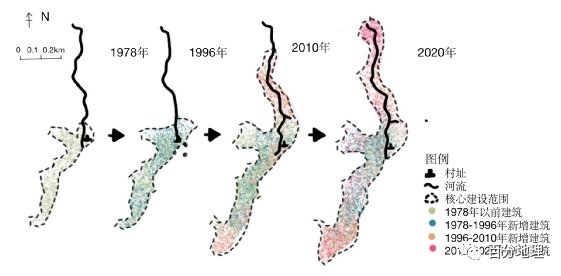
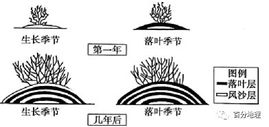
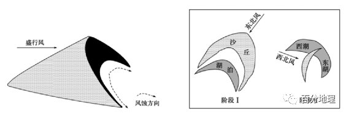
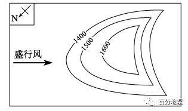
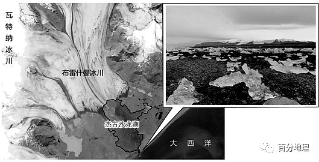
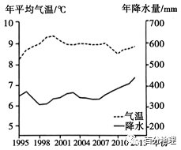

# 微专题之074 从产业结构角度分析区域发展

```
本专题摘自“百分地理”公众号，如有侵权请告之删除，谢谢。联系hhwxyhh@163.com
```

------
   
一、单选题   
（2022·湖南永州·二模）城市化导致地表覆盖类型及土地利用类型变化，由此引起城市大气动力学特征以及下垫面热交换性质的变化，进而影响热岛效应的形成与发展。某研究团队根据长沙市硬化地、绿地与水域面积、建筑指数、景观格局指数、社会经济活动指数等影响因子反演城市地表温度格局，并参照空间大数据，得到下图所示长沙市热岛发展方向与重心迁移情况。读图，完成下面小题。   
   
   
   
1．2000一2016年长沙城市热岛重心（  ）   
A．先向东北后向西南迁移   
B．先向东南后向西北迁移   
C．迁移主轴保持在东北一西南方向   
D．迁移主轴保持在西北一东南方向   
2．导致长沙城市热岛重心发生变化的最主要因子是（  ）   
A．社会经济活动指数   
B．景观格局指数   
C．城市绿地与水域面积   
D．建筑指数   
<span style="color: rgb(255, 0, 0);">1．C由图可知，长沙城市热岛重心2009年向西南迁移，2016年向东北迁移，AB错误；迁移的重心保持在迁移主轴东北一西南方向移动，C正确，D错误，故选C。</span>   
<span style="color: rgb(255, 0, 0);">2．A由图可知，长沙的热岛重心的迁移与工业区的建设和商圈的分布有密切的联系，随着开发区的建设由西南向西北发展，城市的热岛重心也随之发生迁移，主要与社会经济活动指数有关，A正确；景观指数、城市与绿地与水域面积、建筑指数在短期内变化小，影响不大，BCD错误，故选A。</span>   
<span style="color: rgb(255, 0, 0);">【点睛】执岛效应，受城市下垫面(大气底部与地表的接触面)特性的影响。城市内有大量的人工构筑物，如混凝土、柏油路面，各种建筑墙面等，改变了下垫面的热力属性，这些人工构筑物吸热快而热容量小，在相同的太阳辐射条件下，它们比自然下垫面(绿地、水面等)升温快，因而其表面温度明显高于自然下垫面，形成气温高于郊区的现象。</span>   
每年的某些月份，黄河三角洲淤泥质海滩都会呈现出一望无际的“红地毯”，这就是中国北方重要盐生植物盐地碱蓬群落。盐地碱蓬属一年生草本植物，一般生于海滨、湖边、荒漠等处的盐碱荒地上，是一种典型的盐碱指示植物。随着季节的变化，潮间带紫红色盐地碱蓬的颜色也发生着变化（由浅到深）。研究发现潮间带盐地碱蓬颜色变化主要受盐地碱蓬体甜菜红素积累量影响，而低氧和低温是诱导盐地碱蓬体甜菜红素合成的主要环境因子。据此完成下面小题。   
3．“红地毯”景观最绚丽的季节是（  ）   
A．春季   
B．夏季   
C．秋季   
D．冬季   
4．研究表明，黄河三角洲近几十年来自然湿地趋于减少，而人工湿地在大幅增加，最主要的原因是（  ）   
①气候变暖，蒸发加剧②海浪的侵蚀作用增强③湿地养殖④水利工程建设   
A．①②   
B．②③   
C．①③   
D．③④   
<span style="color: rgb(255, 0, 0);">3．C根据材料”低氧和低温是诱导盐地碱蓬体甜菜红素合成的主要环境因子”可知，秋季气温降低，昼夜温差大，易合成盐地碱蓬体甜菜红素，使盐地碱呈现出紫红色，形成最绚丽的“红地毯”景观，C正确。春季虽然气温较低，但处于盐地碱萌发及生长的早期阶段，盐地碱蓬体甜菜素合成较少，A错误。夏季气温高，不适合盐地碱蓬体甜菜红素的生成，B错误。盐地碱蓬为一年生草本植物，冬季植株停止生长，不符合题意，D错误。故选C。</span>   
<span style="color: rgb(255, 0, 0);">4．D由所学知识可知，气候变暖，蒸发加剧，可能会影响陆地上的内陆湖泊，长期作用会导致湖泊面积减小，但对河流入海口处的三角洲湿地，尤其是短期内影响很小，①错误，AC错误。由题干可知，只是自然湿地在减少，人工湿地还是在增加，所以不会是海浪的侵蚀作用增强导致的，且海浪侵蚀的外力作用对地貌的影响是缓慢的，②错误，B错误。湿地养殖导致人工湿地增加，水利工程建设导致黄河入海泥沙量减少，堆积作用减弱，自然湿地趋于减少，③④正确，D正确。故选D。</span>   
<span style="color: rgb(255, 0, 0);">【点睛】盐地碱蓬体甜菜红素合成条件是低氧和低温。第一题解题的关键是利用材料中的这个信息。</span>   
下图为“加拿大某区域等高线图”，该区域是加拿大最热的地区之一，图中的斑点湖的湖水蒸发后，结晶出很多矿物质，形成许多面积为10m2左右的白色镶边浅池，浅池里富含矿物质的水不同季节会呈现出深浅不同的黄、蓝、绿等奇特的颜色，如下图中的景观图。据此完成下面小题。   
   
   
   
5．据上图推测，图示地区成为加拿大最热的地区之一的原因可能有（  ）   
①位于盛行风的背风坡，气流下沉增温②夏季受副热带高气压带控制，晴热天气较多③正午太阳高度大，太阳辐射强烈④位于山间盆地，热量不易扩散   
A．②③   
B．①③   
C．①④   
D．②④   
6．斑点湖湖水颜色的变化，除受到湖水矿物质含量变化的影响外，还可能是因为（  ）   
A．湖水温度的季节变化   
B．湖中藻类种类的差异   
C．周围景色的季节变化   
D．湖水对太阳光的散射   
<span style="color: rgb(255, 0, 0);">5．C结合该区域等高线地形图以及经纬网定位可知，该地位于北美洲西部山区，位于西风的背风坡，焚风效应明显，气流下沉，增温效果明显；地势四周高、中间低，属于山间盆地，热量不易扩散，所以气温高。该地位于49°5′N附近，不受副热带高气压带控制；该地纬度较高，正午太阳高度较小。①④正确，②③错误，故选C。</span>   
<span style="color: rgb(255, 0, 0);">6．C在排除受到湖水矿物质含量变化的影响外，题干中提到“不同季节会呈现出深浅不同的黄、蓝、绿等奇特的颜色”，则只可能是湖泊四周景色随季节变化后，映入湖面发生的变化，C正确。藻类种类、湖水对太阳光的散射没有季节变化，B、D错。温度对湖水颜色影响不大，A错。故选C。</span>   
<span style="color: rgb(255, 0, 0);">【点睛】本题考查影响气候的因素分析，第一小题关键在于学生能够结合区域的等高线地形图以及区域经纬网图对所处区域进行判断，然后进行分析；第二小题要求学生对题干中提到“不同季节会呈现出深浅不同的黄、蓝、绿等奇特的颜色”，进行理解，便可解决问题，考察学生分析材料的能力。</span>   
二、综合题   
7．（2022·广东汕头·一模）阅读材料，完成下列问题。   
乌礁湾沙滩宽间平坦、沙白粒细、树木葱郁，被称为福建东山岛第一滩，当地全年最大风频为东北风，沿岸无天然河流注入，沙滩常年遭受潮汐流和波浪侵蚀，与相邻海湾泥沙交换少。2003年以来，乌礁湾海岸线附近的陆地密布海水养殖育苗场，养殖池的废水昼夜不停地直接排放到沙滩上，昔日第一滩景观受到影响。下图示意乌礁湾位置及1971-2012年乌礁湾近岸海域的等深线分布情况。   
   
   
   
(1)描述1971——2012年乌礁湾等深线分布的变化特点。   
(2)分析1971——2003年甲地附近海底地形变化的形成过程。   
(3)简述养殖池废水对东山岛第一滩自然环境的影响。   
<span style="color: rgb(255, 0, 0);">【答案】(1)1971-2003年：乌礁湾10m等深线向岸（向西）移动；海湾中部出现一个闭合的等深线</span>   
<span style="color: rgb(255, 0, 0);">2003-2012年：乌礁湾10m等深线向海（向东）移动；海湾中部闭合等深线范围缩小</span>   
<span style="color: rgb(255, 0, 0);">(2)受盛行风影响，乌礁湾海岸沙滩受波浪和潮汐流侵蚀，产生泥沙；落潮时的潮汐流将泥沙从海岸搬运至近岸海域；受岸线轮廓阻挡，海湾近岸海域中部流速较小，泥沙沉积；甲处水域形成水下沙洲（水深变浅/海底淤高）</span>   
<span style="color: rgb(255, 0, 0);">(3)形成大量冲沟，地表起伏变大；海沙流失，沙滩变薄，老地层或碎石裸露；海岸线后退；根系裸露，树木倒塌；沙滩上生物多样性减少；污染地下水，沙滩水质下降。</span>   
<span style="color: rgb(255, 0, 0);">【解析】本题以乌礁湾位置及1971-2012年乌礁湾近岸海域的等深线分布情况图为背景材料，考查海岸地貌的形成作用，以及海岸地带的开发和保护。考查学生获取和解读地理信息，调动和运用地理知识的能力，同时考查学生的区域认识水平、综合思维能力、地理实践力以及人地协调观的核心素养。(1)读图可知，1971年10m等深线为虚线，分布在西侧2003年10m等深线（浅实线）和其东侧2012年10m等深线（粗实线）之间，因此乌礁湾等深线的分布变化特点是，1971-2003年：乌礁湾10m等深线向岸（向西）移动；海湾中部出现一个闭合的等深线；2003-2012年：乌礁湾10m等深线向海（向东）移动；海湾中部闭合等深线范围缩小。(2)读图可知，甲地是2003年10m等深线的闭合区域，并分布在外海地区，由等值线分布规律可知，甲地中心水深较10m要小，说明该处是外海区域的水下高地。由材料“当地全年最大风频为东北风，沿岸无天然河流注入，沙滩常年遭受潮汐流和波浪侵蚀，与相邻海湾泥沙交换少”可知，甲处的水下沙洲形成不是河流带来的泥沙堆积，是在受盛行风影响，乌礁湾海岸沙滩受波浪和潮汐流侵蚀，产生泥沙；落潮时的潮汐流将泥沙从海岸搬运至近岸海域；读图可知，甲处北侧有向海凸出的岸线，受岸线轮廓阻挡，海湾近岸海域中部流速较小，泥沙沉积；甲处水域形成水下沙洲（水深变浅/海底淤高）。(3)由材料“养殖池的废水昼夜不停地直接排放到沙滩上”可知，养殖池的废水形成快速径流，对沙滩产生冲蚀作用，形成大量冲沟，地表起伏变大；在养殖池废水的冲蚀作用下，海沙流失，沙滩变薄，老地层或碎石裸露；海岸线后退；由材料“乌礁湾沙滩宽间平坦、沙白粒细、树木葱郁”可知，沙滩上的树木根系较浅，废水冲沙后，会造成树木根系裸露，沿海台风等的影响下，容易造成树木倒塌；污染沙滩后，影响沙滩上生物多样性；沙滩下渗强，污水下渗后污染地下水，沙滩水质下降。</span>   
8．（2021·北京朝阳·高三期中）读图文材料，回答下列问题。   
青藏高原曾是一片汪洋，直到距今3000万年前，海洋才彻底退出喜马拉雅山地区，青藏高原至此全部成陆，并不断抬升。下图示意青藏高原从中始新世到现在的演化过程。   
   
   
   
(1)据图分析青藏高原自然景观的变化过程。   
(2)说出青藏高原隆起对中国河流水系特征的影响。   
<span style="color: rgb(255, 0, 0);">【答案】(1)板块撞击，地壳抬升，平均海拔上升到4000米以上，喜马拉雅山脉的抬升阻挡了印度洋水汽向北输送，使其以北的青藏高原气候变冷变干，植被数量减少，分布范围缩小。</span>   
<span style="color: rgb(255, 0, 0);">(2)成为我国河流的源头，河流自西向东流、自南向北流。</span>   
<span style="color: rgb(255, 0, 0);">【解析】本题以青藏高原形成过程为材料，涉及整体性的相关知识，考查学生图片材料信息提取能力、地理知识调用分析能力，体现了区域认知、综合思维的地理学科核心素养。(1)青藏高原是由于亚欧板块和印度洋板块碰撞挤压，导致地壳抬升，平均海拔在4000米以上；青藏高原南侧的喜马拉雅山脉是世界上最高的山脉，其大致呈东西方向的弧形分布在我国南方，山脉的抬升阻挡了印度洋水汽向北输送，使其以北的青藏高原气候降水少，蒸发旺盛，气候变冷变干，生态环境脆弱，导致植被数量减少，分布范围缩小。(2)青藏高原隆起为世界上最高的高原，且山脉众多，冰川广布，成为我国多条长河的源头，由于地势中部高，四周低，导致河流自西向东流、自南向北流。</span>   
9．（2022·安徽·高三开学考试）阅读图文材料，完成下列要求。   
卖花渔村位于黄山市歙县雄村镇，地处新安江南岸沟谷腹地、是“徽派盆景”起源地，种花、制作盆景历史悠久，传统民居独具徽派韵味。改革开放以来，在当时政策扶持下，村里盆景产业逐步走向规模化与专业化，并促进乡村旅游业发展，村落空间也随之发生转型（2017年被授子“省级特色景观旅游名村”。近年来。村落电子商务兴起，为卖花渔村带来了新的发展机遇。下图为1978-2020年卖花渔村空间形态变迁过程示意图。   
   
   
   
(1)简析改革开放以后。卖花渔村将盆景产业作为支柱产业的依据。   
(2)指出1996年以后卖花渔村空间形态的变化特征。   
(3)列举当地政府为今后卖花渔村可持续发展应采也的主要措施。   
(4)推测村落电子商务对卖花渔村发展带来哪些机遇。   
<span style="color: rgb(255, 0, 0);">【答案】(1)地处沟谷，水资源丰富;亚热带季风气候，水热资源充足;“徽派盆景”起源地，盆景知名度高;盆景产业历史悠久，产业工人多;政府政策的扶持等。</span>   
<span style="color: rgb(255, 0, 0);">(2)1996年一2010年，卖花渔村空间迅速扩大，核心建设范围主要向北部河谷拓展;2010年后，村落空间继续沿交通干道和河谷地带向外扩张，但扩张速度减慢。</span>   
<span style="color: rgb(255, 0, 0);">(3)作好科学规划，开发与保护相结合;.加强村民技能培训，提升产品质量和服务水平;加大宣传力度，提升知名度;完善村内基础设施建设，提升美好乡村品质等。</span>   
<span style="color: rgb(255, 0, 0);">(4)加大网上宣传，提高卖花渔村知名度;扩大盆景产品市场的销售范围，提高经济效益;提供更多的就业机会，安置村民就业:吸引更多游客，带动更多产业发展;促进产业结构的优化和升级等。</span>   
<span style="color: rgb(255, 0, 0);">【解析】该题组主要通过区域来考查农业发展问题，旨在考查信息获取能力和阐释能力等地理核心素养。(1)根据材料可知，该地是“徽派盆景”起源地，有着悠久的历史，知名度高；从图中可以看出该地地处沟谷，水资源丰富；该地盆景产业发展历史悠久，有着丰富的经验，从业工人多，劳动力丰富；由国家政策的大力支持。(2)从图中可以看出从1996--2010年，卖花渔村的用地规模迅速扩大，核心区域不断向北拓展；2010年之后发生变化，聚落沿着交通线路和河谷地带不断延伸，同时扩张的速度较之前减慢。(3)从规划、提升服务水平、宣传等方面作答。一方面要做好科学的规划，开发的同时注意保护环境；进一步加强对从业人员的培训，提高技术水平；通过互联网平台加大宣传力度，提高知名度；完善产区的基础设施，提升乡村的文化内涵，打造旅游景点。(4)通过网络的宣传和销售，可以提高产品的知名度；同时也扩大了产品的销售范围，取得了更好的经济效益；通过网络带货，吸纳了劳动力，提高了居民的收入；该地区也吸引了更多的游客，带动了经济的发展，增加了收入；也推动了产业结构的优化和升级等。</span>   
10．（2022·山东·高三专题练习）阅读图文资料，完成下列要求。   
柽柳是泌盐植物，能通过根系吸收土壤中的盐分，并通过叶子和细枝将吸收于体内的盐分排出，所以具有很高的耐盐能力柽柳为落叶灌木或小乔木，在干旱沙漠地区，柽柳主要通过深根系吸收地下水维持生命，同时能够在沙埋的枝干上形成新的植株，在柽柳灌丛与沙粒的相互作用下，可形成干旱沙漠区特有的生物地貌景观“柽柳沙包”，下图示意其形成过程。受人类活动的影响，克拉玛干沙漠某地区的柽柳沙包出现了一定的衰败和退化现象，当地生态环境有进一步恶化的趋势。   
   
   
   
(1)描述柽柳沙包的形成和发育过程。   
(2)柽柳沙包内部土壤盐度随土壤深度的增加而降低，试述其形成原因。   
(3)分析随着塔克拉玛干沙漠某地生态环境的退化，当地柽柳沙包土壤表层盐度的变化趋势。   
<span style="color: rgb(255, 0, 0);">【答案】(1)柽柳灌丛可以降低风速，使沙粒堆积；柽柳在风沙层生长，在落叶季节时，叶子落到地面形成落叶层；在第二年生长季节，风沙埋没落叶层；年复一年循环往复，柽柳沙包不断变大。</span>   
<span style="color: rgb(255, 0, 0);">(2)土壤盐分主要源于地下水，在柽柳的吸收和蒸腾作用下，地下水和下层土壤中的盐分向柽柳上部迁移；柽柳以泌盐和凋落物的形式将盐分累积于土壤表层，所以表层土壤盐度较大。</span>   
<span style="color: rgb(255, 0, 0);">(3)沙漠生态环境退化，柽柳覆盖率降低，聚盐能力下降；柽柳沙包受到风沙侵蚀作用将加强，表层土壤盐分损失增多；表层土壤盐度将下降。</span>   
<span style="color: rgb(255, 0, 0);">【解析】本题通过怪柳沙丘的演化为素材设置问题，涉及地理环境的整体性、土地荒漠化等知识点，考查了学生获取和解读地理信息、调动和运用地理知识、描述和阐释地理事物、论证和探讨地理问题的能力。(1)结合材料读图分析，怪柳灌丛可以降低风速，并且在生长季节防风固沙的能力更强，促进风沙沉积形成沉积层；落叶季节，叶子落到地面上形成落叶层；在第二年生长季节，风沙埋没落叶层，形成新的沉积层，并且能够在沙埋的枝干上形成新的植株；年复一年循环往复，怪柳沙包不断增长扩大。(2)根据材料“柽柳是泌盐植物，能通过根系吸收土壤中的盐分，并通过叶子和细枝将吸收于体内的盐分排出”分析，土壤盐分主要来源于地下水，怪柳通过深根系吸收土壤中的盐分，使土壤深层的盐分降低；通过叶子和细枝将吸收于体内的盐分排出，落叶季节怪柳以凋落物的形式使盐分在土壤表层积累，使土壤表层的盐度较大。(3)结合上题分析，怪柳通过根系吸收及枝叶泌盐使盐分在土壤表层积累，沙漠环境退化，怪柳覆盖度降低，其聚盐能力下降；怪柳防风固沙的能力减弱，怪柳沙丘受风力侵蚀作用增强，表层土壤中的盐分随之被风力侵蚀，盐度下降。</span>   
11．（2022·山东·高三专题练习）阅读图文资料，完成下列要求。   
沙丘与湖泊共存是沙漠中的独特景观，气候、地下水和盛行风向的变化影响着沙丘和湖泊的演化。科学研究表明，新月形沙丘形成后，沙丘背风地带地面水平方向上出现风速差异，从而导致沙丘基部侵蚀速度更快（左图)。我国巴丹吉林沙漠是世界最高大的沙丘所在地，沙丘海拔多在1400——1600m，沙丘高度一般在200——300m之间，当地某湖泊经历了从月牙湖到双湖的演化过程（右图)：在阶段Ⅰ形成月牙湖（水积累在月牙湖盆），在阶段Ⅱ该湖所在地区气候曾一度极端干旱，新的新月形沙丘形成，后来月牙湖演化为双湖。   
   
   
   
(1)画出阶段I此地新月形沙丘的等高线示意图。   
   
   
   
(2)阐释该湖泊在阶段Ⅱ演化为双湖的过程。   
(3)此双湖中西湖较浅，东湖较深。推测东湖深度较大的原因。   
<span style="color: rgb(255, 0, 0);">【答案】(1)画图正确（形状，等高线数值变化疏密分布，指向标，参考图如下）盛行风。</span>   
   
   
   
<span style="color: rgb(255, 0, 0);">(2)该区域在阶段Ⅱ气候一度极端干早，导致湖泊水位降低，湖盆出露；盛行风风向发生改变，西北风作用下，在湖盆中部形成新的新月形沙丘；后期气候变湿，地下水水位上升，洼地再度积水形成双湖。</span>   
<span style="color: rgb(255, 0, 0);">(3)在湖泊演化为双湖过程中，东湖位于沙丘的背风地带；背风地带沙丘基部风力侵蚀速度更快，湖盆更深。</span>   
<span style="color: rgb(255, 0, 0);">【解析】本大题以新月形沙丘和湖泊形成为材料，涉及新月形沙丘、沙漠湖泊地貌的形成等相关内容，考查学生掌握课本知识的能力和综合分析的地理素养。(1)新月形沙丘缓坡指示来风的方向，陡坡指示背风坡。根据题干中"我国巴丹吉林沙漠是世界最高大的沙丘所在地，沙丘海拔多在1400——1600m”以及右图阶段I 的东北风的盛行风向，画图如下：</span>   
   
   
   
<span style="color: rgb(255, 0, 0);">(2)题干中：Ⅱ阶段，因湖泊所在区域气候一度极端干旱，导致湖泊水位降低，水面下降，湖泊面积缩小，湖盆出露；后阶段盛行风向从东北风改为西北风，在盛行风向的改变作用下，新的新月形沙丘形成于湖盆中部，后来随着全球气候变暖，冰川融化增加，气候变湿，地下水水位上升，洼地再度积水，形成双湖形状。(3)在新月形沙丘，迎风坡以堆积为主，西湖位于迎风坡；背风坡以侵蚀作用为主，风力侵蚀作用更强。所在，在湖泊演化为双湖过程中，东湖位于沙丘的背风地带；背风坡，沿着风蚀方向发生风蚀作用，背风地带沙丘基部风力侵蚀速度更快，东湖的湖盆更深，积水更深。</span>   
12．（2022·全国·高三专题练习）阅读图文材料，回答下列问题。   
杰古沙龙湖是冰岛南部的一个冰河湖，于1934年开始出现，从1975年的7.9平方公里扩大到今日的18平方公里，湖深200米，为冰岛第二深湖。其南部有一个狭窄的通道与大西洋相连。湖面上常年漂浮着众多巨大的冰块。在湖泊入海口附近的大西洋沿岸黑色的沙滩上，散落着无数晶莹璀璨的碎冰块，形成独特的"钻石冰沙滩"（如下图所示）。冰原、火山、冰舌、崎岖的高地和熔岩景观，让到此的游客觉得仿佛来到了外星世界。   
   
   
   
(1)杰古沙龙湖因冰川侵蚀作用而形成，简述判断的依据。   
(2)简述碎冰块出现在大西洋沿岸沙滩的地理过程。   
(3)预测今后一段时期杰古沙龙湖面积的变化趋势并分析其原因。   
<span style="color: rgb(255, 0, 0);">【答案】(1)湖泊位于冰川的边缘；湖泊较深，因受冰川侵蚀形成较深的洼（凹）地</span>   
<span style="color: rgb(255, 0, 0);">(2)随着冰川融水的不断补给，加上蒸发弱，入海通道狭窄，湖面水位比大西洋水位高，导致湖水从入海通道不断流出；湖中大量的碎冰块顺着湖水流入大西洋沿岸，大西洋的风浪又将碎冰块推到沿海的沙滩上；地处高纬，气温低碎冰难融化，易于在沙滩保留。</span>   
<span style="color: rgb(255, 0, 0);">(3)变化趋势：湖面面积变大。原因：随着全球气候变暖，冰川融水增多，加上湖泊入海通路狭窄，排水不畅，水量增多；湖面水位上升，湖面面积增大</span>   
<span style="color: rgb(255, 0, 0);">【解析】本题以杰古沙龙湖为背景，考查湖海、冰川之间的相互作用关系以及冰川湖的水文特征，要求学生调用湖泊成因、影响湖泊水文特征变化的因素进行分析，考查学生对材料信息的提取和解读能力，调用知识进行分析的能力，以及综合分析能力，体现综合思维的核心素养。(1)冰蚀湖是冰川侵蚀而形成的较深洼地，后积水成湖。湖中有巨大碎冰块，附近有冰川，且湖水较深，都能说明此处地貌深受冰川（侵蚀）的作用。根据材料和图示信息分析，湖泊位于冰川的边缘地带，位于冰川与大西洋之间，且湖泊的深度为200米，其成因为冰川侵蚀形成较深的洼地后，冰川融化积水形成的。(2)结合材料可知，湖中常年漂浮着众多巨大的冰块，而湖泊南部有一个狭窄的通道与大西洋相连，说明湖水与海水相通，同时无数的碎冰块位于湖泊入海口附近的沙滩上，说明沙滩上的碎冰块来源于湖中的冰块（与湖中冰块相同）。与此同时，此处海水受北大西洋暖流的影响，海水中没有海冰。因冰块位于沙滩上，应是被大西洋的风浪推到沙滩上的。只需要将湖泊中冰块迁移至大西洋沿岸这个过程说清楚即可。具体而言，是由于冰川融水增多，湖泊的水位不断增加，加上湖泊与大西洋之间的入海通道狭窄，不利于水的排泄，因此导致湖泊水位高于大西洋的水位，湖泊的碎冰块顺着湖水被带到大西洋沿岸，在海浪的作用下，又将碎冰块推到沿海的沙滩上；加上此处纬度高，气温低，蒸发弱，碎冰块保存完整。(3)湖泊面积的变化主要与湖泊的补给与排水、蒸发有关，结合材料分析，冰川融水是湖水主要的补给来源，此湖形成历史较短，由于全球气候变暖，冰川融水增多，湖水不断增多，同时入海通道狭窄，排水不畅，从而导致湖水水位不断上升，湖面增大。</span>   
13．（2022·全国·高三专题练习）阅读图文材料，完成下列要求。   
毛乌素沙地中流动沙地、固定沙地与湖泊、河流、沼泽等景观并存。上述景观在自然和人文因素影响下可发生转化。1995～2013年，流动沙地趋于固定，湖沼面积减小。下图示意毛乌素沙地1995～2013年气温、降水的变化。   
   
   
   
（1）据图，说明毛乌素沙地1995～2013年流动沙地趋于固定的自然原因。   
（2）毛乌素沙地1995～2013年湖沼面积减小，试对此做出合理解释。   
（3）近些年来，毛乌素沙地绿化面积逐渐增大，有人认为“毛乌素沙地即将消失”，你是否赞同？表明你的态度并说明理由。   
<span style="color: rgb(255, 0, 0);">【答案】（1）气温稳定；降水呈波动增加，有利于植被生长，流动沙丘（地）趋于固定。</span>   
<span style="color: rgb(255, 0, 0);">（2）人类活动强度增加，生产生活消耗的水量增加；蒸发（腾）增加；地表水减少。</span>   
<span style="color: rgb(255, 0, 0);">（3）赞同理由：年降水量已增加到近450毫米，趋向湿润，流动沙地逐渐固定；随着科学技术进步，植树造林及农业生产水平不断提高，沙地景观最终消失。</span>   
<span style="color: rgb(255, 0, 0);">反对理由：目前虽然偏湿润，可能过些年偏干旱；过度绿化（农业发展和植树造林），蒸腾量大增，会加重区域的干旱程度，导致风沙活动加强。</span>   
<span style="color: rgb(255, 0, 0);">【解析】本题考查了西北地区荒漠化的成因及治理措施，考查了学生获取和解读地理信息、调动和运用地理知识、描述和阐释地理事物的能力，渗透了区域认知、综合思维、人地协调观等学科核心素养。（1）结合材料读图分析，毛乌素沙地1995～2013年气温基本稳定，降水波动增加，有利于植被生长，植被根系能够固结沙土，削弱风力，减少扬沙，使流动沙丘趋于固定。（2）自然原因：蒸发和蒸腾作用增强；人为原因：人类生产和生活耗水量增加，湖水的补给量减少。其中人为原因是主要原因。（3）本题为开放类试题，选择赞同或反对都可以从自然和人为方面进行分析。赞同：自然方面，读图可知，毛乌素沙地降水呈增加趋势，气候趋向湿润，有利于植物生长，流动沙丘逐渐固定；人为方面，随着科技不断进步，人们环境意识逐渐增强，生产力水平不断提高，沙地景观最终消失。反对：自然方面，气候总是波动变化的，虽然毛乌素沙地目前趋向湿润，但以后也可能出现干旱，不利于植被生长；人为方面，农业发展及大规模植树造林，蒸腾量增大，加重该区域的干旱程度，导致风沙活动加强，沙地面积扩大。</span>
