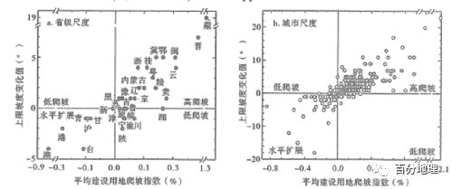
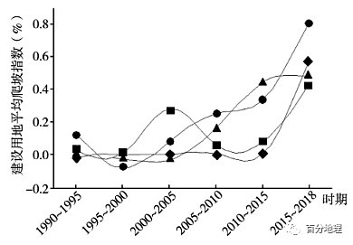
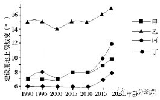
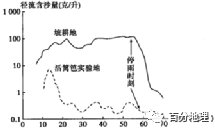
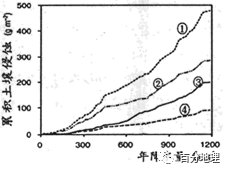
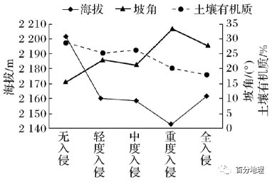
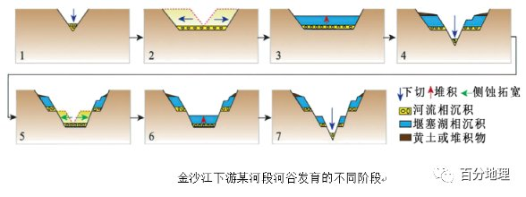
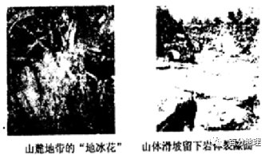

# 微专题之074 从产业结构角度分析区域发展

```
本专题摘自“百分地理”公众号，如有侵权请告之删除，谢谢。联系hhwxyhh@163.com
```

------
   
一、单选题   
（2022·重庆巴蜀中学高三阶段练习）建设用地爬坡是指通过平整和梯化改造坡地进行城乡建设，即主要在相对高差小于200m、平均坡度小于250以内有未利用土地为主的丘陵地，通过工程和生物措施进行综合建设的过程，在空间上表现.为建设用地向坡度大的地区发展。下图表示1990——2018年中国各省与各城市平均建设用地爬坡指数（A）与上限坡度变化值（B）。A>0，表明建设用地在坡度高于T的地区的面积比例随时间增大；B>0时，表明该时期建设用地分布的上限坡度增大，B≤0则表明该时期建设用地分布的上限坡度减小，即建设用地主要在低坡度地区发展。据此完成下面小题。   
   
   
   
1．重庆平均建设用地爬坡指数低于西藏的原因最可能是（  ）   
A．海拔高度较低   
B．经济快速发展   
C．爬坡空间有限   
D．地质风险较小   
2．以水平扩展为主要建设方式的城市（  ）   
A．保护了平原地区的优质耕地   
B．加剧对平原生态用地的侵占   
C．加大诱发地质灾害的可能性   
D．充分利用坡地拓展建设空间   
<span style="color: rgb(255, 0, 0);">1．C低爬坡型省份包括陕西省、重庆市、四川省和宁夏回族自治区等，尽管建设用地分布的上限坡度呈现为不变甚至减少的趋势，但建设用地爬坡现象仍未停止，主要原因在于这些省份目前的上限坡度已达最高，如重庆市建设用地上限坡度已超过23°,若继续向高坡度地区发展，很有可能增加地质灾害的风险，C正确，D错误，根据材料，建设用地爬坡是指通过平整和梯化改造坡地进行城乡建设，建设用地爬坡指数与整体的海拔高度关系不大，A错误，经济快速发展，所需建设用地增加，重庆以山地丘陵为主的地形，建设用地爬坡指数会加大，B错误，所以选C。</span>   
<span style="color: rgb(255, 0, 0);">2．B在以水平扩展为主要建设方式的地区，建设用地侵占平原土地的趋势明显，B正确；以建设用地爬坡为主要发展模式的地区建设用地对平原耕地及生态用地的占用逐渐减少，可充分利用坡地拓展建设空间，但可能加大诱发地质灾害的可能性，ACD错误，所以选B。</span>   
<span style="color: rgb(255, 0, 0);">【点睛】首先，地形、地质等条件影响着城乡的选址，地貌形态类型及地形的高度和坡度在一定程度上具有决定道路通达性强，营运成本；其次，地形条件影响着城乡产业的空间布局和功能分区，影响着城乡土地利用的选择，地形、 地质条件影响各种生产设施，生活设施的设置；最后，地形、地质条件影响城乡形态，空间结构和整体布局。</span>   
（2021·江苏省天一中学高三阶段练习）建设用地爬坡是指通过平整和梯化改造坡地进行城乡建设的过程，在空间上表现为建设用地向坡度大的地区发展。下图是中国四大地区平均建设用地爬坡指数（指数越大表示建设用地爬坡程度越强烈）与上限坡度图。完成下面小题。   
   
   
   
   
   
   
3．建设用地爬坡有助于（  ）   
A．降低基础设施成本   
B．减缓城市交通拥堵   
C．产业结构优化升级   
D．减少占用优质耕地   
4．属于西部地区的是（  ）   
A．甲   
B．乙   
C．丙   
D．丁   
5．乙地区建设用地上限坡度较高的原因是（  ）   
A．城市化水平高   
B．城市化发展快   
C．地形条件复杂   
D．社会经济发展快   
<span style="color: rgb(255, 0, 0);">3．D据材料，建设用地爬坡是指通过平整和梯化改造坡地进行城乡建设的过程。因此不会降低基础设施成本，而相比平地建设会增加成本，A错误；不能减缓城市交通拥堵，B错误；建设用地爬坡只是提供了建设用地的位置，没有改变产业结构，更谈不上对产业结构优化升级，C错误；建设用地使用坡地，就减少了优质耕地的占用，D正确。故选D。</span>   
<span style="color: rgb(255, 0, 0);">4．B2000年以来，随着西部大开发国家战略的实施，我国中、西部地区社会经济建设速度明显加快，中、西部地区建设用地爬坡指数也应该相应增加，故左图中乙、丙两线可以表示中、西部建设用地爬坡指数，据此可排除AD。与中部地区相比，我国西部地区多高原、山地、盆地，地形起伏更大，建设用地上限坡度应大于中部地区，所以乙曲线表示西部地区，丙表示中部地区。因此B正确，C错误。故选B.</span>   
<span style="color: rgb(255, 0, 0);">5．C由上题可知，乙为我国西部地区，地形多高原、山地、盆地，地形起伏大，地形条件复杂，所以建设用地上限坡度较高，C正确；我国西部地区城市化水平比中部地区要低，A错误；与我国中、东部相比，社会经济发展及城市化发展速度都不快，B、D错。故选C。</span>   
<span style="color: rgb(255, 0, 0);">【点睛】建设用地爬坡，在一定程度上能够减少建设用地扩张对平原优质耕地与生态用地的胁迫和侵占，缓解建设用地供需矛盾，但是无规划无约束的开发和房地产驱动的“削山造地”则会导致地质灾害和生态环境风险的增加。大起伏的地势既是驱使建设用地向上爬坡的因素，也是限制城市发展规模的阻碍。东北地区由于地处平原，建设用地分布的上限坡度最低且变化最小。地形平坦的东部和东北地区受耕地保护政策的约束，建设用地也存在爬坡现象，且人口稠密的东部地区爬坡程度比东北地区强，上图中甲代表东部地区，丁代表东北地区。</span>   
坡地等高活篱笆是在坡面上沿等高线种植绿肥植物形成活篱笆带，实现农林混交，可以提高农业复合产出，改善坡地生态环境。为制定等高活篱笆技术规范，我国科研人员在某地进行了对比实验研究，下图为某次人工模拟降雨实验中等高活篱笆试验地与坡耕地径流含沙量过程对比。据此完成下列小题。   
   
   
   
6．此实验主要体现植被的哪种生态功能   
A．涵养水源   
B．调节气候   
C．保持水土   
D．防风固沙   
7．等高活篱笆技术最适用于   
A．西南山区   
B．长江下游地区   
C．长白山地区   
D．黄土高原   
8．等高活篱笆植物带   
A．沿海拔高度变化方向延伸   
B．高度越高土层越厚   
C．与海拔高度变化方向垂直   
D．宽度越大坡度越大   
<span style="color: rgb(255, 0, 0);">6．C据图可知，在同等降雨条件下，等高活篱笆试验地比坡耕地径流含沙量低，说明坡地等高活篱笆减少了水土流失，故C正确。A、B、D都是坡地等高活篱笆具有的生态环境作用，但都不是等高活篱笆试验地径流含沙量与坡耕地出现差异的原因。故选C。</span>   
<span style="color: rgb(255, 0, 0);">7．A等高活篱笆是在坡面上沿等高线种植绿肥植物形成活篱笆带，目的之一是改善坡地生态环境，故从自然条件角度来说，其适用于坡度较大，降水较多的西南山区，A正确；长江下游地区地形平坦，不适合；长白山地区水土流失较轻，不是最适合的地区；黄土高原地区土壤较为贫瘠，不适合开展农林混交，故BCD错误；故选A。</span>   
<span style="color: rgb(255, 0, 0);">8．C等高活篱笆植物带沿坡面等高线种植（延伸），与等高线平行（或重合），而海拔高度变化方向与等高线相垂直，故C正确，A不正确；一般来说，随着海拔高度的上升，坡地土层厚度有变薄的趋势，排除B；等高活篱笆植物带的宽度不一定取决于坡度的大小，也与工程量的大小（人类改造地形的能力）等因素有关，D不正确。故选C。</span>   
橡胶树原产于亚马逊平原热带雨林,我国农艺专家将橡胶树繁育到了西双版纳缓坡地区。橡胶树的根尖及浅层须根会对降水及时“捕获”。专家在西双版纳对①②③④四块不同下垫面经济林地,进行水土流失过程数据采集,并绘制成土壤侵蚀与年降水量关系图。据此,回答下面小题。   
   
   
   
9．调查发现,西双版纳缓坡地区的橡胶林地,林下灌草层难以形成,其主要自然原因是   
A．水分缺失   
B．光照不足   
C．土壤贫瘠   
D．白蚁侵害   
10．据图判断,图示标号与四块橡胶林地种植方式、林下地表状况对应关联正确的是   
A．①橡胶与茶树间作,有枯枝落叶覆盖   
B．②一纯橡胶树种植,有枯枝落叶覆盖   
C．③一纯橡胶树种植,地表裸露   
D．④一橡胶与茶树间作,地表裸露   
<span style="color: rgb(255, 0, 0);">9．A橡胶树原产于亚马逊平原热带雨林，说明橡胶树耗水量大，同时由于橡胶树的根尖及浅层须根会对降水及时“捕获”，说明橡胶树地表干燥，因此橡胶林地林下灌草层缺乏的原因是水分缺失，A正确；为确保橡胶树生长，胶农将进行土壤增肥，C错；为确减少橡胶树病虫害，胶农也会喷洒农药，白蚁侵害较少，D错；橡胶林地虽然光照不足，但由于热量充足，只要水分充足，灌草层也可以生长，故B错误，Y因此选A。</span>   
<span style="color: rgb(255, 0, 0);">10．B本题考查同等情况下降水量与不同橡胶种植方式之间的关系，通过对图进行分析，同样的降水量情况下①②③④累计土壤侵蚀量逐渐降低，说明地表径流量逐渐减少，涵养水源的能力不断增强。据此判断①号地块为一纯橡胶树种植，地表裸露，水土侵蚀量最大，A错；②号地块纯橡胶树种植，有枯枝落叶覆盖水土侵蚀量高于橡胶树与茶树间作，地表裸露情况下的水土侵蚀量，B正确，C错误；④号地块水土侵蚀量最低，说明该类种植方式涵养水土的能力最强，为橡胶与茶树间作，有枯枝落叶覆盖，D错误，故选B</span>   
（2022·福建漳州·模拟预测）为脱贫致富，2015年云南省元谋地区在干热河谷北部荒坡地引种台湾青枣（属常绿小乔木，植株生长极为旺盛），三年后土地出现了问题。2019年以来当地采用台湾青枣-芝麻（芝麻属一年生草本植物，生长期近4个月）间作栽培新模式，缓解了之前出现的土地问题。每年4月份对青枣主枝进行出芽前的回缩修剪和芝麻播种是台湾青枣-芝麻间作栽培技术的关键。下表为当地气候资料，据此完成下面小题。   
<table cellspacing="0" cellpadding="0" width="577"><tbody><tr><td width="78" valign="middle" style="padding: 3.75pt 6pt;border-width: 1pt;border-color: rgb(0, 0, 0);"><section style="margin-top: 0pt;margin-bottom: 0pt;margin-left: 0pt;text-indent: 0pt;font-size: 10.5pt;font-family: &quot;Times New Roman&quot;;text-align: left;line-height: 2em;"><span style="font-family: 宋体;">年均降水量</span></section></td><td width="63" valign="middle" style="padding: 3.75pt 6pt;border-width: 1pt;border-color: rgb(0, 0, 0);"><section style="margin-top: 0pt;margin-bottom: 0pt;margin-left: 0pt;text-indent: 0pt;font-size: 10.5pt;font-family: &quot;Times New Roman&quot;;text-align: left;line-height: 2em;"><span style="font-family: 宋体;">雨季</span></section></td><td width="71" valign="middle" style="padding: 3.75pt 6pt;border-width: 1pt;border-color: rgb(0, 0, 0);"><section style="margin-top: 0pt;margin-bottom: 0pt;margin-left: 0pt;text-indent: 0pt;font-size: 10.5pt;font-family: &quot;Times New Roman&quot;;text-align: left;line-height: 2em;"><span style="font-family: 宋体;">年均蒸发量</span></section></td><td width="57" valign="middle" style="padding: 3.75pt 6pt;border-width: 1pt;border-color: rgb(0, 0, 0);"><section style="margin-top: 0pt;margin-bottom: 0pt;margin-left: 0pt;text-indent: 0pt;font-size: 10.5pt;font-family: &quot;Times New Roman&quot;;text-align: left;line-height: 2em;"><span style="font-family: 宋体;">年均温</span></section></td></tr><tr><td width="78" valign="middle" style="padding: 3.75pt 6pt;border-width: 1pt;border-color: rgb(0, 0, 0);"><section style="margin-top: 0pt;margin-bottom: 0pt;margin-left: 0pt;text-indent: 0pt;font-size: 10.5pt;font-family: &quot;Times New Roman&quot;;text-align: left;line-height: 2em;">613mm</section></td><td width="63" valign="middle" style="padding: 3.75pt 6pt;border-width: 1pt;border-color: rgb(0, 0, 0);"><section style="margin-top: 0pt;margin-bottom: 0pt;margin-left: 0pt;text-indent: 0pt;font-size: 10.5pt;font-family: &quot;Times New Roman&quot;;text-align: left;line-height: 2em;">5—8<span style="font-family: 宋体;">月</span></section></td><td width="71" valign="middle" style="padding: 3.75pt 6pt;border-width: 1pt;border-color: rgb(0, 0, 0);"><section style="margin-top: 0pt;margin-bottom: 0pt;margin-left: 0pt;text-indent: 0pt;font-size: 10.5pt;font-family: &quot;Times New Roman&quot;;text-align: left;line-height: 2em;">3911mm</section></td><td width="57" valign="middle" style="padding: 3.75pt 6pt;border-width: 1pt;border-color: rgb(0, 0, 0);"><section style="margin-top: 0pt;margin-bottom: 0pt;margin-left: 0pt;text-indent: 0pt;font-size: 10.5pt;font-family: &quot;Times New Roman&quot;;text-align: left;line-height: 2em;">21.9℃</section></td></tr></tbody></table>

11．间作植物选择芝麻，主要因为种植芝麻（  ）   
A．可以缓解土壤次生盐渍化   
B．收割后秸秆可以还田   
C．经济效益好，利于当地脱贫   
D．生长期与雨季相一致   
12．与传统单一种植台湾青枣相比，青枣-芝麻间作栽培能够（  ）   
A．增加区域降水量   
B．提高水肥利用率   
C．增加生物多样性   
D．便于种植、管理   
<span style="color: rgb(255, 0, 0);">11．D当地引种台湾青枣三年后土地出现了土壤干旱问题，因此，采用青枣-芝麻间作栽培的目的是缓解土壤干旱，因芝麻生长期与雨季相一致，套种芝麻可以有效的增加果园覆盖，抵挡雨水对地面的冲刷造成土地流失，达到保水、保土、保肥的作用，D对；材料中“在干热河谷北部荒坡地引种台湾青枣”，说明坡地地形利于排水，不存在土壤次生盐渍化，A错；收割后秸秆可以还田增加土壤肥力，但不是间作植物选择芝麻的主要原因，B错；根据材料当地为脱贫致富，引种台湾青枣，三年后土地出现了问题，又采用台湾青枣-芝麻间作栽培新模式，说明间作植物选择芝麻是为了缓解土地出现的问题，而不是由于芝麻的经济效益好，且材料并没有给出芝麻产量的高低，C错。故选D。</span>   
<span style="color: rgb(255, 0, 0);">12．B青枣-芝麻间作对其区域降水影响甚微，A错；青枣-芝麻间作栽培，可实现果园提早覆盖，阻止太阳光对地面的直射，减少土壤水分蒸发，同时，还可以抵挡雨水对地面的冲刷造成土地流失，达到保水、保土、保肥的作用。因此，该栽培模式能提高水肥利用率，B对；农作物种类增加不属于生物多样性增加，C错；与传统单一种植台湾青枣相比，间作的耕作难度大， 不利于种植、管理，D错。故选B。</span>   
<span style="color: rgb(255, 0, 0);">【点睛】间套种是通过利用主作物的空间种植另一种作物， 或者在主作物生长发育过程中的空隙阶段进行种植。能提高土地利用率，增加了单位面积的土地产出，提高了农民的经济收入。</span>   
（2022·青海西宁·高三期末）长白山高山苔原位于长白山火山锥体上部（海拔约2000～2500m），以灌木苔原为主，很少有草本植物。在全球气候变化背景下，原先位于长白山苔原带西坡较低海拔的草本植物不断上侵，苔原带原有的灌木开始萎缩退化。下图为草本植物入侵程度与环境因子变化关系示意图。完成下面小题。   
   
   
   
13．在全球气候变化背景下，高山苔原带最先遭受草本植物入侵的区域是（  ）   
A．较低海拔的缓坡地带   
B．较低海拔的陡坡地带   
C．较高海拔的缓坡地带   
D．较高海拔的陡坡地带   
14．随海拔升高，草本植物入侵减弱的原因有（  ）   
①气温降低②光照减弱③降水增加④种子传播距离加大   
A．①②   
B．②③   
C．①④   
D．③④   
<span style="color: rgb(255, 0, 0);">13．B根据图文材料可知，在全球气候变化背景下，较低海拔地区的草本植物入侵为重度入侵，坡角为30°——35°，因此高山苔原带最先遭受草本植物入侵的区域是较低海拔的陡坡地带。故选B。</span>   
<span style="color: rgb(255, 0, 0);">14．C随着海拔升高，气温降低，草本植物生长条件变差，①正确；随着海拔升高，光照没有减弱，②错误；随着海拔升高，降水先增加后减少，③错误；草本植物从较低海拔向上入侵，随着海拔升高种子传播距离加大，入侵减少，④正确。选C。</span>   
<span style="color: rgb(255, 0, 0);">【点睛】自然地理要素的物质迁移和能量交换：</span>   
<span style="color: rgb(255, 0, 0);">通过光合作用，植物吸收了大气中的二氧化碳，放出氧气。</span>   
<span style="color: rgb(255, 0, 0);">通过降水，土壤和水圈及生物获得水分补给。</span>   
<span style="color: rgb(255, 0, 0);">通过植物蒸腾和土壤蒸发，大气获得了水汽。</span>   
<span style="color: rgb(255, 0, 0);">植物残体进入土壤，向土壤提供了有机质。</span>   
<span style="color: rgb(255, 0, 0);">岩石通过风化向土壤提供成土物质和无机盐。</span>   
<span style="color: rgb(255, 0, 0);">土壤及岩石风化物被侵蚀，搬运到低洼处堆积，形成沉积岩。</span>   
（2022·河南·高三开学考试）陕西省延安市吴起县地处黄土高原，位于水蚀、风蚀交错区。该县多年平均降水量466.7mm,年均蒸发量891.2mm.自1998年起，该县在荒山及坡地营造水土保持林，主要造林树种有油松、刺槐、山杏、沙棘等，受自然条件和植被生长习性影响，四种防护林分布空间差异显著，下表示意四种防护林分布特征（坡向一般以正北方向记作0°,按顺时针方向旋转所得角度为坡向角度）。据此完成下面小题。   
<table cellspacing="0" cellpadding="0" width="577"><tbody><tr><td width="44" rowspan="2" valign="bottom" style="padding: 3.75pt 6pt;border-width: 1pt;border-color: rgb(0, 0, 0);"></td><td width="332" colspan="2" valign="bottom" style="padding: 3.75pt 6pt;border-width: 1pt;border-color: rgb(0, 0, 0);"><section style="margin-top: 0pt;margin-bottom: 0pt;margin-left: 0pt;text-indent: 0pt;font-size: 10.5pt;font-family: &quot;Times New Roman&quot;;text-align: center;line-height: 2em;"><span style="font-family: 宋体;">分布特征</span></section></td></tr><tr style="height: 1pt;"><td width="80" valign="bottom" style="padding: 3.75pt 6pt;border-width: 1pt;border-color: rgb(0, 0, 0);"><section style="margin-top: 0pt;margin-bottom: 0pt;margin-left: 0pt;text-indent: 0pt;font-size: 10.5pt;font-family: &quot;Times New Roman&quot;;text-align: center;line-height: 2em;"><span style="font-family: 宋体;">海拔/m</span></section></td><td width="252" valign="bottom" style="padding: 3.75pt 6pt;border-width: 1pt;border-color: rgb(0, 0, 0);"><section style="margin-top: 0pt;margin-bottom: 0pt;margin-left: 0pt;text-indent: 0pt;font-size: 10.5pt;font-family: &quot;Times New Roman&quot;;text-align: center;line-height: 2em;"><span style="font-family: 宋体;">坡向范围</span></section></td></tr><tr><td width="44" valign="bottom" style="padding: 3.75pt 6pt;border-width: 1pt;border-color: rgb(0, 0, 0);"><section style="margin-top: 0pt;margin-bottom: 0pt;margin-left: 0pt;text-indent: 0pt;font-size: 10.5pt;font-family: &quot;Times New Roman&quot;;text-align: center;line-height: 2em;"><span style="font-family: 宋体;">刺槐</span></section></td><td width="80" valign="bottom" style="padding: 3.75pt 6pt;border-width: 1pt;border-color: rgb(0, 0, 0);"><section style="margin-top: 0pt;margin-bottom: 0pt;margin-left: 0pt;text-indent: 0pt;font-size: 10.5pt;font-family: &quot;Times New Roman&quot;;text-align: center;line-height: 2em;">1410——1510</section></td><td width="252" valign="bottom" style="padding: 3.75pt 6pt;border-width: 1pt;border-color: rgb(0, 0, 0);"><section style="margin-top: 0pt;margin-bottom: 0pt;margin-left: 0pt;text-indent: 0pt;font-size: 10.5pt;font-family: &quot;Times New Roman&quot;;text-align: center;line-height: 2em;">0°——20°；50°——62°；82°——95°；277°——360°</section></td></tr><tr><td width="44" valign="bottom" style="padding: 3.75pt 6pt;border-width: 1pt;border-color: rgb(0, 0, 0);"><section style="margin-top: 0pt;margin-bottom: 0pt;margin-left: 0pt;text-indent: 0pt;font-size: 10.5pt;font-family: &quot;Times New Roman&quot;;text-align: center;line-height: 2em;"><span style="font-family: 宋体;">山杏</span></section></td><td width="80" valign="bottom" style="padding: 3.75pt 6pt;border-width: 1pt;border-color: rgb(0, 0, 0);"><section style="margin-top: 0pt;margin-bottom: 0pt;margin-left: 0pt;text-indent: 0pt;font-size: 10.5pt;font-family: &quot;Times New Roman&quot;;text-align: center;line-height: 2em;">l444——1553</section></td><td width="252" valign="bottom" style="padding: 3.75pt 6pt;border-width: 1pt;border-color: rgb(0, 0, 0);"><section style="margin-top: 0pt;margin-bottom: 0pt;margin-left: 0pt;text-indent: 0pt;font-size: 10.5pt;font-family: &quot;Times New Roman&quot;;text-align: center;line-height: 2em;">0——100°；280°——360°</section></td></tr><tr><td width="44" valign="bottom" style="padding: 3.75pt 6pt;border-width: 1pt;border-color: rgb(0, 0, 0);"><section style="margin-top: 0pt;margin-bottom: 0pt;margin-left: 0pt;text-indent: 0pt;font-size: 10.5pt;font-family: &quot;Times New Roman&quot;;text-align: center;line-height: 2em;"><span style="font-family: 宋体;">油松</span></section></td><td width="80" valign="bottom" style="padding: 3.75pt 6pt;border-width: 1pt;border-color: rgb(0, 0, 0);"><section style="margin-top: 0pt;margin-bottom: 0pt;margin-left: 0pt;text-indent: 0pt;font-size: 10.5pt;font-family: &quot;Times New Roman&quot;;text-align: center;line-height: 2em;">1380——1451</section></td><td width="252" valign="bottom" style="padding: 3.75pt 6pt;border-width: 1pt;border-color: rgb(0, 0, 0);"><section style="margin-top: 0pt;margin-bottom: 0pt;margin-left: 0pt;text-indent: 0pt;font-size: 10.5pt;font-family: &quot;Times New Roman&quot;;text-align: center;line-height: 2em;">0°——100°</section></td></tr><tr><td width="44" valign="bottom" style="padding: 3.75pt 6pt;border-width: 1pt;border-color: rgb(0, 0, 0);"><section style="margin-top: 0pt;margin-bottom: 0pt;margin-left: 0pt;text-indent: 0pt;font-size: 10.5pt;font-family: &quot;Times New Roman&quot;;text-align: center;line-height: 2em;"><span style="font-family: 宋体;">沙棘</span></section></td><td width="80" valign="bottom" style="padding: 3.75pt 6pt;border-width: 1pt;border-color: rgb(0, 0, 0);"><section style="margin-top: 0pt;margin-bottom: 0pt;margin-left: 0pt;text-indent: 0pt;font-size: 10.5pt;font-family: &quot;Times New Roman&quot;;text-align: center;line-height: 2em;">1365——1562</section></td><td width="252" valign="bottom" style="padding: 3.75pt 6pt;border-width: 1pt;border-color: rgb(0, 0, 0);"><section style="margin-top: 0pt;margin-bottom: 0pt;margin-left: 0pt;text-indent: 0pt;font-size: 10.5pt;font-family: &quot;Times New Roman&quot;;text-align: center;line-height: 2em;">0°——74°；280°——360°</section></td></tr></tbody></table>

   
15．该地适生坡向范围最小的防护林类型是（  ）   
A．刺槐   
B．山杏   
C．油松   
D．沙棘   
16．四种防护林在135°——225°坡向范围内几乎没有分布，主要是该坡向范围内（  ）   
A．降水量少   
B．蒸发量大   
C．土壤浅薄   
D．下渗量大   
17．多年观测显示，曾经作为先锋树种的沙棘分布范围不断缩小，逐渐被油松等其他乔木取代，这反映了当地（  ）   
A．水土流失加剧   
B．生态环境改良   
C．土壤肥力下降   
D．降水总量增多   
<span style="color: rgb(255, 0, 0);">15．C从表格中可以看出，油松的适生坡向范围仅为100°，是四种防护林中范围最小的，刺槐的适生坡向约为120°，山杏的适生坡向为180°，沙棘的适生坡向为150°，C选项正确，故本题选择C。</span>   
<span style="color: rgb(255, 0, 0);">16．B135°——225°坡向范围的朝向主要为东南一南一西南,该坡向范围为阳坡﹐光热条件好,气温高,蒸发量大﹐土壤水分含量较低，不利于防护林的生长，B选项正确；南坡为迎风坡，降水量较多，A选项错误；土壤浅薄主要与外力侵蚀作用强度和地形坡度有关，与坡向关系不大，C选项错误；地表水下渗量大有利于防护林的生长，D选项错误，故本题选择B。</span>   
<span style="color: rgb(255, 0, 0);">17．B先锋树种的分布范围缩小，逐渐被他乔木取代反映了当地生态环境的不断改良，有利于乔木的生长，B选项正确；水土流失加剧更不适合高大乔木生长，A选项错误；土壤肥力下降更加不利于油松等乔木的生长，C选项错误；该地植被的更替主要是人类植树造林的结果，无法体现降水总量的变化，D选项错误；故本题选择B。</span>   
<span style="color: rgb(255, 0, 0);">【点睛】先锋树种的功能是改善土壤条件，为后续树种的生长创造更好的生长条件，其生态环境改善后，先锋树种的竞争优势削弱，逐渐被其他优势树种取代。</span>   
（2022·吉林长春·二模）为脱贫致富，2015年云南省元谋地区在干热河谷北部荒坡地引种台湾青枣（属常绿小乔木，植株生长极为旺盛），三年后土地出现了问题。2019年当地采用台湾青枣一芝麻（属一年生草本植物，生长期近4个月）间作栽培新模式，缓解了出现的土地问题。4月份对青枣主枝进行回缩修剪和芝麻播种是台湾青枣一芝麻间作栽培技术的关键。下表为当地气候资料。据此完成下面小题。   
<table cellspacing="0" cellpadding="0" width="577"><tbody><tr><td width="93" valign="middle" style="padding: 3.75pt 6pt;border-width: 1pt;border-color: rgb(0, 0, 0);"><section style="margin-top: 0pt;margin-bottom: 0pt;margin-left: 0pt;font-size: 10.5pt;font-family: &quot;Times New Roman&quot;;text-align: left;text-indent: 21pt;line-height: 2em;"><span style="font-family: 楷体;">年均降水量</span><span style="font-family: 楷体;"></span></section></td><td width="109" valign="middle" style="padding: 3.75pt 6pt;border-width: 1pt;border-color: rgb(0, 0, 0);"><section style="margin-top: 0pt;margin-bottom: 0pt;margin-left: 0pt;font-size: 10.5pt;font-family: &quot;Times New Roman&quot;;text-align: left;text-indent: 21pt;line-height: 2em;"><span style="font-family: 楷体;">降雨集中月份</span><span style="font-family: 楷体;"></span></section></td><td width="78" valign="middle" style="padding: 3.75pt 6pt;border-width: 1pt;border-color: rgb(0, 0, 0);"><section style="margin-top: 0pt;margin-bottom: 0pt;margin-left: 0pt;font-size: 10.5pt;font-family: &quot;Times New Roman&quot;;text-align: left;text-indent: 21pt;line-height: 2em;"><span style="font-family: 楷体;">年蒸发量</span><span style="font-family: 楷体;"></span></section></td><td width="78" valign="middle" style="padding: 3.75pt 6pt;border-width: 1pt;border-color: rgb(0, 0, 0);"><section style="margin-top: 0pt;margin-bottom: 0pt;margin-left: 0pt;font-size: 10.5pt;font-family: &quot;Times New Roman&quot;;text-align: left;text-indent: 21pt;line-height: 2em;"><span style="font-family: 楷体;">年平均温</span><span style="font-family: 楷体;"></span></section></td></tr><tr><td width="93" valign="middle" style="padding: 3.75pt 6pt;border-width: 1pt;border-color: rgb(0, 0, 0);"><section style="margin-top: 0pt;margin-bottom: 0pt;margin-left: 0pt;font-size: 10.5pt;font-family: &quot;Times New Roman&quot;;text-align: left;text-indent: 21pt;line-height: 2em;"><span style="font-family: 楷体;">613mm</span><span style="font-family: 楷体;"></span></section></td><td width="109" valign="middle" style="padding: 3.75pt 6pt;border-width: 1pt;border-color: rgb(0, 0, 0);"><section style="margin-top: 0pt;margin-bottom: 0pt;margin-left: 0pt;font-size: 10.5pt;font-family: &quot;Times New Roman&quot;;text-align: left;text-indent: 21pt;line-height: 2em;"><span style="font-family: 楷体;">5—8月</span><span style="font-family: 楷体;"></span></section></td><td width="78" valign="middle" style="padding: 3.75pt 6pt;border-width: 1pt;border-color: rgb(0, 0, 0);"><section style="margin-top: 0pt;margin-bottom: 0pt;margin-left: 0pt;font-size: 10.5pt;font-family: &quot;Times New Roman&quot;;text-align: left;text-indent: 21pt;line-height: 2em;"><span style="font-family: 楷体;">3911mm</span><span style="font-family: 楷体;"></span></section></td><td width="78" valign="middle" style="padding: 3.75pt 6pt;border-width: 1pt;border-color: rgb(0, 0, 0);"><section style="margin-top: 0pt;margin-bottom: 0pt;margin-left: 0pt;font-size: 10.5pt;font-family: &quot;Times New Roman&quot;;text-align: left;text-indent: 21pt;line-height: 2em;"><span style="font-family: 楷体;">21.9℃</span><span style="font-family: 楷体;"></span></section></td></tr></tbody></table>

18．推测当地引种台湾青枣后坡地出现的主要土地问题是（  ）   
A．黑土流失   
B．次生盐渍化   
C．土壤干旱   
D．土地沙漠化   
19．间种草本植物选择芝麻，主要因为芝麻（  ）   
A．可以改善次生盐渍化   
B．生长期与雨季相一致   
C．产量高利于当地脱贫   
D．收割后秸秆可以还林   
20．与传统单一种植台湾青枣比，该间作栽培新模式能够（  ）   
A．增加地下径流量   
B．增加区域降水量   
C．增加生物多样性   
D．降低劳动力成本   
<span style="color: rgb(255, 0, 0);">18．C当地为脱贫引种台湾青枣，青枣为生长旺盛的小乔木，蒸腾作用强；当地蒸发量大；同时雨季坡地会出现水土流失，进一步加剧土壤的干旱程度，C选项正确；此地无黑土分布，故A选项错误；坡地利于排水，不会出现次生盐渍化，故B选项错误；当地环境特征不符合土地沙化的形成条件，当地可能出现的是石漠化，故D选项错误；故本题选择C。</span>   
<span style="color: rgb(255, 0, 0);">19．B本题属于农业措施类问题，间种草本植物，目的是解决土壤干旱的问题，芝麻的选择是因为其生长期与雨季高度吻合，可以有效的增加地表覆盖，保持水土，涵养水源，故B选项正确；坡地利于排水，不存在次生盐渍化现象，故A选项错误；当地的芝麻产量高低无法获取信息支撑，故C选项错误；所有草本都可以还林，不是芝麻所特有的，故D选项错误；故本题选择B。</span>   
<span style="color: rgb(255, 0, 0);">20．A4月份对青枣主枝进行回缩修剪和芝麻播种是台湾青枣一芝麻间作栽培技术的关键，间作期内，芝麻覆盖可以增加雨水下渗，进而增加地下径流，故A选项正确；区域降水量是较大尺度的因素所影响的，间作栽培新模式并不能增加区域降水量，故B选项错误；农作物种类增加不属于生物多样性增加，故C选项错误，间作的耕作难度大，无疑会提高劳动力成本，故D选项错误；故本题选择A。</span>   
<span style="color: rgb(255, 0, 0);">【点睛】间种的优势：实行间种对高作物可以密植，充分利用边际效应获得高产，矮作物受影响较小，通风透光好，可充分利用光能和CO<sub>2</sub>，能提高作物的产量。</span>   
二、综合题   
21．（2021·天津河西·高三期中）阅读图文材料，完成下列要求。   
河流下切侵蚀，原来的河谷底部超出一般洪水位之上，呈阶梯状分布在河谷坡地上，被称为河流阶地。某中学地理研学小组在大学地质博士赵老师的带领下，观察到金沙江下游河谷呈深切峡谷形态，河谷中堆积了大量松散沉积物。后又发现金沙江下游巧家—蒙姑段河谷某处发育和保存了多级河流阶地，并在赵老师的指导下绘制了该地多级河流阶地的形成过程（下图）。   
   
   
   
（1）通过走访与资料调查，研学小组发现到该段河谷曾发生过多次的隆升。请判断图中哪些阶段表示区域隆升运动较快，并说明原因。   
（2）研学小组观察该段河谷有堰塞湖相沉积。请分析堰塞湖的形成对河流下切作用的影响。   
（3）在实地考察中，研学小组发现金沙江河谷中其他地区多级河流阶地十分稀少。请解释原因。   
<span style="color: rgb(255, 0, 0);">【答案】（1）阶段1、4、7。地壳抬升，落差变大，河流流速加快,河流以向下侵蚀为主。</span>   
<span style="color: rgb(255, 0, 0);">（2）堰塞湖形成，使河谷强烈堆积，沉积物覆盖住基岩河床，阻滞和减缓河流下切；堰塞湖维持期间，流速缓慢，下切减弱。</span>   
<span style="color: rgb(255, 0, 0);">（3）多级阶地比较古老，存在年代久远，该地区地壳运动频繁，在深切河谷区不易保存；滑坡泥石流多发，阶地容易被巨厚的坡积物覆盖。</span>   
<span style="color: rgb(255, 0, 0);">【解析】本大题以某中学地理研学小组到金沙江下游河谷研学为材料，主要涉及不同阶段区域地壳运动状况分析、堰塞湖对河流下切作用的影响以及多级河流阶地稀少的原因的相关知识。主要考查区域定位分析能力、图示信息提取能力以及地理知识调用分析整合表达能力。考查学生区域认知、综合思维的地理学科核心素养。（1）区域隆升运动较快，说明地壳以抬升运动为主，地壳抬升，导致河流落差加大，河流的流速加快，搬运能加大，导致河流以下是作用为主，区域河流特征表现为下蚀作用为主。根据图示信息可知，1、4、7阶段表现为以下蚀作用为主，由此可以判断这几个阶段表示区域隆升运动较快。（2）根据图示信息可知，有堰塞湖相沉积的阶段，主要表现为堆积作用为主，说明堰塞湖形成之后，河谷出现堰塞湖相沉积，覆盖于原有河床以及河相沉积物之上，减缓了河流对河床以及河相沉积物的下蚀作用；堰塞湖出现之后，河流的流速降低，导致河流搬运能降低，下蚀作用减弱。（3）金沙江河谷中其他地区多级河流阶地十分稀少，主要是因为多级河流阶地形成之后各种原因导致被破坏掉，不能保存下来。导致多级阶地被破坏的原因主要有：根据所学知识可知，金沙江位于断裂带上，地壳运动频繁，导致早期地质年代形成的河流多级阶地遭受破坏，不易保留下来；断裂带地区，岩层破碎，区域降水较多，泥石流滑坡等地质灾害多发，导致多级阶地容易被沉积物覆盖，不易出露。</span>   
22．（2022·全国·高三专题练习）阅读图文材料，完成下列要求。.闽南山区一中学地理兴趣小组对当地自然地理环境进行深入研究发现:   
材料一冬季在山麓背风地带某块地的泥土里，观察到-根一根类似冰棍的东西，仿佛是从地里“长”出来的。在地理学中，该物质被称为“地冰花”，也称“霜柱"。在寒冷的冬夜，温暖的土壤孔隙中向上蒸发的水汽发生凝结，形成的枝条有粗有细，像金针菇一样，景色十分喜人.材料二滑坡多发地区上部岩土层多为疏松的坡积土，岩性为粘性土混碎石、滚石，透水性好；下部岩土体为残积粘性土，透水性较差。或者岩性组合基本同上，所不同的是地下水位埋深较浅。一般多发育在中低山陡坡地区，多发育在人类活动频繁地区，如修路、建房开挖坡脚、斜坡的临空面较大。   
   
   
   
（1）根椐材料一，推测地冰花形成的自然条件。   
（2）根椐材料二，说明该地滑坡的形成过程。   
（3）针对当地滑坡的形成提出防御性工程措施。   
<span style="color: rgb(255, 0, 0);">【答案】（1）地温高；土壤孔隙较大，含水量大；空气温度低，0℃以下；山地背风坡，风力微弱。</span>   
<span style="color: rgb(255, 0, 0);">（2）闽南地区夏季高温多雨，加之台风影响，降水多；降水大量渗入表层疏松的碎石及岩石风化物；在下部渗水性差的岩层面上形成地下径流，岩层面摩擦力减小，上覆岩体重力增大，岩体失去平衡；在陡坡或人类活动对山体破坏造成临空面大的地带，易形成滑坡。</span>   
<span style="color: rgb(255, 0, 0);">（3）灾害易发区可采取植树造林，保护植被；深挖引水沟渠；分段加固；建挡土墙隔开灾害易发区和农田、居民区等措施。</span>   
<span style="color: rgb(255, 0, 0);">【解析】该题主要考查滑坡的形成及防御，要结合材料信息进行分析，需要具备一定的综合思维好人地协调观学科素养。（1）据材料可知，地冰花形成的自然条件有：地温高、孔隙大、含水量大的土壤中，水分蒸发后孔隙中的湿度很大；地表空气温度低，在0℃以下，导致水蒸气凝结；山地背风坡，风力微弱，不易将水分带走。（2）闽南地区为亚热带季风气候，夏季降水集中多暴雨，加之台风影响，降水量大；地表疏松，透水性好，导致大量水分下渗；而下部岩层渗水性差，两者交界面上容易形成地下径流，使岩层面摩擦力减小，上覆岩体由于含水量大重力增大，岩体失去平衡；在陡坡或人类活动对山体破坏造成临空面大的地方，坡面下部缺乏支撑，易形成滑坡。（3）针对当地滑坡的形成可采取的措施有：植树造林，保护植被，植被的根系可以起到固定表土的作用；深挖引水沟渠，及时引导水分排走；分段加固，增加对表层的支撑；建挡土墙隔开灾害易发区和农田、居民区，尽量减轻滑坡对生产、生活造成的损失。</span>
