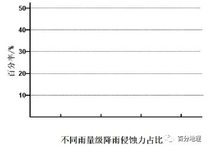

# 微专题之074 从产业结构角度分析区域发展

```
本专题摘自“百分地理”公众号，如有侵权请告之删除，谢谢。联系hhwxyhh@163.com
```

------
   
一、单选题   
（2022·福建龙岩·一模）针对黑土退化问题，地处东北平原的梨树县近年来积极推进耕作制度改革，创建了以“少（免）拼播种，秸秆还田、宽窄行种植”为核心内容的保护性耕作技术（下图），既提高玉米产量，又促进了黑土地资源的永续利用，被称为“梨树模式”。据此完成下面小题。   
   
   
   
1．导致东北黑土退化的最不可能的原因是（  ）   
A．夏季高温，土壤有机质分解快   
B．降水集中，流水侵蚀作用较强   
C．过度种植，土壤肥力不断下降   
D．施用化肥，土壤板结现象严重   
2．“梨树模式”对保护黑土最主要作用是（  ）   
A．减少土壤侵蚀   
B．增加土壤温度   
C．增加土壤水分   
D．提高土壤肥力   
3．提高梨树县玉米产量的合理措施是（  ）   
A．推广大棚种植，改善热量条件   
B．利用生物技术，培育优良品种   
C．增加灌溉水源，提高复种指数   
D．改善生态环境，增加播种密度   
<span style="color: rgb(255, 0, 0);">1．A东北平原纬度较高，气温较低，土壤有机质分解慢，A错误；属于温带季风气候，夏季降水集中，多暴雨，流水侵蚀作用较强，B正确；东北平原过度种植，地力消耗大，难以恢复，导致土壤肥力不断下降，C正确；大量施用化肥，减少了有机质的还田量，导致土壤板结，D正确；根据题意，故选A。</span>   
<span style="color: rgb(255, 0, 0);">2．D根据材料可知，“梨树模式”有诸多好处，既提高玉米产量，又促进了黑土地资源的永续利用，如宽窄行交替种植利于土壤休养，保持地力；秸秆还田，利于有机质的积累，减少化肥施用，防止土壤板结，减少土壤扰动，保持黑土肥力，因此“梨树模式”对保护黑土最主要作用是提高土壤肥力，D正确，ABC错误；故选D。</span>   
<span style="color: rgb(255, 0, 0);">3．B推广大棚种植，改善热量条件不能提高玉米产量，A错误；利用生物技术，培育优良品种，既能提高玉米产量，还能改善玉米品质，B正确；当地水源并不缺乏，且不影响玉米产量，C错误；增加播种密度不利于土壤休养，易导致土壤肥力下降，D错误；故选B。</span>   
<span style="color: rgb(255, 0, 0);">【点睛】随着经济社会的发展和科学技术的进步，农业生产条件不断改善，农田灌溉和农业机械化逐步普及，使中国农业劳动生产率不断提高，农业高科技手段广泛应用于农产品育种，不但增加了农产品产量，还改善了农产品品质，同时，储存、保鲜技术的运用，也延长了农产品的储存时间，改变了农产品的消费格局。</span>   
（2022·重庆·西南大学附中一模）墨西哥城附近的阿兹特克架田农作系统是全球重要农业文化遗产。600多年前，当地农户因地制宜，利用芦苇做成筏子，并在筏子上覆盖当地的泥土，创造了一种网状分布的水中架田。20世纪70年代，随着附近的墨西哥城经济的发展与气候变化，架田系统面临严重的生态问题，部分架田撂荒。21世纪以来，当地环境得到有效治理，架田系统重新焕发生机，为墨西哥城提供高品质蔬菜和花卉。据此完成下面小题。   
4．架田系统的广泛分布，反映出的自然环境特点是（  ）   
A．地势低洼   
B．旱涝频发   
C．水源短缺   
D．土壤贫瘠   
5．20世纪70年代，架田系统面临最严峻的生态问题可能是（  ）   
A．土地沙化   
B．土壤侵蚀   
C．水资源短缺   
D．土壤盐碱化   
6．21世纪，架田系统重新焕发生机的动力可能是（  ）   
A．市场   
B．交通   
C．技术   
D．环境   
<span style="color: rgb(255, 0, 0);">4．A由材料“600多年前，当地农户因地制宜，利用芦苇做成筏子，并在筏子上覆盖当地的泥土，创造了一种网状分布的水中架田”可知，芦苇是湿生环境的植物，生活在泥炭沼泽中，架田系统又是分布在水中，由此可推知当地自然环境特点是地势低洼，沼泽广布，A正确；不能反映出旱涝频发的气候特点，为适应旱涝频繁的气候特点，农业生产系统应重视的是排灌等水利设施，而不应是单纯的水中架田系统，B错误；反映出当地的水资源应是丰富的，C错误；用当地的泥土覆盖筏子上就能进行农业生产，说明当地土壤应是肥沃的，D错误。故选A。</span>   
<span style="color: rgb(255, 0, 0);">5．D由材料“20世纪70年代，随着附近的墨西哥城经济的发展与气候变化，架田系统面临严重的生态问题，部分架田撂荒”可知，全球气候变暖，蒸发加剧，加上城市经济的发展，劳动力减少，农田疏于管理，出现了土壤盐碱化现象，D正确；架田系统位于水中，水分条件较好，排水条件也较好，出现土地沙化现象和土壤侵蚀、水资源短缺等现象不太可能，ABC错误。故选D。</span>   
<span style="color: rgb(255, 0, 0);">6．A由材料“21世纪以来，当地环境得到有效治理，架田系统重新焕发生机，为墨西哥城提供高品质蔬菜和花卉”可知，架田系统重新焕发生机的动力可能是墨西哥城对高品质蔬菜和花卉的需求，该地以环境得到有效治理为基础，交通条件改善为条件，改进新的种植技术，发展了高品质蔬菜和花卉，经济效益大大提高。因此市场需求是架田系统重新焕发生机的动力，A正确；交通、技术、环境都只是前提条件，BCD错误。故选A。</span>   
<span style="color: rgb(255, 0, 0);">【点睛】市场的需求量影响了农业生产的类型和规模。产品的质量高低最终决定了生产的效益和企业的生存。</span>   
（2022·吉林长春·二模）植被演替是指裸地上植被的形成和发展过程。长白山大约在800年前发生了大规模的喷发，北坡火山灰堆积量最少，东坡最多。火山喷发后长白山植被重新演替。据研究表明，火山喷发是长白山植被演替滞后的主要原因，北坡植被演替已经进入中后期，东坡植被演替还处于初期阶段。下左图、右图分别为长白山东坡、北坡植被分布和长白山亚高山区（海拔约2000米－2200米）的植被演替示意图。据此完成下面小题。   
   
   
   
7．影响长白山植被演替滞后的主要因素是（  ）   
A．土壤侵蚀   
B．山体高度   
C．地势起伏   
D．土壤肥力   
8．导致长白山东坡和北坡植被差异的主要因素是（  ）   
A．热量状况   
B．降水多少   
C．光照强度   
D．演替速度   
9．如果演替不受干扰，未来几年长白山北坡岳桦林分布上界将（  ）   
A．向上移动   
B．向下移动   
C．保持不变   
D．波动变化   
<span style="color: rgb(255, 0, 0);">7．A长白山植被演替滞后是由于火山喷发引起的，结合题中材料和檀被分布分析可知，火山灰盖的坡面由于长期受流水侵蚀，所以地质条件不稳定，导致植被演替滞后，故A选项正确；火山喷发后长白山植被重新演替，火山喷发是长白山植被演替滞后的主要原因，山体高度、地势起伏并不是长白山植被演替滞后的主要因素，故B、C选项错误；火山喷发后积累大量火山灰，土壤肥沃，有利于植被演替，故D选项错误；故本题选择A。</span>   
<span style="color: rgb(255, 0, 0);">8．D两坡演替总时间是一致的，北坡已进入中后期，东坡还处于初期，说明北坡演替速度快于东坡。因为长白山北坡火山灰较少，火山灰侵蚀较弱，植被演替速度更快，东坡火山灰较厚，火山灰被侵蚀程度较强，土地基础不稳定，导致植被演替速度慢。故D选项正确；长白山东坡、北坡的热量状况、 降水多少、 光照强度、等条件差异小，对植被的影响差异小，故A、B、C选项错误；故本题选择D。</span>   
<span style="color: rgb(255, 0, 0);">9．A结合长白山亚高山区的植被演替示意图，苔原带将演变为森林，从信息中可知长白山北坡处于中后期，还没有结束演替，可以推出目前长白山北坡林线还未到达理论高度，所以岳桦林分布上界将上移，故选A选项正确，B、C、D选项错。故选A。</span>   
<span style="color: rgb(255, 0, 0);">【点睛】山地垂直地域分异规律：从山麓到山顶的自然带分异类似于纬度地带分异，纬度越低，相对高度越大，自然带类型越多，自然带谱越复杂。</span>   
（2022·江苏苏州·高三期末）土壤储存的碳是植物的三倍多，在全球碳循环中起着关键作用。草地的有机碳（土壤有机质中所含的碳素）储量从土壤表层向下迅速递减。新西兰某牧场推行“倒置耕作”种植牧草，将15?30厘放置在0?15厘米的表土上方。下图示意“倒置耕作”对土壤有机碳分布的影响。完成下面小题。   
   
   
   
10．当表层土壤有机碳不再增加时，可以实施下一轮“倒置耕作”。“倒置耕作”的周期最适宜为（  ）   
A．5年   
B．10年   
C．15年   
D．20年   
11．“倒置耕作”会（  ）   
A．促进杂草生长   
B．减轻土壤侵蚀   
C．减排温室气体   
D．增加病虫危害   
<span style="color: rgb(255, 0, 0);">10．C读图可以看出，“倒置耕作”后15年内表层土有机碳一直保持增加，到15年后几乎不再增加，故“倒置耕作”的周期最适宜为15年，C正确，ABD错误。故选C。</span>   
<span style="color: rgb(255, 0, 0);">11．C根据题干，“倒置耕作”会将杂草种子，病菌孢子、害虫虫卵等埋入深土，抑制其生长发育，AD错误；“倒置耕作”使土壤处于疏松的状态，易引起水蚀和风蚀，加重土壤的侵蚀，B错误；由图可知，与“倒置耕作”前相比，“倒置耕作”后0——15cm土层有机碳含量较快速上升，15——30cm土层有机碳较慢下降，土层中有机碳储量明显增加，因此将大气中的碳更多地储存在地下土壤中，从而抑制温室气体的排放，C正确；故选C。</span>   
<span style="color: rgb(255, 0, 0);">【点睛】耕作作用：松土：调节土壤三相比的关系；翻土：掩埋肥料，调整耕层养分垂直分布，消灭杂草和病虫害；混土：使土肥相融，形成均匀一致的营养环境；平地：形成平整表层，便于播种、出苗和灌溉；压土：有保墒和引墒的双重作用。</span>   
安徽地处我国南北方过渡地区，土壤侵蚀存在明显差异，淮北平原侵蚀较弱，皖南山区侵蚀较强。下图示意安徽南部某山区不同坡向土壤侵蚀面积占总侵蚀面积的比例（单位：％）。据此完成下面小题。   
   
   
   
12．安徽南部山区东南坡土壤侵蚀程度严重的主要原因是（  ）   
A．降水较多   
B．坡度较陡   
C．土层较薄   
D．植被稀疏   
13．可减轻安徽南部山区土壤侵蚀的最有效措施是（  ）   
A．顺坡垄作   
B．恢复原生植被   
C．留茬耕作   
D．延迟播种   
<span style="color: rgb(255, 0, 0);">12．A安徽南部为亚热带季风气候，夏半年在东南季风的吹拂下，东南坡为迎风坡，多地形雨，降雨丰富，尤其在夏季，多暴雨，因而导致东南坡土壤侵蚀量较大。A正确。材料没有体现不同坡向的坡度和植被的差异，BD错误；土壤侵蚀程度影响土层厚度，土层厚度不是土壤侵蚀程度的原因，C错误。故选A。</span>   
<span style="color: rgb(255, 0, 0);">13．B植被具有保持水土的作用，原生植被是由林灌草构成的比较完整的生态系统，植被丰富度高，因此原生植被保持水土的效益更加突出，B正确。顺坡垄作加剧土壤侵蚀，A错误；山区不是主要耕作区，坡度较大的地方即使留茬耕作也不会减轻土壤侵蚀，C错误；南部山区坡度较大，土壤侵蚀严重，不宜耕作，D错误。故选B。</span>   
<span style="color: rgb(255, 0, 0);">【点睛】流水侵蚀是土壤侵蚀最主要的一种形式，习惯上称为水土流失。影响水土流失的因素分为自然因素和人为因素。自然因素（主要有气候、地形、土壤、植被）是水土流失发生、发展的潜在条件。人类不合理的活动是加剧水土流失的主要原因：如毁林开荒、陡坡耕种、过量采伐林木、过度放牧，工程建设中不合理活动，水资源的不合理开发利用等，使生态环境恶化，导致发生严重的水土流失现象。</span>   
垄作是一种非常普遍的耕作方式。东北黑土区地形多为漫川漫岗地，受农户地块不连续的影响，以横坡垄作为主的保护性耕作措施不能得到很好的应用，进而致使顺坡垄作、斜坡垄作等成为最普遍的耕作方式。下图为东北地区黑土、黑钙土分布及顺坡垄作示意图。据此完成下面小题。   
   
   
   
14．东北黑土区黑土易受侵蚀的自然原因是（  ）   
A．植被破坏严重   
B．水流速度较快   
C．土壤质地黏重   
D．天然林比重大   
15．与无垄作相比，顺坡垄作（  ）   
①汇水速度更快②坡面径流强度随降水时间推移持续减弱③汇水总量更少④坡面土壤侵蚀率较大   
A．①④   
B．②③   
C．①③   
D．②④   
16．在东北黑土区积极推广宽垄耕作对保护黑土资源有重要意义，其主要是由于宽垄耕作比窄垄耕作（  ）   
A．增加了单位面积作物产量   
B．增加了地表径流汇集路径   
C．方便了大型机械推广使用   
D．减少了单位面积垄沟数量   
<span style="color: rgb(255, 0, 0);">14．B本题主要考查东北地区水土流失的自然原因。东北黑区黑士易受侵蚀的自然原因是地形以山地平原为主，水流速度较快，对地表的侵蚀作用强，导致黑土流失，B正确。天然林比重大和土壤质地黏重不易导致土壤受侵蚀，CD错误；植被破坏严重是人为原因，A错误。故选B。</span>   
<span style="color: rgb(255, 0, 0);">15．A本题主要考查土地的利用。顺坡垄、坡势耕种，坡面径流强度随着降水时间推移会持续增大，故②错误；顺坡垄、坡势耕种，汇水速度加快，故①正确；顺坡垄、坡势耕种，汇水总量会更多，故③错误；顺坡垄、坡势耕种，坡面土壤侵蚀率较大，故④正确，故A①④正确，BCD错误。故选A。</span>   
<span style="color: rgb(255, 0, 0);">16．D本题考查不同垄作方式的比较。注意题干侧重的是“保护黑土资源”，增加单位面积作物产量与保护黑土资源关系不大，A错误；方便大型机械推广使用只是对于机械推广有利，与保护黑土资源没有必然联系，C错误；宽垄耕作减少了单位面积垄沟的数量和径流汇集路径，进而减少坡面径流量，从而减少对土壤的侵蚀，有利于保护黑土资源，B错误，D正确。故D选项正确。</span>   
<span style="color: rgb(255, 0, 0);">【点睛】东北黑土退化的主要原因：</span>   
<span style="color: rgb(255, 0, 0);">（1）自然原因</span>   
<span style="color: rgb(255, 0, 0);">①春季的风力较大，而且土壤上的覆盖物较少，因此容易出现风蚀现象；同时夏季的降水量较为集中，且降水的强度较大，因此容易造成水土流失。</span>   
<span style="color: rgb(255, 0, 0);">②黑土区多在起伏较大的坡地上，由于地形有利于排水，因此更容易造成水土流失。</span>   
<span style="color: rgb(255, 0, 0);">③黑土的成土母质为砂砾和黏土层，因此其质地较为黏细且颗粒均一，当地表的植被遭到破坏之后就容易出现水土流失的情况。</span>   
<span style="color: rgb(255, 0, 0);">（2）人为原因：</span>   
<span style="color: rgb(255, 0, 0);">①小型农机具使用过多，导致耕作层变浅、犁底层上移，从而使得土壤的理化性能出现恶化。</span>   
<span style="color: rgb(255, 0, 0);">②黑土区的种植结构比较单一。</span>   
（2022·河南三门峡·一模）侵蚀模数是指单位面积上的土壤侵蚀量。南北盘江是珠江上游的主要河流，处于云贵高原向杜中山地丘陡地区过渡的斜坡地带，下表示意南北盘江流域2000～2010年不同坡度条件下土壤侵蚀状况，据此完成下列小题。   
<table cellspacing="0" cellpadding="0" width="577"><tbody><tr><td width="98" valign="middle" style="padding: 3.75pt 6pt;border-width: 1pt;border-color: rgb(0, 0, 0);"><section style="margin-top: 0pt;margin-bottom: 0pt;margin-left: 0pt;font-size: 10.5pt;font-family: &quot;Times New Roman&quot;;text-align: left;text-indent: 21pt;line-height: 2em;"><span style="font-family: 楷体;">坡度</span><span style="font-family: 楷体;"></span></section></td><td width="99" valign="middle" style="padding: 3.75pt 6pt;border-width: 1pt;border-color: rgb(0, 0, 0);"><section style="margin-top: 0pt;margin-bottom: 0pt;margin-left: 0pt;font-size: 10.5pt;font-family: &quot;Times New Roman&quot;;text-align: left;text-indent: 21pt;line-height: 2em;"><span style="font-family: 楷体;">侵蚀模数</span><span style="font-family: 楷体;"></span></section></td><td width="184" valign="middle" style="padding: 3.75pt 6pt;border-width: 1pt;border-color: rgb(0, 0, 0);"><section style="margin-top: 0pt;margin-bottom: 0pt;margin-left: 0pt;font-size: 10.5pt;font-family: &quot;Times New Roman&quot;;text-align: left;text-indent: 21pt;line-height: 2em;"><span style="font-family: 楷体;">侵蚀量</span><span style="font-family: 楷体;"></span></section></td></tr><tr><td width="98" valign="middle" style="padding: 3.75pt 6pt;border-width: 1pt;border-color: rgb(0, 0, 0);"><section style="margin-top: 0pt;margin-bottom: 0pt;margin-left: 0pt;font-size: 10.5pt;font-family: &quot;Times New Roman&quot;;text-align: left;text-indent: 21pt;line-height: 2em;"><span style="font-family: 楷体;">＜5°</span><span style="font-family: 楷体;"></span></section></td><td width="99" valign="middle" style="padding: 3.75pt 6pt;border-width: 1pt;border-color: rgb(0, 0, 0);"><section style="margin-top: 0pt;margin-bottom: 0pt;margin-left: 0pt;font-size: 10.5pt;font-family: &quot;Times New Roman&quot;;text-align: left;text-indent: 21pt;line-height: 2em;"><span style="font-family: 楷体;">10.2</span><span style="font-family: 楷体;"></span></section></td><td width="184" valign="middle" style="padding: 3.75pt 6pt;border-width: 1pt;border-color: rgb(0, 0, 0);"><section style="margin-top: 0pt;margin-bottom: 0pt;margin-left: 0pt;font-size: 10.5pt;font-family: &quot;Times New Roman&quot;;text-align: left;text-indent: 21pt;line-height: 2em;"><span style="font-family: 楷体;">2372</span><span style="font-family: 楷体;"></span></section></td></tr><tr><td width="98" valign="middle" style="padding: 3.75pt 6pt;border-width: 1pt;border-color: rgb(0, 0, 0);"><section style="margin-top: 0pt;margin-bottom: 0pt;margin-left: 0pt;font-size: 10.5pt;font-family: &quot;Times New Roman&quot;;text-align: left;text-indent: 21pt;line-height: 2em;"><span style="font-family: 楷体;">5°-8°</span><span style="font-family: 楷体;"></span></section></td><td width="99" valign="middle" style="padding: 3.75pt 6pt;border-width: 1pt;border-color: rgb(0, 0, 0);"><section style="margin-top: 0pt;margin-bottom: 0pt;margin-left: 0pt;font-size: 10.5pt;font-family: &quot;Times New Roman&quot;;text-align: left;text-indent: 21pt;line-height: 2em;"><span style="font-family: 楷体;">12.5</span><span style="font-family: 楷体;"></span></section></td><td width="184" valign="middle" style="padding: 3.75pt 6pt;border-width: 1pt;border-color: rgb(0, 0, 0);"><section style="margin-top: 0pt;margin-bottom: 0pt;margin-left: 0pt;font-size: 10.5pt;font-family: &quot;Times New Roman&quot;;text-align: left;text-indent: 21pt;line-height: 2em;"><span style="font-family: 楷体;">1292</span><span style="font-family: 楷体;"></span></section></td></tr><tr><td width="98" valign="middle" style="padding: 3.75pt 6pt;border-width: 1pt;border-color: rgb(0, 0, 0);"><section style="margin-top: 0pt;margin-bottom: 0pt;margin-left: 0pt;font-size: 10.5pt;font-family: &quot;Times New Roman&quot;;text-align: left;text-indent: 21pt;line-height: 2em;"><span style="font-family: 楷体;">8°-15°</span><span style="font-family: 楷体;"></span></section></td><td width="99" valign="middle" style="padding: 3.75pt 6pt;border-width: 1pt;border-color: rgb(0, 0, 0);"><section style="margin-top: 0pt;margin-bottom: 0pt;margin-left: 0pt;font-size: 10.5pt;font-family: &quot;Times New Roman&quot;;text-align: left;text-indent: 21pt;line-height: 2em;"><span style="font-family: 楷体;">14.2</span><span style="font-family: 楷体;"></span></section></td><td width="184" valign="middle" style="padding: 3.75pt 6pt;border-width: 1pt;border-color: rgb(0, 0, 0);"><section style="margin-top: 0pt;margin-bottom: 0pt;margin-left: 0pt;font-size: 10.5pt;font-family: &quot;Times New Roman&quot;;text-align: left;text-indent: 21pt;line-height: 2em;"><span style="font-family: 楷体;">2931</span><span style="font-family: 楷体;"></span></section></td></tr><tr><td width="98" valign="middle" style="padding: 3.75pt 6pt;border-width: 1pt;border-color: rgb(0, 0, 0);"><section style="margin-top: 0pt;margin-bottom: 0pt;margin-left: 0pt;font-size: 10.5pt;font-family: &quot;Times New Roman&quot;;text-align: left;text-indent: 21pt;line-height: 2em;"><span style="font-family: 楷体;">15°-25°</span><span style="font-family: 楷体;"></span></section></td><td width="99" valign="middle" style="padding: 3.75pt 6pt;border-width: 1pt;border-color: rgb(0, 0, 0);"><section style="margin-top: 0pt;margin-bottom: 0pt;margin-left: 0pt;font-size: 10.5pt;font-family: &quot;Times New Roman&quot;;text-align: left;text-indent: 21pt;line-height: 2em;"><span style="font-family: 楷体;">15.6</span><span style="font-family: 楷体;"></span></section></td><td width="184" valign="middle" style="padding: 3.75pt 6pt;border-width: 1pt;border-color: rgb(0, 0, 0);"><section style="margin-top: 0pt;margin-bottom: 0pt;margin-left: 0pt;font-size: 10.5pt;font-family: &quot;Times New Roman&quot;;text-align: left;text-indent: 21pt;line-height: 2em;"><span style="font-family: 楷体;">3019</span><span style="font-family: 楷体;"></span></section></td></tr><tr><td width="98" valign="middle" style="padding: 3.75pt 6pt;border-width: 1pt;border-color: rgb(0, 0, 0);"><section style="margin-top: 0pt;margin-bottom: 0pt;margin-left: 0pt;font-size: 10.5pt;font-family: &quot;Times New Roman&quot;;text-align: left;text-indent: 21pt;line-height: 2em;"><span style="font-family: 楷体;">25°-35°</span><span style="font-family: 楷体;"></span></section></td><td width="99" valign="middle" style="padding: 3.75pt 6pt;border-width: 1pt;border-color: rgb(0, 0, 0);"><section style="margin-top: 0pt;margin-bottom: 0pt;margin-left: 0pt;font-size: 10.5pt;font-family: &quot;Times New Roman&quot;;text-align: left;text-indent: 21pt;line-height: 2em;"><span style="font-family: 楷体;">17.2</span><span style="font-family: 楷体;"></span></section></td><td width="184" valign="middle" style="padding: 3.75pt 6pt;border-width: 1pt;border-color: rgb(0, 0, 0);"><section style="margin-top: 0pt;margin-bottom: 0pt;margin-left: 0pt;font-size: 10.5pt;font-family: &quot;Times New Roman&quot;;text-align: left;text-indent: 21pt;line-height: 2em;"><span style="font-family: 楷体;">1088</span><span style="font-family: 楷体;"></span></section></td></tr><tr><td width="98" valign="middle" style="padding: 3.75pt 6pt;border-width: 1pt;border-color: rgb(0, 0, 0);"><section style="margin-top: 0pt;margin-bottom: 0pt;margin-left: 0pt;font-size: 10.5pt;font-family: &quot;Times New Roman&quot;;text-align: left;text-indent: 21pt;line-height: 2em;"><span style="font-family: 楷体;">＞35°</span><span style="font-family: 楷体;"></span></section></td><td width="99" valign="middle" style="padding: 3.75pt 6pt;border-width: 1pt;border-color: rgb(0, 0, 0);"><section style="margin-top: 0pt;margin-bottom: 0pt;margin-left: 0pt;font-size: 10.5pt;font-family: &quot;Times New Roman&quot;;text-align: left;text-indent: 21pt;line-height: 2em;"><span style="font-family: 楷体;">20.9</span><span style="font-family: 楷体;"></span></section></td><td width="184" valign="middle" style="padding: 3.75pt 6pt;border-width: 1pt;border-color: rgb(0, 0, 0);"><section style="margin-top: 0pt;margin-bottom: 0pt;margin-left: 0pt;font-size: 10.5pt;font-family: &quot;Times New Roman&quot;;text-align: left;text-indent: 21pt;line-height: 2em;"><span style="font-family: 楷体;">303</span><span style="font-family: 楷体;"></span></section></td></tr></tbody></table>

17．南北盘江流域面积占比最大的坡度范围是（  ）   
A．<5°   
B．8°——15°   
C．15°——25°   
D．>35°   
18．坡度>35°的地区土壤侵蚀蚀量最小的主要原因是（  ）   
A．降水少   
B．面积小   
C．植被覆盖率高   
D．侵蚀作用弱   
19．为有效减少南北盘江流域耕地的土壤侵蚀量，当地农民可采取的措施有（  ）   
①顺坡垄作:②秸秆覆益③留茬耕作④间作和套种   
A．①②③   
B．①②④   
C．①③④   
D．②③④   
<span style="color: rgb(255, 0, 0);">17．A由材料可知，侵蚀量除以侵蚀模数即为该坡度范围的土地面积，通过计算可知，坡度&lt;5°的地区面积占比最大，故A正确，BCD错。</span>   
<span style="color: rgb(255, 0, 0);">18．B侵蚀量除以侵蚀模数即为该坡度范围的土地面积，通过计算可知，坡度&gt;35°的地区面积最小，因此土壤侵蚀量最小，故B正确。南北盘江流域地处我国西南地区，受季风影响显著，降水丰富，故A错，植被具有涵养水源、保持水土的功能，植被覆盖率高可以减轻土壤侵蚀强度，但该坡度范围侵蚀模数最大，土壤侵蚀作用最强，说明该坡度范围植被覆盖率并不高，故CD错。</span>   
<span style="color: rgb(255, 0, 0);">19．D秸秆覆盖和留茬耕作一方面可以增加地表粗糙度，增加下渗，使地表径流流速减慢、流量减少，另一方面可以固定和拦蓄泥土，从而减轻土壤侵蚀，间作和套种增加了地表植被的覆盖度，可减轻土壤侵蚀，故②③④正确，顺坡垄作会加剧侵蚀，故①错，本题选D，ABC错。</span>   
<span style="color: rgb(255, 0, 0);">【点睛】土地在水和风等外力作用下，发生冲刷或吹失的现象称为土地侵蚀。其中水造成的侵蚀称水蚀，风造成的侵蚀称风蚀。危害：1、破坏农田，降低土壤肥力，影响农作物的产量；2、加剧土地干旱和沙化；3、淤积抬高河床，加剧洪涝灾害；4、淤塞湖泊、水库，影响开发利用。</span>   
（2022·全国·高三专题练习）H水库三面环山，为小型水库，其汇水流域内亚热带常绿阔叶林覆益率近80％，最大高差不足200米。H水库沉积物主要来源于汇水流域的土壤侵蚀。沉积物中的炭屑为山火产物，C/P值（总炭屑浓度与总花粉孢子浓度的比值）可客观反映汇水流域山火情况。下图为H水库1960—2009年沉积物平均粒径、C/P值和汇水流域降水统计数据。读图,完成下面小题。   
   
   
   
20．当地政府修建H水库的主要目的是（  ）   
A．防洪   
B．灌溉   
C．供水   
D．发电   
21．1963年观测数据可佐证当年H水库汇水流域（  ）   
A．破坏山体开采石料   
B．地表水下渗量增加   
C．破坏植被种植果树   
D．放火烧荒开垦耕地   
22．H水库汇水流域砍伐乔木最严重的时段是（  ）   
A．2000—2005年   
B．1985—2000年   
C．1977—1985年   
D．1972—1977年   
<span style="color: rgb(255, 0, 0);">20．B由汇水流域内的植被类型、地势起伏小和年降水量推导，该地区为亚热带季风气候；亚热带季风气候区的降水季节变化较大，且H水库为小型水库，可推导修建H水库的主要目的是灌溉，B正确；亚热带季风气候降水量大，季节变化大，小型水库防洪作用能力弱，A错误。亚热带季风气候区，山地多，流域内植被覆盖率高，说明流域内人口相对较少，供水不是主要考虑的问题，C错误；流域内最大高差不足200米，落差小，小型水库，发电量小，发电不是主要考虑的目的，D错误。故选B。</span>   
<span style="color: rgb(255, 0, 0);">21．D由材料“H水库沉积物主要来源于汇水流域的土壤侵蚀。沉积物中的炭屑为山火产物，C/P值（总炭屑浓度与总花粉孢子浓度的比值）可客观反映汇水流域山火情况”，再结合图示中显示1963年的C/P值是前后几年中的高值，说明发生了较大规模的山火，或发生了多次山火，四个选项中，最可能是村民放火烧荒开垦耕地，D正确；破坏山体开采、地表水下渗量增加、破坏植被种植果树都不会引发山火，ABC错误。故选D。</span>   
<span style="color: rgb(255, 0, 0);">22．A四个选项中，2000—2005年，H水库汇水流域年降水量明显较往年少，C/P值非常低，但沉积物粒径很大；其原因是大面积砍伐了涵养水源功能最强的乔木，导致流水侵蚀作用增强，沉积物粒径增大，所以A正确，BCD错误。故选A。</span>   
（2022·浙江·高三专题练习）随着城市化的推进，城市水生态环境正发生着变化。下图为“城市某小区雨水开发应用排放模式与传统雨水排放模式比较示意图”。读图完成下面小题。   
   
   
   
23．随着城市化的发展，对区域水循环造成的影响是（  ）   
A．蒸发量增加   
B．降水量增加   
C．雨季地表径流量增加   
D．地下径流量增加   
24．图示小区雨水开发应用排放模式与传统雨水排放模式相比，具有的优点包括（  ）   
①减少土壤侵蚀②补充地下水③增加下渗量④根治城市洪灾⑤解决城市缺水问题   
A．①②   
B．②③   
C．③④   
D．④⑤   
<span style="color: rgb(255, 0, 0);">23．C城市化使城市水体面积减少，蒸发量减少，A错误；城市化对区域降水量影响不大，B错误。雨季降水量大，地表径流增加，C正确；随着城市不断发展，城市道路逐渐硬化，使用不透水砖，导致下渗量逐渐减少，地下径流减少，D错误；故选C。</span>   
<span style="color: rgb(255, 0, 0);">24．B读图可知，雨水开发应用排放模式，使用了渗水路面，下渗量增加，补充地下水资源，②③正确；增加了绿化带，可以延迟径流汇聚的时间，但是不能解决城市洪灾，④错误；图中对雨水进行收集，可以缓解城市缺水问题，但不能解决城市缺水问题，⑤错误；城市中的开发模式对土壤侵蚀影响不大，①错误。B正确。故选B。</span>   
<span style="color: rgb(255, 0, 0);">【点睛】水循环的主要环节有：蒸发、降水、水汽输送、下渗、地表径流、地下径流等环节。城市化主要改变了以下环节：蒸发量减少、下渗减少、地表径流增大等。</span>   
（2022·山东·高三专题练习）为研究不同植被群落下土壤特性的差异，某科研团队在贵州一喀斯特实验样地（样地内降水、温度等气候因素大致相当）进行了生态实验研究。下图为不同植被群落下土壤有机质含量（左图）和土壤抗蚀指数的实验结果（右图）。据此完成下列小题。   
   
   
   
25．实验结果表明（  ）   
A．阔叶林土层有机质含量随深度增加下降最显著   
B．灌丛土层有机质含量随深度增加变化幅度最大   
C．针叶林土层抗蚀能力随深度增加变化幅度最大   
D．三种植被土层抗蚀能力随深度增加均有所增强   
26．10-20cm土层中针叶林有机质含量最高的原因可能是针叶林（  ）   
A．土层降水量小，有机质淋失少   
B．土层温度高，有机质分解快   
C．生物量流动最大，枯落物分解转化多   
D．表土疏松，有机质淋溶向下淀积量大   
27．在喀斯特地区，如果以防治土壤侵蚀为目的，应考虑种植的树种为（  ）   
A．针叶林   
B．混交林   
C．阔叶林   
D．灌丛   
<span style="color: rgb(255, 0, 0);">25．A读图分析，从0-10厘米到10-20厘米，阔叶林土壤有机质含量随深度增加下降最显著，针叶林土壤有机质含量随深度增加下降较显著，灌丛土壤有机质含量随深度增加基本保持不变。A正确，B错误；从0-10厘米到10-20厘米，阔叶林土层抗蚀能力随深度增加变化幅度最大。C错误；图中阔叶林土层抗蚀能力随深度增加而减弱， D错误；故选A。</span>   
<span style="color: rgb(255, 0, 0);">26．D根据所学知识，较深的土壤层次中针叶林有机质含量最高，可能是因为针叶林地区降水少，土质较为疏松，有机质淋溶后向下淀积量大，D正确；若有机质淋失少、有机质分解快，则不会在较深的土壤层次中含有较高的有机质。AB错误；针叶林地区纬度较高，温度较低，受温度影响下部土层枯落物分解转化较少，C错误；故选D。</span>   
<span style="color: rgb(255, 0, 0);">27．C根据所学知识，喀斯特地区土层较薄，为了防治土壤侵蚀，应选择在0-10厘米抗侵蚀指数最强的树种，即阔叶林，C正确，ABD错误；故选C。</span>   
<span style="color: rgb(255, 0, 0);">【点睛】气候主要通过温度和降水全面影响成土过程中的物理、化学和生物作用的强度和方向。其中，热带雨林气候由于全年高温多雨，植物生长旺盛，微生物分解快，雨水淋溶作用强，导致土壤的有机质被吸收消耗多，积累少。高纬高寒气候区，植物生长慢，有机质吸收慢，积累多。干旱气候区，植物少，腐殖质少，有机质来源少 ，积累少。平原、低地等地势低平的地区有利于外力堆积，土层深厚。高原山地地区地势高，生长条件较差，植物生长量小，有机质少，肥力低。陡坡落差大，土壤易受重力作用和外力侵蚀的影响，土层薄。</span>   
降水侵蚀力是指降水引起的土壤侵蚀潜在能力，对其时间变化的研究主要采用趋势分析法，数值大小表示趋势强弱，正值表示降水侵蚀力呈上升趋势，负值表示降水侵蚀力呈下降趋势。下图示意1960-2014年我国松花江流域降水侵蚀力趋势系数等值线。据此完成下列小题。   
   
   
   
28．松花江流域年降水侵蚀力最强的时间段是（  ）   
A．5-6月份   
B．6-7月份   
C．7-8月份   
D．8-9月份   
29．松花江流域最需要加强水土保持工作的地区是（  ）   
A．东北地区   
B．西北地区   
C．东南地区   
D．西南地区   
<span style="color: rgb(255, 0, 0);">28．C松花江流域地处我国温带季风区，7、8月份锋面雨带到达东北，降水较多，降水侵蚀力最强，C正确；5月、6月雨带未到达，降水较少，A、B错误；9月雨带南撤，降水较少，D错误。故选C。</span>   
<span style="color: rgb(255, 0, 0);">29．B由图上的降水侵蚀力趋势系数等值线可看出，西北地区数值为正值，且最大，说明降水侵蚀力呈强烈上升趋势，最需要加强水土保持工作，B正确；东北、东南、西南地区均为负值，说明降水侵蚀力呈下降趋势。A、C、D不符合题意。故选B。</span>   
（2022·江苏·模拟预测）土壤储存的碳是植物的三倍多，在全球碳循环中起着关键作用。草地的有机碳（土壤有机质中所含的碳素）储量从土壤表层向下迅速递减。新西兰某牧场推行“倒置耕作”种植牧草，将15～30厘米的底土放置在0～1厘米的表土上方。下图示意“倒置耕作”对土壤有机碳分布的影响。据此完成下面小题。   
   
   
   
30．草地表层土壤有机碳含量较高的主要原因是（  ）   
A．植被吸收较少   
B．淋溶作用较强   
C．土质疏松多孔   
D．生物质积累多   
31．当表层土壤有机碳不再增加时，可以实施下一轮“倒置耕作”。“倒置耕作”的周期最适宜为（  ）   
A．5年   
B．10年   
C．15年   
D．20年   
32．“倒置耕作”的作用不包括（  ）   
A．抑制杂草生长   
B．减轻土壤侵蚀   
C．减排温室气体   
D．减少病虫危害   
<span style="color: rgb(255, 0, 0);">30．D由所学知识可知，植被吸收较少与草地表层士壤有机碳含量关系不大，且“倒置耕作”对植被吸收影响较小，A错误。淋溶作用是指土壤物质中可溶性或悬浮性化合物（黏粒、有机质、易溶盐、碳酸盐和铁铝氧化物等）在渗漏水的作用下，由土壤上部向下部迁移，或发生侧向迁移的一种土壤发生过程。草地表层土壤有机碳含量较高，淋溶作用弱，B错误。土质疏松多孔与草地表层壤有机碳含量关系不大，C错误。草地和草原由于季节性枯萎，导致积累下来的有机质较多，故有机碳含量较高，且淋溶作用较弱，D正确。故选D。</span>   
<span style="color: rgb(255, 0, 0);">31．C读图可以可以看出，倒置耕作后，15年内表层土有机碳一直保持增加，到15年后几乎不再增加，故倒置耕作的周期最适宜为15年，C正确，ABD错误。故选C。</span>   
<span style="color: rgb(255, 0, 0);">32．B根据题干，“倒置耕作”会将杂草种子、病菌孢子、害虫卵等埋入深土层，抑制其生长繁育，AD不符合题意，AD错误。由图可知，有机碳储量随着深度的增加而下降，因此有可能将土壤中的碳储存在地下土壤中，抑制温室气体的排放，C不符合题意，C错误。在水土流失或风蚀作用的地区，“倒置耕作”后土壤处于疏松状态，易引起水蚀或风蚀，加重对土壤侵蚀，B符合题意，B正确。故选B。</span>   
<span style="color: rgb(255, 0, 0);">【点睛】“倒置耕作”会将杂草种子、病菌孢子、害虫卵等埋入深土层，抑制其生长繁育，抑制杂草生长，减少病虫危害。有机碳储量随着深度的增加而下降，将土壤中的碳储存在地下土壤中，可抑制温室气体的排放。</span>   
二、综合题   
33．阅读文字图表资料，完成下列问题。   
土壤侵蚀已经成为人类目前所面临的最为严重的生态环境问题之一。降雨成为诱发土壤侵蚀的主要动力因素。降雨对土壤侵蚀的主要表现形式为雨滴击溅和径流剥蚀，其降雨的持续时间、强度、次数均会对土壤侵蚀面积产生重要影响。因此，研究不同量级降雨引发的水土壤侵蚀对水土保持工程建设具有重要的参考价值。太行山脉地区属于中国国家级水土流失重点治理区。下图示意太行山脉地区不同量级降雨日数、降雨量，及其占比；下表太行山脉地区不同量级年均降雨侵蚀力   
   
   
   
注：降雨侵蚀力：是指降雨引起土壤侵蚀的潜在能力。它与降雨量、降雨历时、降雨强度、降雨动能有关。反映降雨特性对土壤侵蚀的影响。   
（1）有人认为：太行山脉地区降雨侵蚀力的产生以及变化主要与降雨日数少，雨量级别较大的降雨事件有关。请选择图中的相关数据说明这一观点。   
（2）在下列坐标图中，用折线绘制出不同量级降雨侵蚀力占比。在地区植被、土壤、地形、坡度以及坡长不变的情况下，针对不同量级降雨，指出在太行山脉水土流失重点治理地区应密切监测的量级降雨，并说明理由。   
   
   
   
<span style="color: rgb(255, 0, 0);">【答案】（1）暴雨以上量级降雨日数占总降雨日数的比例不到8.0%，其产生的降雨量占总降雨量比例为18.23%，然而其引起的降雨侵蚀力占总降雨侵蚀力比例却高达43.89%。</span>   
<span style="color: rgb(255, 0, 0);">（2）画图。折线和数据对，横坐标；大雨和暴雨。大雨与暴雨产生的降雨侵蚀力占总降雨侵蚀的比例达64.5，易引发滑坡和泥石流；</span>   
   
   
   
   
<span style="color: rgb(255, 0, 0);">【解析】本题考查影响太行山降雨侵蚀变化的因素及水土流失重点治理地区应密切监测的量级等知识点，考查学生对数据的解析能力。（1）暴雨降水日数占比接近（或小于）7.5%，特大暴雨降水日数占接近（或小于）0.5%，暴雨以上量级降雨日数占总降雨日数的比例不到8.0%；但其产生的降雨量占总降雨量比例为18.23%（暴雨降雨量占总降雨量比例约为15%，特大暴雨降雨量占总降雨量比例约为3%），然而其引起的降雨侵蚀力占总降雨侵蚀力比例是（610 220）/1890≈43.89%。因此太行山脉地区降雨侵蚀力的产生以及变化主要与降雨日数少、雨量级别较大的降雨事件有关。（2）先计算出不同量级降雨侵蚀力占比。中雨侵蚀力占比约为23.8%；大雨侵蚀力占比约为32.3%；暴雨侵蚀力占比约为32.3%；特大暴雨侵蚀力占比约为11.6%。大雨与暴雨产生的降雨侵蚀力占总降雨侵蚀的比例达64.5，易引发滑坡和泥石流；在太行山脉水土流失重点治理地区应密切监测的量级降雨是大雨和暴雨。</span>   
   
   
