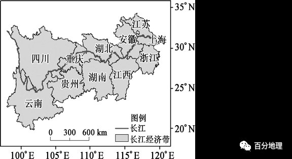

# 微专题之074 从产业结构角度分析区域发展

```
本专题摘自“百分地理”公众号，如有侵权请告之删除，谢谢。联系hhwxyhh@163.com
```

------
   
一、单选题   
生态系统服务是指生态系统形成和所维持的人类赖以生存和发展的环境条件和效用，人类以直接或间接的方式获得其产品和服务。长江经济带是全球生物多样性最为丰富的区域之一，是我国生态安全格局的重要组成部分。近年来长江流域内出现系列生态环境问题。下图为长江经济带，下表为生态系统服务供给变化。据此完成下面小题。   
   
   
   
1．表中水域生态系统服务供给呈逐年增长趋势，主要是由于（  ）   
A．长江全面禁渔政策的实施   
B．人工养殖导致水产品产量增加   
C．加强了河流的治理，防洪能力提高   
D．长江上游植树造林和中游退田还湖   
2．长江经济带生态系统服务供给存在明显的空间分异，推测下列属于高供给区的是（  ）   
A．贵州中西部   
B．长江三角洲   
C．长江流域上游   
D．江苏和安徽北部   
<span style="color: rgb(255, 0, 0);">1．D长江全面禁渔政策的实施，会导致水域生态系统服务供给应下降，A错误；人工养殖导致水产品产量增加，只是水产品增加，不是整个水域生态系统服务供给增加，B错误；加强河流治理，防洪能力提高，主要使长江的洪涝灾害威胁降低，C错误；长江上游植树造林，中游退田环湖等政策增加水域面积，能够增加经济带生态系统服务供给，D正确。故选：D。</span>   
<span style="color: rgb(255, 0, 0);">2．C由于生态系统服务供给最多的是林地，占长江流域森林面积最大的是长江流域上游地区，C符合题意；贵州中西部，主要是岩溶地貌地区，地表崎岖，土壤贫瘠，生态系统服务供给差，A错误；江苏和安徽大部分都属于长江三角洲，且长江三角洲城市化水平高，该地区林地、耕地、草地和水域较少，生态系统服务供给不会属于高供给区，BD错误。故选C。</span>   
<span style="color: rgb(255, 0, 0);">【点睛】生态系统服务功能，是指生态系统在能量流、物质流的生态过程中，对外部显示的重要作用。例如，改善环境，提供产品等。生态系统不仅给人类提供生存必需的食物、医药及工农业生产的原料等产品，而且维持了人类赖以生存和发展的生命保障系统。与传统的服务不同，生态系统服务只有一小部分能够进入市场被买卖，大多数生态系统服务属于公共品或准公共品，无法进入市场。生态系统服务供给存在明显的空间分异。</span>   
（2022·陕西省安康中学高二期末）生态系统服务价值被定义为人类从生态系统与生态过程中所获得的满足自身生存的自然环境条件和效益。下图为某区域湿地的生态系统服务价值图（内环为2000年，外环为2016年）。读图完成下面小题。   
   
   
   
3．2000年该区域湿地生态系统服务中价值较大的是（  ）   
A．气候调节   
B．水源处理   
C．生物多样性   
D．土壤形成与保护   
4．2000-2016年，该区域最不可能发生的变化是（  ）   
A．旅游资源得到开发   
B．湖泊面积有所增大   
C．生态环境有所改善   
D．建设用地减少   
<span style="color: rgb(255, 0, 0);">3．B内环为2000年湿地的生态系统服务价值，读图可知，2000年时，水源处理在该区域湿地生态系统服务价值中所占比例明显较大，B项正确。气候调节、生物多样性、土壤形成与保护在该区域湿地生态系统服务价值中所占比例明显较小，ACD错误。故选B。</span>   
<span style="color: rgb(255, 0, 0);">4．D读图可知，2000—2016年，该区域湿地的生态系统服务价值中，娱乐文化的价值所占比例增大，说明旅游资源得到开发，故A项与题意不符；2000—2016年，该区域湿地的生态系统服务价值中，气候调节、生物多样性的价值有所增大，而废弃物处理和水源处理的价值均明显减小；原因可能是该区域对生态环境进行了治理和优化，加强了湿地资源保护，故湖泊面积可能增大，对气候调节作用提升，生态环境有所改善，生物多样性增加；故BC与题意不符；2000—2016年，该区域湿地的生态系统服务价值中，食品生产的价值所占比例有明显提高，说明建设用地增加，不存在减少的现象，故D说法错误，符合题目要求。所以本题选D。</span>   
<span style="color: rgb(255, 0, 0);">【点睛】生态系统服务是指人类从生态系统获得的所有惠益，包括供给服务(如提供食物和水）、调节服务(如控制洪水和疾病）、文化服务(如精神、娱乐和文化收益)以及支持服务(如维持地球生命生存环境的养分循环。</span>   
（2021·山东·模拟预测）水电开发对河流生态系统服务的影响按照范围可分为淹没所影响的河岸带陆地生态系统（包括耕地、林地等）和河流生态系统本身。下表是我国某河流按照生态系统服务类别、人类的受益情况、主要影响范围等，建立的水电开发对河流生态系统服务影响评估体系。据此完成下面小题。   
<table cellspacing="0" cellpadding="0" width="577"><tbody><tr><td width="165" colspan="2" valign="middle" style="padding: 3.75pt 6pt;border-width: 1pt;border-color: rgb(0, 0, 0);"><section style="margin-top: 0pt;margin-bottom: 0pt;margin-left: 0pt;text-indent: 0pt;font-size: 10.5pt;font-family: &quot;Times New Roman&quot;;text-align: left;line-height: 2em;"><span style="font-family: 宋体;">服务类型</span></section></td><td width="83" valign="middle" style="padding: 3.75pt 6pt;border-width: 1pt;border-color: rgb(0, 0, 0);"><section style="margin-top: 0pt;margin-bottom: 0pt;margin-left: 0pt;text-indent: 0pt;font-size: 10.5pt;font-family: &quot;Times New Roman&quot;;text-align: left;line-height: 2em;"><span style="font-family: 宋体;">具体指标</span></section></td><td width="83" valign="middle" style="padding: 3.75pt 6pt;border-width: 1pt;border-color: rgb(0, 0, 0);"><section style="margin-top: 0pt;margin-bottom: 0pt;margin-left: 0pt;text-indent: 0pt;font-size: 10.5pt;font-family: &quot;Times New Roman&quot;;text-align: left;line-height: 2em;"><span style="font-family: 宋体;">正/负效应</span></section></td><td width="83" valign="middle" style="padding: 3.75pt 6pt;border-width: 1pt;border-color: rgb(0, 0, 0);"><section style="margin-top: 0pt;margin-bottom: 0pt;margin-left: 0pt;text-indent: 0pt;font-size: 10.5pt;font-family: &quot;Times New Roman&quot;;text-align: left;line-height: 2em;"><span style="font-family: 宋体;">主要影响范围</span></section></td></tr><tr><td width="83" rowspan="7" valign="middle" style="padding: 3.75pt 6pt;border-width: 1pt;border-color: rgb(0, 0, 0);"><section style="margin-top: 0pt;margin-bottom: 0pt;margin-left: 0pt;text-indent: 0pt;font-size: 10.5pt;font-family: &quot;Times New Roman&quot;;text-align: left;line-height: 2em;"><span style="font-family: 宋体;">供给</span></section></td><td width="83" rowspan="2" valign="middle" style="padding: 3.75pt 6pt;border-width: 1pt;border-color: rgb(0, 0, 0);"><section style="margin-top: 0pt;margin-bottom: 0pt;margin-left: 0pt;text-indent: 0pt;font-size: 10.5pt;font-family: &quot;Times New Roman&quot;;text-align: left;line-height: 2em;"><span style="font-family: 宋体;">食物生产</span></section></td><td width="83" valign="middle" style="padding: 3.75pt 6pt;border-width: 1pt;border-color: rgb(0, 0, 0);"><section style="margin-top: 0pt;margin-bottom: 0pt;margin-left: 0pt;text-indent: 0pt;font-size: 10.5pt;font-family: &quot;Times New Roman&quot;;text-align: left;line-height: 2em;"><span style="font-family: 宋体;">粮食产品</span></section></td><td width="83" valign="middle" style="padding: 3.75pt 6pt;border-width: 1pt;border-color: rgb(0, 0, 0);"><section style="margin-top: 0pt;margin-bottom: 0pt;margin-left: 0pt;text-indent: 0pt;font-size: 10.5pt;font-family: &quot;Times New Roman&quot;;text-align: left;line-height: 2em;">—</section></td><td width="83" valign="middle" style="padding: 3.75pt 6pt;border-width: 1pt;border-color: rgb(0, 0, 0);"><section style="margin-top: 0pt;margin-bottom: 0pt;margin-left: 0pt;text-indent: 0pt;font-size: 10.5pt;font-family: &quot;Times New Roman&quot;;text-align: left;line-height: 2em;"><span style="font-family: 宋体;">淹没影响的河岸带生态系统</span></section></td></tr><tr><td width="83" valign="middle" style="padding: 3.75pt 6pt;border-width: 1pt;border-color: rgb(0, 0, 0);"><section style="margin-top: 0pt;margin-bottom: 0pt;margin-left: 0pt;text-indent: 0pt;font-size: 10.5pt;font-family: &quot;Times New Roman&quot;;text-align: left;line-height: 2em;"><span style="font-family: 宋体;">渔业产品</span></section></td><td width="83" valign="middle" style="padding: 3.75pt 6pt;border-width: 1pt;border-color: rgb(0, 0, 0);"><section style="margin-top: 0pt;margin-bottom: 0pt;margin-left: 0pt;text-indent: 0pt;font-size: 10.5pt;font-family: &quot;Times New Roman&quot;;text-align: left;line-height: 2em;">—</section></td><td width="83" valign="middle" style="padding: 3.75pt 6pt;border-width: 1pt;border-color: rgb(0, 0, 0);"></td></tr><tr><td width="83" valign="middle" style="padding: 3.75pt 6pt;border-width: 1pt;border-color: rgb(0, 0, 0);"><section style="margin-top: 0pt;margin-bottom: 0pt;margin-left: 0pt;text-indent: 0pt;font-size: 10.5pt;font-family: &quot;Times New Roman&quot;;text-align: left;line-height: 2em;"><span style="font-family: 宋体;">原料生产</span></section></td><td width="83" valign="middle" style="padding: 3.75pt 6pt;border-width: 1pt;border-color: rgb(0, 0, 0);"><section style="margin-top: 0pt;margin-bottom: 0pt;margin-left: 0pt;text-indent: 0pt;font-size: 10.5pt;font-family: &quot;Times New Roman&quot;;text-align: left;line-height: 2em;"><span style="font-family: 宋体;">林产品</span></section></td><td width="83" valign="middle" style="padding: 3.75pt 6pt;border-width: 1pt;border-color: rgb(0, 0, 0);"><section style="margin-top: 0pt;margin-bottom: 0pt;margin-left: 0pt;text-indent: 0pt;font-size: 10.5pt;font-family: &quot;Times New Roman&quot;;text-align: left;line-height: 2em;"> /—</section></td><td width="83" valign="middle" style="padding: 3.75pt 6pt;border-width: 1pt;border-color: rgb(0, 0, 0);"></td></tr><tr><td width="83" rowspan="4" valign="middle" style="padding: 3.75pt 6pt;border-width: 1pt;border-color: rgb(0, 0, 0);"><section style="margin-top: 0pt;margin-bottom: 0pt;margin-left: 0pt;text-indent: 0pt;font-size: 10.5pt;font-family: &quot;Times New Roman&quot;;text-align: left;line-height: 2em;"><span style="font-family: 宋体;">水资源供给</span></section></td><td width="83" valign="middle" style="padding: 3.75pt 6pt;border-width: 1pt;border-color: rgb(0, 0, 0);"><section style="margin-top: 0pt;margin-bottom: 0pt;margin-left: 0pt;text-indent: 0pt;font-size: 10.5pt;font-family: &quot;Times New Roman&quot;;text-align: left;line-height: 2em;"><span style="font-family: 宋体;">涵养水源</span></section></td><td width="83" valign="middle" style="padding: 3.75pt 6pt;border-width: 1pt;border-color: rgb(0, 0, 0);"><section style="margin-top: 0pt;margin-bottom: 0pt;margin-left: 0pt;text-indent: 0pt;font-size: 10.5pt;font-family: &quot;Times New Roman&quot;;text-align: left;line-height: 2em;"> </section></td><td width="83" valign="middle" style="padding: 3.75pt 6pt;border-width: 1pt;border-color: rgb(0, 0, 0);"><section style="margin-top: 0pt;margin-bottom: 0pt;margin-left: 0pt;text-indent: 0pt;font-size: 10.5pt;font-family: &quot;Times New Roman&quot;;text-align: left;line-height: 2em;"><span style="font-family: 宋体;">淹没影响的河岸带生态系统</span></section></td></tr><tr><td width="83" valign="middle" style="padding: 3.75pt 6pt;border-width: 1pt;border-color: rgb(0, 0, 0);"><section style="margin-top: 0pt;margin-bottom: 0pt;margin-left: 0pt;text-indent: 0pt;font-size: 10.5pt;font-family: &quot;Times New Roman&quot;;text-align: left;line-height: 2em;"><span style="font-family: 宋体;">灌溉</span></section></td><td width="83" valign="middle" style="padding: 3.75pt 6pt;border-width: 1pt;border-color: rgb(0, 0, 0);"><section style="margin-top: 0pt;margin-bottom: 0pt;margin-left: 0pt;text-indent: 0pt;font-size: 10.5pt;font-family: &quot;Times New Roman&quot;;text-align: left;line-height: 2em;"> </section></td><td width="83" valign="middle" style="padding: 3.75pt 6pt;border-width: 1pt;border-color: rgb(0, 0, 0);"><section style="margin-top: 0pt;margin-bottom: 0pt;margin-left: 0pt;text-indent: 0pt;font-size: 10.5pt;font-family: &quot;Times New Roman&quot;;text-align: left;line-height: 2em;"><span style="font-family: 宋体;">河岸带生态系统</span></section></td></tr><tr><td width="83" valign="middle" style="padding: 3.75pt 6pt;border-width: 1pt;border-color: rgb(0, 0, 0);"><section style="margin-top: 0pt;margin-bottom: 0pt;margin-left: 0pt;text-indent: 0pt;font-size: 10.5pt;font-family: &quot;Times New Roman&quot;;text-align: left;line-height: 2em;"><span style="font-family: 宋体;">发电</span></section></td><td width="83" valign="middle" style="padding: 3.75pt 6pt;border-width: 1pt;border-color: rgb(0, 0, 0);"><section style="margin-top: 0pt;margin-bottom: 0pt;margin-left: 0pt;text-indent: 0pt;font-size: 10.5pt;font-family: &quot;Times New Roman&quot;;text-align: left;line-height: 2em;"> </section></td><td width="83" valign="middle" style="padding: 3.75pt 6pt;border-width: 1pt;border-color: rgb(0, 0, 0);"><section style="margin-top: 0pt;margin-bottom: 0pt;margin-left: 0pt;text-indent: 0pt;font-size: 10.5pt;font-family: &quot;Times New Roman&quot;;text-align: left;line-height: 2em;"><span style="font-family: 宋体;">河流生态系统</span></section></td></tr><tr><td width="83" valign="middle" style="padding: 3.75pt 6pt;border-width: 1pt;border-color: rgb(0, 0, 0);"><section style="margin-top: 0pt;margin-bottom: 0pt;margin-left: 0pt;text-indent: 0pt;font-size: 10.5pt;font-family: &quot;Times New Roman&quot;;text-align: left;line-height: 2em;"><span style="font-family: 宋体;">航运</span></section></td><td width="83" valign="middle" style="padding: 3.75pt 6pt;border-width: 1pt;border-color: rgb(0, 0, 0);"><section style="margin-top: 0pt;margin-bottom: 0pt;margin-left: 0pt;text-indent: 0pt;font-size: 10.5pt;font-family: &quot;Times New Roman&quot;;text-align: left;line-height: 2em;">—</section></td><td width="83" valign="middle" style="padding: 3.75pt 6pt;border-width: 1pt;border-color: rgb(0, 0, 0);"></td></tr><tr><td width="83" rowspan="5" valign="middle" style="padding: 3.75pt 6pt;border-width: 1pt;border-color: rgb(0, 0, 0);"><section style="margin-top: 0pt;margin-bottom: 0pt;margin-left: 0pt;text-indent: 0pt;font-size: 10.5pt;font-family: &quot;Times New Roman&quot;;text-align: left;line-height: 2em;"><span style="font-family: 宋体;">支持</span></section></td><td width="83" rowspan="2" valign="middle" style="padding: 3.75pt 6pt;border-width: 1pt;border-color: rgb(0, 0, 0);"><section style="margin-top: 0pt;margin-bottom: 0pt;margin-left: 0pt;text-indent: 0pt;font-size: 10.5pt;font-family: &quot;Times New Roman&quot;;text-align: left;line-height: 2em;"><span style="font-family: 宋体;">保持水土</span></section></td><td width="83" valign="middle" style="padding: 3.75pt 6pt;border-width: 1pt;border-color: rgb(0, 0, 0);"><section style="margin-top: 0pt;margin-bottom: 0pt;margin-left: 0pt;text-indent: 0pt;font-size: 10.5pt;font-family: &quot;Times New Roman&quot;;text-align: left;line-height: 2em;"><span style="font-family: 宋体;">泥沙淤积</span></section></td><td width="83" valign="middle" style="padding: 3.75pt 6pt;border-width: 1pt;border-color: rgb(0, 0, 0);"><section style="margin-top: 0pt;margin-bottom: 0pt;margin-left: 0pt;text-indent: 0pt;font-size: 10.5pt;font-family: &quot;Times New Roman&quot;;text-align: left;line-height: 2em;">—</section></td><td width="83" valign="middle" style="padding: 3.75pt 6pt;border-width: 1pt;border-color: rgb(0, 0, 0);"><section style="margin-top: 0pt;margin-bottom: 0pt;margin-left: 0pt;text-indent: 0pt;font-size: 10.5pt;font-family: &quot;Times New Roman&quot;;text-align: left;line-height: 2em;"><span style="font-family: 宋体;">河流生态系统</span></section></td></tr><tr><td width="83" valign="middle" style="padding: 3.75pt 6pt;border-width: 1pt;border-color: rgb(0, 0, 0);"><section style="margin-top: 0pt;margin-bottom: 0pt;margin-left: 0pt;text-indent: 0pt;font-size: 10.5pt;font-family: &quot;Times New Roman&quot;;text-align: left;line-height: 2em;"><span style="font-family: 宋体;">控制侵蚀能力</span></section></td><td width="83" valign="middle" style="padding: 3.75pt 6pt;border-width: 1pt;border-color: rgb(0, 0, 0);"><section style="margin-top: 0pt;margin-bottom: 0pt;margin-left: 0pt;text-indent: 0pt;font-size: 10.5pt;font-family: &quot;Times New Roman&quot;;text-align: left;line-height: 2em;">—</section></td><td width="83" valign="middle" style="padding: 3.75pt 6pt;border-width: 1pt;border-color: rgb(0, 0, 0);"></td></tr><tr><td width="83" rowspan="2" valign="middle" style="padding: 3.75pt 6pt;border-width: 1pt;border-color: rgb(0, 0, 0);"><section style="margin-top: 0pt;margin-bottom: 0pt;margin-left: 0pt;text-indent: 0pt;font-size: 10.5pt;font-family: &quot;Times New Roman&quot;;text-align: left;line-height: 2em;"><span style="font-family: 宋体;">维持养分循环</span></section></td><td width="83" valign="middle" style="padding: 3.75pt 6pt;border-width: 1pt;border-color: rgb(0, 0, 0);"><section style="margin-top: 0pt;margin-bottom: 0pt;margin-left: 0pt;text-indent: 0pt;font-size: 10.5pt;font-family: &quot;Times New Roman&quot;;text-align: left;line-height: 2em;"><span style="font-family: 宋体;">有机质生产</span></section></td><td width="83" valign="middle" style="padding: 3.75pt 6pt;border-width: 1pt;border-color: rgb(0, 0, 0);"><section style="margin-top: 0pt;margin-bottom: 0pt;margin-left: 0pt;text-indent: 0pt;font-size: 10.5pt;font-family: &quot;Times New Roman&quot;;text-align: left;line-height: 2em;">—</section></td><td width="83" valign="middle" style="padding: 3.75pt 6pt;border-width: 1pt;border-color: rgb(0, 0, 0);"><section style="margin-top: 0pt;margin-bottom: 0pt;margin-left: 0pt;text-indent: 0pt;font-size: 10.5pt;font-family: &quot;Times New Roman&quot;;text-align: left;line-height: 2em;"><span style="font-family: 宋体;">淹没影响的河岸带生态系统</span></section></td></tr><tr><td width="83" valign="middle" style="padding: 3.75pt 6pt;border-width: 1pt;border-color: rgb(0, 0, 0);"><section style="margin-top: 0pt;margin-bottom: 0pt;margin-left: 0pt;text-indent: 0pt;font-size: 10.5pt;font-family: &quot;Times New Roman&quot;;text-align: left;line-height: 2em;"><span style="font-family: 宋体;">固碳释氧</span></section></td><td width="83" valign="middle" style="padding: 3.75pt 6pt;border-width: 1pt;border-color: rgb(0, 0, 0);"><section style="margin-top: 0pt;margin-bottom: 0pt;margin-left: 0pt;text-indent: 0pt;font-size: 10.5pt;font-family: &quot;Times New Roman&quot;;text-align: left;line-height: 2em;">—</section></td><td width="83" valign="middle" style="padding: 3.75pt 6pt;border-width: 1pt;border-color: rgb(0, 0, 0);"><section style="margin-top: 0pt;margin-bottom: 0pt;margin-left: 0pt;text-indent: 0pt;font-size: 10.5pt;font-family: &quot;Times New Roman&quot;;text-align: left;line-height: 2em;"><span style="font-family: 宋体;">河流生态系统</span></section></td></tr><tr><td width="83" valign="middle" style="padding: 3.75pt 6pt;border-width: 1pt;border-color: rgb(0, 0, 0);"><section style="margin-top: 0pt;margin-bottom: 0pt;margin-left: 0pt;text-indent: 0pt;font-size: 10.5pt;font-family: &quot;Times New Roman&quot;;text-align: left;line-height: 2em;"><span style="font-family: 宋体;">生物多样性</span></section></td><td width="83" valign="middle" style="padding: 3.75pt 6pt;border-width: 1pt;border-color: rgb(0, 0, 0);"><section style="margin-top: 0pt;margin-bottom: 0pt;margin-left: 0pt;text-indent: 0pt;font-size: 10.5pt;font-family: &quot;Times New Roman&quot;;text-align: left;line-height: 2em;"><span style="font-family: 宋体;">维持生物多样性</span></section></td><td width="83" valign="middle" style="padding: 3.75pt 6pt;border-width: 1pt;border-color: rgb(0, 0, 0);"><section style="margin-top: 0pt;margin-bottom: 0pt;margin-left: 0pt;text-indent: 0pt;font-size: 10.5pt;font-family: &quot;Times New Roman&quot;;text-align: left;line-height: 2em;">—</section></td><td width="83" valign="middle" style="padding: 3.75pt 6pt;border-width: 1pt;border-color: rgb(0, 0, 0);"></td></tr><tr><td width="83" rowspan="4" valign="middle" style="padding: 3.75pt 6pt;border-width: 1pt;border-color: rgb(0, 0, 0);"><section style="margin-top: 0pt;margin-bottom: 0pt;margin-left: 0pt;text-indent: 0pt;font-size: 10.5pt;font-family: &quot;Times New Roman&quot;;text-align: left;line-height: 2em;"><span style="font-family: 宋体;">调节</span></section></td><td width="83" valign="middle" style="padding: 3.75pt 6pt;border-width: 1pt;border-color: rgb(0, 0, 0);"><section style="margin-top: 0pt;margin-bottom: 0pt;margin-left: 0pt;text-indent: 0pt;font-size: 10.5pt;font-family: &quot;Times New Roman&quot;;text-align: left;line-height: 2em;"><span style="font-family: 宋体;">气体调节</span></section></td><td width="83" valign="middle" style="padding: 3.75pt 6pt;border-width: 1pt;border-color: rgb(0, 0, 0);"><section style="margin-top: 0pt;margin-bottom: 0pt;margin-left: 0pt;text-indent: 0pt;font-size: 10.5pt;font-family: &quot;Times New Roman&quot;;text-align: left;line-height: 2em;"><span style="font-family: 宋体;">减少温室气体</span></section></td><td width="83" valign="middle" style="padding: 3.75pt 6pt;border-width: 1pt;border-color: rgb(0, 0, 0);"><section style="margin-top: 0pt;margin-bottom: 0pt;margin-left: 0pt;text-indent: 0pt;font-size: 10.5pt;font-family: &quot;Times New Roman&quot;;text-align: left;line-height: 2em;"> </section></td><td width="83" valign="middle" style="padding: 3.75pt 6pt;border-width: 1pt;border-color: rgb(0, 0, 0);"><section style="margin-top: 0pt;margin-bottom: 0pt;margin-left: 0pt;text-indent: 0pt;font-size: 10.5pt;font-family: &quot;Times New Roman&quot;;text-align: left;line-height: 2em;"><span style="font-family: 宋体;">河流生态系统</span></section></td></tr><tr><td width="83" valign="middle" style="padding: 3.75pt 6pt;border-width: 1pt;border-color: rgb(0, 0, 0);"><section style="margin-top: 0pt;margin-bottom: 0pt;margin-left: 0pt;text-indent: 0pt;font-size: 10.5pt;font-family: &quot;Times New Roman&quot;;text-align: left;line-height: 2em;"><span style="font-family: 宋体;">气候调节</span></section></td><td width="83" valign="middle" style="padding: 3.75pt 6pt;border-width: 1pt;border-color: rgb(0, 0, 0);"><section style="margin-top: 0pt;margin-bottom: 0pt;margin-left: 0pt;text-indent: 0pt;font-size: 10.5pt;font-family: &quot;Times New Roman&quot;;text-align: left;line-height: 2em;">—</section></td><td width="83" valign="middle" style="padding: 3.75pt 6pt;border-width: 1pt;border-color: rgb(0, 0, 0);"><section style="margin-top: 0pt;margin-bottom: 0pt;margin-left: 0pt;text-indent: 0pt;font-size: 10.5pt;font-family: &quot;Times New Roman&quot;;text-align: left;line-height: 2em;"> </section></td><td width="83" valign="middle" style="padding: 3.75pt 6pt;border-width: 1pt;border-color: rgb(0, 0, 0);"><section style="margin-top: 0pt;margin-bottom: 0pt;margin-left: 0pt;text-indent: 0pt;font-size: 10.5pt;font-family: &quot;Times New Roman&quot;;text-align: left;line-height: 2em;"><span style="font-family: 宋体;">河岸带生态系统、河流生态系统</span></section></td></tr><tr><td width="83" valign="middle" style="padding: 3.75pt 6pt;border-width: 1pt;border-color: rgb(0, 0, 0);"><section style="margin-top: 0pt;margin-bottom: 0pt;margin-left: 0pt;text-indent: 0pt;font-size: 10.5pt;font-family: &quot;Times New Roman&quot;;text-align: left;line-height: 2em;"><span style="font-family: 宋体;">净化环境</span></section></td><td width="83" valign="middle" style="padding: 3.75pt 6pt;border-width: 1pt;border-color: rgb(0, 0, 0);"><section style="margin-top: 0pt;margin-bottom: 0pt;margin-left: 0pt;text-indent: 0pt;font-size: 10.5pt;font-family: &quot;Times New Roman&quot;;text-align: left;line-height: 2em;"><span style="font-family: 宋体;">净化水质</span></section></td><td width="83" valign="middle" style="padding: 3.75pt 6pt;border-width: 1pt;border-color: rgb(0, 0, 0);"><section style="margin-top: 0pt;margin-bottom: 0pt;margin-left: 0pt;text-indent: 0pt;font-size: 10.5pt;font-family: &quot;Times New Roman&quot;;text-align: left;line-height: 2em;">—</section></td><td width="83" valign="middle" style="padding: 3.75pt 6pt;border-width: 1pt;border-color: rgb(0, 0, 0);"><section style="margin-top: 0pt;margin-bottom: 0pt;margin-left: 0pt;text-indent: 0pt;font-size: 10.5pt;font-family: &quot;Times New Roman&quot;;text-align: left;line-height: 2em;"><span style="font-family: 宋体;">河流生态系统</span></section></td></tr><tr><td width="83" valign="middle" style="padding: 3.75pt 6pt;border-width: 1pt;border-color: rgb(0, 0, 0);"><section style="margin-top: 0pt;margin-bottom: 0pt;margin-left: 0pt;text-indent: 0pt;font-size: 10.5pt;font-family: &quot;Times New Roman&quot;;text-align: left;line-height: 2em;"><span style="font-family: 宋体;">水文调节</span></section></td><td width="83" valign="middle" style="padding: 3.75pt 6pt;border-width: 1pt;border-color: rgb(0, 0, 0);"><section style="margin-top: 0pt;margin-bottom: 0pt;margin-left: 0pt;text-indent: 0pt;font-size: 10.5pt;font-family: &quot;Times New Roman&quot;;text-align: left;line-height: 2em;"><span style="font-family: 宋体;">调蓄洪水</span></section></td><td width="83" valign="middle" style="padding: 3.75pt 6pt;border-width: 1pt;border-color: rgb(0, 0, 0);"><section style="margin-top: 0pt;margin-bottom: 0pt;margin-left: 0pt;text-indent: 0pt;font-size: 10.5pt;font-family: &quot;Times New Roman&quot;;text-align: left;line-height: 2em;"> </section></td><td width="83" valign="middle" style="padding: 3.75pt 6pt;border-width: 1pt;border-color: rgb(0, 0, 0);"><section style="margin-top: 0pt;margin-bottom: 0pt;margin-left: 0pt;text-indent: 0pt;font-size: 10.5pt;font-family: &quot;Times New Roman&quot;;text-align: left;line-height: 2em;"><span style="font-family: 宋体;">河岸带生态系统、河流生态系统</span></section></td></tr><tr><td width="83" valign="middle" style="padding: 3.75pt 6pt;border-width: 1pt;border-color: rgb(0, 0, 0);"><section style="margin-top: 0pt;margin-bottom: 0pt;margin-left: 0pt;text-indent: 0pt;font-size: 10.5pt;font-family: &quot;Times New Roman&quot;;text-align: left;line-height: 2em;"><span style="font-family: 宋体;">文化</span></section></td><td width="83" valign="middle" style="padding: 3.75pt 6pt;border-width: 1pt;border-color: rgb(0, 0, 0);"><section style="margin-top: 0pt;margin-bottom: 0pt;margin-left: 0pt;text-indent: 0pt;font-size: 10.5pt;font-family: &quot;Times New Roman&quot;;text-align: left;line-height: 2em;"><span style="font-family: 宋体;">美学景观</span></section></td><td width="83" valign="middle" style="padding: 3.75pt 6pt;border-width: 1pt;border-color: rgb(0, 0, 0);"><section style="margin-top: 0pt;margin-bottom: 0pt;margin-left: 0pt;text-indent: 0pt;font-size: 10.5pt;font-family: &quot;Times New Roman&quot;;text-align: left;line-height: 2em;"><span style="font-family: 宋体;">旅游</span></section></td><td width="83" valign="middle" style="padding: 3.75pt 6pt;border-width: 1pt;border-color: rgb(0, 0, 0);"><section style="margin-top: 0pt;margin-bottom: 0pt;margin-left: 0pt;text-indent: 0pt;font-size: 10.5pt;font-family: &quot;Times New Roman&quot;;text-align: left;line-height: 2em;"> /—</section></td><td width="83" valign="middle" style="padding: 3.75pt 6pt;border-width: 1pt;border-color: rgb(0, 0, 0);"><section style="margin-top: 0pt;margin-bottom: 0pt;margin-left: 0pt;text-indent: 0pt;font-size: 10.5pt;font-family: &quot;Times New Roman&quot;;text-align: left;line-height: 2em;"><span style="font-family: 宋体;">河流生态系统</span></section></td></tr></tbody></table>

   
5．研究表明水电开发对该河流生态系统服务的正效应大于负效应，负效应主要体现在（  ）   
A．发电   
B．水文调节   
C．气体调节   
D．生物多样性   
6．水电开发使受淹没影响的河岸带生态系统服务价值增加，主要原因可能为（  ）   
A．水电开发使原料生产、土壤保持、净化环境等服务增加   
B．与陆地生态系统比，淹没的河岸带生态系统固碳释氧服务增加   
C．水域单位面积服务价值远大于林地、草地等土地利用类型   
D．水电开发使水文调节、水资源供给、维持养分循环等服务增加   
<span style="color: rgb(255, 0, 0);">5．D从表格信息中可看出发电、水文调节、气体调节均是正效应，而生物多样性是负效应，故选D。</span>   
<span style="color: rgb(255, 0, 0);">6．C结合表格信息可知，水电开发使原料生产的服务既有正效应也有负效应，而土壤保持、净化环境均是负效应，A错误。淹没的河岸带生态系统固碳释氧服务减少，B错误。水电开发的的正效应主要体现在水域单位，林地草地的负效应较多，C正确。水电开发使水文调节呈正效应，维持养分循环服务呈现负效应，水资源供给正负效应均有，D错误。故选C。</span>   
<span style="color: rgb(255, 0, 0);">【点睛】本题主要利用表格信息对水电开发的效益进行评价，难度较低，只需认真对照表格中各项指标的效应即可作出正确选择。</span>   
淇河发源于太行山南段，具有较高的水源养，水质净化等生态系统服务功能，是流内居民生活及工农业生产的重要水源。近年来人类活动逐渐向山区扩展导致洪河流域生态环境质量逐渐退化，下图是洪河流域2000年2015年土地利用变化情况。   
据此完成下面小题。   
   
   
   
7．2000年-2015年淇河流域   
A．耕地比重持续减少   
B．林地比重变化最大   
C．草地比重持续上升   
D．建设用地增加最大   
8．2000年-2015年淇河流域土地利用比重变化的影响是   
A．地表径流汇流速度增加   
B．夏季降水量增加   
C．径流季节变化减小   
D．河流含沙量增加   
<span style="color: rgb(255, 0, 0);">7．C从图中可看出，耕地比重先变大后变小，林地比重变化不大，草地比重持续上升，建设用地比重增大但是没有草地增加的多，C正确。故选C。</span>   
<span style="color: rgb(255, 0, 0);">8．C从图中可看出，淇河流域耕地比重有所减小，草地比用持续上升，可知该地进行了生态退耕，植被覆盖率上升，地表径流汇流速度减小，径流季节变化减小，河流含沙量减小，C正确；地表植被的变化对降水量影响不大。故选C。</span>   
（2022·北京顺义·一模）据报道，北京市地下水位连续五年回升，2021年12月全市平原区地下水平均埋深为16.67米。下图为北京市平原区地下水埋深变化图。读图，完成下面小题。   
   
   
   
9．近五年北京市平原区地下水位变化特点（  ）   
A．1～2月有冻土发育，地下水埋藏最浅   
B．3～6月降水少，灌溉用水多，水位下降   
C．7～10月生态补水，降水多，水位最高   
D．11～12月地表草木枯黄，水位变化最大   
10．2021年北京市平原区地下水位明显升高，可能给该区域带来的影响是（  ）   
A．减轻土壤盐碱化   
B．减缓地面沉降   
C．诱发洪涝灾害   
D．加剧水土流失   
<span style="color: rgb(255, 0, 0);">9．B由图可知，近五年北京市平原区，11～12月 地下水埋藏深度不到24米，是一年中地下水埋藏最浅、地下水位最高的时段，AC错；3～6月降水少，北方雨季尚未开始，灌溉用水多，导致地下水位下降，B正确；由于7～10月生态补水，降水多，北京市平原区地下水位回升，11～12月地表草木枯黄的季节，农业用水减少，地下水位缓慢回升，水位变化不大，D错。故本题选B。</span>   
<span style="color: rgb(255, 0, 0);">10．B2021年北京市平原区地下水位明显升高，深层土壤中的矿物盐分也随之上升，有可能加重土壤盐碱化，A错；地下水位明显升高，可有效遏制地面沉降，减缓地面沉降，B正确；地下水位明显升高，说明地表水的补给增多，减少地表径流，可抑制水土流失，削减汛期洪水水量，降低了洪涝灾害的发生，故C、D错。因此本题选B。</span>   
<span style="color: rgb(255, 0, 0);">【点睛】地下水位下降后，由于破坏了原地层的受力平衡，在地面载荷（压力）作用下被疏干的含水层就会被压缩，因此可造成地面下沉，建筑物倾斜、开裂，桥梁、道路变形等严重的后果。另外，地下水位下降还可引起海水倒灌、咸水入侵等污染淡水资源的现象。</span>   
（2022·山东·模拟预测）位于宁夏境内的乌玛高速公路，穿越腾格里沙漠东南缘，公路沿线的流动沙丘对其建设和安全运营带来极大挑战。为解决这一难题，研究者提出“六带一体”的综合防护体系（下图）。据此完成下面小题。   
   
   
   
11．导致高速公路两侧防护体系设置差异的主要原因可能是（  ）   
A．地形状况   
B．沙丘类型   
C．盛行风向   
D．投资金额   
12．该防护体系常绿灌木林带中可种植沙冬青，推测该植物（  ）   
①属本地特有种，由自然演化形成   
②耐旱、耐寒、耐高温   
③由我国南方引种，叶面宽阔   
④根系发达，需水量大   
A．①②   
B．①④   
C．②③   
D．③④   
13．图中砾石带的主要作用是（  ）   
A．增加下渗   
B．固沙阻沙   
C．隔离防火   
D．生态景观   
<span style="color: rgb(255, 0, 0);">11．C根据图示可知，高速公路两侧防护体系设置差异主要是高立式阻沙栅栏和高立式大风格沙障和生态景观林带的宽度的差异，主要体现在阻沙和固沙和生态保护方面的差异，在该地冬季风（西北风）强劲，且西部是腾格里沙漠，西部沙源丰富。西北风影响下的风沙活动多，需要严密防范；夏季风力较弱，东部防护带稍窄，导致两侧防护体系设置差异的主要原因是盛行风向。C正确；两侧的地形状况、沙丘类型没有明显差别，AB错误；投资金额不是主要原因，D错误。故选C。</span>   
<span style="color: rgb(255, 0, 0);">12．A该地地处我国西北部温带大陆性气候区，气候干旱，降水少，气温日较差和年较差都较大，生态环境恶劣，该公路穿越腾格里沙漠东南缘，沙冬青应属本地特有种，由自然演化形成，而且具有耐旱、耐寒、耐高温的特征，否则很难生长，①②正确；我国南方气候湿润，该地引种南方树种适应不了当地干旱环境，叶面宽阔蒸腾作用强，会导致严重缺水；根系发达，可以从很广很深的地下吸收水分，当地气候干旱，水资源缺乏，所种植物应该需水量少，③④错误。综上所述，A正确，BCD错误。故选A。</span>   
<span style="color: rgb(255, 0, 0);">13．C图中砾石带的主要作用是隔离防火，该地夏季高温干燥，路面升温快，尤其白天温度高，车辆在白天行驶过程中与路面摩擦温度更高，砾石带将林带与路面隔开，防止枯枝落叶飘到路面上，引发火灾，C正确；该地降水少，不是考虑增加下渗，A错误；起到固沙阻沙作用的主要是沙障和林带，B错误；生态景观林起到生态景观作用，D错误。故选C。</span>   
<span style="color: rgb(255, 0, 0);">【点睛】在沙漠中修公路首先要做的便是防沙固沙。项目按照“阻沙先行、固沙为主、固阻结合”的思路，在路基两侧修建迎风坡200米宽、背风坡100米宽，由前沿阻沙栅栏带、高立式大网格沙障带、防风固沙林带、生态景观林带、常绿灌木林带、砾石防火带构成的“六带一体”防护体系，最大限度减少风积沙对公路的影响。外围阻沙功能，内侧固沙功能以及生态景观功能，构建乌玛公路腾格里沙漠段稳定的防沙治沙工程，提出最优化的沙漠公路沙害防护宽度，降低交通事故发生率，确保高速公路的畅通无阻。</span>   
（2022·河北唐山·一模）近年来，位于高纬地区的阿拉斯加中南部野火发生的频率和规模都在增加，当地常出现被认为已经熄灭的野火重新复燃的现象。在过火地面积增大的同时，当地生态系统也发生了显著变化。据此完成下面小题。   
14．当地被认为已经熄灭的野火常常重新复燃的原因最可能是当地（  ）   
A．沼泽湿地少   
B．地下有机物积累多   
C．地热能丰富   
D．积雪期长且厚度大   
15．当地存在地下多年冻土的区域过火后，容易导致（  ）   
A．水体交换受阻   
B．碳排放速度变缓   
C．部分地表沉陷   
D．物种多样性增加   
<span style="color: rgb(255, 0, 0);">14．B当地被认为已经熄灭的野火常常重新复燃，主要是可燃性物质丰富，当地的纬度位置较高，有机质分解较慢，地下有机物积累多，可燃物较多，所以野火常常复燃，B正确；该地沼泽湿地多，A错误；地热资源不是导致野火复燃的主要因素，C错误；积雪厚不利于野火复燃，D错误。所以选B。</span>   
<span style="color: rgb(255, 0, 0);">15．C当地存在地下多年冻土的区域过火后，会导致地下冻土融化，利于水体交换，A错误；大量沼气等有机质燃烧，会排放大量二氧化碳，碳排放速度增加，B错误；冻土融化，会导致地表沉陷，C正确；火灾会导致地表植物被烧死，生物多样性减少，D错误。所以选C。</span>   
<span style="color: rgb(255, 0, 0);">【点睛】火焰会复燃，是因为在高纬地区生态系统中，树木不是唯一的——甚至也不是主要的——燃料。在没有树木的苔原及其南部的北方针叶林表面上，覆有一层厚厚的有机物。这层致密的泥炭层被称作半腐层，是每年夏季死去的表层苔藓和枯枝落叶的堆积物。</span>   
二、综合题   
16．（2022·河南·三模）阅读图文材料，完成下列要求。   
潮沟是在沙泥质潮滩上由于潮流作用形成的冲沟，是潮滩上最活跃的微地貌单元，也是潮滩与外界连通和进行物质、能量交换的重要通道。黄河三角洲地处新、老黄河入海口两侧，潮沟纵横交叉，各种湿地景观呈斑块状分布，湿地中天然植物群落的分布由海向陆呈现光滩、碱蓬群落和芦苇群落的条带状分布格局。自1996年黄河改道以来，区域内开展了大量围垦和堤坝工程，打破了原有的生态平衡，同时随着适宜在淹水、高盐度环境中生长的互花米草的引入和扩张，黄河三角洲湿地及潮沟的形态特征发生了巨大改变。下图示意2004年、2008年和2018年黄河三角洲潮沟的分布。   
   
   
   
(1)1996年黄河向北改道导致北岸潮沟数量明显减少，说明其原因。   
(2)分析侧弯丁坝的修建对其南北两侧海岸线产生的影响。   
(3)2008年后黄河三角洲南部潮沟长度缩短，解释其原因。   
(4)分析互花米草与潮沟的相互作用对其他湿地植物的不利影响。   
<span style="color: rgb(255, 0, 0);">【答案】(1)1996年黄河向北改道，黄河三角洲北部泥沙大量淤积；导致潮沟发生淤塞,数量减少。</span>   
<span style="color: rgb(255, 0, 0);">(2)侧弯丁坝建成后，侧弯丁坝南侧潮滩失去泥沙补给，被海水侵蚀，海岸线向陆地退缩；原本应随着潮流运移到南侧的泥沙被拦截，使北侧海岸线向海延伸速度加快。</span>   
<span style="color: rgb(255, 0, 0);">(3)大面积潮滩被围垦，阻断了潮沟向上发展的通道；侧弯丁坝南侧泥沙被拦截，潮滩受海水侵蚀不断后退，所以潮沟长度缩短。</span>   
<span style="color: rgb(255, 0, 0);">(4)互花米草适宜在淹水、高盐度环境中生长，且潮沟良好的连通性有利于互花米草的人侵；随着互花米草密度的增大，其消浪、缓流作用加强，潮流侵蚀作用减弱，阻碍潮沟进一步发育；并通过减弱潮汐动力和阻碍潮汐通道而改变其他湿地植物生长发育必要的水盐条件，不利于其生长。</span>   
<span style="color: rgb(255, 0, 0);">【解析】本大题以黄河三角洲为背景材料，涉及潮沟、湿地、湿地中植物群落的分布等相关知识，考查学生获取和解读信息能力及综合思维能力，培养学生的人地协调观、综合思维、区域认知和地理实践力等地理核心素养。(1)1996年黄河向北改道，黄河三角洲北部泥沙大量淤积，当泥沙来源丰富，沉积速率很高时，不断沉降的泥沙可以填没微型浅洼地，导致潮沟发生淤塞，数量减少。(2)侧弯丁坝建成后，新黄河入海口位于侧弯丁坝北侧，北部泥沙大量淤积，使北侧海岸线向海延伸速度加快。由于侧弯丁坝的阻挡，原本应随着潮流运移到南侧的泥沙被拦截，南侧潮滩失去泥沙补给，被海水侵蚀，海岸线向陆地退缩。(3)2008年后黄河三角洲南部潮沟长度缩短，主要原因是大面积潮滩被围垦，阻断了潮沟向上发展的通道，潮沟长度缩短；侧弯丁坝建成后，侧弯丁坝南侧泥沙被拦截，南侧潮滩失去泥沙补给，潮滩受海水侵蚀不断后退，海岸线向陆地退缩，所以潮沟长度缩短。(4)依材料可知，互花米草适宜在淹水、高盐度环境中生长，潮沟为其提供良好的生存环境；潮沟是潮滩上最活跃的微地貌单元，也是潮滩与外界连通和进行物质、能量交换的重要通道，黄河三角洲潮沟纵横交叉，潮沟良好的连通性有利于互花米草的人侵；随着互花米草密度的增大，其消浪、缓流作用加强，可以增强潮坪面抗水流侵蚀能力，潮流侵蚀作用减弱，因而可抑制潮沟的形成，可阻止已有潮沟的溯源侵蚀，阻碍潮沟进一步发育；并通过减弱潮汐动力和阻碍潮汐通道而改变其他湿地植物生长发育必要的水盐条件，不利于其生长。</span>   
17．（2022·河北·模拟预测）阅读图文材料，完成下列要求。   
材料一塔里木盆地内有我国最干旱、生态环境最脆弱的荒漠生态系统。塔里木盆地古老物种较多，珍稀、濒危物种种类多，胡杨、柽柳群落是该地区的主要植被群落，受南疆季节性洪水、特殊光热条件的影响，形成季节性洪水漫溢生境、盐生生境、干旱生境3种典型生境。   
材料二凋落物指自然界植物新陈代谢的产物，温度和湿度是凋落物分解的主要控制因素。自2014年11月起，某研究团队每3个月对塔里木盆地3种不同生境下胡杨、柽柳群落的凋落物进行取样，试验时间为720天。图为不同生境中表层土壤（0—10cm）温度、湿度变化示意图（H1为盐生生境，H2为干旱生境，H3为洪水漫溢生境）。   
   
   
   
(1)推测塔里木盆地胡杨、柽柳等荒漠植物的生长习性。   
(2)简析塔里木盆地珍稀、濒危物种种类较多的原因。   
(3)从自然环境的整体性角度，分析凋落物对荒漠生态系统的重要作用。   
<span style="color: rgb(255, 0, 0);">【答案】(1)耐寒；耐旱；耐盐碱；耐高温；抗风沙。</span>   
<span style="color: rgb(255, 0, 0);">(2)自然环境独特，动植物演化较独立；气候干旱，生态环境脆弱，一般动、植物难以存活，地形较封闭，人类活动干扰小。</span>   
<span style="color: rgb(255, 0, 0);">(3)凋落物为植物生长、微生物活动提供营养物质与能量来源；凋落物分解后释放有机质，增加土壤肥力；凋落物涵养水源，减少地表径流和蒸发，促进水分下渗，减少土地荒漠化。</span>   
<span style="color: rgb(255, 0, 0);">【解析】本题以不同生境中表层土壤温度、湿度变化示意图为载体，主要涉及荒漠植物的生长习性的判断，塔里木盆地珍稀、濒危物种种类较多的原因，凋落物对荒漠生态系统的重要作用等知识，主要考查学生获取和解读地理信息的能力，调动和运用地理知识的基本技能。(1)植物的生长习性是适应自然环境而进化出的特征。塔里木盆地属于温带大陆性气候，夏季高温，冬季寒冷，全年降水较少，多风沙天气，盐碱地面积广。胡杨、柽柳等荒漠植物能够在塔里木盆地生长并成为该地区主要植被类型，说明其耐寒、耐旱、耐盐碱、耐高温、抗风沙。(2)主要从区域自然环境的独特性（气候、地形）和人类活动两方面分析。塔里木盆地，深居内陆，地形封闭，自然环境独特，动植物演化较独立；深居内陆，地形封闭，使得气候干旱，生态环境脆弱，一般动、植物难以存活；地形较封闭，气候干旱，人类活动干扰小。所以珍稀、濒危物种种类较多。(3)自然环境的整体性，是指自然地理环境各要素之间相互影响，相互制约形成一个整体。根据材料，凋落物指自然界植物新陈代谢的产物，凋落物覆盖在地表，可涵养水源，减少地表径流和蒸发，促进水分下渗，减少土地荒漠，体现凋落物对水文和地貌的影响；凋落物被微生物分解可释放有机质，增加土壤肥力，体现凋落物对土壤的影响；土壤肥力提高了，能为植物生长提供更多的养分。</span>   
18．（2022·河北·模拟预测）阅读图文材料，完成下列要求。   
松嫩平原南部某地年平均降水量为427mm，集中在6—9月，年蒸发量约1600mm。该地某研究断面由沙丘、接合部及草甸三个部位组成，接合部距离沙丘约300m，草甸距离接合部约380m。接合部盐碱活动较为剧烈，主要植被为羊草；草甸盐碱化严重，主要植被为盐地碱蓬。20世纪70年代以来，由于人口增长，粮食需求量增加，部分草甸被开垦成农田，生态环境有所改善。左图为该研究断面各部位分布示意图，右图示意5—10月该研究断面不同部位0～300cm深度土壤含水率的垂直变化情况。   
   
   
   
(1)指出该研究断面0～300cm深度各部位平均土壤含水率的大小关系，并运用水循环原理分析其原因。   
(2)从土质和植被角度，分析上层土壤（0～10cm）中接合部土壤含水率高于草甸的原因。   
(3)指出该地部分草甸被开垦成农田对当地区域发展的益处。   
<span style="color: rgb(255, 0, 0);">【答案】(1)大小关系：草甸＞沙丘＞接合部。原因：草甸地势低，植被数量较多，能够聚集较多的雨水，因此平均土壤含水率最高；沙丘的土壤比较松散，孔隙较大，有利于雨水下渗，但表层水分蒸发较强，因此平均土壤含水率低于草甸；接合部盐碱活动较为剧烈，土壤板结，水分下渗困难，多集中于表层土壤，因此平均土壤含水率最低。</span>   
<span style="color: rgb(255, 0, 0);">(2)接合部植被覆盖率低，植物吸收和蒸腾作用较弱，盐碱活动剧烈，土壤板结，水分不易下渗，表层土壤含水率较高；草甸植被较丰富，根系较浅，吸收水分较多，土壤孔隙大，水分下渗量较多，表层土壤含水率较低。</span>   
<span style="color: rgb(255, 0, 0);">(3)扩大耕地面积，增加了粮食供应，促进了当地经济发展和社会稳定；充分利用荒地，提高了土地利用率；农作物的种植增加了地表植被的覆盖率，有利于缓解土壤盐碱化，促进当地生态环境改善。</span>   
<span style="color: rgb(255, 0, 0);">【解析】考查影响土壤含水率的因素，区域发展，考查学生读图和提取信息的能力，地理实践力和综合思维等学科核心素养。(1)本题考查土壤含水率的影响因素。据图可知，该地0～300cm深度各部位平均土壤含水率的大小关系是草甸＞沙丘＞接合部。原因应从水的收入与支出两个角度分析。从收入方面看，三个部位，草甸地势最为低平且植被数量较多，有利于汇集径流，故平均土壤含水率最高；从支出方面看，沙丘下渗量大，表层蒸发量较接合部小，而接合部水分多集中在表层，下渗困难，因此蒸发量大，进而导致沙丘平均土壤含水率大于接合部。</span>   
<span style="color: rgb(255, 0, 0);">(2)本题考查土壤含水率的影响因素。由图可知，接合部为沙丘和草甸的过渡地带，植被覆盖率较低，植物吸收水分和蒸腾作用较弱，接合部盐碱活动剧烈，土壤板结，水分不易下渗，表层土壤含水率高；草甸植被较丰富，根系吸收表层土壤的水分较多，且水分因土壤孔隙较大下渗多，表层土壤含水率低。(3)本题考查区域的发展。据材料“由于人口增长，粮食需求量增加，部分草甸被开垦成农田”可知，部分草甸被开垦成农田，扩大了耕地面积，增加了粮食供应，一定程度上满足了人口增长对粮食需求的增加，促进了当地经济发展和社会稳定；草甸区域曾经为荒地，部分草甸被开垦成农田，充分利用了原来的荒地，提高了土地的利用率；农作物的种植增加了地表植被的覆盖率，抑制了盐碱活动，有利于缓解盐碱化，改善当地生态环境。</span>