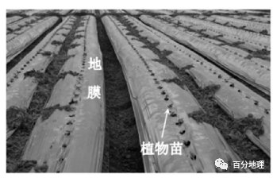

# 微专题之074 从产业结构角度分析区域发展

```
本专题摘自“百分地理”公众号，如有侵权请告之删除，谢谢。联系hhwxyhh@163.com
```

------
   
一、单选题   
（2022·浙江·高三期末）最近几年，我国可降解地膜覆盖种植技术发展很快，取得了较好的经济效益和生态效益。下图为我国某地地膜覆盖种植示意图。完成下面小题。   
   
   
   
1．若该地位于新疆棉花产区，采用地膜覆盖技术进行生产，对表层土壤的影响是（  ）   
A．提高土壤肥力   
B．降低土壤湿度   
C．减少土壤盐分   
D．增加土壤污染   
2．若该地位于华北地区，该种植技术的经济效益是（  ）   
A．降低生产成本   
B．减少运输支出   
C．提高产品售价   
D．增加产品种类   
<span style="color: rgb(255, 0, 0);">1．A新疆气候干旱，农业生产为绿洲农业，水源是农业生产的基本保证。土壤肥力是保证植物生长的能力，使用地膜覆盖后，可以减少膜下土壤水分蒸发，减少对土壤的风蚀，起到保温保水保土保肥提高肥效的作用，A正确；因为地膜能够保水，减少蒸发，能够提高土壤湿度，B错误；地膜覆盖可以减少蒸发，减少盐分积累，不能减少土壤盐分，C错误；地膜覆盖可以杀死害虫，抑制杂草生长，减少农药、除草剂的使用，并且地膜是可降解的，降低了土壤污染，D错误。故选A。</span>   
<span style="color: rgb(255, 0, 0);">2．C华北地区地膜覆盖主要是春季为提高地温而实施，提高地温，可以使作物播种时间提前，产品提前上市，提高产品售价，C正确；地膜使用，会使生产成本增加，A错误；地膜使用与运输关联不大，B错误；也不会因为地膜覆盖而增加产品种类，D错误。故选C。</span>   
<span style="color: rgb(255, 0, 0);">【点睛】地膜看上去薄薄一层，但作用相当大。不仅能够提高地温、保水、保土、保肥提高肥效，而且还有灭草、防病虫、防旱抗涝、抑盐保苗、改进近地面光热条件，使产品卫生清洁等多项功能。对于那些刚出土的幼苗来说，具有护根促长等作用。对于我国三北地区，低温、少雨、干旱贫脊、无霜期短等限制农业发展的因素，具有很强的针对性和适用性，对于种植二季水稻育秧及多种作物栽培上也起了作用。</span>   
（2022·广东·模拟预测）《清稗类钞》记载：“甘省（甘肃）各处，以得雨为利，惟宁夏不惟不望雨，且惧雨，蟓地多碱气，雨过日蒸，则碱气上升……然宁夏稻田最多，专悸黄河水灌注。水浊而肥，所至未苗蔬果无不滋发，不必粪田也。田水稍清则放之，叉引浊水。”，据此完成下面小题。   
3．“田水稍清则放之，又引浊水”的好处是（  ）   
①避免土壤污染②排泄土壤盐分③增加土壤肥分④提高地下水位   
A．①②   
B．②③   
C．②④   
D．①③   
4．与古代“又引浊水”相反，现在引黃河水滴灌要先过滤净化，主要是浊水易（  ）   
A．淤高农田   
B．产生污染   
C．破坏作物根系   
D．损坏灌溉设备   
<span style="color: rgb(255, 0, 0);">3．B材料中提到“蟓地多碱气，雨过日蒸，则碱气上升”说明盐碱化严重，盐分易在水田中沉积，所以将水田清水排放，引入浊水，这样可以利于浊水中有机物沉淀，提高土壤肥力，同时又可随同清水排出盐分，②③正确，不会造成土壤污染，排水使地下水位降低，引水又会使地下水升高，对地下水位影响不大，故选B。</span>   
<span style="color: rgb(255, 0, 0);">4．D引黄河水滴灌要先过滤净化，因为“浊水”中含有大量泥沙等细小颗粒物，现在灌溉主要是机械自动灌溉，先净化可减小设备的损坏程度。D正确；滴灌对淤高农田影响小，A错误；河水没有污染，B错误；滴灌不会破坏根系，C错误；故选D。</span>   
<span style="color: rgb(255, 0, 0);">【点睛】黄河水含沙量大，故通过灌溉可以使泥沙淤积，增加有机肥，但由于采用大水漫灌容易造成土地盐碱化，滴灌采用的是节水技术，讲求河流清澈，因此要先过滤后使用。</span>   
（2022·全国·高三专题练习）白姜生长需避光遮阳。皖南某农业产业园在白姜生产大棚上搭建光伏发电系统，实现了棚内种姜、棚顶发电，形成了“农业＋新能源”生态高效生产方式。据此完成下面小题。   
5．该生产方式会使棚内（  ）   
A．太阳辐射减弱   
B．地面辐射增加   
C．昼夜温差增加   
D．土壤湿度下降   
6．与露天种姜生产方式相比，该生产方式的优势有（  ）   
①增加经济效益②增加土壤肥力③减少土壤污染④提高土地利用率   
A．①③   
B．②④   
C．①④   
D．②③   
<span style="color: rgb(255, 0, 0);">5．A白姜大棚上搭建光伏发电系统，减弱棚内太阳辐射，地面辐射减弱，昼夜温差减小，土壤蒸发减弱，土壤湿度提高。A正确，BCD错误。所以选A。</span>   
<span style="color: rgb(255, 0, 0);">6．C白姜生产与光伏发电一地多用，提高土地利用率，姜、电双产品增加经济效益，①④正确；与土壤肥力直接关系不大，不会减少土壤污染，②③错误；所以选C。</span>   
<span style="color: rgb(255, 0, 0);">【点睛】新能源 新农业，一个代表着绿色转型发展之未来，一个代表着国计民生之根基，光伏使最传统的农业焕发出了新的生命力，提高了土地资源的利用效率，增加了居民的经济收益。</span>   
（2021·山东·高三阶段练习）煤炭地下气化是集建井、采煤、气化工艺为一体的开发能源与化工原料的新技术，其实质是只提取煤炭中含能成分，变物理采煤为化学采煤，无需工作人员进入地下，被称为第二代采煤方法。图1为煤炭地下气化示意图。据此完成下面小题。   
   
   
   
7．下列我国城市中，最适合建设大型煤炭地下气化工程的是（  ）   
A．上海市   
B．大庆市   
C．六盘水市   
D．济南市   
8．煤炭地下气化相对于传统采煤方法（  ）   
A．地面塌陷事故增多   
B．地表土壤污染加剧   
C．不受地质条件的影响   
D．煤炭资源利用率提高   
<span style="color: rgb(255, 0, 0);">7．C六盘水煤田可靠储量711亿吨(2000米以内)， 探明储量164亿吨，垂深1000米以内可靠储量413亿吨，煤种齐全，煤质优良，埋藏浅。市境因此素有西南煤海”、“江南煤都”之誉。C正确。上海市、大庆市、济南市没有大型煤矿，ABD错误。故选C。</span>   
<span style="color: rgb(255, 0, 0);">8．D根据所学知识和材料得知，煤炭地下气化相对于传统的方法煤炭的利用率明显得到提升。这是因为煤炭地下气化后。抽取出来后，可以直接利用。不想传统方法把煤炭开采，上来后还要加工，去除杂质和做成煤球等程序，所以说煤炭地下气化相对于传统采煤方法，煤炭的利用率提高了。D正确。不会导致地面塌陷事故增多，A错误；不会加剧地表土壤污染，B错误；受地质条件的影响，C错误。故选D。</span>   
<span style="color: rgb(255, 0, 0);">【点睛】随着技术水平的进步，新型技术手段的实施会促进环境友好，减少环境污染，提高资源的利用效率。</span>   
（2021·全国·高三专题练习）水稻“侧深施肥”是在水稻插秧机上安装“侧深施肥”装置，在插秧的同时在离水稻秧苗根部2-3cm处，将肥料施入深度约为5cm的土壤中。完成下面小题。   
9．水稻“侧深施肥”技术可以（  ）   
A．降低水稻生产成本   
B．防止土壤盐渍化   
C．解决土壤污染问题   
D．延长水稻产业链   
10．下列地区中，适合推广水稻“侧深施肥”技术的是（  ）   
A．雅鲁藏布江谷地   
B．河西走廊   
C．华北平原   
D．洞庭湖平原   
<span style="color: rgb(255, 0, 0);">9．A据材料可知，插秧的同时施肥，可减少后期施肥的人工成本，在离水稻秧苗根部2—3cm处，将肥料施入深度约为5cm的土壤中，可增加施肥的精准度，从而减少肥料使用，节约肥料费用，降低水稻生产成本，故A正确，不能防止土壤盐渍化，也不能解决土壤污染问题，也不属于延长水稻产业链，故BCD错。故选A。</span>   
<span style="color: rgb(255, 0, 0);">10．D我国洞庭湖平原位于亚热带季风气候区，夏季高温多雨，适合水稻生产，故最适合推广该技术，河西走廊、华北平原因降水少而不适宜发展水稻种植，雅鲁藏布江谷地因海拔高、气温低而不适宜发展水稻种植，故D正确，ABC错。故选D。</span>   
下图为黑龙江某农田景观图，农民正在盖着碗的农田中喷洒农药，据此完成下面小题。   
   
   
   
11．该景观图最可能拍摄于（  ）   
A．春季   
B．夏季   
C．秋季   
D．冬季   
12．图中农民喷洒农药的主要目的（  ）   
A．杀虫   
B．除草   
C．降温   
D．防冻   
13．与直接喷洒农药相比，盖碗喷洒农药有助于（  ）   
A．减轻土壤污染   
B．提高作物品质   
C．减少农药使用   
D．降低劳动强度   
<span style="color: rgb(255, 0, 0);">11．A黑龙江纬度较高，春种秋收，图中农作物处于幼苗时期，最可能为春季，A正确。</span>   
<span style="color: rgb(255, 0, 0);">12．B从图中看，农民将农作物用碗盖着，对土壤喷淋农药，主要目的是为了除草，B正确。黑龙江纬度高，冬季寒冷，病虫害少，A错。喷洒农药不会降温和防冻，C、D错。</span>   
<span style="color: rgb(255, 0, 0);">13．B与直接喷洒农药相比，将农作物用碗盖着，农药不会喷洒到农作物上，可提高农作物品质，B正确。对土壤污染、农药使用量上没有影响，增加劳动强度，ACD不对。故选B。</span>   
二、综合题   
14．阅读图文材料，完成下列要求。   
材料一   
晋南某大学生至南疆求职，发现和田地区荒地甚多，当地农民仅将其用于粗放式牧羊。该学生随即承包了1   
500亩(1亩≈666.67平方米)荒地种植枣树，引进优质枣树苗，种植过程中曾遇到许多问题，最终喜获丰收。   
材料二   
枣树为暖温带阳性树种，喜光，耐寒，耐热，又耐旱涝。对土壤要求不严，除沼泽地和重碱性土外，平原、沙地、沟谷、山地皆能生长，对酸碱度的适应范围为pH   
5.5～8.5，以肥沃的微碱性或中性砂壤土为最好。   
材料三   
下图为和田地区位置、积温及降水分布示意图。   
   
   
   
（1）评价和田地区种植枣树的地理条件。   
（2）当地沙尘暴频发，枣树苗难以成活，试提出合理的解决措施。   
（3）当地砂质土壤污染小，但土壤贫瘠，且虫害影响枣树生长，为收获绿色无公害大枣，不使用化肥、农药。试提出提高土壤肥力及防治虫害的措施。   
（4）和田红枣大如鸭蛋，品质优良，营养丰富，获专家赞称“和田软玉”“保健丸”，并获绿色食品认证。当地拟将和田红枣售价定为每千克600元，打入全国高端市场。请为其提出最简便的促销方案。   
<span style="color: rgb(255, 0, 0);">【答案】（1）优势：积温较高，热量丰富；有高山冰雪融水，河流流经，水源充足；昼夜温差大，晴天多，光照充足；荒地多，土地成本低。劣势：降水量少，气候干旱；土壤贫瘠；人口稀少，劳动力缺乏；基础设施落后，前期投资多。</span>   
<span style="color: rgb(255, 0, 0);">（2）土地分片管理；在枣树林外围设置沙障阻沙，在沙地上用碎石等覆盖沙面，设置草方格沙障固沙；在枣树林附近建设防风固沙林带。</span>   
<span style="color: rgb(255, 0, 0);">（3）种植牧草，饲养山羊、鸡鸭，培植绿肥；向当地牧民购买羊粪；适当引进益虫，采用生物治虫。</span>   
<span style="color: rgb(255, 0, 0);">（4）利用网络信息技术，制作图片、视频，宣传枣树种植、管理、收获过程；注册商标；批发、零售方式相结合；采取独立小包装；举办红枣采摘节等。</span>   
<span style="color: rgb(255, 0, 0);">【解析】该题以和田地区位置、积温及降水分布示意图为材料，考查和田地区种植枣树的地理条件、地沙尘暴频发至枣树苗难以成活的解决措施、提高土壤肥力及防治虫害的措施和和田红枣销售最简便的促销方案。重点考查学生获取和解读地理信息的能力和调动和运用地理知识的能力。（1）结合图文材料从优势条件和劣势条件两方面分析。优势条件从热量、光照、水源等方面分析。劣势条件从土壤、降水、劳动力、资金投入方面分析。（2）根据材料承包大面积荒地可知，需要划片营造防护林，然后采取相应的工程与生物措施。（3）结合文字材料与题干的要求，当地砂质土壤污染小，但土壤贫瘠，且虫害影响枣树生长，为收获绿色无公害大枣，不使用化肥、农药，所以需采取增施绿肥和生物治虫的方式。（4）本问为开放性设问，要注意题干中“最简便的促销方案”，结合当前营销方式的特点，言之有理即可。</span>
