# 微专题之074 从产业结构角度分析区域发展

```
本专题摘自“百分地理”公众号，如有侵权请告之删除，谢谢。联系hhwxyhh@163.com
```

------
   
一、单选题   
（2022·河南新乡·二模）通常情况下，自然条件较差的耕地会先遭到弃耕，而青藏高原出现了“逆向弃耕”现象，即自然条件较好的区域弃耕率反而较大。“逆向弃耕”现象造成了耕地资源禀赋和开发利用程度的错配，加剧了人地矛盾。据此完成下面小题。   
1．青藏高原自然条件较好的地区出现“逆向弃耕”的原因是（  ）   
A．对外开放程度高   
B．耕地生产效率低   
C．农业依赖程度高   
D．常住人口密度小   
2．除了荒芜外，青藏高原“逆向弃耕”地宜更多转向（  ）   
A．畜牧业   
B．林果业   
C．城镇建设   
D．交通建设   
3．下列整治“逆向弃耕”现象的措施中，最合理的是（  ）   
A．迁入大量人口   
B．修复生态环境   
C．发展特色农业   
D．改善耕作条件   
<span style="color: rgb(255, 0, 0);">1．A依据题干信息可知，“逆向弃耕”是青藏高原自然条件较好的地区出现的耕地弃耕现象。青藏高原地区，尤其是自然条件较好的地区，随着交通运输条件的改善，地区之间物质、信息联系加强，地区开放程度提高，来自其他地区的各类农产品使市场供给得到保障，而当地耕作业的农产品种类单一，市场竞争力不足，经济效益降低，造成了“逆向弃耕”的发生，A项正确；在青藏高原自然条件较好的地区，热量条件相对充足，耕地生产效率应较高，B错；对农业依赖程度高，不会导致耕地弃耕现象发生，C错；青藏高原自然条件较好的地区，常住人口密度较大，D错。故本题选A。</span>   
<span style="color: rgb(255, 0, 0);">2．A青藏高原以高寒气候为主，弃耕土地多分布于海拔较低河谷地区，气候温凉，不利于林果业发展，比较适宜牧草生长，宜更多转向畜牧业，A正确，B错；青藏高原地区，适宜耕作的土地很少，耕地资源有限，弃耕土地转向城镇建设、交通建设不适宜，C、D错。故本题选A。</span>   
<span style="color: rgb(255, 0, 0);">3．C青藏高原地区“逆向弃耕”现象，不是劳动力不足造成的，迁入大量人口，会加剧人地矛盾，A不合理；青藏高原地区“逆向弃耕”现象，不属于生态破坏，B不合理；青藏高原地区，昼夜温差大，太阳光照强，对于自然条件较好的弃耕地，可进行结构调整，发展特色农业，加强市场竟争力，C正确；青藏高原以高寒气候为主，热量是制约农业发展的重要因素，改善耕作条件的成本较高，D不合理。故本题选C。</span>   
<span style="color: rgb(255, 0, 0);">【点睛】青藏高原的耕作业，主要分布在西藏的雅鲁藏布江谷地和青海的湟水谷地。它们相对青藏高原的其他地区来说，由于海拔较低，气温较高，无霜期长，热量相对充足，气候更为优越。地势平坦，土壤比较肥沃，水源较为充足。日照时间长，积温较高，有水灌溉。水热条件好，因而适宜耕作，成为农业发达地带。主要种植青稞(春小麦)、小麦、豌豆等，作物种类单一。</span>   
（2022·山东济宁·一模）位于青藏高原西北部边缘的叶尔羌河流域，西部为帕米尔高原，南以喀喇昆仑山为屏障，东临塔克拉玛干沙漠边缘，东北部为山前冲积平原，平均海拔约3339m。该流域积雪覆盖率大，积雪日数多。下图示意该流域2003～2018年气温、降水的变化趋势。据此完成下面小题。   
   
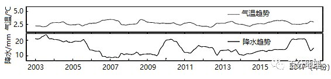   
   
4．2003～2018年积雪覆盖率最低的是（  ）   
A．2003年   
B．2007年   
C．2011年   
D．2015年   
5．推测该流域积雪日数的空间分布特征大致为（  ）   
A．自西南向东北递减   
B．自东北向西南递减   
C．自西北向东南递减   
D．自东南向西北递减   
<span style="color: rgb(255, 0, 0);">4．B由所学知识可知，积雪覆盖率取决于降雪量和消融量；读图对应气温和降水的变化，选项所给年份中，2007年气温与降水数值的垂直距离最大，降水最少，气温较高，即降雪量最小，消融量最大，故积雪覆盖率最低，B正确。2003年降水最多，气温较低，积雪覆盖率高， A错误；2011年和 2015年比2007年气温相差不大，但降水多，积雪覆盖率较高，CD错误。故选B。</span>   
<span style="color: rgb(255, 0, 0);">5．A由材料信息“叶尔羌河流域，西部为帕米尔高原，南以喀喇昆仑山为屏障，东临塔克拉玛干沙漠边缘，东北部为山前冲积平原”可知，该流域地势西南高东北低，地势越高，气温越低，降雪时间早，融雪时间晚，积雪易留存，积雪日数长，所以该流域积雪日数空间分布特征大致为自西南向东北递减，A正确。故选A。</span>   
（2022·江苏·海门中学高三开学考试）华南大陆位于青藏高原以东，显生宙以来发生了三次主要的构造运动，下图为“华南大陆中生代构造演化模式图”，读图完成下面小题。   
   
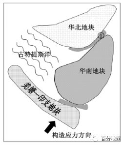   
   
6．推测图中①处的地貌可能是（  ）   
A．裂谷   
B．山脉   
C．海岭   
D．海沟   
7．如果构造应力方向不变，下列推测正确的是（  ）   
A．古特提斯洋规模扩大   
B．造山带将逐渐消亡   
C．华南地块的海拔将持续下降   
D．华南地块内部形成以东西走向为主的褶皱   
<span style="color: rgb(255, 0, 0);">6．B读图可知，图中构造应力的方向大致是自西南向东北，①处位于华北地块和华南地块之间，根据所学知识可知，大陆板块和大陆板块碰撞挤压常形成高峻山脉和巨大的高原，故受两地块碰撞挤压可能成为山脉，B正确。裂谷位于板块张裂地带，图中为碰撞挤压地带，A错误。海岭位于大洋板块的张裂地带，①处位于两陆地地块碰撞挤压地带，C错误。海沟位于大陆板块与大洋板块的碰撞挤压地带，①处位于两陆地地块碰撞挤压地带，D错误。故选B。</span>   
<span style="color: rgb(255, 0, 0);">7．D根据图中信息可知，图中构造应力的方向大致是自西南向东北，若方向不变，羌塘-印支地块将向东北方向移动，古特提斯洋的面积逐渐缩小，造山带逐渐出现，华南地块的海拔逐渐抬升，华南地块的内部受挤压将形成东西走向为主的褶皱，D正确，ABC错误。故选D。</span>   
<span style="color: rgb(255, 0, 0);">【点睛】由岩石组成的地球表面并不是一块整体，而是由板块拼合而成的。全球大致划分为亚欧板块、太平洋板块、非洲板块、美洲板块、印度洋板块和南极洲板块六大板块。板块构造学说认为，六大板块处于不断地运动之中，一般来说，板块内部地壳比较稳定；板块与板块交界地带，地壳比较活跃，世界上的火山、地震主要分布在板块交界的地带。</span>   
（2022·福建省龙岩第一中学高三阶段练习）极地或高山冰川退缩区形成的冰川裸地是研究植被原生演替的理想场所。海螺沟冰川退缩区（29°34＇N，102°59＇E）位于贡嘎山东坡，青藏高原东南缘，在长达2km的范围内形成了一个具有完整植被原生演替序列的区域。下图为2017年绘制的海螺沟冰川退缩区不同原生演替阶段样地植被特征图。据此完成下面小题。   
   
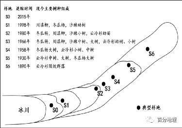   
   
8．贡嘎山东坡山麓地区所处的水平自然带为（  ）   
A．温带落叶阔叶林带   
B．亚热带常绿硬叶林带   
C．亚热带常绿阔叶林带   
D．亚寒带针叶林带   
9．推测图中S0样地的主要植被类型最可能为（  ）   
A．荒漠   
B．草原   
C．灌木   
D．乔木   
10．相较于世界上绝大多数地区冰川退缩区的植被演替，海螺沟植被演替从初始到形成成熟顶级群落的速度要快很多的原因是（  ）   
A．人类干扰更少   
B．海拔更低   
C．光照更充足   
D．水热组合条件更好   
<span style="color: rgb(255, 0, 0);">8．C结合图文信息可知，贡嘎山东坡山麓地区地处我国青藏高原东南缘，该地区的气候应为亚热带季风气候，因此贡嘎山东坡山麓地区所处的水平自然带为亚热带常绿阔叶林带，C正确。温带落叶阔叶林带对应温带季风气候区，A错误；亚热带常绿硬叶林带对应地中海气候，B错误；亚寒带针叶林带对应亚寒带针叶林气候，D错误。故选：C。</span>   
<span style="color: rgb(255, 0, 0);">9．A结合图文信息可知，青藏高原东南缘海螺沟冰川退缩区在长达2km的范围内形成了一个具有完整植被原生演替序列的区域。结合退缩时间和现今主要树种可推断，很有可能是气候变暖，冰川逐渐从S6向S0地区退缩，S1-S6的植被主要是各种乔木和灌木，而S0紧邻冰川，海拔最高气温较低，自然条件最恶劣，刚从原来的冰川覆盖区变成裸地，结合选项分析最有可能是荒漠，而出现草原、灌木和乔木的可能性较小，A正确，BCD排除。故选：A。</span>   
<span style="color: rgb(255, 0, 0);">10．D世界上绝大多数地区冰川退缩区都是无人区，基本无人类干扰，A错误；我国海螺沟相比世界纬度更高的冰川地区的冰川退缩区海拔更高，B错误；山地垂直自然带的分布和更替主要受水热组合条件的变化而变化，与光照关系不大。海螺沟地处贡嘎山东坡，青藏高原东南缘，是高原山地气候与亚热带季风气候过渡地区，相比世界其他地区的冰川地区，该地区纬度更低，降水较为丰富，水热组合条件更好，自然环境条件更优越，当冰川退缩时，植被演替从初始到形成成熟顶级群落的速度更快，C错误，D正确。故选D。</span>   
<span style="color: rgb(255, 0, 0);">【点睛】冰川退缩也称冰川消退，指由于全球气候逐渐变暖等因素，冰川的面积和体积都出现明显的减少，有些甚至消失的现象。这种现象在低和中纬度的地方尤其显著。海螺沟冰川位于横断山脉大雪山的中段，贡嘎山东坡海螺沟河源区。1930—1966年12月，该冰川退缩了1150米，平均每年退缩32米，1966—1994年该冰川后退速度变缓，退缩了373米，平均每年后退13.3米。自1994年至今，该冰川仍然处于强烈退缩状态。</span>   
（2021·江西赣州·高三期中）为研究路基与自然地表下的冻土温度变化状况，我国某科研组于1995年在青藏公路沿线设置了一组观测孔，得到了连续五年的观测资料。下图为基于观测资料进行热量分析得出的冻土热流通量变化图（注明:热流通量为单位时间单位面积流过的热量，简称热流，正值表示吸热，负值表示放热）。据所学知识完成下面小题。   
   
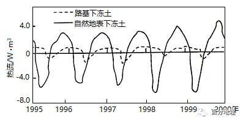   
   
11．受热力作用影响，青藏高原大量吸收周边同海拔大气热量的季节是（  ）   
A．春季   
B．夏季   
C．秋季   
D．冬季   
12．与路基下冻土相比，自然地表下冻土年内（  ）   
A．吸、放热量更接近平衡   
B．吸热时间更长   
C．吸、放热周期变化不明显   
D．吸热起、止时间滞后   
13．根据冻土热流通量变化可确定路基下冻土（  ）   
A．厚度增加   
B．上限下降   
C．稳定性明显增强   
D．退化不明显   
<span style="color: rgb(255, 0, 0);">11．D冬季，青藏高原，因地势高，冰雪面积大，空气稀薄，辐射冷却快，降温迅速，成为一个低温高压中心，而高空大气形成一个相对的低压中心；同海拔周边大气受地面影响小，气温高，气流上升，形成一个相对低压中心，而相应的高空大气形成一个高压中心，在高空气流流向高原面上空，再下沉，给高原面带去热量，因此青藏高原大量吸收周边同海拔大气热量，D正确；夏季，青藏高原上空大气受热快，气温高于周边同海拔大气，B错误；春季和秋季为过度季节，差别不大，AC错。故选D。</span>   
<span style="color: rgb(255, 0, 0);">12．A从图中看，路基下冻土热流通量为正值时间长，而自然地表下冻土热流通量正负值相当，所以自然地表下冻土吸热时间更短，吸、放热周期变化明显，年内吸、放热量更接近平衡，年内吸热起、止时间滞后不明显，A正确，BCD错误。故选A。</span>   
<span style="color: rgb(255, 0, 0);">13．B从图中看，路基下冻土热流通量大多数为正值，所以吸热多，冻土融化，路基下冻土上限下降，B正确，因此冻土厚度变薄，A错误；稳定性明显减弱，C错误；冻土退化明显，D错误。故选B。</span>   
<span style="color: rgb(255, 0, 0);">【点睛】青藏高原的隆起，使我国东部地区形成了一个相对独立的气候单元，使我国的海陆热力性质差异表现得极为明显。由于地势高，夏季，青藏高原上空大气受热快，气流上升，气压降低，这加速了陆上低压的形成，使由海洋吹向陆地的夏季风势力增强甚至影响到青藏高原的东部和南部。冬季，青藏高原上空大气降温快，气流下沉，使陆上高压势力增强，促使气流由陆地吹向海洋。加强了冬季风。因此青藏高原的隆起加强了我国的季风环流。</span>   
（2022·陕西·武功县普集高级中学高三期末）风蚀坑是指松散或裸露的沙质地表经风蚀而形成的凹地。下图示意青藏高原共和盆地某风蚀坑的平面形态，下图为该风蚀坑不同部位的地表风速和单位宽度输沙率。据此完成下面小题。   
   
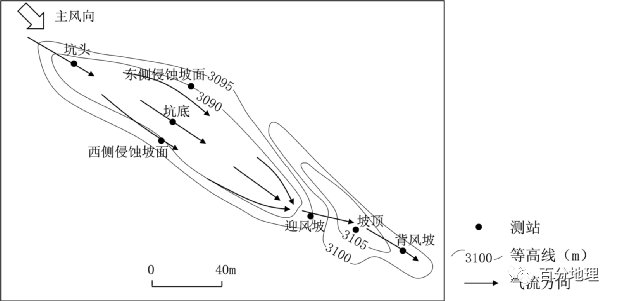   
   
   
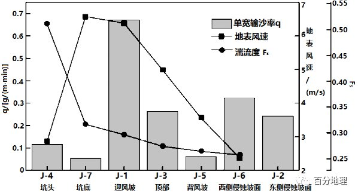   
   
14．迎风坡输沙率最大，其原因除风速较大之外，还包括（  ）   
A．气流汇聚   
B．坡度较陡   
C．沙粒较粗   
D．堆积显著   
15．随着风蚀坑的持续发育（  ）   
①坑底越来越浅②迎风坡越来越缓③积沙体越来越高④两侧侵蚀坡面逐渐后退   
A．①②   
B．①④   
C．②③   
D．③④   
<span style="color: rgb(255, 0, 0);">14．A读图可知，迎风坡单位宽度输沙率最大，该位置风速较大，且湍流度也较高，表明其原因除风速较大之外，还包括气流汇聚，A正确。坡度越陡，越不利于输沙，B错误。沙粒越粗，越不利于输沙，C错误。堆积显著，输沙率会比较低，不符合题意，D错误。故选A。</span>   
<span style="color: rgb(255, 0, 0);">15．D随着风蚀坑的持续发育，风蚀坑的坑底受到风力侵蚀，会越来越深，①错误。迎风坡单位宽度输沙率较高，随着风蚀坑的持续发育，坡度会越来越陡，②错误。随着风蚀坑的持续发育，风蚀坑的坑底受到风力侵蚀，沙石堆积到积沙体，积沙体会越来越高，③正确。受风力侵蚀，两侧侵蚀坡面会逐渐后退，④正确。③④正确，故选D。</span>   
<span style="color: rgb(255, 0, 0);">【点睛】风蚀坑形态主要由风沙流塑造，当携沙气流进入风蚀坑系统，风蚀坑形态将会重新改造气流，垂直结构和水平格局发生变异，形成独特的气流场结构。主要是近地表风速的空间差异造成不同部位剪切力的不同，从而导致输沙率的空间差异和不同部位蚀积速率的差异，最终使得风蚀坑形态发生变化。</span>   
（2022·内蒙古·海拉尔第二中学高三期末）地表反照率是陆地表面反射太阳辐射能力的参数。地表反照率的变化主要受太阳高度角、积雪、植被、地形及土壤含水量等因子的影响。下图为我国某地区地表反照率的季节变化。据此完成下列各题。   
   
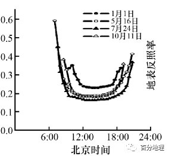   
   
16．该地区可能是（  ）   
A．青藏高原   
B．东北平原   
C．华北平原   
D．山东半岛   
17．影响图示地表反照率日变化最大的因素是（  ）   
A．气温高低   
B．地形起伏   
C．太阳高度   
D．植被覆盖   
18．为研究该地区地表环境各要素对地表反照率的影响，宜选择在一天中的（  ）   
A．6:00-12:00   
B．8:00-16:00   
C．12:00-18:00   
D．14:00-20:00   
<span style="color: rgb(255, 0, 0);">16．A本题判断的依据来自于北京时间与当地时间之差。从图表中我们可以看到，10月11日日出时间大约为北京时间的8:00——9:00之间，10月11日距秋分日较近，该地地方时的日出时间应在6:00前后。故该地与北京时间之间有2——3个小时之间的时差，且在北京时间以西。青藏高原主要位于东六区，与北京时间相差两个小时左右，符合题意 ，A选项正确。东北平原位于东八区和东九区之间，比北京时间早一个小时，不符合题意， B选项错误。华北平原和山东半岛在东八区附近，与北京时间相差不大， C选项和D选项错误。</span>   
<span style="color: rgb(255, 0, 0);">17．C从地表反照率日变化曲线图可以看到4个日期的共同点是日出和日落时段地表反照率变化最大且陡升陡降，说明地表反照率主要的影响因素应与日出日落时刻有关，且变化速度要相对较快。气温是逐渐发生变化的过程，并且日出前后是气温最低值，但此时地表反照率却最大，二者并无关联，A选项错误。地形起伏与植被覆盖日变化并不大，不符合题意，B选项和D选项错误。太阳高度日出前后与日落前后相对较低，太阳高度角较小，与地表反照率图示相符，C选项正确。</span>   
<span style="color: rgb(255, 0, 0);">18．C从图中我们可以看出6——12时与18——20时地表反照率变化较大，12:00——18:00地表反照率变化率较小。要想研究该地不同要素对反照率的影响，应选择一天中地表反照率变化较小的时刻，这样才能突出不同要素对反照率的影响，故C选项正确。</span>   
（2022·重庆·一模）藏羚羊是国家一级保护动物，主要分布在青藏高原地区。藏羚羊生性胆小，适应新环境的能力较差，部分种群有沿固定路线迁徙的习性。青藏铁路开工建设以来，在青藏铁路与青藏公路大致并行的路段，藏羚羊穿越青藏公路的方式出现明显变化。左图为青藏铁路某段营地、工地等分布图，右图为迁徙季节左图所示青藏公路段的藏羚羊遇见率统计图，据此完成下面小题。   
   
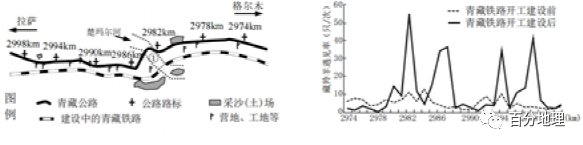   
   
19．青藏铁路开建，图示青藏公路段出现几处藏羚羊穿越较集中的通道的主要原因是（  ）   
A．大量采沙（土）场的出现   
B．营地、工地等的间隔分布   
C．青藏公路车辆和游客增多   
D．青藏公路部分路段被破坏   
20．影响①地成为藏羚羊集中通道的主要因素是（  ）   
A．桥梁   
B．隧道   
C．河床   
D．采沙场   
<span style="color: rgb(255, 0, 0);">19．B从右图中可看出藏羚羊穿越青藏公路形成4个集中通道，分别是2982km、2986km、2994km、2998km路标，对照左图中这4个路标位置，吻合最好的是营地和工地的间隔分布（由于工地和营地的影响，藏羚羊主要从工地、营地间人类活动相对较少的通道迁徙），B正确。采沙场集中在河床附近，与右图中藏羚羊的遇见峰值不能很好地对应，A错；青藏公路车辆和游客增多和青藏公路部分路段被破坏，在材料中没有信息支撑，CD错。故选B。</span>   
<span style="color: rgb(255, 0, 0);">20．C图中①地对应2982km路标集中通道，附近有楚玛尔河，按照藏羚羊的迁徙习性，藏羚羊生性胆小，适应新环境的能力较差，部分种群有沿固定路线迁徙，常常沿河床迁徙（该位置在青藏铁路开工前的藏羚羊遇见率本身就相对较高），河床地带水草充足，有利于藏羚羊的迁徙，而不是受桥梁或者隧道的影响（桥梁、隧道均没有很好地利用图中楚玛尔河这一信息），C正确，排除AB。采沙场作为人类活动集中区域，人类干扰较多，不能形成藏羚羊迁徙集中通道，D错误。故选C。</span>   
<span style="color: rgb(255, 0, 0);">【点睛】交通线路建设导致动物栖息地碎片化，对生物迁移的通道起到了阻隔作用，所以在进行交通线路建设时，应考虑对生物迁徙的影响，尽量避开野生动物的迁徙路线，同时，还可以通过架设桥梁等方式为野生动物留出迁徙通道。</span>   
（2022·全国·高三专题练习）青藏高原山生柳灌木线能够对气候变化做出最快响应。中国科学家沿青藏高原纬度梯度达900公里的区域选取了24个观测点研究山生柳灌木线的变化，发现自1939年到2010年间，山生柳灌木线爬升了59.3米，但2010年后的十年，山生柳灌木线爬升速率明显下降，灌木线趋于稳定。研究发现，当夏季均温低于8.5℃时，山生柳灌木线变化受气温驱动，当夏季均温高于8.5℃时，转为受水分限制。完成下面小题。   
21．该科研团队的观测点最可能位于青藏高原（  ）   
A．南部   
B．北部   
C．东部   
D．西部   
22．2010年后山生柳灌木线爬升速度变缓的原因是（  ）   
A．气候变暖速率显著上升   
B．气候变暖速率显著下降   
C．年降水量减少   
D．夏季蒸发量增大   
<span style="color: rgb(255, 0, 0);">21．C依据材料，科研团队是沿着纬度梯度达900公里的范围取样，即沿着南北方向纬度跨度约8个纬度来取样，因此只能在东西两侧，但是青藏高原西侧主要在我国边境地区，取样难度大，而东部取样难度相对较小，故本题ABD三项排除，故选C。</span>   
<span style="color: rgb(255, 0, 0);">22．D据材料最后一句可知，山生柳灌木线主要受夏季均温驱动和夏季水分限制，当夏季均温低于8.5℃，受气温驱动，高于8.5℃时，受水分限制。近10年来，灌木更新速率呈下降趋势，灌木线趋于稳定。主要是由于持续的气候变暖导致地表蒸发量增大，同时降水增加有限，这会引发土壤水分亏缺，由此限制灌木种群更新，影响山生柳灌木线上升速率，故D项正确。由于气候变暖加剧了高寒区的水分亏缺，山生柳灌木线从受温度限制转变为受湿度限制，所以2010年后山生柳灌木线爬升速度变缓的原因与气候变暖的速率变化关系不大，AB两项与题意不符；材料中没有明确信息表明该区年降水量减少，故排除C项。因此本题选D。</span>   
<span style="color: rgb(255, 0, 0);">【点睛】由于独特的地理位置，被称作“世界上最后一块净土”的青藏高原，目前也成为全球气候变化的预警区、敏感区，其主要表现为温度显著升高、冰川退缩、冻土融化、降水增加、湖泊扩张等。</span>   
（2022·福建·模拟预测）雅鲁藏布江河谷加查-米林段位于青藏高原东南部，平均海拔3800米，年均降水量514mm。下图示意该段河谷沙丘分布。读图完成下面小题。   
   
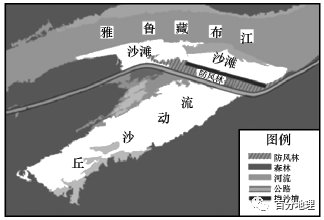   
   
23．加查—米林段河谷沙滩面积最小的时期是（  ）   
A．1—3月   
B．4—6月   
C．7—9月   
D．10—12月   
24．加查—米林段河谷流动沙丘的沙源地是（  ）   
A．流动沙丘所在地区的岩石风化   
B．青藏高原西北部   
C．塔克拉玛干沙漠   
D．雅鲁藏布江河床及沙滩   
25．对加查—米林段河谷流动沙丘的形成影响最大的风向为（  ）   
A．东北风   
B．东南风   
C．西北风   
D．西南风   
<span style="color: rgb(255, 0, 0);">23．C雅鲁藏布江加查—米林段，冬季降水较少，河流水位较低，河谷裸露的沙滩面积最大；春季随气温的回升，有部分冰雪融水补给河流，河流水位开始回升，部分裸露的沙滩开始被河水淹没，河谷沙滩面积开始减少；夏季受来自印度洋的西南季风的影响，降水较多，且冰川融水补给量大，河流为丰水期，水位最高，河谷沙滩被淹没面积最大，露出沙滩面积最小；秋季的降水和冰川融水补给量减少，河流水位下降，河谷沙滩面积开始增大。综上所述，C符合题意，排除ABD。故选C。</span>   
<span style="color: rgb(255, 0, 0);">24．D观察图形，发现沙丘由东北向西南流动的，且其四周为森林植被，所以加查—米林段河谷流动沙丘的沙源并不是来源于本地岩石风化，A错误；如果来自青藏高原西北部，则在雅鲁藏布江的北侧也会形成沙丘，而从图中来看在北侧没有沙丘，B错误；塔克拉玛干沙漠距离太遥远，再者风力因青藏高原海拔太高而被削弱，沙粒不可能被带到此，C错误；加查-—米林段河谷流动沙丘的形成过程：雅鲁藏布江河水从上游搬运泥沙，在加查—米林段流速减缓 ，泥沙沉积于河床，枯水季节，水位下降，出露的沙滩会受到风力的侵蚀、搬运作用，在被风搬运的过程中，因受到挡沙墙和防风林的削弱，风力减弱，泥沙沉积，形成流动沙丘，D正确。故选D。</span>   
<span style="color: rgb(255, 0, 0);">25．A据图可知，流动沙丘的分布呈东北—西南走向，同时从上题可知沙石来源于雅鲁藏布江河床及沙滩，且在河流与流动沙丘之间有防风林和挡沙墙，可以推断东北风对流动沙丘的形成影响最大。综上所述，A符合题意，排除BCD。故选A。</span>   
<span style="color: rgb(255, 0, 0);">【点睛】河流水的主要补给类型：雨水补给、季节性积雪融水补给、冰雪融水补给、湖泊水补给、地下水补给等。河流一般很少为单一补给，通常是具有某种补给类型占优势的混合补给。一般以夏秋季两季为主。雨水是大多数河流的补给源。热带、亚热带和温带的河流多由雨水补给。雨季到来，河流进入汛期。旱季则出现枯水期。</span>   
（2021·全国·高三专题练习）硬叶常绿阔叶林是我国青藏高原东南边缘特有的植被类型。中新世后青藏高原大规模隆起，原有森林大幅消退，数量稀少的硬叶常绿阔叶林存活并繁衍，成为该地区优势植被。川滇高山栎是其建群种，从河谷至雪线均有分布，极低温下仍终年常绿。下图示意高山栎平均高度与海拔的关系。据此完成下面小题。   
   
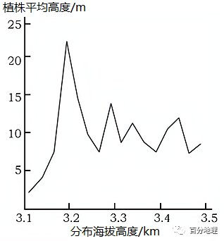   
   
26．青藏高原大规模隆起前，其东南边缘的优势植被最可能为（  ）   
A．常绿阔叶林   
B．针叶林   
C．落叶阔叶林   
D．高山草甸   
27．影响海拔3.2km以下地区川滇高山栎植株高度的主要因素是（  ）   
A．水分条件   
B．热量条件   
C．河谷风速   
D．人类干扰   
28．为维持终年常绿，雪线附近高山栎与低海拔地区高山栎相比（  ）   
A．叶片较厚   
B．叶片宽阔   
C．叶片较绿   
D．枝干弯曲   
<span style="color: rgb(255, 0, 0);">26．A结合材料分析，青藏高原未大规模隆起抬升时，青藏高原东南边缘地区地形落差较小，青藏高原隆起抬升后，这些地区海拔升高，气温下降，气候较原先冷干，原有森林因无法适应环境变化而衰退，意味着原来的建群种不耐寒耐旱，结合以青藏高原东南边缘地区的经纬度位置，该地纬度不高，且受季风的影响较强，水热条件较高，可推测中新世森林的优势种群应为常绿阔叶林，A正确。在青藏高原大规模隆起前，针叶林和落叶阔叶林分布的纬度应较其东南边缘纬度更高，高山草甸分布的海拔应较其东南边缘更高，BCD错。故选A。</span>   
<span style="color: rgb(255, 0, 0);">27．D读图，3.2km处为高山栎平均植株高度最高处，3.2km以下植株高度快速下降，3.1km处植株最低。植被的性状会因环境的胁迫而变化，根据材料，高山栎分布最低临近河谷，说明并非因为热量不足、水分不足而导致植株矮小，A、B错误；低海拔的河谷地带虽然可能因为狭管效应出现风力较大的情况，但由于山谷地形阻挡，大风日数与风速不如高海拔地区，但图中高海拔地区的植株仍高于3.1km处，说明风力并非主要因素，C错；青藏高原气候寒冷，人类聚落多选择分布于温暖的低海拔地带，同时因取暖生活需要，樵采行为严重，人类樵采极大阻碍了植株的生长，导致植株高度剧烈下降，D正确，故选D。</span>   
<span style="color: rgb(255, 0, 0);">28．A读图，高海拔地区植株高度较矮，说明高海拔的高山栎为了适应风大、低温的条件在植株形状上发生变化。叶片较厚，可储存水分和保温，减少水分蒸腾，A正确。叶片较大，容易导致蒸腾作用较明显，不适应寒冷环境，同时高海拔地区风力大，一般难以发育较大面积的叶片，B错误。为适应低温环境，植株的光合作用会维持在较弱的水平，叶绿素含量应比低海拔地区低，C错误。植株弯曲主要是受风力较大影响，与植物维持常绿的做出的性状改变无关，D错误。故选A。</span>   
<span style="color: rgb(255, 0, 0);">【点睛】植被分布与环境关系密切，主要受气候（光照、热量、水分、盛行风向）、地形（海拔的影响、坡向的影响、坡度的影响）、土壤（土壤水分、肥力、通透性、热量等）等因素的影响。</span>   
二、综合题   
29．（2022·全国·高三阶段练习）阅读图文材料，完成下列要求。   
青藏高原东北部共和盆地内的英德海（内流湖）1万年前面积达21.7km2，至1990年完全干涸。湖区年平均气温2.4℃，年降水量为246mm，盛行西北风。植被和土壤粒度（土壤粒大小）从干涸湖盆底部到顶部存在垂直分异，湖盆东西两侧也有明显差异（图），植被与土壤粒度相互影响。   
   
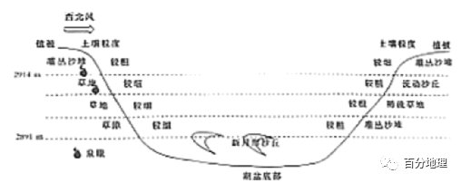   
   
(1)推测该湖盆底部地表物质的组成特征。   
(2)从该湖盆中下部东侧或西侧中任选一侧为例，说明植被与土壤粒度相互作用的机制。   
(3)从风力侵蚀角度，分别解释该湖盆东西两侧土壤粒度垂直分布差异较大的原因。   
<span style="color: rgb(255, 0, 0);">【答案】(1)以松散的沙质沉积物为主；多盐碱（结壳）；土壤发育不良，粒度较大。</span>   
<span style="color: rgb(255, 0, 0);">(2)西侧植被发育较好，拦截（风沙流、坡面径流中的）土壤细颗粒物质，导致土壤平均粒度变小；植被枯落物改良土壤结构，加快土壤发育，促进细颗粒的形成；土壤平均粒度小，保水、保肥能力强，利于植被生长。（或东侧植被发育较差，削弱风速、拦截坡面径流的能力弱，细颗粒被侵蚀，导致土壤平均粒度变大；枯落物相对较少，土壤发育缓慢，颗粒较粗；土壤平均粒度大，保水、保肥能力差，不利于植被生长。）</span>   
<span style="color: rgb(255, 0, 0);">(3)湖盆西侧顶部处于盛行风上风向，强劲的西北风吹蚀西侧地表的细颗粒物质，而粗颗粒物质残留；西侧中下部接受地下水补给，植被发育较好，削弱风速，风力侵蚀作用较弱，能促进成土，土壤颗粒较细；湖盆东侧中下部植被生长条件较差，风蚀较强，土壤颗粒较粗；东侧顶部越过湖盆的气流重新贴近地面，摩擦力增大，风速减小，侵蚀较弱。</span>   
<span style="color: rgb(255, 0, 0);">【解析】本题以英德海的自然地理环境为试题背景，考查湖泊底部沉积物特征、湖盆两侧植被与土壤的相互关系、湖盆两侧土壤颗粒差异的原因，同时考查学生获取和解读地理信息，描述和阐释地理事物、地理基本原理与规律，论证和探讨地理问题的能力，旨在考查学生的区域认知、综合思维和人地协调观等核心素养。(1)据图结合所学知识可知，湖盆底部有新月形沙丘，可推测出该湖盆底部多松散沙质沉积物，土壤发育不良，颗粒较大。由于湖盆底部是曾经是水盐汇集中心，推测该地多盐碱结壳。(2)根据题意可知，植被的种类和密集程度一定程度上决定土壤颗粒大小，植被丰富则土壤颗粒细，反之，植被稀疏，土壤颗粒较粗。以湖盆东侧为例，东侧由于植被稀疏，所以削弱风速、拦截坡面径流的能力较弱，细颗粒物易被侵蚀，因此地表颗粒较粗；由于东侧植被发育差，土壤平均粒径大、有机质含量低，不利于植被生长。以湖盆西侧为例，西侧植被覆盖条件好，对风沙流、坡面径流中的拦截作用强，有利于土壤细颗粒物质堆积，导致土壤平均粒度变小；植被对土壤结构具有改良作用，使土壤粒径减小，保水保肥能力增强，有利于植被的生长发育。(3)读图并结合材料信息可知，由于当地盛行西北风，湖盆西侧的顶部在上风向，风力侵蚀作用强，强劲的西北风将西侧地表的细颗粒物质吹走，把粗颗粒物质残留在地表；由于西侧中下部水分条件较好，发育良好的植被削弱风速，减弱风力侵蚀作用，细粒物质堆积下来，促进土壤的形成，且土壤颗粒较小；东侧中下部缺乏地下水补给，水分条件差，植被发育不良，且处在迎风坡，风力侵蚀作用强，细颗粒物易被侵蚀掉，土壤颗粒大；东侧顶部气流越过湖盆风速风速减小，侵蚀作用减弱，土壤粒径较小。</span>   
30．（2021·湖北孝感·高三期中）阅读图文材料,完成下列要求。   
贵州省西部的草海（下图所示）属封闭型的岩溶湖泊，水域面积约46．5平方千米，平均水深仅约2米，是国家级自然保护区，湿地内仅有几条季节性溪流发育。70万年来，在青藏高原整体抬升的背景下，草海湿地西部地形抬升，湖泊面积及中心位置不断变化。近5000年，草海流域气候经历温湿期和干凉期的交替变化，现在正处于干凉期气候末期。下图为草海地区地质构造剖面示意图。   
   
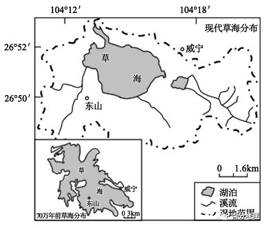   
   
   
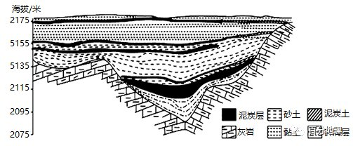   
   
(1)据图说明草海浅湖盆形成的地质过程。   
(2)研究显示，与温湿期相比现代草海湖中动物数量及种类较少，请分析原因。   
(3)有专家认为草海湖泊未来终将消失，请为该观点提供论据。   
<span style="color: rgb(255, 0, 0);">【答案】(1)早期褶皱隆起形成背斜；背斜顶部被侵蚀，形成谷地（洼地）；后期地壳不断下沉；谷地（洼地）內泥沙不断沉积，形成浅湖盆。</span>   
<span style="color: rgb(255, 0, 0);">(2)现代草海处气候干凉期，湖泊面积较小；水温低，动物生长较慢，适宜生存的动物种类较少；藻类、微生物和植物等生长缓慢，动物食物较少。</span>   
<span style="color: rgb(255, 0, 0);">(3)（在青藏高原整体抬升的背景下）草海湿地西部不断抬升，湖体向东萎缩，由于东南（东）面地势高，湖体向东南（东）方向迁移受到限制，（按草海湿地演化趋势）其在未来将持续萎缩，直至消失。</span>   
<span style="color: rgb(255, 0, 0);">【解析】本题以贵州草海为材料，涉及地貌形成过程以及自然环境整体性的相关知识，考查学生图片材料信息提取能力、地理知识调用分析能力，体现了区域认知、综合思维的地理学科核心素养。(1)分析草海浅湖盆形成的地质过程，主要从地壳运动和外力作用的角度分析。根据图示灰岩的走向可知，该地早期岩层受到挤压，形成背斜；背斜顶部受到张力的作用，裂隙比较发育，遭受侵蚀，形成谷地；后期地壳下沉，谷地下沉形成为湖泊，湖相沉积物在此沉积，形成浅湖盆。(2)根据材料中“近5000年，草海流域气候经历温湿期和干凉期的交替变化，现在正处于干凉气候末期”可知，现在草海流域正处于干凉期，气温较低，气候较干旱，湖泊面积较小。藻类、微生物和植物等生长缓慢，动物食物较少；气温低，造成动物生长繁殖较慢，并且适宜低温环境的动物种类较少。故与温湿期相比现代草海湖中动物数量及种类较少。(3)具体理由应该是随着板块运动的继续进行，青藏高原持续抬升，使得草海湿地西部不断抬升，湖泊面积萎缩，并向东侧移动，但是由于东侧地势较高，向东移动过程收到抑制，湖泊不能向东流动，使得湖盆面积减小，并逐步消失。</span>   
31．（2021·全国·高三阶段练习）阅读图文材料，完成下列要求。   
涪江发源于青藏高原东北部岷山，是嘉陵江右岸最大的支流，该江穿过龙门山后，携带大量碎屑物质在山前地带堆积形成多个大小规模不等的冲积扇，下图为“涪江冲积扇周边地区的地形地质构造分布图”，其中断层F1形成时期早于断层F2,断层F2为斜向断层，既有水平位移，又有垂直位移。断层F1主要以垂直位移为主。   
   
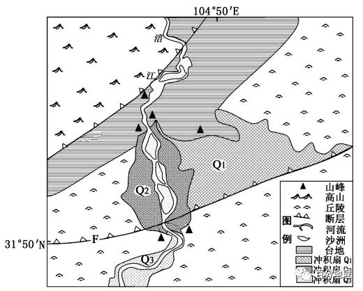   
   
(1)指出涪江冲积扇发育最快的季节，并说明理由。   
(2)从地质作用角度，说明该地区冲积扇Q1、Q2、Q3的形成过程。   
(3)比较冲积扇Q和Q:沉积物颗粒的大小，并说明依据。   
<span style="color: rgb(255, 0, 0);">【答案】(1)夏季。</span>   
<span style="color: rgb(255, 0, 0);">理由：夏季降水多，河流径流量较大，河流搬运作用强，携带的泥沙物质多，冲积扇发育最快。</span>   
<span style="color: rgb(255, 0, 0);">(2)涪江从高山出山口流出，流水沉积形成冲积扇Q1;然后北部断层F1（斜向断层）活动使得河流（往西南部）迁移改道，台地及其南部区域发生下沉，形成新的冲积扇Q2;断层F2使冲积扇Q2所在地区地壳上升，其南部继续下沉，河流出山口后，形成新的冲积扇Q3。</span>   
<span style="color: rgb(255, 0, 0);">(3)冲积扇Q2的沉积物颗粒大于冲积扇Q3。冲积扇Q3位于冲积扇Q2的下游，冲积扇Q2河段有沙洲形成，经河流沉积作用后，带到下游冲积扇Q3的沉积物颗粒会更小。</span>   
<span style="color: rgb(255, 0, 0);">【解析】本大题以涪江为材料设置试题，涉及涪江冲积扇的形成、判断的相关内容，考查学生读图及相关知识的运用能力，要求学生区域认知和综合思维的学科素养。(1)积扇属于流水堆积地貌，涪江流域属于亚热带季风气候，夏季的时候降水多，河流流量大，流速快，河流搬运作用强，携带的颗粒物质多， 在流出山口后，泥沙沉积下来形成冲积扇，所以，夏季冲积扇发育最快。(2)据图推测，最初涪江从北部断层附近从高山区冲出山口，在山前形成巨大的冲积扇Q1；然后北部高山和台地地区抬升，河流在台地前缘形成新的出山口，在出山口附近形成新的冲积扇Q2，后来在Q2的前缘发生断裂活动，形成断层F(断层发生在Q2形成之后的原因是图中信息显示Q1Q2冲积扇均被断层F切断)，断裂活动发生后，使得Q1、Q2所在地区上升，南部丘陵地区相对下降，在断层F附近形成更新的出山口，在出山口附近形成更新的冲积扇Q3。(3)颗粒物的大小和流速、地形等有关，颗粒物质大，质量大的先沉积下来，越往河流下游地区，地形较平坦，河流流速变慢，泥沙颗粒物越小。 Q2位于Q3上游，且地势较高，故沉积物颗粒大。图中显示，Q2河段的沙洲更多，说明河段沉积作用较明显，较大的颗粒物大多在这一河段沉积下来，导致进入Q3冲积扇的沉积物颗粒更小。</span>
