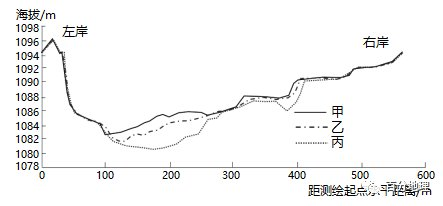

# 微专题之074 从产业结构角度分析区域发展

```
本专题摘自“百分地理”公众号，如有侵权请告之删除，谢谢。联系hhwxyhh@163.com
```

------
   
一、单选题   
（2022·广东·深圳中学高三阶段练习）珠江三角洲的开发治理从20世纪50年代开始，进行了河道采砂、河道疏浚、水库建设等系列措施，因此给河口的自然演变带来影响。因开发治理方式的变化，使得水沙量发生变化，进而影响了三角洲河道冲淤状况发生变化。图1和图2分别为珠江三角洲三个水文站1959—2017年的年平均径流量与输沙量变化过程图。据此完成下面小题。   
   
   
   
   
   
   
1．下列说法正确的是（  ）   
A．20世纪60-80年代，珠江三角洲河口整体处于侵蚀状态   
B．本世纪10年代较上世纪90年代，西江年输沙量减少近半   
C．上世纪90年代以来，北江上游来水来沙量持续上升   
D．本世纪以来，西江河床下切幅度小于北江和东江河床下切幅度   
2．20世纪90年代以来珠江三角洲河口系统演变趋势及成因是（  ）   
A．受流域水土保持影响，河道淤积明显   
B．受水库拦蓄影响，河口水沙量显著减少   
C．受河口地势影响，河口淤积大于冲刷   
D．受采砂和疏浚等影响，河道向窄深型发展   
<span style="color: rgb(255, 0, 0);">1．B水沙量发生变化，进而影响了三角洲河道冲淤状况发生变化，20世纪60—80年代，输沙量大且稳定，得出整体以堆积为主，A错误。本世纪以来，西江输沙量急剧减少，东江和北江输沙量较稳定，推出西江下切幅度超过东江和北江，D错误；由图曲线可知，上世纪90年代以来，北江上游来沙量波动下降，C错误，本世纪10年代较上世纪90年代，西江年输沙量减少近半，B正确。所以选B。</span>   
<span style="color: rgb(255, 0, 0);">2．D20世纪90年代以来，受流域水士保持，水库拦蓄等影响，输沙量显著减少，清水冲沙，所以河道整体处于侵蚀状态，A、C错误。受水库拦蓄影响，河口沙量显著减少，而水量变化不大，B错误。受采砂、疏浚、水库蓄水拦沙等因素影响，侵蚀作用加强，河道向窄深型发展，因此D正确。所以选D。</span>   
<span style="color: rgb(255, 0, 0);">【点睛】输沙量是指一定时段内通过河流某一断面的泥沙的重量（吨）。河流输沙量的大小主要决定于水量的丰枯和含沙量大小。含沙量大的河流输沙量不一定大；含沙量小的河流输沙量不一定小。</span>   
（2021·福建福州·高三期中）白河是黄河的一级支流，蜿蜒曲折，河床宽阔、起伏小，河湾迁移较明显。某科研团队于在白河中游某河段进行河湾演变调查，发现当地河湾基本无人为干扰。该河段凸岸依次发育有多种植被，弯顶处为面积较大的砾石边滩，上覆砾石和淤泥。图示意该河段不同植被分布。据此完成下面小题。   
   
   
   
3．图中③②①植被分别是（  ）   
A．草本植被、灌木植被、湿生植被   
B．湿生植被、草本植被、灌木植被   
C．草本植被、湿生植被、灌木植被   
D．湿生植被、灌木植被、草本植被   
4．调查发现灌木植被由西南向东北树龄逐渐增加，其主要原因是凸岸（  ）   
A．向西南方向淤进   
B．向东北方向淤进   
C．西南易受洪水淹没   
D．东北受人为破坏小   
<span style="color: rgb(255, 0, 0);">3．B砾石边滩距离河道较近，所以边滩地区最初适宜耐水植被发育，后期随着植被对泥沙阻挡，加剧了凸岸的沉积，河道继续向西南方迁移，砾石边滩只有出现洪水才能淹没，使得多年生草本植被分布。离砾石边滩距离较远的东北土层进一步加厚，土壤含水量越来越少，只能生长灌木植被，故①生长灌木，③水源相对较多，生长湿生草本，②生长草本时间短，稀疏。故③②①植被分别是湿生植被、草本植被、灌木植被，B正确，故选B。</span>   
<span style="color: rgb(255, 0, 0);">4．A由材料和上题分析可知，河曲处凸岸以沉积为主，白河河道凸岸内侧逐渐向西南方向迁移延伸，使得东北方向滩地形成年代最早，凸岸外侧（东北方）最早出现灌木植被，然后灌木植被逐渐向西南侧推进，所以东北侧的灌木树龄最长，西南侧树龄较短，形成了凸岸灌木树龄自西南向东北逐渐增加的分布规律，A正确，B错误；洪水淹没和人类活动不是影响灌木树龄的主要因素，CD错误，故选A。</span>   
<span style="color: rgb(255, 0, 0);">【点睛】河流的凸岸堆积、凹岸侵蚀，凸岸堆积发展方向与植被树龄分布的方向相反，所以树龄的变化可以反应沉积的先后时间顺序。</span>   
（2022·山东·模拟预测）荆江段河道弯曲，地势低洼，是长江中游河流形态变化最剧烈的区域，河道摆动较为频繁。下图示意20世纪30年代至2015年长江荆江段河道演变过程，分为20世纪30年代、20世纪50年代、1976年、1995年和2015年5个断面。据此完成下面小题。   
   
   
   
   
   
   
5．20世纪50年代至1995年，荆江段河道演变顺序为（  ）   
A．①②③   
B．②①③   
C．③②①   
D．②③①   
6．20世纪50年代后，荆江段河道演变的主要原因是（  ）   
A．河道自我调节   
B．人工裁弯取直   
C．凹岸侵蚀，凸岸堆积   
D．沿岸植被覆盖率增加   
7．相比20世纪30年代，2015年荆江河段（  ）   
A．流量减小   
B．河床变浅   
C．流速变快   
D．泥沙淤积增加   
<span style="color: rgb(255, 0, 0);">5．D20世纪50年代的河道是在20世纪30年代的基础上发生演变的，所以50年代的河道形态与30年代的河道形态最接近，据图可知，①②③中与30年代河道示意图最接近的是②，可知，②为20世纪50年代的河道；同理，2015年的河道是在1995年河道的基础上演变的，因此，1995年的河道形态与2015年河道形态最接近，据图可知，①②③中与2015年河道形态最接近的是①，因此①为1995年河道。进而可知，③为1976年河道。因此20世纪50年代至1995年，荆江段河道的演变是顺序为②③①，故选D。</span>   
<span style="color: rgb(255, 0, 0);">6．B据图可知，20世纪50年代后，荆江段河道的河曲数量明显减少，短时期内出现如此明显变化的最可能是人为裁弯取直导致的，B正确。河道自我调节也能够裁弯取直，但是速度缓慢，用时漫长，A错误。凹岸侵蚀，凸岸堆积会导致河道更加弯曲，不符合题意，C错误。沿岸植被覆盖率增加，会使水土流失减轻，河道含沙量增加缓慢，对河道演变的影响较小，D错误。故选B。</span>   
<span style="color: rgb(255, 0, 0);">7．C相比20世纪30年代，2015年荆江河段河道弯曲明显减少，河道更加平直，河道中水流的流速变快，C正确。河道形态的变化对流量影响较小，影响荆江流量的主要是大气降水，A错误。河道弯曲减少，流速变快，水流对河床的侵蚀能力加强，河床的泥沙淤积减少，河床会变深，BD错误。故选C。</span>   
<span style="color: rgb(255, 0, 0);">【点睛】裁弯取直也称作截弯取直，是一种河道治理的方法，透过把弯曲的河道拉直，使河水流动速度加快，从而借助河水加速带动水中及水底的沉积物，减少沉积物在河曲地段沉积，有助防治洪水泛滥。</span>   
（2022·全国·高三专题练习）河流的发育与地形地貌、气候变迁、人类活动有着深刻的联系。其中，河流入海口是海洋和河流交互作用非常强烈的地区，地貌形态演变迅速。经研究，长江三角洲几千年前是河口湾（喇叭口状），但随着历史演变,后来河道中沙岛与分汉众多，最终形成了现在的三角洲地貌。下图为长江河口位置变化示意图。据此完成下面小题。   
   
   
   
8．经研究发现,6000年前长江入海口在扬州段，并在此发现了众多海蚀遗迹。其形成原因是该时段长江流域（  ）   
A．气候较冷,海平面上升   
B．气候变暖，流水侵蚀强   
C．气候变冷，海平面下降   
D．气候较暖，潮流上溯强   
9．自东晋以来，先民为发展农业在长江中下游修筑沿江堤防，此举产生的影响是（  ）   
A．入海口流量加大，加速三角洲冲蚀   
B．利于两岸冲积平原发育，农业发达   
C．加大输沙量，利于河口三角洲发育   
D．利于河道裁弯取直，河床侵蚀加剧   
<span style="color: rgb(255, 0, 0);">8．D现代地质学和水文学已经证实，在距今6000年前后的冰后期，气候转暖，海平面上升，海侵达到了最大限度，长江在扬州、镇江一带入海，当地的地貌形态和沉积物特征至今仍有海侵的痕迹。故选D。</span>   
<span style="color: rgb(255, 0, 0);">9．C长江流域的开发（历史时期主要表现为农业开垦），一方面加剧了长江干支流的水土流失；另一方面，为了保护已开垦的农田，先民们开始沿江修筑堤防，长江中下游的主要自然功能营造两岸泛滥平原逐渐丧失，向下游的输沙量加大。科学家对扬州附近古长江沉积物进行分析，估算出距今2000年前长江口年输沙量约为2.4亿吨。而经过两千年的农业开发后，长江口的泥沙量在1950-1960年达到了峰值，最高位6.47亿吨（1964年）。人类活动改变了长江向下游的输沙量，扭转了长江口泥沙淤积与海潮侵蚀的对比关系，河口拦门沙不断扩张，河口位置向海推进。故选C。</span>   
（2022·河北·模拟预测）图示意某区域等高线和岩层分界线分布。据此完成问题。   
   
   
   
10．图中①—②沿线的地貌和地质构造分别是（  ）   
A．山谷背斜   
B．山谷向斜   
C．山岭背斜   
D．山岭向斜   
11．图中甲处河床垂直剖面上细沙与鹅卵石共存，原因是甲处（  ）   
A．河流落差大，流速快，搬运作用强   
B．位于河流凹岸，堆积作用强   
C．河流落差小，流速慢，侵蚀作用强   
D．河段水量季节变化较大   
<span style="color: rgb(255, 0, 0);">10．A读图可知，图中①—②沿线海拔两侧高中间低，地貌上为山谷，CD错误；在地质构造上，根据图例岩层的新老关系可知，两翼岩层e比石层f年轻，故此处为背斜，A正确，B错误。故选A。</span>   
<span style="color: rgb(255, 0, 0);">11．D由所学知识可知，甲处位于山谷中，细沙能够堆积，说明河流流速有时较慢，搬运作用较弱，A错误。甲处位于河流凸岸，外力作用以堆积为主，B错误。河流水量较小时，流速较慢，上游来的泥沙能够在此堆积；洪水季节，河流水量变大，流速快，堆积物颗粒大，鹅卵石在此堆积，C错误，D正确。故选D。</span>   
<span style="color: rgb(255, 0, 0);">【点睛】河流流量大，流速快，所携带的沉积物颗粒越大；河流流量小，流速慢，所携带的沉积物颗粒越小。</span>   
（2022·全国·高三专题练习）东关桥始建于南宋时期，位于福建东南沿海东关镇的湖洋溪上。该桥桥墩采用“睡木沉基”的方法修建，即先由人工平整河床底部，然后将捆扎的条木沉入淤泥作为基底，基底之上再用花岗石垒筑成不同形状的桥墩。水流急的航道采用单边或双边船形桥墩。东关桥是闽南一带罕见的长廊屋盖梁式古桥，下图为“东关桥景观图”。读图，据此完成下面小题。   
   
   
   
12．推测东关桥采用“睡木沉基”方法修建桥墩的最佳时间是（  ）   
A．1月   
B．4月   
C．7月   
D．10月   
13．东关桥在水流急的航道处采用船形桥墩主要是为了（  ）   
A．减少桥底对水流的阻力，以防泥沙淤积   
B．增大桥涵空间，加大水流通过量，以防洪涝   
C．减少水流对桥墩的冲击   
D．增加桥墩的美感   
14．东关桥长廊屋盖梁式设计的作用不包括（  ）   
A．供行人歇脚避雨   
B．作码头发展航运   
C．防雨水渗入木梁   
D．防台风损坏桥梁   
<span style="color: rgb(255, 0, 0);">12．A根据材料“睡木沉基，即先由人工平整河床底部，然后将捆扎的条木沉入淤泥作为基底，基底之上再用花岗石垒筑成不同形状的桥墩”可知，修建桥墩的最佳时间应在枯水期，水位浅，水流慢，修建难度小。福建东南沿海属于亚热带季风气候区，冬春少雨，夏秋多雨。枯水期降水少，比选项中的其他月份相比，1月降水量最少，A项正确；其他月份降水较多，水位高，夏秋季还有台风，不利于“睡木沉基”，B、C、D项错误。故选A。</span>   
<span style="color: rgb(255, 0, 0);">13．C船形桥墩呈尖头半弧型，可以有效削减流水对桥墩的冲击，C项正确；减少桥底的泥沙淤积不是主要目的，A项错误；增大桥涵空间，加大水流通过量，以防洪涝也不是主要目的，B项错误；增加桥墩的美感不是主要目的，D项错误。故选C。</span>   
<span style="color: rgb(255, 0, 0);">14．B东关桥长廊屋盖梁式的设计既可供行人歇脚避雨，又能增强桥梁的稳定性，阻止雨水直接渗入导致木梁腐烂，还能减少台风对桥梁的损坏，其作用不包括作为码头发展航运，B项符合题意，A、C、D项不符合题意。故选B。</span>   
<span style="color: rgb(255, 0, 0);">【点睛】我国降水的时间分布特点总体是夏秋多，冬春少。相应的，位于季风区的河流，其汛期多为夏秋季节，枯水期多为冬春季节。但东北地区因冬季降雪较多，春节积雪融化，容易带来春汛。</span>   
（2021·黑龙江大庆·高三阶段练习）古劳水乡地处西江之畔,位于广东省鹤山市北部。宋元之前,古劳水乡因为自然条件恶劣，仅有零星的人类活动,而宋元以后,随着北方南迁士人的增加、对水患的治理能力和农业水平提升,开发活动范围逐步扩大。自明初,古劳在实现“挖地成塘,堆泥成基”后逐渐兴盛，至今已有六百余年历史。古劳水乡大部分呈“梳式”布局(即聚落主干道与其他巷道呈相互垂直状布置，巷道空间宛如梳子)。下图示意古劳水乡聚落的演变过程。据此完成下面小题。   
   
   
   
15．古劳水乡传统村落的演变过程为（  ）   
A．①③②④   
B．④②③①   
C．④③①②   
D．③④②①   
16．构建“挖地成塘，堆泥成基”模式的主要目的是（  ）   
A．缓解内涝   
B．扩展耕地   
C．改善水质   
D．适应气候   
17．古劳水乡大部分呈“梳式”布局的主要原因是（  ）   
A．增强对外交通联系   
B．提高环境承载力   
C．便于实现种养结合   
D．推动聚落城镇化   
<span style="color: rgb(255, 0, 0);">15．B由材料可知，古劳水乡属于亚热带季风气候，降水较多地处西江之畔，地势低平，排水不畅，多洪涝灾害，因为自然条件恶劣，仅有零星的人类活动，可知聚落分布很少，对应图④；宋元以后，随着北方南迁士人的增加、对水患的治理能力和农业水平提升，开发活动范围逐步扩大，图②中表明有大量人口迁入；自明初，古劳在实现“挖地成塘，堆泥成基”后逐渐兴盛，围墩范围扩大，对应图③；随着生产力的发展，后来又发展了工业，对应图①。B正确，A、C、D错误。故选B。</span>   
<span style="color: rgb(255, 0, 0);">16．A由材料可知，古劳水乡位于广东省鹤山市北部，属于亚热带季风气候，降水较多；地处西江之畔，地势低平，排水不畅，多洪涝灾害，“挖地成塘，堆泥成基”模式可以有效缓解内涝，A正确。挖地成塘，增加坑塘面积，不能扩展耕地，B错误。“挖地成塘，堆泥成基”模式不能改善水质，C错误。该地发展水稻种植就能适应气候，不一定要采用“挖地成塘，堆泥成基”的模式，D错误。故选A。</span>   
<span style="color: rgb(255, 0, 0);">17．A“梳式”布局中聚落主干道与其他巷道呈相互垂直状布置，方便对外交通联系，A正确。“梳式”布局与提高环境承载力、便于实现种养结、推动聚落城镇化关系不大，B、C、D错误。故选A。</span>   
（2022·河北·模拟预测）城区型采煤塌陷湿地受城市化影响，其土地利用变化迅速且复杂，部分塌陷土地进行了回填建设，原有的塌陷湿地空间格局被打破。图是我国东部某城市城区煤矿关停后的采煤塌陷湿地空间演变示意图。据此完成问题。   
   
   
   
18．该城区（  ）   
A．人口数量大幅减少   
B．新兴产业发展迅速   
C．土地利用类型减少   
D．绝大多数居民外迁   
19．推测该城区空间变化的主要目的是（  ）   
A．吸引科技人才，增强人才引领   
B．规划空间用地，加强人口管理   
C．推动产业转型，改善生态环境   
D．大力拓宽湿地，发展渔业养殖   
<span style="color: rgb(255, 0, 0);">18．B结合示意图判断，居住空间变得集聚，规模变大，数量减少，但人口数量并不会大幅减少，大多数居民会选择留在城区，AD错误；原来该地区无新兴产业，后来新兴产业代替了煤炭产业，说明该地区对产业结构进行了升级，促进了新兴产业的发展，B正确；该地区进行产业升级改造，居住空间集中，推测该地区生态环境有所改善，原有居住地很可能改造为城市绿地或其他功能区，土地利用类型会增加，C错误。故选B。</span>   
<span style="color: rgb(255, 0, 0);">19．C由材料信息可知，该城区原来主要产业是采煤业，采煤会造成地表坍陷，煤渣等会占用土地，污染河流和空气，危害地区居民健康。后来煤炭产业转变为新兴产业，促进产业转型、改善生态环境，C正确。因新兴工业的发展，可引进科技人才，对空间用地进行规划，但不是该城区空间变化的主要目的，AB错误。由图可知，湿地面积缩小，D错误。故选C。</span>   
<span style="color: rgb(255, 0, 0);">【点睛】资源型城市的发展方向：1.大资金、技术投入；2.调整三大产业结构，实现产业结构多元化；3.治理环境污染，改善生态环境；4.优化产业布局。</span>   
（2021·重庆·西南大学附中高三阶段练习）汛期是指河水在一年中有规律显著上涨的时期，黄河的汛期主要是6～10月。河流在汛前、汛期、汛后的冲淤直接影响河床断面最深处的海拔。石嘴山河道是黄河上游一处峡谷型河道，河岸顺直，河宽变化不大，基本没有支流汇入。河床为沙质岩体，断面最深处的位置一直靠近左岸。统计资料显示，20世纪70～90年代该河道汛期平均水位最大值出现在1981年。下图示意该年石嘴山河道的3次（汛前、汛期、汛后）实测河床断面。据此完成下面小题。   
   
   
   
20．该河道河床断面最深处位置一直靠近左岸，是因为该处（  ）   
①存在断裂构造②岩浆喷出频繁③河流下蚀强烈④河流侧蚀强烈   
A．①③   
B．①④   
C．②③   
D．②④   
21．1981年，该河道汛前、汛期、汛后的河床断面变化过程是（  ）   
A．甲→乙→丙   
B．甲→丙→乙   
C．乙→丙→甲   
D．丙→乙→甲   
22．1981年汛期，距测绘起点0～100米与300～400米的两处河床断面变化差异的主导因素是（  ）   
A．岩性   
B．流速   
C．坡度   
D．流量   
<span style="color: rgb(255, 0, 0);">20．A河道河床断面最深处位置一直靠近左岸，表明左岸可能存在断裂构造，岩石较破碎，更利于流水下蚀形成深泓点，①③正确。岩浆频繁喷出冷凝形成岩浆岩，导致河床底部升高，不会使得河床断面最深处位置靠近左岸，②错。河床断面最深处位置主要与河流下蚀有关，与河流侧蚀关系不大，④错。故选A。</span>   
<span style="color: rgb(255, 0, 0);">21．B在汛期时，河流流量大，流速快，侵蚀能力强，河床海拔降低，对应丙。在汛期后，流量减小，但由于河流在汛期时的输沙量较大，汛期后河流含沙量依然较大，由于流量减小，泥沙淤积，河床高度升高，对应乙，但由于汛期整体河流流量大，侵蚀力强，汛期后的河床海拔应较汛期前低，所以汛期前河床断面曲线对应甲。所以该河道汛前、汛期、汛后的河床断面变化过程是甲→丙→乙。故选B。</span>   
<span style="color: rgb(255, 0, 0);">22．C河床为沙质岩体，岩性差异不大，A错。读图，距测绘起点0～100米坡度大，河床泥沙本身淤积量较小，且泥沙不易在汛期后淤积，河床海拔变化不大。而距测绘起点300——400米坡度相对平缓，汛期前期本身的淤积量相对较大，松散的淤积物在汛期时易被流水侵蚀，从而导致河床海拔降低，汛期后泥沙易淤积，河床海拔较汛期时又有所升高，所以两处河床断面变化差异的主导因素是坡度，C正确。同一次汛期时，两地地理位置相距不是很远，流速、流量等差异不大，BD错。故选C。</span>   
<span style="color: rgb(255, 0, 0);">【点睛】河床断面高度受流水侵蚀与流水堆积的共同影响，若流水侵蚀作用大于流水沉积作用，则断面海拔位置下降，反之则断面海拔位置上升。</span>   
（2022·福建·模拟预测）雅鲁藏布江河谷加查-米林段位于青藏高原东南部，平均海拔3800米，年均降水量514mm。下图示意该段河谷沙丘分布。读图完成下面小题。   
   
   
   
23．加查—米林段河谷沙滩面积最小的时期是（  ）   
A．1—3月   
B．4—6月   
C．7—9月   
D．10—12月   
24．加查—米林段河谷流动沙丘的沙源地是（  ）   
A．流动沙丘所在地区的岩石风化   
B．青藏高原西北部   
C．塔克拉玛干沙漠   
D．雅鲁藏布江河床及沙滩   
25．对加查—米林段河谷流动沙丘的形成影响最大的风向为（  ）   
A．东北风   
B．东南风   
C．西北风   
D．西南风   
<span style="color: rgb(255, 0, 0);">23．C雅鲁藏布江加查—米林段，冬季降水较少，河流水位较低，河谷裸露的沙滩面积最大；春季随气温的回升，有部分冰雪融水补给河流，河流水位开始回升，部分裸露的沙滩开始被河水淹没，河谷沙滩面积开始减少；夏季受来自印度洋的西南季风的影响，降水较多，且冰川融水补给量大，河流为丰水期，水位最高，河谷沙滩被淹没面积最大，露出沙滩面积最小；秋季的降水和冰川融水补给量减少，河流水位下降，河谷沙滩面积开始增大。综上所述，C符合题意，排除ABD。故选C。</span>   
<span style="color: rgb(255, 0, 0);">24．D观察图形，发现沙丘由东北向西南流动的，且其四周为森林植被，所以加查—米林段河谷流动沙丘的沙源并不是来源于本地岩石风化，A错误；如果来自青藏高原西北部，则在雅鲁藏布江的北侧也会形成沙丘，而从图中来看在北侧没有沙丘，B错误；塔克拉玛干沙漠距离太遥远，再者风力因青藏高原海拔太高而被削弱，沙粒不可能被带到此，C错误；加查-—米林段河谷流动沙丘的形成过程：雅鲁藏布江河水从上游搬运泥沙，在加查—米林段流速减缓 ，泥沙沉积于河床，枯水季节，水位下降，出露的沙滩会受到风力的侵蚀、搬运作用，在被风搬运的过程中，因受到挡沙墙和防风林的削弱，风力减弱，泥沙沉积，形成流动沙丘，D正确。故选D。</span>   
<span style="color: rgb(255, 0, 0);">25．A据图可知，流动沙丘的分布呈东北—西南走向，同时从上题可知沙石来源于雅鲁藏布江河床及沙滩，且在河流与流动沙丘之间有防风林和挡沙墙，可以推断东北风对流动沙丘的形成影响最大。综上所述，A符合题意，排除BCD。故选A。</span>   
<span style="color: rgb(255, 0, 0);">【点睛】河流水的主要补给类型：雨水补给、季节性积雪融水补给、冰雪融水补给、湖泊水补给、地下水补给等。河流一般很少为单一补给，通常是具有某种补给类型占优势的混合补给。一般以夏秋季两季为主。雨水是大多数河流的补给源。热带、亚热带和温带的河流多由雨水补给。雨季到来，河流进入汛期。旱季则出现枯水期。</span>   
（2021·江苏常州·高三阶段练习）S、T水文观测站之间的黄河河段全长约670km,大体由西向东流。据多年观测数据表明,S站观测到的最高水位约1092m,T站观测到的最高水位约991m。下图示意T站附近1987、2006、2010和2014四个年份的河床剖面,说明黄河该河段河床冲淤变化及河床最低点持续右移。”据此完成下面小题。   
   
   
   
26．黄河该河段位于（  ）   
A．华北平原   
B．黄土高原   
C．内蒙古高原   
D．青藏高原   
27．图中示意2010年T水文观测站附近河床断面形态的是（  ）   
A．甲   
B．乙   
C．丙   
D．丁   
28．揭示黄河该河段河床冲淤变化有助于当地政府制定（  ）   
①积极发展河运的政策   
②河堤护岸工程规划   
③防洪抗险的应急预案   
④开发水电站的方案   
A．①②   
B．②③   
C．③④   
D．①④   
<span style="color: rgb(255, 0, 0);">26．C根据图中的海拔高度判断，不可能是华北平原（海拔50米左右）和青藏高原（平均海拔4000米左右），AD错误；根据材料，图示地区是自西向东流的河段，因此不位于黄土高原（在该地形段自北向南流），B错误。从海拔高度和河流流向可判断位于内蒙古高原，C正确。故选C</span>   
<span style="color: rgb(255, 0, 0);">27．D根据材料“下图示意T站附近1987、2006、2010和2014四个年份的河床剖面,说明黄河该河段河床冲淤变化及河床最低点持续右移”并结合图示可知，甲为1987年，丙为2006年，丁为2010年，乙为2014年（各年河床最低点如下图）。故选D。</span>   
   
   
   
<span style="color: rgb(255, 0, 0);">28．B揭示黄河该河段河床冲淤变化有助于当地政府制定河堤护岸工程规划和防洪抗险的应急预案，②③正确。黄河河流该段水量较小，河床较浅，不利于河运，该段地河流地势较平坦，水量小，水能也不丰富，因此揭示黄河该河段河床冲淤变化不是为了帮政府制定积极发展河运的政策和开发水电站的方案。①④错误。综上所述，ACD错误，B正确。故选B。</span>   
<span style="color: rgb(255, 0, 0);">【点睛】流域的综合开发的措施有：第一、从防洪入手,综合开发利用水资源；第二、因地制宜,发展农、林、牧、渔业；第三、利用廉价水电,发展高耗能工业；第四、把保护环境和开发旅游资源相结合,促进旅游业的发展。</span>   
（2021·四川省内江市第六中学高三阶段练习）辉腾锡勒湖区位于内蒙古中部，为现代季风气候的过渡地带，由于受西伯利亚和蒙古高原冷空气的影响，多寒潮大风，冬季寒冷而漫长，最低气温﹣39.9℃，年平均降水量385mm。该湖区地层出露完整、沉积厚度较大，是研究全新世地层、沉积特征及古气候变迁的理想场所。下图示意辉腾锡勒湖泊沉积年龄与深度的对应关系。据此完成下面小题。   
   
   
   
29．该湖区沉积速度最快时段对应的沉积物是（  ）   
A．粉砂   
B．黏土   
C．粉砂质黏土   
D．黏土质粉砂   
30．从沉积地层上分析，图示时段该地经历的气候演变过程主要是（  ）   
A．湿润—干旱   
B．湿润—干旱—湿润   
C．干旱—湿润   
D．干旱—湿润—干旱   
<span style="color: rgb(255, 0, 0);">29．B根据图中沉积物厚度的变化可知，距今9.5-10.5千年斜率最大，说明单位时间内的沉积物厚度最大，沉积速度最快。结合图例可知，该时段对应的沉积物为黏土，B符合题意。故选B。</span>   
<span style="color: rgb(255, 0, 0);">30．D图中150cm深度以下沉积物主要由粉砂、黏土等构成，以风力沉积为主，说明气候较干旱；随后被覆盖了带有贝壳和螺的沉积层，说明气候较湿润，出现了湖泊，为湖底沉积层；后来表层再次覆盖风力沉积物（粉砂质黏土），说明气候再次干旱。因此图示时段该地经历的气候演变过程主要是干旱—湿润—干旱，D正确，ABC错误。故选D。</span>   
<span style="color: rgb(255, 0, 0);">【点睛】沉积岩层从沉积方式上分为陆相沉积和海相沉积。陆相沉积指陆地环境下的沉积，沉积物以碎屑岩（砂岩、砾岩）和粘土岩居多。海相沉积指在海洋环境下，经海洋动力过程产生的一系列沉积，沉积物有来自陆上的碎屑物、海洋生物骨骼和残骸等。</span>   
二、综合题   
31．（2022·重庆·模拟预测）阅读图文材料，完成下列要求。   
山区下切性河流地貌演变过程总结为4个阶段：“侵蚀下切―崩塌滑坡―河床结构发育—抑制侵蚀下切—平衡”。①快速下切阶段：形成一个狭窄的“V”形；②下切拓宽阶段：河谷宽度随之增大，河谷形态变为较宽的“V”形，易发生崩塌和滑坡等地质灾害，大量的崩塌和滑坡物质进入河床；③淤积抬升阶段：随着地质条件的改变，河段逐渐转为淤积抬升，河谷变为“U”形；④动力平衡阶段。下图为理想情况下下切河流地貌演变第①、②阶段示意图。   
   
   
   
(1)分析第①阶段河流下切速度最快的原因。   
(2)描述在第②阶段时河流下切拓宽的过程。   
(3)阐释山区河流终止下切拓宽逐步走向平衡的原因。   
<span style="color: rgb(255, 0, 0);">【答案】(1)第①阶段，地壳急剧上升，使下切性河流与下游之间比降（或坡度）增大，加快河流流速，也增强了流水的向下侵蚀作用。</span>   
<span style="color: rgb(255, 0, 0);">(2)第②阶段，随着下切加速，河流两岸山坡坡度变大，形成陡崖或悬崖；陡崖或悬崖的岩体或土体在重力作用下，发生崩塌或滑坡现象；大量崩塌、滑坡物质进入河床，使河床变得平缓，河流下切作用减弱，进入下切延缓阶段；随着河流长期侵蚀，崩塌和滑坡物质被带向下游，河床坡度增大，进入新一轮下切阶段。</span>   
<span style="color: rgb(255, 0, 0);">(3)第③阶段，崩塌滑坡使得大量边坡物质进入河道，较大粒径的漂石和卵石部分往往会残留在河床中，保护河床物质不受水流大量侵蚀，延缓了河道的进一步下切，促进了河床结构的发育；因长期的下切作用，河床比降（坡度）降低，河流流速减慢，上游侵蚀来的泥沙大量沉积，淤高河床；当外在条件（如地壳抬升）不变，下切拓宽的演变阶段也将随之终止，下切性河流系统的演变方向将趋于平衡。</span>   
<span style="color: rgb(255, 0, 0);">【解析】本题以山区下切性河流地貌演变过程为材料，重点考查学生获取和解读信息、描述和阐释地理事物、地理基本规律和原理等能力，难度较大。(1)下切侵蚀是垂直于地面向下的侵蚀。快速下切，是构造抬升所带来的直接后果；海拔越高，水流的落差越大、流速就快，侵蚀越强烈。下切侵蚀会加深河道，形成V形峡谷。(2)下切使得河谷易于失稳进而导致崩塌滑坡。其中，崩塌表示悬崖或坡面在重力作用下解体崩落，而滑坡则是岩石和其上的土壤沿某个或数个滑动面大规模滑移的现象。河谷宽度随之增大。河谷形态变为较宽的“V”形。随着大量崩塌、滑坡物质进入河床，河床变得平缓，水流速度变慢，下切作用减弱，进入下切延缓阶段；分析材料“大洪水或长期侵蚀冲垮结构，河流进入下一轮侵蚀”可知：由于洪水或河流长期侵蚀，崩塌和滑坡物质被带向下游，河床结构被破坏，河床坡度增大，进入新一轮下切阶段。(3)随着坡降的变缓和上游侵蚀来沙的增大，河段也逐断转为淤积抬升；河谷变为“U”形；在这些河流的河床中，常常发育一定的河床结构，它们是河床固体颗粒在水流作用下按一定规律排列形成的具有较大稳定性的结构形态，一般表现为床面上粗颗粒泥沙的聚集体，具有抵抗冲刷的功能，延缓了河道的进一步下切，促进了河床结构的发育。河床面上粗颗粒泥沙的聚集体，也使得床面更为凹凸不平，下切性河流受到的水流侵蚀作用较为普遍与强烈，因此发育的河床结构一般十分明显，规模较大，增加河床稳定性的效果也很显著。即长期的下切作用，河床比降降低，河流流速变缓，泥沙大量沉积，使河床淤积；若外在条件不变，下切拓宽的演变阶段也将随之终止，下切性河流系统的演变方向将趋于平衡。</span>   
32．（2022·福建漳州·二模）阅读图文材料，完成下列要求。   
青弋江位于安徽省南部，是长江下游右岸最长的一级支流，该河流的发育主要受夏季凤强弱、构造运动、侵蚀基准面等因素影响。据研究，青弋江发育于约130万年前黄山北麓洪报扇，约90万年前，夏季风势力偏弱，黄山地区发生多次较大幅度隆起，青弋江进入快速育阶段，先后经历了暂时性进状河发育、辨状河下切、青戈江形成、多级河流阶地形成等4个阶段。在此期间，长江干流贯穿巫山，将三峡以上的水系直接并入长江水系，长江干流河床发生变化，加速了青弋江的发育。下图示意青弋江的位置。   
   
   
   
(1)说明夏季风势力偏弱对青弋江快速发育的影响。   
(2)说明黄山地区地壳多次隆起对青弋江河谷地貌的影响。   
(3)分析长江贯通三峡对图中长江干流河床及青弋江发育的影响。   
<span style="color: rgb(255, 0, 0);">【答案】(1)夏季风势力偏弱，锋面雨带在南方地区停留时间延长，该地区降水增加河流流量增大；河流侵蚀作用增强，河谷显著加深，（地下水补给稳定，）河流发育加快。</span>   
<span style="color: rgb(255, 0, 0);">(2)黄山地区地壳隆起，河流落差加大，溯源侵蚀与下蚀增强，河谷延长、加深；地壳间歇性隆起，形成多级河流阶地。</span>   
<span style="color: rgb(255, 0, 0);">(3)贯通后，长江流域面积扩大，干流水量大增，侵蚀能力极大增强，图中长江干流河床海拔下降：（由于青代江与长江汇合处河床下降，）青弋江比降增大，流速加快下切增强，发育加快。</span>   
<span style="color: rgb(255, 0, 0);">【解析】本题以安徽省南部青弋江流域为背景，涉及了河流的发育的进程，内、外力作用对该区域地貌发育的影响过程，考查学生的综合思维、地理实践力等地理核心素养。(1)由材料可知，青弋江位于安徽省南部，属于我国南方亚热带地区，夏季风势力偏弱的地质历史时期，锋面雨带在南方地区滞留时间长，南方雨季长，降水量大，故当时该地区河流流量大，流水侵蚀作用强，使河谷显著加深，河流发育进程加快。(2)黄山地区地壳隆起的时期，河流落差变大，流速变快，河流的下切侵蚀与溯源侵蚀增强，使河谷延长、加深；在地壳相对稳定期间，河流以侧蚀和堆积为主，此时塑造出河漫滩；当地壳隆起时，水流侵蚀作用加强，使河流下切，原来的河漫滩成了河谷两侧阶地；如果地壳多次间歇性上升，这样就在河谷两侧形成多级阶地。黄山地区发生多次间歇性较大幅度隆起，故形成多级河流阶地。(3)青弋江位于安徽省南部，属于长江下游地区。长江干流贯穿巫山，将三峡以上的水系直接并入长江水系，长江流域面积扩大，下游干流水量大幅度增加，下切侵蚀能力极大增强，使长江干流河床海拔下降；由于青代江与长江汇合处河床下降，青弋江水流速度增加，下切侵蚀作用增强，河床加深，发育进程加快。</span>   
33．（2022·河北·模拟预测）阅读图文材料，完成下列要求。   
壶穴是一种常见的微地貌景观。我国某河流河谷两侧出露的基岩河床上发育了大量小型壶穴，且个别壶穴群还呈现多层立体分布的特征。研究表明，该河床岩层为粉砂质泥岩，性软，有裂隙发育。左图示意壶穴的形成过程，右图为多层立体壶穴景观图。   
   
   
   
   
   
   
(1)分析个别壶穴群呈现多层立体分布的原因。   
(2)说明壶穴的形成过程，并指出壶穴的特征。   
(3)据调查，在基岩为石灰岩的河床上发育的壶穴坑洞比基岩为粉砂质泥岩的更大，请对此做出合理解释。   
<span style="color: rgb(255, 0, 0);">【答案】(1)该地区岩层为粉砂质泥岩，性软，流水易下切侵蚀；形成多层河流阶地，河床相对高度不断下降，使得壶穴群呈多层立体分布。</span>   
<span style="color: rgb(255, 0, 0);">(2)形成过程：河床基岩有裂隙发育，在流水的侵蚀下裂隙不断扩大；裂隙扩大形成小的凹坑，流水在凹坑中形成涡流；在涡流的带动下，凹坑内壁不断被侵蚀磨圆，形成壶穴。特征：口小、底平、内壁光滑等。</span>   
<span style="color: rgb(255, 0, 0);">(3)粉砂质泥岩岩性松软，壶穴在扩大到一定程度后由于口小内大，顶部易破碎，故多发育成小型壶穴；石灰岩岩性较坚硬，且易被溶蚀，容易形成大型壶穴。</span>   
<span style="color: rgb(255, 0, 0);">【解析】本题以壶穴的形成设置问题，涉及流水侵蚀地貌的形成等知识点，考查了学生获取和解读地理信息、调动和运用地理知识、描述和阐释地理事物的能力，渗透了综合思维等核心素养。(1)可从景观图中了解到“多层立体分布”的形态，结合材料可知，壶穴由河床裂隙逐渐发育而成，该地区岩层为粉砂质泥岩，性软，流水易下切侵蚀；随地壳抬升，流水不断下切侵蚀形成多层河流阶地，河床相对高度不断下降，并最终发育多层立体分布的壶穴群。(2)结合材料读图分析，该河床岩层为粉砂质泥岩，性软，有裂隙发育，在流水侵蚀作用下裂隙不断扩大，形成小的凹坑；流水在凹坑中形成涡流，水流中携带的砾石在涡流带动下对凹坑的侧壁进行不断刮擦，使得凹坑不断扩大，并且穴壁光滑如镜，其行似井，形成壶穴，其形态特征表现为口小、肚大、底平、内壁光滑等。(3)结合壶穴的形成过程分析，壶穴口小肚大，石灰岩岩性比较坚硬，不易坍塌，且易被流水溶蚀，因此容易形成大型壶穴；粉砂质泥岩岩性松软，壶穴在扩大到一定程度后由于口小肚大，顶部易破碎坍塌，因此多发育形成小型壶穴，不易发育形成大型壶穴。</span>   
34．（2022·山东·高三开学考试）阅读图文资料，完成下列要求。   
三星堆文明的发现，有力地证明了三四千年前古蜀国的存在和中华文明起源的多元性。公元前1099年左右，三星堆文明作为高度发达的农耕文明，突然消亡。有学者提出三星堆文明突然消亡与岷江改道有关。公元前1099年的大地震引发了巨大滑坡，阻断古岷江峡谷，形成堰塞湖。堰塞湖湖水上涨，在今汶川县城与雁门乡间的低矮分水岭溢出，向西南流向汶川县城，岷江改道，与杂谷脑河交汇后，流经金沙。三星堆先民被迫向金沙转移，金沙取代了三星堆，成为古蜀国新的政治中心。下图为岷江改道前后示意图。   
   
   
   
(1)指出发生古滑坡的大致位置，并说明古岷江改道前后雁门沟河段流向的变化。   
(2)古岷江改道在雁门沟留下了许多证据，请从河谷宽度、河床物质等方面进行说明。   
(3)分析古岷江改道对三星堆文明发展的影响。   
<span style="color: rgb(255, 0, 0);">【答案】(1)在雁门沟和白水河之间。改道前，雁门沟河段自西北流向东南。改道后，雁门沟河段自东南流向西北。</span>   
<span style="color: rgb(255, 0, 0);">(2)河谷宽阔；现在的河流流量小，水面不能覆盖整个河谷；有粒径较大的卵石等；河床底部堆积了大量滑坡体碎块。</span>   
<span style="color: rgb(255, 0, 0);">(3)古岷江改道，造成三星堆河段水量急剧减少，农田灌溉水源严重不足，先民被迫迁徙，三星堆文明消亡。岷江改道后流经金沙，有丰富的灌溉水源，为三星堆先民提供了良好的定居地，文明得以延续。</span>   
<span style="color: rgb(255, 0, 0);">【解析】本题以岷江改道使三星堆文明消失为材料，设置了三个小题，涉及到推测滑坡位置及改道前后河流流向、推测改道的证据，河流改道对文明发展的影响等知识，考查了学生对相关知识的掌握情况。(1)从图中可以看出，岷江改道之前，从燕门乡向三星堆河流是连贯的，岷江改道之后，雁门沟与白水河之间不连贯，并且出现了两条支流，流向分别向东南和西北，可以推测，这里形成了堰塞体，使得河流流向发生了改变。因此发生古滑坡的大致位置在雁门沟和白水河之间。滑坡改道前，雁门沟河段是岷江的一段，自西北流向东南。改道后，雁门沟河段成为岷江的一条小支流，自东南流向西北。(2)古岷江改道在雁门沟留下了许多证据，古河道非常宽阔，当前是一条小支流，流量小，难以形成如此宽阔的河道，说明河道曾经改道；河床底部有粒径较大的卵石沉积物，当前河流流量小，难以形成粒径较大的卵石；河流底部堆积了大量滑坡体，并非河流沉积物，可以推测是滑坡所致。(3)古岷江改道前流经三星堆，为当时的农田灌溉提供了充足水源，古岷江改道后，三星堆河段急剧减少，导致农田灌溉水源不足，居民迁徙，导致三星堆文明消亡；古岷江改道后流经金沙，因其有丰富的灌溉水源，为三星堆居民提供了良好的定居地，使文明得以延续。</span>   
35．（2022·河北·模拟预测）阅读图文材料，完成下列要求。   
河流演变在沙地的形成和发展过程中具有重要作用。左图为科尔沁沙地中教来河河谷中沙丘群的形成过程示意图。在河流和风力共同作用下，河谷中先形成沙丘，再演变成沙丘群，经长期的发展演化形成大范围的沙地；同时，在河流演变过程中，也会夷平一部分已成沙丘。但由于沙丘群本身的障碍作用、植被的积极作用和河流改道的不均匀性，本区的地表过程以沙丘群的形成为主。河流的部位及其与风向的对应关系不同，所起的作用也会有很大差异。右图为教来河横断面地貌示意图。   
   
   
   
   
   
   
(1)根据材料推测该河谷地区沙地的形成过程。   
(2)AB断面中河流右侧湿地和CD断面中河流左侧湿地在演变过程中都形成了线状沙带，但形成过程有所不同，请分析两地沙带形成过程的差异。   
(3)分析部分沙丘被夷平的原因。   
<span style="color: rgb(255, 0, 0);">【答案】(1)丰水期时，河流带来大量泥沙在河谷中沉积，枯水期时，河流水位下降，泥沙出露，在强劲的风力作用下形成沙丘；沙丘因风力作用和河流的阻隔作用，在相对宽阔区域形成小范围沙丘群；随着河流的演变，裁弯取直，原本被分割的小沙丘群慢慢连成一体，风沙逐渐将河流裁弯取直形成的牛轭湖掩埋，使之连成一片；最后，经长期的发展演化形成大范围的沙地。</span>   
<span style="color: rgb(255, 0, 0);">(2)</span>AB<span style="color: rgb(255, 0, 0);">断面中河流右侧湿地线状沙带形成过程：</span>AB<span style="color: rgb(255, 0, 0);">断面中河流右侧湿地位于盛行风迎风坡。枯水期，河流泥沙出露，在盛行风作用下，泥沙上扬，在</span>AB<span style="color: rgb(255, 0, 0);">断面中河流右侧湿地形成线状沙带，沙带随风继续上扬形成爬坡沙丘。</span>CD<span style="color: rgb(255, 0, 0);">断面中河流左侧湿地线状沙带形成过程：</span>CD<span style="color: rgb(255, 0, 0);">断面中河流左侧湿地位于盛行风背风坡，泥沙被盛行风带到此处，泥沙不断堆积，形成沙带。</span>   
<span style="color: rgb(255, 0, 0);">(3)河流在侧向摆动的过程中，不断对凹岸进行侵蚀，引起河岸后退崩塌，使得凹岸的沙丘被夷平；强降雨过程形成强大的坡面侵蚀，促进了河岸的后退崩塌。</span>   
<span style="color: rgb(255, 0, 0);">【解析】本题考查河流演变在沙地的形成和发展过程中的作用。考查学生获取和解读地理信息，调动和运用地理知识的能力，同时考查学生的区域认识水平和综合思维和地理实践力的核心素养。(1)本题考查河谷地区沙地的形成过程。材料中提到“在河流和风力共同作用下，河谷中先形成沙丘，再演变成沙丘群，经长期的发展演化形成大范围的沙地”，再结合科尔沁沙地中教来河河谷中沙丘群的形成过程示意图分析：丰水期时，河流带来大量泥沙在河谷中沉积，枯水期时，河流水位下降，泥沙出露，在强劲的风力作用下形成沙丘；沙丘在风力作用下不断移动延伸连接形成沙丘群，但由于河流的阻隔作用，仅在相对宽阔区域形成小范围沙丘群；根据材料“但由于沙丘群本身的障碍作用、植被的积极作用和河流改道的不均匀性，本区的地表过程以沙丘群的形成为主”可知，随着河流的演变，裁弯取直，原本被分割的小沙丘群慢慢连成一体，风沙逐渐将河流裁弯取直形成的牛轭湖掩埋，小沙丘群连成一片；最后，经长期的发展演化形成大范围的沙地。(2)本题考查在迎风坡和背风坡沙带形成过程的差异。在盛行风的迎风坡，泥沙随风上扬形成沙带，后期还会发育成爬坡沙丘；在盛行风的背风坡，盛行风带来的泥沙不断下沉堆积，形成沙丘。读图可知，AB断面中在河流右侧湿地形成线状沙带，原因是AB断面中河流右侧湿地位于盛行风迎风坡。枯水期，河流泥沙出露，在盛行风作用下，泥沙上扬，在AB断面中河流右侧湿地形成线状沙带，沙带随风继续上扬形成爬坡沙丘。在CD断面中河流左侧湿地形成线状沙带，主要原因是CD断面中河流左侧湿地位于盛行风背风坡，泥沙被盛行风带到此处，泥沙不断下沉堆积，形成沙带。(3)本题考查沙丘被夷平的影响因素。读图可知，河流在该地区由于河谷比降较小，河曲发育，河流在侧向摆动的过程中，会不断对凹岸进行侵蚀，引起河岸后退崩塌，使得凹岸的沙丘被夷平；同时强降雨过程形成强大的坡面侵蚀，河流对大量松散物质不断进行再侵蚀，再搬运，再堆积，有些河曲发生了裁弯取直，促进了河岸的后退崩塌，河岸坍塌的同时，如果遇大雨或暴雨而发生强烈的坡面侵蚀过程，加速河岸后退并夷平前缘的沙丘群或沙带。</span>   
36．（2021·山东烟台·高三期中）阅读图文材料，完成下列要求。   
位于新疆天山以南的沙雅县（下图）由渭干河冲积扇平原、塔里木河谷平原和80%的沙漠三部分组成。流经该县的塔里木河床低浅，受汛期洪水满溢影响，沿岸地区湖泊星罗棋布，保存有世界最大、最完好的胡杨林群落。近几十年来，该县棉花种植面积不断扩大、并在塔里木河干流修筑防洪大堤，导致胡杨林群落质量下降，部分胡杨林斑块严重退化。研究表明，胡杨林与地下水存在密切关系∶地下水埋藏深度在2——4m，矿化度在1——3g/L时最适合胡杨林生长。   
   
   
   
(1)与渭干河冲积扇平原相比，分析塔里木河谷平原胡杨林广布的原因。   
(2)分析近几十年来，该县胡杨林群落质量下降的主要原因。   
(3)当地胡杨林群落是由乔—灌—草组成的群落。指出胡杨林群落退化过程中最先消失的植被类型，并说明原因。   
<span style="color: rgb(255, 0, 0);">【答案】(1)地势较低洼，且受塔里木河河水易泛滥和渭干河汇集的影响，地下水埋藏较浅；（城镇分布较少）人类活动少，对胡杨林破坏较少。</span>   
<span style="color: rgb(255, 0, 0);">(2)该县气候干旱，蒸发旺盛；棉花种植面积扩大导致过度引水灌溉，导致地下水位下降和土壤盐碱化；防洪大堤的建设减少了塔里木河两岸洪泛区水源的补给，加剧胡杨林区地下水位下降。</span>   
<span style="color: rgb(255, 0, 0);">(3)草本。</span>   
<span style="color: rgb(255, 0, 0);">原因：地下水位下降是胡杨林群落退化的主要原因；草本根系分布较浅，最易出现缺水死亡。</span>   
<span style="color: rgb(255, 0, 0);">【解析】本题以沙雅县胡杨为材料，考查影响胡杨林分布的因素、胡杨林群落质量下降的原因及生态旅游景观破碎化的治理措施等知识点，考查学生图片材料信息提取能力、地理知识调用分析能力，体现了区域认知、综合思维的地理学科核心素养。(1)胡杨林生长的区位因素可从地形、土壤、气候、水源、人类活动等方面来回答。地形是冲积平原，沙土土质疏松，利于根系发育；该地区受塔里木河泛滥的河水以及渭干河河水的补给，地下水埋藏较浅；位置偏远，人口密度较小，受人类活动影响较小。(2)沙雅县位于我国西北地区，气候干旱，胡杨面积减小、碎片化严重的原因主要从人为原因何自然原因两个角度考虑。人为原因：人类的乱砍滥伐和工程建设，人口增加导致盲目开荒和过度放牧，农田灌溉使林木水分补给减少；修建防洪大堤，导致塔里木河流域洪泛区的水源补给减少，加剧了区域的地下水水位下降。自然原因：根据所学知识可知，该地气候干旱，降水较少，蒸发旺盛，地下水水位降低，胡杨林水分条件变差，导致胡杨群落治理下降。(3)乔—灌—草组成的群落中，草本植物对水的需求最明显。由以上分析可知，地下水位下降是胡杨林群落退化的主要原因；草本根系分布较浅，最易出现缺水死亡，对地下水的变化最为敏感，故最先消失的是草本植物。</span>