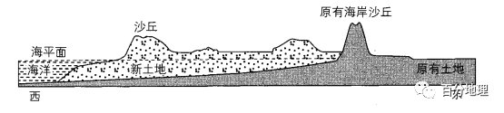
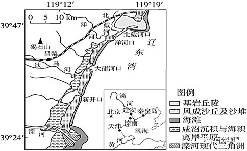
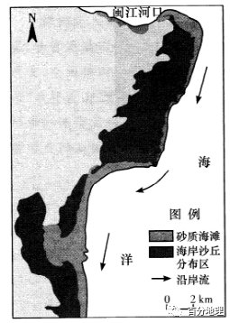
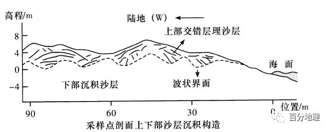
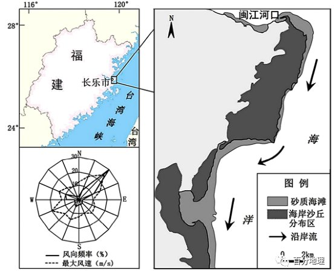
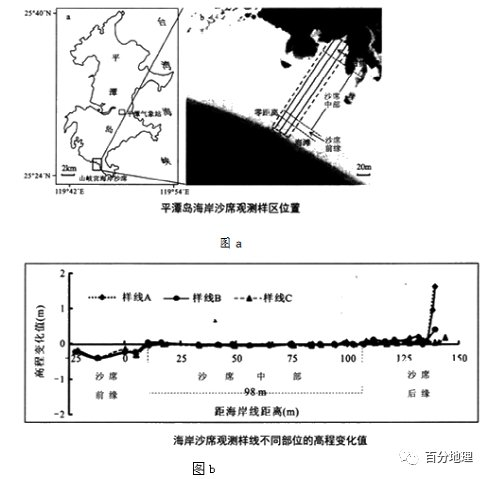

# 微专题之074 从产业结构角度分析区域发展

```
本专题摘自“百分地理”公众号，如有侵权请告之删除，谢谢。联系hhwxyhh@163.com
```

------
   
一、单选题   
（2021·黑龙江·大庆市东风中学高三阶段练习）欧洲西部的荷兰原有的海岸沙丘因自然原因遭到破坏，沿海低地涝灾风险增加。2021年荷兰人开始通过人工抛沙（从附近海域抽取泥沙输送到近岸形成新土地）对海岸进行综合整治。下图示意荷兰海岸沿52°N纬线地形剖面。据此完成下面小题。   
   
   
   
1．导致原有海岸沙丘形成的外力作用是（  ）   
A．风力侵蚀   
B．流水堆积   
C．海水堆积   
D．风力堆积   
2．荷兰人通过人工抛沙对海岸进行综合整治，使得海岸（  ）   
A．抵御台风能力增强   
B．陆地面积减少   
C．原有海岸沙丘蚀退   
D．生态系统更加稳定   
<span style="color: rgb(255, 0, 0);">1．D风力侵蚀会使海岸的泥沙被风搬走，使泥沙减少，不会形成沙丘，A错误；河流会将陆地的泥沙搬运至此沉积，但不会形成沙丘，B错误；海水堆积不会形成沙丘，C错误；此地的海岸沙丘是河流挟带泥沙在近海海域堆积再经过波浪、洋流、潮汐等二次分选，其中较细的颗粒在落潮水位较低时被盛行西风搬运堆积在海岸高潮水位以上，形成原有海岸沙丘，D正确。故选D。</span>   
<span style="color: rgb(255, 0, 0);">2．D根据材料可知，该地地处52°N附近的欧洲西部基本不受台风影响，A错误；人工抛沙使陆地面积增加，B错误。人工抛沙形成的新土地和沙丘对原有海岸沙丘起到屏障作用，可以抵御风浪对原有海岸沙丘的侵蚀，C错误；人工抛沙之后，原有海岸带较少受到侵蚀，沿海低地涝灾风险减小使得海岸带生态系统更加稳定，D正确；故选D。</span>   
<span style="color: rgb(255, 0, 0);">【点睛】外力作用之间的关系：五种外力作用形式是相互联系的统一过程。风化作用使岩石破碎，为其他外力作用创造条件；搬运作用中搬运的物质是风化作用和侵蚀作用的产物，所以它承上与风化、侵蚀作用相连；搬运途中由于搬运动力速度降低或其他因素的影响导致物质逐渐沉积，沉积物不断累积，形成沉积岩。</span>   
二、综合题   
3．（2022·全国·高三专题练习）阅读图文材料，完成下列问题。   
河北省昌黎黄金海岸是我国北方沿海地区罕见的沙质海岸。黄金海岸是近2000～3000年形成的。由海滩、多道沙堤、沙丘组成的砂质岸。滦河口外，断续分布的离岸沙堤，很不稳定。下图示意昌黎黄金海岸地貌。   
   
   
   
(1)分析滦河现代三角洲的成因。   
(2)说出昌黎黄金海岸沙丘的主要沙源。   
(3)滦河口外的离岸沙堤很不稳定，试分析其原因。   
<span style="color: rgb(255, 0, 0);">【答案】(1)滦河挟带大量泥沙入海；在入海口处地形平坦，流速降低；又由于海水顶托作用；泥沙沉积，形成河口三角洲。</span>   
<span style="color: rgb(255, 0, 0);">(2)入海河流挟带的泥沙；浅海海底被海浪搬运沉积到海岸的泥沙。</span>   
<span style="color: rgb(255, 0, 0);">(3)离岸沙堤随陆源沉积物补给情况而消长；河流入海泥沙多，离岸沙堤向海移动；当泥沙补给少，海洋因素起控制作用，沙堤则向陆迁移。</span>   
<span style="color: rgb(255, 0, 0);">【解析】本大题以河北省昌黎黄金海岸为材料，涉及三角洲的成因、外力作用等相关内容，考查学生获取和解读地理信息、调动和运用地理知识的能力，以及学生的区域认知、综合思维等。(1)三角洲的成因基本都是河流泥沙堆积，而泥沙堆积的原因与流速有关，流速与地形有关，河口附近地势平坦及海水的顶托作用，流速慢，泥沙堆积。根据形成过程条理化表述：滦河挟带大量泥沙入海；在入海口处地形平坦，流速降低；又由于海水顶托作用；泥沙沉积，形成河口三角洲。(2)据图，该地沙丘成条带状分布在海滩的西侧，入海河流挟带的泥沙和浅海海底被海浪搬运沉积到海岸的泥沙，被风力吹拂，在海陆交界位置沉积形成沙丘。(3)据材料，滦河口外的离岸沙堤很不稳定，主要受陆源沉积物和海浪侵蚀的影响，当河流入海泥沙多，沉积作用显著，离岸沙堤向海移动；当泥沙补给少，海洋因素起控制作用，在海浪的侵蚀作用下，沙堤则向陆迁移。</span>   
4．（2022·全国·高三专题练习）阅读图文材料，完成下列问题。   
福建省长乐市宽阔低平的滨海平原上，因独特地理位置使得多种因素相互作用，形成了面积约80km2？的海岸沙丘，它自闽江入海口向南绵延约50km，大致呈条带状平行海岸线分布。这里也是福建省三大风沙活动区之一，一年中东北风盛行，历史上的周期性气候变化影响该地风沙活动强弱。   
层理构造是指沉积物沉积时，由于地质作用的差异而显示出的层状现象。研究层理构造有助于认识地层的形成环境。科考队员在海岸沙丘东南部选择一地进行采样，通过沉积剖面考察福建省长乐市滨海平原海岸沙丘沉积构造时发现，经历数百年的海退，该地沙丘有明显的上、下两层不同沉积构造，上部沉积层呈交错层理，下部沉积层呈平缓的波状层理。   
   
   
   
   
   
   
(1)说明长乐滨海地区大面积海岸沙丘的形成条件。   
(2)指出要绘制出右图采样点沙丘剖面图，在采样点考察中需要测量的信息。   
(3)近年来，海岸沙丘呈现逐渐向陆地移动的趋势。为防治该地风沙对耕地的危害，请提出合理化建议。   
<span style="color: rgb(255, 0, 0);">【答案】(1)闽江带来的大量人海泥沙，被向南运动的沿岸流带到该滨海地区形成沙滩；东北向的向岸风将海滩泥沙吹向陆地，堆积形成海岸沙丘；滨海地区平坦开阔，为大面积沙丘提供分布空间。</span>   
<span style="color: rgb(255, 0, 0);">(2)①确定采样点剖面线的方向；②量算采样点剖面长度；③测量沙丘表面的高程；④多点测量上部交错层理的沙层厚度数据；⑤计算上部交错层理的倾斜方向和角度；⑥测量下部波状界面的深度数据。</span>   
<span style="color: rgb(255, 0, 0);">(3)加强闽江流域水土流失治理，减少泥沙来源；植树种草，营造农田防护林带；设置沙障等工程性措施固定沙丘。</span>   
<span style="color: rgb(255, 0, 0);">【解析】本题考查自然地理现象的成因和过程及其影响，考查了学生获取和解读地理信息、调动和运用地理知识、描述和阐释地理事物的能力，考查了区域认知、综合思维、人地协调观等核心素养。(1)沙丘形成条件主要有两个，一个是沙源，一个是动力。从沙丘形态来看，图中海滩有两种形式，一种是砂质海滩，一种是海岸沙丘，沙源最有可能来自于闽江，动力包括风力和洋流。由图中沿岸流流向可推知，闽江的泥沙被向南运动的沿岸流带到滨海地区沉积下来，形成沙滩，再结合上题中的东北风，为向岸风把沙滩的泥沙吹向陆地，堆积成为海岸沙丘；滨海地区地势平坦，为沙丘的形成提供了广阔的空间。(2)结合题干材料，分析右图坐标量和分层信息不难发现，绘制该沙丘剖面图，在采样点考察中需要进行剖面的确定（方向和长度等），测量剖面采样点高程，“上部沉积层呈交错层理”，可知需要测量不同沙层的厚度，测量不同沙层的倾斜方向和角度以及采样点距海面水平距离，只有通过测量获取这些数据，才能完成该图的绘制，进而分析不同沉积层形成时的地理环境。(3)沿岸沙丘向陆地移动容易吞没农田和居民区，防治措施包括主动的和被动的，主动的就是影响沙丘，即从沙源入手，加强闽江流域水土流失的治理，减少泥沙来源，扼制沙丘的增长；被动的措施可以在农田建设防护林带，设置一些沙障等固沙工程，减轻风沙的侵害。</span>   
5．阅读图文材料，完成下列问题。   
福建省长乐市宽阔低平的滨海平原上，因独特地理位置使得多种因素相互作用，形成了面积约80km2的海岸沙丘，它自闽江入海口向南绵延约50km，大致呈条带状平行岸线分布。这里也是福建省三大风沙活动区之一，   
   
   
   
(1)指出该地主导风向及其风速特点，并分析其成因。   
(2)说明长乐滨海地区大面积海岸沙丘的形成条件。   
(3)推测历史上该地风沙活动强盛时期的气候特点，并说明理由。   
(4)近年来，海岸沙丘呈现逐渐向陆移动的趋势。为防治该地风沙对耕地的危害，请提出合理化建议。   
<span style="color: rgb(255, 0, 0);">【答案】(1)主导风向为东北风，风速大。原因：该地冬季风受台湾海峡走向（东北-西南走向）和地转偏向力影响，偏转为东北风；台湾海峡的狭管效应，使风速增大。</span>   
<span style="color: rgb(255, 0, 0);">(2)闽江带来的大量入海泥沙，被向南运动的沿岸流带到该滨海地区形成沙滩；东北向的向岸风将海滩泥沙吹向陆地，堆积形成海岸沙丘；滨海地区平坦开阔， 为大面积沙丘提供分布空间。</span>   
<span style="color: rgb(255, 0, 0);">(3)干冷。干冷气候条件下，冬季风势力强，且干燥环境利于起沙。</span>   
<span style="color: rgb(255, 0, 0);">(4)加强闽江流域水土流失治理，减少泥沙来源；植树种草，营造农田防护林带；设置沙障等工程性措施固定沙丘。</span>   
<span style="color: rgb(255, 0, 0);">【解析】本题考察自然地理现象的成因和过程及其影响，要求的能力包括提取和解读信息的能力，逻辑推理能力，因为是综合题，表达能力也非常重要。(1)图中给出的风频图，可以看出，本地区主导风向为东北风，且风速较大。主要原因是该地区位于季风气候区，从图中区域图可以看出，东侧为台湾海峡，冬季的偏北风在受海陆形态的影响，主要是台湾海峡走向的影响，加之北半球向右的地转偏向力使之偏转成为东北风，且由于台湾海峡的狭管效应使得风速较大。(2)沙丘形成条件主要有两个，一个是沙源，一个是动力。从沙丘形态来看，图中海滩有两种形式，一种是砂质海滩，一种是海岸沙丘，沙源最有可能来自于闽江，动力包括风力和洋流。图中标注除了沿岸流，闽江的泥沙被向南运动的沿岸流带到滨海地区沉积下来，形成沙滩，再结合上题中的东北风，为向岸风把沙滩的泥沙吹向陆地，堆积成为海岸沙丘。滨海地区地势平坦，为沙丘的形成提供了广阔的空间。(3)该地区风沙活动要强盛，那么第一东北风要强盛，东北风强盛意味着以后相对比较干冷，第二沙丘要干燥面积大。沙丘干燥的话大风容易起沙。(4)沿岸沙丘向陆地移动容易吞没农田和居民区，改进措施可以是主动的和被动的，主动的就是影响沙丘，一个是被动的防御，影响沙丘可行性较高的是从沙源入手，因为无论是风还是洋流，我们能做的有限，加强闽江流域水土流失的治理，减少泥沙来源，扼制沙丘的增长，第二防御方面，可以在农田建设防护林带，设置一些沙障等固沙工程。</span>   
6．（2022·广东·深圳市高级中学高三阶段练习）阅读图文资料，完成下列要求。   
台风，是海岸风沙地貌形成及演变的一个高能影响因子，也是研究波浪、海滩与沙丘交互作用的重要内容之一。平潭岛是中国海岸沙丘面积较大、类型较多和形态典型的海岸风沙地貌分布区域，也是中国海岸风沙地貌对台风响应研究的理想区域。其中，海岸沙席在平潭岛南部山岐宫最为典型，海岸沙席按其形态划分为沙席前缘、沙席中部及沙席后缘，海岸沙席后缘为人工种植的木麻黄防护林。   
图a示意平潭岛海岸沙席观测样区位置，图b示意台风“麦德姆”登陆后(2014年9月8日)3条观测样线高程变化趋势。   
   
   
   
(1)概括“麦德姆”登陆后海岸沙席形态的总体变化特点。   
(2)分析“麦德姆”登陆后海岸沙席不同位置风力作用的差异。   
(3)推断此处主要种植木麻黄树的原因。   
(4)说明平潭岛成为中国海岸风沙地貌对台风响应研究理想区域的原因。   
<span style="color: rgb(255, 0, 0);">【答案】（1）海岸沙席形态在台风后表现为海岸沙席前缘高程降低、沙席中部高程变化相对较小、沙席后缘特别是接近木麻黄防护林地带高程明显升高，海岸沙席总体积也因接受来自岸线附近海滩的沙物质略有所增大</span>   
<span style="color: rgb(255, 0, 0);">（2）台风登陆后向岸风在向陆推进过程中受逐步升高地势影响风速逐渐降低，尤其是受沙席后缘木麻黄防护林地的阻挡风速急剧下降，随之风力作用从海滩开始以侵蚀为主逐渐转变为侵蚀和堆积相对平衡以致到最后变为以堆积为主</span>   
<span style="color: rgb(255, 0, 0);">（3）木麻黄树耐盐碱，根系发达，抗风力强；成活率高，成本低；减弱台风风力，阻挡海沙向内陆侵入</span>   
<span style="color: rgb(255, 0, 0);">（4）平潭岛大风日数多、台风影响大；平潭岛是中国海岸沙丘面积较大、类型较多和形态典型的海岸风沙地貌分布区域，研究具有代表性；长期受交通条件等所限人为干扰相对较小，使得平潭岛成为中国海岸风沙地貌对台风响应研究的理想区域</span>   
<span style="color: rgb(255, 0, 0);">【解析】（1）由图b可知，海岸沙席形态的变化主要体现在高程变化和占地面积等方面。（2）风力作用的差异主要受风力大小影响。风力强劲，搬运作用强，风力较弱，沉积作用明显。地形以及植被的阻挡会降低风速，因此乙地台风登陆后向岸风在向陆推进过程中受逐步升高地势影响风速逐渐降低，尤其是受沙席后缘木麻黄防护林地的阻挡风速急剧下降，随之风力作用从海滩开始以侵蚀为主逐渐转变为侵蚀和堆积相对平衡以致到最后变为以堆积为主。（3）本题应结合木麻黄树的生长习性从当地的自然环境考虑。沿海地区土地盐碱化问题突出， 材料显示当地多台风。木麻黄树耐盐碱，根系发达，抗风力强；成活率高，成本低；减弱台风风力，阻挡海沙向内陆侵入。（3）对台风响应研究理想区域应具备台风活动频繁、自然地理环境多特、人类活动影响小等特征。材料“平潭岛是中国海岸沙丘面积较大、类型较多和形态典型的海岸风沙地貌分布区域，也是中国海岸风沙地貌对台风响应研究的理想区域”显示平潭岛大风日数多、台风影响大；平潭岛是中国海岸沙丘面积较大、类型较多和形态典型的海岸风沙地貌分布区域，研究具有代表性；长期受交通条件等所限人为干扰相对较小，使得平潭岛成为中国海岸风沙地貌对台风响应研究的理想区域。</span>
