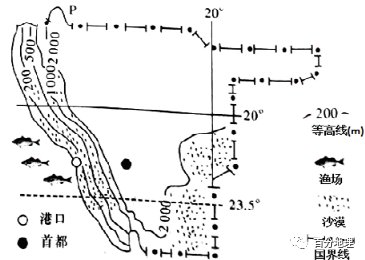
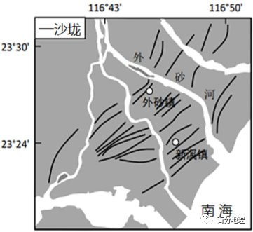
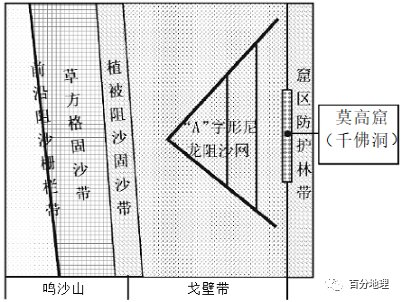
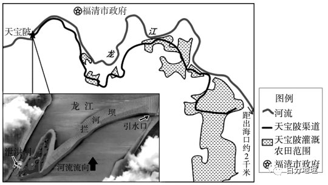
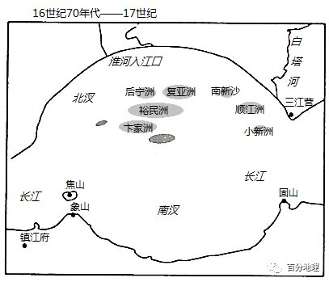
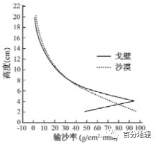
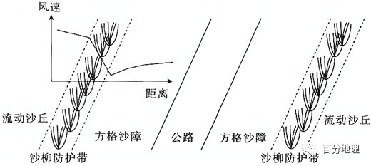

# 微专题之074 从产业结构角度分析区域发展

```
本专题摘自“百分地理”公众号，如有侵权请告之删除，谢谢。联系hhwxyhh@163.com
```

------
   
一、单选题   
下图所示，为某国西部海岸地区可观赏“倒沙入海”奇景：红色沙漠依偎着蔚蓝的海洋，滚滚沙流飞泻入海，上万只火烈鸟聚集在附近的浅滩上。据此完成下列各题。   
   
   
   
1．倒沙入海的形成   
A．反映了当地水土流失严重，入海河流泥沙含量大   
B．反映了当地气候干旱并盛行离岸风   
C．主要与当地高原广布的地形有关   
D．是人类填海造陆的结果   
2．附近浅滩火烈鸟聚集是由于该地   
A．沿岸有上升流，鱼类丰富，利于觅食   
B．倒沙入海，营养物质丰富   
C．气候较同纬地区温暖，利于繁殖   
D．沿海地势低平，利于筑巢   
<span style="color: rgb(255, 0, 0);">1．B图示地区地处副热带高气压带和信风带控制区，盛行下沉气流，气候干燥，为热带沙漠气候，沙漠广布，又由于此处吹离岸风，故而形成这种奇景。故选B。当地气候干旱，水土流失并不严重，与当地高原广布的地形无关，无法判断是人类填海造陆的结果，ACD错误。</span>   
<span style="color: rgb(255, 0, 0);">2．A该地位于非洲西海岸，地处东南信风带内，风向由陆地吹向海洋，盛行离岸风，且此处有本格拉寒流(上升流)经过，营养物质为鱼类提供丰富饵料，火烈鸟以捕食鱼类为主，鱼类丰富吸引火烈鸟聚集。故选A。倒沙入海并不一定带来丰富营养物质，主要是洋流的影响，和气候地势无关，BCD错误。</span>   
<span style="color: rgb(255, 0, 0);">【点睛】考察区域定位的能力和区域特征的掌握与分析，从图中的经纬度和国家轮廓特征可以判断该国是非洲的纳米比亚，可以通过排除的方法完整做题，解答本题，根据材料信息“滚滚流沙飞泻入海”表明流沙是被离岸风吹拂入海的，蔚蓝海洋与火烈鸟表明该地区生态环境较好，沙漠表明该地区的气候干旱。动物（鱼类、鸟类）的集聚主要是为了食物，根据该地区的地理位置，可判断该地区鱼类资源丰富，利于火烈鸟的觅食。</span>   
沙垅（广东潮汕地区对沙堤的称呼）—潟（xì）湖平原是一种特殊的滨海地貌类型，这种地貌类型在今天的韩江三角洲前端仍有发育（下图）。韩江在流出潮州城不远处开始分叉，共分为西溪、东溪、北溪三大出流，在西溪和东溪的下游形成了一系列发育完好的连续沙垅。潟湖是海湾被泥沙堆积封闭所形成的湖泊，当沿岸水流把泥沙带到海湾最突出的部位，泥沙流速减慢从而慢慢堆积下来，形成沙嘴，后来演变成又长又窄的沙垅，最终海湾与海洋隔离形成潟湖。据此完成下面小题。   
   
   
   
3．影响图中沙垅走向的因素是（  ）   
A．风力   
B．河流   
C．海浪   
D．洋流   
4．图中沙垅（  ）   
A．由南向北推进   
B．由北向南推进   
C．向陆地方向推进   
D．向海洋方向推进   
5．沙垅——潟湖平原形成的地理过程大致为（  ）   
A．地壳抬升——流水侵蚀——海浪堆积   
B．河流搬运——海浪堆积——流水堆积   
C．风力搬运——海浪堆积——流水堆积   
D．海浪堆积——地壳抬升——流水堆积   
<span style="color: rgb(255, 0, 0);">3．C沙垅是河流携带的泥沙离开河口后，在海浪作用下按照颗粒大小平行堆积到沿岸浅滩处，形成水下沙堤，当水下沙堤不断抬高露出水面就形成沙垅，所以其走向大致与海岸线平行，是受海浪堆积形成的，C正确。沙垅—潟湖平原是一种特殊的滨海地貌类型，在今天的韩江三角洲前端仍有发育，和风力作用关系不大，河流提供了沙源，但沙垅走向与河流、洋流关系不大，ABD错误。故选C。</span>   
<span style="color: rgb(255, 0, 0);">4．D读图并根据材料分析可知，沙垅在韩江三角洲前端仍有发育，说明海岸线不断向海洋方向推进，是沙垅不断向海洋方向推进，陆地面积不断扩大的表现，D正确，C错误；并没有呈现明显的南北方向的进退，AB错误；故选D。</span>   
<span style="color: rgb(255, 0, 0);">5．B沙垅一潟湖平原是一种特殊的滨海地貌类型，是河流和海洋共同作用下形成的。河流携带的泥沙离开河口后，在海浪作用下按照颗粒大小平行堆积到沿岸浅滩处，形成水下沙堤；当水下沙堤不断抬升，露出水面时，在沙堤与海岸间形成受潮水影响的潟湖；输沙作用持续加宽、加高现有沙堤，中央潟湖被逐渐淤积，形成陆地平原，因此沙垅——潟湖平原形成的地理过程大致为河流搬运——海浪堆积——流水堆积，B正确，ACD错误。故选B。</span>   
<span style="color: rgb(255, 0, 0);">【点睛】沙垅--潟湖平原分布在河流入海口处，其形成和河流与海洋的相互作用关系较大，和风力关系不大。</span>   
莫高窟地区西侧鸣沙山的风沙流一直是莫高窟的最大威胁。莫高窟山崖顶部是一片平坦的荒漠，自东向西为砾质戈壁带、沙地带。在沙地铺设砾石而成的人工戈壁，能有效减少沙尘在莫高窟崖顶的堆积。读莫高窟地区综合防护休系示意图，完成下面小题。   
   
   
   
6．风沙流对莫高窟的危害主要体现在（  ）   
A．直接吹蚀洞窟内壁画   
B．降低洞口透明度   
C．堵塞掩埋洞窟   
D．稳定崖壁的结构   
7．下列关于莫高窟地区综合防护体系的叙述，正确的是（  ）   
A．草方格固沙提高风沙流搬运沙尘能力   
B．“A”字形尼龙阻沙网顶点指向主害风风向   
C．沙地铺设砾石快速促进沙地植物生长   
D．窟区防护林带增加沙尘在莫高窟崖顶的侵蚀   
<span style="color: rgb(255, 0, 0);">6．C风沙流形成较强的磨蚀作用表现在对露天壁画、洞窟崖体的直接吹蚀和磨损，对洞窟内壁画直接吹蚀作用较小，A错误。降低洞口透明度对莫高窟的不利影响较小，B错误。风沙流产生的积沙，堵塞掩埋洞窟，C正确；稳定崖壁的结构是有利影响，D错误。故选C。</span>   
<span style="color: rgb(255, 0, 0);">7．B风沙流来自莫高窟地区西侧鸣沙山，据图可知，“A”字形顶点指向莫高窟地区风沙危害的主害风风向为西风，尼龙阻沙网可以在上风向上截断部分鸣沙山的沙源，起到阻沙作用，B正确。草方格固沙降低风沙流搬运沙尘能力，A错误。沙地铺设砾石不能快速促进沙地固沙植物的生长，但可以改善生长环境，C错误。窟区防护林带可以降低沙尘在莫高窟崖顶的侵蚀，D错误。故选B。</span>   
<span style="color: rgb(255, 0, 0);">【点睛】荒漠化治理措施：①营造防护林（三北防护林）②退耕还林还草③保护和恢复天然植被（封沙禁牧、禁樵禁采、生态移民等措施）④合理用水⑤控制人口增长。</span>   
（2022·广东·开平市第一中学高三期末）2020年12月，兴建于唐朝夭宝年间（742-756年）的福建福清市天宝陂成功入选世界灌溉工程遗产名录。天宝陂选址在龙江下游河势较高处，拦河坝顺水流方向凸岀成拱形，与河道斜交，在右岸处形成漏斗状，引水口正处于漏斗嘴（如图）。千百年来，天宝陂控灌着龙江下游的广袤农田。读图，回答下列各题。   
   
   
   
8．不直接利用龙江河水，而修建天宝陂渠道引水灌溉农田的主要目的是（  ）   
A．增加灌溉总水量   
B．避免咸潮影响水质   
C．减少沿河水污染   
D．阻挡河沙流入农田   
9．独具巧思的天宝陂灌溉工程体现了古人的治水智慧。其精妙之处表现在（  ）   
①选址在河势较高处利于蓄水   
②泄洪闸在洪水期开闸利于海水上溯   
③拦河坝呈拱形可减轻洪水冲击   
④引水口处于漏斗嘴便于枯水期取水   
A．①②   
B．①④   
C．②③   
D．③④   
<span style="color: rgb(255, 0, 0);">8．B由图中信息可知，天宝陂以下的河段距离海洋比较近，受潮汐影响大，咸潮容易上溯导致河水变咸，不能直接作为农田灌溉水源，需通过天宝陂渠道引河流淡水灌溉农田。因此B选项正确；引龙江水灌溉和修建天宝陂渠道引水灌溉两种方式的灌溉总量是没有减少的，故A不选；将水引出，减少龙江河水量，减缓河流对污染物的稀释，增加了污染，故C错；天宝陂渠道修建在地势较高处，同样会带走一部分泥沙，该引水主要用来灌溉，所以可能导致泥沙进入农田，故D错。答案选择B。</span>   
<span style="color: rgb(255, 0, 0);">9．D天宝陂选址在河势较高处利于自流灌溉而不是用于蓄水，故①不符合题意；修建泄洪闸是为了在洪水期将多余河水排走，减少洪涝灾害，泄洪水流迅速流入入海口，阻碍了海水上溯，故②不符合题意；拱形拦河坝増加了坝体长度，使相同洪水的单宽流量减小，有效减轻了洪水对坝体的冲击，故③正确；拦河坝与河道斜交形成漏斗状，调整了河道水流，有利于枯水期引水口取水，故④正确。因此③④正确，答案选择D。</span>   
<span style="color: rgb(255, 0, 0);">【点睛】从水源自流取水灌溉农田的水利工程设施。根据河流水量、水位和灌区高程的不同，可分为无坝引水和有坝引水两类。引水枢纽的规划布置应满足以下要求：适应河流水位涨落变化，满足灌溉用水量要求；进入渠道的灌溉水含沙量少；引水枢纽的建筑物结构简单，干渠引水段较短，造价低且便于施工和管理；所在位置地质条件良好，河岸坚固，河床和主流稳定，土质密实均匀，承载力强。</span>   
（2022·河南·高三阶段练习）下图示意不同时期淮河入江口处沙洲发育。据此完成下面小题。   
   
   
   
10．北汊沙洲、南汊沙洲的变化趋势是（  ）   
A．南汊沙洲面积增大，北汊沙洲面积减小   
B．北汊沙洲面积增大，南汊沙洲面积减小   
C．北汊沙洲、南汊沙洲面积均增大   
D．北汊沙洲、南汊沙洲面积均减小   
<span style="color: rgb(255, 0, 0);">11．北汊沙洲、南汊沙洲变化的原因可能是淮河流入长江后（</span>   
<span style="color: rgb(255, 0, 0);">）</span>   
A．淮河、长江流速加快，利于泥沙流失   
B．淮河、长江流速减慢，利于泥沙沉积   
C．淮河流速减慢，长江流速加快，利于泥沙沉积   
D．淮河流速加快，长江流速减慢，利于泥沙流失   
<span style="color: rgb(255, 0, 0);">10．C根据图中可知，从16世纪70年代-17世纪到17世纪40-60年代间，北汊沙洲、南汊沙洲面积增大数量增多，C选项正确。排除A、B、D选项。</span>   
<span style="color: rgb(255, 0, 0);">11．B由图可知，淮河在入海口附近是自北向南流，长江是自西向东流，所以淮河近乎垂直流入长江，导致淮河和长江在交汇处流速减慢，有利于泥沙沉积，形成沙洲，C错误，B正确。因为北汊沙洲、南汊沙洲的面积均增大，所以泥沙流失不正确，A、D错误。故选B。</span>   
<span style="color: rgb(255, 0, 0);">【点睛】导致河流泥沙沉积的原因：河流中上游水土流失严重；河流流速慢；河道变宽等。</span>   
莫高窟地区盛行偏东风和偏西风，其西侧鸣沙山的风沙流一直是莫高窟的最大威胁。莫高窟山崖顶部是一片平坦的荒漠，自东向西为砾质戈壁带、沙地带。在沙地铺设砾石而成的人工戈壁，能有效减少沙尘在莫高窟崖顶的堆积。下图示意相同风力条件下，沙漠和戈壁风沙流输沙率垂直结构特点。据此完成下面小题。   
   
   
   
12．当前，风沙流对莫高窟危害最大的是   
A．磨蚀崖壁壁画   
B．降低窟内能见度   
C．降低窟内湿度   
D．掩埋和堵塞洞口   
13．与沙漠风沙流相比，相同风力条件下的戈壁风沙流   
A．输沙量更大   
B．输沙率更小   
C．2-4cm高度输沙量更大   
D．4-6cm高度输沙率更大   
14．人工戈壁措施有效减少沙尘在莫高窟山崖顶部的堆积，主要的原因是人工戈壁   
A．阻碍风沙流高层沙尘运动   
B．降低风沙流搬运沙尘能力   
C．提高防沙工程的输导作用   
D．促进沙地固沙植物的生长   
<span style="color: rgb(255, 0, 0);">12．A文字材料“莫高窟地区盛行偏东风和偏西风，西侧鸣沙山的风沙流一直是莫高窟的最大威胁”，而莫高窟为崖壁石窟，窟内壁具有很高的艺术和历史文化价值。因此，当前，风沙流对莫高窟危害最大的是磨蚀崖壁壁画，A正确，BCD错误。故选A。</span>   
<span style="color: rgb(255, 0, 0);">13．D读“相同风力条件下，沙漠和戈壁风沙流输沙率垂直结构特点”图可知，图中横坐标的含义是输沙率，相同风力条件下的戈壁风沙流和沙漠风沙流输沙率变化不一，AB错误。与沙漠风沙流相比，相同风力条件下的戈壁风沙流在2-4cm高度输沙量更小，C错误。在4-6cm高度戈壁风沙流输沙率更大，D正确。故选D。</span>   
<span style="color: rgb(255, 0, 0);">14．C据材料“在沙地铺设砾石而成的人工戈壁”，根据“相同风力条件下，沙漠和戈壁风沙流输沙率垂直结构特点”图示可知，可提高戈壁风沙流高层和4-6cm高度沙尘运动，A错误。人工戈壁不会降低风沙流搬运沙尘能力，B错误。人工戈壁可有效减少沙尘在莫高窟崖顶的堆积，提高防沙工程的输导作用，故C正确。在沙地铺设砾石而成的人工戈壁，并不能促进沙地固沙植物的生长，D错误。故选C。</span>   
二、综合题   
15．阅读图文材料，完成下列要求。   
毛乌素沙漠南缘的某段省道沿线大风日数多，流动沙丘分布广泛，穿沙公路受到较为严重的风沙威胁。为此，当地营造了沙柳防护林带，并在防护林和公路之间铺设草方格沙障。这一防沙系统综合运用了阻沙、固沙、疏导沙的原理。阻沙指阻挡风沙流的输移，固沙指防止局地疏松物质起沙，疏导沙并非拦截风沙，而是使风沙快速通过，减小风沙对重要设施的影响。该防沙系统效果明显，但沙柳的生物学特性要求每3～5年必须对成熟沙柳进行平茬（从根茎处将上面的枝条全部剪截去，使之重新长出通直而粗壮的主干），否则沙柳会出现衰退和死亡现象。下图示意该防沙系统，下表示意不同平茬强度对输沙率的影响。   
   
   
   
（1）简述流动沙丘对公路运输的威胁。   
（2）说明沙柳防护带、方格沙障对防风沙的作用。   
（3）公路两侧方格沙障处常常“风过而沙不起”，请对此做出合理解释。   
（4）指出该路段防护带最适宜的平茬强度，并说明理由。   
<span style="color: rgb(255, 0, 0);">【答案】（1）为风沙流提供沙源，侵蚀路面、路基，增大塌陷风险；沙丘移动，掩埋路面，阻碍正常通行；流动沙丘形成的风沙活动降低能见度，影响行车安全。</span>   
<span style="color: rgb(255, 0, 0);">（2）增大地表粗糙度，降低风速，风沙分离，沙物质沉积（起到阻沙作用）；下风向（边坡）风速降低，难以就地起沙（起到固沙作用）。</span>   
<span style="color: rgb(255, 0, 0);">（3）经过沙柳防护带削减，风速较低，起沙动力较弱；沙柳带主要削弱下层风速，经过沙柳带后，（气流紊乱，）降低了下层气流的输沙能力；公路两侧方格沙障可以拦截水分，沙层含水率较高，起沙阻力较大。</span>   
<span style="color: rgb(255, 0, 0);">（4）0.5Φ；阻沙能力较强，规避平茬后短期内受风沙威胁；轮流平茬，保障沙柳复壮。</span>   
<span style="color: rgb(255, 0, 0);">【解析】本题以毛乌素沙漠沙柳防护林带为背景，考查流动沙丘对公路运输的影响、沙柳防护带对防风沙的作用及防护带的可持续发展措施，同时考查学生获取和解读地理信息及调动、运用地理知识的能力。第（1）问，流动沙丘对公路运输的威胁可以从风力侵蚀、风力堆积的角度作答。流动沙丘会为风沙流提供沙源，风沙流携带沙侵蚀路面、路基，增大道路塌陷风险；流动沙丘沙丘移动，沙丘会掩埋路面，阻碍正常车辆等通行；流动沙丘形成的风沙活动导致大气能见度降低，影响视线，影响行车安全。第（2）问，沙柳防护带、方格沙障可增大地表粗糙度，降低风速，促使沙物质沉积，风沙分离，从而起到固沙作用。沙柳防护带、方格沙障可使下风向（边坡）风速降低，风力减小，难以就地起沙，起到固沙作用。第（3）问，沙柳防护带削减风力，经过沙柳带后，风力减小，起沙动力较弱，下层气流输沙能力降低，有利于抑沙；经过沙柳带后，气流紊乱，起砂能力下降，降低了下层气流的输沙能力；公路两侧方格沙障处受方格沙障拦截水分的影响，沙层含水率较高，起沙阻力较大，有利于抑沙。第（4）问，当平茬强度为0.5Φ时，阻沙能力较强，规避平茬后短期内受风沙威胁，能够在降低输沙率和促进植被轮流平茬之间取得较好的平衡。</span>
