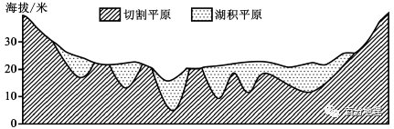
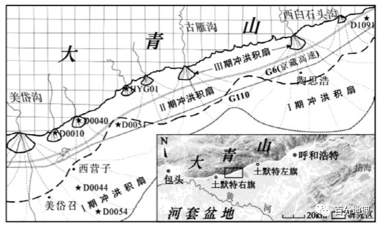
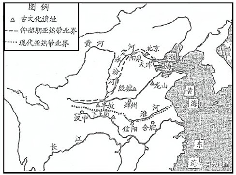

# 微专题之074 从产业结构角度分析区域发展

```
本专题摘自“百分地理”公众号，如有侵权请告之删除，谢谢。联系hhwxyhh@163.com
```

------
   
一、单选题   
末次冰期后长江中游江汉—洞庭盆地河湖水位大致经历了全新世早期（阶段I）快速上升、全新世中期（阶段II）下降、全新世晚期（阶段III）再次上升的演变过程。研究发现海平面的升降会影响海水的顶托能力，从而影响河湖水位的升降。下图为江汉—洞庭地区全新世中晚期地形变化。据此完成下面小题。   
   
   
   
1．海平面升高使河湖水位（  ）   
A．升高   
B．降低   
C．不变   
D．变化不定   
2．和全新世早期（阶段I）该盆地河湖水位快速上升无关的是（  ）   
A．气温升高   
B．海水顶托作用增强   
C．降水增加   
D．流水侵蚀作用为主   
3．阶段Ⅱ至阶段Ⅲ由高低不平的切割平原演化为地势起伏和缓的湖积平原的地质过程为（  ）   
A．水位下降—泥沙沉积—切割平原—水位上升—河流下切—湖积平原   
B．水位下降—河流下切—切割平原—水位上升—泥沙沉积—湖积平原   
C．水位升高—泥沙沉积—切割平原—水位下降—河流下切—湖积平原   
D．水位升高—河流下切—切割平原—水位下降—泥沙沉积—湖积平原   
<span style="color: rgb(255, 0, 0);">1．A海平面上升导致海水的顶托增强，从而使河湖水位升高，A正确，BCD错误。故选A。</span>   
<span style="color: rgb(255, 0, 0);">2．D末次冰期后，气温迅速回升，降水增加，河流径流量增加，河湖水位会快速上升，因此A、C不符合题意；气候变暖导致海平面上升，顶托作用增强，河湖水位因此快速上升，B不符合题意；降水增加，河流径流量增加，流水的侵蚀、搬运作用增强，会导致该河湖地区河床、湖床下降，水位下降，D符合题干要求。故选D。</span>   
<span style="color: rgb(255, 0, 0);">3．B由材料可知，阶段Ⅱ，由于海面下降，顶托作用减弱，导致河湖水位下降，流水速度加快，侵蚀作用加强，河流下切，前期形成的沉积物被切割，形成切割平原；阶段Ⅲ，由于海面上升，顶托作用加强，导致河湖水位上升，流水速度减慢，沉积作用增强，沉积物在地势低的区域堆积，形成起伏和缓的湖积平原，B正确，ACD错误。故选B。</span>   
<span style="color: rgb(255, 0, 0);">【点睛】对一条河流来说，在正常情况下，上游多以侵蚀作用为主，下游以堆积作用为主。如果海面下降，下游地段可转化为侵蚀作用为主，当河流水量减少，泥沙增多，在河流上游的某一地段也可能出现堆积作用为主。另外，在同一河段，侵蚀、搬运和堆积是同时进行的，例如弯曲河段在凹岸侵蚀，同时在凸岸就发生堆积。</span>   
辉腾锡勒湖区位于内蒙古中部，为现代季风气候的过渡地带，由于受西伯利亚和蒙古高原冷空气的影响，多寒潮大风，冬季寒冷而漫长，最低气温﹣39.9℃，年平均降水量385mm。该湖区地层出露完整、沉积厚度较大，是研究全新世地层、沉积特征及古气候变迁的理想场所。下图示意辉腾锡勒湖泊沉积年龄与深度的对应关系。据此完成下面小题。   
   
   
   
4．该湖区沉积速度最快时段对应的沉积物是（  ）   
A．粉砂   
B．黏土   
C．粉砂质黏土   
D．黏土质粉砂   
5．从沉积地层上分析，图示时段该地经历的气候演变过程主要是（  ）   
A．湿润—干旱   
B．湿润—干旱—湿润   
C．干旱—湿润   
D．干旱—湿润—干旱   
<span style="color: rgb(255, 0, 0);">4．B根据图中沉积物厚度的变化可知，距今9.5-10.5千年斜率最大，说明单位时间内的沉积物厚度最大，沉积速度最快。结合图例可知，该时段对应的沉积物为黏土，B符合题意。故选B。</span>   
<span style="color: rgb(255, 0, 0);">5．D图中150cm深度以下沉积物主要由粉砂、黏土等构成，以风力沉积为主，说明气候较干旱；随后被覆盖了带有贝壳和螺的沉积层，说明气候较湿润，出现了湖泊，为湖底沉积层；后来表层再次覆盖风力沉积物（粉砂质黏土），说明气候再次干旱。因此图示时段该地经历的气候演变过程主要是干旱—湿润—干旱，D正确，ABC错误。故选D。</span>   
<span style="color: rgb(255, 0, 0);">【点睛】沉积岩层从沉积方式上分为陆相沉积和海相沉积。陆相沉积指陆地环境下的沉积，沉积物以碎屑岩（砂岩、砾岩）和粘土岩居多。海相沉积指在海洋环境下，经海洋动力过程产生的一系列沉积，沉积物有来自陆上的碎屑物、海洋生物骨骼和残骸等。</span>   
（2022·辽宁·高三期末）郭扎错（如图）位于西藏西北部，东西长30.4km,南北最宽达11.6km,水深可达81.9m,近几十年来水位经历了数次涨落。该湖泊在第四纪全新世以前，湖水向西穿过低缓岗地，流入阿克赛钦湖，目前两湖均为独立的封闭湖泊。据此完成下面小题。   
   
   
   
6．郭扎错的主要成因是（  ）   
A．河流改道，形成牛轭湖   
B．滑坡阻断河流，形成堰塞湖   
C．火山喷发，火山口集水成湖   
D．地壳断裂下陷，集水成湖   
7．郭扎错湖水盐度空间差异最大的表现是（  ）   
A．北咸南淡   
B．北淡南咸   
C．东咸西淡   
D．东淡西咸   
8．与第四纪全新世以前相比，郭扎错湖水盐度（  ）   
A．较低   
B．波动降低   
C．较高   
D．持续升高   
<span style="color: rgb(255, 0, 0);">6．D由材料信息可知，该湖的最大深度达到81.9m，推测其形成是地壳断层陷落，积水成湖。D正确；由图看不是牛轭湖，A错误；河流主要是由北向南流，但湖泊是东西延伸，与河流流向不同，不可能是堰塞湖，B错误；不是火山湖的形状，C错误；故选D。</span>   
<span style="color: rgb(255, 0, 0);">7．B由图可知，北部有大量的河流入湖，带来较多的淡水，南部入湖河流少，故盐度差异表现为北淡南咸，B正确，ACD错误，故选B。</span>   
<span style="color: rgb(255, 0, 0);">8．C由材料“湖泊在第四纪全新世以前，湖水向西穿过低缓岗地，流入阿克赛钦湖”可知，第四纪全新世以前，湖水较多，湖水注入其它湖泊，湖水盐份可直接向外排泄，盐度相对现在要低，与全新世以前相比，现在湖泊经过了长时间的盐份积累，盐度较高，C正确，ABD错误，故选C。</span>   
<span style="color: rgb(255, 0, 0);">【点睛】郭扎错，海拔5080米，面积244平方公里，流域面积2790平方公里。湖北半部为淡水，南半部为咸水，在同一个湖泊中有两种不同的水，实属罕见。为我国海拔最高的既有咸水，又有淡水的混合湖。地处昆仑山南麓的断裂带，有长距离的断层线崖，为构造湖。</span>   
（2022·湖南·高三专题练习）在研究全新世气候变迁的时候，常把高属孢粉和藜科孢粉的比值（A/C）作为街量指标。蒿属孢粉往往反映气候湿润，藜科孢粉则代表气候干旱。下图示意八达岭长城附近的高藜（A/C）曲线。读图，完成下面小题。   
   
   
   
9．推测甲时期华北地区的气候特征可能是（  ）   
A．寒冷   
B．温暖   
C．干旱   
D．湿润   
10．乙时期我国东部季风区的大气环流状况是（  ）   
①西北季风增强②西南季风增强③东南季风增强④东北季风增强   
A．①②   
B．①③   
C．②③   
D．③④   
<span style="color: rgb(255, 0, 0);">9．C根据题干可知，蒿属孢粉反映气候湿润，藜科孢粉代表干旱，蒿属孢粉和藜科孢粉的比值(A/C)越大，说明气候越湿润；比值越小，说明气候越干旱。甲时期A/C的比值最大，说明气候最湿润，C正确，D错误。与寒冷、温暖无关，A、B错误。故选C。</span>   
<span style="color: rgb(255, 0, 0);">10．C由所学知识可知，如果影响我国的西北风增强，该风来自于大陆，吹向海洋，则降水少，气候干旱，A/C的比值小，①错误，A、B错误；如果西南风增强，则来自于印度洋的湿润气流多，季风区降水量大，气候湿润，②正确；如果影响我国的东南风增强，则降水多，气候湿润，③正确，C正确；如果东北风增强，则导致我国降水少，气候干旱，④错误，D错误。故选C。</span>   
二、综合题   
11．（2022·江西九江·二模）阅读图文材料，完成下列要求。   
大青山属于阴山山脉中部，是气候变化敏感区和构造运动活跃区。区域构造活动强烈，为洪积扇的形成提供了重要的地形与构造基础。全新世时期，大青山地区气候经历了冷干—暖湿—暖干的变化，地壳运动经历了较强—弱—较弱的强度变化。大型季节性洪水在大青山山口流出后形成三期洪积扇。Ⅰ期洪积扇形成于全新世早期,规模最大。Ⅱ期洪积扇形成于全新世中期，规模比Ⅰ期小。Ⅲ期洪积扇形成于全新世晚期，零散地分布在大青山山前，整体规模最小。下图为大青山洪积扇示意图。   
   
   
(1)根据洪积扇的成因推测大青山洪积扇形成时期降水特点。   
(2)与Ⅱ期洪积扇相比，分析I期洪积扇规模较大的原因。   
(3)Ⅲ期洪积扇规模有大有小，指出其影响因素。   
(4)说明Ⅲ期洪积扇零散分布的原因。   
<span style="color: rgb(255, 0, 0);">【答案】(1)洪积扇的成因主要是有季节性洪水。据此推测该区域降水季节变化大；多暴雨。</span>   
<span style="color: rgb(255, 0, 0);">(2)（Ⅰ期洪积扇形成时）气候冷干，植被覆盖率低，松散堆积物多；构造运动强烈，山体抬升速率加快，河流落差增大，流水的侵蚀和搬运能力强，堆积物数量大，冲积扇规模最大。</span>   
<span style="color: rgb(255, 0, 0);">(3)径流量；地形（流速，落差，地势起伏）；松散堆积物（植被覆盖度）。</span>   
<span style="color: rgb(255, 0, 0);">(4)气候变干导致河流流量变小；加上构造运动较弱，落差变小，河流搬运的沉积物较少。每个冲积扇规模都较小，未能连接成片。</span>   
<span style="color: rgb(255, 0, 0);">【解析】本题以大青山三期洪积扇为材料背景设置试题，考查洪积扇形成及其形态差异的影响因素，培养学生的材料信息提取能力以及对地理基本知识的迁移运用能力，落实综合思维和区域认知的地理学科素养。(1)由材料信息可知，大型季节性洪水在大青山山口流出后形成三期洪积扇，则可推知，洪积扇的成因主要是有季节性洪水的存在，在雨季搬运了大量的泥沙等物质，在河流出山口随着地势的变缓、流速的减慢而沉积形成。由季节性洪水可知，大青山洪积扇形成时期该区域降水季节变化大，多暴雨。(2)影响洪积扇面积大小的因素，主要有流水的作用、下垫面物质状态以及地势的高低状况。由材料可知，全新世时期，大青山地区气候经历了冷干—暖湿—暖干的变化，地壳运动经历了较强—弱—较弱的强度变化，Ⅰ期洪积扇形成于全新世早期，则对应的可以推知，Ⅰ期洪积扇形成时期，气候冷干，地球运动较强。气候冷干，则植被发育差，覆盖率低，下垫面的松散堆积物多；地球运动较强，山体抬升速率快，河流落差大，流水的侵蚀和搬运能力强，堆积物数量大，冲积扇规模最大。(3)由材料可知，全新世时期，大青山地区气候经历了冷干—暖湿—暖干的变化，地壳运动经历了较强—弱—较弱的强度变化，Ⅲ期洪积扇形成于全新世晚期，则对应的可以推知，Ⅲ期洪积扇形成时期气候暖干，地壳活动较弱。气候暖干，降水少，径流量少，流水作用弱；地壳活动较弱，山体抬升速率慢，河流的流速慢，流水的侵蚀和搬运作用弱；气候暖干，植被相对发育较好，覆盖率较高，松散堆积物少。综合分析可知，Ⅲ期洪积扇整体规模最小。但是局部区域，径流量、地势高低、植被覆盖度也存在差异，因此形成的洪积扇规模也就有大有小，则其影响因素有径流量、地形（流速，落差，地势起伏）、松散堆积物（植被覆盖度）。(4)由材料可知，全新世时期，大青山地区气候经历了冷干—暖湿—暖干的变化，地壳运动经历了较强—弱—较弱的强度变化，Ⅲ期洪积扇形成于全新世晚期，则对应的可以推知，Ⅲ期洪积扇形成时期气候暖干，地壳活动较弱。气候暖干，降水少，径流量少，流水作用弱；地壳活动较弱，山体抬升速率慢，河流的流速慢，流水的侵蚀和搬运作用弱；气候暖干，植被相对发育较好，覆盖率较高，松散堆积物少。综合分析可知，Ⅲ期洪积扇整体规模最小。此外，每个冲积扇规模都较小，未能连接成片，所以呈现零星分布。</span>   
12．（2022·全国·高三专题练习）阅读材料，完成下列问题。   
地面升降和气候变化改变了河道比降、径流量和泥沙输送量，使流经活动构造区的河流袭夺、改道。北大河（下图）出祁连山后北流进入酒东盆地。因金塔南山断裂带在全新世时活动性依然较强，金塔南山不断向盆地扩展生长，该河绕过文殊山后转向东流。同时，在上游冰川进退和降水变化影响下，中游河段沿近东西走向的金塔南山南麓，发育与山体走向近乎平行的系列纵向古河道，根据年代由老到新的原则命名为古河道1至3，考察未发现淤塞或河道决堤的相关记录。   
   
   
   
(1)根据图文材料，描述全新世以来北大河河道变迁的趋势。   
(2)简述金塔南山断裂带活动期，北大河古河道向南迁移的过程。   
(3)北大河古河道3至现代河道时期背向山体快速南移。指出此时气候干湿情况及金塔南山断裂带活动情况，并做出合理解释。   
<span style="color: rgb(255, 0, 0);">【答案】(1)北大河沿金塔南山南麓发育古河道1并流经酒东盆地，北大河南移占据古河道2；北大河北移至离金塔南山最近的古河道3；古河道3废弃，北大河南迁至现代河床。或：古河道1至古河道2时期南移；古河道2至古河道3时期北移；古河道3至现代河道时期南移。</span>   
<span style="color: rgb(255, 0, 0);">(2)断裂活动频繁，金塔南山不断向盆地扩展；导致北大河中游河道抬升，河道比降减小，河流流速降低；北大河被迫改道南移。</span>   
<span style="color: rgb(255, 0, 0);">(3)气候趋于变干；断裂带活动加强。</span>   
<span style="color: rgb(255, 0, 0);">原因：金塔南山构造抬升加强，南移迁至地势更低的现代河道；气候变干，植被退化，导致进入河道的泥沙增多，河流动力下降；气候变干，冰川退缩，河流径流量降低，河流动力下降。在水动力下降和山体抬升共同影响下，北大河背向金塔南山南移。</span>   
<span style="color: rgb(255, 0, 0);">【解析】本题以局部区域地质构造活动和气候变化以及河道变化的研究，考查自然地理环境整体性及地理环境各要素的相关性。难度较大。考查学生获取和解读地理信息，调动和运用地理知识的能力，同时考查学生的区域认知水平和综合思维能力。(1)由材料“中游河段沿近东西走向的金塔南山南麓，发育与山体走向近乎平行的系列纵向古河道”可知，北大河沿金塔南山南麓发育古河道1并流经酒东盆地，由材料“根据年代由老到新的原则命名为古河道1至3”并结合图示可知，古河道1至古河道2时期南移，北大河南移占据古河道2；古河道2至古河道3时期北移，北大河北移至离金塔南山最近的古河道3；古河道3至现代河道时期南移，古河道3废弃，北大河南迁至现代河床。(2)由材料“北大河出祁连山后北流进入酒东盆地。因金塔南山断裂带在全新世时活动性依然较强，金塔南山不断向盆地扩展生长，该河绕过文殊山后转向东流”可知，断裂活动频繁，金塔南山不断向盆地扩展，出现文殊山等断裂抬升高地，导致北大河中游河道抬升，河道比降减小，河流流速降低；由材料“地面升降和气候变化改变了河道比降、径流量和泥沙输送量，使流经活动构造区的河流袭夺、改道”可知，由于河道比降降低，径流量减小，流速降低，迫使北大河向地势更低处的南侧改道南移。(3)由材料“地面升降和气候变化改变了河道比降、径流量和泥沙输送量，使流经活动构造区的河流袭夺、改道”以及材料“察未发现淤塞或河道决堤的相关记录。”可知，金塔南山构造抬升加强，迫使古河道南移迁至地势更低的现代河道；由材料“在上游冰川进退和降水变化影响下，中游河段沿近东西走向的金塔南山南麓，发育与山体走向近乎平行的系列纵向古河道，”可知，古河道变迁与冰川进退和降水变化相关，古河道向地势更低处南迁，说明河流流量变小，最可能是由于气候变干，冰川退缩所致。气候变干情况下，植被退化，导致进入河道的泥沙增多，河流动力下降；气候变干，冰川退缩，使河流径流量降低，河流动力下降。在水动力下降和山体抬升共同影响下，北大河背向金塔南山南移。由此推出气候趋于变干；断裂带活动加强。</span>   
13．阅读图文材料，完成下列问题。   
末次冰期长江中游江汉—洞庭盆地河湖水位大致经历了全新世早期（阶段Ⅰ）快速上升、全新世中期（阶段Ⅱ）下降、全新世晚期（阶段Ⅲ）再次上升的演变过程影响了区域聚落分布、农业生产和文化兴衰。研究发现海平面的升降会影响海水的顶托能力，从而影响河湖水位的升降。如图为江汉—洞庭地区全新世中后期地形变化图。   
   
   
   
(1)简要说明海平面升降和泥沙淤积对河湖水位的影响。   
(2)简析末次冰期后气候变化导致阶段Ⅰ水位快速上升的原因。   
(3)说明阶段Ⅱ至阶段Ⅲ由高低不平的切割平原逐渐演化为地势起伏和缓的湖积平原的过程。   
<span style="color: rgb(255, 0, 0);">【答案】(1)海平面上升导致河湖水位升高，海平面下降导致河湖水位降低；泥沙淤积使区域易发洪水泛滥，促进河湖水位上升。</span>   
<span style="color: rgb(255, 0, 0);">(2)末次冰期后，气温迅速回升，降水增加，来水量增加；流水的侵蚀、搬运作用增强，将寒冷气候条件下强烈的物理风化而形成的碎屑物质带到平原河谷洼地中沉积，水位上升；气候变暖导致海平面上升，顶托作用增强，水位上升。</span>   
<span style="color: rgb(255, 0, 0);">(3)阶段Ⅱ水位下降，在（溯源）侵蚀作用下，河流下切，前期形成的沉积物被切割；阶段Ⅲ水位上升，流速减慢，沉积作用增强，沉积物在地势低的区域堆积，形成起伏和缓的湖积平原。</span>   
<span style="color: rgb(255, 0, 0);">【解析】本题以江汉—洞庭湖地区河湖水位的地质变化，分析气候变化对河流地貌的影响。考查学生获取和解读地理信息，调动和运用地理知识的能力，同时考查学生的区域认知、综合思维、地理实践力和人地协调观的核心素养。(1)根据材料“研究发现海平面的升降会影响海水的顶托能力，从而影响河湖水位的升降”可知，海平面的升降直接影响河湖水的流动，海平面上升以后，顶托作用加强，使得河湖水的流速降低，泥沙更容易沉积，河湖水位上升。泥沙淤积使区域易发洪水泛滥，促进河湖水位上升。海平面下降，顶托作用减弱，使得河湖水的流速加大，泥沙不易沉积，河湖水位下降。(2)末期冰川后，气候进入温暖期，一方面因变暖，冰川消融，汇入河湖，使其水位上升；温暖期，气流对流更旺盛，降水增多，使河湖水位上升。河流流量增加之后，流水侵蚀搬运作用能力增强，将寒冷气候条件下强烈的物理风化而形成的碎屑物质带到河中，河水中碎屑物质增加，被带到低洼处泥沙沉积下来，导致水位进一步上升。气候变暖，冰川消融量增加使海平面上升，海平面上升之后，对河湖水的顶托作用增强，进一步促进水位上升。(3)阶段Ⅱ河湖水位下降，则湖底出露，此时主要表现为河流的侵蚀作用，在流水下切侵蚀下，湖底沉积物被切割成高低不平的形状；而阶段Ⅲ河湖水位上升，低地和湖盆被淹没，受湖水顶托作用下，河流流速减慢，沉积作用增强，主要表现为流水的沉积作用为主，湖盆接受泥沙沉积，形成和缓的湖积平原。</span>   
14．（2022·全国·高三专题练习）阅读图文材料，完成下列要求。   
涠洲岛，位于北部湾海域中部，是中国地质年龄最年轻的火山岛。涠洲岛附近海域发育了典型的全新世珊瑚岸礁。不同于低纬度热带海域（如南沙群岛等），北部湾海洋表面温度季节变化较大（18～30℃）。珊瑚礁表面充满裂缝和坑洼，北部湾的岸礁是我国大陆沿岸纬度最高的珊瑚礁，被称为“高纬度珊瑚礁”或“边缘珊瑚礁”，是对气候变化最敏感的区域之一。近年来，该海域的珊瑚发生大面积死亡和白化现象。下图示意涠洲岛地理位置。   
   
   
   
（1）指出涠洲岛附近珊瑚礁发挥的天然防波堤作用。   
（2）分析涠洲岛附近海域珊瑚发生大面积死亡和白化现象的原因。   
<span style="color: rgb(255, 0, 0);">【答案】（1）珊瑚礁表面多裂缝和坑洼，增加了与海水的摩擦作用，消耗海浪的能量；降低抵达岛屿的海浪高度，起到减轻风暴潮对海岛的侵蚀作用。</span>   
<span style="color: rgb(255, 0, 0);">（2）海洋表面温度季节变化大，海水温度不稳定；沿岸居民生产生活产生的污水排放，导致海水水质下降；全球气候变暖，导致海水酸化。</span>   
<span style="color: rgb(255, 0, 0);">【解析】本题以我国涠洲岛地理位置示意图为背景，并结合相关资料，考查涠洲岛附近珊瑚礁发挥的天然防波堤作用，并分析涠洲岛附近海域珊瑚发生大面积死亡和白化现象的原因。意在考查学生的区域认知、地理实践力、人地协调观等地理核心素养。（1）可从珊瑚礁表面的形状能消耗海浪的能量，从而起到减轻风暴潮对海岛的侵蚀作用等方面回答。珊瑚礁的结构非常复杂，表面崎岖不平，充满裂缝和坑洼。这使它们能打碎海浪，通过摩擦消耗海浪的大部分能量，降低抵达海岸的海浪高度。因此，可起到减轻风暴潮对海岛的侵蚀作用。（2）依据资料信息，可从海水温度的稳定性、人类活动对海水水质的影响以及海水酸化等方面思考。“北部湾的岸礁是我国大陆沿岸纬度最高的珊瑚礁，被称为“高纬度珊瑚礁”或“边缘珊瑚礁”，是对气候变化最敏感的区域之一”，“北部湾海洋表面温度季节变化较大（18～30℃）”。这些信息说明，由于该海区纬度偏高，海洋表面温度季节变化大，海水温度不稳定，不利于珊瑚发育生长；在全球气候变暖的背景下，也导致海水温度过高，改变珊瑚的生长环境；北部湾海域封闭，沿岸居民生产生活产生的污水不易扩散，导致海水水质下降；燃烧化石燃料放出的二氧化碳，不只是造成全球暖化，CO2同时也是种酸性气体，越来越多CO2溶到海水里，就会造成海水酸化，使珊瑚生长环境恶化，导致其大面积死亡。</span>   
15．阅读图文资料，完成下列要求。   
剑川县地处云南省西部，水系发达。该县的稻麦复种系统自新石器时代晚期开始延用至今，是一种具有地域特色的水田（稻田）和旱田（麦田）轮作耕作方式。依据当地的气候特点，剑川县农民每年选择合适的时间栽种水稻，在水稻收获后，进行稻茬翻耕开始播种麦类（小麦或大麦），来年收获麦类，麦茬翻耕后再栽种水稻。这种稻麦复种系统，是农业文化、生物多样性、人与自然和谐发展的典型代表。下图示意云南省剑川县稻麦复种系统分布。   
   
   
   
（1）分别指出剑川县稻麦复种系统中水稻、麦类的生长季节时间（季节或月份）。   
（2）分析剑川县稻麦复种分布在图示阴影区域的自然原因。   
（3）分析剑川县采用水田和旱田轮作耕作方式对土壤的益处。   
<span style="color: rgb(255, 0, 0);">【答案】（1）水稻：夏秋季节（5或6月—10或11月）；麦类：秋季至次年夏季（10或11月—次年5或6月）。</span>   
<span style="color: rgb(255, 0, 0);">（2）河谷地区，海拔较低，热量条件较好；地势相对平坦，利于耕作；河流流经，利于引水灌溉。</span>   
<span style="color: rgb(255, 0, 0);">（3）水田和旱田轮作，改善土壤结构；均衡利用土壤养分，调节土壤肥力；减轻土壤病虫害。</span>   
<span style="color: rgb(255, 0, 0);">【解析】本题主要考查云南地区的农业问题。农作物播种的季节要分析其生长习性。水田和旱田轮作对土壤的益处主要从农业的持续发展和土地利用效率角度来展开分析。（1）本题主要考查农业生产模式和农业区位条件。剑川县属于亚热带季风气候，水稻对水热条件要求较高，所以生长期要在夏季；小麦生长对水分热量需求小，所以可以种植在云南省的干季。（2）从气候、地形等因素分析发展种植业的自然原因，具体如下：河谷地带，水热条件较好，热量充足；河流两岸，水源充足；土壤肥沃；地形平坦，适合种植稻麦。（3）围绕提高土地利用率和生态保护回答，具体如下：轮作可以提高复种指数，提高土地利用率；抑制杂草生长；调整土壤肥力；保持水土，促进生态循环；涵养水源,调节气候。</span>   
<span style="color: rgb(255, 0, 0);">【点睛】本题通过云南省图文资料分析农作物的种植时间、要考虑到农作物生长期的需水特点。人类农事活动对土壤有益的影响须从农业可持续发展的角度作答。</span>   
16．阅读图文资料，完成下列要求。   
仰韶文化是黄河中游地区的新石器时代彩陶文化，距今约5000年至7000年，它以黄河中游地区为中心，北至长城沿线，南至鄂西北地区山前地带的河岸台地。仰韶期处于原始农业阶段，考古发现了大量石斧、石铲等农耕石器。在仰韶期，淮河下游基本无人类分布，人类聚落主要分布在山前地带的河岸台地上。下图为中国北方地区新石器时代文化遗址及亚热带北界变迁图。   
   
   
   
(1)与现代相比，描述仰韶期亚热带北界的位置差异。   
(2)推测仰韶期相对于现代亚热带北界位置差异的原因。   
(3)说明仰韶期人类聚落主要分布在山前地带的河岸台地上的益处。   
(4)分析淮河下游滨海地区仰韶期文化遗址极少的自然原因。   
<span style="color: rgb(255, 0, 0);">【答案】(1)仰韶期亚热带北界位置整体上偏北；东部地区亚热带北界较现在位置偏北更明显；西部地区亚热带北界较现在位置差异不明显。</span>   
<span style="color: rgb(255, 0, 0);">(2)仰韶期冬季风势力较弱，平均气温高于现在；东部地区以平原为主，冬季风的强度变化对气温的影响更显著；西部地区以高原、山地为主，冬季风的强度变化对气温的影响较小。</span>   
<span style="color: rgb(255, 0, 0);">(3)山前地带的河岸台地上土壤肥沃，有利于耕作业发展；靠近水源，有利于提供生产和生活用水；位于台地上，减少洪水的威胁。</span>   
<span style="color: rgb(255, 0, 0);">(4)滨海地区地势较低，水患频繁；仰韶期平均气温较高，海平面上升，海岸线位置比现代偏西。</span>   
<span style="color: rgb(255, 0, 0);">【解析】（1）本小题主要考查学生的读图分析能力。与现代相比，描述仰韶期亚热带北界的位置差异应结合图中所示信息先从整体上分析，读图可知仰韶期亚热带北界位置整体上偏北；再从东部、西部差异描述，东部地区亚热带北界较现在位置偏北更明显；西部地区亚热带北界较现在位置差异不明显。（2）仰韶期相对于现代亚热带北界位置差异的原因主要从平均气温差异、东西部地形差异对气温的影响角度分析。与现代相比，仰韶期亚热带北界位置偏北，说明当时平均气温较高，主要是因为冬季风的势力相对较弱；东部地区地形以平原为主，冬季风对气温的影响更显著；西部地区地形以高原、山地为主，冬季风对气温的影响相对较小。（3）原始农业阶段聚落的分布主要受地形、水源、土壤等因素的影响。仰韶期人类聚落主要分布在山前地带的河岸台地上的益处，主要表现在山前地带的河岸台地上冲积土土层深厚，土壤肥沃，有利于耕作业发展；靠近河流，为聚落提供水源，有利于提供生产和生活用水；位于台地上，地势较高，受洪水的威胁小等。（4）淮河下游滨海地区仰韶期文化遗址极少的自然原因主要从当地的地形地势、气候及海岸线的位置等方面分析。从地形地势上，滨海地区地势较低，水患频繁，基本无人类分布；仰韶期平均气温较高，海平面上升，海岸线位置比现代偏西，当时不适合人类生活。</span>
