# 微专题之074 从产业结构角度分析区域发展

```
本专题摘自“百分地理”公众号，如有侵权请告之删除，谢谢。联系hhwxyhh@163.com
```

------
   
一、单选题   
（2022·浙江·高考真题）下图为2017年长三角城市群流入人口的主要来源分布图，图中线条宽度与流入人口占比相关，线条越宽占比越高。完成下面小题。   
   
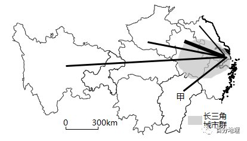   
   
1．长三角城市群流入人口主要来源于我国四大地区中的（  ）   
A．东部地区   
B．中部地区   
C．西部地区   
D．东北地区   
2．甲省人口流入长三角城市群主要考虑（  ）   
①工资水平②空间距离③土地价格④环境质量   
A．①②   
B．②③   
C．③④   
D．①④   
<span style="color: rgb(255, 0, 0);">1．B根据长三角城市群流入人口来源分布图可知，流入人口占比最高的是安徽省，属于中部地区，另外还有河南、江西省也属于中部地区，因此长三角城市群流入人口主要来源于我国中部地区，B正确；东部地区仅有江苏省有流入，但占比较低，A错误；西部地区有四川省流入，且人口占比较低，C错误；图中没有显示东北地区有人口流入，D错误。故选B。</span>   
<span style="color: rgb(255, 0, 0);">2．A甲省是江西省，经济相对落后，人口流入长三角城市群，是为了寻求更多的就业机会，更高的工资水平，①正确；江西省临近长三角地区，空间距离较近，有利于人口流入长三角城市群，②正确；当前经济因素是引起人口流动的主要因素，土地价格和环境质量对人口流动的影响较小，③④错误。综合起来，A正确，BCD错误。故选A。</span>   
（2022·江苏·高考真题）我国于2010年和2020年分别进行了第六次全国人口普查（“六普”）第七次全国人口普查（“七普”）。下图为“我国大陆31个省、自治区、直辖市‘六普’‘七普’，人口增长差异图”。据此完成下面小题。   
   
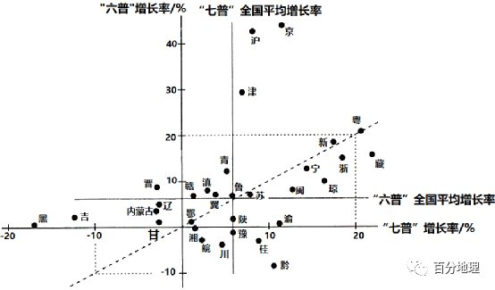   
   
3．“七普”与“六普”人口增长率相等的省级行政区是（  ）   
A．京、沪   
B．黑、吉   
C．粤、鄂   
D．渝、黔   
4．我国四个直辖市人口增长的共同特点是（  ）   
A．“六普”到“七普”期间，人口加速增长   
B．“六普”到“七普”期间，人口减速增长   
C．“六普”人口增长率高于全国平均增长率   
D．“七普”人口增长率高于全国平均增长率   
5．随着经济社会的发展，我国人口（  ）   
A．向城市群集聚   
B．向中西部迁移   
C．沿长江带集聚   
D．分布更加均衡   
<span style="color: rgb(255, 0, 0);">3．C根据图示信息可知，位于图中虚线上的粤、新、苏、鲁、鄂等五个省级行政区的“七普”与“六普”人口增长率相等，C正确；京、沪、黑、吉、渝、黔的“七普”与“六普”人口增长率不相等，ABD错误。所以选C。</span>   
<span style="color: rgb(255, 0, 0);">4．D根据图示信息可知，京、沪、津三地“七普”人口增长率低于“六普”人口增长率，“七普”与“六普”人口增长率都高于全国平均增长率；渝“七普”人口增长率高于“六普”人口增长率，“七普”高于全国平均增长率，“六普”低于全国平均人口增长率。综上所述，ABC错误，D正确。所以选D。</span>   
<span style="color: rgb(255, 0, 0);">5．A根据图示信息可知，我国主要城市群所在地的“七普”增长率高于全国平均水平，说明随着社会经济的发展，我国人口向经济发展水平更高，平均薪资水平更高的城市群集聚，A正确，D错误；中西部地区的“七普”增长率低于全国平均水平，B错误；没有体现向沿长江带集聚，C错误。所以选A。</span>   
（2022·全国·高考真题）中心城区通常为城市中人口最密集的区域。下表数据显示上海、北京、广州、深圳四城市2010年中心城区人口比重及2010～2020年中心城区和中心城区以外地区人口数量的变化。据此完成下面小题。   
<table cellspacing="0" cellpadding="0" width="577"><tbody><tr><td width="56" valign="middle" style="padding: 3.75pt 0pt;border-width: 1pt;border-color: rgb(0, 0, 0);"><section style="margin-top: 0pt;margin-bottom: 0pt;margin-left: 0pt;text-indent: 0pt;font-size: 10.5pt;font-family: &quot;Times New Roman&quot;;text-align: left;line-height: 2em;"><span style="font-family: 楷体;">城市</span></section></td><td width="84" valign="middle" style="padding: 3.75pt 0pt;border-width: 1pt;border-color: rgb(0, 0, 0);"><section style="margin-top: 0pt;margin-bottom: 0pt;margin-left: 0pt;text-indent: 0pt;font-size: 10.5pt;font-family: &quot;Times New Roman&quot;;text-align: left;line-height: 2em;"><span style="font-family: 楷体;">2010年中心城区人口比重/%</span></section></td><td width="106" valign="middle" style="padding: 3.75pt 0pt;border-width: 1pt;border-color: rgb(0, 0, 0);"><section style="margin-top: 0pt;margin-bottom: 0pt;margin-left: 0pt;text-indent: 0pt;font-size: 10.5pt;font-family: &quot;Times New Roman&quot;;text-align: left;line-height: 2em;"><span style="font-family: 楷体;">2010-2020年中心城区人口变化/万人</span></section></td><td width="135" valign="middle" style="padding: 3.75pt 0pt;border-width: 1pt;border-color: rgb(0, 0, 0);"><section style="margin-top: 0pt;margin-bottom: 0pt;margin-left: 0pt;text-indent: 0pt;font-size: 10.5pt;font-family: &quot;Times New Roman&quot;;text-align: left;line-height: 2em;"><span style="font-family: 楷体;">2010-2020年中心城区以外地区人口变化/万人</span></section></td></tr><tr><td width="56" valign="middle" style="padding: 3.75pt 0pt;border-width: 1pt;border-color: rgb(0, 0, 0);"><section style="margin-top: 0pt;margin-bottom: 0pt;margin-left: 0pt;text-indent: 0pt;font-size: 10.5pt;font-family: &quot;Times New Roman&quot;;text-align: left;line-height: 2em;"><span style="font-family: 楷体;">上海</span></section></td><td width="84" valign="middle" style="padding: 3.75pt 0pt;border-width: 1pt;border-color: rgb(0, 0, 0);"><section style="margin-top: 0pt;margin-bottom: 0pt;margin-left: 0pt;text-indent: 0pt;font-size: 10.5pt;font-family: &quot;Times New Roman&quot;;text-align: left;line-height: 2em;"><span style="font-family: 楷体;">30.3</span></section></td><td width="106" valign="middle" style="padding: 3.75pt 0pt;border-width: 1pt;border-color: rgb(0, 0, 0);"><section style="margin-top: 0pt;margin-bottom: 0pt;margin-left: 0pt;text-indent: 0pt;font-size: 10.5pt;font-family: &quot;Times New Roman&quot;;text-align: left;line-height: 2em;"><span style="font-family: 楷体;">-30.25</span></section></td><td width="135" valign="middle" style="padding: 3.75pt 0pt;border-width: 1pt;border-color: rgb(0, 0, 0);"><section style="margin-top: 0pt;margin-bottom: 0pt;margin-left: 0pt;text-indent: 0pt;font-size: 10.5pt;font-family: &quot;Times New Roman&quot;;text-align: left;line-height: 2em;"><span style="font-family: 楷体;">215.42</span></section></td></tr><tr><td width="56" valign="middle" style="padding: 3.75pt 0pt;border-width: 1pt;border-color: rgb(0, 0, 0);"><section style="margin-top: 0pt;margin-bottom: 0pt;margin-left: 0pt;text-indent: 0pt;font-size: 10.5pt;font-family: &quot;Times New Roman&quot;;text-align: left;line-height: 2em;"><span style="font-family: 楷体;">北京</span></section></td><td width="84" valign="middle" style="padding: 3.75pt 0pt;border-width: 1pt;border-color: rgb(0, 0, 0);"><section style="margin-top: 0pt;margin-bottom: 0pt;margin-left: 0pt;text-indent: 0pt;font-size: 10.5pt;font-family: &quot;Times New Roman&quot;;text-align: left;line-height: 2em;"><span style="font-family: 楷体;">59.7</span></section></td><td width="106" valign="middle" style="padding: 3.75pt 0pt;border-width: 1pt;border-color: rgb(0, 0, 0);"><section style="margin-top: 0pt;margin-bottom: 0pt;margin-left: 0pt;text-indent: 0pt;font-size: 10.5pt;font-family: &quot;Times New Roman&quot;;text-align: left;line-height: 2em;"><span style="font-family: 楷体;">-72.8</span></section></td><td width="135" valign="middle" style="padding: 3.75pt 0pt;border-width: 1pt;border-color: rgb(0, 0, 0);"><section style="margin-top: 0pt;margin-bottom: 0pt;margin-left: 0pt;text-indent: 0pt;font-size: 10.5pt;font-family: &quot;Times New Roman&quot;;text-align: left;line-height: 2em;"><span style="font-family: 楷体;">300.9</span></section></td></tr><tr><td width="56" valign="middle" style="padding: 3.75pt 0pt;border-width: 1pt;border-color: rgb(0, 0, 0);"><section style="margin-top: 0pt;margin-bottom: 0pt;margin-left: 0pt;text-indent: 0pt;font-size: 10.5pt;font-family: &quot;Times New Roman&quot;;text-align: left;line-height: 2em;"><span style="font-family: 楷体;">广州</span></section></td><td width="84" valign="middle" style="padding: 3.75pt 0pt;border-width: 1pt;border-color: rgb(0, 0, 0);"><section style="margin-top: 0pt;margin-bottom: 0pt;margin-left: 0pt;text-indent: 0pt;font-size: 10.5pt;font-family: &quot;Times New Roman&quot;;text-align: left;line-height: 2em;"><span style="font-family: 楷体;">39.7</span></section></td><td width="106" valign="middle" style="padding: 3.75pt 0pt;border-width: 1pt;border-color: rgb(0, 0, 0);"><section style="margin-top: 0pt;margin-bottom: 0pt;margin-left: 0pt;text-indent: 0pt;font-size: 10.5pt;font-family: &quot;Times New Roman&quot;;text-align: left;line-height: 2em;"><span style="font-family: 楷体;">129.12</span></section></td><td width="135" valign="middle" style="padding: 3.75pt 0pt;border-width: 1pt;border-color: rgb(0, 0, 0);"><section style="margin-top: 0pt;margin-bottom: 0pt;margin-left: 0pt;text-indent: 0pt;font-size: 10.5pt;font-family: &quot;Times New Roman&quot;;text-align: left;line-height: 2em;"><span style="font-family: 楷体;">468.46</span></section></td></tr><tr><td width="56" valign="middle" style="padding: 3.75pt 0pt;border-width: 1pt;border-color: rgb(0, 0, 0);"><section style="margin-top: 0pt;margin-bottom: 0pt;margin-left: 0pt;text-indent: 0pt;font-size: 10.5pt;font-family: &quot;Times New Roman&quot;;text-align: left;line-height: 2em;"><span style="font-family: 楷体;">深圳</span></section></td><td width="84" valign="middle" style="padding: 3.75pt 0pt;border-width: 1pt;border-color: rgb(0, 0, 0);"><section style="margin-top: 0pt;margin-bottom: 0pt;margin-left: 0pt;text-indent: 0pt;font-size: 10.5pt;font-family: &quot;Times New Roman&quot;;text-align: left;line-height: 2em;"><span style="font-family: 楷体;">34.0</span></section></td><td width="106" valign="middle" style="padding: 3.75pt 0pt;border-width: 1pt;border-color: rgb(0, 0, 0);"><section style="margin-top: 0pt;margin-bottom: 0pt;margin-left: 0pt;text-indent: 0pt;font-size: 10.5pt;font-family: &quot;Times New Roman&quot;;text-align: left;line-height: 2em;"><span style="font-family: 楷体;">116.88</span></section></td><td width="135" valign="middle" style="padding: 3.75pt 0pt;border-width: 1pt;border-color: rgb(0, 0, 0);"><section style="margin-top: 0pt;margin-bottom: 0pt;margin-left: 0pt;text-indent: 0pt;font-size: 10.5pt;font-family: &quot;Times New Roman&quot;;text-align: left;line-height: 2em;"><span style="font-family: 楷体;">596.73</span></section></td></tr></tbody></table>

   
6．2010～2020年四城市人口变化的共同特点是（  ）A．总人口增加,中心城区人口比重下降   
B．总人口减少,中心城区人口比重上升   
C．总人口增加,中心城区人口比重上升   
D．总人口减少,中心城区人口比重下降   
7．与四城市人口变化共同特点类似的中国其他城市,一般具有（  ）   
A．相似的空间形态   
B．趋同的主导产业   
C．一致的功能定位   
D．相近的等级规模   
8．根据四城市人口变化特点,城市规划应该引导（  ）   
A．人口向中心城区再集聚   
B．人口在中心城区以外地区集聚   
C．中心城区核心功能疏解   
D．人口在中心城区以外地区均衡布局   
<span style="color: rgb(255, 0, 0);">6．A根据表中中心城区和中心城区以外地区人口数量的变化数据可知上海人口净增加184.17万人，北京净增加228.1万人，广州净增加597.58万人，深圳净增加713.66万人，所以四城市总人口都是净增加的。上海、北京中心城区人口数量减少，中心城区以外地区人口数量增加，故上海、北京中心城区人口比重减少，广州、深圳中心城区和中心城区以外地区人口数量虽然都增加，但中心城区以外地区人口数量增加的远大于中心城区人口的增加量，故广州、深圳中心城区人口比重也在减少。故A正确，BCD错误。故答案选A。</span>   
<span style="color: rgb(255, 0, 0);">7．D人口规模是衡量城市规模大小的重要指标，一般城市规模越大等级越高。反之城市规模大小也反映着人口规模的变化，故D正确；城市的形态、功能与城市人口变化没有多大关系，故AC错误；产业类型与人口变化关系不大，而产业规模的大小与人口变化有相关性，故B错。故答案选D。</span>   
<span style="color: rgb(255, 0, 0);">8．B由1 题可知四城市总人口都在增加，而结合所学知识，四城市经济发达，人口增加大都来源于人口的迁移，外来人口向中心城区再集聚会加大中心城区环境、交通、住房、社会管理的压力，所以城市规划应该引导外来人口在中心城区以外地区集聚，减轻城市中心环境、交通、住房、社会管理的压力，故A错B正确；中心城区核心功能的疏解，会改变城市的职能与功能，故C错；中心城区以外地区有不同的功能区，人口均衡布局可能影响中心城区以外的功能区布局，故D错。故答案选B。</span>   
（2021·江苏·高考真题）随着乡村振兴战略的有效实施，我国乡村聚落空间分布发生了明显变化。图为“江南丘陵某区域四种乡村聚落空间演化模式示意图”。据此完成下面小题。   
   
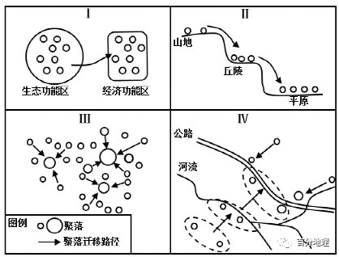   
   
9．模式I中乡村聚落迁移的主要目的是（  ）   
A．增强功能区竞争力   
B．保护环境敏感区域   
C．促进劳动力就业   
D．提高城镇化水平   
10．反映乡村聚落空间演化过程从受自然要素影响转向受经济社会要素影响的模式是（  ）   
A．I   
B．II   
C．III   
D．IV   
11．在我国重大战略实施的背景下，乡村聚落空间演化的总趋势是（  ）   
A．集聚扩大   
B．原地保护   
C．均衡布局   
D．分散迁移   
<span style="color: rgb(255, 0, 0);">9．B据图模式I中乡村聚落迁移的方向为从生态功能区向经济功能区迁移，可知其主要目的是保护环境敏感区域，在乡村振兴背景下，绿水青山就是金山银山，所以要将生态功能区的聚落迁移到经济功能区，B正确；增强功能区竞争力应该采取完善当地基础设施、优化产业布局、完善交通网等措施，单纯的聚落迁移无法增强功能区竞争力，A错误；乡村聚落从生态功能区迁移到经济功能区是所有人群的迁移，促进劳动力就业说法有些片面，C错误；评价城镇化水平的一个重要指标就是城镇人口占总人口的比重，据模式I图无法判断城镇化水平的变化，D错误。</span>   
<span style="color: rgb(255, 0, 0);">10．D图IV中，聚落从靠近河流向靠近公路迁移，可反映乡村聚落空间演化过程从受自然要素影响转向受经济社会要素影响，D项正确；A项只是单纯的从生态功能区迁移至经济功能区无法看出乡村聚落空间演化过程从受自然要素影响转向受经济社会要素影响转变，A错误；B项只是乡村聚落从山地迁移至丘陵然后又迁移至平原，只体现了受自然要素的影响，B错误；C项小的乡村聚落向规模大的乡村聚落迁移，与题意不符，C项错误，本题选D。</span>   
<span style="color: rgb(255, 0, 0);">11．A我国实行乡村振兴战略，结合所学可知乡村聚落未来发展呈现三大趋势：1.城乡结合趋势；2.土地规模化经营趋势；3.空心村撤并的趋势，故可以判断乡村聚落空间演化的总趋势是集聚扩大，从而提高乡村聚落的基础设施水平以及改善人们的生产生活条件，A项正确；有些乡村聚落分布在偏远地区，气候条件恶劣、生存环境艰苦，不适合原地保护，B错误；乡村聚落数量多，空间分布不均，均衡布局显然不可能，C错误；乡村聚落一般规模不大，分散迁移不太实际且没有必要，D项错误，本题选A。</span>   
（2021·江苏·高考真题）我国城镇化快速发展，许多省区人口流入北京、上海和广州等城市。下图为“某年我国三大城市外来人口占比位列前十的省区分布示意图”。据此完成下面小题。   
   
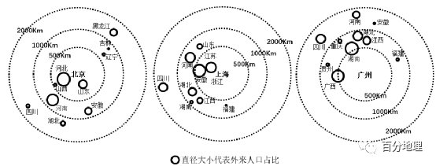   
   
12．同为长三角地区的江苏、浙江和安徽三省，迁移至上海人口相差较大，其主导因素是（  ）   
A．对外交通条件   
B．文化交流习惯   
C．经济活动方式   
D．人口迁移政策   
13．从全国看，三大城市的外来人口省区分布具有明显的（  ）   
A．地域性   
B．等距性   
C．均衡性   
D．同向性   
14．据第七次人口普查数据，北京外来人口增幅下降，其主要原因是北京（  ）   
A．政府机构外迁   
B．城市规模扩大   
C．首都功能优化   
D．公共服务升级   
<span style="color: rgb(255, 0, 0);">12．C据图可知，同为长三角的安徽、江苏流入上海人数较多，浙江流入上海人数较少。分析其形成原因，三个省份对外交通条件都很优越；都位于华东地区，文化习惯差异不大；人口迁移政策主要由国家统一指导，各省份差异较小，ABD错误；浙江省大力发展小商品经济和网络营销，需要大量劳动力，大量吸引了其他地区人口流入的同时，也稳定了本省份人口的流出，导致浙江省流入上海市的人口比较少，C正确。故选C。</span>   
<span style="color: rgb(255, 0, 0);">13．A从全国看，三大城市外来人口省区分布，主要来自地域邻近的经济欠发达的人口大省，北京、上海、广州都有各自外来人口主要流入省份，所以具有地域性，A正确；由图可知，主要外来人口省区与流入城市的距离并不完全相等，B错误；外来人口省区和来源方向有明显的差异，北京外来人口主要来自其西部和南部的省份，少量来自东北，上海外来人口主要来自其西部地区的省份，广州外来人口主要来自其西部和北部的省区，故不具有均衡性和同向性，CD错误，故选A。</span>   
<span style="color: rgb(255, 0, 0);">14．C近年来，京津冀在推进一体化发展，北京疏解非首都职能，将非首都职能包括工业等大量吸引外来人口的产业向外转移，外来务工人口减少，导致北京外来人口增幅下降，C正确；因国务院定位的北京为全国政治中心，政府机构不会外迁，A错误；城市规模扩大、公共服务升级，使城市服务更完善，会吸引外来人口，使北京外来人口增幅上升，BD错误。故选C。</span>   
15．（2021·天津·高考真题）随着产业结构调整，我国农民工输入地的地区分布正在悄然变化。读图文材料，完成下面小题。   
   
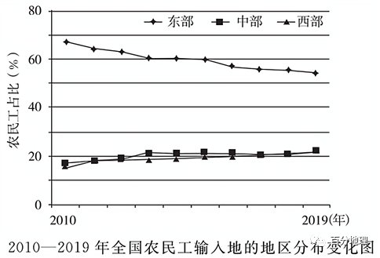   
   
分析我国农民工流动的特点，并推断其原因是（  ）   
A．向中西部地区流动比例上升，劳动密集型产业向中西部转移   
B．向东部地区流动的比例上升，东部地区的高新产业发展迅速   
C．向中部地区流动的比例上升，中部地区生态环境根本性改善   
D．向西部地区流动的比例上升，西部地区农业生产的效率提高   
<span style="color: rgb(255, 0, 0);">15.A本题主要考查影响人口迁移的因素。读图可知，我国中西部地区农民工流动比例上升，原因可能是东部地区的劳动密集型产业向中西部转移，使其就业岗位增加，故A项正确；我国农民工向东部地区流动的比例下降，故B项错误；我国农民工向西部地区流动的比例上升与西部地区农业生产的效率提高关系较小，故D项错误；生态环境根本性改善的表述过于绝对，故C项错误。故选A。</span>   
（2021·山东·高考真题）下图示意我国某地级市2007～2019年户籍人口和常住人口的变化情况。读图完成下面小题。   
   
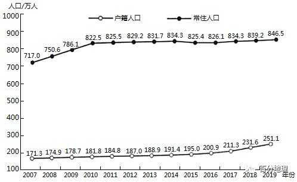   
   
16．推测该市2016～2019年户籍人口变化的主要原因是（  ）   
A．生育政策调整   
B．落户政策放宽   
C．医疗条件改善   
D．行政区划变动   
17．2010年后，该市常住人口变化缓慢，主要是由于当地（  ）   
A．人口老龄化加剧   
B．GDP增长缓慢   
C．环境承载力下降   
D．产业结构优化   
18．该市的支柱产业是（  ）   
A．采矿业   
B．旅游业   
C．制造业   
D．物流业   
<span style="color: rgb(255, 0, 0);">16．B根据图片信息，2016-2019年户籍人口增长比常住人口快，如果是生育政策改变，常住人口基数大，增长应该比户籍人口快，A项错误。故应该是当地落户政策放宽，使得户籍人口增长速度高于常住人口，B项正确。医疗条件的改善以及行政区划的变动对户籍人口和常住人口的影响是相同的，两者人口增长的速度不会存在较大差异，CD项错误。故选B。</span>   
<span style="color: rgb(255, 0, 0);">17．D 2010年后，该市常住人口变化缓慢，而之前一段时间，该市常住人口增长迅速，所以该市应该是产业结构发生了改变，得到了优化，对劳动力的需求不再那么强烈，D项正确。人口老龄化对户籍人口同样有影响，并且会使得该市劳动力短缺，常住人口增长迅速，A项错误。GDP增长缓慢以及环境承载力下降会使得当地失去对外来劳动力的吸引力，常住人口可能有所下降，BC项错误。故选D。</span>   
<span style="color: rgb(255, 0, 0);">18．C该市的常住人口远大于户籍人口，说明该市是劳动力密集型产业，需要大量劳动力，并且经济较为发达，故应该为制造业，C项正确，ABD项错误。故选C。</span>   
（2021·湖南·高考真题）永久迁移是指户籍发生改变的人口迁移类型；务工迁移是指离开户籍地外出务工的人口迁移类型（不包括永久迁移）。下图示意1990——2005年我国人口迁移的数量变化。图中永久迁移人数为每五年的累积数量，务工迁移人数为当年的数量。据此完成下面小题。   
   
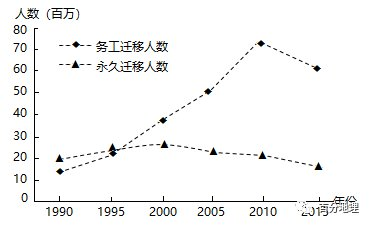   
   
19．下列叙述正确的是（  ）   
A．1990——2015年的永久迁移人数持续增加   
B．2000年以后，永久迁移的累积人数下降   
C．1990——2015年的务工迁移人数呈下降趋势   
D．1990——1995年的务工迁移人数增速比2005——2010年的慢   
20．2010年后务工迁移人数明显下降的主要原因是（  ）   
①“三农”政策利好   
②出生人口数量减少   
③2008年国际金融危机影响   
④第二、三产业产值比重降低   
A．①②   
B．①③   
C．②④   
D．③④   
<span style="color: rgb(255, 0, 0);">19．D根据图片信息，1990——2015年的永久迁移人数先上升后下降，A项错误。2000年以后，永久迁移的累积人数一直在上升，B项错误。1990——2015年的务工迁移人数先上升后下降，C项错误。1990——1995年的务工迁移人数增速比2005——2010年的慢，D项正确。故选D。</span>   
<span style="color: rgb(255, 0, 0);">20．B根据题意，2010年后务工迁移人数明显下降，是因为国家“三农”政策利好，外出务工人数开始减少，①正确。出生人口变化并不会迅速影响到外出务工人数，②错误。2008年国际金融危机影响，部分产业受到影响，外出务工人数开始有所下降，③正确。第二、三产业产值比重应该是有所上升的，尤其是我国的第三产业产值比重应该是持续上涨，④错误。B项正确，ACD项错误。故选B。</span>   
（2022·河南安阳·模拟预测）下图为2020年河南省部分地区常住人口年龄结构，该年河南省常住人口为9936.55万。据此完成下面小题。   
<table cellspacing="0" cellpadding="0" width="577"><tbody><tr><td width="175" colspan="2" valign="middle" style="padding: 3.75pt 0pt;border-width: 1pt;border-color: rgb(0, 0, 0);"><section style="margin-top: 0pt;margin-bottom: 0pt;margin-left: 0pt;text-indent: 0pt;font-size: 10.5pt;font-family: &quot;Times New Roman&quot;;text-align: left;line-height: 2em;"><span style="font-family: 宋体;">人口年龄结构</span></section></td><td width="52" valign="middle" style="padding: 3.75pt 0pt;border-width: 1pt;border-color: rgb(0, 0, 0);"><section style="margin-top: 0pt;margin-bottom: 0pt;margin-left: 0pt;text-indent: 0pt;font-size: 10.5pt;font-family: &quot;Times New Roman&quot;;text-align: left;line-height: 2em;"><span style="font-family: 宋体;">全省</span></section></td><td width="52" valign="middle" style="padding: 3.75pt 0pt;border-width: 1pt;border-color: rgb(0, 0, 0);"><section style="margin-top: 0pt;margin-bottom: 0pt;margin-left: 0pt;text-indent: 0pt;font-size: 10.5pt;font-family: &quot;Times New Roman&quot;;text-align: left;line-height: 2em;"><span style="font-family: 宋体;">郑州</span></section></td><td width="52" valign="middle" style="padding: 3.75pt 0pt;border-width: 1pt;border-color: rgb(0, 0, 0);"><section style="margin-top: 0pt;margin-bottom: 0pt;margin-left: 0pt;text-indent: 0pt;font-size: 10.5pt;font-family: &quot;Times New Roman&quot;;text-align: left;line-height: 2em;"><span style="font-family: 宋体;">洛阳</span></section></td><td width="57" valign="middle" style="padding: 3.75pt 0pt;border-width: 1pt;border-color: rgb(0, 0, 0);"><section style="margin-top: 0pt;margin-bottom: 0pt;margin-left: 0pt;text-indent: 0pt;font-size: 10.5pt;font-family: &quot;Times New Roman&quot;;text-align: left;line-height: 2em;"><span style="font-family: 宋体;">平顶山</span></section></td><td width="59" valign="middle" style="padding: 3.75pt 0pt;border-width: 1pt;border-color: rgb(0, 0, 0);"><section style="margin-top: 0pt;margin-bottom: 0pt;margin-left: 0pt;text-indent: 0pt;font-size: 10.5pt;font-family: &quot;Times New Roman&quot;;text-align: left;line-height: 2em;"><span style="font-family: 宋体;">焦作</span></section></td><td width="52" valign="middle" style="padding: 3.75pt 0pt;border-width: 1pt;border-color: rgb(0, 0, 0);"><section style="margin-top: 0pt;margin-bottom: 0pt;margin-left: 0pt;text-indent: 0pt;font-size: 10.5pt;font-family: &quot;Times New Roman&quot;;text-align: left;line-height: 2em;"><span style="font-family: 宋体;">周口</span></section></td><td width="52" valign="middle" style="padding: 3.75pt 0pt;border-width: 1pt;border-color: rgb(0, 0, 0);"><section style="margin-top: 0pt;margin-bottom: 0pt;margin-left: 0pt;text-indent: 0pt;font-size: 10.5pt;font-family: &quot;Times New Roman&quot;;text-align: left;line-height: 2em;"><span style="font-family: 宋体;">南阳</span></section></td></tr><tr><td width="175" colspan="2" valign="middle" style="padding: 3.75pt 0pt;border-width: 1pt;border-color: rgb(0, 0, 0);"><section style="margin-top: 0pt;margin-bottom: 0pt;margin-left: 0pt;text-indent: 0pt;font-size: 10.5pt;font-family: &quot;Times New Roman&quot;;text-align: left;line-height: 2em;">0——14岁</section></td><td width="52" valign="middle" style="padding: 3.75pt 0pt;border-width: 1pt;border-color: rgb(0, 0, 0);"><section style="margin-top: 0pt;margin-bottom: 0pt;margin-left: 0pt;text-indent: 0pt;font-size: 10.5pt;font-family: &quot;Times New Roman&quot;;text-align: left;line-height: 2em;">23.1%</section></td><td width="52" valign="middle" style="padding: 3.75pt 0pt;border-width: 1pt;border-color: rgb(0, 0, 0);"><section style="margin-top: 0pt;margin-bottom: 0pt;margin-left: 0pt;text-indent: 0pt;font-size: 10.5pt;font-family: &quot;Times New Roman&quot;;text-align: left;line-height: 2em;">19.1%</section></td><td width="52" valign="middle" style="padding: 3.75pt 0pt;border-width: 1pt;border-color: rgb(0, 0, 0);"><section style="margin-top: 0pt;margin-bottom: 0pt;margin-left: 0pt;text-indent: 0pt;font-size: 10.5pt;font-family: &quot;Times New Roman&quot;;text-align: left;line-height: 2em;">20.9%</section></td><td width="57" valign="middle" style="padding: 3.75pt 0pt;border-width: 1pt;border-color: rgb(0, 0, 0);"><section style="margin-top: 0pt;margin-bottom: 0pt;margin-left: 0pt;text-indent: 0pt;font-size: 10.5pt;font-family: &quot;Times New Roman&quot;;text-align: left;line-height: 2em;">24.8%</section></td><td width="59" valign="middle" style="padding: 3.75pt 0pt;border-width: 1pt;border-color: rgb(0, 0, 0);"><section style="margin-top: 0pt;margin-bottom: 0pt;margin-left: 0pt;text-indent: 0pt;font-size: 10.5pt;font-family: &quot;Times New Roman&quot;;text-align: left;line-height: 2em;">18.7%</section></td><td width="52" valign="middle" style="padding: 3.75pt 0pt;border-width: 1pt;border-color: rgb(0, 0, 0);"><section style="margin-top: 0pt;margin-bottom: 0pt;margin-left: 0pt;text-indent: 0pt;font-size: 10.5pt;font-family: &quot;Times New Roman&quot;;text-align: left;line-height: 2em;">24.9%</section></td><td width="52" valign="middle" style="padding: 3.75pt 0pt;border-width: 1pt;border-color: rgb(0, 0, 0);"><section style="margin-top: 0pt;margin-bottom: 0pt;margin-left: 0pt;text-indent: 0pt;font-size: 10.5pt;font-family: &quot;Times New Roman&quot;;text-align: left;line-height: 2em;">26.2%</section></td></tr><tr><td width="175" colspan="2" valign="middle" style="padding: 3.75pt 0pt;border-width: 1pt;border-color: rgb(0, 0, 0);"><section style="margin-top: 0pt;margin-bottom: 0pt;margin-left: 0pt;text-indent: 0pt;font-size: 10.5pt;font-family: &quot;Times New Roman&quot;;text-align: left;line-height: 2em;">15-60岁</section></td><td width="52" valign="middle" style="padding: 3.75pt 0pt;border-width: 1pt;border-color: rgb(0, 0, 0);"><section style="margin-top: 0pt;margin-bottom: 0pt;margin-left: 0pt;text-indent: 0pt;font-size: 10.5pt;font-family: &quot;Times New Roman&quot;;text-align: left;line-height: 2em;">58.8%</section></td><td width="52" valign="middle" style="padding: 3.75pt 0pt;border-width: 1pt;border-color: rgb(0, 0, 0);"><section style="margin-top: 0pt;margin-bottom: 0pt;margin-left: 0pt;text-indent: 0pt;font-size: 10.5pt;font-family: &quot;Times New Roman&quot;;text-align: left;line-height: 2em;">68.1%</section></td><td width="52" valign="middle" style="padding: 3.75pt 0pt;border-width: 1pt;border-color: rgb(0, 0, 0);"><section style="margin-top: 0pt;margin-bottom: 0pt;margin-left: 0pt;text-indent: 0pt;font-size: 10.5pt;font-family: &quot;Times New Roman&quot;;text-align: left;line-height: 2em;">60.8%</section></td><td width="57" valign="middle" style="padding: 3.75pt 0pt;border-width: 1pt;border-color: rgb(0, 0, 0);"><section style="margin-top: 0pt;margin-bottom: 0pt;margin-left: 0pt;text-indent: 0pt;font-size: 10.5pt;font-family: &quot;Times New Roman&quot;;text-align: left;line-height: 2em;">56.9%</section></td><td width="59" valign="middle" style="padding: 3.75pt 0pt;border-width: 1pt;border-color: rgb(0, 0, 0);"><section style="margin-top: 0pt;margin-bottom: 0pt;margin-left: 0pt;text-indent: 0pt;font-size: 10.5pt;font-family: &quot;Times New Roman&quot;;text-align: left;line-height: 2em;">62.49%</section></td><td width="52" valign="middle" style="padding: 3.75pt 0pt;border-width: 1pt;border-color: rgb(0, 0, 0);"><section style="margin-top: 0pt;margin-bottom: 0pt;margin-left: 0pt;text-indent: 0pt;font-size: 10.5pt;font-family: &quot;Times New Roman&quot;;text-align: left;line-height: 2em;">55.3%</section></td><td width="52" valign="middle" style="padding: 3.75pt 0pt;border-width: 1pt;border-color: rgb(0, 0, 0);"><section style="margin-top: 0pt;margin-bottom: 0pt;margin-left: 0pt;text-indent: 0pt;font-size: 10.5pt;font-family: &quot;Times New Roman&quot;;text-align: left;line-height: 2em;">55.0%</section></td></tr><tr><td width="80" rowspan="2" valign="middle" style="padding: 3.75pt 0pt;border-width: 1pt;border-color: rgb(0, 0, 0);"><section style="margin-top: 0pt;margin-bottom: 0pt;margin-left: 0pt;text-indent: 0pt;font-size: 10.5pt;font-family: &quot;Times New Roman&quot;;text-align: left;line-height: 2em;">60岁及以上</section></td><td width="95" valign="middle" style="padding: 3.75pt 0pt;border-width: 1pt;border-color: rgb(0, 0, 0);"><section style="margin-top: 0pt;margin-bottom: 0pt;margin-left: 0pt;text-indent: 0pt;font-size: 10.5pt;font-family: &quot;Times New Roman&quot;;text-align: left;line-height: 2em;">60岁及以上</section></td><td width="52" valign="middle" style="padding: 3.75pt 0pt;border-width: 1pt;border-color: rgb(0, 0, 0);"><section style="margin-top: 0pt;margin-bottom: 0pt;margin-left: 0pt;text-indent: 0pt;font-size: 10.5pt;font-family: &quot;Times New Roman&quot;;text-align: left;line-height: 2em;">18.1%</section></td><td width="52" valign="middle" style="padding: 3.75pt 0pt;border-width: 1pt;border-color: rgb(0, 0, 0);"><section style="margin-top: 0pt;margin-bottom: 0pt;margin-left: 0pt;text-indent: 0pt;font-size: 10.5pt;font-family: &quot;Times New Roman&quot;;text-align: left;line-height: 2em;">12.8%</section></td><td width="52" valign="middle" style="padding: 3.75pt 0pt;border-width: 1pt;border-color: rgb(0, 0, 0);"><section style="margin-top: 0pt;margin-bottom: 0pt;margin-left: 0pt;text-indent: 0pt;font-size: 10.5pt;font-family: &quot;Times New Roman&quot;;text-align: left;line-height: 2em;">18.3%</section></td><td width="57" valign="middle" style="padding: 3.75pt 0pt;border-width: 1pt;border-color: rgb(0, 0, 0);"><section style="margin-top: 0pt;margin-bottom: 0pt;margin-left: 0pt;text-indent: 0pt;font-size: 10.5pt;font-family: &quot;Times New Roman&quot;;text-align: left;line-height: 2em;">18.3%</section></td><td width="59" valign="middle" style="padding: 3.75pt 0pt;border-width: 1pt;border-color: rgb(0, 0, 0);"><section style="margin-top: 0pt;margin-bottom: 0pt;margin-left: 0pt;text-indent: 0pt;font-size: 10.5pt;font-family: &quot;Times New Roman&quot;;text-align: left;line-height: 2em;">18.9%</section></td><td width="52" valign="middle" style="padding: 3.75pt 0pt;border-width: 1pt;border-color: rgb(0, 0, 0);"><section style="margin-top: 0pt;margin-bottom: 0pt;margin-left: 0pt;text-indent: 0pt;font-size: 10.5pt;font-family: &quot;Times New Roman&quot;;text-align: left;line-height: 2em;">19.8%</section></td><td width="52" valign="middle" style="padding: 3.75pt 0pt;border-width: 1pt;border-color: rgb(0, 0, 0);"><section style="margin-top: 0pt;margin-bottom: 0pt;margin-left: 0pt;text-indent: 0pt;font-size: 10.5pt;font-family: &quot;Times New Roman&quot;;text-align: left;line-height: 2em;">18.8%</section></td></tr><tr><td width="95" valign="middle" style="padding: 3.75pt 0pt;border-width: 1pt;border-color: rgb(0, 0, 0);"><section style="margin-top: 0pt;margin-bottom: 0pt;margin-left: 0pt;text-indent: 0pt;font-size: 10.5pt;font-family: &quot;Times New Roman&quot;;text-align: left;line-height: 2em;"><span style="font-family: 宋体;">其中65岁以上</span></section></td><td width="52" valign="middle" style="padding: 3.75pt 0pt;border-width: 1pt;border-color: rgb(0, 0, 0);"><section style="margin-top: 0pt;margin-bottom: 0pt;margin-left: 0pt;text-indent: 0pt;font-size: 10.5pt;font-family: &quot;Times New Roman&quot;;text-align: left;line-height: 2em;">13.5%</section></td><td width="52" valign="middle" style="padding: 3.75pt 0pt;border-width: 1pt;border-color: rgb(0, 0, 0);"><section style="margin-top: 0pt;margin-bottom: 0pt;margin-left: 0pt;text-indent: 0pt;font-size: 10.5pt;font-family: &quot;Times New Roman&quot;;text-align: left;line-height: 2em;">9.0%</section></td><td width="52" valign="middle" style="padding: 3.75pt 0pt;border-width: 1pt;border-color: rgb(0, 0, 0);"><section style="margin-top: 0pt;margin-bottom: 0pt;margin-left: 0pt;text-indent: 0pt;font-size: 10.5pt;font-family: &quot;Times New Roman&quot;;text-align: left;line-height: 2em;">13.0%</section></td><td width="57" valign="middle" style="padding: 3.75pt 0pt;border-width: 1pt;border-color: rgb(0, 0, 0);"><section style="margin-top: 0pt;margin-bottom: 0pt;margin-left: 0pt;text-indent: 0pt;font-size: 10.5pt;font-family: &quot;Times New Roman&quot;;text-align: left;line-height: 2em;">13.5%</section></td><td width="59" valign="middle" style="padding: 3.75pt 0pt;border-width: 1pt;border-color: rgb(0, 0, 0);"><section style="margin-top: 0pt;margin-bottom: 0pt;margin-left: 0pt;text-indent: 0pt;font-size: 10.5pt;font-family: &quot;Times New Roman&quot;;text-align: left;line-height: 2em;">13.3%</section></td><td width="52" valign="middle" style="padding: 3.75pt 0pt;border-width: 1pt;border-color: rgb(0, 0, 0);"><section style="margin-top: 0pt;margin-bottom: 0pt;margin-left: 0pt;text-indent: 0pt;font-size: 10.5pt;font-family: &quot;Times New Roman&quot;;text-align: left;line-height: 2em;">15.2%</section></td><td width="52" valign="middle" style="padding: 3.75pt 0pt;border-width: 1pt;border-color: rgb(0, 0, 0);"><section style="margin-top: 0pt;margin-bottom: 0pt;margin-left: 0pt;text-indent: 0pt;font-size: 10.5pt;font-family: &quot;Times New Roman&quot;;text-align: left;line-height: 2em;">14.2%</section></td></tr></tbody></table>

21．2020年河南省（  ）   
A．劳动人口红利消失   
B．人口老龄化严重   
C．社会养老负担较轻   
D．人口年龄结构地区差异小   
22．郑州市65岁以上人口比重较省内其他地市低，主要是因为郑州市（  ）   
A．青壮年人口迁入多   
B．人口自然增长率最高   
C．老龄人口死亡率高   
D．养老服务体系不完善   
<span style="color: rgb(255, 0, 0);">21．B由2020年河南省部分地区常住人口年龄结构表可知，该年河南省15-60岁劳动力人口占比58.8%，劳动年龄人口占总人口比重较大，劳动人口红利并未消失，A错误。65岁以上人口占比13.5%，人口老龄化严重，社会养老负担较重，B正确，C错误。从表中河南省各地区数据看，人口年龄结构地区差异较大，D错误。故选B。</span>   
<span style="color: rgb(255, 0, 0);">22．A郑州作为河南省省会城市经济、政策、医疗、卫生、教育等各方面都优越于其他地区，养老服务体系完善，吸引大量青壮年劳动力迁入，A正确，D错误。因郑州医疗卫生条件好，养老服体系完善，老龄人口死亡率低，C错误。从表中数据可知郑州人口自然增长率并不是最高的，B错误。故选A。</span>   
（2022·江苏·模拟预测）20世纪80年代后出生的新生代已成为我国流动人口的主力军，并且新、老两代流动人口已呈现出明显的代际分化。图为新、老两代流动人口城市居留时间与子女随迁概率统计图。据此回答下面小题。   
   
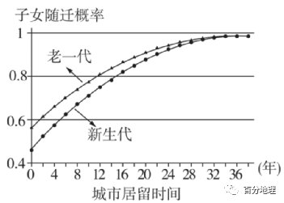   
   
23．影响新、老两代流动人口迁移的共同因素是（  ）   
A．自然条件   
B．经济   
C．子女教育   
D．文化   
24．总体上新生代流动人口较老一代流动人口（  ）   
A．子女随迁概率高   
B．子女随迁概率低   
C．子女中留守儿童数量更多   
D．子女中留守儿童数量更少   
<span style="color: rgb(255, 0, 0);">23．B影响人口迁移的主要因素为经济，因此影响新生代和老一代人口迁移的共同因素为经济。故选B。</span>   
<span style="color: rgb(255, 0, 0);">24．B据图可知，新生代流动人口的子女随迁概率整体上低于老一代流动人口的子女随迁概率，故B正确，A错误。新生代流动人口的子女随迁概率相对较低，留守儿童数量的变化要看儿童基数，因此C、D从材料中无法判断，CD错误。故选B。</span>   
（2022·甘肃·武威十八中模拟预测）我国流动人口规模达2.47亿人，占总人口的18%，相当于每六个人中有一个是流动人口。未来一二十年，我国仍处于城镇化快速发展阶段，“十三五”时期，超大城市和特大城市人口继续增长，中部和西部地区省内流动农民工比重明显增加。据此，完成下面小题。   
25．我国流动人口长期保持较大规模的关键因素是（  ）   
A．经济结构   
B．产业规模   
C．落户政策   
D．区域差异   
26．人口由小城镇向大城市和超大城市流动产生的影响有（  ）   
A．带动大城市相关产业发展   
B．提高小城镇城市化水平   
C．减轻大城市生态环境压力   
D．明显扩大城乡收入差距   
27．中、西部地区的省内流动农民工明显增加，反映出（  ）   
A．劳动密集型产业规模日益缩小   
B．农业所创造的就业岗位逐年增多   
C．区域经济发展水平差异日趋缩小   
D．乡村的基础设施日渐完善   
<span style="color: rgb(255, 0, 0);">25．D我国东西自然环境差异较大，经济差异较大，东部经济发达，就业机会多，西部人口增长快，剩余劳动力多，东部吸引西部劳动力迁入，导致人口流动规模大，D正确。经济结构、产业规模、落户政策虽然是影响人口流动的因素但不是关键因素，ABC错误。故答案选D。</span>   
<span style="color: rgb(255, 0, 0);">26．A人口由小城镇向大城市和超大城市流动，会造成大城市和超大城市人口增加，会带动相关产业发展，如服务业，A正确。会降低小城镇城市化水平，B错误。人口增多，会增加大城市生态环境压力，C错误。流动人口收入增加，会缩小城乡收入差距，D错误。故答案选A。</span>   
<span style="color: rgb(255, 0, 0);">27．C人口流动增加，劳动密集型产业规模日益扩大，就业机会多，A错误。农业产值比重可能下降，所创造的就业岗位不会逐年增多，B错误。中、西部地区的省内流动农民工明显增加，说明迁移到东部的减少，中西部地区应该经济发展较快，就业机会增加，区域经济发展水平差异日趋缩小，C正确。乡村的基础设施日渐完善对人口迁移影响不大，D错误。故答案选C。</span>   
（2022·山东省莱西市第一中学模拟预测）“虹吸效应”是指区域的中心城市吸收了周边城市的各种资源，随着资源的聚集，中心城市的吸引力会越来越强，周边城市的人才会逐渐流失的现象。“外溢效应”是指中心城市受政策影响以及过度聚集的拥挤导致其技术、人才、产业、资金等向外围地区迁移，从而促使外围城市的经济发展的现象。下图为广东省2012-2017年户籍人口逐年净迁移人数（万人）变化曲线图，据此完成下面小题。   
   
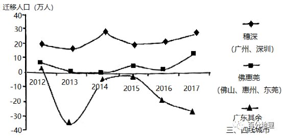   
   
28．上图反映出人口迁移的变化是（  ）   
A．穗深人口迁入2013年达最大值   
B．三四线城市人口净迁出2013年达最大值   
C．佛惠莞年人口迁入数持续上升   
D．2015-2016年佛惠莞人口变化幅度最大   
29．广州、深圳的“虹吸和外溢效应”引起的人口迁移，其带来的影响是（  ）   
A．加快城市职能转变   
B．加重城市社会负担   
C．导致城市发展停滞   
D．促进城市协同发展   
<span style="color: rgb(255, 0, 0);">28．B读图可知：上图反映出人口迁移的变化是三四线城市人口净迁出2013年达最大值，B正确。穗深人口迁入2014年达最大值，A错。佛惠莞年人口迁入数波动上升，C错。2016-2017年佛惠莞人口变化幅度最大，D错。故选B。</span>   
<span style="color: rgb(255, 0, 0);">29．D广州、深圳的“虹吸和外溢效应”引起的人口迁移，其带来的影响是技术、人才、产业、资金相互的交流和调配，促进城市协同发展，D正确。跟城市职能转变无关、不会加重城市社会负担、会促进城市发展，ABC错，故选D。</span>   
（2022·山东师范大学附中模拟预测）“积分入户”指外来人口取得政策规定分值后即可申请落户，是迁入地促进外来人口融入的有效方式，东莞市于2010年推出“积分入户”政策。下图为2010～2015年东莞市积分入户和外来人口的数量变化图。   
据此完成下面小题。   
   
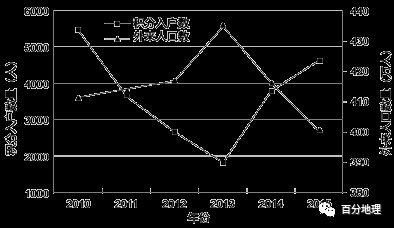   
   
30．该地2013年后外来人口数量变化的主要原因是   
A．产业转型升级   
B．环境质量下降   
C．交通拥堵加重   
D．生活成本上升   
31．图示时段内，该地“积分入户”人数波动的主要原因是   
A．外来人口增加   
B．经济增速变化   
C．入户政策调整   
D．居住条件变化   
32．“积分入户”政策给当地带来的主要影响最可能是   
A．拓展城市空间范围   
B．加速人口老龄化   
C．加大人口管理难度   
D．提升劳动力素质   
<span style="color: rgb(255, 0, 0);">30．A读图，2013年后东莞外来人口数下降，最可能是伴随着产业结构的调整与升级，部分劳动力密集型企业转出，导致外来人口数量下降，A正确；环境质量下降、交通拥堵加重以及生活成本上升不会导致东莞市外来人口数量在2013年后呈现出明显下降的特点。故选A。</span>   
<span style="color: rgb(255, 0, 0);">31．C读图，图示时间内，东莞市通过积分入户的人口数量先下降后上升，波动变化明显。根据材料“东莞市于2010年推出积分入户政策”，而2010年积分入户人口数较大，之后有所降低，说明该政策对外来人才的吸引有限，后随着政策不断地优化调整，于2013年通过积分入户政策落户的人数又逐渐上升，因此主要影响因素是入户政策的调整，C正确；积分入户是指外来人口取得政策规定的分值后即可申请落户，因此其数量的变化主要与政策有关，与其他因素关系不大，ABD错。故选C。</span>   
<span style="color: rgb(255, 0, 0);">32．D通过积分入户政策，使得高素质人才落户东莞，能有效提高劳动力素质（通过图示数据，相比于外来人口数量，通过积分入户的人口数量少，也可以推断该政策主要为了吸引高素质劳动力落户东莞），D正确；对拓展城市空间范围影响不大，A错；高素质劳动力落户东莞，不会加速其人口老龄化进程，更不会加大人口管理难度，BC错。故选D。</span>   
三、综合题   
35．（2022·广东·高考真题）阅读图文资料，完成下列要求。   
Z村位于岭南某城市边缘，国道穿村而过，附近有高速公路出入口。2018年全村土地面积1605.2hm2,其中农林用地占85.36%;户籍人口3430人，常住人口2114人，外出务工人口占38.37%，村民总体收入水平不高。该村经济以种植与养殖为主，仅有一家自办企业，服务业几乎空白;另有三家外来重工业企业和一个度假村，企业原料与市场“两头在外”。与2008年相比，2018年该村的农林用地显著减少，建设用地增加明显。下图反映2018年该村村民主要收入来源构成。   
   
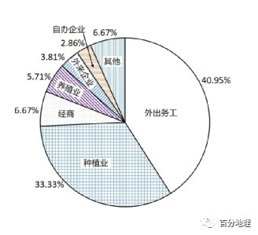   
   
(1)推测2008-2018年该村农林用地显著减少的主要原因。   
(2)分析该村村民外出务工收入占比高的原因。   
(3)从该村与外来企业合作的角度，提出增加村民收入的具体措施。   
<span style="color: rgb(255, 0, 0);">【答案】(1)满足城镇发展的用地需求，部分农林用地转变为城镇建设用地；外来企业建设需要征用农林用地；村庄道路、住宅建设占用农林用地。</span>   
<span style="color: rgb(255, 0, 0);">(2)外来企业提供的就业机会少；外出务工人员多；靠近城市，交通便利，外出务工方便；与传统农业相比，外出务工收入水平相对较高。</span>   
<span style="color: rgb(255, 0, 0);">(3)发挥该村资源优势，为企业提供农副产品；满足企业需求，提供民俗、餐饮、休闲等生活配套服务；发挥区位优势，配合企业发展物流、租赁等生产性服务业；发挥企业技术和资金优势，加强村民技能培训，提高村民就业能力。</span>   
<span style="color: rgb(255, 0, 0);">【解析】本题 以某村的2008年到2018年的发展状况为材料设置试题，涉及城市、人口、农业、工业等相关内容，考查学生区域认识、综合思维等地理学科素养。</span>   
<span style="color: rgb(255, 0, 0);">（1）城市化的过程中，城镇用地的增加，使大部分农林用地转变为城镇建设用地，用来满足城镇的发展。外来新建企业的增加，也需要征用农林用地，与此同时，交通等基础设施的建设减少了农林用地的占比。</span>   
<span style="color: rgb(255, 0, 0);">（2）外出务工收入占比高，说明外出务工人员较多，当地就业机会较少，外来企业为本地提供的就业岗位极为有限。再加上Z村位于城市边缘，国道穿村而过，附近又有高速公路出入口说明进出城市交通便利，路程较近，往返方便。在收入方面，与传统务农相比，外出打工的收入水平比较高。</span>   
<span style="color: rgb(255, 0, 0);">（3）该村与外来企业合作发展，为增加农民收入，可以整合本村资源，发挥资源优势，为企业提供产品，为了降低企业各种成本，需要完善基础设施建设，满足企业的需要。除此之外，为企业提供住宿、餐饮等一系列配套服务也可以为本地村民提供就业机会。本村落靠近城市，交通便利，可以发挥独有的区位优势配合外来企业发展物流等服务业，增加就业岗位。企业可以开展培训，提高村民的就业能力。</span>   
36．（2022·河南·模拟预测）阅读图文材料，完成下列要求。   
回流人口是指在我国东部发达地区务工后因某些原因返回户籍所在地的人口，多为中西部地区农民工。以2008年为时间节点,2008年前从东部发达地区返回户籍地的人口,习惯上称为第一代回流人口,这部分人口回乡后大都回归农村,重操农业;2008年后的回流人口被称为新一代回流人口，这部分人口回乡后在东部产业转移中西部的影响下多选择在当地县城就业、购房定居,推动了当地城镇化和社会经济的发展。下图示意江西省吉安市(地级市)新一代回流人口回乡前后的职业类型。   
   
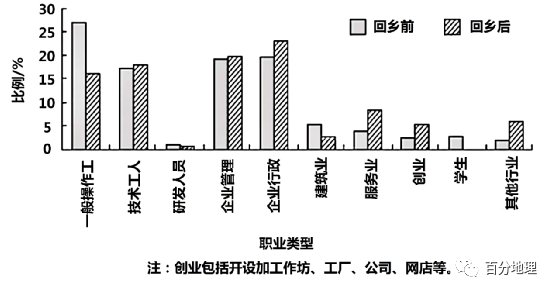   
   
(1)推测第一代回流人口返乡后多重操农业的主要原因。   
(2)说出与第一代回流人口相比,新一代回流人口从事职业的特点。   
(3)分析吉安市新--代回流人口多选择定居当地县城的主要原因。   
(4)简述吉安市新一代回流人口定居县城所产生的有利影响。   
<span style="color: rgb(255, 0, 0);">【答案】(1)掌握技能较少；文化教育水平较低；当地企业数量较少等。</span>   
<span style="color: rgb(255, 0, 0);">(2)从事职业类型多种多样；多从事非农产业；从业类型呈现高端化趋势。</span>   
<span style="color: rgb(255, 0, 0);">(3)吉安市下辖县承接东部沿海经济发达地区产业转移,就业机会较多；县城公共服务、教育资源、居住环境等条件较农村好；县城距离农村户籍地较近；新一代回流人口收入水平较高,有能力在县城购房等。</span>   
<span style="color: rgb(255, 0, 0);">(4)(扩大城镇人口和用地规模,)提高城镇化水平,加快城镇化进程；促进城镇经济发展；促进区域城镇协调发展等。</span>   
<span style="color: rgb(255, 0, 0);">【解析】 本题以江西省吉安市新一代回流人口回乡前后的职业类型及相关文字材料为情景，考查我国人口流动与城镇化发展等知识，旨在考查考生获取和解读地理信息、调动和运用地理知识、描述和阐释地理事物、论证和探讨地理问题的能力,综合思维、区域认知的学科核心素养。</span>   
<span style="color: rgb(255, 0, 0);">（1）根据题干分析，第一代回流人口多为外出打工的农民工，这一部分人口由于当时的时代背景和受教育程度所限，其掌握技能较少，不利于在发达地区长期务工；而这一部分人口由于各种各样的原因回流返乡后，当地由于经济发展较慢，企业数量较少，难以找到适合自己的工作。</span>   
<span style="color: rgb(255, 0, 0);">（2）根据题中信息分析，第一代回流人口回乡后大都回归农村，重操农业，新一代从事职业类型多种多样，且基本都不再从事农业，从业类型有技术工人、企业管理等相对高端的行业。</span>   
<span style="color: rgb(255, 0, 0);">（3）根据材料“东部产业转移中西部”可知，吉安市当地县城接受产业转移后，能提供多种就业岗位，能满足较多返乡人员就业。与农村相比，县城的基础设施更完善，公共服务、教育资源、居住环境等条件均由于农村地区，从而使回流人员大多选择在县城生活。县城距离回流人员的户籍地较近，便于在县城落户；新一代回流人口由于在外工作多年或者从事行业收入水平较高，经济条件更好，有能力在县城购房、就业等。</span>   
<span style="color: rgb(255, 0, 0);">（4）回流人口定居县城，将使县城人口数量增加，人口的增加则促进了县城的基础设施完善。同时人口的增加有利于带动县城消费水平的提高，推动经济发展。县城经济的发展有利于促进城乡协调发展，从而提高城镇化水平。</span>   
37．（2022·河南开封·三模）阅读图文材料，完成下列问题。   
石羊河流域位于甘肃省河西走廊东部、乌鞘岭以西、祁连山北麓。全流域可分为南部祁连山区、中部河西走廊平原区、北部低山丘陵荒漠区三大区域单元。该流域内人口分布极不平衡。随着社会经济的发展，水资源不足已经成为制约流域生态、社会、经济可持续发展的“瓶颈”。近年来，通过生态移民等一系列措施，石羊河流域已初步遏制了生态环境恶化趋势，并探索出了“少用水，多采光，设施化，高效益”的特色节水农业模式。下图为石羊河流域人口空间分布示意图。   
   
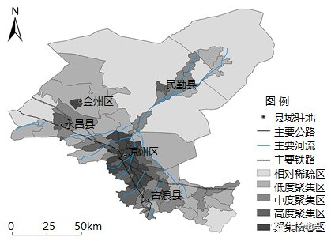   
   
(1)分析该流域三大区域单元人口空间分布差异的原因。   
(2)开展生态移民的主要区域在北部区域，而不是南部区域，试说明原因。   
(3)分析该流域发展这种节水农业模式的优势。   
<span style="color: rgb(255, 0, 0);">【答案】(1)差异:南部祁连山区人口较少;中部河西走廊平原区人口集中;北部低山丘陵荒漠区人口稀少。原因:南部祁连山区海拔高，地形复杂，气候寒冷,不利于人类生产和生活;中部河西走廊平原区地形平坦，水源较丰富，土壤较肥沃，利于农业生产，开发历史较早，交通便利,城镇众多，人口集中:北部低山丘陵荒漠区水资源少，生态环境恶劣，人口环境容量小。</span>   
<span style="color: rgb(255, 0, 0);">(2)北部低山丘陵荒漠区位于石羊河下游，水源主要来自河流上游地区;随着上游人口和生产活动增加，用水量增多，导致下游水量减少，甚至无水可用，生态压力大。南部祁连山区人口稀疏，生产活动少;上游水资源数量变化较小，生态压力相对较小。</span>   
<span style="color: rgb(255, 0, 0);">(3)当地气候干旱，水资源紧张，发展节水农业可减轻区域水资源的压力;晴天多,光照充足，该模式充分利用光照资源生产出更多优质农产品;充分利用现代技术，发展设施农业，高效地利用当地有限水资源;实现农业优质、稳产、高产，增强了当地农产品竞争力，提高了附加值;有利于增加当地经济收入、增加就业、改善生态环境、加快脱贫致富，实现了可持续发展。</span>   
<span style="color: rgb(255, 0, 0);">【解析】该大题结合图文材料，设置三个问题，涉及人口空间分布的特征、影响人口分布的因素、人口迁移的影响因素、农业发展的方向和措施等相关知识，考查学生的区域认知能力、综合思维能力和对所学知识的掌握程度。</span>   
<span style="color: rgb(255, 0, 0);">（1）阅读材料，图中显示南部祁连山区人口较少，原因是海拔较高，气温较低，地势起伏较大，地形复杂，且可能出现地质灾害，不利于居民生产和生活，所以人口较少；而中部区域人口集中程度高，分布有聚集核心区和高度聚集区，人口密度大，主要是位于河西走廊东部的平原地带，地形平坦，水源较为充足，土层较为深厚，土壤肥沃，有利于发展农业，且历史开发较早，交通便利，商业往来频繁，城镇分布较多，因此人口集中；北部区域属于荒漠区，水资源贫乏，蒸发量更为强烈，生态环境恶劣，不适宜人生存，资源环境承载力小，人口环境容量较小。</span>   
<span style="color: rgb(255, 0, 0);">（2）阅读图文材料，流域内北部区域，属于低山丘陵荒漠区，位于河流的下游，无其他支流进入，主要靠河流上游的水源；但河流上游属于人口密集区，居民生产生活用水量大，到时河流下游的流量大大减少，甚至没有水能达到下游，生态压力较大。而南部的祁连山区位于人口稠密区的上游，人口稀少，生产活动少，且河流流量稳定，水资源充足，生态压力小。</span>   
<span style="color: rgb(255, 0, 0);">（3）根据题意，结合材料和所学知识可知，区域内位于西北内陆地区，距离海洋较远，属于温带大陆性气候，降水稀少，河流主要靠高山冰雪融水补给，因此气候干旱，水资源紧张，发展节水农业模式可以大大的节约水的用量，减小压力；区域内晴天多，太阳光照强烈，蒸发作用大，可以减少蒸发，且可以利用温差，生产处更多优质的农产品；充分利用现代化科学技术，发展设施设备农业，可以有效的利用土地资源和水资源相结合，节约资源；该模式的先进技术可以实现农产品的优质、高产和稳产，增强当地的农产品的竞争力，发展相关产业，提高区域的经济发展水平；增加了更多的就业岗位，促进区域的经济发展，增加了居民的收入水平，改善了区域内的生态环境，实现脱贫致富和可持续发展。</span>
