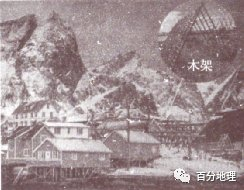

# 微专题之074 从产业结构角度分析区域发展

```
本专题摘自“百分地理”公众号，如有侵权请告之删除，谢谢。联系hhwxyhh@163.com
```

------
   
（2022·海南·高考真题）在阿尔卑斯山脉南侧某些狭窄、少风的河谷上，分布着一种独特的石顶泥柱景观（下图）。它是由夹杂石块的堆积物在外力作用下形成的。泥柱由坚固的泥土组成，高度多在6—30米之间，其顶端盖有一个石块，往往顶端石块越大，泥柱越高。表层无石块覆盖的地方，泥土易受侵蚀，难以形成泥柱。据此完成下面小题。   
   
   
   
1．石顶泥柱的石块在其形成所起的作用主要是减弱（  ）   
A．风力侵蚀   
B．流水侵蚀   
C．冰川侵蚀   
D．雨水侵蚀   
2．最有可能破坏此地石顶泥柱景观的是（  ）   
A．寒潮   
B．地震   
C．洪水   
D．虫蛀   
<span style="color: rgb(255, 0, 0);">1．D其顶端盖有一个石块，往往顶端石块越大，泥柱越高。表层无石块覆盖的地方，泥土易受侵蚀，难以形成泥柱。由此可知，顶部的石块主要减弱了来自于顶部的垂直于地面的侵蚀作用，故D正确。而风力侵蚀、冰川侵蚀、流水侵蚀与地面相平，故ABC错误。故答案选D。</span>   
<span style="color: rgb(255, 0, 0);">2．B该地区地处板块的交界处，位于火山地震带上，多地震，所以此地的石顶泥柱，易受到地震的破坏，故B正确；此地位于阿尔卑斯山南侧，位于寒潮背风坡，寒潮影响小，故A错误。该地貌主要分布于狭窄的山谷，受水面积小，难以形成洪水，故C错误；虫蛀对石顶泥柱有破坏，但不是破坏最严重的。故D错误。故答案选B。</span>   
<span style="color: rgb(255, 0, 0);">【点睛】外力作用能量来源地球的外部，主要是太阳辐射能;表现形式主要有风化、侵蚀、搬运、堆积、固积成岩五种方式。在板块的边界处，多火山地震;在板块内部，地壳运动不活跃。</span>   
（2022·辽宁·高考真题）一般情况下，气侯寒冷期冰川范围扩大，海平面下降。在风力搬运作用下，我国北方某海岸在末次冰期中的相对寒冷期沉积了砂质沉积物，相对温暖期沉积了黄土状沉积物。下图为沉积剖面及其所在位置示意图。据此完成下面小题。   
   
   
   
3．推断剖面A→B→C层形成过程中海平面大致经历了（  ）   
A．持续上升   
B．持续下降   
C．先降后升   
D．先升后降   
4．砂质沉积物的来源主要是末次冰期的（  ）   
A．海岸沙   
B．河流沙   
C．洪积物   
D．冰碛物   
<span style="color: rgb(255, 0, 0);">3．C根据材料信息可知，A→B→C沉积物由黄土状沉积物变为砂质沉积物再变为黄土状沉积物，砂质沉积物为寒冷的冰期沉积物，黄土状沉积物为温暖的间冰期沉积物，冰期气温较低，海平面较低，间冰期气温较高，海平面较高，所以A→B→C层形成过程中海平面经历了先降后升的变化，C正确，ABD错误。所以选C。</span>   
<span style="color: rgb(255, 0, 0);">4．B据材料可知，在风力搬运作用下，我国北方某海岸在末次冰期中的相对寒冷期沉积了砂质沉积物，说明砂质沉积物来自陆地，不是来自海洋，A错误；位于沿海，是河流将风力搬运的沉积物再次搬运到沿海，B正确；洪积物主要分布于山麓等洪水多发区，海岸地区一般洪水发生较少，C错误；冰碛物主要分布在冰川活动较多的地区，海岸地区冰川活动较少，D错误。所以选B。</span>   
<span style="color: rgb(255, 0, 0);">【点睛】分选性是指碎屑颗粒大小的均匀程度，也可以表达为围绕某一个粒度的颗粒集中趋势的大小离差程度。碎屑颗粒的分选程度受沉积环境的水动力条件和自然地理条件控制，一般水动力能量高的沉积环境碎屑颗粒的分选性较好，风对风成沙丘的分选性最好，其次为海（或湖）滩沙，河流沙的分选性往往较差，而冰川沉积物的分选性最差。分选性，碎屑颗粒粗细均匀程度。大小均匀者，分选性好，大小混杂者，分选性差。</span>   
（2022·江苏·高考真题）罗弗敦群岛位于挪威北部（68°N附近），捕鱼为岛上居民主要经济活动。下图为“罗弗敦群岛聚落景观图”。据此完成下面小题。   
   
   
   
5．许多居民房屋底部以木柱支撑，屋顶用厚重石板铺设，这样建造主要是为了（  ）   
A．防御海浪，便于出行   
B．扩展用地，抵御强风   
C．稳固地基，承受积雪   
D．减少潮湿，保暖防寒   
6．岛上搭建了许多木架，其主要功能是（  ）   
A．风干海鱼   
B．晾晒衣物   
C．堆放薪柴   
D．圈养牲畜   
7．该岛最能吸引世界游客的景观是（  ）   
A．林海   
B．冰川   
C．雪原   
D．极光   
<span style="color: rgb(255, 0, 0);">5．B 由图可知，该地地势起伏大，平地狭小，房屋底部以木柱支撑目的主要扩展平整的用地空间，由材料知该区域为岛屿，四面环海，风力强劲，屋顶用厚重石板铺设，目的为了抵御强风，防止强风掀翻屋顶。故B正确；屋顶用厚重石板铺设，对防御海浪，便于出行关系不大，故A错误；减少屋顶积雪的承受，应将增加屋顶坡度，与屋顶用厚重石板铺设无关，故C错误；保暖防寒与屋顶用厚重石板铺设无关，故D错误。故选B。</span>   
<span style="color: rgb(255, 0, 0);">6．A由材料可知岛上居民主要经济活动为捕鱼，搭建许多木架主要是用来晾晒鱼干，故A正确；晾晒衣物不会搭建许多木架，故B错误，由图中木架的形状，可知搭建的木架不是用来堆放薪柴、圈养牲畜的。故CD错误。故选A。</span>   
<span style="color: rgb(255, 0, 0);">7．D罗弗敦群岛位于挪威北部（68°N附近）北极圈以内，有极光现象，是该地区比较独特的旅游资源，故该岛最能吸引世界游客的景观是极光，故D正确；林海、冰川、雪原在较低纬度的区域也有，不是该地区独特的旅游资源，故不是最能吸引世界游客的景观，故ABC错误。故答案选D。</span>   
<span style="color: rgb(255, 0, 0);">【点睛】罗弗敦群岛，是挪威北部、挪威海中的群岛。面积1425平方公里。南北延伸约111公里，同大陆相距1.6―80公里，中隔韦斯特湾。人口2.7万。岛间海峡流水湍急。因受北大西洋暖流影响，气候较温和。岛上多沼泽、山丘，最高峰1161米。四周海域盛产鳕鱼、鲱鱼，捕捞后多制成鱼干和熏鱼。</span>   
（2022·浙江·高考真题）近年来，全球冰川消融日益严重。我国某中学地理研学小组成员跟随科学家在青藏高原某地利用无人机研究冰川消融，并拍摄了冰川消融后的地貌照片。完成下面小题。   
8．下列四幅照片，属于此次拍摄的是（  ）   
   
   
   
A．   
B．   
   
   
   
C．   
D．   
9．在用无人机研究冰川消融的过程中，可以（  ）   
A．利用GPS模拟冰川移动   
B．利用RS监测冰川面积变化   
C．运用GIS测定冰面温度   
D．运用VR获取冰川厚度信息   
<span style="color: rgb(255, 0, 0);">8．B</span>据材料，图中拍摄的是冰川消融后的地貌照片。观察4幅图片可知，A是新月形沙丘地貌，B是宽广的谷地，谷中可见大小不一的石块，可推断为冰川槽谷，   
C是石林地貌,   
D是雅丹地貌。B正确，ACD错误。故选B。   
<span style="color: rgb(255, 0, 0);">9．B模拟冰川移动需要对数据进行分析处理，GPS不具备这个功能，A错误；RS可通过对地表各类地物和现象进行远距离的感知和识别，因此通过对不同时期的冰川监测可分析出冰川面积变化，B正确；冰面温度受大气成分和太阳辐射等因素的影响，可通过红外线测定，GIS不能实现对冰面温度的测定，C错误；VR即虚拟现实技术，是运用计算机模拟虚拟环境从而给人以环境沉浸感，不能获取冰川厚度信息，D错误。故选B。</span>   
<span style="color: rgb(255, 0, 0);">【点睛】“3S”技术手段的选取(1)“点”与“面”判断GPS在“3S”技术中选取适当手段时，要看其工作对象是“点”还是“面”，如果是“点”则选用“GPS”，如果是“面”则选用RS或GIS。</span>   
<span style="color: rgb(255, 0, 0);">(2)“想”与“看”区分RS、GISGIS是地图的延伸，主要功能是进行空间数据的分析和处理。对“事象”的发展变化进行预测、评估、需要计算、思考，即“想”；凡是需要“想”的选GIS。RS是人的视力的延伸，主要功能是收集信息，即“看”，只“看”不用“想”的选用RS。</span>   
（2021·海南·高考真题）下图为某大洲局部区域图。据图完成下面小题。   
   
   
   
10．导致甲地附近海岸线破碎的主要地质作用是（  ）   
A．海浪作用   
B．流水作用   
C．冰川作用   
D．风力作用   
11．造成乙地所在区域人口稀少的主要自然原因是（  ）   
A．降水稀少   
B．海拔较高   
C．纬度较高   
D．冰川广布   
<span style="color: rgb(255, 0, 0);">10．C读图可知，图中甲地位于南美洲西南部，那里曾经是南半球冰川发育的地方。冰期冰川从安第斯山脉下来，在流向大海的过程中不断摩擦海岸，形成冰川槽谷，而冰期结束，冰川退缩，这些被摩擦切割的海岸就会因为地势相对低洼，被海水淹没，出现破碎地形，C正确。甲地附近海岸线破碎与海浪作用、流水作用、风力作用无关，ABD错误。故选C。</span>   
<span style="color: rgb(255, 0, 0);">11．A由图可知，乙处位于西风带的背风坡，降水稀少，气候干旱，荒漠广布，是造成人口稀少的主要原因，A正确。读图可知，图中乙处位于东海岸，海拔较低，B错误。由图可知，乙处位于中纬度，属于温带气候，不是造成人口稀少的原因，C错误。乙处位于中纬度，海拔较低，没有冰川分布，D错误。故选A。</span>   
<span style="color: rgb(255, 0, 0);">【点睛】外力作用及其举例：风力侵蚀：蘑菇石，风蚀柱，风蚀洼地；风力堆积：沙漠和黄土；流水侵蚀（物理现象）：河谷，沟壑；流水溶蚀（化学现象）：喀斯特地貌；流水沉积：冲积扇，冲积平原，河口三角洲；冰川侵蚀：冰川槽谷（U型谷），冰斗，角峰，刃脊，冰蚀湖等。</span>   
（2021·河北·高考真题）冰川物质平衡是单位时间内冰川以固态降水为主的物质收入和以消融为主的物质支出的代数和，天山和阿尔卑斯山都是世界上典型的山岳冰川分布区，前者冰温（℃）恒为负，后者接近0℃，下表为两山区代表性冰川物质平衡情况，下图表示两山区冰川累积物质平衡年际变化。据此完成下列各题。   
<table cellspacing="0" cellpadding="0" width="577"><tbody><tr><td width="103" valign="middle" style="padding: 3.75pt 0pt;border-width: 1pt;border-color: rgb(0, 0, 0);"><section style="margin-top: 0pt;margin-bottom: 0pt;margin-left: 0pt;font-size: 10.5pt;font-family: &quot;Times New Roman&quot;;text-align: left;text-indent: 21pt;line-height: 2em;"><span style="font-family: 楷体;">地区</span></section></td><td width="103" valign="middle" style="padding: 3.75pt 0pt;border-width: 1pt;border-color: rgb(0, 0, 0);"><section style="margin-top: 0pt;margin-bottom: 0pt;margin-left: 0pt;font-size: 10.5pt;font-family: &quot;Times New Roman&quot;;text-align: left;text-indent: 21pt;line-height: 2em;"><span style="font-family: 楷体;">冰川代号</span></section></td><td width="103" valign="middle" style="padding: 3.75pt 0pt;border-width: 1pt;border-color: rgb(0, 0, 0);"><section style="margin-top: 0pt;margin-bottom: 0pt;margin-left: 0pt;font-size: 10.5pt;font-family: &quot;Times New Roman&quot;;text-align: left;text-indent: 21pt;line-height: 2em;"><span style="font-family: 楷体;">朝向</span></section></td><td width="103" valign="middle" style="padding: 3.75pt 0pt;border-width: 1pt;border-color: rgb(0, 0, 0);"><section style="margin-top: 0pt;margin-bottom: 0pt;margin-left: 0pt;text-indent: 0pt;font-size: 10.5pt;font-family: &quot;Times New Roman&quot;;text-align: left;line-height: 2em;"><span style="font-family: 楷体;">物质平衡毫米</span>/<span style="font-family: 楷体;">年</span></section></td></tr><tr><td width="103" rowspan="3" valign="middle" style="padding: 3.75pt 0pt;border-width: 1pt;border-color: rgb(0, 0, 0);"><section style="margin-top: 0pt;margin-bottom: 0pt;margin-left: 0pt;font-size: 10.5pt;font-family: &quot;Times New Roman&quot;;text-align: left;text-indent: 21pt;line-height: 2em;"><span style="font-family: 楷体;">天山</span></section></td><td width="103" valign="middle" style="padding: 3.75pt 0pt;border-width: 1pt;border-color: rgb(0, 0, 0);"><section style="margin-top: 0pt;margin-bottom: 0pt;margin-left: 0pt;text-indent: 0pt;font-size: 10.5pt;font-family: &quot;Times New Roman&quot;;text-align: left;line-height: 2em;">T1</section></td><td width="103" valign="middle" style="padding: 3.75pt 0pt;border-width: 1pt;border-color: rgb(0, 0, 0);"><section style="margin-top: 0pt;margin-bottom: 0pt;margin-left: 0pt;text-indent: 0pt;font-size: 10.5pt;font-family: &quot;Times New Roman&quot;;text-align: left;line-height: 2em;">N</section></td><td width="103" valign="middle" style="padding: 3.75pt 0pt;border-width: 1pt;border-color: rgb(0, 0, 0);"><section style="margin-top: 0pt;margin-bottom: 0pt;margin-left: 0pt;text-indent: 0pt;font-size: 10.5pt;font-family: &quot;Times New Roman&quot;;text-align: left;line-height: 2em;">-423</section></td></tr><tr><td width="103" valign="middle" style="padding: 3.75pt 0pt;border-width: 1pt;border-color: rgb(0, 0, 0);"><section style="margin-top: 0pt;margin-bottom: 0pt;margin-left: 0pt;text-indent: 0pt;font-size: 10.5pt;font-family: &quot;Times New Roman&quot;;text-align: left;line-height: 2em;">T2</section></td><td width="103" valign="middle" style="padding: 3.75pt 0pt;border-width: 1pt;border-color: rgb(0, 0, 0);"><section style="margin-top: 0pt;margin-bottom: 0pt;margin-left: 0pt;text-indent: 0pt;font-size: 10.5pt;font-family: &quot;Times New Roman&quot;;text-align: left;line-height: 2em;">NE</section></td><td width="103" valign="middle" style="padding: 3.75pt 0pt;border-width: 1pt;border-color: rgb(0, 0, 0);"><section style="margin-top: 0pt;margin-bottom: 0pt;margin-left: 0pt;text-indent: 0pt;font-size: 10.5pt;font-family: &quot;Times New Roman&quot;;text-align: left;line-height: 2em;">-116</section></td></tr><tr><td width="103" valign="middle" style="padding: 3.75pt 0pt;border-width: 1pt;border-color: rgb(0, 0, 0);"><section style="margin-top: 0pt;margin-bottom: 0pt;margin-left: 0pt;text-indent: 0pt;font-size: 10.5pt;font-family: &quot;Times New Roman&quot;;text-align: left;line-height: 2em;">T3</section></td><td width="103" valign="middle" style="padding: 3.75pt 0pt;border-width: 1pt;border-color: rgb(0, 0, 0);"><section style="margin-top: 0pt;margin-bottom: 0pt;margin-left: 0pt;text-indent: 0pt;font-size: 10.5pt;font-family: &quot;Times New Roman&quot;;text-align: left;line-height: 2em;">W</section></td><td width="103" valign="middle" style="padding: 3.75pt 0pt;border-width: 1pt;border-color: rgb(0, 0, 0);"><section style="margin-top: 0pt;margin-bottom: 0pt;margin-left: 0pt;text-indent: 0pt;font-size: 10.5pt;font-family: &quot;Times New Roman&quot;;text-align: left;line-height: 2em;">261</section></td></tr><tr><td width="103" rowspan="4" valign="middle" style="padding: 3.75pt 0pt;border-width: 1pt;border-color: rgb(0, 0, 0);"><section style="margin-top: 0pt;margin-bottom: 0pt;margin-left: 0pt;font-size: 10.5pt;font-family: &quot;Times New Roman&quot;;text-align: left;text-indent: 21pt;line-height: 2em;"><span style="font-family: 楷体;">阿尔卑斯山</span></section></td><td width="103" valign="middle" style="padding: 3.75pt 0pt;border-width: 1pt;border-color: rgb(0, 0, 0);"><section style="margin-top: 0pt;margin-bottom: 0pt;margin-left: 0pt;text-indent: 0pt;font-size: 10.5pt;font-family: &quot;Times New Roman&quot;;text-align: left;line-height: 2em;">H1</section></td><td width="103" valign="middle" style="padding: 3.75pt 0pt;border-width: 1pt;border-color: rgb(0, 0, 0);"><section style="margin-top: 0pt;margin-bottom: 0pt;margin-left: 0pt;text-indent: 0pt;font-size: 10.5pt;font-family: &quot;Times New Roman&quot;;text-align: left;line-height: 2em;">N</section></td><td width="103" valign="middle" style="padding: 3.75pt 0pt;border-width: 1pt;border-color: rgb(0, 0, 0);"><section style="margin-top: 0pt;margin-bottom: 0pt;margin-left: 0pt;text-indent: 0pt;font-size: 10.5pt;font-family: &quot;Times New Roman&quot;;text-align: left;line-height: 2em;">-455</section></td></tr><tr><td width="103" valign="middle" style="padding: 3.75pt 0pt;border-width: 1pt;border-color: rgb(0, 0, 0);"><section style="margin-top: 0pt;margin-bottom: 0pt;margin-left: 0pt;text-indent: 0pt;font-size: 10.5pt;font-family: &quot;Times New Roman&quot;;text-align: left;line-height: 2em;">H2</section></td><td width="103" valign="middle" style="padding: 3.75pt 0pt;border-width: 1pt;border-color: rgb(0, 0, 0);"><section style="margin-top: 0pt;margin-bottom: 0pt;margin-left: 0pt;text-indent: 0pt;font-size: 10.5pt;font-family: &quot;Times New Roman&quot;;text-align: left;line-height: 2em;">NE</section></td><td width="103" valign="middle" style="padding: 3.75pt 0pt;border-width: 1pt;border-color: rgb(0, 0, 0);"><section style="margin-top: 0pt;margin-bottom: 0pt;margin-left: 0pt;text-indent: 0pt;font-size: 10.5pt;font-family: &quot;Times New Roman&quot;;text-align: left;line-height: 2em;">-381</section></td></tr><tr><td width="103" valign="middle" style="padding: 3.75pt 0pt;border-width: 1pt;border-color: rgb(0, 0, 0);"><section style="margin-top: 0pt;margin-bottom: 0pt;margin-left: 0pt;text-indent: 0pt;font-size: 10.5pt;font-family: &quot;Times New Roman&quot;;text-align: left;line-height: 2em;">H3</section></td><td width="103" valign="middle" style="padding: 3.75pt 0pt;border-width: 1pt;border-color: rgb(0, 0, 0);"><section style="margin-top: 0pt;margin-bottom: 0pt;margin-left: 0pt;text-indent: 0pt;font-size: 10.5pt;font-family: &quot;Times New Roman&quot;;text-align: left;line-height: 2em;">NW</section></td><td width="103" valign="middle" style="padding: 3.75pt 0pt;border-width: 1pt;border-color: rgb(0, 0, 0);"><section style="margin-top: 0pt;margin-bottom: 0pt;margin-left: 0pt;text-indent: 0pt;font-size: 10.5pt;font-family: &quot;Times New Roman&quot;;text-align: left;line-height: 2em;">56</section></td></tr><tr><td width="103" valign="middle" style="padding: 3.75pt 0pt;border-width: 1pt;border-color: rgb(0, 0, 0);"><section style="margin-top: 0pt;margin-bottom: 0pt;margin-left: 0pt;text-indent: 0pt;font-size: 10.5pt;font-family: &quot;Times New Roman&quot;;text-align: left;line-height: 2em;">H4</section></td><td width="103" valign="middle" style="padding: 3.75pt 0pt;border-width: 1pt;border-color: rgb(0, 0, 0);"><section style="margin-top: 0pt;margin-bottom: 0pt;margin-left: 0pt;text-indent: 0pt;font-size: 10.5pt;font-family: &quot;Times New Roman&quot;;text-align: left;line-height: 2em;">SE</section></td><td width="103" valign="middle" style="padding: 3.75pt 0pt;border-width: 1pt;border-color: rgb(0, 0, 0);"><section style="margin-top: 0pt;margin-bottom: 0pt;margin-left: 0pt;text-indent: 0pt;font-size: 10.5pt;font-family: &quot;Times New Roman&quot;;text-align: left;line-height: 2em;">27</section></td></tr></tbody></table>

   
   
   
12．导致两山区不同坡向冰川物质平衡差异的主要因素为（  ）   
A．到海距离   
B．主导风向   
C．冰川覆盖   
D．山地坡度   
13．1990年以后，两山区冰川的变化指示出（  ）   
A．天山冰川消融量较大   
B．天山冰川扩张更明显   
C．二者的平均雪线高度都在上升   
D．阿尔卑斯山冰川积累速度较快   
14．影响两山区冰川物质平衡变化的关键是（  ）   
A．所处山体隆起   
B．臭氧空洞扩大   
C．全球气候变暖   
D．山地林线上升   
<span style="color: rgb(255, 0, 0);">12．B如表中信息所示，天山西坡冰川物质平衡值为正值，说明冰川增加，其主要与西风带来的水汽受地形抬升形成较多降水有关，阿尔卑斯山西北坡和东南坡物质平衡值为正值，冰川增加，应该是受西风带影响所致，因此导致其冰川物质平衡差异的主要因素是主导风向，故B项正确；与到海距离、冰川覆盖、山地坡度关系较小，故A，C，D项错误。故选B。</span>   
<span style="color: rgb(255, 0, 0);">13．C由图可知，1990年以后，两山冰川平衡物质均呈负值，两山区冰川都呈减少趋势，也就是二者的平均雪线高度都在上升，故C项正确；天山冰川消融量较阿尔卑斯山小，故A项错误；读图可知，天山冰川在退缩，故B项错误；阿尔卑斯山冰川消融速度较快，故D项错误。故选C。</span>   
<span style="color: rgb(255, 0, 0);">14．C由图可知，两山区冰川物质平衡变化呈下降趋势，应该是全球气候变暖导致冰川减少，故C项正确；图示时段时间跨度较小，山体隆起不明显，故A项错误；臭氧空洞扩大对冰川变化影响较小，故B项错误；山地林线上升，是冰川物质平衡变化的结果，不是导致其变化的原因，故D项错误。故选C。</span>   
<span style="color: rgb(255, 0, 0);">【点睛】本题主要考查区域自然地理特征、全球气候变化及其影响，考查学生的读图能力和综合分析能力，第一小题的关键在于学生能够根据不同坡向冰川的物质平衡值的高低判断与降水的关系，进而进行分析；第二小题根据图示信息读冰川的变化趋势；第三小题在前面的基础上进行分析，考查学生的综合分析能力。</span>   
（2021·浙江·高考真题）下图为世界某区域略图。完成下面小题。   
   
   
   
15．图中板块边界的类型及其海底宏观地形分别是（  ）   
A．生长边界海岭   
B．消亡边界海沟   
C．消亡边界海岭   
D．生长边界海沟   
16．以马尔代夫为代表的低地岛国最忧虑的全球性问题主要有（  ）   
①臭氧层破坏②渔业资源枯竭③森林面积减少④两极冰川消融   
A．①④   
B．②③   
C．①②   
D．③④   
<span style="color: rgb(255, 0, 0);">15．A读图，根据马尔代夫群岛和印度半岛的地理位置可知，该处地处印度洋板块与非洲板块的生长边界处，两板块拉伸，易形成海岭，A正确，BCD错误。故选A。</span>   
<span style="color: rgb(255, 0, 0);">16．D由所学知识可知，臭氧层破坏对低地岛国的影响不大，①错误，AC错误。渔业资源枯竭会对岛国产生一定的影响，但并非全球性的问题，②错误，B错误。森林面积减少会导致二氧化碳吸收减少，大气中二氧化碳的浓度有所上升，全球温室效应更加严重，使得两极冰川消融增加，导致海平面上升，会导致低地岛国被淹没，③④正确，D正确。综上所述，故选D。</span>   
（2020·浙江·高考真题）我国某山脉主峰由古老的片麻岩构成，第四纪冰期时该地雪线高度为海拔3500——360米。图一为该主峰附近地形图，图二为图一中某地的谷地景观图。完成下面小题。   
   
   
   
17．图二谷地景观可见于图一中的（  ）   
A．甲地   
B．乙地   
C．丙地   
D．丁地   
18．图二谷地的成因是（  ）   
A．构造断裂下陷   
B．流水侵蚀作用   
C．岩层挤压弯曲   
D．冰川侵蚀作用   
<span style="color: rgb(255, 0, 0);">17．B由图一中的等高线分布状况和等高线数值可以看出，乙地等高线向高处凸出，为山谷，B正确。甲地等高线闭合，中间高，四周低，为山顶，A错误。丙为鞍部，C错误。丁地等高线向低处凸出，为山脊，D错误。故选B。</span>   
<span style="color: rgb(255, 0, 0);">18．D根据图二谷地的形状和材料“第四纪冰期时该地雪线高度为海拔3500-3600米”可以判断该谷地的成因是冰川侵蚀作用形成的U型谷，D正确，C错误。图示没有断层的相关信息，A错误。乙地位于河流上游，如果为流水侵蚀形成应该为V型谷，而图二中谷地为U型谷，B错误。故选D。</span>   
19．（2022·江苏·高考真题）阅读图文材料，回答下列问题。   
材料：下图为“亚欧大陆某区域自然带及该区域局部冰川、河流分布图”。   
   
   
   
(1)写出图中自然带II的类型，并简析其向南凸出的原因。   
(2)根据右图中冰川、河流的分布，简述该局部区域的地势特征；结合地势特征，用曲线绘出虚线框内M河流域与N河流域的分水岭。   
(3)分析右图中R处附近冰川较多的原因。   
<span style="color: rgb(255, 0, 0);">[答案](1)类型:苔原带。原因:该地为南北向(乌拉尔)山脉，海拔高，气温比同纬度两侧低。</span>   
<span style="color: rgb(255, 0, 0);">(2)地势特征：中部自(东)北向(西)南地势升高，整体中部高，向西(北)、东(南)两侧地势降低。</span>   
<span style="color: rgb(255, 0, 0);">分水岭：   
   
   
<span style="color: rgb(255, 0, 0);">(3)靠近海洋，水汽在极地东风吹送下，受地形抬升，降雪多;纬度高，气温低，积雪消融少，积累多，冰川多;山谷发育，积雪易留存，冰川数量多。</span>   
<span style="color: rgb(255, 0, 0);">【解析】（1）从图中可以看到，II自然带主要位于北冰洋沿岸附近，靠近极圈附近，其南部III自然带位于大陆内部，面积广大，为亚寒带针叶林带，II自然带应为苔原带，I自然带位于极圈以内，靠近极点附近应属冰原带。向南突出的原因：从图中位置来看，该地位于东经60°附近，其植被带向南突出的方向，大致为南北方向；该地位于亚欧分界线乌拉尔山附近，乌拉尔山大致呈南北走向，其海拔相对较高，其西侧为东欧平原，东侧为西西伯利亚平原；乌拉尔山较东西两侧海拔高，气温更低，因此其植被带发育为高纬度的苔原带。（2）河流应由高向低流，河流的流向一般可判断地势的走向。从该地区河流分布来看，其东部河流向东流，西部河流向西侧流动，说明其地势中部高东西两侧低；从中部山峰高度来看，其北部山峰大致位于1200——1300米左右，其南部山峰大约为1400——1500米左右，中部地区南高北低。河流应由高处向低处流动， M流域与N流域其支流的源头的中间地带应为山地分水岭，将中间地带连接成线，即为M河流域和N河流域的分水岭。（3）从图中可以看到R地纬度较高，其北部靠近北冰洋，从纬度来看，该地位于极圈内部，受极地东风影响较为显著，北冰洋水汽在极地东风的吹送下向南运动，R地为乌拉尔山北部，受地形抬升影响，该地降雪较多。同时该地纬度较高，常年气温较低，积雪融化的相对较少，大量积雪易累积，易形成面积较大的冰川。从河流分布图可以看到R地附近河流众多，河流多从山谷流出，山谷发育较多，谷地受太阳辐射影响相对较少，其积雪更易储存，其谷地冰川数量较为众多。</span>   
20．（2021·天津·高考真题）读图文材料，回答下列问题。   
近几十年来，全球气候呈现变暖趋势，给北极地区的自然环境带来了很大的影响，而北极地区自然环境的变化也会对全球的气候产生影响。   
   
   
   
(1)图中所示北冰洋永久性块状冰的区域分布特征见下表，填表分析原因。   
<table cellspacing="0" cellpadding="0" width="576"><tbody><tr><td width="184" valign="middle" style="padding: 3.75pt 0pt;border-width: 1.5pt;border-color: rgb(0, 0, 0);"><section style="margin-top: 0pt;margin-bottom: 0pt;margin-left: 0pt;text-indent: 0pt;font-size: 10.5pt;font-family: &quot;Times New Roman&quot;;text-align: left;line-height: 2em;"><span style="font-family: 宋体;">永久性块状冰区域分布特征</span></section></td><td width="58" valign="middle" style="padding: 3.75pt 0pt;border-width: 1.5pt;border-color: rgb(0, 0, 0);"><section style="margin-top: 0pt;margin-bottom: 0pt;margin-left: 0pt;text-indent: 0pt;font-size: 10.5pt;font-family: &quot;Times New Roman&quot;;text-align: left;line-height: 2em;"><span style="font-family: 宋体;">原因</span></section></td></tr><tr><td width="184" valign="middle" style="padding: 3.75pt 0pt;border-width: 1.5pt;border-color: rgb(0, 0, 0);"><section style="margin-top: 0pt;margin-bottom: 0pt;margin-left: 0pt;text-indent: 0pt;font-size: 10.5pt;font-family: &quot;Times New Roman&quot;;text-align: left;line-height: 2em;"><span style="font-family: 宋体;">在极点附近地区分布</span></section></td><td width="58" valign="middle" style="padding: 3.75pt 0pt;border-width: 1.5pt;border-color: rgb(0, 0, 0);"><section style="margin-top: 0pt;margin-bottom: 0pt;margin-left: 0pt;text-indent: 0pt;font-size: 10.5pt;font-family: &quot;Times New Roman&quot;;text-align: left;line-height: 2em;"><span style="font-family: 宋体;">①____</span></section></td></tr><tr><td width="184" valign="middle" style="padding: 3.75pt 0pt;border-width: 1.5pt;border-color: rgb(0, 0, 0);"><section style="margin-top: 0pt;margin-bottom: 0pt;margin-left: 0pt;text-indent: 0pt;font-size: 10.5pt;font-family: &quot;Times New Roman&quot;;text-align: left;line-height: 2em;"><span style="font-family: 宋体;">在欧洲以北海区分布面积小</span></section></td><td width="58" valign="middle" style="padding: 3.75pt 0pt;border-width: 1.5pt;border-color: rgb(0, 0, 0);"><section style="margin-top: 0pt;margin-bottom: 0pt;margin-left: 0pt;text-indent: 0pt;font-size: 10.5pt;font-family: &quot;Times New Roman&quot;;text-align: left;line-height: 2em;"><span style="font-family: 宋体;">②____</span></section><section style="margin-top: 0pt;margin-bottom: 0pt;margin-left: 0pt;text-indent: 0pt;font-size: 10.5pt;font-family: &quot;Times New Roman&quot;;text-align: left;line-height: 2em;"><span style="font-family: 宋体;">③____</span></section></td></tr></tbody></table>

   
我国北极科考站——黄河站建立在斯瓦尔巴群岛上。该群岛生态环境脆弱，对气候变化非常敏感。   
(2)分析该群岛生态环境脆弱，一旦破坏很难恢复的原因。   
研究表明，全球变暖会造成北极地区冰川、冻土、植被的变化。这种变化可能会导致温室效应增强，也可能会导致温室效应减弱。   
(3)任选一角度（温室效应增强或减弱），说明上述变化影响温室效应的过程。   
<span style="color: rgb(255, 0, 0);">【答案】(1)极点附近地区温度更低。 受北大西洋暖流的影响，海水增温 与大西洋之间通道较宽，与温度较高的海水交换多</span>   
<span style="color: rgb(255, 0, 0);">(2)该群岛气温低，环境极端；生物数量、种类少，生长缓慢；岛屿面积小，相对封闭。</span>   
<span style="color: rgb(255, 0, 0);">(3)角度一：温室效应增强。①过程：冰川面积减小，地表吸收太阳辐射增加，地面辐射增强，导致温室效应增强。②过程：冻土融化，土层中释放温室气体，导致温室效应增强。</span>   
<span style="color: rgb(255, 0, 0);">角度二：温室效应减弱。过程：地表植被覆盖率增加，光合作用能够吸收更多二氧化碳，导致温室效应减弱。</span>   
<span style="color: rgb(255, 0, 0);">【解析】（1）本题主要考查影响永久性块状冰分布的因素。永久性块状冰在极点附近地区分布的主要原因纬度高、气温低；在欧洲以北海区分布面积小的原因主要是该地区受北大西洋暖流增温影响、大西洋间的通道使温度较低的海水与温度较高的海水交换多，海水温度高，冰块少。（2）本题主要考查环境问题的成因。原因可以结合材料信息，从该群岛气候、生物数量和种类及生长速度、岛屿面积等角度分析作答。该岛屿纬度高，气温低，生存环境恶劣；气温低，热量低，生物生长速度慢；岛屿面积小，生物数量、种类少，相对封闭。（3）本题主要考查自然地理环境的整体性。温室效应增强，冰川面积变小，地表吸收太阳辐射增加，地面辐射增强，导致温室疚增强；冻土融化、土层中释放温室气体增多，导致温室疚增强。温室效应减弱，地表植被覆盖率增加、光合作用能够吸收更多二氧化碳，削弱温室效应。</span>   
21．（2021·山东·高考真题）阅读图文资料，完成下列要求。   
海巴洛沟流域位于青藏高原东南缘，横断山脉中段（下图），面积53.4km2。主沟发源于哈巴雪山西侧，汇入金沙江一级支流冲江河，长度12.8km。流域自上而下分为高山寒带峰脊区和宽谷区、温带窄谷区、亚热带低谷区。该流域降水量随海拔升高而显著增加，其中海拔4200m以上的峰脊区年降水量超过1100mm。2019年7月28日，峰脊区6小时降雨量达60.4mm，激发了特大规模降雨-冰川融水混合型泥石流。   
   
   
   
（1）指出海巴洛沟流域形成泥石流的四类固体物质来源。   
（2）分析海巴洛沟流域主沟道AB段、BC段和CD段地形对泥石流形成的作用。   
（3）分析海巴洛沟流域泥石流对当地构成严重威胁的自然原因。   
<span style="color: rgb(255, 0, 0);">【答案】（1）冰碛物（冰川搬运堆积物）；崩滑体堆积物；风化碎屑物；断层破碎物。</span>   
<span style="color: rgb(255, 0, 0);">（2）AB段：地形陡峻，易发生崩塌，且径流汇流速度快，为泥石流形成提供物质和水动力条件；BC段：地形较和缓开阔，为大量松散固体物质积累提供场所；CD段：沟道狭窄顺直、坡度大，加快泥石流的通过时间。</span>   
<span style="color: rgb(255, 0, 0);">（3）丰富的松散固体物源和水源条件，导致泥石流易发；泥石流运动速度快，规模大，冲击力强；峰脊区降水量大，并叠加积雪融水，使得泥石流多发育在高海拔地区，下游不易察觉，隐蔽性强。</span>   
<span style="color: rgb(255, 0, 0);">【解析】（1）由材料“流域自上而下分为高山寒带峰脊区和宽谷区、温带窄谷区、亚热带低谷区”可推测出，泥石流的物质来源为高山寒带峰脊区的的冰碛物和寒冻风化碎屑物，河谷区沟道两侧的滑坡体；由材料可知，该地位于横断山脉中段，板块运动较多，地震多发，坡体结构不稳固，因此流域内多破碎的岩土体。（2）结合图中的等高线可看出，AB段海拔高且等高线密集，可判断出地势陡峭，为径流的初始运动提供了充足势能；BC段海拔相对较低，且等高线相对稀疏，地势较缓，沟道堆积物分布较多，为泥石流提供了丰富的物质来源；CD段等高线密集弯曲，可判断出沟道呈“Ｖ”型，坡度较陡，为窄谷区，为泥石流快速运动通道。（3）泥石流严重的自然原因可从降水、冰雪融水、泥石流物质来源和地势等方面来分析；该地位于横断山区，为季风气候，降水集中在夏季且多暴雨；该地山体海拔高，有永久冰川存在，夏季气温高，冰川融化量大，水量大；该地区位于板块交界处，多滑坡、地震，固体碎屑物多，泥石流物来源多；山地垂直高差大，坡度大，山地上部的泥石流发生较为隐蔽，一旦到达下部危害严重。</span>   
22．（2021·湖南·高考真题）阅读图文材料。完成下列要求。   
冰川具有的气候调节、径流调节、淡水供给和旅游科考等服务价值。可以用货币形式体现。冰川面积大小直接影响冰川服务价值高低。祁连山地区的现代冰川面积大,一般发育在海拔4000米以上,其中疏勒河流域冰川面积是北大河流域冰川面积的两倍多。研究表明:冰川的气候调节价值远高于其它各项服务价值;随着全球气候变暖,祁连山地区的冰川消退显著且区域差异大;不考虑物价因素,近年来祁连山东部地区冰川服务价值减幅比西部地区更大。下图示意祁连山部分地区的水系及冰川分布。   
   
   
   
（1）根据上述冰川面积大小及分布状况,推测疏勒河流域与北大河流域冰川分布区的地形差异。   
（2）在全球气候变暖的背景下,分析祁连山冰川对当地气温的调节作用。   
（3）祁连山东部地区冰川服务价值减幅比西部地区更大,试分析其主要自然原因。   
<span style="color: rgb(255, 0, 0);">【答案】（1）疏勒河流域海拔大于4000米的区域分布广、完整成片；北大河流域海拔大于4000米的区域分布小、分散破碎。</span>   
<span style="color: rgb(255, 0, 0);">（2）冰川反射太阳辐射，减少地面辐射，冰川消融吸收热量，降低气温，缓解气候变暖。</span>   
<span style="color: rgb(255, 0, 0);">（3）东部地区海拔较低，冰川面积较小，受气候变暖影响，东部地区冰川退缩率较高，造成冰川服务价值减幅更大。</span>   
<span style="color: rgb(255, 0, 0);">【解析】（1）题意表明，疏勒河流域与北大河流域冰川分布区的地形差异应根据冰川面积大小及分布状况进行推测。图中显示，疏勒河流域冰川面积大，冰川成片分布，而材料信息表明，祁连山地区的现代冰川一般发育在海拔4000米以上，由此推测疏勒河流域海拔大于4000米的区域分布广、完整成片；图中显示，北大河流域冰川面积小，冰川呈碎片化分布，由此推测北大河流域海拔大于4000米的区域分布面积小、分散破碎。（2）本题审题关键是注意“在全球气候变暖的背景下”这一信息，由此推断，冰川对气温的调节作用应向降低气温方面进行分析。冰川表面的镜面效应，对太阳辐射反射强，地表获得的太阳辐射弱，从而减少地面辐射，使得气温降低，缓解气候变暖；升温过程中，冰川消融大量吸收热量，从而降低气温，缓解气候变暖。（3）根据材料信息表明，冰川服务价值减幅与冰川面积变幅密切相关。祁连山东部地区冰川服务价值减幅比西部地区更大，转换一下就是，祁连山东部地区冰川面积减幅比西部地区更大。这样再分析自然原因就相对简单了。图中显示，东部地区冰川面积较小，则平均海拔较低，受气候变暖影响，东部地区冰川容易退缩，加上基数（冰川面积）小，因此退缩率较高，从而造成冰川服务价值减幅更大。</span>   
23．（2021·河北·高考真题）［选修6：环境保护］   
青藏高原一直是地理学研究的热点区域之一，某学校地理兴趣小组通过对该地区域相关研究成果的“关键词”（下表）分析发现：随着国家发展战略需求的变化，不同阶段研究主题也相应调整。其中，1951～1992年以基础调查为主，摸清资源环境状况，关注高原隆起对环境的影响，为资源开发与环境保护提供了支撑。   
   
<table cellspacing="0" cellpadding="0" width="577"><tbody><tr><td width="92" valign="middle" style="padding: 3.75pt 0pt;border-width: 1pt;border-color: rgb(0, 0, 0);"><section style="margin-top: 0pt;margin-bottom: 0pt;margin-left: 0pt;font-size: 10.5pt;font-family: &quot;Times New Roman&quot;;text-align: left;text-indent: 21pt;line-height: 2em;"><span style="font-family: 楷体;">阶段</span></section></td><td width="354" valign="middle" style="padding: 3.75pt 0pt;border-width: 1pt;border-color: rgb(0, 0, 0);"><section style="margin-top: 0pt;margin-bottom: 0pt;margin-left: 0pt;font-size: 10.5pt;font-family: &quot;Times New Roman&quot;;text-align: left;text-indent: 21pt;line-height: 2em;"><span style="font-family: 楷体;">主要“关键词”</span></section></td></tr><tr><td width="92" valign="middle" style="padding: 3.75pt 0pt;border-width: 1pt;border-color: rgb(0, 0, 0);"><section style="margin-top: 0pt;margin-bottom: 0pt;margin-left: 0pt;font-size: 10.5pt;font-family: &quot;Times New Roman&quot;;text-align: left;text-indent: 21pt;line-height: 2em;"><span style="font-family: 楷体;">1951～1992年</span></section></td><td width="354" valign="middle" style="padding: 3.75pt 0pt;border-width: 1pt;border-color: rgb(0, 0, 0);"><section style="margin-top: 0pt;margin-bottom: 0pt;margin-left: 0pt;font-size: 10.5pt;font-family: &quot;Times New Roman&quot;;text-align: left;text-indent: 21pt;line-height: 2em;"><span style="font-family: 楷体;">植被类型、冰川冻土、降水量、海拔、大气环流、高原隆起、东亚季风</span></section></td></tr><tr><td width="92" valign="middle" style="padding: 3.75pt 0pt;border-width: 1pt;border-color: rgb(0, 0, 0);"><section style="margin-top: 0pt;margin-bottom: 0pt;margin-left: 0pt;font-size: 10.5pt;font-family: &quot;Times New Roman&quot;;text-align: left;text-indent: 21pt;line-height: 2em;"><span style="font-family: 楷体;">1993～2020年</span></section></td><td width="354" valign="middle" style="padding: 3.75pt 0pt;border-width: 1pt;border-color: rgb(0, 0, 0);"><section style="margin-top: 0pt;margin-bottom: 0pt;margin-left: 0pt;font-size: 10.5pt;font-family: &quot;Times New Roman&quot;;text-align: left;text-indent: 21pt;line-height: 2em;"><span style="font-family: 楷体;">气候变化、人类活动、青藏铁路、三江源、物种多样性、珍稀动物保护</span></section></td></tr></tbody></table>

归纳出1993～2020年青藏高原研究的两类主题，并分别指出其环境意义。   
<span style="color: rgb(255, 0, 0);">【答案】研究主题：人类活动对青藏高原环境的影响、青藏高原的生物多样性保护。研究人类活动对青藏高原环境的影响，减少对青藏高原生态环境的破坏，有利于区域生态环境的保护，合理开发环境资源。研究青藏高原生物多样性的保护，有利于加强对三江源湿地的保护，保护区域生物多样性。</span>   
<span style="color: rgb(255, 0, 0);">【解析】读表可知，1993～2020年，区域研究的关键词是“气候变化、人类活动、青藏铁路、三江源、物种多样性、珍稀动物保护”等，所以其研究的主题是人类活动对青藏高原环境的影响以及青藏高原的生物多样性保护。通过研究人类活动对青藏高原环境的影响，能最大限度减少对青藏高原生态环境的破坏，有利于区域生态环境的保护，同时也有利于结合区域自然地理环境特点，协调人地关系，合理开发环境资源。通过研究青藏高原生物多样性的保护，有利于加强对三江源湿地的保护，保护生物栖息地，保护区域生物多样性。</span>   
24．（2020·浙江·高考真题）阅读材料，完成下列问题。   
材料：青藏高原年降水量自西北、西南、东南向内部递减。图一为青藏高原泥石流分布示意图。图一中甲地某年7月30日发生了一次大型泥石流。甲地附近海拔低于其2000米处有一气象站，图二为该气象站测得的该年7月天气要素统计图。   
   
   
   
（1）从大气环流看，青藏高原冰川的补给，西南部主要源于__________风（填风向）带来的水汽，西北部主要源于盛行西风带来的__________洋水汽。   
（2）青藏高原泥石流高发区相对集中分布在高原的__________部。从气候角度，分析甲地此次泥石流形成的原因。   
（3）说出防御泥石流对山区公路危害的主要工程措施。   
<span style="color: rgb(255, 0, 0);">【答案】（1）西南；大西。</span>   
<span style="color: rgb(255, 0, 0);">（2）东南；原因：气温高于常年，冰川融化加快；前期降水多且集中，地表径流量大。</span>   
<span style="color: rgb(255, 0, 0);">（3）修筑拦水坝；建设排流、导流设施；构筑护坡工程等。</span>   
<span style="color: rgb(255, 0, 0);">【解析】（1）从大气环流看，青藏高原西南部主要受西南季风影响较大，西南季风受地形抬升形成降水，为冰川形成提供充足水源。青藏高原西北部位于我国非季风区，受西风影响较大，西风从大西洋带来水汽，受地形抬升形成降水，为冰川形成提供充足水源。（2）据图1分析，泥石流高发区主要集中在地势一二阶梯交界处，图中位置是青藏高原的东南部地区。甲地位于青藏高原，结合图2从气候角度分析，7月份多数日期甲地日均温高于常年月均温，导致冰川融化加快，冰川融水量增加；图中9-11日期间、21-25日期间有两次降水集中且偏多时段，导致地表径流量大，为泥石流发生提供充足的地表径流。（3）本题要求回答的是泥石流防御的工程措施。山区公路多沿等高线修建，泥石流顺坡流下会导致道路冲毁，防御措施可构筑护坡工程，用以抵御或消除泥石流对主体建筑物的冲刷、冲击、侧蚀和淤埋等的危害。修建排导工程，建设排流、导流设施，以改善泥石流流势，增大桥梁等建筑物的排泄能力，使泥石流按设计意图顺利排泄；修建拦水坝等拦挡工程，用以控制泥石流的固体物质和暴雨、洪水径流，削弱泥石流的流量、下泄量和能量，以减少泥石流对下游建筑工程的冲刷、撞击和淤埋等危害的工程措施。</span>