# 微专题之074 从产业结构角度分析区域发展

```
本专题摘自“百分地理”公众号，如有侵权请告之删除，谢谢。联系hhwxyhh@163.com
```

------
   

（2022·湖北·黄冈中学二模）冰臼是古冰川作用和古冰川气候环境的直接产物和重要遗迹，因其形态口小、肚大、底平，很像古代舂米的石臼而得名“冰臼”。位于湖北省黄冈市的罗田冰臼形成于大约三百万年前的第四纪冰川时期。下图为罗田冰臼景观图。据此完成下面小题。   
   
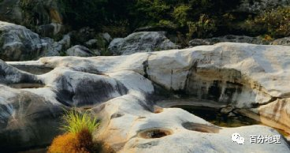   
   
1．关于罗田冰臼的形成过程，下列说法正确的是（  ）   
A．寒冷冰期巨大的冰川在向下运动中不断刨蚀下覆河床而成   
B．山区河谷流水中旋涡带动河底砾石不断研磨河床而成   
C．冰期强劲的冬季风携带砂砾不断磨蚀凸出的岩石而成   
D．冰期后期冰川融水沿冰川裂隙对下覆基岩进行强烈冲击研磨   
2．历史上为了将本地的木材运出去，当地居民“火烧水浇”毁掉了一些高凸的石头。下列地质作用原理与该方法原理最相似的是（  ）   
A．花岗岩石蛋地貌形成过程   
B．高纬度峡湾地貌形成过程   
C．河流中鹅卵石的形成过程   
D．西北新月形沙丘形成过程   
<span style="color: rgb(255, 0, 0);">1．D 在冰期后期，部分冰川融化成水而进入岩石裂缝，水结冰后体积增大使裂缝扩展，故其形态呈现出了口小下大的特征，由于不断的研磨，使得内部空间较大，呈现出肚大的特征，岩块内部的碎石被冰川携带一起移动，使摩擦作用更为强烈，在强烈的冲击研磨下呈现出了底平的特征，D选项正确。冰川向下刨蚀作用会使得冰川表面口径相对较大，呈现出上大下小的特征，A选项错误。从材料可知罗田冰臼是冰川作用和古冰川气候的直接产物，受冰川作用影响较为显著，并非流水作用，B选项错误。风力磨蚀突出的岩石，使得突出的岩石破碎，但并不能形成凹陷的罗田冰臼地貌，C选项错误。故选D。</span>   
<span style="color: rgb(255, 0, 0);">2．A “火烧水浇”利用的是热胀冷缩的原理，使得岩石出现破碎，与自然界的物理风化较为接近。花岗岩石蛋地貌是由于花岗岩在风化作用下，其表层出现许多的石蛋形成的一种地貌，物理风化与冷热有关，二者在原理上较为相似，A选项正确。高纬度峡湾地貌主要是由于冰川侵蚀作用形成，冰川侵蚀作用与热胀冷缩并不相似，B选项错误。河流中鹅卵石的形成主要是受流水侵蚀作用，流水侵蚀作用与热胀冷缩并不相似，C选项错误。西北新月型沙丘主要是受风力沉积作用形成，风力沉积作用与热胀冷缩并不相似，D选项错误。故选A。</span>   
<span style="color: rgb(255, 0, 0);">【点睛】石蛋地形是指花岗岩体的球状风化产物其表层风化物被剥离以后，风化的残余部分多呈球形故名。我国广东南岭山地一带分布的花岗岩体，风化剥蚀后表层分布着许多大小不同的石蛋，构成一种特殊的地形，称石蛋地形。</span>   
（2022·湖南·岳阳市十四中模拟预测）天然海滩位于海陆相互作用的动力敏感地带，是近岸波浪、潮汐、风等动力因子和海滩地形相互作用的结果。依据材料与所学知识，完成下面小题。   
3．天然海滩形成最直接的地质过程主要是（  ）   
A．剥蚀作用   
B．搬运作用   
C．堆积作用   
D．风化作用   
4．只有海退即海岸线向外海迁移，海滩才能形成，下列关于发生海退的情形正确的是（  ）   
①地壳上升②地壳下降③冰期④间冰期⑤全球变暖   
A．①③   
B．①④   
C．②④   
D．②⑤   
<span style="color: rgb(255, 0, 0);">3．C天然海滩形成的最直接的地质作用是在剥蚀作用之后，A选项错误；海滩的形成是海浪搬运后堆积作用形成的，B选项错误，C选项正确；风化作用于海滩的形成没有直接关系，D选项错误，所以选择C选项。</span>   
<span style="color: rgb(255, 0, 0);">4．A海退时，海平面下降，海水向外海后撤，海岸线向外海迁移，早年在海面之下的砂质堆积物被抬升到海平面上，并且在高潮时也不会被海水吞没，就可能形成海滩，地壳上升和冰期时才可能海平面下降，①③正确，A选项正确；间冰期期间海平面会使海平面反复升降，④错误；地壳下降会使海岸线向内迁移，②错误；全球变暖会造成海平面上升，⑤错误，BCD错误，所以选择A选项。</span>   
（2022·内蒙古赤峰·模拟预测）通过沉积物性质可以反推古环境演变。第四纪冰期时，波罗的海及沿岸被斯堪的纳维亚冰盖覆盖。下图示意斯堪的纳维亚冰盖边缘排水方向。以前T被认为是古海滩沉积物，近期研究表明T形成于冰下隧道的环境中，流水挟带物质沿冰下隧道排入大西洋。据此完成下面小题。   
   
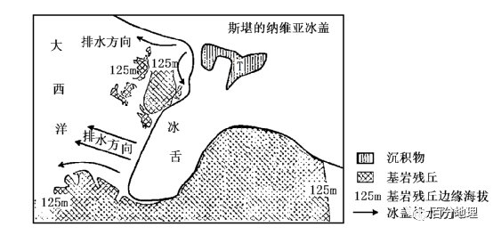   
   
5．以前T被认为是古海滩沉积物，其依据可能是沉积物（  ）   
A．粒径较大   
B．粒径均匀   
C．杂质较多   
D．棱角分明   
6．冰下隧道的形成与扩张得益于（  ）   
A．挤压断裂   
B．流水沉积   
C．冰川侵蚀   
D．流水侵蚀   
7．斯堪的纳维亚冰盖的存在及消融，导致（  ）   
A．消融时北大西洋暖流增强   
B．消融时地表吸热减少   
C．消融后海岸形态趋于平直   
D．消融后地表起伏不平   
<span style="color: rgb(255, 0, 0);">5．B海滩沉积物经海流的侵蚀和搬运作用，粒径变小，磨圆度较好，颗粒大小较为均匀，杂质被海流搬运带走，杂质较少，B正确，ACD错误。</span>   
<span style="color: rgb(255, 0, 0);">6．D根据材料T形成于冰下隧道的环境中，流水挟带物质沿冰下隧道排入大西洋，所以冰下隧道的形成和扩张是受流水侵蚀作用的影响，D正确；本区域位于板块内部，地质结构稳定，少地壳活动，A错误；根据材料第四纪冰期时，波罗的海及沿岸被斯堪的纳维亚冰盖覆盖，所以冰下隧道应是侵蚀作用形成的，B错误；冰川侵蚀主要在冰川外部，形成冰斗、U形谷等，该隧道在冰下，C错误，该题选D。</span>   
<span style="color: rgb(255, 0, 0);">7．D冰川融化，来自极地南下的冷水增多，北大西洋暖流减弱，A错误；冰盖消融后地面裸露，吸热增多，B错误；消融后海岸受冰川侵蚀作用形成较多峡湾，C错误；冰川消融后，留下众多冰碛地貌，地表起伏不平，D正确，该题选D。</span>   
<span style="color: rgb(255, 0, 0);">【点睛】由冰川作用塑造的地貌就叫冰川地貌，冰川地貌分为冰川侵蚀地貌和冰川堆积（也称之为冰碛）地貌。冰川侵蚀地貌：是经冰川侵蚀作用形成的地貌，冰川侵蚀作用是指冰川及其挟带的岩石碎块对冰川基岩的破坏作用，一般分为拔蚀作用和磨蚀作用。冰川侵蚀地貌一般分布于冰川上游，即雪线以上位置，形态类型有角峰、刃脊、冰斗、冰坎、冰川槽谷及羊背石、冰川刻槽等磨蚀地貌。冰川堆积地貌：主要分为终碛垄、侧碛垄、冰碛丘陵、槽碛、鼓丘、蛇形丘、冰砾阜、冰水外冲平原和冰水阶地等。</span>   
8．（2021·河北·高考真题）阅读图文材料，完成下列要求。   
旧石器时代的古人类以采集和狩猎（围猎）为主要谋生方式。20世纪70年代初，在我国北方某地发现一处旧石器中期古人类遗址（下图）。该遗址地处山前冲积-洪积平原区，遗址北面为岩石裸露的山地（北山）。研究表明，古人类在该遗址区生存阶段正值冰期。   
   
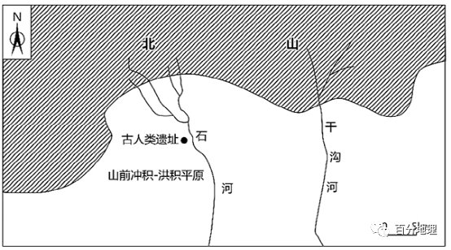   
   
（1）指出冰期气候对旧石器时代古人类生存的主要威胁。   
（2）简析冰期气候下古人类选择该遗址区生存的原因。   
<span style="color: rgb(255, 0, 0);">【答案】（1）冰期气候寒冷，人类生存面临低温的威胁；气候寒冷，动植物种类少，食物来源缺乏。</span>   
<span style="color: rgb(255, 0, 0);">（2）位于北山南麓，海拔较低，且处于山地阳坡地带，北山岩石裸露，升温相对较快，北山对冷空气的阻挡较强，热量条件较好；地处山前冲积-洪积平原区，水源相对充足，土壤相对肥沃，动植物资源相对较多，便于人类采集和狩猎活动的开展。</span>   
<span style="color: rgb(255, 0, 0);">【解析】（1）首先，冰期地球气候寒冷，当时的经济发展水平低，人类制作保暖衣服和房屋的能力弱，人类生存面临低温的威胁；其次，由于冰期气候寒冷，动植物种类少，导致人类的食物来源极其缺乏。（2）本题主要注意该遗址的地理位置，并且要结合上题“冰期气候对旧石器时代古人类生存的主要威胁”分析作答，冰期气候下古人类选择该遗址区生存，表明该处热量条件相对较好，食物来源也相对较好。该遗址位于北山南麓，海拔较低，且处于山地阳坡地带，北山岩石裸露，升温相对较快，加之北山对冷空气的阻挡，热量条件相对较好；其次，该遗址地处山前冲积-洪积平原区，水源相对充足，土壤相对肥沃，动植物资源相对较多，便于人类采集和狩猎活动的开展。</span>   
9．（2022·广东佛山·一模）阅读图文材料，回答下列要求。   
斯堪的纳维亚半岛是欧洲最大的半岛，形成于1亿多年前的斯堪的纳维亚山脉横亘半岛，最高峰加尔赫峰海拔2468米。第四纪冰期时，斯堪的纳维亚大冰盖面积达660万平方千米，厚度3000米，向南覆盖到48°N的广大欧洲地区，古冰川作用显著。距今12000-8000年时，冰川消退，菠萝的海形成。下图示意斯堪的纳维亚半岛的位置和地形。   
   
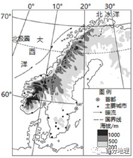   
   
(1)说出斯堪的纳维亚山地的地形特征。   
(2)推测第四纪以来波罗的海的形成过程。   
(3)说明斯堪的纳维亚半岛现在仍有冰川存在的原因。   
<span style="color: rgb(255, 0, 0);">【答案】(1)呈东北-西南走向；多为低山（山地海拔较低）；西坡较陡峻，东坡较平缓；冰川地貌广布。</span>   
<span style="color: rgb(255, 0, 0);">(2)第四纪时冰川覆盖，受冰川侵蚀形成低地；冰川消退，低地（海盆）出露；海水进入，形成海洋。</span>   
<span style="color: rgb(255, 0, 0);">(3)受暖流和西风影响，山地降水（雪）丰富，积雪量大。纬度高，气温低；山地面积大，山地海拔较高，气温低，冰川消融量小。</span>   
<span style="color: rgb(255, 0, 0);">【解析】（1）根据图中经纬网信息可知，斯堪的纳维亚山地呈东北-西南走向；西北部海拔在1000米以上，东南部海拔在1000米以下，多为低山，也说明西北坡较陡峻，东南坡较平缓，根据题干内容可知，该山脉西海岸多峡湾地貌，为 冰川侵蚀作用形成的，说明冰川地貌广布。（2）第四纪冰期时，斯堪的纳维亚半岛是欧洲冰川的发源地，冰川覆盖，受冰川侵蚀形成低地；之后随着气温回升，冰川消退，海盆出露，海水进入到低地中，形成海洋。（3）位于西风的迎风坡，暖湿气流受地形抬升，多地形雨，，北大西洋暖流的增温加湿，使山地降水（雪）丰富，积雪量大。主要位于北纬60度以北的地区，纬度高，气温低，积雪不易融化；山区面积广大，山脉海拔较高，气温低，冰川消融量小。</span>   
10．（2022·湖北·襄阳五中模拟预测）阅读图文材料，完成下列要求。   
雅鲁藏布江位于青藏高原南部，两岸支流峡谷，多古冰川地貌。研究发观，流域内干支流交汇处的宽谷河段广泛发育坡前黄土沉积地貌，且黄土的粒径明显小于砂粒。其形成时间多是末次冰期以后，且不同基岩性质的山坡前均有分布。有学者研究提出该地沉积地貌发育概念模型（下图）：冰期，山坡主要被冰川和冰川沉积物覆盖。冰期末期，冰川沉积物受冰雪融水的搬运作用形成洪（冲）积扇。间冰期，该地谷风（即近地面从谷地吹向山坡的风）作用显著。   
   
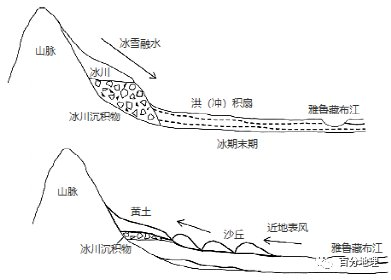   
   
(1)说明冰期末期该地区洪（冲）积扇的形成过程。   
(2)与沙丘相比，该地区黄土沉积地貌分布更靠近坡前，试分析原因。   
<span style="color: rgb(255, 0, 0);">【答案】(1)冰期末期，大量冰川融化；大量冰雪融水在支流峡谷中流速快，搬运作用显著，大量冰川沉积物被搬运至山谷出口；出山后，地势变缓，且干流河谷宽阔，水流变宽流速减缓，沉积物堆积形成洪（冲）积扇。</span>   
<span style="color: rgb(255, 0, 0);">(2)间冰期，雅鲁藏布江河谷沉积物出露于水面，其搬运、沉积主要受风力作用影响；风力搬运、沉积具有分选性；该地盛行谷风，（河谷沉积物中的）黄土粒径小于砂粒，体积小，质量轻，因此能被风力搬运至更远的距离，更高的地方（至山坡前）。</span>   
<span style="color: rgb(255, 0, 0);">【解析】（1）根据“学者研究提出该地沉积地貌发育概念模型：冰期，山坡主要被冰川和冰川沉积物覆盖。冰期末期，冰川沉积物受冰雪融水的搬运作用形成洪（冲）积扇”进行分析：冰期，山坡主要被冰川和冰川沉积物覆盖，松散物质多，为洪积扇的形成提供物质来源。冰期末期，气温升高，大量冰川融化形成冰雪融水，冰川沉积物出露地表；大量冰雪融水在支流峡谷中流速快，搬运作用显著,大量冰川沉积物被搬运至山谷出口；出山后，由于地势变缓，且河流的河道变宽，水流变宽流速减缓，搬运能力减弱，大量的堆积物在出山口堆积，沉积物堆积形成洪（冲）积扇。（2）由材料“间冰期，该地谷风(即近地面从谷地吹向山坡的风)作用显著”可知，间冰期,雅鲁藏布江河谷沉积物出露,河谷地带是砂砾与黄土沉积物的来源，其搬运、沉积主要受风力作用影响，风力搬运、沉积具有分选性；该地盛行谷风，风从河谷吹向山麓，风力逐渐降低，因此颗粒较大的砂砾先沉积、颗粒较小的黄土后沉积。河谷沉积物中的黄土粒径小于砂粒，体积小，质量轻，因此能被风力搬运至更远的距离，更高的地方至山坡前。</span>   
11．（2022·全国·模拟预测）阅读图文材料，回答下列问题。   
地质历史冰期时代，沙漠的分布较为广泛，许多今日的海洋曾经是古代的沙漠。随着气候的变化和海面的升降波动，辽东半岛形成了多级不同高度的成层地貌面，堆积了不同时期的黄土。黄土主要分布在辽东半岛的西侧和西北侧，自坡麓向上黄土逐渐变薄乃至消失。在风力作用的黄土中，既有来自内陆地区的粉尘，又有来自附近海底平原的粉尘。下图为大连周家沟黄土地层剖面示意图，黄土层下部发育有较厚的红土层（石灰岩在湿热的气候下长期风化形成了红土风化壳）。   
   
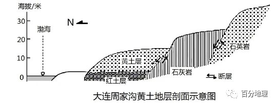   
   
(1)简述辽东半岛黄土厚度自坡麓向上逐渐变薄乃至消失的原因。   
(2)分析周家沟黄土层下部发育较厚红土层的地质过程。   
(3)说明渤海海底沉积物成为辽东半岛黄土物质来源的必要条件。   
<span style="color: rgb(255, 0, 0);">【答案】(1)自坡麓向上风力沉积减弱，粉尘沉积减少；气候湿润期流水作用强烈，坡上黄土不断被侵蚀，搬运至坡下沉积。</span>   
<span style="color: rgb(255, 0, 0);">(2)（间冰期气候湿润，化学风化、淋溶作用和流水作用强烈）石灰岩在湿热气候条件下不断风化形成红土风化壳；受地壳不断隆起抬升的影响，流水不断侵蚀，大量红土风化物被搬运至坡下沉积；后气候趋于干冷（冰期），风力作用旺盛，黄土沉积并覆盖于红土层之上，红土层存于黄土层之下。</span>   
<span style="color: rgb(255, 0, 0);">(3)渤海海域封闭，陆地环绕，四周入海河流带来丰富的泥沙，海底平原沉积有大量的沙质沉积物；渤海海域水深较浅，冰盛期海平面下降，大陆架裸露，渤海（北部浅海）成为陆地（或冰期气候干旱形成沙漠）；冰期冬季环流（偏西风）势力强劲（侵蚀和搬运能力强），在风力的作用下向东搬运，沉降在辽东半岛。</span>   
<span style="color: rgb(255, 0, 0);">【解析】 (1)由材料“黄土主要分布在辽东半岛的西侧和西北侧，自坡麓向上黄土逐渐变薄乃至消失。在风力作用的黄土中”可知，该黄土堆积是风力作用形成的。结合所学知识，来自内陆地区的粉尘和有来自附近海底平原的粉尘在风力侵蚀作用下带到此地并沿着山坡爬升，随着自坡麓向上风力沉积减弱，风力携带粉尘的能力下降，粉尘沉积逐渐向上减少。气候湿润期时降水较多，地表径流较多，流水侵蚀作用强烈，坡上黄土不断被侵蚀、搬运至坡下沉积，形成了黄土厚度自坡麓向上逐渐变薄乃至消失的现象。(2)本题主要从红土层、较厚和覆盖于黄土层之下三个角度进行分析。根据材料“黄土层下部发育有较厚的红土层（石灰岩在湿热的气候下长期风化形成了红土风化壳）”可知，红土层是在湿润环境下形成的。结合材料可知，间冰期该地气候湿润，化学风化、淋溶作用和流水作用强烈，石灰岩在湿热气候条件下不断风化形成红土风化壳。后受地壳不断隆起抬升的影响，流水不断侵蚀，大量红土风化物被搬运至坡下沉积，形成了较厚的黄土风化物。后气候趋于干冷（冰期），风力作用旺盛，大量的黄土被风力作用带至该地沉积并覆盖于红土层之上，使得红土层存于黄土层之下，最终形成了黄土层下部发育较厚红土层的现象。(3)根据所学知识可知，渤海位于辽东半岛的西南部，该海域地形封闭，陆地环绕，较多的河流从四周流入渤海，入海的河流带来丰富的泥沙，在海底平原沉积，因而海底有大量的沙质沉积物。渤海海域以大陆架为主，泥沙较厚，水深较浅。冰盛期海平面下降，水位较低，大陆架裸露，渤海地势较高处（北部浅海）成为陆地，海底泥沙裸露，成为辽东半岛黄土的物质来源（或冰期气候干旱，蒸发旺盛，泥沙的水分被蒸发掉，水分较少，泥沙疏松形成沙漠）。冰期时气候干旱，冬季疏松的泥沙在势力强劲的冬季风（偏西风）的侵蚀和搬运下向东搬运，遇到丘陵的阻挡，风力减弱，泥沙沉降在辽东半岛，成为辽东半岛黄土的物质来源。</span>   
12．（2022·山东·昌乐博闻学校模拟预测）读图文材料，完成下列要求。   
马尔代夫群岛由自然环礁组成。据考证，最初马尔代夫海平面以每千年15m的速度上升；距今7000～6000年，海平面上升速度约为每千年2m；距今6000年以来，海平面上升速度为每千年25cm，从此时开始马尔代夫海域出现珊瑚岛礁。形成珊瑚岛礁的珊瑚虫生活在浅海水域，适宜温度为22～32℃。有人提出随着全球气候变暖，马尔代夫群岛在近100年内可能会消失。下左图示意马尔代夫地理位置，下右图示意马尔代夫近1万年以来的气温变化。   
   
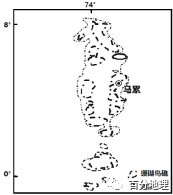   
   
(1)据材料说明近1万年来全球气温变化的特点。   
(2)分析冰期结束后的前期气温上升并不明显，而海平面上涨幅度大的原因。   
(3)就材料中马尔代夫群岛消亡论提出你的观点并说明理由。   
<span style="color: rgb(255, 0, 0);">【答案】(1)特点：气温波动变化；温暖期与寒冷期交替出现；温暖期较长，寒冷期较短。</span>   
<span style="color: rgb(255, 0, 0);">(2)冰川分布范围广，低纬度地区增温明显，高山冰雪融水量大；冰期时海平面下降，大洋总面积小，冰雪融水注入时，海平面上升快；冰川融化形成洪水，搬运能力强，泥沙入海量大，海洋淤积快（导致海平面升高）。</span>   
<span style="color: rgb(255, 0, 0);">(3)不会消亡。理由：气温升高，更有利于珊瑚虫的生长、繁殖和遗体沉积；海水上涨幅度缓慢﹐珊瑚沉积的速度比海水上涨速度快。</span>   
<span style="color: rgb(255, 0, 0);">或消亡。理由：大气中CO<sup>2</sup>浓度增加导致气候变暖的同时，海水酸性增强，影响珊瑚虫的生长、繁殖，不利于生物沉积；岛礁增长的速度比海水上涨的速度慢；人类盗采珊瑚，对岛礁破坏作用强，加剧其消失。</span>   
<span style="color: rgb(255, 0, 0);">【解析】（1）读图可知：近1万年来全球气温波动变化；出现温暖期与寒冷期交替出现；且温暖期较长，寒冷期较短。</span>   
<span style="color: rgb(255, 0, 0);">（2）海平面上涨幅度大的原因。主要从气温对积雪、冰川、海平面的影响思考，同时也还要考虑入海泥沙量。根据所学知识冰期时陆地被大规模冰川覆盖的时期，虽冰期结束后的前期气温上升并不明显，但低纬度地区增温明显，冰川、高山冰雪融水量大；低纬度海平面受热，也会膨胀上升；冰期时海平面下降，大洋总面积小，冰雪融水注入时，海平面上升快；冰川融化形成洪水，洪水搬运能力强，携带泥沙入海量大，致使海洋淤积快，导致海平面升高。</span>   
<span style="color: rgb(255, 0, 0);">（3）不会消亡。主要从该岛的成因思考，理由：形成珊瑚岛礁的珊瑚虫生活在浅海水域，适宜温度为22～32℃。由于气温升高，海水温度适宜珊瑚虫的生长、繁殖和遗体沉积；气温上升较小，海水上涨幅度缓慢﹐而珊瑚沉积的速度比海水上涨速度快。或消亡。主要从海平面上升，人类对岛礁破坏等方面思考。理由：由于人类活动排放大量二氧化碳，导致全球变暖，海平面膨胀上升；两极冰川融化，加剧海平面上升；同时人类活动影响珊瑚虫的生长、繁殖，不利于生物沉积，可能导致岛礁增长的速度比海水上涨的速度慢；再加上某些区域人类盗采珊瑚，对岛礁破坏作用强，会加剧其消失。</span>   
13．（2021·河南新乡·三模）阅读图文材料,完成下列要求。   
泰瑞尔湖是澳大利亚目前最大的盐湖，气候变化对泰瑞尔湖湖水性质、沉积物性质、生态系统有复杂的影响。地球表面覆盖有大规模冰川的地质时期被称为冰期，大冰期中相对温暖的时期称为间冰期。有学者研究表明,末次间冰期泰瑞尔湖曾经达到最大面积,此后逐渐萎缩,湖岸逐渐形成一系列沙丘,植被覆盖度降低。当气候进一步变冷,进入末次盛冰期时,水域面积最小,土壤水盐环境发生变化,植被覆盖度有所回升。末次盛冰期至今，由于大气高压强度的减弱,该地区气候逐渐向暖湿化方向发展,干涸盐壳重新积水,形成现代的盐湖。下图为末次间冰期以来泰瑞尔湖面积萎缩示意图。   
   
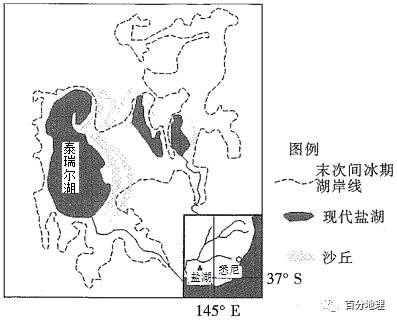   
   
（1）分析泰瑞尔湖湖盆所在地区的地势特征。   
（2）从末次间冰期到末次盛冰期,湖区植被覆盖度先降低后升高,试分别说明原因。   
（3）分析末次盛冰期至今大气高压强度减弱对泰瑞尔湖湖泊面积的影响。   
（4）有人认为湖岸沙丘会持续扩大,你是否赞同这一观点?请表明态度并阐述理由。   
<span style="color: rgb(255, 0, 0);">【答案】（1）湖泊萎缩率较高,且东（北）部萎缩面积大于西部,说明地势整体平坦,东高西低,且东（北）部坡度最小。</span>   
<span style="color: rgb(255, 0, 0);">（2）先降低的原因:末次间冰期之后,气候逐渐变冷、变干,水热条件恶化；湖泊面积萎缩,湖岸盐碱化加重,不利于植被生长。后升高的原因:水域面积继续缩小，湖水侧渗减弱,地下水水位进一步下降,部分耐盐植物在干涸湖盆中生长。</span>   
<span style="color: rgb(255, 0, 0);">（3）泰瑞尔湖及其入湖河流以大气降水补给为主；盘踞澳大利亚大陆的副热带高压减弱、范围收缩,有利于盛行西风深入内陆,给泰瑞尔湖流域带来丰沛降水,导致湖泊面积扩大；性质干热的副热带高压减弱,湖水蒸发减少,湖泊储存的水量增加。</span>   
<span style="color: rgb(255, 0, 0);">（4）赞同理由:夏季受副热带高气压带控制,晴朗干燥；历史上湖泊萎缩,湖盆粉砂淤泥广泛分布；古湖盆地势平坦,堆积空间广阔；或不赞同理由:末次盛冰期以来气候向暖湿化演变；夏季盛行下沉气流,风速较小；冬季受西风控制,盐湖水位较高,风沙活动微弱。</span>   
<span style="color: rgb(255, 0, 0);">【解析】(1) 由题干可知，该地区湖泊萎缩率较高,由图可知，东(北)部萎缩面积大于西部，说明地势整体平坦，东高西低，且东(北)部坡度最小。(2)末次间冰期泰瑞尔湖曾经达到最大面积，此后逐渐菱缩，湖岸逐渐形成一系列沙丘，植被覆盖度降低。因为末次间冰期之后,气候逐渐变冷、变干，水热条件恶化;湖泊面积萎缩，湖岸盐碱化加重不利于植被生长。当气候进一步变冷，进入末次盛冰期时，水域面积最小，土壤水盐环境发生变化，植被覆盖度有所回升。因为水域面积继续缩小，湖水侧渗减弱，地下水水位进一步下降，部分耐盐植物在干涸湖盆中生长。(3)由题干可知:末次盛冰期至今，由于大气高压强度的减弱，该地区气候逐渐向暖湿化方向发展，干涸盐壳重新积水，形成现代的盐湖。泰瑞尔湖及其入湖河流以大气降水补给为主;影响澳大利亚大陆的副热带高压减弱、范围收缩，有利于盛行西风深入内陆，给泰瑞尔湖流域带来丰沛降水，导致湖泊面积扩大;性质干热的副热带高压减弱，湖水蒸发减少，湖泊储存的水量增加。(4)湖岸沙丘是否会持续扩“大可从气候变化、沙源等方面分析，如果赞同，则沙丘扩大的理由是该地区夏季受副热带高气压带控制，晴朗干燥;历史上湖泊萎缩，导致湖盆粉砂淤泥广泛分布;古湖盆地势平坦堆积空间广阔,有利于沙丘面积扩展;或不赞同沙丘扩大,理由是该地区末次盛冰期以来，气候向暖湿化演变;夏季盛行下沉气流，风速较小;冬季受西风控制，盐湖水位较高，风沙活动微弱。【点睛】(1)泰瑞尔湖湖盆所在地区的地势特征可以根据坡度、湖泊萎缩率等角度分析。(2)湖区植被覆盖度先降低后升高的原因可以从气候变化、土壤水盐环境变化等角度分析。(3)大气高压强度减弱对泰瑞尔湖湖泊面积的影响主要从湖泊面积、湖泊储水量等角度分析。(4) 赞同的理由可以从气候变干、沙源等角度分析;不赞同的理由可以从气候变湿、风力减小等角度分析。</span>   
14．（2021·山东·模拟预测）阅读图文材料，完成下列要求。   
区域的海陆分布态势受地质运动和气候变化影响显著。台湾海峡在地质历史时期历经多次断裂下沉，局部存在隆起。距今7万年前地球进入末次冰期，当时台湾海峡部分出露海平面，发育有古河流、森林；海平面较低时，“东山陆桥”（福建东山岛—台湾浅滩—澎湖列岛—台南海底隆起）连通大陆和台湾岛。进入全新世，气候渐暖，海平面回升；距今8500年前后，台湾海峡最终被淹没于海底。下图示意台湾岛周边等深线分布及东山陆桥位置。   
   
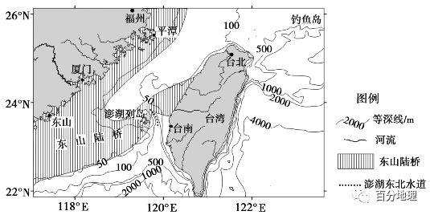   
   
（1）据图说明台湾岛东西两侧近岸海域的水深差异。   
（2）从地质运动角度简述台湾海峡的形成过程。   
（3）在台湾岛上发现有原本生活在淮河流域的古菱齿象化石，试推测冰期时古菱齿象迁至台湾岛的地理原因。   
<span style="color: rgb(255, 0, 0);">【答案】（1）东侧近岸海域等深线密集且数值较大，说明水深较深且变化大；西侧近岸海域等深线稀疏且数值较小，说明水深较浅且变化较小。</span>   
<span style="color: rgb(255, 0, 0);">（2）地处板块边界，地壳运动活跃，断层发育，台湾海峡所处地带整体下沉，形成地堑，后被海水淹没，最终形成海峡。</span>   
<span style="color: rgb(255, 0, 0);">（3）冰期时，淮河流域因纬度较高，气候寒冷，食物较少；台湾岛纬度较低，水热较充足，食物较多；海平面下降，东山陆桥出露海平面，连通海峡两岸。</span>   
<span style="color: rgb(255, 0, 0);">【解析】（1）水深状况需要依据等深线数值及分布疏密判断：东侧近岸海域等深线密集且数值较大，说明水深较深且变化大；西侧近岸海域等深线稀疏且数值较小，说明水深较浅且变化较小。（2）材料显示台湾海峡地质历史时期历经多次断裂下沉，可知该区域经历了地壳断裂下沉运动；结合该区域位于亚欧板块与太平洋板块的碰撞消亡边界，可得出台湾海峡地区地壳断裂下沉形成地堑，后被海水淹没成为海峡。（3）依据材料并结合所学知识，推知由于气候逐渐变冷，喜暖的古菱齿象从淮河流域向南迁徙；此时“东山陆桥”连通了海峡两侧的陆地，便利的地形和温湿的气候（植被生长好，有食物来源）为古菱齿象进入台湾岛提供了条件。</span>   
15．（2021·山东·模拟预测）阅读图文资料，完成下列要求。   
末次冰期进入最盛之时（约2.1万年前），全球气温降低8-13℃，当时我国东部海面下降了大约130米，渤海陆架出露，呈现沙漠景观。距今1.8-1.2万年，气温回升。距今8000年开始，原先出露的陆架又变成海洋环境。据科研钻探显示，渤海东南部海底存在埋藏黄土，部分黄土出露于沿岸。该区域黄土颗粒粒径明显大于黄土高原的黄土颗粒粒径，且在黄土中发现了海相有孔虫（单细胞动物）化石。下图为渤海海区埋藏黄土与出露黄土分布及成因模式图。   
   
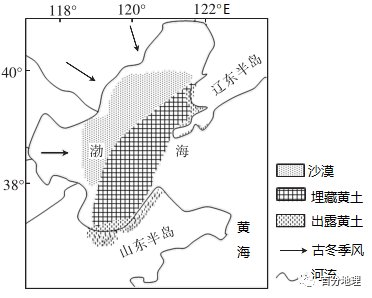   
   
（1）专家判断：渤海黄土来自末次冰期渤海陆架的沙漠，与黄土高原的黄土来源不同。请你说明专家的判断依据。   
（2）说明渤海海底黄土形成及被埋藏的过程。   
<span style="color: rgb(255, 0, 0);">【答案】（1）渤海西部没有黄土沉积（或该处的黄土与黄土高原的黄土不连续，或仅在渤海陆架的东南部有黄土）；若同源，则该处黄土颗粒粒径应该比黄土高原黄土颗粒粒径小（或该处颗粒粒径比黄土高原颗粒粒径大）；渤海黄土里有海洋生物化石，黄土高原的黄土无海洋生物化石（或该处黄土与西部沙漠物质成分相似）。</span>   
<span style="color: rgb(255, 0, 0);">（2）末次冰期，冬季风将渤海陆架西北部的沙漠（细）颗粒（侵蚀）搬运，在东南部沉积而成。冰期结束，海平面上升淹没陆架，海水沉积，埋藏黄土。</span>   
<span style="color: rgb(255, 0, 0);">【解析】（1）注意材料信息“当时我国东部海面下降了大约130米，渤海陆架出露，呈现沙漠景观”、“据科研钻探显示，渤海东南部海底存在埋藏黄土，部分黄土出露于沿岸。该区域黄土颗粒粒径明显大于黄土高原的黄土颗粒粒径，且在黄土中发现了海相有孔虫（单细胞动物）化石”。首先，读图可知，渤海西部没有黄土沉积，黄土高原的黄土主要受西北风的影响，物质颗粒来自西北内陆以及中亚等广大干旱沙漠区，如果渤海黄土与黄土高原的黄土同源，则受风力搬运的影响，其黄土粒径在空间分布上应具有明显的分选性，即该处黄土颗粒粒径应该比黄土高原黄土颗粒粒径小，但实际是该处颗粒粒径比黄土高原颗粒粒径大。同时，如果渤海黄土与黄土高原的黄土同源，则渤海西部也应有黄土沉积，不会使得该处的黄土与黄土高原的黄土在分布上不连续；其次，该处黄土中发现了海相有孔虫（单细胞动物）化石，而黄土高原的黄土无海洋生物化石，所以推断渤海黄土来自末次冰期渤海陆架的沙漠，与黄土高原的黄土来源不同。（2）注意图中沙漠分布、埋藏黄土分布以及古冬季风等信息。在末次冰期，我国东部海面下降了大约130米，渤海陆架出露，呈现沙漠景观，受古冬季风的影响，风力搬运渤海陆架西北部的沙漠细颗粒并在南部沉积，形成黄土层；之后，随着间冰期到来，气候变暖，海平面上升淹没陆架，区域接受海水沉积，原先形成的黄土层被埋藏，形成埋藏黄土层。</span>   
16．（2022·广东·模拟预测）阅读图文材料，完成下列要求。   
冰川是由常年积雪形成的，具有流动性。白水一号冰川位于青藏高原东南缘、横断山最南端的玉龙雪山，是亚欧大陆最南边的小型山地冰川。白水一号冰川对气候变化极为敏感，自小冰期（17～19世纪）以来出现过不同程度的进退。下图示意白水一号冰川自小冰期以来不同时期的冰川末端海拔。   
   
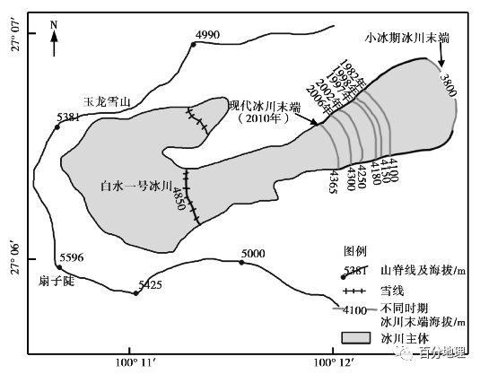   
   
（1）指出图示冰川主体分布区的地形，并分析冰川主体分布于此的原因。   
（2）图示白水一号现代冰川末端海拔与雪线不一致，请对此做出合理解释。   
（3）根据白水一号冰川末端海拔变化，判断小冰期以来的气候变化趋势，并分析可能的原因。   
<span style="color: rgb(255, 0, 0);">【答案】（1）地形：山谷。</span>   
<span style="color: rgb(255, 0, 0);">原因：该地海拔高，降雪是其大气降水的主要形式，降雪量大；山脊坡度大，风力强劲，不利于积雪；山谷海拔低，积雪多而厚，在重力和压力的双重作用下形成冰川，堆积于山谷地带。</span>   
<span style="color: rgb(255, 0, 0);">（2）雪线以上海拔高、气温低，常年积雪，进而发育成冰川；冰川易下滑，并在雪线下方积累，冰川规模不断增大；雪线下方夏季高温期短，不足以融化雪线下方全部冰川，使冰川常年存在，导致冰川末端海拔低于雪线。</span>   
<span style="color: rgb(255, 0, 0);">（3）小冰期以来，冰川总体呈消退趋势，反映了小冰期以来气候呈变暖趋势。</span>   
<span style="color: rgb(255, 0, 0);">自然原因：地球处于间冰期，平均气温呈上升趋势。</span>   
<span style="color: rgb(255, 0, 0);">人为原因：大量燃烧化石燃料，排放大量CO2等导致大气中温室气体增加；大面积砍伐森林，导致CO2吸收减少，大气中CO2浓度上升。</span>   
<span style="color: rgb(255, 0, 0);">【解析】（1）图示高海拔山峰连线为山脊线，并没有现代冰川；但两山脊线之间的地区出现冰川主体，应是海拔较低的山谷地区。冰川主体分布于山谷地区的原因主要从山区海拔高、降雪量大，山谷积雪多、形成冰川来分析。山区海拔高，降水的主要形式为降雪，但是山脊的坡度大，积雪易滑落，加之多大风，所以积雪条件差，而山谷地区海拔相对较低（注意区域的整体海拔高），坡度相对和缓，积雪量大。而冰川是由常年积雪形成的，具有流动性，山谷地区常年积雪，在压力和重力的作用下形成冰川，堆积在山谷地带。（2）雪线是常年积雪带的下界，雪线以上年降雪量大于年消融量，形成常年积雪，进而发育成冰川；冰川易下滑，雪线以下的冰川靠雪线以上的冰川补给，冰川规模不断增大；冰川在夏季温度上升后，逐渐融化，但高山地区夏季短暂，不足以融化雪线下方规模较大的冰川，导致冰川末端海拔低于雪线。（3）注意限定词“冰川末端海拔变化”“判断小冰期以来的气候变化趋势”。结合图示来看，小冰期以来，白水一号冰川末端海拔整体呈上升趋势，冰川总体消退，说明气候整体变暖。全球气候变暖的原因，回归教材知识从自然和人为两方面作答即可。自然原因：目前地球处于间冰期时期，平均气温呈上升趋势；人为原因：主要是大气中以二氧化碳为主的温室气体含量增多导致，一方面，由于人类社会经济的发展，大量燃烧化石燃料，排放大量CO<sub>2</sub>等，导致大气中温室气体增加；另一方面，由于人类活动导致森林等植被破坏，植被对CO<sub>2</sub>吸收减少。最终导致全球气候变暖，冰川总体呈消退趋势。</span>