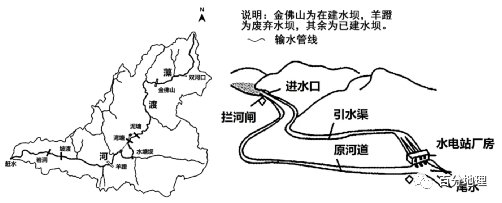
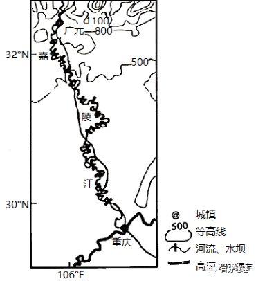

# 微专题之074 从产业结构角度分析区域发展

```
本专题摘自“百分地理”公众号，如有侵权请告之删除，谢谢。联系hhwxyhh@163.com
```

------

一、单选题   
（2022·四川·高三阶段练习）锦屏二级水电站位于川西雅砻江锦屏大河弯上，在150km弯道上，落差达310米（如下图），装机容量480万千瓦，是我国“西（川）电东送”战略性工程。水电站采用截弯取直开挖隧洞引水发电，首部拦河闸仅高37m。完成下面小题。   

   

1．该段雅砻江（  ）   
A．含沙量大   
B．冬季结冰   
C．汛期较短   
D．水流湍急   
2．比较而言，水电站修建中遇到的最大困难是（  ）   
A．汛期安全度汛   
B．地质灾害防范   
C．地表植被恢复   
D．自然遗产保护   
3．与三峡水电站相比，锦屏水电站开发的优势是（  ）   
A．发电四季稳定   
B．航运改善明显   
C．灌区面积更大   
D．移民规模较小   
<span style="color: rgb(255, 0, 0);">1．D根据材料可知，图示雅砻江河段，落差达310米，故水流湍急，D正确；图示雅砻江河段地处亚热带季风气候区，植被覆盖率较高，含沙量较小、冬季不结冰、汛期较长，A、B、C错误。故选D。</span>   
<span style="color: rgb(255, 0, 0);">2．B雅砻江地处我国西南地区，地壳运动活跃，地质灾害多发，故地质灾害防范是水电站修建中遇到的最大困难，B正确；汛期安全度汛、地表植被恢复以及自然遗产保护都是水电站修建中遇到的困难，但与地质灾害防范相比，对水电站修建的阻碍作用较小，故A、C、D排除。故选B。</span>   
<span style="color: rgb(255, 0, 0);">3．D锦屏水电站地处我国经济发展相对落后，人口密度相对较小的西南地区，与三峡水电站相比移民规模较小，D正确；锦屏水电站地处亚热带季风气候区，河流流量季节变化大，发电量的季节变化明显，A错误；锦屏水电站地处落差达310米的河段，对航运的改善并不明显，B错误；锦屏水电站地处山区，耕地面积较小，灌区面积较小，C错误。故选D。</span>   
（2022·湖南·高三期中）藻渡河发源于重庆市南部金佛山，流经贵州北部，最终在重庆市赶水镇汇流进入綦江。河道全长102千米，总落差1550米。该流域是典型的峡谷地形，两岸多峭壁。该河干流多采用引水式水电站发电。引水式水电站由栏河闸、引水渠和水电站厂房等组成，通常在落差较大的河段，建一条引水渠直接把水从上游引到下游来发电。左图为藻渡河水系示意图，右图为引水式水电站布局方式示意图。完成下列小题。   

   

4．藻渡河采用引水式水电站的目的是（  ）   
A．充分利用当地的优势自然条件   
B．保护原河道生态环境   
C．增大水流落差，增加发电量   
D．利用拦河闸，减轻原河道洪涝灾害   
5．采用引水式水电站对原河道的影响是（  ）   
A．原河道径流量的变化不大   
B．原河道水生生态环境趋好   
C．原河道附近地下水水位升高   
D．陆生植物生存环境恶化   
<span style="color: rgb(255, 0, 0);">4．C引水式水电站通过拦河闸拦截河流径流，利用坡降平缓的引水渠，将水引流至水电站厂房上方，以提高水位增加势能，C正确；对当地优势自然条件的充分利用，是利用，不是目的，A错误；引水式水电站通过拦河闸拦截河流径流，会导致原河道径流变小，甚至断流，导致该河段水生生态环境破坏，B错误；引水式水电站没有建蓄水水库，不具备防洪功能，D错误。故选C。</span>   
<span style="color: rgb(255, 0, 0);">5．D结合材料分析，采用引水式水电站会使原河道径流变小，甚至断流，A错误。河流水生生物被迫迁移，阻碍了鱼类的洄游通道，导致该河段水生生态环境破坏，B错误。使得该河段附近地下水水位降低，C错误。陆生植物生存环境恶化，D正确。故选D。</span>   
（2023·山东·高三专题练习）位于北京市通州城区的北关水利枢纽是世界遗产京杭大运河上的重要水利工程，由拦河闸、分洪闸、连通渠组成（下图）。2020年某月该水利枢纽开展潮汐式调度试点，即闸门开启孔数由原来全天固定改为分时段调节（下表）。据此完成下面小题。   

   

6．采取潮汐式调度的主要目的是（  ）   
A．冲刷河床淤泥   
B．稳定沿线供水   
C．加快河水自净   
D．削减河流洪峰   
7．在潮汐式调度期间，图中a、b两处在8时开闸前的水位、开闸后连通渠表层的水流方向分别是（  ）   
A．a=b;b→AB．a>b;a→BC．a<b;b→A</b;b→aD．a=b;a→B8．一年中最不适宜持续按表3时间实施潮汐式调度的季节是（  ）   
A．春季   
B．夏季   
C．秋季   
D．冬季   
<span style="color: rgb(255, 0, 0);">6．C阅读图文材料，结合所学知识，如果河流支流进入库区流速较缓，在适当的温度和光照条件下，水体富含营养盐，将可能导致水华。而潮汐式的调度，可以在水流速度上做出调整，加速支流水体中营养盐流失，因此主要目的是为了净化河水，故C正确；该河流是人工运河，流经地区水流冲刷能力较弱，含沙量较少，因此冲刷河床淤泥不是主要目的，故A错误；没有使用潮汐式调度前，全天固定供水更加保障，故B错误；当河流出现洪峰时，分洪闸将全面开启，就不是潮汐式调度，故D错误。答案选择C。</span>   
<span style="color: rgb(255, 0, 0);">7．D根据题意，结合所学知识，表中数据显示在17:00到次天8:00不开孔，过闸流量为零，因此开闸前ab水位是一致，当开闸后，拦河闸平均过闸量小于分洪闸平均过闸量，因此分洪闸水位下降快，导致连通渠水由a流向b，故答案为a=b，a→b，D选项符合题意，排除ABC。答案选择D。</span>   
<span style="color: rgb(255, 0, 0);">8．B材料显示该水利枢纽位于北京市通州城区，属于温带季风气候，夏季高温多雨，降水量大且集中，已发生洪峰，因此在夏季最不是以持续按照表中时间实施潮汐式调度，故B正确，排除ACD。答案选择B。</span>   
<span style="color: rgb(255, 0, 0);">【点睛】潮汐式生态调度方法，即在满足下游用水及通航等要求的前提下，通过调控水利工程内水库的蓄泄水过程，在库区内形成有一定幅度的水位涨落过程，即起到一定的类似潮汐作用。当发生潮汐作用时，水位表现为持续上升或下降，将影响支流库湾异重流的潜入位置和潜入距离，进而打破支流水体分层，影响支流库湾水华的发生，达到净化水质的作用。</span>   
（2023·全国·高三专题练习）锦屏二级水电站位于四川省雅砻江锦屏大河弯上（右图），装机规模480万千瓦，是我国“西电东送”“川电东送”战略性关键工程，水电站通过截弯取直开挖隧洞引水发电，首部拦河闸仅高37m，据此完成下面小题。   

   

9．影响锦屏二级水电站选址的主导因素是（  ）   
A．径流季节变化小   
B．地质基础稳定   
C．人口密度小   
D．地势落差大   
10．与三峡水电站相比，锦屏水电站开发方式的优势是（  ）   
A．发电量季节变化小   
B．航运条件改善明显   
C．减少耕地淹没和移民搬迁   
D．拦沙效果好   
<span style="color: rgb(255, 0, 0);">9．D 锦屏二级水电站选址地属于亚热带季风气候，降水季节变化大，故径流季节变化大，A错误。这里处于板块交界部位，地质基础不稳定，B错误。水电站选址主要考虑修建条件，与区域人口密度关联度不大，C错误。该地位于高原山地向盆地过渡部位，地势落差大，水能丰富，成为选址的主要因素，D正确。故选D。</span>   
<span style="color: rgb(255, 0, 0);">10．C三峡水电站的主要功能是防洪、发电、灌溉，三峡水库库容量大，调节能力强，而锦屏水电站坝高仅37m，库容较小，发电量受径流变化影响大，当地亚热带季风气候，径流变化大，导致发电量季节变化大，A错误；锦屏水电站所在河段落差大，流速快，航运条件差，锦屏水电站对航道条件的改变较小，B错误；由于锦屏水电站坝高仅37米，淹没的土地较少，与三峡百万移民相比，减少耕地淹没和移民搬迁，C正确；由于锦屏水电站坝高仅37米，因此拦沙效果不突出，D错误。故选C。【点睛】水电站的选址需要考虑哪些自然条件：地形和地质，地形是指周围环山，只需要在一个较窄的山口修水坝，就可以蓄拦大量的水源。地形条件还要求能够形成较大的落差，落差越大发电量就越大。地质是指大坝的基础条件好，地基能够承载大坝和水源的重量。地质条件还要求不能是溶于水的石灰岩，不然形成溶洞，水库就会报废。水源丰富，由气候决定，库区上游降水丰富。</span>   
（2022·全国·高三专题练习）水闸是用来控制河流流量和调节水位的，不同水闸承担的功能不同，通过对闸门的开关可发挥拦洪、泄洪、排涝、供水等不同作用。图为“我国某区域的河流水系分布图”及“区域内不同功能的水闸示意图”。读图完成下面小题。   

   

11．形成A湖的主要地质作用是（  ）   
A．地壳局部断裂下陷   
B．河流的堆积分隔   
C．风力侵蚀作用   
D．河流的侵蚀改道   
12．图中水闸的作用与利用方法是（  ）   
A．关闭甲水闸可大大减轻河流和洪水压力   
B．开启乙水闸引水前，先开启拦河闸效果较佳   
C．开启丙水闸排涝前，先关闭拦河闸效果较佳   
D．河流洪水压力大时，宜开启丙水闸排涝   
<span style="color: rgb(255, 0, 0);">11．D读图可知，A湖为位于长江干流沿岸的牛轭湖，其形成过程为长江中游地区地形平坦，河曲发育，受凹岸侵蚀、凸岸堆积作用的影响，河流不断弯曲，最终沿弯曲最大处裁弯取直，原本弯曲的河道因为泥沙淤塞、水位下降，逐渐与主河道分离，渐渐被废弃，成为遗留在原河流凹岸边一段弯曲积水的湖泊，形成牛轭湖。故选D。</span>   
<span style="color: rgb(255, 0, 0);">12．C读图分析，甲水闸连通滞洪洼淀，其功能为分洪、滞洪，洪水时开启甲水闸可大大减轻河流和洪水压力，A错误；乙水闸连通引水渠，开启乙水闸引水前，应关闭拦河闸抬高河流水位，江水易进入引水渠，B错误；丙水闸连通渍水区，能够发挥排涝的功能，开启丙水闸前，先关闭拦河闸拦截降低下游的水位，更有利于将渍水区的水排水河道，C正确；河流洪水压力大时，开启丙水闸排涝会导致渍水区的洪水大量进入河道，加剧洪涝灾害，因此应关闭，D错误。故选C。【点睛】河流流经弯道时，表层水流趋向凹岸，冲刷凹岸，使凹岸水面略高于凸岸，因此，底部水流在压力作用下由凹岸流向凸岸，形成弯道环流，在弯道环流的作用下，凹岸发生侵蚀，凸岸发生堆积。如下图所示：</span>   

   

（2022·全国·高三专题练习）引水式水电站是在河流坡降较陡、落差较集中的河段，用拦河闸（或低坝）在上游拦水，   
并修建引水道（明渠或隧洞）引水，与下游天然水面形成符合要求的落差，推动水轮机发电的水电站，下图是引水式电站示意图。完成下面小题。   

   

13．与传统的筑坝式水电站相比，引水式水电站的主要优点是（  ）   
A．水能利用率更高   
B．防洪效益更加突出   
C．库区淹没损失少   
D．河道通航能力更强   
14．在西藏等地，引水式水电站的引水道宜选在泉水溢出带下游，主要原因是（  ）   
①增加发电水量   
②提升冬季水温   
③加大引水流速   
④改善引水水质   
A．①②   
B．①③   
C．②④   
D．③④   
15．山区河流在进行小水电站开发的同时，要综合考虑整个流域的生态功能和其他功能，下列属于重中之重的是   
A．干流一净化水质   
B．源地一保护植被   
C．河谷一合理分配水资源   
D．河口一疏浚河道   
<span style="color: rgb(255, 0, 0);">13．C引水式水电站是在河流上游采取无坝或低坝取水的方式，通过明渠（或隧道）引水至适宜位置利用天然落差发电的水电站。传统的水电站是在河道中截流建坝，蓄水并提高水位进行发电，称为坝式水电站。据此进行分析，发电受自然条件影响大，水能资源利用率不高，A错误；因采取无坝或低坝取水的方式，拦蓄洪水的能力较弱，防洪作用不大，B错误；引水式水电站是在河流上游采取无坝或低坝取水方式，故库区淹没损失较小，C正确；利用天然落差发电，对地形条件的要求高，D错误，故选C。</span>   
<span style="color: rgb(255, 0, 0);">14．A引水式水电站是在河流上游采取无坝或低坝取水的方式，通过明渠（或隧道）引水至适宜位置利用天然落差发电的水电站引水渠位于泉水溢出带下游一是可以增加引水的量，增加发电的水量，二是由于冬季西藏地区气温低，引水道位于泉水溢出带下游地区海拔较低，可以提升冬季的水温，①②正确；引水道位于泉水溢出带下游地区海拔较低，水流的落差较小，会减少引水流速，对于改善引水水质作用不明显，反而会降低水质，③④错误， 故选A。</span>   
<span style="color: rgb(255, 0, 0);">15.</span>   
<span style="color: rgb(255, 0, 0);">B本题考查水库建设对区域地理环境的影响。山区河流落差大，尤其是河流源头流速快，侵蚀作用强，作为河流的发源地，其生态环境直接影响到河流的径流量、水质以及含沙量等，因此应保护区域植被。其他河段（干流—净化水质、河谷—合理分配水资源、河口—疏浚河道）在流域的综合开发中也是必要的，但不属于重中之重，问题的根源在河流的源头，是重中之重。故B正确，ACD错误。</span>   
（2021·黑龙江·哈尔滨市）永定河流域是京津冀地区重要的水源涵养区、生态屏障和生态廊道。2020年4月20日，官厅水库向永定河开闸放水，使永定河北京段25年来首次实现全线通水（下图).图中拦河闸可以调节上游水位和控制下泄水量，从官厅水库来的水头到达永定河北京段不同地点的时间有差异。据此完成下面小题。   

   

16．此次官厅水库向永定河开闸放水的主要目的是（  ）   
A．对永定河进行生态补水   
B．提供农田灌溉水源   
C．缓解工业用水紧张状况   
D．为北京提供饮用水   
17．与三家店拦河闸以上河段相比，影响三家店拦闸以下河段水头流速的主要原因有（  ）   
①水闸调节   
②蒸发强烈   
③地形平缓   
④下渗减少   
A．①②   
B．③④   
C．①③   
D．②④   
<span style="color: rgb(255, 0, 0);">16．A永定河流域是京津冀地区重要的水源涵养区、生态屏障和生态廊道，华北地区4月份正值春季，气温回升快，多大风，蒸发旺盛，京津冀地区用水大，河流水位下降快，此次官厅水库向永定河开闸放水的主要目的是对永定河进行生态补水，A正确。“永定河流域是京津冀地区重要的水源涵养区、生态屏障和生态廊道”，说明其水源不主要用于农田灌溉，补水也不是缓解工业用水紧张状况，北京饮用水应该是经过净化处理，不会是又河流提供，BCD错误。故选A。</span>   
<span style="color: rgb(255, 0, 0);">17．C “拦河闸可以调节上游水位和控制下泄水量”，三家店拦闸以下河段有4处水闸，会影响流速，①正确；三家店拦河闸以上河段用时是4月20日-4月21日，三家店拦闸以下河段用时是4月21日-5月12日，说明地形平缓导致流速慢，③正确。蒸发、下渗对流速影响不大，②④错误。C正确。故选C。</span>   
（2021·四川南充高三期末）山东半岛某入海河流的流域内在1952-2009年期间修建了大量水库，实施大面积坡耕地改梯田和拦河闸坝修建，大规模林地、园地建设等，但该河流输入海洋的泥沙受其影响不大。下图示意1952-2009年间该河入海年径流量(108m3),输沙量(104t)累积折线(图中数据为河口水文站监测资料)。据此完成下列各题。   

   

18．根据输沙量变化线的斜率变化判断，对该河年输沙量造成影响最小的措施是   
A．坡地改梯田   
B．种植苹果树   
C．种植夏玉米   
D．上游修水库   
19．上题中的措施对河流入海输沙量影响小的原因可能是   
A．入海的主要是细沙，不易沉积   
B．库区水流速度较快   
C．坡地水土流失不严重   
D．园、林地建设的规模较小   
20．该河在1952一2009年间，每年的入海泥沙量   
A．先增大后减小   
B．先减小后增大   
C．总体趋于减小   
D．总体趋于增大   
<span style="color: rgb(255, 0, 0);">18．D图中显示，坡地改梯田如种植夏玉米、园地林地建设如种植苹果树、上游修水库等都导致输沙量大幅增加，但上游修水库对输沙量的增加是最小的，据此分析选D。</span>   
<span style="color: rgb(255, 0, 0);">19．A结合上题可知，上题中的措施是指上游修建水库。由于水库具有拦截泥沙作用，使得库区泥沙淤积增多，但上游淤积的主要是大颗粒的泥沙，而入海泥沙主要是小颗粒物质如粉砂、细沙等；库区水流速度会变慢，坡地的水土流失较为严重；园林地的规模在不断增大。据此分析选A。</span>   
<span style="color: rgb(255, 0, 0);">20．C结合图示信息可知，该河在1952一2009年间，采取了修水库、建梯田、搞园林建设等措施，水土保持越来越好，这导致每年的入海泥沙量不断减少，虽然减少幅度或快或慢但总体趋于减小，据此分析选C。</span>   
二、综合题   
21．（2022·山东·模拟预测）阅读图文资料，完成下列要求。   
藻渡河发源于重庆市南部金佛山，流经贵州北部，最终在重庆市赶水镇汇流进入綦江。藻渡河流域面积1189平方千米，河道全长102千米，总落差1550米。藻渡河流域是典型的峡谷地形，两岸多峭壁。藻渡河干流已建水电站5座，多采用引水式水电站发电。引水式水电站通常在落差较大的河段，建一条引水渠直接把水从上游引到下游来发电，由拦河闸、引水渠和水电站厂房等组成。图为藻渡河水系示意图和引水式水电站布局方式示意图。   

   

(1)分析藻渡河流域水能开发的优势自然条件。   
(2)说明藻渡河采用引水式水电站的目的及对原河道环境的不利影响。   
(3)简析藻渡河流域水能资源开发对当地的有利影响。   
<span style="color: rgb(255, 0, 0);">【答案】(1)降水丰富，流域面积较广，河流径流量较大；河流落差大，水流速度快；多峡谷，适宜建坝的地方较多。</span>   
<span style="color: rgb(255, 0, 0);">(2)目的：增大水流落差，增加发电量。不利影响：引水式水电站使原河道径流量减小甚至断流；原河道水生生态环境遭到破坏，河流水生生物被迫迁移；原河道附近地下水水位降低，陆生植物生存环境恶化。</span>   
<span style="color: rgb(255, 0, 0);">(3)将水能资源优势转变为经济优势；缓解区域能源紧张状况，促进区域经济发展；带动相关产业发展，增加就业机会；优化能源消费结构，减轻大气污染。</span>   
<span style="color: rgb(255, 0, 0);">【解析】本题以藻渡河引水式发电为载体，考查水能开发条件、影响等内容。重点考查获取和解读地理信息、论证和探讨地理问题等能力以及区域认知、综合思维等学科素养。（1）水能开发的优势条件主要从河流径流量、河流落差、地貌条件等方面分析。首先，该地区位于我国西南地区，属于亚热带季风气候，降水丰富，由材料知该河流域面积较广，河流径流量较大；其次，河流落差大，总落差1550米，水流速度快；第三，属于典型的峡谷地形，两岸多峭壁，适宜建坝的地方较多。（2）由图可知，引水式水电站可以增大河流落差，从而增加发电量。不利影响：由于修建了引水式水电站使原河道河流流量减小；原河道地区的水生生态环境因此受到影响，河流中的鱼及其他生物等受拦河闸阻挡，原有生活习性受到影响，可能被迫迁移；原河道附近地下水较少受到地表河流补给，使得地下水水位降低，陆生植物生存环境恶化。（3）水能资源开发对当地的有利影响主要从经济、社会以及生态环境等角度分析。首先从经济方面看，水电站的建设能够将当地丰富的水能资源优势转变为经济优势，从而带来较好的经济效益；能够促进当地能源消费结构调整，缓解能源紧张；通过水电建设带来廉价的水电，从而带动相关高耗能等产业发展；从社会方面看，促进当地基础设施的建设，增加就业机会，提高人们的生活水平；从环境角度看，通过水电建设，能够提高清洁能源比重，优化能源消费结构，从而减轻火电等带来的大气污染。</span>   
22．（2022·福建三明·高三期末）阅读图文材料，完成下列要求。   
沱河、浍河是淮河的两条支流，两条河流地下水相通，地下水排泄区基本一致，且浍河位于地下径流的下游方向（如下图），河床比沱河低了2～3m。20世纪70年代以前，两河流域内地下水埋深平均在1～3m，常年积水的坑、塘众多。70年代以后，在河道上修建众多拦河闸，加深、加宽骨干河道，疏通支沟，提高了河道的防洪排涝能力。通过平整土地、筑田、深翻耕等措施，提高了土地生产力。20世纪80年代后，两河流中上游在特定季节经常无水可蓄，沱河下游的拦河闸虽有水可蓄，但很少开闸放水，而浍河下游的拦河闸则经常开闸放水。   

   

(1)分析20世纪70年代以前，沱河、浍河流域常年积水的坑、塘众多的自然原因。   
(2)指出20世纪70～80年代，沱河、浍河流域地表水下渗量的变化，并说明原因。   
(3)指出20世纪80年代以后，沱河、浍河上游拦河闸无水可蓄的季节，并从自然角度分析该季节沱河下游拦河闸很少开闸放水，而浍河下游拦河闸经常开闸放水的原因。   
<span style="color: rgb(255, 0, 0);">【答案】(1)受东南季风影响，夏季降水丰富；地势地平，排水不畅，低洼地易积水形成坑、塘；地下水位高（埋藏浅），地下水对坑、塘补给稳定。</span>   
<span style="color: rgb(255, 0, 0);">(2)地表水下渗量增加。原因：拦河坝的建设，有利于地表水的滞留，加大下渗量；农田基本建设（平整土地，筑田埂），有利于地表水的滞留，入渗增加；深翻耕，使表层土壤变疏松，有利于地表水下渗。</span>   
<span style="color: rgb(255, 0, 0);">(3)冬春季节；沱河、浍河流域为季风气候区，降水集中在夏季，冬春季节河流以地下水补给为主；因沱、浍河流域地下水排泄区基本一致，且浍河的河床较沱河低（2-3米）；故排入浍河的地下径流量较多。</span>   
<span style="color: rgb(255, 0, 0);">【解析】本题以沱河和浍河为材料，涉及陆地水体补给关系以及人类活动对水循环影响的相关知识，考查学生图片材料信息提取能力、地理知识调用分析能力，体现了区域认知、综合思维的地理学科核心素养。(1)由资料可知，沱河、浍河是淮河的两条支流，该地位于东部季风区，夏季降水丰富，河流径流量较大；流经地区地势低平，排水不畅，低洼地易积水形成坑、塘；两河流域内地下水埋深平均在1——3m，地下水位高（埋藏浅），地下水对坑、塘补给稳定，坑、塘水量稳定。(2)根据材料信息“70年代以后，在河道上修建众多拦河闸，加深、加宽骨干河道，疏通支沟，提高了河道的防洪排涝能力。”可知，70年代之后，在河道上修建了多座拦河坝，导致地表径流停留时间增加，下渗量增加；根据材料信息“通过平整土地、筑田、深翻耕等措施，提高了土地生产力。”可知，平整土地、修筑田埂等方式，会增加地表径流在田地的停留时间，增加下渗；深翻耕可以提高土壤孔隙度，使得土质变得疏松，有利于地表径流的下渗。所以70年代以后地表径流下渗量增加。(3)冬春季河流径流量较小，沱河、浍河上游拦河闸无水可蓄。根据所学知识可知，该地气候类型以季风气候为主，降水主要集中在夏季，冬春季降水量较小，河流的主要补给方式为地下水补给；根据材料信息“沱河、浍河是淮河的两条支流，两条河流地下水相通，地下水排泄区基本一致，且浍河位于地下径流的下游方向（如下图），河床比沱河低了2～3m”可知，两河的地下水相通，说明两河的地下排泄区基本一致，且浍河的河床低于沱河的河床，所以浍河下游水量较大，拦河闸需要经常开闸放水，沱河下游水量较小，拦河闸很少开闸放水。</span>   
23．（2021·重庆高三阶段练习）阅读图文材料，完成下列要求。   
材料一   
2019年9月18日，“黄河流域生态保护和高质量发展座谈会”在河南郑州召开，黄河流域生态保护和高质量发展被列为重大国家战略。治理黄河，面临诸多问题，如：洪水泛滥和断流问题、水土流失问题、水质污染问题等等。受流域气候和人类活动的影响，黄河下游自1972年出现首次自然断流，至1999年平均每年断流38.9天，对下游及河口生态带来较大影响。2002年以来，我国定期在黄河夏汛前进行调水调沙（调水调沙就是在现代化技术条件下，利用工程设施和调度手段，通过水流的冲击，将水库里的泥沙和河床上的淤沙适时送入大海），产生了良好的生态效应。   
材料二   
黄河三盛公水利枢纽是内蒙古河套灌区的引水龙头工程，素有“万里黄河第一闸”之称，在农业灌溉、水力发电、防凌防汛等方面产生了巨大效益。2019年12月30日，三盛公拦河闸下游的水面笼罩在白茫茫的雾气之中，如梦似幻，宛如仙境。黄河水袅袅腾腾，仿佛煮沸了一样，这一景象也被称为“水煮黄河”。如图为三盛公水利枢纽景观图。   
材料三   
为了推动沿黄河地区中心城市及城市群高质量发展，把山东半岛城市群培育成为带动沿黄河城市群高质量发展的龙头（如图一所示），山东省全面对接国家区域发展战略，做优做强济南都市圈和青岛都市圈，支持济南、青岛建设国家中。城市，促使其向中西部拓展腹地。图二是山东都市圈示意图。   

   


   

（1）根据材料一，说明黄河调水调沙产生的积极影响。   
（2）根据材料二，推测“水煮黄河”现象出现在当天的（  ），并分析该现象产生的原因。   
A．午夜   
B．日出前后   
C．正午   
D．日落前后   
（3）根据材料三，简析山东半岛城市群成为“龙头”的区位优势。   
<span style="color: rgb(255, 0, 0);">【答案】(1)黄河调水调沙使下游主槽得到全线冲刷，减淤效果明显:由于河床冲刷，凌汛封河期过流能力增强，减小了防凌压力:夏汛前腾出库容，防洪能力增强:为小浪底及其他水库排沙减淤、延长水库使用寿命:防止黄河下游断流。(海水入侵得以遏制)。三角洲面积扩大:增加了湿地面积，改善了河口生态，有利于维护生物多样性:入海泥沙增加，有利于海洋鱼类的生长和近海水产养殖业发展:较大流量的河水进入河口地区，当地水质改善，区域土地盐碱化得到缓解。</span>   
<span style="color: rgb(255, 0, 0);">(2)B；原因:“水煮黄河”现象发生时，河段尚未完全冰封，三盛公水利枢纽的发电过程使河水水温升高，有利于河水蒸发:日出前后是一天中气温最低的时段，水汽遇冷凝结:在静风环境下，水雾不易扩散，出现了“水煮黄河"景观。</span>   
<span style="color: rgb(255, 0, 0);">(3)地理位置优越，北邻津京唐地区，南近长三角，距日朝韩较近，位于我国参与东北亚区域合作的前沿降地:海陆空交通便利，港口众多:海洋资源、能源等自然资源丰富:产业基础雄厚，经济发展水平高:拥有黄河中下游广阔的腹地,辐射范围广。</span>   
<span style="color: rgb(255, 0, 0);">【解析】本题考查黄河调水调沙的意义及“水煮黄河”现象等，考查结知识的运用和调用能力。（1）黄河调水调沙使下游主槽得到全线冲刷，河床泥沙得到有效的清除；调水使水库汛期的防洪能力增强；河床泥沙减少，河床下降，增大凌汛期过流能力，减少凌汛带来的压力；减少对中下游水利工程的排沙减淤压力；延长水军使用寿命；增加了湿地面积，改善了河口生态，有利于维护生物多样性；入海泥沙增多，有利于近海海洋鱼类的生长和海洋生物的繁殖；增大入海水量，改善河口 的水环境，减轻河口三角洲的盐碱化。（2）“水煮黄河”现象出现在当天的日出前后，B正确。三盛公水利枢纽的发电过程使河水水温升高，有利于河水蒸发，日出前后是一天中气温最低的时刻。日出前水温和气温都比较低。随着太阳逐渐升起，水温先升高，再把热量传递给近江面的大气，大气增温滞后.这样水汽蒸发遇到冷的大气就会液化成雾。形成“水煮黄河"景观。（3）山东半岛地理位置优越，北靠京津唐工业基地，南与长三角为邻，与朝日韩距离较近，是我国东北亚区域合作的重要组成部分；具备多样运输方式，海陆空交通便利；海岸线长，海岸平直，港口众多；海域辽阔，海洋资源、能源等自然资源丰富；工业门类较差齐全，产业基础雄厚，为我国经济发展水平高地区；有广阔的经济腹地，辐射范围广。</span>   
24．（2022·全国·高三专题练习）阅读图文材料，回答下列问题。   
历史上嘉陵江广元至重庆段是重要的水上通道，但航运条件也面临一些困难。1997年起嘉陵江开始全面修建众多拦河闸坝将河流分成若干不同水位而又相互衔接的梯级，该工程实行滚动开发、分段通航的方式进行。1997年起,嘉陵江开始断航。至2019年6月工程基本完工，广元至重庆航段里程比原来缩短56.2干米，实现全航段复航。下图为嘉陵江部分河段分布图。   

   

（1）指出1997年前嘉陵江航运面临的困难。   
（2）推测嘉陵江1997年后断航的原因。   
（3）有人认为嘉陵江梯级开发后,航运前景一片大好。你是否赞成，并说明理由。   
<span style="color: rgb(255, 0, 0);">【答案】（1）上游落差较大,水流急;河道弯曲，航运里程长;水位季节变化大,枯水期水位低,多险滩。</span>   
<span style="color: rgb(255, 0, 0);">（2）流域正在修建大量水坝，阻碍船只通行;枯水期水库蓄水，坝下河段水位降低,无法通航。</span>   
<span style="color: rgb(255, 0, 0);">（3）赞成:水库可调节径流的季节变化，枯水期水位抬升，增加通过能力;流速减缓，利于船只航行;部分弯道裁弯取直,缩短航运距离。</span>   
<span style="color: rgb(255, 0, 0);">不赞成:水坝数量众多,通过船闸时间长，影响通行效率;船闸规模限制通过船只大小，影响通航能力;陆上交通的快速发展，减少了对水运的需求。</span>   
<span style="color: rgb(255, 0, 0);">【解析】本题主要考查河流的航运。（1）本题考查影响航运的因素。据图可知，嘉陵江上游河段所在地区等高线密集，表明地势起伏大，所以河流落差也会较大,水流十分急促，不利于航运；图中显示河道比较弯曲，也不利于航运的发展；嘉陵江流域为亚热带季风气候，受降水影响，水位的季节变化比较大，到了枯水期，水位很低，多险滩初露影响航运的安全性。（2）本题考查河流断航的原因，河流断航的原因主要从材料中获取。“1997年起嘉陵江开始全面修建众多拦河闸坝将河流分成若干不同水位而又相互衔接的梯级，该工程实行滚动开发、分段通航的方式进行。”据该段文字可知，1997年起流域正在修建大量水坝，阻碍船只通行；该河流的水位季节变化较大，到了枯水期水库蓄水，坝下河段水量大大减少，导致水位降低,船只无法通航，所以1997年后断航。（3）本题是一道开放性试题。如果回答赞成，要结合第一小题的答案，主要从梯级开发如何改变原来航运的困难来进行分析：水库具有调节径流的作用，梯级开发后河流流量的季节变化变小，尤其枯水期水位抬升，减少了险滩，增加了通过能力；“将河流分成若干不同水位而又相互衔接的梯级” 落差较大的河流上游河段，进行梯级开发后，流速减缓，利于航运；“广元至重庆航段里程比原来缩短56.2干米”可见开发后，部分弯道裁弯取直，缩短了航运距离。如果回答不赞成，主要从众多水坝船闸对通航的不利影响及水运需求的角度来分析：“全面修建众多拦河闸坝”可见水坝数量众多，导致船舶在通过船闸时所用时间过多，降低通行效率；船闸规模如果较小，大型船只则无法通过，限制通航能力；图中显示，2012年高速通车，高速的速度更快，运输效率更高，导致水运的需求量变小，所以嘉陵江航运前景不是很好。</span>   
25．（2021·陕西省商洛高三开学考试）阅读下列图文材料，完成下列问题。   
“金门自大陆引水工程（海底管道）”施工仪式于2016年6月24日在福建省晋江市金井镇举行。金门引水工程的水源地是晋江流域，这些水源将汇集到金鸡拦河闸，以此为起点，通过管道、隧洞、箱涵等方式引水到围头，再经海底管道穿过围头湾至金门岛的田埔水库，金门引水线路将全线封闭。金门岛（118°327′，24°447′）位于福建省东南海上，位于九龙江出海口外，与厦门岛遥望，面积约132平方千米。图（a）为金门引水工程示意图。   

   

（1）金门岛缺水严重，分析其缺水的原因。   
（2）金门县政府计划把金门的龙头工业——制酒业转移到晋江市，金门居民有人反对，有人赞同。假如你是金门居民，谈谈你的观点及理由。   
<span style="color: rgb(255, 0, 0);">【答案】（1）纬度较低，气温高，蒸发最大；岛屿面积小，储存水的空间小；岛屿地形以山地丘陵为主，河流短小，流速快，储水时间短；金门经济发展，生活水平提高，需水量不断提高。</span>   
<span style="color: rgb(255, 0, 0);">（2）赞同。理由：缓解金门水资源紧张；改善金门生态环境质量；促进产业调整和升级。</span>   
<span style="color: rgb(255, 0, 0);">（或反对。理由：将造成失业人口增加；引水工程可为制酒业提供充足优质的水源；龙头产业转出影响金门经济发展速度。）</span>   
<span style="color: rgb(255, 0, 0);">【解析】（1）金门岛缺水的原因应从供、需两个方面来回答；从图中可看出该地纬度较低，气温高，蒸发最大；岛屿面积小，储存水的空间小；岛屿地形以山地丘陵为主，河流短小，流速快，储水时间短；总体来说该地水资源数量较少；但金门经济发达，生活水平提高，需水量大，因此缺水严重。</span>   
<span style="color: rgb(255, 0, 0);">（2）产业转移可缓解资源紧张，改善生态环境，促进产业结构升级，可赞同产业转出去；但产业转出也会造成失业人口增加，引水工程可为制酒业提供充足优质的水源；龙头产业转出影响金门经济发展速度，因此不赞同产业转出。【点睛】产业转移可促进区域产业结构调整，发达国家或地区，原主导产业向国外转移，可使国内的生产要素集中到新的主导产业，为产业结构顺利调整创造了条件。对发展中国家或地区，接受产业转移，可加快本国或地区的经济结构调整，缩短产业升级时间，加快工业化进程。国际产业转移使各国可以根据自己的优势条件发展相应的产业，从而促进国际产业分工和合，推动区域经济一体化。产业转移会给转出区域和转入区域的自然环境带来深刻的影响。一方面，产业转移改变了区域的地理景观，如原来的乡村变成度度工业化地区。另一方面，产业转移伴随着环境污染的转移和扩散。伴随产业转移，就业机会也会由转移国或地区转移到转移对象国或地区。</span>   
26．（2021·河北石家庄课时练习）阅读下列材料，回答相关问题。   
材料一   
嘉陵江发源于陕西省秦岭北坡，流域内黄土和紫色砂泥岩广布，植被覆被率较低，是长江水系含沙量最大的支流。河流“渠化”工程通过在天然河流上建拦河闸坝升高上游河段水位，将河流分成若干不同水位而又相互衔接的梯级，以改善航行条件的航道治理工程措施。2010年嘉陵江“渠化工程”建设完工，标志着嘉陵江成为一条“黄金水道”，1000吨级船队经此可直达重庆。   
材料二   
甲图为嘉陵江部分流域水系图，乙图为流域内G、N两城市的降水量柱状图。   

   

(1)简述嘉陵江流域内的地形特征。   
(2)分析嘉陵江含沙量大的自然原因。   
(3)分析嘉陵江下游河道“渠化”后对发展航运的有利影响。   
(4)除航运外，说明河道“渠化”后对流域发展产生的利弊。   
<span style="color: rgb(255, 0, 0);">【答案】(1)流域北部（上游）地区，以山地为主，地表崎岖不平；南部（下游）地区以低山丘陵（盆地）为主，地势起伏和缓；地势北高南低。</span>   
<span style="color: rgb(255, 0, 0);">(2)嘉陵江上游（等高线密集）地势起伏较大，径流流速快，对地表的侵蚀作用强；流域内降水集中，多暴雨；上游黄土分布较广，土质疏松；流域内植被覆盖率较低；支流多，流域面积广，水量大。</span>   
<span style="color: rgb(255, 0, 0);">(3)由于增加航道水深，减低水流流速，调节河流水位的季节变化，提高枯水期流量，延长通航里程，扩大航运范围；使航道的通过能力得到较大的增长。</span>   
<span style="color: rgb(255, 0, 0);">(4)利：能综合利用水资源，提高水资源的利用率；可取得防洪、灌溉、发电、养殖、旅游等多方面的综合效益；交通条件改善后，带动相关产业的发展，促进区域经济。</span>   
<span style="color: rgb(255, 0, 0);">弊：坝上游水位升高，可能淹没一些土地，造成移民搬迁问题；河流的水情发生变化，影响鱼类的生存环境，破坏生态平衡；诱发滑坡、地震等地质灾害；流速降低，排污量增加，水质恶化；船舶过坝时增加了船舶的等待时间。</span>   
<span style="color: rgb(255, 0, 0);">【解析】本题目以嘉陵江部分流域水系图为背景材料，涉及水文特征、河流改造等相关知识，考查学生获取和解读信息能力及综合思维能力，培养学生的人地协调观、综合思维、区域认知和地理实践力等地理核心素养。（1）地形特征从地形类型、地形分布、地势高低分析。从图中等高线分析，该区域地形以山地、丘陵为主，地势崎岖；从河流流向分析，地势北高南低；北部以山地为主，南部以低山丘陵为主。（2）含沙量主要考虑泥沙来源和河流水量。自然原因主要从地形（影响河流流速）、土质、降水量、含沙量、河流流量等方面分析；从等高线分析，嘉陵江上游地势起伏大，河流流速快，对地表侵蚀大；该区域为亚热带季风气候，降水丰富；支流多，汇集水量多；从材料中可知，该区域黄土广布，土质疏松；植被覆盖率低。（3）从材料“河流“渠化”工程通过在天然河流上建拦河闸坝升高上游河段水位”，因此可以增加航道水深，水面平坦可以减低水流流速，可以调节河流水位的季节变化，提高枯水期流量，延长通航里程，进而扩大航运范围；使航道的通过能力得到较大的增长，促进经济发展。</span>   
<span style="color: rgb(255, 0, 0);">（4）利：从经济效益（带动相关产业发展）、综合效益（发展航运、发电、养殖、灌溉、旅游等）、水资源利用率（综合利用水资源）分析。能综合利用水资源，提高水资源的利用率；可取得防洪、灌溉、发电、养殖、旅游等多方面的综合效益；交通条件改善后，带动相关产业的发展，促进区域经济。弊：建坝后，上游水位升高，导致淹没土地增加，移民搬迁；水域面积增加，可能引发滑坡、泥石流；可能影响鱼类的生存环境，影响生物多样性，破坏生态平衡；流速减慢，排污能力下降，水质恶化等。流速减慢船舶过坝时增加了船舶的等待时间。</span>