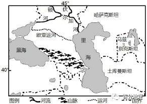
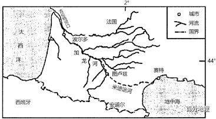

# 微专题之074 从产业结构角度分析区域发展

```
本专题摘自“百分地理”公众号，如有侵权请告之删除，谢谢。联系hhwxyhh@163.com
```

------
   
一、单选题   
1．（2021·江西省高三阶段练习）2014年6月22日,在卡塔尔多哈举行的第38届世界遗产大会上,中国大运河项目成功入选世界文化遗产名录,成为我国第46个世界遗产项目。大运河属于（  ）   
   
   
   
A．大气圈   
B．水圈   
C．生物圈   
D．岩石圈   
<span style="color: rgb(255, 0, 0);">1.B结合所学可知，大运河是人工开凿的河流，属于水圈，B正确，ACD错误。故选B。</span>   
（2022·全国·专题训练）北美的腹地大平原沃野千里，物产丰富，从殖民时代开始就不断吸引着人们。然而，北美的东西向交通一直以来都困扰着那片土地上的人们，直到1825年伊利运河全线开通。伊利运河（下图）西起伊利湖畔的布法罗，东至哈德孙河岸的奥尔巴尼，绵延581km。有学者认为：“伊利运河的开凿就注定纽约要不同于别的城市”。下图示意伊利运河及其周边区域。据此完成下面小题。   
   
   
   
2．与伊利运河连通后，哈德孙河奥尔巴尼以下河段水文特征的变化是（  ）   
A．含沙量变大   
B．流量变小   
C．流速变缓   
D．结冰期变长   
3．伊利运河建设的不利条件有（  ）   
①上游地势低，水体不能自流②沿线山地多，地势复杂③人口稀疏，劳动力缺乏④路线较长，工程量大   
A．①③   
B．①④   
C．②③   
D．②④   
4．伊利运河开通后对纽约市的主要影响是（  ）   
A．改善市内交通   
B．扩大经济腹地   
C．扩大水源供给   
D．缓解热岛效应   
<span style="color: rgb(255, 0, 0);">2．A 根据材料可知，运河开通后会增加哈德孙河奥尔巴尼以下河段的水量，进而导致奥尔巴尼以下河段流量变大、流速变快，BC错误；因伊利运河流经山区，且该河段流量增加，故其含沙量增加，A正确；结冰期的长短与气候有关，与是否连通运河无关，D错误。故选A。</span>   
<span style="color: rgb(255, 0, 0);">3．D由图可知，伊利运河穿越阿巴拉契亚山脉，地势起伏大，且线路较长，工程量较大，这是伊利运河建设的主要不利条件，②④正确。伊利运河在通过阿巴拉契亚山脉后，可以自流，①错误；五大湖地区，人口稠密，③错误。故选D。</span>   
<span style="color: rgb(255, 0, 0);">4．B伊利运河的开挖，主要是为了加强美国东部和中西部的交通联系，改善纽约与西部之间的交通状况，扩大纽约的经济腹地，B正确。与纽约市内交通无关，A错误；该运河通过连接哈德孙河连接了纽约，并没有增加纽约市内的水域面积，对缓解纽约市热岛效应作用不大，D错误；开通运河不是主要为了向纽约供水，扩大水源供给不是主要影响，C不符合题意。故选B。</span>   
（2022·河北保定）2021年江西省提出修建连接鄱阳湖、钱塘江水系的超级工程——浙赣运河。钱塘江和信江之间的分水岭海拔大约140m，需要凿通。图示意浙赣运河的位置。据此完成下面小题。   
   
   
   
5．江西省规划修建浙赣运河的主要目的是（  ）   
A．缩短鄱阳湖出海里程   
B．扩大鄱阳湖腹地范围   
C．调节信江丰枯流量   
D．加快钱塘江河水自净   
6．浙赣运河建成后，面临的主要问题最可能是（  ）   
A．运河含沙量大   
B．水污染严重   
C．运河水量较小   
D．运河结冰期长   
<span style="color: rgb(255, 0, 0);">5．A浙赣运河连通了信江与钱塘江，为鄱阳湖出海增添了新的选择，缩短了鄱阳湖出海里程，A选项正确；钱塘江与信江均与鄱阳湖相连，都作为鄱阳湖经济腹地，浙赣运河并未扩大鄱阳湖腹地范围，B选项错误；运河不具备调节河流丰枯流量的能力，C选项错误；浙赣运河修建的主要目的在于发展水运，而跨流域调水，所以主要目的不是加快钱塘江水自净，D选项错误，所以选择A选项。</span>   
<span style="color: rgb(255, 0, 0);">6．C浙赣运河连接钱塘江与信江，连接位置位于信江的上游，河流泥沙含量较小，A选项错误；河流发源地人类活动少，污染不严重，B选项错误；浙赣运河连接在信江的上游地区，水源补给少，面临运河水量较小的问题，C选项正确，浙赣运河位于亚热带地区，无河流结冰期，D选项错误，所以选择C选项。</span>   
7．（2021·甘肃庆阳）下图是世界四个著名的海峡或运河图。读图，2021年3月23日，台湾“长赐号”货轮在苏伊士运河触底搁浅，堵塞运河，造成420多艘船舶滞留，全球12%的国际贸易通道被“切断”。上述事件发生在（  ）   
A．   
   
   
B．   
   
   
C．   
   
   
D．   
   
   
<span style="color: rgb(255, 0, 0);">7.A题意表明，导致全球12%的国际贸易通道被“切断”的货轮搁浅事件发生在苏伊士运河。根据图中地理位置和海陆形态判断，图A表示苏伊士运河，图B表示土耳其海峡，图C表示曼德海峡，图D表示霍尔木兹海峡，因此A符合题意，排除BCD。故选A。</span>   
（2021·浙江高考模拟预测）胶莱人工海河是山东半岛上正在构思的一项超级大工程，将原胶莱运河深挖到海平面之下，联通莱州湾和胶州湾。完成下列小题。   
   
   
   
8．促使胶莱人工海河开挖最主要的自然条件是（  ）   
A．地势低洼   
B．狭窄的陆地轮廓   
C．河网密布   
D．地质条件稳定   
9．胶莱人工海河建成后对区域发展的有利影响有（  ）   
①促进莱州湾和胶州湾的水体交换   
②缩短莱州湾和胶州湾空间距离   
③推动新挖运河沿线地区的经济发展   
④缓解山东半岛的淡水资源紧张状况   
A．①③   
B．②④   
C．①②   
D．②③   
<span style="color: rgb(255, 0, 0);">8．A开挖人工海河成本大，有现有的运河存在再加上地势低洼，可以降低修建成本，是最主要的条件，A正确；陆地轮廓对人工海河修建关联不大，地质稳定不是最主要的因素BD错误；北方河流密度低于南方，航运价值不大，C错误。故选A。</span>   
<span style="color: rgb(255, 0, 0);">9．A胶莱人工海河建成后可以增加运河的水流速度，加快莱州湾和胶州湾的水体交换，增加海水的自净能力，①正确；两海湾之间空间距离是固定的，不会改变，②错误；人工海河可增加运河的航运能力，推动沿线经济发展，③正确；人工海河建成后流动着的是海水，不会增加淡水资源，④错误。故选A。</span>   
（2021·内蒙古赤峰）读某运河图,完成下面小题。   
   
   
   
10．该运河长度约为（  ）   
A．小于50km   
B．120km   
C．196km   
D．240km   
11．依据图中信息判断下列正确的是（  ）   
A．该运河是两个国家的分界线   
B．该运河是欧洲西部通往亚洲东部的最短航线   
C．甲为大西洋,乙为太平洋   
D．运河穿过海拔500m以上地区   
<span style="color: rgb(255, 0, 0);">10．B根据所学知识可知，纬度相差一度的经线长约为111千米。图中显示，该运河的长度比一个纬度的经线长度要长一些，因此该运河长度约为120千米，B选项符合题意，A、C、D错误。故选B。</span>   
<span style="color: rgb(255, 0, 0);">11．C根据图中地理位置和所学知识判断，该运河为巴拿马运河，巴拿马运河全程位于巴拿马国的内部，不是两个国家的分界线，A错误；欧洲西部通往亚洲东部的最短航线是北冰洋航线，不通过巴拿马运河，B错误。巴拿马运河北端连接大西洋，南端连接太平洋，即甲为大西洋，乙为太平洋，C正确。图中显示，运河主要穿过海拔较低的区域，沿线海拔均在500m以下，D错误。故选C。</span>   
（2022·甘肃省张掖）2021年3月23日，一艘长约400米、宽约59米、重达22万吨的巨轮在苏伊士运河打橫搁浅，卡住了双向航道，致使400多艘轮船滞留（下图）。3月29日（农历二月十七）经多艘拖轮和挖机等救援和“神秘力量”的帮助，在未卸货减轻自重的情况下该船成功上浮摆正船身。据此完成下面小题。   
   
   
   
12．使船舶脱困的“神秘力量”最可能是（  ）   
A．东北信风   
B．跨流域调水   
C．突遇暴雨   
D．大潮抬升水位   
13．航道开通后，滞留的轮船应优先放行的是（  ）   
A．冷冻海鲜船   
B．牲畜运输船   
C．散装粮食船   
D．医疗器械船   
14．涟漪效应指一个事物造成的影响渐渐扩散的情形，此次堵塞事件的涟漪效应是（  ）   
A．国际油价突飞猛涨   
B．海洋运输比重下降   
C．北极航线货运增加   
D．开辟新的海运航线   
<span style="color: rgb(255, 0, 0);">12．D 3月29日，正值农历二月十七，可能是天文大潮抬升水位，导致该船成功上浮，D对；东北信风带动海水向东北方向流动，无法明显抬高运河水位，A错；若跨流域调水，则是人类活动，不能称为“神秘力量”，B错；该区域气候干旱，3月29日突降暴雨的概率小，且降水也不能称为“神秘力量”，C错，故选D。</span>   
<span style="color: rgb(255, 0, 0);">13．B航道开通后，滞留的轮船应优先放行的是活牲畜运输船，因为活牲畜滞留时间长可能会因缺少食物、水等死亡，急需放行，B对；冷冻海鲜船、散装粮食船、医疗器械船相对活牲畜运输船，可继续稍作停留，ACD错，故选B。</span>   
<span style="color: rgb(255, 0, 0);">14．D国际油价上涨受供需关系的影响较大，运河堵塞对其影响较小，A错；海洋运输具有运量大、成本低的优势，堵塞事件是偶发事件，并不能降低海洋运输的比重，B错；苏伊士运河通行的货轮主要是往来于亚洲、印度洋地区与欧洲之间的轮船，对北极航线的货运量影响较小，且北极航线通航期短，航行风险较大，C错；运河堵塞事件颇显苏伊士运河对国际航线的重要性，开辟更多的国际货运通道有利于减轻偶发事件带来的影响，D对。故选D</span>   
（2022·河南开封）红死运河是以色列、巴勒斯坦和约旦共同制定的项目。按照规划,红死运河全长约180km,运河主体在约旦境内,沿途将建有海水淡化厂,以满足城市用水,在抵达死海的最北端还将建立一个水力发电厂。下图为红死运河工程线路示意图。据此完成下面小题。   
   
   
   
15．修建红死运河的主要目的是（  ）   
A．加强区际联系   
B．改善生态环境   
C．获取淡水资源   
D．增加能源渠道   
16．影响淡水输水管走向发生明显弯曲的因素最可能是（  ）   
A．地形与聚落分布   
B．气象与地质灾害   
C．公路与河湖走向   
D．地形与国防安全   
<span style="color: rgb(255, 0, 0);">15．B据材料可知，红死运河是将红海的海水补充到死海，红海是盐度最高的海域，死海为内陆湖，红死运河沿线地区气候干旱，蒸发旺盛，自然环境恶劣。多年来该区域一直局势紧张，因而加强区际联系不是主要目的，A错误；修建红死运河可缓解水资源紧张状况、调节周边气候、提高水体自净能力等，因而改善生态环境是主要目的，B正确；红死运河沿途拟建的海水淡化厂、水电站属于衍生工程，不是主要目的，CD错误，故本题选B。</span>   
<span style="color: rgb(255, 0, 0);">16．A淡水输水管走向主要考虑生产、生活需要及建筑投资，沿途地势相对平坦的地区建筑投资较少，也是人口相对集中的区域，A正确；管道运输受气象灾害影响不大，当地位于板块交界地带，地质灾害都比较普遍，B错误；当地气候干旱，河湖较少，且管道运输不必与河流走向重合，C错误；该工程由三国共同规划，国防安全不是影响因素，D错误，综上所述，BCD错误，本题选A。</span>   
（2022·河南高考阶段练习）巴拿马运河位于中美洲国家巴拿马，横穿巴拿马地峡，连接太平洋和大西洋，是重要的航运要道（如下图）。1914年，巴拿马运河开始通航，属于水闸（蓄水）式运河。2016年6月，巴拿马运河扩建工程完成，超大型集装箱货轮或装载液化气的油轮也可由此驶向大西洋或太平洋。据此完成下面小题。   
   
   
   
17．据材料推测，巴拿马运河航线选址的有利条件是（  ）   
A．土层疏松   
B．距离最短   
C．可利用天然湖泊   
D．可利用自然落差   
18．巴拿马运河扩建的主要目的是（  ）   
A．增加大型船舶的通行量，提高运输效率   
B．促进港口建设，方便货轮停靠   
C．加大运河的深度和宽度，增大运河蓄水量   
D．增加就业机会，缓解就业压力   
<span style="color: rgb(255, 0, 0);">17．C由图可知，巴拿马运河穿过加通湖，可利用天然湖泊减少工程量，C正确。该地由于降雨量大和土质疏松，人工渠两岸山丘的坍塌一直是运河建成以来时常发生的问题。因而必须经常采取防护和补救措施以保持航道畅通，并且加固两岸将雨水引向别处以免破坏山坡，故土层疏松不是有利条件，A错误。巴拿马运河西联太平洋，东接大西洋，但由图示可知该运河不是东西走向，距离不是最短，B错误。该运河属于水闸（蓄水）式运河，需要蓄水以提高水位通航，难以利用自然落差，D错误。故选C。</span>   
<span style="color: rgb(255, 0, 0);">18．A巴拿马运河部分河段较窄，加上部分河段土层疏松，常出现淤塞问题，为增加大型船舶的通行量，提高运输效率，提高经济效益，巴拿马政府对运河进行了扩建，A正确。该运河主要功能是通航，以通过为主，不进行装卸货物，B错误。扩建可加大运河的深度和宽度，进而提高通过效率，获得经济效益。增大运河蓄水量不是主要目的，C错误。运河扩建可增加就业机会，缓解就业压力，是扩建运河带来的效益，但不是扩建运河的目的，D错误。故选A。</span>   
（2022·浙江温州）胶莱运河位于山东半岛，河道无法通行大船，需以小船转运货物。元明时期，该运河几经兴废，现仅可供灌溉使用。2005年，有人提议将原胶莱运河深挖至海平面以下，修建成胶莱人工海河。据此完成下面小题。   
   
   
   
19．推测元明时期胶莱运河废弃的主要原因是（  ）   
①河窄水浅，运输能力有限   
②水位变化大，运输能力不稳定   
③沿岸地区经济衰落，航运需求减小   
④河道泥沙淤积，运输能力衰退   
⑤科技水平提高，其他运输方式替代   
A．①②③   
B．①②④   
C．①③④   
D．①③⑤   
20．若胶莱人工海河得以建成，将带来的影响可能是（  ）   
A．解决海水污染问题   
B．缓解京杭运河运输压力   
C．缩短船舶航行里程   
D．改变胶东沿岸流的方向   
<span style="color: rgb(255, 0, 0);">19．B根据材料“河道无法通行大船，需以小船转运货物。元明时期，该运河几经兴废，现仅可供灌溉使用。”可知，胶莱运河河窄水浅，运输能力有限；当地位于季风区，降水季节变化大，水位变化大，运输能力不稳定；河道淤积，运输能力减弱甚至丧失，导致元明时期胶莱运河废弃，①②④正确，B正确。当时没有其他运输方式替代，⑤错误；运河几经兴废，废弃后还要再疏通兴起，说明有运输需求，并且元明时期商贸活动此较发达，因此废弃的原因不可能是沿岸地区经济衰落，③错误；ACD错误。故选B。</span>   
<span style="color: rgb(255, 0, 0);">20．C若胶莱人工海河得以建成，人工海河可以沟通渤海与黄海，形城胶东沿岸环流，加快莱州湾和胶州湾的水体交换，缓解莱州湾海水污染问题，改善渤海水域环境，A错误。胶莱人工海河与京杭运河相距较远，不能缓解京杭运河漕运压力，B错误。胶莱人工海河可以缩短船舶航行绕行山东半岛的航线里程，C正确。胶莱人工海河不能改变胶东沿岸流的方向，D错误。故选C。</span>   
（2022·全国·专题练习）20世纪70年代初以来，里海水位保持在－28.5米左右。哈萨克斯坦等中亚国家多次提议，在俄罗斯境内里海与黑海间的陆地低缓处，修建一条连接里海与黑海的水路运输通道－欧亚运河。下图示意欧亚运河线路规划图。据此完成下面小题。   
   
   
   
21．若欧亚运河建成，则中亚国家夏季出海或返程时（  ）   
A．出海，逆流逆风   
B．返程，顺流逆风   
C．出海，顺流逆风   
D．返程，逆流顺风   
22．若欧亚运河通航初期在夏季，对该地区的影响是（  ）   
A．增大中亚昼夜温差   
B．提高生物多样性   
C．加剧土壤的盐碱化   
D．改变农牧业布局   
<span style="color: rgb(255, 0, 0);">21．A 由材料知“里海水位保持在－28.5米左右”，说明里海湖面低于地中海海面（0米），则欧亚运河建成后，水从地中海流入里海，因此中亚国家夏季出海时逆流、返程时顺流，C、D错误。因为海陆热力性质差异，七月份内陆温度高为低气压，而大西洋为高气压，图示区域应受偏西风影响，则中亚国家夏季出海时逆风、返程时顺风，A正确、B错误。故选A。</span>   
<span style="color: rgb(255, 0, 0);">22．C欧亚运河开通后，地中海的海水流入里海，里海水面扩大，受其影响，中亚昼夜温差减小，A错误。运河的修建及通航可能会破坏沿岸生态环境，使生物多样性减少，B错误。地中海的海水与里海的湖水均为咸水，因此运河中的水为咸水；运河沿线为温带大陆性气候，夏季，气温高，蒸发旺盛，会导致盐分在地表聚集，加剧土壤的盐碱化，C正确；农牧业布局主要受当地气候、地形等因素影响，因此运河修建不会改变农牧业布局，D错误。故选C。</span>   
（2022·四川简阳市）2020年4月1日，巴拿马运河通行费率修订开始生效，此前每天通行35至40艘轮船的巴拿马运河在涨价后，通行量减少到了每天仅几艘船。下图示意巴拿马运河位置。据此完成下面小题。   
   
   
   
23．一艘船从位置①出发，依次经过位置②和③，到达位置④过程中，大致的航行方向为（  ）   
A．从东南向西北   
B．从西北向东南   
C．从西南向东北   
D．从东北向西南   
24．为了保护当地的海洋动物，巴拿马运河船只航行速度约为18.5千米/小时，则一艘轮船顺利通过该运河大约需要（  ）   
A．2小时   
B．5小时   
C．8小时   
D．11小时   
25．巴拿马运河“涨价后”，不走该运河的船可能绕行（  ）   
A．麦哲伦海峡   
B．苏伊士运河   
C．好望角   
D．马六甲海峡   
<span style="color: rgb(255, 0, 0);">23．B 由经纬网可以判断，船从位置①出发，依次经过位置②和③，到达位置④过程中，大致的航行方向为从西北向东南，故选B。</span>   
<span style="color: rgb(255, 0, 0);">24．B依据图中信息可知，巴拿马运河跨纬度约0.8°,由于纬度相差1°的经线长约为111 km，因此，其长度约为85 km 左右。轮船每小时行驶18.5 km，可计算出通过该运河大约需要5小时，故该题选B。</span>   
<span style="color: rgb(255, 0, 0);">25．A巴拿马运河沟通太平洋和大西洋，如果轮船绕行，则最佳路线应该是经过南美洲的麦哲伦海峡，A正确；苏伊士运河连接地中海与红海，沟通印度洋和大西洋，好望角位于非洲南端，马六甲海峡沟通太平洋和印度洋,B、C、D错误。故选A。</span>   
（2022·四川遂宁）西伯利亚位于俄罗斯东部地区，经济相对落后，出于发展的需要，当地拟修建一条运河，用于加强东西区域之间的联系。读下图，完成下面小题。   
   
   
   
26．当地河流的水源补给主要来自（  ）   
①地下水   
②冰川融水   
③大气降水   
④季节性积雪融水   
A．①③   
B．②③   
C．②④   
D．③④   
27．拟建运河东端取水口没有选择A湖，主要是为了（  ）   
①降低开挖成本②更便于实现水体自流③减少水量损耗④保护湖泊生态   
A．①②   
B．②④   
C．③④   
D．②③   
28．若运河建成运营后，对于B河段的影响是（  ）   
A．流速减缓   
B．水位降低   
C．凌汛消失   
D．流量变大   
<span style="color: rgb(255, 0, 0);">26．D 地下水的补给量较小，①错误；当地海拔较低，没有高山冰川融水补给，②错误；据图可知，该地位于俄罗斯西南部地区，盛行西风由大西洋带来湿润水汽，当地降水较多，故河流补给类型主要有雨水补给，③正确；当地纬度较高，冬季气温低，有积雪，春季气温回升，积雪融化，故当地河流主要的补给类型有季节性积雪融水补给，④正确。故选D。</span>   
<span style="color: rgb(255, 0, 0);">27．B由图可知，A湖地势较低，取水不能实现水体的自流，由A取水，湖水减少，导致湖区的生态环境受到破坏，②④正确；从A取水也不能降低成本，①错误；从那端取水对水量损耗影响不大，③错误，故选B。</span>   
<span style="color: rgb(255, 0, 0);">28．A运河建成后，部分水流分流到运河，B段的河流流量会减少，流速减慢，A正确，D错误；由于上游有湖泊的调蓄作用，水位变化不大，B错误；该河段由高纬流向低纬，不会有凌汛，C错误；故选A。</span>   
（2022·陕西渭南）苏伊士运河是世界上最繁忙的运河之一，即使开通了新苏伊士运河，堵船事件还是屡屡发生。2021年引起全世界关注的超大型集装箱运输船“长赐”号堵塞事件，堵船时间接近一周，影响了全球的经济和运输。下图示意苏伊士运河及周边区域概况。据此完成下面小题。   
   
   
   
29．苏伊士运河堵船事件屡屡发生的地点可能是（  ）   
A．①   
B．②   
C．③   
D．④   
30．通过苏伊士运河向北和向南的主要货流可能分别为（  ）   
A．汽车、蔬菜和水果   
B．热带经济作物、精密仪表   
C．原油、工业制成品   
D．电子产品、化工产品   
<span style="color: rgb(255, 0, 0);">29．D材料信息表明，①②两地位于运河的双行通道，一个堵塞另一个可开启使用，若发生在①②两地中的一地，不会造成整个运输线路堵塞：③地位于湖泊中，航道宽，不会阻塞河道；④地为单一运河河道，堵塞后无备用航道，造成整条线路阻塞的可能性最大，D正确，排除ABC，故选D。</span>   
<span style="color: rgb(255, 0, 0);">30．C苏伊士运河地处东西方交往的交通运输通要道之上，其南侧以发展中国家为主，北侧通向欧洲地区，以发达国家为主，向北运输的货物中，来自中东地区的油气资源的可能性较大，向南运输的货物中，来自欧洲国家适宜海运的工业制成品的可能性较大，C正确；欧洲地区本身的汽车制造业实力以及电子产品的研发实力维厚，向北输送汽车或电子产品的可能性不大，且电子产品多轻薄短小，一般不采用海运运输，AD错；精密仪表运量小，不会采用海运运输，B错。故选C。</span>   
（2023·浙江·高三专题练习）松花江流域河川径流408亿立方米，而辽河上游西辽河仅存干涸的故道，中下游地区水资源严重危机。伊辽运河是纵贯我国东北的“北水南调”计划，意在调整松花江流域和辽河流域水资源分布的不平衡性，该计划设想从松花江二级支流伊通河引200亿立方米的水，在实现调水后，运河束水攻沙下泄的泥沙量约12亿立方米。如图是伊辽运河及拟拓深河段示意图，据此回答下面小题。   
   
   
   
31．伊辽运河工程对三江平原（黑龙江、乌苏里江、松花江冲积平原）可能带来的影响是（  ）   
A．湿地面积大幅度减少   
B．河流带来的泥沙增多   
C．避免凌汛泛滥的危害   
D．化解季节性冻土危害   
32．东北南部辽河流域地区水资源短缺的主要原因是（  ）   
①全球气候变化，降水减少   
②人口密度大，耗水量大   
③一年两熟，过度用水   
④地下暗河多，下渗严重   
A．①②   
B．②③   
C．③④   
D．②④   
<span style="color: rgb(255, 0, 0);">31．A根据材料并结合所学知识可知，伊辽运河工程调水量为200亿立方米，约为松花江流域河川径流的一半，调水量大，所以调水会造成下游的三江平原湿地面积大幅度减少，A选项正确；该工程将松花江水调往辽河，运河束水攻沙下泄的泥沙量约12亿立方米，使松花江输入三江平原泥沙减少，B错误；“避免”凌汛泛滥说法过于绝对，C选项错误；季节性冻土与跨流域调水关联度并不大，D选项错误。故选A。</span>   
<span style="color: rgb(255, 0, 0);">32．A根据所学知识可知，由于全球气候变化，导致降水减少，加之辽宁省人口密集、城市众多、工农业发达，生产，生活用水量大，所以①②正确；读图，辽河流域地区的内蒙古和辽宁纬度较高，积温低，农业多为一年一熟，耕地复种指数低，③错误；内蒙古和辽宁不是喀斯特地貌广泛分布区，不存在大量地下暗河，④错误；因此B、C、D选项错误。故选A。</span>   
33．（2021·甘肃庆阳）在克拉地峡开凿一条运河计划酝酿己久，此计划一旦实施，下列国家经济受冲击最大的是（  ）   
A．泰国   
B．缅甸   
C．新加坡   
D．马来西亚   
<span style="color: rgb(255, 0, 0);">33.C根据所学知识可知，克拉地峡开凿运河一旦实施，很多船舶不再经过马六甲海峡，而新加坡是扼守马六甲海峡的国家，因此经济受冲击最大的是新加坡，C正确；克拉地峡在马来半岛最窄处，泰国和缅甸交界处，克拉地峡修建，泰国和缅甸是受益者；马亚西亚会受到影响，但不是冲击最大，ABD错误。故选C。</span>   
（2021·云南高三期中）2021年江西省提出打造浙赣粤运河。其中，浙赣运河连通浙江境内的常山江与江西境内的金沙溪，建成后将开辟江西内河出海新通道，让钱塘江与鄱阳湖“牵手”。下图示意浙赣运河规划线路。据此完成下面小题。   
   
   
   
34．下列地理事物受浙赣运河开通影响最小的是（  ）   
A．河运交通量   
B．天马镇服务范围   
C．常山江水质   
D．七一水库蓄水量   
35．运河上修建多座船闸的主要作用是（  ）   
A．提高运河航运能力   
B．提升河流水质   
C．减轻运河泥沙淤积   
D．减轻洪涝灾害   
<span style="color: rgb(255, 0, 0);">34．D七一水库位于运河上游，与运河连通少，蓄水量受运河影响小，故D正确；运河开通沟通常山江与金沙溪，进而提高运河航运能力，会增加河运交通量，A错误；由于交通条件改善，天马镇服务范围会扩大，B错误；运河开通后，会增加水污染，影响常山江下游水质，C错误；故选D。</span>   
<span style="color: rgb(255, 0, 0);">35．A运河上修建船闸可通过闸门控制航道内灌、泄水，以升降水位，保证船只在不同水位间顺利通航，A正确；船闸通过调节水位差，河流流速减慢，泥沙淤积增加，BC错误；修船闸无法减轻洪涝灾害，D错误，故选A。</span>   
（2022·福建省永春）下图是纽约港地理位置示意图。1492年，哥伦布发现美洲大陆后，欧洲各国殖民者纷纷前来哈德逊河口建立毛皮贸易点，纽约港逐渐发展为自由港。1825年，伊利运河（连接伊利湖和哈得逊河）竣工对美国东部经济及纽约的发展起了重大的促进作用。据此完成下面小题。   
   
   
   
36．影响纽约早期建城的主要社会经济因素是（  ）   
A．矿产   
B．水源   
C．交通   
D．军事   
37．推测早期纽约港形成时出口的货物主要是（  ）   
A．毛皮和皮革制品   
B．铁矿石和煤炭   
C．棉花和小麦   
D．香料和咖啡   
38．伊利运河的开通对于纽约港的发展产生的影响主要是（  ）   
A．扩大水源供给渠道   
B．拓宽经济腹地范围   
C．提高哈得逊河水位   
D．加速内陆人口增长   
<span style="color: rgb(255, 0, 0);">36．C从题中材料看早期的纽约曾是一个乡村小镇，临河而建，交通便利，是欧洲各国殖民者进行毛皮贸易的集散点，早期美国中西部地区及北美五大湖沿岸畜牧业区的毛皮和在小镇加工的皮革制品，是该小镇早期贸易主要的出口货物。影响纽约早期建成的主要社会经济因素是交通，C正确；题干问的是“社会经济因素”，矿产和水源属于自然因素，AB排除；材料中无法看出纽约建城与军事之间的关系，D排除。故选C。</span>   
<span style="color: rgb(255, 0, 0);">37．A材料信息表明，哥伦布发现美洲大陆后，欧洲各殖民者纷纷涌来建立毛皮贸易点，中西部地区的毛皮和皮革制品依靠纽约港出口，因此早期纽约港形成时出口的货物主要是毛皮和皮革制品，A符合题意；早期美国的铁矿和煤还没有大规模开发，排除B；纽约所在区域气候相对冷湿，不是棉花与小麦的主产区，而且早期美国中部和南部也没有形成大规模的小麦和棉花种植区，排除C；美国本土没有热带地区，香料和咖啡是热带作物，排除D。故选A。</span>   
<span style="color: rgb(255, 0, 0);">38．B材料信息表明，伊利运河（连接伊利湖和哈得孙河）)的开通运营沟通了中部内陆地区与纽约港的联系，既降低了内陆地区的货物运输成本，又拓宽了纽约港的经济腹地服务范围，B符合题意；纽约港临近河流，水资源供给充足，伊利运河不是调水工程，因此对扩大水源供给渠道的意义不大，排除A；伊利运河的开通有可能一定程度上提高哈得孙河水位，但这不是对纽约港产生的主要影响，排除C；伊利运河开通有可能促进了沿海地区人口向内陆地区的迁移，加速了内陆人口的增长，但这不是对纽约港产生的影响，排除D。故选B。</span>   
（2023·浙江·高三专题练习）图1为引江济淮工程示意图。“引江济淮”工程划分为引江济巢、江淮运河、江水北送三段。江淮运河段按照国家II级航道建设，可通航2000吨级船舶。该段与淠河总干渠交会时，没有通过地下隧道“下穿”输水（图2），而是修建了世界上最大跨度的通水通航渡槽，形成“河上有河、船上有船”的水上立交奇观。完成下面小题。   
   
   
   
39．引江济淮工程对巢湖湿地的影响有（  ）   
A．防风固沙效益显著增加   
B．湖泊水体自净能力提高   
C．解决生产生活缺水现状   
D．物种基因丰富度将下降   
40．与“下穿”输水相比，淠河渡槽的突出优点是（  ）   
A．技术难度更低   
B．使淠河航运价值提高   
C．修建成本更低   
D．保障江淮运河的航运   
<span style="color: rgb(255, 0, 0);">39．B根据题干分析可知，巢湖湿地地区气候湿润，且无大面积沙地分布，防风固沙作用不大，A错误；引江济淮工程经过了巢湖湿地，能够使巢湖湿地的水量增加，从而提高其水体自净能力，B正确；该地区人口稠密，生产生活用水量较大，缺水问题难以一次性解决，故选项中解决该问题说法过于绝对，C错误；引江济淮工程能够恢复巢湖湿地的水量，使湿地中的生物栖息地和物种多样性得以恢复，能够使物种基因丰富度提高，D错误。故选B。</span>   
<span style="color: rgb(255, 0, 0);">40．D “下穿”建设隧道输水是传统技术，技术难度不大，与“下穿”输水相比，渡槽的技术难度更高、成本更大，AC错误；渡槽对淠河的水文、水系特征影响不大，不能使淠河航运价值提高，B错误；与修建下穿式隧道相比，修建渡槽能够减少对河床结构的破坏，且渡槽下方有行船通道，能够保障江淮运河的航运，D正确。故选D。</span>   
（2022·河北高三专题）马达加斯加岛（图）是非洲最大的岛屿，该岛人口、城市主要分布在以塔那那利佛为中心的中央高原上，平原地区人口相对较少。现人们在平行于海岸线不远处的沿海低地修筑了一条全长640km的运河。据此完成下面小题。   
   
   
   
41．导致该岛人口、城市主要分布在中央高原上的主要因素（  ）   
A．水资源   
B．经济发展水平   
C．开发历史   
D．气候   
42．推测该运河的主要作用是（  ）   
A．灌溉   
B．发电   
C．航运   
D．防海潮   
<span style="color: rgb(255, 0, 0);">41．D该岛东部地区为热带雨林气候，西部为热带草原气候，降水总量相对较大，故人口和城市分布在中央高原不是为了获取水资源，A错误；中央高原相对远离海洋，对外交通联系相对不便，与临海地区相比，不利于经济发展，经济发展水平不高，B错误；临海平原地区海运交通更为便利，开发历史相对较早，故不是中央高原开发早，C错误；由于该岛东部为热带雨林气候，全年高温多雨，而该岛西部为热带草原气候，也是全年高温。而中央高原海拔相对较高，气温较低，更适宜人类居住，D正确。本题应选D。</span>   
<span style="color: rgb(255, 0, 0);">42．C马达加斯加岛东侧直面印度洋，盛行来自海上的东南信风，风大浪急。利用地势低洼处修筑平行于海岸线的运河，可以减轻风浪对航运的影响，改善航运条件，C正确；该岛东部为热带雨林气候，降水丰富，引水灌溉需求小，A错误；该岛东部沿海地势平坦，故无法利用落差发电，B错误；运河不具有防海潮的作用，D错误。本题应选C。</span>   
（2022·山东高三阶段练习）纽约是美国东部最大的海港。伊利运河的开挖，主要是为了加强美国东部和中西部的交通联系，同时改善纽约市的用水条件。伊利运河西起伊利湖出口处的布法罗，东至哈德孙河沿岸的奥尔巴尼。伊利湖流向安大略湖形成了著名的尼亚加拉瀑布（落差超过50米）。下图为伊利运河略图，据此完成下面小题。   
   
   
   
43．哈德孙河与伊利运河接通后，奥尔巴尼附近上游河段水文特点的变化表现为（  ）   
A．流量变大   
B．流速变慢   
C．含沙量变大   
D．结冰期变长   
44．连接奥尔巴尼的伊利运河取水点没有选择安大略湖是为了（  ）   
①降低开挖成本②实现水体自流③减轻河流结冰影响④降低运输成本   
A．①③   
B．①④   
C．②④   
D．②③   
<span style="color: rgb(255, 0, 0);">43．B根据材料可知，运河开通后会增加奥尔巴尼的水位，进而减少该区域到河流上游的纵比降，会降低河流的流速，B正确；奥尔巴尼附近上游河段降水和流域面积没变，水量也不会明显变化，流速减慢含沙量可能会减小，A、C错误；结冰期的长短与气候有关，D错误。故选B。</span>   
<span style="color: rgb(255, 0, 0);">44．C该运河在伊利湖取水的主要原因是伊利湖较安大略湖海拔高（伊利湖流向安大略湖形成了著名的尼亚加拉瀑布，落差超过50米），能够实现水体自流，②正确；而伊利湖与纽约的距离大于安大略湖到纽约的距离，开挖成本较高，①错误；伊利湖与安大略湖纬度较高均有结冰期，③错误；由图可知运河大致呈东西方向，距离中西部地区线路更短，避免绕道安大略湖，运输成本更低，④正确。综上所述，C正确，排除ABD。故选C。</span>   
二、综合题   
45．（2022·河南·高三开学考试）阅读图文材料，完成下列要求。   
1992年，斯洛伐克和匈牙利共同在其界河多瑙河上修筑水利工程，集发电、航运、供水等功能于一体。该水利工程修筑了27km长的连接运河，水电站、船闸都建在连接运河上（如图）。连接运河建成后，图示匈牙利一侧的河漫滩湿地上的部分较小曲流干涸，植被快速退化。   
   
   
   
(1)分析该水利工程修筑连接运河的好处。   
(2)说明连接运河对老多瑙河水文特征的影响。   
(3)指出对图示河漫滩湿地的保护应采取的合理的工程措施。   
<span style="color: rgb(255, 0, 0);">【答案】(1)原有河道弯曲，水流缓慢，修筑连接运河会提高水流速度，利于发电；弯曲河道不利于泄洪，修筑连接运河便于泄洪，发挥水利工程的调节作用；缩短航程，改善航运条件。</span>   
<span style="color: rgb(255, 0, 0);">(2)连接运河起到分流作用，使老多瑙河径流量减小；枯水期水位下降明显，丰水期仍然分流泄洪，径流量季节变化加大；水流挟沙能力下降，泥沙沉降，含沙量降低。</span>   
<span style="color: rgb(255, 0, 0);">(3)在老多瑙河人口处设置分水堤（嘴），人工控制分流比例；适当清除老多瑙河河床淤泥；设置泵站，在枯水期通过泵站由连接运河向老多瑙河引水。</span>   
<span style="color: rgb(255, 0, 0);">【解析】本大题以河多瑙河上的水利工程为材料设置试题，涉及水资源开发、水文特征、水源保护等相关内容，考查学生获取和解读地理信息，调动和运用地理知识和基本技能的能力，体现综合思维、区域认知、地理实践力的地理核心素养。（1）根据材料可知，水利工程集发电、航运、供水等功能于一体，根据图示可知，原有河道弯曲，水流缓慢，修筑连接运河会提高水流速度，利于发电；弯曲河道水流不畅，不利于泄洪，修筑连接运河便于泄洪，发挥水利工程的调节作用；修筑后缩短航程，改善航运条件。（2）连接运河对老多瑙河水文特征的影响体现在流量、含沙量、水位等方面。连接运河起到分流作用，使老多瑙河径流量减小；枯水期水位下降明显，丰水期仍然分流泄洪，径流量季节变化加大；修筑后阻碍水流，水流挟沙能力下降，泥沙沉降，含沙量降低。（3）连接运河建成后，河漫滩湿地上的部分较小曲流干涸，河漫滩湿地的保护应从增加曲流水量入手。在老多瑙河人口处设置分水堤（嘴），人工控制分流比例，保障曲流水源供应；适当清除老多瑙河河床淤泥，增加容积；设置泵站，在枯水期通过泵站由连接运河向老多瑙河引水，保护曲流不干涸。</span>   
46．（2022·湖南高三期中）阅读图文材料，完成下列要求。   
松花江流城总径流量408亿立方米，而辽河上游西辽河仅存千涸的故道，下游地区水资源严重危机。伊辽运河是我国东北地区“北水南羽”计划的一部分，意在调整松花江流域和辽河流域水资源分布的不平衡性，该计划设想从松花江二级支流伊通河引200亿立方米的水。图为伊辽运河“北水南调”示意图。   
   
   
   
(1)分析辽河中下游近年来水资源短缺的原因。   
(2)有人说伊辽运河工程量较小，施工难度小，试说明其原因。   
(3)简述伊辽运河工程可能给三江平原自然环境带来的不利影响。   
<span style="color: rgb(255, 0, 0);">【答案】(1)人口众多、工农业发达，生产生活用水量大；近些年随着工业发展，人口的增多，生产生活对水体污染严重；全球气候变暖，导致蒸发加大，河流水量小；气候的异常加剧降水的季节变率增大。</span>   
<span style="color: rgb(255, 0, 0);">(2)已有现成伊辽运河作为调水渠道，需要开挖渠短；总线路较短，开挖渠道工程量小；部分河段可引水自流，工程移动的土石方量少；沉积土层、松花江与辽河分水岭地势不高，施工难度小。</span>   
<span style="color: rgb(255, 0, 0);">(3)可能导致三江平原水量减少，导致湖沼面积减少，湿地萎缩，湿地生态功能退化，加剧旱涝灾害；使得该区域河流量减少，影响水生生物的生长。</span>   
<span style="color: rgb(255, 0, 0);">【解析】本题以伊辽运河“北水南调”为材料，涉及到水资源短缺、调水工程的评价及影响，主要考查学生调动知识运用知识的能力，培养学生区域认知、综合思维的学科核心素。（1）结合所学，辽河中下游为我国主要重工业基地，人口众多、 工农业发达，工农业生产耗水量大，加剧近些年来水资源的短缺，随着工业发展，人口增多，生产生活废水排放量增多，水体污染加重，全球气候变暖，蒸发变大，加剧旱情；结合近些年来，气候异常现象频繁发生，加剧该地区降水变率增大，加剧水资源短缺。（2）从图可以看出已有现成伊辽运河及干枯的河道作为调水渠道，需要开挖渠短，总线路较短，开挖渠道工程量小；结合辽河的流向及与调水方向，可知部分河段可引水自流，工程移动的土石方量少，施工难度小；辽河下游为泥沙沉积的平原，沉积土层、松花江与辽河分水岭地势不高，容易开挖，施工难度小。（3）三江平原湿地沼泽面积分布广，从松花江调水，使得三江平原水量减少，湖沼水量减少，面积缩小，湿地萎缩，湿地生态功能退化，调节径流的作用减弱，加剧旱涝灾害；河流水量减少，水生生物栖息环境改变，影响水生生物的生长。</span>   
47．（2022·新疆石河子）阅读图文资料，完成下列要求。   
2022年3月17日广西省政府批复平陆（平塘至陆屋镇）运河项目正式立项。运河始于南宁横州市西津库区平塘江口，沿沙坪河向南跨越分水岭，经钦州灵山县陆屋镇沿钦江进入北部湾（下图）。项目按内河I级航道标准建设，全长约133公里，总投资约680亿元。运河全程落差60米，其中分水岭越岭段开挖约6.5公里，其余利用现有河道建设。平陆运河是广西各族人民期盼了100多年的运河，建成通航后，南宁经平陆运河由钦州港出海里程仅291公里，比经广东出海缩短560公里，将进一步提升广西水路交通发展质量。   
   
   
   
(1)说出与公路运输相比河运有哪些优缺点。   
(2)试分析平陆运河选线的合理性。   
(3)预测运河通航后给钦州港带来的影响。   
<span style="color: rgb(255, 0, 0);">【答案】(1)优点：运量大；运费低。缺点：运速慢：灵活性差。</span>   
<span style="color: rgb(255, 0, 0);">(2)运河沿线气候湿润，径流量大；全程落差小、流速相对平稳，通航条件好；利用现有河道建设，开挖河段较短，工程量小；大幅缩短南宁及郁江沿线城市的水运出海的距离。</span>   
<span style="color: rgb(255, 0, 0);">(3)增大货物吞吐量（运输量）；拓展港口经济腹地（扩大货物集散范围）；提高港口经济效益；提升港口的交通地位。</span>   
<span style="color: rgb(255, 0, 0);">【解析】本大题以平陆运河相关图文资料为背景材料，涉及公路运输与河运的优缺点、平陆运河选线的合理性、运河通航后的影响等相关知识，考查学生获取和解读信息能力及综合思维能力，培养学生的综合思维、区域认知和地理实践力等地理核心素养。（1）与公路运输相比，河运最大的优势是成本低、污染小、安全经济，河运运量大，而且所利用的江、海都是自然资源，不会造成对资源的浪费，有利于环保。另外，河运减少能源能耗，减少了对环境的污染。公路运输具有灵活、方便、及时、快速响应等特点，尤其是能实现“门到门”运输服务。相比较公路运输，河运的缺点是运速慢，容易受航道限制，灵活性差。（2）平陆运河沿线属于亚热带季风气候区，气候湿润，运河开通后径流量大；运河全长约133公里，全程落差60米，落差小，运河建成后，水流速度相对平稳，有利于通航；由材料可知，除了分水岭越岭段开挖约6.5公里，其余利用现有河道建设，开挖河段较短，工程量小；由材料可知，运河建成通航后，南宁经平陆运河由钦州港出海里程仅291公里，比经广东出海缩短560公里，能够大大缩短南宁及郁江沿线城市的水运出海的距离。（3）平陆运河通航后，使得江海联运效率进一步提高，钦州港货物吞吐量会大幅增加；南宁及郁江流域也成为了钦州港的货物集散地，拓展了港口的经济腹地；随着运输量的增加，港口的交通地位得到提升；能够提高港口的经济效益。</span>   
48．（2023·全国·高三专题练习）阅读图文材料，完成下列问题。   
材料一：下图为我国某区域略图。   
   
   
   
材料二：下梁山港位于山东省，港区处于2014年建成的瓦日铁路与京杭大运河的黄金交叉点，目前已成为省内吞吐量最大的内河港。晋陕蒙地区每年通过瓦日铁路输出的煤炭，原先都是运到日照，再通过海运到长三角。现在通过瓦日铁路到梁山港，然后通过京杭大运河运到长三角，成本下降了60元。   
(1)描述梁山港以北沿京杭大运河一线的地势起伏特点。   
(2)说明梁山港成为山东省吞吐量最大的内河港的主要原因。   
(3)与原铁—海联运相比，分析铁—河联运对瓦日铁路运煤产生的碳排放量的影响。   
<span style="color: rgb(255, 0, 0);">【答案】(1)地势起伏小；黄河以北，南高北低；黄河以南，北高南低。或（由南向北先升高后降低或由黄河向南北两侧降低）</span>   
<span style="color: rgb(255, 0, 0);">(2)长三角对煤炭等得需求旺盛，运输量大；地理位置优越，水陆交通便利，集散能力强；距离长三角市场地较近；成本低，选择铁河联运多。</span>   
<span style="color: rgb(255, 0, 0);">(3)煤炭运输量大，铁路运煤耗能及碳排放量大；铁—河联动大大缩短铁路运输里程，减少能耗；减少碳排放量。</span>   
<span style="color: rgb(255, 0, 0);">【解析】本大题以我国某区域略图为材料，涉及地势特征的描述、港口的区位因素、交通运输方式相关知识，考查学生获取信息运用信息的能力，灵知运用知识的能力，综合思维等学科素养。（1）从图中看，梁山港以北附近海拔为40米，沿京杭大运河一线向北地势降低为1米，可知地势起伏小（相对高差为39米）；在此区域的黄河段为地上河，因此地势由黄河向南北两侧降低。（2）结合图可看出，梁山港位于瓦日铁路与京杭运河交汇处，地理位置优越，水陆交通便利，集散能力强；长三角地区经济发达，对煤炭等得需求旺盛，运输量大；从图中看，梁山港距离长三角市场地较近；结合材料“成本下降了60元”可知，铁—河联动成本低，选择铁河联运多。（3）从图中看，原铁—海联运需先将煤炭运输到日照，比铁—河联运运输距离长，因此铁—河联动可大大缩短铁路运输里程，减少能耗，减少碳排放量。煤炭运输量大，铁路运输的能源主要是化石燃料，碳排放量大。</span>   
49．（2022·河北石家庄·阶段练习）阅读图文材料，完成下列要求。   
尼亚加拉河自南向北流，是美国、加拿大之间的伊利湖与安大略湖相通的天然水道，中部河段形成了著名的尼亚加拉瀑布（落差超50米），阻断了从大西洋直接进入五大湖上游区域的天然水路。1825年，美国修建了西起布法罗，东至奥尔巴尼的伊利运河。伊利运河的修建带动美国北部建起密集的运河网络与五大湖以及密西西比河流域相连，极大地促进了美国东北部地区的发展。下图示意伊利运河位置。   
   
   
   
(1)指出哈德孙河与伊利运河连通后，奥尔巴尼以上河段水文特征的变化。   
(2)分析伊利运河西侧起点没有选择安大略湖而选择伊利湖的主要原因。   
(3)简述伊利运河开通对美国东北部发展的积极意义。   
<span style="color: rgb(255, 0, 0);">【答案】(1)伊利运河开通后，奥尔巴尼以上河段水位升高；流速降低。</span>   
<span style="color: rgb(255, 0, 0);">(2)伊利湖较安大略湖海拔高，起点选择伊利湖利于实现水体自流；可避开尼亚加拉瀑布，扩大运河联系范围。</span>   
<span style="color: rgb(255, 0, 0);">(3)促进了五大湖流域航运发展，加强美国东北部和中西部的交通联系；加大了东北部煤、铁等矿产资源的开发利用，形成一批矿业城市；加快了美国工业化进程等。</span>   
<span style="color: rgb(255, 0, 0);">【解析】本题以美国伊利运河为背景，涉及河流水文特征，交通运输布局及其对区域经济发展的影响等相关内容，考查学生从图文资料中获取、分析和解读地理信息的能力，以及学生调动和运用地理知识的能力，培养学生的区域认知、综合思维等核心素养。（1）根据图文资料可知，伊利运河开通后，可以将伊利湖与哈得孙河连通，伊利湖的湖水通过伊利运河在奥尔巴尼流入哈德孙河，使奥尔巴尼的水位增加，降低奥尔巴尼与其上游河段地区的纵比降，因此，奥尔巴尼以上河段水流速度减缓，水位上升。（2）根据材料“尼亚加拉河自南向北流，是美国、加拿大之间的伊利湖与安大略湖相通的天然水道，中部河段形成了著名的尼亚加拉瀑布（落差超50米）”可知，伊利湖比安大略湖海拔高，因此，起点选择伊利湖利于实现水体自流，同时可避开尼亚加拉瀑布，扩大运河联系范围。（3）根据材料“伊利运河的修建带动美国北部建起密集的运河网络与五大湖以及密西西比河流域相连，极大地促进了美国东北部地区的发展”可知，伊利运河的开通促进了美国北部运河网络的形成，促进五大湖流域内河航运发展，运河将五大湖与密西西比河流域相连，加强美国东北部和中西部的交通联系；内河航运连通，使河流水运能力增强，促进美国东北部煤、铁等矿产资源的开发利用，有利于形成一批矿业城市，促进东北部地区经济的进一步发展。</span>   
50．（2022·河南焦作）阅读图文材料，完成下列要求。   
基尔运河又名“北海—波罗的海运河”，是沟通北海与波罗的海的重要水道，河道全长98.26千米，平均深度11米，宽102.5——162米，于1887年动工，1895年建成。运河当局将通过运河的船舶按尺寸划分为六组，规定：第一组与第五组、第二组与第四组、第三组与第三组船舶容许对驶；第六组船舶必须单向航行，不许与其他船舶交会；第六组船舶或吃水大于8.5米的船舶航速不能大于12千米/小时，其他船舶航速则可达15千米/小时。下图为基尔运河位置示意图。   
   
   
   
(1)简述基尔运河选址的优势。   
(2)说出修建基尔运河的主要意义。   
(3)推测基尔运河当局规定按船舶尺寸航行及限制航速的主要目的。   
<span style="color: rgb(255, 0, 0);">【答案】(1)该运河是连接北海和波罗的海的最窄处，运河线路短；再加上该地区地势低平，平原地形，易挖掘；第三，运河两端有城市提供支持。</span>   
<span style="color: rgb(255, 0, 0);">(2)首先缩短德国波罗的海沿岸与北海沿海之间的海上距离，节省运费和燃料，大大缩短航行时间。其次，能够避开北部海峡风暴强烈地区，航行安全</span>   
<span style="color: rgb(255, 0, 0);">(3)运河当局规定按船舶尺寸航行的主要目的是受运河自身条件（宽度、深度）限制，能够保证航运安全，避免船只碰撞、搁浅等事故。限制航速是为了减弱船只航行形成的波浪对运河岸坡的侵袭。</span>   
<span style="color: rgb(255, 0, 0);">【解析】本题以基尔运河为背景材料，考查交通运输网中的线的区位因素以及交通运输线修建的意义。重点考查获取和解读地理信息、论证和探讨地理问题等能力以及区域认知、综合思维等学科素养。 (1)读图可知，该运河是连接北海和波罗的海的最窄处，运河线路短，工程量小；再加上该地区地势低平，平原地形，易挖掘，施工难度低，施工量小，成本低；第三，运河两端连接城市，有城市为运河开挖提供人力、物力和财力等方面的支持。(2)由材料“基尔运河又名“北海—波罗的海运河”，是沟通北海与波罗的海的重要水道”可知，修建基尔运河的主要意义是首先使德国的波罗的海沿岸与北海沿岸之间的海上运输不必要再绕到半岛北部，从而缩短了德国波罗的海沿岸与北海沿岸之间的海上距离，节省运费和燃料，大大缩短航行时间。其次，基尔运河在半岛南部开挖，使船只能够避开北部海峡风暴强烈地区，航行安全。 (3)由材料“运河当局将通过运河的船舶按尺寸划分为六组，规定：第一组与第五组、第二组与第四组、第三组与第三组船舶容许对驶；第六组船舶必须单向航行，不许与其他船舶交会；第六组船舶或吃水大于8.5米的船舶航速不能大于12千米/小时，其他船舶航速则可达15千米/小时。”可知，运河当局规定按船舶尺寸航行的主要目的是受运河自身条件（宽度、深度）限制，能够保证航运安全，避免船只碰撞、搁浅等事故。限制航速是为了减弱船只航行形成的波浪对运河岸坡的侵袭。</span>   
51．（2022·海南高三阶段练习）阅读图文材料，完成下列问题。   
古苏伊士运河开凿于埃及法老时期，是沿尼罗河一条注入红海的枯竭支流开凿而成。1869年现代苏伊士运河由法国殖民者历时10年开凿完成，北起塞得港，南至苏伊士城，5000吨轮船可通行。该运河未沿用古运河曲折路线，而是笔直经过人烟稀少的荒漠地带，线路沿线有多个天然低洼地带。同时期，废弃800多年的古苏伊士运河被修建者重新开挖，并从伊斯梅利亚修建与现代苏伊士运河平行的小支线，改称“伊斯梅利亚运河”，使用至今。2015年，埃及在紧挨现代运河的东侧再修了一条72千米的新苏伊士运河，使新旧苏伊士运河能双航道通行，极大地提升了通航能力。下图为苏伊士运河地理位置示意图。   
   
   
   
与古苏伊士运河相比，分析现代苏伊士运河选线的主要优点。   
<span style="color: rgb(255, 0, 0);">【答案】现代苏伊士运河直接连接红海和地中海，极大的缩短了航程，获得更大航运量；现代苏伊士运河可以利用沿线多个天然低洼地，引水成湖，减少工程量；洼地湖泊也为航道船只提供补给、休憩和会船的空间；引海水，避免尼罗河泛滥导致的河道淤塞（新航道泥沙来源少，不易淤塞），减轻了清淤和维护任务；选线地区为人烟稀少的荒漠地带，为日后的改造升级留巨大的空间（利于改造升级）。</span>   
<span style="color: rgb(255, 0, 0);">【解析】本大题以苏伊士运河为材料设置试题，涉及交通线布局等相关内容，考查学生获取和解读地理信息，描述和阐释地理事物，论证探讨地理知识的能力，旨在培养学生综合思维等核心素养。根据题干文字分析，现代苏伊士运河不需绕行尼罗河，直接连通了地中海和红海，航程比古苏伊士运河缩短较多。且现代苏伊士运河利用了线路沿线的低洼地带，据此可分析出能够减少工程量。另一方面根据图片分析，苏伊士运河宽度有限，其中部的洼地湖泊可以给经过船只提供各种支持和服务。尼罗河上游为热带草原气候，该河流会发生季节性泛滥，会带来大量泥沙易使古苏伊士运河泥沙淤积；而引海水进入新航道则不易淤积。现代运河区附近是大片的沙漠，扩建改建均不会占用大量人口稠密区。</span>   
52．（2022·河南高三阶段练习）阅读图文材料，完成下列各题。   
材料一：塞尔维亚是欧洲东南部的内陆国，伏伊伏丁那自治省是该国北部重要的农业区。省内水利工程系统多瑙—蒂萨—多瑙运河历史悠久，全程900多千米，建有84座运输铁路桥、930千米的灌溉渠道。谷物在诺维萨德河港装船，通过河海联运输往世界各地。下左图为伏伊伏丁那省地图，下右图为诺维萨德气温曲线降水量柱状图。   
   
   
   
   
   
   
材料二：伏伊伏丁那省人口外流较为严重，农村地区年轻人少，大量土地被荒废。为应对此现象，当地政府发起了“年轻人回归”运动，提供资金供年轻人购买机械等农资产品，并鼓励他们种植水果和蔬菜。   
(1)说明多瑙－蒂萨－多瑙运河修建和运行的有利自然条件。   
(2)说明多瑙－蒂萨－多瑙运河系统对区域经济发展的意义。   
(3)简述伏伊伏丁那省开展“年轻人回归”运动的好处。   
<span style="color: rgb(255, 0, 0);">【答案】(1)修建条件：地势低平，修建运河工程难度小；河流较多，可利用的天然水道较多，工程量小。</span>   
<span style="color: rgb(255, 0, 0);">运行条件：降水季节分配较均匀，河流水量变化小，利于航行；结冰期短，可通航时间长等。</span>   
<span style="color: rgb(255, 0, 0);">(2)完善交通运输网络，提高运输效率，提升运输能力；发挥防洪灌溉等功能；促进当地农业发展；带动资源开发、商业贸易、旅游等行业的发展等。</span>   
<span style="color: rgb(255, 0, 0);">(3)为农业生产提供劳动力，优化农业劳动人口年龄结构；开垦荒地，提高土地利用率；种植蔬菜、水果，优化农业生产结构，丰富农产品种类等。</span>   
<span style="color: rgb(255, 0, 0);">【解析】本题以塞尔维亚为区域载体，涉及影响运河修建和运行的自然条件、运河系统对区域经济发展的意义、人口回流对区域的有利影响等内容，旨在考查学生获取和解读地理信息，调动和运用知识、描述和阐释地理问题等地理核心素养。（1）结合所学知识：运河的修建主要考虑地形条件，运河的运行主要考虑能否利于航运，可借鉴影响河流航运的自然因素来答。结合左图高程数据，可知多瑙－蒂萨－多瑙运河修建的有利地形条件是，地势相对低平，运河修建难度小，成本低；运河通过区域，河网密布，可利用的天然水道较多，需要开挖的水道较少，工程量小。运河运行的有利条件：整体地势相对低平，地势落差小，流速慢，便于航行；结合右图，可知该地区为温带海洋性气候区，降水的季节分配较为均匀，运河的水量季节变化小，通航条件好；河流结冰期短，通航时间长等。（2）结合材料和所学知识：多瑙－蒂萨－多瑙运河系统对区域经济发展的意义可以借鉴交通运输布局对区域经济发展的意义来答。“建有84座运输铁路桥、930千米的灌溉渠道，谷物在诺维萨德河港装船，通过河海联运输往世界各地”，可知新建运河系统对于该区域，增加了交通线路，完善了交通网络，降低了原有线路的交通运输压力，提高了区域交通运输效率和能力；加强地区之间的交流和沟通，有利于商贸和相关产业的发展；运河还有灌溉功能，利于当地的农业发展。（3）结合材料：“伏伊伏丁那省人口外流较为严重，农村地区年轻人少，大量土地被荒废...并鼓励他们种植水果和蔬菜”可知年轻人回归，给当地增加了劳动力，有利于缓解农村老龄化现象，优化农业劳动人口年龄结构；年轻人开垦荒地，能够提高土地利用率；种植水果和蔬菜，可以优化当地的农业生产结构，丰富农产品种类，提高农民收入，促进农村地区发展。</span>   
53．（2023·全国·高三专题练习）今年4月，一段重庆市涪陵区蔺市美心红酒小镇景区的穿楼运河视频在网络上迅速传播，立马火上热搜榜。这条河道总长5公里多，穿过小镇景区大半个区域，途经水上乐园、鹊桥、蹦极、喊泉等多个景点，因景区的山体地形，这条运河时而在半空中，时而在山腰处，时而又在岩洞中，不仅穿过楼房，还穿过了一条铁路和公路，沿途景色千变万化。从重庆市中心自驾到该景点，需时不到90分钟。下图为运河穿楼时的情景。   
   
   
   
根据以上图文材料及所学知识，分析重庆市民对该景点兴趣很高的原因。   
<span style="color: rgb(255, 0, 0);">【答案】该运河经过各种地势和建筑，具有奇特性；划船线路长，可玩性强，还可同时欣赏周围景色；该小镇还有其他很多景点可一起游玩；集群状况优；距离不远，耗费在交通上的时间和成本不高；该小镇为专门的旅游地，各种服务配套设施齐全。</span>   
<span style="color: rgb(255, 0, 0);">【解析】本题以网红旅游小镇的图文资料设置问题，涉及旅游资源的游览价值评价等知识点，考查了学生获取和解读地理信息、调动和运动地理知识、描述和阐释地理事物的能力。结合材料分析，“这条河道总长5公里多，穿过小镇景区大半个区域，途经水上乐园、鹊桥、蹦极、喊泉等多个景点”，可知该运河经过各种地势和建筑，具有奇特性，划船线路长，可玩性强；“因景区的山体地形，这条运河时而在半空中，时而在山腰处，时而又在岩洞中，不仅穿过楼房，还穿过了一条铁路和公路，沿途景色千变万化”，可知该小镇游玩的景点多，同时还可以欣赏周围景色，旅游资源的集群状况好；“从重庆市中心自驾到该景点，需时不到90分钟”，可知距离重庆较近，耗费在交通的时间和成本不高；旅游基础服务设施比较完善，接待能力较强。</span>   
54．（2022·广西河池）阅读图文材料，完成下列要求。   
隋唐时期修建的京杭运河（如图甲所示），贯通五大水系，是我国古代漕运、盐运的主要交通线，沿线商贾云集，城市众多。现代，京杭运河航运价值逐渐衰落，取代它的是被誉为新京杭运河的京沪高速铁路（如图乙所示）和公路。   
   
   
   
从交通运输方式的优缺点方面，分析古京杭运河衰落的原因。   
<span style="color: rgb(255, 0, 0);">【答案】京杭运河水运虽运量大、投资少，成本低，但时效性差，受自然条件影响大；与水运相比，新兴起的铁路运输时效性强，稳定性和安全性高；公路运输机动灵活，时效性强。</span>   
<span style="color: rgb(255, 0, 0);">【解析】本题以京杭大运河兴衰为背景，考查交通运输方式之间的优缺点对比，交通建设对地理环境的意义，考查学生对图文信息的解读和提取能力以及调用知识进行分析的能力，考查学生区域认知和综合思维的核心素养。结合材料可知，京杭运河航运价值逐渐衰落，取代它的是被誉为新京杭运河的京沪高速铁路和公路。因此要结合交通运输方式（铁路和公路）的优缺和水运运输的缺点进行比较分析，京杭运河水运具有运量大，运费低，投入少的有点，但是灵活性、稳定性和时效性差，受自然条件（天气）的影响大。与水运相比，新兴起的铁路运输运量也大，时间快，运输效率高，稳定性和安全性高；而公路运输被誉为门到门的运输方式，具有机动灵活，时效性强的特征。与新兴的铁路与公路相比，京杭运河水运逐渐衰落。</span>   
55．（2023·全国·高三专题练习）阅读图文材料，回答下列问题。   
2021年1月8日江西省政府印发了《关于推进交通强省建设的意见》的文件。文件中提出一份预案：修建连接鄱阳湖、钱塘江水系的超级工程——浙赣运河。浙赣运河东起杭州，经钱塘江，在钱塘江上游——衢州市附近跨越分水岭，经信江后进入鄱阳湖。期中常山江和信江之间的分水岭(大概140m)需要挖通。运河采用通航千吨级船舶的Ⅲ级航道规划，需修建梯级24座，规划开通后货运量增至2500万吨左右。原通过鄱阳湖经长江到上海港出口路程约1000公里，但走信江经浙赣人工运河至杭州湾出海，路程将大大缩短。钱塘江流域内跨江大桥数量多、修建时间早、高度有限，流域内水库设备老旧、功能不全。浙赣运河开通后，钱塘江流域内航运将面临部分难题。下图为浙赣运河规划图。   
   
   
   
(1)推测浙赣运河开通运行后，钱塘江流域航运所面临的难题。   
(2)说明浙赣运河修通后为保证两省水运网络畅通可采取的措施。   
(3)浙赣运河外，赣粤运河也已同步发出建设预案，最终将南北贯通形成浙赣粤大运河，连接长三角和珠三角地区。简析浙赣粤大运河修建给江西省发展带来的机遇。   
(4)有学者提出，运河开通后可能会对鄱阳湖水环境造成不良影响。请对此观点进行合理解释。   
<span style="color: rgb(255, 0, 0);">【答案】(1)运河位于河流上游，枯水期运河水量不足，影响航道通行；钱塘江流域桥梁高度不够，船只难以通行；钱塘江流域水库年份较老，没有船闸，船只难以通行；杭州湾由于强潮及泥沙沉积的影响，水深较浅，没有港口，难以形成河海联运。</span>   
<span style="color: rgb(255, 0, 0);">(2)实行长江流域和钱塘江流域的水资源统一调配，保证水量平稳；改造沿线桥梁；升级沿线水库、设置船闸；加强内河交通网建设，使得杭州市可借周边港口（如舟山港、宁波港）出海。</span>   
<span style="color: rgb(255, 0, 0);">(3)水运降低运费，降低原料成本，提高产品竞争力；受到长三角、珠三角的经济辐射，承接产业转移，承接带动大运河周边地区的产业（包括房地产、贸易以及其他产业布局）发展和集聚，优化分工协作；推动内河水资源合理利用，加快沿线地区脱贫；奠定江西省水系在国家水运网络中的地位，完善国家航运网络布局；水运更加环保、节能，对江西省生态环境的保护有积极意义；整合江西人文旅游资源，提升运河两岸的旅游价值；</span>   
<span style="color: rgb(255, 0, 0);">(4)信江注入鄱阳湖，在上游修建水库，开凿运河，会导致注入鄱阳湖水量减少；运河开通之后运输和生产活动可能会对鄱阳湖水环境造成污染；不同水域的连通可能会引起物种入侵，破坏鄱阳湖水生生态系统。</span>   
<span style="color: rgb(255, 0, 0);">【解析】本题浙赣运河的相关材料为背景，以浙赣运河规划图为载体，考查河流开发和整治措施，及对区域的影响，考查学生提取信息的能力，区域认知的能力和综合思维能力。（1）据材料可知，浙赣运河是连接鄱阳湖、钱塘江水系的超级工程，位于钱塘江上游河，冬季枯水期时运河水量不足，影响航运；钱塘江流域内跨江大桥数量多、修建时间早、高度有限，大型货船难以通行；流域内水库设备老旧、功能不全，没有船闸，船只难以通行；杭州湾由于强潮及泥沙的不断沉积，水较浅，没建港口，不能实现河海联运。（2）由于浙赣运河连通钱塘江、信江和鄱阳湖，统一调配长江流域和钱塘江流域的水资源，保证水量平稳，增加桥梁高度，改造升级沿线水库，设置船闸，完善内河交通网，使得杭州市可借周边的舟山港和宁波港出海，实现江海联运。（3）水运运量大、运费低，降低原料成本，提高产品竞争力，浙赣粤大运河连接长三角和珠三角地区，江西省受到长三角、珠三角的经济辐射，承接产业转移，带动大运河周边地区的产业发展和集聚，获得集聚效应，充分发挥区域优势，优化分工协作，推动内河水资源合理利用，促进沿线经济发展，完善国家航运网络布局，提高江西省水系在国家水运网络中的地位，水运减少污染，节能环保，改善生态环境，带动旅游业的发展。(4) 鄱阳湖是淡水湖泊，水量受汇入鄱阳湖的河流影响，修建水库和运河会导致进入鄱阳湖的水量减少，进而影响鄱阳湖的生态环境；生产活动可能会对鄱阳湖水质造成污染；运河的修建导致不同水域的连通，可能会导致其他流域的生物进入鄱阳湖内即外来物种入侵，可能会破坏当地生态系统。</span>   
56．（2022·湖北·高三专题练习）阅读图文材料，完成下列要求。   
松花江流域总径流量408亿立方米，而辽河上游西辽河仅存干涸的故道，下游地区水资源危机严重。伊辽运河是我国东北地区“北水南调”计划的一部分，意在调整松花江流域和辽河流域水资源分布的不平衡性，该计划设想从松花江二级支流伊通河引200亿立方米的水。下图为伊辽运河“北水南调”示意图。   
   
   
   
(1)分析近年来辽河中下游水资源短缺的原因。   
(2)有人说伊辽运河工程量较小，施工难度小，试说明其原因。   
(3)简述伊辽运河工程可能给三江平原湿地环境带来的不利影响。   
<span style="color: rgb(255, 0, 0);">【答案】(1)地处北方地区，雨季短，降水量较少；工农业生产规模大，耗水量大；水资源污染和浪费严重，可用水资源量减少。</span>   
<span style="color: rgb(255, 0, 0);">(2)该运河较短；该运河所经地区为平原，地形平坦，高差小。</span>   
<span style="color: rgb(255, 0, 0);">(3)河流输入湿地的水量减少，导致湿地面积萎缩；河流自净能力下降，湿地水质下降。</span>   
<span style="color: rgb(255, 0, 0);">【解析】本题以伊辽运河“北水南调”示意图为载体，考查水资源短缺原因、调水工程的评价和影响等内容。重点考查获取和解读地理信息、论证和探讨地理问题等能力以及区域认知、综合思维等学科素养。（1）从社会经济看，辽河中下游为我国重要的辽中南重工业基地，人口城市众多、 工农业发达，生活用水量大；随着工业发展，人口增多，生产生活废水排放量增多，水体污染加重，加剧水资源紧张。从自然条件看，地处北方地区，属于温带季风气候，雨季短，降水量较少；全球变暖，蒸发变大，加剧旱情；再加上气候异常现象频繁发生，使降水变率增大，加剧水资源短缺。（2）从图可以看出，利用现成伊辽运河及干枯的河道作为调水渠道，需要新开挖渠道长度较短，工程量小；辽河下游为地势平坦的冲积平原，沉积土层、松花江与辽河分水岭地势不高，容易开挖，技术难度小，施工难度小。（3）三江平原湿地沼泽面积分布广，从松花江调水，使得进入三江平原的水量减少，湖沼水量减少，面积缩小，湿地萎缩；湿地自净能力下降，湿地生态功能退化，调节径流的作用减弱，加剧旱涝灾害；河流水量减少，水生生物栖息环境改变，影响水生生物的生长。</span>   
57．（2021·天津市南开区高三阶段练习）阅读材料，回答下列问题。   
2014年3月，由中国企业牵头筹建的克拉运河开凿工程已经开始运作，克拉运河位于泰国中南半岛的克拉地峡。   
长期以来，东亚国家能源供应的70%依靠穿越东南亚马六甲海峡的运输。在泰国克拉海峡开凿一条亚洲的“巴拿马运河”，开辟第二条海上石油运输通道成为受到各方普遍看好的选择。但是，泰国国内只有30%的人赞成开挖海峡，另有四成的人反对这项工程的上马。   
   
   
   
(1)简述中南半岛城市分布特点及其原因。   
(2)该运河建设对中国进口能源的主要影响有哪些？   
(3)请你分别说出泰国国内赞成开凿克拉运河者和反对开凿克拉运河者的理由。   
<span style="color: rgb(255, 0, 0);">【答案】(1)该地区城市多分布在沿海和沿河地带。原因：地势低平，土壤肥沃；水热条件好，易于灌溉；农业发达，历史悠久；交通便利，对外联系方便。</span>   
<span style="color: rgb(255, 0, 0);">(2)有利于中国从中东和非洲进口石油；运输线路多元化，增加选择，降低风险；有利于缩短运输距离与时间，降低成本；加强中国能源运输的安全机制。</span>   
<span style="color: rgb(255, 0, 0);">(3)赞成者：创造大量就业机会；促进其他行业的发展；运河建成后会增加泰国的经济收入。或反对者：破坏生态环境；移民搬迁；耗资巨大。</span>   
<span style="color: rgb(255, 0, 0);">【解析】本题主要考查区域城市分布特点及原因、交通运输线路建设对区域发展的影响等相关知识。考查学生获取与解读地理信息，调动与运用地理知识，论证和探讨地理问题的能力，培养学生区域认知，综合思维等学科核心素养。（1）根据图中海拔、河流等信息可知，中南半岛城市主要分布在沿海以及沿河地带，主要原因在于中南半岛山高谷深，地势北高南低，沿海和沿河地带地势相对低平，土壤肥沃，水热条件好，有利于借助河流发展灌溉，其农业发达，聚落发展历史悠久，有利于城市的形成和发展。同时，沿河沿海地段交通便利，对外联系方便，有利于城市的发展。（2）根据材料以及所学地理知识可知，该运河建设有利于减轻我国能源进口对马六甲海峡的依赖，加强我国能源运输的安全机制。大大缩短了传统我国从中东和非洲进口石油的距离和时间，降低运输成本。同时，该运河修建使得运输线路多样化，增加了更多的石油运输线路选择，有利于我国从中东和非洲进口石油，保障我国能源安全。（3）对于赞成者而言，主要从建设运河对其有利影响的角度分析，通过建设运河，可以创造大量的就业机会，降低当地的失业率。运河建设会带动大量相关产业发展，促进其他行业的发展。运河建成后，泰国政府可依赖运河增加经济收入。对于反对者而言，可从建设运河的不利影响的角度分析，运河建设会加大区域生态环境的破坏，耗资巨大，也会导致部分人们移民搬迁。</span>   
58．（2021·甘肃兰州）阅读图文材料，完成下列问题。   
伏尔加河是俄罗斯欧洲部分最长的内流河，发源于东欧平原西部，全长3692千米，落差256米，沿河沙洲、浅滩、废弃河道广布。流域内人口约占俄罗斯人口的43%。该流域是俄罗斯经济、城市集中分布地区。圣彼得堡是俄罗斯第二大城市，位于大、小涅瓦河汇聚的三角洲地带，海拔仅1.2-2米。建城之初，这里是片沼泽，随着圣彼得堡市的建造，人工运河在市内纵横交错。   
   
   
   
(1)简述圣彼得堡市大量建造人工运河的原因。   
<span style="color: rgb(255, 0, 0);">【答案】开挖运河，排干沼泽。堆高泥土，抬高城市地势。完善排水网络，防止城市内涝。</span>   
<span style="color: rgb(255, 0, 0);">【解析】本题目以伏尔加河为背景材料，涉及河流地貌及河流对聚落的影响等相关知识，考查学生获取和解读信息能力及综合思维能力，培养学生的人地协调观、综合思维、区域认知和地理实践力等地理核心素养。圣彼得堡市海拔仅1.2-2米。建城之初，这里是片沼泽，开挖运河，排干沼泽，是为城市建设增加空间。建造人工运河可以堆高泥土，抬高城市地势，利于防洪。人工运河在市内纵横交错，建造人工运河完善了排水网络，防止城市内涝。</span>   
59．（2022·河南南阳·高三期中）阅读图文材料，完成下列要求。   
米迪运河是1667到1694年间人工挖掘出来的，它为工业革命开辟了一条新航线。米迪运河蜿蜒流尚360千米，各类船只通过运河在地中海和大西洋间穿梭往来，整个航运水系涵盖了船闸、沟渠、桥梁、隧道等328座大小不等的人工建筑，创造了世界现代史上最辉煌的土木工程奇迹。在米迪运河流过的法国南部优美的自然景色中，散布着众多中世纪的小镇，罗马时期、中世纪和文艺复兴时期的教堂，远古洞穴遗址等。如今，米迪运河已不再运送货物，但随着水路旅游业的发展，它又重现生机。下图示意米迪运河的地理位置及周边水系。   
   
   
   
请依托米迪运河设计旅游项目，并分析运河货物运输功能消失对旅游业发展的积极作用。   
<span style="color: rgb(255, 0, 0);">【答案】旅游项目：观光项目，如依托米迪运河沿途自然与人文景观设计游览路线（闭合线路、组团线路、联点线路）等；娱乐项目，如依托米迪运河水环境设计的水上运动、水上表演、游船比赛等；购物项目，如依托米迪运河沿途的小镇、教堂、洞穴遗址设计的纪念品、工艺品等。</span>   
<span style="color: rgb(255, 0, 0);">积极作用：减少货运船舶通行量，降低景点的管理难度；减轻环境污染，改善旅游环境；减少往来人口，提高旅游质量。</span>   
<span style="color: rgb(255, 0, 0);">【解析】本题以米迪运河开发历史为材料设问，涉及旅游资源的开发与评价等知识点，考查了学生阅读材料提取信息以及结合所学分析地理现象的能力，对学生综合思维、区域认知以及地理实践力的素养要求较高，难度较大。旅游项目：依托“米迪运河”开展旅游项目的设计，主要从旅游过程中顾客的需求特点去思考。可依托“米迪运河”的特点发展各种适宜的项目，如依托其沿途景观发展旅游观光项目；依托“米迪运河水环境”发展水上运动项目（如：水上运动、水上表演、游船比赛等）；依托其文化价值发展购物项目，如依托米迪运河沿途的小镇、教堂、洞穴遗址设计的纪念品、工艺品等。积极作用：运输功能消失对旅游业发展的积极作用，主要围绕旅游环境的改善去分析。运输功能的消失减少了往来船只和人口数量降低了对运河的污染程度，有利于提升旅游环境质量、旅行质量及对景点的管理投资。</span>
