# 微专题之074 从产业结构角度分析区域发展

```
本专题摘自“百分地理”公众号，如有侵权请告之删除，谢谢。联系hhwxyhh@163.com
```

------
   
（2022·江苏·海安高级中学高三阶段练习）影响海岸线位置的因素，既有全球尺度因素，如海平面升降，又有区域尺度因素，如泥沙沉积、地壳运动、人类活动等导致的陆面升降。最新研究表明，冰盖消融形成的消融区内，冰盖重力导致的岩层形变缓慢恢复，持续影响着该范围的海岸线位置。距今约1.8万年，北美冰盖开始消融，形成广大消融区。下图显示甲（位于太平洋北岸阿拉斯加的基岩海岸区）、乙（位于墨西哥湾密西西比河的河口三角洲）两站监测的海平面的相对变化。海平面的相对变化是陆面和海平面共同变化的结果。据此完成下面小题。   
   
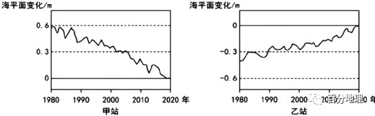   
   
1．冰盖消融导致海平面、消融区陆面垂直变化情况分别是（  ）   
A．上升   
下降   
B．上升   
上升   
C．下降   
上升   
D．下降   
下降   
2．与乙站相比，甲站海平面垂直变化幅度大而水平变化幅度比小，主要影响因素有（  ）   
①冰川沉积   
②板块运动   
③基岩海岸   
④海浪侵蚀   
A．①②   
B．②③   
C．③④   
D．①④   
3．导致乙站所在区域海岸线变化的主要人为影响方式是（  ）   
A．河流上游植被破坏严重   
B．大量修建引水灌溉工程   
C．新能源产业的快速发展   
D．海水侵蚀作用明显增强   
<span style="color: rgb(255, 0, 0);">【答案】1．B2．B3．B</span>   
<span style="color: rgb(255, 0, 0);">【解析】1．由于冰盖消融，冰川融水进入海洋导致海平面上升，CD错误。由材料可知，冰盖消融形成的消融区内，冰盖重力导致的岩层形变缓慢恢复，可推测消融区岩层形变缓慢恢复导致陆面上升。B正确，A错误。故选B。</span>   
<span style="color: rgb(255, 0, 0);">2．从海陆位置看，甲站位于基岩海岸，结合材料可知，冰盖消融形成的消融区内，冰盖重力导致的岩层形变缓慢恢复，可推测消融区岩层形变缓慢恢复导致陆面上升，甲站海平面垂直变化幅度大，③正确。甲位于太平洋北岸阿拉斯加，板块挤压，水平变化幅度较小，②正确；冰川沉积与海浪侵蚀均不会导致甲站陆面垂直和水平变化，①④错误；ACD错误，故选B。</span>   
<span style="color: rgb(255, 0, 0);">3．由图可知，乙站位于密西西比河河口三角洲，流域内水库与修建引水灌溉工程等水利工程建设，导致河口三角洲泥沙来源减少，三角洲萎缩，所以海岸线向陆地推进，B正确。河流上游植被破坏严重与海水侵蚀作用明显增强是自然影响，AD错误。新能源产业的快速发展不是海岸线变化的主要人为影响，C错误，故选B。</span>   
<span style="color: rgb(255, 0, 0);">【点睛】海岸线是海洋与陆地的分界线，更确切的定义是海水到达陆地的极限位置的连线。随潮水涨落而变动。由于受到潮汐作用以及风暴潮等影响，海水有涨有落，海面时高时低，这条海洋与陆地的分界线时刻处于变化之中。因此，实际的海岸线应该是高低潮间无数条海陆分界线的集合，它在空间上是一条带， 而不是-条地理位置固定的线。</span>   
（2022·福建漳州·高三阶段练习）河口三角洲的冲淤变化受河流的水沙运动与海洋动力等因素影响。2002年小浪底水库开始进行调水调沙实验，通过人工调控洪水，在短时间内将大量水沙集中输送入海，影响入海口陆地面积变化。下图示意1996-2018年黄河入海口造陆面积变化。据此完成下面小题。   
   
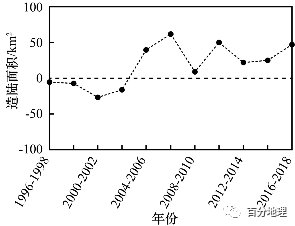   
   
4．获取黄河入海口三角洲造陆面积变化数据所应用的主要地理信息技术是（  ）   
A．地理信息系统   
B．全球卫星导航系统   
C．遥感技术   
D．虚拟环境技术   
5．1996-2018年黄河入海口海岸线（  ）   
A．持续向海洋推进   
B．先向海洋推进，后向陆地蚀退   
C．持续向陆地蚀退   
D．先向陆地蚀退，后向海洋推进   
6．推测万家寨、三门峡、小浪底等水库联合调水调沙的起始时期是（  ）   
A．2004-2006年   
B．2006-2008年   
C．2008-2010年   
D．2010-2012年   
<span style="color: rgb(255, 0, 0);">【答案】4．C5．D6．A</span>   
<span style="color: rgb(255, 0, 0);">【解析】4．遥感技术主要用于获取信息，由材料中的关键词“获取……数据”，因此选遥感技术，C正确。地理信息系统主要是对地理数据进行管理、查询、分析、输出等；全球卫星导航系统主要是进行定位和导航。虚拟现实技术又称“灵境技术”、“虚拟环境”、“赛伯空间”，英文名为Virtual Reality，简称VR技术。虚拟现实技术是一种综合应用计算机图形学，人机接口技术，传感器技术以及人工智能等技术，制造出逼真的人工模拟环境，并能有效地模拟人在自然环境中的各种感知的高级的人机交互技术。ABD错误。故选C。</span>   
<span style="color: rgb(255, 0, 0);">5．读图可知，1996-2004年黄河入海口造陆面积变化为负值，即陆地面积减小，说明海岸线向陆地蚀退，2004-2018年黄河入海口造陆面积变化为正值，即陆地面积增大，说明海岸线向海洋推进。因此可知，1996-2018年黄河入海口海岸线先向陆地蚀退，后向海洋推进，ABC错误，D正确。故选D。</span>   
<span style="color: rgb(255, 0, 0);">6．由材料可知：“2002年小浪底水库开始进行调水调沙实验，通过人工调控洪水，在短时间内将大量水沙集中输送入海”，2002年后黄河入海口泥沙含量开始增加，之后造陆面积变化由负变为正，到了2004-2006年，陆地面积增加最多，说明由小浪底单一水库转为万家寨、三门峡、小浪底等水库联合调水调沙，效果最为显著，结合选项判断，万家寨、三门峡、小浪底等水库联合调水调沙的起始时期是2004-2006年，A正确，BCD错误。故选A。</span>   
<span style="color: rgb(255, 0, 0);">【点睛】3S技术是遥感技术、地理信息系统和全球定位系统的统称，是空间技术、传感器技术、卫星定位与导航技术和计算机技术、通讯技术相结合，多学科高度集成的对空间信息进行采集、处理、管理、分析、表达、传播和应用的现代信息技术。</span>   
（2022·全国·高二课时练习）海岸地貌和陆架沉积序列的演化能较客观地反映海平面的升降状况。沙坝是由波浪携带泥沙堆积而成的一种狭长的、与海岸线平行的堆积体，沙坝将海水分割，内侧便形成一个封闭或半封闭的潟湖，潟湖常有潮汐通道与大海相连。下图为“全新世（11700年前至今）形成的美国东海岸地貌和陆架沉积序列模式图”，图中a、b为三角洲。据此完成下面小题。   
   
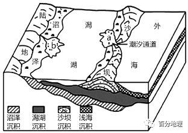   
   
7．图中a、b三角洲形成的主要外力作用分别是（  ）   
A．河流堆积、涨潮时海浪堆积   
B．河流堆积、退潮时海浪堆积   
C．涨潮时海浪堆积、河流堆积   
D．退潮时海浪堆积、河流堆积   
8．全新世该地海岸地貌和陆架沉积序列的演化过程中，海平面相对于陆地（  ）   
A．基本稳定   
B．呈上升趋势   
C．反复升降   
D．呈下降趋势   
<span style="color: rgb(255, 0, 0);">【答案】7．C8．B</span>   
<span style="color: rgb(255, 0, 0);">【解析】7．读图，图中a三角洲位于潮汐通道的潟湖一侧，向潟湖方向逐渐沉积，说明是涨潮时海浪向岸运动并堆积泥沙形成。b三角洲位于河流入湖口处，向海洋一侧沉积，形成的主要外力作用是河流堆积，因此C正确，退潮时海浪堆积形成的沉积物位于澙湖外面，ABD错。故选C。</span>   
<span style="color: rgb(255, 0, 0);">8．根据全新世，即11700年前至今，形成的美国东海岸地貌和陆架沉积序列，该地先有沼泽沉积，然后依次是澙湖沉积、沙坝沉积，最后是浅海沉积。在全新世该地海岸地貌和陆架沉积序列的演化过程中，浅海沉积覆在部分澙湖沉积之上，说明该时期海平面相对于陆地呈上升趋势，B正确，ACD错。故选B。</span>   
<span style="color: rgb(255, 0, 0);">【点睛】在一定的地质时期内，因海面下降或陆地上升，造成海水从大陆向海洋逐渐退缩的地质现象称为海退，反之称为海侵。滨岸地带垂向粒度大小是研究陆海变化的依据。</span>   
（2022·江西省丰城中学高三阶段练习）黄河入海口西北侧某海域（下左图）以淤泥质海岸为主。近年来，在人类活动和自然条件的共同影响下，该海域冲淤变化显著，但海岸线稳定。某科研团队对该海域冲淤变化情况进行了相关研究。下右图为1976-2014年研究区内5m和10m等深线包络面积（等深线与海岸线间的面积）变化示意围。据此完成下面小题。   
   
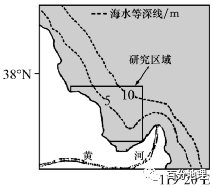   
   
9．研究区域内5m等深线距海岸的平均距离变化最小的时段是（  ）   
A．①   
B．②   
C．③   
D．④   
10．1976-2014年，研究区近岸海域（  ）   
A．持续淤积   
B．持续侵蚀   
C．先淤积后侵蚀   
D．先侵蚀后淤积   
11．据图推测2002-2014年黄河流域（  ）   
①降水量减少   
②水库泄洪量增加   
③森林覆盖率增加   
④耕地面积增加   
A．①③   
B．①④   
C．②③   
D．②④   
<span style="color: rgb(255, 0, 0);">【答案】9．B10．C11．A</span>   
<span style="color: rgb(255, 0, 0);">【解析】9．图中5m等深线大致与海岸线平行，5m等深线包络面积与海岸线间距离呈正相关，图示4个时段包络面积的变化可直接反映与海岸距离的变化。1976年的包络面积为60km2，1986年的包络面积为110km2，1996年的包络面积为115km2，2002年的包络面积为 110km2，2014年的包络面积为70km2，结合①②③④时段所跨的年份数，即可求出②时段，区域内5m等深线距海岸的平均距离变化最小，B正确，ACD错误。故选B。</span>   
<span style="color: rgb(255, 0, 0);">10．据图可知，1976—2014 年，研究区近岸海域5m等深线与海岸线间的面积呈现由小到大再变小的变化趋势，说明5m等深线距海岸的平均距离经历了由近到远再到近的过程，5m等深线距海岸的距离由近到远，说明海岸附近淤积加重，海水变浅，据此可推测研究区近岸海域先淤积变浅、后侵蚀变深，C正确，ABD错误。故选C。</span>   
<span style="color: rgb(255, 0, 0);">11．结合上题分析可知，2002-2014年，研究区近岸海域5m等深线与海岸线间的面积呈现由大到小的变化特点，说明该海域5m等深线距海岸的平均距离减小，泥沙淤积减少，侵蚀加剧，进而可推测黄河口入海泥沙量减少，最可能是流域森林覆盖率增加，水土流失减少，流域降水减少，流量减少，到达入海口的泥沙来源减少，而耕地面积增加，不合理地开垦耕地会导致水土流失量增加，黄河口入海泥沙量应增多，水库水库泄洪量增加，黄河口入海泥沙量也会增多，研究区近岸海域应该变浅，5m等深线包络面积应增大，综上可知，①③对，②④错，A正确，BCD错误。故选A。</span>   
<span style="color: rgb(255, 0, 0);">【点睛】右图中4个阶段的时间存在差异，计算时注意时间上存在陷阱。5m等深线包络面积越小，其距海岸的平均距离越近，研究区近岸海域变深，泥沙被大量侵蚀；5m等深线包络面积变大，其距海岸的平均距离变大，研究区近岸海域变浅，泥沙淤积量大。</span>   
（2022·山东·青岛三十九中高三开学考试）下图示意北美东南部沿海冲积平原某区域1890年以来海岸线的变化。读图，完成下面小题。   
   
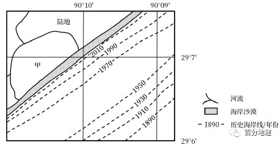   
   
12．在图示区域海岸线变化最快的时段，该区域可能经历了（  ）   
A．强烈的地震   
B．剧烈的海啸   
C．频发的飓风   
D．汹涌的洪水   
13．判断甲水域是湖泊而非海湾的依据是（  ）   
①甲水域北岸岸线基本稳定②百年来变动的海岸线近似平直   
③甲水域有河流汇入④甲水域呈半圆形形态   
A．①②   
B．②③   
C．③④   
D．①④   
<span style="color: rgb(255, 0, 0);">【答案】12．C13．A</span>   
<span style="color: rgb(255, 0, 0);">【解析】12．据图和材料可知，图示为北美东南部沿海冲积平原某区域海岸线，由1890年到2010年逐渐向陆地退缩，说明受海水侵蚀作用强烈。其中1950到1970年间，海岸线退缩范围最广，变化最快，海水侵蚀作用最强。地震属内力作用，通常会引起地表形态起伏更大，对海岸线退缩的直接影响较小，A错误；海啸是由海底地震、火山爆发、海底滑坡等形成的破坏性海浪，会产生海水侵蚀，但其形成的频率较低，不是该海域海岸线退缩的主要原因，B错误；结合经纬度，该地位于北大西洋低纬度地区，靠近热带海域，每年会发生多次飓风，飓风除导致狂风、暴雨的危害以外，还会形成风暴潮，对海岸线产生强烈的侵蚀和破坏作用，因其频率较高，使海岸线退缩范围广，变化快，C正确；汹涌的洪水会从上游带来大量泥沙沉积到海岸，使海岸线向海洋推进，与图示不符，D错误。故选C。</span>   
<span style="color: rgb(255, 0, 0);">13．百年来海岸线不断退缩，甲水域北岸岸线基本稳定，说明其与外海并未直接连通，而是受海岸线与海岸沙漠隔离，使其几乎没有受到海浪的侵蚀，①正确。百年来，变动的海岸线近似平直，而甲水域岸线弯曲，进一步说明甲水域长期受海岸和海岸沙漠的隔离，与外海分隔开来，形成陆地上的一个湖泊，②正确。据所学可知，海湾是三面环陆一面连接海域的海洋，湖泊是地表相对封闭的天然洼池（湖盆）及其承纳的水体，故甲水域有无河流注入、水域形态与其是湖泊还是海湾关系不大，③④错误。综合起来，A正确，BCD错误，故选A。</span>   
<span style="color: rgb(255, 0, 0);">【点睛】飓风是大西洋和东太平洋地区将强大而深厚（最大风速达32.7米/秒，风力为12级以上）的热带气旋称也泛指狂风和任何热带气旋以及风力达12级的任何大风。台风和飓风最大的区别就是出生地和活动区域不同。台风主要是指在西北太平洋和南海的生成及活动的热带气旋，而飓风是指在中东太平洋和北大西洋上生成及活动热带气旋。海啸就是由海底地震、火山爆发、海底滑坡或气象变化产生的破坏性海浪。</span>   
（2022·贵州毕节·三模）历史上黄河下游以“多淤善徙”著称、入海口频繁改道，河流与海潮的冲淤变化不断改变三角洲形态。1976年，人工将入海通道由刁口河改为清水沟，但原刁口河河道仍以0.8～2.0cm／年的平均速率不断沉积，且沉积物厚度自下游向上游递减。下图示意黄河、刁口河、清水沟位置，据此完成问题   
   
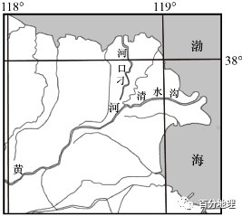   
   
14．不属于黄河下游河道曾经“多淤善徙”的主要原因（  ）   
A．流经黄土高原，河流含沙量大   
B．下游径流量大，侵蚀作用强   
C．下游流速慢，河床淤积速度快   
D．下游河床淤积，易决口改道   
15．刁口河河道废弃后仍不断沉积，且沉积物厚度自下游向上游递减的主要原因（  ）   
A．黄河依然向刁口河输送泥沙   
B．刁口河上游受黄河侵蚀加剧   
C．海潮沿刁口河河道上溯沉积   
D．刁口河河口受海潮侵蚀加剧   
16．1976年后，关于河口附近海岸线变化的推测正确的是（  ）   
A．清水沟流量增大，河流沉积增强，海岸线向海洋推进   
B．清水沟流量增大，海潮侵蚀增强，海岸线向陆地退缩   
C．刁口河流量减少，海潮沉积减弱，海岸线向陆地退缩   
D．刁口河流量减少，河流侵蚀减弱，海岸线向海洋推进   
<span style="color: rgb(255, 0, 0);">【答案】14．B15．C16．A</span>   
<span style="color: rgb(255, 0, 0);">【解析】14．“多淤善徙”说明黄河下游淤积严重，改道频繁，主要原因是泥沙含量大，流速慢，河床淤积速度快，易抬升为地上河，水位变化不定，易发生决堤改道事件。因此黄河流经黄土高原，导致流含沙量大，A选项排除。下游以沉积作用为主，B选项正确。下游流速慢，河床淤积速度快，易决口改道，C、D选项排除。故选B。</span>   
<span style="color: rgb(255, 0, 0);">15．刁口河河道废弃后仍不断沉积，且沉积物厚度自下游向上游递减，说明河道泥沙主要源于海洋，受风力影响，含沙量较高的海浪不断上溯，且越往下游，接受的沉积物越多，厚度越大，因此使由于海潮沿刁口河河道上溯沉积而成，C选项正确。黄河依然向刁口河输送泥沙，不会造成沉积物厚度自下游向上游递减，A选项错误。刁口河河道已经废弃，与其上游受黄河侵蚀关系不大，B选项错误。刁口河河道废弃后不断沉积而形成大量沉积物，与侵蚀作用无关，D选项错误。故选C。</span>   
<span style="color: rgb(255, 0, 0);">16．1976年，人工将入海通道由刁口河改为清水沟，说明清水沟流量增大，刁口河流量减少。清水沟流量增大，会使河流沉积作用增强，海潮侵蚀减弱，海岸线向海洋推进，A选项正确，B选项错误。刁口河流量减少，河流侵蚀减弱，海潮侵蚀增强，海岸线向陆地退缩，C、D选项错误。故选A。</span>   
<span style="color: rgb(255, 0, 0);">【点睛】河道变迁的影响因素：地势起伏的变化；河流水量的变化；堤岸土质松紧；河床深浅；地转偏向力；人类活动，如水利工程等。</span>   
（2022·北京·模拟预测）湄公河在河口三角洲共有九个入海口，形成了“九龙入海”的水系特征。在距今1.2～0.85万年前，湄公河流域的地壳、降水相对稳定。下图示意现今湄公河三角洲附近不同时期的海岸线。据此完成下面小题。   
   
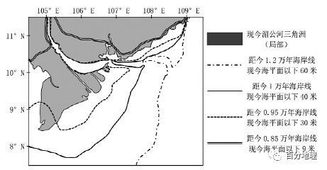   
   
17．湄公河河口形成“九龙入海”的主要因素是（  ）   
A．纬度   
B．地形   
C．洋流   
D．大气环流   
18．距今1.2～0.85万年，湄公河河口三角洲变化的主要原因是（  ）   
A．板块挤压   
B．人类开垦   
C．输沙减少   
D．全球变暖   
<span style="color: rgb(255, 0, 0);">【答案】17．B18．D</span>   
<span style="color: rgb(255, 0, 0);">【解析】17．河口处河道分叉与河流的流量、泥沙沉积量、地形地势、海水的顶托作用影响显著，与纬度并无关联，A选项错误。流域雨季降水丰富，径流量大，河口处地势低平有起伏，导致河口段泥沙容易沉积形成沙洲，导致河流分叉，B选项正确。河口处河道分叉可能会受到海洋顶托作用的影响，但湄公河河口形成九龙入海，其河道分叉相对较多，更主要的因素在于河口处的地势过于低平， 与洋流关系不大，C选项错误。湄公河流域受热带季风气候影响显著，雨季降水较为丰富，流量较大，这为河口处泥沙堆积提供了条件，但河口处形成分叉与大气环流并无直接关联，D选项错误。故选B。</span>   
<span style="color: rgb(255, 0, 0);">18．根据材料可知，“在距今1.2～0.85万年前，湄公河流域的地壳、降水相对稳定”，湄公河河口三角洲变化与板块运动不相关，A选项错误。受人类开垦的影响，易导致植被破坏严重，水土流失加剧，在降水量稳定的前提下，河流泥沙易在下游产生堆积，三角洲的面积应扩大，与材料海岸线变化不符，B选项错误。湄公河主要受大气降水补给，在降水量相对稳定的前提下，河流流量稳定，河流的输沙量变化不大，C选项错误。海岸线能反映不同地质时期陆地和海洋的分布情况，根据图示信息可知，自距今1.2万年海岸线至距今0.85万年海岸线，海岸线向陆地一侧退却，表明海平面上升，陆地面积萎缩，本区地壳、降水相对稳定，主要是全球气候变暖使得陆地冰川融化汇流入海，导致海平面上升，D选项正确。故选D。</span>   
<span style="color: rgb(255, 0, 0);">【点睛】河口“九龙入海”表明湄公河在河口三角洲地带河流分叉严重，入海河道较多。湄公河携带大量泥沙入海，受海水顶托作用，大量泥沙沉积形成沙洲，地势低平，且略有起伏，水流分散，导致河流分叉。</span>   
（2021·河南·高三阶段练习）沿海含水层为沿海低洼地区提供了重要的淡水资源。一般来说，淡水位于含水层中密度较大的海水之上，在海岸线附近形成咸水楔，即咸淡水接触界面（如下左图）。为抵御海水入侵，可通过注射井向承压水层注入淡水。计算机模拟实验表明，回灌淡水的温度对咸水楔的位置会产生较大影响（如下右图）。黄河口含水层海水入侵严重，盐度较高，需要利用地表水回灌来抵御。据此完成下面小题。   
   
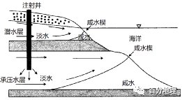   
   
19．与潜水层相比，该地承压水层海水入侵更加严重，主要是因为（  ）   
A．承压水层埋藏浅   
B．承压水层厚度大   
C．承压水层透水性好   
D．承压水密度大   
20．与冷水相比，回灌热水（  ）   
①初期，咸水入侵面积下降更快   
②咸淡水达到平衡速度更快   
③8小时后，咸水楔来回摆动最明显   
④咸水楔出现来回摆动的情况   
A．①③   
B．①④   
C．②③   
D．②④   
21．根据模拟实验的结果及流域的水文形势推测，黄河三角洲最适宜进行淡水回灌的季节是（  ）   
A．春季   
B．夏季   
C．秋季   
D．冬季   
<span style="color: rgb(255, 0, 0);">【答案】19．B20．B21．C</span>   
<span style="color: rgb(255, 0, 0);">【分析】19．图中与潜水层相比，该地承压水层埋藏更深，A错；该地承压水层海水入侵更加严重，主要是由于承压水层厚度大，咸淡水接触界面大，海水入侵更加严重，B正确；承压水层透水性好与海水入侵更加严重不存在相关性，C错；承压水埋藏深，水温高，密度小，D错。故本题选B。</span>   
<span style="color: rgb(255, 0, 0);">20．由图可知，与冷水相比，回灌40°C热水，在4小时内，咸水入侵面积下降更快，①正确；8小时后，咸水楔来回摆动不明显，回灌的40°C热水使咸淡水达到平衡，速度与冷水相比较慢，②③错；回灌40°C热水4小时后，咸水入侵面积又有所增加，咸水楔出现来回摆动的情况，④正确。综合上述分析，①④正确。故本题排除ACD三项，选B。</span>   
<span style="color: rgb(255, 0, 0);">21．黄河三角洲属于华北温带季风气候，冬、春季节降水少，河流流量少，淡水资源紧张，故冬、春季不适宜进行淡水回灌，AD错；夏季，地表水水温较高，回灌来抵御海水入侵的效果较差，故排除B；秋季属于黄河下游汛期后期，淡水资源充足，且水温较低，此时回灌抵御海水入侵的效果较好，C正确。故本题选C。</span>   
<span style="color: rgb(255, 0, 0);">【点睛】海水入侵的主要原因是：滨海地区人为超量开采地下水，引起地下水位大幅度下降，海水与淡水之间的水动力平衡被破坏，导致咸淡水界面向陆地方向移动的现象”。海水入侵定义最核心的东西是“人为超量开采地下水造成水动力平衡的破坏”。</span>   
（2022·全国·高三专题练习）贝壳堤是由死亡的贝类生物在海岸带堆积而成。在沿海地区经常分布着多条贝壳堤，标志着海岸线位置的变化，贝壳堤之间的组成物质以河流携带的泥沙为主。下图示意渤海湾沿岸某地区贝壳堤的分布。据此完成下面小题。   
   
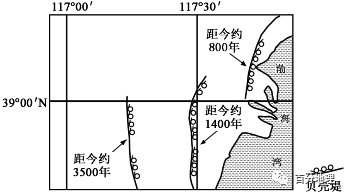   
   
22．在任一条贝壳堤的形成过程中，海岸线（  ）   
A．向陆地方向推进   
B．向海洋方向推进   
C．位置稳定   
D．反复进退   
23．沿岸流动的海水搬运河流入海口处的泥沙，并在贝壳堤外堆积。由此（  ）   
A．成新的贝壳堤   
B．使海岸线向陆地后退   
C．海岸带陆地面积不断扩大   
D．迫使河流多次改道   
24．该地海岸线位置多次变动，说明河流入海口（  ）   
A．海浪侵蚀力强，泥沙沉积量小   
B．海浪携带大量物质在此沉积   
C．河流含沙量小，泥沙沉积量小   
D．河流大量输沙，在此沉积量大   
<span style="color: rgb(255, 0, 0);">【答案】22．C23．C24．D</span>   
<span style="color: rgb(255, 0, 0);">【分析】22．该题从静态角度考查同一条贝壳堤形成时期海岸线的位置变化。贝壳堤由死亡的贝类生物在海岸带堆积而成，在任一条贝壳堤的形成过程中，则会有大量死亡的贝类生物在海岸带堆积，这是海岸线位置稳定才会形成贝壳堤。A、B、D错误，C正确，故选C。</span>   
<span style="color: rgb(255, 0, 0);">23．由图可以看出，贝壳堤距今时间越远，距海就越远，说明有泥沙在贝壳堤外堆积，沿岸流动的海水搬运河流入海口处的泥沙，并在贝壳堤外堆积，加大贝壳堤距海岸线的距离，使海岸向海洋前进，形成新的贝壳堤，贝壳堤由死亡的贝类生物在海岸带堆积而成，A、B错误；泥沙在贝壳堤外堆积，会导致海岸带的陆地面积不断扩大，C正确；迫使河流改道，图中并没有显示有河流改道，D错误；故选C。</span>   
<span style="color: rgb(255, 0, 0);">24．图中可以看出贝壳堤不断向海洋前进，说明河流带来大量泥沙在入海口位置沉积，A、C错误；读图可以看出形成了多条贝壳堤，而且贝壳堤的形成时间距今不一样，距海的距离有差异，说明在距今几千年中，河流入海口处位置发生多次变化，贝壳堤外主要是由于泥沙的堆积使得距海越来越远，因此说明泥沙沉积量大，B错误，D正确；故选D。</span>   
<span style="color: rgb(255, 0, 0);">【点睛】本题主要考查地表形态变化的原因和地质构造。影响地表形态变化的因素有：内力作用（地壳运动、岩浆活动、地质作用）和外力作用（风化、侵蚀、搬运、沉积）。审题一定要准确，抓住材料中的关键语句“在任一条贝壳堤的形成过程中”、“任一条贝壳堤”和“形成过程中”，然后结合图中贝壳堤的位置，进行分析并解答。</span>   
（2022·江苏·高三专题练习）海岸是海陆相互作用地带，贝壳堤是由海洋里大量甲壳生物的遗骸经过多种地质作用形成的，它是古海岸的遗迹。读图，完成下面小题。   
   
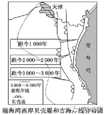   
   
25．从6000年前至今，渤海湾西岸海岸线的变迁特点及主要原因是（  ）   
A．陆进海退河流泥沙堆积   
B．陆进海退海潮、海浪堆积   
C．陆退海进河流冲刷   
D．陆退海进海潮、海浪冲刷   
26．从2500年前至今形成的两条贝壳堤在图示地区南部合二为一，是因为（  ）   
A．贝壳堤必须与海岸线平行   
B．南部海平面比北部海平面高   
C．南部河流入海泥沙比北部的少   
D．南部地壳下沉与泥沙堆积的速度相当   
<span style="color: rgb(255, 0, 0);">【答案】25．A26．D</span>   
<span style="color: rgb(255, 0, 0);">【分析】25．从图中分析，从6000年前至今渤海湾西岸海岸线逐渐向东推进，变迁特点为陆进海退，主要原因是该地地处海河入海口附近，河流夹带泥沙沉积形成，A正确，CD错误；海潮、海浪堆积不会造成大范围的海岸线变迁，B错误。所以选A。</span>   
<span style="color: rgb(255, 0, 0);">26．图示南部地区两条贝壳堤虽然形成的时间不同，但合二为一， 说明在两堤形成的过程中，该地海岸线没有发生大的变迁，说明该地海底较稳定，泥沙沉积速度和地壳下沉速度持平，D项正确。两条贝壳堤在北部分开，走向不同，与海岸线并不平行，因不同海域海浪堆积强度不同，所以贝壳堤不一定与海岸线平行，A项错误。该地为同一一海域，海平面高度相同，B项错误。 南部河流为黄河，因含沙量较海河大，入海泥沙比北部的多，C项错误。</span>   
<span style="color: rgb(255, 0, 0);">【点睛】我国自天津附近东至海边的沙泥质平原上有四条很长的贝壳堤，沿着同渤海湾现代海岸大体一致的方向自北而南分布。它们是古黄河远离天津入海时形成的渤海湾古海岸线的遗迹。也是海岸线后退的重要标志。</span>   
（2021·全国·高三专题练习）陆地冰川的变化与海平面升降存在一定的关联性。下面图甲示意欧洲东部三次冰期冰川界线的分布位置，图乙为相应时期内我国南部沿海某地的海岸线位置分布示意图。读图，完成下面小题。   
   
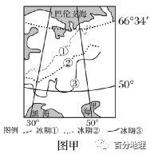   
   
27．图甲所示三次冰期，与图乙中海岸线a、b、c所处时期依次对应的是（  ）   
A．①③②   
B．①②③   
C．③②①   
D．③①②   
28．同一时期在海洋中形成的岩石，水平方向上由浅海到深海依次是砂岩、页岩、石灰岩。若图乙中海岸线a、b、c发生的时间是按从早到晚依次出现的，则Q处的地质剖面图是（  ）   
   
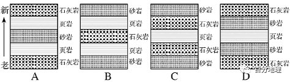   
   
A．AB．BC．CD．D<span style="color: rgb(255, 0, 0);">【答案】27．D28．B</span>   
<span style="color: rgb(255, 0, 0);">【分析】27．冰川界线纬度越高，该时期的气温就越高，冰川面积小，海平面上升，海岸线会向陆地推进，反之则后退。图甲中①线的纬度最高，表示当时气温最高，冰川覆盖的范围最小，该时期的海岸线向陆地推进最明显，对应图乙中的b线；③线出现的纬度最低，表示当时的气温最低，该时期的海岸线后退明显，对应的是图乙中的a线，所以图甲所示三次冰期，与图乙中海岸线a、b、c所处时期依次对应的是③①②，D正确，ABC错误。故本题选D。</span>   
<span style="color: rgb(255, 0, 0);">28．同一时期在海洋中形成的岩石，水平方向上由浅海向深海依次是砂岩、页岩、石灰岩，即砂岩形成于浅海，石灰岩形成于深海，页岩居中。同一海域的海底，若在垂直方向上三类岩石都有分布，说明地质时期该海域海水深度发生了变化，海水变深说明海岸线向内陆推进，变浅说明海岸线后退。图乙中显示a海岸线距离Q处最近，此时Q处海水较浅，形成的应该是砂岩，之后海岸线向陆地推进，形成海岸线b，则Q处的海水加深，形成了页岩、石灰岩；然后海岸线又后退，距离Q处的位置变近，Q处海水变浅，从而形成了页岩、砂岩。故B正确，ACD错误。所以本题选B。</span>   
<span style="color: rgb(255, 0, 0);">【点睛】海岸线的进退：海平面上升，要淹没很多的陆地，那么海岸线自然发生变化，即进；反之就是退。一般说的海岸线进退是指由于气候的变化，造成海平面上升或下降，海岸线自然也就发生变化，由于历史上曾经有多次全球变冷和变暖的时期，所以海岸线也就发生了变化，目前可能通过海岸线的变化来逆推古时候的海平面高低，进而推出当时的气候环境。</span>   
二、综合题   
29．（2022·辽宁·高二阶段练习）阅读图文材料，完成下列要求。   
淮河上游多山区，中游较平坦，下游入海通道较多，是新中国成立后治理的第一条大河。历史上，黄河多次夺淮入海（以淮河河道作为出海口），导致淮河下游洪水排泄不畅。近日，淮河入海水道二期工程开工，工程建成后，将进一步打通淮河流域洪水排泄入海通道，大幅提升洪泽湖防洪滞洪标准，减少淮河沿岸滞洪区使用。下图示意淮河入海水道及苏北、苏中地区海岸线的变迁。   
   
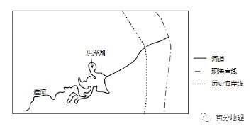   
   
(1)分析历史上6——9月淮河下游洪涝多发的原因。   
(2)简述黄河多次夺淮对淮河下游地貌的影响。   
(3)说明淮河入海通道修建的有利影响。   
<span style="color: rgb(255, 0, 0);">【答案】(1)受台风影响，我国东部沿海地区6～9月常出现台风暴雨；6月～7月初，长江中下游（淮河南部）进入梅雨季节，降水多；上游河流源短流急，来水快；下游地势较平坦，排水较慢。</span>   
<span style="color: rgb(255, 0, 0);">(2)淮河干流泥沙淤积，河水变浅；苏北、苏中海岸线向东扩展，陆地面积增加；泥沙阻塞入海通道，洪泽湖形成。</span>   
<span style="color: rgb(255, 0, 0);">(3)排水顺畅，减少洪涝灾害；减少滞洪区启用，支撑经济社会发展；减少河道淤塞，为通航创造条件。</span>   
<span style="color: rgb(255, 0, 0);">【分析】本大题以淮河上游为材料，涉及洪涝灾害成因，河流地貌等相关内容，考查学生对相关知识的掌握程度。</span>   
<span style="color: rgb(255, 0, 0);">（1）淮河地区属于温带季风气候，夏季降水集中，6月～7月初，长江中下游（淮河南部）进入梅雨季节，降水多；夏秋季节多台风，台风降水量大，我国东部沿海地区6～9月常出现台风暴雨；上游山区，地形起伏大，上游河流源短流急，来水快；下游地势较平坦，排水较慢，不易泄洪。</span>   
<span style="color: rgb(255, 0, 0);">（2）黄河含沙量大，淮河下游地形平坦，淮河干流泥沙淤积，河水变浅；入海泥沙增多，苏北、苏中海岸线向东扩展，陆地面积增加；黄河夺淮后，黄河携带大量泥沙冲入淮河下游，导致泥沙阻塞入海通道，从而形成洪泽湖。</span>   
<span style="color: rgb(255, 0, 0);">（3）新的排水通道，排水顺畅，能减少洪涝灾害；排水便利，洪涝灾害减少，可减少滞洪区启用，支撑经济社会发展；入海通道，泥沙入海，可减少河道淤塞，改善航运。</span>   
30．（2022·海南·高二期末）阅读图文材料，完成下列要求。   
海岸地带是介于陆地和海洋生态系统间复杂的自然综合体。围垦、港口建设等人类活动不仅导致大量自然岸线转变为人工岸线，而且导致湿地变得破碎、质量降低。江苏盐城滨海区域是淤泥质平原海岸，近年来由于围垦、海堤和港口建设需要，岸线明显东移，并且呈独特的淤积格局。下图示意1987年和2018年盐城海岸线的分布，在这期间港口建设兴起，并完成了港口双导堤工程（双导堤是治理河口拦门沙航道常用的手段，能够减轻泥沙淤积）。   
   
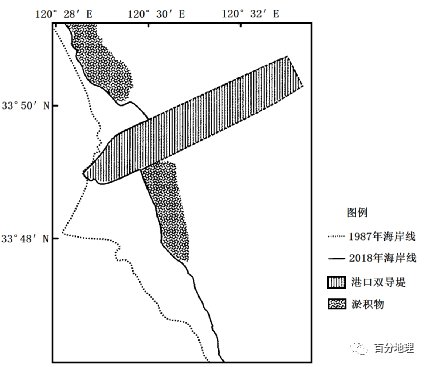   
   
(1)分析图示区域海岸线东移的原因。   
(2)简述港口规划和建设时为了减轻对海岸湿地的影响可采取的措施。   
<span style="color: rgb(255, 0, 0);">【答案】(1)由于港区建设，人工填海造陆，促使海岸线明显东移；人工岸线和港口双导堤阻挡海浪，导致海水沉积加剧，海岸泥沙淤积，海岸线向东移动。</span>   
<span style="color: rgb(255, 0, 0);">(2)协调港口开发与湿地保护，合理控制港口规模；加强港区生态建设，建立缓冲区与隔离带，防止“三废”污染沿海湿地；加强淤泥质岸滩监测，关注对周边生态产生的影响，科学养护海滩和港口工程。</span>   
<span style="color: rgb(255, 0, 0);">【分析】本题以盐城海岸线的分布与变化示意图及材料为背景，考查海岸带的开发与保护的相关内容。考查学生获取和解读地理信息，调动和运用地理知识的能力，同时考查学生的区域认知水平、综合思维能力、地理实践力以及人地协调观的核心素养。</span>   
<span style="color: rgb(255, 0, 0);">（1）由材料“江苏盐城滨海区域是淤泥质平原海岸，近年来由于围垦、海堤和港口建设需要，岸线明显东移，并且呈独特的淤积格局”并读图可知，由于港区建设，人工填海造陆，促使海岸线明显东移；读图可知，在2018年海岸线外出现了两处淤积物，说明由于人工岸线和港口双导堤阻挡海浪，导致海水沉积加剧，海岸泥沙淤积，海岸线向东移动。</span>   
<span style="color: rgb(255, 0, 0);">（2）由材料“围垦、港口建设等人类活动不仅导致大量自然岸线转变为人工岸线，而且导致湿地变得破碎、质量降低”可知，人类活动对海岸带带来深刻的影响，因此在海岸开发时要注意协调港口开发与湿地保护，合理控制港口规模；由材料“海岸地带是介于陆地和海洋生态系统间复杂的自然综合体。”可知，在港区建设时要注意加强港区生态建设，建立缓冲区与隔离带，防止“三废”污染沿海湿地，减少人类活动对海岸生态系统的影响；由材料“在这期间港口建设兴起，并完成了港口双导堤工程（双导堤是治理河口拦门沙航道常用的手段，能够减轻泥沙淤积）”可知，在港口兴建时，要加强淤泥质岸滩监测，关注对周边生态产生的影响，科学养护海滩和港口工程。</span>   
31．（2022·黑龙江哈尔滨·高二期末）阅读图文材料，完成下列问题。   
盐城市作为江苏省面积最大的沿海城市，不仅拥有江苏省最长的海岸线，面积最大的沿海滩涂、最广的海域面积和最大的海岸湿地，也是西太平洋海岸最大的滨海湿地。盐城市海岸带区域人口密集、开发强度高、生态脆弱，海岸线的变迁对海岸带经济和社会活动的影响大。下图为1992～2018年盐城市滨海港以北海岸线变化示意图。   
   
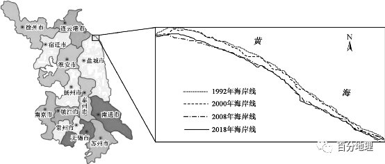   
   
(1)指出1992～2018年盐城市滨海港以北海岸线变化特征。   
(2)简析1992～2018年盐城市滨海港以北海岸线变化的主要影响。   
(3)简述实现盐城市海岸带可持续发展的主要途径。   
<span style="color: rgb(255, 0, 0);">【答案】(1)1992～2018年盐城市滨海港以北海岸线一直被侵蚀后退；2000～2008年侵蚀后退幅度较大；1992～2000年和2008～2018年侵蚀后退幅度较小等。</span>   
<span style="color: rgb(255, 0, 0);">(2)海岸线侵蚀后退，改变了近岸海洋生物的栖息地环境，导致栖息地片段化甚至被破坏，导致生物多样性降低；导致地基不稳，危害海岸防护工程、港口设施及其他类型的沿海工程设施等。</span>   
<span style="color: rgb(255, 0, 0);">(3)转变经济发展模式，调整产业结构，发展壮大低耗能、低污染的产业；发挥生态优势，积极打造生态文城市；严格控制港口建设规模及其对周边环境的影响，加强沿海区域的环境保护，做好生态补偿；适度发展沿海生态旅游业等。</span>   
<span style="color: rgb(255, 0, 0);">【分析】本题以盐城市滨海港以北海岸线为情境，设置三道小题，考查海岸线变化特征与影响等知识点，重点考查获取和解读信息的能力以及区域认知、综合思维等学科素养。</span>   
<span style="color: rgb(255, 0, 0);">(1)1992～2018年盐城市滨海港以北海岸线变化特征主要从海岸线移动方向以及移动幅度来回答。根据图中信息，可以判断出1992～2018年盐城市滨海港以北海岸线一直被侵蚀后退，但是在不同时间阶段，侵蚀后退的幅度不同，海岸线侵蚀后退幅度，存在时间分布上的差异，2000～2008年侵蚀后退幅度较大，1992～2000年和2008～2018年侵蚀后退幅度较小。</span>   
<span style="color: rgb(255, 0, 0);">(2)1992～2018年盐城市滨海港以北海岸线变化的主要影响主要从工程与生态的角度来回答。从工程的角度来分析，由于1992～2018年盐城市滨海港以北海岸线一直被侵蚀后退，所以可以判断出海岸一直后退会导致沿海建筑的地基不稳，会危害海岸防护工程，港口设施以及其他类型的沿海工程设施的安全。从生态的角度来分析，由于海岸后退，会导致海水入侵会破坏近岸海洋生物原有的栖息环境，导致海洋生物栖息地片段化，甚至完全消失，引起生物多样性降低。</span>   
<span style="color: rgb(255, 0, 0);">(3)实现盐城市海岸带可持续发展的主要途径主要从调整产业结构，发挥生态优势，做好环境保护等角度来分析。从调整产业结构的角度来分析，可以转变经济发展模式，调整产业结构，发展低耗能、低污染的产业，实现盐城市海岸带可持续发展。从发挥生态优势的角度来分析，发挥生态优势，积极打造生态文城，做好生态补偿并且适度发展沿海生态旅游业市。从做好环境保护的角度来分析，应严格控制港口建设规模及其对周边环境的影响，加强沿海区域的环境保护从而实现盐城市海岸带可持续发展。</span>   
32．（2023·全国·高三专题练习）阅读图文材料,完成下列要求。   
影响海岸线位置的因素,既有全球尺度因素,如海平面升降,又有区域尺度因素,如泥沙沉积、地壳运动、人类活动等导致的陆面升降。最新研究表明,冰盖消融形成的消融区内,冰盖重力导致的岩层形变缓慢恢复,持续影响着该范围的海岸线位置。距今约1.8万年,北美冰盖开始消融,形成广大消融区。下图显示甲（位于太平洋北岸阿拉斯加的基岩海岸区）、乙（位于墨西哥湾密西西比河的河口三角洲）两站监测的海平面的相对变化。海平面的相对变化是陆面和海平面共同变化的结果。   
   
   
   
(1)分别指出冰盖消融导致的海平面、消融区陆面的垂直变化,并说明两者共同导致的海岸线水平变化方向。   
(2)根据地理位置,分析甲站陆面垂直变化的原因。   
(3)说明导致乙站所在区域海岸线变化的主要人为影响方式。   
(4)分析甲站区域与乙站区域海岸线水平变化的方向和幅度的差异。   
<span style="color: rgb(255, 0, 0);">【答案】(1)海平面上升，消融区陆面上升。冰盖消融期，海平面上升幅度超过陆面上升幅度，海岸线向陆地方向推进；冰盖消融后，陆面上升幅度超过海平面上升幅度，海岸线向海洋方向退缩。</span>   
<span style="color: rgb(255, 0, 0);">(2)甲地位于基岩海岸，冰盖覆盖时，岩层受压导致陆面下沉，冰盖消融后，岩层承压减轻，岩层形变缓慢恢复，使得陆面上升；甲站位于板块交界处，板块运动导致甲站陆面抬升。</span>   
<span style="color: rgb(255, 0, 0);">(3)大量排放温室气体，导致气候变暖，加速冰川消融和海水热膨胀，导致海平面上升；密西西比河流域内水利设施拦水拦沙，导致河口三角洲萎缩，海岸线向陆地推进。</span>   
<span style="color: rgb(255, 0, 0);">(4)甲站区域位于太平洋北岸，海平面下降，海岸线向南移动，由于基岩海岸陡峭，海岸线在水平方向上变化幅度较小；乙站区域南侧临海，海平面上升，海岸线向北移动，由于三角洲地势平缓，在水平方向上变化幅度较大。</span>   
<span style="color: rgb(255, 0, 0);">【分析】本题以海岸线的变化为背景，涉及海岸线位置变化方向、幅度及原因、陆面变化等知识点，主要考查获取和解读信息的能力以及综合思维、区域认知等学科素养。</span>   
<span style="color: rgb(255, 0, 0);">（1）先指出海平面和消融区陆面的垂直变化方向：结合所学知识可知，冰盖消融，冰川融水进入海洋导致海平面上升；由材料可知，冰盖消融形成的消融区内，冰盖重力导致的岩层形变缓慢恢复，可推测消融区岩层形变缓慢恢复导致陆面上升。海岸线水平变化方向随着海面和陆面的变化而变化，当冰盖消融快，大量冰川融水流入海洋，则海平面上升幅度快，超过陆面上升幅度，海岸线向陆地方向推进，当冰盖消融完毕，冰川融水减少，陆面上升幅度超过海平面上升幅度，海岸线向海洋方向退缩。</span>   
<span style="color: rgb(255, 0, 0);">（2）从海陆位置看，甲站位于基岩海岸，结合材料可知，冰盖消融形成的消融区内，冰盖重力导致的岩层形变缓慢恢复，可推测消融区岩层形变缓慢恢复导致陆面上升；从板块位置看，甲站位于美洲板块和太平洋板块的消亡边界，板块运动导致地壳抬升，使得甲站陆面抬升。</span>   
<span style="color: rgb(255, 0, 0);">（3）由图可知，乙站所在区域海平面上升，从人类活动角度入手分析，如温室气体大量排放加剧全球变暖，导致冰川融化和海水热膨胀，从而导致海平面上升；乙站位于密西西比河河口三角洲，流域内水库等水利工程建设，导致河口三角洲泥沙来源减少，三角洲萎缩，海岸线向陆地推进。</span>   
<span style="color: rgb(255, 0, 0);">（4）由材料可知，甲站位于太平洋北岸阿拉斯加的基岩海岸区，由图可知，甲地海平面下降，可推测甲地海岸线向南移动，基岩海岸较陡峭，故海岸线在水平方向上变化幅度较小；乙站位于墨西哥湾密西西比河的河口三角洲，由图可知，乙地海平面上升，故海岸线向北移动，由于河口三角洲地势平缓，故海岸线在水平方向上变化幅度较大。</span>   
33．（2022·全国·高三专题练习）阅读图文材料，完成下列要求。   
中国大陆自然海岸线漫长，类型分为淤泥质岸线、砂砾质岸线、生物岸线、基岩质岸线等。淤泥质岸线是几类岸线中长度最长的一类，主要分布在辽宁东部沿海、辽东湾、渤海湾、莱州湾等岸段。淤泥质海岸岸线曲度小、潮间带坡度平缓，人类可通过填海造地、围垦养殖、建造港口等工程，在海湾中淤积出更多的土地，因其具有巨大经济价值，在几类岸线中长度急剧减少。伴随着自然岸线被开发为人工岸线，岸线呈现出平直化、单一化与硬质化现象。   
贝壳堤指海岸带淤泥质海岸平原上由海生贝壳碎屑和细沙、粉沙组成的一种滨岸堤。它的发展反映了一个具有粉沙底质、水清而成，以波浪潮汐作用为主的有利于贝类生长的海湾环境。我国自天津附近东至海边的沙泥质平原上有四条很长的贝壳堤，沿着同渤海湾现代海岸大体一致的方向自北而南分布。每一道贝壳堤都代表了过去的一道古海岸线，它们共同见证了渤海湾西岸沧海桑田的过程。遗憾的是，这些断续绵延数十公里甚至上百公里的贝壳堤，如今差不多已被破坏殆尽了。   
   
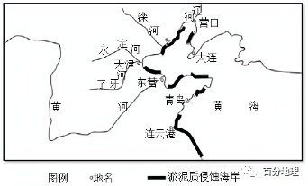   
   
(1)淤泥质海岸和基岩质海岸在地貌上是不同的。说出基岩质海岸的两种地貌类型。   
(2)贝壳堤的形成是哪种地质作用造成的。该地区5000年来海岸线位置的变迁，海岸线发生了哪些变化。   
(3)指出淤泥质海岸线急剧缩减对地理环境产生的影响，并提出保护淤泥质海岸线的合理建议。   
(4)请指出保护好、利用好贝壳堤的意义。   
<span style="color: rgb(255, 0, 0);">【答案】(1)海蚀崖海蚀柱等。</span>   
<span style="color: rgb(255, 0, 0);">(2)堆积作用；海岸线发生了海退（海岸线后退）。</span>   
<span style="color: rgb(255, 0, 0);">(3)迁徙的候鸟无法在潮间带觅食，破坏海岸生物栖息地，生物多样性减少；加剧了海岸生态的脆弱性，净化能力降低（污染加剧）；自然资源供给能力减弱；内海面积缩小。设立保护区；在保护区内严禁围垦和填海；加强政府监管，建立健全相关法律法规；加强统筹计划，提前制定合理开发方案。</span>   
<span style="color: rgb(255, 0, 0);">(4)是极为珍贵的地质景观；它具有独特的科学价值；见证了我们祖先的活动范围数千年来从山区向海洋扩张的发展历程。（贝壳堤是珍贵的海洋自然遗迹，真实地记录了沧海变桑田的过程；对研究古地理、古气候、海洋生态、海陆变迁等多学科具有重要价值；是中国罕见的不可再生性资源。）</span>   
<span style="color: rgb(255, 0, 0);">【分析】本题以贝壳堤为材料，涉及海岸地貌、生态保护的相关知识，考查学生图片材料信息提取能力，体现了区域认知、综合思维、地理实践力以及人地协调观的地理学科核心素养。</span>   
<span style="color: rgb(255, 0, 0);">（1）基岩质海岸主要以海蚀地貌为主，主要有海蚀柱、海蚀崖、海蚀穴、海蚀拱桥等。</span>   
<span style="color: rgb(255, 0, 0);">（2）根据材料信息可知，贝壳堤是由于海水的堆积作用形成的。根据图示信息可知，该地区5000年来贝壳堤的位置向海洋方向推进，说明海岸线向海洋方向发生了后退。</span>   
<span style="color: rgb(255, 0, 0);">（3）淤泥质海岸是原始的海岸，是潮汐影响的潮间带，伴随着自然岸线被开发为人工岸线，岸线呈现出平直化、单一化与硬质化现象。导致迁徙的候鸟无法在潮间带觅食，破坏海岸生物栖息地，是附近的生物多样性减少；由于改造成人工岸线，加剧了海岸生态的脆弱性，净化能力降低，海洋污染加重；破坏自然岸线，使海洋的自然资源供给能力减弱，捕获量减小；内海面积缩小等。合理建议：出台政策和法规，依法设立保护区或扩大保护区范围，在保护区内禁止围垦和填海，保护野生动植物资源；加强政府监管，建立健全相关法律法规，建立专业的管理队伍，加强监管；对围填海规划进行评估，严格执行审批制度，逐步恢复自然生态；加强统筹计划，制定合理开发方案，防止过渡房地产开发和旅游开发，加强生态保护力度。</span>   
<span style="color: rgb(255, 0, 0);">（4）根据材料信息可知，贝壳堤是独特的地质景观，是海洋自然印记，极为珍贵；贝壳堤代表了过去的古海岸线，贝壳堤的变化，见证了渤海湾沧海桑田的变化，对于研究古代海洋沿岸地区气候、海洋生态、海陆变迁、地壳运动等都具有较高的科研价值；贝壳堤是在漫长的地质过程中形成的，属于罕见的不可再生资源。</span>
