# 微专题之074 从产业结构角度分析区域发展

```
本专题摘自“百分地理”公众号，如有侵权请告之删除，谢谢。联系hhwxyhh@163.com
```

------
   
（2021·陕西·长安一中高三阶段练习）下图示意我国东、西部不同纬度主要山地高海拔多年冻土下界与纬度的关系。据此完成下面小题。   
   
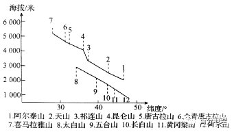   
   
1．图中西部山地（图中1-7山地）多年冻土下界差异较大的主导因素是（  ）   
A．距海远近   
B．海拔   
C．坡度和坡向   
D．纬度   
2．同一纬度地带，西部山地比东部山地冻土下界较高,主要原是（  ）   
A．土壤含水量少   
B．土壤温度高   
C．土壤质地好   
D．土壤厚度大   
3．短时冻土（数小时/数日以至半月）主要分布在长江以南、珠江流域以北。短时冻土形成的可能条件是（  ）   
A．寒潮过境   
B．台风过境   
C．大气逆辐射弱   
D．太阳活动剧烈   
<span style="color: rgb(255, 0, 0);">1．D由图可知，山脉纬度越高，冻土下界海拔越低，因为纬度高的热量条件较差，所以冻土下界低，D正确。距海远近、海拔、坡度和坡向都不是导致多年冻土下界差异大的因素，ABC错误。</span>   
<span style="color: rgb(255, 0, 0);">2．A我国同一纬度位置，从沿海到内陆，降水逐渐减少，土壤含水量减少，导致冻土下界升高，A正确。东西部同一纬度位置土壤温度差异不大，B错误；土壤质地、土壤厚度都不是影响冻土下界的主要因素。CD错误。</span>   
<span style="color: rgb(255, 0, 0);">3．A由已学知识可知，冻土是指零摄氏度以下，并含有冰的各种岩石和土壤。所以影响短时冻土的主要原因是温度降低，所以主要气象条件是强寒潮过境，A正确。台风过境和准静止锋主要带来降水，并非降温，BC错误。太阳黑子暴发主要影响的是A气候，使得降水量发生变化，D错误。故选A。</span>   
<span style="color: rgb(255, 0, 0);">【点睛】冻土一般可分为短时冻土(数小时/数日以至半月)、季节冻土(半月至数月)以及多年冻土(又称永久冻土，指的是持续二年或年以 上的冻结不融的土层 )。冻土的影响因素主要是温度和水分。</span>   
在我国某路段铁路建设中，为防止多年冻土层融化导致路基下陷，采用了通风管路基技术（通风管两端安装了活动挡板）。该地一年中日平均气温的变化范围为-14℃～8℃。负温期（日平均气温小于0℃的时期）约6.5个月。下图为通风管路基景观图，读图完成下列问题。   
   
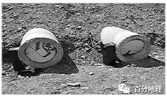   
   
4．导致路基冻土层融化的最主要能量直接来源于是（  ）   
A．太阳辐射   
B．铁轨传热   
C．大气辐射   
D．地球内能   
5．下列关于通风管挡板的叙述正确的是（  ）   
A．冬季多打开，灌进冷空气以降温   
B．夏季多打开，排出热空气以降温   
C．全年都关闭，阻止内外热量传递   
D．全年都打开，促进内外热量传递   
<span style="color: rgb(255, 0, 0);">4．B由题干分析，通风管主要铺在路基铁轨下方，通过空气流通散热，所以导致路基冻土层融化的最主要能量直接来源于铁轨传热，B项正确。A、C、D错误。</span>   
<span style="color: rgb(255, 0, 0);">5．A因为当地负温期6.5个月，主要在冬季，此时冻土层整体冻结，列车运行摩擦铁轨产生的热量易使铁轨下方路基冻土融化，造成局部沉降，影响通行安全，所以要在冬季打开，促进路基降温，所以A项正确。B、C、D错误。</span>   
<span style="color: rgb(255, 0, 0);">【点睛】冻土是指温度下降到0℃或0℃以下，土壤里的水分就会凝结成冰，并将土壤也冻结在一起，形成一层坚硬的冻土层。可分为季节性冻土和多年冻土。</span>   
（2021·全国·高三专题练习）热喀斯特湖是指由自然或人为因素引起季节融化深度加大，导致地下冰或多年冻土层局部发生融化，地表土层随之热融深陷、积水后形成的湖塘。下图示意某地热喀斯特湖湖底、湖岸温度场变化曲线，图中字母a～f为测温孔，温度单位为℃。据此完成下面小题。   
   
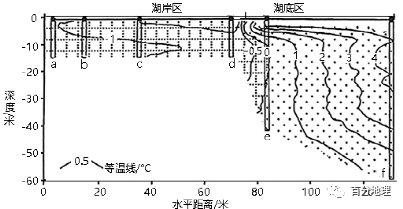   
   
6．关于热喀斯特湖及其热量要素的判断正确的有（  ）   
①温度垂直变化最明显的是测孔f②湖岸区越靠近地面，地温越低③0℃等温线将湖区与湖岸分开④热喀斯特湖可能导致冻土层被融化切穿   
A．③④   
B．①②   
C．①③   
D．②④   
7．道路建设尽量绕开或远离热喀斯特湖，主要是为了（  ）   
A．减少工程量降低建设成本   
B．避免工程建设加剧热融灾害演化   
C．方便乘客远眺热喀斯特湖   
D．连接更多居民点，提高运营效率   
<span style="color: rgb(255, 0, 0);">6．A根据图示信息可知，测孔e穿越等温线条数最多，其温度垂直变化最明显，①错误；湖岸区越靠近地面，地温越高，②错误；湖岸区与湖底区交界处等温线为0°C，0℃等温线将湖区与湖岸分开，③正确；根据图示信息可知，热喀斯特湖湖底温度高于0℃，会导致冻土层融化，④正确。所以选A。</span>   
<span style="color: rgb(255, 0, 0);">7．B尽量绕开或远离热喀斯特湖，会增加线路长度，增加工程量，A错误；道路建设容易破坏冻土层，加剧热融灾害演化，B正确；在生态环境脆弱地区，工程建设需要充分考虑对环境的影响和工程的安全性，而不是考虑乘客的观赏体验，C错误；热喀斯特湖分布区通常人口较少，D错误。所以选B。</span>   
<span style="color: rgb(255, 0, 0);">【点睛】热融指在多年冻土和冰川区，由于气温和地温升高，部分冰块融化，产生类似石灰岩区的岩溶现象。如冰洞、冰塔、热融坍陷、热融洼地等，是由地下冰融化而造成的地面下沉和滑塌。如果洼地集水成湖，称热喀斯特湖，也称热融湖。</span>   
（2022·重庆市长寿中学校高三期中）为研究路基与自然地表下的冻土温度变化状况，我国某科研组于1995年在青藏公路沿线设置了一组观测孔，得到了连续五年的观测资料。下图为基于观测资料进行热量分析得出的冻土热流通量变化图（注明:热流通量为单位时间单位面积流过的热量，简称热流，正值表示吸热，负值表示放热）。据所学知识完成下面小题。   
   
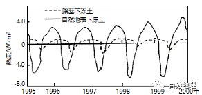   
   
8．受热力作用影响，青藏高原大量吸收周边同海拔大气热量的季节是（  ）   
A．春季   
B．夏季   
C．秋季   
D．冬季   
9．与路基下冻土相比，自然地表下冻土年内（  ）   
A．吸、放热量更接近平衡   
B．吸热时间更长   
C．吸、放热周期变化不明显   
D．吸热起、止时间滞后   
10．根据冻土热流通量变化可确定路基下冻土（  ）   
A．厚度增加   
B．上限下降   
C．稳定性明显增强   
D．退化不明显   
<span style="color: rgb(255, 0, 0);">8．D冬季，青藏高原，因地势高，冰雪面积大，空气稀薄，辐射冷却快，降温迅速，成为一个低温高压中心，而高空大气形成一个相对的低压中心；同海拔周边大气受地面影响小，气温高，气流上升，形成一个相对低压中心，而相应的高空大气形成一个高压中心，在高空气流流向高原面上空，再下沉，给高原面带去热量，因此青藏高原大量吸收周边同海拔大气热量，D正确；夏季，青藏高原上空大气受热快，气温高于周边同海拔大气，B错误；春季和秋季为过度季节，差别不大，AC错。故选D。</span>   
<span style="color: rgb(255, 0, 0);">9．A从图中看，路基下冻土热流通量为正值时间长，而自然地表下冻土热流通量正负值相当，所以自然地表下冻土吸热时间更短，吸、放热周期变化明显，年内吸、放热量更接近平衡，年内吸热起、止时间滞后不明显，A正确，BCD错误。故选A。</span>   
<span style="color: rgb(255, 0, 0);">10．B从图中看，路基下冻土热流通量大多数为正值，所以吸热多，冻土融化，路基下冻土上限下降，B正确，因此冻土厚度变薄，A错误；稳定性明显减弱，C错误；冻土退化明显，D错误。故选B。</span>   
<span style="color: rgb(255, 0, 0);">【点睛】青藏高原的隆起，使我国东部地区形成了一个相对独立的气候单元，使我国的海陆热力性质差异表现得极为明显。由于地势高，夏季，青藏高原上空大气受热快，气流上升，气压降低，这加速了陆上低压的形成，使由海洋吹向陆地的夏季风势力增强甚至影响到青藏高原的东部和南部。冬季，青藏高原上空大气降温快，气流下沉，使陆上高压势力增强，促使气流由陆地吹向海洋。加强了冬季风。因此青藏高原的隆起加强了我国的季风环流。</span>   
（2021·湖南怀化·高三阶段练习）下图所示地区冻土广布，冻土主要有多年冻土和季节性冻土，季节性冻土日数是指土层中的水被冻结的天数。据此完成下面小题。   
   
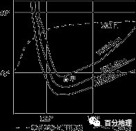   
   
11．假设图中的天气系统以120千米／日的速度向东移动，符合甲地在未来30小时后风向和风速变化为（  ）   
A．偏东风、变快   
B．东北风、变慢   
C．西南风、变快   
D．偏北风、变慢   
12．影响图中季节性冻土等日数线走向的主要因素是（  ）   
A．海陆位置、纬度因素   
B．纬度因素、地形因素   
C．海陆因素、下垫面因素   
D．纬度因素、人类活动   
13．冻土的发育对其所处的自然环境有独特的影响，下列对图示地区叙述正确的是（  ）   
A．河流沿岸森林发育程度低   
B．气候冷干，大陆性气候显著   
C．地表水易下渗，土壤多为冰沼土   
D．地表水汇聚快，河道平直   
<span style="color: rgb(255, 0, 0);">11．A甲位于高压脊附近，45°纬线上经度1°的距离约是77千米，天气系统以每日120千米/日的速度向东移动，30小时内移动约2°，此时高压脊已经过去，甲处位于高压系统西部边缘，等压线密集，所以风速变快。将等值线整体东移动，再画出水平气压梯度力方向，向右偏得出风向为偏东风，A正确，BCD错误。所以选A。</span>   
<span style="color: rgb(255, 0, 0);">12．B根据经纬度判断，图示区域是我国东北地区，季节性冻土等日数线的走向，西部呈东北—西南走向，主要是受大兴安岭的影响，是地形因素；东部呈东西走向，主要是受纬度因素影响，所以B正确，ACD错误。所以选B。</span>   
<span style="color: rgb(255, 0, 0);">13．A冻土区有永久冻土和季节性冻土，季节性冻土融化植物可以生长，但是河流沿岸地下水位高，永冻层埋藏浅，高大的树木难以生长，多以草甸为主，A正确。图示为东北地区，冷湿气候，B错误。永久冻土层的存在，地表水不易下渗，本地区以黑土为主，故C错误。本地处于东北平原西部地区，河流迂回曲折，D错误。所以选A。</span>   
<span style="color: rgb(255, 0, 0);">【点睛】如果土层每年散热比吸热多，冻结深度大于融化深度，多年冻土逐渐变厚，称为发展的多年冻土，处于相对稳定状态；如果土层每年吸热比散热多，地温逐年升高，多年冻土层逐渐融化变薄以至消失，处于不稳定状态，称为退化的多年冻土。</span>   
（2022·江西·瑞金市第三中学高三阶段练习）青藏高原被誉为“中华水塔”，广泛分布的多年冻土和季节冻土在保障我国水资源安金上具有重要的地位。冻土作为不透水层或者弱透水层，能够从性质上改变土壤水热运移规律。下图为据2015年10月至2016年6月青海海北站季节冻土的水热监测数据绘制的土壤冻结深度变化图，据此完成下面小题。   
   
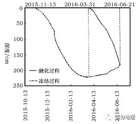   
   
14．该时段土壤冻融过程（  ）   
A．冻结速度快于融化速度   
B．冻结方向为自下而上发展   
C．3月份冻结深度较稳定   
D．表层融化速度比深层慢   
15．在冻结初期（11月13日至11月23日），冻结深度变化较小的原因可能是（  ）   
A．太阳辐射弱   
B．昼夜温差大   
C．土壤水分少   
D．冻结放热多   
16．在整个冻融过程中土壤含水量（未冻水含量）变化较大，下列说法可信的是（  ）   
A．在非冻结时期，深层含水量变化大   
B．在冻结过程中，各层含水量均增加   
C．在消融过程中，表层土蓄水量增加   
D．在整个过程中，水分运动方向相同   
<span style="color: rgb(255, 0, 0);">14．C读图可知，该时段土壤冻融过程，冻结时间为2015年11月13日至2016年3月31日，融化过程为3月31日至6月21日，冻结时间较融化时间长，A错误;方向应为自上而下发生冻结，B错误;3月冻结深度变化较小，曲线较为平稳，C正确;融化时表层吸收热量较多，融化速度更快，D错误。故选C。</span>   
<span style="color: rgb(255, 0, 0);">15．B由题意可知，11月13日至23日冻结深度变化较小，说明冻结难以向下进行，结合气候特点可知，该时段昼夜温差大，夜冻昼消，所以冻结深度难以加深，B正确；青藏高原太阳辐射强，A错误；土壤水分少不应该只体现在这10天，C错误；冻结吸热，D错误。故选B。</span>   
<span style="color: rgb(255, 0, 0);">16．C在非冻结时期，土壤含水量主要受降水和蒸发影响，表层变化更大，A错误；在冻结过程中，冻结会减少土壤水分， B错误；在消融过程中，由于冻土层的不透水作用，表层冻土融水和降水难以下渗，蓄水量增加，C正确；在整个过程中，水分运动会受到重力、蒸发等多种因素影响，运动方向会发生变化，D错误。故选C。</span>   
<span style="color: rgb(255, 0, 0);">【点睛】十壤冻结的深度，与当地的气候条件、地势、十壤结构、土壤湿度、地表积雪厚度、植被覆盖厚度等有夭。如寒冷的地区比温暖地区冻结深，高山比低地冻结深，疏松土壤比紧密十壤冻结深，沙土比粘土冻结深，湿度、的土壤比湿度大的土壤冻结深，在地表有积雪和有植被覆盖的地方比没有积雪和植彼覆盖的地方冻结浅，甚至不冻结。在高纬度地区，土壤有全年冻结现象，夏季仅在上部土层解冻，这种终年冻结的土壤，叫做永冻二(永久冻结层)。我国东北大小兴安岭的北部就有永冻土发生。</span>   
（2022·安徽·高三开学考试）冻土是指0℃以下，含有冰的各种岩石和土壤，多年冻土是指持续多年冻结的土石层，季节冻土是指冬季冻结、夏季全部融化的土石层。兴安岭地区是中国高纬度多年冻土的主要分布区。随着全球气候变暖，兴安岭地区的冻土有不同程度的退化，下图示意兴安岭地区冻土分布。据此完成下面小题。   
   
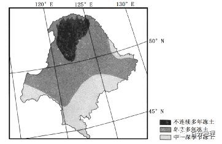   
   
17．与岛状多年冻土区相比，兴安岭地区不连续多年冻土区（  ）   
A．季节冻土面积比例更大   
B．季节冻土面积比例更小   
C．多年冻土面积比例更大   
D．多年冻土面积比例更小   
18．兴安岭地区西部多年冻土南缘向南弯曲的主导因素是（  ）   
A．纬度   
B．经度   
C．地形   
D．水文   
19．随着全球气候变暖，兴安岭地区季节性冻土（  ）   
A．向北退缩   
B．向南退缩   
C．向低海拔移动   
D．转为多年冻土   
<span style="color: rgb(255, 0, 0);">17．C根据图例，与岛状多年冻土区相比，不连续多年冻土区分布主体纬度更高，冻土发育条件更好，因此多年冻土面积比例更大，C正确；D错误；二者均为多年冻土区，故不存在季节冻土，AB错误；故选C。</span>   
<span style="color: rgb(255, 0, 0);">18．C冻土形成于0℃以下的环境，兴安岭地区地处北半球，越向南纬度越低、冻土发育条件越差，兴安岭地区西部多年冻土南缘向南弯曲体现了与同纬度相比该地冻土发育更好，主要是山地海拔高，温度低，C正确；东西部的纬度差异不大，A排除；经度对温度一些不大，因此不是影响冻土分布的主要因素，B错误；水文条件对冻土的发育影响不大，D错误；故选C。</span>   
<span style="color: rgb(255, 0, 0);">19．A近年来，随着全球气候变暖，兴安岭地区的多年冻土和季节性冻土均有退化，均向温度更低的高纬度和高海拔地区退缩，兴安岭地区地处北半球，因此季节性冻土向北退缩，A正确；B错误；C错误；而原来的多年冻土转为季节性冻土，D错误；故选A。</span>   
<span style="color: rgb(255, 0, 0);">【点睛】冻土形成的影响因素： （1）气候条件：主要指地表辐射、气温、降水、积雪以及云量和日照等。 （2）地理地质：地质构造通过所控制的自然条件，诸如地形变化、植被、雪盖、太阳辐射变化、岩相以及大地热流等对冻土产生作用，。季节冻土主要存在于南北半球中高纬度地区，其厚度在北半球从北向南（南半球从南向北）逐渐减薄。</span>   
（2021·浙江金华·二模）青藏高原气候高寒，是我国主要的冻土分布区，青藏铁路格尔木到拉萨段是全球目前穿越冻土地区的最长铁路。冻土土层可分为活动层和多年冻土层两部分。活动层反复冻融及冬季不完全冻结，使冻土的体积发生膨胀和收缩，会危及铁路路基。读青藏铁路某观测站1月、7月地温变化图，完成下面小题。   
   
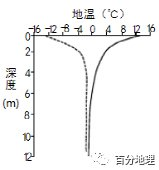   
   
20．该观测站冻土活动层与多年冻土层的分界深度约为（  ）   
A．4米   
B．6米   
C．10米   
D．12米   
21．下列工程设计不能减轻冻土对铁路影响的是（  ）   
A．   
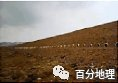   
   
使用通风管路基   
B．   
   
   
冻土地带架设桥梁   
C．   
   
   
竖立热导装置“热棒”   
D．   
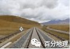   
   
全程单轨铁路   
<span style="color: rgb(255, 0, 0);">20．B由图一可知，地温0°C的深度约为6米， 夏季6米以上的活动层融化，冬季冻结，形成活动层冻土，6米之下的冻土层长年气温低于0°C，形成多年冻土层。B正确，ACD错误，故选B。</span>   
<span style="color: rgb(255, 0, 0);">21．D通风管路基是一种积极保护冻土的工程措施，通风管路基主要由路基土体和通风管构成。其工作原理是：在寒冷季节，有较大的密度冷空气在自重和风的作用下将通风管中的热空气挤出，并不断将周围路基土体中的热量带走，达到保护地基土冻结状态的目的。青藏铁路的冻土区使用了“热棒”技术，铁路两旁各插有一排碗口粗细、高约2米的铁棒，我们叫它热棒。热棒在路基下还埋有5米深，整个棒体是中空的，里面灌有液氨。热棒的工作原理很简单：当路基温度上升时，液态氨受热汽化，上升到热棒的上端，通过散热片将热量传导给空气，气态氨由此冷却液化变成了液态氨，又沉入了棒底。这样，热棒就相当于一个天然“制冷机”。这样，夏季不致使冻土内部的温度上升到融化临界点之上，形成稳定坚固的“永冻层”，可有效防止冻土的消融冻结对铁路、等路基所带来的融陷危害。以桥代路，可以减少冻土的冻融对路基的影响，青藏铁路冻土区主要是以这种形式修建，以上三种都可以减轻冻土对路基的影响。ABC错误，全程单轨铁路，直接在地面铺设铁轨，冻土对其影响大，容易使铁轨发生变形，造成事故。D正确，故选D。</span>   
<span style="color: rgb(255, 0, 0);">【点睛】本题考查冻土分布及其对铁路的影响。青藏铁路破解多年冻土难题，可以总结为两个因地制宜：一是在相对稳定的冻土地段，因地制宜采用片石通风路基、片石护道、热棒技术、铺设保温板等方法，保障路基通风，加快热量散发，从而达到保持低温和稳定冻土的目的；二是在极不稳定的冻土地段，因地制宜采用“以桥代路”的方法，把桥梁的四根桩基深入地下20米以上（即穿透多年冻土层），依靠桥墩与冻土之间的摩擦力来支撑桥梁路基的稳固性，把冻土的消融和冻胀对路基的影响减小到几乎为零。</span>   
（2021·贵州·模拟预测）冻土指的是零摄氏度以下，并含有冰的各种岩石和土壤。它就像一个大冰箱，冻住的不止是土，还有大量有机物、微生物以及动植物遗骸，一般分为短时冻土、季节冻土和多年冻土。下图示意“我国某区季节性冻土层温度随时间变化状况”。据此完成下面小题。   
   
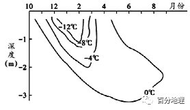   
   
22．对于该地冻土叙述正确的是（  ）   
A．2月份冻土厚度达到最厚   
B．6月份冻土厚度约为3.2m   
C．2——6月，冻土层厚度增加   
D．4月中旬部分冻土开始融化   
23．近年来，关于该地冻土的变化及影响叙述不正确的是（  ）   
A．释放温室气体，加剧气候变暖   
B．季节性冻土的下界深度变浅   
C．路基变形，影响交通设施   
D．地基不稳，导致房屋倾斜开裂   
<span style="color: rgb(255, 0, 0);">22．D季节性冻土是指冬季冻结春季融化的土壤或疏松岩石层。自地表面至冻结层底面的厚度称冻结深度。0℃为冻层边界，也就是0℃等温线是土壤冰冻线，该线以下温度是大于0℃的，该线以上出现低于0℃地温的地层即冻土。因此在10月至次年8月左右，均有冻土存在，在4月中旬，表层冻土温度开始&gt;0℃，即部分季节性冻土开始融化，此时冻土层厚度最大，D正确，AC错误；6月份冻土厚度约为1.5m，B错误；故选D。</span>   
<span style="color: rgb(255, 0, 0);">23．B注意题干不正确的是。近年来，随着全球气候变暖，冻土融化，封存的有机碳被分解为二氧化碳或甲烷，释放到大气中，加剧气候变暖，A错误；随着气候变暖，季节性冻土的下界深度变深，B正确；冻土融化后，导致路基变形，影响交通设施，地基不稳，导致房屋倾斜开裂，CD错误；故选B。</span>   
<span style="color: rgb(255, 0, 0);">【点睛】冻土融化的影响：冻土如果融化，可能释放出大量甲烷，进一步加剧温室效应；永久冻土的融化还会引起当地生态系统的潜在变化，改变地表和地下的水流水，并影响适合在该区域生活的植物和动物；土质软化，如果含水量高，会导致大面积沼泽化。像青藏高原地势起伏大的话会导致塌方、水土流失；冻土融化会影响基础设施建设，如路基不稳，房屋地基不稳等。</span>   
（2022·辽宁铁岭·二模）多年冻土分为上下两层，上层为夏季融化、冬季冻结的活动层，下层为多年冻结层。我国的多年冻土主要分布于东北高纬地区和青藏高原高海拔地区。东北高纬地区多年冻土南界的年平均气温在-1～1℃，青藏高原多年冻土下界的年平均气温约-3.5～-2℃。对多年冻土区路基的防护成为青藏铁路建设施工的重点。通风管设施是利用空气在管道内的对流从而实现冻土区路基防护的常用措施。下图示意青藏铁路通风管路基横断面效果图。据此完成下面小题。   
   
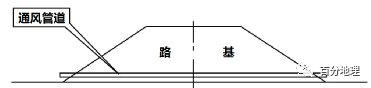   
   
24．下列有关青藏高原形成多年冻土的年平均气温比东北高纬地区低的原因说法不正确的是（  ）   
A．青藏高原纬度低，海拔高，太阳辐射强   
B．东北高纬地区形成的冻土深度深，夏季很难全部融化   
C．青藏高原海拔高，夏季气温低，冻土不易融化，冻土下界温度更低   
D．东北高纬地区，冬季气温很低，且持续时间长，形成的冻土面积大   
25．通风管道路基散热效果最显著的季节是（  ）   
A．春季   
B．夏季   
C．秋季   
D．冬季   
<span style="color: rgb(255, 0, 0);">24．C青藏高原纬度低，海拔高，空气稀薄，太阳辐射强，冻土容易获得热量而融化，A不符合题意；东北高纬地区年均气温低于-1～1℃，因年温差大，冬季气温很低，且持续时间长，形成的冻土面积大，深度深，夏季很难全部融化，可以形成多年冻土，BD不符合题意。青藏高原受地势影响，气温年较差小，当年平均气温同为-1℃～1℃时，冬季气温偏高，冻土形成的厚度薄，夏季全部融化，不能形成多年冻土，因此青藏高原形成多年冻土的年平均气温比东北高纬地区低。C描述错误，符合题意。故选C。</span>   
<span style="color: rgb(255, 0, 0);">25．D通风管道一侧冷空气进入，另一侧暖空气出来带走路基内部的热量，所以外部的空气温度越低，降温作用越好，故冬季散热效果最好，D符合题意。ABC不符合题意。故选D。</span>   
<span style="color: rgb(255, 0, 0);">【点睛】我国气温分布特点为：冬季气温普遍偏低，南热北冷，南北温差大。夏季全国大部分地区普遍高温（除青藏高原外），南北温差不大。</span>   
（2022·重庆市璧山来凤中学校高三阶段练习）天然气管道的输气温度可以调节，输气温度越低，气体流经管道内壁的摩擦阻力越小，输气效率越高。但在不连续多年冻土区的融化地段，当低于冰点（0℃）的管线穿过非冻土区时，尤其是在有水的地方，很容易产生冻胀举升，故冬季采用冷输气温度（-5℃）；夏季输气温度趋向于大气温度。下图示意西伯利亚地区不连续多年冻土区冷输气管道引起土体冻胀。据此完成下面小题。   
   
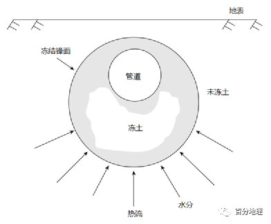   
   
26．冬季管道采用冷输气温度的主要目的是（  ）   
A．吸收未冻层的水热，维持冻结锋面的稳定   
B．减小管壁内摩擦力，防止冻土层升温解冻   
C．缩小天然气体积，防止天然气管道爆裂   
D．降低冻土层温度，提高冻土层的紧实度   
27．相比非连续多年冻土区，连续多年冻土区输气管道（  ）   
A．管基土冻胀更频繁   
B．水分迁移更显著   
C．局部弯曲变形更大   
D．冻结锋面更稳定   
<span style="color: rgb(255, 0, 0);">26．B由材料可知，冬季管道采用冷输气温度，可以减小天然气与管壁内的摩擦，防止管道升温将热量传递到冻土层，引发冻土解冻，导致管基不稳，使管道发生弯曲变形。故B选项正确。不能吸收未冻层水热，也不能防止天然气管道爆裂，不能提高冻土层紧实度，故ACD错，本题选B。</span>   
<span style="color: rgb(255, 0, 0);">27．D相比非连续冻土区，连续冻土区冻土层的水分和热量更稳定，冻结锋面也稳定，D正确；水分迁移较非连续冻土区弱，B错误；管基土冻胀频率低，天然气管道弯曲变形小，AC错误。本题选D。</span>   
<span style="color: rgb(255, 0, 0);">【点睛】交通线的区位因素包括：完善路网、经济发展需要、人口与城市分布需要、自然条件、科学技术等5个方面。其中社会经济条件是主导因素，自然条件是限制因素(主要是地形、地势、地质、河流、气候等条件限制)。1、社会经济因素主要从以下几个方面来评价：促进沿线地区经济的发展，如将资源优势转化为经济优势，促进区域优势产业的形成和壮大，以及相关产业的形成，拉动内需，吸纳劳动力就业，加强加快起止点及沿线的人员、物资、文化、信息交流、传递和贸易的发展；完善交通网，激活各条交通线，加快各地之间联系；经过城市和人口密集地区，服务于社会经济发展；科技条件克服不利的自然条件。2、自然因素尽可能利用有利的自然条件，避开不利的自然条件，从而使选出的线路方案既能满足运输能力的要求，又能减少工程量，并便于维修护养。其评价性语言应当从自然环境要素的地形、地势、气候、水文(跨河)等有利因素和限制性因素进行分析、评价。</span>   
二、综合题   
28．（2021·全国·高三专题练习）阅读图文资料，完成下列要求。   
天然气水合物（俗称“可燃冰”）常见于深海沉积物或陆上永久冻土中，是由天然气和水在高压低温条件下形成的类似冰状的结晶物质。冻土指温度低于0℃并含有冰的土壤和岩石。天然气水合物具有资源与环境并重的双重意义，不仅作为一种新型能源具有潜在的资源价值，而且还是一种会引起环境效应的不稳定因素。天然气水合物在温度升高或压力降低时会分解释放甲烷气体。甲烷捕获热量的能力是二氧化碳的23倍。下图示意气候变暖引起冻土区天然气水合物系统的演变。   
   
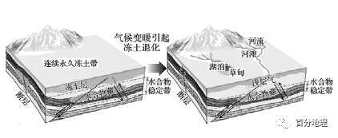   
   
(1)分析冻土层在天然气水合物形成过程中的作用。   
(2)天然气水合物是一次能源还是二次能源?说明其开采对我国能源安全的意义。   
(3)说明全球气候变暖背景下冻土区天然气水合物储量的变化及其对环境产生的影响。   
<span style="color: rgb(255, 0, 0);">【答案】(1)冻土层厚度大，提供巨大压力；冻土层温度低，提供低温环境；冻土层不透气，可封盖住天然气的上升通道。</span>   
<span style="color: rgb(255, 0, 0);">(2)天然气水合物是一次能源。意义：拓展能源种类，改善能源消费结构；丰富能源储备，减少对国外能源的依赖。</span>   
<span style="color: rgb(255, 0, 0);">(3)储量变化：全球气候变暖造成冻土融化，天然气水合物分解，造成储量减少。</span>   
<span style="color: rgb(255, 0, 0);">影响：天然气水合物分解释放出甲烷，加剧全球气候变暖（形成恶性循环）。</span>   
<span style="color: rgb(255, 0, 0);">【分析】本题考查天然气水合物的形成条件及其对环境的影响，考查地理逻辑思维能力。</span>   
<span style="color: rgb(255, 0, 0);">(1)由材料可知，天然气水合物是由天然气和水在高压低温条件下形成的类似冰状的结晶物质。因此，冻土可为天然气水合物提供足够低的低温环境，易于保存；另外，冻土层厚度大，压力大，为冻土提供高压的环境；同时，由于冻土厚度大，不透气，阻止天然气水合物外漏。</span>   
<span style="color: rgb(255, 0, 0);">(2)天然气水合物主要成份是甲烷和水，甲烷燃烧后变成水，因此是一次能源。开采对我国的能源安全意义有：填补我国常规的能源不足；拓宽能源应用的领域；心头改善我国的能源消费结构；同时，可增加我国的能源储备，减少对国外能源的依赖程度；由于污染少，可改善大气环境等。</span>   
<span style="color: rgb(255, 0, 0);">(3)全球气候变暖，造成冻土融化，甲烷释放，天然气水合物储量会减少。由于大量的甲烷释放，吸收热量增加，加剧全球气候变暖，全球气候变暖，又加剧甲烷的气体释放，变暖进一步加剧，形成恶性循环。</span>   
29．（2023·全国·高三专题练习）阅读图文材料，完成下列问题。   
在我国大兴安岭北部多年永久冻土层（埋藏深度在地面以下0.3～0.7m）上生长有大片泰加林（即亚寒带针叶林），它是俄罗斯东西伯利亚泰加林向南的延伸。泰加林的分布南界一般在55°N,而在我国大兴安岭西坡南延到了48°N。当地树木形态特征显著，叶子为针状，树冠呈塔形，侧根发达。调查发现，在大兴安岭主脉西坡一些向西延伸的山脊，北坡泰加林覆盖率比南坡高。泰加林中可见大量倒木，当地人把成片的倒木叫“倒木圈”。在地势较平坦的区域，倒木圈被清理后往往会积水演变成小池塘。下图为大兴安岭北部泰加林分布示意图（下左图）和泰加林根系发育示意图（下右图）。   
   
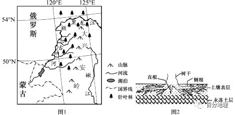   
   
结合当地自然条件，分析当地树木显著形态特征的成因。   
<span style="color: rgb(255, 0, 0);">【答案】为适应低温，保持体内水分，叶片缩小成针状。为利于积雪下滑，减少树冠积雪过多，压断树木，树冠呈塔状。当地气候寒冷，土层薄、有冻土，根系无法深扎，多横向生长；林中表层土壤的养分和水分更多，有利于侧根的生长；泰加林树木高大，需要发达的侧根支撑，因此侧根发达。</span>   
<span style="color: rgb(255, 0, 0);">【分析】本大题以我国大兴安岭北部生长有大片泰加林为材料设置试题，涉及影响植被的因素相关内容，考查学生获取和解读地理信息能力;调动和运用知识、基本技能能力;描述和阐释地理事物、地理基本原理和规律能力。考查学生的综合思维、区域认知素养。</span>   
<span style="color: rgb(255, 0, 0);">【详解】读材料"泰加林分布在我国大兴安岭北部多年永久冻土层"可知，由于泰加林分布在冻土层上，泰加林的直根很难向下穿越，且林中的表层土壤养分和水分比深层处更丰富，有利于侧根的生长，而泰加林树木高大，需要发达的侧根支撑整棵树木，因此泰加林多横向生长，侧根发达;为了适应低温，保持体内水分，叶片缩小成针状，利于减少水分的蒸发;我国大兴安岭北部冬季降雪多，为了利于积雪下滑，减少树冠积雪过多，压断树木，树冠呈塔状。</span>   
30．（2021·山东威海·高三期中）阅读图文材料，完成下列问题。   
热融湖是多年冻土区地下冰融化引起地表塌陷形成的凹坑集水而成。冻土是指0℃以下含有冰的各种岩石和土壤。活动冻土层是指多年冻土区夏季融化而冬季冻结的地表层。多年冻结层是指常年处在冻结状态的冻土层，该层中常含有冰楔（水渗入冻土裂隙中冻结成的脉状冰）。近年来，青藏高原的热融湖发展迅速。图1示意冰楔对热融湖形成的作用，图2示意热融湖的扩张及其对碳元素迁移的影响。   
   
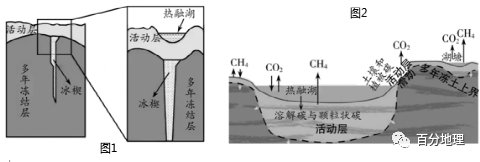   
   
(1)指出多年冻土层中冰楔形成的主要季节，并说明冰楔的形成过程。   
(2)分析近年来青藏高原热融湖数量增多的原因。   
(3)说明热融湖不断增多和扩张对地球大气圈的影响。   
<span style="color: rgb(255, 0, 0);">【答案】(1)夏季：夏季温度高，冻土区活动层融化，水分（融水、降水和地表水）顺着多年冻结层的裂隙下渗，遇冷凝结形成冰楔。</span>   
<span style="color: rgb(255, 0, 0);">(2)近年来伴随全球气候变暖，地温上升，多年冻结层中更多冰楔（地下冰）融化，冻土体积变小，地表塌陷形成的凹坑增多，集水形成的热融湖增多。</span>   
<span style="color: rgb(255, 0, 0);">(3)加剧冻土融化，释放到大气中的甲烷、二氧化碳等温室气体增多，加剧全球变暖。</span>   
<span style="color: rgb(255, 0, 0);">【分析】本题以热融湖的形成和影响为材料，涉及全球将气候的原因及影响、地理环境的整体性等知识。重点考查学生获取和解读信息、调动和运用知识的能力，体现了综合思维及地理实践能力的学科素养。</span>   
<span style="color: rgb(255, 0, 0);">（1）由材料可知，冰楔是水渗入冻土裂隙中冻结成的脉状冰；读图可知，形成冰楔的水来自多年冻土层上部的活动冻土层。结合材料“活动冻土层是指多年冻土区夏季融化而冬季冻结的地表层”可知，活动冻土层融化的季节应是夏季。“冰楔是水渗入冻土裂隙中冻结成的脉状冰”，因此多年冻土层中形成冰楔首先是活动冻土层融化，然后是融水沿裂隙下渗冻结。夏季地温高，活动层融化，融水和降水顺着裂隙下渗，到永动层上部再次冻结，使得裂隙中的冰体积逐渐变大，根据裂隙形态，水会冻结成上大下小的锥形冰体，形成冰楔。</span>   
<span style="color: rgb(255, 0, 0);">（2）“热融湖是多年冻土区地下冰融化引起地表塌陷形成的凹坑集水而成”，因此形成热融湖应从热、融、湖三个方面考虑。近年全球气候转暖，引起冻土受热增加，地下冰或多年冻土层发生局部融化，冻土体积变小，地表土层随之沉陷而形成热融沉陷，这些凹陷积水后便形成了湖塘。</span>   
<span style="color: rgb(255, 0, 0);">（3）由图2可知，热融湖演化过程中，积累在冻土层中的有机物分解释放出甲烷、二氧化碳等温室气体。温室气体会从土层进入大气层，这会导致大气对地表辐射的吸收能力增强，保温作用强，形成温室效应，加剧全球变暖。</span>   
31．（2021·全国·高三专题练习）阅读图文资料，完成下列要求。   
冻土活动层，是指覆盖于多年冻土冻结层之上的夏季融化、冬季冻结的土层，研究表明，泛北极地区积雪对冻土活动层厚度的影响具有双面性，即积雪一方面会增加其厚度，另一方面也会降低其厚度。近年来，受全球气候变暖影响，泛北极地区多年冻土退化，其封存的有机碳被释放出来，旱生植物增加。下图示意2017年泛北极地区冻土活动层的厚度空间分布，其纬度地带性差异明显。   
   
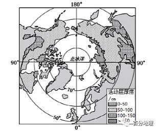   
   
(1)描述2017年泛北极地区冻土活动层厚度的空间分布特征。   
(2)泛北极地区积雪对冻土活动层厚度的影响具有双面性，对其原因进行合理解释。   
(3)从土壤和气候角度，说明冻土退化导致北极地区旱生植物增加的原因   
<span style="color: rgb(255, 0, 0);">【答案】(1)总体上，冻土活动层厚度随纬度升高而变薄；高值区出现在50°N附近，低值区分布在70°N以北地区；活动层厚度50-100cm的面积分布最广。</span>   
<span style="color: rgb(255, 0, 0);">(2)积雪能阻隔寒冷的大气，起到保温作用，使土壤温度得以保持，从而促进夏季多年冻土融化，使活动层厚度增加；积雪深度的增加能够提高土壤含水量，回加大夏季蒸发，使土壤温度降低，不利于夏季多年冻土融化，导致多年冻土活动厚度降低。</span>   
<span style="color: rgb(255, 0, 0);">(3)冻土退化导致有机碳被释放，土壤养分含量增加，利于植物生长；气温升高，热量条件改善，植物生长期延长；蒸发变强，土壤水分减少，趋于干旱，利于旱生植物生长。</span>   
<span style="color: rgb(255, 0, 0);">【分析】本题考查全球变暖对自然地理环境的影响。考查学生获取和解读地理信息，调动和运用地理知识的能力，同时考查学生的区域认知、综合思维、地理实践力和人地协调观的核心素养。</span>   
<span style="color: rgb(255, 0, 0);">（1）读图例可知，冻土活动层大于150cm的地区分布在北纬50度附近，向极地冻土活动层厚度依次变为100—150cm，50—100cm和0—50cm。总体上，冻土活动层厚度随纬度升高而变薄；高值区出现在50°N附近，低值区分布在70°N以北地区；活动层厚度50-100cm的面积分布最广。北纬50度以北地区，在大陆东岸冻土活动层较薄，大多是50—150cm范围；大陆西岸冻土活动层较厚，大多是大于150cm厚度。</span>   
<span style="color: rgb(255, 0, 0);">（2）根据材料“冻土活动层，是指覆盖于多年冻土冻结层之上的夏季融化、冬季冻结的土层，研究表明，泛北极地区积雪对冻土活动层厚度的影响具有双面性，即积雪一方面会增加其厚度，另一方面也会降低其厚度”可知，积雪能阻隔寒冷的大气，起到保温作用，使土壤温度得以保持，冬季冻结层较薄，从而促进夏季多年冻土融化，使活动层厚度增加；同时由于积雪深度的增加，大量融化的积雪水渗入地下，能够提高土壤含水量，夏季气温高时，会加大蒸发，使土壤温度降低，不利于夏季多年冻土融化，导致多年冻土活动厚度降低。</span>   
<span style="color: rgb(255, 0, 0);">（3）根据材料“近年来，受全球气候变暖影响，泛北极地区多年冻土退化，其封存的有机碳被释放出来”可知，冻土退化导致有机碳被释放，土壤养分含量增加，利于植物生长；气候变暖，气温升高，热量条件得到改善，能使植物生长期延长；气温升高，蒸发变强，土壤水分减少，趋于干旱，土壤温度升高，从而使土壤性状得到改善，也有利于旱生植物生长。</span>   
32．（2022·山东·高密三中高三期末）阅读图文材料，完成下列要求。   
中俄原油管道起自俄罗斯斯科沃罗季诺输油站，从我国漠河兴安镇入境，自北向南沿大兴安岭东坡延伸，穿越嫩江平原，止于大庆林源输油站，在我国境内管线简称“漠大线”。“漠大线”沿线地区森林茂密，沼泽、冻土广布。管道的建设多采用埋地方式铺设，对沿线生态环境产生一定影响；同时由于输油强度高，管道运营后也面临着冻土融化等问题。图1示意中俄原油管道及沿线地区冻土分布，图2为管沟融沉形成的积水景观，图3示意块碎石管堤的结构。   
   
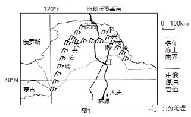   
   
   
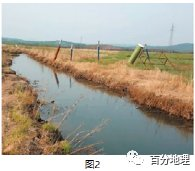   
   
   
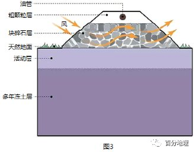   
   
(1)简述“漠大线”管道铺设过程中对沿线地区土壤可能产生的不利影响。   
(2)管沟融沉形成积水是管道运营过程中面临的重要风险。除冻土因素，推测管沟融沉形成积水的气候和水文条件。   
(3)块碎石管堤是解决冻土融化产生危害的有效措施，说出块碎石管堤的优点。   
<span style="color: rgb(255, 0, 0);">【答案】(1)开挖施工，使冻土暴露，加速冻土退化；破坏地表植被，引发水土流失等土壤侵蚀；工程施工过程中生产生活废弃物的排放，造成土壤污染。</span>   
<span style="color: rgb(255, 0, 0);">(2)冬季严寒且降雪量大，季节性积雪融水量较大；夏季降雨量较大；沿线地下水位浅；丰富的地表水和地下水汇入融沉沟，形成积水。</span>   
<span style="color: rgb(255, 0, 0);">(3)避免管沟开挖对冻土的扰动；块碎石层可以散发油管热量，降低管堤下部土体温度，减少冻土融化。</span>   
<span style="color: rgb(255, 0, 0);">【分析】本题考查资源跨区域调配和交通线建设对地理环境的影响。考查学生获取和解读地理信息，调动和运用地理知识的能力，同时考查学生的区域认知、综合思维、地理实践力和人地协调观的核心素养 。</span>   
<span style="color: rgb(255, 0, 0);">（1）由材料““漠大线”沿线地区森林茂密，沼泽、冻土广布”可知，开挖施工，使冻土暴露，加速冻土退化；沿线地区森林茂密，施工过程中会破坏地表植被，引发水土流失等土壤侵蚀，使土壤变薄，肥力下降；工程施工过程中生产生活废弃物的排放，乱占土地，有害物质随着地表径流等流到周边农田，会造成土壤污染。</span>   
<span style="color: rgb(255, 0, 0);">（2）读图可知，该线纬度高，且处于山地地区，海拔高，冬季严寒且降雪量大，春季季节性积雪融水量较大；位于我国季风气候区，夏季降雨量较大；沿线森林茂密，沼泽广布，且大部分路段位于平原，地下水位浅；丰富的地表水和地下水汇入融沉沟，形成积水。</span>   
<span style="color: rgb(255, 0, 0);">（3）读图可知，块碎石管堤是在地面上堆出块碎石层然后埋管，这样的施工避免管沟开挖对冻土的扰动；根据材料“同时由于输油强度高，管道运营后也面临着冻土融化等问题。”可知，管道运营时，高强度输油产生热量会引起土壤的冻融，因此块碎石层孔隙度高，可以散发油管热量，降低管堤下部土体温度，减少冻土融化。</span>   
33．（2022·河南河南·模拟预测）阅读图文材料，完成下列要求。   
冻土是指温度在0℃以下，并含有冰的各种岩石和土壤。高纬度多年冻土通常是气候、积雪、地形、土壤性质等多种因素的产物，多年冻土对气候变化非常敏感。研究发现，多年冻土区山间洼地冻土厚度较高地大。下图示意我国某区域50年间年平均气温等值线变化（单位：℃）。   
   
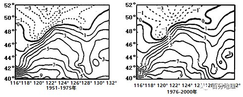   
   
(1)指出图示地区50年间多年冻土分布区域的变化趋势及成因。   
(2)列举图示地区多年冻土区的气候类型及植被类型。   
(3)分析多年冻土区山间洼地冻土厚度较大的主要原因。   
(4)说明图示地区多年冻土退化对森林资源的影响。   
<span style="color: rgb(255, 0, 0);">【答案】(1)变化趋势：整体向北、向西萎缩。成因：全球气候变暖；人类活动加剧等。</span>   
<span style="color: rgb(255, 0, 0);">(2)气候类型：温带季风气候、温带大陆性气候。植被类型：针叶林、针阔叶混交林、草原、荒漠。</span>   
<span style="color: rgb(255, 0, 0);">(3)地表及地下含水量丰富；土层深厚疏松；山间低洼地冬季冷气流难以扩散，温度较低等。</span>   
<span style="color: rgb(255, 0, 0);">(4)喜温凉树种的分布上限抬升；针叶林向针阔叶混交林更替等。</span>   
<span style="color: rgb(255, 0, 0);">【分析】本题以冻土为材料，涉及冻土分布和变化趋势、气候类型、植被类型以及自然地理环境整体性的相关知识，考查学生图片材料信息提取能力、地理知识调用能力，体现了区域认知、综合思维以及地理实践力的地理学科核心素养。</span>   
<span style="color: rgb(255, 0, 0);">（1）对比分析两幅图中0°C等温线的位置， 可见0°C等温线在50年间，整体向北向西移动，表明多年冻土面积萎缩，冻土区气温升高，冻土厚度变薄。原因：近几十年来全球气候变暖，再加上人类毁林开荒、破坏植被，导致全球生态环境恶化，冻土面积萎缩。</span>   
<span style="color: rgb(255, 0, 0);">（2）据图示信息可知，0°C等温线南面边界线介于北纬46°到北纬52°之间，该地区经度位置介于东经116°到东经132°之间。据此推测该地区多年冻土层纬度位置较高，气候类型从东到西为温带季风气候、温带大陆性气候；随着水分减少，对应的植被类型从东向西依次为针阔混交林、针叶林、草原、荒漠。</span>   
<span style="color: rgb(255, 0, 0);">（3）山间洼地，由于常年流水的沉积作用，土层深厚疏松，地表及地下水含量丰富；山间洼地地势较低，冬季冷空气难以向四周扩散，因此多年冻土层比高地深厚。</span>   
<span style="color: rgb(255, 0, 0);">（4）对森林的影响：冻土环境的改变，迫使原始兴安落叶松、樟子松等主要树种林线抬升，落叶针阔混交林林线上升，针叶林将逐渐向落叶针阔混交林演替。</span>   
34．（2022·广东·顺德市李兆基中学高三阶段练习）阅读图文资料，完成下列要求。   
冻土是指温度低于0℃并含有冰的土壤和岩石，地下水为冻土发育提供了水分条件。冻土可分为多年冻土和季节性冻土。多年冻土分为上下两层，上层为暖季融化、寒季冻结的活动层，下层为多年冻结层（又称永冻层）；季节性冻土则只有活动层，在暖季全部消融。第四纪以来，祁连山大幅隆起，冻土发育。下图为祁连山木里河某段河谷，地表年均温约－0.5°C——－1.76℃。除河床及近岸区为季节性冻土外，其他区域为多年冻土。河谷平原多松散堆积物且厚度较大，其多年冻结层之下有常年存在液态地下水。   
   
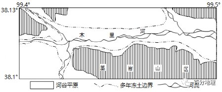   
   
(1)受地表覆被与水分影响，该地河谷平原多年冻土的活动层厚度较基岩山区薄，试作出合理解释。   
(2)判断河谷平原多年冻结层之下液态地下水的直接补给源（雨水、河水或冰雪融水），并说明判断依据。   
(3)观测显示，近年来该地地表年均温逐年递增，推断该现象对当地多年冻土的影响。   
<span style="color: rgb(255, 0, 0);">【答案】(1)河谷平原区相较于基岩山区，覆被与水分条件较好；夏季，覆被使地表吸收太阳辐射减少，水分比热容大，地表升温慢，地温低，融化厚度小。</span>   
<span style="color: rgb(255, 0, 0);">(2)补给源：河水</span>   
<span style="color: rgb(255, 0, 0);">判断依据：受多年冻结层阻隔，夏季降水、冰雪融水均不能直接下渗至多年冻土层之下；河流在多年冻土边界外，河水可下渗、补给到多年冻结层之下。</span>   
<span style="color: rgb(255, 0, 0);">(3)导致多年冻土分布面积缩小（部分呈岛状分布）；融冻期延长，冻结期缩短（活动层融化开始时间提前，冻结开始时间延后）；活动层厚度增大，冻结层厚度缩小。</span>   
<span style="color: rgb(255, 0, 0);">【分析】本题主要以祁连山地区为背景材料，涉及水圈、地理环境的整体性特征，旨在考查信息获取能力和对地理原理、规律的阐释能力，体现了区域认知和综合思维的核心素养。</span>   
<span style="color: rgb(255, 0, 0);">(1)根据材料可知，地下水为冻土层的发育提供了水分条件，主要分析河谷地区和基岩山区水分条件的差异。河谷平原相对于基岩山区，植被与水分条件都较好；夏季，由于河谷平原地区，植被覆盖率较高，使地表吸收的太阳辐射大大减少，由于水分的比热容大，地表升温速度慢，地表温度较山区低，冻土消融的少，因此河谷平原多年冻土的活动厚度较基岩山区薄。</span>   
<span style="color: rgb(255, 0, 0);">(2)从图中可以看出，该区域有河流分布，因此冻土层下的液态水的补给水源为河水。由于冻土层的存在，阻隔了夏季的大气降水、周围冰雪融水的下渗；从图中可以看出河流位于多年冻土层之外，因此河水可以通过下渗，将水分输送到多年冻土层以下。</span>   
<span style="color: rgb(255, 0, 0);">(3)气温升高，会使冻土消融增多，蒸发增加，多年冻土区的面积会缩小；由于气温的升高，冻结的时间会推后，融化时间提前；根据材料可知冻土可分为多年冻土和季节性冻土。多年冻土分为上下两层，上层为暖季融化、寒季冻结的活动层，下层为多年冻结层（又称永冻层），因此活动层将会增大，冻结层的厚度会缩小。</span>   
35．（2022·湖北·黄冈中学三模）阅读图文材料，完成下列问题。   
多格茸盆地是一小型山间盆地，大致呈西北—东南走向，盆地平均海拔4300m。盆地内大大小小的湖泊星罗棋布，数条蜿蜓回环的季节性溪流向出口汇集。在湖泊之间地面隆起高低、形态各异的小型土丘或台地，即高原冻胀丘（是由于地下水受冻结地面和下部多年冻土层的遏阻，在薄弱地带冻结膨胀，使地表变形隆起）群。共玉高速与214国道并行，路基有多处横切冻胀丘顶部或边坡而过。图示意共玉高速公路附近冻胀丘监测剖面地表及冻土上限变化。   
   
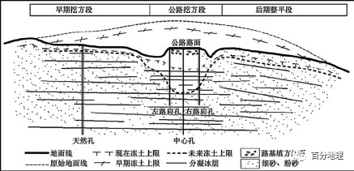   
   
(1)说出利于多格茸盆地冻胀丘群发育的自然条件。   
(2)指出图示公路附近冻土上限发生的变化，并从公路建设角度分析其原因。   
<span style="color: rgb(255, 0, 0);">【答案】(1)海拔高，气温低，为冻胀丘的发育提供了温度条件；湖泊众多，地表水丰富，为冻胀丘的发育提供了水分条件；细砂、粉砂互层沉积，为冻胀丘的发育提供了土壤条件（利于水分迁移）。</span>   
<span style="color: rgb(255, 0, 0);">(2)公路附近冻土上限显著下降；</span>   
<span style="color: rgb(255, 0, 0);">公路工程建设开挖地表，保护地层被破坏，使得地下冰埋藏变浅，改变了原来地气热交换过程，造成路基下大量热量积累，促使地下冰开始融化；车辆以及工程机械在施工过程中对地面的摩擦、震动也增加了地层中热量的积累。</span>   
<span style="color: rgb(255, 0, 0);">【分析】本题以共玉高速公路冻胀丘为背景，展示冻胀丘监测剖面地表及冻土上限变化示意图，设置2道小题，知识点涉及冰川地貌（冻胀丘）的形成，冻土上限变化的原因等内容，考查学生地理知识的迁移与调动能力和地理现象、规律的解释能力；蕴含区域认知、综合思维、人地协调观等地理学科核心素养。</span>   
<span style="color: rgb(255, 0, 0);">（1）紧密结合材料冻胀丘的形成回答问题，从温度角度，多格茸盆地海拔高，气温较低，为冻胀丘的发育提供了温度条件；从水分角度，冻胀丘的形成需要一定的水分基础，多格茸盆地湖泊众多，地表水丰富，为冻胀丘的发育提供了水分条件；从土壤角度，冻胀丘发生在薄弱地带，细砂、粉砂互层沉积，为冻胀丘的发育提供了土壤条件，也有利于水分迁移。</span>   
<span style="color: rgb(255, 0, 0);">（2）通过观察冻土变化上限可知，公路路面及其两侧冻土上限显著下降。从公路建设角度，在建设过程中，开挖地表，减少道路运行过程中受冻土影响，会破坏地层，使得地下冰埋藏变浅，改变了地气热交换，造成路基积累热量使得冻土显著下降；在建造中车辆运行，在施工过程中对地面造成影响，如摩擦、震动等，增加了地层中的热量。</span>   
36．（2022·四川省绵阳南山中学高三阶段练习）阅读材料,完成下列要求。   
过去30年来气温升高使北极地区永冻土解冻,大量碳以甲烷或二氧化碳的形式进入大气，成为加速气候变化的重要诱因。地球平均气温每升高1℃，永冻土就释放出相当于煤、石油和天然气4—6年释放出的温室气体。与此同时,以猛犸象为代表的大型食草动物的残体出露地表,有些动物残体保存非常完整。猛犸象生活在第四纪冰期时亚欧大陆北部与北美大陆北部的寒冷地区。随着气候转暖,最后一批猛犸象大约于公元前2000年灭绝。   
(1)指出北极地区永冻土释放的碳的来源。   
(2)运用大气受热过程原理分析永冻土释放的碳对气温变化的影响。   
(3)推测全球变暖导致猛犸象灭绝的科学依据。   
(4)分析动物残体能长时间保存的自然原因。   
<span style="color: rgb(255, 0, 0);">【答案】(1)封存于土壤孔隙中的二氧化碳、甲烷等气体；土壤中未被分解完的有机物；冻土中未被完全分解的动植物残体。</span>   
<span style="color: rgb(255, 0, 0);">(2)碳以甲烷或二氧化碳形式进入大气（增加大气中温室气体的含量），温室气体强烈吸收地面长波辐射，减少地面辐射进入宇宙的部分（减少热量散失）；大气逆辐射增强,对地面的保温作用（温室效应）增强。</span>   
<span style="color: rgb(255, 0, 0);">(3)全球变暖,猛犸象被迫向北方迁移,生存空间缩小，草本植物的数量减少或种类发生变化,食物匮乏，喜寒的猛犸象自身无法适应气候变暖。</span>   
<span style="color: rgb(255, 0, 0);">(4)纬度高,气（地）温低,微生物活动弱,分解极慢；冻土层隔绝了外界热量，维持地下冻结状态。</span>   
<span style="color: rgb(255, 0, 0);">【分析】本大题以雷暴为材料设置试题，涉及大气运动、雷暴等气象灾害等相关内容，考查学生获取和解读地理信息，调动和运用地理知识和基本技能的能力，体现综合思维、区域认知、地理实践力的地理核心素养。</span>   
<span style="color: rgb(255, 0, 0);">（1）从材料中得知，因地表受热不均匀导致空气上升，成为气团雷暴。气团雷暴有两种类型，海风型雷暴常见于夏季的沿海地区，海南岛四周被海洋包围。因为海陆热力性质差异，海陆风明显，海洋对形成海风型雷暴作用大，故海风型雷暴气团源地是海南岛周围海域，日间风从海洋吹回陆地，所以白天气团运动方向，首先由海南岛周围海域向陆地运动，登陆后再做上升运动。</span>   
<span style="color: rgb(255, 0, 0);">（2）雷暴是伴有雷击和闪电的局地对流天气。雷暴天气与日最高气温作用有关，海南岛雷暴天气北多南少，判断其日均最高气温分布特点是北部高，南部低。气温差异影响，北部日均最高气温较高，对流旺盛，利于形成雷暴天气。北部海陆之间温差较大，使陆地空气上升强，形成雷暴天气多。</span>   
<span style="color: rgb(255, 0, 0);">（3）五指山白天四周山坡受热产生上升气流，在山顶附近汇合上升，同时由于山顶白天的气温会高于其周围同等高度大气的气温，加剧气流上升形成雷暴天气。白天由沿海深入内陆的海风遇山地阻挡、抬升作用，使空气抬升形成雷暴天气。所以，五指山地区白天雷暴活动明显多于周边地区。</span>   
<span style="color: rgb(255, 0, 0);">（4）夏季，海南岛多雷暴天气，雷暴常产生强降水天气.海南岛山区地形坡度大，岩石破碎，在短时间降雨的影响下，局部地方会衍生其他灾害。暑假到海南岛山区野外研学，应注意山洪、滑坡(崩塌)、泥石流等衍生灾害。</span>   
37．（2022·全国·高三专题练习）阅读图文材料，完成下列要求。   
石环是一种主要由砂土、砾石组成的环状冻土地貌。砾石和含水砂土受冻融作用的影响，会使埋入地下深处的石块被顶托到地面，并侧向移动。石环形成速度较快。石环在极地、亚极地及高山地区较为常见，多发育在平坦的河漫滩或洪积扇边缘（下图）。在祁连山冰川边缘，发育有大量石环，直径大者可达4——5m，石环中心部分比边缘高约40cm。   
   
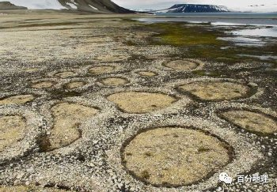   
   
(1)试描述图中颗粒的分布特征。   
(2)从颗粒物、水分和温度变化的角度，分析图示景观形成的条件。   
(3)在全球变暖的背景下，推测石环发育区分布的变化趋势。   
<span style="color: rgb(255, 0, 0);">【答案】(1)中心呈圆形，颗粒较小；周围呈环形，颗粒较大。</span>   
<span style="color: rgb(255, 0, 0);">(2)颗粒物大小混杂；土壤水分充足；冻融作用频繁。</span>   
<span style="color: rgb(255, 0, 0);">(3)向纬度较高处转移；向海拔较高处转移。</span>   
<span style="color: rgb(255, 0, 0);">【分析】本题以环状冻土地貌—石环为背景，考查地貌的形成条件、全球变暖的影响等知识点，考查学生读材料、读图获取信息、分析信息的能力。</span>   
<span style="color: rgb(255, 0, 0);">(1)读图可以看出，石环中心呈圆形，是颗粒较小的泥土和岩屑；周围呈环形，是颗粒较大的砾石。所以颗粒物的分布特征是中心呈圆形，颗粒较小，周围呈环形，颗粒较大。</span>   
<span style="color: rgb(255, 0, 0);">(2)石环形成的条件从沉积物颗粒、土壤水分、温度变化角度分析。材料中可知此地貌出现在冰川边缘，根据冰川沉积的特点，石环形成过程，沉积物颗粒必须大小混杂，既有沙土也有岩块；土壤水分充足，温度在零度上下波动的持续时间长，才能反复的冻融作用，只有这样夹杂在沙土中的石块才会被分离出来。</span>   
<span style="color: rgb(255, 0, 0);">(3)读材料可知，石环是一种冻土地貌，多出现在冰川的边缘。随全球气候变暖，冻土和冰川分布的纬度会逐渐变高，海拔高度也会升高。因此石环也会随之向纬度较高处转移，向海拔较高处转移。</span>
