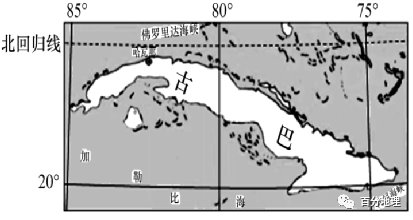
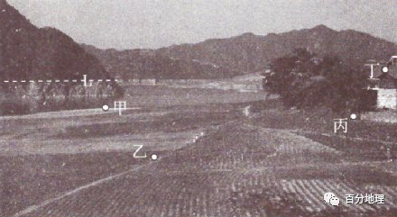
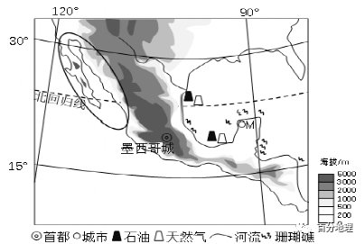
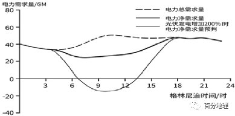
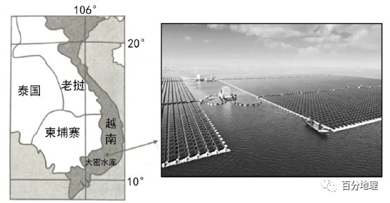
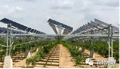

# 微专题之074 从产业结构角度分析区域发展

```
本专题摘自“百分地理”公众号，如有侵权请告之删除，谢谢。联系hhwxyhh@163.com
```

------
   
（2022·重庆·学业水平选考押题卷）位于欧洲西部的丹麦首都哥本哈根将成为世界上首个零碳排放城市：四通八达的绿色交通、鳞次栉比的绿色建筑、随处可见的白色风车……。其中，推广清洁、廉价、健康的公共交通工具（主要是电动车），是减少碳排放的关键步骤之一。据此完成下面小题。   
1.丹麦推广零碳排放公交车以降低长期运营成本，主要是因为（  ）   
A.煤炭资源成本比较高   
B.本国化石能源很丰富   
C.本国新能源比较丰富   
D.零碳排放公交需能少   
2.为促进哥本哈根建设零碳排放城市，下列措施合理的是（  ）   
A.建筑外墙涂刷成绿色   
B.周日禁止机动车出行   
C.市民参股地热发电厂   
D.建自动调节天窗房屋   
<span style="color: rgb(255, 0, 0);">1.C结合材料可知，丹麦推广的是零碳排放公交车，并且可以降低运营成本，故知丹麦新能源丰富且价格较低廉，C正确。化石能源的燃烧，排放出的二氧化碳较多，不能实现公交车的零碳排放，AB错误。公交运行需能是一样的，D错误。故选：C。</span>   
<span style="color: rgb(255, 0, 0);">2.D建筑外墙涂刷成绿色不会减少碳排放，故A错。周日禁止机动车出行是不正确的行为，故B错。地热能为可再生资源，但目前我们的技术水乎并不能做到零碳排放，故C错。自动调节天窗的房屋可以最大限度利用太阳能，利于建设零碳排放城市，故D对。故选：D。</span>   
（2022·全国·专题练习）古巴矿产能源极其匮乏，近年来，该国大力推进新能源项目。由我国提供电气设备并负责建造的古巴某生物质发电厂，位于距首都哈瓦那约445千米的中部小镇西罗雷东多，1～5月榨糖季利用糖厂的甘蔗渣发电，6～12月利用野生疯长的灌木“麻拉布”（原产地:非洲）继续发电。据此材料，完成下面小题。   
   
   
   
3.与风能、太阳能发电相比,生物质发电的主要优势是（  ）   
A.清洁可再生   
B.节能减排   
C.发电量稳定   
D.运营成本低   
4.该生物质发电厂使用“麻拉布”发电的生态优势是（  ）   
A.降低发电的成本   
B.扩大耕地面积   
C.促进就业多元化   
D.防治生物入侵   
<span style="color: rgb(255, 0, 0);">3.C风能、太阳能、生物质等发电都属于可再生能源，因此A错误；都能够起到节能减排的作用，因此B错误；风能和太阳能发电由于受到天气影响大，因此发电量不稳定，而生物质由于它直接或间接来源于绿色植物，因此数量大，供应稳定，发电量稳定，这是它的主要优势，因此C正确；由于生物质资源分散、不易收集、能源密度较低等自然特性，导致运营成本不会低，因此D错误。故选C。</span>   
<span style="color: rgb(255, 0, 0);">4.D由材料可知，灌木“麻拉布”的原产地是非洲，由于该地与非洲自然环境相似，所以能够野生疯长，具有生长速度快，扩展地盘快，会侵占当地物种的生存空间，破坏当地生态系统平衡，属于外来生物入侵。因此大量使用它来发电的生态优势是能够减少其数量，防治生物入侵，D正确。降低发电成本、促进就业多元化、扩大耕地面积都不是生态方面的优势，因此ABC错误。故选D。</span>   
（2022·江苏卷）水丰水库位于鸭绿江上，发电为其主要功能。绿江村位于库尾的一个半岛上，该村形成了季节性淹没的“水没地”景观。下图为“绿江村‘水没地’照片”。据此完成下面小题。   
   
   
   
5.照片中河流对岸裸露带形成的原因是（  ）   
A.岸坡崩塌   
B.开山采石   
C.水位涨落   
D.崖壁贫瘠   
6.与图中L线高程接近的地点是（  ）   
A.甲   
B.乙   
C.丙   
D.丁   
7.下列月份中，该村“水没地”淹没在水下面积最大的一般是（  ）   
A.2月   
B.5月   
C.7月   
D.10月   
<span style="color: rgb(255, 0, 0);">5.C根据材料信息“水丰水库位于鸭绿江上，发电为其主要功能。绿江村位于库尾的一个半岛上，该村形成了季节性淹没的‘水没地’景观”可知，该地位于河流沿岸，河流水位会发生季节性的涨落，所以位于河流沿岸的山体会因为河流季节性涨落而出现季节性出露的裸露岩层，C正确；根据图示信息可知，河流对岸岩层完整，没有出现岸坡崩塌、开山采石的活动，AB错误；崖壁贫瘠不会只导致岩壁下部裸露，D错误。所以选C。</span>   
<span style="color: rgb(255, 0, 0);">6.C根据上题分析可知，L线以下为季节性裸露岩壁，所以L线应为河流丰水期最高水位线，此时河流处于低水位，根据图示信息可知，甲处此时位于河流沿岸，接近低水位，A错误；乙位于耕地远离河流的一侧，不会出现季节性“水没地”现象，B错误；丙位于住宅与耕地之间，丁海拔高度高于住宅，居民的房屋一般建在河流最高水位线之上，所以应为丙，D错误，C正确。所以选C。</span>   
<span style="color: rgb(255, 0, 0);">7.C根据材料信息“水丰水库位于鸭绿江上，发电为其主要功能。”可知，该河流为鸭绿江，位于我国东北地区，河流的汛期主要有雨水补给出现的夏汛和季节性积雪融水补给出现的春汛，其中夏汛的流量更大，河流水位更高，C正确，ABD错误。所以选C。</span>   
（2021·浙江卷）秀珍菇生产需避光遮阳。浙江某地在秀珍菇生产大棚上搭建光伏发电系统，实现了棚内种菇、棚顶发电，形成了“农业 新能源”生态高效生产方式。完成下列小题。   
8.该生产方式会使棚内（　　）   
A.太阳辐射减弱   
B.地面辐射增加   
C.大气吸收增加   
D.地面反射增加   
9.与原秀珍菇生产方式相比，该生产方式的优势有（　　）   
①增加经济效益   
②增加土壤肥力   
③减少土壤污染   
④提高土地利用率   
A.①③   
B.②④   
C.①④   
D.②③   
<span style="color: rgb(255, 0, 0);">8.A大棚顶部搭建光伏发电系统（有光伏板），会使到达棚内的太阳辐射进一步减弱，从而使棚内的地面辐射、大气吸收、地面反射等也随之减弱。A正确，B、C、D错误。故选A。</span>   
<span style="color: rgb(255, 0, 0);">9.C本题考查区域农业可持续发展。与原秀珍菇生产方式相比，该生产方式在几乎同样的土地面积上既种植了秀珍菇，还实现了光伏发电，增加了经济效益，提高了土地利用率，①④正确。对土壤肥力和污染没有影响，②③错误。故选C。</span>   
（2021·辽宁卷）墨西哥拥有丰富的石油和天然气资源，但石油加工能力弱。2010年以来，墨西哥天然气消费量超过生产量，缺口逐年扩大，一半以上需从美国进口。目前墨西哥逐渐用天然气替代石油作为发电的主要燃料，并大力提高可再生能源的份额。图为墨西哥及周边地区地理要素分布图。据此完成下列小题。   
   
   
   
10.墨西哥用天然气替代石油作为发电的主要燃料是由于（　　）   
①天然气从美国进口价格较低   
②天然气发电比石油清洁   
③天然气远景储量比石油更大   
④天然气开采比石油容易   
A.①②   
B.①④   
C.②③   
D.③④   
11.墨西哥可再生能源主要分布在图中椭圆形区域的是（　　）   
A.水能   
B.风能   
C.太阳能   
D.生物能   
12.6月1日，在M城海滨散步的游客看到了绚丽的日落景观，此时北京时间约是（　　）   
A.6月1日4：20   
B.6月1日19：00   
C.6月2日8：00   
D.6月2日8：20   
<span style="color: rgb(255, 0, 0);">10.A墨西哥与美国邻近，天然气从美国进口价格较低，①正确。与石油相比，天然气更清洁，②正确。由材料可知，墨西哥拥有丰富的石油和天然气资源，但无法判断天然气远景储量比石油更大，③错误。天然气开采难度更大，④错误。故A正确，BCD错误。故选A。</span>   
<span style="color: rgb(255, 0, 0);">11.C读图可知，图中椭圆形区域属于热带沙漠气候区，终年炎热干燥，太阳能资源丰富，因此，墨西哥可再生能源主要分布在图中椭圆形区域的是太阳能，C正确。椭圆形区域降水少，水能贫乏，A错误。北回归线附近盛行下沉气流，又位于东北信风的背风侧，风力小，风能不足，B错误。椭圆形区域属于热带沙漠气候区，植被稀少，生物资源短缺，D错误。故选C。</span>   
<span style="color: rgb(255, 0, 0);">12.D6月1日，太阳直射北半球，北半球各地昼长夜短，日出时间早于6点，日落时间晚于18点。据图示信息可知，M城市位于（90°W，20°N）附近，北京时间即120°E的地方时，在M城海滨散步的游客看到绚丽的日落景观时，地方时大于18：00；则当M城市18：00时，北京时间为18：00 （90° 120°）÷15°/小时=6月2日8：00，故北京时间大于6月2日8：00，D正确。故选D。</span>   
（2021·福建卷）1997年以来，宁夏闽宁镇从一片“干沙滩”逐步发展为“金沙滩”。2012年闽宁镇开始发展光伏大棚、光伏发电等光伏应用产业，未来将利用“照射光线自动跟踪”技术，让光伏面板始终保持与太阳光线垂直，以提高光能利用效率。据此完成下列小题。   
13.光伏应用产业为闽宁镇提供绿色能源的同时，还能（　　）   
A.增加年降水量   
B.减少风沙威胁   
C.增大昼夜温差   
D.降低地下水位   
14.若应用“照射光线自动跟踪”技术，与6月1日相比，闽宁镇7月1日光伏面板（　　）   
A.正午影子长度较长   
B.跟踪调整时长较短   
C.仰角移动幅度较小   
D.水平转动角度较大   
<span style="color: rgb(255, 0, 0);">13.B光伏应用产业，减少了水分的蒸发，大气中的水汽含量减少了，年降水量会减少，A错误。光伏大棚、光伏发电的设备可以起到沙障和风障的功能，可减少风沙威胁，B正确。光伏应用产业将太阳能转化为电能，地面吸收的太阳辐射减少了，地面辐射减弱了，白天气温降低了，昼夜温差减小了，C错误。光伏应用产业，减少了水分的蒸发，地下水位会上升，D错误。故选B。</span>   
<span style="color: rgb(255, 0, 0);">14.D与6月1日相比，闽宁镇7月1日，正午太阳高度角更大，光伏面板正午影子长度较短，A错误。7月1日比6月1日的白昼时间更长，跟踪调整时长较长，B错误。7月1日比6月1日的正午太阳高度角更大，日出日落太阳高度为零，一天中太阳高度角变化更大，仰角移动幅度较大，C错误。</span>   
<span style="color: rgb(255, 0, 0);">7月1日比6月1日的白昼时间更长，从日出到日落太阳转过的水平角度更大，光伏面板水平转动角度较大，D正确。故选D。</span>   
（2021·全国甲卷）2011年日本福岛核泄漏事件之后，德国宣布放弃核电而重点发展光伏发电。下图示意2014年某日德国电力总需求和电力净需求的变化(电力净需求量=电力总需求量-光伏发电量)，据此完成下列题目。   
   
   
   
15.如图所示这一天所在的月份是（　　）   
A.3月   
B.6月   
C.9月   
D.12月   
16.随着光伏发电量的增加，电力净需求量（　　）   
A.全天性减少   
B.时段性增加   
C.时段性减少   
D.不发生变化   
17.降低夜间的电力净需求量，关键是发展（　　）   
A.火力发电技术   
B.光伏发电技术   
C.特高压输电技术   
D.电能储存技术   
<span style="color: rgb(255, 0, 0);">15.B本题主要考查自然资源及其利用。由材料中“电力净需求量=电力总需求量-光伏发电量”可知,电力净需求量小的时段应该是光伏发电多的时段。图中显示该日光伏发电主要集中在格林尼治时间约3时到18时,即该日该地昼长大约为15小时,选项中能满足该日昼长为15小时的只有6月。故A,C,D项错误,B项正确。</span>   
<span style="color: rgb(255, 0, 0);">16.C本题主要考查坐标图的判读。根据材料中“电力净需求量=电力总需求量-光伏发电量”和坐标图信息可知,光伏发电量增加200%时,电力净需求量会在白天减少,即呈现时段性减少。故A,B,D项错误,C项正确。</span>   
<span style="color: rgb(255, 0, 0);">17.D本题主要考查能源资源的开发利用。材料显示“电力净需求量=电力总需求量-光伏发电量”降低夜间的电力净需求量应该将部分白天的光伏电能转移到夜间使用,所以关键是发展电能储存技术,故D项正确;与火力发电技术、光伏发电技术、特高压输电技术关系较小,故A、B、C项错误。</span>   
（2022·湖南·模拟卷）水上漂浮式光伏电站主要是利用水塘、中小型湖泊、水库、蓄水池、采煤塌陷区形成的水上平台将光伏组件漂浮在水面进行发电。由中国电建集团承建的大密漂浮式光伏项目总装机规模为47.5MWp，是东南亚在建最大容量的漂浮式光伏电站，位于越南东南部平顺省的大密水库（如图）。大密水库长达200千米，水深30m，水位落差4.4m，浪高0.5m。完成18～19题。   
   
   
   
18.与传统陆地光伏电站相比，水上漂浮式光伏电站除节约土地外，还具有的优势是（　　）   
①发电效率高   
②建设工期短   
③维护成本低   
④净化水质   
A.①③   
B.①④   
C.②③   
D.②④   
19.在平顺省发展大规模的光伏电站的主要原因是（　　）   
A.水库水深，水位落差大   
B.纬度较低，太阳辐射强   
C.经济发达，技术水平高   
D.经济发展，市场需求大   
<span style="color: rgb(255, 0, 0);">18.B光伏组件及电缆在工作过程中会产生较多热量，对发电效率产生一定影响，所以将光伏组件等至于湖面上有利于散热，提高光伏电站工作效率，①正确。太阳光板覆盖在水面，减少尘埃等杂质对水的污染，可能净化水质，④正确。与传统陆地光伏电站相比，水面漂浮光伏电维护成本更高，由于水上施工，难度大，工期长，②③错误。故选：B。</span>   
<span style="color: rgb(255, 0, 0);">19.D水位落差大，不利于安装光伏，A错误。纬度低，但雨水多，不利于光伏发电，B错误。</span>   
<span style="color: rgb(255, 0, 0);">越南经济落后，C错误。越南经济正处于快速发展阶段，对电力需求量大，D正确。故选：D。</span>   
（2022·浙江宁波·十校联考）生物质发电是利用生物质所具有的生物质能进行的发电，包括农林废弃物直接燃烧发电、农林废弃物气化发电、垃圾焚烧发电、垃圾填埋气发电和沼气发电等。完成下列小题。   
20.与太阳能发电相比，生物质发电的主要优势是（　　）   
A.分布较广泛   
B.清洁可再生   
C.发电量稳定   
D.市场前景好   
21.大力发展生物质发电，对我国社会经济的有利影响是（　　）   
A.减轻大气污染   
B.增加就业岗位   
C.提高土壤肥力   
D.降低发电成本   
<span style="color: rgb(255, 0, 0);">20.C生物质和太阳能分布都比较广泛，故A错误。生物质与太阳能都是清洁能源，故B错误。生物质受到天气影响较小，而太阳能受到的影响因素较多，故C正确。太阳能和生物质都属于清洁能源，因此市场前景都不错，故D错误。故选：C。</span>   
<span style="color: rgb(255, 0, 0);">21.B缓解大气污染属于对环境的影响，故A错误。生物质发电有利于带动相关产业的发展，增加就业岗位，故B正确。生物质发电不会提高土壤肥力，故C错误。生物质发电相对于其他的发电方式并不会大规模的降低成本，故D错误。故选：B。</span>   
（2022·河南开封·一模）在我国西北地区“沙漠 种植 光伏发电”（如图）可实现完美结合。光伏农业是将太阳能发电广泛应用到现代农业种植、养殖、灌溉、病虫害防治以及农业机械动力提供等领域的一种新型农业。气温越高，光伏面板发电效率降得越多，温度每升高1℃，发电效率就会下降约0.4%到0.5%。完成下列小题。   
   
   
   
22.制约我国西北地区光伏产业进一步推广的因素有（　　）   
A.技术难度大   
B.投资成本高   
C.碳排放量大   
D.劳动力不足   
23.有关西北地区“沙漠 种植 光伏发电”模式，叙述合理的是（　　）   
A.增加了发电成本   
B.不利于作物生长   
C.降低了发电效率   
D.高效利用水资源   
24.在确保有阳光直射的情况下，太阳能面板的发电效率最高的时段是（　　）   
A.夏天清晨   
B.冬天清晨   
C.夏天正午   
D.冬天正午   
<span style="color: rgb(255, 0, 0);">22.B我国西北地区为温度大陆性气候，晴天多，太阳能辐射强，太阳能资源丰富，而光伏发电是一项投资巨大的项目，西北地区由于资金力量较弱，因此会制约光伏电站进一步扩大规模，B正确。太阳能光伏电站的技术难度并不大，A错误。碳排放量大，与光伏电站扩大规模并无关系，C错误。光伏电站对劳动力的依赖程度并不高，D错误。故选：B。</span>   
<span style="color: rgb(255, 0, 0);">23.D“沙漠 种植 光伏发电”模式并没有增加发电成本，A错误。光伏电站可以遮挡太阳光照，减少水分蒸发，有利于干旱地区土地保湿，提高灌溉用水的利用效率，从而有利于农作物的生长，B错误，D正确。发电效率受自然条件影响，与该模式无关，C错误。故选：D。</span>   
<span style="color: rgb(255, 0, 0);">24.B根据材料内容可知，气温越高，光伏面板发电效率降得越多，温度每升高1℃，发电效率就会下降约0.4