# 微专题之074 从产业结构角度分析区域发展

```
本专题摘自“百分地理”公众号，如有侵权请告之删除，谢谢。联系hhwxyhh@163.com
```

------
   
(2022·广州市调研)垂直带谱是指山地自下而上按一定顺序排列形成的自然带，最下面的起始带称为基带。读我国某山地自然带分布图，完成1～3题。   
   
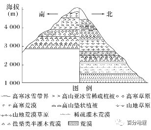   
   
1.该山体在3000～3500m海拔范围内，北坡比南坡(　　)   
A.降水量大   
B.年均温高   
C.植被稀疏   
D.土壤贫瘠   
2.该山地南北两坡自然带谱数量差异很大，这种差异形成的主要影响因素是(　　)   
A.绝对高度   
B.热量条件   
C.坡度   
D.相对高度   
3.北坡山麓荒漠形成的主要自然原因是(　　)   
A.水资源利用不合理，干旱加剧   
B.冬季寒冷多大风，蒸发旺盛   
C.深居内陆，海洋水汽难以到达   
D.终年受副热带高气压带影响，降水稀少   
<span style="color: rgb(255, 0, 0);">1.A依据图示信息，在3000～3500m海拔范围内，北坡出现了山地草原、高寒草原，而南坡只有盐柴类半灌木荒漠，说明北坡比南坡湿润，A对；依据该山地山麓地带自然带类型，可推测该山地应位于我国西部地区，北坡为阴坡，年均温低于阳坡，B错；草原比盐柴类半灌木荒漠植被密集，土壤较肥沃，C、D错。选A。</span>   
<span style="color: rgb(255, 0, 0);">2.D该山地北坡相对高度大，自然带数量多，南坡相对高度小，自然带数量少，D对；山地两侧绝对高度差异不大，从图文材料中也无法判断该山地坡度，A、C错；热量条件南坡更优越，B错。选D。</span>   
<span style="color: rgb(255, 0, 0);">3.C水资源利用不合理属于人为原因，A错；自然带的形成主要取决于夏季的水热组合状况，与冬季关联不大，B错；该地最可能深居内陆，海洋水汽难以到达，因而形成荒漠景观，C对；我国西部内陆地区降水稀少的原因主要是距海较远，与副热带高气压带关系不大，D错。选C。</span>   
(2022·安徽江南十校联考)武夷山位于福建省西北部，区内森林植被茂密，植物种类繁多，保存着大量完整无损、多种多样的林带，自然带垂直分异明显，近几十年来，武夷山大量天然林被破坏，当地林业局启动了造林复绿工程。下图示意武夷山垂直自然带分布。据此完成4～6题。   
   
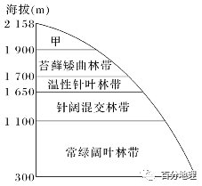   
   
4.甲处地带性植被可能为(　　)   
A.积雪冰川   
B.高寒荒漠   
C.山地草甸   
D.高寒灌丛   
5.武夷山基带天然林被破坏后，若未受到人为干扰首先会演化成(　　)   
A.次生灌丛   
B.落叶阔叶林   
C.针叶林   
D.针阔混交林   
6.与武夷山基带相同海拔高度和坡向的天然林相比，人工林(　　)   
A.土壤温度高   
B.林冠成层性强   
C.土壤湿度大   
D.生长速度缓慢   
<span style="color: rgb(255, 0, 0);">4.C图中甲处植被位于苔藓矮曲林带附近，应较湿润；同时甲以下均为森林带，依据山地垂直地带分异规律(由下向上一般为森林、草原、荒漠)，可判断甲可能为山地草甸带，故C正确。</span>   
<span style="color: rgb(255, 0, 0);">5.D图示武夷山基带之上为针阔混交林，是针叶林与常绿阔叶林的过渡性植被；基带天然林被破坏后，自然状态下首先形成的也应是过渡性植被，即针阔混交林。这些针阔混交林随着森林群落的演替，最后演化为天然次生阔叶林；故D正确。</span>   
<span style="color: rgb(255, 0, 0);">6.A与天然林相比，人工林一般森林树种单一、林下灌丛少，则人工林树冠遮蔽地面的程度较低，光照条件较好，土壤温度较高，故A正确。天然林中树木的上部枝叶不整齐，林冠具有明显的成层性，植物种类丰富，层次结构复杂，调节气候能力强，土壤湿度相对较大，故B、C错误。人工林多为经济目的而栽种的，则一般选择速生丰产树种，则D错误。</span>   
登曲地处青藏高原的东部，为澜沧江的一级支流。流域总体上太阳辐射强，低温干燥。下图示意登曲及其主要支流两岸山体植被带的垂直带谱，图中①植被带属山地常绿阔叶林带，②植被带属山地暗针叶林带（①②处于不同坡向）。同时，在有些坡面上，常可看到大面积的常绿阔叶林中出现条带状的暗针叶林景观。据此完成下面小题。   
   
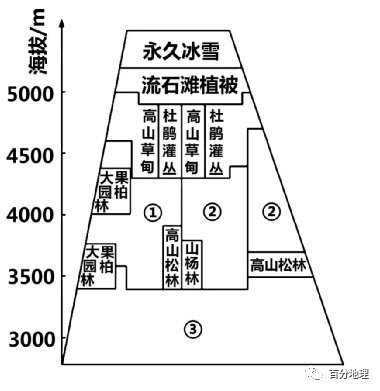   
   
7．推测图中③处自然带是（  ）   
A．山地季雨林带   
B．山地落叶阔叶林带   
C．山地针阔混交林带   
D．山地灌丛带   
8．在同一山体面上，常绿阔叶林中的条带状暗针叶林最可能位于（  ）   
A．阳坡的山脊、陡坡处   
B．阳坡的沟谷、山凹处   
C．阴坡的山脊、陡坡处   
D．阴坡的沟谷、山凹处   
<span style="color: rgb(255, 0, 0);">7．D根据材料“登曲地处青藏高原的东部，为澜沧江的一级支流。流域总体上太阳辐射强，低温干燥”可推测，该流域应地处干热河谷地区，河谷地带气候干燥，降水较少，③处自然带最可能是山地灌丛带，D正确；根据材料图中①植被带属山地常绿阔叶林带，②植被带属山地暗针叶林带，③处比①②处海拔更低，自然带不可能是山地落叶阔叶林带和 山地针阔混交林带，BC错误；该区域地处青藏高原的东部，无热带植被分布，A错误。故选D。</span>   
<span style="color: rgb(255, 0, 0);">8．B据图，根据所学知识，大果园柏属于常绿乔木，材料强调①植被带属山地常绿阔叶林带，说明①处所在坡为阳坡，②处所在坡为阴坡，阴坡太阳辐射弱，蒸发弱，水分条件相对较好，说明山地暗针叶林带指示较为冷湿的环境，故常绿阔叶林中的条带状暗针叶林最可能位于阳坡的沟谷、山凹处，因阳坡的沟谷、山凹处太阳辐射相对较弱，水分条件好，适合暗针叶林生长，B正确，ACD错误。故选B。</span>   
（2022·黑龙江·哈尔滨三中模拟预测）30多年前，台风维拉袭击了长白山自然保护区，使得长白山原始森林受到严重破坏，形成大面积风灾景观。随着植被的持续恢复与演替，风灾景观的格局不断变化。下图为长白上垂直带谱示意图。据此回答下面小题。   
   
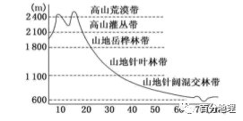   
   
9．长白山受风灾影响最小的坡向是（  ）   
A．东坡   
B．南坡   
C．西坡   
D．北坡   
10．本次风灾中，受损最严重的自然带最可能是（  ）   
A．针阔混交林带   
B．针叶林带   
C．岳桦林带   
D．灌丛带   
11．风灾后，对该地植被演化的推断正确的是（  ）   
A．幼树比重一直增大   
B．森林密度变大   
C．林线海拔升高   
D．平均树龄一直变大   
<span style="color: rgb(255, 0, 0);">9．D北坡位于高大山体的北面，30多年前的台风从沿海地区登陆，风向主要由偏东风、偏南风和偏西风，对东坡、南坡、西坡造成破坏，由于长白山的走向，使得台风很难越过北坡，所以北坡来说，相对风力较小，所以受风灾影响最小的坡向为北坡，故D正确，ABC错误。故答案选D。</span>   
<span style="color: rgb(255, 0, 0);">10．A由图可知山地针阔混交林海拔最低，受台风影响最大，对森林的破坏性大，故山地针阔混交林带受损最大，故A正确；针叶林带、 岳桦林带、 灌丛带由于海拔高台风受地形阻挡，风力减小，因而植被的损害较小，故BCD错误；故答案选A。</span>   
<span style="color: rgb(255, 0, 0);">11．B风灾后，树木被风折断，林下光照变充足，使得一些喜阳性物种大量入侵，林下灌丛、草本植物得到了充足的光照和空间，森林密度增加，故B正确；台风对海拔更高的森林影响较小，所以对林线的高度影响较小，故C错误；树木被风折断，长出幼树，平均树龄减小，故D错误；风灾过后，环境较稳定，幼树的比重不会一直增大，故A错误。故选B。</span>   
山地土地覆被是指山地两坡土地覆盖的主要植被类型。下左图为某山地土地覆被图，下右图中a、b图为两类型植被在该山中位置及在两坡中面积比重图。据此完成下面小题。   
   
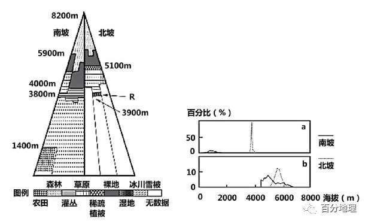   
   
12．右图中，a图表示的植被类型为（  ）   
A．森林灌丛   
B．稀疏植被   
C．草地   
D．湿地   
13．推测左图中，R地的地形类型可能为（  ）   
A．山脊   
B．河谷   
C．坝子   
D．陡崖   
14．右图中，形成b图中植被类型分布差异的主要影响因素是（  ）   
A．海拔   
B．气温   
C．降水   
D．土壤   
<span style="color: rgb(255, 0, 0);">12．C右图中，a在北坡对应约4000米处占比接近100%，对应左图中应为草甸草原，在南坡约1000米处约占5%左右，对应左图中有农田和森林，林下一般会有草地，因此C正确ABD错误。故选：C。</span>   
<span style="color: rgb(255, 0, 0);">13．B推测左图中，R地地处3900米处，植被类型为湿地。山脊处为分水岭，不可能形成湿地，A错误；河谷积水为湿地，B正确；坝子是山区中的低地平坦地形，一般有人类活动，不会出现湿地，C错误；陡崖处无水不会形成瀑布，D错误。故选：B。</span>   
<span style="color: rgb(255, 0, 0);">14．C由右图可读出，b植被类型在北坡海拔5000-6000米占比较大，以裸地为主；b植被类型在4500-6000米的南坡占比较大，对应左图有草地、裸地和冰川。在左图中该山南坡b植被以下海拔出现有大面积的灌丛、森林植被。该山海拔较高，气温较低，热量少，土壤浅薄贫瘠，南坡在此高海拔处生长发育植被，这表明南坡极有可能为迎风坡，降水较多，能够形成草地，ABD错误，C正确。</span>   
滇西北的大理苍山位于洱海西侧，是研究山地植被垂直地带性的典型山体。研究发现，西坡低海拔地区存在植被逆向更替分布，呈现倒置的垂直地带性现象。下图示意大理苍山东西坡植被垂直分布。据此完成下面小题。   
   
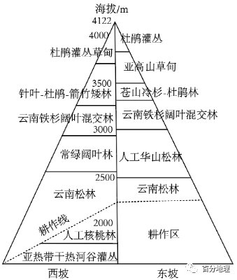   
   
15．推测东坡耕作区原生植被是（  ）   
A．常绿阔叶林   
B．常绿硬叶林   
C．落叶阔叶林   
D．干热河谷灌丛   
16．西坡低海拔地区出现倒置垂直地带性现象，主要原因是（  ）   
A．山谷地，焚风效应   
B．海拔较低，气温高   
C．谷底河畔，风力强   
D．深居内陆，水汽少   
<span style="color: rgb(255, 0, 0);">15．A大理苍山位于我国亚热带地区，基带不可能为落叶阔叶林和常绿硬叶林，B、C错；结合材料可知，大理苍山西坡低海拔地区存在植被逆向更替分布，呈现倒置的垂直地带性现象，西坡河谷地区植被为亚热带干热河谷灌丛，以上为耕作区，在往上为云南松林，而东坡从河谷地区为耕作区，以上为云南松林，据此推断东坡耕作区水热条件较西坡好，由于处于亚热带，因此耕作区的原生植被为亚热带常绿阔叶林，A正确，故选A。</span>   
<span style="color: rgb(255, 0, 0);">16．A结合材料可知，西坡低海拔地区存在植被逆向更替分布，呈现倒置的垂直地带性现象。最主要成因是受地形影响，位于季风的背风坡，出现焚风效应，气流下沉，降水少，A对；从图中信息看，河谷相对高度为低于2000米左右，说明海拔不是自然带倒置的主因，B错；谷底受地形影响，风力不大，C错；该河段会受到来自印度洋和太平洋水汽的影响，D错。故选A。</span>   
（2022·浙江台州·模拟预测）植被NDVI（归一化植被指数）指示植被密度及其动态变化，与植被覆盖密度呈正相关。下图为吕梁山区NDVI随海拔高度和坡向变化趋势。完成问题。   
   
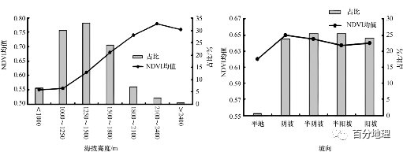   
   
19．关于吕梁山NDVI分布说法正确的是（  ）   
A．1000米以下NDVI最低是土壤贫瘠所致   
B．1250米以上NDVI迅速上升是封山育林所致   
C．1250-1500米地区植被覆盖密度最高   
D．2400米以上NDVI降低是冰雪覆盖所致   
20．阴坡NDVI高于阳坡的原因是（  ）   
A．阴坡土壤含水量高   
B．阴坡冬季风降水多   
C．阳坡水热条件较差   
D．阳坡人为扰动频繁   
<span style="color: rgb(255, 0, 0);">【解析】19．1000米以下为山麓地带，地势较低平，是人类活动比较频繁的地区，植被密度低，因此NDVI最低，A错误； 1250米以上NDVI迅速上升，表明植被覆盖密度迅速增大，这可能是封山育林所致，B正确； NDVI与植被覆盖密度呈正相关，据图可知，2100-2400米地区NDVI均值最高，意味着该海拔范围内的植被覆盖密度最高，C错误；吕梁山整体海拔较低，山顶没有常年性冰雪覆盖。2400米以上海拔较高，山地降水少，受水分影响NDVI降低，D错误。故选B。</span>   
<span style="color: rgb(255, 0, 0);">20．阴坡受到的太阳辐射少，蒸发比较弱，因此土壤含水量较高，有利于植被生长，A正确；冬季风来自亚欧大陆内部，水汽含量少，即便在迎风坡也难以形成降水，且冬季不是植被的主要生长阶段，对冬季降水对植被影响小，B错误；阳坡太阳辐射强，光照和热量条件好，但是蒸发比较旺盛，水分条件差，C错误；人类活动主要集中在平地，山坡上人类活动较少，D错误。故选A。</span>   
（2022·湖南·雅礼中学一模）冰川物质平衡量等于积累量与消融量的差值，它是冰川对气候变化最直接的反映。冰川零平衡线是积累区与消融区分界线。近年来，乌鲁木齐河源1号冰川呈快速消融趋势，随着时间推移，冰川消退地区植被群落也会发生变化。通常该地冰川退缩后的裸地气温已明显上升，但直到100年后才有地衣类植物茂盛繁育，3000年后才有苔草草甸的广泛发育。甲图为乌鲁木齐河源1号冰川三次运动形成的地貌，乙图表示1号冰川物质零平衡线高度变化。据此完成下面小题。   
   
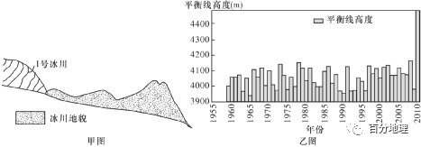   
   
21．下列关于1号冰川物质平衡的说法，正确的是（  ）   
A．冰川物质平衡量越小，冰川融化越弱   
B．冰川物质平衡量越小，冰川积累越多   
C．降水越多，冰川物质零平衡线越低   
D．气温越高，冰川物质零平衡线越低   
22．冰川消退后，该地区植物群落演替的直接决定因素为（  ）   
A．土壤   
B．气温   
C．水分   
D．光照   
<span style="color: rgb(255, 0, 0);">21.C冰川物质平衡量等于积累量与消融量的差值，冰川物质平衡量越小，说明积累量越少，消融量越大，A、B错：降水越多，说明冰川物质积累量越大，即冰川物质平衡量大，冰川物质零平衡线越低，C对；气温越高，说明冰川物质消融量越大，即冰川物质平衡量小，冰川物质零平衡线越高，D错误。</span>   
<span style="color: rgb(255, 0, 0);">22．A基于冰川退化后，主要留下以砾石为主的冰碛物（成土母质），随着时间演化，低等植物作用形成原始土壤并逐渐发育成成熟土壤，逐渐适合高等植物繁育，A正确。由材料可知，气温上升100年后才有植物繁育，因此气温不是直接决定因素，B错误。冰川消退后，水分、光照条件会影响植物的生长，但是对于植物群落演替不会起到直接决定作用，C、D错误。</span>   
（2022·山西·怀仁市第一中学校模拟预测）横断山区山脉众多,平均海拔4000m以上,有我国纬度最低的雪峰冰川及丰富的生物资源，科研价值极高。为了合理利用积雪资源、预防自然灾害以及保护生物多样性,某科研机构连续数年对横断山区积雪覆盖率进行观测。下图为“2001——2019年横断山区月平均积雪覆盖率及不同高程带积雪年际变化图”。据此完成下面小题。   
   
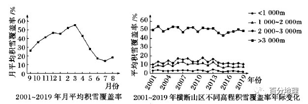   
   
23．横断山区年内积雪覆盖特点是（  ）   
A．受气温影响,3月积雪覆盖率最高   
B．受降水影响,7月积雪覆盖率最低   
C．积雪覆盖率夏季较稳定,春秋季变化明显   
D．积雪覆盖率月变化相同   
24．横断山区（  ）   
A．海拔1000m以下的地区受人类活动影响积雪覆盖率低且稳定   
B．海拔1000m以上各高程带积雪覆盖率的年际变化均呈减小趋势   
C．海拔高度与积雪覆盖率呈负相关   
D．海拔1000——3000m地区积雪量最大   
<span style="color: rgb(255, 0, 0);">23．C横断山区积雪覆盖率具有明显的季节差异，积雪覆盖率最高的月份是3月，最低的月份是7月。4月开始随着气温升高积雪逐渐融化，积雪覆盖率急剧减少，7月达到最小值；之后积雪开始积累，到次年3月又达到最大值。所以3月积雪覆盖率高是受到冬季降雪的累积和气温低二者的共同影响；7月积雪覆盖率低，主要与温度升高积雪消融有关，与降水关系不大，A、B错。从2001——2019年横断山区月平均积雪覆盖率图可以看出，6——8月曲线变化幅度较小，3——5月和9——11月曲线变化幅度较大，说明积雪覆盖率夏季较稳定，春秋季变化明显，C正确；积雪覆盖率月变化存在较大差异，D错误。故选C。</span>   
<span style="color: rgb(255, 0, 0);">24．B横断山区海拔1000m以下的地区，气候条件不利于积雪的累积，因此积雪覆盖率低且稳定，A错误；受全球气候变化的影响，海拔1000m以上各高程带积雪覆盖率的年际变化均呈减小趋势，B正确；读图可知，海拔越高积雪覆盖率越高，海拔高度与积雪覆盖率呈正相关，C错误；图中只显示覆盖率信息，而海拔1000——3000m地区积雪量不能确定，D错误。故选B。</span>   
(2021·河北模拟演练)某科研小组对喜马拉雅山脉中段土地覆被的垂直分布进行了调查。下图示意跨越珠峰的10千米宽矩形样带的土地覆被类型及其分布状况。据此完成25～26题。   
   
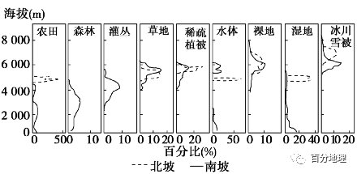   
   
25．南北两坡土地覆被的垂直分异特点是(　　)   
A．相同覆被类型下限的海拔南坡低于北坡   
B．两坡农田出现的最低海拔差近2   
000米   
C．北坡比南坡少三种土地覆被类型   
D．两坡草地分布的海拔相同   
26．下列南坡覆被组合符合垂直分异规律的是(　　)   
A．农田—森林—灌丛—冰川雪被   
B．森林—草地—湿地—冰川雪被   
C．农田—灌丛—裸地—冰川雪被   
D．森林—灌丛—草地—冰川雪被   
<span style="color: rgb(255, 0, 0);">25.A由图可知，相同覆被类型下限的海拔南坡低于北坡，A项正确；北坡农田出现的最低海拔约为4 500米，南坡农田出现的最低海拔在500米以下，二者相差近4 000米，B项错误；北坡比南坡少森林、灌丛两种覆被类型，C项错误；南坡草地海拔下限低于北坡，D项错误。</span>   
<span style="color: rgb(255, 0, 0);">26.D海拔从低处至高处，热量和降水都发生了变化。从图中可以看出，农田与森林的分布高度大体一致，二者不符合垂直分异规律，A项错误；裸地与冰川雪被的分布高度大体一致，二者亦不符合垂直分异规律，C项错误；湿地分布高度低于草地，B项错误；森林—灌丛—草地—冰川雪被，是由低到高分布的，D项正确。</span>   
(2021·山东济宁一模)阿尔泰山拥有较丰富的垂直自然景观，是具有全球意义的生物多样性的中心区域之一，同时是许多特有、濒危动植物的主要分布区和避难所。复杂的地形地貌、不同的气候条件和多种多样的土壤为各种植物生存和发展提供了良好条件。两河源自然保护区位于阿尔泰山东南隅，图a示意该保护区垂直植被带谱，图b示意珍稀濒危保护植物在各海拔段的丰富度。据此完成27～28题。   
   
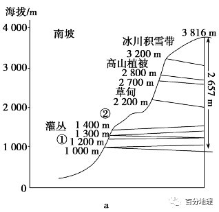   
   
   
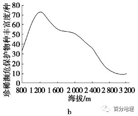   
   
27．图中①②植被类型分别为(　　)   
A．山地草原、山地针阔混交林   
B．山地荒漠、山地草原   
C．山地针阔混交林、山地草原   
D．山地草原、山地荒漠   
28．珍稀濒危保护植物丰富度最高的地段(　　)   
A．与低海拔地段相比，降水较少，光照充足   
B．与高海拔地段相比，蒸发较弱，土壤湿度大   
C．与低海拔地段相比，降水较多，土壤有机质丰富   
D．与高海拔地段相比，气温较高，终年无积雪覆盖   
<span style="color: rgb(255, 0, 0);">27.A①位于海拔1000米左右，其上部为灌丛植被，所以①应为山地草原，而山地荒漠出现的海拔应该更低，山地针阔混交林出现的海拔应更高，B、C错；②位于海拔2000米左右，其下部为灌丛植被，上部为草甸植被，结合所学地理知识可知，阿尔泰山大致呈西北—东南走向，地处中纬西风带，随着海拔的升高，水分条件呈现先增多后减少的趋势，②海拔范围水分条件较好，适合森林植被的生长，应为山地针阔混交林，A正确，D错。</span>   
<span style="color: rgb(255, 0, 0);">28.C读图可知，珍稀濒危保护植物丰富度最高地段的海拔约为1200米。与低海拔地段相比，该海拔地段适合灌丛等植被的生长，降水相对较多，植被覆盖率相对较高，枯枝落叶相对较多，同时，气温相对于低海拔地段低，有机质分解速度相对较慢，土壤有机质丰富，A错，C对；与高海拔地段相比，该地段海拔更低，气温更高，蒸发更强，B错；与高海拔地段相比，该地段气温较高，但该区域冬春季节气温低，冬季依然存在积雪覆盖，D错。</span>   
29.(2021·湖南长沙长郡中学联考)阅读图文材料，完成下列要求。   
伊犁河谷草原辽阔，草场随山地海拔不同具有分带性，牧民随季节的变化而转移草场放牧，称为转场。草原上花草丰盛，蜜源植物十分丰富，3～9月各种鲜花次第开放，是发展养蜂的天然圣地。这里有140多种山花草被，具有独特的中药保健价值的花草就达76种。新疆新源县境内的那拉提大草原(图中A附近区域)选择养殖黑蜂品种，此品种个头大，抗病、抗灾害性强，比较抗寒，适合山区寒冷天气，春季产卵能力强，采蜜量大，每到放蜂季节，蜂农为了“追花夺蜜”，往往要不停地迁徙放蜂。2015年2月10日，农业部(现农业农村部)批准对“那拉提黑蜂蜂蜜”实施国家农产品地理标志登记保护。下图为伊犁河谷等高线地形图(单位：米)。   
   
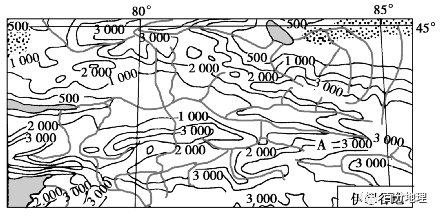   
   
(1)根据伊犁地理环境，描述放蜂人“追花夺蜜”的蜂房的分布规律。   
(2)比较迁徙放蜂和山地牧场转场的差异。   
(3)图中A所在新源县为黑蜂自然保护区，分析选择该区域的地理原因。   
<span style="color: rgb(255, 0, 0);">【答案】(1)蜂房成点状分布；3～5月，蜂房主要分布在河谷地区(海拔低，春季气温回升，鲜花盛开)，6～9月河谷和海拔较高的山坡上均有分布(河谷地区不同季节有不同的鲜花，同一种植物花期随海拔升高逐渐推迟)。   
(2)迁徙放蜂的时间主要在3～9月，山地牧场转场全年都有；迁徙放蜂不同的季节可以在相同的海拔利用不同花期的鲜花放蜂，山地牧场随季节变化在不同海拔不断转场；迁徙放蜂和山地放牧向高海拔转场时，迁徙放蜂时间比山地转场早；迁徙放蜂是为了追逐鲜花，山地转场放牧是为了利用和保护草场资源。   
(3)A所在地在河流上游，人类活动少，环境污染少；海拔较高，气温低，黑蜂抗寒能力强，其他蜂群难以存活；等高线密集，地形较陡，有利于防止外来放蜂人进入，保护黑蜂纯种。   
【解析】第(1)题，“追花夺蜜”说明蜂房是分布在鲜花盛开的地方。根据材料信息“草场随山地海拔……蜜源植物十分丰富”，所以放蜂人的蜂房成点状分布。3～5月，低海拔的鲜花先开放，蜂房主要分布在低海拔的河谷地带；6～9月高海拔的山地上鲜花也开放，蜂房在河谷和高海拔山地都有分布。第(2)题，可以从时间、分布、目的等角度进行分析。时间：迁徙放蜂主要在3～9月，山地牧场全年各个季节都需要转场；迁徙放蜂的迁徙时间要早于山地放牧向高纬度转场时间。分布：根据上题分析，迁徙放蜂不同的时间可在同一海拔进行，山地牧场随季节的不同在不同海拔不断转场。目的：迁徙放蜂是为了追逐鲜花，山地牧场转场放牧是为了合理利用草场。第(3)题，原因是人类活动少，影响小，环境污染少；海拔高，气温低，能适应低温环境的黑蜂能够存活，其他蜂类难以存活；地形条件可以防止外来放蜂人进入，保护黑蜂种群的纯度。</span>