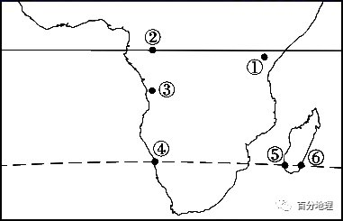

# 微专题之074 从产业结构角度分析区域发展

```
本专题摘自“百分地理”公众号，如有侵权请告之删除，谢谢。联系hhwxyhh@163.com
```

------
   

（2022·全国·高三专题练习）   
读下图，完成下面小题。   
   
   
   
1．图中岛屿两侧自然带的差异体现了（  ）   
A．从赤道到两极的地域分异   
B．从沿海到内陆的地域分异   
C．垂直地域分异   
D．非地带性规律   
2．下列地理现象的成因与①自然带成因相同的是（  ）   
A．撒哈拉沙漠直逼西海岸   
B．巴塔哥尼亚沙漠   
C．澳大利亚东北部的热带雨林带   
D．南半球苔原带缺失   
3．①自然带的成因与下列哪些因素有关（  ）   
①纬度②暖流③东南信风④地形⑤东北信风   
A．①②③   
B．②③④   
C．②④⑤   
D．①②⑤   
<span style="color: rgb(255, 0, 0);">1．D根据经纬度及岛屿的轮廓判断，该岛为马达加斯加岛。该岛东部受马达加斯加暖流、东南信风迎风坡及地形影响，形成了热带雨林带；西部位于东南信风的背风坡形成了热带草原带，体现了非地带性现象，D项正确；从赤道向两极的地域分异是南北方向上的规律性变化，从沿海向内陆的地域分异为东西方向上的规律变化，垂直地域分异为垂直方向上的植被变化，ABC项错误。</span>   
<span style="color: rgb(255, 0, 0);">2．C澳大利亚东北部受到赤道低压带的影响，位于东南信风的迎风坡，多地形雨，沿岸有东澳大利亚暖流经过，增温增湿，形成了热带雨林带，与马达加斯加岛东部的自然带成因相似，C项正确；撒哈拉沙漠直逼非洲西海岸，主要是受寒流的影响，A项错误；巴塔哥尼亚沙漠居安第斯山背风位置，降水少，B项错误；南半球苔原带缺失，是由于海陆分布因素，D项错误。</span>   
<span style="color: rgb(255, 0, 0);">3．B①自然带为马达加斯加岛东部的热带雨林带，其成因主要是由于东部地处来自印度洋的湿润的东南信风的迎风坡，受地形抬升，多地形雨；东部附近有马达加斯加暖流经过，起到增温增湿作用，②③④正确，B项正确，纬度低，获得的太阳辐射多，气温高，但不是该地自然带成因的主要影响因素，①⑤错误。</span>   
（2022·全国·高三专题练习）   
读某地区图，完成下面小题。   
   
   
   
4．图中M山地南、北两侧山麓地带的自然带（  ）   
A．均为热带草原带   
B．北侧为热带雨林带，南侧为热带草原带   
C．均为热带荒漠带   
D．北侧为热带草原带，南侧为热带雨林带   
5．M山地北侧山麓地带自然带的分布体现了（  ）   
A．由赤道到两极的地域分异规律   
B．山地垂直地域分异规律   
C．非地带性现象   
D．从沿海向内陆的地域分异规律   
<span style="color: rgb(255, 0, 0);">4．B图中的海陆轮廓，可以判断出该地区为中美地峡，该地区受赤道低气压带和信风带的交替控制。但由于M山的北侧为东北信风的迎风坡，且还有暖流流过，终年降水较多，形成了热带雨林气候，形成的自然带为热带雨林带；而M山地的南侧是东北信风背风坡，降水少属热带草原气候，形成了热带草原带，B选项正确。排除A、C、D选项。故选B。</span>   
<span style="color: rgb(255, 0, 0);">5．C根据上题可知，M山地北侧山麓地带为热带雨林带，该分布范围已经超过了纬度地带性规律的范围，A项错误；山麓的自然带不属于山地的垂直地域性分异规律，B项错误；此处热带雨林带是由于山脉北侧位于东北信风的迎风坡，降水丰富，且受沿岸暖流影响而形成的，属于非地带性现象，C项正确、D项错误。选择C。</span>   
（2022·湖南·模拟预测）中国绿洲胡杨林分布面积及数量均为世界第一，其生长期一般在3-10月，与当地均温有很大的相关性。下图为中国绿洲胡杨林生长期与均温的相关分析图，读图完成下面小题。   
   
   
   
6．中国胡杨林的分布体现了（  ）   
A．整体性   
B．经度地域分异规律   
C．纬度地带性   
D．非地带性   
7．中国绿洲胡杨林（  ）   
A．生长期起始日与3月均温呈正相关   
B．生长期终止日与10月均温呈正相关   
C．生长期天数与3-10月均温呈负相关   
D．生长期起止日与气温相关性小   
8．柴达木地区胡杨林的生长期与3月均温相关系性最低，原因是该地（  ）   
A．起始日早   
B．水源充足   
C．光照充足   
D．海拔较高   
<span style="color: rgb(255, 0, 0);">6．D中国胡杨林的分布主要在局部地区，没有沿着纬线或者经线分布，体现为非地带性分布。故选D。</span>   
<span style="color: rgb(255, 0, 0);">7．B3月均温越高，生长开始越早，日期的数值越小，生长期起始日与3月均温呈负相关，A错误；10月均温越高，生长结束越晚，日期的数值越大，生长期终止日与10月均温呈正相关，B正确；从题中可看出，生长期与3-10月的均温有很大的相关性，且呈正相关，C、D错误。故选B。</span>   
<span style="color: rgb(255, 0, 0);">8．D生长期与当地均温相关性很大，但柴达木盆地位于我国地势的第一级阶梯上，海拔高，气温相对较低，因此3月均温与生长期相关系数低，D正确。与起始日早、水源充足、光照充足关系不大，ABC错误。故选D。</span>   
（2022·全国·高三专题练习）   
读图，完成下面小题。   
   
   
   
9．图示六处自然带形成过程中，受非地带性因素干扰最大的是（  ）   
A．③、④两地   
B．①、④两地   
C．②、⑤两地   
D．①、⑥两地   
10．①、③、⑤三地气候（  ）   
A．类型相同，成因不同   
B．类型不同，成因不同   
C．类型不同，成因相同   
D．类型相同，成因相同   
<span style="color: rgb(255, 0, 0);">9．D读图可知，根据图中序号分布位置，②③④依次是热带雨林带、热带草原带、热带荒漠带，符合地带性规律；①地处高原、⑤地处背风坡，都受地形影响，形成热带草原带，主要是受非地带性因素影响；⑥是热带雨林带，形成原因是地处从海洋吹来的东南信风迎风坡，多地形雨，且沿岸暖流增温增湿作用，形成高温多雨的热带雨林气候，与赤道低气压带控制无关，主要是非地带性因素的影响形成的，ABC错误，D对。</span>   
<span style="color: rgb(255, 0, 0);">10．A图中①③⑤两地的气候都是热带草原气候，但①是因海拔高形成的，属于非地带性因素；⑤地处背风坡，受地形影响，属于非地带性；③是位于信风带和赤道低压带的交替控制而形成，符合地带性规律形成的。所以成因不同，A对。BCD错。</span>   
（2022·全国·高三专题练习）   
深秋，金黄色的银杏树叶装扮杭州大地。因为叶绿素是一种很容易受到温度改变而分解的物质，而叶黄素、胡萝卜素等则较稳定。到了秋季树叶中的叶绿素因为降温而分解，绿色退去，叶黄素、胡萝卜素留下来呈现黄色，完成下面小题。   
11．杭州城区银杏树叶全部变色比郊区推迟5天左右，这种差异的原因是(   
)   
A．从赤道向两极的分异规律   
B．非地带性分异   
C．从沿海向内陆的分异规律   
D．城区绿化管理良好   
12．下图中四幅图为银杏全部变色日期等候线图，等候线是指同一日子有同一物候(如桃花始花开、燕子来等)的地点连成的一条线。图示地区银杏全部变色日期等候线分布正确的是(   
)   
A．   
   
   
B．   
   
   
C．   
   
   
D．   
   
   
<span style="color: rgb(255, 0, 0);">11．B杭州城区银杏树叶全部变色比郊区推迟5天左右，是因为受热岛效应的影响，城区气温比郊区高，属于非地带性分异规律，反映小范围内的特征，B对；从赤道向两极的分异规律、从沿海到内陆的分异规律体现的地带性分异规律，是较大尺度范围内的特征，AC错，银杏树叶的变色主要受气温的影响，和绿化管理无关，故D错误，所以该题选B。</span>   
<span style="color: rgb(255, 0, 0);">12．B银杏树叶变色和温度有关。由于广西、贵州等地所在海拔较高，比同纬度其他地区气温相对较低，所以等候线向低纬度突出；广东、福建等地位于沿海地区，温度较高，所以等候线向高纬度突出，ACD错误，故选择B。</span>   
（2021·全国·高二课时练习）   
读“某种气候类型在甲、乙两地区的分布图”，完成下面小题。   
   
   
   
13．图中阴影部分与同纬度非阴影部分的气候类型不同的原因是（  ）   
A．大气环流的影响形式不同   
B．沿岸洋流性质不同   
C．海陆位置不同   
D．地形、地势不同   
14．下列地区中与图中阴影部分气候类型相同，在成因上属于非地带性因素影响形成的是（  ）   
A．巴西高原东南部沿海地带   
B．佛罗里达半岛   
C．澳大利亚大陆西北部   
D．加里曼丹岛   
<span style="color: rgb(255, 0, 0);">13．D从两地经纬度可看出甲地位于非洲，乙地位于南美洲，两阴影部分均位于赤道附近形成热带雨林气候。东非高原因地势较高形成热带草原气候，南美洲西部因高达山地形成高原山地气候，因此非阴影区不是热带雨林气候的主要原因是地形、地势不同，D正确；都处于赤道低气压控制，A错误；与沿岸洋流无关，B错误；都地处沿海区域，C错误。故选D。</span>   
<span style="color: rgb(255, 0, 0);">14．A世界上非地带性形成的雨林气候区有马达加斯加岛的东部，巴西高原的东南部和中美地峡，澳大利亚的东北部。巴西高原东南部沿海地带离赤道较远但由于位于东南信风的迎风坡再加上巴西暖流的影响，形成了热带雨林气候，A正确，佛罗里达半岛主要属于亚热带季风性湿润气候，澳大利亚大陆西北属于热带草原气候，加里曼丹岛属于热带雨林气候，都属于地带性因素的影响，BCD错误。故选A。</span>   
（2021·全国·高三专题练习）   
秦岭－大巴山是中国地理的天然界限，区内山高谷深，植被分异明显，图1示意秦岭－大巴山部分区域。图2示意秦岭太白山、大巴山区神农架和白水江自然保护区垂直带谱结构，据此完成下面小题。   
   
   
   
   
   
   
15．秦岭－大巴山对气流的屏障作用促进了自然植被的（  ）   
A．南北分异   
B．垂直分异   
C．东西分异   
D．非地带性   
16．山体效应是指隆起山体对其内部具有明显的增温作用，其对林线、雪线高度产生影响。下列地点受山体效应影响最大的是（  ）   
A．神农架南坡   
B．神农架北坡   
C．太白山南坡   
D．白水江自然保护区   
17．从植被垂直分布特征来看，大巴山与秦岭相比可能更适合作为（  ）   
A．季风区与非季风区的界线   
B．湿润地区与半湿润地区的界线   
C．北亚热带与暖温带的界线   
D．长江流域与黄河流域的分水岭   
【答案】<span style="color: rgb(255, 0, 0);">26．A27．D28．C</span>   
<span style="color: rgb(255, 0, 0);">15．A秦岭--大巴山脉为东西走向，对暖湿的东南季风产生阻碍作用，导致南北两侧降水和热量出现差异，形成南北分异，BCD错误，故选A。</span>   
<span style="color: rgb(255, 0, 0);">16．D根据材料关键词句“山体降起对山体内部有明显的增温作用”，再根据图表，白水江自然保护区林线上限最高，且海拔最高，隆起山体对内部的增温作用最明显，ABC错误，故选D。</span>   
<span style="color: rgb(255, 0, 0);">17．C神农架和白水江自然保护区属于大巴山，太白山属于秦岭，根据图表大巴山有亚热带常绿阔叶林分布，而秦岭则没有亚热带植被分布，植被体现出来的差异来源于温度的差异，ABD错误，故选C。</span>   
下图为美国西部某山谷示意图，两侧山坡植被密度有明显差异。据此完成1～2题。   
   
   
   
18．与乙坡相比，甲坡植被稀疏的原因是(　　)   
A．位于山地北坡，水汽到达少，水分少   
B．位于山地北坡，太阳辐射强，蒸发量大   
C．位于山地南坡，水汽到达少，水分少   
D．位于山地南坡，太阳辐射强，蒸发量大   
19．甲、乙两坡自然景观的差异反映了(　　)   
A．由赤道到两极的分异规律   
B．从沿海向内陆的分异规律   
C．垂直地域分异规律   
D．地方性分异规律   
<span style="color: rgb(255, 0, 0);">18.D与乙坡相比，甲坡植被稀疏的原因是位于山地南坡，谷地的北坡，是阳坡，太阳辐射强，蒸发量大，水分条件差。乙坡位于山地北坡，谷地的南坡，是阴坡，蒸发量小，水分条件较好。</span>   
<span style="color: rgb(255, 0, 0);">19.D甲、乙两坡自然景观的差异是局地小范围特征，反映的是地方性分异规律。由赤道到两极的分异规律、从沿海向内陆的分异规律、垂直地域分异规律都是地带性分异规律。</span>   
(2021·山东滨州一模)白河属于黄河的一级支流，蜿蜒曲折，河床起伏小且较宽阔，河湾迁移较频繁，基本无人为干扰。某科研团队于某年夏季在白河中游某段进行河湾迁移调查，发现河湾凸岸从凸岸内侧(西南方向)到外侧(东北方向)依次有多种自然景观呈条带状环绕凸岸(见下图)分布，植被的分布情况也隐含了河湾迁移的信息。据此完成20～22题。   
   
   
   
20．图中的自然景观带分别是(　　)   
A．①草本植被、②湿生植被、③灌木植被   
B．①湿生植被、②草本植被、③灌木植被   
C．①湿生植被、②灌木植被、③草本植被   
D．①灌木植被、②草本植被、③湿生植被   
21．图示河流凸岸灌木树龄的分布规律是(　　)   
A．从西南侧向东北侧灌木树龄逐渐增加   
B．从西南侧向东北侧灌木树龄逐渐减小   
C．从东南侧向西北侧灌木树龄逐渐增加   
D．从东南侧向西北侧灌木树龄逐渐减小   
22．科研团队计划研究该处河湾迁移速率，可测算(　　)   
A．同龄灌木与凸岸顶端的距离   
B．不同龄的灌木与凸岸顶端的距离   
C．同龄草本植物与凸岸顶端的距离   
D．不同龄草本植物与凸岸顶端的距离   
<span style="color: rgb(255, 0, 0);">20.D砾石边滩距离河道近，所以边滩地区最初耐水植被发育，后期随着植被对泥沙的阻挡，加剧了凸岸的沉积，河道继续向西南方向迁移，砾石边滩只有洪水期才能淹没，使得多年生长的草本植物在此分布。土层进一步加厚，土壤含水量越来越少，才能生长灌木植被。故凸岸从内侧向外侧依次呈现③湿生植被、②草本植被、①灌木植被，故D正确。</span>   
<span style="color: rgb(255, 0, 0);">21.A由材料和上题分析可知，河流凸岸以沉积作用为主，白河河道凸岸内侧逐渐向西南方向迁移延伸，使得东北方向滩地形成年代最早，植被由湿生植被—草本植被—灌木植被演替，凸岸外侧最早出现灌木植被，然后灌木植被逐渐向西南方向推进，所以东北方向一侧的灌木植被树龄最长，西南方向一侧树龄最短，形成了凸岸灌木树龄自西南向东北逐渐增加的分布规律，故A正确。</span>   
<span style="color: rgb(255, 0, 0);">22.B由材料可知，凸岸不同树龄灌木的分布隐含了河湾迁移的信息，白河东北方向灌木出现年代最早，随着河道向西南方向迁移，出现的灌木依次推迟，根据灌木树龄与凸岸顶端的距离可估算迁移速率。故B正确。</span>   
(2021·山东卷)下图示意大兴安岭中段东坡自山顶到山麓洪积扇的植被垂直分布，图中三类草原水分状况不同。据此完成23～24题。   
   
   
   
23.图中三类草原的水分条件由好到差依次为(　　)   
A.草原Ⅱ、草原Ⅰ、草原Ⅲ   
B.草原Ⅱ、草原Ⅲ、草原Ⅰ   
C.草原Ⅲ、草原Ⅰ、草原Ⅱ   
D.草原Ⅲ、草原Ⅱ、草原Ⅰ   
24.平台到察尔森出现草原Ⅱ的主要影响因素是(　　)   
A.东南季风   
B.局地环流   
C.山地坡度   
D.土壤肥力   
<span style="color: rgb(255, 0, 0);">23.C草原Ⅲ位于山麓洪积扇的扇缘,根据洪积扇特征,草原Ⅲ地势低洼,沉积物粒径小,地下水埋藏浅,且易出露,水分条件好;察尔森以上草原Ⅰ紧挨着森林区,森林区降水较多,土壤湿度大,故草原Ⅰ可以接收来自森林带的径流水,水分条件较好;草原Ⅱ水分条件最差。</span>   
<span style="color: rgb(255, 0, 0);">24.B大兴安岭处于季风区与非季风区的分界线,而且察尔森以东草原Ⅱ、草原Ⅰ、草原Ⅲ分布地区据图中横纵坐标分析,山地坡度非常小,坡度差距不大,东南季风对它们的影响都很小。森林、草原植被分布差异的主要影响因素是土壤湿度,而不是土壤肥力。冬春季时,草原Ⅱ区处于冬季风背风坡,焚风效应影响明显,与草原Ⅰ区、草原Ⅲ区相比,草原Ⅱ区水分收入最少,水分条件最差,故平台到察尔森出现草原Ⅱ的主要影响因素是局地环流。</span>   
(2021·浙江1月选考)洞庭湖区水域与陆地交错，从陆地到水底分布着森林、灌丛、草甸和水生植物等植被类型。据此完成25～26题。   
25.洞庭湖区的植被分布，反映了自然地理环境的(　　)   
A.垂直分异规律   
B.地方性分异规律   
C.纬度地带分异规律   
D.经度地带分异规律   
26.影响洞庭湖区植被差异的主要因素有(　　)   
①地形　②水分　③热量　④土壤   
A.①②   
B.②③   
C.③④   
D.①④   
<span style="color: rgb(255, 0, 0);">25.B根据材料可知，洞庭湖区的植被分布属于局部的差异，属于小尺度的地方性分异规律，故选B。</span>   
<span style="color: rgb(255, 0, 0);">26.A从陆地到水底，地形从出露地表到隐于水下，水分由少到多，这是导致洞庭湖区植被差异的主要因素，故选A。</span>   
(2021·山西3月适应性测试)肯尼亚山是东非大裂谷最大的死火山，位于肯尼亚中部的赤道上，最高海拔5   
199米。近年来，中科院中—非联合研究中心的科学家对肯尼亚山的生物多样性进行了研究。下图示意肯尼亚山植被带的俯视分布。据此完成27～28题。   
   
   
   
27.肯尼亚山植被带的分布特点是(　　)   
A.基本呈半环状分布   
B.低海拔处不同坡向差异明显   
C.东坡比西坡带谱多   
D.随海拔升高植被带数量减少   
28.随海拔升高不同坡向植被带差异减小的原因是(　　)   
A.山体面积减小   
B.人类干扰减少   
C.水分交换减少   
D.热量差异减小   
27.B图示低海拔的东侧、东南侧为潮湿森林带，西侧为干旱森林带，故B正确。图示自然带基本呈现环状分布，且东、西坡自然带数量相同，随海拔升高自然带发生变化，但数量不变。   
28.A随海拔升高，山体面积不断减小，不同坡向间的水热交换更便利，从而导致水热条件差异变小，故植被带差异减小，即A正确。人为干扰一般影响低海拔地区，对较高海拔影响一般不大；山地垂直自然带分布是受水热两个因素共同影响的。   
29.（2022·辽宁·大连二十四中模拟预测）阅读图文材料，回答下列问题。   
云林是位于高海拔地区的生态系统。多米尼加的中央山脉海拔2000m附近分布有云林植被，植被区内生物多样性丰富且特有物种较多。飓风过境会对云林植被造成破坏，伴有雷暴的强对流天气时有发生，二者都会提高林火发生的频率。该国北部的普拉塔港是全国第二大港。图1示意普拉塔港月均气温与降水变化，图2示意多米尼加位置及云林分布区。   
   
   
   
   
   
   
(1)简述该国云林分布区生物多样性丰富且独特的原因。   
(2)说明普拉塔港11月——次年2月降水量大，而6月——9月降水量较少的原因。   
(3)从可燃物数量与极端天气的角度，推测飓风与强对流天气可能提高林火发生频率的理由。   
<span style="color: rgb(255, 0, 0);">【答案】(1)气候（水热）条件适宜，植被丰富，食物与水源充足；海拔高差大，垂直差异大；人迹罕至，受人类影响小。</span>   
<span style="color: rgb(255, 0, 0);">(2)11-次年2月，东北信风带来海洋水汽，沿岸有暖流影响，迎风坡产生降水多；6-9月受赤道低压北部边缘影响，对流较弱，降水量较少。</span>   
<span style="color: rgb(255, 0, 0);">(3)飓风经过，植被掉落枝叶，使可燃物数量增加；强对流天气过程中的雷暴天气，雷电击中树木，容易引发林火。</span>   
<span style="color: rgb(255, 0, 0);">【解析】（1）根据该国所处纬度（19.5°N）和等高线地形图可以判断，图中热带云林分布区地处东北信风的迎风坡，降水丰富，水分和热量条件较好，所以植被丰富，食物与水源充足，动物种类丰富。同时该国山地落差大，相对高度大，垂直分异规律明显，形成了不高度的动植物分布；再加上该区域人烟稀少，人类活动对热带云林的破坏性较小，因此该国云林分布区生物多样性丰富；山地地形，与外界交流少，生物物种独特。</span>   
<span style="color: rgb(255, 0, 0);">（2）普拉塔港11月到次年2月降水量大，6月到9月降水量较少，原因主要从大气环流的角度来分析。11月到次年的2月，随太阳直射点南移，气压带和风带也南移，普拉塔港受东北信风的影响，加上沿岸暖流的增温增湿作用，东北信风从海洋带来丰富的水汽，在迎风坡产生降水，所以降水量较大。6月到9月，气压带和风带北移，普拉塔港受赤道低气压带北部边缘的影响，对流较弱，降水量相对较少。</span>   
<span style="color: rgb(255, 0, 0);">（3）飓风与强对流天气可能提高林火发生频率，理由主要从可燃物数量与极端天气的角度来分析，在飓风的破坏作用下，森林植被被摧毁，大量枯枝落叶降落地表，增加了地表可燃物；空气强烈上升，强对流通常和雷暴天气相伴相生，产生雷击，雷电击中树木，容易引发森林大火。</span>   
30.（2021·江西省遂川中学高三阶段练习）阅读图文材料，完成下列要求。   
非洲西部地区濒临几内亚湾和大西洋，因受小尺度环境要素影响自然带表现出特殊的分异现象。下图示意非洲西部地区自然带分布。   
   
   
   
（1）推测图中丁处景观属于地带性还是非地带性现象，分析其原因。   
（2）甲自然带在大西洋沿岸向北延伸，就此做出合理解释。   
（3）阐释丙地沙漠的存在对临近海洋渔场形成的作用。   
<span style="color: rgb(255, 0, 0);">【答案】（1）非地带性现象。丁地附近海域存在一上升流，表层海水温度较低，对海洋吹来的气流有降温减湿作用，在其影响下，丁地降水较少，形成热带草原景观。</span>   
<span style="color: rgb(255, 0, 0);">（2）一年内较长时间受赤道低气压带和大西洋吹来的西南季风影响，西南季风受几内亚暖流增温增湿作用，饱含水汽，带来丰沛降水，使甲自然带在大西洋沿岸向北延伸。</span>   
<span style="color: rgb(255, 0, 0);">（3）丙地沙漠受东北信风影响的季节，频发沙尘暴；在东北信风携带下，富含矿物养分的沙尘，由陆地吹向西面海洋，并落入海洋，为海洋浮游植物带来营养盐类，利于浮游生物的繁盛，为鱼群提供丰富的饵料，从而形成渔场。</span>   
<span style="color: rgb(255, 0, 0);">【解析】（1）图中甲处景观属于地带性还是非地带性。从图可知，该地有上升流经过，上升流为寒流，对沿岸有降温减湿作用，在其影响下，丁地降水较少，形成热带草原景观，因此，形成与热带雨林景观不同的自然带。</span>   
<span style="color: rgb(255, 0, 0);">（2）从海陆位置、盛行风向等要素角度说明甲自然带在大西洋沿岸向北延伸的原因。该地受赤道低气压带控制，降水多，此外，还受西南季风影响和几内亚暖流增温增湿作用，降水充沛，西南风使降水向北延伸，因此热带雨林带由南向北延伸。</span>   
<span style="color: rgb(255, 0, 0);">（3）从沙尘暴带来营养元素，营养元素与海洋浮游生物的关系入手，阐释丙地沙漠的存在对临近海洋渔场形成的作用。从图可知，丙地位于副热带高气压带与东北信风交替控制的区域，沙漠受东北信风影响，频发沙尘暴；在东北信风吹拂下，富含矿物养分的沙尘，由陆地吹向西面海洋，并落入海洋，为海洋浮游植物带来营养盐类，利于浮游生物的生长与繁殖，为鱼群提供丰富的饵料，从而形成渔场。</span>
