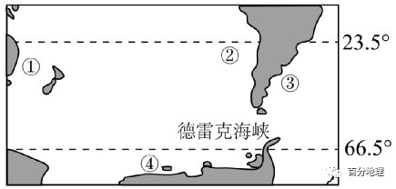
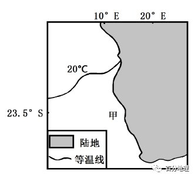

# 微专题之074 从产业结构角度分析区域发展

```
本专题摘自“百分地理”公众号，如有侵权请告之删除，谢谢。联系hhwxyhh@163.com
```

------
   
（2021·贵州·顶效开发区顶兴学校高三阶段练习）下图为南半球局部地区洋流分布示意图。据此完成下面小题。   
   
   
   
1．图中①②③④四处洋流中性质不同的是（  ）   
A．①处洋流   
B．②处洋流   
C．③处洋流   
D．④处洋流   
2．图中①②③④四处洋流的主要影响是（  ）   
A．①处上升补偿流形成渔场   
B．②处海水温度高流向低纬   
C．③处沿岸的气候增温增湿   
D．④处向西方行船逆风逆水   
<span style="color: rgb(255, 0, 0);">1．A根据图示洋流分布位置结合所学知识可知，①处洋流为东澳大利亚暖流，②处洋流为秘鲁寒流；③处洋流为本格拉寒流，④处为西风漂流（寒流）。故性质和其他三个洋流性质不同的为东澳大利亚暖流。故A正确，BCD错误。故答案选A。</span>   
<span style="color: rgb(255, 0, 0);">2．D根据上题可知，①处洋流为东澳大利亚暖流，没有形成渔场，故A错误；②处洋流为秘鲁寒流，海水温度低、流向低纬，故B错误；③处洋流为本格拉寒流，沿岸气候降温减湿，故C错误；④处为西风漂流，向西方行船逆风逆水。故D正确。故答案选D。</span>   
<span style="color: rgb(255, 0, 0);">【点睛】洋流对地理环境的影响：暖流具有增温增湿的作用，寒流具有降温减湿的作用。逆流航行速度慢、能耗高；顺流航行速度快，能耗低。寒暖流交汇处有海雾形成，洋流从北极地区携带冰山南下威胁航海。加快海水净化速度，扩大海洋污染范围。</span>   
（2021·福建宁德·高三期中）近年来的研究发现德雷克海峡内的海冰进退对全球气候变化有重大影响，冰进（海冰较常年增多）会导致德雷克海峡水流通量减少，海峡西侧水位增高，北上水流增加，冰退则相反。下图示意南太平洋附近海域。据此完成下面小题。   
   
   
   
3．德雷克海峡海冰较常年减少时（  ）   
A．赤道向南极输送的热量增加   
B．赤道附近海域东西温差减小   
C．澳大利亚东岸地区降水增加   
D．南美大陆西岸地区水温降低   
4．关于图中洋流对地理环境的影响，下列叙述中正确的是（  ）   
A．洋流①与寒流交汇处，海水搅动，形成渔场   
B．洋流②流经沿岸地区，增温增湿，气候温暖   
C．洋流③受离岸风影响，形成海雾，影响航行   
D．洋流④流经沿岸地区,降温减湿，气候寒冷   
<span style="color: rgb(255, 0, 0);">3．B由材料“冰进（海冰较常年增多）会导致德雷克海峡水流通量减少，海峡西侧水位增高，北上水流增加，冰退则相反”可知，德雷克海峡海冰较常年减少，会导致德雷克海峡水流通量增加，海峡西侧水位降低，北上水流减弱，即秘鲁寒流势力减弱，赤道附近东部水温异常升高，赤道附近海域东西温差减小，B正确，D错误；澳大利亚东岸地区降水会减少，C错误；有西风漂流带相隔，对赤道向南极输送的热量影响不大，A错误。故选B。</span>   
<span style="color: rgb(255, 0, 0);">4．D根据所学知识可知，洋流①为东澳大利亚暖流，没有寒暖流交汇，附近没有大渔场，A错误；洋流②为秘鲁寒流，对流经沿岸起到降温减湿的作用，B错误；洋流③为巴西暖流，处于信风的迎风岸，C错误；洋流④为南极沿岸寒流，对流经沿岸地区，降温减湿，沿岸地区气候寒冷，D正确。故选D。</span>   
<span style="color: rgb(255, 0, 0);">【点睛】厄尔尼诺暖流，是指赤道太平洋东部海域，东南信风减弱，赤道逆流增强，秘鲁寒流减弱，此时出现的海水温度异常增高现象。主要危害：秘鲁沿岸多雨；引起气候反向变化。</span>   
（2021·山东·高三阶段练习）北大西洋暖流将大西洋低纬度表层的高温、高盐水向北输送至高纬度海域，继而下沉形成大西洋深层水团，转而向南流，并在南大西洋副热带海域上升形成一个闭合环流。研究表明，在全球变暖加剧的情况下，会导致这一环流减弱甚至停滞，进而影响全球气候变化。下图示意该环流的流动状况，据此完成下面小题。   
   
   
   
5．导致到达北大西洋高纬海域的表层海水下沉的原因可能是（  ）   
A．吸收热量，温度升高   
B．吸收热量，温度降低   
C．释放热量，温度降低   
D．释放热量，温度升高   
6．该环流减弱甚至停滞可能导致（  ）   
A．热带地区气温降低   
B．欧洲降雪频率增加   
C．全球变暖程度加剧   
D．海洋浮游生物增多   
<span style="color: rgb(255, 0, 0);">5．C海水要下沉，说明海水的密度增大，若是温度造成的话，应该是温度降低，导致海水密度增大而下沉，A、D错误；由材料“北大西洋暖流将大西洋低纬度表层的高温、高盐水向北输送至高纬度海域”可知，北大西洋暖流北上过程中在不断向大气释放热量，使水温降低，密度增大，B错误、C正确。故选C。</span>   
<span style="color: rgb(255, 0, 0);">6．B由材料可知，该环流减弱甚至停滞是由于全球变暖加剧造成的。在全球变暖背景下，温度升高，该环流减弱，则北大西洋高纬度海域的表层海水下沉减弱，海水北上减弱，即墨西哥湾暖流，北大西洋暖流势力减弱，则北大西洋暖流由大西洋低纬度输送至高纬度海域的热量减少，所以大西洋低纬度地区气温不会降低，A错误。由暖流对气候的影响可知，会导致欧洲地区气温降低，则降雪频率会增加，B正确。全球变暖程度加剧是导致该环流减弱甚至停滞的原因而非结果，C错误。北大西洋暖流势力减弱，则对海水的搅动较小，海底的营养物质上泛的少，浮游生物减少，D错误。故选B。</span>   
<span style="color: rgb(255, 0, 0);">【点睛】暖流对沿岸气候有增温增湿作用，寒流对对沿岸气候有降温减湿作用。寒暖流交汇的海区，海水受到扰动，可以将下层营养盐类带到表层，有利于鱼类大量繁殖，为鱼类提供诱饵；两种洋流还可以形成“水障”，阻碍鱼类活动， 使得鱼鱼群集中，易于形成大规模渔场，如纽芬兰渔场和日本北海道渔场；有些海区受离岸风影响，深层海水上涌把大量的营养物质带到表层，从而形成渔场，如秘鲁渔场。</span>   
（2022·江苏·南京市秦淮中学高三阶段练习）读某区域示意图，据此完成下面小题。   
   
   
   
7．图示区域山脉主体走向为（  ）   
A．南北   
B．东西   
C．西北一东南   
D．东北一西南   
8．乙沿海地区渔业资源丰富，下列地区渔场的成因与其相似的是（  ）   
A．我国舟山渔场   
B．日本北海道渔场   
C．加拿大纽芬兰渔场   
D．秘鲁渔场   
<span style="color: rgb(255, 0, 0);">7．C图中河流源头分流之处为分水岭（山脉），结合图中经纬线指示的方向判断，该分水岭走向大致呈西北—东南走向，C符合题意，排除ABD。故选C。</span>   
<span style="color: rgb(255, 0, 0);">8．D根据图中纬度值及递变方向判断，乙沿海地区处于北半球低纬度大陆西海岸，应盛行东北信风，对于乙地而言，东北信风为离岸风，会促使沿岸海域形成上升流，底层营养元素上泛，浮游生物繁盛，鱼的饵料丰富，从而导致当地渔业资源丰富。我国舟山渔场、日本北海道渔场、加拿大纽芬兰渔场，主要是寒流和暖流交汇形成渔场，而秘鲁渔场是上升流形成的渔场，因此与乙地成因相似的渔场是秘鲁渔场，D符合题意，排除ABC。故选D。</span>   
<span style="color: rgb(255, 0, 0);">【点睛】渔场形成条件：（1）大陆架海域，从海面到海底都有较为充分的阳光透射，还有从大陆径流带来和从外海层运来的各种营养物质，是鱼、虾、贝类等经济动物的繁殖、索饵和越冬的良好场所。（2）两种海流交汇的海区，尤其是强大的寒流和暖流交汇的辐聚区，海水搅动，底层营养元素上泛，表层浮游生物繁盛，鱼类饵料丰富，容易形成良好渔场。（3）上升流海域，深层含有营养盐类的海水涌升，表层浮游生物繁盛，鱼类饵料丰富，容易形成良好渔场。（4）近寒带海域，近寒带海洋底层具有异常丰富的营养物质，近寒带海域温度变化大，海水容易产生对流，使得海底营养物质上泛，从而形成渔场。</span>   
（2022·甘肃省张掖中学高三阶段练习）下图示意世界局部地区某季节海平面等压线分布(单位:hPa)。据此完成下面小题。   
   
   
   
9．推测图中海峡两侧表层与400m以下海水的流动方向大致是（  ）   
A．表层自西向东，400m以下自东向西   
B．表层自西向东，400m以下自西向东   
C．表层自东向西400m以下自东向西   
D．表层自东向西，400m以下自西向东   
10．图示季节（  ）   
A．M海域风高浪急   
B．P地盛行东南风   
.C．K附近天气晴朗   
D．N地不易发生山火   
11．M海域渔业资源丰富，主要得益于（  ）   
A．寒暖流交汇   
B．入海河流多   
C．大气降水多   
D．冷海水上泛   
<span style="color: rgb(255, 0, 0);">9．A图示为地中海地区，此海峡为直布罗陀海峡;该季节受高压脊控割，为北半球夏季，气候炎热干燥，降水量小，蒸发量大，导致地中海的盐度比大西洋高，密度大，地中海海平面比大西洋低，故直布罗陀海峡表层海水大致自西向东流400m以下海水大致自东向西流，A正确，BCD错误。故选A。</span>   
<span style="color: rgb(255, 0, 0);">10．A北半球夏季时，M海域受副高控制，风浪小，K附近以晴朗天气为主，根据等压线分布可知，P地吹偏北风;夏季炎热干燥，N地山火火险等级较高。C正确，ABD错误。故选C。</span>   
<span style="color: rgb(255, 0, 0);">11．A据图分析可知M海境有加那利寒流流经，受沿岸地形及岛屿的阻挡，下层含有营养盐类物质的冷海水上泛，浮游生物繁盛，导致鱼类丰富。故主要原因是冷海水上泛，ABC错误，D正确，故选D。</span>   
<span style="color: rgb(255, 0, 0);">【点睛】上升补偿流有秘鲁寒流,西澳大利亚寒流,加利福尼亚寒流,加那利寒流,本格拉寒流,索马里寒流等。</span>   
（2022·浙江·高三阶段练习）下图为某海域表层海水温度分布图。完成下面小题。   
   
   
   
12．图示海域表层海水温度分布及成因说法正确的是（  ）   
A．由南向北递增，纬度越来越高   
B．由近海向外海递增，近岸受寒流影响   
C．由南向北递减，纬度越来越低   
D．由近海向外海递减，近岸受暖流影响   
13．甲海域及沿岸（  ）   
A．植物较稀疏，叶小肉厚   
B．土质较黏重，土壤有机质较少   
C．有大河汇入，盐度较低   
D．盛行东南风，为热带草原气候   
<span style="color: rgb(255, 0, 0);">12．B由所学知识可以判断，该区域为非洲西南部，流经的洋流为本格拉寒流，本格拉寒流为上升补偿流，受离岸风影响，该洋流由近海向外海移动，近岸受寒流影响较大，海水温度由近海向外海递增，B正确，D错误。该海域温度应由南向北递增，纬度越来越低，AC错误。故选B。</span>   
<span style="color: rgb(255, 0, 0);">13．A读图并结合所学知识可知，甲海域及沿岸受副热带高气压带和本格拉寒流影响，形成热带沙漠气候，降水极少，该海域无大河汇入，该地区植被稀疏，为适应当地气候，植被多叶小肉厚，该地区应为沙质土，土质不黏重，A正确，BCD错误。故选A。</span>   
<span style="color: rgb(255, 0, 0);">【点睛】本格拉寒流属于上升补偿流。全球的上升补偿流有秘鲁寒流，西澳大利亚寒流，加利福尼亚寒流，加那利寒流，本格拉寒流，索马里寒流等。上升补偿流的形成原因是海下的深层海水上泛形成的一股寒流。</span>   
（2022·安徽·高三阶段练习）楚科奇海是北冰洋的一个边缘海，面积约59.5万km2，平均深度约77m，一年中只有4个月可以航行，夏季多雾，有鲸鱼和许多海鸟来此栖息。下图示意楚科奇海地理位置及周边地区。据此完成下面小题。   
   
   
   
14．楚科奇海可以通航的月份最可能是（  ）   
A．1月   
B．4月   
C．8月   
D．11月   
15．夏季鲸鱼和许多海鸟到楚科奇海栖息，主要是因为（  ）   
A．冷海水上泛   
B．饵料丰富   
C．降水较多   
D．海冰融化   
16．楚科奇海夏季多雾的主要原因是（  ）   
A．海水温度高   
B．洋流流速快   
C．极地东风风力大   
D．海水温差大   
<span style="color: rgb(255, 0, 0);">14．C据材料及图分析可知，楚科奇海一年中只有在气温高、海冰融化多的季节才可以通航，地处北半球，夏季时可以通航，故楚科奇海可以通航的月份最可能是8月。ABD错误，故选C。</span>   
<span style="color: rgb(255, 0, 0);">15．B夏季受北太平洋暖流的影响，大量温暖的海水经白令海峡流入相对寒冷的楚科奇海，寒暖流交汇处，浮游生物繁盛，饵料丰富，鱼类众多，吸引鲸鱼和许多海鸟前来觅食。ACD错误，故选B。</span>   
<span style="color: rgb(255, 0, 0);">16．D据上题分析可知，寒暖流交汇处，海水温差大，暖流上方的空气相对温暖湿润，寒流上方的空气相对寒冷干燥，易形成海雾。ABC错误，故选D。</span>   
<span style="color: rgb(255, 0, 0);">【点睛】寒暖流交汇处，海水受到扰动，深层营养物质上泛，繁殖了大量浮游生物，为鱼类提供了饵料。</span>   
（2022·北京·高三开学考试）2016年11月，人们在英国北威尔士的海滨沙滩上发现了一只稀有的热带海龟，这种海龟通常生活在墨西哥湾一带。读图完成下面小题。   
   
   
   
17．北威尔士海滨的盛行风向是（  ）   
A．西南风   
B．西北风   
C．东南风   
D．东北风   
18．帮助这只热带海龟万里“奔波”的洋流是（  ）   
A．西风漂流   
B．北大西洋暖流   
C．北太平洋暖流   
D．本格拉寒流   
<span style="color: rgb(255, 0, 0);">17．A北威尔士海滨地处北半球中纬度，受北半球的中纬西风控制，北半球的中纬西风为西南风，所以北威尔士海滨的盛行风向是西南风，A正确，BCD错误。故选A。</span>   
<span style="color: rgb(255, 0, 0);">18．B西风漂流是南半球中纬度海区自西向东运动的洋流，对北半球没有影响，A错误。北大西洋暖流地处大西洋，南接来自较低纬度的墨西哥湾暖流，北到中纬度大西洋东岸，对这只海龟万里“奔波”有很大帮助，B正确。北太平洋暖流位于太平洋，对大西洋热带海龟万里“奔波”没有影响，C错误。本格拉寒流位于南半球非洲西海岸，对北半球热带海龟万里“奔波”没有影响，D错误。故选B。</span>   
<span style="color: rgb(255, 0, 0);">【点睛】洋流对地理环境的影响：1、对全球影响：调节全球热量分布。2、对流经海区的沿岸气候：促进高、低纬度间热量和水分的输送和交换，调节全球热量和水分平衡；暖流对沿岸气候起增温增湿作用，寒流对沿岸气候起降温减湿作用。例如：北大西洋暖流——影响西欧温带海洋性气候；副热带大陆西岸寒流——沿岸形成荒漠环境；3、对海洋生物：寒暖流交汇处饵料丰富，形成著名渔场；上升流将深层营养物质带到表层，形成大渔场。例如：纽芬兰渔场、北海道渔场、秘鲁渔场、我国的舟山渔场加快净化速度；扩大污染范围。4、海洋污染：扩大了污染范围，加快了净化速度。（目前最严重的海洋污染是石油泄漏造成的）。</span>   
（2022·甘肃·靖远县第四中学高三阶段练习）北海道属于温带季风气候，年平均气温8°C，年降水量800～1200mm。与日本大部分区域不同，北海道在夏季几乎未出现梅雨天气。下图示意北海道年等降水量线分布。据此完成下面小题。   
   
   
   
19．北海道年等降水量线未与海岸线平行，主要取决于（  ）   
A．地形   
B．海陆轮廓   
C．洋流   
D．风向   
20．北海道几乎未出现梅雨天气，主要是因为（  ）   
A．寒流减湿作用   
B．大气对流运动弱   
C．纬度较高   
D．寒潮活动频繁   
21．北海道夏季多海雾的区域及原因分别是（  ）   
①岛屿东侧海域   
②岛屿西侧海域   
③北太平洋暖流流经   
④日本暖流和千岛寒流交汇   
A．①③   
B．①④   
C．②③   
D．②④   
<span style="color: rgb(255, 0, 0);">19．A读图可知，北海道日本海沿岸受冬季风影响降水多，太平洋沿岸受夏季风影响降水较多，鄂霍次克海沿岸地处冬夏季风的背风坡，降水少，降水量线的分布受地形影响，故等降水量线未与海岸线平行，A正确，BCD错误。故选A。</span>   
<span style="color: rgb(255, 0, 0);">20．C梅雨天气是春夏之交，来自西北太平洋副热带高压的暖空气与北方的冷空气相遇，形成的一种连续降水的连阴雨天气的过程，主要影响26°～34°N之间的亚洲东部地区。北海道由于纬度较高，冷暖气团势力相差较大，故几乎不出现梅雨天气，C正确，北海道受暖流影响，A错误；大气对流运动弱，寒潮活动频繁与梅雨无关，BD错误。故选C。</span>   
<span style="color: rgb(255, 0, 0);">21．B北海道东部太平洋海域，是日本暖流和千岛寒流的交汇处，夏季千岛群岛及附近海面盛行南风和西南风，日本暖流所携带的大量暖湿气体，随风飘送到冷水海面的上空，形成了大量的雾气，①④正确，②③错误。B正确，ACD错误。故选B。</span>   
（2022·辽宁省实验中学东戴河分校高三阶段练习）火地岛是世界上除南极大陆以外最南端的陆地，其南部的德雷克海峡以狂涛巨浪闻名于世，号称“杀人海峡”，但夏季穿过该海峡相对安全。下图示意德雷克海峡位置及海峡里3个地点（a、b、c）的不同水深及流速统计。据此完成下面小题。   
   
   
   
22．图中德雷克海峡的洋流（  ）   
A．南部洋流流速慢，深层海水流速快   
B．北部洋流流速慢，深层海水流速慢   
C．南部洋流流速快，表层海水流速慢   
D．北部洋流流速快，表层海水流速快   
23．导致德雷克海峡成为“杀人海峡”的根本因素是（  ）   
A．风力   
B．海陆位置   
C．流速   
D．温度差异   
24．夏季船只穿过德雷克海峡相对安全，其根本原因是（  ）   
A．温差小、风力小   
B．气压高、风浪小   
C．洋流流速缓慢   
D．海冰阻挡作用小   
<span style="color: rgb(255, 0, 0);">22．D据图表分析可知，a、b、c3个地点北部洋流流速快，南部洋流流速慢；表层海水流速快，深层海水流速慢，D正确；ABC的描述都不正确。故选D。</span>   
<span style="color: rgb(255, 0, 0);">23．B据图分析可知，西风漂流在德雷克海峡受南美大陆南部和南极半岛的阻挡，狭管效应明显，导致狂涛巨浪，故其根本因素是海陆位置，B正确；风力、流速、温度差异都不是根本原因，ACD错误。故选B。</span>   
<span style="color: rgb(255, 0, 0);">24．A夏季南半球气温较高，德雷克海峡南北温差小，水平气压梯度力小，盛行西风势力较弱，海上风浪较小，船只穿过德雷克海峡相对较安全，A正确；气压高、风浪小；洋流流速缓慢；海冰阻挡作用小都不是根本原因，BCD错误。故选A。</span>   
<span style="color: rgb(255, 0, 0);">【点睛】德雷克海峡位于南美洲最南端和南极洲南设得兰群岛之间，紧邻智利和阿根廷两国，是大西洋和太平洋在南部相互沟通的重要海峡，也是南美洲和南极洲的分界的地方。在巴拿马运河开凿之前，德雷克海峡是沟通太平洋和大西洋的重要海上通道之一。 连接太平洋和大西洋的德雷克海峡，是世界上最宽的海峡。它位于南美洲南端与南极洲的南设得兰群岛之间，东西长约300千米，南北宽达970千米。德雷克海峡是世界各地到南极洲的重要通道。由于受极地旋风的影响，海峡中常常有狂风巨浪，有时浪高可达10-20米。从南极滑落下来的冰山，也常常漂浮在海峡中，这给航行带来了困难。</span>   
（2021·福建·三明一中高三期中）最近，海洋科学家在格陵兰岛沿海的航线上测量海水流动的速率，发现这里水流汹涌，巨大的海水从海底峭壁倾泻而下，形成了一条海底瀑布。据此完成下面小题。   
25．推测海底瀑布形成的过程是（  ）   
①冰岛和格陵兰岛之间的海水存在温度差异   
②冷海水受海底山脊阻挡不断蓄积   
③海水溢出山脊   
④冷海水下沉到海底向热海水扩散   
A．②①③④   
B．①④②③   
C．①②④③   
D．③①④②   
26．海底瀑布倾下的冷水会与较热的水混合并很快扩散、由此（  ）   
A．促使北极海区低温海水向赤道附近流动   
B．对维持深海海水的化学成分平衡没有作用   
C．不会影响世界气候变化和生物生长   
D．使陆地表面发生剧烈变化   
<span style="color: rgb(255, 0, 0);">25．B海底瀑布的形成原因是海水的水温不同导致了密度差异。温度低的海水密度较大，会向下流到底层，故海底瀑布的首要过程为海水的温度差异，①在最前；有了温度差异之后冷海水下沉到海底，又由于冷热海水之间有密度差异，形成密度流，冷海水向热海水扩散，④在后；在海水运动过程中受到山脊阻挡，不断蓄积，当冷海水不断积聚，超过山脊之后便会漫过山脊，向下倾泻形成瀑布。故瀑布的形成顺序为：①④②③。故选B。</span>   
<span style="color: rgb(255, 0, 0);">26．A高纬度地区海水温度低，密度大；赤道地区海底水温高、密度小。海水从高密度区流向低密度区，虽然冷海水与较热的海水混合，但是其水温依然低于赤道地区，海水继续向赤道地区流动，A对；冷海水在运动过程中伴随着化学物质的迁移，B错；冷热海水的交换，促进了不同区域的热量平衡，也影响着气候与生物生长，C错；海底的海水运动并没有引发表层海水的大规模运动，对陆地表面的影响很小，D错。故选A。</span>   
<span style="color: rgb(255, 0, 0);">【点睛】海底瀑布的产生是海水对流运动的直接结果，大块流体的运动驱使了热量的转移。海底瀑布乃是由海底垂直地形引起的海水下降流动，它在维持深海海水的化学成分和水动态平衡中起着决定性的作用，并且影响着世界气候变化和生物生长。</span>   
（2021·河南·高三阶段练习）感热通量是指由于温度不同而引起的大气与下垫面之间发生的热交换。下图示意某年7月份北印度洋感热通量分布状况（单位：卡／平方厘米），正值代表热量由下向上传递，负值代表热量由上向下传递。据此完成下面小题。   
   
   
   
27．北印度洋西部沿海地区感热通量数值的绝对值较大的主要原因是（  ）   
A．夏季气温较高，热量传递快   
B．底层海水上泛，海气温差大   
C．高纬海水流经，海水温度低   
D．赤道暖流流经，海水升温快   
28．此时段北印度洋海气感热通量的特点会加强海面的（  ）   
A．偏北风   
B．偏南风   
C．偏西风   
D．偏东风   
<span style="color: rgb(255, 0, 0);">27．B据图可知，7月份北印度洋西部沿海地区感热通量数值的绝对值较大，但属于负值区域，热量由上向下传递，说明下垫面温度低于大气温度，主要是由于7月份北印度洋西部沿海地区，在西南季风的吹拂下，表层海水离岸而去，下层冷水上泛，顺着风势正好北上，形成为由较低纬流向较高纬的寒流，使北印度洋西部沿海地区温度低于大气温度，B正确，C、D两项错；受该寒流影响，北印度洋西部沿海地区，夏季较同纬度其它地区，气温较低，A错。故本题选B。</span>   
<span style="color: rgb(255, 0, 0);">28．C夏季，受气压带、风带北移影响，北印度洋盛行西南季风，据此可排除AD两项；依据图文信息可知，7月份，北印度洋西部沿海地区感热通量数值属于负值区域，海气感热通量的特点是热量由上向下传递，存在下垫面温度低于大气温度的现象，受其影响，此时段北印度洋西部海区形成冷性高压，与东北部印度低压的气压梯度加强，故北印度洋海面的偏西风会进一步加强，C正确，B错。所以本题选C。</span>   
<span style="color: rgb(255, 0, 0);">【点睛】海洋与大气之间通过一定的物理过程相互影响、相互作用，组成一个复杂的耦合系统。作为地球大气和海洋运动的能量主要来源的太阳辐射，首先大部分是通过海气交界面为海洋所吸收，然后由海洋以潜热（海水蒸发）、感热、长波辐射交换等形式通过海面供给大气，转变为大气的动能，运动的大气以动量形式供给海洋运动的动能产生洋流和海水的上下翻涌运动，使海洋热状况的再分配，再为大气运动提供有效能量，如此相互作用。</span>   
（2022·广东·高考真题）某研究统计了50°N以北地区1979-2016年发生的所有气旋，并将中心气压值最低的前5%的气旋定义为超强气旋。下图示意该地区1979--2016年超强气旋总频数空间分布。据此完成下面小题。   
   
   
   
29．影响图中北大西洋地区超强气旋生成的气压带、风带主要是（  ）   
①副极地低气压带   
②副热带高气压带   
③极地东风带   
④盛行西风带   
⑤东北信风带   
A．①③④   
B．①③⑤   
C．②③④   
D．②④⑤   
30．冬季甲区域的超强气旋比乙区域多发，从洋流的影响考虑，是因为甲区域（  ）   
A．寒流的范围更广   
B．离岸流规模更大   
C．暖流的势力更强   
D．沿岸上升流更盛   
<span style="color: rgb(255, 0, 0);">29．A从图中超强气旋总频率空间分布图中可以看到，在北大西洋中超强气旋频率最高的位置出现在60°N—70°N之间。副极地低气压带位于60°N到北极圈附近，与超强气旋频率最高的位置接近，①正确。副热带高气压带位于回归线与30度附近，并不在超强气旋频率最高的位置附近，②错误。极地东风带与盛行西风带分别位于副极地低气压带两侧，与超强气旋频率最高的位置较为接近，③④正确。东北信风带位于北半球低纬度地区，位置差异明显，⑤错误。①③④正确，故选A。</span>   
<span style="color: rgb(255, 0, 0);">30．C甲区域与乙区域均位于北半球中高纬地区，此处的洋流，甲为北大西洋暖流，乙为北太平洋暖流。二者皆为暖流与寒流并无关联，A选项错误。北大西洋暖流与北太平洋暖流，从成因来看均属风海流，受盛行西风带影响显著，与离岸流、上升补偿流并无关联，B、D选项错误。墨西哥湾圆弧状的陆地轮廓对于墨西哥湾暖流的阻挡较小，墨西哥湾暖流顺着北美大陆南侧往东流动，直接进入广阔的大西洋海域，墨西哥湾暖流推动加上盛行西风的推动作用，一定程度上甲区域暖流更强，C选项正确。故选C。</span>   
<span style="color: rgb(255, 0, 0);">【点睛】洋流是全球海洋表层海水的大规模运动，其流动的方向通常十分稳定，洋流的形成因素中，最重要的是盛行风，主要是低纬信风带和中纬西风带，在盛行风的长期吹拂下，海水就会稳定的超风向吹拂的方向运动，从而形成“风海流”。由盛行风形成的风海流，规模十分巨大，蕴含着巨大的能量，此外，海陆轮廓对于洋流的强弱会产生重要的影响。比如，位于南半球40°至60°的西风漂流带，由于没有陆地阻挡，使得洋流可以360°环绕地球，形成环状的西风漂流带。</span>   
（2022·浙江·高考真题）下图为某区域某月等压线图。完成下面小题。   
   
   
   
31．图中①②海区该月洋流流向分别为（  ）   
A．西北向东南、西北向东南   
B．东南向西北、东南向西北   
C．西北向东南、东南向西北   
D．东南向西北、西北向东南   
32．图示季节（  ）   
A．田纳西河正处于主汛期   
B．南非大草原上郁郁葱葱   
C．天山积雪下限海拔较高   
D．华北平原播种小麦正忙   
<span style="color: rgb(255, 0, 0);">31．A通过该区域的海陆分布及等压线分布特点可知，该海域主要为北印度洋，且印度半岛受印度低压控制，说明此刻北半球为夏季。北印度洋受西南季风的影响洋流作顺时针方向流动，所以①海区的洋流流向是：西北向东南流。②位于马六甲海峡附近，马六甲海峡位于印度洋和我国南海之间，会受北印度洋季风洋流和我国南海沿岸流的共同影响，夏季北印度洋的海水由于呈顺时针流向，大量海水涌入马六甲海峡，造成马六甲海峡海水自西北向东南流，同时南海的沿岸流随西南风向东北，造成马六甲海峡的海流由印度洋流向太平洋，A对。故选A。</span>   
<span style="color: rgb(255, 0, 0);">32．C从图可知，印度半岛受印度低压控制，说明此刻北半球为夏季。田纳西河流域的降水主要来自墨西哥湾和加勒比海，主汛期出现在12月到次年 4月中旬，A错；南非大草原为热带草原气候，南半球夏季（北半球冬季）降水多，草原上郁郁葱葱，B错；天山夏季气温高，积雪下限海拔较高，C对；华北平原为冬小麦，播种小麦一般年份是在10月中旬左右，D错。故选C。</span>   
<span style="color: rgb(255, 0, 0);">【点睛】北印度洋洋流流向：“夏顺冬逆”，马六甲海峡洋流作为季风洋流的补偿流而存在，流向夏季表现为从西北向东南，冬季相反。</span>   
二、综合题   
33．（2022·湖北·高三阶段练习）阅读材料，完成下列要求。   
流冰亦称“浮冰”，系随风力、洋流等在海面自由流动的冰块。鄂霍次克海是太平洋西北部的边缘海，大陆架宽广，冬季大部海域的海冰南下至北海道沿岸，会形成著名的流冰景观。每年1月末到3月初是北海道流冰的最佳观赏季节，但有些年份流冰量少，甚至近海范围无冰可看。下图示意鄂霍次克海冬季流冰分布边界。   
   
   
   
(1)指出鄂霍次克海最先结冰的海域位置并分析其原因。   
(2)简析日本北海道东北部沿岸海域流冰形成的主要过程。   
(3)推测有些年份流冰量少，甚至近海范围无冰可看的原因。   
<span style="color: rgb(255, 0, 0);">【答案】(1)西北部（北部或西部）海域。</span>   
<span style="color: rgb(255, 0, 0);">①冬季，陆地降温速度快，近岸海域先结冰；</span>   
<span style="color: rgb(255, 0, 0);">②北部海域纬度高，降温早，先结冰；</span>   
<span style="color: rgb(255, 0, 0);">③黑龙江注入大量淡水，海水盐度低，西部海域易结冰；</span>   
<span style="color: rgb(255, 0, 0);">④大陆架宽广，海水易结冰。</span>   
<span style="color: rgb(255, 0, 0);">①鄂霍茨克海海冰丰富，为流冰提供冰源；</span>   
<span style="color: rgb(255, 0, 0);">②受冬季风和寒流影响，海冰南下，形成流冰。</span>   
<span style="color: rgb(255, 0, 0);">①全球变暖，气温升高，海冰的规模会缩小；</span>   
<span style="color: rgb(255, 0, 0);">②冬季风减弱，冬季海冰规模小；</span>   
<span style="color: rgb(255, 0, 0);">③冬季风和洋流均减弱，被带至近岸的海冰少；</span>   
<span style="color: rgb(255, 0, 0);">④由于气温高，流冰在接近海岸后，冰块融化；</span>   
<span style="color: rgb(255, 0, 0);">⑤受风向及海潮影响，流冰远离海岸，造成近海范围无冰可看。（任答三点）</span>   
<span style="color: rgb(255, 0, 0);">【解析】本题以鄂霍次克海冬季流冰分布边界示意图为载体，主要涉及鄂霍次克海最先结冰的海域位置，日本北海道东北部沿岸海域流冰形成的主要过程等知识，主要考查学生获取和解读地理信息的能力，调动和运用地理知识的基本技能。（1）海水结冰的影响因素可从温度、纬度、盐度、水深、离陆地远近等方面分析。读图中冬季流冰12月20日边界可知鄂霍次克海西北部海域最先结冰。由于西北部海域靠近大陆，受陆地影响大，冬季降温快，近海岸先结冰。根据材料，鄂霍次克海是太平洋西北部的边缘海，大陆架宽广。因此水深较浅，易结冰。海域北部纬度高，降温较早，海水先结冰。由图中信息可知，黑龙江有大量淡水注入，稀释海水，使海水盐度低，易结冰。（2）抓住“冰”（冰源）、“流”（动力）二字，结合材料中流冰的概念分析。北海道的流冰是从鄂霍次克海经风力和洋流作为动力流动来的。根据上题分析，鄂霍次克海提供充足的冰源，在偏北的冬季风和千岛寒流影响下向南流动到北海道东北部沿岸。（3）有些年份流冰量少，无流冰到北海道近海可能是无冰、冰没有流动到此地、冰到此地后融化等。结合前两题的结论可以推测出原因。全球气候变暖，气温升高，海冰的规模缩小。季风不稳定，冬季风减弱，冬季海冰形成的规模小，且动力较弱带不到北海道近海去。洋流也可能减弱，带去的海冰少。气温高，流冰在接近海岸后也可能冰块融化。也可能是流冰受偏西风及海潮等因素影响，远离海岸，造成近海范围无冰可看。</span>   
34．（2022·河南濮阳·高三阶段练习）阅读图文材料，完成下列要求。   
孟加拉湾（下图）低于印度洋北部，是世界上最大的海湾。孟加拉湾水文状况季节变化显著，如海湾盐度深受沿岸径流和阿拉伯海高盐度海水的影响，海湾南部海水盐度夏季明显高于冬季；印度东部13°N～18°N和缅甸西部15°N～20°N附近近岸区存在季节分布和强度差异明显的上升流。   
   
   
   
(1)描述孟加拉湾海底地形的分布特征。   
(2)推测孟加拉湾南部海水夏季盐度高于冬季的原因。   
(3)对比说明印度东部和缅甸西部近岸区上升流出现的季节及强度差异。   
<span style="color: rgb(255, 0, 0);">【答案】(1)自北向南，随距陆地距离增大，深度增加，坡度变陡。</span>   
<span style="color: rgb(255, 0, 0);">(2)夏季，印度洋盛行西南季风，将阿拉伯海的大量高盐海水带到孟加拉湾南部海域，使盐度升高。</span>   
<span style="color: rgb(255, 0, 0);">(3)印度东部近岸区上升流出现的季节是夏季，上升流强度大。</span>   
<span style="color: rgb(255, 0, 0);">缅甸西部近岸区上升流出现的季节是冬季，上升流强度小。</span>   
<span style="color: rgb(255, 0, 0);">【解析】本题以孟加拉湾为材料，设置3道小题，涉及海底地形、海水盐度、洋流等相关知识点。考查学生获取和解读地理信息、调动和运用地理知识的能力，体现区域认知、综合思维的学科素养。（1）读图可知，孟加拉湾北部和东部有河流汇入，泥沙沉积，海底地形较缓，深度较浅，自北向南，随距陆地距离增大，深度增加，坡度变陡。（2）夏季，印度洋盛行西南季风，受西南风的吹拂，将阿拉伯海的大量高盐海水带到孟加拉湾，使盐度升高；冬季盛行东北季风，把海湾北部低盐海水带到南部。（3）印度东部近岸区上升流出现的季节是夏季，受西南季风影响，风从陆地吹向海洋，近岸海水缺失，底层海水上升补充，形成上升流，因西南季风势力强，上升流强度大。缅甸西部近岸区上升流出现的季节是冬季，受东北季风影响，风从陆地吹向海洋，近岸海水缺失，底层海水上升补充，形成上升流，因东北季风势力弱，上升流强度小。</span>   
35．（2022·广东·高考真题）[海洋地理]   
卡里马塔海峡是热带西太平洋和印度洋水体交换的通道。该海峡表层流流向季节变化明显:在北半球夏季，其流向向北;冬季，转向南流且流速达到最大值。下图示意卡里马塔海峡及周边区域自然地理环境。   
   
   
   
卡里马塔海峡表层流对爪哇海水体物理性质的影响主要体现在哪些方面?分析在北半球冬季，该海峡表层海水向南流且流速达到最大的原因。   
<span style="color: rgb(255, 0, 0);">【答案】卡里马塔海峡表层流对爪哇海水体物理性质的影响主要体现在以下方面：一是海水温度，在北半球夏季，海水温度较高。冬季，海水温度较低。二是海水盐度，在北半球夏季，海水盐度较高。冬季，海水盐度较低。</span>   
<span style="color: rgb(255, 0, 0);">【解析】本题以卡里马塔海峡表层流为试题背景，涉及了海水性质、气压带风带的季节移动、洋流形成等相关知识，考查学生获取和解读地理信息，描述和阐释地理事物、地理基本原理与规律，论证和探讨地理问题的能力，旨在培养学生的区域认知、综合思维和人地协调观等核心素养。该海域位于赤道附近，水温的季节变化主要由洋流影响。材料信息表明，该海峡处洋流随季节发生变化。在北半球夏季，气压带风带北移，在东南信风作用下，海水流向向北，由于海水来自附近水温较高的水域，使得该海域海水温度相对较高，蒸发较强，盐度较高。北半球冬季，该地受季风环流影响，冬季风强劲，偏北季风使得海水流向向南，海水来自于纬度较高、水温偏低的海域，寒流性质明显，因此，海水温度较低，蒸发较弱，海水盐度较低。结合前面分析，在北半球冬季，该海域受强劲的冬季风影响，表层海水盛行风作用下，以及海陆分布的影响，海水向南流动。读图可知，海峡北部为南海，海域较宽阔，地表摩擦力小，风力大，海水流速快。向南流动的海水在经过该海峡时，因海峡海域窄，在狭管效应作用下，海水通过速度加快，流速达到最大。</span>   
36．（2021·浙江·高考真题）阅读材料，完成下列问题。   
材料一当暖湿空气流经冷的下垫面时，空气中的水汽易冷却凝结成雾，大多数海雾均属此类。风力过大或过小都不利于海雾的形成。西北太平洋是全球海雾频发的海区之一。   
材料二图一为世界某区域略图，图二为图一中甲地不同风向下成雾频次图﹐图三为西北太平洋沿145°E经线上成雾频次时空分布图。   
   
   
   
   
   
   
   
   
   
（1）甲地最有利于海雾形成的风向是＿＿＿＿＿＿＿＿＿。145°E经线上﹐每年3月至6月﹐海雾频发南界不断往＿＿＿＿＿＿＿（填方位）移动。   
（2）简析甲地所在海区风力过大、过小均不利于海雾形成的原因。   
（3）从水汽来源的角度﹐分析甲地夏季海雾频发的原因，并说出甲地所在海区夏季海雾对海运影响较大的理由。   
<span style="color: rgb(255, 0, 0);">【答案】（1）西南；南</span>   
<span style="color: rgb(255, 0, 0);">（2）过大，不利于水汽凝结；过小，不利于水汽输送。</span>   
<span style="color: rgb(255, 0, 0);">（3）原因：暖流表面温度更高，蒸发量大；多偏南风，利于暖湿空气输送；理由：夏季航运繁忙；海雾范围广。</span>   
<span style="color: rgb(255, 0, 0);">【解析】本大题以海雾的形成及分布为材料，涉及雾的形成及影响、洋流对地理环境的影响等相关知识，考查学生获取和解读信息，调动和运用地理知识解答问题的能力。（1）读甲地不同风向下成雾频次图可知，当吹西南风时，甲地最容易形成海雾。根据西北太平洋沿145°E经线上成雾频次时空分布图可知，145°E经线上，每年3月-6月，成雾频次的等值线向低纬弯曲，即海雾频发南界不断往南移动。（2）读材料结合所学知识可知，大多数海雾都是暖湿空气流经冷的下垫面时，空气中的水汽冷却凝结成雾。当风力过大时，水汽易蒸发，不易凝结；当风力过小时，输送的水汽量有限，不利于形成海雾。（3）读图结合所学知识可知，甲地受日本暖流影响，夏季暖流表面温度更高，蒸发量增大，水汽增多；且根据图中7月等压线可知，夏季多偏南风，利于暖湿空气向北输送，流经北侧较冷的海面易形成海雾，因此甲地夏季海雾频发；北极航线主要通行时段为北半球夏季，所以甲地夏季航运更为繁忙，结合上题可知，甲地夏季海雾频发的南界往低纬延伸，表明夏季海雾范围扩大。因此，甲地所在海区夏季海雾对海运影响较大。</span>