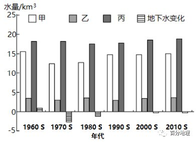
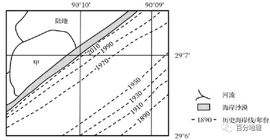

# 微专题之074 从产业结构角度分析区域发展

```
本专题摘自“百分地理”公众号，如有侵权请告之删除，谢谢。联系hhwxyhh@163.com
```

------
   
（2022·河南·高三阶段练习）火地岛国家公园是世界最南端的国家公园，是世界最南部的一个自然保护区，雪峰、湖泊、山脉、森林点缀其间，西侧峡湾常有珍贵海生生物出没，极地风光无限，景色迷人。据此完成下面小题。   
   
   
   
1．火地岛西海岸线曲折，形成的地质作用有（  ）   
①板块运动   
②冰川侵蚀   
③流水侵蚀   
④海浪堆积   
⑤风力侵蚀   
⑥火山活动   
A．②③④⑤   
B．①②③⑤   
C．②③⑤⑥   
D．③④⑤⑥   
2．关于火地岛的气候说法正确的是（  ）   
A．极地气候，严寒   
B．西部受寒流影响，气温低于0℃   
C．东部降水少   
D．冬冷夏热   
<span style="color: rgb(255, 0, 0);">1．B结合所学知识，火地岛地处南极洲板块和美洲板块交界处，地壳运动较为活跃，导致岩石破碎；①对；火地岛位于南纬40°到60°之间，常年受盛行西风控制，风力和海浪侵蚀作用强；②对；山地迎风坡降水多，纬度高，冰川发育，冰川侵蚀形成峡湾，流水侵蚀使海岸线更加破碎曲折，③⑤正确，④错误；火地岛并非火山岛，麦哲伦船队刚到火地岛，看到篝火点点，他便把海峡两岸的陆地命名为“火地”，所以火地岛的峡湾与火山无关，⑥错误。综上，本题选①②③⑤，故选B。</span>   
<span style="color: rgb(255, 0, 0);">2．C火地岛位于55°S附近，处于西风带，终年盛行西北风，属于温带海洋性气候，全年气温高于0℃，由于纬度高，所以冬温夏凉，A、B、D错误；西部位于湿润西南风迎风坡，年降水量高达2000——3000毫米；东部背风坡降水较少，不足500毫米，C正确。故选C。</span>   
<span style="color: rgb(255, 0, 0);">【点睛】影响气候的主要因素有纬度位置、大气环流、海陆分布、洋流和地形。其中，纬度位置是影响气候的基本因素，各地区所处的纬度位置不同，是造成世界各地气温不同的主要原因。</span>   
（2022·山西·高三阶段练习）巴拉顿湖是匈牙利最大的湖泊，也是著名的游览胜地。巴拉顿湖水位每年4—5月最高、9—10月最低，冬天湖面常常会结起厚达20厘米的冰。下图示意巴拉顿湖的地理位置。据此完成下面小题。   
   
   
   
3．巴拉顿湖属于（  ）   
①内流湖   
②外流湖   
③淡水湖   
④咸水湖   
A．①③   
B．②③   
C．②④   
D．①④   
4．巴拉顿湖水位每年4—5月最高的主要原因是（  ）   
A．降水量大，河流补给量大   
B．地下水水位高，地下水补给量大   
C．气温最高，冰雪融水量最大   
D．周围沼泽广布，沼泽水补给量大   
5．巴拉顿湖对匈牙利地理环境的有利影响主要体现在（  ）   
A．塑造地貌   
B．发展湖海联运   
C．调节气候   
D．灌溉蔗稻农田   
<span style="color: rgb(255, 0, 0);">3．B读图可知，巴拉顿湖有河流入湖，也有河流出湖，说明其为外流湖，②正确，①错误；由于有河流流入和流出，所以湖水盐度较低，应为淡水湖，③正确，④错误。故选B。</span>   
<span style="color: rgb(255, 0, 0);">4．A匈牙利地处中欧，属于温和的温带大陆性气候，降水主要受西风带的影响，每年4、5月西风盛行，降水量大，因此湖水水位最高，A正确；地下水的补给比较稳定，并不会出现季节性增加，B错误；冰雪融水不是最主要的补给类型，C错误；沼泽对于湖泊的影响较小，D错误。故选A。</span>   
<span style="color: rgb(255, 0, 0);">5．C湖泊塑造地貌不一定是有利影响，A错误；巴拉顿湖位于匈牙利内陆，因此不能湖海联运，B错误；湖泊可以增加空气湿度，调节气候，C正确；甘蔗主要分布在热带，亚热带地区，水稻主要分布在季风气候区，巴拉顿湖附近不产甘蔗和水稻，D错误。故选C。</span>   
<span style="color: rgb(255, 0, 0);">【点睛】湖泊具有调节河川径流、调节气候、发展灌溉、提供工业和饮用水源、繁衍水生生物、沟通航运、改善区域生态环境等多种功能。</span>   
（2022·甘肃·陇西县第二中学高三阶段练习）河北省唐山市南湖城市中央生态公园位于市中心南部,改造前是采煤沉降区,如今成为湖水、森林及特色建筑组合的生态景观。下图示意南湖城市中央生态公园景观。据此完成下面小题。   
   
   
   
6．改造后的南湖对当地水循环的主要影响体现在（  ）   
A．增加地表径流量,打破水平衡   
B．减少水的下渗量和地下径流量   
C．调蓄地表径流量,促进水循环   
D．湖陆风是其主要大气环流类型   
7．与天然湖泊相比,矿区改造的南湖（  ）   
A．维护投入的成本高   
B．休闲娱乐、观赏价值高   
C．产生的生态效益差   
D．对周边经济活动影响小   
<span style="color: rgb(255, 0, 0);">6．C湖泊可调蓄地表径流,增加下渗,补给地下径流,使水循环更活跃，B错误，C正确；从一个地区多年平均来看,水的收支是平衡的,改造后的南湖并未打破当地水平衡，A错误；唐山市属于季风气候,季风环流是主要大气环流类型,湖陆风只是其局地的空气环流，D错误。故选：C。</span>   
<span style="color: rgb(255, 0, 0);">7．A矿区改造的南湖是人造湖泊,流动性较差,且矿区遗留的矿物元素对湖水污染风险大,故维护投入的成本高，A正确；无论天然,还是人造湖泊都是生态系统,都有生态价值和游览价值,其大小取决于湖泊面积和质量，BC错误；矿区改造的南湖形成了生态公园，相比于天然湖泊经济活动影响较大，D错误。故选：A。</span>   
<span style="color: rgb(255, 0, 0);">【点睛】水循环的环节包括：蒸发、水汽输送、降水、地表径流、下渗、地下径流、植物蒸腾等。</span>   
（2022·河南信阳·一模）图尔卡纳湖以“人类的摇篮”著称于世，形态呈南北长条型，平均水深30.2米，湖盆除北部外，气候炎热干旱。奥莫河是图尔卡纳湖唯一的常年支流。结合下图，完成下面小题。   
   
   
   
8．图尔卡纳湖的形成原因是（  ）   
A．堰塞体阻塞河道积水成湖   
B．河流改道，废弃河道而成   
C．断裂下陷，积水成湖   
D．火山熄灭，火山口积水成湖   
9．奥莫河对图尔卡纳湖的影响有（  ）   
A．起稀释作用，使湖水盐度逐渐降低   
B．补给湖水，使得湖泊面积不断扩大   
C．流水侵蚀作用强，使得湖泊北部较南部深   
D．带来营养盐类，使得北部渔业资源丰富   
<span style="color: rgb(255, 0, 0);">8．C据经纬度位置可知，图尔卡纳湖位于东非大裂谷带，形状呈长条状，所以可推断出图尔卡纳湖的形成原因是断裂下陷形成的构造湖，因此C正确；堰塞体阻塞河道积水形成的堰塞湖，一般形成于流量较大的河流，因滑坡泥石流形成，本区域气候干旱，少有泥石流发生，A错误；没有河流改道、废弃河道信息；火山口位于锥形山顶部，图示区域为盆地，BD错误。故选C。</span>   
<span style="color: rgb(255, 0, 0);">9．D奥莫河是圈尔卡纳湖唯一的入湖径流，给湖区北部带来大量的泥沙、营养物质和淡水，从而使北部湖区湖水较浅且营养物质丰富，适合鱼类的生长和繁殖，D正确；图尔卡纳湖是内陆湖、咸水湖，奥莫河流入，盐类物质不能排出，湖水盐度不会降低，A错误；补给湖水，但气候干旱，蒸发强烈，面积不会扩大，B错误；奥莫河从北部流入，流水沉积作用强，使得湖泊北部较南部浅，C错误。故选D。</span>   
<span style="color: rgb(255, 0, 0);">【点睛】湖泊 主要可以分为以下几种类型：构造湖、火山口湖、堰塞湖、海成湖、 风成湖、岩溶湖、冰川湖。</span>   
（2022·甘肃·高台县第一中学高三阶段练习）南四湖位于山东省南部偏西，全湖面积1266平方千米，是中国大型淡水湖泊之一。湖内1月平均气温-0.3℃，7月平均气温26.5℃。湖泊年平均降水量700毫米，低于年平均蒸发量。下图示意南四湖水系分布。据此完成下面小题。   
   
   
   
10．在蒸发量大于降水量的条件下，南四湖平均面积多年保持稳定，主要是有（  ）   
A．地下径流的渗漏   
B．积雪融水的注入   
C．河流径流的汇入   
D．人工运河的通过   
11．汇入南四湖的河流的水文特点是（  ）   
A．径流年际变化小   
B．结冰期长达半年   
C．夏与初秋为汛期   
D．中下游为地上河   
<span style="color: rgb(255, 0, 0);">10．C根据“南四湖年平均降水量700毫米，低于年平均蒸发量”和流域图判断，南四湖面积多年保持稳定，是因为湖泊周边有河流径流的汇入，C对B错；地下径流补给量比较小，A错；人工运河主要的作用是航运，D错。综上，本题选C。</span>   
<span style="color: rgb(255, 0, 0);">11．C根据“湖内1月平均气温-0.3℃“判断，南四湖地处温带季风气候区，汇入南四湖的河流水文特征受气候的影响显著，表现为径流季节和年际变化大，A错；1月平均气温-0.3℃，说明有结冰期，但较短，B错；温带季风气候降水集中在夏季6-9月，即夏与初秋为汛期，C对；由图可知，图中河流无地上河的形成，且地上河为水系特点，D错。综上，本题选C。</span>   
<span style="color: rgb(255, 0, 0);">【点睛】河流、湖泊的水文特征可以从流量、含沙量、水位、汛期、结冰期等方面描述。</span>   
<span style="color: rgb(255, 0, 0);">河流、湖泊的水系特征则包括流向、河源和河口、流程、支流数量和形状等。</span>   
（2022·河北衡水·高三阶段练习）以色列东北部的太巴列湖（—213米），四周群山环抱，约旦河自北向南流经该湖，出湖后继续南流，最后注入死海（—415米），水面经常平静无波，但有时狂风巨浪。其上游河流水量不足流出水量的一半，历史时期水量保持稳定，但近年来，水量急剧减少，有时达到危险的低水平。读图，完成下面小题。   
   
   
   
12．太巴列湖的成因及湖水性质分别为（  ）   
A．构造湖淡水湖   
B．潟湖淡水湖   
C．火口湖咸水湖   
D．堰塞湖咸水湖   
13．维持太巴列湖水量稳定的关键补给来源是（  ）   
A．大气降水   
B．高山冰雪融水   
C．地下水   
D．湖泊水   
14．导致湖面有时狂风巨浪的地理原理类似于（  ）   
A．锋面气旋   
B．高压系统   
C．锋面系统   
D．热力环流   
<span style="color: rgb(255, 0, 0);">12．A该处位于亚欧板块、非洲板块、印度洋板块交界处，是东非大裂谷的北部起点，故该湖的成因应该为构造湖，A对，B、C、D错；据信息“约旦河自北向南流经该湖，出湖后继续南流”可知，该湖水有进有出，为淡水湖的可能性大。故选A。</span>   
<span style="color: rgb(255, 0, 0);">13．C该湖水量常年稳定，结合周边地理环境，高山冰雪融水补给的可能性不大，B错；大气降水具有季节性，会导致湖水水位变化明显，A错；周边无湖泊与其相连，该地位于板块交界处，故地下水出露的可能性最大，C对、D错。故选C。</span>   
<span style="color: rgb(255, 0, 0);">14．D该湖所处地势低，气温高，湖面水汽多，而东侧为山地、高原，海拔高，气温低，空气易致冷下沉和湖面潮湿水汽相遇，形成狂风巨浪，故属于山谷风导致的结果，属于热力环流的原理，D对；高压系统控制下多为晴朗天气，B错；锋面系统与锋面气旋中，暖锋往往带来持续性降水，时间长，强度小，A、C错。故选D。</span>   
<span style="color: rgb(255, 0, 0);">【点睛】湖泊水的补给来源包括大气降水、季节性积雪融水、冰川融水、地下水、河流水等。</span>   
（2022·辽宁·高三阶段练习）如图为世界某区域图，每天同一时刻甲地太阳高度均小于乙地。读图，完成下面小题。   
   
   
   
15．与乙地相比，甲地（  ）   
A．地势起伏大   
B．河流含沙量大   
C．气温年较差大   
D．雨季持续时间长   
16．图示季节，该区域范围内（  ）   
A．甲地森林枯叶飘落，气候温和   
B．湖床出露面积大，风化明显   
C．乙地沿海天高气爽，能见度高   
D．河流水位明显上涨，补给湖泊   
<span style="color: rgb(255, 0, 0);">15．D据材料，每天同一时刻甲地太阳高度均小于乙地，说明甲地纬度高于乙地，判断为北半球；由图可知，甲在40°N北，乙在40°N南，且位于大陆西岸，分别为温带海洋性气候和地中海气候，与乙地相比，甲地河流含沙量小，气温年较差小，雨季持续时间长，D正确，B、C错误；甲、乙两地位于沿海地区，地势低平，A错误。故选D。</span>   
<span style="color: rgb(255, 0, 0);">16．B据图，该季节陆地等温线向北凸，说明温度高于同纬度海洋，可推断出为北半球夏季，甲地为温带落叶阔叶林，夏季生长旺盛，A错误；湖泊位于地中海气候区，夏季热干，湖泊水位低，湖床裸露面积大，物理风化现象明显，B正确；乙地沿海受寒流影响，有雾，能见度较低，C项错误；根据等高线凸出方向，图中河流向北流，湖泊是河流的源头，D错误。故选B。</span>   
<span style="color: rgb(255, 0, 0);">【点睛】判断等值线有“凸高值低，凸低值高”的规律。某地等温线向高纬度方向凸出，就是向气温低的方向凸出，说明这里气温值高。某地等温线向低纬度方向凸出，就是向气温高的方向凸出，说明这里气温值低。</span>   
（2022·山东·昌乐二中高三阶段练习）耗来河发源于贡格尔草原上的多伦诺尔湖，连接多伦诺尔湖与达里诺尔湖，注入达里诺尔湖，其上曲流发育。下图示意耗来河的位置和曲流景观。读图，完成下面小题。   
   
   
   
17．耗来河主要补给是（  ）   
A．地下水   
B．降水   
C．湖泊水   
D．冰雪融水   
18．与耗来河河曲形成密切相关的是（  ）   
A．流速较快   
B．河流落差大   
C．凸岸不断堆积   
D．下蚀较强   
19．耗来河河曲形状保留较好，主要得益于（  ）   
A．草原植被   
B．河岸岩性   
C．海拔高度   
D．人类活动   
<span style="color: rgb(255, 0, 0);">17．C由材料可知，耗来河发源于贡格尔草原上的多伦诺尔湖，湖泊水是其补给来源。故选C。</span>   
<span style="color: rgb(255, 0, 0);">18．C耗来河流经地区地形开阔平坦，河流落差小，流速慢，下蚀弱，侧蚀强，凹岸不断受侵蚀，凸岸不断堆积，易形成河曲。C正确，排除ABD。故选C。</span>   
<span style="color: rgb(255, 0, 0);">19．A草原植被根系发达，河流两岸不易坍塌，形成的河曲形状能够得到很好保留，A正确;草原土壤深厚，不是河岸岩性坚硬造成的，B错误;海拔高度对其影响不大，C错误;人类活动影响小不是主要原因，D错误。故选A。</span>   
<span style="color: rgb(255, 0, 0);">【点睛】根据所学知识可知，河流发育前期以下蚀和溯源侵蚀为主，河谷不断加深和延长，河谷横剖面呈V形;河流发育中期下蚀减弱，侧蚀加强，凹岸侵蚀、凸岸堆积，河谷拓宽;河流发育后期以侧蚀为主，河谷进一步拓宽，横剖面呈U形。</span>   
（2022·江苏镇江·高三阶段练习）青海湖是我国最大的内陆高原湖泊，其水位的波动能反映青藏高原气候和生态环境的变化图1为青海湖区域示意图，图2为1961-2019年青海湖年平均水位变化趋势图。据此完成下面小题。   
   
   
   
20．2005年以来青海湖水位不断升高，主要原因是（  ）   
①高原季风减弱   
②高原气候暖湿化   
③植被覆盖减少   
④冻土退化   
A．①②   
B．②④   
C．③④   
D．①③   
21．青海湖水位升高对当地环境的影响有（  ）   
A．周边出现草场盐碱化   
B．周边沙漠化面积增加   
C．入湖口三角洲面积扩大   
D．环湖地区湖风势力减弱   
<span style="color: rgb(255, 0, 0);">20．B根据图可知，水位应是先降后增；青海湖的水量主要受青海湖补给水源的影响，青海湖的补给水源主要包括内流河的注入、大气降水及地下水；随着全球变暖，高山冰雪融水增加，入湖水量增加，②对；气温升高，冻土融化，地下水补给量增加，④对；高原季风减弱对青海湖水位不断升高影响不大，①错；植被覆盖减少不是青海湖水位升高的原因，③错；综上所述，B对，ACD错。故选B。</span>   
<span style="color: rgb(255, 0, 0);">21．C随着全球变暖，高山冰雪融水增加，青海湖水位升高，入湖水量增加，输沙量增加，河流入湖处地势低平，流速减慢，流水沉积，入湖口处湖水的顶托作用，泥沙沉积下来形成三角洲，C对；青海湖水位上升，淹没了沿岸的土地，不会使沿岸土地盐碱化，A错；青海湖水位升高，湖泊面积增大，有利于减缓沙漠面积的扩大，B错；青海湖水位升高，湖泊面积增大，湖陆温差增大，环湖地区湖风势力增强，D错。故选C。</span>   
<span style="color: rgb(255, 0, 0);">【点睛】全球变暖会导致全球降水量重新分配、冰川和冻土消融和海平面上升，不仅危害自然生态系统的平衡，还威胁人类的食物供应和居住环境。</span>   
（2022·河北邢台·高三阶段练习）江心洲系河流中的沙洲，由河流携带的泥沙沉积而成。一些江心洲具有特别的利用价值，如湘江橘子洲。下左图为我国某河流河道示意图，图中甲为一江心洲；右图为该江心洲一年内面积变化统计图，读图完成下面小题。   
   
   
   
22．该河流的补给类型主要包括（  ）   
①大气降水   
②冰川融水   
③季节性的冰雪融化   
④湖泊水   
A．①②   
B．①③   
C．②③   
D．①④   
23．对于该河流的叙述，正确的是（  ）   
A．江心洲常发育在河流上游水流较快的地方   
B．江心洲洪水期一定会被淹没   
C．若P河道为该河主航道，则该河段的流向为西北流向东南   
D．若在河流上游修筑水坝，则江心洲面积增长速度减慢   
<span style="color: rgb(255, 0, 0);">22．B河流水位高，则江心洲面积较小，根据右图信息可知，江心洲面积在春季和夏季相对较小，表明该地区春季和夏季河流水位较高，所以该河流存在大气降水（夏季）和季节性积雪融水补给（春季），①③正确。冰川融水补给主要发生在夏季，且受冰川融水补给的河流水位上升起伏相对和缓，则江心洲面积变化相对和缓，与图示信息不符，②错。受湖泊水补给河流流量季节变化小，江心洲面积变化小，④错。故选B。</span>   
<span style="color: rgb(255, 0, 0);">23．D江心洲是河流携带泥沙沉积而成，多发生在河流中下游水速较慢的地方，A错。该江心洲发育面积较大，在洪水期依然有部分江心洲出露，并非一定被淹没，B错。若P河道为河流主航道，则表示P河道水深更深，受流水侵蚀更强，该河道位于我国，河流受地转偏向力的影响向右偏转，P河道水深更深，表明河流大致自东向西流，C错。若在该河流的上游修筑水坝，水坝拦截泥沙，使得水坝下游河段泥沙沉积减弱，则江心洲面积增长速度减慢，D正确，故选D。</span>   
<span style="color: rgb(255, 0, 0);">【点睛】河流地貌一般分为河流侵蚀地貌和河流堆积地貌。典型的河流侵蚀地貌如“V形谷”，典型的河流堆积地貌如山前洪积扇（或称为冲积扇）、河漫滩平原、江心洲、三角洲等。</span>   
（2022·山西长治·高三阶段练习）湖冰从冻结到消融过程一般受湖泊形态特征、水体矿化度（矿化度升高会导致冰点降低从而延迟冻结时间）、局地气候等条件的影响。巴丹吉林沙漠腹地有湖泊群分布，湖泊冬季存在湖冰冻结及消融现象。下图示意巴丹吉林沙漠腹地湖泊群分布及2月份音德尔图湖冰消融状况。据此完成下面小题。   
   
   
   
24．推测该湖泊群的直接补给水源主要是（  ）   
A．地下水   
B．积雪融水   
C．冰川融水   
D．雨水   
25．影响该湖泊群冬季湖冰消融的主要因素是（  ）   
A．气温   
B．湖泊面积   
C．风力   
D．水温   
26．2月份音德尔图湖冰南北消融状况差异明显，主要因为（  ）   
①北部水温较高   
②南部风力较强   
③湖泊形态阻碍水体交换   
④南部水体矿化度低   
A．①②   
B．③④   
C．②③   
D．②④   
<span style="color: rgb(255, 0, 0);">24．A巴丹吉林沙漠位于东亚季风边缘区，降水少，蒸发量大，地处沙漠腹地，无高山冰川及河流，湖泊群补给水源直接来自于地下水补给，A正确，B、C、D错误。故选A。</span>   
<span style="color: rgb(255, 0, 0);">25．D冬季气温低，不利于湖冰消融，A错误；湖泊面积大小各异，也不是湖冰消融的原因，B错误；冬季风力大，容易将已冻结的冰吹散并堆叠于已生成的冰之上，但不是湖冰消融的主要原因，C错误；湖冰冬季能消融，主要原因是泉水水温高，影响湖泊群水温，故湖冰消融较早，D正确。故选D。</span>   
<span style="color: rgb(255, 0, 0);">26．B湖泊南部泉水补给，水温较高，（湖泊为咸水湖）降低南部水体矿化度，矿化度降低会导致冰点升高从而延迟消融时间，①错误，④正确；风力大小南北部差异不明显，②错误；湖泊南北之间通过狭窄水道相通，阻碍水体交换，使湖泊消融时间南北差异明显，③正确。综上所述，B正确，A、C、D错误。故选B。</span>   
<span style="color: rgb(255, 0, 0);">【点睛】影响湖水结冰的因素有气温（纬度.海拔）、盐度（高，不易结冰）、海陆位置、水域深度（表层易结冰，越深越不易结冰。）、流速（流速大不易结冰）、径流补给/地下水补给等。</span>   
（2022·辽宁·沈阳市第十中学高三阶段练习）潟湖是海湾被泥沙堆积形成的封闭湖泊，位于波罗的海沿岸的库尔斯潟湖被库尔斯沙嘴与外海分隔，平均水深3.8米，约90%的湖水来自内穆纳斯河。下图为库尔斯潟湖位置示意图。据此完成下面小题。   
   
   
   
27．库尔斯沙嘴的沙源直接来自（  ）   
A．内穆纳斯河泥沙   
B．波罗的海深海   
C．中纬西风的沙尘   
D．波罗的海海滩   
28．与波罗的海相比，库尔斯潟湖（  ）   
A．冬季水温高   
B．夏季水温低   
C．盐度更低   
D．密度更大   
<span style="color: rgb(255, 0, 0);">27．D从图中可知，库尔斯沙嘴位于中纬度，延伸方向是西南—东北方向，其中东北部有缺口，说明是由西南向东北推进，与中纬西风吹的方向一致，最可能是中纬西风将波罗的海沿岸海滩上的沙尘不断向东北搬运，由于风浪减弱而发生堆积；西南部离内穆纳斯河河口较远，其泥沙不可能来自内穆纳斯河；D正确，A错误。欧洲植被覆盖好，西部是海洋，其泥沙也不可能是中纬西风的沙尘；C错误。波罗的海面积辽阔，风浪难以将深层泥沙带到表层，其泥沙也不可能来自其深海，B错误。故选D。</span>   
<span style="color: rgb(255, 0, 0);">28．C材料中指出：库尔斯潟湖约90%的湖水来自内穆纳斯河，该河流域为温带大陆性气候区，与波罗的海相比，冬季水温较低，夏季水温较高，盐度较低，密度较小，ABD错误，C正确，故选C。</span>   
<span style="color: rgb(255, 0, 0);">【点睛】库尔斯沙嘴的东北部有缺口，说明是由西南向东北推进，与中纬西风吹的方向一致，因此最有可能是中纬西风将波罗的海沿岸海滩上的沙尘不断向东北搬运。</span>   
（2022·福建省长汀县第一中学高三阶段练习）岱海流域位于内蒙古东部边缘，属于黄土高原小流域生态系统，距北京仅240公里，是京津冀地区生态屏障的重要组成部分。为了治理近六十年来入湖水量不断减少所引发的一系列生态环境问题，当地开展了生态修复工作。下图为岱海流域图。读图，回答下列问题。   
   
   
   
29．岱海入湖水量不断减少的主要原因是（  ）   
A．气温升高，湖水强烈蒸发   
B．降水减少，植被大量吸收地下水   
C．工农业生产及生活用水量增加   
D．流域蓄水发电与引水灌溉牧草   
30．岱海入湖水量逐渐减少、湖泊面积萎缩，会使滨湖湖岸（  ）   
A．沙漠化加剧   
B．水土流失加剧   
C．盐碱化加剧   
D．冻融荒漠化加剧   
31．关于岱海流域的生态修复措施，说法正确的是（  ）   
A．全流域进行保护，禁止开发   
B．山地实施防风蚀、稳定流动沙丘工程   
C．合理分配水资源，实施引水、节水、净水工程   
D．增加出湖径流量，提升湖泊自净能力   
<span style="color: rgb(255, 0, 0);">29．C题干要求说明入湖水量减少的原因，湖水蒸发强烈与入湖水量减少无关，A错误；入湖水量主要来自于河流，植被吸收地下水对入湖水量影响不大，B错误；人口增多，工农业生产生活用水量增加，导致入湖水量减少，C正确；蓄水发电不会消耗水量，湖泊周围滩涂草原广阔，无需引水灌溉，D错误。故选C。</span>   
<span style="color: rgb(255, 0, 0);">30．C据图可知，岱海属于内流湖，没有出水口，湖泊属于咸水湖，入湖水量减少，湖泊面积萎缩，盐度增加，滨湖湖岸盐分物质沉积，盐碱化加剧，C正确；湖泊周围有河流草原，荒漠化现象不突出，A错误；入湖水量减少，流水的侵蚀作用减弱，B错误；冻融荒漠化是高海拔地区多年冻土发生退化，季节融化层厚度增大，岱海流域没有多年冻土，D错误。故选C。</span>   
<span style="color: rgb(255, 0, 0);">31．C全流域进行保护，禁止开发不利于资源利用，A错误；岱海流域主要生态问题是水资源不合理利用问题，不是风沙问题，B错误； 合理分配水资源，实施引水、节水、净水工程，可修复流域生态环境，C正确；湖泊缺少出口，无法增加出湖径流量，且增加出湖径流量会导致湖泊面积进一步缩小，D错误。故选C。</span>   
<span style="color: rgb(255, 0, 0);">【点睛】岱海是内蒙古第三大内陆湖，岱海东西长约13㎞，南北宽约8㎞，水域面积70多平方公里，容积为9.89亿立方米。平均水深9米左右，最大深度18米。属于典型的内陆咸水湖泊，系全区闻名的四大水产基地之一，其水源由周围20多条河流和中层地下水汇聚而成。</span>   
（2022·甘肃·高台县第一中学高三阶段练习）为研究我国某地湖泊（湖面海拔1169米）的水量变化，学者统计了2012年8月1日－2013年8月1日期间湖面日蒸发量的累计值（虚线）和同期当地降水量累计值（实线），并绘制成下图。据此完成下面小题。   
   
   
   
32．影响该湖面日蒸发量季节变化的主导因素是（  ）   
A．太阳活动   
B．气温   
C．降水   
D．空气湿度   
33．推测该湖泊最可能位于（  ）   
A．闽南丘陵   
B．云贵高原   
C．内蒙古高原   
D．藏北高原   
34．2012年10月～2013年6月该地降水量累计值变化小，主要原因是（  ）   
A．受亚洲高压长时间控制   
B．台风登陆次数偏少   
C．受夏威夷高压长时间控制   
D．湖陆热力性质差异小   
<span style="color: rgb(255, 0, 0);">32．B影响蒸发量的因素主要有光照、气温、风速、湿度和水域表面积，其中光照、气温、风速、和水域表面积越大，蒸发越旺盛；湿度越大，蒸发越微弱。太阳活动指太阳释放能量的不稳定性所导致的一些明显现象，与湖面日蒸发量关系不是很大，A错误；该湖泊位于我国，6-8月为夏季气温最高，湖面日蒸发量最大。图中显示，6-8月该湖面日蒸发量的累计值增幅最大，说明该湖泊所在地6-8月湖面日蒸发量最大，据此可知，影响该湖面日蒸发量季节变化的主导因素是气温，B正确；读图可知，该湖泊所在地6-8月湖面日蒸发量的累计值和降水量累计值增幅均最大，说明该湖泊所在地6-8月降水量最多，空气湿度最大，湖面日蒸发量也最大，与“湿度越大，蒸发越微弱”规律矛盾，说明降水和空气湿度不是影响该湖面日蒸发量季节变化的主导因素，CD错误。故选B。</span>   
<span style="color: rgb(255, 0, 0);">33．C读图可知，图示地区6-8月降水量累计值为38-70毫米，即6-8月该地降水量约32毫米，降水较少。内蒙古高原年降水量在东部、东北部为200-400mm，其他地方大部分是50-200mm，最少年降水量13毫米，与图示信息符合，C正确；云贵高原位于亚热带季风气候区，年降水量1000-2000毫米，集中5-10月，与图示信息不符合，B错误；根据材料“湖面海拔1169米”，结合我国地形地势特征：闽南丘陵海拔在500米以下，云贵高原和 内蒙古高原海拔1000-2000米，青藏高原平均海拔4000米以上，排除AD选项。故选C。</span>   
<span style="color: rgb(255, 0, 0);">34．A亚洲高压指出现在蒙古-西伯利亚的半永久性冷高压。结合上题分析可知，该湖泊位于内蒙古高原，距离亚洲高压近，受亚洲高压长时间控制，气流下沉升温，空气难以达到过饱和，降水少，导致2012年10月～2013年6月该地降水量累计值变化小，A正确；内蒙古高原位于我国西北内陆，纬度较高，离海较远，受台风影响小，台风不是影响该地区降水量的主要因素，B错误；夏威夷高压在北半球夏威夷群岛附近，一般出现在北半球夏半年，对内蒙古高原降水量影响小，C错误；内蒙古高原位于我国西北内陆，属于温带大陆性气候，降水量少，昼夜温差大，湖陆热力性质差异大，D错误。故选A。</span>   
<span style="color: rgb(255, 0, 0);">【点睛】陆地五种基本地形及海拔：平原海拔一般200米以下； 高原海拔一般1000米以上； 盆地中部低，四周高，海拔不确定； 山地海拔一般500米以上； 丘陵海拔一般500米以下。</span>   
（2022·山东·滕州市第一中学新校高三阶段练习）巴尔喀什湖是中亚干旱区的典型内陆湖，具有湖泊面积大、水深相对较浅的特点，拥有丰富的湿地和水生动植物资源，水源主要来自伊犁河。下图示意1961—2020年巴尔喀什湖水量平衡变化。据此完成下面小题。   
   
   
   
35．甲、乙、丙分别代表（  ）   
A．入湖径流量、蒸发量、降水量   
B．降水量、蒸发量、入湖径流量   
C．入湖径流量、降水量、蒸发量   
D．降水量、入湖径流量、蒸发量   
36．与20世纪80年代相比，90年代伊犁河入湖口可能（  ）   
A．湖岸线升高   
B．湖水盐度升高   
C．生物种群数量减少   
D．水域深度保持不变   
37．20世纪70年代巴尔喀什湖地下水变化大，其最可能的原因是（  ）   
A．降水减少   
B．蒸发加剧   
C．对湖泊大量补水   
D．上游修建水库   
<span style="color: rgb(255, 0, 0);">35．C巴尔喀什湖位于中亚干旱区，湖区降水量较小；湖水水源主要来自伊犁河，伊犁河上游山地降水与冰雪融水多，入湖水量较大；不同年代，巴尔喀什湖的蒸发量一直相对稳定，且数值较大，因此丙代表蒸发量，甲代表入湖径流量，乙代表降水量。所以C正确。ABD错误。故选C。</span>   
<span style="color: rgb(255, 0, 0);">36．A读图可知，与20世纪80年代相比.90年代巴尔喀什湖地下水位不再下降，入湖径流量明显增加；做伊犁河入湖口水位上升，湖岸线升高，A正确。入湖径流量增加，入湖口处湖水盐度下降，B错误。伊犁河入湖口三角洲面积扩大，生态环境改善，生物种群数量增加，C错误。入湖径流量增加，携带泥沙增多，淹没的水域面积增加，由于水域深度受湖底地形和外来泥沙沉积的影响，故较难判断水域深度的变化情况，D错误，故选A。</span>   
<span style="color: rgb(255, 0, 0);">37．D由图可知，相较于其他年代，20世纪70年代巴尔喀什湖的蒸发量和降水量没有明显变化，AB错误。入湖径流量减少较多。对湖泊大量补水会导致地下水位升高，地下水位变化为正值，与图示不符，C错误。上游修建水库会导致入湖径流量减少，地下水减少，D正确，故选D。</span>   
<span style="color: rgb(255, 0, 0);">【点睛】巴尔喀什湖位于哈萨克斯坦东南部，东经73°20'一79°12'，北纬45°00'一46°44'之间，萨雷伊希科特劳半岛乌泽纳拉尔水道把巴尔喀什湖分为东西两部分，东巴尔喀什湖为咸水湖，西巴尔喀什湖为淡水湖。</span>   
（2022·全国·高考真题）下图示意北美东南部沿海冲积平原某区域1890年以来海岸线的变化。读图，完成下面小题。   
   
   
   
38．在图示区域海岸线变化最快的时段，该区域可能经历了（  ）   
A．强烈的地震   
B．剧烈的海啸   
C．频发的飓风   
D．汹涌的洪水   
39．判断甲水域是湖泊而非海湾的依据是（  ）   
①甲水域北岸岸线基本稳定   
②百年来变动的海岸线近似平直   
③甲水域有河流汇入   
④甲水域呈半圆形形态   
A．①②   
B．②③   
C．③④   
D．①④   
<span style="color: rgb(255, 0, 0);">38．C据图和材料可知，图示为北美东南部沿海冲积平原某区域海岸线，由1890年到2010年逐渐向陆地退缩，说明受海水侵蚀作用强烈。其中1950到1970年间，海岸线退缩范围最广，变化最快，海水侵蚀作用最强。地震属内力作用，通常会引起地表形态起伏更大，对海岸线退缩的直接影响较小，A错误；海啸是由海底地震、火山爆发、海底滑坡等形成的破坏性海浪，会产生海水侵蚀，但其形成的频率较低，不是该海域海岸线退缩的主要原因，B错误；结合经纬度，该地位于北大西洋低纬度地区，靠近热带海域，每年会发生多次飓风，飓风除导致狂风、暴雨的危害以外，还会形成风暴潮，对海岸线产生强烈的侵蚀和破坏作用，因其频率较高，使海岸线退缩范围广，变化快，C正确；汹涌的洪水会从上游带来大量泥沙沉积到海岸，使海岸线向海洋推进，与图示不符，D错误。故选C。</span>   
<span style="color: rgb(255, 0, 0);">39．A百年来海岸线不断退缩，甲水域北岸岸线基本稳定，说明其与外海并未直接连通，而是受海岸线与海岸沙漠隔离，使其几乎没有受到海浪的侵蚀，①正确。百年来，变动的海岸线近似平直，而甲水域岸线弯曲，进一步说明甲水域长期受海岸和海岸沙漠的隔离，与外海分隔开来，形成陆地上的一个湖泊，②正确。据所学可知，海湾是三面环陆一面连接海域的海洋，湖泊是地表相对封闭的天然洼池（湖盆）及其承纳的水体，故甲水域有无河流注入、水域形态与其是湖泊还是海湾关系不大，③④错误。综合起来，A正确，BCD错误，故选A。</span>   
<span style="color: rgb(255, 0, 0);">【点睛】飓风是大西洋和东太平洋地区将强大而深厚（最大风速达32.7米/秒，风力为12级以上）的热带气旋称也泛指狂风和任何热带气旋以及风力达12级的任何大风。台风和飓风最大的区别就是出生地和活动区域不同。台风主要是指在西北太平洋和南海的生成及活动的热带气旋，而飓风是指在中东太平洋和北大西洋上生成及活动热带气旋。海啸就是由海底地震、火山爆发、海底滑坡或气象变化产生的破坏性海浪。</span>   
（2021·广东·高考真题）岸线发育系数（简称SDI）是反映湖泊几何形态的指标，其值越大表示湖岸线越曲折。我国某内陆咸水湖，拥有丰富的湖岸线资源，部分湖岸区域沙漠化现象较为明显。下图示意该湖1973—2017年水位和SDI值变化。据此完成下面小题。   
   
   
   
40．导致1973—2004年SDI值变化的主要原因是（  ）   
①水下地貌体出露   
②湖岸土地沙化加剧   
③湖盆区构造沉降   
④人类活动强度减弱   
A．①②   
B．①③   
C．②④   
D．③④   
41．2010—2017年SDI值的变化指示了该湖（  ）   
A．湖岸线长度变短   
B．沿岸区域土地沙漠化加剧   
C．湖泊的面积稳定   
D．沿岸区域生物多样性增加   
<span style="color: rgb(255, 0, 0);">40．A读图分析，1973-2004年SD值呈上升趋势，说明湖岸线变曲折。水下地貌体出露会导致湖岸线更加曲折，SDI值会变大。①符合；湖岸土地沙化会导致湖岸线越来越曲折，②符合；湖盆区构造沉降会导致湖岸线缓和，SDI值变小，③不符合；人类活动强度减弱会导致湖岸线缓和，SDI值变小，④不符合；综上，A正确，BCD错误；故选A。</span>   
<span style="color: rgb(255, 0, 0);">41．D读图分析，2010-2017年SD值总体呈现上升趋势。读图分析，2010-2017年该湖泊水位上升，造成水域面积扩大，更多原来单一陆境生物环境区域变为水域和陆域交替环境，生境多样性增加。D正确；SD值上升说明湖岸线曲折，湖岸线长度变长，A错误；该湖泊水位上升，土地沙漠化减弱，B错误；该湖泊水位上升，湖泊面积扩大，C错误；故选D。</span>   
<span style="color: rgb(255, 0, 0);">【点睛】自然地理环境的整体性：地球表面组成地理环境的大气、水、岩石、地形、生物和土壤等地理环境要素相互联系、相互制约和相互渗透，构成了地理环境的整体性。主要表现在以下四个方面：一是地理要素间进行着物质与能量交换，二是地理要素间相互作用产生新功能，三是自然环境具有统一的演化过程，四是地理要素的变化会“牵一发而动全身”。</span>   
二、综合题   
42．（2022·江西·高三阶段练习）阅读图文材料，完成下列要求。   
洞里萨河连接洞里萨湖和湄公河（下图），其夏季和冬季流向相反，是世界唯一流向随季节变化的河流。与世界大多数湖泊相比，冬夏季水位相差更加明显。   
   
   
   
(1)分别指出洞里萨河夏季和冬季的流向。   
(2)洞里萨湖夏季水位明显高于冬季，解释其原因。   
(3)夏季湄公河流速甲断面大于乙断面，分析其原因。   
<span style="color: rgb(255, 0, 0);">【答案】(1)夏季流向洞里萨湖，冬季流向湄公河。</span>   
<span style="color: rgb(255, 0, 0);">(2)雨季，接受支流注入；丰水期，洞里萨河倒灌。</span>   
<span style="color: rgb(255, 0, 0);">(3)湄公河注入洞里萨河，洞里萨河河口水位下降。</span>   
<span style="color: rgb(255, 0, 0);">【解析】本题以洞里萨河为背景，设置3道题目，知识点涉及河流补给类型，河流的水文特征等内容，考查学生地理知识的迁移与调动能力，蕴含综合思维，区域认知等地理学科核心素养。（1）洞里萨河夏季和冬季的流向与河流补给类型变化有密切联系，湄公河处在热带季风气候区，全年高温，分旱雨两季，夏季降水量大，河流流量大，水位高，河流补给湖泊，因而夏季流向洞里萨湖；冬季为旱季，降水量较小，河流流量较小，湖泊补给河流，因而冬季流向湄公河。（2）洞里萨湖夏季水位明显高于冬季，原因从河流补给类型原因思考，夏季正值热带季风气候的雨季，众多支流受雨水补给，水量大，水位高，支流向湖泊注入，湖泊进入丰水期，洞里萨河倒灌注入洞里萨湖。（3）河流流速的变化与水量，地势密切联系，湄公河下游地势平坦，地势不是引起流速变化的主要原因，甲断面位于湖泊上游，乙断面位于湖泊下游，湄公河注入洞里萨河，洞里萨河河口水位下降，乙断面水量减少，流速下降。</span>   
43．（2022·甘肃·高台县第一中学高三阶段练习）阅读图文材料，完成下列要求。   
材料一   
额尔古纳市（120．2°E,50．2°N）位于大兴安岭西北麓，是内蒙古纬度最高的城市，冬季常有极寒天气，最低温度可达-40℃，供暖期持续9个月。   
材料二   
呼伦湖位于海拉尔盆地，属额尔古纳河水系。湖泊西岸陡峭，南、东岸的克鲁伦河和乌尔逊河是其主要补给河流。湖泊东北部的达兰鄂罗木河河道浅平、蛇曲发达，流向顺逆不定，是呼伦湖的吞吐河流；新开河为人工河，某些年份与海拉尔河相通，呼伦湖和海拉尔河水位年际变化大。左图为呼伦湖及附近地区水系分布图，右图为1961—2001年呼伦湖盐度和水位变化图。   
   
   
   
   
   
   
(1)分析额尔古纳市冬季供暖时间长的原因。   
(2)概括达兰鄂罗木河成为呼伦湖吞吐河流的原因。   
(3)指出呼伦湖水位与盐度的关系，并解释原因。   
<span style="color: rgb(255, 0, 0);">【答案】(1)额尔古纳市纬度高，冬季太阳高度角小，白昼短，冬季漫长寒冷；离冬季风源地近，受冷空气影响，降温幅度大、气温低；受山脉阻挡（位于冬季风迎风坡），冷空气在山前堆积滞留时间长，低温时间长。</span>   
<span style="color: rgb(255, 0, 0);">（2）呼伦湖属额尔古纳河水系，南、东部有河水汇入，西部陡峭，可知流域总体向北微倾斜；达兰鄂罗木河河道浅平，连接湖泊与河流；呼伦湖和海拉尔河水位年际变化较大（降水多的年份，湖泊水位高，河水北流，通过新开河入海拉尔河；降水少的年份，湖泊水位低，海拉尔河水位高，河水反向南流）。</span>   
<span style="color: rgb(255, 0, 0);">（3）负相关（反相关）。原因：湖泊水位高的年份，湖水外流，利于排出盐分；湖水水位低的年份，湖水无法流出，造成盐分累积。</span>   
<span style="color: rgb(255, 0, 0);">【解析】本题以以呼伦湖和额尔古纳市气候资源为材料，设置3道小题，涉及湖岸地形成因分析、起地水体补给以及水位与盐度之间的关系等相关知识点。考查学生获取和解读地理信息、调动和运用地理知识的能力，体现区域认知、综合思维的学科素养。（1）根据所学知识可知，额尔古纳市纬度位置较高，冬季太阳高度角较小，且昼短夜长，白昼短，太阳辐射量较少，气温较低；额尔古纳市距离的冬季风风源地较近，受冬季风影响较大，降温幅度大，冬季气温较低；根据材料信息“西岸为山峦和悬崖陆壁，东岸和南岸地势平坦开闲”，可知，冬季风容易在山前堆积，导致受冬季风影响更强，该地冬季寒冷而漫长，冬季供暖时间长。（2）据材料“湖泊西岸陡峭，南、东岸的克鲁伦河和乌尔逊河是其主要补给河流”、“呼伦湖和海拉尔河水位年际变化大”判断，呼伦湖属额尔古纳河水系，南、东部有河水汇入，西部陡峭，可知流域总体向北微倾斜，达兰那罗木河附近地势落差小；因为呼伦湖和海拉尔河水位年际变化大，降水多的年份，湖泊水位高，湖水补给河水，通过新开河入海拉尔河，河水北流：而降水少的年份，湖泊水位低，海拉尔河水位高，河水南流注入湖泊，因此流向顺逆不定。（3）据1961～2001年呼伦湖盐度和水位变化图“判断，呼伦湖水位与盐度之间的关系呈负相关。当湖泊水位高的年份，湖水外流，排出盐分，湖泊盐度降低；湖水水位低的年份，湖水无法流出，河流注入，将陆地盐分带入湖中，导致湖泊盐分累积，盐度升高。</span>   
44．（2022·安徽·高三阶段练习）阅读图文材料，完成下列要求。   
高山高原处的冰川谷纵向起伏不平，冰坎（冰川谷中突起的陡坎）与冰盆相间，冰盆积水后或多道终碛堤（冰川前端堆积物堆积而成）阻水常形成串珠似的湖泊，称为串珠湖。香巴拉七湖是横断山区的一组串珠湖，其中，一湖和三湖一年中只有在最冷月才会有一半湖面结冰，其他湖泊均有近五个月的封冻期。下图示意香巴拉七湖的纵剖面图。   
   
   
   
(1)简析串珠湖的形成过程。   
(2)试分析一湖和三湖在最冷月才会有一半湖面结冰的原因。   
(3)从短期和长期推测全球气候变暖对香巴拉七湖可能造成的影响。   
<span style="color: rgb(255, 0, 0);">【答案】(1)冰川活动侵蚀经过地区，形成冰川谷；因岩石性质差异，冰川谷起伏不平；部分冰川融化后，挟带的物质在谷底堆积形成多道终碛堤；侵蚀形成的洼地或终碛堤之间不断积水，形成串珠湖。</span>   
<span style="color: rgb(255, 0, 0);">(2)一湖和三湖湖面较宽、较深，湖泊水量大，湖面结冰时间晚，冰期短；一湖和三湖接受了大量地下水补给，地下水水温季节差异小，冬季两湖水温稍高于其他湖泊，因此只有在最冷月有一半湖面结冰。</span>   
<span style="color: rgb(255, 0, 0);">(3)从短期来看，香巴拉七湖附近地区冰川融化速度加快，湖泊补给水源增加，湖水溢出湖泊，会加大对湖岸的侵蚀力度，冰坎降低，部分湖泊可能会消失；从长期来看，随着冰川消失，香巴拉七湖的补给水源减少，且蒸发加剧，湖水水量减少，香巴拉七湖可能面临消失。</span>   
<span style="color: rgb(255, 0, 0);">【解析】本题以香巴拉七湖的纵剖面图的相关资料为背景信息，考查串珠湖的成因、湖泊结冰期的影响因素、全球变暖对香巴拉七湖的影响等知识，要求考生准确获取与解读地理信息、调动与运用地理知识回答问题。（1）由材料可知，高山高原处的冰川谷纵向起伏不平，冰坎（冰川谷中突起的陡坎）与冰盆相间，冰盆积水后或多道终碛堤（冰川前端堆积物堆积而成）阻水常形成串珠似的湖泊，称为串珠湖。首先，高山高原被冰川覆盖，冰川活动侵蚀经过地区，形成冰川谷，因岩石性质差异，冰川谷起伏不平；冰川前端堆积物堆积，在谷底堆积形成多道终碛堤；冰盆、终碛堤之间不断积水，形成一系列湖泊，成为串珠湖。（2）由材料可知，一湖和三湖一年中只有在最冷月才会有一半湖面结冰，其他湖泊均有近五个月的封冻期。读图可知，一湖和三湖湖面较宽、较深，湖泊水量大，对气温的调节能力强，湖面结冰时间晚，冰期短；另外由于一湖和三湖较深，接受了大量地下水补给，地下水水温季节差异小，冬季两湖水温稍高于其他湖泊，冬季时不容易结冰。（3）全球气候变暖会导致高山高原地区冰川加快融化。从短期来看，香巴拉七湖附近地区冰川融化速度加快，湖泊补给水源增加，湖水水量增加，水位提高；同时会加大对湖岸的侵蚀力度，终碛堤降低，部分湖泊湖水外泄增加，湖泊可能会消失；从长期来看，随着冰川不断融化，冰川逐渐减少，香巴拉七湖的补给水源减少，且蒸发加剧，湖水水量减少，水位下降，最终湖泊可能会消失。</span>