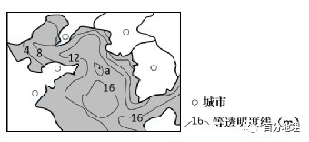
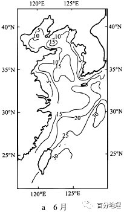
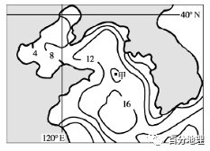
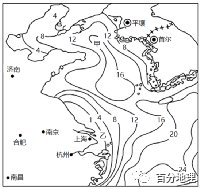
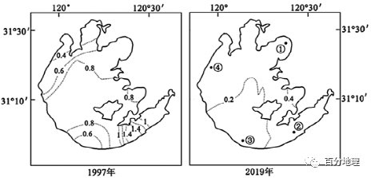
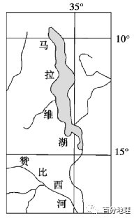
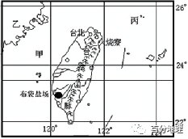
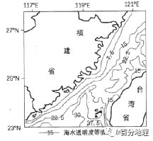
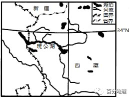
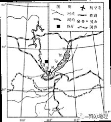

# 微专题之074 从产业结构角度分析区域发展

```
本专题摘自“百分地理”公众号，如有侵权请告之删除，谢谢。联系hhwxyhh@163.com
```

------
   
（2022·山东·昌乐二中高一阶段练习）海水透明度表示海水的能见程度，数值越大，说明透明度越高。下图示意我国某海域某年8月海水透明度等值线分布。据此完成下面小题。   
   
   
   
1．推测a地海域海水透明度是（  ）   
A．11   
B．13   
C．16   
D．20   
2．a地所在海域东部、北部海水等透明度线密集，主要是因为（  ）   
A．大气降水多   
B．沿岸排放污染物多   
C．海平面上升   
D．海岸线曲折幽深   
3．此季节渤海海域海水透明度较低，其主要影响因素是（  ）   
A．海陆位置   
B．洋流性质   
C．径流量   
D．云层厚度   
<span style="color: rgb(255, 0, 0);">1．A据图中等值线的变化特征和“大于大的、小于小的”这一规律，a地海域等透明度数值介于8——12或16——20之间，故透明度可能为11。A正确，BCD错误。故选A。</span>   
<span style="color: rgb(255, 0, 0);">2．B a地所在海域东部、北部海域等透明度线密集，主要是因为沿岸排放污染物多，且由沿岸向海洋逐渐减少。海水透明度与海岸线形态和海平面上升关系不大，大气降水多会导致海水等透明度线稀疏。B正确，ACD错误。故选B。</span>   
<span style="color: rgb(255, 0, 0);">3．C 8月锋面带北移至我国华北地区。图示地区河流径流量大，携带的泥沙多，导致渤海海域海水透明度较低，C正确。海陆位置不随季节变化，洋流性质、云层厚度不是主要影响因素，ABD错误。故选C。</span>   
<span style="color: rgb(255, 0, 0);">【点睛】海水透明度的影响因素有海水的颜色、水中的悬浮物质、浮游生物、海水的涡动、进入海水中的径流，以及天空中的云量等。</span>   
（2023·全国·高三专题练习）海水透明度是表示海水能见程度的一个量度，影响透明度分布和变化的主要因素是海水的光学性质、水中的悬浮物质等，下图为局部海域6月和10月等透明度线分布图。据此完成下面小题。   
   
   
   
4．下列说法正确的是（  ）   
A．等透明度线与等深线的分布比较接近   
B．夏季渤海海域透明度低于秋季   
C．夏季东海近岸与外海透明度差异较大   
D．近岸海区较外海的能见程度好   
5．10月份甲地形成向外海突出的“水舌”，主要影响因素是（  ）   
A．洋流   
B．地表径流   
C．海底地形   
D．人类活动   
<span style="color: rgb(255, 0, 0);">4．A读图可知，等透明度线数值由近岸海区向外海逐渐升高，等深线数值也是由近岸向外海逐渐增大，二者分布比较接近，A正确；夏季渤海海域透明度数值高于秋季，夏季透明度高于秋季，B错误；夏季东海近岸与外海等透明度线分布稀疏，透明度差异较小，C错误；近岸海区较外海的透明度要低，能见程度较差，D错误。故选A。</span>   
<span style="color: rgb(255, 0, 0);">5．B 10月份甲地形成向外海突出的水舌，等透明度线凸向高值，透明度低。此时长江水量大，向海洋注入水量大，并带来大量泥沙和陆地营养盐类，使河口处向外透明度降低。因此主要影响因素是地表径流，B正确；突出方向与洋流流向不一致，不是洋流因素，A错误；海底地形不存在季节变化，人类活动季节变化也小不是影响等值线季节变化的因素，CD错误。故选B。</span>   
<span style="color: rgb(255, 0, 0);">【点睛】海水透明度是海水能见度的一种量度。通常以直径30cm的白色圆盘垂直放入海水中的可见深度来表示。其影响因素有海水的颜色、水中的悬浮物质、浮游生物、海水的涡动、进入海水中的径流，以及天空中的云量等。大洋中悬浮物较少，透明度一般可达50～60米；近海悬浮物较多，约达10～30米；河口地区因水中含有大量泥沙，常缩小至1～2米。世界上透明度最高的海是马尾藻海。</span>   
（2022·全国·高三专题练习）海水透明度表示的是海水的能见度，数值越大，透明度越高。下图示意某海域8月海水透明度（米）等值线分布。读图，据此完成下面小题。   
   
   
   
6．甲点海域海水等透明数值可能是（  ）   
A．17   
B．16   
C．14   
D．12   
7．甲海域东北部海水等透明度线较西南部密集的主要原因是东北部海域（  ）   
A．海岸线更曲折   
B．污染物排放更多   
C．海域水深更浅   
D．海底坡度更陡   
8．此季节渤海海域海水透明度达到一年中的最高值，其主要的影响因素是（  ）   
A．海陆位置   
B．气候   
C．洋流   
D．大陆轮廓   
<span style="color: rgb(255, 0, 0);">6．A从图中看，甲位于闭合等值线内，相邻等值线数值为12和16，根据“大于大的，小于小的”等值线判读原则，如果甲处外围等值线数值为12，则甲处数值为8——12，但不能等于12，D错；如果甲处外围等值线数值为16，甲的取值大于16小于20，A正确、BC错。故选A。</span>   
<span style="color: rgb(255, 0, 0);">7．D从图中看，甲海域东北部等透明度线密集，说明海底坡度陡，深度变化大，透明度变化也就大，D正确；海水等透明度与海岸线曲折、海域水深无关，AC错；污染物排放影响透明度的数值的大小，对数值变化大小影响小，B错。故选D。</span>   
<span style="color: rgb(255, 0, 0);">8．B由材料可知，图示时间是8月，为夏季；夏季表层海水温度高，底层海水温度低，海水不易搅动，海水流速慢，泥沙易沉积，海水透明度好，影响因素是气候，B正确；海陆位置、洋流、大陆轮廓不随季节变化而变化，ACD错。故选B。</span>   
<span style="color: rgb(255, 0, 0);">【点睛】闭合等高线判断：遵循“大于大的，小于小的”规律。若闭合曲线数值与其中的高值相等，则曲线内的数值高于这个高值，且不超过一个等高距，为“大于大的”。若闭合曲线数值与其中的低值相等，则曲线内的数值低于这个低值，且不超过一个等高距，为“小于小的”。</span>   
（2022·全国·高二）海水透明度是指用直径为30cm的白色圆板，在阳光不能直接照射的地方垂直沉入水中，直到看不见的深度。下图为中国沿海夏季海水多年平均透明度等值线（单位：m）分布图。读图，完成下面小题。   
   
   
   
9．甲处等值线向北凸出的原因是（  ）   
A．海水深度变小   
B．水较清的暖流流经   
C．海水深度变大   
D．水较浑的寒流流经   
10．6一7月时，乙处数值为1的等值线较其他月份将会（  ）   
A．向东移动   
B．向南移动   
C．向西移动   
D．向北移动   
11．从总体看，图示各海域中渤海透明度最低的原因是（  ）   
①表层浮游生物密度大   
②周围地区人类活动强度大，污染物排放量大   
③入海河流含沙量大   
④海域较封闭，污染物难扩散   
A．①②③   
B．①②④   
C．①③④   
D．②③④   
<span style="color: rgb(255, 0, 0);">9．B据图可知，甲处海水透明度等值线向北凸出，根据凸向低值为高值区的规律，说明甲处海水清澈，该处海水透明度高，结合海水透明度的定义来看海水深度的变化不是主要影响海水透明度的因素，AC错；水质较清的暖流流经可以增加海水透明度，B正确；水质较浑的寒流流经会使得海水浑浊，降低海水透明度，D错，综上所述，ACD错误，本题选B。</span>   
<span style="color: rgb(255, 0, 0);">10．A6-7月为夏季，该季节长江流量较大，含沙量较大，水质较浑浊，乙处长江入海口的海水透明度数值会变小，数值为1的等值线将会向东移动，A项正确，BCD错误，本题选A。</span>   
<span style="color: rgb(255, 0, 0);">11．D渤海属于内海，周围是陆地，周围地区人类活动强度高，污染物排放量大，②正确；黄河、海河含沙量大，同时海域较封闭，污染物难扩散，所以透明度较小；③④正确，污染严重，浮游生物生存受影响，密度应该较小，①错。综上所述，ABC错误，本题D选项正确。</span>   
<span style="color: rgb(255, 0, 0);">【点睛】影响河流含沙量的因素：1.降水强度：降水强度大，多暴雨的地方含沙量大。2.地形：地形起伏大，侵蚀作用强，含沙量大。3.土质的疏松程度和土层的厚度：土质疏松，土层巨厚的地方河流含沙量大。4.植被覆盖率</span>   
（2022·全国·高三专题练习）湖水透明度是指阳光能够透过水体的深度，其影响因素主要有污染、生物量、入湖径流、温度变化等。研究表明：富含营养物的污染物会导致湖水中藻类繁生，影响太湖湖水透明度，而沉水植物（指植物体全部位于水下生存的大型水生植物）能吸收水体中的营养物质，维持湖水的清洁透明。下图为1997年和2019年太湖夏季平均透明度空间分布图（单位为米）。据此完成下面小题。   
   
   
   
12．仅从陆地径流量和温度角度分析，正常年份太湖湖水透明度最高的季节最可能是（  ）   
A．春季   
B．夏季   
C．秋季   
D．冬季   
13．1997-2019年间，太湖夏季水质恶化最快的水域可能是（  ）   
A．①   
B．②   
C．③   
D．④   
14．由于人工调控，平均水深只有1.9米的太湖过去40年平均水位增加了约0.25米，水位上升与水体透明度之间存在明显的负相关关系，其原理是水位上升导致（  ）   
A．沉水植物的生长范围扩大   
B．沉水植物的光合作用减弱   
C．含沙量增加，湖水变浑浊   
D．排污量增加，藻类生长快   
<span style="color: rgb(255, 0, 0);">12．D影响湖水透明度的因素是多样的，本题要求仅从陆地径流量和温度角度分析，在正常年份冬季陆地径流量小，冲刷带入泥沙或其他物质较少；冬季温度较低，藻类生长相对缓慢，水面藻类覆盖较少。故太湖湖水透明度最高的季节最可能是冬季，D正确，ABC错误。故选D。</span>   
<span style="color: rgb(255, 0, 0);">13．B读图，1997-2019年间，②区域的透明度减少得最多，故太湖夏季水质恶化最快的水域可能是②，B正确。故选B。</span>   
<span style="color: rgb(255, 0, 0);">14．B材料说明太湖过去40年平均水位上升了，水面下的光照会减弱，沉水植物吸收水体的营养物减少，对水体的净化能力减弱，所以，水位上升与水体透明度之间存在明显的负相关关系的原理是水位上升导致沉水植物的光合作用减弱，B正确。水位上升并不应意味着水体生长范围扩大，A错误。水位上升与含沙量和排污没有必然联系，CD错误。故本题选B。</span>   
<span style="color: rgb(255, 0, 0);">【点睛】水体污染的原因：1.水体更新速度慢；2.水域空间密闭；3.有污染物排放。</span>   
马拉维湖位于东非大裂谷最南面，平均水深273米，四周有多条常年有水的河流注入湖泊。马拉维湖湖水的透明度常因温度和降水的影响，随季节的变化较为剧烈。马拉维湖湖中生物种类十分丰富，仅慈鲷鱼就有850多种。慈鲷鱼都生活在湖底，且只有沿湖岸线的狭窄区域才有分布。读马拉维湖及周边地区示意图，据此完成下面小题。   
   
   
   
15．马拉维湖的形成原因是（  ）   
A．地壳断裂下陷   
B．河流改道   
C．褶皱凹陷   
D．冰川作用   
16．马拉维湖12月份透明度最低，其主要原因可能是（  ）   
A．降水量丰富，入湖水量大   
B．风力弱，湖水流动性差   
C．气温高，蒸发旺盛   
D．太阳高度角小   
17．慈鲷鱼只分布于沿湖岸线的狭窄区域的主要原因是（  ）   
A．河流入湖带来丰富的营养物质   
B．水域较浅，阳光和氧气充足   
C．湖岸沿线水质好   
D．底层湖水上涌，饵料丰富   
<span style="color: rgb(255, 0, 0);">15．A 由材料可知，马拉维湖位于东非大裂谷最南端，其形成原因与东非大裂谷一样，是由地壳断裂下陷形成凹陷，加上该地区降水丰富，地表径流汇入积水成湖，与河流改道、褶皱凹陷作用无关，A正确，BC错；冰川作用主要分布于高纬度或高海拔地区，该地区纬度低，气温高，冰川作用不显著，D错；故选A。</span>   
<span style="color: rgb(255, 0, 0);">16．A “马拉维湖湖水的透明度常因温度和降水的影响，随季节的变化较为剧烈”，据图中经纬度可知，图示区域气候类型为热带草原气候，12月份为马拉维湖（南半球）热带草原气候的雨季，降水丰富，对土壤侵蚀作用强，入湖水量大，入湖径流带来大量的泥沙使湖水透明度降低，A正确；风力弱，湖水流动性差，有利于泥沙沉积，湖水透明度高，与题意不符，B错；蒸发强弱不影响湖水透明度，C错；12月份为当地夏半年，太阳高度角大，D错；故选A。</span>   
<span style="color: rgb(255, 0, 0);">17．A 沿湖岸线的狭窄区域，水域较浅，阳光和氧气充足，有利于浮游生物的生长，为慈鲷鱼提供充足的饵料，从而导致慈鲷鱼只分布于沿湖岸线的狭窄区域，B正确；河流入湖带来丰富的营养物质有利于慈鲷鱼生长，但据图可知沿湖岸线的狭窄区域，并不是所有地方都有河流入湖，A错误；同一个湖泊，水质差别不大，C错误；慈鲷鱼都生活在湖底，D错误；故选B。</span>   
<span style="color: rgb(255, 0, 0);">【点睛】马拉维湖位于东非大裂谷最南端，是由地壳断裂下陷形成凹陷，加上该地区降水丰富，地表径流汇入积水成湖。</span>   
二、综合题   
18．（2022·全国·高三专题练习）结合台湾区域图和材料，回答下列问题。   
材料一、我国有三大著名的盐场，渤海沿岸长芦盐场，台湾岛西南沿海布袋盐场，海南岛西南部莺歌盐场。台湾的布袋盐场产量高、质量好，素有“东南盐库”之称，年产海盐四五十万吨。   
材料二、海水透明度和水色是海水之美的两个基本要素。透明度表示的是海水的能见程度，数值越大，透明度越高。透明度高的海水在太阳高度的变化下，呈现出不同的水色，让海水变幻出多种色彩。台湾东部海岸线海水水色漂亮，海岸地貌多样，风景优美。   
下左图是台湾区域图，右下图是我国东部沿海一定范围内的海域8月份海水多年平均透明度等值线图。   
   
   
   
（1）从自然条件角度分析台湾西部布袋盐场形成的有利条件。   
（2）简述我国东部海域海水透明度的分布规律。   
（3）台湾岛东部海域透明度明显高于西部的台湾海峡，请结合以上图文材料和已有知识分析台湾岛东部海域海水透明度高的原因。   
<span style="color: rgb(255, 0, 0);">【答案】（1）台湾西部有平坦开阔的海滩，利于晒盐；纬度低气温高，蒸发旺盛；地处背风坡降水较少，晴日多，蒸发量大；海水盐度高、水质好。</span>   
<span style="color: rgb(255, 0, 0);">（2）透明度差异大；透明度由近海（海岸）向远海逐渐升高（离陆地越远透明度越高）；透明度由北向南透明度逐渐升高。</span>   
<span style="color: rgb(255, 0, 0);">（3）台湾岛东部海域面积广阔，海水深度较大，水体自净能力强；陆上河流流入少，输入海洋的泥沙少；受人类活动影响小，海水污染小。</span>   
<span style="color: rgb(255, 0, 0);">【详解】（1）盐场晒盐的原理是把海水当中的水分蒸发，盐分留下，所以需要的条件是利于蒸发的光照强，根据布袋盐场地理位置可知台湾岛西部位于季风气候夏季风的背风坡，降水少，晴天多，加上纬度低，气温高，蒸发旺盛。晒盐需要把海水抽取到陆地上平铺晒干，所以需要地势平坦开阔，最好是淤泥质海滩。根据图中台湾岛的山脉和水文信息可知，台湾岛西侧地势平坦开阔。文字材料中说布袋盐场的质量好，产量大，由此推知，台湾岛西侧的海水盐度高，水质好。（2）根据图中等透明线的分布特点，我国东部海域海水透明度分布不均匀，等透明度线从我国海岸向外海透明度增加，南北方向上南方海域透明度高于北方地区。（3）海水的透明度反映的是海水的能见程度，如果海水当中的泥沙或者是杂质较少，那么透明度应该更高。通过台湾岛区域图我们可知，台湾岛西侧河流更多，城市更密集，河流排放的污染物质和泥沙较多，加上西侧位于台湾海峡，东侧位于亚欧板块和太平洋板块的消亡边界，西侧水浅，东侧水深，东侧海水净化能力强。</span>   
19．（2022·全国·高一）（海洋地理）海水透明度是指海水的清澈程度，是描述海水光学性质的一个重要参数。其影响因素主要有海水中的悬浮物质，浮游生物的含量，江河入海径流，天空中的云量，海水的涡动与混合，以及风、浪等，下图是我国台湾海峡多年冬季（1月）海水平均透明度等值线（单位:m）图。读图完成下列问题。   
   
   
   
（1）简述图示海域海水透明度的空间分布特征。   
（2）分析台湾海峡冬季整个海域海水透明度都比较低的主要原因。   
<span style="color: rgb(255, 0, 0);">【答案】（1）①透明度等值线与海岸线基本平行②一般沿岸浅海透明度较低，外海透明度较高;③南部透明度明显高于北部。</span>   
<span style="color: rgb(255, 0, 0);">（2）①冬季沿岸流势力加强，将东海较低透明度的海水带入台湾海峡，造成整个台湾海峡海水透明度有所降低;②冬季海面风力较大，产生的海浪使海面反射率增大，使透射进入海水的光照减少，降低透明度。③冬季表层海水水温低，底层水温高，加上表层风力大，海水易搅动④冬季海水流速快，泥沙不易沉积，海水透明度差。</span>   
<span style="color: rgb(255, 0, 0);">【详解】（1）从图的数值和分布可以看出，透明度等值线大致与海岸线平行，离海岸越远，透明度越高。从数值可知，南部的数值高于北部，故南部透明度明显高于北部（数值越大，透明度越高）。（2）冬季，我国北部强劲沿岸流自北南下，将东海较低透明度的海水带入台湾海峡，造成整个台湾海峡海水透明度有所降低；我国冬季风势力强，风力大，台湾海峡冬季海面风力较大，容易将海底物质搅动上来，风力作用产生的海浪使海面反射率增大，使透射进入海水的光照减少，降低透明度，所以台湾海峡冬季海水透明度比较低；冬季表层海水放热快，水温低，底层海水放热慢，水温高，加上表层风力大，海水易搅动，海水透明度低。在冬季风的影响下，冬季海水流速快，泥沙不易沉积，海水透明度差。</span>   
20．（2021·山东·济南市天桥区黄河双语实验学校高三阶段练习）阅读材料，回答问题。   
材料一：湖水透明度是指湖水能使光线透过的程度，表示水的清澈情况，是水质评价指标之一。影响湖水透明度的因素主要有浮游生物量、泥沙含量、水体运动、入射光线等。   
材料二：班公湖（下图）是西藏阿里地区的高原湖泊。湖面海拔4240米，东西长约150多公里，南北平均宽约4公里，最窄处仅5米，平均水深5米，最大水深达41米。该湖湖水盐度东西差异大，夏季东部湖水垂直交换弱，水体透明度较高。   
   
   
   
（1）判断班公湖湖水盐度的东西差异，并说明存在差异的原因。   
（2）根据对流运动原理，分析夏季班公湖东部湖水垂直交换弱的原因   
（3）分析夏季班公湖东部湖水水体透明度较高的自然原因。   
<span style="color: rgb(255, 0, 0);">【答案】（1）湖水东淡西咸/东部低，西部高/东部比西部低/西部比东部高。东部有河流注入，盐度低（西部无河流注入，盐度高）；湖泊东西狭长，中部狭窄，不利于东西部湖水交换。</span>   
<span style="color: rgb(255, 0, 0);">（2）答案一：夏季太阳辐射强，表层水温高，（湖水密度小）；（湖水深），底部湖水吸收太阳辐射少，水温较低，（湖水密度较大），湖水上暖下冷，（密度下大上小），湖水垂直交换弱。</span>   
<span style="color: rgb(255, 0, 0);">答案二：夏季，湖面有冰川融水补给，表层水温不太高/（湖水浅、透明度高），湖底吸收太阳辐射多，水温不会太低，造成湖水上下温差小，湖水垂直交换弱。</span>   
<span style="color: rgb(255, 0, 0);">（3）海拔高，水温低，浮游生物少；夏季冰川融水补给湖水，含沙量小；夏季湖水上暖下冷（垂直交换弱），水体稳定；夏季太阳高度大，太阳光穿透性强。</span>   
<span style="color: rgb(255, 0, 0);">【详解】（1）影响湖水盐度高低的因素主要从河流的补给、蒸发量和降水量的特点、水域形状等方面进行分析，该湖泊属于内流湖，水分支出以蒸发为主，盐分易积累，因而盐度较高；读图可知，东部有多条河流淡水注入，稀释作用强，盐度较低，西部无河流注入，盐度高；湖泊狭长，中间水域较窄，不利于东西部湖水交换。（2）影响湖泊水垂直交换的因素主要是密度差异，湖水表层水温高、上部密度小，下部水温较低、密度大，湖水上暖下冷、密度下大上小，湖水就比较稳定，垂直交换就不明显。夏季太阳辐射强，表层湖水吸收太阳辐射多，水温升高，表层湖水密度减小；夏季有大量高山冰雪融水及雨水补给，使表层湖水盐度降低，密度降低；夏季湖水水位高，深层湖水承受压力增大而密度增大；下重上轻不利于湖水对流，垂直分层明显。（3）结合材料，影响湖水透明度的因素主要有浮游生物量、泥沙含量、水体运动、入射光线等，班公湖位于青藏高原，海拔高，水温低，浮游生物少；夏季湖泊水源补给以冰川融水补给为主，冰川融雪物源区物源含沙量小，以砾石为主；夏季湖水由于上部密度小，下部密度大，水体垂直交换弱，水体状况较稳定；夏季太阳高度角大，光照强烈，太阳光穿透性强。</span>   
21．（2021·河北·石家庄二中高二期中）阅读图文资料，完成下列要求。   
材料一：贝加尔湖是世界上最深和蓄水量最大的淡水湖，湖面海拔456米。湖中动植物资源丰富，大量的端足类动物使贝加尔湖具有“自体净化”功能，湖水非常纯净，常年测量结果表明，贝加尔湖湖水的最大透明度达到40.22米，这个数值在全世界仅略低于日本的摩周湖而位居第二。有336条河流注入贝加尔湖，但只有一条河——安加拉河从湖泊流出。   
材料二：图为贝加尔湖流域局部示意图，图为贝加尔湖一段剖面图。   
   
   
   
(1)简述安加拉河的水文特征。   
(2)分析贝加尔湖湖水纯净、透明度高的原因。   
(3)分析莫斯科政府在贝加尔湖地区大力发展旅游业的影响。   
<span style="color: rgb(255, 0, 0);">【答案】(1)径流量稳定；河流结冰期长；含沙量小；水能丰富。（有凌汛现象）</span>   
<span style="color: rgb(255, 0, 0);">(2)湖内生物资源丰富，大量的端足类动物使贝加尔湖具有“自体净化”功能，自净能力强。湖底深邃，湖下水面平静受人类活动影响小，湖中氮、磷等营养元素含量低，藻类植物的密度也比较小。</span>   
<span style="color: rgb(255, 0, 0);">(3)有利影响：增加就业机会，带动相关产业的发展，增加经济收入，促进俄罗斯经济的发展。</span>   
<span style="color: rgb(255, 0, 0);">不利影响：开发不当造成生态破坏，生物多样性减少；游客的不文明行为造成的环境污染</span>   
<span style="color: rgb(255, 0, 0);">【分析】本题以贝加尔湖为背景，考查了河流水文特征及发展旅游业的影响。旨在考查学生的区域认知能力、综合思维能力及知识迁移能力。(1)根据图中纬度可知，该河流流经高纬度地区，河流结冰期较长，且从低纬度流向高纬度，故有凌汛现象；“有336条河流注入贝加尔湖”可知，流经地区有湖泊补给，径流量比较稳定；流经地区植被覆盖率高，河流含沙量小；“贝加尔湖是世界上最深和蓄水量最大的淡水湖，湖面海拔456米”可知，地势落差大，水能资源丰富。(2)由材料信息“湖中动植物资源丰富，大量的端足类动物使贝加尔湖具有“自体净化”功能”可知，大量端足类动物对湖水的净化作用，分解水藻、动物尸体，使贝加尔湖的水体杂质少，透光性能好。纬度高，人类活动影响少，氮、磷等营养元素含量低，藻类植物密度小。流域内植被覆盖率高，保持水土能力强，水土流失少。</span>   
<span style="color: rgb(255, 0, 0);">(3)由所学知识可知，影响类的题目要从有利和不利两方面来回答。有利影响：大力发展旅游业，可增提供更多的就业岗位，促进就业；同时带动餐饮、娱乐等相关产业的发展，增加经济收和财政税收收入，促进俄罗斯社会经济的发展。不利影响：由于当地纬度高，生态环境较为脆弱，如果旅游资源开发不当，可能会造成生态环境破坏，生物多样性减少等环境问题；个别游客的不文明旅游，也会造成当地的环境污染，使生态环境恶化。</span>
