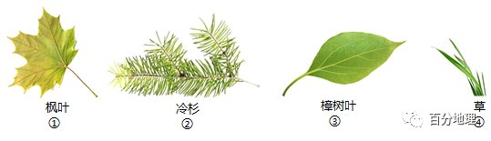

# 微专题之074 从产业结构角度分析区域发展

```
本专题摘自“百分地理”公众号，如有侵权请告之删除，谢谢。联系hhwxyhh@163.com
```

------
   
（2022·广东湛江·高三阶段练习）泰加林的主要树种是云杉、冷杉、落叶松等。密林里树木拥挤，树冠呈塔形，树叶呈针状且表面有蜡质。泰加林在高地成片分布，亚欧大陆自西向东.泰加林逐渐由暗针叶林变为明亮针叶林。下图示意泰加林带的分布。据此完成下面小题。   
   
   
   
1．泰加林树冠呈塔形有利于（  ）   
A．防风   
B．保暖   
C．保湿   
D．防积雪   
2．泰加林（  ）   
A．北界即地球森林带的北界   
B．林中物种繁多，层次复杂   
C．南界即地球草原带的北界   
D．分布区气候寒冷，土壤贫瘠   
3．与热带雨林相比，泰加林枯枝落叶量少但落叶层却较厚，其主要影响因素是（  ）   
A．气温   
B．地形   
C．水文   
D．降水   
<span style="color: rgb(255, 0, 0);">1．D从图中可以看出，泰加林分布在纬度较高的地区，冬季降雪量大，塔形树冠表面坡度大，利于积雪滑落，D正确；树冠呈塔形与防风、保暖和保湿没有直接关系，ABC错误。故选D。</span>   
<span style="color: rgb(255, 0, 0);">2．A泰加林分布在北美大陆和亚欧大陆的北部，其北部为苔原带，所以泰加林的北界即地球森林带的北界。A正确；泰加林纬度较高，热量条件较差，因此物种较少，层次简单，B错误；泰加林的南界并不是地球草原带的北界，C错误；泰加林分布区气候寒冷，但土壤肥沃，D错误。故选A。</span>   
<span style="color: rgb(255, 0, 0);">3．A泰加林所在地区纬度高，气温低，冬季漫长，落叶腐烂分解缓慢，所以落叶层较厚，A正确；泰加林落叶层较厚与地形、水文和降水没有关系，BCD错误。故选A。</span>   
<span style="color: rgb(255, 0, 0);">【点睛】生物是土壤有机物质的重要来源，土壤肥力的生产与生物作用关系密切。在适宜的湿度和光照条件下岩石表面滋生出苔藓类植物，它们依靠水中分解的微量矿物质元素得以生长同时分泌大量产物对岩石进行风化。气象因素（主要是降水）、土壤特征（孔隙度、容重、渗透性能等）、植被状况、人为活动都可能影响土壤含水量变化。</span>   
（2022·辽宁沈阳·高二学业考试）进入秋季，随着气温的下降，本溪的五角枫树叶（下图）由绿转红，而此时北京香山树叶并未转红。据此完成下面小题。   
   
   
   
4．五角枫树属于（  ）   
A．针叶林   
B．热带雨林   
C．常绿阔叶林   
D．落叶阔叶林   
5．影响本溪和北京枫树树叶转红时间不同的主要因素是（  ）   
A．热量   
B．水分   
C．地形   
D．土壤   
<span style="color: rgb(255, 0, 0);">4．D本溪的五角枫树叶由绿转红，说明即将落叶，所以五角枫树为落叶阔叶林，故D正确；由景观图可知五角枫树不属于针叶林，故A错误；本溪五角枫树在温带，不是热带、亚热带，故BC错误。故答案选D。</span>   
<span style="color: rgb(255, 0, 0);">5．A本溪纬度高气温更低，秋季来的更早，五角枫树叶子转红的更早，北京相比本溪，纬度低，气温高，入秋迟，枫树树叶转红的晚，所以影响本溪和北京枫树树叶转红时间不同的主要因素是热量，故A正确；水分、地形、土壤不是影响树叶转红早晚的主要因素。故BCD错误。故答案选A。</span>   
<span style="color: rgb(255, 0, 0);">【点睛】五角枫属于落叶乔木；冬芽紫褐色，有短柄。广布于东北、华北、西至陕西、四川、湖北、南达浙江、江西、安微等省。木材坚韧，用途较广，嫩叶可作菜和代茶。</span>   
（2022·全国·高二课时练习）滴水叶尖是指树叶的叶尾细长，能排除树叶内较多的水分，又避免雨水在叶面上积存。右图为某滴水叶尖照片。完成下面小题。   
   
   
   
6．滴水叶尖常出现在（  ）   
A．热带雨林   
B．常绿硬叶林   
C．热带草原   
D．落叶阔叶林   
7．下列对该现象的解释，最可信的是（  ）   
A．气候干旱，水分蒸腾多   
B．空气湿润，叶片吸水多   
C．降水丰富，叶片排水快   
D．光照强烈，出水反射强   
<span style="color: rgb(255, 0, 0);">6．A由材料可知，滴水叶尖是指树叶的叶尾细长，能排除树叶内较多的水分，又避免雨水在叶面上积存。所以，“滴水叶尖”该现象常年出现在热带雨林，因为该此处的特点是终年炎热多雨，A正确。常绿硬叶林、热带草原、落叶阔叶林分布区域有明显的雨季和旱季，降水没有热带雨林地区多，BCD错误。故选A。</span>   
<span style="color: rgb(255, 0, 0);">7．C此处降水多，叶片不需要太多的水分，需要排水，C正确，A错误。此叶片主要为了排除叶内较多的水，不是吸水，B错误。此处的叶片排水与光照的关系不大，D错误。故选C。</span>   
<span style="color: rgb(255, 0, 0);">【点睛】滴水叶尖是一种地理现象，也是一种美妙的自然界的现象。主要是指热带地区对流运动显著，每天午后两点左右都会由于强对流而形成对流雨，而热带地区的植物较茂盛，雨水顺叶尖流下，形成滴水叶尖。</span>   
（2022·上海市金汇高级中学高一期末）下图为一地理科考小组在某山地不同海拔收集到的主要植被叶片，枫叶（温带落叶阔叶），冷杉（亚寒带针叶），樟树叶（亚热带常绿阔叶）。完成下面小题。   
   
   
   
8．该山地四类植被所在海拔由高到低依次是（  ）   
A．①②③④   
B．④③②①   
C．①③②④   
D．④②①③   
9．③是香樟树树叶，是下列哪个地区的典型植被（  ）   
A．东北平原   
B．青藏高原   
C．华北平原   
D．长江中下游平原   
<span style="color: rgb(255, 0, 0);">8．D本题考查地理环境差异性的相关知识。①项，枫树是温带落叶阔叶林树种；②项，冷杉树是亚寒带针叶林树种，耐寒喜凉；③项，樟树是亚热带常绿阔叶林树种；4项，草主要分布在高山草甸。根据山地的垂直地域分异规律，比较四类植被所处地区温度差异，高山草甸海拔最高，其次是杉树叶、枫树叶，樟树叶的海拔最低。所以排序是④②①③。综上所述，本题正确答案为D。</span>   
<span style="color: rgb(255, 0, 0);">9．D本题考查植被的相关知识。结合所学知识，香樟树为亚热带常绿阔叶林树种，对应气候为亚热带季风气候；D项，长江中下游平原为亚热带季风气候。故D项正确；A项、C项，东北平原和华北平原为温带季风气候。故A项、C项均错误；B项，青藏高原为高原山地气候。故B项错误。综上所述，本题正确答案为D。</span>   
<span style="color: rgb(255, 0, 0);">【点睛】亚热带常绿阔叶林，对应气候为亚热带季风气候；亚寒带针叶林，对应气候为亚寒带针叶林气候；温带落叶阔叶林对应气候为温带季风气候或温带海洋性气候。</span>   
（2022·河北·广平县育华中学高二期末）台湾岛上森林资源丰富，其中樟树是特色树种，其叶片具有革质特征。樟树喜温暖湿润的气候，宜生长在年均温16   
℃以上、1月平均气温在5   
℃以上的地区，其抗寒能力不强。下图为台湾岛植被分布示意图。据此完成下面小题。   
   
   
   
10．图中台湾岛森林分布特征的主要成因是（  ）   
A．受海洋影响显著   
B．南北纬度跨度大   
C．受林业发展区划影响显著   
D．受地形影响显著   
11．樟树叶片具有革质特征，该特征有利于（  ）   
A．减少水分蒸腾   
B．抗寒   
C．减轻病虫危害   
D．增强光合作用   
<span style="color: rgb(255, 0, 0);">10．D根据陆地自然带地域分异规律，针叶林一般分布于高山或较高纬度地区。台湾岛纬度较低，纬度不是针叶林分布原因，B错误。海洋影响不是森林类型差异的原因，A错误。中东部地势较高，符合针叶林的生长环境，台湾岛的森林分布受地形影响显著，D正确。林业发展区划不能影响自然带植被类型，C错误。故选D。</span>   
<span style="color: rgb(255, 0, 0);">11．B</span>   
<span style="color: rgb(255, 0, 0);">樟树叶片的革质特征，不能减轻病虫危害，不能增强光合作用，C、D错误。樟树喜温暖湿润的气候，台湾岛降水丰富，叶片特征与减少水分蒸腾无关，A错误。樟树抗寒能力不强，台湾岛上樟树主要位于山地，叶片的革质特征可以起抗寒作用，B正确。故选B。</span>   
<span style="color: rgb(255, 0, 0);">【点睛】革质特征就是叶片表面光滑的，感觉像皮革一样的这样的叶片叫革质叶，樟树，石楠，笱骨，茶花，茶梅，鹅掌柴还有冬青树，女贞树，桂花树，油茶树，光叶杜鹃等等。相对应的就是纸质叶，如泡桐树，木槿，梧桐树，木芙蓉，枫香树等等。樟树喜温暖湿润的气候，台湾岛降水丰富，能满足樟树生长的水分需求；樟树抗寒能力不强，因此叶片的革质特征主要起抗寒作用。</span>   
（2022·宁夏·银川一中三模）行道树是指种在道路两旁及分车带，给车辆和行人遮荫并构成街景的树种。史料记载我国早在周代就开始种植行道树，是世界上种植行道树历史最悠久、数量最多的国家。与自然环境中生长的树不同，城市的行道树通常栽种在一米见方，80厘米深的树池里。据此完成下面小题。   
12．推测我国周代时期行道树的主要作用是（  ）   
A．标记道路位置及范围   
B．吸烟滞尘，美化环境   
C．分隔机动车道和人行道   
D．缓解城市热岛效应   
13．与自然环境下的树木相比，我国北方大部分城市行道树的生存条件及特征，表现在（  ）   
①废气笼罩，低温冷害②根域空间狭小，水分难以涵养   
③土壤肥力充足，生长速度快④温差变小，秋季树叶变色慢   
A．①②   
B．③④   
C．②③   
D．②④   
14．为较好地发挥行道树的功能，城市在选择行道树种时一般选择（  ）   
A．吸水能力强，易拱根的树   
B．树干直且细，四季常绿树   
C．生长速度快，易结果的树   
D．树冠大且密，耐修剪的树   
<span style="color: rgb(255, 0, 0);">12．A因在周代地区没有机动车等现代交通工具，且当时城市化水平极低，人类对环境的破坏较少。因而行道树的主要作用不可能是“吸烟滞尘，美化环境”或“分隔机动车道和人行道”和“缓解城市热岛效应”，故BCD错误，因周代人类对环境影响较小，道路和其他区域标志不明显，行道树最有可能作为“道路位置及范围”的标记，因而A正确。故本题选A。</span>   
<span style="color: rgb(255, 0, 0);">13．D因“城市的行道树通常栽种在一米见方，80厘米深的树池里。地表周边地区没有土壤，树池与地下相邻区域也难以进行水分和养分的交换，树池里只有单一树木缺少其他植被，土壤养分也很难得到补充，所以与天然环境下的树木相比，大部分城市中行道树生长的根域空间狭小、土壤肥力不足、水分难以涵养。城市中有空气污染，行道树可能被废气笼罩，但是因为城市有明显热岛效应，因而与天然环境的树木生长条件相比，不会“低温冷害”的影响，温差变小，秋季树叶变色慢。因而题中②④组合的D选项正确，ABC三项错。故本题选D。</span>   
<span style="color: rgb(255, 0, 0);">14．D据材料可知，行道树的作用主要是分隔道路、遮荫和美化环境。因而一般选择树冠大且密遮荫效果好的树，为使树木下部占据空间较小，通常要对树干下部枝叶进行修剪，所以要择耐修剪的树，故D正确；若树木易拱根则易破坏地表，影响人车正常行驶，或加重道路维护费用，因而A错误；在世界范围内，因各城市气候不同，其适宜选择的行道树类型就不相同，常绿树只能生长在部分地区，因而B错误；选易结果的树木作为行道树容易出现落果伤人（车）事故，因而不宜选易结果树木，故C错。因此本题选D。</span>   
<span style="color: rgb(255, 0, 0);">【点睛】城市中行道树的作用：1、行道树具有很好的光合作用，可以净化空气。2、行道树可以具有遮阳的作用，避免发生暴晒问题。3、行道树可以降低噪音，使得人们的生活环境更好。4、行道树蒸发的作用可以有效地调节气候，气候条件会更理想。</span>   
（2022·全国·高二）森林凋落物也可称为枯落物（枯叶、枯枝、果实），下图为世界某地甲乙两种树种森林凋落物数量的逐月变化示意图，据此完成下面小题。   
   
   
   
15．甲树种广泛分布于（  ）   
A．华北平原   
B．东南丘陵   
C．藏北高原   
D．东北大兴安岭   
16．乙树种的特点的是（  ）   
A．全年生长、开花，深绿茎花、板状根   
B．常绿，花期集中，多革质叶片   
C．叶片宽阔，春季发叶，秋冬季落叶   
D．针状树叶   
<span style="color: rgb(255, 0, 0);">15．B从图中可以看到甲树种凋落物主要时间为冬春之际及秋季，冬春之际有凋落说明树木属常绿，冬季气温低，树木仍有枯枝落叶发生，说明树木所在纬度较低。华北平原主要属落叶阔叶林，其植被主要是夏季茂密，秋季为主要枯枝落叶的掉落时间，冬季树木较为凋零， A选项错误。东南丘陵属亚热带季风气候，其植被为亚热带常绿阔叶林，凋落物在气温水分较差的春季与秋季较多，B选项正确。藏北高原以高原草原和高原荒漠为主，其主要生长在夏季，秋季即枯落，冬季地表较为荒芜， C选项错误。东北大兴安岭地区主要为针叶林带，其凋落物数量较少，春季凋落现象并不集中，D选项错误。故选B。</span>   
<span style="color: rgb(255, 0, 0);">16．C从图中可以看到乙树种凋落物集中的时间主要为秋季，冬季并无凋落物。全年生长、开花，深绿茎花、板状根为热带雨林带的典型植被特征，雨林带由于其全年均可生长，其凋落物全年皆有，A选项错误。常绿、花期集中、多革质叶片为亚热带常绿阔叶林带的典型植被特征，亚热带常绿阔叶林全年常绿，凋落物在气温水源较差的春季与秋季较多，B选项错误。叶片宽阔，春季发叶，秋冬季落叶为温带落叶阔叶林带的典型植被特征，由于秋季气温降低，植被凋落物在秋季集中凋落，C选项正确。针状树叶为亚寒带针叶林带的典型植被特征，亚寒带针叶林带四季常青，其凋落物数量较少，且各季节均有分布，D选项错误。故选C。</span>   
<span style="color: rgb(255, 0, 0);">【点睛】常绿阔叶林一般处于亚热带季风气候地区，这种地区的气候特点是夏季高温多雨，冬季低温少雨。革质叶片表面光滑，角质层较厚，在夏季高温情况下光滑有光泽的革质叶片可有效反射太阳直射，避免叶片被灼伤；可以使水分不易蒸发，减少水分的流失；还能防水，避免长期浸泡在水中缺氧；冬季的时候可以保温。</span>   
（2021·甘肃·靖远县第四中学高三阶段练习）千里木多分布在非洲乞力马扎罗山海拔3600——4300m处，是东非高原上的植物巨人。千里木树高一般在3m以上，最高可达10m，树叶聚生在枝顶，呈螺旋状排列，最顶部的树叶在夜间会闭合，向内卷起，树叶枯萎仍挂在树干上而不凋落。下图示意千里木景观。据此完成下面小题。   
   
   
   
17．乞力马扎罗山千里木分布区属（  ）   
A．热带草原带   
B．高山草甸带   
C．高山灌木带   
D．热带雨林带   
18．千里木最顶部的树叶在夜间闭合枯萎而不落，有利于（  ）   
A．减少植物体内水分蒸发   
B．减少高山强紫外线照射   
C．防止高山大风吹倒植物   
D．抵御高海拔地区的冻害   
<span style="color: rgb(255, 0, 0);">17．B根据材料“千里木多分布在非洲乞力马扎罗山海拔3600——4300m处”可知，乞力马扎罗山千里木分布区属于高山草甸带，B正确；热带草原带和热带雨林带是乞力马扎罗山低海拔处的自然带，AD错误；乞力马扎罗山没有高山灌木带，而且千里木树木树高一般在3m以上，也不属于灌木植被，C错误。故选B。</span>   
<span style="color: rgb(255, 0, 0);">18．D根据所学知识可知，千里木最顶部的树叶在夜间闭合枯萎而不落，有利于抵御高海拔地区的冻害，D正确；夜间温度低，植物蒸腾弱，植物体内水分在夜间减少的少，因此树叶在夜间闭合枯萎而不落，与减少植物体内水分蒸发无关，A错误；夜间没有阳光照射，不是为了减少高山强紫外线照射，B错误；与防止高山大风吹倒植物无关，C错误。故选D。</span>   
<span style="color: rgb(255, 0, 0);">【点睛】影响山体垂直自然带谱复杂程度的因素。(1)山体所在纬度──相同高度的山体,纬度愈低愈复杂,纬度愈高愈简单。(2)山体海拔──纬度相当的山体,海拔愈高愈复杂(有极限),海拔愈低愈简单。(3)山顶、山麓之间相对高度——相对高度大则复杂,相对高度小则简单。</span>   
（2021·云南·大理市大理第二中学高一期中）下图示意两类常见森林树叶类型。据此完成下面小题。   
   
   
   
19．甲树叶所在森林的植被特征是（  ）   
A．具有板根、茎花现象   
B．树冠为典型不对称结构   
C．叶片呈革质，质地硬   
D．夏季葱绿，秋季枯黄   
20．乙树叶所在森林主要分布在（  ）   
A．华北平原地区   
B．江南丘陵地区   
C．亚马孙平原地区   
D．西北内陆地区   
<span style="color: rgb(255, 0, 0);">19．C甲树叶所在森林是常绿林阔叶林，其植被特征为叶片呈革质，质地较硬，C正确。“具有板根、茎花现象”是热带雨林，常绿阔叶林树冠并没有呈现典型不对称结构，“夏季葱绿，秋季枯黄”是落叶阔叶林。故选C。</span>   
<span style="color: rgb(255, 0, 0);">20．A乙树叶为枫叶，乙树叶所在森林是落叶阔叶林，主要分布在温带季风气候区或温带海洋性气候区，我国华北平原分布最广，A正确。江南丘陵地区多常绿阔叶林，亚马孙平原地区多热带雨林，西北内陆地区气候干旱，多温带草原或温带荒漠。故选A。</span>   
<span style="color: rgb(255, 0, 0);">【点睛】植被分布与环境关系密切，主要受气候（光照、热量、水分、盛行风向）、地形（海拔的影响、坡向的影响、坡度的影响）、土壤（土壤水分、肥力、通透性、热量等）等因素的影响。</span>   
（2021·江苏连云港·高二学业考试）“远上寒山石径斜,白云生处有人家。停车坐爱枫林晚,霜叶红于二月花。”枫树属槭树科,广泛分布于北温带及热带山地,亚洲、欧洲、北美洲均有分布,中国是世界上槭树种类最多的国家。下图为我国某地枫树林景观图。据此完成下面小题。   
   
   
   
21．枫树林属于（  ）   
A．针叶林   
B．落叶阔叶林   
C．常绿硬叶林   
D．常绿阔叶林   
22．秋季北京的枫树叶先于南京变红,其主要影响因素是（  ）   
A．地形   
B．降水   
C．光照   
D．热量   
<span style="color: rgb(255, 0, 0);">21．B由诗词“远上寒山石径斜”可知该季节是深秋季节，”霜叶红于二月花”及图示信息可知，枫叶会在秋天落叶，掉落在地面；所以枫叶属于落叶阔叶林，B正确。ACD错误。故选B。</span>   
<span style="color: rgb(255, 0, 0);">22．D由所学知识可知，秋季北京的枫树叶先于南京变红主要受两地纬度的影响；南京纬度低，气温高，热量条件好，而北京纬度高，气温低，热量条件差，北京先入秋，因此北京的枫树叶先于南京变红，D正确。两地枫叶变红的时间差异与地形、 降水、 光照关系不大，ABC错误。故选D。</span>   
<span style="color: rgb(255, 0, 0);">【点睛】影响温度高低的因素：纬度因素、海陆位置、下垫面性质、天气状况、锋面活动、地形、洋流、植被、人为因素。</span>   
（2022·辽宁朝阳·高一阶段练习）江苏省南京市的栖霞山是我国四大红叶观赏风景区之一，一般每年的11月中旬是栖霞山红枫的最佳观赏期，随着枫叶慢慢由绿变红，层林尽染，满山红叶如霞似锦，如诗如画，吸引了众多游客。下图为南京市栖霞山红枫景观图，读图，据此完成下面小题。   
   
   
   
23．栖霞山红枫的植被类型是（  ）   
A．亚寒带针叶林   
B．常绿阔叶林   
C．热带雨林   
D．落叶阔叶林   
24．下列关于栖霞山红枫的植被特征说法正确的是（  ）   
A．垂直结构较为复杂   
B．存在明显的季相变化   
C．叶片多呈革质   
D．可能存在板状根   
<span style="color: rgb(255, 0, 0);">23．D根据板料信息“栖霞山红枫枫叶慢慢由绿变红，层林尽染，满山红叶如霞似锦，如诗如画，吸引了众多游客”结合所学知识可知，栖霞山红枫植被类型为落叶阔叶林，即温带落叶阔林，D正确；亚寒带针叶林、常绿阔叶林、热带雨林的树叶没有由绿变红的变化，ABC错误。故选D。</span>   
<span style="color: rgb(255, 0, 0);">24．B由第1题分析可知，栖霞山红枫这种温带落叶阔叶林，存在明显的季相变化，B正确。江苏省南京市的栖霞山位于亚热带地区，基带为亚热带常绿阔叶林，随海拔高度的上升，水热条件发生变化出现温带落叶阔林，所以当地植被的垂直结构较为简单，A错误。叶片多呈革质是常绿林，板状根多出现在热带雨林中，CD错误。故选B。</span>   
<span style="color: rgb(255, 0, 0);">【点睛】地域分异的判断主要看自然带的延伸方向和更替方向。一般来说，东西方向延伸、南北方向更替的是纬度地带分异规律，这种分异最明显的大洲是非洲。南北方向延伸、东西方向更替的是干湿度地带分异规律，如亚欧大陆中纬度地区从沿海向内陆自然带的变化。从山麓到山顶的更替是垂直分异，如喜马拉雅山等中低纬度高山地区自然带的垂直分异。</span>   
二、综合题   
25．（2022·辽宁·高一期末）阅读图文材料，完成下列要求。   
胡杨生命力顽强，其根系可深入20米以下的地层中吸收水分。额济纳旗位于内蒙古自治区最西端，拥有38万亩胡杨林，是全球仅存的三个胡杨林区之一。左图为额济纳旗地理位置图，右图为额济纳旗气候统计图。   
   
   
   
   
   
   
(1)胡杨主要分布地区的植被类型为____。   
(2)胡杨的生长季节是4-9月，叶片较厚且细长如柳叶，表面有蜡质层。结合胡杨的生长季节和树叶形态，说明其适应的气候特点。   
(3)胡杨入秋后叶色金黄，吸引了众多游客前往观赏。一位来自广东省的游客想在自己家乡引种胡杨。他的想法你是否赞同并说明理由。   
<span style="color: rgb(255, 0, 0);">【答案】(1)温带荒漠</span>   
<span style="color: rgb(255, 0, 0);">(2)主要为了适应当地夏季气温高、蒸发量大、降水少、光照强的气候特点，以减少水分蒸腾和散失。</span>   
<span style="color: rgb(255, 0, 0);">(3)不赞同。胡杨生长在温带大陆性气候区,适合夏季高温、冬季寒冷、年降水量少的干旱气候条件。广东省位于亚热带季风气候区，高温期长，冬季气温较高，年降水量大，气候条件不适合胡杨的生长。</span>   
<span style="color: rgb(255, 0, 0);">【分析】本题考查自然地理环境的差异性与整体性等相关知识。考查学生获取与解读地理信息、调动和运用地理知识的能力，结合图示信息以及所学地理知识分析作答即可。</span>   
<span style="color: rgb(255, 0, 0);">(1)该地位于内蒙古自治区最西端，结合右图降水信息可知，其降水稀少，属典型的温带大陆性气候，其地带性植被类型应为温带荒漠。</span>   
<span style="color: rgb(255, 0, 0);">(2)结合前面分析，该地为温带大陆性气候，全年降水稀少，4-9月气温高，蒸发量大，太阳辐射强，所以叶片较厚且细长如柳叶，表面有蜡质层，主要是为了减少水分蒸发和散失而形成的环境适应。</span>   
<span style="color: rgb(255, 0, 0);">(3)该游客想在广东种植胡杨，关键在于思考广东的气候条件是否满足胡杨对气候的要求。结合前面分析可知，胡杨生长区气候干旱，夏季高温，冬季寒冷，年降水量少。而广东属于亚热带季风气候，夏季高温多雨，冬季由于纬度较低，气温也较高，年降水总量大，气候条件不适宜胡杨的生长，所以不赞同。</span>   
26．（2021·山东省郓城第一中学高一阶段练习）阅读图文材料，完成下列问题。   
材料一:胡杨是生长在沙漠的唯一乔木树种，耐寒、耐旱、耐盐碱、抗风沙，有很强的生命力，“胡杨生而千年不死，死而千年不倒，倒而千年不烂。”胡杨能生长在高度盐渍化的土壤上，原因是胡杨的主根、侧根、躯干、树皮都能吸纳盐分，当体内盐分积累过多时，便从树干的节疤和裂口处盐分自动排泄出去，形成白色或淡黄色的块状结晶，称“胡杨泪”，俗称“胡杨碱气”，一棵成年大树每年能排出数十千克的盐碱，胡杨堪称“拔盐改土”的“土壤改良功臣”。   
材料二:额济纳旗（位置见下图）位于内蒙古自治区最西端，拥有38万亩胡杨林，是全球仅存的三大胡杨林区之一，每年入秋后，胡杨叶色金黄，吸引众多游客前往观赏。   
   
   
   
材料三:额济纳旗地区历年平均气温是9.4℃，最热月均温28.5℃，年较差较大；历年平均降水量32.8mm，降水全年分布极不均匀，主要集中在6～9月，这4个月的降水量占全年总量的72%；历年平均蒸发量2937.8mm，是平均降水量的89.6倍；历年平均日照总时数3479.2小时，平均日照百分率为78%。   
(1)指出胡杨林所属的植被类型及其具有的生态价值。   
(2)胡杨从根部萌生幼苗，幼树上的叶片细长如柳叶，老树的叶片像心形，叶片大而厚，表面有蜡质层；结合胡杨树叶形态，说出其适应的气候特点。   
(3)来自广东省的游客在游览额济纳旗美丽秋色后，想在自己家乡引种胡杨。对他的想法，你是否赞成，并说明理由。   
<span style="color: rgb(255, 0, 0);">(1)（温带）落叶阔叶林；防风固沙（防治荒漠化）；改良土壤（防治盐渍化）。</span>   
<span style="color: rgb(255, 0, 0);">(2)主要为了适应夏季气温高、降水少、蒸发量大、光照强的气候特点。</span>   
<span style="color: rgb(255, 0, 0);">(3)不赞成。广东的热量、水分、土壤等条件不适合胡杨林的生长。</span>   
<span style="color: rgb(255, 0, 0);">【分析】本题以胡杨林的生长习性，考查自然地理环境的整体性以及生物的适应性。考查学生获取和解读地理信息，调动和运用地理知识的能力，同时考查学生的区域认知、综合思维、地理实践力和人地协调观的核心素养。</span>   
<span style="color: rgb(255, 0, 0);">（1）</span>   
<span style="color: rgb(255, 0, 0);">根据材料“位于内蒙古自治区最西端，拥有38万亩胡杨林，是全球仅存的三大胡杨林区之一”可知，胡杨林生长在（温带）大陆性气候区，在有水源的地方而生长，由于冬季寒冷干燥，夏季高温，潮湿的气候，树木在冬季落叶，是温带落叶阔叶林；根据材料“胡杨是生长在沙漠的唯一乔木树种，耐寒、耐旱、耐盐碱、抗风沙，有很强的生命力”可知，胡杨林具有防风固沙（防治荒漠化）的作用；根据材料“，一棵成年大树每年能排出数十千克的盐碱，胡杨堪称“拔盐改土”的“土壤改良功臣”可知，胡杨林具有改良土壤（防治盐渍化）的作用，还具有调节绿洲气候的作用。</span>   
<span style="color: rgb(255, 0, 0);">（2）</span>   
<span style="color: rgb(255, 0, 0);">根据材料“最热月均温28.5℃，年较差较大；历年平均降水量32.8mm，降水全年分布极不均匀，主要集中在6～9月，这4个月的降水量占全年总量的72%；历年平均蒸发量2937.8mm，是平均降水量的89.6倍；历年平均日照总时数3479.2小时，平均日照百分率为78%”可知，胡杨林生长地区具有夏季气温高、降水少、蒸发量大、光照强的气候特点，因此为了适应高温干旱的气候，根部萌生幼苗，可以利用根部吸收地下水分，幼树上的叶片细长如柳叶，老树叶片大而厚，表面有蜡质层，以减少水分蒸发。</span>   
<span style="color: rgb(255, 0, 0);">（3）</span>   
<span style="color: rgb(255, 0, 0);">不赞成。广东纬度低，热量高，降水丰富，土壤多黏土，这样的条件下，不适合胡杨林的生长。叶片大而厚，表面有蜡质层，不利于水分蒸发，在高温多雨的气候条件下，胡杨林会因为水分过多又不能蒸腾出去而枯萎。</span>   
27．（2022·甘肃·高台县第一中学高三阶段练习）阅读图文材料，完成下列要求。   
北京市某校组织学生利用清明节假期到南方研学旅行，期间参观了深圳市的“手拉手”学校。在参观教学楼时，同学们发现教室外有开放、宽阔的走廊（如图1)，提供了更多的活动空间，有的同学提出学校新建教学楼可以借鉴这种形式，也有的同学认为不适宜。   
   
   
   
(1)分析北京市学校不适宜采用这种走廊设计的原因。   
图2是同学们参观学校“地理园”时拍摄的照片，大家在地理模型上看到不少落叶，从标识牌得知旁边的树木是樟树。某同学制作了樟树生长条件的资料卡片，如图3所示。   
   
   
   
   
   
   
(2)说明樟树在我国适宜生长地区的气候类型及理由。   
(3)推测此时樟树大量落叶的原因。   
(4)结合地理知识，列举学校地理园可以摆放的不同类别模型或仪器。   
<span style="color: rgb(255, 0, 0);">【答案】(1)北京冬季寒冷，开放式走廊不利于保温；宽阔的走廊会遮挡阳光，影响室内采光和冬季保暖。</span>   
<span style="color: rgb(255, 0, 0);">(2)气候类型：亚热带季风气候、热带季风气候。理由：最冷月月均温高于0℃，降水丰富。</span>   
<span style="color: rgb(255, 0, 0);">(3)春季气温回升；新叶萌生，老叶脱落。</span>   
<span style="color: rgb(255, 0, 0);">(4)日晷仪、典型地貌模型、岩石标本、气象观测仪器等。</span>   
<span style="color: rgb(255, 0, 0);">【分析】本题以北京市学生到深圳研学旅行为材料，设置4道小题，涉及太阳高度对南北方的影响及影响樟树生长的自然条件、校园地理园建设的模型的设计原理等相关知识点。考查学生获取和解读地理信息、调动和运用地理知识的能力，体现区域认知、综合思维的学科素养。</span>   
<span style="color: rgb(255, 0, 0);">（1）深圳教室外有开放、宽阔的走廊可以为教室遮阴，降低教室温度。北京位于温带季风气候区，冬季寒冷，开放式走廊不利于保温；宽阔的走廊会遮挡冬季的阳光，影响教室内冬季的采光条件，也不利于教室冬季保暖。</span>   
<span style="color: rgb(255, 0, 0);">（2）樟树喜光、喜温暖湿润气候，冬季最低气温不得低于0℃，推测其适宜的气候类型是亚热带季风气候、热带季风气候。亚热带季风气候、热带季风气候分布在我国南方地区，夏季高温多雨，冬季温和少雨，最冷月月均温高于0℃，适合樟树生长。</span>   
<span style="color: rgb(255, 0, 0);">（3）“清明”是春季，春季太阳直射点北移，深圳气温回升；樟树新叶萌生，老叶脱落，地面可见大量落叶。</span>   
<span style="color: rgb(255, 0, 0);">（4）结合地理知识，学校地理园摆放的不同类别模型或仪器尽量和教材知识有关，可以是日晷仪、天文望眼镜、典型地貌模型、世界地球模型、岩石标本、生物化生、气象观测仪器等。</span>   
28．（2022·福建·厦门一中高二阶段练习）阅读图文材料，完成下列问题。   
华北地区传统民居大多坐北朝南，房前多植落叶阔叶树，而不植四季常绿的松柏等针叶树（如左图）。   
   
   
   
   
   
   
(1)结合地球运动相关知识，解释华北地区传统民居的房前多植落叶阔叶树，而不植松柏的地理原因。   
(2)为保证冬至日太阳能最佳利用效果，图中热水器安装角度约为____。   
<span style="color: rgb(255, 0, 0);">【答案】(1)华北地区夏季太阳高度较大，白昼长，天气炎热，与松柏（常绿针叶树）相比，落叶阔叶树夏季冠广叶密，遮阴取凉效果更好。冬季寒冷，太阳高度较低，落叶阔叶树落叶后，可让阳光充分射入室内，提高室内温度（松柏等常绿针叶树会遮挡阳光）。</span>   
<span style="color: rgb(255, 0, 0);">(2)63°26'</span>   
<span style="color: rgb(255, 0, 0);">【分析】本题考查地理环境对人类活动的影响，正午太阳高度角的计算等相关知识，考查学生调动和运用地理知识的能力，结合所学地理知识分析作答即可。</span>   
<span style="color: rgb(255, 0, 0);">（1）结合材料，华北地区位于我国北方地区，属于温带季风气候，夏季太阳高度角大且昼长较长，高温多雨，天气炎热，居民需要乘凉，落叶阔叶林叶子较宽大，夏季生长茂盛，能更好的阻挡阳光照射，达到乘凉效果；冬季寒冷之季，太阳直射南半球，华北地区太阳高度角较小，落叶阔叶林叶子掉落，可让阳光照射进室内，增加室内温度。反之松柏这种常绿针叶林，夏季遮光效果不好，冬季会阻挡一部分阳光照射。</span>   
<span style="color: rgb(255, 0, 0);">（2）正午太阳高度角决定热水器安装角度，热水器最好与太阳光线垂直，华北地区纬度可大致采用40°N，冬至时正午太阳高度角为90°-（40° 23°26'）=26°34'，热水器安装角度与正午太阳高度互余，约为63°26'。</span>   
29．（2021·北京丰台·高二期末）读图，回答下列问题。   
   
   
   
（1）从E—F、G—H中任选一条剖面线，绘制地势变化趋势示意图，并说出其与另一线路地势特征的主要差异。   
   
   
   
①地区冬季常有暴雪，是日本雪灾多发的地区之一。   
（2）分析①地区冬季多暴雪的主要原因。   
①、②地区每年都可观赏到枫树、黄栌等树叶大面积变红形成的红叶景观，但两地红叶景观初现时间有差异，其中②地区初现较早。   
（3）分析②地区比①地区较早初现红叶景观的主要原因。   
<span style="color: rgb(255, 0, 0);">【答案】（1）选取E-F绘画，横坐标为经度，纵坐标为高度，然后标点，再连线即为地势变化曲线。图略。</span>   
<span style="color: rgb(255, 0, 0);">（2）①地区冬季多暴雪的主要原因：位于西北风的迎风坡，西北风经过日本海带来的水汽经地形的抬升作用，使气温急剧下降，形成降雪。</span>   
<span style="color: rgb(255, 0, 0);">（3）②地区比①地区较早初现红叶景观的主要原因：②地纬度高，气温低。</span>   
<span style="color: rgb(255, 0, 0);">【分析】本题考查地形剖面图绘画，降雪的原因等，考查知识的应用能力。</span>   
<span style="color: rgb(255, 0, 0);">【详解】（1）选取E-F绘画，横坐标为经度，纵坐标为高度，结合海拔标点，再连线即为地势变化曲线。图略。</span>   
<span style="color: rgb(255, 0, 0);">（2）①地区冬季多暴雪的主要原因：冬季盛行西北风，西北风经过日本海，带来丰富的水汽受地形的抬升作用，使气温急剧下降，形成降雪。</span>   
<span style="color: rgb(255, 0, 0);">（3）②地区比①地区较早初现红叶景观的主要原因：由图可知，②地的纬度较高，气温较低低，入冬时间早，红叶出现时间早。</span>   
30．（2021·重庆市万州第二高级中学高二阶段练习）阅读图文材料，完成下列要求。   
绿山红遍，层林尽染，每年秋季正是日本的赏枫旺季。下图左是日本主要岛屿的红叶观赏日期图。下图右是朝鲜半岛1月等温线分布图。   
   
   
   
   
   
   
（1）描述日本红叶观赏日期的变化特点，并简析原因。   
（2）与N地相比，指出M地观赏红叶的时间特点，并分析原因。   
（3）描述朝鲜半岛1月等温线的分布特点，并指出主要影响因素。   
（4）分析日本粮食竞争力较弱的主要原因。   
<span style="color: rgb(255, 0, 0);">【答案】（1）变化特点：自北向南，日期逐渐延后，大致从10月20日到12月20日；原因：自北向南，纬度变低，气温升高，枫叶变黄变红的日期变晚，观赏日期延后。</span>   
<span style="color: rgb(255, 0, 0);">（2）特点：M地晚（12月10号）。原因：受日本暖流影响，M地气温偏高，枫叶变黄变红的日期晚，所以观赏日期也晚。</span>   
<span style="color: rgb(255, 0, 0);">（3）南部等温线大体与纬线平行；数值从南向北减小。主要影响因素：纬度因素。东北部的等温线更密集（或西部和南部相对稀疏）；中部等温线向南弯曲明显。主要影响因素：地形地势。</span>   
<span style="color: rgb(255, 0, 0);">（4）农业劳动力短缺，生产成本高；山地多，耕地破碎，难以实施大规模生产。</span>   
<span style="color: rgb(255, 0, 0);">【解析】本题考查自然地理环境的整体性原理、气温的影响因素、等温线的判读、洋流对地理环境的影响、日本的自然地理环境与社会经济发展等相关知识。难度适中，需要加强对图示等值线信息的获取与解读，调动和运用所学地理知识分析作答。</span>   
<span style="color: rgb(255, 0, 0);">【详解】（1）读图可知，大致自北向南，日本红叶观赏日期逐渐延后（或者说：大致自南向北，日本红叶观赏日期逐渐提前），就时间来说，日本红叶观赏日期大致从10月20日到12月20日；原因：这种观赏日期的变化主要是纬度因素导致的，自北向南，纬度变低，热量条件变好，枫叶变黄变红的日期变晚，所以观赏日期延后（或者说：自南向北，纬度变高，热量条件变差，枫叶变黄变红的日期变早，所以观赏日期提前）。</span>   
<span style="color: rgb(255, 0, 0);">（2）读图可知，N地时间介于11月10日-11月20日，而M地时间在12月10号左右，所以M地观赏红叶的时间较晚。而两地纬度、海拔等差异不大，主要原因在于M地地处岛屿东侧，受日本暖流影响，暖流增温增湿，使得M地气温偏高，所以枫叶变黄变红的日期晚，观赏日期也较晚。</span>   
<span style="color: rgb(255, 0, 0);">（3）注意关注图中等温线数值变化特点以及等温线的弯曲、疏密变化特点。读图可知，就数值变化而言，数值从南向北减小，且南部等温线大体与纬线平行，其主要影响因素是纬度因素，从南向北纬度变高，获得的太阳辐射减弱，气温变低；就等温线的弯曲和疏密而言，东北部的等温线密集，而西部和南部等温线相对稀疏，且中部等温线明显向南弯曲，主要受地形地势的影响，东北部地势起伏较大，气温变化大，等温线更为密集，中部地势较高，使得等温线向低纬弯曲。</span>   
<span style="color: rgb(255, 0, 0);">（4）首先，日本为发达国家，且人口老龄化严重，劳动力成本高且劳动力数量短缺，粮食的生产成本高；其次，日本属于岛国，多山地，耕地数量少且耕地破碎，难以大规模生产，所以日本粮食竞争力较弱。</span>   
31．（2021·北京·101中学高二期末）阅读下图文字资料，回答下列问题。   
物候是指受环境（气候、水文、土壤）影响而出现的以年为准周期的自然现象。例如二十四节气，就是古人通过观察天气、物候现象来把握季节的变迁。   
   
   
   
（1）“霜降”作为秋季的最后一个节气，意味着秋天的结束，冬天的开始。此时，华北地区于夜间始现白霜。呈现出“深秋柳陌露凝霜，衰草疏疏碧水凉”的肃杀景象。简述“秋分”至“霜降”期间华北地区的气温特点。   
红叶是一类观赏叶子的树木，叶子会随着进入秋季而变红。   
（2）说出图示时间段红叶最佳观赏区的分布变化，并解释原因。   
（3）四川省内红叶最佳观赏期从10月下旬一直持续到12月上旬，简要说明其原因。   
<span style="color: rgb(255, 0, 0);">【答案】（1）气温逐渐降低，最低气温可达0℃以下，气温日较差大。</span>   
<span style="color: rgb(255, 0, 0);">（2）红叶观赏区自北向南移动，观赏时间自北向南推迟。随着直射点向南移动，我国白昼逐渐变短，北方比南方昼短；同时北方受来自西伯利亚冷空气影响大，北方比南方降温早。</span>   
<span style="color: rgb(255, 0, 0);">（3）四川省跨纬度较大；地形类型多样，（或地势起伏大）秋冬季北部山地阻挡冷空气南下，降温较慢。</span>   
<span style="color: rgb(255, 0, 0);">【解析】本题考查气温的特点描述，气温的影响因素。考查学生获取信息和知识迁移能力。</span>   
<span style="color: rgb(255, 0, 0);">【详解】（1）根据材料可知，“秋分”至“霜降”期间华北地区的气温逐渐降低，“华北地区于夜间始现白霜”，表明最低气温可达0℃以下，且气温日较差大。</span>   
<span style="color: rgb(255, 0, 0);">（2）据图可知，红叶观赏区自北向南移动，观赏时间自北向南推迟。原因主要从昼夜长短、大气环流等角度来分析。9月之后，太阳直射点不断向南移动，所以我国各地白昼逐渐变短，且北方比南方白昼更短，所以北方的热量条件更差，叶子变红时间更早；从大气环流角度看，9月之后，亚洲高压势力逐渐加强，北方距离冷空气源地更近，所以受其影响更大，因此北方比南方降温更早，叶子变红时间更早。</span>   
<span style="color: rgb(255, 0, 0);">（3）四川省内红叶最佳观赏期从10月下旬一直持续到12月上旬，表明四川的水热差异较大。据图可知，四川省跨纬度较大，所以南北水热差异较大；四川省地跨青藏高原、横断山脉、云贵高原、秦巴山地、四川盆地等几大地貌单元，地形类型多样，水热差异明显，秋冬季北部山地阻挡冷空气南下，盆地内部降温较慢。</span>
