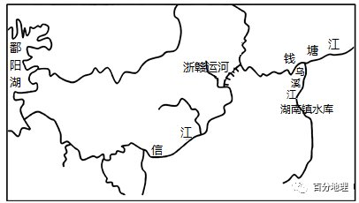

# 微专题之074 从产业结构角度分析区域发展

```
本专题摘自“百分地理”公众号，如有侵权请告之删除，谢谢。联系hhwxyhh@163.com
```

------
   
（2022·河南·模拟预测）樟树港位于赣江中下游，曾是江西五大港口之一，因水运而兴市。20世纪90年代以来，随着铁路、公路的高速发展，樟树港地位迅速下降，为重振昔日赣江"黄金水道"，助推工业发展，2013年樟树市开始改建、扩建赣江深水港，深水港建成后，可实现货物年吞吐量2000万吨以上。下图示意精江及主要水利枢纽。据此完成下面小题。   
   
   
   
1．樟树港曾是江西省五大港口之一，与位于长江沿岸的九江港相比，樟树港（  ）   
A．水面风浪较小   
B．腹地广   
C．河面较为宽阔阔   
D．航道更深   
2．樟树港得以扩建为深水港，主要得益于（  ）   
A．产业结构调整   
B．水位提升   
C．城市规模扩大   
D．港口整治   
3．樟树深水港扩建前，该市机械工业产品多通过陆路向外输送。樟树港扩建为深水港后对该市机械工业产品的主要影响体现在（  ）   
①提高物流效率②减少周转次数③方便运输大型货物④降低运输成本   
A．①②   
B．②④   
C．①③   
D．③④   
<span style="color: rgb(255, 0, 0);">1．A据图可知，樟树港位于赣江中下游地区，九江港位于赣江与长江交汇处，赣江是长江的支流河面宽度、水面风浪均较长江小，航道水深不及长江，樟树港经济腹地比九江港小，A正确，BCD错误。所以选A。</span>   
<span style="color: rgb(255, 0, 0);">2．B据图并结合所学知识分析可知，樟树下游龙头山水利枢纽建成后，樟树港所在河段的水位升高，为其扩建深水港提供了重要条件，B正确；产业结构调整、城市规模扩大、港口整治对于港口水深几乎没有影响，不能使得港口扩建为深水港，ACD错误。所以选B。</span>   
<span style="color: rgb(255, 0, 0);">3．D分析可知，樟树深水港扩建前，该市机械工业产品多通过陆路向外输送，受陆地运输条件限制，体积大的货物难以运输，而扩建为深水港后可以解决这一难题，与陆路运输相比水运的运费较低，采用水运的方式可以降低运输成本，但水运需多次周转，运输效率比陆路运输低，③④正确，①②错误。所以选D。</span>   
4．（2021·山东·高考真题）阅读图文资料，完成下列小题。   
“翻坝”运输是指来往的客船、集装箱船、汽车滚装船等船舶或运输紧急物资和鲜活食品的船舶，在候闸船舶过多的情况下，为避免花费较长时间候闸过坝，而采用的“水运→陆运→水运”或“水运→陆运”的转运方式。   
作为三峡水利枢纽的重要组成部分，翻坝物流系统提高了三峡水利枢纽的通过能力。下图左示意三峡翻坝物流系统，其中秭归三峡翻坝物流图（含茅坪港）属于货运枢纽型的港口物流园区（下图右），是长江南岸三峡翻坝物流转运的空间载体和依托。   
   
   
   
（1）从航运角度分析三峡大坝建成后其上游物流量扩大的原因。   
（2）说明与候闸过坝运输相比，三峡翻坝物流系统的优势。   
<span style="color: rgb(255, 0, 0);">【答案】（1）水域面积扩大，水深增加，通航里程增加，通航能力增强（航道条件改善）；港口规模扩大，数量增加，港口腹地扩大。</span>   
<span style="color: rgb(255, 0, 0);">（2）通过与公路、铁路、管道的连接，实现了多种交通运输方式的联运，运输方式灵活；缩短物流时间，提高运输效率；通过秭归翻坝物流产业园，实现对货物仓储、加工和贸易，延长物流产业链。</span>   
<span style="color: rgb(255, 0, 0);">【解析】本大题以长江三峡翻坝系统为材料，涉及交通、水利工程等相关内容（知识点），考查学生理论联系实际，解决地理问题的能力。考查学生区域认知、综合思维的地理学科核心素养。</span>   
<span style="color: rgb(255, 0, 0);">（1）三峡大坝建成之后，会拦截河流流水，在库区上游蓄水，导致库区上游地区河流水深增加，河道拓宽，河流的通航里程和通航能力都增加，运力提升；三峡大坝建成之后，河道拓宽，原有港口水深增加，停泊能力提升，港口规模扩大；三峡大坝建成之后，原来不适宜建设港口的点位，因为河流航运条件改善，适宜建设港口，港口数量增加，覆盖的经济腹地变大。</span>   
<span style="color: rgb(255, 0, 0);">（2）根据材料“为避免花费较长时间候闸过坝”，可知节省货物运输的时间，提高运输效率；根据材料“翻坝物流系统提高了三峡水利枢纽的通过能力”，缓解船闸压力，提高三峡水利枢纽的通行能力；根据材料信息“采用的“水运→陆运→水运”或“水运→陆运”的转运方式。”可知，三峡翻坝物流系统可以实现水运与公路、铁路、管道等交通运输方式的联运，运输方式变得更加灵活；根据图示信息可知，三峡翻坝物流系统促进了相关产业的发展（促进了物流园区仓储，加工和商贸的产业的发展），延长了产业链，提高了经济收益，促进了区域的经济发展。</span>   
5．（2022·北京·高考真题）阅读图文材料，回答下列问题。   
毛里求斯岛地处印度洋西南部，易受热带气旋影响。图（a）为毛里求斯岛地图，图（b）为当地时间2022年2月2日16时海平面气压分布图。   
   
   
   
(1)分析在强热带气旋影响下，此时毛里求斯岛的主导风向和降水状况。   
(2)说明岛上不适合发展内河航运的理由。   
<span style="color: rgb(255, 0, 0);">【答案】(1)强热带气旋中心位于毛里求斯岛西北方，因南半球热带气旋顺时针旋转，该岛主导风向为东南风；在气旋的辐合上升作用和地形的共同影响下，该岛出现强降雨。</span>   
<span style="color: rgb(255, 0, 0);">(2)岛屿面积小，河流短小、落差大、流量季节变化大等。</span>   
<span style="color: rgb(255, 0, 0);">【解析】本题以毛里求斯岛区域图及该地某时刻海平面气压分布示意图为材料，涉及近地面风向判断、降水影响因素、河流航运价值的评价等相关内容，考查学生调动和运用相关知识点解决问题的能力。</span>   
<span style="color: rgb(255, 0, 0);">（1）从图中可以看到，此次强热带气旋中心位于毛里求斯的西北方向，从经纬度可以看到毛里求斯位于南半球，故此图为南半球热带气旋图，其气流运动方向呈顺时针旋转；在地面偏向力向左偏转的作用下，该地盛行风向应为东南风。同时由于该岛屿靠近气旋中心，有气旋的辐合上升作用，再加上暖湿气流遇地形阻挡，在这二者的共同作用下，该岛屿出现强降水过程。</span>   
<span style="color: rgb(255, 0, 0);">（2）从图中可以看到，该岛屿面积较小，同时该岛屿地形以山地为主，河流落差大，流程短。由于该岛屿地处印度洋西南部，该地降水季节分配不均，使得该地河流流量季节变化较大。故该岛屿不适合发展内河航运。</span>   
6．（2021·天津·高考真题）读图文材料，回答下列问题。   
“京津冀协同发展”是我国发展战略之一。京津冀交通一体化、生态环境保护、产业升级转移被确定为京津冀协同发展要率先取得突破的重点领域。   
   
   
   
北京的非首都功能向周边地区转移，天津市、河北省成为制造业的主要承接地。   
(1)说明天津武清区承接北京先进制造业的优势条件。   
(2)图中所示区域内规划修建一条轻轨客运铁路。说明这一举措对促进京津冀交通一体化的意义。   
(3)历史上的天津因运河而兴，运河文化是天津地域文化之一。京津冀三地正在共同建设运河文化带，你认为天津市应当采取哪些措施，保护性开发运河文化遗产。   
<span style="color: rgb(255, 0, 0);">【答案】(1)距北京近；有多条高速公路和铁路通过；生产成本低；工业基础雄厚；政策支持。（答出3点即可）</span>   
<span style="color: rgb(255, 0, 0);">(2)推动不同运输方式之间的联程联运（与京津地铁连接）；完善京津冀交通运输网络（增加轨道交通的覆盖区域）；节省交通出行时间。</span>   
<span style="color: rgb(255, 0, 0);">(3)挖掘运河沿岸的历史和民俗文化；在运河文化带建设中突出地域文化特色；整治沿河景观，保护生态环境；利用运河文化遗产发展旅游业等相关产业。</span>   
<span style="color: rgb(255, 0, 0);">【解析】本大题以京津冀协同发展为背景材料，涉及天津武清区承接北京先进制造业的优势条件、轻轨客运铁路对促进京津冀交通一体化的意义、保护性开发运河文化遗产的措施等相关知识，考查学生获取和解读信息能力及综合思维能力，培养学生的人地协调观、综合思维、区域认知和地理实践力等地理核心素养。</span>   
<span style="color: rgb(255, 0, 0);">（1）天津武清区承接北京先进制造业的优势条件可以从天津与北京的距离远近、交通条件、生产成本、工业基础、政策等角度分析作答。由图文材料可知，天津武清区距离北京近，便于承接北京先进制造业的转移；有多条高速公路和铁路通过，交通便利；天津武清区劳动力成本和地价低，生产成本低；工业基础雄厚；有政府政策支持等。</span>   
<span style="color: rgb(255, 0, 0);">（2）该地区规划修建轻轨客运铁路对京津冀一体化的意义可以从联程联运、完善地区交通运输网络、节省交通出行时间等角度分析作答。结合材料信息，该轻轨客运铁路与京津地铁连接，推动不同运输方式之间的联程联运；增加轨道交通的覆盖区域，完善京津冀交通运输网络；轻轨客运更加方便快捷，节省人们的交通出行时间。</span>   
<span style="color: rgb(255, 0, 0);">（3）天津保护性开发运河文化遗产的措施可以从保护与发掘运河沿岸的历史和民俗文化、地域文化特色、保护生态环境、发展相关产业等角度分析作答。结合材料信息，历史上的天津因运河而兴，运河文化是天津地域文化之一。保护性开发运河文化遗产要注重挖掘运河沿岸的历史和民俗文化；在运河文化带建设中突出天津地域文化特色；整治沿河景观，注重生态环境保护；利用运河文化遗产发展旅游业等相关产业。</span>   
7．（2022·安徽·合肥模拟预测）阅读图文材料，回答下列问题。   
2021年1月8日江西省政府印发了《关于推进交通强省建设的意见》的文件。文件中提出一份预案：修建连接鄱阳湖、钱塘江水系的超级工程——浙赣运河。浙赣运河东起杭州，经钱塘江，在钱塘江上游——衢州市附近跨越分水岭，经信江后进入鄱阳湖。期中常山江和信江之间的分水岭(大概140m)需要挖通。运河采用通航千吨级船舶的Ⅲ级航道规划，需修建梯级24座，规划开通后货运量增至2500万吨左右。原通过鄱阳湖经长江到上海港出口路程约1000公里，但走信江经浙赣人工运河至杭州湾出海，路程将大大缩短。钱塘江流域内跨江大桥数量多、修建时间早、高度有限，流域内水库设备老旧、功能不全。浙赣运河开通后，钱塘江流域内航运将面临部分难题。下图为浙赣运河规划图。   
   
   
   
(1)推测浙赣运河开通运行后，钱塘江流域航运所面临的难题。   
(2)说明浙赣运河修通后为保证两省水运网络畅通可采取的措施。   
(3)浙赣运河外，赣粤运河也已同步发出建设预案，最终将南北贯通形成浙赣粤大运河，连接长三角和珠三角地区。简析浙赣粤大运河修建给江西省发展带来的机遇。   
<span style="color: rgb(255, 0, 0);">【答案】(1)运河位于河流上游，枯水期运河水量不足，影响航道通行；钱塘江流域桥梁高度不够，船只难以通行；钱塘江流域水库年份较老，没有船闸，船只难以通行；杭州湾由于强潮及泥沙沉积的影响，水深较浅，没有港口，难以形成河海联运。</span>   
<span style="color: rgb(255, 0, 0);">(2)实行长江流域和钱塘江流域的水资源统一调配，保证水量平稳；改造沿线桥梁；升级沿线水库、设置船闸；加强内河交通网建设，使得杭州市可借周边港口（如舟山港、宁波港）出海。</span>   
<span style="color: rgb(255, 0, 0);">(3)水运降低运费，降低原料成本，提高产品竞争力；受到长三角、珠三角的经济辐射，承接产业转移，承接带动大运河周边地区的产业（包括房地产、贸易以及其他产业布局）发展和集聚，优化分工协作；推动内河水资源合理利用，加快沿线地区脱贫；奠定江西省水系在国家水运网络中的地位，完善国家航运网络布局；水运更加环保、节能，对江西省生态环境的保护有积极意义；整合江西人文旅游资源，提升运河两岸的旅游价值；</span>   
<span style="color: rgb(255, 0, 0);">【解析】本题浙赣运河的相关材料为背景，以浙赣运河规划图为载体，考查河流开发和整治措施，及对区域的影响，考查学生提取信息的能力，区域认知的能力和综合思维能力。</span>   
<span style="color: rgb(255, 0, 0);">（1）据材料可知，浙赣运河是连接鄱阳湖、钱塘江水系的超级工程，位于钱塘江上游河，冬季枯水期时运河水量不足，影响航运；钱塘江流域内跨江大桥数量多、修建时间早、高度有限，大型货船难以通行；流域内水库设备老旧、功能不全，没有船闸，船只难以通行；杭州湾由于强潮及泥沙的不断沉积，水较浅，没建港口，不能实现河海联运。</span>   
<span style="color: rgb(255, 0, 0);">（2）由于浙赣运河连通钱塘江、信江和鄱阳湖，统一调配长江流域和钱塘江流域的水资源，保证水量平稳，增加桥梁高度，改造升级沿线水库，设置船闸，完善内河交通网，使得杭州市可借周边的舟山港和宁波港出海，实现江海联运。</span>   
<span style="color: rgb(255, 0, 0);">（3）水运运量大、运费低，降低原料成本，提高产品竞争力，浙赣粤大运河连接长三角和珠三角地区，江西省受到长三角、珠三角的经济辐射，承接产业转移，带动大运河周边地区的产业发展和集聚，获得集聚效应，充分发挥区域优势，优化分工协作，推动内河水资源合理利用，促进沿线经济发展，完善国家航运网络布局，提高江西省水系在国家水运网络中的地位，水运减少污染，节能环保，改善生态环境，带动旅游业的发展。</span>   
8．（2022·福建·模拟预测）阅读图文材料，完成下列要求。   
郁江径流量季节变化明显，汛期5?10月径流量占年径流量83.6%。平陆运河是广西内河水运规划中重要的一条出海通道，拟从郁江中游西津水库引水至钦江，进而直接入海，全长约133千米，大部分河段利用沙坪河和钦江进行改造，全程落差60米，主要工程任务为航运。运河预计2022年开工，建成后，南宁经平陆运河由钦州港出海里程仅291千米，比经广东出海缩短560多千米。下图为广西平陆运河规划示意图。   
   
   
   
(1)说出平陆运河线路选择的优点。   
(2)推测平陆运河建成后面临的困难有哪些。   
<span style="color: rgb(255, 0, 0);">【答案】(1)新开挖河段较短，工程量小，可减少投资；落差小，利于船舶航行；距离北部湾的距离近，利于河海联运。</span>   
<span style="color: rgb(255, 0, 0);">(2)水位季节变化大，枯水期水量小，船舶通航能力降低；从西津水库引水，影响库区水利枢纽发电效益；喀斯特地貌广布，河水易渗漏。</span>   
<span style="color: rgb(255, 0, 0);">【解析】本题以广西平陆运河为材料，涉及交通线路选址以及交通区位分析的相关知识，考查学生图片材料信息提取能力、地理知识调用分析能力，体现了区域认知、综合思维以及地理实践力的地理学科核心素养。</span>   
<span style="color: rgb(255, 0, 0);">(1)运河线路选择的优点可从工程量、落差、距海远近等方面分析。工程量：根据材料信息“平陆运河是……大部分河段利用沙坪河和钦江进行改造”可知，运河较短，且新开挖河段较短，工程量较小；落差：根据材料信息“全程落差60米，主要工程任务为航运。”可知，该运河落差较小，航运条件较高，有利于航运；距海远近：根据材料信息“运河预计2022年开工，建成后，南宁经平陆运河由钦州港出海里程仅291千米”可知，该运河距离钦州港较近，有利于实现河海联运。</span>   
<span style="color: rgb(255, 0, 0);">(2)材料指出，郁江径流量季节变化大，枯水期水量少，通航能力受限；读图可知，西津水库具有发电效益，从库区大量调水会影响其发电效益；结合所学知识可知，广西喀斯特地貌广布，岩石透水性强，修建运河易发生渗漏等。</span>   
9．（2022·浙江金华·模拟预测）阅读材料，完成下列问题。   
材料一：太湖流域地处长江三角洲，2002年开始实施引江济太调水工程，望虞河是太湖流域唯一由长江直接向太湖引水的骨干河道。近年来，太湖的水质明显好转。   
材料二：京杭大运河从无锡到苏州这一段开凿于太湖东岸，运河离太湖最近的地方不到2千米。下表为我国部分湖泊的面积和蓄水量数据表。   
<table cellspacing="0" cellpadding="0" width="577"><tbody><tr><td width="58" valign="bottom" style="padding: 3.75pt 6pt;border-width: 1pt;border-color: rgb(0, 0, 0);"><section style="margin-top: 0pt;margin-bottom: 0pt;margin-left: 0pt;text-indent: 0pt;font-size: 10.5pt;font-family: &quot;Times New Roman&quot;;line-height: 2em;"><span style="font-family: 宋体;">湖泊</span></section></td><td width="73" valign="bottom" style="padding: 3.75pt 6pt;border-width: 1pt;border-color: rgb(0, 0, 0);"><section style="margin-top: 0pt;margin-bottom: 0pt;margin-left: 0pt;text-indent: 0pt;font-size: 10.5pt;font-family: &quot;Times New Roman&quot;;line-height: 2em;"><span style="font-family: 宋体;">面积/km3</span></section></td><td width="97" valign="bottom" style="padding: 3.75pt 6pt;border-width: 1pt;border-color: rgb(0, 0, 0);"><section style="margin-top: 0pt;margin-bottom: 0pt;margin-left: 0pt;text-indent: 0pt;font-size: 10.5pt;font-family: &quot;Times New Roman&quot;;line-height: 2em;"><span style="font-family: 宋体;">蓄水量/亿m3</span></section></td></tr><tr><td width="58" valign="bottom" style="padding: 3.75pt 6pt;border-width: 1pt;border-color: rgb(0, 0, 0);"><section style="margin-top: 0pt;margin-bottom: 0pt;margin-left: 0pt;text-indent: 0pt;font-size: 10.5pt;font-family: &quot;Times New Roman&quot;;line-height: 2em;"><span style="font-family: 宋体;">太湖</span></section></td><td width="73" valign="bottom" style="padding: 3.75pt 6pt;border-width: 1pt;border-color: rgb(0, 0, 0);"><section style="margin-top: 0pt;margin-bottom: 0pt;margin-left: 0pt;text-indent: 0pt;font-size: 10.5pt;font-family: &quot;Times New Roman&quot;;line-height: 2em;">2338</section></td><td width="97" valign="bottom" style="padding: 3.75pt 6pt;border-width: 1pt;border-color: rgb(0, 0, 0);"><section style="margin-top: 0pt;margin-bottom: 0pt;margin-left: 0pt;text-indent: 0pt;font-size: 10.5pt;font-family: &quot;Times New Roman&quot;;line-height: 2em;">44</section></td></tr><tr><td width="58" valign="bottom" style="padding: 3.75pt 6pt;border-width: 1pt;border-color: rgb(0, 0, 0);"><section style="margin-top: 0pt;margin-bottom: 0pt;margin-left: 0pt;text-indent: 0pt;font-size: 10.5pt;font-family: &quot;Times New Roman&quot;;line-height: 2em;"><span style="font-family: 宋体;">洞庭湖</span></section></td><td width="73" valign="bottom" style="padding: 3.75pt 6pt;border-width: 1pt;border-color: rgb(0, 0, 0);"><section style="margin-top: 0pt;margin-bottom: 0pt;margin-left: 0pt;text-indent: 0pt;font-size: 10.5pt;font-family: &quot;Times New Roman&quot;;line-height: 2em;">4040</section></td><td width="97" valign="bottom" style="padding: 3.75pt 6pt;border-width: 1pt;border-color: rgb(0, 0, 0);"><section style="margin-top: 0pt;margin-bottom: 0pt;margin-left: 0pt;text-indent: 0pt;font-size: 10.5pt;font-family: &quot;Times New Roman&quot;;line-height: 2em;">178</section></td></tr></tbody></table>

   
   
   
   
(1)简述望虞河工程对减轻太湖流域旱涝灾害的积极意义。   
(2)与洞庭湖比，简述太湖的水文特征。   
(3)从太湖的角度，简析京杭大运河在太湖东侧开凿而没有直接走太湖的原因。   
<span style="color: rgb(255, 0, 0);">【答案】(1)太湖流域洪水时，可以通过该工程排泄洪水；枯水期时，该工程可以引长江水入太湖，补充水资源。</span>   
<span style="color: rgb(255, 0, 0);">(2)面积较小；蓄水量较少；湖水较浅；湖水更新速度慢；水质自净能力弱。</span>   
<span style="color: rgb(255, 0, 0);">(3)太湖水浅，容易搁浅；距无锡、苏州等城市较远；湖面宽广,风浪大:湖水水位季节变化大。</span>   
<span style="color: rgb(255, 0, 0);">【解析】本题以太湖流域为情境，设置三道小题，考查太湖的水文特征与望虞河工程对减轻太湖流域旱涝灾害的积极意义等知识点，重点考查获取和解读信息的能力以及区域认知、综合思维等学科素养。</span>   
<span style="color: rgb(255, 0, 0);">（1）望虞河工程对减轻太湖流域旱涝灾害的积极意义主要从洪灾时与旱灾时两个角度来分析。从洪灾时的角度来说，当太湖流域发洪水时，可以通过该工程来排洪泄水，减轻太湖流域的洪灾。从旱灾时的角度来说，当太湖流域处于枯水期时，该工程可以引入长江水进入太湖流域，从而补充太湖流域的水资源，减少太湖流域的旱灾现象。</span>   
<span style="color: rgb(255, 0, 0);">（2）太湖的水文特征主要从水量与水质的角度来分析。从水量的角度来说，由于太湖相较于洞庭湖面积较小，并且太湖的湖水较浅，所以蓄水量较少。从水质的角度来说，由于太湖的湖水更新速度较慢，所以太湖水质自净能力较弱。</span>   
<span style="color: rgb(255, 0, 0);">（3）京杭大运河在太湖东侧开凿而没有直接走太湖的原因主要从水量，位置，风浪与水位变化等角度来分析。从水量的角度来说，由于太湖水量较少，所以太湖水较浅，容易搁浅。从位置的角度来说，太湖距离无锡与苏州等城市较远，因此不适合开凿运河。从风浪的角度来说，由于太湖湖面广阔，所以太湖风浪较大。不适合开展航运。从水位变化的角度来说，由于太湖水的水位季节变化较大，因此不适合开发航运。</span>   
10．（2022·广东·开平市模拟预测）阅读图文材料，完成下列要求。   
继北极航行的开通，中俄两国专家联通中国东北和俄罗斯西伯利亚地区的陆河联运路线（下图），但在全球变暖的大背景下，陆河联运路线修建会遇到挑战。陆河联运路线的陆运段是中国大连市到俄罗斯雅库茨克市的铁路，河运段是俄罗斯雅库茨克港到季克西港的勒拿河下游水运航道，流通北冰洋。雅库茨克港是俄罗斯著名的内河港口，以毛皮、皮革、家畜和象牙集散地而闻名，市内有木材加工、采煤、轻工、食品和建材等工业。陆河联运实施之后，雅库茨克市将成为全线河运连接铁路的交通枢纽，对经济的带动作用有着较为乐观的前景。下图示意雅库茨克市的气候资料。   
   
   
   
   
   
   
(1)分析气候给陆运段俄罗斯部分的铁路线建设带来的困难。   
(2)指出雅库茨克内河港口吞吐量最大的三个月份，并说明其自然原因；   
(3)说明陆河联运实施之后对雅库茨克市产业发展的带动作用。   
<span style="color: rgb(255, 0, 0);">【答案】(1)冬季寒冷漫长，施工条件差；气温年较差大，表层冻土冬冻夏融，施工难度大（或全球气候变暖，冻土活动加剧，施工难度大。说明：施工条件差（如答出施工期短、工人作业不方便等也可）</span>   
<span style="color: rgb(255, 0, 0);">(2)6-8月（或7-9月）。6-8月（或7-9月）气温高，河道不封冻，可通航；6-8月（或7-9月）降水多，勒拿河径流量大，利于通航；6-8月北极航线不冻结，便于通航；</span>   
<span style="color: rgb(255, 0, 0);">(3)雅库茨克市作为陆河联运路线上河运连接铁路的交通枢纽，是货物集散、周转之地，促进交通运输业；服务于货物集散的装卸、包装、批发和零售等便会在此集聚，促进（物流）服务业的发展：与货物相关的制造业也会在此集聚，促进加工业和制作业的发展：利用当地资源和能源，促进资源、能源开采工业；促进中俄人民的交流，带动当地旅游业的发展。</span>   
<span style="color: rgb(255, 0, 0);">【解析】本大题以雅库茨克市为材料设置试题，涉及气候、交通等相关内容（知识点），考查学生对材料解读与分析能力、有效信息的提取能力，提高相关知识的迁移应用素养。</span>   
<span style="color: rgb(255, 0, 0);">（1）读图可知，俄罗斯亚洲部分纬度位置高，太阳辐射弱，气温低，冬季严寒而漫长，气候严寒，人口稀少，劳动力缺失，施工条件差；气温年较差大，表层冻土厚，冬冻夏融，全球气候变暖，冻土活动加剧，施工难度大；施工工期短，工人作业不方便。</span>   
<span style="color: rgb(255, 0, 0);">（2）由于雅库茨克港位于北半球，并且纬度较高，气温较低，河流容易结冰，所以当地夏季温度升高时，也就是6-8月的时候，当地温度较高的情况下，当地河流会融化，流量变大，并且夏季降水较多，河流水上涨，吃水能力上升，航运能力提升。</span>   
<span style="color: rgb(255, 0, 0);">（3）这些地区本来经济不发达、基础设施落后，陆河联运的推行有利于交通基础设施的完善和配套产业的发展，也促进了当地就业、增加了收入。雅库茨克市处于陆地与河流的交汇点，陆河联运可以促进货物运输和周转，促进当地交通运输业的发展。交通运输的发展服务当地货物、物流等行业的发展，与货物有关的产业也会因为此处交通运输业和相关产业的集聚而增多起来。当地资源丰富，交通运输的发展，促进当地资源优势转化为经济优势，交通发展起来，带动当地文化交流，促进旅游业的发展。</span>