# 微专题之074 从产业结构角度分析区域发展

```
本专题摘自“百分地理”公众号，如有侵权请告之删除，谢谢。联系hhwxyhh@163.com
```

------
   
（2022·浙江·模拟预测）北京冬奥会“冬季两项”赛场在张家口市崇礼区古杨树村东西向的山谷中进行。该地有明显的山谷风，通过研究赛场内的风向风速分布规律并做出准确预报，对比赛的时间安排以及运动员的临场发挥十分重要。图1为“冬季两项”赛场等高线图与观测站点分布。图2为1号站山谷风日局地风每小时风向频率分布。完成下面小题。   
   
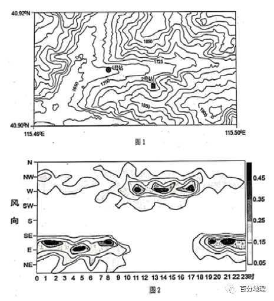   
   
1．1号站点白天的风向是（  ）   
①偏西风   
②偏东风   
③山风   
④谷风   
A．①③   
B．②③   
C．②④   
D．①④   
2．与1号站相比，2号站（  ）   
A．温度更高   
B．气压更高   
C．风力更大   
D．光照更长   
<span style="color: rgb(255, 0, 0);">1．读1号站山谷风日局地风每小时风向频率分布图可知，9点——18点以西南风、西风和西北风为主；18点以后——次日9点之前多东南风、东风、东北风，即白天为偏西风，夜间为偏东风，①正确，②错误。1号站点等高线向海拔高处凸出为山谷，由图可知，山谷整体呈东西走向，开口朝西，观测站位于谷口。白天气温升高，山坡比同高度的山谷升温快，空气膨胀上升，气压低，空气沿山坡上升形成谷风，③错误，④正确。综上，D①④正确，ABC错误。故选D。</span>   
<span style="color: rgb(255, 0, 0);">2．读等高线图可知，与1号站相比，2号站海拔更高，根据“随海拔高度的上升，气温下降”可知，2号站温度更低，气压更低， AB错误。由于图中2号站比1号站风力处等压线密集，所以2号站水平气压梯度力更大，风力更强，C正确。1号站点等高线向海拔高处凸出为山谷，1号站位于山谷北侧，为阳坡，2号站位于山谷南侧，为阴坡，所以2号站光照时间短，D错误。故选C。</span>   
（2022·上海静安·二模）京张铁路是完全由中国人自己设计建造的第一条铁路，其“人”字型的设计更是彰显了中国人的智慧。根据地形图可以判断（  ）   
   
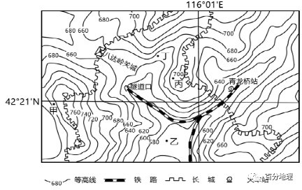   
   
A．图中铁路的垂直高差达80米   
B．青龙桥站建设在山谷里   
C．“人”字型设计减小了高差   
D．八达岭关城可以俯瞰青龙桥站   
<span style="color: rgb(255, 0, 0);">3．由图可知：铁路的最高海拔范围为600——620m，最低海拔范围为560——580m，因此铁路的垂直高差范围为20——60m，A错误；由图可知青龙桥站附近的等高线凸向高处，为典型的山谷地形，B正确；“人”字型的设计沿着山谷建造，可以降低坡度，但是无法减小高差，C错误；八达岭关城和青龙桥站中间隔着山脊，视线受到阻挡，因此在八达岭关城无法俯瞰青龙桥站，D错误。故选B。</span>   
（2022·湖南·模拟预测）扎当冰川（30°28.57'N，90°38.71'E）位于念青唐古拉山北坡，面积约1.98km2，冰川厚度差别较大。下图左示意扎当冰川表面等高线分布，图右示意冰床等高线分布。据此完成下面小题。   
   
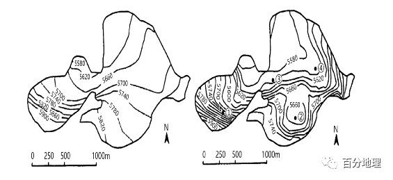   
   
4．扎当冰川厚度最大的地点位于图右中的（  ）   
A．①   
B．②   
C．③   
D．④   
5．与冰面地形相比，扎当冰川冰床（  ）   
①海拔更高   
②起伏更明显   
③坡度更陡   
④磨蚀更强烈   
A．①②   
B．③④   
C．①③   
D．②④   
<span style="color: rgb(255, 0, 0);">4．结合材料和所学知识： 冰川厚度=冰川表面海拔—冰床海拔。据图计算可知：①地冰川厚度约为20米，②地冰川厚度约在80-140米，③地冰川厚度约在20-60米，④地冰川厚度约在60-120米，四地对比，可知②地冰面与冰床的相对高差最大，冰川厚度最大，B正确，ACD错误。故选B。</span>   
<span style="color: rgb(255, 0, 0);">5．结合图可看出，冰床海拔较冰面海拔低，①错；左图冰面海拔最高值与最低值之差约为320米左右，右图冰川冰床海拔最高值与最低值之差约为340米左右，冰床海拔起伏更明显，②对：右图中等高距为20米，换算成左图40米，可看出两者等高线疏密程度差异小，坡度相差不大，③错；推测是冰床位于冰川底部，受冰川磨蚀作用更强，④对。ABC错误，D正确。故选D。</span>   
（2022·辽宁葫芦岛·二模）比湿反映了一个地区的空气湿度，水库周边的比湿有着明显的周期性日变化。如果不考虑背景风（盛行风）的影响，水库局部气流对水汽的水平输送是影响比湿的重要因素，当空气水平流动较弱时，强烈的空气对流则会导致近地面比湿降低。下图示意密云水库周边等高线地形图（单位∶米，黑点为气象测站），及水库周边比湿的日变化过程。据此完成下面小题。   
   
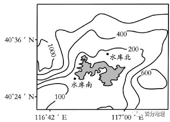   
   
   
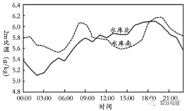   
   
6．夜间水库北比湿明显小于水库南，直接影响因素是（  ）   
A．气温日变化   
B．降水日变化   
C．海拔高度差   
D．山风与陆风   
7．关于水库周边比湿日变化的说法成立的是（  ）   
A．3∶00水库南水平输送较强   
B．10∶00水库南对流扩散较强   
C．15∶00水库北水平输送较弱   
D．20∶00水库北对流扩散较强   
<span style="color: rgb(255, 0, 0);">6．该库区南北相距较近（约10千米），夜间气温南北相差较小，因此气温并非是空气湿度差异大的直接影响因素，A排除；本题中并未分析降水，且库区面积较小，局部降水依然会覆盖整个库区，所以降水并非直接影响因素，B排除；通过对图中等高线的分析，夜间水库南北都在同一海拔高度，所以海拔高度也不是直接影响因素，C排除；夜间水库北比湿明显小于水库南，受山谷风与湖陆风影响，具体来说是由于夜间山风与陆风叠加，导致水平气流向南运动，使得北部空气运动强烈，水库北近地面比湿降低，D正确。故选D。</span>   
<span style="color: rgb(255, 0, 0);">7．图中，3：00处水库南的比湿小（即空气湿度小），所以水平输送并不强，A错误。10：00处水库南的比湿下降，但是比湿变化平稳，且数值较高，所以对流扩散并不是很强，B错误。15：00处水库北的比湿较高且呈上升趋势，说明空气水平运动强烈，C错误。20：00前水库北的比湿高，但是却呈急速下降趋势，所以空气对流扩散较为强烈，D正确。故选D。</span>   
（2022·湖南岳阳·三模）洞庭湖区位于长江中游荆江南岸，东、南、西三面环山，北部为江汉平原，该湖区极端天气事件多发。下面左图表示1961-2013年洞庭湖区24个自动气象站夏季高温热浪（指连续多天35度以上的高温天气）频次分布，右图表示1961-2013年洞庭湖区夏季平均高温热浪频次历年变化。据此完成下面小题。   
   
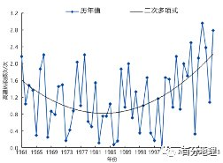   
   
   
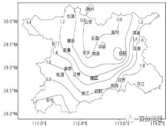   
   
8．图中讯息显示，1961-2013年洞庭湖区夏季平均高温热浪天气（  ）   
A．呈逐年上升趋势   
B．频次自东南向西北递减   
C．每年均会出现   
D．部分地区一年出现2次   
9．1961-2013年，岳阳站夏季平均高温热浪频次最可能是（  ）   
A．0.6   
B．0.7   
C．1.0   
D．1.1   
10．洞庭湖极端高温天气事件频发，推测主要的影响因素有（  ）   
①人类活动   
②水陆分布   
③植被覆盖率   
④地形地势   
A．①②   
B．①③   
C．②④   
D．③④   
<span style="color: rgb(255, 0, 0);">8．根据图示信息可知，1961-2013年洞庭湖区夏季平均高温热浪天气呈波动变化趋势，A错误；频次大致呈现由北向南递增的趋势，B错误；部分年份的高温热浪频次接近0，说明该年没有出现高温热浪天气，C错误；部分年份的高温热浪频次超过2，说明一年出现2次或以上高温热浪天气，D正确。所以选D。</span>   
<span style="color: rgb(255, 0, 0);">9．根据“大于大值，小于小值”的判读原则，岳阳的高温频次可能为：0.6&lt;高温频次&lt;0.8或1&lt;高温频次&lt;1.2，且不等于0.6、0.8、1、1.2，AC错误。根据所学知识可知，岳阳毗邻洞庭湖，湖水受热升温慢，夏季受湖泊对气温的调节影响，高温天气出现应较少，岳阳的高温频次为：0.6&lt;高温频次&lt;0.8，所以应为0.7，B正确，D错误。所以选B。</span>   
<span style="color: rgb(255, 0, 0);">10．洞庭湖地区人口密度较大，人类活动产生的废热较多，导致极端高温天气频发，①正确；根据所学知识可知，洞庭湖地区河网密布，水陆相间分布，导致水陆热力性质差异显著，陆地高温天气频发，②正确；洞庭湖地区以亚热带季风气候为主，植被覆盖率较高，不利于高温天气的出现，③错误；根据所学知识可知，洞庭湖地区以平原地形为主，南部以环洞庭湖山地为主，有利于与北方地区热量交换，不利于高温天气的出现，④错误。所以选A。</span>   
（2021年湖南省高考真题）小海坨山位于北京冬奥会延庆赛区,建有国家高山滑雪中心,滑道落差近900米。小海坨山半山腰置出现一定厚度的低云,且停留时间较长,对滑雪赛事有一定影响。研究表明,山地背风坡下沉气流与爬坡湿气流的相互作用是促进半山腰云形成的关键因素。下图示意小海坨山及附近地形。据此究成下面小题。   
   
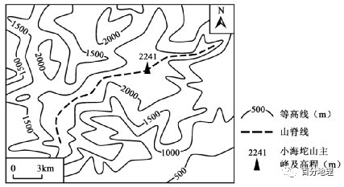   
   
11.半山腰云主要分布在小海坨山主峰及山脊的（  ）   
A.东北方   
B.东南方   
C.西南方   
D.西北方   
12.与半山腰云邻近的下部气团相比,上部气团性质偏（  ）   
A.暖干   
B.暖湿   
C.冷干   
D.冷湿   
13.为了赛事的顺利进行,气象部门预报半山腰云最需要精准观测滑雪场附近的（  ）   
①相对湿度   
②气压变化   
③气温水平分布   
④气温垂直分布   
A.①③   
B.②③   
C.①④   
D.②④   
<span style="color: rgb(255, 0, 0);">11．根据题意，半山腰置出现一定厚度的低云是因为山地背风坡下沉气流与爬坡湿气流的相互作用，从图上来看，位于北京的小海坨山在冬季受到西北季风影响较大，而东南侧靠近渤海，有较多的水汽，所以小海坨山主峰及山脊的东南侧为西北季风的背风坡，下沉气流容易与爬坡的暖湿气流相互作用，形成半山腰云，B正确，ACD错误。故选B。12．图中位置的半山腰云主要是在小海坨山主峰和山脊的东南侧，半山腰云邻近的下部气团是湿润气流，上部是冬季风的山地背风坡下沉气流，干气团下沉增温，故与半山腰云邻近的下部气团相比，上部气团性质偏暖干，A正确，BCD错误。故选A。13．半山腰云是水汽凝结形成，只有当空气中的相对湿度达到过饱和，才有可能成云，因此气象部门预报半山腰云最需要精准观测滑雪场附近的相对湿度，①符合题意；当地云停留在半山腰，往往是山地背风坡下沉气流与爬坡湿气流的相互作用，此时云不向上升，此时应出现逆温现象，因此气象部门预报半山腰云最需要精准观测滑雪场附近的气温垂直分布，④符合题意；半山腰云出现时当地的气压和气温水平分布没有明显特征，因此不是气象部门预报半山腰云最需要精准观测的数据，②、③不符合题意。综上所述，C正确，ABD错误。故选C。</span>   
长城是我国古代军事防御工程。“筑长城，因地形，用制险塞……”。关城是长城防御建筑体系的重要组成部分，其位置至关重要。“登高望烽火，谁谓塞尘飞。”烽火台是古代用于点燃烟火传递消息的设施。某中学地理研学小组以长城为研究对象，主要考察了风化、风蚀作用对长城的影响。下图为某地长城景区等高线地形图。据此完成下面小题。   
   
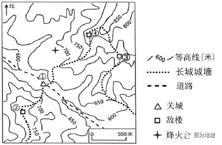   
   
14．关城选址在图示位置的主要原因是（  ）   
A．地形平缓，方便施工   
B．山体阻挡，利于防守   
C．临近道路，生活便利   
D．交通要道，容易发现   
15．下列四地，不能眺望到烽火台的地方有（  ）   
A．①   
B．②   
C．③   
D．④   
16．地理研学小组的研究课题最有可能是（  ）   
A．数字地球在长城旅游开发中的应用研究   
B．地理环境条件的变迁对长城的影响研究   
C．长城开发存在的问题及保护对策研究   
D．古长城的选址与地形条件的关系研究   
<span style="color: rgb(255, 0, 0);">14．根据材料信息可知，长城是我国古代重要的军事防御工程， 关城是长城防御体系的重要组成部分，主要功能是军事防御。 读图可以看出，关城位于山谷，只有一条沿着山谷通行的道路，且关城的西，南、北面均为山地。因此，关城选址主要考虑其防御功能， 利用高大的地形为屏障，利于军事防守，B对；关城位于山谷，地形平缓，方便施工，临近道路，生活便利，根据材料“筑长城，因地形，用制险塞……”说明关城选址主要考虑军事防御，而不是施工与交通问题，A、C错；关城位于山谷，西，南、北面均为山地，不容易发现，D错。故选B。</span>   
<span style="color: rgb(255, 0, 0);">15．由图可知，①地位于山谷，海拔较低，烽火台位于山脊，海拔较高，①地与烽火台之间是凹形坡，①地能看到烽火台，A能，不合题意；②地位于750～800米之间，烽火台位于650～700米之间，②地与烽火台之间没有高地阻碍视线，能通视，B能，不合题意；③地与烽火台之间有山脊遮挡，不能通视，C不能，符合题意；④地位于山脊的高海拔处，烽火台位于山脊的低海拔处，山脊等高线上密下疏，为凹坡可以通视，D能，不合题意。本题要求选择不能眺望到烽火台的选项，故选C。</span>   
<span style="color: rgb(255, 0, 0);">16．材料中没有反应出与数据地球有关的信息及地理环境变迁，A、B错；根据材料“主要考察了风化、风蚀作用对长城的影响”可知地理研学小组以长城为研究对象，主要研究的是外力作用对长城的破坏程度、长城开发中存在的问题，及保护对策研究，C对；材料中“筑长城，因地形，用制险塞……”反应的是要塞选址，并没有反应古长城的选址，且根据材料该地理研究小组考察的是外力对长城的影响，D错。故选C。</span>   
（2022·辽宁·渤海大学附属高级中学模拟预测）三叶草为多年生草本植物，喜温暖、向阳，多生长在年降水量800-1000mm排水良好的环境，平均根深20-33cm，最大根深可达120cm。下图示意非洲西北部某风景区等高线和等潜水位线分布状况。景区内有一较大溪流发育，该溪流径流量季节差异明显。景区内广泛种植三叶草。据此完成下面小题。   
   
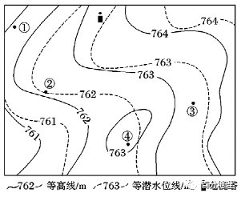   
   
17．图示区域（  ）   
A．①地地表的坡面径流流向东南   
B．③④两地的相对高度可能为0米   
C．④地夜晚无法看到电视塔顶的指示灯   
D．景区内较大的溪流自西南流向东北   
18．此季节图示地区（  ）   
A．受盛行西风影响   
B．河流水补给地下水   
C．河流挟带泥沙较少   
D．日落时塔影和溪流大致平行   
<span style="color: rgb(255, 0, 0);">17．坡面径流应是垂直于等高线由高处流向低处，根据①地等高线分布可判断，①地表的坡面径流方向流向西北，A错误。读等高线地形图可知：③地海拔在763m—764m之间；④地海拔在763m—764m之间，所以，③④两地的相对高度可能为0米，B正确。依据“凸低为脊（高）”的原则可判定④地与电视塔之间有一山脊，④地与电视塔连线途径地区山脊高度在763m—764m之间；④地海拔在763m—764m之间，因此不可看到电视塔顶的指示灯，C错误。依据“凸高为谷（低）”可判定，图中东南部弯曲比较大区域为山谷，有河流发育，自东北流向西南，D错误。所以选B。</span>   
<span style="color: rgb(255, 0, 0);">18．通过图中的等高线和等潜水位线判断此时地下水补给河流水，为当地的枯水期；当地位于非洲西北部，结合三叶草的生长习性可判定当地为地中海气候，冬季温和多雨、夏季炎热干燥，因此为当地夏季。夏季地中海气候区受副热带高压控制，A错误；通过图中的等高线和等潜水位线判断，此时地下水补给河流水，B错误；地下水补给河流水，为河流枯水期，河流流量较小，携带泥沙较少，C正确；非洲西北部为北半球，夏季日落时，太阳位于西北方地平线，则塔影朝向东南，图中溪流自东北流向西南，二者并不平行，D错误。所以选C。</span>   
海滩离岸流，也叫回卷流，是一股垂直于海岸流向外海的狭窄而强劲的水流，多发于沙质海滩的横向沙坝、沟槽等地形区域。某个时刻，在风、波浪、潮流等作用下，冲向海滩的海水因某种扰动聚集起来，最终大量的海水从较低的缺口冲出形成离岸流，强劲的水流可以在很短的时间内将在此区域活动的人群拖到外海，造成溺水事件。下图为我国某海域地形图，据此完成下面小题。   
   
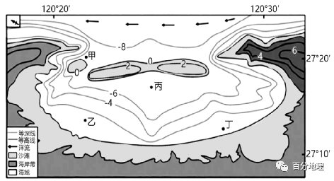   
   
19．图示海滩最容易发生离岸流的海域是（  ）   
A．甲   
B．乙   
C．丙   
D．丁   
20．在海滩不幸遇到离岸流，最科学的自救方法是（  ）   
A．尽全力逆流游回岸边   
B．呼叫或挥手寻求救援   
C．平行于海岸向两边游   
D．下潜到水底走回岸边   
21．假如你站在图中岸边沙滩上，会发现离岸流处的海水（  ）   
①清澈透明   
②颜色偏黄   
③风平浪静   
④浪花翻卷   
A．①③   
B．②③   
C．①④   
D．②④   
<span style="color: rgb(255, 0, 0);">19．由材料可知，离岸流多发于沙质海滩的横向沙坝、沟槽等区域；结合图例可看出，丙处北侧有一横向沙坝，南侧等深线向水浅的方向弯曲为沟槽地形，可判断出丙最容易发生离岸流，C正确；甲处等深线向水深的方向弯曲，为海底山脊地形，不易发生离岸流，A错；乙和丁两地等深线稀疏平直，不易发生离岸流，BD错。故选C。</span>   
<span style="color: rgb(255, 0, 0);">20．由材料“强劲的水流可以在很短的时间内将在此区域活动的人群拖到外海”可知，离岸流速度快，因此不易逆流回岸边，可暂时随波逐流，A错；呼叫或挥手寻求救援可行，但离岸流速度快，别人不一定发现，且别人发现后的救援不属于自救，B错；离岸流是在海浪和水底地形共同作用下，底层海水也发生扰动，下潜更危险，D错；由于离岸流宽度较窄，因此可向平行于海岸的两边游，C正确。故选C。</span>   
<span style="color: rgb(255, 0, 0);">21．由材料“冲向海滩的海水因某种扰动聚集起来”可知，离岸流发生时，海水聚集会使底层沙质搅动，使海水浑浊，颜色偏黄，①错、②正确；离岸流速度快且表面平静，不易发觉，③正确、④错。②③正确，故选B。</span>   
风险边坡失稳造成的危害极大，威胁生产生活安全。某矿区采用智能化边坡在线监测系统实时监测边坡风险，提前加固边坡，保障了生产安全。下图分别示意边坡传感器布设形式和边坡等高线，传感器数量精简化和特种排列方式是地面监测的未来发展方向。据此完成下面小题。   
   
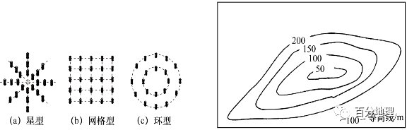   
   
22．为保证该系统的有效运行，传感器的布设应符合（  ）   
①避开断层和破碎带   
②尽量在一条直线或平面上   
③尽量远离开采区   
④尽量集中放置   
A．①③   
B．②③   
C．②④   
D．①④   
23．根据该地边坡形态，传感器更新改造后布设形式是（  ）   
A．星型   
B．网格型   
C．环型   
D．分散布置   
<span style="color: rgb(255, 0, 0);">22．该系统是实时监测边坡风险，断层和破碎带会影响传感器监测，故要避开，①正确；边坡是具有一定坡度的倾斜坡面，故传感器应呈立体状方能很好地监测位移，②错误；开采区的震动会影响监测，故要远离开采区，③正确；据图可知，传感器分散均匀放置比较合理，④错误。故选A项。</span>   
<span style="color: rgb(255, 0, 0);">23．据图中等高线判断，边坡形态为环形，故选择环型布设形式以达到精简化目的，其他形式均不适宜该边坡形态。故选C项。</span>   
第24届冬奥会于2022年2月4日至20日在北京和张家口举行，其中张家口赛区承办大部分滑雪项目。下图示意张家口某高山滑雪场等高线分布。据此完成下面小题。   
   
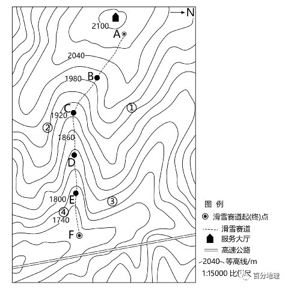   
   
24．滑雪比赛中，下列赛段平均速度最大的是（  ）   
A．AB段   
B．BC段   
C．CD段   
D．DE段   
25．图中①②③④四个地点中几乎可以观看到比赛全程的是（  ）   
A．①   
B．②   
C．③   
D．④   
<span style="color: rgb(255, 0, 0);">24．题干要求确定“滑雪比赛……平均速度最大”的赛段，即找出区间短并且坡度大的赛段。读图可知，图中等高距为30m。AB、BC和CD段均跨过三条等高线，因此落差均在90——120m之间；DE段跨过两条等高线，落差范围为60——00m；EF段跨过一条等高线，落差范围为30——60m。水平距离中，AB&gt;BC&gt;CD段，CD、DE和EF段水平距离相近。根据“坡度”相关知识，坡度与垂直距离成正比，与水平距离成反比。CD段垂直落差范围大，水平距离小，因此CD段坡度最大，故该赛段在滑雪比赛中，平均速度最大。故本题应选C。</span>   
<span style="color: rgb(255, 0, 0);">25．根据“等高线”相关知识，等高线凸向低海拔处为山脊。读图可知，①③均位于山脊的东侧，视野受到山脊阻挡，不能完整观看山脊西侧的赛道，排除A、C项。观察图片。由A到B等高线先稀疏后密集，坡度先缓后陡，为凸坡，④处海拔在1740——1770m之间，无法通视AB段，排除D项。根据“地貌的观察”相关知识，应选择视野开阔地区。②处海拔在1920——1950m之间，视野开阔，几乎可以观看到比赛全程，故本题正确答案为B。</span>   
<span style="color: rgb(255, 0, 0);">【点睛】坡度是划分坡的重要标准，坡度大小一般用坡度角或者垂直距离和水平距离的比值来表示。垂直距离相同，水平距离越小，坡度越大；水平距离一定，垂直距离越大，坡度越大。在等高线地形图中，等高线由数值大的向数值小的方向弯曲，表示为山脊；等高线由数值小的向数值大的方向弯曲，表示为山谷。等高线图中，等高线上部稀疏下部密集为凸坡，无法通视；等高线上部密集下部稀疏为凹坡，可以通视。</span>   
二、综合题   
26．阅读图文资料，完成下列要求。   
我国某中学利用暑假到我国牛背梁国家森林公园进行研学旅行，景区面积2123公顷，原始森林、潭溪瀑布、峡谷风光和石林景观，造就了这里景观多样性与独特性于一体的国家级森林公园。国家4A级景区、全国青少年户外体育活动营地，被誉为“中国最美原生态旅游景区”。图甲为该景区局部等高线图，图乙为该景区旅游线路示意图。   
   
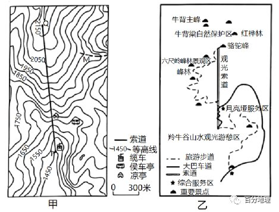   
   
(1)指出甲、乙两图中比例尺较大的那一幅，并说明理由。   
(2)图甲索道在图上距离为6.7厘米，索道实际长度约多少米。   
(3)分析图乙从月亮垭服务区到骆驼峰旅游步道弯曲的原因。   
(4)分析该景区修建缆车索道的利弊。   
<span style="color: rgb(255, 0, 0);">【答案】(1)甲图。理由：同样长的索道在甲图中图上距离长，说明甲图代表的实地范围小；比例尺越大，代表实地范围就越小，故甲图比例尺较大。</span>   
<span style="color: rgb(255, 0, 0);">(2)索道实际长度约2140米。</span>   
<span style="color: rgb(255, 0, 0);">(3)路线弯曲，可降低坡度，方便游客游览；连接更多的旅游景点，增加游览内容；增加线路长度，分散游客，增加游览时间。</span>   
<span style="color: rgb(255, 0, 0);">(4)利：方便游客上下山，省时省力；增加旅游项目，满足游客游览；缆车收费，增加景区旅游收入；缆车运行、维护等，安置劳力就业等。</span>   
<span style="color: rgb(255, 0, 0);">弊：破坏景区原有风貌，影响景区生态环境；设备投资大，安全要求高，增加景区管理难度等。</span>   
<span style="color: rgb(255, 0, 0);">【解析】本大题以景区局部等高线图，旅游线路示意图为材料设置试题，涉及比例尺计算、等高线判读、缆车优缺点等相关内容，考查学生获取和解读地理信息，调动和运用地理知识和基本技能的能力，体现综合思维、区域认知、地理实践力的地理核心素养。(1)根据所学知识“尺大实小内容详，尺小实大内容略”，如图所示，同样长的索道在甲图中图上距离长，在乙图上实际距离短，说明甲图代表更详细，实地范围小，比例尺较大，故甲图比例尺较大。(2)图上距离比实际距离为比例尺，图例为图上1厘米代表实际距离300米，索道在图上距离为6.7厘米，则图中索道的实际距离（索道在水平面的投影）为2010米，图中索道的高差约为700-750米，根据勾股定理可计算，索道的长度介于2128-2145米之间（答案数值介于之间均可）。(3)如左图所示，月亮垭服务区到骆驼峰旅游步道等高线密集，坡度大，路线弯曲，可降低坡度，降低登山难度，方便游客游览；路线变长，连接更多的旅游景点，增加游览内容；增加线路长度，分散游客，减少拥堵，同时可以增加游览时间。(4)利：有了索道后，游客可根据需求选择是否乘坐索道上下山，方便游客上下山，省时省力；乘坐缆车游览可以领略不一样的风光，增加旅游项目，满足游客游览；缆车收费，增加景区旅游收入；缆车运行、维护等需要劳动力，可以增加就业。弊：修建缆车索道需要破坏地表，破坏景区原有风貌，影响景区生态环境；缆车索道设备投资大，花费高，缆车索道悬在高空，安全要求高，增加景区管理难度等。</span>   
27．阅读图文资料，完成下列要求。   
武陵源位于湖南省西北部，区内地形陡峭，河谷深切，地壳运动强烈，崖壁岩穴密布。调查发现，该区域现今岩穴多分布于山体西坡和北坡，山体东坡和南坡较少。下左图为武陵源典型岩穴分布区等高线地形图，下右图示意某山体岩穴发育过程。   
   
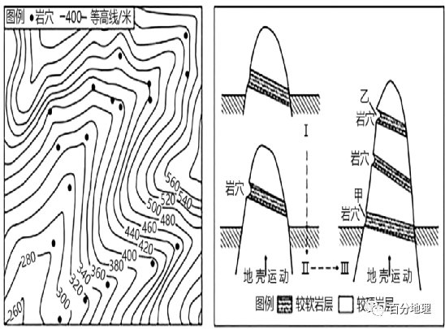   
   
(1)描述左图所示区域岩穴的分布特征。   
(2)据右图指出同一山体形成多级岩穴需具备的基本条件。   
(3)比较岩穴甲和岩穴乙发育情况的差异，并说明原因。   
(4)分析武陵源山区现今岩穴多分布于山地西坡和北坡的原因。   
<span style="color: rgb(255, 0, 0);">【答案】(1)分布不均匀；集中于谷地（或360－480米之间分布数量较多）；沿河流（溪流）发育（或呈带状分布）。</span>   
<span style="color: rgb(255, 0, 0);">(2)地壳间歇性抬升；有河流（溪流）发育，风化、侵蚀、搬运作用强；有多层较松软岩层与较硬岩层相间分布。</span>   
<span style="color: rgb(255, 0, 0);">(3)差异：岩穴甲比岩穴乙发育程度低（宽度和深度小）。</span>   
<span style="color: rgb(255, 0, 0);">原因：岩穴甲处于发育初期，受风化、（流水）侵蚀（外力作用）时间短，被侵蚀、搬运的岩石物质少，（形成的岩穴宽度和深度小）。</span>   
<span style="color: rgb(255, 0, 0);">(4)山地北坡为阴坡，西坡与北坡为夏季风背风坡。侵蚀与风化作用比东坡和南坡小，其形成的岩穴演化较慢，保有量较大。</span>   
<span style="color: rgb(255, 0, 0);">【解析】(1)读图该区岩穴总体分布均，根据等高线弯曲方向，岩穴主要分布在河谷地带（等高线向高处弯曲）；沿河谷多呈带状分布。(2)读图多级岩穴的形成和地壳运动、岩石性质、外力作用有关；山体岩穴是较软的岩层被风化、侵蚀以及外力搬运作用形成的，所以形成岩穴的岩石岩性较软，该地区受外力作用强；多级岩穴是因为地壳多次抬升，在地壳运动的稳定期，受外力作用形成岩穴，所以该处地壳间歇性抬升；多层较软岩层和较硬岩层相间分布。(3)根据上题多级岩穴的形成受地壳间歇性抬升的影响，与甲相比较，乙岩穴分布的地势较高，形成时间早，受流水、风力等外力侵蚀作用时间长，所以岩穴发育程度高，岩穴宽度和深度大。(4)该地区位于我国东部季风区，东坡和南坡位于夏季风迎风坡，受流水以及风力作用影响大，岩穴被破坏严重，不易保存；西坡和北坡为夏季风背风坡，风化和侵蚀作用比东南坡小，岩穴形成较慢，保存较好。</span>   
28．（2022·全国·高三专题练习）阅读图文材料，回答下列问题。   
长城是中国古代军事防御工程，由城墙、敌楼、关城、烽火台等多种防御工事所组成。下图为“某地长城景区等高线地形图及关城景观图”   
   
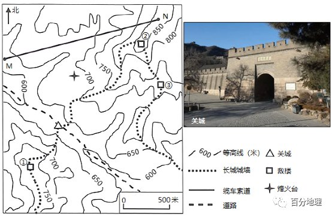   
   
“筑长城，因地形；用制险塞。”关城是长城建筑体系的重要组成部分，其位置至关重要。   
(1)写出图中关城修筑的地形部位，并据此说明选址原因。   
“登高望烽火，谁谓塞尘飞。”烽火台是古代用于点燃烟火传递消息的设施。   
(2)写出图中不能眺望到烽火台的敌楼，并说明理由。   
该地长城景区在M、N之间修建缆车索道，方便游客登临高峰并观赏风景。   
(3)描述缆车索道上行方向的地形坡度变化，并说明理由。   
<span style="color: rgb(255, 0, 0);">【答案】(1)鞍部。位于交通道路上，便于控制内外联系通道，利用两侧山体作为防御屏障，利于防守等。</span>   
<span style="color: rgb(255, 0, 0);">(2)敌楼③。由于敌楼③与烽火台之间有高于敌楼海拔的山脊阻挡。</span>   
<span style="color: rgb(255, 0, 0);">(3)索道上行方向的坡度由缓变陡。等高线由疏到密。</span>   
<span style="color: rgb(255, 0, 0);">【解析】(1)读图可知，关城修筑地区两次等高线为一对山谷线和一对山脊线交汇处，是两个山顶之间较低的部位，地形部位为鞍部。鞍部地区地势较为平坦，有道路经过，说明该地交通相对便利。同时，两侧为山顶，有天然屏障，利于防守。(2)读图可知，图中敌楼③与烽火台之间有山脊阻挡视线（等高线向海拔较低处凸出），不能通视，而图中①②敌楼海拔较高，与烽火台之间没有山脊阻挡视线，可以眺望到。(3)将NM线与等高线交点，按照一定比例标出，用平滑曲线连接即可。由图可知，靠近M处等高线稀疏，坡度小，N处等高线密集，坡度大，说明上行方向，坡度由缓变陡。等高线由疏到密。</span>