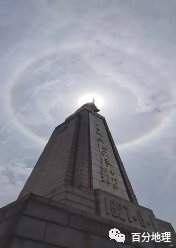
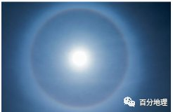
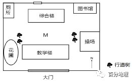
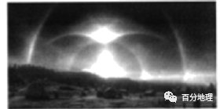
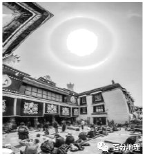

# 微专题之074 从产业结构角度分析区域发展

```
本专题摘自“百分地理”公众号，如有侵权请告之删除，谢谢。联系hhwxyhh@163.com
```

------
   
（2022·全国·高三专题练习）“日晕”现象是太阳光通过高空薄薄的云层时,受到云层中冰晶的折射或反射而形成的较为罕见的大气光学现象，往往预示着天气的变化,民间有“日晕三更雨”的谚语,一般持续时间比较短。下图示意南昌市八一广场某日11时的日晕景观。据此完成下面小题。   
   
   
   
1．南昌“日晕”现象发生时未产生降水,所缺乏的降水条件是（  ）   
A．水汽含量不足   
B．空气下沉增温   
C．空气上升冷却   
D．凝结核缺乏   
2．有利于日晕出现的天气条件是（  ）   
①大气对流运动强烈   
②微风或无风   
③足够的水汽   
④锋面活动强烈   
A．①②   
B．②③   
C．③④   
D．①④   
<span style="color: rgb(255, 0, 0);">1．C根据材料可知，日晕现象发生时，高空大气中有冰晶存在，说明空气中水汽较充足，且并不缺凝结核， AD 错；但由于水汽凝结量仍不足，冰晶或水滴质量较轻，不足以克服空气的浮力而降落到地面，还需要低空水汽进一步上升冷却，增加冰晶或水滴质量，使其能降落到地面，C 正确；空气下沉增温不利于水汽凝结，B 错误。故选 C 。</span>   
<span style="color: rgb(255, 0, 0);">2．B 空气中必须有足够的水汽才能产生冰晶，而冰晶可以产生光的折射，从而形成日晕，③正确；风力过大，大气对流运动强烈、锋面活动强烈，冰晶就会被打乱，难以形成日晕，①④错误，微风或无风有利于日晕出现，②正确。故选 B 。</span>   
<span style="color: rgb(255, 0, 0);">【点睛】全球各地日出日落方位判读：春秋分，太阳都是日出正东，日落正西；夏半年（北半球），太阳日出东北、日落西北，纬度越高，日出、日落越偏北。北极地区出现极昼，极昼区域，正北太阳高度最小，正南太阳高度最大；冬半年（北半球）日出东南、日落西南，纬度越高，日出日落越偏南。南极地区出现极昼，极昼区域，正南太阳高度最小，正北太阳高度最大。</span>   
（2022·全国·高三专题练习）2022年5月4日，四川多地出现了“日晕”现象（下左图）。日晕是高空薄云层中的冰晶折射或反射太阳光所形成的一种罕见大气光学现象。下右图为成都（31°N，104°E）某校园部分区域平面图，图中综合楼与教学楼均为五层，楼间距约10米，行道树几乎与楼一样高。据此完成下面小题。   
   
   
   
   
   
   
3．下列因素与日晕现象形成密切相关的有（  ）   
①太阳辐射   
②大气对太阳辐射的削弱作用   
③大气逆辐射   
④大气中充足的水汽   
⑤地面辐射   
A．①②④   
B．①③④   
C．②③④   
D．②③⑤   
4．当天北京时间13:04，李老师站在右图中M地拍摄完整的日晕照片，下列最可能与日晕“同框”的是（  ）   
A．综合楼   
B．教学楼   
C．操场边的行道树   
D．花圃旁的行道树   
5．夏季，摄影爱好者最容易拍到日晕现象的地区是（  ）   
A．地中海沿岸   
B．撒哈拉沙漠   
C．青藏高原   
D．塔里木盆地   
<span style="color: rgb(255, 0, 0);">3．A根据日晕的概念大气中大量水汽凝华后的冰晶对光线折射或反射所产生的光晕现象”，可知日晕是大气中的水汽对光线折射或反射作用，属于大气对太阳辐射的削弱作用，故与此次日晕形成最密切的是太阳辐射、大气的削弱作用，大气中充足的水汽，①②④正确；与大气逆辐射、地面辐射无关，③⑤错误。故选A。</span>   
<span style="color: rgb(255, 0, 0);">4．B当天北京时间13:04，成都（31°N，104°E）与120°E相差16个经度，时差1小时4分钟，因此，成都地方时为12：00，此时太阳位于正南方位。李老师站在右图中M地拍摄完整的日晕照片，最可能与日晕“同框”的是南部的教学楼，B正确；综合楼在北部，不可能同框，A错误；操场边的行道树、 花圃旁的行道树分别在上午或者下午才能与之同框，CD错误。故选B。</span>   
<span style="color: rgb(255, 0, 0);">5．C根据材料“水汽凝华的冰晶”，得出水汽较充足。夏季，受夏季风影响大，青藏高原水汽较充足，上升气流强，容易在空中形成冰晶，C正确；夏季地中海沿岸炎热干燥，撒哈拉沙漠、塔里木盆地沙漠广布，水汽较少，难以形成日晕， ABD错误。故选C。</span>   
<span style="color: rgb(255, 0, 0);">【点睛】太阳辐射到达地面的过程中，大气吸收、反射和散射削弱了太阳辐射，大部分太阳短波辐射到达地面，地面吸收太阳辐射使地面温度升高，地面又会向外辐射能量，大气吸收大部分地面长波辐射，大气由于吸收太阳辐射和地面长波辐射使温度升高，同时大气又会向地面辐射能量，称为大气逆辐射。概括起来是太阳暖大地、大地暖大气、大气还大地。</span>   
（2022·全国·高三专题练习）2020年4月25日，全国多地中午可见日晕现象，下图是拍摄于泉州的日晕图。冰晕是大气中大量水汽凝华后的冰晶对光线折射或反射所产生的光晕现象，是日晕、月晕和其他光源产生的晕象的总称。近年来，进入青藏高原拍摄冰晕正成为一种新潮流。据此完成下面小题。   
   
   
   
6．与此次泉州日晕形成最密切的是（  ）   
①太阳辐射   
②大气的削弱作用   
③大气的保温作用   
④地面辐射   
A．①②   
B．③④   
C．②④   
D．①③   
7．近年来，进入青藏高原拍摄冰晕正成为一种新潮流，推测其原因（  ）   
①青藏高原冰川丰富   
②全球气候变暖   
③进藏交通条件改善   
④摄影设备普及   
A．①②   
B．③④   
C．②④   
D．①③   
8．青藏高原日晕多出现在（  ）   
A．春季   
B．夏季   
C．秋季   
D．冬季   
<span style="color: rgb(255, 0, 0);">6．A根据日晕的概念“大气中大量水汽凝华后的冰晶对光线折射或反射所产生的光晕现象”，可知日晕是大气中的水汽对光线折射或反射作用，属于大气对太阳辐射的削弱作用，故与此次泉州日晕形成最密切的是太阳辐射、大气的削弱作用，①②正确；与大气的保温作用、地面辐射无关，③④错误；故选A。</span>   
<span style="color: rgb(255, 0, 0);">7．B随着科技和社会的发展，进藏交通条件的改善，摄影设备的普及，使人们走近青藏高原拍摄冰晕的机会越来越多，冰川丰富，全球气候变暖和冰晕没有因果关系，③④正确，①②错误；故选B。</span>   
<span style="color: rgb(255, 0, 0);">8．B根据材料“水汽凝华的冰晶”，得出水汽较充足。相较于其他季节，夏季，受夏季风影响大，水汽较充足，上升气流强，容易在空中形成冰晶，B正确，ACD错误；故选B。</span>   
<span style="color: rgb(255, 0, 0);">【点睛】太阳辐射到达地面的过程中，大气吸收、反射和散射削弱了太阳辐射，大部分太阳短波辐射到达地面，地面吸收太阳辐射使地面温度升高，地面又会向外辐射能量，大气吸收大部分地面长波辐射，大气由于吸收太阳辐射和地面长波辐射使温度升高，同时大气又会向地面辐射能量，称为大气逆辐射；概括起来是：太阳暖大地、大地暖大气、大气还大地。</span>   
（2022·全国·高三专题练习）“日晕”现象是太阳光通过高空薄薄的云层时，受到云层中冰晶的折射或反射而形成的较为罕见的大气光学现象，往往预示着天气的变化，民间有“日晕三更雨”的谚语，一般持续时间比较短。山东烟台市是“日晕”现象多发区，春夏之交出现率最高。2019年4月16日11时，山东烟台市上空出现“日晕”奇观，16日20时烟台市偏北风开始增强，22时天空中飘起了小雨。据此完成下面小题。   
9．烟台“日晕”现象发生时未产生降水，所缺乏的降水条件是（  ）   
A．水汽含量不足   
B．空气下沉增温   
C．空气上升冷却   
D．凝结核缺乏   
10．有利于日晕出现的天气条件是（  ）   
①大气对流运动强烈   
②微风或无风   
③足够的水汽   
④锋面活动强烈   
A．①②   
B．②③   
C．③④   
D．①④   
<span style="color: rgb(255, 0, 0);">9．C根据材料“日晕现象是太阳光通过云层时，受到冰晶的折射或反射而形成的大气光学现象”可知，高空中有冰晶，即意味着有大量水汽凝结，说明空气中水汽较充足，但凝结量不够，不足以降落下来，故烟台“日晕”现象发生时未产生降水，所缺乏的降水条件是还需要低空水汽进一步上升冷却，云层增厚，达到足量水汽凝结，在重力作用下才能降落到地面，C项正确，A、B项错误；能够凝结成冰晶，说明凝结核充足，D项错误。所以选C。</span>   
<span style="color: rgb(255, 0, 0);">10．B“日晕”作为一种比较罕见的天文现象，它所需要的气象条件是比较苛刻的。第一个条件是天空得有适量的高云。因为云是产生几日同辉现象的物质载体，云太少，“日晕”形成不了；云太多，光直接被云吸收掉，日光射不到地面上来；云太低，云的主要含量是水滴而不是冰晶，形成的将是彩虹而不是“日晕”。第二个条件是空气中必须有足够的水汽。冰晶水汽在冰核上凝华增长而形成的固态水成物，通常情况下，六棱体的冰晶存在才能产生光的折射。第三个条件是风得比较小，大气层也得比较稳定，否则的话，有规则的冰晶就会被打乱，形成不了有规律的光的折射现象。结合选项可知，②③正确，①④错误。所以选B。</span>   
<span style="color: rgb(255, 0, 0);">【点睛】日晕是一种大气现象。它形成的原因是在5000米的高空中出现了由冰晶构成的卷层云，卷层云中的冰晶经过太阳照射后会发生折射和反射等物理变化，阳光便分解成了红、黄、绿、紫等多种颜色，这样太阳周围就出现一个巨大的彩色光环，称为晕。</span>（2022·全国·高三专题练习）冰晕是大气中冰晶对光线折射、反射所产生的大气光学现象，是日晕、月晕和其他光源产生的晕象的总称，经多年的统计研究发现，一些被欧美专家视为“百年一遇”的罕见冰晕现象（下图），却在我国屡见不鲜，西南地区更是频繁出现。据此完成下面小题。   
   
   
   
11．下列属大气中光线折射产生的光学现象是（  ）   
A．云港   
B．彩虹   
C．日食   
D．流星雨   
12．我国西南地区频繁出现其他地区罕见冰晕的原因是（  ）   
A．垂直差异显著，云雾天气较多   
B．空气稀薄，折射、反射作用强   
C．地形复杂多样，对流运动旺盛   
D．山高谷深，受人类活动干预少   
<span style="color: rgb(255, 0, 0);">11．B 彩虹是太阳光经过空气中的水珠进行折射后形成，B正确。云瀑是水汽受到地形阻挡爬升，越过山脊后大量下沉而形成的。日食是日地月在一条线上，地球将照射到月球的太阳光遮挡后看不到月亮而形成的。故选B。</span>   
<span style="color: rgb(255, 0, 0);">12．C西南地区纬度较低，蒸发较旺盛，水汽含量较多；其次地形复杂多样，下垫面冷热不均，对流旺盛，上升水汽遇冷形成冰晶，对太阳光线进行折射后，多形成冰晕现象。故选C。</span>   
<span style="color: rgb(255, 0, 0);">【点睛】地形类型有5种：1 平原：地面平坦,海拔较低,一般在200米以 下； 2 高原：海拔较高,一般在500米以上,地面坦坦荡,边缘陡峻； 3 山地：海拔较高，一般在500米以上，峰峦起伏,坡度陡峻； 4 丘陵：地面起伏和坡度适中，海拔一般在500米以下；5 盆地，地势中间低四周高。</span>   
（2022·全国·高三专题练习）“日晕”现象是太阳光通过高空薄薄的云层时，受到云层中冰晶的折射或反射而形成的较为罕见的大气光学现象，往往预示着天气的变化，民间有"日晕三更雨"的谚语，一般持续时间比较短。山东烟台市是"日晕"现象多发区，春夏之交出现率最高。2019年4月16日11时，山东烟台市上空出现"日晕"奇观，16日20时烟台市偏北风开始增强，22时天空中飘起了小雨。据此完成下面小题。   
13．烟台"日晕"现象发生时未产生降水，所缺乏的降水条件是（  ）   
A．水汽含量不足   
B．空气下沉增温   
C．空气上升冷却   
D．凝结核缺乏   
14．导致烟台该日"三更雨"的天气系统最有可能是（  ）   
A．冷锋   
B．暖锋   
C．准静止锋   
D．反气旋   
15．有利于日晕出现的天气条件是（  ）   
①大气对流运动强烈   
②微风或无风   
③足够的水汽   
④锋面活动强烈   
A．①②   
B．②③   
C．③④   
D．①④   
<span style="color: rgb(255, 0, 0);">13．C根据材料"日晕，现象是太阳光通过云层时，受到冰晶的折射或反射而形成的大气光学现象。可知，高空中有冰晶，即意味着有大量水汽凝结，说明空气中水汽较充足，但凝结量不够，不足以降落下来，故烟台"日晕,现象发生时未产生降水，所缺乏的降水条件是还需要低空水汽进一步上升冷却，云层增厚，达到足量水汽凝结，在重力作用下才能降落到地面。C项正确，A、B、D项错误。故选C。</span>   
<span style="color: rgb(255, 0, 0);">14．A根据材料,位于山东半岛的烟台在春季4月16日11时出现"日晕，20时偏北风开始增强，气温将下降，22时开始下雨，根据冷锋天气过境时的特征，再结合高空大量冰晶漂浮产生"日晕，判断其为冷锋天气，A项正确，B项错误。准静止锋天气特征为连绵阴雨，C项错误。反气旋过境一般形成晴朗少雨的天气状况，D项错误。故选A。</span>   
<span style="color: rgb(255, 0, 0);">15．B“日晕”，作为一种比较罕见的天文现象，它所需要的气象条件是比较苛刻的。第一个条件是天空得有适量的高云。因为云是产生几日同辉现象的物质载体，云太少，“日晕”形成不了；云太多，光直接被云吸收掉，日光射不到地面上来；云太低，云的主要含量是水滴而不是冰晶，形成的将是彩虹而不是“日晕”。第二个条件是空气中必须有足够的水汽。冰晶水汽在冰核上凝华增长而形成的固态水成物，通常情况下，六棱体的冰晶存在才能产生光的折射。第三个条件是风得比较小，大气层也得比较稳定，否则的话，有规则的冰晶就会被打乱，形成不了有规律的光的折射现象。结合选项可知，②③正确，故选B。</span>   
<span style="color: rgb(255, 0, 0);">【点睛】本题组主要考查"日晕"现象的相关知识。 "日晕形成必有冰晶状云,常常是冷暖气流相遇而形成，而后云层增厚，发展成雨云，因此日晕常是风雨将至的前兆。</span>   
（2022·全国·高三专题练习）日晕是在太阳周围出现的一个或两个以上以太阳为中心的彩色光环，是悬浮在大气中的冰晶折射或反射太阳光而形成的光学现象。西藏拉萨大昭寺座东朝西，其正门前常年有虔诚的信徒在此朝圣。下为某摄影师在拉萨市大昭寺正门前拍摄的日晕画面。据此完成下面小题。   
   
   
   
16．摄影师拍摄该照片时，北京时间可能在左右   
A．6：00   
B．8：00   
C．12：00   
D．15：00   
17．推测图中拉萨此时的天气最可能为   
A．烟雨迷蒙   
B．天气晴朗   
C．漫天飞雪   
D．云雾缭绕   
<span style="color: rgb(255, 0, 0);">16．C 根据图可知，这是大昭寺的正门位置，而且大昭寺座东朝西，则此时太阳位于东南方向，应该为当地时间的上午。拉萨为90°E，为东六区，北京时间为东八区时间，两地的区时相差两小时，C对，ABD错。故选C。</span>   
<span style="color: rgb(255, 0, 0);">17．B读图可知，拉萨大昭寺门前出现日晕现象，表明有太阳辐射，说明天气晴朗。B对，ACD错。故选B。</span>