# 微专题之074 从产业结构角度分析区域发展

```
本专题摘自“百分地理”公众号，如有侵权请告之删除，谢谢。联系hhwxyhh@163.com
```

------
   
（2022·辽宁·沈阳市第十中学高三阶段练习）大湖效应是指冷空气遇到大面积未结冰的水面（通常是湖泊），从中得到水蒸汽和热能，然后在向风的湖岸形成降水的现象。受大湖效应影响，2014年美国部分地区遭受罕见的暴风雪。下面图1为某次暴风雪形成过程示意图，图2为某区域地图。读图，回答下题。   
   
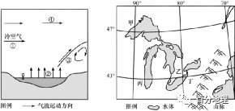   
   
1．如图中（  ）   
A．①气流强弱决定降水量多少   
B．②环节可以用GIS技术监测   
C．产生③过程的原理类似暖锋   
D．④为高空冷气流受热后抬升   
2．如图中出现降雪量最大月份和地点可能是（  ）   
A．1月，甲地   
B．4月，乙地   
C．9月，丙地   
D．11月，丁地   
<span style="color: rgb(255, 0, 0);">1．C影响降水量多少的因素与②湖面水汽蒸发量关系密切，并不是①气流的强弱，A错误。②湖面水汽蒸发不能用GIS技术监测，B错误。经过湖面增温增湿的气团在湖泊另一岸与冷气团相互作用，形成类似暖锋的天气系统，产生降水，C正确。气流④为高空冷气团，受热后抬升是近地面空气，D错误。故选C。</span>   
<span style="color: rgb(255, 0, 0);">2．D据图可知，图中所示为北美洲的五大湖区，降雪形成的时间为冬季，BC错误。冬季北美洲五大湖区附近盛行西北风，风能经过湖面带来充足的水汽，降雪量最大的地点一定位于向风的湖岸，而丁地既位于湖泊向风岸，又位于冬季风的迎风坡，降雪量在四地中最大，D正确，A错误。故选D。</span>   
（2021·海南·高考真题）2021年5月7日至10日首届中国国际消费品博览会在海口举办，展会上亮相的吉祥物“元宵”（下左图）的原型来自海南特有物种海南长臂猿。该物种在海南曾广泛分布，后濒于灭绝，1980年建立霸王岭自然保护区后，其数量已有较大增长。海南长臂猿旱季多在海拔1000米以上，雨季常到低海拔地区的树冠层活动。下图为“霸王岭的气候资料”示意图，据此完成下面小题。   
   
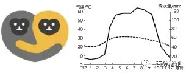   
   
3．在野外追踪海南长臂猿的活动轨迹，以下方案最合理的是（  ）   
A．1月，海拔1000米以下   
B．4月，海拔1000米以上   
C．7月，海拔1000米以下   
D．10月，海拔1000米以上   
4．当前，影响海南长臂猿生存和种群数量增长的因素主要表现在（  ）   
A．天敌多，食物少   
B．热带季雨林面积不断减少   
C．全球变暖，病虫害增多   
D．栖息地破碎，彼此分割   
5．基于自然地理环境整体性原理，有效保护海南长臂猿的措施是（  ）   
A．发展基因技术，优化海南长臂猿种群结构   
B．加快道路建设，完善保护区的基础设施   
C．加强巡山和人工驯化，保护海南长臂猿的生存环境   
D．加强山水林田湖草系统治理，扩大海南长臂猿的生存空间   
<span style="color: rgb(255, 0, 0);">3．C根据材料可知，海南长臂猿旱季多在海拔1000米以上，雨季常到低海拔地区的树冠层活动。海南为热带季风气候，10月-次年3月为旱季，4-11月为雨季；1月降水少，海南长臂猿主要分布在海拔1000米以上；7月为雨季，海南长臂猿主要分布在海拔1000米以下的区域，A错误，C正确；4月和10月为旱季和雨季的交换的季节，其活动轨迹不易追踪，BD错误。故选C。</span>   
<span style="color: rgb(255, 0, 0);">4．D根据材料1980年建立了霸王岭自然保护区，所以当前食物增多，A错误；建立自然保护区，热带季雨林面积增大，B错误；无法明确在气候变暖背景下，当地的病虫害是否增多，C错误；自然保护区中有山脊、道路等将其栖息地分割，使得猿群分布比较分散，影响其生存，D正确。故选D。</span>   
<span style="color: rgb(255, 0, 0);">5．D基因技术应主要针对濒临灭绝的生物种类，根据材料，近些年海南长臂猿数量有所增加，不需要采用基因技术，A错误；道路建设，使栖息地更加破碎，不利于保护海南长臂猿，B错误；加强巡山会打扰其生存环境，人工驯化不利于野生习性的保护，C错误；加强山水林田湖草系统治理，改善生态环境，有利于扩大海南长臂猿的栖息地，进而扩大其生存空间，有效保护海南长臂猿，D正确。故选D。</span>   
（2022·湖南·长郡中学模拟预测）哥伦比亚冰原位于加拿大不列颠哥伦比亚省和亚伯达省交界处，是落基山脉中第一大冰原，属于典型的山岳冰川，哥伦比亚冰原面积约325平方千米，最高端冰层厚度为130米，位于大陆分水岭，是美加地区许多河流的源头。由于冰川的冰层密度极高，光线无法折射，会呈现晶莹剔透的蓝光。下图示意该冰原位置。读图，据此完成下面小题。   
   
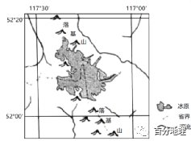   
   
6．哥伦比亚冰原成为落基山脉中第一大冰原的根本原因是（  ）   
A．距海远的地理位置   
B．寒冷而湿润的气候   
C．高大而平坦的地形   
D．河湖多的水文环境   
7．冰川呈现晶莹剔透的蓝光的原理可能是（  ）   
A．冰川中冰晶的反射作用   
B．冰晶对光线的削弱作用   
C．冰晶吸收红光超过蓝光   
D．蔚蓝天空倒映在冰面上   
<span style="color: rgb(255, 0, 0);">6．B根据材料，哥伦比亚冰原是落基山脉中第一大冰原，属于典型的山岳冰川，最高端冰层厚度为130米，位于大陆分水岭，说明该地不是平坦的地形，C错误；落基山脉位于太平洋西海岸，A错误；结合图的经纬度，这个位置被称为北美的“温带雨林地区”，可推测哥伦比亚冰原成为落基山脉中第一大冰原的根本原因主要与寒冷而湿润的气候关系最大，B正确。河湖多的水文环境与形成大冰原关系不大，反而哥伦比亚冰原是美加地区许多河流的源头，D错误；故选B。</span>   
<span style="color: rgb(255, 0, 0);">7．C入射的光线由冰晶产生反射，冰会呈现白色，A错误；冰晶对光线的削弱作用不是呈现蓝光的原理，且反射作用也属于削弱，B错误；当光线穿过很纯的水或者冰时，会有更多的红光被吸收，当冰层较厚时，便会呈现出令人心醉的蓝色，C正确。蓝色冰川多是在冰川的侧面，反而在冰面不一定是蓝色，故不是蔚蓝天空倒映在冰面上，D错误。故选C。</span>   
（2022·天津·一模）日晷是古代的一种测时工具。“日晷”的意思为“太阳的影子”，其测时原理是利用太阳照射下物影的移动来指示时间。日晷由晷盘和晷针组成，可分为赤道日晷、地平日晷等。赤道日晷的晷面应与地球赤道平行，晷针垂直穿过晷盘中心。据此完成下面小题。   
   
   
   
8．2022年元月15日，你的学校所在地太阳升起时，晷针的投影应最靠近（  ）   
A．酉   
B．寅   
C．未   
D．辰   
9．某地建有一赤道日晷，晷面与地面夹角为50°，当北京时间12：48，晷针的投影落在“午”字上，则该地的地理坐标可能是（  ）   
A．40°N108°E   
B．40°S122°E   
C．50°N108°E   
D．50°S122°E   
<span style="color: rgb(255, 0, 0);">8．D学校所在地为北半球，2022年元月15日，太阳直射南半球，北半球昼短夜长，日出晚于6:00。根据时辰对照表，酉时为17——19点，未时为13——15点，已是下午，不可能是日出时间，AC错误；寅时为3——5点，该日昼短夜长，日出晚于6:00，B错误；7——9点为辰时，符合题意，D正确。故选D。</span>   
<span style="color: rgb(255, 0, 0);">9．A晷针的投影落在“午”字上，说明此时为当地正午12:00，由前面分析可知，晷盘以上部分的晷针指向正北，晷针与地平面的夹角为当地的地理纬度，各面与地平面的夹角应接近纬度的余角，晷面与地面夹角为50°，则当地地理纬度约为40°N；北京时间采用的是120°E经线的地方时，当北京时间12:48时，与地方时为12:00的经线的时间差为48分钟，则经度差为12°，且该地位于120°E经线以西，则该地经度为108°E，故该地的地理坐标可能是(40°N，108°E)，A正确，BCD错误。故选A。</span>   
10．（2022·山东·乳山市银滩高级中学高三阶段练习）阅读图文材料，完成下列问题。   
下左图所示地区森林茂密，林下枯枝落叶丰富。这些枯枝落叶腐烂发酵，常常会引发火灾。2019年3月30日，该地因雷击发生森林大火，由于自然环境复杂，灭火困难。3月31日下午，该地又因风力、风向突变，突发山火爆燃，给灭火造成巨大困难。下左图示意该地2019年3月30日森林大火位置及周边地形（等高线单位：米）。如果风力很小，消防人员有时会用“点倒火”的方式快速灭火，如下右图所示。   
   
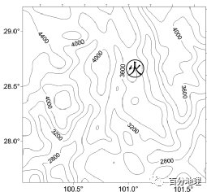   
   
   
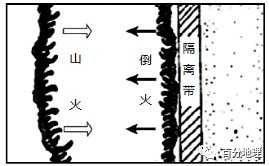   
   
(1)指出这次灭火困难的自然原因。   
(2)分析3月31日该地发生山火爆燃的原因。   
(3)利用所学地理知识，说明消防人员用“点倒火”的方式灭火的原理。   
(4)山火对森林有害也有益，任选一个方面进行说明。   
<span style="color: rgb(255, 0, 0);">【答案】(1)风力、风向变化不定，火势及蔓延方向难以预测地形复杂、山高坡陡，机械设备难以进入；起火点地势高，山上取水非常困难；春季气候干燥，山火熄灭后易复燃。</span>   
<span style="color: rgb(255, 0, 0);">(2)原始森林下可燃物长期堆积，腐烂后产生的大量可燃气体，遇火会剧烈燃烧；风力、风向突变，带来充足氧气，火势迅速增强。</span>   
<span style="color: rgb(255, 0, 0);">(3)山火导致火场气温升高，气流上升，近地面水平气流由四周流向火场，吸引“倒火”向火场方向燃烧，当两火相遇时，可燃物都已燃烧殆尽，山火自然熄灭。</span>   
<span style="color: rgb(255, 0, 0);">(4)有害：山火导致物种减少，破坏生物多样性；森林资源破坏，木材蓄积量减少。</span>   
<span style="color: rgb(255, 0, 0);">有益：土壤有机质增加，加速优势树种的生长；杀灭部分害虫减少森林虫害；促进物种更新，优化生态系统。</span>   
<span style="color: rgb(255, 0, 0);">【解析】（1）由材料可知，2019年3月30日，该地因雷击发生森林大火，由于自然环境复杂，灭火困难。3月31日下午，该地又因风力、风向突变，突发山火爆燃，给灭火造成巨大困难。该地区的风力、风向变化不定，火势及蔓延方向难以预测，灭火难度大；读图可知，起火位置地形复杂、山高坡陡，灭火所需要的机械设备难以进入；起火点地势高，取水非常困难；起火季节为春季，雨季未来临，气候干燥，增大了灭火难度。</span>   
<span style="color: rgb(255, 0, 0);">（2）由材料知，3月31日下午，该地又因风力、风向突变，突发山火爆燃。风力、风向突变，带来充足氧气，火势迅速增强；原始森林下枯枝落叶长期堆积，这些枯枝落叶腐烂发酵，产生的大量可燃气体，遇火会剧烈燃烧，从而形成山火爆燃现象。（3）由材料可知，如果风力很小，消防人员有时会用“点倒火”的方式快速灭火。在风力很小的情况下，山火会导致火场气温升高，气流上升，形成低压。近地面水平气流会由四周流向火场，此时在火场周围点倒火，“倒火”会向火场方向燃烧。当两火相遇时，可燃物都已燃烧殆尽，山火自然熄灭。该方式利用了热力环流的原理。（4）本题为开放性题目，山火带来的影响可以从经济、社会、生态等方面综合分析。有益方面：燃烧后会使土壤肥力增加；山火可以杀灭部分害虫，减少森林虫害等。有害：山火会导致物种减少，破坏生物多样性；会导致森林资源破坏，森林的生态环境效益下降等。</span>   
11．（2022·全国·高三专题练习）阅读图文资料，完成下列要求。   
城市化进程改变了原有的下垫面特征和近地面的大气结构，形成了以城市效应为主的局地气候。暑假期间，北京某中学地理研学小组在张老师带领下到天安门广场、香山等现场观测，并走进气象站收集资料，对北京市近地面气象要素进行研究。比湿是记录大气水汽状况的重要指标，指在一团空气中，水汽的质量与该团空气总质量（水汽质量加上干空气质量）的比值。下图示意2008～2012年夏季北京市城郊比湿日变化以及近地面平均比湿水平分布（单位g·kg-1）。   
   
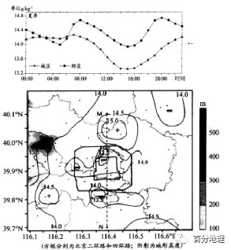   
   
(1)研学小组发现，北京市城区夏季比湿低，竟然成为“干岛”。根据2008～2012年夏季北京市城郊近地面平均比湿水平分布（单位g·kg-1），绘制沿M、N一线比湿变化图。   
   
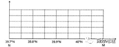   
   
(2)运用水循环原理，分析北京市城区夏季比湿低，成为“干岛”的原因。   
(3)研学小组发现，夏季北京郊区比湿的日变化中出现了两个低值。选择一个低值区，从大气热力作用角度说明其形成原因（如果两个都作答，则只批阅第一个）。   
<span style="color: rgb(255, 0, 0);">【答案】(1)纵坐标单位、数值正确，从M向N发现比湿先升高（40.05N处）再降低（从40N到39.9N处），再升高（到39.85N处），再降低。曲线（如图）</span>   
   
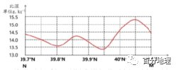   
   
<span style="color: rgb(255, 0, 0);">(2)城区地面多为不透水层，土壤水难以蒸发（地面含水少），水汽少；降水过后，因地面硬化下渗受阻，雨水以地表径流的方式迅速流出，地面快速变干，蒸发少；植被覆盖率低，蒸腾量少。</span>   
<span style="color: rgb(255, 0, 0);">(3)15：00，太阳辐射强，近地面气温高，大气垂直对流将近地面水汽输送至高层，近地面比湿小。5：00，夜间温度不断降低，地面蒸发量减小，日出前温度达到最低，近地面水汽易凝结成露，近地面比湿低。</span>   
<span style="color: rgb(255, 0, 0);">【解析】（1）首先在纵坐标上标出数值和单位，从图中看，MN一线比湿最大值小于15.5，最小值大于13，因此纵坐标数值为13——15.5；第二步描点，描出M点、N点、等值线与MN一线的交点的数值，第三步连线，将描出点用平滑曲线连接，如图所示：   
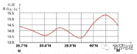   
   
<span style="color: rgb(255, 0, 0);">（2）比湿是记录大气水汽状况的重要指标，指在一团空气中，水汽的质量与该团空气总质量（水汽质量加上干空气质量）的比值；城区和郊区相比，郊区绿地面积大，植物蒸腾作用强；城市绿地面积小，蒸腾量少，空气中的水汽含量少；由于路面硬化，下渗量减少，土壤中的水量减少，地表径流流速快，快速流出城市，蒸发减少，使城市水汽量减少。（3）从图中看，低值主要出现5点和下午15点。以5点为例，5点时为日出前后，是一天中气温最低的时间，近地面温度低，蒸发和蒸腾作用减弱，水汽也容易凝结在地表；以15点为例，15点此时大气温度高，地面温度高，大气对流运动比较强烈，将近地面水汽输送至高层，所以近地面单位体积空气内水汽含量少。</span>   
12．（2022·安徽·合肥一六八中学模拟预测）阅读图文材料，完成下列要求。   
数据中心是区域协作的特定设备网络，用来在互联网上传递、加速、展示、计算、存储数据信息，其占地面积广、耗电量大。我国数据中心运营最大的支出项目就是能源支出，主要为服务器用电和冷却用电。自然制冷按冷凝器冷凝方式分为风冷和水冷。风冷机组通过风冷冷凝器与外界空气换热，利用风（空气）换热带走热量，水冷机组通过水冷冷凝器与冷却塔提供的冷却水换热，利用冷却水带走热量。内蒙古乌兰察布集聚了20多座数据中心，它与贵州数据中心形成了“南贵北乌”分布格局。下左图是乌兰察布相关地理信息示意图，下右图为蒸发冷却降温原理图。   
   
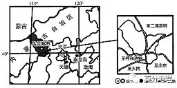   
   
   
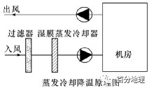   
   
(1)与贵州相比，说明在乌兰察布建设数据中心的有利区位条件。   
(2)简析乌兰察布和贵州大型数据中心主要制冷方式的差异。   
(3)分析数据中心在乌兰察布集聚的意义。   
(4)推测乌兰察布数据中心运营对当地自然环境造成的不利影响。   
<span style="color: rgb(255, 0, 0);">【答案】(1)纬度高,气温低,利于散热;乌兰察布地质结构稳定,地震、洪涝灾害发生机率极少,安全性高;风能、太阳能等能源资源丰富;草原地区地势平坦,铺设电线电缆容易,节省成本;距离北京较近,用户市场广而近;交通便利,交通枢纽地位突出。</span>   
<span style="color: rgb(255, 0, 0);">(2)乌兰察布纬度较高,气温较低的时间长，自然制冷以风冷方式为主;贵州位于南方湿润地区,水资源丰富，自然制冷以水冷方式为主。</span>   
<span style="color: rgb(255, 0, 0);">(3)共享基础设施,降低个体数据中心建设成本;加强数据中心之间的联系，促进相互间的交流与合作，形成规模效应;增加就业岗位，增加居民收入;带动相关产业发展，促进经济发展.</span>   
<span style="color: rgb(255, 0, 0);">(4)数据中心运营过程中排出大量的废热，会使当地气温升高,蒸发量加大,加剧气候干旱;水资源消耗过大,加剧当地水资源紧张;淘汰的设备（电子垃圾）会造成环境污染;影响生物的生存环境,干扰当地生态系统。</span>   
<span style="color: rgb(255, 0, 0);">【解析】(1)读图，结合所学可知，与贵州相比，乌兰察布纬度较高，气温低，热量少，利于数据中心设备散热。乌兰察布位于板块内部，地壳活动少，地质结构稳定，地震发生机率极少；位于大陆性气候区，降水少，洪涝灾害少，安全性高。距离冬季风源地近，地形坦荡，风能丰富；晴天多，光照强，太阳能丰富，能源资源丰富。结合所学可知，乌兰察布地势起伏小，地势平坦，铺设电线电缆难度低，易施工，可以节省成本。读图可知，乌兰察布距离北京较近，北京地区经济发达，对数据处理的需求大，乌兰察布用户市场广而近。读图可知，乌兰察布有多条铁路线经过，铁路交通便利，交通枢纽地位突出，对外联系便利。(2)结合上题分析，乌兰察布纬度较高，气温较低，且低温时间长，多大风，因此自然制冷以风冷方式为主。贵州位于南方湿润地区，为亚热带季风气候，气温高，降水多，水资源丰富，因此，自然制冷以水冷方式为主。(3)根据材料“数据中心是区域协作的特定设备网络，用来在互联网上传递、加速、展示、计算、存储数据信息，其占地面积广、耗电量大”可知，数据中心在乌兰察布集聚，可以共用乌兰察布地价低的土地资源，共享基础设施，降低个体数据中心建设成本，提高利润。数据中心间距离近，便于加强数据中心之间的联系，促进相互间的交流与合作，促进技术革新，形成规模效应。数据中心集聚可以乌兰察布使企业增加，增加就业岗位，提高就业率，增加居民收入，提高生活水平。数据中心集聚可以带动相关产业发展，提高工业化水平，增加财政收入，促进经济发展。(4)根据材料“我国数据中心运营最大的支出项目就是能源支出，主要为服务器用电和冷却用电。自然制冷按冷凝器冷凝方式分为风冷和水冷”可知，数据中心运营过程中会消耗大量能源，排出大量的废热，会使当地气温升高，局地蒸发量加大，结合所学可知，乌兰察布降水少，气候干燥，数据中心运营会加剧气候干旱。乌兰察布数据中心运营，企业数量多，水资源消耗过大，而当地水资源不足，会加剧当地水资源紧张，缺水问题严重。乌兰察布数据中心运营过程中会有淘汰的设备，如电子垃圾等，处置不当会造成环境污染，破坏当地生态环境，导致生物的生存环境恶化，生物多样性减少，干扰当地生态系统。</span>   
13．（2022·贵州·仁怀市第一中学模拟预测）阅读图文材料，完成下列要求。   
黄河是世界上含沙量最大的河流。下游河道宽阔平坦，泥沙沿途沉降淤积。明代潘季驯在主持治理黄河过程中提出的“筑堤束水，以水攻沙”，深刻地影响了后代的”治黄”思想和实践，为中国古代的治河事业做出了重大的贡献。据有关方面监测，黄河在入海三角洲上每年携沙造陆3万亩左右。下图为黄河三角洲遥感影像图。   
   
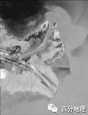   
   
(1)说明黄河三角洲的形成过程。   
(2)简述“筑堤束水，以水攻沙”方式可有效解决黄河下游河段泥沙淤积问题的地理原理。   
(3)分析采用遥感技术监测黄河三角洲变迁的优势。   
<span style="color: rgb(255, 0, 0);">【答案】(1)黄河含沙量大，入海泥沙多；在入海口受海水顶托作用，河水流速减缓，河流携带的泥沙在河口前方堆积，形成三角洲；入海口潮流作用弱，海水搬运能力差，河流泥沙堆积多，三角洲不断向前推移。</span>   
<span style="color: rgb(255, 0, 0);">(2)修筑堤坝控制河流宽度，可以增加河水流速；增强河水的搬运能力，减少泥沙沉积；流速增大，对河床侵蚀作用增强，可以冲刷搬运河床淤积的泥沙，加深河床。</span>   
<span style="color: rgb(255, 0, 0);">(3)节省人力、财力；时效性强，精度高，；可及时监测三角洲动态变化；监测范围广，安全性高。</span>   
<span style="color: rgb(255, 0, 0);">【解析】(1)据所学知识，黄河在中游流经黄土高原时，由于黄土高原水土流失较严重，大量泥沙入河，黄河含沙量大增；随黄河注入海洋时，在入海口处位于平原地形，地形平坦，水流缓慢，加上海潮的顶托作用流速下降，河流搬运能力减弱，所携带的泥沙在河口沉积，形成黄河三角洲；加上海水侵蚀能力小于河流的沉积作用，三角洲不断向前推移。(2)“筑堤束水”主要是提高河流的高度和宽度，增加河流的束水量，增强河流的流速；“以水攻沙”利用河流快速的水流的搬运和冲刷能力，对河床侵蚀作用增强，可以冲刷搬运河床淤积的泥沙，加深河床，达到以水治沙的目的。(3)遥控技术受恶劣天气、地面条件限制影响较小；通过远距离拍摄监控，探测范围大，覆盖面广；监测三角洲变迁信息获取快，实时性强；监测黄河三角洲变迁的准确度高；节省人力、财力等。</span>   
14．（2022·上海普陀·二模）阅读图文资料，回答下列问题。   
西北名城银川市，地处塞北江南。   
材料一   
银川市周边河湖密集，湿地类型多样，湿地面积多年来持续增加，并获得全球首批“国际湿地城市”称号。   
材料二   
2021年《宁夏国家葡萄及葡萄酒产业开放发展综合试验区建设总体方案》出台后，涵盖了银川市的贺兰山东麓502.2平方千米范围被纳入到综试区。区域内酿酒葡萄种植面积达57万亩，在种植过程中形成的“浅沟种植”已成为重要的水土流失修复工程。当地在葡萄酒产业与生态修复相结合的引领下，成长为中国西部地区特色产业深度开放的重要样板。下图为银川市周边地区简图。   
   
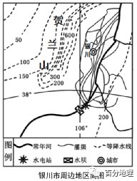   
   
(1)简述图中所示区域降水量的空间分布特点，并分析原因。   
(2)从自然环境角度分析贺兰山东麓易水土流失的主要原因。   
(3)运用地理环境整体性原理，分析银川周边湿地面积增加对当地地理环境的影响。   
(4)评价宁夏今后重点发展葡萄酒产业的合理性。   
<span style="color: rgb(255, 0, 0);">【答案】(1)分布特点：自东南向西北递减；中部地区降水偏多</span>   
<span style="color: rgb(255, 0, 0);">原因：受夏季风影响，东南多西北少；中部地区受贺兰山影响，地形抬升明显，多地形雨。</span>   
<span style="color: rgb(255, 0, 0);">(2)当地受迎风坡降雨影响降水集中，降水强度较大；山麓地带地表坡度较大，水流快，侵蚀作用较强；植被覆盖率较低，降水侵蚀作用较强等。</span>   
<span style="color: rgb(255, 0, 0);">(3)湿地面积增加后，空气湿度增加，气温日较差和年较差减小；生物多样性增加；涵养水源，补充地下水，对周边河流水系的调节作用增加；净化水体，降解环境污染的作用增强等。</span>   
<span style="color: rgb(255, 0, 0);">(4)宁夏酿酒葡萄种植面积大，产量高，发挥了气候等自然条件的优势，为葡萄酒产业的发展提供充沛的原料；葡萄酒产业的发展有利于延长产业链，促进产业升级，提高当地经济发展水平；葡萄“浅沟种植”有利于改善当地水土流失问题，提升生态效益；该产业能够促进当地就业，发挥其社会效益。</span>   
<span style="color: rgb(255, 0, 0);">【解析】（1）图中区域降水量的空间分布特点，应结合等降水量的分布状况，从降水的递变规律及多雨（少雨）区出现的位置来考虑。结合图例、读图可知，图示区域降水自东南向西北递减，其中600毫米等降水线的出现说明中部地区降水偏多。影响降水的因素包括大气环流、海陆位置、地形、洋流等因素。贺兰山为我国季风气候和非季风气候区的分界线，图示区域自东南向西北，受来自海洋的夏季风影响逐渐减弱，水汽逐渐减少，因而降水呈现自东南向西北递减的趋势；位于图示区域中部的贺兰山，东侧为夏季风的迎风坡，夏季风被地形抬升明显，形成地形雨。（2）水土流失的自然因素主要有地形、降雨、地面物质组成和植被四个方面。贺兰山东麓位于夏季风的迎风坡，易形成地形雨，降水强度大且集中；坡度较大，雨水降落至地表后形成地表径流，流速快；当地植被覆盖率较低，水土保持能力弱。因而当地流水侵蚀作用较强，易形成水土流失。（3）</span>   
<span style="color: rgb(255, 0, 0);">湿地是人类重要的生存环境之一，它与人类发展息息相关。湿地不仅为人类的生产、生活提供了多种物质资源，而且具有巨大的环境功能和生态效益。湿地在抵御洪水、调节径流、蓄洪防旱、净化水源、调节气候、控制土壤侵蚀、促淤造陆、美化环境等方面有其它系统不可替代的作用，被誉为“地球之肾”。银川位于内陆，受海洋影响较弱，气候干燥，气温日较差和年较差大；水的比热容大陆陆地砂石，因而湿地面积增加后，空气湿度增加，气温日较差和年较差减小。湿地是水禽赖以生存的繁殖地，越冬地和迁徙的“中转站”，因而湿地面积增加有利于维持生物多样性。受夏季风影响，银川降水季节变化大，湿地面积增大利于涵养水源，补充地下水，同时对周边河流水系的调节作用增加。湿地面积增加，水生生物数量增多，净化水体，降解环境污染的作用增强。（4）发展葡萄酒产业的合理性应从原料供应、增加就业及经济收入、优化产业结构、生态效益等方面考虑。“区域内酿酒葡萄种植面积达57万亩”，说明宁夏酿酒葡萄种植面积大，产量高，为葡萄酒产业的发展提供充沛的原料；“……已成为重要的水土流失修复工程”说明在栽培葡萄过程中的“浅沟种植”有利于减弱当地水土流失，发挥生态效益；葡萄酒的生产有利于对酒葡萄进行深加工，延长产业链，增加附加值，增加经济收入；葡萄酒的生产可以带动相关产业发展，增加当地就业，有助于劳动力从第一产业向二、三产业转移，优化产业结构。</span>   
15．（2022·上海金山·二模）甘肃省拥有冰川、峡谷、黄河、沙漠和绿洲，地理环境具有多样性的特点。阅读图文资料，回答下列问题。   
甘肃轮廓狭长，东西蜿蜒1600多千米，地处黄土高原、青藏高原和内蒙古高原三大高原的交汇地带。   
甘肃传统的支柱产业有煤炭、电力、冶金、石化等。甘肃是我国有色金属之乡，已形成铜、铝、镍、铅、锌等从采选、冶炼到加工一条龙生产体系。近年来着力打造戈壁生态农业产业园、节能环保、清洁能源、通道物流、先进制造、数据信息、中医中药、文化旅游等“十大生态产业”，这些产业已经占到甘肃地区生产总值的20.3%。   
   
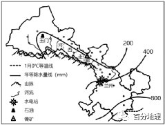   
   
表：甘肃省三大产业的产值（单位：亿元）   
<table cellspacing="0" cellpadding="0" width="577"><tbody><tr><td width="50" valign="middle" style="padding: 3.75pt 6pt;border-width: 1pt;border-color: rgb(0, 0, 0);"></td><td width="87" valign="middle" style="padding: 3.75pt 6pt;border-width: 1pt;border-color: rgb(0, 0, 0);"><section style="margin-top: 0pt;margin-bottom: 0pt;margin-left: 0pt;text-indent: 0pt;font-size: 10.5pt;font-family: &quot;Times New Roman&quot;;text-align: left;line-height: 2em;"><span style="font-family: 宋体;">甘肃省生产总值</span></section></td><td width="56" valign="middle" style="padding: 3.75pt 6pt;border-width: 1pt;border-color: rgb(0, 0, 0);"><section style="margin-top: 0pt;margin-bottom: 0pt;margin-left: 0pt;text-indent: 0pt;font-size: 10.5pt;font-family: &quot;Times New Roman&quot;;text-align: left;line-height: 2em;"><span style="font-family: 宋体;">第一产业</span></section></td><td width="56" valign="middle" style="padding: 3.75pt 6pt;border-width: 1pt;border-color: rgb(0, 0, 0);"><section style="margin-top: 0pt;margin-bottom: 0pt;margin-left: 0pt;text-indent: 0pt;font-size: 10.5pt;font-family: &quot;Times New Roman&quot;;text-align: left;line-height: 2em;"><span style="font-family: 宋体;">第二产业</span></section></td><td width="56" valign="middle" style="padding: 3.75pt 6pt;border-width: 1pt;border-color: rgb(0, 0, 0);"><section style="margin-top: 0pt;margin-bottom: 0pt;margin-left: 0pt;text-indent: 0pt;font-size: 10.5pt;font-family: &quot;Times New Roman&quot;;text-align: left;line-height: 2em;"><span style="font-family: 宋体;">第三产业</span></section></td></tr><tr><td width="50" valign="middle" style="padding: 3.75pt 6pt;border-width: 1pt;border-color: rgb(0, 0, 0);"><section style="margin-top: 0pt;margin-bottom: 0pt;margin-left: 0pt;text-indent: 0pt;font-size: 10.5pt;font-family: &quot;Times New Roman&quot;;text-align: left;line-height: 2em;">2010年</section></td><td width="87" valign="middle" style="padding: 3.75pt 6pt;border-width: 1pt;border-color: rgb(0, 0, 0);"><section style="margin-top: 0pt;margin-bottom: 0pt;margin-left: 0pt;text-indent: 0pt;font-size: 10.5pt;font-family: &quot;Times New Roman&quot;;text-align: left;line-height: 2em;">4135.9</section></td><td width="56" valign="middle" style="padding: 3.75pt 6pt;border-width: 1pt;border-color: rgb(0, 0, 0);"><section style="margin-top: 0pt;margin-bottom: 0pt;margin-left: 0pt;text-indent: 0pt;font-size: 10.5pt;font-family: &quot;Times New Roman&quot;;text-align: left;line-height: 2em;">599.3</section></td><td width="56" valign="middle" style="padding: 3.75pt 6pt;border-width: 1pt;border-color: rgb(0, 0, 0);"><section style="margin-top: 0pt;margin-bottom: 0pt;margin-left: 0pt;text-indent: 0pt;font-size: 10.5pt;font-family: &quot;Times New Roman&quot;;text-align: left;line-height: 2em;">1937.4</section></td><td width="56" valign="middle" style="padding: 3.75pt 6pt;border-width: 1pt;border-color: rgb(0, 0, 0);"><section style="margin-top: 0pt;margin-bottom: 0pt;margin-left: 0pt;text-indent: 0pt;font-size: 10.5pt;font-family: &quot;Times New Roman&quot;;text-align: left;line-height: 2em;">1599.2</section></td></tr><tr><td width="50" valign="middle" style="padding: 3.75pt 6pt;border-width: 1pt;border-color: rgb(0, 0, 0);"><section style="margin-top: 0pt;margin-bottom: 0pt;margin-left: 0pt;text-indent: 0pt;font-size: 10.5pt;font-family: &quot;Times New Roman&quot;;text-align: left;line-height: 2em;">2018年</section></td><td width="87" valign="middle" style="padding: 3.75pt 6pt;border-width: 1pt;border-color: rgb(0, 0, 0);"><section style="margin-top: 0pt;margin-bottom: 0pt;margin-left: 0pt;text-indent: 0pt;font-size: 10.5pt;font-family: &quot;Times New Roman&quot;;text-align: left;line-height: 2em;">8246.1</section></td><td width="56" valign="middle" style="padding: 3.75pt 6pt;border-width: 1pt;border-color: rgb(0, 0, 0);"><section style="margin-top: 0pt;margin-bottom: 0pt;margin-left: 0pt;text-indent: 0pt;font-size: 10.5pt;font-family: &quot;Times New Roman&quot;;text-align: left;line-height: 2em;">921.3</section></td><td width="56" valign="middle" style="padding: 3.75pt 6pt;border-width: 1pt;border-color: rgb(0, 0, 0);"><section style="margin-top: 0pt;margin-bottom: 0pt;margin-left: 0pt;text-indent: 0pt;font-size: 10.5pt;font-family: &quot;Times New Roman&quot;;text-align: left;line-height: 2em;">2794.7</section></td><td width="56" valign="middle" style="padding: 3.75pt 6pt;border-width: 1pt;border-color: rgb(0, 0, 0);"><section style="margin-top: 0pt;margin-bottom: 0pt;margin-left: 0pt;text-indent: 0pt;font-size: 10.5pt;font-family: &quot;Times New Roman&quot;;text-align: left;line-height: 2em;">4530.1</section></td></tr></tbody></table>

   
(1)甘肃省自然地理环境复杂多样，从地形、气候角度概述其具体表现。   
(2)说出甘肃省主导产业的变化。   
(3)运用产业结构优化的原理，评价甘肃发展“十大生态产业”的合理性。   
(4)据调查兰州市有重大地质灾害隐患点多达4000多处，说出兰州主要地质灾害，分析兰州容易发生地质灾害的原因。   
<span style="color: rgb(255, 0, 0);">【答案】(1)祁连山脉位于地势第一、第二阶梯过渡地区，地形复杂多样；地处黄土高原、青藏高原和内蒙古高原三大高原的交汇地带，地形起伏明显。降水由东南向西北递减；跨4种干湿区，地表植被类型多样；位于季风非季风的分界线，气候变化多样；有亚热带季风气候、温带季风气候、温带大陆性气候、高山气候等多种气候类型。</span>   
<span style="color: rgb(255, 0, 0);">(2)主导产业由第二产业变成第三产业。</span>   
<span style="color: rgb(255, 0, 0);">(3)产业结构从二三一排列变成三二一排列，比例更趋合理；充分利用丰富的光照资源等，发展相关的产业，体现了自然环境和社会经济环境相协调；增加清洁能源的占比，减少传统煤炭等能源的使用，有利于环境保护，体现生态效益；带动新能源、清洁能源相关产业的发展，拓展产业链，增加附加值，具有经济效益；充分利用独特的自然或人文旅游资源，因地制宜，合理开发文化旅游产业。</span>   
<span style="color: rgb(255, 0, 0);">(4)地质灾害：滑坡、泥石流、崩塌。原因：地处黄土高原，沟壑纵横，地形崎岖，起伏大；季风气候夏季降水集中且多暴雨，冲刷侵蚀严重；黄土地质疏松，碎屑物多；植被稀少，地质不牢固。</span>   
<span style="color: rgb(255, 0, 0);">【解析】(1)结合所学知识，甘肃省西部位于祁连山附近，位于我国地势的第一、二阶梯过渡地带，青藏高原的边缘，地形复杂多样；材料显示甘肃省位于青藏高原、黄土高原和内蒙古高原的交汇地带，地形起伏较大；图中显示降水量自东南向西北减少，年降水量有大于800mm、400mm-800mm和400mm以下，因此拥有湿润地区、半湿润地区、半干旱和干旱地中干湿区，地表植被类型到样；同时位于季风区和非季风区的分界线，气候复杂多样；根据1月份0℃等温线和降水量，可判断该区域的气候类型较多，有亚热带季风气候、温带季风气候、温带大陆性气候和高山气候等多种气候类型，导致其自然地理环境复杂多样。(2)观察表中数据可知，甘肃省2010年生产总值为4135.9，而第二产业占1937.4，第三产业占1599.2；2018年生产总值为8246.1，第二产业和第三产业生产总值为2794.7、4530.1，第三产业的比重上升，第二产业的比重下降。因此甘肃省的主导产业是第二产业逐渐转变为第三产业。(3)观察表中数据可知，甘肃省的产业结构比重由以前的第二产业、第三产业、第一产业，变化为第三产业最高、第二产业次之、第一产业依然最后的结构，该比例更加区域合理；主要是利用了甘肃省深居内陆，晴天多，关照强烈等资源，发展相关产业，充分利用了自然环境资源，发展社会经济，提高区域的经济收入；其次十大产业中有节能环保、清洁能源，且占比在增加，减少传统煤炭等的使用，减少环境污染，有利于保护生态环境，取得生态环境效益；还可以带动新能源、清洁能源等相关产业的发展，拓宽和拓长产业链，增加产品的附加值，带来更大的经济效益；利用多样和独特的自然地理环境，因地制宜，发展自然和人文相结合的旅游产业，增加区域的经济收入，促进区域的经济发展。(4)根据题意，结合所学知识，兰州市地处黄土高原，地表形态沟壑纵横，且地表崎岖，起伏较大；受到季风气候的影响，夏季降水量大且集中，水流冲刷力较强；且土壤结构性较差，土质疏松，区域内植被覆盖率较低，水土流失严重，碎屑物较多，地质结构不牢固，因此易发生滑坡、泥石流甚至崩塌等地质灾害。</span>   
16．（2022·浙江·模拟预测）阅读图文资料，完成下列要求。   
盐风化是指岩石表面的盐分随着降水渗入岩石孔隙（或裂隙）中，向岩石背风面活动，在干燥的背风面结晶、膨胀，导致岩石背风面崩裂，在岩石表面形成坑坑洼洼的风化穴。据现在的地理学研究成果表明：黄河两岸的岩石是距今约2亿多年三叠纪时形成的砂岩，黄河形成于距今约100万年左右。据考证，位于左图中黄河大峡谷甲地的“黄河水蚀浮雕”，形成历史很短，现在还在不断形成中，且在远离黄河岸的岩石上，也有同样的风化穴。左图为黄河大峡谷地形图，右图为“黄河水蚀浮雕”照片。   
   
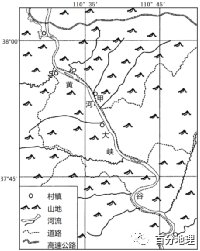   
   
   
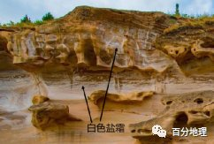   
   
(1)与黄河河套段相比，简述黄河大峡谷段水文特征的变化。   
(2)黄河大峡谷进一步下切，请推测“黄河水蚀浮雕”的变化特点。   
(3)有人认为“黄河水蚀浮雕”名不符实，请根据材料为该观点找出科学的证据。   
(4)根据盐风化的原理，指出该地区发生盐风化作用的气候条件。   
<span style="color: rgb(255, 0, 0);">【答案】(1)变化：径流量增加；含沙量增加；水位的季节变化变大；结冰期时间变短；流速加快。</span>   
<span style="color: rgb(255, 0, 0);">(2)特点：黄河大峡谷进一步下切，“风化穴分布高度增增加，新出露的岩层表面形成新的风化穴，风化穴分布面积增大；经过长期的风化、侵蚀作用，早期形成的风化穴崩塌消失。</span>   
<span style="color: rgb(255, 0, 0);">(3)证据：“黄河水蚀浮雕”位于黄河的东岸，处于东南季风的背风面；风化穴形成时间很短，上部风化穴距黄河水面高，被黄河水侵蚀的可能性小（或远离黄河岸的岩石上，也有同样的风化穴）；岩壁和风化穴中有大量的白色盐霜。</span>   
<span style="color: rgb(255, 0, 0);">(4)条件：处于西北风季风的向风面，利于将干旱地区的含盐表土或盐碱地的盐吹到该处；处于东南季风的背风面，气候干燥，蒸发量大，盐分易结晶；温带季风气候，周期性干湿交替明显（或夏秋多雨，冬春干燥；季节变化显蔫）。</span>   
<span style="color: rgb(255, 0, 0);">【解析】(1)河流水文特征主要从：径流量、含沙量、汛期、结冰期、水能资源、流速及水位等方面进行描述。据图并结合所学可知黄河大峡谷段在黄河河套段下游，径流量增加，流水搬运能力强，含沙量增加，纬度更低，气温更高，结冰期变短，峡谷落差大，流速加快。(2)结合外力侵蚀的相关知识可知：黄河大峡谷进一步下切，河床加深，风化穴分布高度增加；峡谷变深，水位相对降低，新出露的岩层表面形成新的风化穴，风化穴分布面积会增大；经过长期的风化、侵蚀作用，早期形成的风化穴崩塌消失。(3)据材料可知黄河水蚀浮雕”位于大峡谷甲地，即黄河的东岸，处于东南季风的背风面；据材料：黄河形成于距今约100万年左右，若为“水蚀”形成的浮雕，形成时间应该很早，而据材料可知风化穴形成时间很短；且上部风化穴距黄河水面高，被黄河水侵蚀的可能性小（或远离黄河岸的岩石上，也有同样的风化穴）；据图可知：岩壁和风化穴中有大量的白色盐霜，更符合盐风化的产物而非“水蚀”。(4)结合当地经纬度并据图可知该地为温带季风气候，该地处于冬季西北季风的迎风面，利于将干旱地区的含盐表土或盐碱地的盐吹到该处；处于夏季东南季风的背风面，气候干燥，蒸发量大，盐分易结晶；温带季风气候，周期性干湿交替明显（或夏秋多雨，冬春干燥，季节变化显著）。</span>   
17．（2022·全国·高三专题练习）阅读材料，完成下列问题。   
材料一：阿勒泰地区与俄罗斯、哈萨克斯坦、蒙古等国接壤，有“中国最美雪乡”之称，盛产有色金属、黄金和海蓝、碧玺等名贵宝石。在“一带一路”的战略背景下，该地区已被纳入新疆丝绸之路北通道建设和参与中蒙俄经济走廊建设的重要节点，拥有4个国家类陆路口岸。如图1。   
材料二：阿勒泰地区牧民摸索出人与自然的和谐相处之道，不同季节利用不同高度的草场进行“四季转场”迁徙游牧，当地牧民形象的说：“夏天上山，羊赶着雪跑；冬天下山，雪赶着羊跑”，近年来，当地政府鼓励牧民在山麓地带定居放牧，图2为阿勒泰地区牧民转场路线示意图。   
   
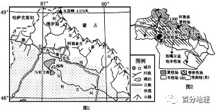   
   
(1)阿尔泰山脉南坡的雪线东段比西段高，请解释其原因。   
(2)说出图中额尔齐斯河的河流水文特征。   
(3)阐述转场放牧中“夏天上山，羊赶着雪跑；冬天下山，雪赶着羊跑”蕴含的地理原理。   
<span style="color: rgb(255, 0, 0);">【答案】(1)东段比西段的纬度低，气温高；向东受西风影响减弱，降水减小。</span>   
<span style="color: rgb(255, 0, 0);">(2)流量小；流量季节变化大（或有春夏两汛期）；有结冰期(或有凌汛现象)。</span>   
<span style="color: rgb(255, 0, 0);">(3)夏天，随海拔升高，冰雪消融时间逐渐推迟，牧草丰盛区逐渐上移,即“羊赶着雪跑”。冬天，高山夏牧场积雪，春秋牧场的降温幅度随着海拔降低而变小，避免低温冻害，逐渐下移到冬牧场，即“雪赶着羊跑”。</span>   
<span style="color: rgb(255, 0, 0);">【解析】(1)由图可知，阿尔泰山东段纬度较西段低，接受太阳辐射较多，气温较高，雪线海拔较高；该山脉受到携带大量水汽的西风带影响，南坡受地形抬升形成降水，因东部受西风影响较小，降水较少，雪线海拔较高，综上所述，阿尔泰山脉南坡雪线高度东段比西段高。(2)由图可知，额尔齐斯河深居亚欧大陆内部，虽受西风带影响，但流量依旧较小；纬度较高，冬季气温低，河流有结冰期；因其补给类型主要是高山冰雪融水、季节性积雪融水和降水，故其流量季节变化大。(3)结合所学知识可知，夏季，随气温持续回升，冰雪向海拔较高的区域退却，在冰雪融水和气温适宜的条件下，原本被冰雪覆盖的地面逐渐生长起茂盛的牧草，牧民驱赶羊群向牧草丰富区域移动，即“羊赶着雪跑”；随秋季气温下降，冰雪面积变大，向下蔓延，受气温和牧草的影响，牧民驱赶羊群向气温较高的山下移动，最终回到冬季牧场，即“雪赶着羊跑”。</span>   
18．（2021·重庆·模拟预测）中国古诗词与地理息息相关。阅读图文资料，完成下列要求。   
材料一：孔雀东南飞，五里一徘徊。“十三能织素，十四学裁衣，十五弹箜篌，十六诵诗书。十七为君妇，心中常苦悲。君既为府吏，守节情不移，贱妾留空房，相见常日稀。鸡鸣入机织，夜夜不得息。三日断五匹，大人故嫌迟。非为织作迟，君家妇难为！妾不堪驱使，徒留无所施，便可白公姥，及时相遣归。”（节选自《孔雀东南飞》）   
(1)请你运用所学知识解释、分析材料中“孔雀东南飞”自然原因。   
材料二：①杨柳青青江水平，闻郎江上踏歌声。东边日出西边雨，道是无晴却有晴。   
②黄梅时节家家雨，青草池塘处处蛙。有约不来过夜半，闲敲棋子落灯花。   
③竹坞无尘水槛清，相思迢递隔重城。秋阴不散霜飞晚，留得枯荷听雨声。   
(2)请你从材料二中任选一首诗句，说明其中的地理原理，并运用所学知识解释该原理。   
<span style="color: rgb(255, 0, 0);">【答案】(1)孔雀喜温暖潮湿的环境，我国为季风性气候。秋冬两季，由于亚洲高压，我国北半球地转偏向力形成西北风，西北风由高纬流向低纬，寒冷干燥。根据动物迁徙方向相反与风的来向，孔雀向更加温暖，气候适宜的东南方向迁徙。</span>   
<span style="color: rgb(255, 0, 0);">(2)【第一首】原理：山地迎风坡降水多，背风坡降水少的道理。解释：山地的迎风坡抬升了爬升的气流，气流在上升的过程中容易变冷凝结而形成地形雨，而在山的背风坡气流下沉，不断增温，不易凝结降水而成为雨影区。这样，在山的两侧就会形成晴雨不同的鲜明对比。这种“东边日出西边雨”的现象在平原地区的对流性降水天气中虽也能看到，但不如山区多见。这里还需指出，山区除具有地形雨外，也有雷阵雨等天气，这就更增加了“东边日出西边雨”的频率。【第二首】原理：该诗描写了我国江淮地区的梅雨天气。解释：在我国的江淮地区，每年六七月份受到江淮准静止锋的影响，出现持续阴天有雨的气候现象，持续时间能达到一个月左右。由于这个时候正是江南梅子的成熟期，所以人们称其为“梅雨”。初夏时节，从热带海洋北上的暖湿空气常常伸展到长江中下游地区，有时到达淮河及其以北地区，与从寒带南下的冷空气相遇。它们势均力敌，处于“拉锯”状态，形成一条稳定的降雨带，导致阴雨绵绵。【第三首】原理：“秋阴不散”的多云天气。解释：因夜间云层愈厚，大气逆辐射愈强，地面就能获得较多的热量补偿。故夜间降温较晴天慢得多，地面温度不易降到0℃以下。而连续的阴天除使霜冻来得晚外，还会导致降水天气。诗人有声有色地描写了“秋阴不散”的两种结果。</span>   
<span style="color: rgb(255, 0, 0);">【解析】(1)由材料可知孔雀向东南方向飞，说明我国东南方向适合孔雀的生存。结合所学可知，孔雀多见于我国南方地区，说明其喜温暖潮湿的环境。我国东南部地区为（热带、亚热带）季风气候，秋、冬两季，受海陆热力性质差异的影响，陆地形成亚洲高压，我国北半球风向受地转偏向力作用形成西北风，西北风由高纬流向低纬，寒冷干燥。根据动物迁徙方向与风的来向相反，结合孔雀的生活习性，孔雀会向更加温暖，气候适宜的东南方向迁徙。(2)若选择【第一首】，其中的地理原理：地形的不同会影响降水量的多少，山地迎风坡降水多，背风坡降水少，山区由于地形复杂，更容易出现不同的天气现象。解释：气流在运动的过程中遭受地形阻挡，山地的迎风坡抬升了爬升的气流，气流在上升的过程中气温逐渐下降，容易变冷凝结而形成地形雨；而在山的背风坡由于气流下沉，不断增温，水汽不易凝结，降水少而成为雨影区，因此在山的两侧就会形成“东边日出西边雨”这种晴雨不同的鲜明对比。这种现象在平原地区的对流性降水天气中也能看到，但其频率明显低于山区。山区由于地形复杂，更容易出现不同的天气现象，山区除具有地形雨外，也有雷阵雨等天气，这就更增加了“东边日出西边雨”的频率。</span>   
<span style="color: rgb(255, 0, 0);">若选择【第二首】，其中的地理原理：“黄梅时节家家雨，青草池塘处处蛙”描写的是我国江淮地区的梅雨天气。解释：在我国的江淮地区，每年六、七月份锋面雨带推移到此，江淮准静止锋在长江中下游地区徘徊。受到江淮准静止锋的影响，锋面带来连续性的降水，出现持续阴天的现象，持续时间能达到一个月左右。由于这个时候正是江南梅子的成熟期，所以人们称其为“梅雨”。江淮准静止锋的具体形成过程：初夏时节，从热带海洋北上的暖湿空气常常伸展到长江中下游地区，有时到达淮河及其以北地区，与从高纬度南下的冷空气相遇，冷暖气团势均力敌，处于“拉锯”状态，冷暖气团的交界面即锋面形成一条稳定的降雨。若选择【第三首】，其中的地理原理：阴雨天气云层较厚导致大气逆辐射加强，大气的保温作用强。解释：秋季夜间气温下降，但是阴雨天气使得夜间云层加厚，大气逆辐射加强，地面就能获得较多的热量补偿，大气的保温作用明显。故夜间阴雨天气降温较晴天慢得多，地面温度不易降到0℃以下，因此出现“霜飞晚”。而连续的阴天除使霜冻来得晚外，还会使得空气中水汽含量大，导致降水天气。</span>   
19．（2022·辽宁·模拟预测）阅读图文资料，完成下列要求。   
黄河石林景区（见下图）位于甘肃省白银市，景区内沿沟谷两侧赫然耸立着黄褐色以河湖相砂砾岩为主的石峰、石柱，形态各异的石林与景区内的黄河、沙漠、戈壁、绿洲、农庄等多种资源巧妙组合在一起，山水相依，动静结合，独特的自然景观和人文环境，使这里成为旅游胜地，也是诸多体育赛事的首选地。   
   
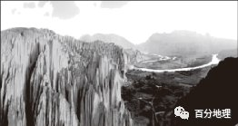   
   
2020年5月22日，当地政府在此召开山地马拉松百公里越野赛。下午1时前后，在高海拔处出现局地冰雹、冻雨、大风强对流的极端天气，导致气温迅速下降。   
(1)运用内外力作用原理，说明黄河石林的形成过程。   
(2)为保障赛事安全，请结合当地自然地理特征为参赛选手选择两种强制装备（比赛中必须全程携带的必要装备），并说明理由。   
<span style="color: rgb(255, 0, 0);">【答案】(1)地壳下沉，河湖沉积，形成砂砾岩层；地壳抬升黄河水侵蚀切割；风力侵蚀。</span>   
<span style="color: rgb(255, 0, 0);">(2)①照明设备（头灯、电筒等）</span>   
<span style="color: rgb(255, 0, 0);">理由：海拔高，气温低，临黄河，水汽充足，多云雾等能见度低的极端天气，手持备用头灯或电筒能改善能见度。</span>   
<span style="color: rgb(255, 0, 0);">②保暖、防风、防雨衣物（防风外套、保暖衣裤、雨衣、太空毯、冲风衣等）</span>   
<span style="color: rgb(255, 0, 0);">理由：该地海拔高，大气密度小，大气逆辐射弱，地面温度较低；极端天气造成降温；强对流天气造成降雨；海拔高、山谷风多发，风力大。</span>   
<span style="color: rgb(255, 0, 0);">【解析】(1)由材料信息结合已学可知，黄河石林的岩石形成于断裂盆地之中，盆地地势低洼，接纳洪水带来的带大量泥沙，泥沙经沉积固结形成砂砾岩层，后经内力作用湖区地壳上升，湖水外泄，河流下切，砂砾岩裸露；同时，在地壳上升过程中，岩层中形成了数组交叉的垂直裂隙，地面流水的侵蚀作用主要沿这些裂隙进行，使岩层逐渐被切割分离，峰丛峰林便开始形成；随着风力、流水等外力的不断作用，沟谷不断扩展，峡谷两侧的岩体在重力作用下，必然要发生坍塌和崩落等现象；外力不断风化侵蚀，由于岩性的坚硬程度不同，坚硬的岩体耸立，就形成了黄河石林。(2)结合当地的自然地理特征可知，该地地处山区，海拔较高，气温垂直变化明显，海拔高处会出现冰雹、冻雨、大风等强对流极端天气，所以为参赛选手选择的两种强制装备是：①头灯、电筒等照明设备；理由：由于当地海拔高，气温低；距离黄河近，水汽蒸发，易形成多云雾等能见度不佳天气，手持备用头灯或电筒能改善能见度；但要防止意外失手遗失，头灯电池的使用时间很难把握，尽量选择可使用普通电池的头灯，方便在赛道上获得帮助。②防风外套、保暖衣裤、雨衣、太空毯、冲风衣等保暖、防风雨衣物；理由：该地海拔高，大气密度小，大气保温作用弱，地面温度较低；极端天气事件易造成降温；强对流天气造成降雨、冰雹；海拔高、局地山谷风多发，风力较强。</span>   
20．（2022·黑龙江·哈尔滨三中模拟预测）阅读材料，结合所学知识，回答下列问题。   
茶洛热坑气热泉群，地处金沙江断裂与甘孜一理塘断裂的交汇处，紧邻318国道（如下图），是四川境内最大的高温热泉群。沿河谷两岸长约1.5公里，宽约300米的范围内，集中了150余个气泉和热喷泉口，绝大部分是大于60℃的高温热泉，以及高于当地沸点85℃的过热水泉和蒸汽泉。长时间的温泉喷发，形成了厚达50米的温泉钙华，当整个山谷中云雾升腾、蒸汽弥漫时，虹彩乍现，宛如仙境。   
   
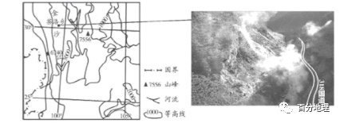   
   
(1)试分析该地区气热泉主要沿河谷分布的原因。   
(2)结合水循环原理，简述气泉的形成过程。   
(3)推测一天中（日出之后、午后、夜晚）欣赏热坑温泉的最佳时间并说明理由。   
(4)请在下列两个问题中，选择其中一个问题作答。如果多做，则按所做的第一个问题计分。   
问题①：说明茶洛气热泉景观开发规模小的原因。   
问题②：为茶洛乡气热泉经济进一步发展提出建议。   
<span style="color: rgb(255, 0, 0);">【答案】(1)横断山区河流多沿断裂分布，断裂带温泉出露较多；河流深切（山高谷深），河谷处地壳最薄，地下水最易外泄，所以很大部分温泉都在河谷地区出露。</span>   
<span style="color: rgb(255, 0, 0);">(2)大气降水和冰雪融水下渗，形成丰富地下水；岩浆活动或地壳内部能量加热地下水，使之高于沸点形成蒸汽，在岩层裂隙处喷涌而出。</span>   
<span style="color: rgb(255, 0, 0);">(3)日出之后。当地昼夜温差大，阳光初照时地面升温，云雾升腾；气温仍较低，利于气热泉的蒸汽上升；钙华反射太阳光，绚丽夺目。</span>   
<span style="color: rgb(255, 0, 0);">(4)问题①：该地构造活跃，地质灾害频发；环境承载力弱，不宜大规模开发；地形崎岖，配套设施建设难度大；知名度低，距主要客源市场较远，游客数量少。</span>   
<span style="color: rgb(255, 0, 0);">问题②：将资源优势转变成经济优势，可发展矿产采集、康养医疗、休闲观光等产业；吸引相关企业投资，延长产业链，发展加工业，实现经营多元化；加大宣传力度，拓展市场；完善交通等基础设施建设；注重环境保护，实现可持续发展。</span>   
<span style="color: rgb(255, 0, 0);">【解析】（1）根据材料和图可知，横断山发育的河流多受构造控制，与断层走向一致，构造条件和地形条件一致形成温泉出露的优越条件；河流是当地切割最深最低的侵蚀面，也是地下热水隔热盖层最薄、地下热水最低、最易外泄的出口，所以很大部分温泉都在河谷地区出露。（2）根据材料及所学知识可知，冰川融水和降雨等地表水，为喷涌的温泉提供了丰沛的水源；根据材料“绝大部分是大于60℃的高温热泉，以及高于当地沸点85℃的过热水泉和蒸汽泉”可知，地下水在来自地球内部或岩浆活动强大热源的加热下，高于沸点可形成蒸汽，沿着断裂处喷出形成气泉。（3）根据材料“长时间的温泉喷发，形成了厚达50米的温泉钙华，当整个山谷中云雾升腾、蒸汽弥漫时，虹彩乍现，宛如仙境”可知，由于热坑温泉群地处高原，昼夜温差较大，阳光初照时，地面增温，云雾升起；但此时近地面温度仍然较低，有利于气热泉的蒸汽上升；通过钙华反射太阳光，使其如梦如幻，宛如仙境。故最佳观赏时间为日出之后。（4）问题①根据所学知识可知，横断山区地质构造复杂、地质灾害多发；环境承载力小，不适宜大规模开发；山高谷深，基础设施建设难度大，修建成本高；距客源地远，知名度低。问题②根据所学知识可知，当地矿产资源和气热泉资源丰富，可以将资源优势转变为经济优势，发展矿产采集和气热泉观光、疗养等相关产业；政府出台优惠政策，吸引相关企业投资，发展加工业，延长产业链，提高附加值，实现多种经营；可以加大宣传力度，提高知名度，开拓市场；当地基础设施落后，可以完善交通等基础设施建设；加大生态环境的保护力度，促进经济可持续发展。</span>
