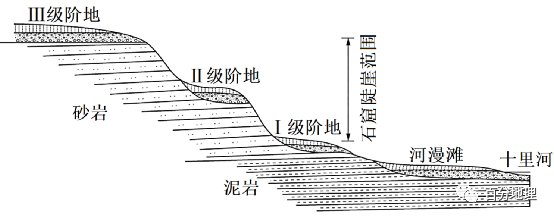

# 微专题之074 从产业结构角度分析区域发展

```
本专题摘自“百分地理”公众号，如有侵权请告之删除，谢谢。联系hhwxyhh@163.com
```

------
   

（2022·浙江·阶段练习）流水塑造的地貌称为流水地貌。左图为某河流局部河段示意图，右图为该河某处的河漫滩剖面示意图，读图完成下面小题。   
   
   
   
   
   
   
1．右图所示的河漫滩最可能出现在左图中的是（  ）   
A．①处   
B．②处   
C．③处   
D．④处   
2．下列自然条件有利于河漫滩形成的是（  ）   
A．甲水位季节变化大   
B．植被覆盖率高   
C．降水量少且均匀   
D．土质结实坚硬   
<span style="color: rgb(255, 0, 0);">1．D从图中看，右图所示的河漫滩位于河道的西岸，①②位于河流的东岸，可排除AB；图中③位于凹岸，侵蚀作用强，不易形成河漫滩，可排除C；④位于凸岸，堆积作用强，易形成河漫滩，D正确。故选D。</span>   
<span style="color: rgb(255, 0, 0);">2．A河流在凹岸侵蚀，在凸岸堆积形成堆积体，丰水期堆积体在水下接受堆积，堆积体在枯水季节露出水面，形成河漫滩，因此水位季节变化大有利于河漫滩形成，A正确；植被覆盖率高，保持水土能力强，河流含沙量小，不利于形成河漫滩，B错；降水量少且均匀，流水侵蚀作用弱，河流含沙量小，不利于形成河漫滩，C错；土质结实坚硬，不易被侵蚀，河流含沙量小，不利于形成河漫滩，D错。故选A。</span>   
（2022·安徽·定远县阶段练习）如图为我国某区域简图，研究发现乙、丙河段河漫滩上的土壤颗粒比甲、乙河段更粗。完成下面小题。   
   
   
   
3．乙，丙河段河漫滩土壤颗粒偏粗的主要原因是该河段（  ）   
A．泥沙物源颗粒粗   
B．河流的流速缓慢   
C．流水侵蚀作用强   
D．风沙沉积作用弱   
4．与西侧相比，贺兰山东侧交通线路更发达的根本原因是（  ）   
A．气候更湿热   
B．地形更平坦   
C．聚落更密集   
D．土地更广阔   
<span style="color: rgb(255, 0, 0);">3．A与甲乙河段相比，乙丙河段西岸有山地，因山地与乙丙段河流距离近，发源于山地的河流带来的泥沙颗粒较粗，导致乙丙段沉积物颗粒大于甲乙段，故乙、丙河段河漫滩土壤颗粒偏粗的主要原因是乙、丙河段泥沙物源颗粒粗，A正确；两河段均位于平原地区，流速、侵蚀作用相近，BC错误；河漫滩是流水沉积形成，并非风沙沉积形成，D错误。所以选A。</span>   
<span style="color: rgb(255, 0, 0);">4．C从图中看，贺兰山东侧位于夏季风迎风坡、冬季风背风坡，气候更湿热；贺兰山东侧位于黄河冲积平原（宁夏平原），地形更平坦、土地更广阔。导致东侧聚落比西侧更密集，为了便于人员的往来和货物的进出，贺兰山东侧交通线路应比西侧更发达，C正确，气候湿热、地形平坦、土地广阔都不是导致交通线密集的根本原因，ABD错误。所以选C。</span>   
（2022·湖南·名校联盟）关洲河段位于宜昌至武汉的长江河段，关洲岛把关洲河段分为南、北河道。某地理科研团队研究发现，关洲岛形成过程：早期，河漫滩地处河湾凹岸，与陆地相连，随着流速变快，流水侵蚀南岸河漫滩，夺车阳河下游河道东流，原河漫滩残余部分形成水下浅滩，随着南岸继续南迁，流速减慢，水下浅滩因泥沙沉积出露水面形成江心洲，河道演变为双汊型，此后河段南、北河道年内流量分流比发生变化，南北流量占比一年中发生变化。洪水期南北四六分，枯水期南北六四分。下图示意关洲河段河道变迁和地貌演化。读图，完成下面小题。   
   
   
   
5．下列关于关洲岛形成过程中三个阶段对应的环境的说法，正确的是（  ）   
A．河漫滩环境——动荡的河道河床沉积环境——江心洲的漫滩沉积环境   
B．动荡的河道河床沉积环境——河漫滩环境——江心洲的漫滩沉积环境   
C．河漫滩环境——江心洲的漫滩沉积环境——动荡的河道河床沉积环境   
D．江心洲的漫滩沉积环境——河漫滩环境——动荡的河道河床沉积环境   
6．下列有关③江心洲阶段南北河道特征的说法，正确的是（  ）   
A．南河道窄而深，河岸陡   
B．北河道宽而浅，河岸陡   
C．南河道沉积作用强   
D．北河道侵蚀作用强   
7．近年来关洲岛发生的变化可能是（  ）   
A．长江三峡蓄水后关洲岛面积有扩大的趋势   
B．南水北调中线实施调水后关洲岛面积缩小   
C．关洲岛滨江堤岸进行生态化、景观化改造   
D．大量农业开垦导致关洲岛内部湿地迅速增加   
<span style="color: rgb(255, 0, 0);">5．A图①河漫滩阶段为“早期，河漫滩地处河湾凹岸，与陆地相连，随着流速变快，流水侵蚀南岸河漫滩”，发生地在河漫滩，对应的环境应是河漫滩环境；图②水下浅滩阶段为“夺车阳河下游河道东流，原河漫滩残余部分形成水下浅滩”，当长江干流和支流车阳河流速加大时，河流侧蚀作用加强，水下浅滩逐渐形成，对河流泥沙搬运有阻挡作用并产生大量堆积，对应的环境应是动荡的河道河床沉积环境；图③江心洲阶段为“随着南岸继续南迁，流速减慢，水下浅滩因泥沙沉积出露水面形成江心洲，河道演变为双汊型”，江心洲阶段堆积体出露，上游来水受关洲岛阻挡开始分汊，在凹岸侵蚀和凸岸堆积的共同作用下，单型河道演变为双分汊型河道，对应的环境应是江心洲的漫滩沉积环境，因此①②③阶段对应关系正确的为A，BCD错误。故选A。</span>   
<span style="color: rgb(255, 0, 0);">6．A洪水期南北四六分，说明洪水期时北河道流量大，河道宽，流速快；枯水期南北六四分，说明枯水期时南河道流量大，河道宽，流速快；所以南河道窄而深，河岸陡，A正确； 北河道宽而浅，洪水期枯水期河宽变化大，应是河岸缓，B错误；南河道为河流凹岸，凹岸侵蚀作用强，C错误；北河道为河流凸岸，凸岸沉积作用强，D错误。故选A。</span>   
<span style="color: rgb(255, 0, 0);">7．C长江三峡大坝位于湖北省宜昌市内，位于关洲岛上游，因此长江三峡蓄水后泥沙淤积到库区，下泄的泥沙减少，关洲岛面积应有减小的趋势，A错误；南水北调中线工程是从长江最大支流汉江中上游的丹江口水库调水，汉江与长江的交汇处为武汉，位于关洲岛下游，对关洲岛的影响较小，所以南水北调中线实施调水后关洲岛面积变化不大，B错误；滨江堤岸本来是为了防洪、灌溉而高筑的沿河大堤，破坏了原有的生态功能，并成为市民滨江活动的阻力，应该通过合理的绿化和景观构建，增加台阶、斜坡与外部连接，提高其可达性，所以关洲岛滨江堤岸需进行生态化、景观化改造，C正确；农垦活动围垦了大量湿地，江心洲的湿地大量锐减，D错误。故选C。</span>   
（2022·广东·佛山二模）密西西比河下游的河漫滩平原上发育大量沟脊相间的侧积体地貌。侧积体的生长反映了曲流河道在洪水期的横向迁移轨迹。在弯曲河道的横向迁移过程中，两侧河岸的物质因横向水流（垂直于河流流向）的作用而重新分配。下图为密西西比河某河段的遥感影像以及该河段A处的横剖面情况。据此完成下面小题。   
   
   
   
8．根据侧积体形成的先后顺序，由早到晚依次对应（  ）   
A．侧积体a、侧积体b、侧积体CB．侧积体b、侧积体a、侧积体CC．侧积体c、侧积体b、侧积体AD．侧积体c、侧积体a、侧积体B9．形成侧积体的最主要原因是（  ）   
A．凹岸侵蚀作用   
B．季节性洪水周期作用   
C．凸岸堆积作用   
D．地转偏向力作用   
10．在河道展宽足够的情况下，多个侧积体在该河岸大规模出现的条件是（  ）   
①持续高水位②周期性洪水③地壳间歇性抬升④地壳相对稳定   
A．①③   
B．①④   
C．②③   
D．②④   
<span style="color: rgb(255, 0, 0);">8．A图中A河道的左岸（据河流流向判断左右岸）是凸岸，以流水堆积为主，凸岸逐渐向西延伸，右岸是凹岸，以流水侵蚀为主，河岸向西侧延伸，因此侧积体形成的先后顺序，由早到晚依次对应侧积体a、侧积体b、侧积体c，A正确。BCD错误。</span>   
<span style="color: rgb(255, 0, 0);">9．B根据所学知识可知河漫滩形成河流曲流凸岸处，其形成与洪水活动有关。读图可知左侧坝脊为凸岸以堆积作用为主，相反的右侧为凹岸以侵蚀作用为主。洪水期河水上涨 ，流量增加，水动力增强，河水开始对凹岸进行强烈的侵蚀和下切，使河水中含沙呈增大，同时，河水主流线向凸岸移动，对凸岸早期沉积物有冲刷，洪峰衰减，主流线又向凹岸移动，随着主流线下移，河水含沙能力降低 ，这时河流凹岸所产的泥沙通过河道不断向凸岸方向移动、沉积，生产一个新的侧积体。每一次洪水事件 ，河曲外侧的凹岸就被强烈地侵蚀 ，相应地河曲内侧凸岸就侧积一层新的沉积物，曲流河就发生一次迁移，侧积作用就进行一次，B对。侧积体的形成是在凹岸侵蚀与凸岸堆积共同作用下形成的，A、C错。曲流处的侵蚀与地转偏向力作用无关，D错。故选B。</span>   
<span style="color: rgb(255, 0, 0);">10．D在河道展宽足够的情况下，多个侧积体之间有洼地，说明出现的条件是周期性洪水，不是持续高水位，以①错误，②正确。地壳相对稳定利于沉积、利于侧蚀，④正确，③错误。D正确。故选D。</span>   
（2022·河南·驻马店期末考试）西藏米林县年降水量约640mm，且降水集中在6-9月，冬春季多大风。在该县丹娘乡的雅鲁藏布江北岸山麓，有一个高约百米的沙丘，叫丹娘沙丘。图一为丹娘沙丘附近等高线示意图，图二为丹娘沙丘景观图，读图，据此完成下面小题。   
   
   
   
11．丹娘沙丘的成因主要是（  ）   
A．流水堆积   
B．风力堆积   
C．冰川堆积   
D．波浪堆积   
12．丹娘沙丘增长速度最小的季节是（  ）   
A．春季   
B．夏季   
C．秋季   
D．冬季   
<span style="color: rgb(255, 0, 0);">11．B根据材料，丹娘沙丘位于山麓，高约百米，故它不可能是由流水堆积形成的，A错误。该地区冬春季多大风，河滩和江心洲有丰富的沙源，故丹娘沙丘是由风力堆积作用形成的，B正确。冰川堆积物的颗粒大小不一，而沙丘的颗粒较均匀，C错误；该地位于内陆，不可能是波浪堆积，D错误。所以选B。</span>   
<span style="color: rgb(255, 0, 0);">12．B丹娘沙丘主要是由风力堆积作用形成的，且其沙源主要来自附近的沙洲和河漫滩。根据材料，西藏米林县年降水量约640mm，且降水集中在6-9月，冬春季多大风。夏季，该地大风日数少，且该季节降水多，河流水位最高，沙洲和河漫滩淹没最多，丹娘沙丘的沙源最少，故其增长速度最小，B正确，ACD错误，所以选B。</span>   
（2022·湖南·雅礼中学阶段练习）长江流域某河段受上游水库运行、“清水”下泄影响，2015年枯水期最低水位呈下降趋势。下图示意该河段及河段内2个水文站的横断面（河床剖面）。据此完成下面小题。   
   
   
   
13．造成该河段枯水期最低水位下降的主要原因是（  ）   
A．上游水库蓄水   
B．河段蒸发加剧   
C．河流下切侵蚀   
D．流域降水减少   
14．上游水库建成后，该河段枯水期沉积物颗粒数量变化及成因分析，正确的是（  ）   
A．增多、水流速度加快，侵蚀作用增强   
B．减少、河床变深，与下游高差减小   
C．减少、水量增加，侵蚀作用增强   
D．增多、水量减少，沉积作用增强   
15．该河段枯水期常出现新增浅滩碍航现象，为维持枯水期河流航道的正常运行，可采取的措施是（  ）   
A．加固河漫滩边坡，稳定航道宽度   
B．流域内植树造林，减少泥沙淤积   
C．跨流域调水入江，增加河流流量   
D．丰水期放水冲淤，扩展航道宽度   
<span style="color: rgb(255, 0, 0);">13．C读材料结合图形可知，长江流域某河段受上游水库运行、“清水”下泄影响，图中看出2015年河床加深，由于河流下切侵蚀，河床降低，从而造成该河段枯水期最低水位下降，C正确；枯水期时水库应主要处于放水状态，A错误；蒸发和降水多少取决于气候条件，2015年气候未发生显著变化，故不是导致水位低的主要原因，BD错误。故选C。</span>   
<span style="color: rgb(255, 0, 0);">14．C水库修建后增加了库区以下河段落差，水流速度加快，加上枯水期水量较建坝以前增加，侵蚀作用增强，沉积作用减弱，河段内沉积物颗粒数量减少，C正确，AD错误；受上游水库运行、“清水”下泄影响，河流下切侵蚀，河床加深，这样使本河段与下游高差减小，会导致往下游的水流速度减缓，从而促进泥沙淤积，沉积数量应该增多，B错误。故选C。</span>   
<span style="color: rgb(255, 0, 0);">15．A航运中一般将水深不足，碍航的地方称为浅滩，或称浅滩碍航，整治浅滩时，必须掌握浅滩演变的规律，了解浅滩的成因，然后进行整治工程的规划设计和工程的实施。浅滩形态总是变化的，浅滩总是在不停地发生着冲淤变化。航道工作者为了克服枯水期浅滩的水深不足，通常多着眼于枯水期浅滩的整治，加固河漫滩边坡，稳定航道宽度。从材料中“上游水库运行、清水下泄”及图可看出丰水期放水后，断面均有部分区域即河床浅滩变化不大，说明水量、冲淤、上游来沙对扩展航道宽度效果不明显，A正确，B、C、D不符合材料。故选A。</span>   
（2022·黑龙江·齐齐哈尔市开学考试）山西省大同市云冈石窟区的石窟岩体结构稳定。下图为云冈石富区十里河三级阶地分布示意图。据此完成下面小题。   
   
   
   
16．与砂岩相比，图中泥岩（  ）   
A．由地幔顶部岩浆喷发而成   
B．在地壳内经过变质作用   
C．具有层理构造且含有化石   
D．沉积成岩时间相对较早   
17．云冈石窟陡崖的形成，主要是由于（  ）   
①经过三次下降   
②经过三次抬升   
③河流堆积作用强   
④河流下切作用强   
A．①③   
B．②④   
C．①④   
D．②③   
18．图示河流Ⅲ级阶地到河漫滩发育时期，可以反映出十里河河谷（  ）   
A．宽度逐渐变窄   
B．形态大致呈“V”形   
C．深度逐渐变浅   
D．展宽，河床变浅   
<span style="color: rgb(255, 0, 0);">16．D根据所学知识泥岩和砂岩都属于沉积岩，与图中砂岩相比，砂岩具有明显的层理构造，而泥岩没有。泥岩是指弱固结的黏土经过中等程度的后生作用（如挤压作用、脱水作用、重结晶作用和胶结作用）形成强固结的岩石，是已固结成岩的，但层理不明显，或呈块状。因此C错；沉积岩的岩石年龄顺序是下老上新，泥岩在下部，因此D对；岩浆喷发而成的岩石属于岩浆岩，A错；在地壳内经过变质作用而成的是变质岩，因B此错；故选D。</span>   
<span style="color: rgb(255, 0, 0);">17．B形成阶地必备的两个条件：（1）先发育一个相当宽广的河漫滩；（2）河流向下侵蚀，使得原来的河漫滩高于一般洪水位。但是构造运动往往造成河道比降的变化，影响河流系统中侵蚀、搬运和堆积过程。当地壳相对稳定时，河流以侧向侵蚀作用为主，此时塑造出河漫滩；然后地壳上升，河床比降增加，水流转而下切，于是原来的河漫滩成了河谷两侧的阶地。如果地壳多次间歇性上升，则可以形成多次阶地。图中显示有3个阶地，由此可知①③说法错误，②④说法对，故选B。</span>   
<span style="color: rgb(255, 0, 0);">18．D根据上题分析，图示河流Ⅲ级阶地到河漫滩发育时期，可以反映出十里河河谷宽度逐渐变宽，A错；河谷深度逐渐变深，C错；在形成河漫滩时，河流流经地区一般说来构造相对稳定， 河流以侧蚀作用、 沉积作用为主，因此河谷展宽，河床变浅，D对，并且河谷所处地壳多次间歇性上升，形成了多个阶地，所以河谷形态大致呈“V”形的说法错误；故选D。</span>   
（2022·辽宁·县级重点高中期末考试）河流阶地与河漫滩是河流的两种重要地貌。受地壳运动和气候变化影响，导致河流下切，原来的河谷底部超出一般洪水位之上，呈阶梯状分布在河谷谷坡上，形成河流阶地（如图所示）。下表是我国祁连山地北麓河西地区某河流阶地形成时经历了干冷的冰期和间冰期气候环境统计情况，据此完成下面小题。   
   
   
   
<table cellspacing="0" cellpadding="0" width="577"><tbody><tr style="height: 8pt;"><td width="128" valign="middle" style="padding: 3.75pt 6pt;border-width: 1pt;border-color: rgb(0, 0, 0);"><section style="margin-top: 0pt;margin-bottom: 0pt;margin-left: 0pt;text-indent: 0pt;font-size: 10.5pt;font-family: &quot;Times New Roman&quot;;text-align: left;line-height: 2em;"><span style="font-family: 宋体;">阶地序号</span></section></td><td width="58" valign="middle" style="padding: 3.75pt 6pt;border-width: 1pt;border-color: rgb(0, 0, 0);"><section style="margin-top: 0pt;margin-bottom: 0pt;margin-left: 0pt;text-indent: 0pt;font-size: 10.5pt;font-family: &quot;Times New Roman&quot;;text-align: left;line-height: 2em;">T1</section></td><td width="44" valign="middle" style="padding: 3.75pt 6pt;border-width: 1pt;border-color: rgb(0, 0, 0);"><section style="margin-top: 0pt;margin-bottom: 0pt;margin-left: 0pt;text-indent: 0pt;font-size: 10.5pt;font-family: &quot;Times New Roman&quot;;text-align: left;line-height: 2em;">T2</section></td><td width="58" valign="middle" style="padding: 3.75pt 6pt;border-width: 1pt;border-color: rgb(0, 0, 0);"><section style="margin-top: 0pt;margin-bottom: 0pt;margin-left: 0pt;text-indent: 0pt;font-size: 10.5pt;font-family: &quot;Times New Roman&quot;;text-align: left;line-height: 2em;">T3</section></td><td width="44" valign="middle" style="padding: 3.75pt 6pt;border-width: 1pt;border-color: rgb(0, 0, 0);"><section style="margin-top: 0pt;margin-bottom: 0pt;margin-left: 0pt;text-indent: 0pt;font-size: 10.5pt;font-family: &quot;Times New Roman&quot;;text-align: left;line-height: 2em;">T4</section></td></tr><tr style="height: 6.55pt;"><td width="128" valign="middle" style="padding: 3.75pt 6pt;border-width: 1pt;border-color: rgb(0, 0, 0);"><section style="margin-top: 0pt;margin-bottom: 0pt;margin-left: 0pt;text-indent: 0pt;font-size: 10.5pt;font-family: &quot;Times New Roman&quot;;text-align: left;line-height: 2em;"><span style="font-family: 宋体;">距今年代（万年）</span></section></td><td width="58" valign="middle" style="padding: 3.75pt 6pt;border-width: 1pt;border-color: rgb(0, 0, 0);"><section style="margin-top: 0pt;margin-bottom: 0pt;margin-left: 0pt;text-indent: 0pt;font-size: 10.5pt;font-family: &quot;Times New Roman&quot;;text-align: left;line-height: 2em;">3</section></td><td width="44" valign="middle" style="padding: 3.75pt 6pt;border-width: 1pt;border-color: rgb(0, 0, 0);"><section style="margin-top: 0pt;margin-bottom: 0pt;margin-left: 0pt;text-indent: 0pt;font-size: 10.5pt;font-family: &quot;Times New Roman&quot;;text-align: left;line-height: 2em;">7</section></td><td width="58" valign="middle" style="padding: 3.75pt 6pt;border-width: 1pt;border-color: rgb(0, 0, 0);"><section style="margin-top: 0pt;margin-bottom: 0pt;margin-left: 0pt;text-indent: 0pt;font-size: 10.5pt;font-family: &quot;Times New Roman&quot;;text-align: left;line-height: 2em;">10</section></td><td width="44" valign="middle" style="padding: 3.75pt 6pt;border-width: 1pt;border-color: rgb(0, 0, 0);"><section style="margin-top: 0pt;margin-bottom: 0pt;margin-left: 0pt;text-indent: 0pt;font-size: 10.5pt;font-family: &quot;Times New Roman&quot;;text-align: left;line-height: 2em;">15</section></td></tr><tr style="height: 5.2pt;"><td width="128" valign="middle" style="padding: 3.75pt 6pt;border-width: 1pt;border-color: rgb(0, 0, 0);"><section style="margin-top: 0pt;margin-bottom: 0pt;margin-left: 0pt;text-indent: 0pt;font-size: 10.5pt;font-family: &quot;Times New Roman&quot;;text-align: left;line-height: 2em;"><span style="font-family: 宋体;">气候环境</span></section></td><td width="58" valign="middle" style="padding: 3.75pt 6pt;border-width: 1pt;border-color: rgb(0, 0, 0);"><section style="margin-top: 0pt;margin-bottom: 0pt;margin-left: 0pt;text-indent: 0pt;font-size: 10.5pt;font-family: &quot;Times New Roman&quot;;text-align: left;line-height: 2em;"><span style="font-family: 宋体;">间冰期</span></section></td><td width="44" valign="middle" style="padding: 3.75pt 6pt;border-width: 1pt;border-color: rgb(0, 0, 0);"><section style="margin-top: 0pt;margin-bottom: 0pt;margin-left: 0pt;text-indent: 0pt;font-size: 10.5pt;font-family: &quot;Times New Roman&quot;;text-align: left;line-height: 2em;"><span style="font-family: 宋体;">冰期</span></section></td><td width="58" valign="middle" style="padding: 3.75pt 6pt;border-width: 1pt;border-color: rgb(0, 0, 0);"><section style="margin-top: 0pt;margin-bottom: 0pt;margin-left: 0pt;text-indent: 0pt;font-size: 10.5pt;font-family: &quot;Times New Roman&quot;;text-align: left;line-height: 2em;"><span style="font-family: 宋体;">间冰期</span></section></td><td width="44" valign="middle" style="padding: 3.75pt 6pt;border-width: 1pt;border-color: rgb(0, 0, 0);"><section style="margin-top: 0pt;margin-bottom: 0pt;margin-left: 0pt;text-indent: 0pt;font-size: 10.5pt;font-family: &quot;Times New Roman&quot;;text-align: left;line-height: 2em;"><span style="font-family: 宋体;">冰期</span></section></td></tr></tbody></table>

19．河漫滩形成于（  ）   
A．汛期堆积   
B．汛期侵蚀   
C．枯水期堆积   
D．枯水期侵蚀   
20．表格资料显示该流域（  ）   
A．T1时期内植被稀少，河流堆积   
B．T2时期内植被丰富，河流堆积   
C．T3时期内植被丰富，河流侵蚀   
D．T4时期内植被稀少，河流侵蚀   
21．表格资料显示该地区至少经历了（  ）   
A．地壳下沉2次   
B．地壳抬升2次   
C．地壳下沉4次   
D．地壳抬升4次   
<span style="color: rgb(255, 0, 0);">19．A由于河流横向环流作用，河谷展宽，冲积物组成浅滩，浅滩加宽，枯水期大片露出水面成为雏形河漫滩。之后河流在汛期时，洪水携带的物质不断沉积，形成河漫滩，A正确，BCD错。故本题选A。</span>   
<span style="color: rgb(255, 0, 0);">20．C冰期环境气候干冷，降水量减少，地表植被覆盖度低，河流流量小、泥沙含量大，河流堆积作用增强，不利于河流阶地的形成；相反间冰期环境气候湿热，降水量增加，地表植被覆盖度高，河流流量大、泥沙含量小，河流侵蚀作用增强，有利于河流阶地的形成。T2和T4是冰期，气候干冷，植被稀少，降水少，河流堆积作用强，B、D错误；T1和T3是间冰期，气候湿热，降水增多，植被增加，河流侵蚀作用增强，A错误，C正确。故本题选C。</span>   
<span style="color: rgb(255, 0, 0);">21．B构造运动（主要是构造抬升）造成河床坡度加大和溯源侵蚀增强，进而形成河流阶地，据此可排除AC两项；而在构造运动相对稳定的情况下，冰期环境不利于河流阶地的形成，间冰期环境有利于河流阶地的形成。表格信息显示当地有4级阶地，而气候资料显示，该地有两次处在冰期环境。从气候角度分析冰期不利于河流阶地形成，此时若有河流阶地形成，很可能是地壳抬升作用的结果，故B正确，D错。因此选B。</span>   
二、综合题   
22．（2022·黑龙江·哈尔滨三中阶段练习）阅读图文材料，完成下列要求。   
和田是著名的“玉石之都”，温润细腻的新彊和田玉深受人们喜爱，按其品质可分为山料、籽料等品种，以籽料为最佳。在距今十几亿年的地质时期，新疆南部还是一片海洋，白云岩广泛沉积，经过一系列地质作用后，最终形成玉石。喜马拉雅运动开始后，山脉隆起，埋藏在山体中的玉石在一系列外力作用下裸露在地表，这就是和田玉山料。外力作用继续，和田玉山料最终以小块、浑圆的外形沉积在下游河床或河漫滩上，这就是和田玉籽料。下图为和田玉籽料形成示意图。近年来，当地政府出台多项政策，禁止利用大型机械在河滩上采掘和田玉。   
   
   
   
(1)描述和田玉山料变为籽料的地质作用过程。   
(2)推测采集籽料的最佳季节并分析原因。   
(3)说明禁止利用大型机械在河滩上采掘和田玉的理由。   
<span style="color: rgb(255, 0, 0);">【答案】(1)出露的玉石山料，受风化作用，变得破碎；在流水、重力等外力搬运作用下进入河流上游；在流水搬运过程中，玉石山料被侵蚀、打磨成玉石籽料；随着下游河流流速减缓，玉石籽料沉积在下游河床或河漫滩上。</span>   
<span style="color: rgb(255, 0, 0);">(2)秋季。该区域河流主要补给水源为高山冰雪融水，夏季气温高，冰雪融化速度快，河流流量大，流速快，搬运能力强；下游地势较平坦，流速减慢，在河滩沉积；秋季流量减小，水位下降，河滩出露，适宜采集籽料。</span>   
<span style="color: rgb(255, 0, 0);">(3)破坏河滩植被，造成水土流失，引发土地荒漠化；容易产生扬尘，破坏大气环境；改变河道形态，破坏堤坝等防洪设施；掠夺式开采，加剧和田玉资源枯竭。</span>   
<span style="color: rgb(255, 0, 0);">【解析】（1）读表格可知，“山玉”转化为“子儿玉”，从山区原生矿到下游的河滩，块度从很大到较小，从棱角明显到常为卵形，表面光滑，主要受外力作用；山玉分布在山地高处，岩石出露地表，受风化作用，岩石破碎；在重力及外力搬运作用下，从高处进入河道；在流水搬运过程中，岩石在外力作用下进一步破碎，棱角磨掉，流水冲刷使其磨圆，表面变光滑，下游河流流速变慢，岩块在河滩沉积，形成籽料。（2）新疆和田玉石位于我国西北内陆地区，河流受大气降水补给较少，其主要补给方式依靠高山冰川融水补给。夏季气温高，冰川融水多，河流流量大，其河流的搬运能力强，将玉石从上游搬运至下游，沉积在河滩中。秋季随气温降低，冰川融水减少，河流水位下降，河滩大量出露，此时玉石数量相对较多，最适宜此时进行捡拾。（3）利用大型机械在河滩上采掘和田玉会破坏河滩，破坏河滩生长的植被，易造成水土流失，生物量较少，引发土地荒漠化；大型机械采掘中容易产生扬尘，引发的大气污染，破坏大气环境；大型机械对河滩破坏更大，可能改变河道形态，过度施工会破坏堤坝等防洪设施；大型机械在河滩上采掘和田玉，开采强度大，可能造成掠夺式开采，加剧和田玉资源枯竭。</span>   
23．（2022·河南·高三阶段练习）阅读图文材料，完成下列要求。   
在我国南方平原地区，天然河流河道弯曲，浅滩和深潭经常交替出现于河道中，其与河漫滩、阶地等河流地貌一样，都是河流常见的河床地貌。由于河道的滩险潭急，经常威胁通航船舶的安全。下图为我国南方平原地区某河流深潭浅滩地貌序列分布图（图中箭头表示河水流向）。   
   
   
   
(1)根据深潭与浅滩的位置关系，推测河流深潭和浅滩的地形差异。   
(2)说明我国南方平原地区河流深潭的成因。   
(3)在河流地貌中通常浅滩部位通航条件较差，请对此做合理的解释。   
<span style="color: rgb(255, 0, 0);">【答案】(1)深潭位于河流的凹岸附近，河谷较深，坡度大，地势较低；浅滩位于河流凹凸岸之间的过渡区，河谷较浅，坡度小，地势较高。</span>   
<span style="color: rgb(255, 0, 0);">(2)平原地区地势平坦，河道弯曲，水流较慢，曲流处形成一个向凹岸外侧及下侧有强侵蚀力的螺旋状环流；南方地区河流径流量大，环流底流侵蚀凹岸，使得凹岸坡后退，在凹岸底部形成深潭。</span>   
<span style="color: rgb(255, 0, 0);">(3)河道浅滩部位河底地形变化较大，多暗沙，经常堵塞船舶航道；河道浅滩部位河流水位较浅，通航船舶容易搁浅。</span>   
<span style="color: rgb(255, 0, 0);">【解析】（1）河流深潭和浅滩的地形差异主要从深浅、坡度、地势等角度来分析。据图可知，深潭位于河流的凹岸附近，根据剖面图可知，深潭的河谷较深，河床坡度大，地势较低；浅滩位于河流凹岸和凸岸之间的过渡区域，与深潭相比，浅滩的河谷较浅，坡度较小，地势较高。（2）南方平原地区地形平坦，河道弯曲，水流速度慢，河流弯曲处形成一个螺旋状环流，该环流向凹岸外侧及下侧进行较强的侵蚀，使得凹岸附近河床较深；再加上南方地区降水量大，河流径流量大，环流底流强烈侵蚀凹岸，使得凹岸的河床不断后退，在凹岸底部形成较深的河谷，即形成深潭。（3）根据剖面图可知，河道浅滩部位河底的地形比较复杂，多暗沙，经常堵塞船舶航道，影响船舶航行；河道浅滩部位河流水位较浅，通航船舶容易搁浅，因此浅滩部位的通航条件较差。</span>   
24．（2022·陕西·武功县阶段练习）阅读图文材料，完成下列要求。   
河漫滩是指河床主槽一侧或两侧，在洪水期被淹没，枯水期出露的滩地。长江中下游干支流河道附近发育大面积河漫滩，是千百年来人们围垦的重要目标，圩垸就是自古以来围垦的产物。沿江、滨湖低地四周有圩堤围护、内有排灌系统的农业区，在长江下游叫“圩”，中游叫“垸”，一般统称“圩垸”。左图示意2015年洞庭湖流域圩垸分布。   
长江中下游的圩田在漫漫的历史长河中逐渐发展成为生产、生活和生态“三生融合”的生态系统，它能提供服务功能。生态系统的服务功能包括供给服务、调节服务、文化服务、支撑服务等。其中，供给服务指为人类提供生存必需的食物及工农业生产原料等，调节服务指通过调节气候、水文等要素为人类提供相对适宜的生存环境，文化服务指人类从生存环境中获得精神享受、娱乐和文化收益，支撑服务指通过维持生物多样性等使生态系统自身处于相对稳定状态。右图示意长江中下游圩田空间结构。1984年以后长江中下游地区不再鼓励圩垸建设，把它作为农业文化遗产进行保护，圩垸的变迁反映了该地区人地关系的演变。   
   
   
   
(1)分析长江中下游干支流河道附近发育大面积河漫滩的原因。   
(2)结合材料和右图，说明长江中下游的圩田如何提供生态系统的服务功能。   
(3)1984年以后长江中下游地区不再鼓励圩垸建设，说明这样做的理由。   
<span style="color: rgb(255, 0, 0);">【答案】(1)地势低平，流速减慢，河流携带泥沙沉积；河流水位季节变化较大，夏季洪水期滩地被洪水淹没，冬季枯水期滩地出露水面。</span>   
<span style="color: rgb(255, 0, 0);">(2)围垦出现的土地和水域，作为农业生产空间，可以提供稻米、渔业、水资源等，属于供给服务；沟渠、内河、闸门等水利设施，调节河流径流量（或利于防洪），促进水体循环，净化水质（或圩田的水体增加空气湿度，调节气候），属于调节服务；营造滨水聚居地，提供生活空间，便于旅游休憩，获得精神享受，属于文化服务；营造陆生、水生等生态空间（或提供水生生物栖息地），维持生物多样性，属于支撑服务。</span>   
<span style="color: rgb(255, 0, 0);">(3)围湖造田，导致湖泊调蓄洪水的能力减弱，洪涝灾害加剧；需要维护圩堤和排灌系统等设施，成本较高；水体生态系统破坏，生物多样性减少。</span>   
<span style="color: rgb(255, 0, 0);">【解析】（1）根据材料信息可知，河漫滩位于河床主槽两侧或一侧，洪水期被淹没，枯水期出露。长江中下游地区地势低平，干支流河道附近河流流速减缓，搬运能力减弱，河流中的泥沙逐渐沉积。长江中下游地区属亚热带季风气候，降水季节变化大，河流主要受雨水补给，水位的季节变化大，夏季洪水期滩地被洪水淹没，冬季枯水期滩地重新出露水面，所以长江中下游干支流河道附近发育大面积河漫滩。（2）根据材料信息可知，生态服务功能包括供给服务，调节服务，文化服务，支撑服务等，所以结合图文材料信息分析圩田是如何提供这些服务的即可。①供给服务：供给服务是指为人类提供生存必需的食物及工农业生产原料等。通过圩田的建设，围垦出大量的土地和水域，从而为农业生产提供了生产空间，土地可以种植稻米等，水域可以发展渔业，也可以提供水资源。②调节服务：调节服务是通过调节气候、水文等要素，为人类提供相对适宜的生存环境。该区域属亚热带季风气候，夏季易发生洪涝灾害，结合右图信息可知，通过建设沟渠、内河、闸门等水利设施，有利于调节河流径流量，减轻洪涝灾害的影响，同时促进水体循环，净化水质。圩田内部的水域可以有效调节局地小气候，增加空气湿度，调节气温，从而为人类提供相对适宜的生存环境。③文化服务：文化服务是指人类从生存环境中获得精神享受、娱乐和文化收益。圩田的建设有效营造了滨水环境，提供了生活旅游休憩空间，使人们获得了精神上的享受。④支撑服务：支撑服务是指通过维持生物多样性等使生态系统自身处于相对稳定状态。圩田的建设有效提供了陆域和水域环境，为不同生物提供了生物栖息地，有利于维持生物多样性。（3）圩田是人类不断向河道和湖泊索取耕地的结果，圩田的建设会导致湖泊面积萎缩，从而导致湖泊蓄洪能力减弱，加剧洪涝灾害。区域降水的季节变化大，水旱灾害频发，圩堤和排灌系统等设施需要时常维护，维护成本高。另外，圩田的建设过程中也会造成生态系统的破坏，导致生物多样性减少。</span>   
25．（2022·河北·模拟预测）阅读图文材料，完成下列要求。   
若尔盖盆地地质时期曾经形成一大型湖泊，欧拉一柯生之间的断陷谷地段，由高大的洪积扇构成古分水岭，由此向西北流出的河流为古黄河源头，向东南流出的河流注入若尔盖盆地。末次冰消期，古黄河切穿古分水岭，若尔盖古湖随之消亡，自此，黄河贯通若尔盖盆地，形成现代黄河源区水系格局。考察发现，在盆地内的黄河高河漫滩周边地区分布着大量沙丘。因受气候变化和人类活动影响，若尔盖盆地出现沼泽萎缩、草地沙化现象。近年来，该区域实施的生态保护修复工程取得了显著成效。下图示意若尔盖盆地核心区域水系分布。   
   
   
   
(1)黄河贯通若尔盖盆地后，高河漫滩周边沙丘广布，请解释其自然原因。   
<span style="color: rgb(255, 0, 0);">【答案】古湖泊消亡后，水位下降，大量湖底沉积物棵露；上游河流洪水期带来的泥沙在盆地内沉积，高河漫滩沉积物在枯水期裸露；风力强劲，将沉积物搬运、堆积，形成沙丘等。</span>   
<span style="color: rgb(255, 0, 0);">【解析】由题意，沙丘是风力堆积作用形成的地貌景观，需要动力条件风、空间条件平坦的地形和物质条件泥沙。从图中可知，该地为青藏高原面上，风力强劲。高河漫滩周边为河流堆积地貌，地形平坦。黄河贯通若尔盖盆地后，说明若尔盖湖水消亡，湖底裸露，湖底沉积物为沙丘提供了泥沙；此外，若尔盖盆地四周的河流在洪水期携带的大力泥沙淤积在山前，也提供了大量松散泥沙。</span>   
26．（2022·辽宁·高三一模）阅读图文材料，完成下列要求。   
材料一马栏河又名沙河，是辽宁省大连市的母亲河。20世纪50年代，马栏河河水清澈，河底布满鹅卵石，下游河床宽阔，沙洲、河漫滩广布。该河入海处发育着广阔的沙滩，被称作沙河口。20世纪90年代，随着城市发展，河底鹅卵石被大量移走，淤泥上翻，河水发臭，污染出现并日益加重。当地为降低河泥污染，用水泥硬化了河道。近年来，通过修建水库、生态修复等一系列的治理措施的实施，马栏河两岸已成为人们休闲娱乐的好去处。   
材料二马栏河河谷是在东西向断裂控制下发育起来的断裂谷，该河具有三级阶地，河谷呈典型的谷中谷特征。谷中谷又称叠谷，是在原来河谷中有新的谷地生成的一种河流地貌景观。上图示意马栏河位置及其局部河段地壳运动情况。下图为马栏河三级阶地河谷剖面图。   
   
   
   
   
   
   
(1)推测马栏河河谷“谷中谷”形态的形成过程。   
(2)试分析近年来马栏河河漫滩、河口沙洲全部消失的可能原因。   
<span style="color: rgb(255, 0, 0);">【答案】(1)最初在断裂作用下形成河谷后地壳稳定下来；河谷地势低平，河流以侧蚀和堆积为主，形成河漫滩；后地壳上升或海平面下降，河流下蚀加剧，原有河漫滩高出洪水位形成阶地，原有的宽阔谷底在下蚀作用下形成新的河谷；该过程在马栏河地区共发生三次，所以形成了具有三级阶地的谷中谷地貌。</span>   
<span style="color: rgb(255, 0, 0);">(2)上游生态恢复，水土流失减弱，且有水库拦截大量泥沙，泥沙来源减少；河道硬化使得河水和泥沙来源都减少，河流搬运能力也大大减弱；入海口附近海水侵蚀，破坏原有沙洲、河漫滩；城市建设，占用了河漫滩。</span>   
<span style="color: rgb(255, 0, 0);">【解析】（1）由材料可知，马栏河河谷是在东西向断裂控制下发育起来的断裂谷，最初在断裂形成后，河流发育，在河谷堆积形成宽阔的河漫滩平原；后地壳上升或海平面下降，导致河流侵蚀基准面下降，气候和地表水流量变化，河流下切作用加剧，在古老的谷地中，又下切形成新的谷地，原有河漫滩高出洪水位形成河流阶地，原来宽谷之底则表现为峡谷上的肩谷，形成“谷中谷”；马栏河河谷具有三级阶地，说明地壳运动了三次。</span>   
<span style="color: rgb(255, 0, 0);">（2）马栏河河漫滩、河口沙洲是河流泥沙堆积形成的地貌，近年来却全部消失，其原因可能是泥沙来源减少和侵蚀作用加强。由材料可知，近年来，通过修建水库、生态修复等一系列的治理措施的实施，马栏河上游生态环境得到恢复，水土流失大大减弱，而且水库能够拦截大量泥沙，泥沙来源减少；当地为降低河泥污染，用水泥硬化了河道，阻断了地下水和河水的相互补给，影响了下渗，使得河水和泥沙来源都减少；入海口附近的河水堆积和海水侵蚀平衡被打破，侵蚀作用加强，沙洲、河漫滩面积缩小直至消失；城市快速发展，占用了河漫滩，形成休憩用地。</span>