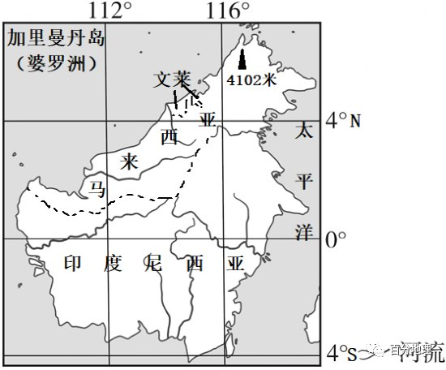

# 微专题之074 从产业结构角度分析区域发展

```
本专题摘自“百分地理”公众号，如有侵权请告之删除，谢谢。联系hhwxyhh@163.com
```

------
   
（2022年6月·浙江）1.农业生产中地膜覆盖对土壤理化性状的主要作用是（  ）   
①保持土壤温度   
②减少水肥流失   
③增加土壤厚度   
④改善土壤质地   
A.①②   
B.①④   
C.②③   
D.③④   
<span style="color: rgb(255, 0, 0);">1.A农田覆盖地膜可以保温、保土、保湿、保肥，抑制杂草生长，减轻病害，增强光效等，①、②对；土壤层次分为一般可分为腐殖质层、淋溶层、淀积层和成土母质层，土壤厚度是母质层以上的那部分，地膜覆盖不会增加土壤厚度，③错；土壤质地是根据土壤的颗粒组成划分的土壤类型。土壤质地一般分为砂土、壤土和粘土三类，地膜覆盖不会改善土壤质地，④错，A对。故选A。</span>   
（2022·山东）图a示意黑龙江省一小型山间盆地景观。某研究小组在甲、乙、丙、丁四处布设采样点进行土壤调查，图b示意该小组绘制的四个采样点0-60cm土壤剖面。据此完成下面小题。   
   
   
   
2.该区域植被类型分异的主要影响因素是（  ）   
A.热量   
B.降水   
C.地形   
D.岩性   
3.图b中②示意的土壤剖面位于（  ）   
A.甲处   
B.乙处   
C.丙处   
D.丁处   
<span style="color: rgb(255, 0, 0);">2.C分析图示信息可知，图示区域的海拔差异较小，热量条件差异较小，A错误；该地位于黑龙江省小型山间盆地，空间差异较小，降水的差异较小，B错误；该地地形起伏较大，导致水分的空间差异较大，植被分异明显，C正确；材料信息没有体现岩性的相关信息，D错误。故选C。</span>   
<span style="color: rgb(255, 0, 0);">3.C根据图示信息可知，②土壤剖面枯枝落叶层和腐殖质层较厚，缺失淋溶层，丙地为塔头薹草，该植被为湿生草甸植被，腐殖质层和枯枝落叶层较厚，湿生环境土壤水分稳定，流动性差，缺失淋溶层，符合②土壤剖面，C正确；与丙处相比，甲处、乙处、丁处三处地势较高，土壤水分向下运移显著，有利于淋溶层的形成，不符合②土壤剖面图，所以ABD错误。故选C。</span>   
（2022·湖南）我国西北某内流河下游河岸地带发育着荒漠植物群落，胡杨为主要建群种，该地地下水平均埋深3～4米。下表反映该植物群落属性及影响因子随离河岸距离增加的变化情况（其中土壤容重与土壤有机质含量呈负相关，土壤电导率与土壤含盐量呈正相关）。据此完成下面小题。   
<table cellspacing="0" cellpadding="0" width="577"><tbody><tr style="height: 16.5pt;"><td width="56" rowspan="2" valign="middle" style="padding: 3.75pt 6pt;border-width: 1pt;border-color: rgb(0, 0, 0);"><section style="margin-top: 0pt;margin-bottom: 0pt;margin-left: 0pt;text-indent: 0pt;font-size: 10.5pt;font-family: &quot;Times New Roman&quot;;text-align: left;vertical-align: middle;line-height: 2em;"><span style="font-family: 楷体;color: rgb(0, 0, 0);">离河岸距离</span><span style="color: rgb(0, 0, 0);"></span></section><section style="margin-top: 0pt;margin-bottom: 0pt;margin-left: 0pt;text-indent: 0pt;font-size: 10.5pt;font-family: &quot;Times New Roman&quot;;text-align: left;vertical-align: middle;line-height: 2em;"><span style="font-family: 楷体;color: rgb(0, 0, 0);">（m）</span><span style="color: rgb(0, 0, 0);"></span></section></td><td width="119" colspan="2" valign="middle" style="padding: 3.75pt 6pt;border-width: 1pt;border-color: rgb(0, 0, 0);"><section style="margin-top: 0pt;margin-bottom: 0pt;margin-left: 0pt;text-indent: 0pt;font-size: 10.5pt;font-family: &quot;Times New Roman&quot;;text-align: left;vertical-align: middle;line-height: 2em;"><span style="font-family: 楷体;color: rgb(0, 0, 0);">群落属性</span><span style="color: rgb(0, 0, 0);"></span></section></td><td width="231" colspan="4" valign="middle" style="padding: 3.75pt 6pt;border-width: 1pt;border-color: rgb(0, 0, 0);"><section style="margin-top: 0pt;margin-bottom: 0pt;margin-left: 0pt;text-indent: 0pt;font-size: 10.5pt;font-family: &quot;Times New Roman&quot;;text-align: left;vertical-align: middle;line-height: 2em;"><span style="font-family: 楷体;color: rgb(0, 0, 0);">影响因子</span><span style="color: rgb(0, 0, 0);"></span></section></td></tr><tr style="height: 16.5pt;"><td width="51" valign="middle" style="padding: 3.75pt 6pt;border-width: 1pt;border-color: rgb(0, 0, 0);"><section style="margin-top: 0pt;margin-bottom: 0pt;margin-left: 0pt;text-indent: 0pt;font-size: 10.5pt;font-family: &quot;Times New Roman&quot;;text-align: left;vertical-align: middle;line-height: 2em;"><span style="font-family: 楷体;color: rgb(0, 0, 0);">群落结构</span><span style="color: rgb(0, 0, 0);"></span></section></td><td width="67" valign="middle" style="padding: 3.75pt 6pt;border-width: 1pt;border-color: rgb(0, 0, 0);"><section style="margin-top: 0pt;margin-bottom: 0pt;margin-left: 0pt;text-indent: 0pt;font-size: 10.5pt;font-family: &quot;Times New Roman&quot;;text-align: left;vertical-align: middle;line-height: 2em;"><span style="font-family: 楷体;color: rgb(0, 0, 0);">群落盖度（%）</span><span style="color: rgb(0, 0, 0);"></span></section></td><td width="52" valign="middle" style="padding: 3.75pt 6pt;border-width: 1pt;border-color: rgb(0, 0, 0);"><section style="margin-top: 0pt;margin-bottom: 0pt;margin-left: 0pt;text-indent: 0pt;font-size: 10.5pt;font-family: &quot;Times New Roman&quot;;text-align: left;vertical-align: middle;line-height: 2em;"><span style="font-family: 楷体;color: rgb(0, 0, 0);">海拔（m）</span><span style="color: rgb(0, 0, 0);"></span></section></td><td width="56" valign="middle" style="padding: 3.75pt 6pt;border-width: 1pt;border-color: rgb(0, 0, 0);"><section style="margin-top: 0pt;margin-bottom: 0pt;margin-left: 0pt;text-indent: 0pt;font-size: 10.5pt;font-family: &quot;Times New Roman&quot;;text-align: left;vertical-align: middle;line-height: 2em;"><span style="font-family: 楷体;color: rgb(0, 0, 0);">土壤含水量</span><span style="color: rgb(0, 0, 0);"></span></section><section style="margin-top: 0pt;margin-bottom: 0pt;margin-left: 0pt;text-indent: 0pt;font-size: 10.5pt;font-family: &quot;Times New Roman&quot;;text-align: left;vertical-align: middle;line-height: 2em;"><span style="font-family: 楷体;color: rgb(0, 0, 0);">（%）</span><span style="color: rgb(0, 0, 0);"></span></section></td><td width="59" valign="middle" style="padding: 3.75pt 6pt;border-width: 1pt;border-color: rgb(0, 0, 0);"><section style="margin-top: 0pt;margin-bottom: 0pt;margin-left: 0pt;text-indent: 0pt;font-size: 10.5pt;font-family: &quot;Times New Roman&quot;;text-align: left;vertical-align: middle;line-height: 2em;"><span style="font-family: 楷体;color: rgb(0, 0, 0);">土壤容重</span><span style="color: rgb(0, 0, 0);"></span></section><section style="margin-top: 0pt;margin-bottom: 0pt;margin-left: 0pt;text-indent: 0pt;font-size: 10.5pt;font-family: &quot;Times New Roman&quot;;text-align: left;vertical-align: middle;line-height: 2em;"><span style="font-family: 楷体;color: rgb(0, 0, 0);">（g/cm3）</span><span style="color: rgb(0, 0, 0);"></span></section></td><td width="62" valign="middle" style="padding: 3.75pt 6pt;border-width: 1pt;border-color: rgb(0, 0, 0);"><section style="margin-top: 0pt;margin-bottom: 0pt;margin-left: 0pt;text-indent: 0pt;font-size: 10.5pt;font-family: &quot;Times New Roman&quot;;text-align: left;vertical-align: middle;line-height: 2em;"><span style="font-family: 楷体;color: rgb(0, 0, 0);">土壤电导率</span><span style="color: rgb(0, 0, 0);"></span></section><section style="margin-top: 0pt;margin-bottom: 0pt;margin-left: 0pt;text-indent: 0pt;font-size: 10.5pt;font-family: &quot;Times New Roman&quot;;text-align: left;vertical-align: middle;line-height: 2em;"><span style="font-family: 楷体;color: rgb(0, 0, 0);">（mS/cm）</span><span style="color: rgb(0, 0, 0);"></span></section></td></tr><tr style="height: 16.5pt;"><td width="56" valign="middle" style="padding: 3.75pt 6pt;border-width: 1pt;border-color: rgb(0, 0, 0);"><section style="margin-top: 0pt;margin-bottom: 0pt;margin-left: 0pt;text-indent: 0pt;font-size: 10.5pt;font-family: &quot;Times New Roman&quot;;text-align: left;vertical-align: middle;line-height: 2em;"><span style="font-family: 楷体;color: rgb(0, 0, 0);">50</span><span style="color: rgb(0, 0, 0);"></span></section></td><td width="51" valign="middle" style="padding: 3.75pt 6pt;border-width: 1pt;border-color: rgb(0, 0, 0);"><section style="margin-top: 0pt;margin-bottom: 0pt;margin-left: 0pt;text-indent: 0pt;font-size: 10.5pt;font-family: &quot;Times New Roman&quot;;text-align: left;vertical-align: middle;line-height: 2em;"><span style="font-family: 楷体;color: rgb(0, 0, 0);">乔—灌—草</span><span style="color: rgb(0, 0, 0);"></span></section></td><td width="67" valign="middle" style="padding: 3.75pt 6pt;border-width: 1pt;border-color: rgb(0, 0, 0);"><section style="margin-top: 0pt;margin-bottom: 0pt;margin-left: 0pt;text-indent: 0pt;font-size: 10.5pt;font-family: &quot;Times New Roman&quot;;text-align: left;vertical-align: middle;line-height: 2em;"><span style="font-family: 楷体;color: rgb(0, 0, 0);">30.33</span><span style="color: rgb(0, 0, 0);"></span></section></td><td width="52" valign="middle" style="padding: 3.75pt 6pt;border-width: 1pt;border-color: rgb(0, 0, 0);"><section style="margin-top: 0pt;margin-bottom: 0pt;margin-left: 0pt;text-indent: 0pt;font-size: 10.5pt;font-family: &quot;Times New Roman&quot;;text-align: left;vertical-align: middle;line-height: 2em;"><span style="font-family: 楷体;color: rgb(0, 0, 0);">916</span><span style="color: rgb(0, 0, 0);"></span></section></td><td width="56" valign="middle" style="padding: 3.75pt 6pt;border-width: 1pt;border-color: rgb(0, 0, 0);"><section style="margin-top: 0pt;margin-bottom: 0pt;margin-left: 0pt;text-indent: 0pt;font-size: 10.5pt;font-family: &quot;Times New Roman&quot;;text-align: left;vertical-align: middle;line-height: 2em;"><span style="font-family: 楷体;color: rgb(0, 0, 0);">5.73</span><span style="color: rgb(0, 0, 0);"></span></section></td><td width="59" valign="middle" style="padding: 3.75pt 6pt;border-width: 1pt;border-color: rgb(0, 0, 0);"><section style="margin-top: 0pt;margin-bottom: 0pt;margin-left: 0pt;text-indent: 0pt;font-size: 10.5pt;font-family: &quot;Times New Roman&quot;;text-align: left;vertical-align: middle;line-height: 2em;"><span style="font-family: 楷体;color: rgb(0, 0, 0);">1.41</span><span style="color: rgb(0, 0, 0);"></span></section></td><td width="62" valign="middle" style="padding: 3.75pt 6pt;border-width: 1pt;border-color: rgb(0, 0, 0);"><section style="margin-top: 0pt;margin-bottom: 0pt;margin-left: 0pt;text-indent: 0pt;font-size: 10.5pt;font-family: &quot;Times New Roman&quot;;text-align: left;vertical-align: middle;line-height: 2em;"><span style="font-family: 楷体;color: rgb(0, 0, 0);">0.3</span><span style="font-family: 楷体;color: rgb(0, 0, 0);">6</span><span style="color: rgb(0, 0, 0);"></span></section></td></tr><tr style="height: 16.5pt;"><td width="56" valign="middle" style="padding: 3.75pt 6pt;border-width: 1pt;border-color: rgb(0, 0, 0);"><section style="margin-top: 0pt;margin-bottom: 0pt;margin-left: 0pt;text-indent: 0pt;font-size: 10.5pt;font-family: &quot;Times New Roman&quot;;text-align: left;vertical-align: middle;line-height: 2em;"><span style="font-family: 楷体;color: rgb(0, 0, 0);">200</span><span style="color: rgb(0, 0, 0);"></span></section></td><td width="51" valign="middle" style="padding: 3.75pt 6pt;border-width: 1pt;border-color: rgb(0, 0, 0);"><section style="margin-top: 0pt;margin-bottom: 0pt;margin-left: 0pt;text-indent: 0pt;font-size: 10.5pt;font-family: &quot;Times New Roman&quot;;text-align: left;vertical-align: middle;line-height: 2em;"><span style="font-family: 楷体;color: rgb(0, 0, 0);">乔—灌—草</span><span style="color: rgb(0, 0, 0);"></span></section></td><td width="67" valign="middle" style="padding: 3.75pt 6pt;border-width: 1pt;border-color: rgb(0, 0, 0);"><section style="margin-top: 0pt;margin-bottom: 0pt;margin-left: 0pt;text-indent: 0pt;font-size: 10.5pt;font-family: &quot;Times New Roman&quot;;text-align: left;vertical-align: middle;line-height: 2em;"><span style="font-family: 楷体;color: rgb(0, 0, 0);">34.00</span><span style="color: rgb(0, 0, 0);"></span></section></td><td width="52" valign="middle" style="padding: 3.75pt 6pt;border-width: 1pt;border-color: rgb(0, 0, 0);"><section style="margin-top: 0pt;margin-bottom: 0pt;margin-left: 0pt;text-indent: 0pt;font-size: 10.5pt;font-family: &quot;Times New Roman&quot;;text-align: left;vertical-align: middle;line-height: 2em;"><span style="font-family: 楷体;color: rgb(0, 0, 0);">917</span><span style="color: rgb(0, 0, 0);"></span></section></td><td width="56" valign="middle" style="padding: 3.75pt 6pt;border-width: 1pt;border-color: rgb(0, 0, 0);"><section style="margin-top: 0pt;margin-bottom: 0pt;margin-left: 0pt;text-indent: 0pt;font-size: 10.5pt;font-family: &quot;Times New Roman&quot;;text-align: left;vertical-align: middle;line-height: 2em;"><span style="font-family: 楷体;color: rgb(0, 0, 0);">5.04</span><span style="color: rgb(0, 0, 0);"></span></section></td><td width="59" valign="middle" style="padding: 3.75pt 6pt;border-width: 1pt;border-color: rgb(0, 0, 0);"><section style="margin-top: 0pt;margin-bottom: 0pt;margin-left: 0pt;text-indent: 0pt;font-size: 10.5pt;font-family: &quot;Times New Roman&quot;;text-align: left;vertical-align: middle;line-height: 2em;"><span style="font-family: 楷体;color: rgb(0, 0, 0);">1.50</span><span style="color: rgb(0, 0, 0);"></span></section></td><td width="62" valign="middle" style="padding: 3.75pt 6pt;border-width: 1pt;border-color: rgb(0, 0, 0);"><section style="margin-top: 0pt;margin-bottom: 0pt;margin-left: 0pt;text-indent: 0pt;font-size: 10.5pt;font-family: &quot;Times New Roman&quot;;text-align: left;vertical-align: middle;line-height: 2em;"><span style="font-family: 楷体;color: rgb(0, 0, 0);">0.59</span><span style="color: rgb(0, 0, 0);"></span></section></td></tr><tr style="height: 16.5pt;"><td width="56" valign="middle" style="padding: 3.75pt 6pt;border-width: 1pt;border-color: rgb(0, 0, 0);"><section style="margin-top: 0pt;margin-bottom: 0pt;margin-left: 0pt;text-indent: 0pt;font-size: 10.5pt;font-family: &quot;Times New Roman&quot;;text-align: left;vertical-align: middle;line-height: 2em;"><span style="font-family: 楷体;color: rgb(0, 0, 0);">350</span><span style="color: rgb(0, 0, 0);"></span></section></td><td width="51" valign="middle" style="padding: 3.75pt 6pt;border-width: 1pt;border-color: rgb(0, 0, 0);"><section style="margin-top: 0pt;margin-bottom: 0pt;margin-left: 0pt;text-indent: 0pt;font-size: 10.5pt;font-family: &quot;Times New Roman&quot;;text-align: left;vertical-align: middle;line-height: 2em;"><span style="font-family: 楷体;color: rgb(0, 0, 0);">乔—灌—草</span><span style="color: rgb(0, 0, 0);"></span></section></td><td width="67" valign="middle" style="padding: 3.75pt 6pt;border-width: 1pt;border-color: rgb(0, 0, 0);"><section style="margin-top: 0pt;margin-bottom: 0pt;margin-left: 0pt;text-indent: 0pt;font-size: 10.5pt;font-family: &quot;Times New Roman&quot;;text-align: left;vertical-align: middle;line-height: 2em;"><span style="font-family: 楷体;color: rgb(0, 0, 0);">40.33</span><span style="color: rgb(0, 0, 0);"></span></section></td><td width="52" valign="middle" style="padding: 3.75pt 6pt;border-width: 1pt;border-color: rgb(0, 0, 0);"><section style="margin-top: 0pt;margin-bottom: 0pt;margin-left: 0pt;text-indent: 0pt;font-size: 10.5pt;font-family: &quot;Times New Roman&quot;;text-align: left;vertical-align: middle;line-height: 2em;"><span style="font-family: 楷体;color: rgb(0, 0, 0);">914</span><span style="color: rgb(0, 0, 0);"></span></section></td><td width="56" valign="middle" style="padding: 3.75pt 6pt;border-width: 1pt;border-color: rgb(0, 0, 0);"><section style="margin-top: 0pt;margin-bottom: 0pt;margin-left: 0pt;text-indent: 0pt;font-size: 10.5pt;font-family: &quot;Times New Roman&quot;;text-align: left;vertical-align: middle;line-height: 2em;"><span style="font-family: 楷体;color: rgb(0, 0, 0);">4.42</span><span style="color: rgb(0, 0, 0);"></span></section></td><td width="59" valign="middle" style="padding: 3.75pt 6pt;border-width: 1pt;border-color: rgb(0, 0, 0);"><section style="margin-top: 0pt;margin-bottom: 0pt;margin-left: 0pt;text-indent: 0pt;font-size: 10.5pt;font-family: &quot;Times New Roman&quot;;text-align: left;vertical-align: middle;line-height: 2em;"><span style="font-family: 楷体;color: rgb(0, 0, 0);">1.50</span><span style="color: rgb(0, 0, 0);"></span></section></td><td width="62" valign="middle" style="padding: 3.75pt 6pt;border-width: 1pt;border-color: rgb(0, 0, 0);"><section style="margin-top: 0pt;margin-bottom: 0pt;margin-left: 0pt;text-indent: 0pt;font-size: 10.5pt;font-family: &quot;Times New Roman&quot;;text-align: left;vertical-align: middle;line-height: 2em;"><span style="font-family: 楷体;color: rgb(0, 0, 0);">0.37</span><span style="color: rgb(0, 0, 0);"></span></section></td></tr><tr style="height: 16.5pt;"><td width="56" valign="middle" style="padding: 3.75pt 6pt;border-width: 1pt;border-color: rgb(0, 0, 0);"><section style="margin-top: 0pt;margin-bottom: 0pt;margin-left: 0pt;text-indent: 0pt;font-size: 10.5pt;font-family: &quot;Times New Roman&quot;;text-align: left;vertical-align: middle;line-height: 2em;"><span style="font-family: 楷体;color: rgb(0, 0, 0);">500</span><span style="color: rgb(0, 0, 0);"></span></section></td><td width="51" valign="middle" style="padding: 3.75pt 6pt;border-width: 1pt;border-color: rgb(0, 0, 0);"><section style="margin-top: 0pt;margin-bottom: 0pt;margin-left: 0pt;text-indent: 0pt;font-size: 10.5pt;font-family: &quot;Times New Roman&quot;;text-align: left;vertical-align: middle;line-height: 2em;"><span style="font-family: 楷体;color: rgb(0, 0, 0);">乔—灌—草</span><span style="color: rgb(0, 0, 0);"></span></section></td><td width="67" valign="middle" style="padding: 3.75pt 6pt;border-width: 1pt;border-color: rgb(0, 0, 0);"><section style="margin-top: 0pt;margin-bottom: 0pt;margin-left: 0pt;text-indent: 0pt;font-size: 10.5pt;font-family: &quot;Times New Roman&quot;;text-align: left;vertical-align: middle;line-height: 2em;"><span style="font-family: 楷体;color: rgb(0, 0, 0);">46.67</span><span style="color: rgb(0, 0, 0);"></span></section></td><td width="52" valign="middle" style="padding: 3.75pt 6pt;border-width: 1pt;border-color: rgb(0, 0, 0);"><section style="margin-top: 0pt;margin-bottom: 0pt;margin-left: 0pt;text-indent: 0pt;font-size: 10.5pt;font-family: &quot;Times New Roman&quot;;text-align: left;vertical-align: middle;line-height: 2em;"><span style="font-family: 楷体;color: rgb(0, 0, 0);">914</span><span style="color: rgb(0, 0, 0);"></span></section></td><td width="56" valign="middle" style="padding: 3.75pt 6pt;border-width: 1pt;border-color: rgb(0, 0, 0);"><section style="margin-top: 0pt;margin-bottom: 0pt;margin-left: 0pt;text-indent: 0pt;font-size: 10.5pt;font-family: &quot;Times New Roman&quot;;text-align: left;vertical-align: middle;line-height: 2em;"><span style="font-family: 楷体;color: rgb(0, 0, 0);">18.51</span><span style="color: rgb(0, 0, 0);"></span></section></td><td width="59" valign="middle" style="padding: 3.75pt 6pt;border-width: 1pt;border-color: rgb(0, 0, 0);"><section style="margin-top: 0pt;margin-bottom: 0pt;margin-left: 0pt;text-indent: 0pt;font-size: 10.5pt;font-family: &quot;Times New Roman&quot;;text-align: left;vertical-align: middle;line-height: 2em;"><span style="font-family: 楷体;color: rgb(0, 0, 0);">1.41</span><span style="color: rgb(0, 0, 0);"></span></section></td><td width="62" valign="middle" style="padding: 3.75pt 6pt;border-width: 1pt;border-color: rgb(0, 0, 0);"><section style="margin-top: 0pt;margin-bottom: 0pt;margin-left: 0pt;text-indent: 0pt;font-size: 10.5pt;font-family: &quot;Times New Roman&quot;;text-align: left;vertical-align: middle;line-height: 2em;"><span style="font-family: 楷体;color: rgb(0, 0, 0);">2.56</span><span style="color: rgb(0, 0, 0);"></span></section></td></tr><tr style="height: 16.5pt;"><td width="56" valign="middle" style="padding: 3.75pt 6pt;border-width: 1pt;border-color: rgb(0, 0, 0);"><section style="margin-top: 0pt;margin-bottom: 0pt;margin-left: 0pt;text-indent: 0pt;font-size: 10.5pt;font-family: &quot;Times New Roman&quot;;text-align: left;vertical-align: middle;line-height: 2em;"><span style="font-family: 楷体;color: rgb(0, 0, 0);">650</span><span style="color: rgb(0, 0, 0);"></span></section></td><td width="51" valign="middle" style="padding: 3.75pt 6pt;border-width: 1pt;border-color: rgb(0, 0, 0);"><section style="margin-top: 0pt;margin-bottom: 0pt;margin-left: 0pt;text-indent: 0pt;font-size: 10.5pt;font-family: &quot;Times New Roman&quot;;text-align: left;vertical-align: middle;line-height: 2em;"><span style="font-family: 楷体;color: rgb(0, 0, 0);">乔—灌—草</span><span style="color: rgb(0, 0, 0);"></span></section></td><td width="67" valign="middle" style="padding: 3.75pt 6pt;border-width: 1pt;border-color: rgb(0, 0, 0);"><section style="margin-top: 0pt;margin-bottom: 0pt;margin-left: 0pt;text-indent: 0pt;font-size: 10.5pt;font-family: &quot;Times New Roman&quot;;text-align: left;vertical-align: middle;line-height: 2em;"><span style="font-family: 楷体;color: rgb(0, 0, 0);">74.33</span><span style="color: rgb(0, 0, 0);"></span></section></td><td width="52" valign="middle" style="padding: 3.75pt 6pt;border-width: 1pt;border-color: rgb(0, 0, 0);"><section style="margin-top: 0pt;margin-bottom: 0pt;margin-left: 0pt;text-indent: 0pt;font-size: 10.5pt;font-family: &quot;Times New Roman&quot;;text-align: left;vertical-align: middle;line-height: 2em;"><span style="font-family: 楷体;color: rgb(0, 0, 0);">913</span><span style="color: rgb(0, 0, 0);"></span></section></td><td width="56" valign="middle" style="padding: 3.75pt 6pt;border-width: 1pt;border-color: rgb(0, 0, 0);"><section style="margin-top: 0pt;margin-bottom: 0pt;margin-left: 0pt;text-indent: 0pt;font-size: 10.5pt;font-family: &quot;Times New Roman&quot;;text-align: left;vertical-align: middle;line-height: 2em;"><span style="font-family: 楷体;color: rgb(0, 0, 0);">19.27</span><span style="color: rgb(0, 0, 0);"></span></section></td><td width="59" valign="middle" style="padding: 3.75pt 6pt;border-width: 1pt;border-color: rgb(0, 0, 0);"><section style="margin-top: 0pt;margin-bottom: 0pt;margin-left: 0pt;text-indent: 0pt;font-size: 10.5pt;font-family: &quot;Times New Roman&quot;;text-align: left;vertical-align: middle;line-height: 2em;"><span style="font-family: 楷体;color: rgb(0, 0, 0);">1.37</span><span style="color: rgb(0, 0, 0);"></span></section></td><td width="62" valign="middle" style="padding: 3.75pt 6pt;border-width: 1pt;border-color: rgb(0, 0, 0);"><section style="margin-top: 0pt;margin-bottom: 0pt;margin-left: 0pt;text-indent: 0pt;font-size: 10.5pt;font-family: &quot;Times New Roman&quot;;text-align: left;vertical-align: middle;line-height: 2em;"><span style="font-family: 楷体;color: rgb(0, 0, 0);">0.40</span><span style="color: rgb(0, 0, 0);"></span></section></td></tr><tr style="height: 16.5pt;"><td width="56" valign="middle" style="padding: 3.75pt 6pt;border-width: 1pt;border-color: rgb(0, 0, 0);"><section style="margin-top: 0pt;margin-bottom: 0pt;margin-left: 0pt;text-indent: 0pt;font-size: 10.5pt;font-family: &quot;Times New Roman&quot;;text-align: left;vertical-align: middle;line-height: 2em;"><span style="font-family: 楷体;color: rgb(0, 0, 0);">800</span><span style="color: rgb(0, 0, 0);"></span></section></td><td width="51" valign="middle" style="padding: 3.75pt 6pt;border-width: 1pt;border-color: rgb(0, 0, 0);"><section style="margin-top: 0pt;margin-bottom: 0pt;margin-left: 0pt;text-indent: 0pt;font-size: 10.5pt;font-family: &quot;Times New Roman&quot;;text-align: left;vertical-align: middle;line-height: 2em;"><span style="font-family: 楷体;color: rgb(0, 0, 0);">乔—灌—草</span><span style="color: rgb(0, 0, 0);"></span></section></td><td width="67" valign="middle" style="padding: 3.75pt 6pt;border-width: 1pt;border-color: rgb(0, 0, 0);"><section style="margin-top: 0pt;margin-bottom: 0pt;margin-left: 0pt;text-indent: 0pt;font-size: 10.5pt;font-family: &quot;Times New Roman&quot;;text-align: left;vertical-align: middle;line-height: 2em;"><span style="font-family: 楷体;color: rgb(0, 0, 0);">68.67</span><span style="color: rgb(0, 0, 0);"></span></section></td><td width="52" valign="middle" style="padding: 3.75pt 6pt;border-width: 1pt;border-color: rgb(0, 0, 0);"><section style="margin-top: 0pt;margin-bottom: 0pt;margin-left: 0pt;text-indent: 0pt;font-size: 10.5pt;font-family: &quot;Times New Roman&quot;;text-align: left;vertical-align: middle;line-height: 2em;"><span style="font-family: 楷体;color: rgb(0, 0, 0);">913</span><span style="color: rgb(0, 0, 0);"></span></section></td><td width="56" valign="middle" style="padding: 3.75pt 6pt;border-width: 1pt;border-color: rgb(0, 0, 0);"><section style="margin-top: 0pt;margin-bottom: 0pt;margin-left: 0pt;text-indent: 0pt;font-size: 10.5pt;font-family: &quot;Times New Roman&quot;;text-align: left;vertical-align: middle;line-height: 2em;"><span style="font-family: 楷体;color: rgb(0, 0, 0);">15.23</span><span style="color: rgb(0, 0, 0);"></span></section></td><td width="59" valign="middle" style="padding: 3.75pt 6pt;border-width: 1pt;border-color: rgb(0, 0, 0);"><section style="margin-top: 0pt;margin-bottom: 0pt;margin-left: 0pt;text-indent: 0pt;font-size: 10.5pt;font-family: &quot;Times New Roman&quot;;text-align: left;vertical-align: middle;line-height: 2em;"><span style="font-family: 楷体;color: rgb(0, 0, 0);">1.38</span><span style="color: rgb(0, 0, 0);"></span></section></td><td width="62" valign="middle" style="padding: 3.75pt 6pt;border-width: 1pt;border-color: rgb(0, 0, 0);"><section style="margin-top: 0pt;margin-bottom: 0pt;margin-left: 0pt;text-indent: 0pt;font-size: 10.5pt;font-family: &quot;Times New Roman&quot;;text-align: left;vertical-align: middle;line-height: 2em;"><span style="font-family: 楷体;color: rgb(0, 0, 0);">1.02</span><span style="color: rgb(0, 0, 0);"></span></section></td></tr><tr style="height: 16.5pt;"><td width="56" valign="middle" style="padding: 3.75pt 6pt;border-width: 1pt;border-color: rgb(0, 0, 0);"><section style="margin-top: 0pt;margin-bottom: 0pt;margin-left: 0pt;text-indent: 0pt;font-size: 10.5pt;font-family: &quot;Times New Roman&quot;;text-align: left;vertical-align: middle;line-height: 2em;"><span style="font-family: 楷体;color: rgb(0, 0, 0);">950</span><span style="color: rgb(0, 0, 0);"></span></section></td><td width="51" valign="middle" style="padding: 3.75pt 6pt;border-width: 1pt;border-color: rgb(0, 0, 0);"><section style="margin-top: 0pt;margin-bottom: 0pt;margin-left: 0pt;text-indent: 0pt;font-size: 10.5pt;font-family: &quot;Times New Roman&quot;;text-align: left;vertical-align: middle;line-height: 2em;"><span style="font-family: 楷体;color: rgb(0, 0, 0);">乔—草</span><span style="color: rgb(0, 0, 0);"></span></section></td><td width="67" valign="middle" style="padding: 3.75pt 6pt;border-width: 1pt;border-color: rgb(0, 0, 0);"><section style="margin-top: 0pt;margin-bottom: 0pt;margin-left: 0pt;text-indent: 0pt;font-size: 10.5pt;font-family: &quot;Times New Roman&quot;;text-align: left;vertical-align: middle;line-height: 2em;"><span style="font-family: 楷体;color: rgb(0, 0, 0);">45.00</span><span style="color: rgb(0, 0, 0);"></span></section></td><td width="52" valign="middle" style="padding: 3.75pt 6pt;border-width: 1pt;border-color: rgb(0, 0, 0);"><section style="margin-top: 0pt;margin-bottom: 0pt;margin-left: 0pt;text-indent: 0pt;font-size: 10.5pt;font-family: &quot;Times New Roman&quot;;text-align: left;vertical-align: middle;line-height: 2em;"><span style="font-family: 楷体;color: rgb(0, 0, 0);">912</span><span style="color: rgb(0, 0, 0);"></span></section></td><td width="56" valign="middle" style="padding: 3.75pt 6pt;border-width: 1pt;border-color: rgb(0, 0, 0);"><section style="margin-top: 0pt;margin-bottom: 0pt;margin-left: 0pt;text-indent: 0pt;font-size: 10.5pt;font-family: &quot;Times New Roman&quot;;text-align: left;vertical-align: middle;line-height: 2em;"><span style="font-family: 楷体;color: rgb(0, 0, 0);">7.78</span><span style="color: rgb(0, 0, 0);"></span></section></td><td width="59" valign="middle" style="padding: 3.75pt 6pt;border-width: 1pt;border-color: rgb(0, 0, 0);"><section style="margin-top: 0pt;margin-bottom: 0pt;margin-left: 0pt;text-indent: 0pt;font-size: 10.5pt;font-family: &quot;Times New Roman&quot;;text-align: left;vertical-align: middle;line-height: 2em;"><span style="font-family: 楷体;color: rgb(0, 0, 0);">1.40</span><span style="color: rgb(0, 0, 0);"></span></section></td><td width="62" valign="middle" style="padding: 3.75pt 6pt;border-width: 1pt;border-color: rgb(0, 0, 0);"><section style="margin-top: 0pt;margin-bottom: 0pt;margin-left: 0pt;text-indent: 0pt;font-size: 10.5pt;font-family: &quot;Times New Roman&quot;;text-align: left;vertical-align: middle;line-height: 2em;"><span style="font-family: 楷体;color: rgb(0, 0, 0);">0.50</span><span style="color: rgb(0, 0, 0);"></span></section></td></tr><tr style="height: 16.5pt;"><td width="56" valign="middle" style="padding: 3.75pt 6pt;border-width: 1pt;border-color: rgb(0, 0, 0);"><section style="margin-top: 0pt;margin-bottom: 0pt;margin-left: 0pt;text-indent: 0pt;font-size: 10.5pt;font-family: &quot;Times New Roman&quot;;text-align: left;vertical-align: middle;line-height: 2em;"><span style="font-family: 楷体;color: rgb(0, 0, 0);">1100</span><span style="color: rgb(0, 0, 0);"></span></section></td><td width="51" valign="middle" style="padding: 3.75pt 6pt;border-width: 1pt;border-color: rgb(0, 0, 0);"><section style="margin-top: 0pt;margin-bottom: 0pt;margin-left: 0pt;text-indent: 0pt;font-size: 10.5pt;font-family: &quot;Times New Roman&quot;;text-align: left;vertical-align: middle;line-height: 2em;"><span style="font-family: 楷体;color: rgb(0, 0, 0);">乔—草</span><span style="color: rgb(0, 0, 0);"></span></section></td><td width="67" valign="middle" style="padding: 3.75pt 6pt;border-width: 1pt;border-color: rgb(0, 0, 0);"><section style="margin-top: 0pt;margin-bottom: 0pt;margin-left: 0pt;text-indent: 0pt;font-size: 10.5pt;font-family: &quot;Times New Roman&quot;;text-align: left;vertical-align: middle;line-height: 2em;"><span style="font-family: 楷体;color: rgb(0, 0, 0);">40.33</span><span style="color: rgb(0, 0, 0);"></span></section></td><td width="52" valign="middle" style="padding: 3.75pt 6pt;border-width: 1pt;border-color: rgb(0, 0, 0);"><section style="margin-top: 0pt;margin-bottom: 0pt;margin-left: 0pt;text-indent: 0pt;font-size: 10.5pt;font-family: &quot;Times New Roman&quot;;text-align: left;vertical-align: middle;line-height: 2em;"><span style="font-family: 楷体;color: rgb(0, 0, 0);">916</span><span style="color: rgb(0, 0, 0);"></span></section></td><td width="56" valign="middle" style="padding: 3.75pt 6pt;border-width: 1pt;border-color: rgb(0, 0, 0);"><section style="margin-top: 0pt;margin-bottom: 0pt;margin-left: 0pt;text-indent: 0pt;font-size: 10.5pt;font-family: &quot;Times New Roman&quot;;text-align: left;vertical-align: middle;line-height: 2em;"><span style="font-family: 楷体;color: rgb(0, 0, 0);">3.06</span><span style="color: rgb(0, 0, 0);"></span></section></td><td width="59" valign="middle" style="padding: 3.75pt 6pt;border-width: 1pt;border-color: rgb(0, 0, 0);"><section style="margin-top: 0pt;margin-bottom: 0pt;margin-left: 0pt;text-indent: 0pt;font-size: 10.5pt;font-family: &quot;Times New Roman&quot;;text-align: left;vertical-align: middle;line-height: 2em;"><span style="font-family: 楷体;color: rgb(0, 0, 0);">1.58</span><span style="color: rgb(0, 0, 0);"></span></section></td><td width="62" valign="middle" style="padding: 3.75pt 6pt;border-width: 1pt;border-color: rgb(0, 0, 0);"><section style="margin-top: 0pt;margin-bottom: 0pt;margin-left: 0pt;text-indent: 0pt;font-size: 10.5pt;font-family: &quot;Times New Roman&quot;;text-align: left;vertical-align: middle;line-height: 2em;"><span style="font-family: 楷体;color: rgb(0, 0, 0);">0.66</span><span style="color: rgb(0, 0, 0);"></span></section></td></tr><tr style="height: 16.5pt;"><td width="56" valign="middle" style="padding: 3.75pt 6pt;border-width: 1pt;border-color: rgb(0, 0, 0);"><section style="margin-top: 0pt;margin-bottom: 0pt;margin-left: 0pt;text-indent: 0pt;font-size: 10.5pt;font-family: &quot;Times New Roman&quot;;text-align: left;vertical-align: middle;line-height: 2em;"><span style="font-family: 楷体;color: rgb(0, 0, 0);">1</span><span style="font-family: 楷体;color: rgb(0, 0, 0);">250</span><span style="color: rgb(0, 0, 0);"></span></section></td><td width="51" valign="middle" style="padding: 3.75pt 6pt;border-width: 1pt;border-color: rgb(0, 0, 0);"><section style="margin-top: 0pt;margin-bottom: 0pt;margin-left: 0pt;text-indent: 0pt;font-size: 10.5pt;font-family: &quot;Times New Roman&quot;;text-align: left;vertical-align: middle;line-height: 2em;"><span style="font-family: 楷体;color: rgb(0, 0, 0);">乔—草</span><span style="color: rgb(0, 0, 0);"></span></section></td><td width="67" valign="middle" style="padding: 3.75pt 6pt;border-width: 1pt;border-color: rgb(0, 0, 0);"><section style="margin-top: 0pt;margin-bottom: 0pt;margin-left: 0pt;text-indent: 0pt;font-size: 10.5pt;font-family: &quot;Times New Roman&quot;;text-align: left;vertical-align: middle;line-height: 2em;"><span style="font-family: 楷体;color: rgb(0, 0, 0);">34.33</span><span style="color: rgb(0, 0, 0);"></span></section></td><td width="52" valign="middle" style="padding: 3.75pt 6pt;border-width: 1pt;border-color: rgb(0, 0, 0);"><section style="margin-top: 0pt;margin-bottom: 0pt;margin-left: 0pt;text-indent: 0pt;font-size: 10.5pt;font-family: &quot;Times New Roman&quot;;text-align: left;vertical-align: middle;line-height: 2em;"><span style="font-family: 楷体;color: rgb(0, 0, 0);">915</span><span style="color: rgb(0, 0, 0);"></span></section></td><td width="56" valign="middle" style="padding: 3.75pt 6pt;border-width: 1pt;border-color: rgb(0, 0, 0);"><section style="margin-top: 0pt;margin-bottom: 0pt;margin-left: 0pt;text-indent: 0pt;font-size: 10.5pt;font-family: &quot;Times New Roman&quot;;text-align: left;vertical-align: middle;line-height: 2em;"><span style="font-family: 楷体;color: rgb(0, 0, 0);">2.32</span><span style="color: rgb(0, 0, 0);"></span></section></td><td width="59" valign="middle" style="padding: 3.75pt 6pt;border-width: 1pt;border-color: rgb(0, 0, 0);"><section style="margin-top: 0pt;margin-bottom: 0pt;margin-left: 0pt;text-indent: 0pt;font-size: 10.5pt;font-family: &quot;Times New Roman&quot;;text-align: left;vertical-align: middle;line-height: 2em;"><span style="font-family: 楷体;color: rgb(0, 0, 0);">1.62</span><span style="color: rgb(0, 0, 0);"></span></section></td><td width="62" valign="middle" style="padding: 3.75pt 6pt;border-width: 1pt;border-color: rgb(0, 0, 0);"><section style="margin-top: 0pt;margin-bottom: 0pt;margin-left: 0pt;text-indent: 0pt;font-size: 10.5pt;font-family: &quot;Times New Roman&quot;;text-align: left;vertical-align: middle;line-height: 2em;"><span style="font-family: 楷体;color: rgb(0, 0, 0);">1.98</span><span style="color: rgb(0, 0, 0);"></span></section></td></tr></tbody></table>

   
4.随离河岸距离的增加，变化趋势与群落盖度总体相似的影响因子有（  ）   
①海拔   
②土壤含水量   
③土壤有机质含量   
④土壤含盐量   
A.①②   
B.②③   
C.②④   
D.③④   
5.浅根系草本植物在该植物群落中分布广泛，主要得益于（  ）   
A.胡杨涵养水源   
B.草本植物水分竞争力强   
C.地下水埋深浅   
D.草本植物耐盐碱能力强   
6.在离河岸950米到1250米的地段，该植物群落中灌木消失的主要原因可能是（  ）   
A.土壤有机质减少   
B.乔木与灌木水分竞争   
C.土壤含盐量增加   
D.草本与灌木水分竞争   
<span style="color: rgb(255, 0, 0);">4.B读表可知，随离河岸距离的增加，群落盖度大致先增后降，海拔高度变化规律不明显，土壤含水量大致先增后降，土壤容重大致先降后升，土壤电导率变化规律不明显，材料信息表明，土壤容重与土壤有机质含量呈负相关，土壤电导率与土壤含盐量呈正相关，因此随离河岸距离的增加，土壤有机质含量大致先增后降，土壤含盐量变化规律不明显，由此可知，随离河岸距离的增加，变化趋势与群落盖度总体相似的影响因子有土壤含水量和土壤有机质含量，即②、③符合题意，①、④不符合题意。综上所述，B符合题意，排除ACD。故选B。</span>   
<span style="color: rgb(255, 0, 0);">5.A材料信息表明，该地地下水平均埋深3～4米，浅根系草本植物很难直接获得地上水，但该地胡杨为主要建群种，具有较强的涵养水源作用，从而为浅根系草本植物提供水源，因此浅根系草本植物在该植物群落中分布广泛，A符合题意，排除C；草本植物根据较浅，因此水分竞争力并不强，排除B；该区域地下水较深，盐碱化现象并不严重，因此草本植物耐盐碱能力强不是广泛分布的主要原因，排除D。故选A。</span>   
<span style="color: rgb(255, 0, 0);">6.B干旱地区植物得以生存主要取决于水分水源条件，由于乔木与灌木的根系较深，在缺水地区存在明显的水分竞争状况，由乔木比灌木水分竞争能力更强，使得在离河岸950米到1250米的地段，该植物群落中灌木消失，B符合题意；草本根系较浅，与灌木的水分竞争中，灌木竞争能力更强，因此灌木消失不是草本与灌木水分竞争的结果，排除D；在离河岸950米到1250米的地段，乔木与草本植物均能生长，因此土壤有机质减少、土壤含盐量增加不是导致灌木消失的主要原因，排除AC。故选B。</span>   
（2022年6月浙江卷）7.将养殖场废弃物和农田秸秆等处理生成甲烷，并通过内燃发电机组进行发电，是生物质天然气利用的重要方式，既可发电还为农田提供优质肥料。下图为该项目实施示意图。处理后的沼渣、沼液施用于农田，会（  ）   
   
   
   
A.减少土壤有机碳含量   
B.减弱土壤通气性   
C.改变土壤养分循环状况   
D.降低土壤微生物活性   
<span style="color: rgb(255, 0, 0);">7.C根据材料和图示信息可知，处理后的沼渣、沼液是农田的优质肥料。生物发电场处理后的沼渣、沼液有机质含量高，适用于农田，可以增加土壤有机质的含量，故A选项错误；沼渣、沼液腐殖质含量高，能够促进土壤多级空隙的形成，可以使得土壤疏松，不易板结，增加土壤的透气性，故B选项错误；沼渣、沼液含有大量的腐殖质，适用于农田，可以增加土壤肥力，利于农作物生长，加快土壤养分循环速度，故C选项正确；沼渣、沼液有机质含量高，为土壤微生物提供营养物质，可以增强土壤微生物活性，故D选项错误。故选C。</span>   
（2022·北京）下图为我国山东丘陵某地土地利用示意图，读图完成下面小题，   
   
   
   
8.据图判断（  ）   
A.甲处适宜建化工厂   
B.乙处河道可能有水坝   
C.林地为常绿阔叶林   
D.小学距村庄约4千米   
9.图中四地，土壤表层有机质含量最高的是（  ）   
A.甲   
B.乙   
C.丙   
D.丁   
<span style="color: rgb(255, 0, 0);">8.B 从图中河流沉积颗粒大小可知，该地河流从西北流向东南，甲处为河流上游，不适宜建化工厂，会影响河流水源，A错；乙处河流沉积颗粒物大小发生突变，粒径忽然减小，可能是由于建设水坝拦截了较大颗粒的沉积物所致，B对；此地为山东丘陵，是温带地区，林地应为落叶阔叶林，C错；小学距村庄大约4段比例尺所示线段长度，共1200米，D错。故选B。</span>   
<span style="color: rgb(255, 0, 0);">9.C甲处为林地，但树龄较短（小于2年），土壤表层有机物积累少，A错；如上题分析，乙处为水坝，落差较大，流水速度快，土壤表层受流水侵蚀严重，有机质含量少，B错；丙处为菜地，生长周期短，无用枝叶等有机物还田多。土壤有机物含量高，C对；丁为耕地，作物生长周期长，秸秆还田较少，土地有机质消耗较大，含量低，D错。故选C。</span>   
（2022年湖南卷）10.阅读图文材料，完成下列要求。   
土壤有机质包括腐殖质、生物残体等，大多以有机碳的形式存在。土壤有机碳密度是指单位面积内一定深度的土壤有机碳储量。海南岛某自然保护区内保存着较完整的热带山地雨林，此地常受台风影响。下图示意该保护区内一块样地的地形及该样地内部分点位土壤表层（0～10cm）的有机碳密度（单位：kg/m2）。   
   
   
   
（1）指出该样地山脊与山谷土壤表层有机碳密度的差异，并分析其原因。   
（2）该地森林固碳能力比长白山更强，请说明理由。   
（3）森林固碳是降低大气二氧化碳浓度的重要途径，提出增强当地森林碳吸收能力的主要措施。   
<span style="color: rgb(255, 0, 0);">【答案】（1）差异：山脊土壤表层有机碳密度较大，山谷土壤表层有机碳密度较小。原因：与山谷相比，山脊受台风影响更大，易使植被倾倒死亡、腐烂，树木更新快，增加土壤中有机碳输入。（2）与长白山相比，该地水热条件更好，植被更茂密，热带森林光合作用更强，吸收二氧化碳更多，把碳大量固定在植物体内。</span>   
<span style="color: rgb(255, 0, 0);">（3）积极恢复森林，扩大森林面积；加强森林抚育和管理，注重林木的保护性间伐与更新，提升森林固碳能力等。</span>   
<span style="color: rgb(255, 0, 0);">【解析】（1）首先在等高线图中读出哪里是山谷、哪里是山脊，然后观测山脊和山谷中点位的土壤表层（0～10cm）的有机密度，会发现山脊土壤表层有机碳密度较大，山谷土壤表层有机碳密度较小。土壤有机质含量由有机质输入和分解两方面决定，图中显示，该样地内相对高差不大，山谷与山脊的气温相差不大，且均比较水分充足，因此山谷与山脊有机质的分解差异不大，而土壤中有机质主要通过枯枝落叶来输入，材料信息表明，当地常受台风影响，与山谷相比，山脊受台风影响更大，易使植被倾倒死亡、腐烂，增加土壤中有机碳输入，也因此树木更新快，有机碳的输入来源较多，从而使得山脊土壤表层有机碳密度较大。</span>   
<span style="color: rgb(255, 0, 0);">（2）森林固碳能力包括土壤固碳能力和生物体固碳能力。由于长白山地区气候冷湿，土壤的有机碳含量高于海南岛，因此该地森林固碳能力比长白山更强应表现在生物体固碳能力。与长白山相比，该地属于山地雨林地区，水热条件更好，植被生物条件更优，植被更茂密，热带森林光合作用更强，吸收二氧化碳更多，从而把碳大量固定在植物体内，因此该地森林固碳能力比长白山更强。</span>   
<span style="color: rgb(255, 0, 0);">（3）森林固碳是降低大气二氧化碳浓度的重要途径，森林的固碳能力取决于森林的数量和质量，从数量来看，当地应积极恢复森林，扩大森林面积，从而增强当地森林碳吸收能力；从质量来看，应加强森林抚育和管理，注重林木的保护性间伐与更新，使得森林生长更加旺盛，从而提升森林固碳能力。</span>   
（2021年浙江省6月高考真题）11.阅读材料﹐完成下列问题。   
材料：图一为非洲部分区域略图﹐该区域矿产资源丰富﹐大部分矿产品通过海运出口。图二为图一中①河附近两测站年内降水分配图。   
   
   
   
   
   
   
<span style="color: rgb(255, 0, 0);">图中甲、乙、丙三地土壤厚度逐渐增加，简析其成因。</span>   
<span style="color: rgb(255, 0, 0);">【答案】由甲至丙，降水量增加，气候更加湿润；植被生产力增加，生物化学风化作用增强。</span>   
<span style="color: rgb(255, 0, 0);">【解析】读图可知，甲、乙、丙三地随着随着纬度的降低，土壤厚度逐渐增加，主要原因是纬度越低，受到赤道低气压带影响越强，雨季更长，水分条件更优越，植物生产活动更活跃，气候湿润、炎热的地区，化学风化和生物风化作用普遍而强烈，岩石矿物被强烈分解，形成较厚的风化壳，增加了土壤厚度。</span>   
（2020年浙江省1月高考真题）下图为土壤与其他自然地理要素的关系图。完成下面小题。   
   
   
   
12.下列成土因素，比较活跃的是（  ）   
A.气候和地形   
B.气候和生物   
C.母质和生物   
D.地形和母质   
13.与陡坡相比，缓坡土壤肥力一般较高是因为（  ）   
A.自然植被茂密   
B.有机质积累多   
C.生物残体分解快   
D.矿物养分流失快   
<span style="color: rgb(255, 0, 0);">12.B土壤的成土母质来源于岩石形成的风化物，气候对土壤形成的影响主要是通过降水和气温实现，通过降水影响土壤的水分，通过气温影响土壤的热量，气候影响岩石的物理和化学风化过程；生物是土壤有机物质的来源，气候和生物是在土壤的形成过程中比较活跃的因素，B正确。成土母质和地形相对稳定，不会明显变化，成土母质、地形特征对土壤的形成都有影响，但不是比较活跃的因素。ACD错误。故选B。</span>   
<span style="color: rgb(255, 0, 0);">13.B热带雨林自然植被茂密，土壤肥力较低，因此自然植被茂密不是影响陡坡、缓坡土壤肥力差异的主要因素，A错误。据图分析，在陡坡上，水流速度快，侵蚀强，地表疏松物质迁移速度较快，有机质、矿物养分难以保留，很难发育成深厚的土壤；缓坡水流速度慢，地表疏松物质迁移速度较慢，有机质、矿物养分积累多，土壤肥力一般较高，B正确。温度高，生物残体分解快，陡坡和缓坡温度差异不大，C错误。陡坡矿物养分流失快，缓坡矿物养分流失慢，D错误。故选B。</span>   
（2021·重庆西南大学附中高三月考）表层土壤水分受降水、气温、植被等因素的综合影响。下图示意黄土高原某区域表层土壤水分变化情况，该区域年降水量300mm，地面覆盖有人工恢复的植被。据此完成下面小题。   
   
   
   
14.该区域表层土壤水分收入大于支出的月份是（  ）   
A.5月和6月   
B.7月和8月   
C.8月和9月   
D.9月和10月   
15.与其他时间相比较，该区域7、8月表层土壤含水量较低的主要原因是（  ）   
①降水强度大②降水时间长③植被长势好④蒸发量大   
A.①④   
B.②③   
C.①③   
D.③④   
<span style="color: rgb(255, 0, 0);">14.C 据图可知，8月相对于7月表层土壤水分是增多的，9月相对于8月表层土壤水分也是增多的，所以8、9两个月份水分收入大于支出，C正确；6月水分比5月少，7月水分比6月少，10月水分比9月少，所以6月、7月、10月水分都是支出大于收入，ABD错误。所以选C。</span>   
<span style="color: rgb(255, 0, 0);">15.D该区域表层土壤水分的收入主要是降水，支出主要有蒸发、蒸腾和雨水的下渗。7、8月虽然雨水多，但由于前期土壤缺水，因此下渗到深层土壤的水分较多；随着气温的回升,尤其是植被的旺盛生长，蒸发（蒸腾）量大增，从而导致表层土壤含水量较低。③④正确。降水强度大、降水时间长会导致土壤含水量高，①②错误。所以选D。</span>   
（2022·北京·中关村中学三模）16.海南某地的暗红湿润铁铝土，是由玄武岩风化物发育而成的酸性土壤，有几百万年的发育历史，土质较黏重，是适合热带水果、橡胶林生长的肥沃土壤。据此回答下题。该地暗红湿润铁铝土较肥沃的原因是（  ）   
A.玄武岩风化物的有机质含量较高   
B.发育时间长，养分积累多   
C.生物循环使养分在土壤表层累积   
D.气候湿热，有机质分解快   
<span style="color: rgb(255, 0, 0);">16.B土壤有机质来源于生物活动，玄武岩风化物不会有机质含量较高，排除A；题意表明，暗红湿润铁铝土有几百万年的发育历史，发育时间长，养分积累多，因此比较肥沃，B符合题意；海南地处热带季风气候区，高温多雨的气候使得植被生长迅速，吸收土壤养分的能力强，因此该土壤养分主要不是生物循环所累积，排除C；当地气候湿热，有机质分解快，土壤有机质贫乏，这是土壤贫瘠的表现，这不是该地暗红湿润铁铝土较肥沃的原因，排除D。故选B。</span>   
（2022·北京西城·二模）土壤有机碳是通过微生物作用所形成的腐殖质、动植物残体和微生物体的合称，并处于不断形成与分解的动态过程。世界土壤有机碳平均水平为12.1千克/平方米。某研究小组调查藏北高寒草原样带的土壤有机碳含量与草地覆盖度关系（如图）。读图，回答下面小题。   
   
   
   
17.该样带（  ）   
A.成土母质直接影响土壤有机碳的含量   
B.土壤有机碳含量较高，自然环境相对稳定   
C.因沿海向内陆的地域分异规律草地覆盖度高   
D.土壤有机碳含量总体随草地覆盖度增加而升高   
18.影响藏北高原土壤有机碳含量的原因有（  ）   
①地势起伏大   
②土壤侵蚀作用强   
③热量条件差   
④人类活动强度大   
A.①②   
B.①④   
C.②③   
D.③④   
<span style="color: rgb(255, 0, 0);">17.D 阅读图文材料，结合所学知识可知，成土母质是岩石风化的碎屑物质，而材料显示土壤有机碳是通过微生物作用所形成的腐殖质、动植物残体和微生物体的合称，因此成土母质不是直接影响土壤有机碳含量的，故A错误；图中显示土壤有机碳含量总体随草地覆盖度增加而升高，土壤有机碳含量较高，说明植被覆盖率越高，自然环境更新较快，自然环境相对活跃，故B错误，D正确；材料中调查的地区是藏北高寒草原带，属于垂直地带性差异，不是沿海向内陆的地域分异规律，故C错误。答案选择D。</span>   
<span style="color: rgb(255, 0, 0);">18.C阅读图文材料，藏北高原土壤有机碳含量大大低于世界平均水平，其原因是由于海拔较高，气温较低，热量条件不足，且高寒气候，温差较大，风化作用强烈，侵蚀作用较强，故②和③正确；但是土壤有机质和植被覆盖率关系较大，与地形地势关系不大，故①错误；该区域人口稀少，人类活动少，对自然植被的影响小，因此人类活动强度低，故④错误。答案选择C。</span>   
（2022·北京·101中学高三开学考试）熟化是通过耕种、定向培育，将自然土壤转变成适合农作物生长且肥沃的土壤的过程。我国东北的黑土、南方的红壤经熟化都可成为水稻土。下左图为自然土壤与水稻土结构示意图，下右图为黑土、红壤和水稻土关系示意图。读图完成下面小题。   
   
   
   
   
   
   
19.与自然土壤相比，水稻土（  ）   
A.枯枝落叶层增厚   
B.不含腐殖质   
C.肥力水平下降   
D.结构更复杂   
20.经过熟化，水稻土的结构特点及功能发生的变化表现为（  ）   
A.表土层软糊，提供了农作物扎根立足的条件   
B.耕作层浅薄疏松，受人类活动影响大   
C.犁底层紧实，提高了保水、保肥能力   
D.母岩层较薄，阻断了有机界与无机界的联系   
21.将黑土或红壤熟化为水稻土并进行养护，应（  ）   
A.熟化黑土——沼泽化处理   
B.黑泥田——利用过程中无需施肥   
C.熟化红壤——排水后晾晒   
D.黄泥田——种植水稻前先植绿肥   
<span style="color: rgb(255, 0, 0);">19.D水稻土是由自然土壤熟化形成的。由材料知，熟化是通过耕种、定向培育，将自然土壤转变成适合农作物生长且肥沃的土壤的过程。因此水稻土应该富含腐殖质，肥力水平应该是比较高的，因此B、C错误；由于水稻土是经过人类精心耕作、培育形成的，所以自然形成的枯枝落叶层不会增厚，甚至极少存在，因此A错误；另外比较自然土壤和水稻土的土壤剖面图，可以看出水稻土的剖面结构更复杂，因此D正确。故选D。</span>   
<span style="color: rgb(255, 0, 0);">20.C表土层软糊，不利于农作物扎根立足，反而容易受大风和雨涝影响产生倒伏，因此A错误；经过熟化，水稻土的耕作层更加深厚疏松，因此B错误；对比自然土壤剖面，水稻土缺少了淋溶层，而多一个犁底层，推测可能是由于犁底层紧实，提高了蓄水、保水、保肥能力，因此C正确；生物是影响土壤发育的最基本的最活跃的因素，是土壤有机质的来源，生物循环使营养元素在土壤表层富集，建立起有机界与无机界的联系通道，从而使土壤圈成为联系有机界和无机界的中心环节，母岩层厚薄对此不产生影响，因此D错误。故选C。</span>   
<span style="color: rgb(255, 0, 0);">21.D读材料可知，熟化黑土使之转化为水稻土，需要经过先脱沼泽（土地排水后晾晒）、再种稻形成黑泥土型水稻土，因此A错误；要确保黑泥田有机质稳中有升，利用过程中也需要补充相应的肥料，B错；熟化红壤使之转化为水稻土，需要经过先渍水、再种稻过程而形成黄泥土型水稻土，因此C错误；而由于红壤这个自然土壤本身具有酸、瘦、粘等特点，有机质少，肥力不高，因此在种植水稻前必须先种植绿肥作物，以增加土壤中有机质含量，因此D正确。故选D。</span>   
（2022·北京海淀·一模）哀牢山亚热带常绿阔叶林林木茂密。2015年1月11日，哀牢山经历了一次极端降雪事件，累计积雪深度约为50厘米，林冠大面积受损。下图为2014年1月至2015年12月林下20厘米深处土壤温度逐月变化示意图。读图完成下面小题。   
   
   
   
22.降雪事件后，2015年比2014年（  ）   
A.夏季林内、林外土壤温差减小   
B.林外土壤温度的季节变幅增大   
C.枯枝落叶增多，腐殖质层变厚   
D.森林的分层结构发生显著变化   
23.与2014年相比，2015年夏季林内土壤温度较高的主要原因最可能是（  ）   
A.太阳高度角减小   
B.积雪融化提高地面反射率   
C.土壤含水量提高   
D.树冠对太阳辐射削弱减少   
<span style="color: rgb(255, 0, 0);">22.A根据图文可知，2015年夏季和2014年夏季相比，2015年夏季林内、林外温差减小，A选项正确。读图可知，与2014年相比，林外土壤温度的最高值明显变低，最低值相差不大，因此林外土壤温度的季节变幅减小，B选项错误。2015年1月11日哀牢山经历了一次极端降雪事件，林冠大面积受损，因此2015年枯枝落叶会减少，腐殖质层变薄，C选项错误。极端降雪事件不会使森林的分层结构发生显著变化，D选项错误。故选A。</span>   
<span style="color: rgb(255, 0, 0);">23.D太阳高度变化主要是地球自转和公转引起，不会随意改变，A选项错误。积雪会提高地面反射率，积雪融化后不会提高地面反射率，因此不会引起明显的温度变化，B选项错误。积雪融化后，土壤含水量提高，土壤比热容增大，夏季升温减慢，因此会使林内温度降低，C选项错误。极端降雪事件后林冠大面积受损，使树冠密度减小，树冠对太阳辐射削弱减少，因此达到林内的太阳辐射增多，使温度升高，D选项正确。故选D。</span>   
（2022·北京丰台·高三期末）某校学生在长江中下游地区进行土壤考察。下图为学生根据考察结果绘制的某地表层土壤肥力变化示意图。读图，完成下面小题。   
   
   
   
24.甲区域土壤肥力高的主要原因可能是（  ）   
A.农业生产活动   
B.降水条件差异   
C.光照条件差异   
D.大气环境质量   
25.为改善乙区域土壤肥力，可采取的措施有（  ）   
A.打坝淤地   
B.上游植树种草   
C.平整土地   
D.定期焚林开荒   
<span style="color: rgb(255, 0, 0);">24.A 结合图例可知，甲区域位于等高线由低向高处的地方，为山谷，山谷中有条件发育河流，甲区域所在位置河谷展宽，河流流速减慢，泥沙堆积，故土层深厚，地势平坦，水源充足，适宜开展农业生产活动，因此土壤肥力高的主要原因是泥沙堆积或人类的农业生产活动改良土壤，故A正确；材料显示该区域是长江中下游地区，光照条件相差不大，且降水量都在800mm以上，降水量差异不大，故BC错误；大气环境质量无法直接影响土壤，故D错误。答案选A。</span>   
<span style="color: rgb(255, 0, 0);">25.C结合图例可知，乙区域位于山的缓坡，而打坝淤地是在水土流失区的沟道中建坝拦泥蓄水，位置不符，故A错误；乙区域在河流下游河谷一侧的缓坡，上游植树种草无法增加此处的有机质来源，故B错误；乙区域的坡面径流会流向山谷，改善土壤肥力时需要平整土地，延缓地表径流，有利于增加植被，进而增加土壤有机质来源，也有利于人工施肥，故C正确；焚林开荒会导致植被覆盖率降低，土壤有机质来源减少，且增加水土流失的风险，土壤肥力可能下降，故D错误；故选C。</span>   
（2021·湖北黄冈中学高三月考）加里曼丹岛（如图）植被繁茂，树高林密，但土壤贫瘠。末次冰期，一些大型动物从亚欧大陆经大陆桥（将岛屿与附近大陆连接起来的陆地）迁徙至此。随后气候转暖，大陆桥逐渐消失，这些外来动物在连续进化中体型逐渐缩小。据此完成下面小题。   
   
   
   
26.影响该岛植被生长特征的因素是（  ）   
A.气候   
B.地形   
C.土壤   
D.河流   
27.该岛土壤贫瘠的主要原因是（  ）   
A.成土母质风化较慢   
B.地表枯枝落叶丰富   
C.植被吸收大量养分   
D.人类活动开发过度   
28.外来动物进化中体型变小是因为（  ）   
A.天敌数量众多   
B.树木高大稠密   
C.与外界无联系   
D.生存空间减小   
<span style="color: rgb(255, 0, 0);">26.A该岛森林密布，树木高大稠密，说明该岛普遍适宜植被生长，且植被生长较快，从纬度位置推断，该地为热带雨林气候，光照、水分、热量充沛，能够满足植被快速生长所需要的条件，A正确；从河流分布来看，该岛地势北部和中部高，东、南、西部较低，以山地、平原为主，适宜植被生长，但对于密布和高大的影响不大，B错误；材料中已说明该岛土壤贫瘠，不利于高大植被生长，C错误；河流影响范围有限，对植被生长特征的影响较小，D错误。故选A。27.C该岛属于热带雨林气候，高温多雨，利于成土母质转化为土壤补充养分，A错误；热带雨林新陈代谢快，地表枯枝落叶丰富，可为土壤提供有机质，并在微生物作用下转化为腐殖质，使土壤变得肥沃，B错误；森林茂密生长快，大量吸收土壤中的有机质储存在生物体内，使得土壤贫瘠，C正确；该岛气候湿热，原始森林广布，人类活动集中于沿海地区，岛屿的土地开发程度较低，D错误。故选C。28.D本题研究的时间阶段是大陆桥消失后，天敌数量前后变化不大，且体型变小后不利于抵御天敌，与大陆隔开后，陆地面积减小，生存空间减小，不利于大型生物的生长，A错误，D正确；树木高大稠密说明食物充足，有利于体型变大的进化，B错误；与外界无联系会使得演变成特有物种，与体型大小无关，C错误。故选D。</span>   
（2021·山东济宁高三期中）29.阅读图文材料，回答下列问题。   
科尔沁沙地位于内蒙古东南部，多年平均降水量为311毫米，降水集中在夏季。按植被覆盖度差异，沙丘可分为固定沙丘、半固定沙丘和流动沙丘。与内蒙古西部的沙地相比，科尔沁沙地中流动沙丘较少，固定沙丘和半固定沙丘较多。研究表明，气候、植被等因素对科尔沁沙地土壤含水量影响较大。经过长期治沙，近年来科尔沁沙地的植被覆盖度显著提高，生态环境日趋改善。下图示意科尔沁沙地不同类型沙丘土壤含水量的垂直分布。   
   
   
   
（1）指出与固定沙丘相比，流动沙丘土壤含水量的突出特征。   
（2）分析0-10厘米深度范围内，固定沙丘土壤含水量大于流动沙丘的原因。   
（3）植被覆盖度越高，一般土壤含水量也越高，但科尔沁沙地却相反。试对科尔沁沙地这一反常现象进行合理解释。   
<span style="color: rgb(255, 0, 0);">【答案】（1）土壤含水量较高；土壤含水量的垂直差异较大（或表层与深层土壤含水量差异大）。</span>   
<span style="color: rgb(255, 0, 0);">（2）与流动沙丘相比，固定沙丘植被覆盖度较高，植被冠层使到达沙丘表面的太阳辐射减少，地表温度较低，蒸发量较少。</span>   
<span style="color: rgb(255, 0, 0);">（3）该地区气候干旱，蒸发能力强；植被覆盖度越高，植被冠层截留雨水越多，雨水下渗至土壤深层越少；植被根系吸收地下水越多；植被蒸腾消耗水分越多。</span>   
<span style="color: rgb(255, 0, 0);">【解析】（1）本题需要注意对图示信息的获取与解读，读图可知，与固定沙丘相比，流动沙丘的土壤含水量整体较高。同时，流动沙丘曲线的变化幅度更大，意味着流动沙丘表层和深层土壤的含水量差异较大，流动沙丘土壤含水量的垂直差异大。</span>   
<span style="color: rgb(255, 0, 0);">（2）流动沙丘和固定沙丘的植被覆盖率存在差异，固定沙丘的植被覆盖率相对于流动沙丘更高，植被覆盖率高，植被冠层有效削弱到达地表的太阳辐射，从而固定沙丘的地表温度相对较低，表层土壤蒸发量较小，所以在0——10厘米深度范围内，固定沙丘的土壤含水量大于流动沙丘。</span>   
<span style="color: rgb(255, 0, 0);">（3）一般而言，植被覆盖度越高，土壤的含水率越高，但科尔沁沙地相反，意味着科尔沁沙地植被覆盖率较高，而土壤含水率相对较低。科尔沁沙地地处内蒙古东南部，多年平均降水量311毫米，且降水集中在夏季，区域气候偏干旱，蒸发能力强。一方面，植被覆盖率高，植被冠层截留雨水较多，从而使得下渗到土壤深层的水分较少，土壤含水率相对较低。另一方面，植被根系可大量吸收地下水，再通过植被的蒸腾作用消耗水分，从而使得土壤含水率较低。</span>   
（2022·北京石景山·高三期末）30.土壤有机质含量和植被覆盖关系密切，下图为蒙古高原部分地区采样点土壤有机质空间分布图。回答下列问题。   
   
   
   
甲线附近区域施行自由放牧，乙线附近区域多年来推行禁牧、休牧和划区轮牧等草地管理举措。   
比较甲线和乙线土壤有机质含量的差异。任选一线，分析造成这种差异的原因。   
<span style="color: rgb(255, 0, 0);">【答案】甲线比乙线有机质含量低。</span>   
<span style="color: rgb(255, 0, 0);">甲线：降水较少，植被破坏，荒漠化严重，植被覆盖度低。</span>   
<span style="color: rgb(255, 0, 0);">或乙线：降水较多，合理放牧，防治草地退化效果好，植被覆盖度高。</span>   
<span style="color: rgb(255, 0, 0);">【解析】根据材料，土壤的有机质含量和植被覆盖率相关，从图中可以看出，甲线有机质含量几乎都低于0.6，证明土壤有机质含量低，进而植被覆盖率低，植被破坏严重，原因是甲线附近区域施行自由放牧，草场大量减少，植被更新速度赶不上破坏速度，所以植被大量减少，土壤有机质含量变少；反观乙线，只有少数临近甲线的二连浩特土壤有机质低于0.6，其余大于0.6，或位于1-2之间，土壤有机质含量比甲线高，原因是乙线附近区域多年来推行禁牧、休牧和划区轮牧等草地管理举措，因为该区域距离海洋较近，降水比甲线多，且合理的放牧可以减少对植被的破坏，保证植被覆盖率，防止草场退化，所以植被覆盖率高，土壤有机质含量就高。故甲线比乙线土壤有机质含量低。</span>   
（2022·北京海淀·一模）31.阅读图文资料，回答下列问题。   
黑龙江省宁安市渤海镇是石板稻米的核心产区，被誉为“中国火山岩稻米之乡”。下图为宁安市简图。   
   
   
   
石板稻米因其生长在“石板土”上而得名。“石板土”底部为数万年前形成的玄武岩台地，表层为黑色腐殖质层，厚度达30厘米左右，富含有机质和多种矿物元素。   
“石板土”腐殖质层厚、矿物质含量高，说明该特点的形成原因。   
<span style="color: rgb(255, 0, 0);">【答案】石板土底部为玄武岩台地，受岩石风化等外力作用的影响，土壤中矿物质含量丰富；该地地形较平缓，植被较为丰富，大量枯枝落叶沉积在此；该地纬度高，气温相对较低，微生物活动程度较弱，微生物分解速度较慢，形成深厚且肥沃的腐殖质层。</span>   
<span style="color: rgb(255, 0, 0);">【解析】黑龙江省宁安市渤海镇被誉为中国火山岩稻米之乡，石板稻米因其生长在石板土上而得名。根据材料可知，其石板土底部为数万年前形成的玄武岩台地，玄武岩在风化、侵蚀等外力作用下，与土壤相结合，使土壤中矿物质含量较为丰富；本区海拔较低，地形较为平缓，同时位于温带季风气候区，夏季水热条件较为充足，植被较为丰富；本区植被主要为落叶阔叶林，枯枝落叶较多，大量枯枝落叶沉积于此，为腐殖质层的形成创造了良好的条件；同时该地纬度在44°N左右，纬度较高，气温相对较低，微生物的活动程度较弱，大量的枯枝落叶被微生物分解的速度较慢，逐渐沉积，形成深厚且肥沃的腐殖质层。</span>
