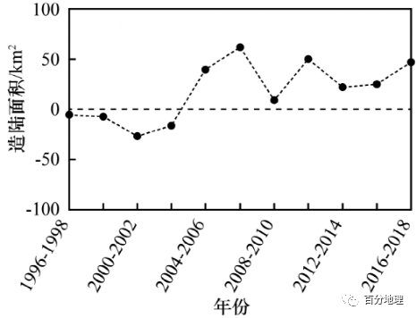

# 微专题之074 从产业结构角度分析区域发展

```
本专题摘自“百分地理”公众号，如有侵权请告之删除，谢谢。联系hhwxyhh@163.com
```

------
   
一、单选题   
（2021·内蒙古·包头市第四中学高二期中）钱塘江位于长江干流以南，含沙量小，仅为长江的35％。近5000年来，钱塘江河口（下图）在径流、潮流和洋流的共同作用下，岸线不断向海延伸。1950年以来，人们在钱塘江河口围垦滩涂。据此完成下面小题。   
   
   
   
1．下列月份中，钱塘江河口径流与潮流冲淤平衡点向海洋方向偏移最明显的是（  ）   
A．3月   
B．6月   
C．9月   
D．12月   
2．钱塘江河口围垦滩涂规模的扩大，将（  ）   
A．降低河口水体盐度   
B．增强径流对南岸的破坏   
C．减缓岸线向外推移   
D．改善河口航道水深条件   
<span style="color: rgb(255, 0, 0);">1．B当河流作用大于海流作用时，冲淤平衡点向海洋方向偏移，且河流作用越强，偏移方向越明显。根据中国雨带移动的规律，6月份左右位于长江流域，此时降水量最多，河流的径流量最大，河流的作用最强，冲淤平衡点向海洋方向偏移的方向越明显。B正确</span>   
<span style="color: rgb(255, 0, 0);">2．D大规模围垦滩涂，会导致河口地区湿地面积减少，淡水注入减少，导致盐度增加，A错；将会减少径流对南岸的破坏和加速岸线向外推移，B、C错误；挖掘河口泥沙围垦滩涂，有利于改善河口航道水深条件，D正确。</span>   
（2022·山东·淄博市淄川区般阳中学高二期中）小浪底水库2002年开始的调水调沙，改变了进入黄河口的水沙条件，引起尾闾河道（尾闾河道指河流水沙入海的最后通道）地貌的显著变化。图示意黄河尾闾河道（山东利津到入海口河段）主槽2001～2017年年冲淤量（正值表示淤积，负值表示冲刷）及累积冲淤量变化，右图示意2001年、2006年黄河尾闾河道纵剖面，2006年以后河道纵剖面变幅很小。据此完成下面小题。   
   
   
   
3．2001～2017年，黄河尾闾河道（  ）   
A．2006年以后基本实现冲淤平衡   
B．冲刷明显，累积冲刷量52.4×106m3   
C．累积冲淤量变化可分为4个阶段   
D．调水调沙初始4年冲淤量占总冲淤量的70%   
4．与2001年相比，2006年黄河尾闾河道（  ）   
①主槽河床的高程较低②入海口水位明显降低③河床冲淤的差值较大④利于泥沙参与三角洲前缘塑造   
A．①④   
B．②③   
C．②④   
D．①③   
<span style="color: rgb(255, 0, 0);">3．A读左图可知，2006年之后，从各年冲淤量看，基本在零刻度线附近，说明各年的淤积量与冲刷量大体相当，而从累积冲淤量看，大致保持在一个较稳定的状态，而且由材料可知2006年以后河道纵剖面变幅很小，这都说明2006年以后基本实现了冲淤平衡，因此A正确；如果冲刷明显，从各年冲淤量看，应该在零刻度线以下更多、更大，且累积冲淤量数值也应该越大，但从图中不能反映出这一点，因此排除B；从图可以看出累积冲淤量变化应该分两个阶段，2006年之前冲刷明显，2006年之后基本实现冲淤平衡，因此C错误；调水调沙是从2002年开始的，初始4年的总冲淤量估计在56×10<sup>6</sup>m<sup>3</sup>，累积冲浪量大约在62×10<sup>6</sup>m<sup>3</sup>，占比在90%左右，因此D错。故正确答案是A</span>   
<span style="color: rgb(255, 0, 0);">4．D读右图2001年、2006年黄河尾闾河道纵剖面，可知2006年河床高程较2001年较低，因此①正确；黄河尾闾河道指的是从山东利津到入海口河段，距利津最远处应该是入海口，读图可以看出2006年河床高程相比2001年没有明显降低，因此②错；读左图，比较2001年和2006年的年冲淤量都是正值且相差较大，因此③正确；读图知2006年黄河尾闾河道河床纵向坡降减小，流速会降低，利于泥沙沉积在尾闾河道内，而不利于泥沙在河流入海口处沉积形成三角洲，因此④错误。综上所述，故正确答案是D。</span>   
（2022·福建省连城县第一中学高三阶段练习）河口三角洲的冲淤变化受河流的水沙运动与海洋动力等因素影响。2002年小浪底水库开始进行调水调沙实验，通过人工调控洪水，在短时间内将大量水沙集中输送入海，影响入海口陆地面积变化。下图示意1996-2018年黄河入海口造陆面积变化。据此完成下面小题。   
   
   
   
5．1996-2018年黄河入海口海岸线（  ）   
A．持续向陆地蚀退   
B．先向陆地蚀退，后向海洋推进   
C．持续向海洋推进   
D．先向海洋推进，后向陆地蚀退   
6．推测万家寨、三门峡、小浪底等水库联合调水调沙的起始时期是（  ）   
A．2004-2006年   
B．2006-2008年   
C．2008-2010年   
D．2010-2012年   
<span style="color: rgb(255, 0, 0);">5．B读图可知，1996-2004年黄河入海口造陆面积变化为负值，即陆地面积减小，说明海岸线向陆地蚀退，2004-2018年黄河入海口造陆面积变化为正值，即陆地面积增大，说明海岸线向海洋推进。因此可知，1996-2018年黄河入海口海岸线先向陆地蚀退，后向海洋推进，ACD错误，B正确。故选B</span>   
<span style="color: rgb(255, 0, 0);">6．A由材料可知：“2002年小浪底水库开始进行调水调沙实验，通过人工调控洪水，在短时间内将大量水沙集中输送入海”，2002年后黄河入海口泥沙含量开始增加，之后造陆面积变化由负变为正，到了2004-2006年，陆地面积增加最多，说明由小浪底单一水库转为万家寨、三门峡、小浪底等水库联合调水调沙，效果最为显著，结合选项判断，万家寨、三门峡、小浪底等水库联合调水调沙的起始时期是2004-2006年，A正确，BCD错误。故选A</span>   
（2022·江苏泰州·高二期末）河段的冲淤量是输入沙量和输出沙量的差值。尾闾河道是河流水沙入海的最后通道。1999年小浪底水库下闸蓄水，2002年开始实施调水调沙，进入黄河下游及尾闾河道的水沙量受人工调控，显著影响了尾闾河道和河口海岸地区的地貌演变。下图为2001～2017年黄河尾闾河道年冲淤量及累积冲淤量变化。据此完成下面小题。   
   
   
   
7．关于黄河尾闾河道年冲淤变化，下列说法正确的是（  ）   
A．2017年时，河道淤积最明显   
B．2002～2005年冲淤速率最大   
C．2015～2016年河道冲刷明显   
D．2006～2014年冲淤速率最大   
8．随时间推移，水流对下游河道的冲刷效果明显下降，推测其原因（  ）   
A．细泥沙被冲刷后，河底残留物质较粗   
B．水流挟沙增加，对河床的冲刷能力减弱   
C．修建水库，径流减少使冲刷能力减弱   
D．泥沙淤积，河床抬高，水动力条件变差   
<span style="color: rgb(255, 0, 0);">7．B结合图：可知2017年时，年冲淤量为负值，表明河道冲刷明显，A错误；2002～2005年累积冲淤量变化最大，表明冲淤速率最大，B正确；2015～2016年，年冲淤量为正值，表明河道淤积明显，C错误；2006～2014年累积冲淤量变化较2002～2005年累积冲淤量变化小，表明2006～2014年冲淤速率较2002～2005年冲淤速率小，D错误；故选B</span>   
<span style="color: rgb(255, 0, 0);">8．A结合所学知识：随时间推移，下游河床较细泥沙最容易被冲刷掉，河底残留物质较粗，不易被带走，导致水流对下游河道的冲刷效果明显下降，A正确；随时间推移，水流挟沙能力减弱，对河床的冲刷能力减弱，B错误；修建水库，调节水库下游河流水量的季节变化，丰水期径流减少，枯水期径流增加，C错误；结合图可知，图示年累积冲淤量为负值，根据冲淤量=输入沙量-输出沙量，可知输出沙量多，以冲刷为主，而不是淤积，D错误；故选A</span>   
（2022·山东青岛·二模）黄河下游孟津至高村河段为典型的游荡段，长约284km，游荡段平面上在较长范围内呈宽窄相间的藕节状，具有水流“宽浅散乱”，主流摆动频繁、河槽易淤善冲等演变特点。下图示意黄河全下游及游荡段累计冲淤量变化（冲淤量=淤积量－冲刷量）。据此完成下面小题。   
   
   
   
9．该游荡段滩岸的土体特点是（  ）   
A．黏粒含量小、抗蚀能力强   
B．黏粒含量大、抗蚀能力强   
C．黏粒含量小、抗蚀能力弱   
D．黏粒含量大、抗蚀能力弱   
10．推断1986-1999年该游荡段出现冲淤变化的主要因素是（  ）   
A．降水量   
B．植被   
C．含沙量   
D．人类活动   
11．1999-2016年，该游荡段断面形态趋向（  ）   
A．宽深   
B．窄深   
C．宽浅   
D．窄浅   
<span style="color: rgb(255, 0, 0);">9．C结合材料分析，该游荡段水流“宽浅散乱”，主流摆动频繁、河槽易淤善冲，说明滩岸的土体黏粒含量小，土质疏松，抗侵蚀能力弱，汛期时河流水位上涨，滩岸冲刷严重，河流含沙量大，汛期结束后水位下降，泥沙大量淤积，主流摆动频繁。故选C</span>   
<span style="color: rgb(255, 0, 0);">10．D读图分析，1986年龙羊峡水库运行，之后1986-1999年累计冲淤量呈上升趋势，说明黄河下游淤积量大于冲刷量，主要原因是龙羊峡水库运行后，控制了汛期下游的水量，使黄河冲刷侵蚀能力减弱，汛期过后泥沙大量淤积，从而导致淤积量大于冲刷量，D正确；材料信息不能反映出降水量和植被的变化情况，AB错误；黄河下游的泥沙主要来自中游的黄土高原，龙羊峡水库位于上游，对黄河下游的含沙量影响不大，C错误。故选D</span>   
<span style="color: rgb(255, 0, 0);">11．B读图分析，1999年黄河小浪底水库运行，之后1999-2016年累计冲淤量呈下降趋势，说明小浪底水库运行后调水调沙使黄河下游冲刷量大于淤积量，该游荡段断面形态趋向窄深，河道趋于稳定，B正确，ACD错误。故选B</span>   
（2022·山东·肥城市教学研究中心模拟预测）河流泥沙的淤积量与冲刷量之间的差值一般称为冲淤量（为正值，代表淤积大于冲刷；为负值，代表冲刷大于淤积）。如下图示意长江口不同水深、不同时间段冲淤量的变化。据此完成下面小题。   
   
   
   
12．2002～2010年，长江口冲淤量变化的主要原因是（  ）   
A．三峡等库坝拦蓄泥沙   
B．入海径流量大幅减少   
C．枯水期输沙能力减弱   
D．流域内植被覆盖减少   
13．未来，-5m的水深线可能会（  ）   
A．向北岸方向移动   
B．向南岸方向移动   
C．向海洋方向移动   
D．向陆地方向移动   
<span style="color: rgb(255, 0, 0);">12．A根据图中信息可知，在该时段冲淤量大大减小以致数值小于零说明淤积量小于冲剧侵蚀量，流域内植被覆盖减少会加剧区域的水土流失使河流含沙量大大上升，进而使得淤积量增大，D错误；入海径流量大幅减少，输沙能力减弱，均会加剧河流泥沙的淤积，BC错误；三峡等库坝拦蓄泥沙，会减少库区下游的河流含沙量，从而减少了淤积，A正确，所以选A</span>   
<span style="color: rgb(255, 0, 0);">13．D根据图中信息，0m到-5m水深范围，在2010- 2015时间段内的冲淤量接近于0，与前期相比冲淤量呈减小趋势，从而可以推测在一定时间段内，淤积减弱，冲刷增强，即侵蚀加剧，导致-5m水深线向陆地移动，D正确，C错误；根据图文信息无法判断是向南岸还是向北岸移动，AB错误，所以选D</span>   
（2016·全国·高考真题）某河流位于浙江东部，下游河床受径流与潮汐共同影响：枯水期，以潮流带来的泥沙淤积为主；汛期，上游下泄的径流冲刷河床。图示意该河下游某地1962年两个时期河床断面形态，其中，甲是河床最低时期的河床断面。1964年在该河上游建成水库；2000年，在该河河口建成大型水闸。据此完成下列小题。   
   
   
   
14．河床断面形态从甲至乙的变化过程发生在   
A．1——3月   
B．3——6月   
C．6——9月   
D．9——12月   
15．水库竣工后，水库下游河流   
A．径流量增大   
B．河道淤积   
C．流速加快   
D．河床展宽   
16．在该河河口修建大型水闸的主要作用是   
A．切断潮流泥沙补给   
B．加速汛期洪水下泄   
C．提高潮流冲淤能力   
D．拦截河流入海泥沙   
<span style="color: rgb(255, 0, 0);">14．D由材料可知。甲时河床最低，侵蚀为主，应该为当地汛期；乙时河床抬高，为枯水期，淤积为主，河床抬高；有甲到乙，应该是由汛期过后到枯水期的过程，结合该地位于我国的浙江，答案选D</span>   
<span style="color: rgb(255, 0, 0);">15．B水库建成后，由于水库蓄水，导致汛期下游水量减少，流速减慢，径流的冲刷力度减小，淤积加重，河床抬高。故选B</span>   
<span style="color: rgb(255, 0, 0);">16．A水库修建后导致下游河道淤积加重，再加上潮流带来的泥沙，使河口泥沙大量淤积，大型水闸修建在河口，是为了拦截潮流，切断潮流泥沙补给。故选A</span>   
17.（2021·上海普陀·二模）近5000年来，钱塘江河口在径流、潮流的共同作用下，岸线不断向海延伸。一年中，钱塘江河口径流与潮流冲淤平衡点向海洋方向偏移最明显的时间是（  ）   
   
   
   
A．3月   
B．6月   
C．9月   
D．12月   
<span style="color: rgb(255, 0, 0);">17.B6月受东南季风影响，降水最多，泥沙流失多，在河口堆积作用加强，河口径流与潮流冲淤平衡点向海洋方向偏移最明显。B正确，ACD错误，故选B</span>   
（2021·安徽滁州·二模）香溪河是三峡库区的重要支流，三峡水库蓄水后，过去冲淤平衡的香溪河河口段大幅淤积，有可能形成拦门沙坎。为减少泥沙淤积，又能充分发挥水库的防洪作用，三峡水库采用蓄清排浑模式，并与上中游水库进行联合调度，目前香溪河口处泥沙淤积速度显著下降。下图为2015年7月香溪河河口处及以上河段含沙量分布图。据此完成下面小题。   
   
   
   
18．香溪河含沙量空间分布特点的形成原因是（  ）   
A．河流流速加快，含沙量增大   
B．干流水位较高，倒灌入支流   
C．河口处谷地狭窄，排水不畅   
D．河口处流量较大，含沙量大   
19．三峡工程蓄水前的香溪河河口处（  ）   
A．全年侵蚀作用较弱   
B．全年沉积较为缓慢   
C．汛期淤积，枯水期侵蚀   
D．汛期侵蚀，枯水期淤积   
20．目前香溪河河口处淤积速度减慢是由于（  ）   
A．汛期水库拦截洪峰   
B．非汛期蓄水，泥沙沉积   
C．汛期大水量排浑   
D．长江上游水库拦截泥沙   
<span style="color: rgb(255, 0, 0);">18．B三峡水库蓄水后，干流水位较高，香溪河作为支流流速减慢，A错误； 由图可知，香溪河河口段含沙量向上游减少，可推测河口处泥沙主要来自干流的倒灌，B正确；河口处不是谷地，C错误；河口处含沙量大，但是与流量关系不大，D错误。故本题选B</span>   
<span style="color: rgb(255, 0, 0);">19．C蓄水前香溪河口处冲淤平衡是由于汛期时干流水位高，香溪河排水不畅，泥沙在河口处淤积；枯水期时干流水位低，香溪河流速快，泥沙被侵蚀搬运，故C正确；ABD错误。故本题选C</span>   
<span style="color: rgb(255, 0, 0);">20．D上游水库可以大量拦截泥沙，减少三峡入库泥沙，进而减少进入支流的泥沙量，使河口处淤积速度下降，D正确；汛期拦截洪峰、非汛期蓄水，都会抬高水库水位使香溪河因更难排水而加重淤积，AB错误；大水量排浑只能排出库区泥沙，难以减少支流上游的泥沙，C错误。故本题选D</span>   
（2022·江苏·模拟预测）河段的冲淤量是输入沙量和输出沙量的差值。黄河干流内蒙古段按水文站可划分为三段：石一巴河段、巴一三河段、三一头河段，   
该河段冲刷的临界水沙条件大致在洪水期平均流量>2000m3/s，含沙量<10kg/m3.河道的冲淤调整主要发生在汛期，1987年以来，上述河段汛期水沙量占全年比例均大量减少。左图为黄河干流内蒙古段示意图，右图为黄河干流内蒙古各河段多年平均冲淤量变化统计图。据此完成下面小题。   
   
   
   
21．推断黄河干流内蒙古段冲淤量达到最大的年份大致是（  ）   
A．1979年   
B．1989年   
C．1999年   
D．2009年   
22．1973-2017年黄河干流内蒙古段（  ）   
A．石一巴河段冲淤状况与水沙量关联明显   
B．巴一三河段先冲刷后淤积   
C．三一头河段冲淤变化与汛期流量正相关   
D．全河段先冲后淤最后平衡   
23．影响石巴河段冲淤状况最主要的原因是（  ）   
A．河道采沙增加   
B．河段落差较大   
C．水利枢纽建设   
D．河流补给减少   
<span style="color: rgb(255, 0, 0);">21．D河段的冲淤量是输入沙量和输出沙量的差值。通过计算可知，2010－2017年为0左右，说明冲淤达到平衡，故黄河干流内蒙古段冲淤量达到最大的年份大致是2009年。故选D</span>   
<span style="color: rgb(255, 0, 0);">22．D该河段冲刷的临界水沙条件大致在洪水期平均流量&gt;2000m<sup>3</sup>/s，含沙量&lt;10kg/m<sup>3</sup>，从图中可以看出，1973-2017年黄河干流内蒙古段石一巴河段冲淤明显，说明其与水沙量关联小，A错误；巴一三河段先冲刷后淤积再冲刷，B错误；三一头河段冲淤明显小于全河段冲淤量，说明与汛期流量不呈正相关，C错误；全河段先冲后淤最后平衡，D正确。故选D</span>   
<span style="color: rgb(255, 0, 0);">23．C石巴河段冲淤量为正值，说明淤积严重，河道采沙增加、河段落差较大、河流补给减少淤积量都应减少，ABD错误；水利枢纽建设使水流速度减慢，淤积量增加，C正确。故选C</span>   
（2022·贵州毕节·三模）历史上黄河下游以“多淤善徙”著称、入海口频繁改道，河流与海潮的冲淤变化不断改变三角洲形态。1976年，人工将入海通道由刁口河改为清水沟，但原刁口河河道仍以0.8～2.0cm／年的平均速率不断沉积，且沉积物厚度自下游向上游递减。下图示意黄河、刁口河、清水沟位置，据此完成问题   
   
   
   
24．不属于黄河下游河道曾经“多淤善徙”的主要原因（  ）   
A．流经黄土高原，河流含沙量大   
B．下游径流量大，侵蚀作用强   
C．下游流速慢，河床淤积速度快   
D．下游河床淤积，易决口改道   
25．刁口河河道废弃后仍不断沉积，且沉积物厚度自下游向上游递减的主要原因（  ）   
A．黄河依然向刁口河输送泥沙   
B．刁口河上游受黄河侵蚀加剧   
C．海潮沿刁口河河道上溯沉积   
D．刁口河河口受海潮侵蚀加剧   
26．1976年后，关于河口附近海岸线变化的推测正确的是（  ）   
A．清水沟流量增大，河流沉积增强，海岸线向海洋推进   
B．清水沟流量增大，海潮侵蚀增强，海岸线向陆地退缩   
C．刁口河流量减少，海潮沉积减弱，海岸线向陆地退缩   
D．刁口河流量减少，河流侵蚀减弱，海岸线向海洋推进   
<span style="color: rgb(255, 0, 0);">24．B“多淤善徙”说明黄河下游淤积严重，改道频繁，主要原因是泥沙含量大，流速慢，河床淤积速度快，易抬升为地上河，水位变化不定，易发生决堤改道事件。因此黄河流经黄土高原，导致流含沙量大，A选项排除。下游以沉积作用为主，B选项正确。下游流速慢，河床淤积速度快，易决口改道，C、D选项排除。故选B</span>   
<span style="color: rgb(255, 0, 0);">25．C刁口河河道废弃后仍不断沉积，且沉积物厚度自下游向上游递减，说明河道泥沙主要源于海洋，受风力影响，含沙量较高的海浪不断上溯，且越往下游，接受的沉积物越多，厚度越大，因此使由于海潮沿刁口河河道上溯沉积而成，C选项正确。黄河依然向刁口河输送泥沙，不会造成沉积物厚度自下游向上游递减，A选项错误。刁口河河道已经废弃，与其上游受黄河侵蚀关系不大，B选项错误。刁口河河道废弃后不断沉积而形成大量沉积物，与侵蚀作用无关，D选项错误。故选C</span>   
<span style="color: rgb(255, 0, 0);">26．A1976年，人工将入海通道由刁口河改为清水沟，说明清水沟流量增大，刁口河流量减少。清水沟流量增大，会使河流沉积作用增强，海潮侵蚀减弱，海岸线向海洋推进，A选项正确，B选项错误。刁口河流量减少，河流侵蚀减弱，海潮侵蚀增强，海岸线向陆地退缩，C、D选项错误。故选A</span>   
（2022·福建宁德·三模）水库的使用及泥沙的冲淤都会影响河流水位变化。下图为我国某河流两个水文站1950——2020年洪水位变化统计围。1957年，该河一大型水库投入使用。近年来，随着流域的治理。当地生态环境不断改善。据此完成下面小题。   
   
   
   
27．两水文站与水库的位置，由上游到下游依次是（  ）   
A．甲水文站-乙水文站-水库   
B．甲水文站-水库-乙水文站   
C．水库-甲水文站-乙水文站   
D．乙水文站-水库-甲水文站   
28．水库的建设造成（  ）   
A．甲水文站泥沙淤积减少   
B．乙水文站泥沙淤积减少   
C．甲水文站洪水水位降低   
D．乙水文站洪水水位抬高   
<span style="color: rgb(255, 0, 0);">27．A阅读图文材料，结合所学知识可知，甲水文站随着时间的推移，洪水位逐渐下降，但是2000-2020年平均洪水水位依然在384m，而乙水文站虽然逐年升高，但2000-2020年平均洪水水位大致为339m，因此甲水文站海拔高于乙水文站，甲位于乙水文站属于上游，故D错误；乙水文站平均洪水水位逐渐上升，材料显示该区域内生态环境改善，证明之前生态环境较差，水土流失较为严重，导致乙水文站泥沙淤积，水库具有减少下游泥沙淤积的功能，而乙水文站在修建水库之后，水位在上升，说明泥沙淤积并未受水库影响，因此水库位于乙水文站下游，故B错误；再结合之前解析，甲水文站在乙水文站上游，所以由上游到下游顺序应为甲水文站-乙水文站-水库，故A正确，C错误。答案选择A</span>   
<span style="color: rgb(255, 0, 0);">28．D结合题1结论，水库的建设距离甲水文站较远，因此对甲水文站的影响很小，故AC不选；水库可以拦截水流，导致河流水流变缓，泥沙沉积，下游泥沙减少，但不能减少上游泥沙，故B不选；图中乙水文站洪水位有所上升，且乙水文站位于水库上游，而水库的修建导致其上游一定区域内水位抬高，故D正确。答案选择D</span>   
（2022·广东深圳·模拟预测）钱塘江河口段（澉浦以西）河床地貌受径流与潮流共同影响。4～11月河床冲淤变化明显，4～7月径流量占全年70％，12～次年3月河床保持稳定。杭州湾（澉浦以东）为喇叭状的三角湾，长期以来，北岸受到冲刷侵蚀，南岸不断淤积。下左图示意钱塘江河口，下右图示意钱塘江河口段上游和下游1997年4～7月和7～11月沿程冲淤量。据此完成下面小题。   
   
   
   
29．钱塘江河口段上游和下游河床最低的月份分别是（  ）   
A．7月、7月   
B．11月、7月   
C．11月、11月   
D．7月、11月   
30．7～11月钱塘江河口段上游和下游河床变化及成因是（  ）   
①上游冲刷，下游淤积②上游淤积，下游冲刷③涨潮输沙量大于落潮输沙量④落潮输沙量大于涨潮输沙量   
A．①③   
B．①④   
C．②③   
D．②④   
31．杭州湾北岸容易遭受侵蚀的主要影响因素是（  ）   
A．地壳运动   
B．海陆轮廓   
C．地转偏向力   
D．人类活动   
<span style="color: rgb(255, 0, 0);">29．D读图可知，上游河床4－7月受冲刷作用,7月河床最低；下游河床7－11月受冲刷作用,11月河床最低，D正确，ABC错。故本题选D</span>   
<span style="color: rgb(255, 0, 0);">30．C由图文资料可知，7－11月钱塘江河口段冲淤规律是上游淤积，下游冲刷，①错，②正确；钱塘江河口段“4～7月径流量占全年70％”，故7－11月是枯水期,以潮流作用为主,涨潮输沙量大于落潮输沙量造成上游淤积,下游冲刷，③正确，④错。故本题排除ABD三项，选C</span>   
<span style="color: rgb(255, 0, 0);">31．C杭州湾潮流作用强,涨潮时受地转偏向力影响,潮流右偏,对北岸冲刷作用强,造成北岸侵蚀,南岸沉积，C正确，这种偏向的差异与地壳运动、海陆轮廓、人类活动等关系不大，故排除ABD三项。因此本题选C</span>   
（2022·江西·兴国中学二模）尾闾河道是河流水沙入海的最后通道。如图示意2001——2017年黄河尾闾河道年冲淤量及累积冲淤量变化。据此完成下列各题。   
   
   
   
32．黄河尾闾河道河床下降最明显的时段是（  ）   
A．2001——2003年   
B．2005——2007年   
C．2009——2011年   
D．2014——2016年   
33．推测2002年黄河冲淤量变化的主要原因是（  ）   
A．植树造林   
B．调水冲沙   
C．降水减少   
D．用水增加   
<span style="color: rgb(255, 0, 0);">32．A根据所学可知，冲淤量=淤积量—冲刷量，故冲淤量为正，以淤积为主；反之，冲淤量为负，以冲刷为主。读图可知，2001——2003年年冲淤量为负值最大，说明此时冲刷最严重，河床下降最明显，A正确，BCD错误。故选A</span>   
<span style="color: rgb(255, 0, 0);">33．B由图可知，2002年黄河冲淤量突然减少很大，表明冲刷很严重，植树造林有可能使河流含沙量减少，由淤积转为冲刷，但树木生长周期较长，不可能一年中就发挥出涵养水源，保持水土的成效，A错误；调水冲沙可以在短期内见成效，B正确；降水减少，可以使河流的含沙量减少，淤积量减少，但同时河流水量减少，冲刷能力也会减少，因此冲淤量不会有大的变化，C错误；同理，用水增加使河流水量减少，冲刷能力减少，也不会使河流的冲淤量减小，D错误。故选B</span>   
（2022·广东省东源中学模拟预测）S、T水文观测站之间的黄河河段全长约670km,大体由西向东流。据多年观测数据表明,S站观测到的最高水位约1092m,T站观测到的最高水位约991m。下图示意T站附近1987、2006、2010和2014四个年份的河床剖面,说明黄河该河段河床冲淤变化及河床最低点持续右移。”据此完成下面小题。   
   
   
   
34．黄河该河段位于（  ）   
A．华北平原   
B．黄土高原   
C．内蒙古高原   
D．青藏高原   
35．图中示意2010年T水文观测站附近河床断面形态的是（  ）   
A．甲   
B．乙   
C．丙   
D．丁   
36．揭示黄河该河段河床冲淤变化有助于当地政府制定（  ）   
①积极发展河运的政策   
②河堤护岸工程规划   
③防洪抗险的应急预案   
④开发水电站的方案   
A．①②   
B．②③   
C．③④   
D．①④   
<span style="color: rgb(255, 0, 0);">34．C根据图中的海拔高度判断，不可能是华北平原（海拔50米左右）和青藏高原（平均海拔4000米左右），AD错误；根据材料，图示地区是自西向东流的河段，因此不位于黄土高原（在该地形段自北向南流），B错误。从海拔高度和河流流向可判断位于内蒙古高原，C正确。故选C</span>   
<span style="color: rgb(255, 0, 0);">35．D根据材料“下图示意T站附近1987、2006、2010和2014四个年份的河床剖面,说明黄河该河段河床冲淤变化及河床最低点持续右移”并结合图示可知，甲为1987年，丙为2006年，丁为2010年，乙为2014年（各年河床最低点如下图）。故选D</span>   
   
   
   
<span style="color: rgb(255, 0, 0);">36．B揭示黄河该河段河床冲淤变化有助于当地政府制定河堤护岸工程规划和防洪抗险的应急预案，②③正确。黄河河流该段水量较小，河床较浅，不利于河运，该段地河流地势较平坦，水量小，水能也不丰富，因此揭示黄河该河段河床冲淤变化不是为了帮政府制定积极发展河运的政策和开发水电站的方案。①④错误。综上所述，ACD错误，B正确。故选B</span>   
第II卷（非选择题）   
二、综合题   
37．（2022·安徽·合肥市第六中学模拟预测）阅读图文材料，完成下列要求。   
崇明岛是我国最大的河口冲积岛，具有辽阔的湿地资源，是亚太地区候鸟迁徙路线上的重要驿站，同时也是上海地区促淤围垦的重点区域之一。1949年以来，崇明岛东滩多次建设围垦堤。围垦区内建有东滩湿地保护区，规划不同湿地类型，对保护鸟类资源产生了积极的作用；围垦区外湿地植被-芦苇、海三棱藨草在新的光滩上生长演替，实现了人与自然的和谐相处。下图示意崇明岛东滩不同年份大堤位置的变化及大堤建设前、后沿海滩涂的变化。   
   
   
   
(1)指出崇明岛东滩大堤位置的扩展方向并分析原因。   
(2)从冲、淤平衡的角度，分析东滩湿地植被对加速崇明岛滩涂发育的作用。   
(3)围垦后，崇明岛东滩新的滩涂不断淤积，推测围垦区外海三棱藨草、芦苇的演替过程。   
(4)分析围垦堤内鸟类数量增加的原因。   
<span style="color: rgb(255, 0, 0);">【答案】(1)扩展方向:大堤位置不断向东.向北移动。原因:崇明岛位于长江入海口,长江径流在崇明岛形成南北支流,受地转偏向力的影响,崇明岛南岸以侵蚀为主,北岸以堆积为主;崇明岛东侧受海水顶托作用明显,泥沙堆积;崇明岛滩涂向北、向东发育较快,故大堤也向北,向东延伸</span>   
<span style="color: rgb(255, 0, 0);">(2)湿地植被可以减缓潮流流速,削弱潮流对滩地的侵蚀作用;湿地植被具有良好的滞沙功能,能够促进泥沙在潮滩附近沉积</span>   
<span style="color: rgb(255, 0, 0);">(3)海滩不断淤积,海三棱薰草群落首先在光滩区生长;植被促淤作用使得潮滩地势抬高,为芦苇生长提供适宜条件;海三棱薰草群落逐步衰退,慢慢被芦苇群落替代;随着滩涂向海洋延伸,海三棱薰草重新在新生的低潮滩涂上生长</span>   
<span style="color: rgb(255, 0, 0);">(4)人工湿地为鸟类提供了更为丰富多样的栖息地;稻田型湿地和鱼塘型湿地增加了鸟类的食物来源;通过自然保护区的管理,鸟类得到了保护</span>   
<span style="color: rgb(255, 0, 0);">【解析】本题以崇明岛东滩位置变化示意图、大堤建成后沿海滩涂变化图为材料，涉及地理空间变化描述及原因、植被的作用及功能、地理环境整体性、湿地的作用及功能等相关内容，考查学生调动和运用相关知识点解决问题的能力（1）从图中可以看到，自1949年至1998年，东滩大堤的位置不断向海洋拓展，其主要拓展方向为不断向东、向北移动.原因：崇明岛位于长江入海口，是长江泥沙与海洋顶托作用而形成的冲积岛，受崇明岛阻挡影响，长江径流形成南北两侧支流，北半球地转偏向力向右侧偏转，受地转偏向力影响崇明岛南岸为侵蚀岸，以侵蚀作用为主，北岸为堆积岸，以沉积作用为主。崇明岛东侧，受海洋顶托作用更为明显，泥沙不断沉积。崇明岛东侧与北侧泥沙不断堆积，滩涂面积逐渐扩大，故崇明岛大堤也不断向北和向东推（2）湿地可以起到涵养水源、维持生物多样性、恢复植被的作用，植被增多可以有效的减缓潮流的作用，减弱潮流流速削弱，潮流对滩涂地的侵蚀破坏作用减轻。湿地植被具有保持水土、滞沙净化、防止水土流失的功能，能够促进泥沙在潮滩附近不断沉积，促进滩涂地的发育（3）从图中可以看到，随着海滩面积的不断扩大，泥沙淤积，海三棱薰草群落首先在光滩区大量生长。伴随滩涂植被的逐渐增多，泥沙淤积，其植被的促淤作用使得滩涂面积进一步扩大，潮滩地势逐渐抬高，为芦苇的生长提供了适宜的条件。随着芦苇种群数量的不断扩张，海三棱薰草群落逐步衰退，逐渐被芦苇群落所替代。伴随着泥沙不断堆积，滩涂继续向海洋不断延伸，在海洋低地附近，海三棱薰草重新在新生的低潮滩涂区生长（4）从图中可以看到围垦堤内逐渐形成芦苇型湿地、鱼塘型湿地和稻田型湿地，随着湿地面积的逐渐扩大，为鸟类生存与发展提供了广阔的栖息地。稻田型湿地和鱼塘型湿地还可为鸟类增加食物来源，促进其种群繁殖与壮大。围垦堤内人类活动不断增多，加强了对围垦地内湿地的保护，通过建设围垦堤内的自然保护区，鸟类得到了充分的保护，种群数量得以不断壮大</span>   
38．（2022·湖南省岳阳县第一中学高二阶段练习）阅读图文材料，回答下列问题。   
1.5亿年前“燕山运动”使洞庭湖所在地区发生地质断裂，强烈下陷形成盆地，积水成湖。历史上早期湖高江低，湖水由南向北流，在石首一带注入长江。汉晋以后，长江流域人口逐渐增长，人类活动影响加大，洪水期江高湖低，大量洪水从荆江段进入洞庭湖，开始出现“八百里洞庭”。近现代以来，洞庭湖形成了北纳长江太平、藕池、松滋三口来水，南和西接湘、资、沅、澧等支流，再由城陵矶注入长江的江湖格局，且由于自然和人为因素，洞庭湖逐渐萎缩，面积减小，湖区洪涝灾害多发。三峡水库修建并蓄水后，洞庭湖洪涝灾害减轻。（注：荆江是指从湖北枝城至湖南城陵矶的长江河段）。   
   
   
   
(1)简述汉晋以后“八百里洞庭”的成因。   
(2)分析近代洞庭湖面积减小的原因。   
(3)有专家认为，三峡水库修建并蓄水后，荆江河段冲淤平衡被打破，这对荆江和洞庭湖区防洪有利，请解释这种说法的合理性。   
<span style="color: rgb(255, 0, 0);">【答案】(1)历史上随着长江流域人口逐渐增长，垦殖活动强度增大，植被受到破坏，长江含沙量增大；荆江河段由于地势起伏小，河流流速慢，河床泥沙淤积；荆江河床抬升，洪水水位也随之抬升，洪水期江水冲击南岸，形成溃口，大量长江洪水进入到洞庭湖，使洞庭湖明显扩涨</span>   
<span style="color: rgb(255, 0, 0);">(2)洞庭湖接纳湘、资、沅、澧四水以及长江上游的来水来沙，泥沙大量淤积；人们破坏了洞庭湖支流及长江干流中上游山区植被，使山区水土流失加重，河流含沙量增加，湖区泥沙淤积加重；湖区人们围湖造田，直接使湖泊面积变小</span>   
<span style="color: rgb(255, 0, 0);">(3)三峡水库蓄水后，上游来泥沙在库区沉积，水库库区附近下游河道由于来沙减少且流速加快，荆江河段冲淤平衡被打破，河道冲刷，使荆江洪水期水位相对较低些，利于蓄洪；由三口进入到洞庭湖的泥沙减少，洞庭湖的有效容积增加，利于蓄洪</span>   
<span style="color: rgb(255, 0, 0);">【解析】本题考查湿地的保护等相关知识，考查学生获取与解读地理信息、调动和运用地理知识的能力，落实区域认知、综合思维、人地协调观等学科核心素养（1）注意材料信息“汉晋以后，长江流域人口逐渐增长，人类活动影响加大，洪水期江高湖低，大量洪水从荆江段进入洞庭湖，开始出现八百里洞庭”。所以八百里洞庭的解释关键在于荆江河段洪灾多发，洪水决口导致湖泊水域扩张。汉晋以后，长江流域人口逐渐增长，人们对耕地的需求增大，大面积植被砍伐开垦耕地，导致长江中上游流域水土流失加大，而荆江河段地势较平坦，河流流速慢，搬运能力较弱，大量泥沙淤积导致河床升高，所以洪水期呈现出“江高湖低”的水位格局。洪水期河流的侵蚀能力强，冲积南岸导致河口溃决，洪水蔓延注入洞庭湖，湖面急剧扩大，形成八百里洞庭湖（2）注意材料信息“且由于自然和人为因素，洞庭湖逐渐萎缩，面积减小”。所以湖泊面积减小受自然和人为双重的影响。结合材料信息可知，洞庭湖南部和西部接湘、资、沅、澧等支流，这些河流携带泥沙入湖淤积，导致湖泊面积萎缩。同时，洞庭湖北纳长江太平、藕池、松滋三口来水，洪水期长江补给洞庭湖，而长江干流中上游山区植被受人类活动破坏，水土流失加剧，河流含沙量增加，在洪水期补给湖泊的过程中携带泥沙入湖沉积。另外，人们在洞庭湖区围湖造田，不断向湖泊索取耕地，也导致湖泊面积萎缩（3）荆江是指从湖北枝城至湖南城陵矶的长江河段，结合图示信息可知，三峡水库位于荆江河段以及洞庭湖的上游地区。由于三峡水库的建设，大量上游来沙在库区淤积，导致荆江河段的来沙量大幅度减少，同时，受水库蓄水抬升水位的影响，荆江河段的水速加快，侵蚀能力加强，所以荆江河段河槽更易遭受流水侵蚀而加深，洪水位下降，河道蓄洪能力提高，洪灾减轻。对于洞庭湖而言，三峡水库蓄水，长江自太平、藕池、松滋三口进入洞庭湖的泥沙减少，使得洞庭湖的有效容积增加，蓄洪能力增强，有利于防止洪灾</span>   
39．（2022·湖南·高三阶段练习）阅读图文材料,完成下列要求。   
洞庭湖（吞吐型湖泊）与江河相通,其生命的兴衰与水沙过程密切相关。近几十年来,长江中上游干流历经了荆江调弦口堵口、下荆江系统裁弯、葛洲坝截流、三峡水库蓄水运用等水工程的运行,湘、资、沅、澧四河流中.上游兴建了一大批大中型水库，湖区治湖工程建设如火如荼。湖盆冲淤变化率是指水体实际含沙量与水体挟沙能力的比值,其大小反映了潮盆冲淤状态。合理的水沙搭配使湖盆不冲不淤或者在一定时段内达到相对平衡。以前洞庭湖湖盆冲淤变化率较大,而如今经过疏浚河道、拆除部分水库、裁弯取直工程和合理调控湖区用水量等一系列的流域治湖措施,洞庭湖湖盆冲淤变化率较小。下图示意洞庭湖流域。   
   
   
   
(1)分析近几十年来洞庭湖流域水利工程对洞庭湖区环境可持续发展的有利影响。   
(2)以前受人类活动和自然环境的共同影响,洞庭湖湖盆冲淤变化率较大，试分析其原因。   
(3)说明如今流域治湖措施对洞庭湖湖盆冲淤变化率减小所起到的改善作用。   
<span style="color: rgb(255, 0, 0);">【答案】(1)洪水期入湖水沙量减少，减轻洞庭湖区的防洪抢险压力和发生洪涝灾害的风险，延缓泥沙淤积速率；整体上枯水期入湖水量减少,泥沙淤积减少,利于延长洞庭湖的寿命（或减缓洞庭湖的萎缩）等</span>   
<span style="color: rgb(255, 0, 0);">(2)流域人口增多,城市密集且规模扩大，生活生产需水量增大，补给湖泊的水量减少,使洞庭湖的入水量小于出水量,湖泊整体水量减少;加之受上游水库等水利工程的影响.该地河湖水流流速减缓.流水侵蚀和搬运能力减弱,最终使得水体挟沙能力降低;洞庭湖各类洲滩发育扩展,水生植物滋生蔓延,植被洲滩阻流促淤,导致湖水水体实际含沙量较大;湖盆底部淤高,形态改变.湖内水沙条件改变,湖泊水动力减弱</span>   
<span style="color: rgb(255, 0, 0);">(3)疏浚河道有利于排沙,减少水体含沙量;拆除部分水库等水利工程和裁弯取直有利于加快河湖水流流速,使水体挟沙能力变强;合理调控河湖地区人类活动的用水量,可以促使河湖整体水量增加，水体挟沙能力变强</span>   
<span style="color: rgb(255, 0, 0);">【解析】本大题以洞庭湖为材料设置试题，涉及水利工程对环境的影响和湖泊冲淤的原因及对环境的影响等相关内容，考查学生获取和解读地理信息能力；调动和运用知识、基本技能能力；描述和阐释地理事物、地理基本原理和规律能力。考察学生人地观念、综合思维、区域认知素养（1）根据材料近几十年来，长江中上游干流历经了荆江调弦口堵口、下荆江系统裁弯、葛洲坝截流、三峡水库拦蓄上游洪水，拦洪错峰。同时通过其他四河流中上游兴建水库，湖区治湖工程建设如火如荼，使入湖水沙量减少，减少湖床的泥沙淤积 ，增加泄洪能力，使洞庭湖区的洪涝灾害明显减轻，减轻洞庭湖区的防洪抢险压力和发生洪涝灾害的风险，对行洪区及出湖口疏浚，延缓泥沙淤积速率，利于延长洞庭湖的寿命（2）根据材料“湖盆冲淤变化率是指水体实际含沙量与水体挟沙能力的比值，其大小反映了潮盆冲淤状态”。由于流域人口增多，城市密集且规模扩大，生活生产需水量增大，导致入湖水量减少，同时入湖水量小于出湖水量，使得湖泊整体水量减少；结合上题分析可知，由于上游水库等水利工程的修建，整体上入湖水沙量减少。这些因素使该地河湖水量减少，水流速度减缓，流水侵蚀和搬运能力减弱，水体挟沙能力减弱；湖泊水流速度减弱，湖盆底部淤高，形态改变，湖内水沙条件改变，湖泊水动力减弱，各类洲滩发育扩展，水生植物滋生蔓延，植被洲滩阻流促淤，导致湖水水体实际含沙量较大。因此，受人类活动和自然环境的共同影响，洞庭湖湖盆冲淤变化率较大（3）根据上题分析可知，湖水水体实际含沙量较大，水体挟沙能力减弱，洞庭湖湖盆冲淤变化率较大。根据材料“而如今经过疏浚河道、拆除部分水库、裁弯取直工程和合理调控湖区用水量等一系列的流域治湖措施,洞庭湖湖盆冲淤变化率较小”，说明疏浚河道有利于河湖排沙，减少河湖含沙量；拆除部分水库等水利工程和裁弯取直有利于加快河湖水流流速，使河湖水体挟沙能力变强；合理调控河湖地区生产、生活、农业等的用水量，可以促使河湖整体水量增加，水体流速增强，水体挟沙能力变强。这样使洞庭湖水体实际含沙量较小，水体挟沙能力增强，湖盆冲淤变化率减小。</span>