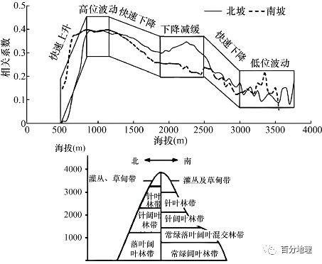
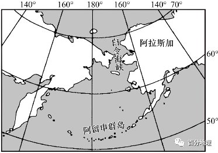
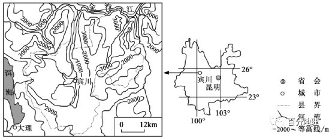

# 微专题之074 从产业结构角度分析区域发展

```
本专题摘自“百分地理”公众号，如有侵权请告之删除，谢谢。联系hhwxyhh@163.com
```

------

（2022·北京·高考真题）苏里南人口约60万，人口构成中有来自中国广东省等地的华裔，中国农历新年是全国性节日之一。该国人均国内生产总值约为7千美元（2020年），工业以铝土矿开采和加工为主，原始森林覆盖率超过90%，2014年已实现二氧化碳零排放。读图完成下面小题。   

   

1．与中国广东省相比，苏里南（  ）   
A．天然植被开发程度更高   
B．同属于热带季风气候区   
C．经济发展水平大体相当   
D．迎来中国农历新年较晚   
2．苏里南（  ）   
A．人口密度北部大于南部   
B．铝土矿开采过程实现二氧化碳零排放   
C．保护区地形以平原为主   
D．北部沿岸地区受寒流的影响形成沼泽   
<span style="color: rgb(255, 0, 0);">1．D依据材料信息：苏里南“原始森林覆盖率超过90%”，因此与中国广东省相比，苏里南天然植被开发程度不高，A错；据图可知，苏里南地处南美北部赤道附近，原始森林覆盖率超过90%，据此可知，该国属于热带雨林气候，B错；广东省是我国经济最为发达的省份，而苏里南“工业以铝土矿开采和加工为主”，经济基础相对薄弱，C错；由图中苏里南所处的经度位置可知，苏里南应属于西4区，理论上比中国广东省（东8区）晚12小时，因此，苏里南迎来中国农历新年较晚，D正确。故选D</span>   
<span style="color: rgb(255, 0, 0);">2．A读图可知，苏里南首都、城镇、机场、公路等主要分布在该国北部，而南部多为河流上游，多沼泽，自然保护区等。说明苏里南人口密度北部大于南部，A正确；铝土矿开采过程需要消耗能源，是二氧化碳排放源，不利于实现二氧化碳零排放，B错；由图可知，自然保护区多位于河流源头，海拔较高，以山地为主，C错；北部沿岸地区有圭亚那暖流（大西洋南赤道暖流的一个分支）流经，D错。故选A</span>   
（2020·全国·高考真题）勘察加火山群位于环太平洋火山带的北端，气候冷湿，火山锥各坡的降水差异小，近几十年来受全球气候变化的影响，火山锥的林线（森林分布上限）升高、雪线（终年积雪下限）有所降低。此外，其他干扰也影响林线和雪线高度。例如，火山喷发彻底破坏原有景观，若干年内该火山锥的林线与雪线高度往往发生显著变化。据此完成下面小题。   
3．一般情况下，与阴坡相比，该地火山锥阳坡的（  ）   
A．林线与雪线更高   
B．林线与雪线更低   
C．林线更高、雪线更低   
D．林线更低、雪线更高   
4．林线升高，雪线有所降低，表明火山群所在区域气候变化趋势为（  ）   
A．暖湿   
B．暖干   
C．冷湿   
D．冷干   
5．火山喷发后若干年内，该火山锥（  ）   
A．林线升高，雪线升高   
B．林线升高，雪线降低   
C．林线降低，雪线升高   
D．林线降低，雪线降低   
<span style="color: rgb(255, 0, 0);">3．A由题干可知当地气候冷湿，水分充足，限制林线因素为热量（最热月均温不低于10摄氏度），与阴坡相比，阳坡太阳辐射较强，气温较高，光照热量更充足，有利于森林的生长，故林线更高；雪线与气温呈正相关关系，与阴坡相比，阳坡太阳辐射较强，气温较高，故雪线更高，A正确。BCD错误。故选A</span>   
<span style="color: rgb(255, 0, 0);">4．A近几十年来受全球气候变化影响，林线升高，说明火山群所在区域，气候变暖；雪线降低，说明气候变暖，降水增多，因此，表明火山群所在区域气候变化趋势为暖湿，A正确。BCD错误。故选A</span>   
<span style="color: rgb(255, 0, 0);">5．B材料信息表明，火山喷发彻底破坏原有景观，原先的山地冰川和山地森林都被破坏，火山喷发若干年内，山地冰川和山地森林将逐渐恢复，山地森林将逐渐向上恢复，森林上限升高；火山口附近的地温逐渐降低，永久性积雪冰川逐渐增加，向下发展，积雪冰川下限降低，两者发生显著变化，排除ACD，B符合题意。故选B</span>   
（2022·湖南·模拟预测）植被不仅可以反映气候变化趋势，同时也对气候变化具有一定适应性。目前归一化植被指数（DVI）是较为常用的一种反映植被生长状况的指数，干湿变化对植被生长产生的影响越来越明显，目前常用标准化降水蒸散指数（SPEI）来表征干湿状况，植被对干湿变化具有敏感性。下图为秦岭陕西段南北坡NDVI与SPEI相关系数随海拔变化图，据此完成下面小题。   

   

6．关于秦岭陕西段南北坡NDVI与SPEI相关系数随海拔变化图，下列说法不正确的是（  ）   
A．海拔500m以下没统计数据，是因为人为活动干预强烈   
B．海拔500～800，随海拔上升秦岭南北坡相关系数快速上升，表明植被对干湿变化均越来越敏感   
C．海拔1200～1900m，北坡比南坡相关系数大，植被响应更加敏感   
D．海拔1900～2300秦岭南北坡差异较大，秦岭北坡相关系数上升，表明植被覆盖率更高   
7．导致海拔2500～3000m秦岭南北坡随海拔上升相关系数均快速下降的原因可能是（  ）   
A．植被类型的变化   
B．植被覆盖率下降   
C．降水减少   
D．积雪增多   
<span style="color: rgb(255, 0, 0);">6．D海拔500m以下人为活动干预强烈，不好统计自然植被生长状况；海拔500－800m，随海拔上升秦岭南北坡相关系数快速上升，表明植被对干湿变化均越来越敏感；海拔1200－1900m，北坡比南坡相关系数大，植被响应更加敏感；A、B、C说法正确。海拔1900～2500m秦岭南北坡差异较大，秦岭北坡相关系数上升，只能表明植被对干湿变化更敏感，不能说明植被覆盖率更高，D不正确。本题要求选择说法不正确的选项，故选D</span>   
<span style="color: rgb(255, 0, 0);">7．A海拔2500－3000m秦岭南北坡主要植被由针阔叶混交林向针叶林过渡，针叶林相对于阔叶林对水分需求较低，导致随海拔上升NDVI与SPEI相关系数下降，A正确。植被覆盖率不能反映两者相关系数的高低，降水与积雪的多少不是此海拔区域植被生长的主要限制因子。故B、C、D错。故选A</span>   
（2022·辽宁·阜新蒙古族自治县高级中学二模）2020年的9月-2021年5月份出现了拉尼娜现象，2021年夏季拉尼娜现象又出现了，因此有人称今年是个双峰拉尼娜年。这也意味着今年冬季气候反常现象将更加频繁，极寒和极暖的现象将会增多，冷热交替变化大的气候对人们的生活和自然生物的生存产生不利影响。下图为太平洋表层水温异常示意图（2021年9月），据此回答小题。   

   

8．当拉尼娜现象出现时，赤道附近的海-气相互作用发生异常，表现为（  ）   
A．东南信风势力减弱   
B．西太平洋赤道海域比东太平洋赤道海域水位低   
C．东太平洋赤道海域表层海水温度偏高   
D．西太平洋沿岸的澳大利亚降水增多   
9．双峰拉尼娜年，对我国气候的可能影响表述正确的是（  ）   
①双峰拉尼娜年意味着我国整个冬天都会特别冷   
②今冬寒潮的强度可能增加，出现极端低温   
③冬季我国南北方气压差变小   
④我国冬季风势力变强，寒潮出现的频次增加   
⑤夏季我国南方地区受到热带风暴或台风的影响可能增强   
⑥夏季沿海和内陆地区的气温偏低   
A．①②④   
B．③⑤⑥   
C．①③⑥   
D．②④⑤   
<span style="color: rgb(255, 0, 0);">8．D造成拉尼娜现象的原因是东南信风强盛，在其吹拂下，东太平洋赤道海域深层海水上泛造成这里的水温较低，A错误；东太平洋赤道海域的海水被推向了西太平洋，导致表层温度较高的海水堆积到了西太平洋及其附近海域，这使得那里的水位要比东太平洋赤道海域高，BC错误；拉尼娜现象出现以后，西太平洋赤道及其周围地区水温偏高，更容易形成向上蒸发的热气流，形成低气压，增加西太平洋沿岸的澳大利亚的降水，D正确。本题应选D</span>   
<span style="color: rgb(255, 0, 0);">9．D拉尼娜现象的到来并不一定意味着整个冬天都会特别冷，而是寒冷天气出现的概率较大，①错误；拉尼娜现象主要意味着气候和天气的反常现象增多，在这个冬天里，拉尼娜将可能出现极暖和极寒的天气现象。而之所以会出现这样的天气，是因为拉尼娜现象出现以后，西太平洋赤道及其周围地区海温偏高，更容易形成向上蒸发的热气流，那这就促成了热带和温带低压的出现，地球上气流的运动方向都是高压区向低区驱动，所以这容易引起高纬度地区的冷高压向着低纬度地区的低压区前进，在我国就表现为寒潮的出现，一般是来自极地和西伯利亚以及蒙古高原上的冷高压造成的寒风频繁影响南方，带来大风降温和雨雪霜冻天气，通常还会出现极端低温，故②④正确，③错误。不过拉尼娜现象也并不一定就会只吸引来寒潮降温，从东太平洋被吹拂到西太平洋的温暖海水会使得沿海一带气温偏高，而且有可能进一步向内陆推进，导致内陆地区气温偏高，而且这一带温暖的海水很容易形成热带风暴或台风，向内陆推进时外围气流携带的水汽也常会与冷空气相遇形成降水，这在我国南方地区表现尤为明显，故⑤正确，⑥错误。综上，正确的是②④⑤。本题应选D</span>   
（2021·浙江·海亮高级中学模拟预测）河套平原是我国西北地区最重要的粮食生产基地，由于气候和人类活动的影响，该地区土地盐碱化严重，下图为该地区气候资料和地下水埋深季节变化图。完成下面小题。   

   

10．该地区土地盐碱化最严重的时段是（  ）   
A．11-12月   
B．7-8月   
C．1-2月   
D．5-6月   
11．有关该地区盐分易在地表积聚形成土地盐碱化的叙述错误的是（  ）   
A．降水少，淋溶作用弱   
B．气温升高时，蒸发旺盛，   
C．地下水埋藏浅，利于盐分到地表聚集   
D．咸水入侵，地下水变咸   
<span style="color: rgb(255, 0, 0);">10．D盐碱化最严重的时候是地下水位较高，蒸发量较大的时候，盐分易在地表聚集，图中5、6月时地下水位高，同时气温较高，蒸发较大，盐碱化最严重，D正确；11、12月份地下水位虽较高，但气温较低，蒸发较少；7、8月份降水较多，雨水溶解地表的盐分下渗，地表的盐分减少；1、2月份地下水位低，气温更低，蒸发更少，盐分基本稳定，ABC错误。故选D</span>   
<span style="color: rgb(255, 0, 0);">11．D河套平原深居内陆，附近没有咸水湖和海水入侵，盐碱化是不合理的灌溉引起的，D正确。“降水少，淋溶作用弱”、“气温升高时，蒸发旺盛”、“地下水埋藏浅，利于盐分到地表聚集”和该地区盐分易在地表积聚形成土地盐碱化有关，ABC不符合题意。故选D</span>   
（2021·福建·晋江市磁灶中学模拟预测）地－气相互作用是气候形成的重要过程，是气候系统与各圈层联系的纽带，通过辐射收支与热量传递实现地表能量交换。冰冻圈是一个特殊的圈层，对气候变化具有高度敏感性。不同天气条件下，大气层中云、气溶胶、水汽等因素会呈现出不同的状态，对太阳辐射产生相应的影响，进而对冰川表面温度、蒸发过程产生影响。下图是8月24日－28日（晴天）某地海拔4550米处冰川各辐射分量的日变化。据此完成下面小题。   

   

12．图中①②③④曲线依次是（  ）   
A．①太阳辐射②大气辐射③反射大气辐射④反射太阳辐射   
B．①大气辐射②太阳辐射③反射太阳辐射④反射大气辐射   
C．①反射太阳辐射②反射大气辐射③太阳辐射④大气辐射   
D．①反射大气辐射②反射太阳辐射③大气辐射④太阳辐射   
13．测试期间该冰川对太阳辐射的影响，体现在（  ）   
A．日出时刻反射率低   
B．日落时刻反射量大   
C．正午时刻反射率高   
D．正午时刻反射量大   
<span style="color: rgb(255, 0, 0);">12．A结合图文信息和所学知识分析可知，太阳辐射属于短波辐射，和短波辐射有关的是①④，根据材料信息提示“晴天”，可推测在晴天的天气条件下大气层中云、气溶胶、水汽等相对较少，大气对太阳辐射的削弱作用较小，白天该地冰川表面接受的太阳辐射较多，所以①为向下短波辐射且数值大；冰川表面吸收太阳辐射后温度升高、蒸发加大消耗了一部分由太阳辐射转化成的热量，导致该地冰川表面反射的太阳辐射较之前获得的太阳辐射要少，所以④为向上短波辐射且数值小，综上可知①表示太阳辐射，④表示冰川的反射太阳辐射；同理，大气辐射属于长波辐射，和长波辐射有关的是②③，虽然是晴天的天气条件，但在大气层的保温作用下，②为向下长波辐射即②表示大气（逆）辐射，数值较大，③为向上长波辐射即③表示冰川反射的大气辐射，数值较小。故选A</span>   
<span style="color: rgb(255, 0, 0);">13．D由上题已知①是太阳辐射，读图，纵坐标表示辐射量，横坐标表示北京时间，①数值最大时表示正午时刻对应北京时间14：30附近，①数值最小时表示日出日落时刻对应北京时间9：30和19：30附近，又已知④表示冰川反射太阳辐射，根据隐含信息：反射率是指太阳辐射反射量与入射太阳辐射量之比，可推测日出时刻反射率高，A错；同理，正午时刻反射率低，C错；读图，可直接读取日落时刻反射量小，正午时刻反射量大，B错，D对。故选D</span>   
（2022·湖北·黄冈中学二模）冬虫夏草对气候有强烈的依赖性，气温、降水、日照、冻土和植被等的微小变化，会导致其生存微环境发生相应改变。西藏冬虫夏草产区分布在海拔3000m以上至雪线附近的高山灌丛和高山草甸带。雨季是冬虫夏草生长发育的主要季节。下图分别示意西藏冬虫夏草产区内各气象站点1981～2015年期间雨季的平均气温和降水量变化。据此完成下面小题。   

   


   

14．关于1981～2015年西藏冬虫夏草产区雨季的气候变化，下列说法正确的是（  ）   
A．气温升高，降水增多，气候暖湿化   
B．气温升高，降水减少，气候暖干化   
C．气温降低，降水增多，气候冷湿化   
D．气温降低，降水减少，气候冷干化   
15．1981～2015年西藏冬虫夏草产区雨季的气候变化对冬虫夏草生长的影响是（  ）   
A．冬虫夏草适宜海拔下限直接抬升，适宜区范围缩小   
B．冬虫夏草适宜海拔下限直接下降，适宜区范围扩大   
C．冬虫夏草适宜海拔上限直接抬升，适宜区范围缩小   
D．冬虫夏草适宜海拔上限直接下降，适宜区范围扩大   
<span style="color: rgb(255, 0, 0);">14．A从雨季的平均气温变化图可以看到，冬虫夏草主产区大部分地区其平均气温在10年内都呈上升趋势，气温有暖化的趋势， C、D选项错误。从雨季的降水量变化图可以看到，冬虫夏草主产区大部分地区，其降水量呈上升趋势，少数几个地区降水量呈减少趋势，从整体来看降水量变化应呈湿化趋势， A选项正确，B选项错误。故选A</span>   
<span style="color: rgb(255, 0, 0);">15．A从材料中可以看到，冬虫夏草产区主要分布在海拔3000米以上至雪线附近的高山灌丛和高山草甸带，从图中可以看到冬虫夏草主产区有偏暖湿化的趋势，暖湿化趋势利于森林类的生长，使得高山灌丛和高山草甸带的植被带下限直接上升；气温升高雪线会上升，而降水增多有可能会导致雪线下降，故冬虫夏草适宜海拔上限的位置变化不确定。由于冬虫夏草适宜海拔下限上升，而上限的位置变化不确定（与之前位置变化较小），故其适宜区的范围整体呈缩小态势，A选项正确，排除其他选项。故选A</span>   
（2022·安徽·合肥市第六中学模拟预测）北冰洋冬半年的短暂强风暴起源于北大西洋中纬度海区，其数量和强度在1979-2016年间有所增加。这些风暴可以短期暂时抑制海冰融化，但研究期内增强、增多的强风暴最终通过增强大气逆辐射加速了海冰的融化，进而对西欧冬季气候产生明显的影响。下图示意1979-2016年北冰洋冬季极端强风暴事件的年平均数量，箭头表示北大西洋海水流动的大致路径，据此完成下面小题。   

   

16．北冰洋冬季风暴为（  ）   
A．气旋   
B．反气旋   
C．飓风   
D．锋面   
17．短暂强风暴可以抑制海冰融化，因为强风暴可以（  ）   
A．增强大气逆辐射   
B．削弱太阳辐射   
C．吹走冰上的热量   
D．卷起深层冷水   
18．研究期内，北冰洋增强、增多的强风暴可能导致西欧冬季平均气温（  ）   
A．降低，因为强风暴从北冰洋带来更多寒冷空气   
B．升高，因为强风暴从低纬带来更多的暖湿空气   
C．降低，因为由北大西洋暖流带来的热量减少   
D．升高，因为由北大西洋暖流带来的热量增多   
<span style="color: rgb(255, 0, 0);">16．A根据材料信息可知,短暂强风暴可增强大气逆辐射,说明风暴来临时云量大,为低压或气旋，A正确，反气旋控制地区多晴天，B错误；飓风发源于热带洋面不符合题意，C错误。强风暴起源于北大西洋中纬度海区,如果是锋面,那锋面从中纬度到极地应为暖锋,在高纬度地区暖锋移动速度较慢,难以形成强烈扰动，D错误，所以选择A</span>   
<span style="color: rgb(255, 0, 0);">17．B根据材料信息可知,强风暴可以暂时削弱太阳辐射，B正确；强风暴增强大气逆辐射会促进海冰融化，A错误。强风暴来源于中纬度地区,比冰面温度总体高一些,吹走冰上的热量不合理，C错误。大洋深层冷水温度一般高于0℃，卷起深层冷水也，会促进海冰融化，D错误，所以选择B</span>   
<span style="color: rgb(255, 0, 0);">18．C研究期内,北冰洋增强、增多的强风暴可能导致大量海冰融化,北冰洋海平面变高,海域盐度减小,北大西洋暖流和温盐环流减弱,西欧冬季平均气温降低，BD错误；强风暴从中纬度地区到达北冰洋，未呈现出折返趋势，A错误；大西洋暖流减弱，使得暖流带来的热量减少，C正确</span>   
（2022·浙江·湖州市南浔高级中学高一学业考试）大洋表面因低温结冰而产生的种种环境效应叫做冰冻效应。若气温过低,洋面结冰，影响洋流流动,对气候产生较为严重的影响。完成下面小题。   
19．大洋表面可能出现封冻现象的地区主要分布在（  ）   
A．中低纬度大洋西岸   
B．中高纬度大陆西岸   
C．中低纬度大洋东岸   
D．中高纬度大陆东岸   
20．若北大西洋暖流流经地区出现冰冻效应，则对全球的影响是（  ）   
A．北半球中低纬度降水增多   
B．北半球中高纬度地区气候更冷   
C．南半球中低纬度气温升高   
D．南半球中高纬度地区冰川融化   
<span style="color: rgb(255, 0, 0);">19．D大洋表面可能出现封冻现象的地区应是水温低的海区。大洋表层海水温度都是从低纬向两极递减，因此可能出现封冻现象的地区应位于中高纬度，AC错误。中高纬大陆西岸附近的洋流是暖流、大陆东岸附近的洋流是寒流；暖流对海水有增温作用，寒流对海水有降温作用，B错误、D正确。故选D</span>   
<span style="color: rgb(255, 0, 0);">20．B结合材料 “大洋表面因低温结冰而产生的种种环境效应叫做冰冻效应”可知，若北大西洋暖流流经地区出现冰冻效应，全球气候变冷。因此，北半球中高纬度地区气候更冷，南半球中低纬度气温降低，促进南半球中高纬度地区冰川的形成，B正确，CD错误。全球气候变冷，蒸发减弱，北半球中低纬度降水减少，A错误。故选B</span>   
（2019·陕西·安康市教学研究室一模）下图为世界某岛屿简图，该岛气候湿寒，年平均气温5.6℃，年降水量625mm，阴凉多风的气候使温度平稳。读图完成下面小题。   

   

21．图中岛屿西侧海岸线曲折，推测一下，其成因最可能是（  ）   
①风力侵蚀②冰川侵蚀③海浪侵蚀④流水侵蚀   
A．①②   
B．①③   
C．②③   
D．②④   
22．该岛气候冷湿的原因有（  ）   
①纬度较高②受极地高气压带影响③受盛行西风的影响，降水丰富④受西风漂流（寒流）影响   
A．①②③   
B．①②④   
C．①③④   
D．②③④   
<span style="color: rgb(255, 0, 0);">21．C读图可知，该岛海岸线曲折，多峡湾。根据所学可知，峡湾多为冰川侵蚀形成，该岛纬度较高，地质历史时期可能有冰川存在，因此可推测，该岛屿海岸线曲折与冰川侵蚀有关，②正确；该岛屿四周都是海水，且位于中纬西风带控制区，因此风浪较大，海浪对海岸线侵蚀较强，导致海岸线比较曲折，③正确；沿海地区风力对海岸的影响主要通过海浪实现，①错误；沿海地区流水以沉积作用为主，④错误。②③正确，C正确，ABD错误。故选C</span>   
<span style="color: rgb(255, 0, 0);">22．C该地位于51.5°S-52°S附近，纬度较高，气温较低，因此气候较冷，①正确；极地高压主要控制极地地区，对该纬度地区影响小，②错误；该岛位于南半球中纬地区，受中纬西风影响，降水丰富，因此气候较湿润，③正确；南半球中纬度地区有寒流性质的西风漂流，西风漂流对附近沿岸地区起降温作用，因此该岛气温较低，④正确。①③④正确，C正确，ABD错误。故选C</span>   
（2022·江西·赣州市赣县第三中学模拟预测）阿留申群岛属于火山岛，位于白令海与北太平洋之间，阿留申群岛风大、雨多、四季温差小。每年1月份，在阿留申群岛附近海域形成的气压中心，其强度和位置异常对北半球的天气、气候有重要的影响。下图示意阿留申群岛地理位置。据此完成下面小题。   

   

23．对阿留申群岛的表述最为合理的是（  ）   
A．火山土肥沃，可种植高大的经济林木   
B．沿海藻类丰富，养殖条件优越   
C．受暖流影响，该地少雾   
D．四季风力发电条件较好   
24．当阿留申群岛周围洋面出现低压中心时（  ）   
A．澳大利亚西北部降水稀少   
B．天山牧民在低海拔草场放牧   
C．印度半岛沿岸盛行西南风   
D．北京路灯熄灭时间不断推迟   
25．阿留申群岛风大，主要是因为（  ）   
A．地转偏向力大   
B．位于信风带   
C．狭管效应明显   
D．海气温差大   
<span style="color: rgb(255, 0, 0);">23．D受极地东风和西风带的交替影响，岛上风力四季都很大，发电条件较好，D正确。风力强劲，温度低，不利于高大林木的生长，A错误。纬度高，气温低，藻类生长受抑制，B错误。受寒暖流交汇及极锋的影响，雾多，C错误。故选D</span>   
<span style="color: rgb(255, 0, 0);">24．B当阿留申群岛周围洋面出现低压中心时为冬季，天山附近的牧民，充分利用草场，冬季在林带以下海拔较低的草场放牧，这里没有积雪覆盖，且温度相对较高，根据季节进行转场，B正确。澳大利亚西北部热带草原地区正值夏季，降水多，A错误。印度半岛沿岸此时盛行东北季风，C错误。北京此时为冬半年，但昼长不一定逐渐变短，路灯熄灭时间不一定不断推迟，D错误。故选B</span>   
<span style="color: rgb(255, 0, 0);">25．C据图可知，该群岛位于西风带、大洋中部，北部是白令海峡，狭管效应明显，C正确，B错误。地转偏向力不影响风速，只影响风向，A错误。该群岛纬度较高且远离大陆，海气温差不大，D错误。故选C</span>   
第II卷（非选择题）   
二、综合题(共0分)   
26．（2022·广东·高考真题）阅读图文资料，完成下列要求。   
地球上的碳以不同的形式存在于生物群落和无机环境中。碳循环是指碳元素在大气圈、岩石圈、水圈和生物圈之间转移和交换的过程（左图）o在过去的几千年中，地球上的碳循环保持着动态平衡状态，工业革命以后，受人类活动的影响，大气中的CO2浓度不断增长、积累，全球气温不断升高。右图为1870年以来全球二氧化碳累积排放量与全球升温幅度的关系。   
碳交易是为应对气候变化，减少温室气体排放而采用的市场机制，我国自2013年以来碳配额现货交易量呈上升趋势。   

   


   

(1)据右图说明全球升温幅度随二氧化碳累积排放量变化的总体趋势。   
(2)请你为碳排放较多的企业应对碳减排提出合理化的建议。   
<span style="color: rgb(255, 0, 0);">【答案】(1)全球升温幅度与二氧化碳累积排放量呈正相关;低排放模式升温幅度小，高排放模式升温幅度大</span>   
<span style="color: rgb(255, 0, 0);">(2)主动进行技术革新,降低能耗;多使用新能源,优化能源利用结构；改进工艺，更新设备，减少碳排放，将节余的碳配额出售（为满足企业发展的需要，必要时可以适度购买一定数量的碳配额）</span>   
<span style="color: rgb(255, 0, 0);">【解析】本题以1870年以来全球二氧化碳累积排放量与全球升温幅度的关系图为试题背景，涉及了二氧化碳累积排放量变化的总体趋势及碳减排的合理措施等相关知识，考查学生获取和解读地理信息，描述和阐释地理事物、地理基本原理与规律，论证和探讨地理问题的能力，旨在培养学生的区域认知、综合思维和人地协调观等核心素养。(1)结合右图横纵坐标直接读出，总体来看，全球升温幅度与二氧化碳累积排放量都波动上升，两者呈正相关；其中，低排放模式与高排放模式的升温幅度有差别，低排放模式升温幅度数值小，高排放模式升温幅度数值小大。(2)由所学知识可知，企业应对碳减排可以从技术革新、开发新能源、改进工艺等方面进行分析。企业可以进行技术革新，提高资源的利用率，减少能源消耗；调整和优化能源消费结构，大力开发利用清洁、无污染的新能源；改进生产工艺，更新陈旧的设备，加大科技投入，减少碳的排放；有碳节余的企业可以将节余的碳配额进行出售；为满足企业发展的需要，必要时，一些高排碳的企业可以适度购买一定数量的碳配额</span>   
27．（2021·湖北·高考真题）阅读图文材料，完成下列要求。   
冬虫夏草对气候有强烈的依赖性，气温、降水、日照、冻土和植被等的微小变化，会导致其生存微环境发生相应改变。西藏冬虫夏草产区分布在海拔3000m以上至雪线附近的高山灌丛和高山草甸带，该区域气温低，昼夜温差大，日照较为充足，利于冬虫夏草的生长。雨季是冬虫夏草生长发育的主要季节。图1、图2分别示意西藏冬虫夏草产区内各气象站点1981～2015年期间雨季的平均气温和降水量变化。   

   


   

(1)说明1981～2015年西藏冬虫夏草产区雨季的气候变化趋势及其判断依据。   
(2)分析1981～2015年西藏冬虫夏草产区雨季的气候变化对产区位置和面积产生的影响。   
<span style="color: rgb(255, 0, 0);">【答案】(1)气候变化趋势表现为气温升高，降水增多的暖湿化发展趋势。 判断依据：平均气温变化均为正数，降水量变化大多数站点为正数，少部分为负数，整个区域降水增加趋势明显</span>   
<span style="color: rgb(255, 0, 0);">(2)冬虫夏草适宜海拔下限直接抬升，适宜区范围缩小</span>   
<span style="color: rgb(255, 0, 0);">【解析】本题考查西藏冬虫夏草产区雨季的气候变化趋势及其判断依据、气候变化对产区位置和面积产生的影响，考查学生的区域认知能力及综合思维、读图分析能力（1）图1、图2分别示意西藏冬虫夏草产区内各气象站点1981～2015年期间雨季的平均气温和降水量变化，据图1分析雨季的平均气温变化，据图2分析雨季的平均降水量变化。据图1分析可知，雨季各气象站点平均气温表现为明显的升高趋势，判断依据是结合图1图例，各气象站点平均气温变化均为正数，说明气温是增加的。据图2分析，大部分站点为降水量是增加趋势，部分为减小，地区差异性较大；结合图2图例分析，黑点是降水量变化为负值的站点，空心圆点为降水量变化为正数的站点，图中大部分站点是正数，降水量是增加趋势，；林芝西南少部分站点为负数，说明降水量是减少趋势。气候变化趋势表现为气温升高，降水增多的暖湿化发展趋势。（2）“西藏冬虫夏草产区分布在海拔3000m以上至雪线附近的高山灌丛和高山草甸带，该区域气温低，昼夜温差大，日照较为充足，利于冬虫夏草的生长”，据此可知冬虫夏草喜低温、喜光、喜昼夜温差大。产区1981～2015年气候均表现为气温升高，降水增多的暖湿化发展趋势。未来冬虫夏草适宜海拔下限直接抬升将导致适宜区范围缩小，气候变化将对冬虫夏草的产生和生长造成严重威胁</span>   
28．（2021·天津·高考真题）读图文材料，回答下列问题。   
近几十年来，全球气候呈现变暖趋势，给北极地区的自然环境带来了很大的影响，而北极地区自然环境的变化也会对全球的气候产生影响。   

   

(1)图中所示北冰洋永久性块状冰的区域分布特征见下表，填表分析原因。   
<table cellspacing="0" cellpadding="0" width="576"><tbody><tr style="height: 23.35pt;"><td width="206" valign="middle" style="padding: 3.75pt 6pt;border-width: 1.5pt;border-color: rgb(0, 0, 0);"><section style="margin-top: 0pt;margin-bottom: 0pt;margin-left: 0pt;text-indent: 0pt;font-size: 10.5pt;font-family: &quot;Times New Roman&quot;;text-align: left;line-height: 2em;"><span style="font-family: 宋体;">永久性块状冰区域分布特征</span></section></td><td width="206" valign="middle" style="padding: 3.75pt 6pt;border-width: 1.5pt;border-color: rgb(0, 0, 0);"><section style="margin-top: 0pt;margin-bottom: 0pt;margin-left: 0pt;text-indent: 0pt;font-size: 10.5pt;font-family: &quot;Times New Roman&quot;;text-align: left;line-height: 2em;"><span style="font-family: 宋体;">原因</span></section></td></tr><tr style="height: 23.75pt;"><td width="206" valign="middle" style="padding: 3.75pt 6pt;border-width: 1.5pt;border-color: rgb(0, 0, 0);"><section style="margin-top: 0pt;margin-bottom: 0pt;margin-left: 0pt;text-indent: 0pt;font-size: 10.5pt;font-family: &quot;Times New Roman&quot;;text-align: left;line-height: 2em;"><span style="font-family: 宋体;">在极点附近地区分布</span></section></td><td width="206" valign="middle" style="padding: 3.75pt 6pt;border-width: 1.5pt;border-color: rgb(0, 0, 0);"><section style="margin-top: 0pt;margin-bottom: 0pt;margin-left: 0pt;text-indent: 0pt;font-size: 10.5pt;font-family: &quot;Times New Roman&quot;;text-align: left;line-height: 2em;"><span style="font-family: 宋体;">①</span>&nbsp;<span style="text-decoration: underline;">&nbsp;&nbsp;&nbsp;&nbsp;&nbsp;&nbsp;&nbsp;&nbsp;&nbsp;&nbsp;&nbsp;&nbsp;&nbsp;&nbsp;&nbsp;&nbsp;&nbsp;&nbsp;&nbsp;&nbsp;&nbsp;&nbsp;&nbsp;&nbsp;&nbsp;&nbsp;&nbsp;&nbsp;&nbsp;&nbsp;&nbsp;&nbsp;&nbsp;&nbsp;&nbsp;&nbsp;&nbsp;&nbsp;&nbsp;&nbsp;</span><span style="text-decoration: underline;"></span></section></td></tr><tr style="height: 47.15pt;"><td width="206" valign="middle" style="padding: 3.75pt 6pt;border-width: 1.5pt;border-color: rgb(0, 0, 0);"><section style="margin-top: 0pt;margin-bottom: 0pt;margin-left: 0pt;text-indent: 0pt;font-size: 10.5pt;font-family: &quot;Times New Roman&quot;;text-align: left;line-height: 2em;"><span style="font-family: 宋体;">在欧洲以北海区分布面积小</span></section></td><td width="206" valign="middle" style="padding: 3.75pt 6pt;border-width: 1.5pt;border-color: rgb(0, 0, 0);"><section style="margin-top: 0pt;margin-bottom: 0pt;margin-left: 0pt;text-indent: 0pt;font-size: 10.5pt;font-family: &quot;Times New Roman&quot;;text-align: left;line-height: 2em;"><span style="font-family: 宋体;">②</span><span style="text-decoration: underline;">&nbsp;&nbsp;&nbsp;&nbsp;&nbsp;&nbsp;&nbsp;&nbsp;&nbsp;&nbsp;&nbsp;&nbsp;&nbsp;&nbsp;&nbsp;&nbsp;&nbsp;&nbsp;&nbsp;&nbsp;&nbsp;&nbsp;&nbsp;&nbsp;&nbsp;&nbsp;&nbsp;&nbsp;&nbsp;&nbsp;&nbsp;&nbsp;&nbsp;&nbsp;&nbsp;&nbsp;&nbsp;&nbsp;&nbsp;&nbsp;&nbsp;&nbsp;&nbsp;&nbsp;</span></section><section style="margin-top: 0pt;margin-bottom: 0pt;margin-left: 0pt;text-indent: 0pt;font-size: 10.5pt;font-family: &quot;Times New Roman&quot;;text-align: left;line-height: 2em;"><span style="font-family: 宋体;">③</span><span style="text-decoration: underline;">&nbsp;&nbsp;&nbsp;&nbsp;&nbsp;&nbsp;&nbsp;&nbsp;&nbsp;&nbsp;&nbsp;&nbsp;&nbsp;&nbsp;&nbsp;&nbsp;&nbsp;&nbsp;&nbsp;&nbsp;&nbsp;&nbsp;&nbsp;&nbsp;&nbsp;&nbsp;&nbsp;&nbsp;&nbsp;&nbsp;&nbsp;&nbsp;&nbsp;&nbsp;&nbsp;&nbsp;&nbsp;&nbsp;&nbsp;&nbsp;&nbsp;&nbsp;&nbsp;&nbsp;</span></section></td></tr></tbody></table>


我国北极科考站——黄河站建立在斯瓦尔巴群岛上。该群岛生态环境脆弱，对气候变化非常敏感。   
(2)分析该群岛生态环境脆弱，一旦破坏很难恢复的原因。   
研究表明，全球变暖会造成北极地区冰川、冻土、植被的变化。这种变化可能会导致温室效应增强，也可能会导致温室效应减弱。   
(3)任选一角度（温室效应增强或减弱），说明上述变化影响温室效应的过程。   
<span style="color: rgb(255, 0, 0);">【答案】(1)极点附近地区温度更低。受北大西洋暖流的影响，海水增温 与大西洋之间通道较宽，与温度较高的海水交换多</span>   
<span style="color: rgb(255, 0, 0);">(2)该群岛气温低，环境极端；生物数量、种类少，生长缓慢；岛屿面积小，相对封闭。(3)角度一：温室效应增强。①过程：冰川面积减小，地表吸收太阳辐射增加，地面辐射增强，导致温室效应增强。②过程：冻土融化，土层中释放温室气体，导致温室效应增强。</span>   
<span style="color: rgb(255, 0, 0);">角度二：温室效应减弱过程：地表植被覆盖率增加，光合作用能够吸收更多二氧化碳，导致温室效应减弱</span>   
<span style="color: rgb(255, 0, 0);">【解析】本题考查北极地区的自然环境的特点及其变化对温室效应的影响，考查对区域自然环境的了解及知识的运用。（1）本题主要考查影响永久性块状冰分布的因素。永久性块状冰在极点附近地区分布的主要原因纬度高、气温低；在欧洲以北海区分布面积小的原因主要是该地区受北大西洋暖流增温影响、大西洋间的通道使温度较低的海水与温度较高的海水交换多，海水温度高，冰块少。（2）本题主要考查环境问题的成因。原因可以结合材料信息，从该群岛气候、生物数量和种类及生长速度、岛屿面积等角度分析作答。该岛屿纬度高，气温低，生存环境恶劣；气温低，热量低，生物生长速度慢；岛屿面积小，生物数量、种类少，相对封闭。（3）本题主要考查自然地理环境的整体性。温室效应增强，冰川面积变小，地表吸收太阳辐射增加，地面辐射增强，导致温室疚增强；冻土融化、土层中释放温室气体增多，导致温室疚增强。温室效应减弱，地表植被覆盖率增加、光合作用能够吸收更多二氧化碳，削弱温室效应</span>   
29．（2019·全国·高考真题）阅读图文材料，完成下列要求。   
云南省宾川县位于横断山区边缘，高山地区气候凉湿，河谷地区气候干热。为解决河谷地区农业生产的缺水问题，该县曾在境内山区实施小规模调水，但效果有限。1994年“引洱（海）入宾（川）”工程竣工通水，加之推广节水措施，当地农业用水方得以保障。近些年来，宾川县河谷地区以热带、亚热带水果为主的经济作物种植业蓬勃发展。   

   

(1)指出宾川县地形的主要特点，并推测耕地分布及数量的特点。   
(2)说明地形对宾川县河谷地区干热气候特征形成的影响。   
(3)用水得到保障后，当地热带、亚热带水果种植业蓬勃发展，从气候角度分析其原因。   
(4)以水果种植业为基础，提出宾川县为促进经济进一步发展可采取的措施。   
<span style="color: rgb(255, 0, 0);">【答案】(1)地形特点：山高谷深。耕地特点：耕地主要分布在谷地和山间盆地，数量少（或面积小、占土地面积比重小）。</span>   
<span style="color: rgb(255, 0, 0);">(2)宾川县位于温暖湿润的亚热带季风气候区，因山高谷深，谷地盛行下沉气流，气流下沉过程中增温且谷地热量不易散失，导致热（气温高），同时不易形成降水，导致干（降水少）。</span>   
<span style="color: rgb(255, 0, 0);">(3)全年气温高，热量充足，热带、亚热带水果全年可以生长；（海拔高，晴天多，）气温日较差大，光照强，有利于水果品质提高（糖分积累）。</span>   
<span style="color: rgb(255, 0, 0);">(4)吸引相关企业投资，发展水果加工业；引进并培育优良品种，树立品牌；加大宣传力度，开拓水果销售市场；促进以水果种植为基础的旅游产业化；完善交通等基础设施建设等。</span>   
<span style="color: rgb(255, 0, 0);">【解析】本题以河谷地区农业生产为材料，涉及地形特征的判读、影响和气候特征的形成、分析以及区域经济发展措施等相关内容，意在考查学生获取图文信息的能力和迁移运用知识分析问题的能力。（1）读图（注意图中县界线），宾川县总体地势较高，东北部海拔多在3000米以上，境内大部分地区海拔在1000、2000米以上，河谷地带地势较低平且面积狭小，再结合材料“宾川县位于横断山区边缘，高山地区气候凉湿，河谷地区气候干热”，可推测宾川县的地形特征为（地势起伏大）山高谷深。耕地应分布在地势低平地区，因此宾川县的耕地主要分布在河谷、山间盆地等地势低平处，由于高山面积广、河谷面积狭小，宾川县耕地面积占土地面积的比重小、数量少。（2）该地位于我国南方地区，本为温暖多雨的亚热带季风气候区，但山高谷深，深谷的两侧为高山，高大的山脉阻挡了海洋暖湿气流，当暖湿气流翻越高山后，气流下沉，在下沉过程中随着海拔的下降，气温不断上升，同时气流下沉升温造成水汽难以冷却成云致雨，下沉气流成为干热风，使谷地气候变得又干又热；再加上谷地地形封闭，热量难以扩散，导致谷内气温更高。（3）注意审题，从气候的角度分析，可以从热量、光照、昼夜温差、降水等方面思考，而不需要分析其地形、土壤、市场等条件。宾川县纬度在26°N左右（北部有高山阻挡冬季南下的冷空气），纬度低、全年气温高，生长期长，热量条件适宜热带、亚热带水果的生长；海拔高，光照强，气候干热，降水少，晴天多，昼夜温差大，有利于水果糖分积累，水果品质高，竞争力强。（4）应充分利用当地水果种植业的优势，推动经济发展：政府出台优惠政策等吸引企业投资，促进水果加工工业的发展，延长产业链，增加产品附加值；利用当地热量充足、光照强、昼夜温差大等优势和引进培育优良品种，种植出更高品质的水果，形成品牌优势，提高当地水果的市场竞争力；利用产品质量优势加强宣传，提高当地水果的知名度，进一步开拓产品销售市场；在水果种植业的基础上，开展与水果种植相关的旅游项目，如吸引游客到果园里摘果、观光、休闲、度假等，带动旅游业的发展，同时也能增加居民收入；为了促进水果、水果加工产品的销售和吸引更多游客，当地应进一步完善交通、宾馆等基础设施建设，提高运输能力和地区接待能力</span>   
30．（2022·河北·秦皇岛一中模拟预测）阅读图文材料，完成下列要求。   
IPCC（政府间气候变化专门委员会）是评估与气候变化相关科学的国际机构。IPCC在2021年   
公布的一份报告中警告说，人类的影响已经使全球气候系统变暖，气候变化已经影响到地球上的每个地区。如果不立即、迅速和大规模地减少温室气体排放，将会使全球数十亿人面临直接风险。下图示意1981?2019年全球不同纬度年平均气温变化速率分布。   

   

(1)总结全球不同纬度气温变化特点。   
(2)分析全球气候变暖背景下北极地区增温显著的原因。   
(3)调查发现，部分年份赤道东太平洋及沿岸地区出现气温异常偏低现象。试说明缘由。   
<span style="color: rgb(255, 0, 0);">【答案】(1)全球各纬度基本上都呈增温趋势，但增温速率有所差异;北半球各纬度年平均气温增加速率均大于南半球同纬度地区。</span>   
<span style="color: rgb(255, 0, 0);">(2)全球气候变暖，导致北极地区冰雪融化（或冰雪面积缩小）;下垫面反射率降低，吸收太阳辐射增多;大气湿度增大,保温作用增强。</span>   
<span style="color: rgb(255, 0, 0);">(3)（东南）信风异常增强，导致赤道东太平洋海域上升补偿流加强，上升补偿流带来的冷海水，使海表温度和沿岸地区气温异常偏低。</span>   
<span style="color: rgb(255, 0, 0);">【解析】本题以全球变暖和1981——2019年全球不同纬度年平均气温变化速率分布图为试题背景，涉及了全球气候变暖背景下气候异常等相关知识，考查学生获取和解读地理信息、调动和运用地理知识的能力，体现区域认知及综合思维能力的学科素养（1）根据1981?2019年全球不同纬度年平均气温变化速率分布示意图可知，全球各纬度的气温变化速率基本上都大于0℃，即全球各纬度基本上都呈增温趋势，但增温速率有所差异；北半球各纬度年平均气温增加速率均大于南半球同纬度地区。（2）结合所学可知，全球气候变暖，导致北极地区冰雪融化，北极地区冰雪面积缩小；下垫面对太阳辐射的反射率降低，冰面反射的太阳辐射减少，吸收的太阳辐射增多，北极地区升温。冰雪融化，大气中水汽含量增加，大气湿度增大，大气逆辐射增强，保温作用增强。（3）结合所学可知，赤道东太平洋及沿岸地区受东南信风影响，部分年份东南信风异常增强，导致赤道东太平洋海域表层海水离岸水流增加，底层海水上升补偿加强，上升补偿流带来的冷海水，对沿岸地区起到降温减湿效果，使海表温度和沿岸地区气温异常偏低</span>   
31．（2022·河北·模拟预测）阅读图文材料，完成下列要求。   
春玉米是指春季播种的玉米，在我国种植地域较广，主要分布在东北、西北和华北北部地区，西南丘陵山区也有分布，种植面积约占全国作物种植面积的36％。近几十年来，受全球气候变暖影响，我国春玉米的种植范围发生了显著变化。下图示意1961～2010年我国春玉米潜在种植区的面积变化。   

   

(1)推测全球气候变暖对我国春玉米种植范围的影响。   
(2)指出图示时期我国春玉米潜在种植区的变化状况。   
(3)在气候变暖背景下，为我国春玉米主产区的可持续发展献计献策。   
<span style="color: rgb(255, 0, 0);">【答案】(1)气候变暖，热量增加，我国春玉米种植界线显著北移，可种植最高海拔上升。</span>   
<span style="color: rgb(255, 0, 0);">(2)最适宜区、适宜区及可种植区的面积总体呈增加趋势，次适宜区与不适宜区的面积总体呈减少趋势；可种植区的面积增加最多；不适宜区的面积减少最多等。</span>   
<span style="color: rgb(255, 0, 0);">(3)充分利用区域自然条件，合理配置水热资源；根据“因地制宜、合理布局原则”，扩大春玉米种植面积；培育优良品种，提高春玉米产量和质量；加大资金投入，改善农业生产设施等。</span>   
<span style="color: rgb(255, 0, 0);">【解析】本题以春玉米在我国的种植范围变化为材料设置试题，涉及气候变暖的影响及在春玉米主产区应对气候变暖的措施等相关知识，考查学生灵活运用所学知识和综合分析的能力。(1)由1961～2010年我国春玉米潜在种植区的面积变化图可知，1961～2010年我国春玉米种植区面积变大，是因为全球气候变暖，使原本不适宜种植春玉米的区域热量增加，成为春玉米适种区。这种变化包括向高纬和向高海拔地区的变化，既我国春玉米的种植界线向北及向高海拔地区扩大。(2)由1961～2010年我国春玉米潜在种植区的面积变化图可知，最适宜区面积呈现波动上升的趋势，适宜区、可种植区面积呈现稳步上升趋势，次适宜区、不适宜区面积总体呈减少趋势；可种植区的面积增加最多；不适宜区的面积减少最多。(3)由1961～2010年我国春玉米潜在种植区的面积变化图可知，全球变暖对我国粮食生产安全是机遇，我国应充分利用全球变暖导致的高纬及高海拔地区热量条件的改善，合理配置水热条件，因地制宜合理布局农业生产，适度的扩大春玉米的种植面积，加大资金和技术的投入，改善农业设施，培育良种，提高春玉米的产量和品质</span>   
32．（2021·陕西·安康市教学研究室一模）阅读图文材料，完成下列要求。   
川南山区位于四川省南部、青藏高原东麓，地势西北高、东南低，显示出高山、峡谷、丘陵交错的地貌景观。全球气候系统的变化对川南地区地温（0cm土壤温度）和气温影响显著，该地区地温和气温在各分区的变化大体一致，其中Ⅱ区地表年均增温比大气增温小，Ⅱ区多种植水稻。该区域北部年均降水量大于800mm，南部的年均降水量则相对较少，6——9月温暖湿润的西南季风进入该区域，形成雨季，10月至次年5月西南季风减弱，降水量骤减。受地形和气候的影响，该地区西北部和东南部农业发展差异较大。下图示意川南山区分区和各分区年均气温空间分布状况。   

   

(1)指出川南地区年均气温的分布特征及主要影响因素。   
(2)分析Ⅱ区地表年均增温相比大气增温小的原因。   
(3)说明全球气候变暖对川南地区气候产生的不利影响。   
<span style="color: rgb(255, 0, 0);">【答案】(1)气温分布特征：大致自北向南，自高原、山地向河谷逐渐升高；I、Ⅱ、Ⅲ区气温相对较高，Ⅳ、Ⅴ、Ⅵ区气温相对较低。主要影响因素：纬度、海拔。</span>   
<span style="color: rgb(255, 0, 0);">(2)Ⅱ区地处安宁河谷断裂带，岩层间多裂隙水溢出，减缓了地表增温的趋势；在河谷地带种植水稻改变了，地表比热容，使地表增温减缓。</span>   
<span style="color: rgb(255, 0, 0);">(3)影响大气环流，导致降水异常；气温升高，蒸发量增大，加剧干热河谷地区干旱程度；加剧冰川、冻土融化，使该地区变得更加干热。</span>   
<span style="color: rgb(255, 0, 0);">【解析】本大题以川南山区为材料，涉及川南地区的气温分布特点和影响气温分布的因素、干热河谷地区地温和气温的变化、农业发展以及全球气候变暖对该地区气候产生的不利影响等相关内容，考查学生对相关知识的掌握程度。（1）考查学生的读图分析能力，要结合图中地形、地貌的分布特征，联想到海拔对气温的影响。气温的分布特征直接通过图中信息进行判断，整体上气温由南向北、河谷向高原、山地逐渐降低，具体而言位于南部的低海拔和中海拔地区的I、Ⅱ、Ⅲ区气温相对较高，位于北部及地势较高的Ⅳ、V、Ⅵ区气温相对较低。根据前面分布可知，影响川南气温分布的主要因素为海拔和纬度。（2）考查影响气温分布的影响因素，根据II区地表年均增温相比大气增温小。说明地表增温慢，大气增温块，应从影响气温的因素下垫面进行分析据图可知Ⅱ区地处安宁河谷断裂带，由于多断裂分布，使得岩层发生断裂，而断层多地下水出露，使得地表水丰富，因而使得地表增温慢；同时，该地位于河谷地区，海拔低，热量充足，为农作物集中分布区，由于河谷地带有农作物分布，改变了地表比热容，使地表增温减缓。（3）全球气候变暖，会影响全球的大气环流，使得西南季风异常，进而影响该地的降水，使得降水的变化增大；全球气候变暖，气温升高，蒸发量增大，会使得本身干热的河谷地区更加干旱，加剧干热河谷地区干旱程度；全球气候变暖，气温升高，会加剧冰川、冻土融化，使该地区变得更加干热</span>   
33．（2020·北京平谷·一模）读“肯尼亚简图”,回答下列问题。   

   

肯尼亚是世界鲜花主要生产国,种类丰富,质量好,绝大部分鲜花出口到欧洲。   
(1)描述肯尼亚地形特征。   
(2)分析气候条件对鲜花种植的影响。   
(3)说明肯尼亚鲜花出口欧洲的原因。   
<span style="color: rgb(255, 0, 0);">【答案】(1)地形类型以高原为主，地势西高东低，地势起伏较小。</span>   
<span style="color: rgb(255, 0, 0);">(2)纬度低，热量充足；夏季降水多，有利于鲜花生长；水热条件配合好，鲜花生长速度较快；相对高度大，水热条件差异大，鲜花品种多。</span>   
<span style="color: rgb(255, 0, 0);">(3)欧洲经济发达，鲜花市场广阔；通过内罗毕航空港运输鲜花，航空运输便利；肯尼亚距离欧洲较近。</span>   
<span style="color: rgb(255, 0, 0);">【解析】本题通过肯尼亚的鲜花种植设置题目，考查学生地形和农业的知识，考查学生获取和解读地理信息，调动和运用地理知识的能力，同时考查学生的区域认识水平和综合思维和地理实践力的核心素养（1）考查地形特征的知识，地形特征的描述主要从地形类型、地势起伏、地势高低、典型地形地貌等方面描述。据图可知，图中等高线数值基本大于500，说明肯尼亚海拔较高，等高线稀疏，说明地势平坦，故肯尼亚地形类型以高原为主，图中等高线西部大于2000m，东部小于500m，故地势西高东低；等高线较稀疏，说明地势起伏较小。（2）考查气候条件对农业的影响，主要的气候条件有热量、水分、光照、昼夜温差、水热条件配合、气象灾害、风力等。据图可知，肯尼亚位于赤道附近，纬度低，气温高，热量充足；肯尼亚位于东非高原上，气候类型为热带草原气候，夏季高温多雨，水热条件配合好；有利于鲜花生长，鲜花生长速度较快。图中肯尼亚东西部相对高度差异大，水热条件差异大，鲜花种植的品种较多。（3）考查市场对农业的影响，市场对农业的影响主要从与市场距离、市场大小、产品运输到市场的交通等。鲜花易变质，图中内罗毕有航空港，运输鲜花的交通便利；欧洲经济发达，人口密度大，对鲜花的需求量大；肯尼亚位于东非高原，距离欧洲较近。</span>