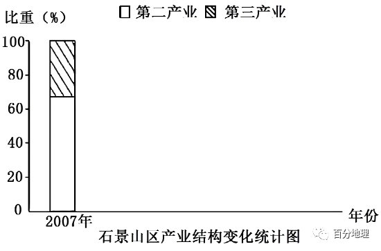

# 微专题之074 从产业结构角度分析区域发展

```
本专题摘自“百分地理”公众号，如有侵权请告之删除，谢谢。联系hhwxyhh@163.com
```

------
   
（2022年新高考广东卷）交通是城市间要素流动的重要载体，不同的交通流模式能够反映出城市间的相互联系状况。有学者基于G省2019年9月的日平均车流量数据信息，提出了该省高速公路交通流三种模式（下图）。据此完成下面小题。   
   
   
   
1.这三种模式中，对一般城市向区域中心城市要素集聚起促进作用（  ）   
A.最大的是甲模式   
B.最大的是乙模式   
C.最大的是丙模式   
D.三种模式一样大   
2.从丙模式判断，各区域中心城市之间存在（  ）   
A.职能一致性   
B.区域均衡性   
C.空间封闭性   
D.等级差异性   
<span style="color: rgb(255, 0, 0);">1.B从甲模式我们可以看到主要交通流位于一般城市之间，区域中心城市交通流为一般交通流，区域中心城市集聚作用并不明显，A选项错误。从乙模式中我们可以看到，主要交通流为一般城市和区域中心城市之间，区域中心城市能起到一般城市集聚作用；从丙模式图可以看到其主要交通流为各区域中心城市间的流动，对于一般城市向区域中心城市的集聚并未起到主要作用，故一般城市向区域中心城市要素集聚作用最大的应为乙模式，B选项正确，C、D选项错误。故选B。</span>   
<span style="color: rgb(255, 0, 0);">2.D从丙模式图可以看到其主要交通流为各区域中心城市间的流动，各区域中心城市之间能够产生大规模的流动，说明各区域中心城市其城市职能并不一致，城市职能相似，各区域中心城市间的流动就会减少，A选项错误。丙模式中各区域中心城市间的交通流为主要交通流，说明区域中心城市之间发展差异较大，并不均衡，B选项错误。各区域城市能够产生较大的交通流，说明各区域空间并不具有封闭性，而是具有一定的开放性，C选项错误。从丙模式中可以看到各区域中心城市间的主要交通流多为单向流动，这可能与区域中心城市等级差异有关， D选项正确。故选D。</span>   
（2022年新高考山东卷）双核结构是指在某区域内由区域中心城市和港口门户城市及其连线构成轴线。由此引领和推动所在区域发展的一种空间结构现象。下图为沈阳——大连双核结构示意图，据此完成下面小题。   
   
   
   
3.沈阳—大连双核结构的形成，主要是因为两城市（  ）   
A.在区位和功能上存在互补   
B.在地域文化方面存在互补   
C.交通便捷且空间距离较近   
D.社会经济发展的水平相近   
4.沈阳—大连双核结构有利于（  ）   
①促进大连市建成东北地区中心城市②促进沈阳—大连区域经济协同发展   
③增强沈阳市对辽中南地区的辐射功能④提高沈阳和大连两城市传统工业比重   
A.①②   
B.①④   
C.②③   
D.③④   
<span style="color: rgb(255, 0, 0);">3.A根据材料信息可知，双核结构是以区域中心城市和港口门户城市两类不同功能定位的城市为主构建的。沈阳和大连是辽宁省规模最大的两大城市，两座城市区位条件优越，城市功能比较齐全，其区位和功能可以互为补充，形成双核结构可发挥最大作用，A正确；沈阳和大连均在辽宁省内，两城市间地域文化差异较小，B错误；交通便捷且空间距离较近、社会经济发展水平相近都是两城构建双核结构城市的有利因素，但都不是主要因素，C、D错误。本题应选A。</span>   
<span style="color: rgb(255, 0, 0);">4.C根据目前的发展规划，沈阳是东北地区的中心城市，而大连不是，①错误；沈阳—大连双核结构可以促进沈阳、大连以及沿线地区的交流，能够促进沈阳—大连区域经济协同发展，②正确；沈阳—大连双核结构可以促进沈阳市的技术、人才等向辽中南地区流动，增强沈阳市对辽中南地区的辐射带动作用，③正确；沈阳—大连双核结构主要是为了促进区域产业结构调整，促进区域经济发展，提高传统工业的比重不利于两地产业结构调整和转型，④错误。所以选C。</span>   
（2022年1月浙江卷）5.高铁对城市的空间结构、产业升级和居民出行影响显著。高铁新城产业发展方向与其依托城市密切相关。下图为某高铁新城空间结构示意图。完成高铁新城发展方向与其依托城市相匹配的是（  ）   
   
   
   
A.零售等生活型服务业——旅游城市   
B.金融等现代服务业——传统工业城市   
C.物流等生产型服务业——转型升级城市   
D.高新技术创新型服务业——都市圈核心城市   
<span style="color: rgb(255, 0, 0);">5.D根据高铁可促进旅游城市游客数量大幅度增长，所以高铁新城与之匹配的发展方向旅游服务业的发展，A错；若高铁新城的发展方向是金融等现代服务业，必须依托于实体经济，所以与其依托城市相匹配的城市应当是区域中心城市，B错；高铁以客运服务为主，物流等生产型服务业不是高铁新城的发展方向，故则与转型升级城市不匹配，C错；高铁增强了核心城市与周围城市密切联系，高铁新城依托都市圈核心城市，发展高新技术创新型服务业，是推动经济结构战略性调整和经济发展方式转变的重要举措，能充分发挥核心城市的辐射带动力，协调优化城市产业布局，为城市发展带来新的机遇。D正确。故本题选D。</span>   
(2022年6月浙江卷）6.阅读材料，完成下列问题。   
材料一   
下图为哈萨克斯坦略图。   
   
   
   
材料二   
近年来，在“一带一路”倡议促进下，哈萨克斯坦吸引大量外资，推动工业化、城市化发展。该国主要工业部门包括采矿、石化、冶金和能源等，其中采矿业是支柱产业。该国以矿产品出口为主，市场主要集中于周边国家。   
有观点认为，该国工业化对推动城市化作用有限，从工业结构角度分析其原因。   
<span style="color: rgb(255, 0, 0);">【答案】重工业为主；属资金密集型，劳动力需求量较少；采矿业占比大，矿区分散，不利于大中城市发展。</span>   
<span style="color: rgb(255, 0, 0);">【解析】根据图例可知哈萨克斯坦矿产资源丰富，以重工业为主，且采矿业是支柱产业，资金密集型企业多，劳动力需求少，导致从乡村进入城市就业的人口少，对城市化的影响小；矿产资源丰富，采矿业较多，从图中判断矿区比较分散，不利于城市规模的扩大，不利于大中城市发展。</span>   
（2021·浙江·高考真题）下表为2019年全国及四大地区人口增长幅度（与2012年相比）、三次产业结构统计表。完成下面小题。   
<table cellspacing="0" cellpadding="0" width="577"><tbody><tr style="height: 16.5pt;"><td width="129" colspan="2" valign="middle" style="padding: 3.75pt 6pt;border-width: 1pt;border-color: rgb(0, 0, 0);"><section style="margin-top: 0pt;margin-bottom: 0pt;margin-left: 0pt;text-indent: 0pt;font-size: 10.5pt;font-family: &quot;Times New Roman&quot;;text-align: left;vertical-align: middle;line-height: 2em;"><span style="font-family: 楷体;color: rgb(0, 0, 0);">地区</span><span style="color: rgb(0, 0, 0);"></span></section></td><td width="60" valign="middle" style="padding: 3.75pt 6pt;border-width: 1pt;border-color: rgb(0, 0, 0);"><section style="margin-top: 0pt;margin-bottom: 0pt;margin-left: 0pt;text-indent: 0pt;font-size: 10.5pt;font-family: &quot;Times New Roman&quot;;text-align: left;vertical-align: middle;line-height: 2em;"><span style="font-family: 楷体;color: rgb(0, 0, 0);">全国</span><span style="color: rgb(0, 0, 0);"></span></section></td><td width="60" valign="middle" style="padding: 3.75pt 6pt;border-width: 1pt;border-color: rgb(0, 0, 0);"><section style="margin-top: 0pt;margin-bottom: 0pt;margin-left: 0pt;text-indent: 0pt;font-size: 10.5pt;font-family: &quot;Times New Roman&quot;;text-align: left;vertical-align: middle;line-height: 2em;"><span style="font-family: 楷体;color: rgb(0, 0, 0);">甲</span><span style="color: rgb(0, 0, 0);"></span></section></td><td width="60" valign="middle" style="padding: 3.75pt 6pt;border-width: 1pt;border-color: rgb(0, 0, 0);"><section style="margin-top: 0pt;margin-bottom: 0pt;margin-left: 0pt;text-indent: 0pt;font-size: 10.5pt;font-family: &quot;Times New Roman&quot;;text-align: left;vertical-align: middle;line-height: 2em;"><span style="font-family: 楷体;color: rgb(0, 0, 0);">乙</span><span style="color: rgb(0, 0, 0);"></span></section></td><td width="57" valign="middle" style="padding: 3.75pt 6pt;border-width: 1pt;border-color: rgb(0, 0, 0);"><section style="margin-top: 0pt;margin-bottom: 0pt;margin-left: 0pt;text-indent: 0pt;font-size: 10.5pt;font-family: &quot;Times New Roman&quot;;text-align: left;vertical-align: middle;line-height: 2em;"><span style="font-family: 楷体;color: rgb(0, 0, 0);">丙</span><span style="color: rgb(0, 0, 0);"></span></section></td><td width="57" valign="middle" style="padding: 3.75pt 6pt;border-width: 1pt;border-color: rgb(0, 0, 0);"><section style="margin-top: 0pt;margin-bottom: 0pt;margin-left: 0pt;text-indent: 0pt;font-size: 10.5pt;font-family: &quot;Times New Roman&quot;;text-align: left;vertical-align: middle;line-height: 2em;"><span style="font-family: 楷体;color: rgb(0, 0, 0);">丁</span><span style="color: rgb(0, 0, 0);"></span></section></td></tr><tr style="height: 16.5pt;"><td width="129" colspan="2" valign="middle" style="padding: 3.75pt 6pt;border-width: 1pt;border-color: rgb(0, 0, 0);"><section style="margin-top: 0pt;margin-bottom: 0pt;margin-left: 0pt;text-indent: 0pt;font-size: 10.5pt;font-family: &quot;Times New Roman&quot;;text-align: left;vertical-align: middle;line-height: 2em;"><span style="font-family: 楷体;color: rgb(0, 0, 0);">人口增长幅度（%）</span><span style="color: rgb(0, 0, 0);"></span></section></td><td width="60" valign="middle" style="padding: 3.75pt 6pt;border-width: 1pt;border-color: rgb(0, 0, 0);"><section style="margin-top: 0pt;margin-bottom: 0pt;margin-left: 0pt;text-indent: 0pt;font-size: 10.5pt;font-family: &quot;Times New Roman&quot;;text-align: left;vertical-align: middle;line-height: 2em;"><span style="font-family: 楷体;color: rgb(0, 0, 0);">3.4</span><span style="color: rgb(0, 0, 0);"></span></section></td><td width="60" valign="middle" style="padding: 3.75pt 6pt;border-width: 1pt;border-color: rgb(0, 0, 0);"><section style="margin-top: 0pt;margin-bottom: 0pt;margin-left: 0pt;text-indent: 0pt;font-size: 10.5pt;font-family: &quot;Times New Roman&quot;;text-align: left;vertical-align: middle;line-height: 2em;"><span style="font-family: 楷体;color: rgb(0, 0, 0);">-1.7</span><span style="color: rgb(0, 0, 0);"></span></section></td><td width="60" valign="middle" style="padding: 3.75pt 6pt;border-width: 1pt;border-color: rgb(0, 0, 0);"><section style="margin-top: 0pt;margin-bottom: 0pt;margin-left: 0pt;text-indent: 0pt;font-size: 10.5pt;font-family: &quot;Times New Roman&quot;;text-align: left;vertical-align: middle;line-height: 2em;"><span style="font-family: 楷体;color: rgb(0, 0, 0);">4.5</span><span style="color: rgb(0, 0, 0);"></span></section></td><td width="57" valign="middle" style="padding: 3.75pt 6pt;border-width: 1pt;border-color: rgb(0, 0, 0);"><section style="margin-top: 0pt;margin-bottom: 0pt;margin-left: 0pt;text-indent: 0pt;font-size: 10.5pt;font-family: &quot;Times New Roman&quot;;text-align: left;vertical-align: middle;line-height: 2em;"><span style="font-family: 楷体;color: rgb(0, 0, 0);">2.6</span><span style="color: rgb(0, 0, 0);"></span></section></td><td width="57" valign="middle" style="padding: 3.75pt 6pt;border-width: 1pt;border-color: rgb(0, 0, 0);"><section style="margin-top: 0pt;margin-bottom: 0pt;margin-left: 0pt;text-indent: 0pt;font-size: 10.5pt;font-family: &quot;Times New Roman&quot;;text-align: left;vertical-align: middle;line-height: 2em;"><span style="font-family: 楷体;color: rgb(0, 0, 0);">4.2</span><span style="color: rgb(0, 0, 0);"></span></section></td></tr><tr style="height: 16.5pt;"><td width="68" rowspan="3" valign="middle" style="padding: 3.75pt 6pt;border-width: 1pt;border-color: rgb(0, 0, 0);"><section style="margin-top: 0pt;margin-bottom: 0pt;margin-left: 0pt;text-indent: 0pt;font-size: 10.5pt;font-family: &quot;Times New Roman&quot;;text-align: left;vertical-align: middle;line-height: 2em;"><span style="font-family: 楷体;color: rgb(0, 0, 0);">三次产业结构（%）</span><span style="color: rgb(0, 0, 0);"></span></section></td><td width="60" valign="middle" style="padding: 3.75pt 6pt;border-width: 1pt;border-color: rgb(0, 0, 0);"><section style="margin-top: 0pt;margin-bottom: 0pt;margin-left: 0pt;text-indent: 0pt;font-size: 10.5pt;font-family: &quot;Times New Roman&quot;;text-align: left;vertical-align: middle;line-height: 2em;"><span style="font-family: 楷体;color: rgb(0, 0, 0);">第一产业</span><span style="color: rgb(0, 0, 0);"></span></section></td><td width="60" valign="middle" style="padding: 3.75pt 6pt;border-width: 1pt;border-color: rgb(0, 0, 0);"><section style="margin-top: 0pt;margin-bottom: 0pt;margin-left: 0pt;text-indent: 0pt;font-size: 10.5pt;font-family: &quot;Times New Roman&quot;;text-align: left;vertical-align: middle;line-height: 2em;"><span style="font-family: 楷体;color: rgb(0, 0, 0);">7.2</span><span style="color: rgb(0, 0, 0);"></span></section></td><td width="60" valign="middle" style="padding: 3.75pt 6pt;border-width: 1pt;border-color: rgb(0, 0, 0);"><section style="margin-top: 0pt;margin-bottom: 0pt;margin-left: 0pt;text-indent: 0pt;font-size: 10.5pt;font-family: &quot;Times New Roman&quot;;text-align: left;vertical-align: middle;line-height: 2em;"><span style="font-family: 楷体;color: rgb(0, 0, 0);">13.2</span><span style="color: rgb(0, 0, 0);"></span></section></td><td width="60" valign="middle" style="padding: 3.75pt 6pt;border-width: 1pt;border-color: rgb(0, 0, 0);"><section style="margin-top: 0pt;margin-bottom: 0pt;margin-left: 0pt;text-indent: 0pt;font-size: 10.5pt;font-family: &quot;Times New Roman&quot;;text-align: left;vertical-align: middle;line-height: 2em;"><span style="font-family: 楷体;color: rgb(0, 0, 0);">4.6</span><span style="color: rgb(0, 0, 0);"></span></section></td><td width="57" valign="middle" style="padding: 3.75pt 6pt;border-width: 1pt;border-color: rgb(0, 0, 0);"><section style="margin-top: 0pt;margin-bottom: 0pt;margin-left: 0pt;text-indent: 0pt;font-size: 10.5pt;font-family: &quot;Times New Roman&quot;;text-align: left;vertical-align: middle;line-height: 2em;"><span style="font-family: 楷体;color: rgb(0, 0, 0);">8.2</span><span style="color: rgb(0, 0, 0);"></span></section></td><td width="57" valign="middle" style="padding: 3.75pt 6pt;border-width: 1pt;border-color: rgb(0, 0, 0);"><section style="margin-top: 0pt;margin-bottom: 0pt;margin-left: 0pt;text-indent: 0pt;font-size: 10.5pt;font-family: &quot;Times New Roman&quot;;text-align: left;vertical-align: middle;line-height: 2em;"><span style="font-family: 楷体;color: rgb(0, 0, 0);">11.0</span><span style="color: rgb(0, 0, 0);"></span></section></td></tr><tr style="height: 16.5pt;"><td width="60" valign="middle" style="padding: 3.75pt 6pt;border-width: 1pt;border-color: rgb(0, 0, 0);"><section style="margin-top: 0pt;margin-bottom: 0pt;margin-left: 0pt;text-indent: 0pt;font-size: 10.5pt;font-family: &quot;Times New Roman&quot;;text-align: left;vertical-align: middle;line-height: 2em;"><span style="font-family: 楷体;color: rgb(0, 0, 0);">第二产业</span><span style="color: rgb(0, 0, 0);"></span></section></td><td width="60" valign="middle" style="padding: 3.75pt 6pt;border-width: 1pt;border-color: rgb(0, 0, 0);"><section style="margin-top: 0pt;margin-bottom: 0pt;margin-left: 0pt;text-indent: 0pt;font-size: 10.5pt;font-family: &quot;Times New Roman&quot;;text-align: left;vertical-align: middle;line-height: 2em;"><span style="font-family: 楷体;color: rgb(0, 0, 0);">39.1</span><span style="color: rgb(0, 0, 0);"></span></section></td><td width="60" valign="middle" style="padding: 3.75pt 6pt;border-width: 1pt;border-color: rgb(0, 0, 0);"><section style="margin-top: 0pt;margin-bottom: 0pt;margin-left: 0pt;text-indent: 0pt;font-size: 10.5pt;font-family: &quot;Times New Roman&quot;;text-align: left;vertical-align: middle;line-height: 2em;"><span style="font-family: 楷体;color: rgb(0, 0, 0);">34.4</span><span style="color: rgb(0, 0, 0);"></span></section></td><td width="60" valign="middle" style="padding: 3.75pt 6pt;border-width: 1pt;border-color: rgb(0, 0, 0);"><section style="margin-top: 0pt;margin-bottom: 0pt;margin-left: 0pt;text-indent: 0pt;font-size: 10.5pt;font-family: &quot;Times New Roman&quot;;text-align: left;vertical-align: middle;line-height: 2em;"><span style="font-family: 楷体;color: rgb(0, 0, 0);">38.9</span><span style="color: rgb(0, 0, 0);"></span></section></td><td width="57" valign="middle" style="padding: 3.75pt 6pt;border-width: 1pt;border-color: rgb(0, 0, 0);"><section style="margin-top: 0pt;margin-bottom: 0pt;margin-left: 0pt;text-indent: 0pt;font-size: 10.5pt;font-family: &quot;Times New Roman&quot;;text-align: left;vertical-align: middle;line-height: 2em;"><span style="font-family: 楷体;color: rgb(0, 0, 0);">41.8</span><span style="color: rgb(0, 0, 0);"></span></section></td><td width="57" valign="middle" style="padding: 3.75pt 6pt;border-width: 1pt;border-color: rgb(0, 0, 0);"><section style="margin-top: 0pt;margin-bottom: 0pt;margin-left: 0pt;text-indent: 0pt;font-size: 10.5pt;font-family: &quot;Times New Roman&quot;;text-align: left;vertical-align: middle;line-height: 2em;"><span style="font-family: 楷体;color: rgb(0, 0, 0);">37.9</span><span style="color: rgb(0, 0, 0);"></span></section></td></tr><tr style="height: 16.5pt;"><td width="60" valign="middle" style="padding: 3.75pt 6pt;border-width: 1pt;border-color: rgb(0, 0, 0);"><section style="margin-top: 0pt;margin-bottom: 0pt;margin-left: 0pt;text-indent: 0pt;font-size: 10.5pt;font-family: &quot;Times New Roman&quot;;text-align: left;vertical-align: middle;line-height: 2em;"><span style="font-family: 楷体;color: rgb(0, 0, 0);">第三产业</span><span style="color: rgb(0, 0, 0);"></span></section></td><td width="60" valign="middle" style="padding: 3.75pt 6pt;border-width: 1pt;border-color: rgb(0, 0, 0);"><section style="margin-top: 0pt;margin-bottom: 0pt;margin-left: 0pt;text-indent: 0pt;font-size: 10.5pt;font-family: &quot;Times New Roman&quot;;text-align: left;vertical-align: middle;line-height: 2em;"><span style="font-family: 楷体;color: rgb(0, 0, 0);">53.7</span><span style="color: rgb(0, 0, 0);"></span></section></td><td width="60" valign="middle" style="padding: 3.75pt 6pt;border-width: 1pt;border-color: rgb(0, 0, 0);"><section style="margin-top: 0pt;margin-bottom: 0pt;margin-left: 0pt;text-indent: 0pt;font-size: 10.5pt;font-family: &quot;Times New Roman&quot;;text-align: left;vertical-align: middle;line-height: 2em;"><span style="font-family: 楷体;color: rgb(0, 0, 0);">52.4</span><span style="color: rgb(0, 0, 0);"></span></section></td><td width="60" valign="middle" style="padding: 3.75pt 6pt;border-width: 1pt;border-color: rgb(0, 0, 0);"><section style="margin-top: 0pt;margin-bottom: 0pt;margin-left: 0pt;text-indent: 0pt;font-size: 10.5pt;font-family: &quot;Times New Roman&quot;;text-align: left;vertical-align: middle;line-height: 2em;"><span style="font-family: 楷体;color: rgb(0, 0, 0);">56.5</span><span style="color: rgb(0, 0, 0);"></span></section></td><td width="57" valign="middle" style="padding: 3.75pt 6pt;border-width: 1pt;border-color: rgb(0, 0, 0);"><section style="margin-top: 0pt;margin-bottom: 0pt;margin-left: 0pt;text-indent: 0pt;font-size: 10.5pt;font-family: &quot;Times New Roman&quot;;text-align: left;vertical-align: middle;line-height: 2em;"><span style="font-family: 楷体;color: rgb(0, 0, 0);">50.0</span><span style="color: rgb(0, 0, 0);"></span></section></td><td width="57" valign="middle" style="padding: 3.75pt 6pt;border-width: 1pt;border-color: rgb(0, 0, 0);"><section style="margin-top: 0pt;margin-bottom: 0pt;margin-left: 0pt;text-indent: 0pt;font-size: 10.5pt;font-family: &quot;Times New Roman&quot;;text-align: left;vertical-align: middle;line-height: 2em;"><span style="font-family: 楷体;color: rgb(0, 0, 0);">51.1</span><span style="color: rgb(0, 0, 0);"></span></section></td></tr></tbody></table>

   
7.甲是（  ）   
A.东部地区   
B.中部地区   
C.西部地区   
D.东北地区   
8.四大地区中（  ）   
A.主导丁地区发展的因素是高科技   
B.人口增幅最大的地区，城市化水平最高   
C.吸纳外资能力由强到弱依次为丙、甲、丁、乙   
D.乙、丙地区第二产业比重较高，以重型工业为主   
<span style="color: rgb(255, 0, 0);">7.D甲地区人口增长幅度最低且为负值，产业结构中农业比重是四个地区中最大的，说明该地区农业在全国中地位比较重要，且2012-2919年间人口数减少的，由于我国计划生育政策实施导致，人口自然增长率较低，但不是负值，因此其人口减少应该是人口迁出导致，东北地区是我国重要的商品粮基地，由于传统产业衰落，大量劳动力迁出导致人口减少，因此甲地是东北地区，D符合题意，东部地区 、中部地区、西部地区不符合题意。故选D。</span>   
<span style="color: rgb(255, 0, 0);">8.B结合表中数据判断，乙是东部地区，丙为中部地区，丁是西部地区。主导东部地区发展的因素是高科技，主导西部地区发展的主要因素应为资源，A错误。东部地区是人口增幅最大的地区，城市化水平最高，B正确。吸纳外资能力由强到弱依次为东部地区—乙、中部地区—丙、东北地区—甲、西部地区—丁，C错误。东部地区—乙、中部地区—丙，第三产业比重较高，轻重工业较均衡，东北地区—甲以重型工业为主，D错误。故选B。</span>   
（2020年新高考山东卷）家住北方某县的小王夫妇，效仿村里一些年轻人的做法，在自家5亩耕地上栽植了杨树后就外出打工了。八年后，小王夫妇将已成材的杨树出售，获利24000元。与原来种植粮食作物、蔬菜等相比，这些收入虽不丰厚，但他们还算满意。据调查，该县耕地上栽植杨树的面积约占耕地总面积的10%，这种“农地杨树化”现象引起了有关专家的高度关注。据此完成下面小题。   
9.当地“农地杨树化”的主要原因是（  ）   
A.生态效益高   
B.木材销路好   
C.劳动投入少   
D.种树有补贴   
10.针对“农地杨树化”引起的问题，可采取的措施是（  ）   
A.加大开荒力度   
B.增加木材进口   
C.增加粮食进口   
D.鼓励农地流转   
<span style="color: rgb(255, 0, 0);">9.C根据材料信息可知，当地年轻人在自家耕地上栽种杨树之后外出务工，几年后待杨树成材后出售，从而获得一定的经济收入，这个过程中劳动投入少，还可以兼顾务工（且以务工为主），所以“农地杨树化”现象突出，并不是因为其生态效益高或是木材销路好，C正确，AB错；材料中并无信息表明种树有补贴，D错。故选C。</span>   
<span style="color: rgb(255, 0, 0);">10.D根据材料“该县耕地上栽植杨树的面积约占耕地总面积的10%”可知，“农地杨树化”使得耕地资源造成一定的浪费，可通过鼓励农地流转，一方面，当地农民可在耕地流转过程中获得一定的收入，另一方面，通过实行农地流转，可减少耕地资源的浪费，D正确；当地年轻劳动力外出务工，农村劳动力不足，部分耕地弃耕，因此才会出现“农地杨树化”的现象，并非当地耕地不足（所以无加大开荒力度的必要），也不是当地木材不足或粮食缺口，ABC错误，故选D。</span>   
（2020年新高考山东卷）同城化是指两个或两个以上相邻城市紧密联系、协调发展、共享发展成果的现象。公路客流能够反映城市间的日常人口流动方向和强度，是分析判断城市间关系的重要指标。下图示意安徽省2011年8月行政区划调整前的中心城市间公路客流状况。滁州的首位客运流向为南京，次位客运流向为合肥，两个方向的客流量相差很小。据此完成下面小题。   
   
   
   
11.下列城市组合中，最适宜推进同城化的是（  ）   
A.安庆—池州   
B.合肥—巢湖   
C.亳州—阜阳   
D.芜湖—铜陵   
12.合肥虽为滁州的次位客运流向，但滁州发往合肥的客流量与发往南京的相差很小，其主要原因是（  ）   
A.南京经济发展水平高   
B.滁州与南京距离更近   
C.滁州与合肥行政联系密切   
D.合肥与南京均为省会城市   
<span style="color: rgb(255, 0, 0);">11.B根据材料信息可知，公路客流能够反映城市间日常人口流动方向和强度，是分析判断城市间关系的重要指标，公路客流量大，反映城市间联系紧密，有利于推进同城化。选项中城市组合相比而言，合肥与巢湖之间空间位置相对较近，根据图示信息可知，两城相互之间均为首位客运流向，城市联系最为紧密，最适宜推进同城化，B正确；池州的首位客运流向为安庆，但安庆的首位客运流向为合肥，次位客运流向为池州，A错；亳州的首位客运流向为阜阳，但阜阳的首位客运流向为淮南，C错；芜湖的首位客运流向为铜陵，但铜陵的首位客运流向为池州，D错。故选B。</span>   
<span style="color: rgb(255, 0, 0);">12.C滁州与合肥同属安徽省，两者的行政联系更为密切，而南京属江苏省，所以滁州发往合肥的客流量与发往南京的客流量相差很小，C正确；南京经济发展水平高以及滁州距离南京距离更近，更有利于城市之间人口的流动，不能解释滁州发往合肥的客流量与发往南京客流量相差小这一现象，AB错；同理，合肥和南京均为省会城市，也不能解释为何滁州发往合肥的客流量与发往南京客流量相差很小，D错。故选C。</span>   
（2020年江苏卷）城市群在参与国际竞争与合作，支撑全国经济增长，推进区域协调发展等方面具有重要作用。目前我国已建设19个国家级城市群。下图为“我国城市群空间分布示意图”。读图完成下面小题。   
   
   
   
13.我国城市群空间分布的主要特点是（  ）   
A.成熟型城市群分布于东部沿海   
B.成长型城市群分布于中部地区   
C.培育型城市群分布于西部地区   
D.主要分布于胡焕庸线以东地区   
14.符合天山北坡城市群发展定位的是（  ）   
A.推动国家经济发展的新引擎   
B.“一带一路”重要的综合性枢纽   
C.联系各大城市群的重要节点   
D.国家高新技术产业的先行高地   
<span style="color: rgb(255, 0, 0);">13.D读图可以看出，西部地区也有成熟型城市群，A错误。东部地区也有成长型城市群，B错误。东部和中部地区也有培育型城市群，C错误。读图可以看出，由于胡焕庸线（黑河-腾冲一线）以东地区人口密度大，所以，我国城市群主要分布于胡焕庸线以东地区，D正确。故选D。</span>   
<span style="color: rgb(255, 0, 0);">14.B天山北坡城市群位于“陆上丝绸之路”的枢纽位置，所以，天山北坡城市群发展定位应该是“一带一路”重要的综合性枢纽，B正确。与东部城市群相比，天山北坡城市群发展相对落后，并不是推动国家经济发展的新引擎，A错误。天山北坡城市群地处西北地区，与各大城市群联系不便，C错误。与东部城市群相比，天山北坡城市群发展相对落后，技术水平相对低，并不是国家高新技术产业的先行高地，D错误。故选B。</span>   
（2020年新高考浙江卷）下表为2019年我国四大地区部分指标统计表。完成下面小题。   
<table cellspacing="0" cellpadding="0" width="577"><tbody><tr style="height: 16.5pt;"><td width="141" rowspan="2" valign="middle" style="padding: 3.75pt 6pt;border-width: 1pt;border-color: rgb(0, 0, 0);"><section style="margin-top: 0pt;margin-bottom: 0pt;margin-left: 0pt;text-indent: 0pt;font-size: 10.5pt;font-family: &quot;Times New Roman&quot;;text-align: center;vertical-align: middle;line-height: 2em;"><span style="font-family: 宋体;color: rgb(0, 0, 0);">指标</span><span style="color: rgb(0, 0, 0);"></span></section></td><td width="273" colspan="4" valign="middle" style="padding: 3.75pt 6pt;border-width: 1pt;border-color: rgb(0, 0, 0);"><section style="margin-top: 0pt;margin-bottom: 0pt;margin-left: 0pt;text-indent: 0pt;font-size: 10.5pt;font-family: &quot;Times New Roman&quot;;text-align: center;vertical-align: middle;line-height: 2em;"><span style="font-family: 宋体;color: rgb(0, 0, 0);">四大地区</span><span style="color: rgb(0, 0, 0);"></span></section></td></tr><tr style="height: 16.5pt;"><td width="63" valign="middle" style="padding: 3.75pt 6pt;border-width: 1pt;border-color: rgb(0, 0, 0);"><section style="margin-top: 0pt;margin-bottom: 0pt;margin-left: 0pt;text-indent: 0pt;font-size: 10.5pt;font-family: &quot;Times New Roman&quot;;text-align: center;vertical-align: middle;line-height: 2em;"><span style="font-family: 宋体;color: rgb(0, 0, 0);">甲</span><span style="color: rgb(0, 0, 0);"></span></section></td><td width="71" valign="middle" style="padding: 3.75pt 6pt;border-width: 1pt;border-color: rgb(0, 0, 0);"><section style="margin-top: 0pt;margin-bottom: 0pt;margin-left: 0pt;text-indent: 0pt;font-size: 10.5pt;font-family: &quot;Times New Roman&quot;;text-align: center;vertical-align: middle;line-height: 2em;"><span style="font-family: 宋体;color: rgb(0, 0, 0);">乙</span><span style="color: rgb(0, 0, 0);"></span></section></td><td width="66" valign="middle" style="padding: 3.75pt 6pt;border-width: 1pt;border-color: rgb(0, 0, 0);"><section style="margin-top: 0pt;margin-bottom: 0pt;margin-left: 0pt;text-indent: 0pt;font-size: 10.5pt;font-family: &quot;Times New Roman&quot;;text-align: center;vertical-align: middle;line-height: 2em;"><span style="font-family: 宋体;color: rgb(0, 0, 0);">丙</span><span style="color: rgb(0, 0, 0);"></span></section></td><td width="72" valign="middle" style="padding: 3.75pt 6pt;border-width: 1pt;border-color: rgb(0, 0, 0);"><section style="margin-top: 0pt;margin-bottom: 0pt;margin-left: 0pt;text-indent: 0pt;font-size: 10.5pt;font-family: &quot;Times New Roman&quot;;text-align: center;vertical-align: middle;line-height: 2em;"><span style="font-family: 宋体;color: rgb(0, 0, 0);">丁</span><span style="color: rgb(0, 0, 0);"></span></section></td></tr><tr style="height: 16.5pt;"><td width="141" valign="middle" style="padding: 3.75pt 6pt;border-width: 1pt;border-color: rgb(0, 0, 0);"><section style="margin-top: 0pt;margin-bottom: 0pt;margin-left: 0pt;text-indent: 0pt;font-size: 10.5pt;font-family: &quot;Times New Roman&quot;;text-align: center;vertical-align: middle;line-height: 2em;"><span style="font-family: 宋体;color: rgb(0, 0, 0);">土地面积占全国比例（</span><span style="color: rgb(0, 0, 0);">%</span><span style="font-family: 宋体;color: rgb(0, 0, 0);">）</span><span style="color: rgb(0, 0, 0);"></span></section></td><td width="63" valign="middle" style="padding: 3.75pt 6pt;border-width: 1pt;border-color: rgb(0, 0, 0);"><section style="margin-top: 0pt;margin-bottom: 0pt;margin-left: 0pt;text-indent: 0pt;font-size: 10.5pt;font-family: &quot;Times New Roman&quot;;text-align: center;vertical-align: middle;line-height: 2em;"><span style="color: rgb(0, 0, 0);">8.2</span><span style="color: rgb(0, 0, 0);"></span></section></td><td width="71" valign="middle" style="padding: 3.75pt 6pt;border-width: 1pt;border-color: rgb(0, 0, 0);"><section style="margin-top: 0pt;margin-bottom: 0pt;margin-left: 0pt;text-indent: 0pt;font-size: 10.5pt;font-family: &quot;Times New Roman&quot;;text-align: center;vertical-align: middle;line-height: 2em;"><span style="color: rgb(0, 0, 0);">10.7</span><span style="color: rgb(0, 0, 0);"></span></section></td><td width="66" valign="middle" style="padding: 3.75pt 6pt;border-width: 1pt;border-color: rgb(0, 0, 0);"><section style="margin-top: 0pt;margin-bottom: 0pt;margin-left: 0pt;text-indent: 0pt;font-size: 10.5pt;font-family: &quot;Times New Roman&quot;;text-align: center;vertical-align: middle;line-height: 2em;"><span style="color: rgb(0, 0, 0);">9.5</span><span style="color: rgb(0, 0, 0);"></span></section></td><td width="72" valign="middle" style="padding: 3.75pt 6pt;border-width: 1pt;border-color: rgb(0, 0, 0);"><section style="margin-top: 0pt;margin-bottom: 0pt;margin-left: 0pt;text-indent: 0pt;font-size: 10.5pt;font-family: &quot;Times New Roman&quot;;text-align: center;vertical-align: middle;line-height: 2em;"><span style="color: rgb(0, 0, 0);">71.6</span><span style="color: rgb(0, 0, 0);"></span></section></td></tr><tr style="height: 16.5pt;"><td width="141" valign="middle" style="padding: 3.75pt 6pt;border-width: 1pt;border-color: rgb(0, 0, 0);"><section style="margin-top: 0pt;margin-bottom: 0pt;margin-left: 0pt;text-indent: 0pt;font-size: 10.5pt;font-family: &quot;Times New Roman&quot;;text-align: center;vertical-align: middle;line-height: 2em;"><span style="font-family: 宋体;color: rgb(0, 0, 0);">人口占全国比例（</span><span style="color: rgb(0, 0, 0);">%</span><span style="font-family: 宋体;color: rgb(0, 0, 0);">）</span><span style="color: rgb(0, 0, 0);"></span></section></td><td width="63" valign="middle" style="padding: 3.75pt 6pt;border-width: 1pt;border-color: rgb(0, 0, 0);"><section style="margin-top: 0pt;margin-bottom: 0pt;margin-left: 0pt;text-indent: 0pt;font-size: 10.5pt;font-family: &quot;Times New Roman&quot;;text-align: center;vertical-align: middle;line-height: 2em;"><span style="color: rgb(0, 0, 0);">7.7</span><span style="color: rgb(0, 0, 0);"></span></section></td><td width="71" valign="middle" style="padding: 3.75pt 6pt;border-width: 1pt;border-color: rgb(0, 0, 0);"><section style="margin-top: 0pt;margin-bottom: 0pt;margin-left: 0pt;text-indent: 0pt;font-size: 10.5pt;font-family: &quot;Times New Roman&quot;;text-align: center;vertical-align: middle;line-height: 2em;"><span style="color: rgb(0, 0, 0);">26.5</span><span style="color: rgb(0, 0, 0);"></span></section></td><td width="66" valign="middle" style="padding: 3.75pt 6pt;border-width: 1pt;border-color: rgb(0, 0, 0);"><section style="margin-top: 0pt;margin-bottom: 0pt;margin-left: 0pt;text-indent: 0pt;font-size: 10.5pt;font-family: &quot;Times New Roman&quot;;text-align: center;vertical-align: middle;line-height: 2em;"><span style="color: rgb(0, 0, 0);">38.6</span><span style="color: rgb(0, 0, 0);"></span></section></td><td width="72" valign="middle" style="padding: 3.75pt 6pt;border-width: 1pt;border-color: rgb(0, 0, 0);"><section style="margin-top: 0pt;margin-bottom: 0pt;margin-left: 0pt;text-indent: 0pt;font-size: 10.5pt;font-family: &quot;Times New Roman&quot;;text-align: center;vertical-align: middle;line-height: 2em;"><span style="color: rgb(0, 0, 0);">27.2</span><span style="color: rgb(0, 0, 0);"></span></section></td></tr><tr style="height: 16.5pt;"><td width="141" valign="middle" style="padding: 3.75pt 6pt;border-width: 1pt;border-color: rgb(0, 0, 0);"><section style="margin-top: 0pt;margin-bottom: 0pt;margin-left: 0pt;text-indent: 0pt;font-size: 10.5pt;font-family: &quot;Times New Roman&quot;;text-align: center;vertical-align: middle;line-height: 2em;"><span style="font-family: 宋体;color: rgb(0, 0, 0);">人均</span><span style="color: rgb(0, 0, 0);">GDP</span><span style="font-family: 宋体;color: rgb(0, 0, 0);">（万元）</span><span style="color: rgb(0, 0, 0);"></span></section></td><td width="63" valign="middle" style="padding: 3.75pt 6pt;border-width: 1pt;border-color: rgb(0, 0, 0);"><section style="margin-top: 0pt;margin-bottom: 0pt;margin-left: 0pt;text-indent: 0pt;font-size: 10.5pt;font-family: &quot;Times New Roman&quot;;text-align: center;vertical-align: middle;line-height: 2em;"><span style="color: rgb(0, 0, 0);">4.7</span><span style="color: rgb(0, 0, 0);"></span></section></td><td width="71" valign="middle" style="padding: 3.75pt 6pt;border-width: 1pt;border-color: rgb(0, 0, 0);"><section style="margin-top: 0pt;margin-bottom: 0pt;margin-left: 0pt;text-indent: 0pt;font-size: 10.5pt;font-family: &quot;Times New Roman&quot;;text-align: center;vertical-align: middle;line-height: 2em;"><span style="color: rgb(0, 0, 0);">5.9</span><span style="color: rgb(0, 0, 0);"></span></section></td><td width="66" valign="middle" style="padding: 3.75pt 6pt;border-width: 1pt;border-color: rgb(0, 0, 0);"><section style="margin-top: 0pt;margin-bottom: 0pt;margin-left: 0pt;text-indent: 0pt;font-size: 10.5pt;font-family: &quot;Times New Roman&quot;;text-align: center;vertical-align: middle;line-height: 2em;"><span style="color: rgb(0, 0, 0);">9.4</span><span style="color: rgb(0, 0, 0);"></span></section></td><td width="72" valign="middle" style="padding: 3.75pt 6pt;border-width: 1pt;border-color: rgb(0, 0, 0);"><section style="margin-top: 0pt;margin-bottom: 0pt;margin-left: 0pt;text-indent: 0pt;font-size: 10.5pt;font-family: &quot;Times New Roman&quot;;text-align: center;vertical-align: middle;line-height: 2em;"><span style="color: rgb(0, 0, 0);">5.4</span><span style="color: rgb(0, 0, 0);"></span></section></td></tr></tbody></table>

注：数据未包括我国香港、澳门特别行政区和台湾省   
15.甲、乙、丙、丁中代表中部地区的是（  ）   
A.甲   
B.乙   
C.丙   
D.丁   
16.我国四大地区中（  ）   
A.东北地区工业以先进制造业为主体   
B.西部地区处于低水平均衡发展状态   
C.中部地区的城市化水平低于东北地区   
D.东部地区第一产业比重高于西部地区   
<span style="color: rgb(255, 0, 0);">15.B我国各地的社会发展具有明显的差异,根据各地的自然条件、经济基础、发展水平和对外开放程度分为东部地区、东北地区、中部地区和西部地区。一般人均GDP反映地区经济发达程度，丙地人均GDP最高，经济最发达，应该是我国东部地区；西部地区面积广大，土地面积占全国比例达到71.6%，丁是西部地区；甲、乙地区应该为东北地区、中部地区，东北地区人口少，占全国比重低，故甲是东北地区，乙是中部地区，B正确，ACD错误。故选B。</span>   
<span style="color: rgb(255, 0, 0);">16.C先进制造业要依靠发达的技术作为基础，东北地区技术不发达，应该致力于老工业基地改造，产业机构多元化，先进制造业在东部地区，A错误。西部地区自然条件、社会经济条件差异大，不可能均衡发展，B错误。东北地区地广人稀，农业生产机械化程度高，是中国著名的老工业基地，工业发展早、工业化进程快，故东北地区城市化水平高于中部，C正确。西部地区有中国的商品棉、商品粮基地，还是特色农产品基地，东部第一产业比重低于西部地区，D错误。故选C。</span>   
（2020年江苏卷）17.阅读材料，回答下列问题。   
材料一   
湖北省黄石市是武汉都市圈的副中心城市，有“青铜古都”“钢铁摇篮”“水泥故乡”之称。图一为“黄石市区位示意图”。   
材料二   
黄石市2008年被定为资源枯竭转型试点城市，2015年年底关闭第一批露天矿山，采掘业产值明显下降。图二为“2008——2017年黄石市GDP和三次产业结构统计图”，图三为“2008——2017年黄石市轻重工业产值统计图”。   
   
   
   
   
   
   
   
   
   
（1）简述当前黄石市产业结构的特点。   
（2）说明目前黄石市第二产业发展的有利条件。   
（3）简析黄石市第二产业转型升级的主要方向。   
（4）要实现黄石市可持续发展，你认为可采取哪些有效措施？   
<span style="color: rgb(255, 0, 0);">【答案】（1）以第二产业为主；第二产业中重工业占主导；第一、第三产业占比较低；第三产业占比大于第一产业。</span>   
<span style="color: rgb(255, 0, 0);">（2）产业基础好；临江水运便利；政策扶持；距中心城市武汉近；劳动力丰富。</span>   
<span style="color: rgb(255, 0, 0);">（3）轻型化（提高轻工业比重）；高附加值化（提升产品的附加值）；高科技化（积极发展高新技产业）；加强传统优势工业技术改造。</span>   
<span style="color: rgb(255, 0, 0);">（4）优化产业结构；增加就业岗位；提高资源利用率；加快生态恢复；防治环境污染；推进城市化进程。</span>   
<span style="color: rgb(255, 0, 0);">【解析】（1）注意关键词“当前”，根据2017年黄石市三次产业结构统计数据可知，首先，当前黄石市以第二产业为主，结合2017年黄石市轻重工业产值统计图可知，第二产业中重工业占主导（重工业的工业产值远高于轻工业的工业产值）；其次，当前黄石市第一、第三产业占比低，且第三产业占比大于第一产业。</span>   
<span style="color: rgb(255, 0, 0);">（2）该题可从地理位置、交通、劳动力，工业基础等角度回答。首先，黄石市距中心城市武汉较近，可获得一定的技术支持；其次，黄石市靠近长江，水源充足，交通便利；再次，作为武汉都市圈的副中心城市，其劳动力丰富；最后，根据材料信息可知，2008年黄石市被定为资源枯竭型转型试点城市，工业的转型发展有一定的政策支持。并且，黄石市被称为“钢铁摇篮”、“水泥故乡”，其产业基础条件较好。</span>   
<span style="color: rgb(255, 0, 0);">（3）根据2008——20017年黄石市轻重工业产值统计图可知，其第二产业以重工业为主，轻工业占比很小，可提高轻工业比重，同时，可加强传统优势工业的技术改造；其工业生产总值虽有增加，但近年来工业产值增速并不快，应加大技术投入，提升产品的附加值，同时，积极发展高新技术产业等。</span>   
<span style="color: rgb(255, 0, 0);">（4）资源枯竭型城市的转型与可持续发展一般可采取以下措施：调整优化产业结构，积极发展第三产业和高新技术产业，增加就业岗位，进一步吸引劳动力向城镇迁移，推进城市化进程；加大技术投入，提高资源利用率；资源枯竭型城市，环境污染一般较为严重，可加快生态恢复，治理环境污染等</span>。   
（2022·山东·模拟预测）18.阅读图文材料，回答下列问题。   
北京某校学生在石景山区开展实践活动，探究石景山区近年来的发展情况（如下图）。   
   
   
   
任务一   
调查石景山区的产业结构。   
石景山区抓住服务北京2022年冬奥会和打造新时代首都城市复兴新地标的两大机遇，进行产业结构调整。下表为石景山区第二产业、第三产业产值所占比例。   
<table cellspacing="0" cellpadding="0" width="577"><tbody><tr style="height: 16.5pt;"><td width="70" valign="middle" style="padding: 3.75pt 6pt;border-width: 1pt;border-color: rgb(0, 0, 0);"></td><td width="79" valign="middle" style="padding: 3.75pt 6pt;border-width: 1pt;border-color: rgb(0, 0, 0);"><section style="margin-top: 0pt;margin-bottom: 0pt;margin-left: 0pt;font-size: 10.5pt;font-family: &quot;Times New Roman&quot;;text-align: left;text-indent: 21pt;vertical-align: middle;line-height: 2em;"><span style="font-family: 楷体;color: rgb(0, 0, 0);">第二产业产值占比（％）</span><span style="color: rgb(0, 0, 0);"></span></section></td><td width="98" valign="middle" style="padding: 3.75pt 6pt;border-width: 1pt;border-color: rgb(0, 0, 0);"><section style="margin-top: 0pt;margin-bottom: 0pt;margin-left: 0pt;font-size: 10.5pt;font-family: &quot;Times New Roman&quot;;text-align: left;text-indent: 21pt;vertical-align: middle;line-height: 2em;"><span style="font-family: 楷体;color: rgb(0, 0, 0);">第三产业产值占比（％）</span><span style="color: rgb(0, 0, 0);"></span></section></td></tr><tr style="height: 16.5pt;"><td width="70" valign="middle" style="padding: 3.75pt 6pt;border-width: 1pt;border-color: rgb(0, 0, 0);"><section style="margin-top: 0pt;margin-bottom: 0pt;margin-left: 0pt;font-size: 10.5pt;font-family: &quot;Times New Roman&quot;;text-align: left;text-indent: 21pt;vertical-align: middle;line-height: 2em;"><span style="font-family: 楷体;color: rgb(0, 0, 0);">2007年</span><span style="color: rgb(0, 0, 0);"></span></section></td><td width="79" valign="middle" style="padding: 3.75pt 6pt;border-width: 1pt;border-color: rgb(0, 0, 0);"><section style="margin-top: 0pt;margin-bottom: 0pt;margin-left: 0pt;font-size: 10.5pt;font-family: &quot;Times New Roman&quot;;text-align: left;text-indent: 21pt;vertical-align: middle;line-height: 2em;"><span style="font-family: 楷体;color: rgb(0, 0, 0);">67.3</span><span style="color: rgb(0, 0, 0);"></span></section></td><td width="98" valign="middle" style="padding: 3.75pt 6pt;border-width: 1pt;border-color: rgb(0, 0, 0);"><section style="margin-top: 0pt;margin-bottom: 0pt;margin-left: 0pt;font-size: 10.5pt;font-family: &quot;Times New Roman&quot;;text-align: left;text-indent: 21pt;vertical-align: middle;line-height: 2em;"><span style="font-family: 楷体;color: rgb(0, 0, 0);">32.7</span><span style="color: rgb(0, 0, 0);"></span></section></td></tr><tr style="height: 16.5pt;"><td width="70" valign="middle" style="padding: 3.75pt 6pt;border-width: 1pt;border-color: rgb(0, 0, 0);"><section style="margin-top: 0pt;margin-bottom: 0pt;margin-left: 0pt;font-size: 10.5pt;font-family: &quot;Times New Roman&quot;;text-align: left;text-indent: 21pt;vertical-align: middle;line-height: 2em;"><span style="font-family: 楷体;color: rgb(0, 0, 0);">2010年</span><span style="color: rgb(0, 0, 0);"></span></section></td><td width="79" valign="middle" style="padding: 3.75pt 6pt;border-width: 1pt;border-color: rgb(0, 0, 0);"><section style="margin-top: 0pt;margin-bottom: 0pt;margin-left: 0pt;font-size: 10.5pt;font-family: &quot;Times New Roman&quot;;text-align: left;text-indent: 21pt;vertical-align: middle;line-height: 2em;"><span style="font-family: 楷体;color: rgb(0, 0, 0);">43.0</span><span style="color: rgb(0, 0, 0);"></span></section></td><td width="98" valign="middle" style="padding: 3.75pt 6pt;border-width: 1pt;border-color: rgb(0, 0, 0);"><section style="margin-top: 0pt;margin-bottom: 0pt;margin-left: 0pt;font-size: 10.5pt;font-family: &quot;Times New Roman&quot;;text-align: left;text-indent: 21pt;vertical-align: middle;line-height: 2em;"><span style="font-family: 楷体;color: rgb(0, 0, 0);">57.0</span><span style="color: rgb(0, 0, 0);"></span></section></td></tr><tr style="height: 16.5pt;"><td width="70" valign="middle" style="padding: 3.75pt 6pt;border-width: 1pt;border-color: rgb(0, 0, 0);"><section style="margin-top: 0pt;margin-bottom: 0pt;margin-left: 0pt;font-size: 10.5pt;font-family: &quot;Times New Roman&quot;;text-align: left;text-indent: 21pt;vertical-align: middle;line-height: 2em;"><span style="font-family: 楷体;color: rgb(0, 0, 0);">2013年</span><span style="color: rgb(0, 0, 0);"></span></section></td><td width="79" valign="middle" style="padding: 3.75pt 6pt;border-width: 1pt;border-color: rgb(0, 0, 0);"><section style="margin-top: 0pt;margin-bottom: 0pt;margin-left: 0pt;font-size: 10.5pt;font-family: &quot;Times New Roman&quot;;text-align: left;text-indent: 21pt;vertical-align: middle;line-height: 2em;"><span style="font-family: 楷体;color: rgb(0, 0, 0);">36.5</span><span style="color: rgb(0, 0, 0);"></span></section></td><td width="98" valign="middle" style="padding: 3.75pt 6pt;border-width: 1pt;border-color: rgb(0, 0, 0);"><section style="margin-top: 0pt;margin-bottom: 0pt;margin-left: 0pt;font-size: 10.5pt;font-family: &quot;Times New Roman&quot;;text-align: left;text-indent: 21pt;vertical-align: middle;line-height: 2em;"><span style="font-family: 楷体;color: rgb(0, 0, 0);">63.5</span><span style="color: rgb(0, 0, 0);"></span></section></td></tr><tr style="height: 16.5pt;"><td width="70" valign="middle" style="padding: 3.75pt 6pt;border-width: 1pt;border-color: rgb(0, 0, 0);"><section style="margin-top: 0pt;margin-bottom: 0pt;margin-left: 0pt;font-size: 10.5pt;font-family: &quot;Times New Roman&quot;;text-align: left;text-indent: 21pt;vertical-align: middle;line-height: 2em;"><span style="font-family: 楷体;color: rgb(0, 0, 0);">2016年</span><span style="color: rgb(0, 0, 0);"></span></section></td><td width="79" valign="middle" style="padding: 3.75pt 6pt;border-width: 1pt;border-color: rgb(0, 0, 0);"><section style="margin-top: 0pt;margin-bottom: 0pt;margin-left: 0pt;font-size: 10.5pt;font-family: &quot;Times New Roman&quot;;text-align: left;text-indent: 21pt;vertical-align: middle;line-height: 2em;"><span style="font-family: 楷体;color: rgb(0, 0, 0);">30.3</span><span style="color: rgb(0, 0, 0);"></span></section></td><td width="98" valign="middle" style="padding: 3.75pt 6pt;border-width: 1pt;border-color: rgb(0, 0, 0);"><section style="margin-top: 0pt;margin-bottom: 0pt;margin-left: 0pt;font-size: 10.5pt;font-family: &quot;Times New Roman&quot;;text-align: left;text-indent: 21pt;vertical-align: middle;line-height: 2em;"><span style="font-family: 楷体;color: rgb(0, 0, 0);">69.7</span><span style="color: rgb(0, 0, 0);"></span></section></td></tr><tr style="height: 16.5pt;"><td width="70" valign="middle" style="padding: 3.75pt 6pt;border-width: 1pt;border-color: rgb(0, 0, 0);"><section style="margin-top: 0pt;margin-bottom: 0pt;margin-left: 0pt;font-size: 10.5pt;font-family: &quot;Times New Roman&quot;;text-align: left;text-indent: 21pt;vertical-align: middle;line-height: 2em;"><span style="font-family: 楷体;color: rgb(0, 0, 0);">2019年</span><span style="color: rgb(0, 0, 0);"></span></section></td><td width="79" valign="middle" style="padding: 3.75pt 6pt;border-width: 1pt;border-color: rgb(0, 0, 0);"><section style="margin-top: 0pt;margin-bottom: 0pt;margin-left: 0pt;font-size: 10.5pt;font-family: &quot;Times New Roman&quot;;text-align: left;text-indent: 21pt;vertical-align: middle;line-height: 2em;"><span style="font-family: 楷体;color: rgb(0, 0, 0);">16.7</span><span style="color: rgb(0, 0, 0);"></span></section></td><td width="98" valign="middle" style="padding: 3.75pt 6pt;border-width: 1pt;border-color: rgb(0, 0, 0);"><section style="margin-top: 0pt;margin-bottom: 0pt;margin-left: 0pt;font-size: 10.5pt;font-family: &quot;Times New Roman&quot;;text-align: left;text-indent: 21pt;vertical-align: middle;line-height: 2em;"><span style="font-family: 楷体;color: rgb(0, 0, 0);">83.3</span><span style="color: rgb(0, 0, 0);"></span></section></td></tr></tbody></table>

   
（1）补充完成石景山区产业结构变化统计图，据图说出其产业结构的变化特征。   
   
   
   
任务二   
分析石景山区的产业转型。   
2010年底首钢北京地区钢铁冶炼全面停产，腾退出的空间建成为“新首钢高端产业综合服务区”，发展高新技术产业、高端制造业，商务、金融、会展等生产性服务业，以及数字娱乐、工业设计等文化创意产业。   
（2）说明石景山区建设“新首钢高端产业综合服务区”的优势条件。   
任务三   
探索石景山区的“冬奥”之约。   
北京冬奥公园地处石景山区西部、永定河畔，是北京2022年冬奥会赛区之一。园区的老旧工业厂房、仓储用房及相关工业设施，已陆续被改造为科技主题乐园、冬奥训练场馆等。图为冷却塔旁的冬奥滑雪大跳台，被称为“雪飞天”，赛后将永久保留，并用于大众休闲健身活动。   
   
   
   
（3）简述北京冬奥公园的建设对石景山区社会经济发展的积极作用。   
<span style="color: rgb(255, 0, 0);">【答案】（1）</span>   
   
   
<span style="color: rgb(255, 0, 0);">第二产业产值占比持续下降，第三产业产值占比持续上升；由以第二产业为主变为以第三产业为主；产业结构升级。</span>   
<span style="color: rgb(255, 0, 0);">（2）位于北京城区，技术先进、人才充足；市场需求量大；可利用空间大；交通便利（信息通达度高），基础设施完善；靠近永定河，生态环境较好；政策支持等。</span>   
<span style="color: rgb(255, 0, 0);">（3）工业遗址再利用，提高土地利用率；促进第三产业（旅游业）发展；增加就业岗位；丰富城市景观，提供休闲空间等。</span>   
<span style="color: rgb(255, 0, 0);">【解析】（1）根据表1石景山区第二产业、第三产业产值所占比例绘图如下（注意：数值的准确性、图表的整洁度与完整度）：</span>   
   
   
   
<span style="color: rgb(255, 0, 0);">读图可知，石景山区第二产业产值占比呈持续下降趋势，第三产业产值占比呈持续上升趋势；第二产业产值占比由67.3%，下降到16.7%，而第三产业产值占比由32.7%，上升到83.3%，可知产业结构发生了变化，由第二产业为主转变为了第三产业为主，产业结构不断升级优化。</span>   
<span style="color: rgb(255, 0, 0);">（2）读材料“2010年底首钢北京地区钢铁冶炼全面停产，腾退出的空间建成为“新首钢高端产业综合服务区”，发展高新技术产业、高端制造业，商务、金融、会展等生产性服务业，以及数字娱乐、工业设计等文化创意产业。”明确发展高新技术产业、高端制造业，商务、金融、会展等生产性服务业，以及数字娱乐、工业设计等文化创意产业需要技术、人才，有市场，信息通达度好，环境好等条件，结合这样的思路分析，北京作为我国首都，交通便利，信息汇集，基础设施完善，有多处高校和科研机构，技术先进，人才充足，市场可利用空间大，有政府的引导、支持，再加上位置靠近永定河，环境条件好，适合发展“新首钢高端产业综合服务区”。</span>   
<span style="color: rgb(255, 0, 0);">（3）可以从北京冬奥公园的建设本身成本、价值，建成后带来的经济效益和社会效益等方面来分析。园区的老旧工业厂房、仓储用房及相关工业设施，已陆续被改造为科技主题乐园、冬奥训练场馆等，利用工业遗址，提高了土地利用率。北京冬奥公园赛后将永久保留，并用于大众休闲健身活动，为广大公民提供了休闲空间，丰富了城市景观；促进了旅游业的发展，也增加了就业岗位等。</span>   
（2022·山东日照·二模）19.阅读图文资料，完成下列各题。   
应急产业是为突发事件预防与准备、监测与预警、处置与救援提供专业产品和服务的产业，具有覆盖面广、产业链长的特点。《河北省应急产业发展规划(2020—2025)》提出推进京津冀应急产业合作，积极对接京津高端创新资源，承接产业转移，构建京津研发 河北制造的应急产业跨区域协同发展体系，深入推进张家口市怀安县国家应急产业示范基地建设，重点发展应急救援、防护用品研发制造，配套应急物流、物资储备、咨询、培训。怀安县(如下图)素有“鸡鸣闻三省”之称，是沟通京津、连接晋蒙的重要交通枢纽。   
   
   
   
（1）说明河北省构建应急产业跨区域协同发展体系的优势条件。   
（2）分析河北省将应急产业示范基地落户于“相对偏远”的怀安县的自然原因。   
（3）分析怀安县应急产业示范基地建设对当地产业结构的有利影响。   
<span style="color: rgb(255, 0, 0);">【答案】（1）国家京津冀协同发展的政策支持；临近京津，交通通达，区域联系便捷；土地租金较低，劳动力丰富廉价。</span>   
<span style="color: rgb(255, 0, 0);">（2）地处三省交界处，能够及时与临近省区沟通；位于洋河上游，水源充足，水质优良；谷地地形，建设用地开阔平坦。</span>   
<span style="color: rgb(255, 0, 0);">（3）应急产业覆盖面广、产业链长，能够增加工业部门，促进产业升级；配套服务部门多、涉及面广，可以促进服务业发展，优化产业结构。</span>   
<span style="color: rgb(255, 0, 0);">【解析】（1）根据材料信息可知，国家政策方面有效推动京津冀应急产业合作，有京津冀协同发展的政策支持；根据图示信息可知，该地临近京津地区，交通方式多样，交通通达度高；相对于京津地区而言，河北省的经济发展水平相对较低，土地租金较低，劳动力丰富廉价。</span>   
<span style="color: rgb(255, 0, 0);">（2）结合图示地形信息可知，该地属于谷地地形，谷地开阔，建设用地平坦，有效节省建设成本。结合图中洋河等信息可知，该地位于洋河的上游，水源充足且水质优良。注意材料信息：怀安县素有“鸡鸣闻三省”之称。表明该地地理位置优越，位于三省的交界处，能够及时与临近的省区沟通，提高应急效率。</span>   
<span style="color: rgb(255, 0, 0);">（3）注意分析对产业结构的影响，可从产业升级和产业结构优化等角度分析。根据材料可知，应急产业是为突发事件预防与准备、监测与预警、处置与救援提供专业产品和服务的产业，具有覆盖面广、产业链长的特点，一方面，当地经济发展水平较低，通过发展应急产业示范基地，增加工业部门，推动产业结构调整和升级；另一方面，应急产业的覆盖面广、产业链长，涉及众多相关产业，配套服务部门多，可以促进相关服务业的发展，有利于产业结构的优化。</span>   
（2022·山东淄博·二模）20.阅读图文资料，完成下列要求。   
旧金山湾区位于美国加利福尼亚州北部，由旧金山市、北湾、东湾、南湾、半岛5个区域构成。经过一百多年的发展，湾区内的产业、人口多次进行空间选择，分工和经济布局不断趋于合理，形成了旧金山、奥克兰、圣荷西三大以不同产业为主导的核心城市，不同区域各具特色，错位发展。以硅谷为代表的南湾地区拥有多所美国顶尖大学和科研院所，形成高等教育集群，云集了成千上万家从事计算机、互联网、新能源、生物医药等领域的高新技术企业，成为世界的科技创新中心。下图示意旧金山湾区空间结构与功能格局。   
   
   
   
（1）根据图文信息判断适合旧金山市、北湾、东湾发展的主导产业，将三个区域名称填写到下表中合适位置。   
<table cellspacing="0" cellpadding="0" width="577"><tbody><tr style="height: 16.5pt;"><td width="57" valign="middle" style="padding: 3.75pt 6pt;border-width: 1pt;border-color: rgb(0, 0, 0);"><section style="margin-top: 0pt;margin-bottom: 0pt;margin-left: 0pt;text-indent: 0pt;font-size: 10.5pt;font-family: &quot;Times New Roman&quot;;text-align: left;vertical-align: middle;line-height: 2em;"><span style="font-family: 宋体;color: rgb(0, 0, 0);">区域名称</span><span style="font-family: 宋体;color: rgb(0, 0, 0);"></span></section></td><td width="218" valign="middle" style="padding: 3.75pt 6pt;border-width: 1pt;border-color: rgb(0, 0, 0);"><section style="margin-top: 0pt;margin-bottom: 0pt;margin-left: 0pt;text-indent: 0pt;font-size: 10.5pt;font-family: &quot;Times New Roman&quot;;text-align: left;vertical-align: middle;line-height: 2em;"><span style="font-family: 宋体;color: rgb(0, 0, 0);">主导产业</span><span style="font-family: 宋体;color: rgb(0, 0, 0);"></span></section></td></tr><tr style="height: 16.5pt;"><td width="57" valign="middle" style="padding: 3.75pt 6pt;border-width: 1pt;border-color: rgb(0, 0, 0);"><section style="margin-top: 0pt;margin-bottom: 0pt;margin-left: 0pt;text-indent: 0pt;font-size: 10.5pt;font-family: &quot;Times New Roman&quot;;text-align: left;vertical-align: middle;line-height: 2em;"><span style="color: rgb(0, 0, 0);">____</span><span style="color: rgb(0, 0, 0);"></span></section></td><td width="218" valign="middle" style="padding: 3.75pt 6pt;border-width: 1pt;border-color: rgb(0, 0, 0);"><section style="margin-top: 0pt;margin-bottom: 0pt;margin-left: 0pt;text-indent: 0pt;font-size: 10.5pt;font-family: &quot;Times New Roman&quot;;text-align: left;vertical-align: middle;line-height: 2em;"><span style="font-family: 宋体;color: rgb(0, 0, 0);">休闲养老产业、葡萄酒产业</span><span style="font-family: 宋体;color: rgb(0, 0, 0);"></span></section></td></tr><tr style="height: 16.5pt;"><td width="57" valign="middle" style="padding: 3.75pt 6pt;border-width: 1pt;border-color: rgb(0, 0, 0);"><section style="margin-top: 0pt;margin-bottom: 0pt;margin-left: 0pt;text-indent: 0pt;font-size: 10.5pt;font-family: &quot;Times New Roman&quot;;text-align: left;vertical-align: middle;line-height: 2em;"><span style="color: rgb(0, 0, 0);">____</span><span style="color: rgb(0, 0, 0);"></span></section></td><td width="218" valign="middle" style="padding: 3.75pt 6pt;border-width: 1pt;border-color: rgb(0, 0, 0);"><section style="margin-top: 0pt;margin-bottom: 0pt;margin-left: 0pt;text-indent: 0pt;font-size: 10.5pt;font-family: &quot;Times New Roman&quot;;text-align: left;vertical-align: middle;line-height: 2em;"><span style="font-family: 宋体;color: rgb(0, 0, 0);">制造业、物流运输</span><span style="font-family: 宋体;color: rgb(0, 0, 0);"></span></section></td></tr><tr style="height: 16.5pt;"><td width="57" valign="middle" style="padding: 3.75pt 6pt;border-width: 1pt;border-color: rgb(0, 0, 0);"><section style="margin-top: 0pt;margin-bottom: 0pt;margin-left: 0pt;text-indent: 0pt;font-size: 10.5pt;font-family: &quot;Times New Roman&quot;;text-align: left;vertical-align: middle;line-height: 2em;"><span style="color: rgb(0, 0, 0);">____</span><span style="color: rgb(0, 0, 0);"></span></section></td><td width="218" valign="middle" style="padding: 3.75pt 6pt;border-width: 1pt;border-color: rgb(0, 0, 0);"><section style="margin-top: 0pt;margin-bottom: 0pt;margin-left: 0pt;text-indent: 0pt;font-size: 10.5pt;font-family: &quot;Times New Roman&quot;;text-align: left;vertical-align: middle;line-height: 2em;"><span style="font-family: 宋体;color: rgb(0, 0, 0);">总部经济、金融、商贸等现代服务业</span><span style="font-family: 宋体;color: rgb(0, 0, 0);"></span></section></td></tr></tbody></table>

   
（2）说明旧金山湾区“多核心带动、错位发展”模式对湾区发展的有利影响。   
（3）说明南湾高等教育集群和高新技术产业之间的关系。   
<span style="color: rgb(255, 0, 0);">【答案】（1）①.北湾②.东湾③.旧金山市</span>   
<span style="color: rgb(255, 0, 0);">（2）（多核心）对周边区域的辐射带动作用大，促进区域一体化发展和城乡统筹发展；发挥区域比较优势，减少同质恶性竞争；加强区域之间合作，形成多种类、多层次的产业体系，提高湾区的整体竞争力。</span>   
<span style="color: rgb(255, 0, 0);">（3）高等教育集群和高新技术产业之间相互促进；高等教育集群为高新技术产业发展提供高科技人才和先进技术；高新技术产业为高等教育集群提供科研成果转化利用平台和研究资金。</span>   
<span style="color: rgb(255, 0, 0);">【解析】（1）从图中看北湾自然环境好、土地面积大，适合休闲养老产业、葡萄酒产业；东湾有海港，交通便利，且是早期承接旧金山产业转移的区域，说明主要以传统工业为主，适合制造业、物流运输布局；西湾是原来城市中心，经济发达，产业结构调整后适合布局总部经济、金融、商贸等现代服务业。</span>   
<span style="color: rgb(255, 0, 0);">（2）根据材料中描述“经过一百多年的发展，湾区内的产业、人口多次进行空间选择，分工和经济布局不断趋于合理，形成了旧金山、奥克兰、圣荷西三大以不同产业为主导的核心城市，不同区域各具特色，错位发展。”说明错位布局是一种对各区域优势选择和利用的结果，有利于发挥特色；同时，错位布局，分别形成不同产业类型，可以减少恶性竞争，促进合作发展；“多核心带动”，通过形成多个发展核心，带动更多临近区域发展，促进区域整体发展。</span>   
<span style="color: rgb(255, 0, 0);">（3）高新技术产业是技术指向型，需要以人才作为支撑，布局上往往靠近高等院校和科研机构；高新技术产业本身又为高效人才提供就业机会、研究平台和资金支持，二者是一种相互促进的关系。</span>
