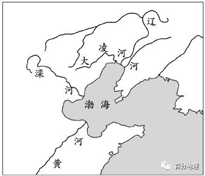

# 微专题之075三角洲

```
本专题摘自“百分地理”公众号，如有侵权请告之删除，谢谢。联系hhwxyhh@163.com
```

------
（2022·湖北·园创联盟联合测评）黄河三角洲是世界上堆积速率最快、演变最为剧烈的大河三角洲之一。受黄河流域中上游及海洋的干扰，2015～2018年黄河河口沙嘴变化显著（下图）。据此完成下面小题。   

   

1．2015-2018年黄河河口沙嘴的主要外力作用是（  ）   
A．堆积-侵蚀-堆积   
B．侵蚀-堆积-侵蚀   
C．侵蚀一侵蚀一堆积   
D．堆积一堆积-侵蚀   
2．2018年黄河河口沙嘴发生变化的主要原因是（  ）   
A．调水调沙增多   
B．水土流失加剧   
C．流域水坝增多   
D．海水侵蚀减弱   
<span style="color: rgb(255, 0, 0);">1．A沙嘴地貌属于海岸堆积地貌。根据沙嘴的形成原理可知，堆积作用使河口沙嘴变大，侵蚀作用使沙嘴变小。据图可知，黄河河口沙嘴的变化为2015-2016年变大，2016-2017年变小，2017-2018年变大，据此可知黄河河口沙嘴的主要外力作用是堆积-侵蚀-堆积，A正确，BCD错误。故选A。</span>   
<span style="color: rgb(255, 0, 0);">2．A2018年黄河河口沙嘴明显比2017年大，说明2018年入海泥沙大增。最可能的主要原因是调水调沙增多，将水库里的泥沙和河床上的淤沙送入大海，导致入海泥沙大增，沙嘴面积变大，A正确。黄河流经黄土高原，黄土高原水土流失加剧，会导致黄河含沙量增加，但是黄河中下游有水利工程，这些泥沙被淤积在库区，在黄河进行调水调沙时，这些泥沙才进入大海，因此水土流失加剧不会直接导致沙嘴变化，B错误。流域水坝增多，在蓄水的同时也拦蓄泥沙，使入海泥沙减少与2018年入海泥沙大增沉积加剧不符，C错误。海水侵蚀减弱会使沙嘴变小，而2018年黄河河口沙嘴明显比2017年大，D错误。故选A。</span>   
（2022·辽宁·高三阶段练习）鲁伍马河发源于坦桑尼亚东南部的马塔戈罗山脉，流经数处大瀑布后入海，河口处未形成河口三角洲。下图示意鲁伍马河地理位置和鲁伍马海盆海水等深线。据此完成下面小题。   

   

3．鲁伍马河流含沙量最大季节是当地（  ）   
A．春季   
B．夏季   
C．秋季   
D．冬季   
4．鲁伍马河河口未形成河口三角洲的主要原因是（  ）   
A．地形陡，泥沙难沉积   
B．支流较少,径流量小   
C．植被茂密,泥沙含量少   
D．河流落差小,流速慢   
5．图示最有利发展的港口城市是（  ）   
A．林迪   
B．帕尔马   
C．莫辛布瓦   
D．彭巴   
<span style="color: rgb(255, 0, 0);">3．B鲁伍马河发源于东非高原，山地主要流经热带草原气候区，热带草原气候分干湿两季，当地夏季时降水量大，河流流量大，河流侵蚀搬运能力强，此时含沙量最大；当地冬半年时降水量少，河流流量小，河流的侵蚀搬运能力弱，含沙量较小，B选项正确，排除其他选项。故选B。</span>   
<span style="color: rgb(255, 0, 0);">4．A图中显示，鲁伍马河河口地区大陆架狭窄，且大陆坡陡，材料显示，鲁伍马河流经数处大瀑布自鲁武马海西侧入海，流速较快，泥沙难以在河口沉积，所以河口未形成三角洲，A选项正确。材料信息表明，鲁伍马河主要支流有鲁建达、卢切林构、利空得、穆胡成西和户美苏勒等河，支流多，排除B选项。根据纬度位置判断，该河流经热带草原气候区，降水集中，多瀑布落差大，流速快，雨季时降水量大，侵蚀搬运能力强，泥沙含量大，排除C、D选项错误。故选A。</span>   
<span style="color: rgb(255, 0, 0);">5．D根据四个城市沿海等深线的疏密判断，彭巴等深线最密且有避风的港湾，利于大型船舶停泊和航行，最适宜发展深水港口，选项D符合题意，排除A、B、C选项。故选D。</span>   
（2022·广西·钦州期末）中亚的锡尔河发源于西天山，其河川径流主要来源于山区降水和融雪径流，大部分水量被中游的农业灌溉所使用。锡尔河三角洲湿地地理位置   
   
、   
   
。下图为锡尔河三角洲湿地1962-2019年湿地面积年度变化曲线和月度变化曲线示意图，读图，完成下面小题。   

   

6．1962-2019年锡尔河三角洲湿地（  ）   
A．水体所占比重增大   
B．季节性特征越发明显   
C．面积呈逐年增加趋势   
D．面积峰值出现在春季   
7．推测1980年前锡尔河三角洲湿地面积变化的最主要影响因素是（  ）   
A．融雪减少   
B．气候变化   
C．耕地开发   
D．道路建设   
8．1980年后，锡尔河三角洲湿地大幅度增加，最可能是由于（  ）   
A．限制流域工农业用水   
B．实施跨流域调水工程   
C．实施大面积植树造林   
D．适时开展人工降雨作业   
<span style="color: rgb(255, 0, 0);">6．B读图可知，水体所占比重小，大部分时间面积稳定，A错误；季节变化较为显著，B正确；面积整体呈上升趋势，但不是逐年增加面积，C错误；峰值出现在8月中旬，不是春季，D错误。故选B。</span>   
<span style="color: rgb(255, 0, 0);">7．C读图可知，1980年之前，锡尔河三角洲湿地面积下降，水体面积和植被也下降，最可能是由于该阶段，锡尔河流域的耕地开发，灌溉用水量增大，导致入湖水量减少，C正确；气候变化和道路建设会有一定的影响，但不是最主要的原因，BD错误；随着气候变暖该地区的融雪量应有所增加，A错误。故选C。</span>   
<span style="color: rgb(255, 0, 0);">8．A根据所学知识可知，限制流域的工农业用水，可以增加入湖水量，增加湿地面积，A正确；该地区河流少，水资源短缺，跨流域调水会导致其他地区水源缺乏，湿地面积减少，B错误；该地区位于内陆地区，全年降水少，气候干旱，大面积植树造林会大量消耗当地水资源，湿地面积会减少，C错误；人工降雨无法从根本上解决入湖水量少的问题，D错误。故选A。</span>   
（2021·陕西·韩城市阶段练习）密西西比河三角洲是由密西西比河注入墨西哥湾的泥沙沉积而成，其位置经过多次变迁。下图为密西西比河古三角洲叶瓣分布(①一⑦按照时间顺序排列)及目前海岸线位置示意图。读图完成下面小题。   

   

9．密西西比河发育多个三角洲叶瓣的原因是（  ）   
A．河口地势低   
B．河流含沙量大   
C．河流频繁改道   
D．海域宽阔   
10．密西西比河每个三角洲叶瓣的发育过程都经历了（  ）   
A．河流作用为主到海洋作用为主两个过程   
B．海洋作用为主到河流作用为主两个过程   
C．始终以河流作用为主的过程   
D．始终以海洋作用为主的过程   
<span style="color: rgb(255, 0, 0);">9．C密西西比河发育多个三角洲叶瓣的原因是河流频繁改道沉积形成的，三角洲地势低平，沉积作用明显，密西西比河水量不稳定，当汛期流量大时河流对河口泥沙冲刷严重，导致河道改变，从而在不同位置形成三角洲，久而久之发育多个三角洲叶瓣，C正确。河口地势低是河口普遍的特点，不是发育多个三角洲叶瓣的原因，A错误。河流含沙量大是形成三角洲物质基础，但不是三角洲叶瓣分散、变化的原因，B错误。海域宽阔对发育多个三角洲叶瓣影响不大，D错误。故选C。</span>   
<span style="color: rgb(255, 0, 0);">10．A据图可知，古三角洲的最大范围是超过了现代海岸线的位置，说明古三角区形成时是河流作用为主；现代海岸线退缩说明后来海洋作用明显，密西西比河每个三角洲叶瓣的发育过程都经历了河流作用为主到海洋作用为主两个过程，A正确。BCD错误。故选A。</span>   
（2022·西南四省高三5月联考）色楞格河源于蒙古国杭爱山北坡，流经蒙古国北部，注入贝加尔湖（面积3.15×10*km2），全长1024km，流域面积945480km2。在入湖口处形成河口三角洲（色楞格河三角洲），面积700km2，它是一片呈扇形的湿地。下图示意色楞格河三角洲。据此完成下列小题。   

   

11．色楞格河河口地区（  ）   
A．径流季节变化大   
B．冰川融水补给多   
C．水体含沙量较小   
D．结冰期相对较短   
12．色楞格河三角洲对贝加尔湖的影响主要表现在（  ）   
A．减少养分   
B．稳定水位   
C．净化水质   
D．提高水温   
<span style="color: rgb(255, 0, 0);">11．A根据材料可知，色楞格河发源于蒙古国杭爱山北坡，流经蒙古国北部，注入贝加尔湖，流域气候干旱，属温带大陆性气候，河流受地下水、季节性积雪融水以及少量的雨水补给，径流量季节变化大。A正确。河口地区并不会受冰川融水补给，B错。色楞格河河口地区形成大面积的河口三角洲，表明河口地区水体含沙量较大，C错。区域所处纬度高，靠近冬季风发源地，河口地区的结冰期相对较长。D错。故选A。</span>   
<span style="color: rgb(255, 0, 0);">12．C注意分析的是河口三角洲对贝加尔湖的影响。河口三角洲并不能减少贝加尔湖的养分，A错误。贝加尔湖面积广大，河口三角洲难以稳定贝加尔湖的水位，B错。根据材料信息可知，色楞格河三角洲湿地广布，湿地植被吸附净化入湖水质，可以净化湖泊水质，C正确。河口三角洲不能提高湖泊水温，D错。故选C。</span>   
二、综合题   
13．（2022·广西·柳州高级中学阶段练习）阅读图文材料,回答下列问题。   
伊犁河源于天山西部,注入巴尔喀什湖，伊犁河三角洲内存在大片的沼泽湿地。20世纪60年代,哈萨克斯坦在该流域大规模兴修水库、灌渠等水利设施,导致巴尔喀什湖水位、盐度发生变化,造成严重的生态环境问题。20世纪80年代,为减少水在伊犁河三角洲的非生产性消耗，当地采用了机械化清淤、水力冲沙等措施，加深伊犁河三角洲所有汊河的河床，当年湖泊水位有所上升。下图示意巴尔喀什湖和伊犁河三角洲。   

   

(1)机械化清淤和水力冲沙等措施对伊犁河三角洲与巴尔喀什湖生态环境产生了不同的影响,请在三角洲与湖泊中选择其一，指出其生态环境的变化,并说明理由。   
<span style="color: rgb(255, 0, 0);">【答案】三角洲:生态环境总体趋于恶化。理由:①清淤和水力冲沙可加深河床，加快河水通过三角洲的速度（河道加深）,三角洲滞留的水量减少,土地趋于干旱;②部分深水湿地水位下降，由水生生态环境逐渐向旱生环境转变;③部分浅水湿地干涸,出现盐渍化;④三角洲的湖沼湿地萎缩,生态系统规模缩小,生物多样性减少（湿地出现破碎化分布）。</span>   
<span style="color: rgb(255, 0, 0);">湖泊:生态环境有所改善。理由:①湖泊水量增加,恢复原有水生环境;②盐度降低,水质改善;③水位上升,湖面扩大,扭转湖泊萎缩的趋势（水生生态系统规模扩大）;④河水带来的营养盐类增加,有利于浮游生物生长,生物多样性增加。</span>   
<span style="color: rgb(255, 0, 0);">【解析】可以从自然地理环境的整体性和水循环的角度进行分析。机械化清淤和水力冲沙等措施对伊犁河三角洲的影响是使生态环境总体趋于恶化,但对巴尔喀什湖生态环境的影响是使生态环境有所改善。</span>   
<span style="color: rgb(255, 0, 0);">对三角洲的影响为生态环境总体趋于恶化。理由:①分析清淤对于河流水位，流速等产生的影响，清淤和水力冲沙可加深河床，加快河水通过三角洲的速度（河道加深）,三角洲滞留的水量减少，加之干旱的气候特征，土地趋于干旱;②分析三角洲湿地产生的变化，部分深水湿地水位下降，由水生生态环境逐渐向旱生环境转变;③部分浅水湿地干涸,且湖泊盐度较高，极易出现盐渍化;④从生态环境角度分析，三角洲的湖沼湿地萎缩,生态系统规模缩小,生物多样性减少（湿地出现破碎化分布）。</span>   
<span style="color: rgb(255, 0, 0);">对湖泊产生的影响为生态环境有所改善。理由主要从河流的水文特征分析:①湖泊定期清淤、水力冲沙，使得水量增加,恢复原有水生环境;②从湖泊盐度角度，淡水补充，盐度降低,水质改善;③从湖泊水位角度，水位上升,湖面扩大,扭转湖泊萎缩的趋势（水生生态系统规模扩大）;④从湖泊生物发展角度，河水带来的营养盐类增加,有利于浮游生物生长,生物多样性增加。</span>   
14．（2022·河南·濮阳一高阶段练习）阅读图文资料，完成下列问题。   
河口地貌的演变与海平面、河流输沙量等密切相关。2万年以来，恒河流域地壳相对稳定，但由于气候变暖，海平面上升约120米；恒河年入海输沙量在距今约1.1万年时达到顶峰（约25亿吨，当今约10亿吨）；距今约0.7万年，海平面开始趋于稳定。当今恒河河口（下图）原为下切河谷，2万年以来经历了下切河谷→河口湾→三角洲的演变。   

   

(1)分析当今恒河河口地貌由下切河谷→河口湾→三角洲演变的原因。   
(2)推测1.1万年以来恒河流域西南季风强弱的变化趋势，并说明理由。   
<span style="color: rgb(255, 0, 0);">【答案】(1)前期海平面上升（海岸线后退，海水入侵），原下切河谷被淹，形成河口湾；当今河口处落差变小，流速变慢，泥沙易淤积；后期海平面趋于稳定，恒河输沙量大，泥沙大量淤积逐渐形成三角洲。</span>   
<span style="color: rgb(255, 0, 0);">(2)变弱。理由：地壳相对稳定，说明河流落差基本不变/流速变化小。输沙能力锐减，说明径流量变小，降水量变小，西南季风携带的水汽量变小。</span>   
<span style="color: rgb(255, 0, 0);">【解析】（1）根据材料信息“2万年以来……海平面上升约120米”可知，恒河河口原为下切河谷时，河口与海洋的落差较大，以下蚀作用为主；后来海平面上升，导致下切河谷被淹没，形成河口湾；根据材料信息“恒河年入海输沙量在距今约1.1万年时达到顶峰”可知，河口湾形成之后，河口与海平面落差变小，受到海水的顶托作用变强，河流流速降低，表现为以河流的沉积作用为主；根据材料信息“距今约0.7万年，海平面开始趋于稳定”可知，后期随着海平面的稳定，恒河携带的大量泥沙在河口堆积下来，形成三角洲地貌。（2）根据所学知识可知，距今约1.1万年至今，地壳相对稳定，没有发生大规模的运动，恒河流域面积稳定，汇水区域没有发生变化，河流的落差几乎没有发生变化，携沙能力变化小；根据材料信息“恒河年入海输沙量在距今约1.1万年时达到顶峰（约25亿吨，当今约10亿吨）”可知，恒河的输沙能力降低，说明恒河的径流量减少，恒河的主要补给方式为雨水补给，主要为西南季风带来的降水，由此可知，恒河流域的降水量减少，西南季风变弱。</span>   
15．（2022·江西·兴国中学阶段练习）阅读图文材料，完成下列要求。   
环渤海地区有大凌河、滦河等一系列山溪性河流入海，同时多发育泥沙质海岸，形成了辽河三角洲、滦河三角洲、黄河三角洲等。辽河、大凌河与滦河均发源于燕山山脉，河口三角洲黏土矿物和重矿物组成“大同小异”，其中黏土矿物以蒙脱石和伊利石为主。蒙脱石随温度与降水增加会转化为高岭石。对比几条河流河口沉积物发现，滦河高岭石含量高于大凌河与辽河，辽河高岭石含量反而又高于大凌河。下图示意辽河、大凌河与滦河位置，下表为辽河、大凌河与滦河水文信息统计表。   

   
<table cellspacing="0" cellpadding="0" width="577"><tbody><tr><td width="58" valign="middle" style="padding: 3.75pt 6pt;border-width: 1pt;border-color: rgb(0, 0, 0);"><section style="margin-top: 0pt;margin-bottom: 0pt;margin-left: 0pt;text-indent: 0pt;font-size: 10.5pt;font-family: &quot;Times New Roman&quot;;text-align: left;line-height: 2em;"><span style="font-family: 楷体;">河流</span><span style="font-family: 楷体;"></span></section></td><td width="65" valign="middle" style="padding: 3.75pt 6pt;border-width: 1pt;border-color: rgb(0, 0, 0);"><section style="margin-top: 0pt;margin-bottom: 0pt;margin-left: 0pt;text-indent: 0pt;font-size: 10.5pt;font-family: &quot;Times New Roman&quot;;text-align: left;line-height: 2em;"><span style="font-family: 楷体;">长度/km</span><span style="font-family: 楷体;"></span></section></td><td width="72" valign="middle" style="padding: 3.75pt 6pt;border-width: 1pt;border-color: rgb(0, 0, 0);"><section style="margin-top: 0pt;margin-bottom: 0pt;margin-left: 0pt;text-indent: 0pt;font-size: 10.5pt;font-family: &quot;Times New Roman&quot;;text-align: left;line-height: 2em;"><span style="font-family: 楷体;">流域面积</span><span style="font-family: 楷体;"></span></section><section style="margin-top: 0pt;margin-bottom: 0pt;margin-left: 0pt;text-indent: 0pt;font-size: 10.5pt;font-family: &quot;Times New Roman&quot;;text-align: left;line-height: 2em;"><span style="font-family: 楷体;">/104Km2</span><span style="font-family: 楷体;"></span></section></td><td width="72" valign="middle" style="padding: 3.75pt 6pt;border-width: 1pt;border-color: rgb(0, 0, 0);"><section style="margin-top: 0pt;margin-bottom: 0pt;margin-left: 0pt;text-indent: 0pt;font-size: 10.5pt;font-family: &quot;Times New Roman&quot;;text-align: left;line-height: 2em;"><span style="font-family: 楷体;">最高海拔</span><span style="font-family: 楷体;"></span></section><section style="margin-top: 0pt;margin-bottom: 0pt;margin-left: 0pt;text-indent: 0pt;font-size: 10.5pt;font-family: &quot;Times New Roman&quot;;text-align: left;line-height: 2em;"><span style="font-family: 楷体;">/m</span><span style="font-family: 楷体;"></span></section></td><td width="86" valign="middle" style="padding: 3.75pt 6pt;border-width: 1pt;border-color: rgb(0, 0, 0);"><section style="margin-top: 0pt;margin-bottom: 0pt;margin-left: 0pt;text-indent: 0pt;font-size: 10.5pt;font-family: &quot;Times New Roman&quot;;text-align: left;line-height: 2em;"><span style="font-family: 楷体;">年均径流</span><span style="font-family: 楷体;">量</span><span style="font-family: 楷体;"></span></section><section style="margin-top: 0pt;margin-bottom: 0pt;margin-left: 0pt;text-indent: 0pt;font-size: 10.5pt;font-family: &quot;Times New Roman&quot;;text-align: left;line-height: 2em;"><span style="font-family: 楷体;">/108Km3</span><span style="font-family: 楷体;"></span></section></td><td width="86" valign="middle" style="padding: 3.75pt 6pt;border-width: 1pt;border-color: rgb(0, 0, 0);"><section style="margin-top: 0pt;margin-bottom: 0pt;margin-left: 0pt;text-indent: 0pt;font-size: 10.5pt;font-family: &quot;Times New Roman&quot;;text-align: left;line-height: 2em;"><span style="font-family: 楷体;">年均输沙量</span><span style="font-family: 楷体;"></span></section><section style="margin-top: 0pt;margin-bottom: 0pt;margin-left: 0pt;text-indent: 0pt;font-size: 10.5pt;font-family: &quot;Times New Roman&quot;;text-align: left;line-height: 2em;"><span style="font-family: 楷体;">/106t</span><span style="font-family: 楷体;"></span></section></td><td width="86" valign="middle" style="padding: 3.75pt 6pt;border-width: 1pt;border-color: rgb(0, 0, 0);"><section style="margin-top: 0pt;margin-bottom: 0pt;margin-left: 0pt;text-indent: 0pt;font-size: 10.5pt;font-family: &quot;Times New Roman&quot;;text-align: left;line-height: 2em;"><span style="font-family: 楷体;">沉积物浓度</span><span style="font-family: 楷体;"></span></section><section style="margin-top: 0pt;margin-bottom: 0pt;margin-left: 0pt;text-indent: 0pt;font-size: 10.5pt;font-family: &quot;Times New Roman&quot;;text-align: left;line-height: 2em;"><span style="font-family: 楷体;">/g·L-1</span><span style="font-family: 楷体;"></span></section></td></tr><tr><td width="58" valign="middle" style="padding: 3.75pt 6pt;border-width: 1pt;border-color: rgb(0, 0, 0);"><section style="margin-top: 0pt;margin-bottom: 0pt;margin-left: 0pt;text-indent: 0pt;font-size: 10.5pt;font-family: &quot;Times New Roman&quot;;text-align: left;line-height: 2em;"><span style="font-family: 楷体;">辽河</span><span style="font-family: 楷体;"></span></section></td><td width="65" valign="middle" style="padding: 3.75pt 6pt;border-width: 1pt;border-color: rgb(0, 0, 0);"><section style="margin-top: 0pt;margin-bottom: 0pt;margin-left: 0pt;text-indent: 0pt;font-size: 10.5pt;font-family: &quot;Times New Roman&quot;;text-align: left;line-height: 2em;"><span style="font-family: 楷体;">1345</span><span style="font-family: 楷体;"></span></section></td><td width="72" valign="middle" style="padding: 3.75pt 6pt;border-width: 1pt;border-color: rgb(0, 0, 0);"><section style="margin-top: 0pt;margin-bottom: 0pt;margin-left: 0pt;text-indent: 0pt;font-size: 10.5pt;font-family: &quot;Times New Roman&quot;;text-align: left;line-height: 2em;"><span style="font-family: 楷体;">22.96</span><span style="font-family: 楷体;"></span></section></td><td width="72" valign="middle" style="padding: 3.75pt 6pt;border-width: 1pt;border-color: rgb(0, 0, 0);"><section style="margin-top: 0pt;margin-bottom: 0pt;margin-left: 0pt;text-indent: 0pt;font-size: 10.5pt;font-family: &quot;Times New Roman&quot;;text-align: left;line-height: 2em;"><span style="font-family: 楷体;">1490</span><span style="font-family: 楷体;"></span></section></td><td width="86" valign="middle" style="padding: 3.75pt 6pt;border-width: 1pt;border-color: rgb(0, 0, 0);"><section style="margin-top: 0pt;margin-bottom: 0pt;margin-left: 0pt;text-indent: 0pt;font-size: 10.5pt;font-family: &quot;Times New Roman&quot;;text-align: left;line-height: 2em;"><span style="font-family: 楷体;">31.9</span><span style="font-family: 楷体;"></span></section></td><td width="86" valign="middle" style="padding: 3.75pt 6pt;border-width: 1pt;border-color: rgb(0, 0, 0);"><section style="margin-top: 0pt;margin-bottom: 0pt;margin-left: 0pt;text-indent: 0pt;font-size: 10.5pt;font-family: &quot;Times New Roman&quot;;text-align: left;line-height: 2em;"><span style="font-family: 楷体;">15.4</span><span style="font-family: 楷体;"></span></section></td><td width="86" valign="middle" style="padding: 3.75pt 6pt;border-width: 1pt;border-color: rgb(0, 0, 0);"><section style="margin-top: 0pt;margin-bottom: 0pt;margin-left: 0pt;text-indent: 0pt;font-size: 10.5pt;font-family: &quot;Times New Roman&quot;;text-align: left;line-height: 2em;"><span style="font-family: 楷体;">4.8</span><span style="font-family: 楷体;"></span></section></td></tr><tr><td width="58" valign="middle" style="padding: 3.75pt 6pt;border-width: 1pt;border-color: rgb(0, 0, 0);"><section style="margin-top: 0pt;margin-bottom: 0pt;margin-left: 0pt;text-indent: 0pt;font-size: 10.5pt;font-family: &quot;Times New Roman&quot;;text-align: left;line-height: 2em;"><span style="font-family: 楷体;">大凌河</span><span style="font-family: 楷体;"></span></section></td><td width="65" valign="middle" style="padding: 3.75pt 6pt;border-width: 1pt;border-color: rgb(0, 0, 0);"><section style="margin-top: 0pt;margin-bottom: 0pt;margin-left: 0pt;text-indent: 0pt;font-size: 10.5pt;font-family: &quot;Times New Roman&quot;;text-align: left;line-height: 2em;"><span style="font-family: 楷体;">435</span><span style="font-family: 楷体;"></span></section></td><td width="72" valign="middle" style="padding: 3.75pt 6pt;border-width: 1pt;border-color: rgb(0, 0, 0);"><section style="margin-top: 0pt;margin-bottom: 0pt;margin-left: 0pt;text-indent: 0pt;font-size: 10.5pt;font-family: &quot;Times New Roman&quot;;text-align: left;line-height: 2em;"><span style="font-family: 楷体;">2.32</span><span style="font-family: 楷体;"></span></section></td><td width="72" valign="middle" style="padding: 3.75pt 6pt;border-width: 1pt;border-color: rgb(0, 0, 0);"><section style="margin-top: 0pt;margin-bottom: 0pt;margin-left: 0pt;text-indent: 0pt;font-size: 10.5pt;font-family: &quot;Times New Roman&quot;;text-align: left;line-height: 2em;"><span style="font-family: 楷体;">1097</span><span style="font-family: 楷体;"></span></section></td><td width="86" valign="middle" style="padding: 3.75pt 6pt;border-width: 1pt;border-color: rgb(0, 0, 0);"><section style="margin-top: 0pt;margin-bottom: 0pt;margin-left: 0pt;text-indent: 0pt;font-size: 10.5pt;font-family: &quot;Times New Roman&quot;;text-align: left;line-height: 2em;"><span style="font-family: 楷体;">20.6</span><span style="font-family: 楷体;"></span></section></td><td width="86" valign="middle" style="padding: 3.75pt 6pt;border-width: 1pt;border-color: rgb(0, 0, 0);"><section style="margin-top: 0pt;margin-bottom: 0pt;margin-left: 0pt;text-indent: 0pt;font-size: 10.5pt;font-family: &quot;Times New Roman&quot;;text-align: left;line-height: 2em;"><span style="font-family: 楷体;">17.7</span><span style="font-family: 楷体;"></span></section></td><td width="86" valign="middle" style="padding: 3.75pt 6pt;border-width: 1pt;border-color: rgb(0, 0, 0);"><section style="margin-top: 0pt;margin-bottom: 0pt;margin-left: 0pt;text-indent: 0pt;font-size: 10.5pt;font-family: &quot;Times New Roman&quot;;text-align: left;line-height: 2em;"><span style="font-family: 楷体;">17.0</span><span style="font-family: 楷体;"></span></section></td></tr><tr><td width="58" valign="middle" style="padding: 3.75pt 6pt;border-width: 1pt;border-color: rgb(0, 0, 0);"><section style="margin-top: 0pt;margin-bottom: 0pt;margin-left: 0pt;text-indent: 0pt;font-size: 10.5pt;font-family: &quot;Times New Roman&quot;;text-align: left;line-height: 2em;"><span style="font-family: 楷体;">滦河</span><span style="font-family: 楷体;"></span></section></td><td width="65" valign="middle" style="padding: 3.75pt 6pt;border-width: 1pt;border-color: rgb(0, 0, 0);"><section style="margin-top: 0pt;margin-bottom: 0pt;margin-left: 0pt;text-indent: 0pt;font-size: 10.5pt;font-family: &quot;Times New Roman&quot;;text-align: left;line-height: 2em;"><span style="font-family: 楷体;">877</span><span style="font-family: 楷体;"></span></section></td><td width="72" valign="middle" style="padding: 3.75pt 6pt;border-width: 1pt;border-color: rgb(0, 0, 0);"><section style="margin-top: 0pt;margin-bottom: 0pt;margin-left: 0pt;text-indent: 0pt;font-size: 10.5pt;font-family: &quot;Times New Roman&quot;;text-align: left;line-height: 2em;"><span style="font-family: 楷体;">4.49</span><span style="font-family: 楷体;"></span></section></td><td width="72" valign="middle" style="padding: 3.75pt 6pt;border-width: 1pt;border-color: rgb(0, 0, 0);"><section style="margin-top: 0pt;margin-bottom: 0pt;margin-left: 0pt;text-indent: 0pt;font-size: 10.5pt;font-family: &quot;Times New Roman&quot;;text-align: left;line-height: 2em;"><span style="font-family: 楷体;">1000</span><span style="font-family: 楷体;"></span></section></td><td width="86" valign="middle" style="padding: 3.75pt 6pt;border-width: 1pt;border-color: rgb(0, 0, 0);"><section style="margin-top: 0pt;margin-bottom: 0pt;margin-left: 0pt;text-indent: 0pt;font-size: 10.5pt;font-family: &quot;Times New Roman&quot;;text-align: left;line-height: 2em;"><span style="font-family: 楷体;">19.8</span><span style="font-family: 楷体;"></span></section></td><td width="86" valign="middle" style="padding: 3.75pt 6pt;border-width: 1pt;border-color: rgb(0, 0, 0);"><section style="margin-top: 0pt;margin-bottom: 0pt;margin-left: 0pt;text-indent: 0pt;font-size: 10.5pt;font-family: &quot;Times New Roman&quot;;text-align: left;line-height: 2em;"><span style="font-family: 楷体;">10.8</span><span style="font-family: 楷体;"></span></section></td><td width="86" valign="middle" style="padding: 3.75pt 6pt;border-width: 1pt;border-color: rgb(0, 0, 0);"><section style="margin-top: 0pt;margin-bottom: 0pt;margin-left: 0pt;text-indent: 0pt;font-size: 10.5pt;font-family: &quot;Times New Roman&quot;;text-align: left;line-height: 2em;"><span style="font-family: 楷体;">5.5</span><span style="font-family: 楷体;"></span></section></td></tr></tbody></table>


(1)简述环渤海地区泥沙质海岸的发育过程。   
(2)分析大凌河输沙入海量大的原因。   
(3)辽河、大凌河与滦河河口三角洲黏土矿物和重矿物组成“大同小异”，试说明“小异”的原因。   
<span style="color: rgb(255, 0, 0);">【答案】(1)辽河、大凌河、滦河属于山溪性河流，河流流速较快；流域植被覆盖率低，河流含沙量大，年输沙量较高；在河口附近流速变慢，泥沙沉积，形成泥沙质海岸。</span>   
<span style="color: rgb(255, 0, 0);">(2)大陵江流程短，河流水量较大；地势起伏大，流速快；沿岸植被少，水土流失严重，河流输沙量大。</span>   
<span style="color: rgb(255, 0, 0);">(3)与辽河、大凌河相比，滦河所处的纬度较低、海拔较低，河口处气温较高，降水较多，蒙脱石转化为高岭石的比重较大，高岭石含量高于大凌河与辽河。</span>   
<span style="color: rgb(255, 0, 0);">【解析】（1）环渤海地区泥沙质海岸形成与河流的含沙量有关。根据材料信息，辽河、大凌河、滦河均发源于燕山山脉，属于山溪性河流，流域降水集中，多暴雨，河流流速较快；流域植被覆盖率低，水土流失严重，河流含沙量大，年输沙量较高；在河口附近河道展宽，流速变慢，泥沙沉积，形成泥沙质海岸。（2）读表可知，大陵江流程短，流域面积小，河流水量较大；流域多暴雨，地势起伏大，流速较快；沿岸植被少，流水侵蚀作用强，水土流失严重，河流输沙量大。（3）“小异”的表现是滦河高岭石含量高于大凌河与辽河。原因是黏土矿物以蒙脱石和伊利石为主，蒙脱石随温度与降水增加会转化为高岭石；滦河相比其他两条河流，所处的纬度位置、海拔高度均较低，河口处气温较高，降水较多，蒙脱石转化为高岭石的比重较多。</span>   
16．（2022·安徽·高三开学考试）阅读图文材料，完成下列要求。   
荷兰三角洲位于莱茵河、马斯河和斯海尔德河三大河流入海口，这里经济发达，人口密集，但地势低洼，河网交错，是水害多发地区。一天两次潮涨潮落及平均3.2m的潮差给河口带来了丰富的海洋生物，为鱼类、鸟类、贝类等繁殖生长创造了优良的生态环境，渔业和水产养殖业成为当地经济的重要支柱。荷兰三角洲地区风暴潮影响严重，特别是1953年的风暴潮使该地区遭受了重大损失。1958年，荷兰国会批准了三角洲委员会提出的治理方案，设计了是由堤防、闸、坝组成的大型挡潮和河口控制工程，开始对三角洲地区进行治理，建成5处挡潮闸坝和5处水道控制闸，建成了令世人瞩目荷兰三角洲工程。下左图为三角洲位置示意图，下右图为档潮闸坝景观图。   

   

   

分析荷兰三角洲地区易受风暴潮影响和损失严重的主要原因。   
<span style="color: rgb(255, 0, 0);">【答案】多条河流入海口，水量大；地势低洼，排水不畅；处于盛行西风带内，潮头高，潮差大；经济发达，人口集中；渔业和水产养殖业密集。</span>   
<span style="color: rgb(255, 0, 0);">【解析】根据“荷兰三角洲位于莱茵河、马斯河和斯海尔德河三大河流入海口，这里经济发达，人口密集，但地势低洼，河网交错，是水害多发地区”可知，荷兰三角洲是三大河流的入海口，水量大，地势低洼，排水不畅，处于盛行西风带内，3.2m的潮差，潮差大，因此易受风暴潮影响，该三角洲经济发达人口稠密，渔业和水产养殖业发达，因此风暴潮发生后损失严重。</span>   
17．（2022·山东·济南高三开学考试）阅读图文资料，完成下列要求。   
尼日尔河是西非最大的河流，其不同河段的径流量和含沙量变化较大，每年带到河口的泥沙量达4000万~6700万吨，使河口不断向外海延伸。三角洲上汊流密布，沼泽遍布，湿地资源极为丰富。汛期洪水泛滥常引起河流改道，三角洲前沿河口达20多处。目前该三角洲湿地已成长为世界第三大湿地。三角洲上及附近海底丰富的石油、天然气资源使尼日利亚成为非洲最大石油出口国。下图为尼日尔河流域及降水分布示意图。   

   

(1)分析尼日尔河河口三角洲湿地面积不断增大的原因。   
<span style="color: rgb(255, 0, 0);">【答案】尼日尔河含沙量较大，受海水顶托作用影响，入海口泥沙淤积，滩涂面积不断扩大；尼日尔河经常改道，废弃河曲积水形成大量湖泊；三角洲前沿河网密布，水系众多。</span>   
<span style="color: rgb(255, 0, 0);">【解析】每年带到河口的泥沙量达4000万~6700万吨，使河口不断向外海延伸，尼日尔河含沙量较大，受海水顶托作用影响，入海沉积作用强，入海口泥沙淤积，滩涂面积不断扩大；汛期洪水泛滥常引起河流改道，三角洲前沿河口达20多处。尼日尔河经常改道，废弃河曲积水形成大量湖泊；三角洲上汊流密布，三角洲前沿河网密布，水系众多。</span>   
18．（2022·浙江·桐庐中学）阅读图文材料，完成下列问题。   
材料一：下图为欧洲伊比利亚半岛图。   
材料二：埃布罗河位于西班牙东北部，是西班牙流量最大和流域面积最广的河流，流入地中海，入海处形成一个深入海洋的巨大三角洲。埃布罗河三角洲面积约320平方千米，为地中海西部地区最大的湿地，已经成为300多种鸟类的栖息地，为了保护这些鸟类特意建立了国家公园。2001年以来，湿地面积不断减小。   
材料三：为了解决水资源短缺问题，2001年，西班牙实施了埃布罗河流域与东南地中海流域之间的调水方案。另外，自90年代以来，西班牙的反渗透技术和装备制造业发展迅速，一系列大型海水反渗透工厂在地中海沿岸相继投产，淡化厂吨水能耗已下降至约3kw·h/m3产水。政府支持可再生能源淡化技术的发展，并对淡化厂的浓盐水排放进行立法监管。   

   

(1)分析北水南调对埃布罗河三角洲生态环境的不利影响。   
<span style="color: rgb(255, 0, 0);">【答案】</span>入海流量减少，携带泥沙来量减少，湿地面积减少（成三角洲菱缩）；生物多样性减少；污染物自净能力下降：风暴湖危害加剧：海水入侵，地下水质恶化；次生盐碱化加剧等。   
<span style="color: rgb(255, 0, 0);">【解析】</span>流域内大量调水，会造成该河流水量大量减少，河口地区淡水资源匮乏;可能导致河流入海口水位下降，海水入侵，导致淡水咸化，水质恶化；同时入海泥沙量减少，海浪侵蚀加剧，三角洲面积萎缩，沿海滩涂湿地面积萎缩；海岸线后退，河口地区生态环境恶化；破坏生态环境，生物多样性减少；还会加剧三角洲士壤盐渍化，不利于生态环境的保护。   
19．（2022·湖南·邵阳一模）阅读图文材料，回答下列问题。   
科研人员认为，如果没有人为干预（如海岸防护工程），未来湄公河三角洲的体积、面积将大幅度缩小。下图示意现今湄公河三角洲附近不同时期的海岸线。在距今1.2～0.85万年前，湄公河流域的地壳、降水相对稳定。   

   

(1)简析未来湄公河三角洲体积、面积大幅度缩小的前提条件。   
<span style="color: rgb(255, 0, 0);">【答案】气候变暖导致海平面继续上升；地壳下降，且下降速率快于泥沙淤积速率；沉积速率小于侵蚀速率；流域降水量减少，输沙量减少；生态退耕、修建水库等人类活动使河流含沙量减少，输沙量减少。</span>   
<span style="color: rgb(255, 0, 0);">【解析】区域地貌的变化受制于内外力的共同作用。从内力的角度来说，湄公河三角洲地区地壳下降，且下降的速率快于该地泥沙沉积速率，会导致三角洲体积、面积大幅缩小。从外力的角度来说，该地三角洲面积受制于河流输沙量与海水侵蚀快慢的共同影响，若三角洲体积面积大幅萎缩，从河流的角度来说，流域降水减少，河流径流量减少，输沙量减少；流域生态退耕，植被器盖率提高，水土流失减弱，同时水库等水利设施的修建拦蓄泥沙，使得河流输沙量减少。从海洋的角度来说，气候持续变暖导致海平面上升，海水侵蚀加剧，三角洲面积萎缩。</span>   
20．阅读图文材料，完成下列要求。   
密西西比河河口河汊多、湿地广布。密西西比河三角洲向海延伸，覆盖了原有的沙坝，使庞恰特雷恩海湾转变为较封闭的湖泊，仅有狭窄水道向东通往海洋。下图示意密西西比河河口的演化。   

   

(1)分析密西西比河三角洲多河汊且沿河汊向海延伸的原因。   
<span style="color: rgb(255, 0, 0);">【答案】河口地区地势平坦，水流易发散，产生多条河汊；密西西比河径流量大，向海洋输送的泥沙总量大；三角洲上河水流速慢，泥沙大量淤积，河流的沉积作用强于海水的侵蚀作用，三角洲向海延伸。</span>   
<span style="color: rgb(255, 0, 0);">【解析】分析密西西比河三角洲多河汊的原因主要与地形有关，分析沿河汊向海延伸的原因从河流作用和海流作用的之间关系进行作答即可，首先密西西比河三角洲多河汊，说明密西西比河入海口三角洲地区河流被分为很多的汊河，这与入海口的地形有关，是由于入海口地区地形平坦开阔，河流的水流分散，容易形成多条汊河的形状；其次沿河汊向海延伸说明河流的作用强于海水的顶托作用，是由于密西西比河水水量大，加上降水多，使得入海口处水位高，加上河流携带大量泥沙来到入海口，在平坦的地形作用下，泥沙淤积，使得河流的沉积作用大于海水的侵蚀作用，进而使得三角洲向海延伸。</span>21．（2022·贵州·仁怀市模拟考试）阅读图文材料，完成下列要求。   
黄河是世界上含沙量最大的河流。下游河道宽阔平坦，泥沙沿途沉降淤积。明代潘季驯在主持治理黄河过程中提出的“筑堤束水，以水攻沙”，深刻地影响了后代的”治黄”思想和实践，为中国古代的治河事业做出了重大的贡献。据有关方面监测，黄河在入海三角洲上每年携沙造陆3万亩左右。下图为黄河三角洲遥感影像图。   

   

(1)说明黄河三角洲的形成过程。   
(2)简述“筑堤束水，以水攻沙”方式可有效解决黄河下游河段泥沙淤积问题的地理原理。   
(3)分析采用遥感技术监测黄河三角洲变迁的优势。   
<span style="color: rgb(255, 0, 0);">【答案】(1)黄河含沙量大，入海泥沙多；在入海口受海水顶托作用，河水流速减缓，河流携带的泥沙在河口前方堆积，形成三角洲；入海口潮流作用弱，海水搬运能力差，河流泥沙堆积多，三角洲不断向前推移。</span>   
<span style="color: rgb(255, 0, 0);">(2)修筑堤坝控制河流宽度，可以增加河水流速；增强河水的搬运能力，减少泥沙沉积；流速增大，对河床侵蚀作用增强，可以冲刷搬运河床淤积的泥沙，加深河床。</span>   
<span style="color: rgb(255, 0, 0);">(3)节省人力、财力；时效性强，精度高，；可及时监测三角洲动态变化；监测范围广，安全性高。</span>   
<span style="color: rgb(255, 0, 0);">【解析】(1)据所学知识，黄河在中游流经黄土高原时，由于黄土高原水土流失较严重，大量泥沙入河，黄河含沙量大增；随黄河注入海洋时，在入海口处位于平原地形，地形平坦，水流缓慢，加上海潮的顶托作用流速下降，河流搬运能力减弱，所携带的泥沙在河口沉积，形成黄河三角洲；加上海水侵蚀能力小于河流的沉积作用，三角洲不断向前推移。(2)“筑堤束水”主要是提高河流的高度和宽度，增加河流的束水量，增强河流的流速；“以水攻沙”利用河流快速的水流的搬运和冲刷能力，对河床侵蚀作用增强，可以冲刷搬运河床淤积的泥沙，加深河床，达到以水治沙的目的。(3)遥控技术受恶劣天气、地面条件限制影响较小；通过远距离拍摄监控，探测范围大，覆盖面广；监测三角洲变迁信息获取快，实时性强；监测黄河三角洲变迁的准确度高；节省人力、财力等。</span>   

   