# 微专题之076醉汉树旗形树

```
本专题摘自“百分地理”公众号，如有侵权请告之删除，谢谢。联系hhwxyhh@163.com
```

------
（2021·重庆·高三阶段练习）研究发现，干旱、半干旱地区的灌丛可以改变局部的微气象条件，使其周围土壤中营养元素、植物组成、植物生物量等发生变化，灌丛成为动物栖息地，导致土壤有机质如图3分布，进而又影响灌丛下植被生长，该现象称为灌丛“肥岛效应”。下图为某干旱、半干旱地区的灌丛下及周围土壤有机质分布，据此完成下面小题。   

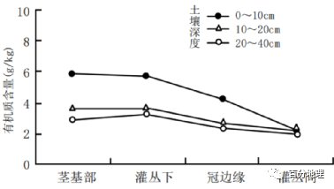   

1．下列灌丛所形成的微气象条件，与“肥岛效应”的发生关联性最小的是（  ）   
A．降低风速   
B．截留雨水   
C．提供遮荫   
D．减小温差   
2．下列植物结构形态中，“肥岛效应”最显著的是（  ）   
A．枝条稠密，伞形树冠   
B．根系发达，锥形树冠   
C．树干高大，旗形树冠   
D．针状叶片，疏散树冠   
<span style="color: rgb(255, 0, 0);">1.D灌丛下的土壤养分相对周围空地更肥沃，其原因有：灌木能降低风速，截获风吹蚀的表土物质和尘埃；截留雨水，将植物的有机质带到树冠下；树冠成为动物遮荫的地点，其排泄物为土壤增肥。ABC正确。而树冠底温差较小与土壤肥力的增加关系不大，D错误。本题选择关联性最小的，所以选D。   
2.A枝条稠密，伞形树冠，其覆盖面积越大，遮荫范围越大，落叶也越多，截获风吹蚀的表土物质和尘埃也就多，“肥岛效应”越显著，A正确。根系发达、锥型树冠、树干高大、旗形树冠、针状叶片、疏散树冠不利于截留风吹蚀的表土物质和尘埃，所以“肥岛效应”较差，BCD错误。所以选A。   
【点睛】“肥岛效应"指干旱半干旱地区的灌丛下方土壤养分富集，肥岛效应强度与灌丛生长状况密切相关。灌丛的冠面越大，蒸腾量越大，灌丛的植株越大，生长所需水量越多。灌丛未完全退化前，冠下水、土、肥数量均高于灌丛间空旷地带。</span>   
（2021·山东·南海新区高中高三阶段练习）2021年8月北京市小明曾到图示群岛中甲岛（图1）旅游，在甲地沿海地区拍摄到的“旗形”树景观图（图2），据导游介绍该地树形主要是自然因素造成的。据此完成下面小题。   

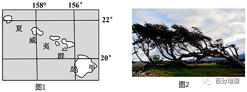   

3．推断甲地沿海树木成为“旗形”的主要影响因素是（  ）   
A．光照   
B．风力   
C．降水   
D．气温   
4．图中“旗形”树冠的朝向最可能为（  ）   
A．西南   
B．正南   
C．东南   
D．西北   
<span style="color: rgb(255, 0, 0);">3．B甲地沿海树木成为“旗形”的主要影响因素是全年受东北信风的影响， 树木向风面（东北面）的芽体由于受风的袭击而损坏，或者过度蒸发而造成死亡，因此向风面不长枝条；而背风面（西南面）的芽体则因受风的影响较小而存活较多，长年累月就形成了“旗形”树，B正确。降水和气温不会形成“旗形”树，BD错误；植物有趋光性，但在自然状态下不会形成“旗形”树，A错误。所以选B。</span>   
<span style="color: rgb(255, 0, 0);">4．A根据上题分析， 树木向风面不长枝条，背风面的芽体则因受风的影响较小而存活较多，甲地全年受东北信风的影响，所以树冠的朝向最可能为西南方向，A正确，BCD错误。所以选A。</span>   
<span style="color: rgb(255, 0, 0);">【点睛】树木的枝叶只生长在树干的一侧，远看就像一面旗子插在地上，这就是旗形树。盛吹定向强风的地方(如高山和海岸边)，有一些树木向风面的芽体由于受风的袭击而损坏，或者过度蒸发而造成死亡，因此向风面不长枝条；而背风面的芽体则因受风的影响较小而存活较多。有的树木，它的向风面虽然能长出枝条，但这些枝条也因受风的压力影响而弯向背风的一侧，这些原因，使得这一带的树木基本上都变成了旗形树。我们根据旗形树树冠的朝向，就可以知道这里的常见风是什么风向。</span>   
下图为我国南岭（25°N）同一树种旗形树冠分布图。据此完成下面小题。   

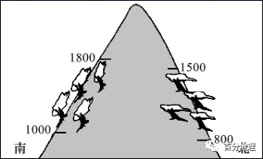   

5．该山地的盛行风向是（  ）   
①北坡一北风   
②南坡一南风   
③南坡一北风   
④北坡一南风   
A．②④   
B．①②   
C．②③   
D．①③   
6．图中导致南北坡森林带分布高度差异的主要影响因素是（  ）   
A．水分、光照   
B．热量、水分   
C．光照、土壤   
D．土壤、热量   
7．南岭主要的植被类型是（  ）   
A．落叶林   
B．硬叶林   
C．常绿林   
D．针叶林   
<span style="color: rgb(255, 0, 0);">5.A根据图中材料信息显示，该处为南岭，根据图中南坡树冠朝向北侧可知南坡盛行的风向为南风，②正确。北坡为下降风，所以来自南方，因此北坡盛行风是从南坡吹来下沉的风，④正确。故选A。   
6．B山地垂直方向上随海拔升高热量、水分均发生变化，导致不同高度植被带不同，同时南北两坡随海拔升高水热条件的变化幅度不同，因此同一自然带在两坡的分布高度有差异。故选B。   
7．C南岭属于亚热带季风气候，植被应为亚热带常绿阔叶林；落叶林是温带地区植被，硬叶林是较干旱地区的植被，针叶林是亚寒带地区植被，故选C。</span>   
（2021·北京朝阳·高三期末）太白山为秦岭主峰。今年暑假，某中学生参加了秦岭研学实践活动。图1为该学生绘制的太白山垂直带谱示意图，图2（a）、图2（b）分别是在山顶、山腰拍摄的“旗帜树”照片，从侧面看旗帜树的枝叶只在一侧繁盛，如旗面，而在另一侧稀疏，如旗杆。据此，完成下面小题。   

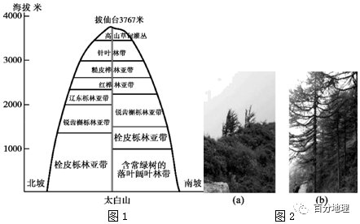   

8．太白山（  ）   
A．南北坡均处亚热带   
B．山麓以落叶林为主   
C．缺少针阔混交现象   
D．南坡比北坡林带少   
9．太白山顶南坡多为低矮且叶角质层厚的草甸，北坡多为灌木丛。其主要原因是南坡比北坡（  ）   
A．气温低，积雪多   
B．光热强，水分少   
C．风力大，土层薄   
D．晴天多，温差大   
10．旗帜树形成的主要影响因素是（  ）   
A．（a）﹣﹣盛行风   
B．（a）﹣﹣光照   
C．（b）﹣﹣滑坡体   
D．（b）﹣﹣土壤   
<span style="color: rgb(255, 0, 0);">8.B据图可知，太白山南坡基带为含有常绿树的落叶阔叶林，位于亚热带。太白山为秦岭主峰，秦岭是我国亚热带和暖温带的分界线，因此可知北坡不在亚热带，而是属于暖温带，A错误。太白山南坡基带为含有常绿树的落叶阔叶林，北坡基带栓皮栎为落叶林，因此可知太白山山麓以落叶林为主，B正确。针叶林带与糙皮桦林亚带之间有针阔混交现象，C错误。据图1信息可知，南坡与北坡林带数量相同，D错误。故选B。   
9．B太白山南坡多为低矮且叶角质层厚的草甸，北坡多为灌木丛，主要是因为南坡为阳坡，太阳辐射强，光照强，气温高，因此蒸发旺盛，水分条件差，不适合灌木丛生长，只能生长低矮且叶角质层厚的草甸，B正确。南坡为阳坡，比北坡气温高，A错误。冬季西北风风力强劲，因此北坡风力更大，C错误。温差大小对南北坡植被不同的影响较小，D错误。故选B。   
10．A（a）旗帜树位于山顶，主要是因为山顶定向强风的影响，导致背风一侧枝叶繁盛，如旗面，而在迎风一侧枝叶稀疏，与光照关系不大，A正确，B错误。（b）旗帜树位于山腰，受地形影响，接近山体的一侧枝叶比较稀疏，CD错误。故选A。   
【点睛】在高山和海岸边，我们常常会见到这样的一些树木--它们的枝叶只生长在树干的一侧，远看就像一面绿色的旗子插在地上，这就是旗形树。在盛吹定向强风的地方，有一些树木向风面的芽体由于受风的袭击而损坏，或者过度蒸发而造成死亡，因此向风面不长枝条；而背风面的芽体则因受风的影响较小而存活较多，虽然能生长枝条，但也比正常树木的枝条少很多。</span>   
（2021·河南·商城县观庙高级中学高三阶段练习）武夷山国家公园内森林植被茂密，植物种类繁多，其中黄山松呈明显的单向生长的旗状树特征。下图示意武夷山不同海拔高度植被类型分布及旗状树景观图。读图完成下面小题。   

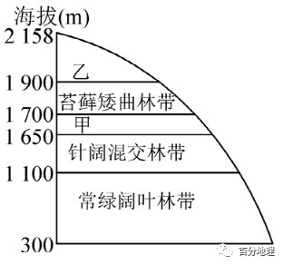   

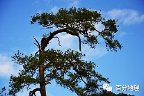   

11．推测黄山松的生长环境特征（  ）   
A．地势低平   
B．土壤肥沃   
C．热量充沛   
D．风力强劲   
12．甲、乙两处可能的垂直自然带类型分别是（  ）   
A．高寒灌丛、高山草甸   
B．高寒灌丛、温性针叶林   
C．温性针叶林、高山草甸   
D．温性针叶林、积雪冰川   
13．武夷山旗状树主要分布在海拔（  ）   
A．300米~1100米   
B．1100米~1700米   
C．1700米~1900米   
D．1900米~2100米   
14．与低海拔地区相比，考察队员发现高海拔地区土壤有机碳含量高的原因（  ）   
A．植被凋落物多   
B．微生物活性高   
C．常年低温环境   
D．植被种类丰富   
15．近几十年高山草甸区的土壤有机碳含量呈减少趋势，其主要原因（  ）   
A．风力增大   
B．气温升高   
C．降水增多   
D．地形变陡   
<span style="color: rgb(255, 0, 0);">11．D根据材料“黄山松呈明显的单向生长的旗状树特征”和结合图片可以推测黄山松的生长环境特征为风力强劲，在风的吹拂下形成了旗状树特征，D正确。黄山松所在地黄山属于山地地形，不符合地势低平的环境特征，A错误。由于黄山松生长于山地地形，地形陡峭使得土层较薄，土壤不满足肥沃的特征，B错误。黄山地区虽位于我国南方但是由于地势高使得热量降低，因此热量充沛错误，C错误。故选D。   
12．C读武夷山不同海拔高度植被类型分布图可知甲地位于1650-1700米，甲地下部为针阔混交林带，乙地位于1900-2158米，乙地下部为苔藓矮曲林带。随着海拔的上升，热量和水分及其组合影响自然带的分布，自然带垂直递变规律与自然带纬度递变规律有相似之处。根据甲地下部为针阔混交林带和上部为苔藓矮曲林带可以得出甲地可能的垂直自然带类型为温带针叶林；由于甲上部仍为森林，因此甲不会出现灌丛，排除AB。根据乙地下部为苔藓矮曲林带和自然带的递变规律，推测苔藓矮曲林带上部应为草原或草甸分布，结合选项推测最可能的是高山草甸而不会直接递变为冰雪带，排除D，选C。   
13．B旗状树单向生长，主要受常年盛行风的影响，相比而言，300米~1100米海拔相对较低，风力较强，不是   
旗状树主要分布区，A错；结合旗状树照片可知，旗状树属于森林植被，不属于高山草甸或苔藓矮曲林   
，所以其集中分布海拔高于1700米的可能性不大，CD错；黄山松的旗状特征表现得较为明显，所以旗状   
树主要为针叶林，结合图示信息可知，主要分布在海拔1100米~1700米范围内，B正确，故选B。   
14．C土壤有机碳含量主要是土壤腐殖质、植物残体和微生物体的含量，与低海拔地区相比，高海拔地区海拔较高，常年处于低温环境，微生物活性弱，有机质的分解速度较慢，土壤有机碳的含量高，C正确，B错；高海拔地区植被覆盖度有限，植被总量有限，凋落物并不是很多，A错；相比于低海拔地区而言，   
高海拔地区水热环境较差，植被种类并不丰富，D错。故选C。   
15．B近几十年来，随着全球气候变暖，气温升高，高海拔地区气温条件改善，微生物活动增强，土壤有机   
碳的分解加快，高山草甸区的土壤有机碳含量呈减少趋势，B正确；并不是因为高山草甸区风力增强或降水增多，AC错；地形变化不大，D错。故选B。   
【点睛】影响山地垂直自然带谱复杂程度的因素(1)山体所在纬度——相同高度的山体，纬度越低，自然带谱越复杂。(2)山体海拔——纬度相当的山体，海拔越高，自然带谱越复杂。(3)山顶、山麓之间相对高度——相对高度越大，自然带谱越复杂。</span>   
旗形树是由于强风的影响而长成的。有的树木，它的向风面虽然也能长出枝条，但枝条也因受风的压力而弯向背风的一侧。由于这些原因，就形成了树冠迎风招展的旗形树。我们从它树冠的朝向，就可以判断这里的风向。   
如图为成都某学生暑假时在非洲西南端好望角附近（34°S）拍摄的某海边停车场照片，图中树木的奇特造型是自然形成的。据此完成下面小题。   

   

16．图中树木的叶子   
A．一年一枯   
B．表层有蜡质   
C．叶片大而厚   
D．形状呈针状   
17．图中树木树形奇特的主要影响因素是   
A．光照   
B．降水   
C．大风   
D．气温   
18．图中停放的车辆车头朝向   
A．东北方向   
B．西北方向   
C．东南方向   
D．西南方向   
<span style="color: rgb(255, 0, 0);">16．B好望角属于地中海气候，夏季炎热干燥、冬季温和多雨，植被为亚热带常绿硬叶林，A错误；地中海气候区夏季炎热干燥，典型植被为硬叶林，硬叶林叶面有蜡质，可减少蒸发，防止水分流失，B正确；叶片大有利于水分的蒸发，该地夏季炎热干燥，叶片较小可减少水分散失，C错误；常绿硬叶林叶片较小，但不会呈针状，D错误。故选B。   
17．C好望角南部临海，周边陆地面积少，海洋摩擦力小，西风风力强盛，长期受大风影响，树冠枝叶偏向一侧，形成图示奇特的树形，C正确；光照、降水、气温对树木形状影响较小，不会导致树冠枝叶完全偏向一侧。故选C。   
18．B好望角位于南半球的地中海气候区，当地树木受盛行西北风的影响，树冠枝叶偏向东南方，图示车头朝向正好与树冠朝向相反，因此车头朝向西北方向。故选B。</span>   
（2022·四川·邻水实验学校高二阶段练习）位于天山西段伊犁州新源县吐尔根乡、海拔约1300米的伊犁河支流巩乃斯河北岸的沙土斜坡上，有一大片野杏林，杏树都是倾斜的，当地人称“醉汉林”（如图）。这是一片中世纪遗留下的最大的原始野杏林，最佳游览时间在4月初到5月初。据此完成下面小题。   

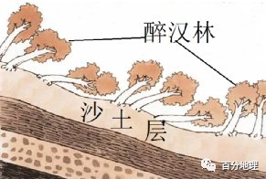   

19．“醉汉林”形成的主要要原因是（  ）   
A．强烈地震，地面滑坡   
B．强劲的冬季风   
C．沙土斜坡，土壤冻融   
D．水土流失严重   
20．这片中世纪遗留下来的、最大的原始野杏林，能保留至今的最重要原因是这里（  ）   
A．灌溉水源充足   
B．沙土土壤肥沃   
C．地形平坦开阔   
D．气候温暖湿润   
21．游客4月中旬到此看到巩乃斯河水位上涨，分析其原因是（  ）   
A．坎儿井引水量大   
B．当地春雨绵绵   
C．季节积雪融水量大   
D．冰川融水量大   
22．游客4月下旬来到吐尔根乡，还能欣赏到（  ）   
A．辽阔草原   
B．大漠风光   
C．千里冰封   
D．水乡风貌   
<span style="color: rgb(255, 0, 0);">19．C结合材料，该地位于天山西段，海拔约1300米左右，纬度高，海拔较高，存在冻土，当地位于河流北岸的沙土斜坡，土壤季节性冻融，加之沙土层本身稳定性较差，在重力等因素的影响下，树木向海拔较低的一侧倾斜，C正确。强烈的地震、滑坡以及水土流失等会对当地森林植被造成彻底破坏，不会使植被呈现图示形态，AD错。图示信息显示，醉汉林树木整体呈倾斜状态，而强劲的冬季风主要影响树冠的朝向和形态，B错。故选C。   
20．D该地位于天山西段伊犁河支流，结合所学地理知识，该地受中纬西风影响，气候温暖湿润，植被生存的自然环境相对较好，从而使得该地的原始野杏林能够保留至今，D正确。该地为原始野杏林，并没有人为灌溉，A错。沙土水肥易下渗，肥力条件一般，B错。地区以山地为主，地势起伏较大，C错。故选D。   
21．C该地冬季受西风影响，降雪量较大，冬季气温较低，积雪量较大，来年三四月前后，春季气温回升，大量积雪融化补给河流，导致河流水位上涨，C正确。坎儿井引水灌溉农田，会使河流水位下降，A错。该地河流春季主要受季节性积雪融水补给，而非雨水补给，与春雨关系不大，B错。冰川融水主要在七八月，D错。故选C。   
22.A4月前后，当地草场植被返青，游客还能欣赏到辽阔的草原，A正确。相比于新疆其他地区，当地气候相对温暖湿润，大漠风光不是当地独具特色的风景。同时，相比于江南地区而言，该区域整体降水偏少，所以也不会在当地欣赏到水乡风貌，BD错。4月积雪早已融化，不能欣赏到千里冰封的景观，C错。故选A。   
【点睛】植被分布与环境关系密切，主要受气候（光照、热量、水分、盛行风向）、地形（海拔的影响、坡向的影响、坡度的影响）、土壤（土壤水分、肥力、通透性、热量等）等因素的影响。</span>   
火地岛是南美洲大陆最南端的岛屿，森林覆盖率高。该岛屿西部和南部山地为安第斯山脉余脉，东部和北部为平缓低地，岛上雪线高度仅500～800米。下图示意火地岛地理位置及该岛屿某地“醉汉树”景观。据此完成下面小题。   

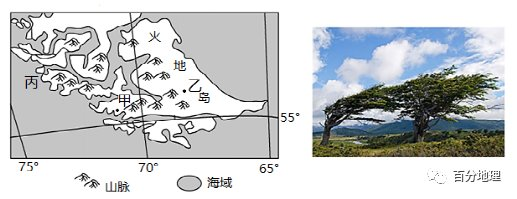   

23．关于图示岛屿的叙述，正确的有（  ）   
①西部沿岸暖流增湿，东部沿岸寒流减湿   
②山脉大致呈南北向，山脉阻挡，形成西部多雨区和东部雨影区   
③岛上湖泊多为冰川作用形成   
④地处太平洋板块与美洲板块碰撞挤压处，多火山地震   
⑤岛上“醉汉树”的树冠朝向东南   
A．①②③   
B．③④⑤   
C．①③④   
D．②③⑤   
24．当火地岛西部南部山地“青山雪峰”景观最显著的季节，以下描述合理的是（  ）   
A．索马里沿海渔民忙于出海捕鱼   
B．意大利罗马城温和多雨   
C．我国南极长城站正处极昼期   
D．墨西哥湾飓风活动频繁   
<span style="color: rgb(255, 0, 0);">23．D读图可知，火地岛西部有秘鲁寒流流经，具有降温减湿的作用，东部有巴西暖流流经，具有增温增湿的作用，①错误；火地岛上的山脉走向为南北走向，该地处西风带的控制下，山地西坡为迎风坡降水多，东坡为背风坡、雨影区，降水少，②正确；火地岛上地形以山地为主，海拔高气温低，且该地受西风漂流的影响较大，降温幅度大，因此火地岛上的湖泊多为冰川作用形成的，③正确；根据六大板块的分布可知，火地岛处于南极洲板块与美洲板块的挤压碰撞处，多火山地震，④错误；由图可知，火地岛处于南半球西风带，南半球西风带为西北风，常年受西北风带吹拂，该地的树冠迎风（西北侧）一侧生长受损，逐渐形成“醉汉树”，因此，“醉汉树”的树冠朝向东南，⑤正确，该题选D。   
24．B当火地岛西部南部山地“青山雪峰”景观最显著的季节为南半球的夏季时，此时为北半球的冬季1月份，此时索马里沿岸为暖流控制，不属于捕鱼的旺季，A错误；意大利罗马为地中海气候区，此时为冬季，受西风的控制，温和多雨，B正确，我国南极长城站纬度低于极圈，没有极昼极夜，C错误，墨西哥湾飓风活动频繁为北半球夏季，此时为北半球冬季，飓风活动少，D错误，故选B。   
【点睛】外力作用及其举例：风力侵蚀：蘑菇石，风蚀柱，风蚀洼地；风力堆积：沙漠和黄士；流水侵蚀(物理现象)   
：河谷，沟壑；流水溶蚀(化学现象)   
：喀斯特地貌；流水沉积：冲积扇，冲积平原,河口三角洲；冰川侵蚀：冰川槽谷(U型谷)   
,冰斗,角峰,刃脊，冰蚀湖等。</span>   
二、综合题   
25．（2022·河北·邢台市第二中学高三阶段练习）阅读图文材料，完成下列要求。   
火地群岛位于南美洲南段，主岛火地岛呈三角形。火地群岛西部和南部为山地，雪线高度仅500～800m，海岸线曲折，多幽深的峡湾；东部和北部为平缓低地，海拔180～600m，海岸线较为平直。火地群岛南部的沼泽地中，还发现很多树木匍匐在地，树冠形状奇特，被称为“倒木”。下图示意火地群岛区域位置。   

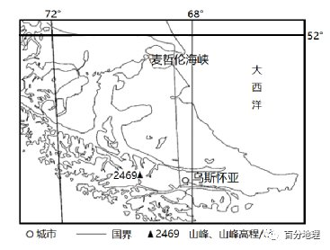   

(1)简述火地群岛西侧雪线较低的原因。   
(2)说明火地群岛南部“倒木”的形成过程。   
(3)试分析火地群岛西侧海岸线曲折的原因。   
<span style="color: rgb(255, 0, 0);">【答案】 (1)火地群岛西侧位于西风带的迎风坡，降水量多；火地群岛西侧受沿岸寒流影响，气温较低。   
(2)沼泽地中多冻土发育，树木根系较浅；冻土融化后，树木被西风吹拂，向一侧倒伏，形成“倒木”。   
(3)火地群岛西侧位于美洲板块与南极洲板块交界处，地壳运动活跃；火地群岛西侧受盛行西风影响，常年受海浪侵蚀；火地群岛附近有冰川发育，受冰川侵蚀作用强。   
【解析】本题以火地群岛为材料，涉及影响雪线的因素、整体性以及海洋地貌的相关知识，考查学生图片材料信息提取能力、地理知识调用分析能力，体现了区域认知、综合思维以及地理实践力的地理学科核心素养。(1)火地群岛所处纬度较高，气温较低；该地受南半球盛行西风的影响，岛屿西侧位于山地的迎风坡，降雪较多；该地西侧有寒流流经，降温作用明显，导致火地群岛西侧雪线较低。(2)根据材料，火地群岛南部是沼泽地，土地松软；该地纬度位置较高，气温较低，多冻土发育，导致树木根系发育不良，根系较浅；在长期盛行西风的影响下，树木出现倒伏，形成“倒木”。(3)根据图示信息可知，该地位于美洲板块与南极洲板块交界处，地壳活跃，岩层破碎；该地所处纬度较高，冰川广布，受冰川侵蚀的影响，形成幽深的峡湾；该地常年受盛行西风带的影响，风浪较大，沿海地区受海浪侵蚀较强，导致该群岛西侧海岸线曲折破碎。</span>   
26．（2022·山东·莱阳一中高三阶段练习）阅读图文材料，回答下列问题。   
泰加林（寒温带针叶林）横贯欧亚大陆与北美大陆等高纬度地区，是地球上分布面积最辽阔的森林生态系统。在我国境内，泰加林仅分布于大兴安岭北部和新疆阿尔泰山。内蒙古自治区根河市位于大兴安岭北段西坡，是我国泰加林的主要分布区之一，流经该地的激流河河谷宽阔，河道弯曲，左图示意根河市位置，右图为根河市全年气候图。   

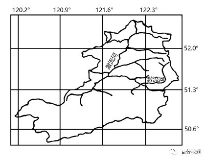   

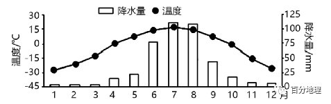   

(1)根据泰加林在世界及我国的分布位置，推测泰加林的性长习性。   
(2)根河市河流两岸树木侧根发达，树形是倒伏状，试分析原因。   
<span style="color: rgb(255, 0, 0);">【答案】 (1)泰加林分布在高纬地区，故耐寒；分布区年降水量充足，故喜湿。   
(2)河流两岸地下水位高，有永久性冻土层，主根难以穿越冻土，侧根水平生长较发达；雨水及河水浸泡，及较强的冬季风，使树木呈倒伏状。   
【解析】本题以泰加林为情境，设置两道小题，考查植被习性、气候类型分布等知识点，重点考查获取和解读信息的能力以及区域认知、综合思维等学科素养。   
(1)由材料可知，泰加林（寒温带针叶林）横贯欧亚大陆与北美大陆等高纬度地区，在我国境内，泰加林仅分布于大兴安岭北部和新疆阿尔泰山，由于泰加林分布在高纬地区，所以耐寒；我国大兴安岭北部和新疆阿尔泰山气候湿润，年降水量充足，所以喜湿。   
(2)植被生长形态与自然环境息息相关，主要受土壤、气候（气温、降水、风等）等因素影响。根河市位于内蒙古自治区大兴安岭北段西坡，纬度高且海拔高，气温低，河流两岸地下水位高，有永久性冻土层，主根难以穿越冻土，所以侧根水平生长较发达；大兴安岭北段西坡位于西北季风的迎风坡，风力强劲加之雨水及河水浸泡，使树木呈倒伏状。</span>   
27.（2021·湖南师大附中高三阶段练习）阅读图文资料，完成下列要求。   
永久冻土区是一个特殊的地理单元，它分为上下两部分，下面是永冻层（四季不化），上面是活动层。考察发现，冬季冻土活动层冻结、收缩、开裂，从水平方向看，地表被分割成了多边形网状，即多边形土（下图左）；从垂直方向看，活动层和永冻层上部出现的裂隙中就会形成冰楔（下图右）。由于气温变化、大量积水或人们改变冻土环境等原因，导致冰楔融化，地面开始坍塌，热融湖塘开始出现，湖水吸热，传到周边，继续引起周边冰楔融化和下面冻土融化热融湖塘开始扩大，热融湖塘扩张以湖岸坍塌为主要形式。热融湖塘里的甲烷气泡上升过程中，被冰封住，形成美丽的冰泡湖。   

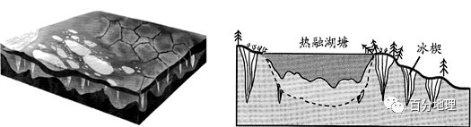   

(1)说明永久冻土区冰楔的形成过程。   
(2)分析永久冻土区热融湖边出现“醉树（树木歪斜）”现象的原因。   
(3)推测永久冻土区热融湖塘甲烷气泡的来源。   
<span style="color: rgb(255, 0, 0);">【答案】 (1)冬季地表冻结，土壤开裂形成裂隙；活动层融化，融水和降水顺裂隙下渗；水分到达永冻层后冻结形成冰楔。   
(2)冻土活动层消融，土质松软；地下为永久冻土，树木根系较浅；热融湖湖岸坍塌，树木容易倒伏。   
(3)热融湖水生植物在湖中生长，其有机体死亡、腐烂后转化为甲烷气体排放出来。   
【解析】本题以永久冻土区的形成为材料背景，主要考查永久冻土区冰楔的形成过程，以及自然地理现象的形成原因。难度相对较大，需要调动所学知识，并从材料图文信息中获取关键的信息，再结合题目要求进行分析。考查了学生灵活运用基础知识，从材料获取地理信息，运用地理原理分析并解决问题的能力。   
（1）根据材料信息，从垂直方向看，活动层和永冻层上部出现的裂隙中就会形成冰楔。可知，形成冰楔首先要有地表裂隙，然后水源顺着裂隙下渗，再冻结形成冰楔。结合该地所处的环境可知，主要是因为冬季地表冻结，导致土壤开裂形成裂隙。根据材料永久冻土区是一个特殊的地理单元，它分为上下两部分，下面是永冻层（四季不化），上面是活动层。当活动层融化时，融水和降水顺着土壤裂隙下渗。之后水分到达永冻层后因温度低而冻结形成冰楔。   
（2）根据题目信息，久冻土区热融湖边出现“醉树（树木歪斜）”现象。树木歪斜，说明扎根不稳，从而容易歪斜。根据材料信息，永久冻土区是一个特殊的地理单元，它分为上下两部分，下面是永冻层（四季不化），上面是活动层。活动层会消融，冻土冻结和消融的同时使得土壤产生冻融作用，使得土质松软，树木扎根在上，容易歪斜。活动层之下为永久冻土层，四季不化，导致树木难以扎根，树木根系较浅，易歪倒。根据材料信息，湖水吸热，传到周边，继续引起周边冰楔融化和下面冻土融化，热融湖塘开始扩大，热融湖塘扩张以湖岸坍塌为主要形式。热融湖湖岸坍塌，导致树木容易倒伏歪斜。   
（3）根据材料信息，热融湖塘里的甲烷气泡上升过程中，被冰封住，形成美丽的冰泡湖。说明热融湖塘里的甲烷气泡是来自于湖泊底部，甲烷是结构最简单的碳氢化合物，需要有生物提供碳而生成，热融湖中有水生植物在湖中生长，当水生生物死亡，腐烂变质后转化为甲烷气体排放出来。从而导致热融湖塘里的甲烷气泡上升。</span>   

   