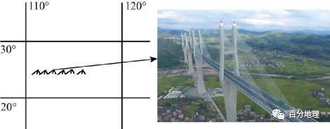
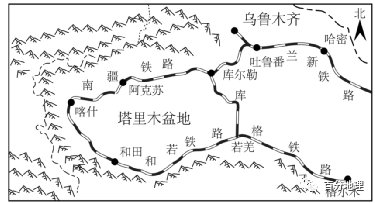

# 微专题之077桥

```
本专题摘自“百分地理”公众号，如有侵权请告之删除，谢谢。联系hhwxyhh@163.com
```

------
（2023·全国·高三专题练习）随着我国经济的发展，基建能力获得了巨大的进步，建造了众多高难度的世界级桥梁，我国南方某山地中的大桥即是其中一座（如下图所示）。该桥主跨380米，是世界上唯一一座规模庞大的高墩大跨四塔预应力混凝土斜拉桥。主要桥墩呈独特的“小蛮腰”造型，同一桥墩下的地下承重桩多达34根且长度不等，桩长度差值最大可达58米。读下图，依据所学知识完成下面小题。   
   
   
1．该大桥主桥墩承重桩桩差极大，是因为（  ）   
A．地下基岩起伏不平   
B．地表高低起伏不平   
C．建造难度各不相同   
D．永久冻土反复冻融   
2．相对国内传统桥塔造型的H形和A形，“小蛮腰”造型可以（  ）   
A．降低桥墩自重   
B．减小建造难度   
C．适应自然环境   
D．增加坚固程度   
<span style="color: rgb(255, 0, 0);">1．A．该大桥在施工过程中，因桥位处强岩溶发育带和断层破碎带，基岩起伏不平，同一承台下34根桩最大桩长差达58米，创世界桥梁史上同一承台下群桩最大桩长差，A正确；桥墩需要打在基岩上，与地表起伏关系不大，B错误；大桥主桥墩在同一区域建设，建造难度相差不大，C错误；该桥位于亚热带地区，地表没有永久冻土，D错误。故选A。</span>   
<span style="color: rgb(255, 0, 0);">2．D小蛮腰是力与美的结合，不但线形美观，而且刚度增加了7倍，故D正确；不能降低桥墩自重，A错误；增加了建造难度，B错误；是为了克服自然环境的不利因素，C错误。故选D。</span>   
<span style="color: rgb(255, 0, 0);">【点睛】2016年10月28日，创下桥梁建设七个“世界第一”的湖南汝郴高速赤石特大桥正式通车运营。这是继矮寨特大悬索桥后，湖南建成的第二座世界级特大桥，同时标志着国家高速公路网厦(厦门)蓉(成都)高速公路湖南段全线贯通。</span>   
（2022·山东·昌乐二中高三阶段练习）库克海峡位于新西兰南岛（人口约110万人）和北岛（人口约360万人）之间，由地壳沉陷而成，两侧是峭壁悬崖，海岸线曲折。该海峡南北长205km，东西宽14～23km，水深71～457m，水流湍急多变。该海峡迄今未修筑跨海大桥或海底隧道。下图示意库克海峡地理位置。据此完成下面小题。   
   
   
3．库克海峡水流湍急的原因最可能是（  ）   
①海水较浅，潮流能量聚集②台风频繁，风力强劲③盛行西风风力强劲④西北侧有喇叭口形海域，水道较窄，两岸陡峻   
A．①②   
B．③④   
C．①③   
D．②④   
4．库克海峡表层海水的流向是（  ）   
A．自东向西   
B．自西向东   
C．自北向南   
D．自南向北   
5．库克海峡迄今未修筑跨海大桥的主要原因是（  ）   
①水深流急，工程量大，技术难度大②海底地壳不稳定，对桥梁威胁大③阻挡水上航道，影响海上交通④两岛人口、城市较少，交通需求较小   
A．①③④   
B．②③④   
C．①②④   
D．①②③   
<span style="color: rgb(255, 0, 0);">3．B ．从图中可以看出，库克海峡位于盛行西风带，盛行西风风力十分强劲，③对；西北侧有面向西风的喇叭口形海域，水道较窄，两岸陡峻，加快了海流速度，④对；该海域远离大陆架海水深，不受台风影响，①②错；故B选项正确，ACD错误。故选B。</span>   
<span style="color: rgb(255, 0, 0);">4．C据图所知，库克海峡西北侧有面向西风的喇叭口形海域，在盛行西风的作用下，大量海水进入，从而使库克海峡的海水自北向南流，C选项正确。故选C。</span>   
<span style="color: rgb(255, 0, 0);">5．C库克海峡水深流急，修筑跨海大桥的工程量大，技术难度大，总体费用高，①正确库克海峡位于太平洋板块与印度洋板块的交界地带，地壳活动频繁，在此处建桥存在严重的安全风险，②正确；桥梁会阻挡水上航道，但该问题可通过桥梁结构的改良来克服，③错误；新西兰人口不足500万人，且大多居住在北岛，南岛人口约占全国人口的1/4，且跨海大桥投资较大，而当地的交通需求并不大，④正确。故选C。</span>   
<span style="color: rgb(255, 0, 0);">【点睛】科学技术因素对交通建设的影响：在科技水平比较低的时代或地区，自然因素的影响往往是最主要的，自然因素限制和主导了交通线路的发展和布局；但在科技水平比较高的时代或地区，自然因素的影响程度逐渐下降，社会经济因素成为最主要的因素。</span>   
（2022·河南·模拟预测）2022年6月16日起，和田至若羌铁路（以下简称和若铁路）正式开通运营。和若铁路开通运营后，形成了世界首个沙漠铁路环线——长达2712公里的环塔克拉玛干沙漠铁路环线。塔克拉玛干沙漠一年有7个月是风季，火车在沙漠中运行，风沙是最大的威胁。为了抵御风沙侵袭，和若铁路在风沙区域修建了“过沙桥”，并应用了智能灌溉技术，确保植被成活率。下图示意环塔里木盆地铁路环线和铁路景观图。据此完成下面小题。   
   
   
6．为了从根本上防风固沙，铁路沿线还进行了大量的治沙工程，下列该线治沙工程主要作用对应合理的是（  ）   
A．草方格沙障——阻沙   
B．高立式沙障带——固沙   
C．“过沙桥”——导沙   
D．乔木植被——固沙   
7．下列关于和若铁路开通前后，和田到内地的线路最佳选择正确的是（  ）   
A．开通前∶和田——若羌——库尔勒——哈密——内地   
B．开通后∶和田——若羌——乌鲁木齐——内地   
C．开通前∶和田——若羌——乌鲁木齐——格尔木——内地   
D．开通后∶和田——若羌——格尔木——内地   
8．和若铁路没有设计成高速铁路的主要原因是（  ）   
A．高速铁路对沿线生态环境的破坏更大   
B．高速铁路不宜进行货运，普通铁路可以客货兼运，用途更广   
C．沿线自然条件复杂，建设高铁技术要求高   
D．沿线风沙会影响高速铁路的运行速度   
<span style="color: rgb(255, 0, 0);">6．C 草方格沙障其作用是增加了地表粗糙度，降低风速从而使得风携带沙尘的能力下降，减小风力侵蚀，有利于固沙作用，A错误；高立式沙障高度大，可以有效减小风速，发挥阻沙作用，从而使得风携带沙尘的能力下降，使沙尘在铁路外围沉积，减少对已建成铁路的掩埋，B错误；利用“过沙桥”为风沙提供通过路径，发挥导沙作用，C正确；当地水资源缺乏，不适合使用高大的乔木，D错误。综上所述，选C。</span>   
<span style="color: rgb(255, 0, 0);">7．D结合图示，和若铁路开通前，和田到若羌无铁路连通，因此AC错误；开通后和田群众可通过若羌经青海省格尔木后直通内地城市，不必再绕道乌鲁木齐，D正确。</span>   
<span style="color: rgb(255, 0, 0);">8．B普通铁路可以客货兼运，用途更广，更有利于铁路沿线的人流、物流的流通，更好促进经济发展，B正确；铁路建设提高了开放程度，铁路与高铁相比对沿线生态环境的破坏更大，A错误；虽然该铁路环塔克拉玛干沙漠，该地自然条件复杂，沿线风沙大，但是我国的技术、资金可以解决这些困难，因此C、D错误。故选B。</span>   
若克雅特大桥是和若铁路的控制性工程之一。大桥长约10千米，平均墩高24米，最高桥墩达35米，是和若铁路全线最高特大桥。大桥建设中采用预制拼装化技术，先在工厂先预制加工构件，后运到现场拼装。下图为若克雅特大桥在和若铁路的位置图。据此完成下面小题。   
   
   
9．修建若克雅特大桥，平均墩高24米的目的是（  ）   
A．减少风沙影响   
B．预留野生动物通道   
C．降低山洪威胁   
D．减少地面起伏   
10．大桥建设采用模块运至现场拼装的方式，最主要的原因是（  ）   
A．该地缺少建设材料   
B．降低原材料的运输费用   
C．减少现场施工的时间和难度   
D．降低对沿线地区生态环境的影响   
<span style="color: rgb(255, 0, 0);">9．A 根据图中信息，结合所学内容可以判断出若克雅特大桥修建在塔克拉玛干沙漠附近，受沙漠风沙环境影响较大，因此建若克雅特大桥，平均墩高24米的目的是减少风沙影响，A正确。该地区位于沙漠附近，野生动物较少，所以平均墩高24米的目的不是预留野生动物通道，B错误。该地区降水较少，山洪威胁较小，所以平均墩高24米的目的不是降低山洪威胁，C错误。减少地面起伏不是平均墩高24米的目的，D错误。故选A。</span>   
<span style="color: rgb(255, 0, 0);">10．C由于该地区自然环境相对较为恶劣，并且人口数量较少，劳动力较少，基础设施不完善，所以大桥建设采用模块运至现场拼装的方式，最主要的原因是减少现场施工的时间和难度，C正确。该地缺少建设材料、降低原材料的运输费用与降低对沿线地区生态环境的影响均不是大桥建设采用模块运至现场拼装的方式最主要的原因，ABD错误。故选C。</span>   
<span style="color: rgb(255, 0, 0);">【点睛】若克雅特大桥平均墩高24米，最高桥墩达35米，是和若铁路全线最高特大桥，和若铁路位于新疆和田地区和巴音郭楞蒙古自治州境内，全长约825公里，全线共有特大桥19座，其中若克雅特大桥长9.7公里，桥墩平均高24米，最高达35米，是和若铁路全线最高特大桥，该桥地处流动性沙地中，地表分布风积沙，危害特别严重，为减轻风沙对铁路的影响，在该路段采用过沙桥的通过方式，让沙从桥下过，车在桥上走。</span>   
（2022·福建·泉州市第六中学高三阶段训练）我国西部山区山高谷深，在这里修建高速公路和高速铁路，常常是高架桥与隧道相连，工程量大，技术要求高，施工难度大，单位里程建设资金是平原地区的数倍。如图为2018年5月16日，航拍贵阳市郊五条高铁线路“五洞五桥”景观，一列动车驶出隧道。据此完成下面小题。   
   
   
11．与传统的盘山迂行布局相比，高架桥与隧道相连布局的主要条件是（  ）   
①自然条件的限制减弱②得益于桥隧技术的成熟   
③有足够的资金量投入④区域交通运输需求大增   
A．①②   
B．②③   
C．③④   
D．①④   
12．贵阳市郊五条高铁线路“五洞五桥”景观形成的自然因素是（  ）   
A．地形   
B．气候   
C．河流   
D．生物   
<span style="color: rgb(255, 0, 0);">11．B 与传统的盘山公路相比，高架桥和隧道大大缩短了路程，但是对技术和资金要求很高，故得益于桥隧技术的成熟和足够的资金量投入，②③正确；采用高架桥与隧道相连布局并不是自然条件的限制减弱，也不是区域交通运输需求大增，而是因为技术成熟了，资金投入充足了，①④错误。所以B正确，ACD错误。故选B。</span>   
<span style="color: rgb(255, 0, 0);">12．A读图可知，贵阳市郊"五洞五桥”穿越了众多高山，故影响其形成的因素是地形，A正确；气候、河流、生物不是景观形成的主要自然因素，ABD错误。故选A。</span>   
<span style="color: rgb(255, 0, 0);">【点睛】在贵阳市乌当区，高铁沪昆线、贵广客运专线、贵开城际客运专线的隧道和桥梁交织在一起，形成“五洞五桥”并行的壮观景象。作为中国唯一没有平原支撑的省份，贵州在喀斯特高原架起2万余座桥梁，在群山峻岭间建出“高速平原”。贵州的桥梁数量多、类型全、技术复杂、施工难度极大，创造了数十项“世界第一”。覆盖梁桥、拱桥、悬索桥、斜拉桥等，几乎包揽了当今全部桥型，是名副其实的“桥梁博物馆”。世界高桥前100名中，40余座在贵州。从海拔500多米的赤水河谷，到海拔2000多米的乌蒙高原，一座座架设在高山峡谷间的世界级大桥，让天堑变通途。</span>   
13．（2022·北京·高三专题练习）阅读图文材料，完成下列要求。   
2021年7月25日，“泉州：宋元中国的世界海洋商贸中心”项目，顺利通过第44届世界遗产大会评审，成为我国第56处世界遗产。下图为“宋元‘海上丝绸之路’泉州通航地区示意图”。   
   
   
2021年11月30日，国内首座跨海高速铁路桥——福厦高铁泉州湾跨海大桥成功实现全桥贯通。大桥全长20.287千米，海上部分长8.96千米。下图为福厦高铁部分线路示意及大桥景观图。   
   
   
结合泉州湾跨海大桥所在地的自然环境特征，说明大桥在设计、施工时为保障安全运行需要考虑的问题。   
<span style="color: rgb(255, 0, 0);">【答案】大桥跨越泉州湾海域，风速大，天气复杂；海水腐蚀性强，对工程设备材料的影响大；海浪、风暴潮等海水运动的影响；地处板块交界地带附近，地壳运动活跃（地质条件复杂）。</span>   
<span style="color: rgb(255, 0, 0);">【解析】观察图中信息，泉州地处台湾海峡沿岸，天气变化大，海风盛行，风力较大；且海水对工程的建筑具备一定的腐蚀性和破坏性，故应当选择耐腐蚀材料，以免造成不可挽回的损失；我国东部沿海地区，特别是福建省台湾省，易受台风引起的风暴潮侵袭，施工时应注重天气预报，且海浪侵蚀不可忽视；位于太平洋板块和亚欧板块交界地带，地壳活跃，应加强对海底地质勘察。</span>   
14．（2022·广东广州·高三阶段练习）阅读图文资料，回答下列问题。   
东山岛位于福建漳州，与大陆仅以一条狭窄的潮流水道隔开。20世纪50年代建成八尺门海堤后，大堤两侧的海底表层沉积物明显发生了变化。下图反映东山岛的八尺门区位和八尺门（大桥）中线海底地层剖面图。随着多座跨海大桥建成，八尺门海堤于2021年11月被拆除。   
   
   
(1)指出建堤前、后，海峡海底沉积物发生的变化。   
(2)解释建堤前、后，海底沉积物变化的地质过程。   
(3)合理推测该地以跨海大桥替代海堤的原因。   
<span style="color: rgb(255, 0, 0);">【答案】(1)沉积物厚度和种类增加。</span>   
<span style="color: rgb(255, 0, 0);">(2)前：河流流向与季风方向一致，以及受到狭管效应的影响，流速快，沉积物少。</span>   
<span style="color: rgb(255, 0, 0);">后：建堤后，阻挡海水运动，流速慢，沉积物增多。</span>   
<span style="color: rgb(255, 0, 0);">(3)海堤阻挡海水交换，影响海水净化；海堤阻挡海水运动，流速慢，增加泥沙淤泥，增加洪涝灾害；海水水质变差，海洋生态环境遭到破坏。</span>   
<span style="color: rgb(255, 0, 0);">【解析】（1）从海底地层剖面图可知，建堤前受潮流运动影响海底沉积物少，建堤后，潮流冲刷作用减弱，海峡海底沉积物厚度和种类增加。（2）建堤前潮流运动以冲刷侵蚀为主，河流流向与季风方向一致，由于水道狭窄受到狭管效应的影响，风速增强，流速快，冲刷侵蚀作用强，沉积物少。建堤后潮流运动减弱，以沉积作用为主，建堤后阻挡海水运动，流速减慢，沉积物增多。（3）跨海大桥替代海堤的原因从海堤对海洋环境的影响思考，从水质恶化角度分析，海堤阻挡海水交换，堤坝内部水体与外界交换减弱，水体更新时间加长，影响海水净化，海水水质变差，海洋生态环境遭到破坏，对水产养殖带来影响；从泥沙淤积角度分析，海堤阻挡海水运动，流速慢，增加泥沙淤泥，增加洪涝灾害，破坏周边区域的生命财产安全。</span>   
15．（2022·浙江温州·高二阶段练习）阅读图文材料，完成下列问题。   
材料一新疆和田至若羌的和若铁路是国家中长期铁路网规划中西部地区重要区域路网干线，2022年6月16日正式开通运营，塔里木盆地铁路环线形成（左图）。   
材料二和若铁路经过昆仑山脉北麓和世界第二大流动性沙漠塔克拉玛干沙漠南缘之间，全长825.476公里，设计时速120公里/小时，其中受风沙影响长度534.77公里，占线路总长度的65%，全年有7个月是风季。   
材料三：针对部分区段风沙大、沙丘动态迁移容易掩埋线路的问题，在风沙特别严重的地段，采取“以桥代路”的方案，即修建“过沙桥”（右图），让风沙从桥下穿过。全线这样的“过沙桥”共5座，长度接近50公里，其中最长的一座达18.6公里，大幅降低了沿线风沙对线路的威胁。   
   
   
(1)指出和若铁路运行过程中面临的最大难题，并分析原因。   
(2)说明设计“过沙桥”的作用。   
(3)说明和若铁路开通的重要意义。   
<span style="color: rgb(255, 0, 0);">【答案】(1)风沙问题。铁路经过流动沙漠边缘，里程长，沙源丰富；沿线风力大，风季长；植被稀少，地面缺乏保护。</span>   
<span style="color: rgb(255, 0, 0);">(2)有利于风沙流经过，减少风沙沉积，减少风沙对铁路的掩埋。</span>   
<span style="color: rgb(255, 0, 0);">(3)维护民族团结；促进少数民族振兴；巩固国防安全；推动丝绸之路经济带建设等。</span>   
<span style="color: rgb(255, 0, 0);">【解析】（1）阅读图文材料，结合所学知识可知，和若铁路经过昆仑山脉北麓和世界第二大流动性沙漠塔克拉玛干沙漠南缘之间，因此风沙是条路运行过程中最大的难题。主要是由于该线路经过的是沙漠边缘，且属于流动沙漠，距离很长，属于我国最大的沙漠边缘，沙源丰富；区域内植被覆盖很低，因此地面的保护和降低风速等的几乎没有；属于温带大陆性气候，较长季节的风力较大，对沿线的造成影响较大。（2）根据题意，结合材料和所学知识可知，由于和若铁路沿线的风沙问题较为严重，“过沙桥”的设计，可以促使风沙经过，不受阻挡沉积，因此“过沙桥”可以有效的减少风沙对铁路的掩埋问题。（3）根据题意，结合所学知识可知，该铁路的开通，可以有效的促进区域之间的联系，加强经济文化的交流，促进经济带的建设和发展；同时可以促进我国的民族团结，振兴该区域的少数民族；也可巩固我国西边的国防安全。</span>   
16．（2022·广东梅州·一模）阅读图文材料，回答下列问题。   
材料一：2022年6月16日，和田至若羌铁路（以下简称和若铁路）开通运营。至此，新疆铁路网进一步完善，形成世界首个沙漠铁路环线。左图为新疆铁路网分布图。   
材料二：和若铁路位于塔克拉玛干沙漠的南缘，全长825公里，有534公里分布在风沙区，占线路长度65%，风沙对铁路建设和运营的危害非常严重。   
材料三：为降低沿线风沙对线路设备质量和行车运输安全的影响，在风沙特别严重的地段，和若铁路采取“以桥代路”的工程防沙方案；铁路桥的桥墩采用工程预制拼装化技术（在工厂先预制加工构件，再运到现场安装），右图为铁路拼装施工图。   
   
   
(1)据图描述南疆铁路的空间分布特点，并说明原因。   
(2)分析和若铁路桥墩采用工程预制拼装化技术建设的好处。   
(3)分析和若铁路贯通对南疆经济的促进作用。   
<span style="color: rgb(255, 0, 0);">【答案】(1)空间分布特点：分布在盆地边缘（周围）/山麓地带/沙漠边缘/绿洲地带；呈环状。</span>   
<span style="color: rgb(255, 0, 0);">原因：自然原因：①山麓地区地势（地形）平坦，施工难度小；②盆地边缘风沙侵蚀相对较弱，有利于延长铁路使用寿命。</span>   
<span style="color: rgb(255, 0, 0);">人文原因：③山麓绿洲地区人口/城市/聚落密集，运输需求量大。</span>   
<span style="color: rgb(255, 0, 0);">(2)该铁路工程量巨大，工程预制拼装技术可以缩短工期（或加快工程进度、缩短安装时间、提高工程效率）。当地自然条件恶劣，工程预制拼装技术可以提高工程质量，降低现场施工难度（或方便现场施工、降低风沙等不利条件对施工的影响）。当地生态脆弱，基础设施较落后，工程预制拼装技术可以减少对环境的影响（或保护环境、减少对当地水资源的消耗、减少对道路交通的影响）</span>   
<span style="color: rgb(255, 0, 0);">(3)①完善了南疆地区的铁路网，改善运输条件，提高运输效率；（完善了当地基础设施建设等同于完善了南疆地区的铁路网、交通网）②加强了沿线城市与外界的信息、物质等的经济联系；③促进沿线地区的资源开发，带动相关产业发展，将资源优势转变为经济优势，促进南疆地区经济繁荣；④改善了南疆的投资环境，利于吸引资金、技术、人才。</span>   
<span style="color: rgb(255, 0, 0);">【解析】（1）读图可知，南疆铁路主要围绕塔里木盆地边缘或山麓地带，呈环状分布。原因可从自然和社会经济两方面分析。自然原因：塔里木盆地边缘属于山麓冲积平原，地势（地形）平坦，施工难度小；山麓地带有高山冰雪融水，植被覆盖率较高，风沙活动相对较弱，有利于延长铁路使用寿命和行车安全。社会经济方面：山麓地带由于水源相对充足，多绿洲分布，人口、城镇（聚落）等较为密集，工农业较发达，运输需求量大。（2）“和若铁路位于塔克拉玛干沙漠的南缘，全长825公里，有534公里分布在风沙区”，和若铁路大部分线路位于风沙和戈壁的荒漠无人区，风沙季节漫长，自然环境恶劣，沿线施工用水及混凝土养护困难。采用传统的混凝土现浇法施工，其模板投入大、消耗材料和水资源多、人员劳动强度大、环保性差。与传统现浇施工方式相比，桥墩预制装配技术具有构件生产标准化、现场安装快速便捷、施工节能环保等优势，可以减少对环境和道路交通的影响，确保质量安全可靠、降低现场施工难度、提升工程品质和文明施工水平；“和若铁路采取“以桥代路”的工程防沙方案”，工程量巨大，铁路桥的桥墩采用工程预制拼装化技术，可以加快工程进度、缩短安装时间、提高工程效率，节省工期。（3）和若铁路的运营实现了与现有南疆铁路联通，构成环塔里木盆地铁路环线，完善了南疆地区的铁路网，改善运输条件，加快了新疆地区经济运转，提高运输效率；加强了沿线城市与外界的信息、物质等的经济联系；极大便利沿线各族人民群众出行和货物运输，带动沿线资源开发，带动相关产业发展，将资源优势转变为经济优势，促进南疆地区经济繁荣；和若铁路是新疆“东联西出、西来东去”的便捷通道，无论是向东去内地，还是向西去往中亚和欧洲，都将发挥安全快捷通道的作用，极大地改善了南疆的投资环境，利于南疆吸引资金、技术、人才促进区域经济发展。</span>   
17．（2022·湖南·   
邵东市第一中学高三阶段练习）阅读图文资料，完成下列问题。   
材料一：文莱位于加里曼丹岛西北部，领土被马来西亚分剖成西部的本土和东部的淡布隆地区，两地的往来采用水运或从马来西亚绕行。文莱人均收入很高，但经济结构单一，原油出口是其经济支柱。淡布隆地区拥有众多世界级自然保护区。淡布隆跨海大桥沟通了文莱首都地区和淡布隆区。中国企业承建了大桥的CC4标段（见下图）。桥梁的构件均在中国国内预制，通过海运运到施工现场直接组装。受新冠肺炎疫情的影响，文莱政府于2020年3月17日提前启用淡布隆跨海大桥。   
材料二：文莱的农业从业人员（包括林业和渔业）约占总劳动力的5%。种有小面积的水稻，还有橡胶、胡椒、椰子等热带农作物，80%食品依赖进口，大米自给率为25%。   
   
   
(1)分析CC4标段的桥梁构件选择在中国国内预制的原因。   
(2)与CC1标段相比，分析CC4标段建设难度更大的原因。   
(3)分析淡布隆跨海大桥提前通车对疫情防控的有利影响。   
<span style="color: rgb(255, 0, 0);">【答案】(1)文莱经济结构单一，桥梁构件生产制造能力弱;中国工业体系完善，生产制造能力强，利于提高效率，保证质量，降低成本;可采用海运，便于大型桥梁构件的运输;承建单位为中国企业，利于协作。</span>   
<span style="color: rgb(255, 0, 0);">(2)CC4标段地处雨林和沼泽地带，地基松软;沿海潮水易淹没施工地区;植被茂密，毒虫出没，地处自然保护区，环保要求高;地处经济落后地区，基础设施不完善;线路长，工程量大。</span>   
<span style="color: rgb(255, 0, 0);">(3)减少水运时人员的集聚，降低感染风险;不需要从他国绕行，降低疫情防控难度;缩短运程、提高运速，提高疫情防控效率。</span>   
<span style="color: rgb(255, 0, 0);">【解析】本题以文莱图文资料为材料，涉及到工业的区位因素、交通对区域发展的影响等知识，考查了获取和解读信息的能力以及综合思维等学科素养。</span>   
<span style="color: rgb(255, 0, 0);">（1）结合材料和所学知识：“经济结构单一，原油出口是其经济支柱”，可知文莱经济结构单一，基础设施建设能力弱，桥梁构件生产制造能力弱，不能自主生产桥梁构件；选择在中国国内预制主要是因为，中国的工业体系完整，工业基础雄厚，桥梁构件生产制造能力强，生产效率高，质量优，保障了工程建设的效率，缩短建设时间；“中国企业承建了大桥的CC4标段”，可知CC4标段的桥梁构件选择在中国国内预制，方便工程建设企业和桥梁构件企业之间的交流与协作；由“桥梁的构件均在中国国内预制，通过海运运到施工现场直接组装”可知桥梁的构件通过海运运输到文莱，运量大，运输成本低。（2）结合图和所学知识：与CC1标段相比，CC4标段线路长，工程量更大；CC4标段经过雨林和沼泽地带，土质较为松软，不利于桥梁的建设，需投入更多精力加固桥梁基座，建设成本较高；沼泽区连接海洋，施工地区易被涨潮时的海水所淹没，减缓施工进度；经过热带雨林区，植被茂密，毒虫较多，危害施工人员的安全；位于世界级自然保护区，对环保要求更高，施工难度大；该区域经济较落后，基础设施不完善，不利于施工。（3）结合材料和所学知识:“两地的往来采用水运或从马来西亚绕行”，淡布隆跨海大桥提前通车，相比水运，公路运输速度快，用时短，载客数量少，可减少水运时人员的集聚，降低感染风险；不需从马来西亚绕行，降低本国疫情防控难度；缩短了运输距离，减少了运输时间，提高了疫情防控效率。</span>   
51．（2022·重庆一中高三阶段练习）阅读图文材料，完成下列问题。   
城市跨座式单轨交通（如下左图）类似“空中小火车”，单轨使用的轨道只有一条，多以高架兴建，地面上只需很小的空间建造承托路轨的桥墩，单轨主要使用橡胶轮胎在轨道上运行，产生的噪声非常小，且相较于地铁每千米七八亿元甚至十几亿元的造价，单轨每千米只需三亿元左右。重庆先后建设的轨道交通2号线和3号线分别是我国第一条和世界最长最繁忙的跨座式单轨交通线（如下右图）。   
   
   
(1)指出重庆市交通建设的主要不利自然条件。   
(2)说明在已有2号线的基础上，重庆再建设3号线的目的。   
(3)简述重庆市选择建设跨座式单轨交通线的原因。   
<span style="color: rgb(255, 0, 0);">【答案】(1)以山地丘陵为主，地形崎岖；长江、嘉陵江经过，水面宽阔，跨江难度大。</span>   
<span style="color: rgb(255, 0, 0);">(2)进一步完善当地交通网；缓解现有交通运输方式的压力；经过更多站点，涉及更广泛的区域，满足更多居民出行需求；缩短居民出行时间等。</span>   
<span style="color: rgb(255, 0, 0);">(3)能够适应当地崎岖的地形；采取高架建设，有效节约土地；产生的噪声小，对居民生活健康影响小；有利于节约建设成本等。</span>   
<span style="color: rgb(255, 0, 0);">【解析】（1）结合影响交通运输布局的因素，重庆地形以山地为主，地势起伏大，交通运输建设难度大，有长江、嘉陵江经过，水面宽阔，水流速度快，跨江建桥工程难度大。（2）结合所学知识：重庆加快建设3号线的目的可以借鉴交通运输布局对区域发展的影响来答。结合材料“重庆先后建设的轨道交通2号线和3号线分别是我国第一条和世界最长最繁忙的跨座式单轨交通线”，可知3号线修建可以缓解现有交通运输方式的压力；完善当地交通网；再结合右图，可知3号线相比2号线，经过更多站点，涉及更广泛的区域，人们出行需求多，3号线修建可以满足更多居民出行需求；缩短居民出行时间，提高出行效率。（3）结合材料：“单轨使用的轨道只有一条，多以高架兴建，地面上只需很小的空间建造承托路轨的桥墩”，可知跨座式单轨交通线，采取高架建设，占地面积小，可以有效节约土地；“单轨主要使用橡胶轮胎在轨道上运行，产生的噪声非常小”，可知跨座式单轨交通线产生的噪声非常小，对居民生活环境影响小；“相较于地铁每千米七八亿元甚至十几亿元的造价，单轨每千米只需三亿元左右。”可知跨座式单轨交通线每千米造价低，有利于节约建设成本。</span>   
   
   
   
   