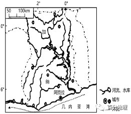
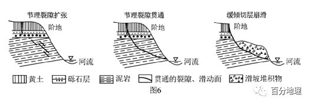

# 微专题之078节理构造

```
本专题摘自“百分地理”公众号，如有侵权请告之删除，谢谢。联系hhwxyhh@163.com
```

------
（2022·全国·高三专题练习）读我国某地区地质构造图(图中字母为地质年代，地层由早到晚依次为O、C、P、K，地层产状的短线为坡面倾斜方向，坡度为倾斜角度；褶皱中背斜的核部地层最老，向斜的核部地层最新)。据此完成下面小题。   

   
1．图示甲区域（  ）   
A．为背斜，O3为核部   
B．为向斜，P为核部   
C．为背斜，P为核部   
D．为向斜，O3为核部   
2．图示地质活动（  ）   
A．变质带形成于断层活动之后   
B．岩浆活动形成于断层之后   
C．断层活动形成于P后K前   
D．造成花岗岩分布区被侵蚀成河谷   
<span style="color: rgb(255, 0, 0);">1．B图示甲区域核心部分岩层为P，年龄新，往两翼去为C、O，从中心向两翼越来越老，中间新两翼老，为向斜，A、C错；P地质年代最新，位于向斜核部，B对，D错。故选B项。</span>   
<span style="color: rgb(255, 0, 0);">2．C分析地质构造分布图可知，图示区域变质带位于花岗岩与地层O3的接触带上，是与岩浆活动同步形成的，断层错断了花岗岩和变质带，说明岩浆活动和变质作用在褶皱形成之后，断层形成之前，A、B错；断层错断了P，但是对K没有影响，形成于P后K前，C对；花岗岩分布区为凸起的高地，虽受侵蚀，但不是河谷，D错。故选C项。</span>   
<span style="color: rgb(255, 0, 0);">【点睛】地质构造主要有褶皱(背斜、向斜)和断层，其判断主要依据地下岩层的变形、变位；同时看有无火山构造，有无岩层缺失，如背斜顶部的岩层缺失。在地质剖面图中判断背斜和向斜的可靠依据是岩层的新老关系，即“中心老，两翼新”为背斜，“中心新，两翼老”为向斜。岩层存在断裂并出现位移时，根据相对位移方向判断断层构造。一般而言，沉积岩层下老上新，岩浆侵入体或断层、褶皱、火山喷发晚于其所在的沉积岩层。总之，之后出现的破坏是在原有基础上形成的。</span>   
（2022·黑龙江·齐齐哈尔市实验中学高三阶段练习）下图示意成贵铁路四川乐山至宜宾段沿线气田、油气构造分布。据此完成下面小题。   

   
3．影响乐山至宜宾段铁路隧道建设的主要自然障碍是（  ）   
A．岩溶发育   
B．有害气体富集   
C．冻土广布   
D．生态脆弱   
4．乐山至宜宾气田区铁路选线应采用的合理对策是（  ）   
A．绕避气田及背斜核心区   
B．深隧道穿越气田核心区   
C．高路基穿越气田核心区   
D．高桥梁穿越气田核心区   
<span style="color: rgb(255, 0, 0);">3．B据图可知，该段天然气田多，天然气及其他有害气体浓度高，铁路隧道建设可能导致天然气泄露，危害大。因此有害气体是控制线路隧道工程施工及运营安全的重要因素，B正确。岩溶发育为喀斯特地貌，主要分布于云贵高原，A不选；此地为四川盆地，冬季气温高，不可能有冻土发育，C不选；此地为我国南方，降水，气温都较高，植被茂密，生态环境较好，D不选。故选B。</span>   
<span style="color: rgb(255, 0, 0);">4．A由于气田具有极大的安全风险，因此铁路选线首要是绕避气田核心区，从源头上避开安全风险；线路无法完全绕避时，选择从天然气浓度较低、范围最窄的地段通过；通过天然气地段的铁路工程宜采用桥梁、路基通过；当受其它条件控制，以隧道通过时，宜采用浅埋、短隧道工程通过，A正确，排除BCD。故选A。</span>   
<span style="color: rgb(255, 0, 0);">【点睛】背斜：中心老，两翼新；储油储气构造； 建采石场，开挖隧道的良好构造。</span>   
（2022·浙江·高三阶段练习）浅点碍航水域的整治是港口航道维护的一项重要工作。下图为利用浅地层剖面仪技术获取的某地海底地质分层剖面示意图。据此完成下面小题。   

   
5．获取浅点碍航地层剖面数据需要（  ）   
A．借助BDS测定海底地质构造   
B．利用RS技术获取地层数据   
C．利用GIS测定海域水深数据   
D．利用VS模拟该地水流速度   
6．该地地质构造和水流作用特点为（  ）   
①甲处为火山，水流沉积作用强   
②乙处为地堑，水流冲刷作用强   
③甲处为背斜，水流冲刷作用强   
④乙处为向斜，水流沉积作用强   
A．①②   
B．③④   
C．①③   
D．②④   
<span style="color: rgb(255, 0, 0);">5．B.BDS一般指北斗卫星导航系统，具有定位、导航等功能，无法测定海底地质构造，A错误；遥感（RS）是通过遥感器这类对电磁波敏感的仪器，在远离目标和非接触目标物体条件下探测目标地物，能够获取地层数据，B正确；GIS一般指地理信息系统，能够分析地理信息数据，无法测定海域水深数据，C错误；VS是一个基本完整的开发工具集，无法模拟该地水流速度，VM可以对地下水数值进行模拟，D错误。故选B。</span>   
<span style="color: rgb(255, 0, 0);">6．B从地质构造而言，甲处岩层中间老，两翼新，为背斜，乙处岩层中间新，两翼老，为向斜，①②错误，乙处沉积物覆盖可知水流沉积作用强，甲处阻挡海水运动，水流冲刷作用强，③④正确，B正确，ACD错误。故选B。</span>   
<span style="color: rgb(255, 0, 0);">【点睛】遥感广泛应用于资源调查(对矿产资源、水资源、土地资源、各种生物资源、海洋资源等进行识别、清查、监测、评估)灾害监测(如水旱灾害、地质灾害、生物灾害等进行监测，有助于防灾减灾)等。</span>   
（2023·全国·高三专题练习）福建土楼是客家文化的象征，是中原汉民族即客家先民沿黄河、长江、汀江等流域辗转迁徙后，将远古的土生建筑艺术发扬光大并推向极致的特殊产物。土楼的墙壁经过反复的夯筑，下厚上薄，厚处可达1.5m，屋顶大多采用“人字形”的双坡屋顶。据此完成下面小题。   

   
7．图中土楼反映了当地（  ）   
A．气候湿热   
B．河网密布   
C．地势低平   
D．地质稳定   
8．与方形土楼相比，圆形土楼（  ）   
A．减少实用面积   
B．防震性能减弱   
C．防御功能增强   
D．通风、采光减弱   
9．福建土楼建筑的特点为（  ）   
A．采用土墙建筑，防雨水侵蚀功能差   
B．有利于客家人和原住民的和谐共处   
C．圆形设计有利于收集雨水资源   
D．圆形构造稳定牢固，抗震性强   
<span style="color: rgb(255, 0, 0);">7．A由材料“屋顶大多采用‘人字形’的双坡屋顶，墙体厚实”可知，该地气候湿热，“人字形”屋顶有利于排水，墙体厚有利于隔热，A正确，BCD错误。故选A。</span>   
<span style="color: rgb(255, 0, 0);">8．C由于圆形没有死角，所以通风、釆光效果更好，D错误；圆形没有死角，因此实用面积更大，抵御外敌能力更强，A错误，C正确；圆形土楼能更均匀地传递水平地震力，因此有更强的防震性能，B错误。故选C。</span>   
<span style="color: rgb(255, 0, 0);">9．D结合材料可知，福建土楼，在修筑过程中墙壁经过反复的夯筑，下厚上薄，厚处可达1.5m，且上部有瓦遮挡，防雨水侵蚀的能力强，A错误；客家人原是中原一带汉民，因战乱、饥荒等各种原因被迫南迁。且客家人是单独住在一起，不利于与原住居民的和谐，B错误；南方降水多，圆形设计不是为了收集雨水资源，C错误；圆形构造稳定牢固，抗震性强，D正确。故选D。</span>   
<span style="color: rgb(255, 0, 0);">【点睛】福建土楼是客家文化象征，圆形土楼设计具有代表性，反映出当地地理环境特征。在使用面积、防震能力、军事防御和通风采光方面具有很重要意义。</span>   
（2022·湖南岳阳·高三阶段练习）大多数地质学家认为油气是地质时期有机物通过爱长的沉积压缩和加热后逐渐形成的。形成之后会渗透到附近的岩层中，在良好的倍油气构造中形成油气矿藏地。位于东非大裂容的来湖盆地层下层以湖泊相央功岩泥页岩为主，是油气生成的主要岩石：上层为三角洲相砂岩和湖泊相泥页岩互层分布。下图为湖盆岩层垂直制面国。据此完成下面小题。   

   
10．该湖盆地层上层形成砂岩和泥页岩互层分布，可推测该区域这时期（  ）   
A．地壳间歇式拾升   
B．湖面升降频繁   
C．地壳持续性张裂   
D．湖盆持续拾升   
11．该区域地层断层众多，其对油气资源富集成矿的主要作用是（  ）   
A．油气运移通道   
B．利于油气储存   
C．油气容易散失   
D．利于生成油气   
12．该湖盆地层中油气主要富集在砂岩上部，泥页岩下部。主要原因是（  ）   
①上部岩层颗粒细，孔隙少②下部岩层颗粒细，孔隙多   
③上部岩层颗粒粗，孔隙少④下部岩层颗粒粗，孔隙多   
A．①②   
B．②③   
C．③④   
D．①④   
<span style="color: rgb(255, 0, 0);">10．B据材料和图可知，该湖盆地层上层为三角洲相砂岩和湖泊相泥页岩互层分布，说明该区域陆地环境和湖泊环境交错出现，可推知主要是盆地上层形成时期湖面升降频繁所致。不能说明地壳间歇式拾升、地壳持续性张裂、湖盆持续拾升，ACD错误，B正确。故选B。</span>   
<span style="color: rgb(255, 0, 0);">11．A据图可知，该盆地地层中油气矿藏地主要储存在砂岩上部，泥页岩下部。又据材料可知夹砂岩泥页岩是油气生成主要岩石，形成后沿着断层运移至砂岩上部聚集，所以断裂发育为油气资源的运移提供了路径。断层众多不利于油气储存，油气容易散失不会使油气资源富集成矿，不会影响油气生成。A正确，BCD错误。故选A。</span>   
<span style="color: rgb(255, 0, 0);">12．D油气比软轻，容易向上运移，上部封闭性好的岩层，下部孔服度多的岩层有利于油气聚集，该区域岩层砂岩为三角洲环境形成，颗粒较粗，孔隙较多，利于储油气，而泥页岩为湖泊环境形成，颗粒较细，孔凰较少，是良好的封闭岩层。①④正确，②③错误。故选D。</span>   
<span style="color: rgb(255, 0, 0);">【点睛】储集层、圈闭构造和油气的运移是油气藏形成不可缺少的条件。</span>   
（2022·云南·昆明一中高三阶段练习）同一岩层顶部海拔相同的点的连线称为构造等高线。下图为我国东南丘陵中某地岩层构造等高线和地形等高线示意图，图中地形等高线的等高距是60米，山峰最高点海拔为1030米，读图完成下面小题。   

   
13．关于图示区域中河流描述正确的是（  ）   
A．自北流向南   
B．有凌汛现象   
C．位于向斜谷   
D．宜开发水能   
14．若构造等高线表示的是含煤地层，则煤层埋藏最深的是（  ）   
A．AB．BC．CD．D15．若B点处有一落差20米的樱布。则C点的海拔最可能为（  ）   
A．610～650米之间   
B．640～680米之间   
C．660～700米之间   
D．670～710米老间   
<span style="color: rgb(255, 0, 0);">13．C根据等高线“凸高为低”特征及指向标，河流应自南向北流；A错误。该区域为我国南方地区没有凌汛现象；B错误。河流所在的谷地中，图示地层均表现出中间低两侧高，故为向斜谷，C正确。图示河谷宽浅，且落差小，不宜修建拦水坝开发水能。D错误。故选C。</span>   
<span style="color: rgb(255, 0, 0);">14．D埋藏深度为地形等高线与埋藏等高线的差值，差值越大埋藏越深。D处的差值最大，D正确，ABC错误。故选D。</span>   
<span style="color: rgb(255, 0, 0);">15．C图中地形等高线的等高距是60米，根据地形等高线从海平面0m计数的特征可知，相距最高峰1030m最近的地形等高线数值为1020m，距离C点最近的地形等高线数值为720m。题中B点附近有20m的落差，故相对下游的C点取值范出应为660-700m。C正确，ABD错误，故选C。</span>   
<span style="color: rgb(255, 0, 0);">【点睛】埋藏深度为地形等高线与埋藏等高线的差值，差值越大埋藏越深。</span>   
（2022·湖北·高三阶段练习）下图示意我国某河谷剖面（所处河道平直）。据此完成下面小题。   

   
16．该河谷（  ）   
A．水流向北流   
B．易发生凌汛   
C．为背斜构造   
D．位于入海口   
17．若在图中乙岩层发现了中华龙鸟化石，则可能存在三叶虫化石的岩层是（  ）   
A．甲   
B．丙   
C．丁   
D．戊   
<span style="color: rgb(255, 0, 0);">16．C由图可以看出，该河谷所在的地区，岩层向上拱起，为背斜构造，C正确；该河流位于我国，河谷东岸河流沉积物较厚，为沉积岸，西岸为侵蚀岸，故该河段水流向南流，A错误；我国河流出现凌汛的河段多为自南向北流的河段，B错误；该河谷较深且呈“V”形，说明其流速快，下蚀较强，应位于上游，D错误。本题应选C。</span>   
<span style="color: rgb(255, 0, 0);">17．B中华龙鸟是恐龙的一种，主要生活在侏罗纪时期，三叶虫主要生活在古生代，故发现三叶虫的岩层较乙岩层年代老，一般情况下位于其下部，由此可知三叶虫化石不能位于甲，应位于丙处，故A错误，B正确；由图可以看出丁、戊岩层侵入到其他岩层中，为岩浆岩，不可能存在化石，CD错误。本题应选B。</span>   
<span style="color: rgb(255, 0, 0);">【点睛】岩层的形成顺序在没有发生地层倒转的前提下，岩层的形成顺序，一般遵循两个规则：①下老上新：下面的岩层老，上面的岩层新；②先形成后侵入：侵入岩会切断原有的岩层，原有岩层老，侵入岩新；③先形成后断裂：断裂会切断原有的岩层，原有岩层老，断层新。</span>   
（2022·河南濮阳·高三阶段练习）下图示意某区域地质剖面，①～⑩代表不同的岩层。据此完成下面小题。   

   
18．图示地质构造中（  ）   
A．最年轻的岩层是⑩   
B．③岩层可能部分变质成为大理岩   
C．⑩岩层的形成晚于⑨岩层   
D．断层因④⑤岩层张裂而形成   
19．图示k断层右侧缺失②③岩层的主要原因是（  ）   
A．地壳抬升，外力侵蚀   
B．地壳下沉，深埋地下   
C．气候剧变，缺少物源   
D．岩浆喷发，破坏原有岩层   
<span style="color: rgb(255, 0, 0);">18．C由图可知，花岗岩由地下往地表方向侵入到④岩层，表明④⑤岩层形成均老于侵入岩，而只有①③②岩层均未被侵入，可见③岩层不可能发生变质作用，B错误。根据所学知识，一个未经变动的岩层，下面的岩层总是比上面的岩层老。可知由老到新是③②①。且①岩层分布于最表层，为最年轻的岩层，A错误。⑨岩层被花岗岩⑩岩层侵入，故⑩岩层的形成晚于⑨岩层，C正确。断层主要是因侵入岩的侵入形成，进而导致④⑤岩层张裂，故④⑤岩层张裂是断层造成的结果，而不是成因，D错误。故选C。</span>   
<span style="color: rgb(255, 0, 0);">19．A由图可知，k断层左侧分布有②③岩层，右侧缺失②③岩层，结合k断层左侧④⑤岩层位置偏低，右侧位置偏高可知，k断层右侧地壳抬升，后受外力侵蚀作用，②③岩层被侵蚀掉，导致缺失，A正确，B错误。k断层左侧分布有②③岩层，说明当时当地有物源，C错误。岩浆未侵入到②③岩层，D错误。故选A。</span>   
<span style="color: rgb(255, 0, 0);">【点睛】底层缺失的可能原因：形成地层时当地缺乏物源；形成地层时当地地势高，物源难以沉积；当地形成了该地层，后地壳抬升，该地层被侵蚀掉。</span>   
（2022·全国·高三阶段练习）张掖世界地质公园地处祁连山与河西走廊的过渡带,是国内唯一的丹霞地貌与彩色丘陵景观复合区。下面为张掖世界地质公园地质剖面图。据此完成下面小题。   

   
20．图示地区中（  ）。   
A．两处断层受力后以水平错移为主   
B．丹霞地貌区泥岩形成最晚   
C．所有岩石形成均以外力作用为主   
D．砾岩比其他岩石搬运更远   
21．该地彩色丘陵区（  ）。   
A．中间部分岩层较老,两翼岩层较新   
B．地表受外力侵蚀作用微弱   
C．属于良好的储水地质构造   
D．石油、天然气等资源丰富   
<span style="color: rgb(255, 0, 0);">20．C根据图示可以看出，两处断层受力后以垂直方向上的错移为主，A项错误；丹霞地貌区岩层中，砾岩分布在最上层，其形成时间最晚，B项错误；该地区的岩石有砾岩、砂岩和泥岩，均为沉积岩，沉积岩在形成过程中会受到风化、侵蚀、搬运、堆积等外力作用的影响，C项正确；由于砾岩粒度比砂岩和泥岩的粒度都大，在搬运过程中搬运距离比砂岩、泥岩更近，D错误。故选C。</span>   
<span style="color: rgb(255, 0, 0);">21．C据图可知，该地彩色丘陵区地质构造属于向斜构造，该岩层结构具有中间部分岩层较新、两翼岩层较老的特点，属于良好的储水地质构造，而石油、天然气等资源主要集中在背斜地质构造内，故A、D两项错误，C项正确；该地岩层为沉积岩，受水平挤压、断裂抬升后，呈现出不同类型的岩层相间出露地表的特点，且向斜槽部为山地，说明该地受外力侵蚀作用显著，B错误。故选C。</span>   
<span style="color: rgb(255, 0, 0);">【点睛】向斜背斜的判断有两种方法：①根据岩层的形态：岩层向上凸起为背斜，向下凹陷为向斜。②根据岩层的年代：中间老、两侧新的为背斜，中间新两侧老的为向斜。</span>   
（2022·山东·昌乐二中高三阶段练习）岩层的埋藏深度（岩层顶部距地面的垂直距离）可以用来帮助恢复岩层的形态。下图示意我国西北部某地区地形剖面及其地下同一花岗岩埋藏深度。完成下面小题。   

   
22．花岗岩埋藏深度不连续的原因是（  ）   
A．褶皱构造   
B．断层构造   
C．地垒构造   
D．地堑构造   
23．下列地区沉积层最厚的是（  ）   
A．库木塔格沙漠   
B．阿克奇谷地   
C．山前冲积扇   
D．北山   
<span style="color: rgb(255, 0, 0);">22．B读图可知，花岗岩出现不连续的地区，对应地表为阿克齐谷地，该谷地两侧是山脉，可推测其是由于断裂下陷形成的，B正确；褶皱是岩层的弯曲变形，岩层是连续的，A错误；地垒、地堑构造分别是断层的上升岩块、下降岩块，不符合题意，C、D错误。故选B。</span>   
<span style="color: rgb(255, 0, 0);">23．B花岗岩之上为沉积岩，沉积岩的厚度看地表到花岗岩的相对高度，读图可知，阿克奇谷地距离花岗岩深度的相对高度最大，沉积岩最厚，B正确，ACD错误。故选B。</span>   
<span style="color: rgb(255, 0, 0);">【点睛】岩层的埋藏深度是指岩层距离地面的垂直距离，而地面就是地形剖面线，岩层的埋藏深度可以用来帮助恢复岩层的形态。</span>   
（2022·河北邢台·高三阶段练习）2022年9月10日晚19：30，由陕西省委宣传部指导，西安市人民政府主办的2022西安交响乐团大雁塔户外公演，在全网同步播出，累计观看量达1211万。其中《帕米尔我的家乡多么美》是由瞿琮作词、郑秋枫作曲的一首歌曲，由歌唱家和慧演唱，歌中唱到“云雀唱着歌在天上飞/帕米尔啊我的家乡多么美/牧场青青牛羊肥/青稞飘香惹人醉/卡拉苏清泉水/月亮湖红玫瑰……”。帕米尔高原地处我国的最西端，是亚洲多个主要山脉的汇集处，地质结构复杂，但在波斯语中意为“平顶屋”。高原上山脉之间多宽阔的河谷，宽谷中常见的景色有湖泊、河曲、草原、牛羊……，下图为“帕米尔高原地质构造图”。据此完成下面小题。   

   
24．帕米尔宽谷中湖泊众多的主要原因是（  ）   
A．海拔高，蒸发微弱   
B．冰川侵蚀，汇水成湖   
C．地下水位高，出露成湖   
D．河曲发育，积水成湖   
25．慕士塔格山的形成过程是（  ）   
A．地层断裂—垂直抬升—水平褶皱—板块挤压   
B．地壳下沉—形成断层—板块碰撞—地壳抬升   
C．地壳抬升—形成断层—板块碰撞—水平收缩   
D．板块挤压—水平褶皱—地层断裂—垂直抬升   
<span style="color: rgb(255, 0, 0);">24．D根据材料可知，帕米尔高原上山脉之间多宽阔的河谷，河谷宽阔处，往往发育较为弯曲的河流，曲流处，泥沙沉积较为明显，河流改道频繁，容易积水成湖，D正确。湖泊的形成，主要是由于洼地积水，蒸发微弱并非形成湖泊的主要原因，A错误。帕米尔宽谷的形成可能受冰川的侵蚀，其宽谷中湖泊的形成与冰川侵蚀关系不大，B错误；地下水出露并非形成当地湖泊的主要原因，C错误。故选D。</span>   
<span style="color: rgb(255, 0, 0);">25．D根据图示信息可知，慕士塔格山下部岩层发生明显弯曲，受板块挤压形成水平褶皱。其左侧存在公格尔断裂，由此可知，由于板块挤压，地层断裂，慕士塔格山所在区域相对垂直抬升，形成山地。所以该山的形成过程是板块挤压—水平褶皱—地层断裂—垂直抬升。故选D。</span>   
<span style="color: rgb(255, 0, 0);">【点睛】宽谷所在区域地势平坦，受高山冰雪融水补给等因素影响，河流在宽谷中流淌。由于地势平坦，河流侧蚀作用相对较强，河曲发育。河流存在明显的凹岸和凸岸，河流在凹岸侵蚀，凸岸堆积，河流改道频繁，废弃的河湾处容易积水成湖。</span>   
二、综合题   
26．（2022·黑龙江·鹤岗一中高三阶段练习）阅读图文材料，完成下列要求。   
肯尼亚奥卡瑞地热田位于东非裂谷带中央，这是非洲首个利用地热资源进行发电的地热田，断裂破碎带构成了深层流体（主要是地下天然蒸汽和热水）上涌的主要通道，地热井的生产能力受热源、断裂和裂缝分布、地层岩性影响。地热电站每天需消耗大量的水对设备进行冷却，地热电站水源取自附近纳瓦沙湖。这里年降水量为714mm，雨季主要在3-5月和10-11月。随着地下蒸汽的大规模开采需要地面进行人工回灌。下图示意奥卡瑞地区东部和西部典型地温曲线。   

   
(1)根据板块构造学说解释奥卡瑞地热田的形成原因。   
(2)指出奥卡瑞地区东西部地热田生产能力的差异，并说明理由。   
<span style="color: rgb(255, 0, 0);">【答案】(1)位于东非大裂谷地带，地壳运动活跃，板块张裂超过岩石承受能力，断裂发育，裂缝众多。雨季降水较丰富，雨水下渗后，被来自地球内部的热能加热后，以水蒸汽和热水的形式，沿断裂带裂隙溢出地表。</span>   
<span style="color: rgb(255, 0, 0);">(2)东部大于西部。东部地层温度随深度增加迅速增加，地热资源开发难度较小；东西部地层岩性不同，东部断裂带更多，地热资源更易溢出。</span>   
<span style="color: rgb(255, 0, 0);">【分析】本大题以肯尼亚奥卡瑞地热田为材料，设置两道小题，涉及板块构造学说等相关知识，重点考查学生的综合思维能力、区域认知能力、地理实践力等。</span>   
<span style="color: rgb(255, 0, 0);">（1）根据材料“奥卡瑞地热田位于东非裂谷带中央”可知这里位于板块张裂带，“断裂破碎带构成了深层流体(主要是地下天然蒸汽和热水）上涌的主要通道”可知，地热能与地下水结合生成的天然蒸汽和热水是地热电站的发电原料，所以答案可以从断裂带的发育原因和地热资源的溢出形式两方面分析。如位于东非大裂谷地带，地壳运动活跃，板块张裂超过岩石承受能力，断裂发育，裂缝众多。雨季降水较丰富，雨水下渗后，被来自地球内部的热能加热后，以水蒸汽和热水的形式，沿断裂带裂隙溢出地表。</span>   
<span style="color: rgb(255, 0, 0);">（2）由图可知，东部地区在地下2000米深度范围内，地层温度均高于西部地区。由此说明东部地区地热资源的生产能力和开发条件优于西部地区。根据图上的信息可知，东部地层温度随深度增加迅速增加，地热资源开发难度较小；东西部地层岩性不同，东部靠近其他火山，说明断裂带较多，热源丰富，地热资源更易溢出。</span>   
27．（2021·黑龙江·哈尔滨市呼兰区第九中学高三期中）读下面的“地质构造示意图”，回答下列问题（24分，每空2分）。   

   
(1)图中A、B、C三地，属于背斜的是____，属于向斜的是____，属于断层的是____。   
(2)图中所示的褶皱构造主要是由于地壳的____运动造成的。   
(3)从岩层的新老关系看，C是中心较____（填“老”或“新”）。   
(4)图中B处形成的地形是____，原因是____；C处形成的地形是____，原因是____。   
(5)要在图示直线的深度上修建一条南北向的地下隧道，在A、B、C三地应选择____地。   
(6)C、D两处找油气应在____处；找地下水应在____处。   
<span style="color: rgb(255, 0, 0);">【答案】(1)BCA(2)水平(3)新</span>   
<span style="color: rgb(255, 0, 0);">(4)谷地背斜顶部受张力，岩石破碎，易被侵蚀成谷地山地向斜槽部受挤压，岩石坚硬，不易被侵蚀，反而形成山岭(5)B(6) D C</span>   
<span style="color: rgb(255, 0, 0);">【分析】本题以地质构造示意图为材料，涉及地质构造及其应用等内容，考查获取和解读地理信息、调动和运用地理知识的能力，体现了区域认知、综合思维、地理实践力等学科素养。</span>   
<span style="color: rgb(255, 0, 0);">（1）图中A、B、C三地，B地岩层向上弯曲，为背斜，C地岩层向下弯曲，为向斜。A处岩层发生断裂并错动位移，为断层。</span>   
<span style="color: rgb(255, 0, 0);">（2）结合所学可知，图中所示的褶皱构造主要是由于地壳的水平运动造成的。</span>   
<span style="color: rgb(255, 0, 0);">（3）C处为向斜，中心岩层较新，两翼岩层较老。</span>   
<span style="color: rgb(255, 0, 0);">（4）图中B处地势低洼，为谷地地形，是因为该处为背斜，背斜顶部受张力，岩石破碎，被外力侵蚀从而形成谷地；C处地势高，为山地地形，是因为该处为向斜，向斜槽部受挤压，岩石坚硬，不易被外力侵蚀，反而形成山岭。　</span>   
<span style="color: rgb(255, 0, 0);">（5）修建地下隧道，应在岩层成拱形的背斜处，A、B、C三地中B地为背斜，适宜修隧道。</span>   
<span style="color: rgb(255, 0, 0);">（6）根据所学可知，背斜是良好的储油储气构造，向斜是良好的储水构造。C、D两处中C处为向斜，D处为背斜，因此找油气应在D处；找地下水应在C处。</span>   
27．（2022·广东湛江·高三阶段练习）阅读图文材料，完成下列要求（18分）。   
非洲加纳的传统民居（如右图）上部用草搭成，尖耸，形似圆锥，墙体浑圆，以胶泥筑就，底部垫上高约50cm的石块。2019年，中国某土木工程集团与加纳某国有单位签订建设8万套保障房项目的设计、采购、施工合同。该项目位于加纳首都大阿克拉地区。项目建成后将极大地改善加纳首都和各省首府地区的保障房紧缺形势。左图示意加纳首都阿克拉位置。   

   
(1)根据材料推测加纳传统民居可能存在的问题（6分）。   
(2)中国建筑集团在加纳建设住房遇到了诸多困难，试从社会经济方面简述其原因（6分）。   
(3)说明中国建筑集团产业转移对我国经济发展的积极影响（6分）。   
<span style="color: rgb(255, 0, 0);">【答案】(1)易遭水蚀、虫蛀；使用周期短，维修频繁；卫生条件差（6分）。</span>   
<span style="color: rgb(255, 0, 0);">(2)当地经济落后，协作条件差；建筑材料短缺；基础设施落后，水电供给、运输等条件差（6分）。</span>   
<span style="color: rgb(255, 0, 0);">(3)吸引中国建材、电力、管网、装饰、照明等生产企业转移；利于劳务输出，增加就业岗位；增加经济收入；扩大中国企业在外影响力；利于中国企业可持续发展（6分）。</span>   
<span style="color: rgb(255, 0, 0);">【分析】本题以非洲加纳为材料，涉及到地方文化与环境关系、工业区位因素、产业转移对区域的影响等知识，考查了获取和解读信息的能力以及综合思维等学科素养。</span>   
<span style="color: rgb(255, 0, 0);">【详解】（1）加纳的传统民居上部用草搭成，墙体以胶泥筑就，容易受到虫蛀和水蚀；当地降水量大，以草和泥为建筑材料的民居不够牢固，使用周期短，维修频繁；空间狭窄，通风采光条件差，卫生条件差。</span>   
<span style="color: rgb(255, 0, 0);">（2）加纳是非洲的发展中国家，经济落后，基础设施建设不足，道路交通、水电供给、通信设备等条件较差；产业落后，协作条件差；工业基础薄弱，建筑材料短缺；文化背景差异大，沟通交流存在一定困难。</span>   
<span style="color: rgb(255, 0, 0);">（3）中国建筑集团产业转移可带动中国建材、电力、管网、装饰、照明等相关产业，随之进行产业转移；有利于消化国内富余产能；有利于劳务输出，增加就业机会；可以增加工人收入，促进经济发展；有利于扩大中国企业在国际的影响力和地位；有利于中国企业走向世界，走上可持续发展道路。</span>   
28.（2022-2023学年度武汉市部分学校高三年级九月调研考试）阅读图文材料，完成下列要求。(24分)   
兰州市地处青藏高原东北缘、黄河上游，黄河穿城而过。兰州市境内黄土梁峁及深切   
河谷地貌发育，黄河两岸发育滑坡达130多处，大中型滑坡占50%,为地质灾害多发区。滑坡的频繁复活给兰州市居民带来了重大生命财产损失。图5示意兰州黄河河谷地质剖面，图6示意兰州黄河河谷滑坡形成过程。   

   

   
(1)分析黄河兰州段河谷多滑坡的原因。(10分)   
(2)据图6,简述黄河兰州段河谷滑坡的形成过程。(6分)   
(3)说明黄河兰州段滑坡发生时产生的主要危害及防治滑坡的措施。(8分)   
<span style="color: rgb(255, 0, 0);">【答案解析】(1) 地处青藏高原东北缘，板块交界附近；(2分)地壳运动活跃，断裂发育，(地形破碎)；(2分)河谷两岸地表黄土疏松，节理发育多，易崩塌；(2分)地处黄河上游，河流侵蚀作用强，河岸坡陡：(2分)夏季多暴雨，雨水下渗，易引发滑坡。(2分)(每点2分，共10 分)   
(2) 阶地地表黄土疏松，节理发育多，在雨水和重力的长期作用下，节理裂隙扩张；(2分)节理加深延长，上下节理裂隙贯通，形成滑动面；(2分)最后在雨水和重力进一步作用下，滑坡体下滑低处，形成滑坡堆积物。(2分)(每点2分，共6分)   
(3)危害：滑坡产生时， 给人民生命财产带来巨大威胁； 毁坏地表植被；侵占农田；毁坏交通设施；堵塞河道；引发泥石流等。(每点2分，任答2点得4分，其它合理答案可以酌情给分)  
防治措施：加强监测，做好预报，提前组织人员疏散和财产转移；通过“截、排、引”，将地表水和地下水引出滑坡区；采用锚杆、挡土墙等工程措施对滑坡体进行锚固和阻挡。(每点2分，任答2点得4分)</span>   

   

   