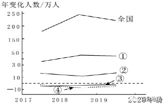
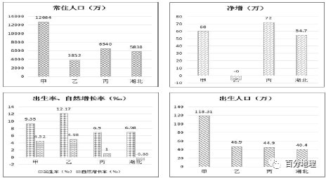
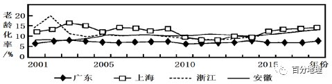
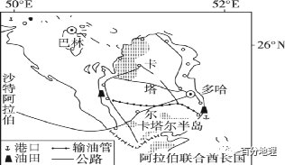
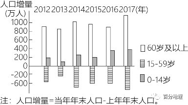
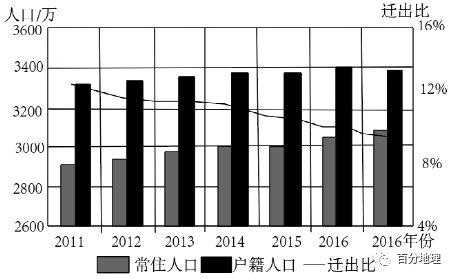
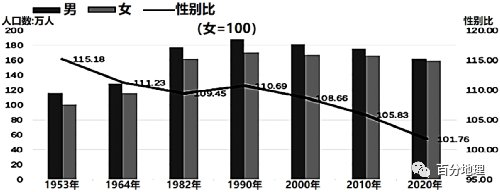
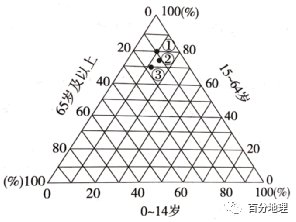
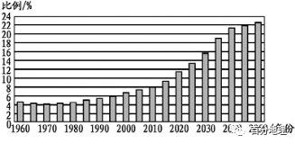
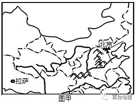

# 微专题之079人口问题

```
本专题摘自“百分地理”公众号，如有侵权请告之删除，谢谢。联系hhwxyhh@163.com
```

------
（2022·甘肃·高台县第一中学高三期中）下图示意近年来全国及部分省级行政区域小学生在校人数的年变化，图中①②③④四个省级行政区域表示河南省、黑龙江省、吉林省和广东省。读图，完成下面小题。   

   

1．图中①最可能是（  ）   
A．河南省   
B．广东省   
C．黑龙江省   
D．吉林省   
2．据图推测，近几年（  ）   
A．我国劳动力将会呈负增长   
B．①社会负担较轻   
C．②老龄化现象减轻   
D．③④迁入人口增加   
<span style="color: rgb(255, 0, 0);">1．B读图可以看出，①小学生人数增量远大于其他三个省级行政区域，应是因为经济发达，对劳动力人口吸引力较大，子女随父母迁移，就近人学所致，最可能是广东省。黑龙江省与吉林省由于老工业区的衰落，人口外迁严重，儿童减少，③④应是黑龙江省和吉林省，②是河南省，排除ACD；B符合题意，故选B。</span>   
<span style="color: rgb(255, 0, 0);">2．B由图可知，全国小学生人数总体呈增长趋势，增速有所减缓，但不是负增长；广东省小学生人数增长较多，是因为外来年轻人多，劳动力比重大，社会负担较轻；河南省是人口大省，外出劳动力较多，小学生人数增加，表明河南经济水平提高，外出务工人员有所减少，但由于人口出生率仍处于较低水平，老龄化现象短期内不会减轻；吉林省、黑龙江省小学生人数呈负增长，迁入人口不会增加，排除ACD；B符合题意，故选B。</span>   
<span style="color: rgb(255, 0, 0);">【点睛】人口老龄化是指人口生育率降低和人均寿命延长导致的总人口中因年轻人口数量减少、年长人口数量增加而导致的老年人口比例相应增长的动态。两个含义:一是指老年人口相对增多，在总人口中所占比例不断上升的过程;二是指社会人口结构呈现老年状态，进入老龄化社会。国际上通常看法是，当一个国家或地区60岁以上老年人口占人口总数的10%，或65岁以上老年人口占人口总数的7%，即意味着这个国家或地区的人口处于老龄化社会。</span>   
（2022·河南·高三阶段练习）河南是我国农业大省，也是流动人口第一大省。2020年，河南净流出人口达1483万，是我国人口净流出最多的省份。其中，流入苏浙沪的人口占河南总流出人口的近四成，比2010年前高出近一成。据此完成下面小题。   
3．苏浙沪吸引河南人口大规模流入的主要优势条件是（  ）   
A．地处沿海，降水丰富   
B．矿产丰富，农业基础良好   
C．纬度较低，气候温暖   
D．就业机会多，工资水平高   
4．大规模人口净流出导致河南农业（  ）   
A．田间管理精细化   
B．种田大户增多   
C．种植结构复杂化   
D．机械化率下降   
<span style="color: rgb(255, 0, 0);">3．D河南地处我国中部地区，是我国农业大省与人口大省，与东部发达的沿海省份具有较大的经济差距。苏浙沪经济发达，就业机会多，工资水平高，是其吸引河南人口大规模流入的主要优势条件，排除ABC；D符合题意，故选D。</span>   
<span style="color: rgb(255, 0, 0);">4．B大规模人口净流出，导致河南农业劳动力减少，为保障正常的农业生产，将促进土地流转，导致种田大户增多，农业机械化率提高，B正确，D错误。劳动力减少，不利于形成田间管理精细化和种植结构复杂化，排除AC。故选B。</span>   
<span style="color: rgb(255, 0, 0);">【点睛】流动人口是在中国户籍制度条件下的一个概念，指离开了户籍所在地到其他地方居住的人口，但目前尚无明确、准确和统一的定义。国际上，类似的群体被称为"国内移民"(internal migration)。2016年我国流动人口总数为2.45亿人。</span>   
（2022·湖北十堰·高三阶段练习）2021年5月11日，第七次全国人口普查结果公布，下图是我国四个省份人口数据。据此完成下面小题。   

   
5．表中甲、乙、丙分别对应的省份是（  ）   
A．甲-广东   乙-浙江   丙-贵州   
B．甲-浙江   乙-广东   丙-贵州   
C．甲-浙江   乙-贵州   丙-广东   
D．甲-广东   乙-贵州   丙-浙江   
6．2021年湖北省自然增长率为负数的直接原因是（  ）   
A．青壮年劳动力大量迁出   
B．出生率较低   
C．死亡率较高   
D．男女性别比失衡   
<span style="color: rgb(255, 0, 0);">5．D根据材料信息，我们可以先判断乙省份，因为乙省份净增人口为负数，且出生率高，故乙省份为相对落后地区，为贵州省。甲省份常住人口多，净增人口多，出生率较高，为广东省。丙省份净增人口多，自然增长率低，为浙江省。综上所述，甲为广东，乙为贵州，丙为浙江，选D。</span>   
<span style="color: rgb(255, 0, 0);">6．C通过图中信息可以看出，湖北自然增长率为负数，主要是因为部分青壮年人口迁出，导致老年人口比重大，进而使得其死亡率增高，C正确；青壮年劳动力大量迁出为间接原因，不是直接原因，A错误；湖北省出生率较高，B错误；男女性别比失衡不是自然增长率为负数的原因，D错误。综上所述，排除ABD，选C。</span>   
<span style="color: rgb(255, 0, 0);">【点睛】1、人口的自然增长：指在一定时期内(通常为一年)，出生人数减去死亡人数。2、人口自然增长率：一定时期内 (通常为一年)人口自然增加数 (出生人数减去死亡人数)与同期平均总人口数之比，用千分数表示。是反映人口自然增长的趋势和速度的指标。3、人口的自然增长率=出生率?死亡率。</span>   
（2016·河南·安阳市第二中学高一阶段练习）2011年2月18日，新加坡政府在年度财政预算案中宣布将调高外籍劳工税务。据此完成下面小题。   
7．新加坡存在大量外籍劳工的原因可能是（  ）   
A．国内稳定的政治环境   
B．人口自然增长率低，存在用工短缺的问题   
C．处于经济高速发展时期，劳动力需求量大   
D．产业结构以劳动力导向型产业为主   
8．新加坡政府调整外籍劳工税会严重影响该国的（  ）   
A．船舶制造业   
B．石油化工业   
C．市政工程建设业   
D．芯片研发业   
<span style="color: rgb(255, 0, 0);">7．B新加坡经济发达，经济收入高，人口自然增长率低，存在用工短缺的问题，需要吸引大量外籍劳工，B正确。具有国内稳定的政治环境的国家很多，但不一定会有大量外籍劳工，A错误。新加坡已经经历了经济高速发展时期，只是本地劳动力少才对外籍劳动力需求量大，C错误。产业结构以技术导向型产业、第三产业为主，D错误。故选B。</span>   
<span style="color: rgb(255, 0, 0);">8．C新加坡政府在年度财政预算案中宣布将调高外籍劳工税务，会导致劳动力成本上升，对那些对劳动力需求量大的企业不利，市政工程建设业需要的劳动力在四个选项中生最多的，船舶制造业、石油化工业、芯片研发业对劳动力数量需求不如市政工程建设业，C正确，ABD错误。故选C。</span>   
<span style="color: rgb(255, 0, 0);">【点睛】芯片研发业属于技术导向型产业。新加坡属外贸驱动型经济，以电子、石油化工、金融、航运、服务业为主。</span>   
（2022·广东惠州·高三阶段练习)人口老龄化是在人口年龄结构、社会经济等众多因素的综合影响下形成的。表为2020年长江上、中、下游经济带的人口老龄化因子探测结果。q值为驱动力指标，取值范围为[0~1]，值越大表明因子对人口老龄化的驱动力越强。长江经济带人口老龄化处在不断深化中。据此完成下面小题。   
<table cellspacing="0" cellpadding="0" width="577"><tbody><tr style="height: 21.5pt;"><td width="60" valign="bottom" style="padding: 3.75pt 6pt;border-width: 1.5pt 1pt 1pt;border-color: rgb(0, 0, 0);"><section style="margin-top: 0pt;margin-bottom: 0pt;margin-left: 0pt;text-indent: 0pt;font-size: 10.5pt;font-family: &quot;Times New Roman&quot;;text-align: left;line-height: 2em;"><span style="font-size: 9pt;line-height: 18px;font-family: 宋体;">维度</span><span style="font-size: 9pt;line-height: 18px;font-family: 宋体;"></span></section></td><td width="90" valign="bottom" style="padding: 3.75pt 6pt;border-width: 1.5pt 1pt 1pt;border-color: rgb(0, 0, 0);"><section style="margin-top: 0pt;margin-bottom: 0pt;margin-left: 0pt;text-indent: 0pt;font-size: 10.5pt;font-family: &quot;Times New Roman&quot;;text-align: left;line-height: 2em;"><span style="font-size: 9pt;line-height: 18px;font-family: 宋体;">影响因子</span><span style="font-size: 9pt;line-height: 18px;font-family: 宋体;"></span></section></td><td width="83" valign="bottom" style="padding: 3.75pt 6pt;border-width: 1.5pt 1pt 1pt;border-color: rgb(0, 0, 0);"><section style="margin-top: 0pt;margin-bottom: 0pt;margin-left: 0pt;text-indent: 0pt;font-size: 10.5pt;font-family: &quot;Times New Roman&quot;;text-align: left;line-height: 2em;"><span style="font-size: 9pt;line-height: 18px;font-family: 宋体;">上游地区（q值）</span><span style="font-size: 9pt;line-height: 18px;font-family: 宋体;"></span></section></td><td width="83" valign="bottom" style="padding: 3.75pt 6pt;border-width: 1.5pt 1pt 1pt;border-color: rgb(0, 0, 0);"><section style="margin-top: 0pt;margin-bottom: 0pt;margin-left: 0pt;text-indent: 0pt;font-size: 10.5pt;font-family: &quot;Times New Roman&quot;;text-align: left;line-height: 2em;"><span style="font-size: 9pt;line-height: 18px;font-family: 宋体;">中游地区（q值）</span><span style="font-size: 9pt;line-height: 18px;font-family: 宋体;"></span></section></td><td width="79" valign="bottom" style="padding: 3.75pt 6pt;border-width: 1.5pt 1pt 1pt;border-color: rgb(0, 0, 0);"><section style="margin-top: 0pt;margin-bottom: 0pt;margin-left: 0pt;text-indent: 0pt;font-size: 10.5pt;font-family: &quot;Times New Roman&quot;;text-align: left;line-height: 2em;"><span style="font-size: 9pt;line-height: 18px;font-family: 宋体;">下游地区〈q值）</span><span style="font-size: 9pt;line-height: 18px;font-family: 宋体;"></span></section></td></tr><tr style="height: 19.8pt;"><td width="60" valign="bottom" style="padding: 3.75pt 6pt;border-width: 1.5pt 1pt 1pt;border-color: rgb(0, 0, 0);"><section style="margin-top: 0pt;margin-bottom: 0pt;margin-left: 0pt;text-indent: 0pt;font-size: 10.5pt;font-family: &quot;Times New Roman&quot;;text-align: left;line-height: 2em;"><span style="font-size: 9pt;line-height: 18px;font-family: 宋体;">人口因素</span><span style="font-size: 9pt;line-height: 18px;font-family: 宋体;"></span></section></td><td width="90" valign="bottom" style="padding: 3.75pt 6pt;border-width: 1.5pt 1pt 1pt;border-color: rgb(0, 0, 0);"><section style="margin-top: 0pt;margin-bottom: 0pt;margin-left: 0pt;text-indent: 0pt;font-size: 10.5pt;font-family: &quot;Times New Roman&quot;;text-align: left;line-height: 2em;"><span style="font-size: 9pt;line-height: 18px;font-family: 宋体;">自然增长率</span><span style="font-size: 9pt;line-height: 18px;font-family: 宋体;"></span></section></td><td width="83" valign="bottom" style="padding: 3.75pt 6pt;border-width: 1.5pt 1pt 1pt;border-color: rgb(0, 0, 0);"><section style="margin-top: 0pt;margin-bottom: 0pt;margin-left: 0pt;text-indent: 0pt;font-size: 10.5pt;font-family: &quot;Times New Roman&quot;;text-align: left;line-height: 2em;"><span style="font-size: 9pt;line-height: 18px;font-family: 宋体;">0.705</span><span style="font-size: 9pt;line-height: 18px;font-family: 宋体;"></span></section></td><td width="83" valign="bottom" style="padding: 3.75pt 6pt;border-width: 1.5pt 1pt 1pt;border-color: rgb(0, 0, 0);"><section style="margin-top: 0pt;margin-bottom: 0pt;margin-left: 0pt;text-indent: 0pt;font-size: 10.5pt;font-family: &quot;Times New Roman&quot;;text-align: left;line-height: 2em;"><span style="font-size: 9pt;line-height: 18px;font-family: 宋体;">0.566</span><span style="font-size: 9pt;line-height: 18px;font-family: 宋体;"></span></section></td><td width="79" valign="bottom" style="padding: 3.75pt 6pt;border-width: 1.5pt 1pt 1pt;border-color: rgb(0, 0, 0);"><section style="margin-top: 0pt;margin-bottom: 0pt;margin-left: 0pt;text-indent: 0pt;font-size: 10.5pt;font-family: &quot;Times New Roman&quot;;text-align: left;line-height: 2em;"><span style="font-size: 9pt;line-height: 18px;font-family: 宋体;">0.236</span><span style="font-size: 9pt;line-height: 18px;font-family: 宋体;"></span></section></td></tr><tr style="height: 21.15pt;"><td width="60" rowspan="4" valign="bottom" style="padding: 3.75pt 6pt;border-width: 1.5pt 1pt 1pt;border-color: rgb(0, 0, 0);"><section style="margin-top: 0pt;margin-bottom: 0pt;margin-left: 0pt;text-indent: 0pt;font-size: 10.5pt;font-family: &quot;Times New Roman&quot;;text-align: left;line-height: 2em;"><span style="font-size: 9pt;line-height: 18px;font-family: 宋体;">经济基础</span><span style="font-size: 9pt;line-height: 18px;font-family: 宋体;"></span></section></td><td width="90" valign="bottom" style="padding: 3.75pt 6pt;border-width: 1.5pt 1pt 1pt;border-color: rgb(0, 0, 0);"><section style="margin-top: 0pt;margin-bottom: 0pt;margin-left: 0pt;text-indent: 0pt;font-size: 10.5pt;font-family: &quot;Times New Roman&quot;;text-align: left;line-height: 2em;"><span style="font-size: 9pt;line-height: 18px;font-family: 宋体;">人均GDP</span><span style="font-size: 9pt;line-height: 18px;font-family: 宋体;"></span></section></td><td width="83" valign="bottom" style="padding: 3.75pt 6pt;border-width: 1.5pt 1pt 1pt;border-color: rgb(0, 0, 0);"><section style="margin-top: 0pt;margin-bottom: 0pt;margin-left: 0pt;text-indent: 0pt;font-size: 10.5pt;font-family: &quot;Times New Roman&quot;;text-align: left;line-height: 2em;"><span style="font-size: 9pt;line-height: 18px;font-family: 宋体;">0.10</span><span style="font-size: 9pt;line-height: 18px;font-family: 宋体;">1</span><span style="font-size: 9pt;line-height: 18px;font-family: 宋体;"></span></section></td><td width="83" valign="bottom" style="padding: 3.75pt 6pt;border-width: 1.5pt 1pt 1pt;border-color: rgb(0, 0, 0);"><section style="margin-top: 0pt;margin-bottom: 0pt;margin-left: 0pt;text-indent: 0pt;font-size: 10.5pt;font-family: &quot;Times New Roman&quot;;text-align: left;line-height: 2em;"><span style="font-size: 9pt;line-height: 18px;font-family: 宋体;">0.044</span><span style="font-size: 9pt;line-height: 18px;font-family: 宋体;"></span></section></td><td width="79" valign="bottom" style="padding: 3.75pt 6pt;border-width: 1.5pt 1pt 1pt;border-color: rgb(0, 0, 0);"><section style="margin-top: 0pt;margin-bottom: 0pt;margin-left: 0pt;text-indent: 0pt;font-size: 10.5pt;font-family: &quot;Times New Roman&quot;;text-align: left;line-height: 2em;"><span style="font-size: 9pt;line-height: 18px;font-family: 宋体;">0.159</span><span style="font-size: 9pt;line-height: 18px;font-family: 宋体;"></span></section></td></tr><tr style="height: 21.65pt;"><td width="90" valign="bottom" style="padding: 3.75pt 6pt;border-width: 1.5pt 1pt 1pt;border-color: rgb(0, 0, 0);"><section style="margin-top: 0pt;margin-bottom: 0pt;margin-left: 0pt;text-indent: 0pt;font-size: 10.5pt;font-family: &quot;Times New Roman&quot;;text-align: left;line-height: 2em;"><span style="font-size: 9pt;line-height: 18px;font-family: 宋体;">一般财政支出</span><span style="font-size: 9pt;line-height: 18px;font-family: 宋体;"></span></section></td><td width="83" valign="bottom" style="padding: 3.75pt 6pt;border-width: 1.5pt 1pt 1pt;border-color: rgb(0, 0, 0);"><section style="margin-top: 0pt;margin-bottom: 0pt;margin-left: 0pt;text-indent: 0pt;font-size: 10.5pt;font-family: &quot;Times New Roman&quot;;text-align: left;line-height: 2em;"><span style="font-size: 9pt;line-height: 18px;font-family: 宋体;">0.043</span><span style="font-size: 9pt;line-height: 18px;font-family: 宋体;"></span></section></td><td width="83" valign="bottom" style="padding: 3.75pt 6pt;border-width: 1.5pt 1pt 1pt;border-color: rgb(0, 0, 0);"><section style="margin-top: 0pt;margin-bottom: 0pt;margin-left: 0pt;text-indent: 0pt;font-size: 10.5pt;font-family: &quot;Times New Roman&quot;;text-align: left;line-height: 2em;"><span style="font-size: 9pt;line-height: 18px;font-family: 宋体;">0.306</span><span style="font-size: 9pt;line-height: 18px;font-family: 宋体;"></span></section></td><td width="79" valign="bottom" style="padding: 3.75pt 6pt;border-width: 1.5pt 1pt 1pt;border-color: rgb(0, 0, 0);"><section style="margin-top: 0pt;margin-bottom: 0pt;margin-left: 0pt;text-indent: 0pt;font-size: 10.5pt;font-family: &quot;Times New Roman&quot;;text-align: left;line-height: 2em;"><span style="font-size: 9pt;line-height: 18px;font-family: 宋体;">0.27</span><span style="font-size: 9pt;line-height: 18px;font-family: 宋体;"></span></section></td></tr><tr style="height: 23.3pt;"><td width="90" valign="bottom" style="padding: 3.75pt 6pt;border-width: 1.5pt 1pt 1pt;border-color: rgb(0, 0, 0);"><section style="margin-top: 0pt;margin-bottom: 0pt;margin-left: 0pt;text-indent: 0pt;font-size: 10.5pt;font-family: &quot;Times New Roman&quot;;text-align: left;line-height: 2em;"><span style="font-size: 9pt;line-height: 18px;font-family: 宋体;">第三产业增加值</span><span style="font-size: 9pt;line-height: 18px;font-family: 宋体;"></span></section></td><td width="83" valign="bottom" style="padding: 3.75pt 6pt;border-width: 1.5pt 1pt 1pt;border-color: rgb(0, 0, 0);"><section style="margin-top: 0pt;margin-bottom: 0pt;margin-left: 0pt;text-indent: 0pt;font-size: 10.5pt;font-family: &quot;Times New Roman&quot;;text-align: left;line-height: 2em;"><span style="font-size: 9pt;line-height: 18px;font-family: 宋体;">0.233</span><span style="font-size: 9pt;line-height: 18px;font-family: 宋体;"></span></section></td><td width="83" valign="bottom" style="padding: 3.75pt 6pt;border-width: 1.5pt 1pt 1pt;border-color: rgb(0, 0, 0);"><section style="margin-top: 0pt;margin-bottom: 0pt;margin-left: 0pt;text-indent: 0pt;font-size: 10.5pt;font-family: &quot;Times New Roman&quot;;text-align: left;line-height: 2em;"><span style="font-size: 9pt;line-height: 18px;font-family: 宋体;">0.075</span><span style="font-size: 9pt;line-height: 18px;font-family: 宋体;"></span></section></td><td width="79" valign="bottom" style="padding: 3.75pt 6pt;border-width: 1.5pt 1pt 1pt;border-color: rgb(0, 0, 0);"><section style="margin-top: 0pt;margin-bottom: 0pt;margin-left: 0pt;text-indent: 0pt;font-size: 10.5pt;font-family: &quot;Times New Roman&quot;;text-align: left;line-height: 2em;"><span style="font-size: 9pt;line-height: 18px;font-family: 宋体;">0.08</span><span style="font-size: 9pt;line-height: 18px;font-family: 宋体;"></span></section></td></tr><tr style="height: 23.3pt;"><td width="90" valign="bottom" style="padding: 3.75pt 6pt;border-width: 1.5pt 1pt 1pt;border-color: rgb(0, 0, 0);"><section style="margin-top: 0pt;margin-bottom: 0pt;margin-left: 0pt;text-indent: 0pt;font-size: 10.5pt;font-family: &quot;Times New Roman&quot;;text-align: left;line-height: 2em;"><span style="font-size: 9pt;line-height: 18px;font-family: 宋体;">职工平均工资</span><span style="font-size: 9pt;line-height: 18px;font-family: 宋体;"></span></section></td><td width="83" valign="bottom" style="padding: 3.75pt 6pt;border-width: 1.5pt 1pt 1pt;border-color: rgb(0, 0, 0);"><section style="margin-top: 0pt;margin-bottom: 0pt;margin-left: 0pt;text-indent: 0pt;font-size: 10.5pt;font-family: &quot;Times New Roman&quot;;text-align: left;line-height: 2em;"><span style="font-size: 9pt;line-height: 18px;font-family: 宋体;">0.453</span><span style="font-size: 9pt;line-height: 18px;font-family: 宋体;"></span></section></td><td width="83" valign="bottom" style="padding: 3.75pt 6pt;border-width: 1.5pt 1pt 1pt;border-color: rgb(0, 0, 0);"><section style="margin-top: 0pt;margin-bottom: 0pt;margin-left: 0pt;text-indent: 0pt;font-size: 10.5pt;font-family: &quot;Times New Roman&quot;;text-align: left;line-height: 2em;"><span style="font-size: 9pt;line-height: 18px;font-family: 宋体;">0.27</span><span style="font-size: 9pt;line-height: 18px;font-family: 宋体;"></span></section></td><td width="79" valign="bottom" style="padding: 3.75pt 6pt;border-width: 1.5pt 1pt 1pt;border-color: rgb(0, 0, 0);"><section style="margin-top: 0pt;margin-bottom: 0pt;margin-left: 0pt;text-indent: 0pt;font-size: 10.5pt;font-family: &quot;Times New Roman&quot;;text-align: left;line-height: 2em;"><span style="font-size: 9pt;line-height: 18px;font-family: 宋体;">0.307</span><span style="font-size: 9pt;line-height: 18px;font-family: 宋体;"></span></section></td></tr><tr style="height: 20.8pt;"><td width="60" rowspan="2" valign="bottom" style="padding: 3.75pt 6pt;border-width: 1.5pt 1pt 1pt;border-color: rgb(0, 0, 0);"><section style="margin-top: 0pt;margin-bottom: 0pt;margin-left: 0pt;text-indent: 0pt;font-size: 10.5pt;font-family: &quot;Times New Roman&quot;;text-align: left;line-height: 2em;"><span style="font-size: 9pt;line-height: 18px;font-family: 宋体;">社会保障</span><span style="font-size: 9pt;line-height: 18px;font-family: 宋体;"></span></section></td><td width="90" valign="bottom" style="padding: 3.75pt 6pt;border-width: 1.5pt 1pt 1pt;border-color: rgb(0, 0, 0);"><section style="margin-top: 0pt;margin-bottom: 0pt;margin-left: 0pt;text-indent: 0pt;font-size: 10.5pt;font-family: &quot;Times New Roman&quot;;text-align: left;line-height: 2em;"><span style="font-size: 9pt;line-height: 18px;font-family: 宋体;">医卫机构床位数</span><span style="font-size: 9pt;line-height: 18px;font-family: 宋体;"></span></section></td><td width="83" valign="bottom" style="padding: 3.75pt 6pt;border-width: 1.5pt 1pt 1pt;border-color: rgb(0, 0, 0);"><section style="margin-top: 0pt;margin-bottom: 0pt;margin-left: 0pt;text-indent: 0pt;font-size: 10.5pt;font-family: &quot;Times New Roman&quot;;text-align: left;line-height: 2em;"><span style="font-size: 9pt;line-height: 18px;font-family: 宋体;">0.284</span><span style="font-size: 9pt;line-height: 18px;font-family: 宋体;"></span></section></td><td width="83" valign="bottom" style="padding: 3.75pt 6pt;border-width: 1.5pt 1pt 1pt;border-color: rgb(0, 0, 0);"><section style="margin-top: 0pt;margin-bottom: 0pt;margin-left: 0pt;text-indent: 0pt;font-size: 10.5pt;font-family: &quot;Times New Roman&quot;;text-align: left;line-height: 2em;"><span style="font-size: 9pt;line-height: 18px;font-family: 宋体;">0.30o</span><span style="font-size: 9pt;line-height: 18px;font-family: 宋体;"></span></section></td><td width="79" valign="bottom" style="padding: 3.75pt 6pt;border-width: 1.5pt 1pt 1pt;border-color: rgb(0, 0, 0);"><section style="margin-top: 0pt;margin-bottom: 0pt;margin-left: 0pt;text-indent: 0pt;font-size: 10.5pt;font-family: &quot;Times New Roman&quot;;text-align: left;line-height: 2em;"><span style="font-size: 9pt;line-height: 18px;font-family: 宋体;">0.231</span><span style="font-size: 9pt;line-height: 18px;font-family: 宋体;"></span></section></td></tr><tr style="height: 22.1pt;"><td width="90" valign="bottom" style="padding: 3.75pt 6pt;border-width: 1.5pt 1pt 1pt;border-color: rgb(0, 0, 0);"><section style="margin-top: 0pt;margin-bottom: 0pt;margin-left: 0pt;text-indent: 0pt;font-size: 10.5pt;font-family: &quot;Times New Roman&quot;;text-align: left;line-height: 2em;"><span style="font-size: 9pt;line-height: 18px;font-family: 宋体;">普通中学数</span><span style="font-size: 9pt;line-height: 18px;font-family: 宋体;"></span></section></td><td width="83" valign="bottom" style="padding: 3.75pt 6pt;border-width: 1.5pt 1pt 1pt;border-color: rgb(0, 0, 0);"><section style="margin-top: 0pt;margin-bottom: 0pt;margin-left: 0pt;text-indent: 0pt;font-size: 10.5pt;font-family: &quot;Times New Roman&quot;;text-align: left;line-height: 2em;"><span style="font-size: 9pt;line-height: 18px;font-family: 宋体;">0.205</span><span style="font-size: 9pt;line-height: 18px;font-family: 宋体;"></span></section></td><td width="83" valign="bottom" style="padding: 3.75pt 6pt;border-width: 1.5pt 1pt 1pt;border-color: rgb(0, 0, 0);"><section style="margin-top: 0pt;margin-bottom: 0pt;margin-left: 0pt;text-indent: 0pt;font-size: 10.5pt;font-family: &quot;Times New Roman&quot;;text-align: left;line-height: 2em;"><span style="font-size: 9pt;line-height: 18px;font-family: 宋体;">0.787</span><span style="font-size: 9pt;line-height: 18px;font-family: 宋体;"></span></section></td><td width="79" valign="bottom" style="padding: 3.75pt 6pt;border-width: 1.5pt 1pt 1pt;border-color: rgb(0, 0, 0);"><section style="margin-top: 0pt;margin-bottom: 0pt;margin-left: 0pt;text-indent: 0pt;font-size: 10.5pt;font-family: &quot;Times New Roman&quot;;text-align: left;line-height: 2em;"><span style="font-size: 9pt;line-height: 18px;font-family: 宋体;">0.219</span><span style="font-size: 9pt;line-height: 18px;font-family: 宋体;"></span></section></td></tr></tbody></table>


12．与中、上游地区相比，影响长江下游地区人口老龄化的主要原因（  ）   
A．劳动人口流入   
B．劳动人口流出   
C．出生率低   
D．死亡率低   
13．“一般财政支出”对长江上游地区老龄化影响明显偏弱，主要反映该地区（  ）   
A．环境优美   
B．未富先老   
C．自然增长快.D．工资水平高   
14．为缓解人口年龄结构失衡引发的人口老龄化现象，长江经济带最应该（  ）   
A．促进区域经济均衡发展   
B．推进地区教育资源公平   
C．降低家庭教育开支负担   
D．完善居民养老保障体系   
<span style="color: rgb(255, 0, 0);">12．A由材料可知，q值越大表明因子对人口老龄化的驱动力越强，从表中可知长江下游地区与中、上游地区相比，人均GDP的q值大，说明长江下游地区经济发达，就业机会多，吸引外来务工人员，使长江下游地区的人口老龄化现象减轻。故A选项正确，BCD 错误。故选A。</span>   
<span style="color: rgb(255, 0, 0);">13．B“一般财政支出”对长江上游地区老龄化影响明显偏弱，说明长江中上游地区养老机制不完善，财政支出较少，经济发展水平较低，因此其老龄化反应了本区未富先老。故B 选项正确，ACD错误。故选B。</span>   
<span style="color: rgb(255, 0, 0);">14．A通过对上述题的分析,导致长江经济带人口年龄结构失衡的原因主要是经济发展水平的不均衡，人口流动而产生的，故A正确，BCD错误。故选A。</span>   
<span style="color: rgb(255, 0, 0);">【点睛】未富先老是一种社会现象。"未富先老"通常被看作我国人口老龄化的重要特点,一般指我国在经济不够发达、人民生活不够富裕的条件下,65 岁及以上老年人口比例已达到 7%, 提前步入老龄社会。即我国工业化还没有完成,老龄化就提前进入。</span>   
（2022·浙江·高三阶段练习）下图为2001~2018年长三角和珠三角地区老龄化率。据此完成下面小题。   

   
15．下列关于图中信息说法正确的是（  ）   
A．广东省的老龄人口数量最少   
B．上海市老龄化率水平较高   
C．浙江省老龄化率呈下降趋势   
D．安徽省人口老龄化水平低   
16．影响两大城市群老龄化率差异的主导因素为（  ）   
A．生育政策   
B．医疗水平   
C．环境质量   
D．年龄结构   
<span style="color: rgb(255, 0, 0);">15．B图表中反映出长三角和珠三角地区老龄化率，无法反映出老年人口数量变化，A错误；从图表中可以看到上海市老龄化率水平较高，B正确；在2015年后，浙江省老龄化率呈上升趋势，C错误；与安徽省相比，广东省人口老龄化水平低，D错误。故选B。</span>   
<span style="color: rgb(255, 0, 0);">16．D生育政策由国家提出，全国施行，不会存在两个城市群差异，A错误；长三角和珠三角两个城市群经济发展水平较高，医疗水平、环境质量相差不大，BC错误；广东省吸引大量青壮年劳动力，劳动年龄人口占比大，使得老龄化率较低，D正确。故选D。</span>   
<span style="color: rgb(255, 0, 0);">【点睛】经济因素是人口迁移主要的、经常起作用的因素。经济越发展，人口在地区之间的迁移就越受经济条件的制约。①多数情况下，人口迁移是为了追求更好的经济收入，从而能有更好的生活水平。②宏观上看，经济布局的改变也会造成大量人口的迁移。如我国经济特区的设立，吸引了大量人口的迁入。</span>   
（2022·河南·濮阳一高高三阶段练习）读中东卡塔尔位置图，2010年12月，并不被外界看好的“袖珍小国”卡塔尔战胜美国、澳大利亚等竞争对手，获得2022年世界杯举办权，将这一国际足球的顶级赛事首次带入中东地区。完成下面小题。   

   
17．20世纪90年代中期，卡塔尔人口约为54万，而现在的人口近80方，二十年间增加的人口约为90年代人口的一半。造成卡塔尔人口短期内大幅度增长的主要原因是（  ）   
A．社会医疗水平的不断改善   
B．城市化发展迅速   
C．人口自然增长率明显提高   
D．大量外籍人口的迁入   
18．在卡塔尔举办“世界杯”足球赛，从气候的角度来看，比较适合的月份是（  ）   
A．4—5月   
B．6—7月   
C．9—10月   
D．11—12月   
<span style="color: rgb(255, 0, 0);">17．D.卡塔尔石油资源及其丰富，但国内人口少，劳动力不足，近二十年来随着石油资源的开发，经济快速发展，吸引了大量外籍劳工迁入，是卡塔尔人口短期内大幅度增长的主要原因，D正确；社会医疗水平的不断改善、人口自然增长率明显提高，会导致人口增加，但不会导致人口短期内大幅度增长，AC错误；城市化发展迅速会导致人口增加，但不会导致短期内总人口大幅度增长，B错误。故选D。</span>   
<span style="color: rgb(255, 0, 0);">18．D.11~12月当地的气温相对较低，更适合足球赛的举办，D正确，排除ABC。故选D。</span>   
<span style="color: rgb(255, 0, 0);">【点睛】热带沙漠气候的成因主要是受到副热带高压或者是干燥的信风控制、受到寒流的影响等。</span>   
（2022·四川·石室中学高三阶段练习）我国人力资源和社会保障部表示：将适时出台人渐进性延迟退休年龄政策。下图为我国2012～2017年人口增量变化情况示意图，据此完成下面小题。   

   
19．上图反映出当前我国人口（  ）   
A．处在高速增长的阶段   
B．总数超过环境人口容量   
C．15～59岁人口比重降低   
D．总数呈现明显下降趋势   
20．我国出台延迟退休年龄政策有利于（  ）   
A．缓解人口老龄化趋势   
B．增加青壮年人口   
C．推进养老产业发展   
D．降低社会养老负担   
<span style="color: rgb(255, 0, 0);">19．C由图可知，2012～2017年我国0～14岁人口增量始终低于400万人，而60岁及以上人口增量始终高于800万人，说明我国人口处在低速增长阶段，A错；环境人口容量为环境能够持续供养的人口数量，为人口的极限值，图中并没有反映出我国人口总数超过该值，B错；2012～2017年我国15～59岁人口增量都为负值，说明该年龄段人口比重一直在降低，C对；图中三个年龄段人口增量之和始终为正值，说明我国人口还在增长，D错。故选C。</span>   
<span style="color: rgb(255, 0, 0);">20．D延迟退休年龄，并不能缓解人口老龄化趋势，A错；延迟退休年龄可以增加劳动年龄人口数量，降低社会养老负担，但延迟退休年龄增加的劳动人口年龄较大，不会增加青壮年人口，且延缓了养老产业发展，B、C错，D对。故选D。</span>   
<span style="color: rgb(255, 0, 0);">【点睛】人口老龄化会带来劳动力不足、青壮年负担过重等一系列社会问题。一些发达国家采取鼓励生育的政策，并接纳海外移民，在一定程度上缓解了人口老龄化带来的负面影响。</span>   
（2022·河南信阳·高二期中）下图示意我国某直辖市2011—2017年常住人口、户籍人口和迁出比（迁出人口占总人口的比重）变化。据此完成下面小题。   

   
21．该直辖市（  ）   
A．迁出人口超过户籍人口   
B．人口老龄化有所缓解   
C．人口平均年龄不断增加   
D．人口增长率不断增加   
22．该直辖市应该是（  ）   
A．北京   
B．上海   
C．天津   
D．重庆   
23．该直辖市迁出比不断降低，可能的原因是（  ）   
A．国家加强了城市的房地产调控   
B．该市与其他城市之间差距扩大   
C．国家实施严格的户籍管理制度   
D．该市进行产业调整和产业升级   
<span style="color: rgb(255, 0, 0);">21．C据图可知，该直辖市的迁出比低于16%，表明迁出人口占总人口的比重低于16%，可知迁出人口没有超过户籍人口，A错误。该市常住人口少于户籍人口，说明外出人口多，外出人口主要是青壮年，大量青壮年外出会导致当地人口老龄化加重，人口平均年龄不断增加，B错误，C正确。据图可知，2015年户籍人口比2014年少，2017年户籍人口比2016年少，人口没有持续增长，增长率也没有不断增加，D错误。故选C。</span>   
<span style="color: rgb(255, 0, 0);">22．D该直辖市常住人口少于户籍人口，外出人口多，应该是位于中西部的城市，北京、上海、天津都是东部地区的直辖市，经济发展速度快，收入高，人口以迁入为主，而重庆位于西部，经济发展水平相对较低，收入较低，因此人口迁出较多，D正确，ABC错误。故选D。</span>   
<span style="color: rgb(255, 0, 0);">23．D国家加强城市的房地产调控，对人口迁移影响不大，A错误。该市与北京上海广州等城市之间差距若扩大，会导致人口迁出更多，B错误。国家一直在实施严格的户籍管理制度，因此严格的户籍管理制度不是该直辖市迁出比不断降低的原因，C错误。该市进行产业调整和产业升级，会提供更多的就业机会，吸引大量外出人口回到本地就业，使该市的迁出比不断降低，D正确。故选D。</span>   
<span style="color: rgb(255, 0, 0);">【点睛】影响人口迁移的主要因素：自然生态环境因素：气候、淡水、土壤、矿产、自然灾害；经济因素；政治因素：政策、战争、政治变革等；社会文化因素：文化教育、婚姻和家庭、宗教信仰等。其中经济因素是最主要的、经常起作用的因素。</span>   
（2022·黑龙江·铁人中学高三阶段练习）2020年第七次人口普查显示某市常住人口中，男性人口为1619717人，占50.44％；女性人口为1591745人，占49.56％。下图为历次人口普查该市常住人口性别比构成，据此完成下面小题。   

   
24．该市常住人口性别比变化最大时段是（  ）   
A．1953～1964年   
B．1990～2000年   
C．2000～2010年   
D．2010～2020年   
25．造成该时段常住人口性别比变化最大的原因是（  ）   
A．传统重男轻女的思想   
B．医学卫生技术的进步   
C．男女社会地位不平等   
D．计划生育政策的调整   
<span style="color: rgb(255, 0, 0);">24．D读图分析可知，1953～1964年间人口性别比下降3.95个百分点，1990～2000年间，人口性别比下降2.03个百分点，2000～2010年10年间，人口性别比下降个2.83个百分点，2010-2020年10年间，人口性别比下降4.07个百分点，故下降幅度最大的是2010-2020年10年间，D正确，A、B、C错误。故选D。</span>   
<span style="color: rgb(255, 0, 0);">25．D传统重男轻女的思想以及男女社会地位不平等会导致男性出生人口上升，不会使得人口性别比趋于均衡，A、C错误。医学卫生技术的进步不是在该时间段才得以体现，如禁止非医学性别鉴定，2000～2010年同样有规定，故B错；该时间段人口性别比下降幅度大，人口性别比趋于平衡，主要原因在于计划生育政策的调整，如全面二孩等政策的实施，使得人口性别比趋于均衡，D正确。故选D。</span>   
<span style="color: rgb(255, 0, 0);">【点睛】影响人口性别结构变化的因素主要有三类：（1）生物学因素。（2）人口学因素。一方面，表现为人口自然增长率变动对总人口性别比的影响；另一方面，育龄妇女的年龄和产次变化对出生婴儿性别比的影响，妇女生育年龄越大，产次越多，出生婴儿性别比会越低。（3）社会因素。如战争、移民、社会制度和经济布局，人口生育政策，医疗技术的发展及其应用，以及意识形态等社会条件的变化，导致人口性别比的变化。</span>   
26.（2022·福建·漳州立人学校高一阶段练习）阅读图文材料，完成下列问题（14分）   
下图示意某地不同年龄段人口比重预测，①②③对应时间由远及近。   

   
(1)据图说出该地0～14岁和65岁以上人口的变化趋势（4分）。   
(2)判断该地主要人口问题，并说出判断依据（4分）。   
(3)针对以上人口问题，请你提出合理化建议（6分）。   
<span style="color: rgb(255, 0, 0);">【答案】(1)①0～14岁人口比重先升后降；②65岁以上人口比重持续增加。</span>   
<span style="color: rgb(255, 0, 0);">(2)问题：人口老龄化日益严重。依据：65岁及以上人口比重超过10%。</span>   
<span style="color: rgb(255, 0, 0);">(3)①完善养老福利制度，增强养老事业发展；②发展医疗卫生事业；③适当调整人口政策，如“全面二孩”；④鼓励延迟退休。</span>   
<span style="color: rgb(255, 0, 0);">【解析】本题以某地不同年龄段人口比重预测为材料，设置3道小题，涉及人口数量变化、人口问题及其解决措施相关知识点，考查学生获取和解读地理信息、调动和运用地理知识的能力，体现综合思维、地理实践力、人地协调观的学科素养。</span>   
<span style="color: rgb(255, 0, 0);">（1）沿着三个坐标轴数值增大的方向画出三个箭头。过图中标出的点（在题中为①②③三点），分别画出与上述三个箭头平行且延伸方向一致的三条斜线。取带箭头的一部分，读出上述斜线与三个坐标轴的交点坐标，这就是三个点在三个坐标轴上的坐标。根据此法判断出 ①②③时间段内0~14岁人口比重先升后降，65岁以上人口比重先是变化不大，后期迅速增长。</span>   
<span style="color: rgb(255, 0, 0);">（2）一般认为，65岁及以上人口占总人口比重达到7%即为老龄化。读图可知，①②③时间段内65岁及以上人口占总人口比重均超过10%，老龄化比较严重。</span>   
<span style="color: rgb(255, 0, 0);">（3）针对老龄化问题，主要应对措施有完善社会养老保障体系；发展养老产业；完善老年医疗保障体系；调整生育政策，鼓励生育，接纳移民，延迟退休等，以增加社会劳动力。</span>   
27.（2022·云南·罗平县第二中学高一阶段练习）阅读图文材料，完成下列要求（19分）。   
材料一   
我国每隔五年65岁及以上人口比重增长示意图（包括预测）   

   
材料二“候鸟式”养老是当今兴起的一种新型养老模式，不少北方老年人选择冬季到南方的城市居住、旅游，北方天暖后再回到原地居住。   

   
(1)材料一反映出我国目前存在的人口问题是什么？分析该问题产生的原因（6分）。   
(2)说出影响材料二中“候鸟式”养老现象的主要因素，并至少再列举出3项影响人口迁移的其它因素（5分）。   
(3)结合材料二说明“候鸟式”养老对迁入地的影响（4分）。   
(4)针对我国目前人口状况，有专家提出延迟退休年龄来应对，你是否赞成？请谈谈你的看法（4分）。   
<span style="color: rgb(255, 0, 0);">【答案】(1)人口老龄化社会经济发展；医疗卫生事业进步；人均寿命延长；计划生育的实施，出生率的不断下降。</span>   
<span style="color: rgb(255, 0, 0);">(2)气候和经济因素淡水（矿产）资源交通和通信的发展文化教育事业婚姻和家庭政治因素等。</span>   
<span style="color: rgb(255, 0, 0);">(3)带动当地旅游业、房地产业、商业等相关产业的发展；增加就业机会；加强区域间文化、信息等交流。</span>   
<span style="color: rgb(255, 0, 0);">(4)赞成。可以缓解劳动力后续资源不足的状况；人均寿命的延长和健康状况的提高，使延迟退休成为可能或反对将加大年轻人的就业压力等。</span>   
<span style="color: rgb(255, 0, 0);">【解析】本题以候鸟式养老的背景为材料，考查了人口迁移的影响因素，人口迁移对环境的影响，以及我国人口老龄化问题的应对措施。考查学生获取和解读地理信息，调动和运用地理知识的能力，以及综合思维能力。</span>   
<span style="color: rgb(255, 0, 0);">（1）据材料一图示可知，目前我国65岁及以上人口比重已经超过10%，存在的人口问题是人口老龄化（老年人口比重大）。结合材料可知人口老龄化产生的原因是由于社会经济发展，人们生活水平的提高，医疗卫生事业进步，人均寿命延长；计划生育的实施，出生率的不断下降，少年儿童所占比重减小，老年人口所占比重上升。</span>   
<span style="color: rgb(255, 0, 0);">（2）结合材料“北方老年人选择冬季到南方的城市居住、旅游，北方天暖后再回到原地居住”可知，影响候鸟式人口迁移现象的原因是有气候原因，另外并不是所有老年人都能进行候鸟式养老，异地居住需要住房条件，旅游也需要经济条件做支持，因此还有经济因素。淡水资源也会影响人口迁移，比如游牧民族的逐水草而居，矿产资源的开发就业机会增多，收入水平较高，可能吸收人口迁入；交通和通信的发展促进了人口迁移；文化教育事业也会促使人口迁移，人们为了能够接受到良好的教育，想方设法从文化水平低、教育设施落后的地区迁入文化教育相对发达的地区或各级中心城市。而移入地则更愿意接收具有较高文化素养或具有一技之长的专业人才。婚姻和家庭是影响青年人口迁移的重要因素；政治因素对人口迁移来说有时起着十分重要的作用，战争是政治的延续。由于战争对人类正常生活秩序的巨大破坏，常常引起大规模的人口迁移。</span>   
<span style="color: rgb(255, 0, 0);">（3）老年人到南方，需要住房条件，能够促进当地房地产业的发展，到南方后会到一些景区走走看看，利于促进当地的旅游业的发展，这其中老年人的购物行为，也能促进当地商业的发展，还能带动当地交通等其他相关产业的发展；增加就业机会；促进当地经济发展，同时也能加强区域间文化、信息等交流。</span>   
<span style="color: rgb(255, 0, 0);">（4）我国目前人口状况是老龄化问题突出，劳动力相对不足，延迟退休年龄可以缓解劳动力后续资源不足的状况；另外我国人均寿命的延长和健康状况的提高，使延迟退休成为可能。同时延迟退休还能使老年人发挥经验丰富的优势。但我国人口总数大，每年要就业的年轻人也多，延缓老年人退休，会将加大年轻人就业压力，同时也会影响创新力和工作效率。</span>   
28.（2022·湖南·岳阳市第四中学高一阶段练习）图甲是我国部分地区图，图乙是“A、B两国家人口年龄结构图”，读图回答问题（17分）。   

   

(1)图甲中，北京的环境人口容量远远大于拉萨，说出北京环境人口容量更大的主要原因（9分）。   
(2)图乙中，B国从人口年龄结构可以看出面临的主要人口问题是什么?针对B国人口问题，请你提出合理解决措施（8分）。   
<span style="color: rgb(255, 0, 0);">【答案】(1)北京经济、科学技术更发达；北京对外交通更便利，对外开放程度更高；北京人口受教育水平更高（每点3分）。</span>   
<span style="color: rgb(255, 0, 0);">(2)问题：人口老龄化。措施：适当鼓励生育；适当鼓励人口迁入；完善社会养老保险制度；弘扬尊老传统（第一问2分；第二问每点3分，任选两点）。</span>   
<span style="color: rgb(255, 0, 0);">【解析】本题以我国部分地区图和A、B两国家人口年龄结构图为材料，涉及人口容量的影响因素、人口问题及解决措施等内容，考查获取和解读地理信息、调动和运用地理知识的能力，体现了区域认知、综合思维等学科素养。</span>   
<span style="color: rgb(255, 0, 0);">（1）环境人口容量主要受资源丰富程度、科技发展水平、经济发达程度、对外开放程度、人口受教育水平、消费水平等影响。只有消费水平与环境人口容量是负相关的关系，其他各要素与环境人口容量是正相关的关系。北京经济发展水平更高、科学技术更发达；北京是首都，航空、铁路等对外交通更便利，对外开放程度更高；北京高新技术产业发达，高等院校多，人口受教育水平更高。拉萨位于青藏地区，经济发展水平、科技水平、对外开放程度、人口受教育水平等等比较低。因此北京的环境人口容量大远远大于拉萨。</span>   
<span style="color: rgb(255, 0, 0);">（2）图乙中，B国65岁以及以上老年人口占比达20%以上，说明该国的主要人口问题是人口老龄化严重。人口老龄化的应对措施：适当鼓励生育，增加婴幼儿数量；适当鼓励人口迁入，增加青壮年人口；完善社会养老保险制度，保证老年人安度晚年；弘扬尊老传统。</span>   

   

   