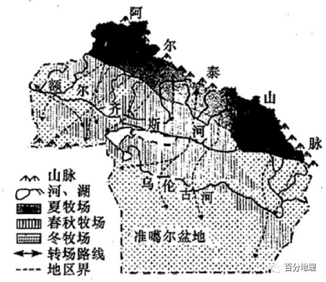

# 微专题之080转移牧场

```
本专题摘自“百分地理”公众号，如有侵权请告之删除，谢谢。联系hhwxyhh@163.com
```

------
（2022·四川泸州·三模）随着季节的变化而转移草场放牧，称为转场放牧。我国某地牧民，每年3月底从冬牧场出发赶往春牧场，会在春牧场停留3个多月，接羔育幼、剪毛驱虫；然后6月底出发去高山夏牧场，夏牧场的优质牧草足够牲畜吃上两个多月，养得膘肥体壮；8月下旬牧民开始转往秋牧场，到秋牧场给牛羊配种，卖掉一些牲畜；11月下旬再次回到冬牧场定居，圈养牲畜。下图为某季节该地牧民牧羊图片。据此完成下面小题。   
   
   
   
1．该地所在省区的简称是（  ）   
A．青   
B．内蒙古   
C．新   
D．藏   
2．推测图中最可能的牧羊牧场是（  ）   
A．春牧场   
B．夏牧场   
C．秋牧场   
D．冬牧场   
3．牧民描述：“每天早上出去和晚上回来的牧羊路线会尽可能不一样”，主要目的是（  ）   
A．增加羊群的运动量   
B．防备狼群偷袭羊群   
C．节约牧羊往返时间   
D．减少对草场的践踏   
<span style="color: rgb(255, 0, 0);">1．C由图可知，该地地表几乎没有植被，说明以荒漠为主，结合材料，该地牧场转场为山地牧场，荒漠地区存在山地牧场的地区为我国新疆，简称新，C正确。青海地区位于青藏高原，内蒙古以高原为主，西藏位于青藏高原，均不是山地牧场为主，A、B、D错误。故选C。</span>   
<span style="color: rgb(255, 0, 0);">2．A由图可知，羊的毛较短，有刚被剪掉的痕迹。结合材料“会在春牧场停留3个多月，接羔育幼、剪毛驱虫”可知，图示为春牧场，A正确。排除B、C、D选项。故选A。</span>   
<span style="color: rgb(255, 0, 0);">3．D材料没有说明出去和回来的路哪个比较长，无法判断是否增加羊群的运动量，也无法判断是否能节约牧羊往返时间，A、C错误。防备狼群偷袭羊群，应避开狼群的必经之地，而不是出去和回来的路线不同，B错误。来回路线不一样，一天中就不会践踏草地两次，可减少对草场的践踏，D正确。故选D 。</span>   
（2022·江苏·金陵中学模拟预测）天山是世界上最大的独立纬向山系，同时也是世界上距离海洋最远的山系和全球干旱地区最大的山系。据第一、二冰川编目数据统计结果显示，1970-2010年间中国天山冰川面积减少1274km2，退缩了13.9%，年平均冰川储量减少约4.08×109m3。在天山牧场，随着季节的变化而转移草场放牧，称为转场。下图示意天山不同方位冰川面积变化情况，据此，完成下面小题。   
   
   
   
4．从第一次冰川编目到第二次冰川编目，天山的冰川面积发生了很大的变化。其中某一坡向较其他坡向的冰川退缩更加剧烈，主要原因是（  ）   
A．此坡向地形趋于平缓   
B．此坡向获取的太阳辐射更丰富   
C．此坡向获得的降水较多   
D．此坡向人类活动明显增加   
5．当天山的牧民在山麓地带放牧时，下列地理现象正确的是（  ）   
A．好望角的风浪达到一年中高峰   
B．我国南水北调工程的调水量最大   
C．澳大利亚农民正忙着剪羊毛   
D．北京的雾霾处于较严重的季节   
<span style="color: rgb(255, 0, 0);">4．B影响冰川面积大小的因素有太阳辐射（坡向）、降水量、坡度及人类活动的影响等。其中A选项中地形趋于平缓、C选项中获得的降水较多，有利于冰川的形成和存留，不符合题意。据图可知，南坡的冰川退缩最为剧烈，因位于北半球，所以南坡获得的太阳辐射更丰富，故B选项正确。人类活动不是冰川退缩的主要原因，故D错。故选B。</span>   
<span style="color: rgb(255, 0, 0);">5．D当天山牧民在山麓地带放牧时，应为北半球的冬季。南半球冬季时，盛行西风最为强盛，好望角的风浪达到一年中高峰，A错误；我国南水北调工程的调水量最大的季节是大约是春末夏初，（从需求看，5、6月份华北地区春旱严重，需水量大；从供给看，长江流域5、6月份降水增多，尤其6月份进入梅雨季节），故B错；澳大利亚的混合农业可以充分灵活地利用农时，澳大利亚种植的是冬小麦，冬小麦种植较清闲时间为冬季，可以推出剪羊毛繁忙的季节为南半球冬季，C错误；北京的雾霾较严重的季节为冬春季节，D正确。故选D。</span>   
（2022·山东·高三专题练习）千百年来，生活在阿勒泰的哈萨克族等少数民族，沿袭着“四季转场，终年放牧”的传统。每年3月中旬牧民赶着牲畜从冬牧场一直向北游牧，4月初进入春牧场，6月向夏牧场转移，8月下旬开始往南游牧，10月初到达秋牧场，11月下旬或12月初再次转回到冬牧场（如图）。据此完成下面小题。   
   
   
   
6．水源是牧民转场中考虑的重要因素。阿勒泰冬牧场的人畜饮水主要来源于（  ）   
A．积雪   
B．冰川   
C．河水   
D．泉水   
7．每年11月下旬或12月初，牧民开始往冬牧场转场，而这时往往伴随着风雪、低温等恶劣天气。牧民不趁天气晴暖提前转场的原因是（  ）   
A．秋牧场草质更好   
B．秋牧场水源更丰富   
C．冬牧场草料较少   
D．冬牧场雪灾较严重   
<span style="color: rgb(255, 0, 0);">6．A阿勒泰地区冬季气候寒冷，河水结冰较厚，使用河水不方便，C错误；冬季积雪丰富，因此用积雪作为水源非常方便，A正确；冰川很难取用，B错误；材料中并未提高到泉水的分布及泉水出露情况，D错误；故选A。</span>   
<span style="color: rgb(255, 0, 0);">7．C每年11月下旬或12月初，牧民开始往冬牧场转场，而这时往往伴随着风雪、低温等恶劣天气，牧民宁愿冒着天气恶劣的风险，也不愿提前转场，可能是冬季牧场草料较少，提前返回会导致牲畜草料不足，C正确；如果冬季牧场草料充足，即使秋季牧场草质好、水源丰富，也不会冒着风雪灾害的风险转场，AB错误；其实如果冬季牧场所在地区有雪灾，那么在春秋牧场所在地区也会有风雪灾害，不转场同样也会有风雪灾害，D错误。故选C。</span>   
（2021·黑龙江·铁人中学高三阶段练习）图为某山脉来坡向垂直自然带夏季呈现出的景观颜色；当地的牧民会随着季节的变换而转移放牧场所，称为“转场”。据此完成下面小题   
   
   
   
8．材料描述的山脉最可能为（  ）   
A．天山山脉东殿南坡   
B．阿尔泰山脉西南坡   
C．乞力马扎罗山南坡   
D．阿尔卑斯山脉北坡   
9．著该山若位于北半球。则6月牧民转场的自然带为（  ）   
A．戊一丁一丙   
B．乙一丙一丁   
C．两一丁一戊   
D．己一戊一丁   
<span style="color: rgb(255, 0, 0);">8．B据所学知识推测，黄褐色对应荒漠、浅绿色对应山地草原、墨绿色对应山地森林、银白色对应冰雪带。天山山脉东段南坡降水较少，无山地森林，故A错，阿尔泰山脉呈西北一东南走向，西南坡为西风迎风坡，在半山腰形成针叶林带，且基带为温带荒漠，山顶有冰雪带，故B正确，乞力马扎罗山南坡山麓为雨林带，阿尔卑斯山脉北坡山麓并不是荒漠带，故CD错。</span>   
<span style="color: rgb(255, 0, 0);">9．A浅绿色的丙对应高海拔的山地草原（夏季牧场），戊对应低海拔的山地草原（冬季牧场）。6月北半球气温回升，积雪消融，牧民逐渐从低海拔的戊转移到高海拔的丙进行放牧，故A正确，BCD错。</span>   
（2021·甘肃·永昌县第一高级中学模拟）额尔齐斯河是我国西北地区的一条国际性河流，流域以高山冰雪融水补给为主。畜牧业发达，转场放牧是该区主要的放牧形式。近年来该区荒漠化问题日益严重。如图示意额尔齐斯河流域牧场分布。据此完成下面小题。   
   
   
   
10．当牧民开始从乙牧场向甲牧场转移时，该区（  ）   
A．河流日流量变化大   
B．沙丘的流动性最小   
C．湖泊水面不断缩小   
D．河流沉积作用增强   
11．相较于甲牧场，乙牧场荒漠化近年不断加重，其原因可能是（  ）   
①干旱程度加剧②太阳辐射较强烈③湿度不断增大④过度垦殖和放牧   
A．①②   
B．②③   
C．③④   
D．①④   
12．为减缓乙牧场荒漠化，下列措施最合理的是（  ）   
A．修建水库，涵养水源   
B．转移牲畜，高山放牧   
C．植树造林，退耕还林   
D．设置沙障，固定沙丘   
<span style="color: rgb(255, 0, 0);">10．A读图可知，牧民从乙河谷牧场开始向甲高山牧场转场时，说明该区正处于春季，气温逐渐升高，故冰雪融水增多，湖泊水面不断增大，C错误。此时昼夜温差比较大，冰雪融水日变化大，导致河流流量日变化大，A正确。春季寒潮多发，且该地区距冬季风源地和沙源地近，风力强劲，春季易发沙尘暴，沙丘流动性强，B错误。春季该区河流流量逐渐增大，侵蚀能力逐渐增加，D错误。故选A。</span>   
<span style="color: rgb(255, 0, 0);">11．D从宏观背景考虑，近年来全球气候变暖趋势显著，乙地地处河谷地区，盛行下沉气流，气温高，蒸发强烈，干旱程度加剧，湿度不断减小，所以①正确，③错误；甲、乙两地降水少，晴天多，太阳辐射差异小，②错误；由于人类过度放牧、过度开垦，导致该地区植被破坏、减少，荒漠化加剧，④正确。因此①④D正确，A、B、C错误。故选D。</span>   
<span style="color: rgb(255, 0, 0);">12．D该地区气候干旱，蒸发旺盛，修建水库会加剧蒸发，加剧水资源消耗，A错误。高山草场具有季节性且高山生态环境脆弱，不利于长时间放牧，B错误。该区地带性植被以温带荒漠、草原为主，植树造林会加剧当地水资源消耗，加剧干旱程度，C错误。设置沙障能够阻挡、减缓沙丘流动速度，利于生态恢复，可缓解当地荒漠化程度，D正确。故选D。</span>   
（2022·全国·高三专题练习）新疆天山牧民随着季节变化而转移草场放牧，称之为转场。2009年12月，新疆北部地区遭遇强降雪天气。次年3月初，当地政府考虑到牧民的实际困难，首次利用火车帮助天山深处的牧民进行转场（下图）。此后，新疆伊宁等地区每年都会在政府补贴政策的支持下，利用火车、汽车进行机械化转场。   
据此回答下列问题。   
   
   
   
13．推测本次利用火车转场的目的地是   
A．春季牧场   
B．夏季牧场   
C．秋季牧场   
D．冬季牧场   
14．新疆首次利用火车为牧民转场的原因可能是为了   
A．提早离开积雪覆盖的天山深处，避免牲畜因寒冷和饥饿而死亡   
B．帮助牧民将牲畜运往更远的牧场放牧，以获取充足的牧草   
C．避免途中雪崩及融雪洪涝等灾害对转场的影响   
D．降低牧民劳动强度，缓解牧民流向其它行业的状况   
<span style="color: rgb(255, 0, 0);">13．A由材料可知，本次利用火车转场的时间为3月，所以转场的目的地是春季牧场，A正确。</span>   
<span style="color: rgb(255, 0, 0);">14．C牧道崎岖，牲畜在转场途中遭遇洪水、泥石流、雪崩等自然灾害，利用火车为牧民转场，可以避免途中雪崩及融雪洪涝等灾害对转场的影响，可以减少损失，C正确。</span>   
二、综合题   
15．（2022·全国·高三阶段练习）阅读图文材料，完成下列要求。   
材料一生活在新疆阿勒泰地区的牧民几千年来一直保持着游牧生活。每年3月过后，牧民从冬牧场出发，向北转场到春牧场；6·月底，再沿着额尔齐斯河的支流去高山上的夏牧场；8月下旬，向秋牧场转移；11月下旬再次回到冬牧场。牧人沿着河流上下迁移，因为在阿尔泰山地附近。只有河流造就的河谷才有绿色的牧场存在。这里生长的羊有”千里羊”的美称，因其自4月初出生到出栏（长到屠宰重量），往返转场近千千米。严格意义上说，游牧在一个点上逗留的时间最多不能超过14天，夏天一般10天左右就要搬地方，这样可以保护草原。   
材料二图为阿勒泰地区主要牧场及牧民转场路线示意图。   
   
   
   
(1)据图概括冬牧场的分布特点，并分析原因。   
(2)分析牧民沿额尔齐斯河支流转场至夏牧场的有利自然条件。   
(3)推测羊群出栏时所在的牧场，并从羊群生长规律和草原载畜量的角度说明理由。   
(4)你是否赞同阿勒泰地区始终维持游牧的生产方式，并说明理由。   
【答案】<span style="color: rgb(255, 0, 0);">(1)特点∶冬牧场主要分布在海拔较低的山麓（盆地）地带。原因∶海拔较低，相对温暖；位于阿尔泰山南部山麓地带，受寒冷气流影响较小；河流支流众多，水源充足。</span>   
<span style="color: rgb(255, 0, 0);">(2)沿支流河谷转场，地形较平坦；离水源较近；河流沿岸牧草丰美，可为转场羊群提供食物。</span>   
<span style="color: rgb(255, 0, 0);">(3)秋牧场。原因∶春夏季牧场牧草充足，羊群生长迅速；到秋季牧场后羊群膘肥体壮；而冬季牧场能养活的羊群数量有限，故羊群在秋季牧场时出栏经济效益高。</span>   
<span style="color: rgb(255, 0, 0);">(4)赞同。传统游牧方式放牧成本低；羊群运动量大，牧产品质量高；传统游牧方式对草场破坏小，生态效益高。</span>   
<span style="color: rgb(255, 0, 0);">不赞同。粗放型放牧比集约型放牧产量低，牧民收入有限；转场过程中牧民分散管理难度大。</span>   
【解析】<span style="color: rgb(255, 0, 0);">本大题以阿勒泰地区的牧民转场图文资料为背景材料，涉及冬牧场的分布特点及原因、牧民沿额尔齐斯河支流转场至夏牧场的有利自然条件、羊群出栏时所在的牧场及理由等相关知识，考查学生获取和解读信息能力及综合思维能力，培养学生的人地协调观、综合思维、区域认知和地理实践力等地理核心素养。</span>   
<span style="color: rgb(255, 0, 0);">(1)读图，根据图例分析可知，该地区的冬牧场主要分布在中低山山麓、平原河谷和准噶尔盆地地区；河谷平原和盆地中心的草原和荒漠草原区。阿勒泰地区深居内陆，气温年较差大，降水稀少，植被覆盖率低；高山牧场气温低，冰雪覆盖；而山麓地带、平原河谷和盆地地区海拔较低，气候较温暖，且临近水源；冬牧场位于阿尔泰山南部，阿尔泰山阻挡了寒冷的冬季风，气候较温暖，利于放牧。</span>   
<span style="color: rgb(255, 0, 0);">(2)结合材料分析，牧民往往循着额尔齐斯河及其支流上下迁移，沿河谷迁移可以利用河谷内一些宽谷地带的优良牧场，且地形较平坦；河流支流起到引路的作用，可以把牧人引领到河谷上端的夏牧场；河谷地带接近水源，便于人畜用水。</span>   
<span style="color: rgb(255, 0, 0);">(3)结合材料分析，夏牧场位于森林草原带和山地草原带，夏季阿尔泰山南坡光照充足，冰雪融水、山地降水丰富，水源充足，草木繁茂，羊群生长迅速；到秋季牧场后羊群膘肥体壮；冬牧场位于荒漠带和荒漠草原带，牧草稀疏、低矮，草质差；冬季气温低，多暴风雪，生存环境恶劣，牧场能养活的牲口数量有限，故羊群在秋季牧场时出栏经济效益高。</span>   
<span style="color: rgb(255, 0, 0);">(4)本小题属于开放性试题，需要表明观点丙阐述理由。若赞同，可以从有利条件和有利影响方面分析，传统游牧方式利用天然草场放牧牲畜，管理粗放，放牧成本低；羊群运动量大，牧产品质量高；传统的游牧方式实行季节性转场，对草场的破坏较小，生态效益好。若不赞同，可以从不利条件和不利影响方面分析，传统游牧方式管理粗放，比集约型放牧产量低，牧民收入有限；转场过程管理难度大；集中放牧，对草场的破坏较为严重。</span>   
16．（2020·全国·高三专题练习）如图为某区域示意图，读图回答问题。   
   
   
   
(1)指出图中主要山脉的走向，并说明判断理由。   
(2)图中阿勒泰地区春季多洪水，分析其原因。   
(3)每年11月初雪前后，当地牧民会将牲畜安全转移到冬季牧场。说明当地冬季牧场的选址条件。   
【答案】<span style="color: rgb(255, 0, 0);">(1)西北—东南走向。理由：山脉是河流分水岭。图中河流以山脊为界，分别向西南、东北流。</span>   
<span style="color: rgb(255, 0, 0);">(2)该地位于西风带，冬季西风受地形抬升，形成较多降雪，气温低，积雪厚。春季气温回升，积雪大量融化，汇流成洪水。</span>   
<span style="color: rgb(255, 0, 0);">(3)冬季牧场应选在山地南麓海拔较低的地方。因为当地冬季气温低，多大风和降雪天气，这里温暖、避风，利于牲畜安全越冬。</span>   
<span style="color: rgb(255, 0, 0);">【解析】本大题以阿勒泰地区为材料；涉及地形判读、影响降水的因素、农业区位等相关内容；考查学生获取和解读地理信息，描述和阐释地理事物，论证探讨地理知识的能力，旨在培养学生综合思维等核心素养。</span>   
<span style="color: rgb(255, 0, 0);">（1）山区的河流，一般在山谷中流淌，而山脉是河流分水岭；图中河流以山脊为界，分别向西南、东北流，所以该山脉是西北-东南走向。</span>   
<span style="color: rgb(255, 0, 0);">（2）图中显示阿勒泰地区位于额尔齐斯河谷地，西部有缺口，而且图中显示该地位于40°-60°N之间，处于西风带影响下，冬季来自大西洋的西风能够将水汽输送至该地，阿勒泰位于阿尔泰山迎风坡，受地形抬升影响，形成较多降雪，该地纬度较高，气温低，积雪集中且厚度大。春季由于气温回升，积雪大量融化，汇流成洪水。</span>   
<span style="color: rgb(255, 0, 0);">（3）根据图中经纬度可以推断，该区域位于我国新疆北部，所处纬度较高，而且接近冬季风源地，所以当地冬季气温低，多大风和降雪天气，冬季牧场选择在山地南麓海拔较低的地方，这里相对温暖、背风坡有利于避风，有利于牲畜安全越冬。</span>   
17．（2020·全国·高三专题练习）读图及材料，回答问题。   
材料一　在新疆，天山被称为垂直的牧场。随着季节的变化而转移草场放牧，称为转场。生活在新疆广大的草原和高山牧场的牧民们世世代代形成了不同季节利用不同高度草场的迁徙游牧方式。   
材料二　天山自然带示意图(图甲)和天山冬夏牧场转场示意图(图乙)。   
   
   
   
   
   
   
(1)指出天山南北坡自然带的差异。   
(2)天山天然草场资源地广、质优、种类多，试分析其原因。   
(3)简述天山牧民放牧转场的大致过程，并简单评价转场放牧的好处。   
【答案】<span style="color: rgb(255, 0, 0);">(1)北坡自然带种类丰富，有云杉林带，南坡缺失云杉带；南坡同一自然带分布的海拔高度高于北坡；北坡的雪线较南坡低 。</span>   
<span style="color: rgb(255, 0, 0);">(2)天山地处中纬度地区，光照充足，气候适宜牧草生长；山地面积广大，草场分布区域广；海拔高，终年积雪，冰雪融水丰富，为草场提供充足水源，牧草繁茂；从山麓到山顶，垂直高差大，气候差别大，牧草种类依其地区、季节不同而有差异，种类繁多。</span>   
<span style="color: rgb(255, 0, 0);">(3)冬季，牧民在（林带及以下）海拔较低的（山地荒漠）草原放牧；春季转暖向高处（山地）草原转移；夏季在（林带及以上）海拔较高的（高山）草甸、草场放牧；秋季天气转冷，向海拔较低的（荒漠）草原转移；冬季山麓牧场（利用囤积的牧草）过冬。评价：转场不仅可以充分利用不同高度的草场资源，同时也保护了草场资源，维护生态平衡和草场可持续发展。</span>   
【解析】<span style="color: rgb(255, 0, 0);">本题以新疆天山冬夏牧场为背景区域，涉及自然带、垂直分异规律、可持续发展等知识点，考查学生的材料分析和解读能力，有效信息的提取和应用能力。</span>   
<span style="color: rgb(255, 0, 0);">（1）南北坡自然带的差异主要从自然带的多少、类型、分布高度来分析。读图可知。北坡自然带种类丰富，有云杉林带，南坡缺失云杉林带；南坡同一自然带分布的海拔高度高于北坡；北坡的雪线较南坡低。</span>   
<span style="color: rgb(255, 0, 0);">（2）本题解答时应注意问题包括三个方面：地广、质优、种类多。“地广”可以从天山分布的空间范围来说明，天山地处中纬度地区，气候适宜牧草生长；山地面积广大，冰雪融水丰富，为草场提供了充足的水源，草场分布区域广。质优是因为天山地处中纬度内陆地区，光照充足。种类多是因为从山麓到山顶，垂直高差大，气候差别大，牧草种类多。</span>   
<span style="color: rgb(255, 0, 0);">（3）天山的海拔较高，山地垂直地域分异现象比较明显，在山麓和山坡上分别形成了草原和高山草甸，为了充分利用草场资源，也是为了保护草场资源，不能全部都在海拔低的山麓牧场放牧，故分为冬、夏牧场。夏季气温高，在山顶牧场，冬季气温低，在山麓牧场。结合天山冬夏季牧场转场示意图即可回答，注意气温变化是其转场的根本原因。转场不仅可以充分利用不同高度的草场资源，同时也保护了草场资源，维护生态平衡和草场可持续发展。</span>   
18．（2022·全国·高三专题练习）阅读图文材料，完成下列要求。   
L湖原是新疆最大的淡水湖，该湖西部沿岸淡水芦苇广布，而东部沿岸几乎没有。在新疆，天山被称为垂直的牧场。随着季节的变化而转移草场放牧，称为转场。生活在新疆广大的草原和高山牧场的牧民们世世代代形成了不同季节利用不同高度草场的迁徙游牧方式。   
   
   
   
（1）说出L湖湖盆的地势特点，并指出判断依据。   
（2）分析该湖西部沿岸淡水芦苇较东岸多的原因。   
（3）天山天然草场资源分布广、种类全，试分析其原因。   
（4）简述天山牧民放牧转场的大致过程，指出转场放牧的好处。   
【答案】<span style="color: rgb(255, 0, 0);">（1）特点：湖盆西部、北部缓，东部、南部陡。依据：不同时期湖泊水位线东部、南部密集，西部、北部稀疏。</span>   
<span style="color: rgb(255, 0, 0);">（2）（湖泊）西侧地势较平坦（坡度较小），浅滩面积广；（甲）河流注入，携带泥沙（有机质）多，土壤肥力高；西侧河流有进有出，（淡）水资源丰富，湖泊盐度较小。</span>   
<span style="color: rgb(255, 0, 0);">（3）天山地处中纬度地区，光热充足，气候适宜牧草生长；山地面积广大，草场分布区域广； 海拔高，终年积雪，冰雪融水丰富，为草场提供充足水源，牧草繁茂；从山麗到山顶，垂直高差大，气候差别大，牧草种类依其地区，季节不同而有差异，种类繁多。</span>   
<span style="color: rgb(255, 0, 0);">（4）冬季，牧民在(林带及以下)海拔较低的（山地荒漠）草原放牧；春季转暖向高处（山地）草原转移；夏季在（林带及以上）海拔较高的（高山）草甸、草场放牧；秋季气候转冷，向海拔较低的（荒漠）草原转移；冬季在山麓牧场（利用屯积的牧草）过冬。</span>   
<span style="color: rgb(255, 0, 0);">评价：转场不仅可以充分利用不同高度的草场资源，同时也保护了草场资源，维护生态平衡和草场可持续发展。</span>   
【解析】<span style="color: rgb(255, 0, 0);">（1）读图，根据图中湖泊不同时期水位线的变化分析，湖泊水位线相当于等高线，水位线东部、南部密集，西部、北部稀疏。说明湖盆西部、北部缓，东部、南部陡的地势特点。</span>   
<span style="color: rgb(255, 0, 0);">（2）结合前面分析，湖泊西侧地势较平坦，坡度较小，浅滩面积广。根据等高线弯曲判断，西侧有甲河流注入，携带泥沙或有机质多，土壤肥力高。西侧乙河流流出湖泊，所以西侧淡水资源丰富，湖泊盐度较小。</span>   
<span style="color: rgb(255, 0, 0);">（3）天山地处中纬度地区，光热充足，气候适宜牧草生长。山地面积广大，草场分布区域广。 海拔高，山顶有终年积雪，冰雪融水丰富，为草场提供充足水源，牧草繁茂。从山麓到山顶，垂直高差大，气候差别大，牧草种类依其地区，季节不同而有差异，种类繁多。</span>   
<span style="color: rgb(255, 0, 0);">（4）冬季，牧民在林带及以下，海拔较低的山地荒漠草原放牧。春季转暖向高处山地草原转移。夏季在林带及以上海拔较高的高山草甸、草场放牧。秋季气候转冷，向海拔较低的荒漠草原转移。冬季在山麗牧场放牧，并利用屯积的牧草过冬。转场放牧，不仅可以充分利用不同高度的草场资源，同时也保护了草场资源，给草原恢复生长的时间，有利于维护生态平衡和草场可持续发展。</span>   
   
   
   
   