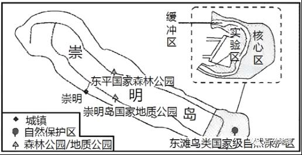

# 微专题之081候鸟迁徙

```
本专题摘自“百分地理”公众号，如有侵权请告之删除，谢谢。联系hhwxyhh@163.com
```

------
一、单选题   
（2022·全国·高三专题练习）候鸟是指在繁殖地和越冬地之间进行季节性迁徙的鸟类。每年4~5月,大量斑尾塍鹬从澳大利亚迁徙到北冰洋沿岸的科雷马河口。下图示意科学家通过卫星追踪一只标号为”H3”斑尾塍鹬的迁徙路线,读图完成下面小题。   
   
   
   
1．关于“H3”斑尾塍鹬的北迁,说法正确的是（  ）   
A．科雷马河口为越冬地   
B．途经山东半岛时正值雨季   
C．沿途各地昼长夜短   
D．飞行约一万公里   
2．“H3”斑尾塍鹬没有经过的森林类型是（  ）   
A．热带雨林   
B．常绿硬叶林   
C．落叶阔叶林   
D．针叶林   
<span style="color: rgb(255, 0, 0);">1．D从图中可以看出,尾塍鹬在5月19日飞到北冰洋沿岸，因此该鸟是在科雷马河口过夏季，A错误，4月22日至5月17日途经山东半岛，此时山东的雨季未到,正是春旱季节，华北地区雨季是7-8月，B错误，4-5月,太阳直射北半球，因此南半球的昼短夜长，北半球昼长夜短，C错误，飞行距离约跨纬度90°，根据经线长度1度约111千米，实际距离约一万公里（千米），D正确。故选D。</span>   
<span style="color: rgb(255, 0, 0);">2．B“H3”斑尾塍鹬的飞行路线大致是沿澳大利亚西北部向北沿亚洲东部地区飞往北冰洋沿岸,因此经过了赤道附近的热带雨林、温带地区的落叶阔叶林和亚寒带针叶林，不可能经过大陆西岸的地中海气候形成的亚热带常绿硬叶林。B正确，ACD错误。故选B。</span>   
（2023·全国·高三专题练习）白鹤是一种候鸟，下图为“白鹤正常年份迁徙路线图”，据此完成下面小题。   
   
   
3．吸引白鹤到鄱阳湖地区越冬的有利条件（  ）   
①冬季气候温和   
②水稻田有丰富的浮游生物和鱼类   
③设立自然保护区，人类干扰少   
④水域面积广阔，栖息场所理想   
A．①②③   
B．①③④   
C．①②④   
D．②③④   
4．自然保护区核心区发挥的主要作用是（  ）   
A．旅游功能   
B．经济功能   
C．生态功能   
D．科研功能   
<span style="color: rgb(255, 0, 0);">3．B根据所学知识可知，鄱阳湖地处亚热带季风气候区，冬季温暖，利于白鹤过冬，故①正确；白鹤在越冬地首选的食物是苦草的块茎，也吃水生植物的叶、嫩芽和少量蚌、螺、软体动物等，因此，水稻田有丰富的浮游生物和鱼类不是吸引白鹤到鄱阳湖地区越冬的有利条件，故②错误；鄱阳湖自然保护区附近，人类活动少，候鸟栖息受人类干扰少，故③正确；根据所学知识可知，鄱阳湖是我国最大的淡水湖，水域面积广，拥有丰富的植物，白鹤的食物充足，为越冬候鸟提供广阔的栖息空间，故④正确；故选B。</span>   
<span style="color: rgb(255, 0, 0);">4．C根据《中华人民共和国自然保护区条例 》可知，自然保护区内保存完好的天然状态的生态系统以及珍稀、濒危动植物的集中分布地，应当划为核心区，禁止任何单位和个人进入，也不允许进入从事科学研究活动，故自然保护区核心区发挥的主要作用是生态功能，故ABD选项错误，C选项正确。故选C。</span>   
（2022·山东潍坊·高三专题练习）渤海湾湿地资源丰富，是候鸟红腹滨鹬迁徙途中最重要的营荞补给站。21世纪以来，红腹滨鹬全球数量不断减少，平均寿命不断缩短。下图示意渤海湾海岸线空间分布。据此完成下面小题。   
   
   
5．影响渤海湾海岸线变化的主要原因是（  ）   
A．泥沙淤积   
B．海浪侵蚀   
C．围海造陆   
D．港口建设   
6．渤海湾海岸线变化对红腹滨鹬生存环境的影响主要是（  ）   
A．天敌数量减少   
B．食物来源增多   
C．环境污染加重   
D．生存空间减少   
<span style="color: rgb(255, 0, 0);">5．C读图可知，与2000年相比，2010年新增陆地主要在新区和工业区，应主要是围海造陆形成，因此影响此时期渤海海岸线变化的主要原因是围海造陆，C符合题意；泥沙淤积和港口建设也使得渤海海岸线向海洋推进，但速度不如围海造陆，排除AD；海浪侵蚀会使海岸线向陆地推进，而图中显示海岸线主要向海洋推进，因此排除B。故选C。</span>   
<span style="color: rgb(255, 0, 0);">6．D图中显示，渤海湾海岸线向海洋推进，主要方式是围湖造陆，占用了大量渤海湿地资源，使得红腹滨鹬的食物来源减少，生存空间被大量挤占减少，B不符合题意，D符合题意；渤海湾海岸线变化不一定会使得天敌数量减少，且不是主要影响，排除A；新区、工业区和港口运营可能会使得环境污染加重，但不是渤海湾海岸线变化对红腹滨鹬生存环境的主要影响，排除C。故选D。</span>   
（2022·吉林·长春博硕学校高三专题练习）自然保护区按功能划分为核心区、缓冲区和实验区。崇明岛位于长江入海口，是我国第三大岛，为亚太候鸟南北迁徙通道上的重要驿站，也是我国东部沿海的重要水禽越冬地，已成为周边地区生态旅游目的地。下图为崇明岛生态旅游资源分布示意图。读图，完成下面小题。   
   
   
7．下列关于崇明岛自然保护区的说法，不正确的是（  ）   
A．核心区是自然保护区内保存完好的天然状态的生态系统及珍稀、濒危动植物的集中分布区，禁止任何单位和个人进入，进行绝对保护   
B．缓冲区只允许进入从事科学研究观测活动   
C．核心区可以开展旅游活动   
D．实验区位于缓冲区外边，可以进入从事科学实验、教学实习、参观考察、旅游等活动   
8．在鸟类自然保护区发展生态旅游时，需要注意（  ）   
A．严禁游客进入实验区   
B．合理控制核心区的游客数量   
C．保护鸟类栖息地   
D．适当增加缓冲区的基础设施   
<span style="color: rgb(255, 0, 0);">7．C根据《中华人民共和国自然保护区条例》的相关规定可知，自然保护区的核心区是自然保护区内保存完好的天然状态的生态系统以及珍稀、濒危动植物的集中分布地，应当禁止任何单位和个人进入，故A选项不符合题意，C选项符合题意；核心区外围可以划定一定面积的缓冲区，只准进入从事科学研究观测活动，故B选项不符合题意；缓冲区外围划为实验区，可以进入从事科学试验、教学实习、参观考察、旅游以及驯化、繁殖珍稀、濒危野生动植物等活动，故D选项不符合题意。故选C。</span>   
<span style="color: rgb(255, 0, 0);">8．C根据上题分析可知，游客可进入实验区，故A选项错误；核心区严禁游客进入，故B选项错误；鸟类自然保护区发展生态旅游时，应当保护鸟类栖息地，故C选项正确；缓冲区只允许进入从事科学研究观测活动，需重点保护，增加基础设施会破坏生态环境，故D选项错误。故选C。</span>   
二、综合题   
9．（2022·江西·兴国中学高三阶段练习）阅读图文材料，回答下列问题。   
河北省闪电河国家湿地公园（左图中椭圆圈定区域）是由河流湿地、湖泊湿地、沼泽化湿地等组成的复合型内陆湿地，素有“京津水塔”之称。它是我国三条主要鸟类迁徙路线的东部通道，也是东北亚—澳大利亚鸟类迁徙通道的重要组成部分。千百年来，九曲十八弯的闪电河像温柔的母亲滋养着坝上这片美丽的大草原（右图）。近年来，当地政府先后实施了禁牧、节水、水源补给等保护性措施，加快湿地生态修复。   
   
   
(1)依据图文信息推测闪电河湿地公园气候类型。   
(2)部分候鸟每年会从蒙古东方省飞到鄱阳湖越冬，秋季途经闪电河湿地，在这里停歇。春季，北方气温逐渐回暖后，它们在此养足精神，便返回到蒙古繁殖地。为什么闪电河湿地公园会成为候鸟迁徙途中的“驿站”和“天堂”。   
(3)如果图中河流多为嵌入式曲流（高原曲流），说出影响其形成的可能因素。   
<span style="color: rgb(255, 0, 0);">【答案】(1)温带季风气候向温带大陆性气候过渡（或温带大陆性季风气候）。理由：年降水量为400mm左右；地形处在内蒙古高原至华北平原过渡带上。</span>   
<span style="color: rgb(255, 0, 0);">(2)湿地生物资源丰富，为鸟类提供充足的食物；处在北方（高纬度）与南方（低纬度）过渡区域，驿站春秋季温度适宜鸟类生活；湿地公园，人类影响小。</span>   
<span style="color: rgb(255, 0, 0);">(3)地转偏向力、惯性和离心力的作用，岩性差异（答植物根系固结作用亦可），地壳抬升运动。</span>   
<span style="color: rgb(255, 0, 0);">【解析】本题以闪电河国家湿地公园为背景，考查气候类型的判读、生物多样性以及河流地貌的影响因素等内容，考查了学生获取和解读地理信息、调动和运用地理知识、描述和阐释地理事物的能力，难度较大。</span>   
<span style="color: rgb(255, 0, 0);">（1）读图可知，该公园的降水量为400mm左右，处于半湿润-半干旱地区之间；且地处华北平原和内蒙古高原的过度地带上，华北平原一侧属于温带季风气候，内蒙古高原一侧属于温带大陆性气候，故可判断其属于温带季风气候向温带大陆性气候过渡的情况（或说属于温带大陆性季风气候）。</span>   
<span style="color: rgb(255, 0, 0);">（2）闪电河湿地公园会成为候鸟迁徙途中的“驿站”和“天堂”说明该地候鸟数量多。结合所学可知，该地候鸟数量多的原因可以从食物、栖息环境和天敌等方面分析。结合图文材料可知，该地湿地面积广阔，且处在北方（高纬度）与南方（低纬度）过渡区域，驿站春秋季温度适宜鸟类生活，属于温带大陆性季风气候，适合多种鸟类生存；其次，湿地地区生物资源丰富，能够为候鸟提供充足的食物；最后，该地作为政府设立的湿地公园，且有多项保护措施，受到人类的影响小。</span>   
<span style="color: rgb(255, 0, 0);">（3）结合所学可知，一般曲流的发育于平原地区，河流在流动过程中，在地转偏向力、惯性离心力的作用下，河流不断向岩层松软的一边侧蚀，发育得越来越弯曲而形成曲流；再后来遇到了地壳的持续抬升，这等于给了河流向下切割的力量，而河流的流动已经被束缚在早先形成的“河曲”之中，因此河流就保留着原有的“蛇曲”形态，一直下切，看上去好像“嵌进去”一样，形成“嵌入式曲流”。故其影响因素有地转偏向力、惯性和离心力的作用、岩性差异、地壳抬升运动。</span>   
10．（2020·湖南·新邵县教研室高三期末）阅读材料，回答下列问题。   
材料一：黑鹳善于利用气流飞行，下图为“黑鹳分布与迁徙路径示意图”。   
   
   
材料二：二十世纪七十年代以来，非洲萨赫勒地区降水持续偏少。随着本区交通条件的改善及周边地区人口增长和经济发展，传统游牧业不断向商品性定居牧业转化，且大量土地被开垦，原本是候鸟理想越冬地的萨赫勒变为黄沙漫漫的不毛之地，现在鸟类觅食困难。   
(1)黑鹳迁徙路径①、②沿线自然带更替体现了自然地理环境____的地域分异规律，该分异规律形成的基本因素是____。   
(2)黑鹳沿迁徙路径④、⑤飞行需借助冬季风，该季风形成的主要原因是____，常给我国湖南地区带来____、____等气象灾害；而黑鹳沿迁徙路径③到达的越冬地冬季较温暖，受该季风影响小，主要原因有____。   
(3)指出候鸟理想越冬地的萨赫勒变为黄沙漫漫的不毛之地的主要人为原因。   
(4)我国鄱阳湖地区是黑鹳重要越冬地，简述该地发展水稻种植业的优势社会经济条件。   
<span style="color: rgb(255, 0, 0);">【答案】(1) 从赤道到两极 热量</span>   
<span style="color: rgb(255, 0, 0);">(2)海陆热力性质的差异 寒潮 低温冻害 纬度低，远离冬季风源地；北部山地高原阻挡寒冷气流。</span>   
<span style="color: rgb(255, 0, 0);">(3)①人口增长过快，粮食需求量大；②毁林毁草开荒，植被破坏；③过度放牧，草场退化</span>   
<span style="color: rgb(255, 0, 0);">(4)人口稠密，劳动力丰富；种植水稻历史悠久，有丰富的种植经验；当地人喜欢吃稻米，稻米消费市场广阔；运输便利，有利于稻米运输。</span>   
<span style="color: rgb(255, 0, 0);">【解析】本题以黑鹳分布与迁徙路径示意图与非洲萨赫勒地区的相关资料为背景信息，考查自然带的地域分异规律、气候及其影响因素、荒漠化的人为原因、农业区位因素等知识，要求考生准确获取与解读地理信息、调动与运用地理知识回答问题。</span>   
<span style="color: rgb(255, 0, 0);">（1）黑鹳迁徙路径①、②沿线自然带东西延伸、南北更替，体现了自然地理环境从赤道到两极的地域分异规律。该规律的成因是：太阳辐射自低纬向高纬递减，热量条件不断变差，因此自然带依次更替，形成的基本因素是热量。</span>   
<span style="color: rgb(255, 0, 0);">（2）黑鹳沿迁徙路径④、⑤飞行需借助冬季风，主要是由于海陆热力性质的差异形成。冬季风常给我国湖南地区带来寒潮、低温冷害等。黑鹳沿迁徙路径③到达的越冬地地处南亚，纬度低，气温高，远离冬季风源地，且北部有高大的山地高原，阻挡冬季风，受冬季风影响小。</span>   
<span style="color: rgb(255, 0, 0);">（3）由材料可知，随着本区交通条件的改善及周边地区人口增长和经济发展，传统游牧业不断向商品性定居牧业转化，且大量土地被开垦，原本是候鸟理想越冬地的萨赫勒变为黄沙漫漫的不毛之地。萨赫勒地区人口增长过快，粮食需求量大，导致大量毁林毁草开荒，植被破坏，使地表失去保护；牧区过度放牧，使草场退化，使荒漠化加速发展，最终变成了黄沙漫漫的不毛之地。</span>   
<span style="color: rgb(255, 0, 0);">（4）主要从劳动力、种植历史、市场、交通等方面进行分析。我国鄱阳湖地区人口稠密，劳动力丰富，有利于精耕细作；种植水稻历史悠久，有丰富的种植经验；当地人喜欢吃稻米，对稻米需求量大，市场广阔；运输便利，有利于稻米运输与销售等。</span>   
11．（2023·全国·高三专题练习）阅读图文材料，完成下列要求。   
条子泥湿地位于世界自然遗产地盐城滨海湿地核心区，拥有面积广阔的潮间带滩涂，是众多候鸟迁徒途中的理想栖息地。每年春秋迁徙季，大量候鸟在此停歇。但由于受自然和人类活动的双重影响，候鸟栖息地严重减少。为给候鸟就近找一块合适的歇脚地，当地将靠近海边原用于围垦养殖的720亩（1亩≈666．67平方米）鱼塘，经过生态修复和改造，变成了能够满足各种候鸟需求的高潮位栖息地。“720高地”建成后来条子泥停留的鸟儿越来越多，候鸟种群数量不断上升（下图）。右图示意条子泥湿地位置。   
   
   
(1)分析导致当地候鸟栖息地减少的原因。   
(2)说明“720高地”建设与维护的具体做法。   
(3)该地恢复鸟类栖息地的成功实践，为世界自然遗产地和湿地的生态保护与修复提供了宝贵的中国经验。请你拟定一个经验总结提纲。   
<span style="color: rgb(255, 0, 0);">【答案】(1)海平面上升，涨潮时水位升高，淹没栖息地；植被减少，候鸟食物来源不足；农业围垦占用湿地，沿海地区的盐业、渔业、旅游业等行业发展导致栖息地受到破坏。</span>   
<span style="color: rgb(255, 0, 0);">(2)“720高地”的建设：对720亩鱼塘进行地形改造、湿地修复、环境整治，建成“720高地”。“720高地”的维护：加强生态修复，可以增加海洋生物资源、增加植被覆盖率；加强生态管理，可以按照绿色食品生产要求组织农业生产，养殖用水净化后确保达标排放。</span>   
<span style="color: rgb(255, 0, 0);">(3)对当地栖息地面积减少的原因进行分析；结合栖息地面积减少的原因采取针对性措施；以条子泥滨海湿地生态系统的保护与修复为核心，保护滨海种质资源库和湿地生物的多样性，修复滨海生态湿地；通过观鸟、护鸟以及科普宣传，提高普通民众保护滨海湿地、重要水禽栖息地的生态意识，同时对湿地生态系统进行持续维护</span>   
<span style="color: rgb(255, 0, 0);">【解析】本大题以候鸟景观图和条子泥湿地位置图为材料，设置三道小题，涉及生物多样性减少的原因、生物栖息地的建设和维护措施、鸟类栖息地恢复的经验总结等相关内容，考查学生对相关知识的理解与掌握。</span>   
<span style="color: rgb(255, 0, 0);">（1）本题考查环境对生物的影响。结合材料可知，受自然和人类活动的双重影响，候鸟栖息地减少，因此需要从自然和人类活动两个角度分析作答。结合材料可知建设“720高地”目的是将其改造为可以满足候鸟栖息所需的高潮位栖息地，说明原栖息地可能被淹没，因此可推测自然原因为海平面上升，人类活动方面可能是不合理的活动占用了栖息地，包括围垦、养殖等，以及人类生产生活对生态环境的破坏，导致鸟类食物来源不足。</span>   
<span style="color: rgb(255, 0, 0);">（2）本题考查生物栖息地的建设和维护措施。“720高地”的改造建设是为了满足候鸟在高潮位时的栖息要求，结合材料中改造鱼塘为高地可知，需要改造地形、恢复生态、建设候鸟栖息地自然保护区，建成“720高地”。再通过生态修复和生态管理维持后续栖息地的生态稳定，加强生态修复，比如增加海洋生物资源汇入和植被覆盖率，加强生态管理，组织农业生产要按照绿色食品生产要求，净化养殖用水，确保达标排放。</span>   
<span style="color: rgb(255, 0, 0);">（3）本题考查鸟类栖息地恢复的经验总结。注意题目要求拟定经验总结提纲，按照提纲的结构，结合材料中栖息地面积减少的原因及采取的措施，再按照时间顺序，将具体做法进行总结和拓展，形成逻辑性强的提纲即可：以条子泥滨海湿地生态系统的保护与修复为核心，修复滨海生态湿地，保护滨海种质资源库和湿地生物的多样性；通过观鸟、护鸟以及科普宣传，提高普通民众保护滨海湿地、重要水禽栖息地的生态意识，同时对湿地生态系统进行持续维护。</span>   
12．（2022·河南·鄢陵县职业教育中心高三专题练习）读图，回答下列问题。   
2019年7月5日，中国黄（渤）海候鸟栖息地（第一期）被列入世界自然遗产名录。该候鸟栖息地位于江苏省盐城市，是我国首个滨海湿地类型的自然遗产，主要由潮间带滩涂和滨海湿地组成。江苏沿海滩涂湿地由长江与淮河入海口的泥沙堆积而成，是我国最大的一块滩涂湿地。   
候鸟的迁徙通常在春秋两季，候鸟每年迁徙的时间与路径大致是不变的。下图为全球候鸟迁徙路径图（注：每一曲线包围的区域为一种迁移路径）。   
   
   
(1)据材料指出候鸟迁徙路径的主要特点及其原因。   
(2)分析我国江苏省盐城市沿海滩涂湿地成为著名候鸟栖息地的原因。   
<span style="color: rgb(255, 0, 0);">【答案】(1)候鸟迁徙路径主要沿陆地呈南北走向，跨越南、北半球，主要原因是气候的纬度差异比较显著，并且南北半球呈现相反的季节变化；候鸟迁徙到达北半球的最高纬度高于南半球，因为南半球中高纬度的大陆面积小，候鸟栖息地少，食物少；大多经过沿海大陆架海区，主要原因是沿海地区多湿地分布，并且大陆架海区鱼类多，能为候鸟提供栖息地和丰富的食物。</span>   
<span style="color: rgb(255, 0, 0);">(2)湿地面积广阔，生物多样性丰富，有利于候鸟觅食、栖息、繁殖和隐蔽；位于东亚和澳大利亚候鸟迁徙路径范围的中部，有大量候鸟在此停歇；该地区为沿海地区中人口和经济密度相对较低的区域，受人类活动干扰少。</span>   
<span style="color: rgb(255, 0, 0);">【解析】本题主要考查生物多样性的保护等相关知识，考查学生获取与解读地理信息，调动与运用地理知识的能力，培养学生综合思维，人地协调观等学科核心素养。</span>   
<span style="color: rgb(255, 0, 0);">（1）根据图中候鸟迁徙路径可以得出大致三个主要特点，特点1：候鸟迁徙路径主要沿陆地大致成南北走向，跨越南北半球，跨越的纬度差异大。其主要原因在于：不同的纬度，太阳高度角不同，获得的太阳辐射不同，气候条件差异显著，同时，南北半球季节相反，候鸟南北迁徙可以寻找最优的生存栖息空间。特点2：根据图示信息可知，候鸟迁徙到北半球的最高纬度可以到达北冰洋附近，候鸟迁徙北半球的最高纬度高于南半球。这主要是由于海陆分布所导致的，南半球中高纬度地区缺少大陆，候鸟的栖息地少，食物来源少。特点3：候鸟迁徙的路径主要途径沿海大陆架地区。主要原因在于候鸟的迁徙过程中需要寻找食物，沿海浅海大陆架地区水深相对较浅，多滨海湿地分布，鱼虾贝蟹多，食物来源充足，可以为候鸟提供栖息地和丰富的食物来源。</span>   
<span style="color: rgb(255, 0, 0);">（2）根据材料可知，江苏省盐城市沿海滩涂湿地被列入世界自然遗产名录，受人类的保护强，是沿海地区中人口和经济密度相对较低的区域，人类活动干扰少，适合候鸟栖息。该沿海滩涂湿地由潮间带滩涂和滨海湿地组成，是我国最大的一块滩涂湿地，湿地面积广阔，生物多样性丰富，有利于候鸟的觅食、栖息、繁殖和隐蔽。根据图示信息可知，该地位于东亚和澳大利亚候鸟迁徙范围的中间部位，地理位置特殊，有大量候鸟在此停歇，所以该地成为著名的候鸟栖息地。</span>   
13．（2021·甘肃·泾川县第三中学高三专题练习）滨海湿地是陆地生态系统和海洋生态系统的交错过渡地带。中国滨海湿地面积579.59万公顷，占全国湿地总面积的10.85%。我国滨海湿地也是全球众多迁徙水鸟的繁育、停歇和越冬的重要场所，是全球候鸟迁飞路线的重要组成部分。在过去的半个世纪里，我国60%以上的天然沿海湿地消失。读图，完成相关问题。   
   
   
(1)结合图示说出滨海湿地可能出现的地形类型并说明我国滨海面积广阔的原因。   
(2)简述我国滨海湿地成为重要鸟区的优势条件。   
(3)人类活动的角度，分析滨海湿地消失的主要原因。   
<span style="color: rgb(255, 0, 0);">【答案】(1)地形类型：河口、浅海、海滩、沙洲、珊瑚礁、海湾、海岛等；原因：海岸线漫长，大陆架面积大，海岛众多。</span>   
<span style="color: rgb(255, 0, 0);">(2)水草丰富，水生生物为其提供了丰富的食物来源；湿地面积广阔，栖息地范围大；纬度较低，水热条件好，适合鸟类生存。</span>   
<span style="color: rgb(255, 0, 0);">(3)为满足沿海地区快速城市化和经济建设的用地需求，滨海湿地被大量围垦造田和填海造陆。</span>   
<span style="color: rgb(255, 0, 0);">【解析】本题以滨海湿地为材料，涉及湿地的相关知识，考查学生图片材料信息提取能力、地理知识调用分析能力，体现了区域认知、综合思维、地理实践力以及人地协调观的地理学科核心素养。</span>   
<span style="color: rgb(255, 0, 0);">（1）滨海湿地可能出现的地形类型：浅海大陆架、河口、沙洲、沙滩、珊瑚礁、海岛、海湾等地形。根据图示信息可知，我国的海岸线漫长，沿海地区面积广大；根据所学知识可知，我国沿海地区大陆架宽阔，近海地区海岛众多，导致滨海面积广阔。</span>   
<span style="color: rgb(255, 0, 0);">（2）我国大部分湿地纬度低，气候适宜，水热条件充足，适合鸟类的生存；湿地面积广且集中，能够为鸟类提供充足的栖息地；湿地种类多，类型多样，适宜不同迁徙类型的鸟类；位置适中，地处候鸟迁徙路线的中端；我国的环境保护措施好等。</span>   
<span style="color: rgb(255, 0, 0);">（3）首先由于工农业的发展，城市化水平提高，人口增多，生产和生活用水量大增，导致河湖湿地面积缩小；随着湿地的开发，及其容易造成河湖水污染等，最终导致湿地面积减少；城市规模扩大，城市用地面积扩大，湿地被建筑用地挤占；农业发展，大量的围湖造田，海岸开发，导致湿地面积锐减；大规模填海造陆，导致滨海湿地面积减少。</span>   
14．（2022·四川达州·高三专题练习）阅读图文材料，完成下列要求。   
材料一：丹顶鹤是东亚地区特有的鸟种，因体态优雅、颜色分明而被视为吉祥、忠贞、长寿的象征，又称仙鹤，现为国家一级保护动物，主要栖息于有水湿地或沼泽湖泊滩涂，食性较杂。丹顶鹤为候鸟，当日平均气温达到3℃且日平均最高气温达到10℃时向北迁飞至繁殖地，当日平均气温降至3℃以下时，向南迁徙至越冬地。   
材料二：黑龙江齐齐哈尔扎龙国家级自然保护区是我国最大的丹顶鹤繁殖地，保护区由乌裕尔河下游流域一大片淡水沼泽地和无数小型浅水湖泊组成，保护区河道纵横，湖泊沼泽星罗棋布，湿地生态保持良好，是我国最大的芦苇沼泽。   
材料三：下图为齐齐哈尔气候资料图。   
   
   
(1)结合材料推测在扎龙自然保护区观看丹顶鹤的最佳时间，并分析其原因。   
(2)扎龙自然保护区成为我国最大丹顶鹤繁殖地的原因是什么？   
(3)沼泽的隐蔽性强，给观鸟活动带来巨大的威胁，因此掌握必要的应急自救方法非常重要。若你不小心身陷沼泽该如何脱险？   
<span style="color: rgb(255, 0, 0);">【答案】(1)6月—9月（或5月-9月，或夏季）。气温适宜，丹顶鹤在繁殖地活动，数量多，看到丹顶鹤的几率大；该地纬度高，6月-9月气温较高，适宜人们户外活动。</span>   
<span style="color: rgb(255, 0, 0);">(2)湿地面积大，生存空间广阔；湖泊、沼泽广布，水生生物丰富，丹顶鹤食物充足；人类活动影响小，生态保持良好。</span>   
<span style="color: rgb(255, 0, 0);">(3)保持冷静；采取平卧姿势，尽量扩大身体与泥的接触面积，慢慢用力拔出身体陷入部分，慢慢向来路方向移动；用衣服、背包等物品铺于地面，增大浮力；利用树根、草丛等借力，移动身体；大声呼救，保持平躺姿势等待救援等。</span>   
<span style="color: rgb(255, 0, 0);">【解析】该题以黑龙江齐齐哈尔扎龙湿地和丹顶鹤生长习性为情境，考查湿地及其功能的知识。考查学生获取和解读地理信息、调动和运用地理知识、描述和阐释地理现象、规律等学科能力。考查学生区域认知和综合思维等地理核心素养。</span>   
<span style="color: rgb(255, 0, 0);">(1)由题意，观看丹顶鹤的最佳时间，应该是这个时间里丹顶鹤多，且天气条件适合观看。根据材料“丹顶鹤为候鸟，当日平均气温达到3℃且日平均最高气温达到10℃时向北迁飞至繁殖地，当日平均气温降至3℃以下时，向南迁徙至越冬地。”可知丹顶鹤在扎龙湿地停留的时间里，扎龙湿地的日平均气温达到3℃且日平均最高气温达到10℃。从材料三可知，满足气温条件的时间为5月-9月，主要是夏季。黑龙江齐齐哈尔纬度高，夏季气候凉爽，适宜观看者外出。</span>   
<span style="color: rgb(255, 0, 0);">(2)由题意，能成为我国最大丹顶鹤繁殖地需要从湿地的面积大小、提供给丹顶鹤的食物量和安全性思考。由材料“保护区由乌裕尔河下游流域一大片淡水沼泽地和无数小型浅水湖泊组成，保护区河道纵横，湖泊沼泽星罗棋布，湿地生态保持良好，是我国最大的芦苇沼泽。”可知，扎龙自然保护区的湿地面积大，生态环境好，食物来源广，且受国家保护，受人类活动干扰小，给丹顶鹤一个安全、广阔和稳定的生长繁殖空间。</span>   
<span style="color: rgb(255, 0, 0);">(3)由题意，深陷沼泽的自救，要根据沼泽的特征进行科学自救。沼泽泥潭淤泥深厚，位于水下，难以分辨安全区域。因此深陷泥潭后，首先是保持冷静，沉着应对；不能挣扎，采取平卧姿势，尽可能扩大身体与泥接触面面积，增加下陷的阻力，慢慢用力拔出身体陷入部分，将身上携带的背包、衣物等物品铺于地面，增大浮力；借助身体周边的杂草、树根，慢慢向来路方向移动。如果附近有其他人员，可以大声呼救，并保持平躺姿势等待救援。</span>   
15．（2022·安徽·合肥市第六中学模拟预测）阅读图文材料，完成下列要求。   
崇明岛是我国最大的河口冲积岛，具有辽阔的湿地资源，是亚太地区候鸟迁徙路线上的重要驿站，同时也是上海地区促淤围垦的重点区域之一。1949年以来，崇明岛东滩多次建设围垦堤。围垦区内建有东滩湿地保护区，规划不同湿地类型，对保护鸟类资源产生了积极的作用；围垦区外湿地植被-芦苇、海三棱藨草在新的光滩上生长演替，实现了人与自然的和谐相处。下图示意崇明岛东滩不同年份大堤位置的变化及大堤建设前、后沿海滩涂的变化。   
   
   
(1)指出崇明岛东滩大堤位置的扩展方向并分析原因。   
(2)从冲、淤平衡的角度，分析东滩湿地植被对加速崇明岛滩涂发育的作用。   
(3)围垦后，崇明岛东滩新的滩涂不断淤积，推测围垦区外海三棱藨草、芦苇的演替过程。   
(4)分析围垦堤内鸟类数量增加的原因。   
<span style="color: rgb(255, 0, 0);">【答案】(1)扩展方向:大堤位置不断向东.向北移动。</span>   
<span style="color: rgb(255, 0, 0);">原因:崇明岛位于长江入海口,长江径流在崇明岛形成南北支流,受地转偏向力的影响,崇明岛南岸以侵蚀为主,北岸以堆积为主;崇明岛东侧受海水顶托作用明显,泥沙堆积;崇明岛滩涂向北、向东发育较快,故大堤也向北,向东延伸。</span>   
<span style="color: rgb(255, 0, 0);">(2)湿地植被可以减缓潮流流速,削弱潮流对滩地的侵蚀作用;湿地植被具有良好的滞沙功能,能够促进泥沙在潮滩附近沉积。</span>   
<span style="color: rgb(255, 0, 0);">(3)海滩不断淤积,海三棱薰草群落首先在光滩区生长;植被促淤作用使得潮滩地势抬高,为芦苇生长提供适宜条件;海三棱薰草群落逐步衰退,慢慢被芦苇群落替代;随着滩涂向海洋延伸,海三棱薰草重新在新生的低潮滩涂上生长。</span>   
<span style="color: rgb(255, 0, 0);">(4)人工湿地为鸟类提供了更为丰富多样的栖息地;稻田型湿地和鱼塘型湿地增加了鸟类的食物来源;通过自然保护区的管理,鸟类得到了保护。</span>   
<span style="color: rgb(255, 0, 0);">【解析】本题以崇明岛东滩位置变化示意图、大堤建成后沿海滩涂变化图为材料，涉及地理空间变化描述及原因、植被的作用及功能、地理环境整体性、湿地的作用及功能等相关内容，考查学生调动和运用相关知识点解决问题的能力。</span>   
<span style="color: rgb(255, 0, 0);">(1)从图中可以看到，自1949年至1998年，东滩大堤的位置不断向海洋拓展，其主要拓展方向为不断向东、向北移动。</span>   
<span style="color: rgb(255, 0, 0);">原因：崇明岛位于长江入海口，是长江泥沙与海洋顶托作用而形成的冲积岛，受崇明岛阻挡影响，长江径流形成南北两侧支流，北半球地转偏向力向右侧偏转，受地转偏向力影响崇明岛南岸为侵蚀岸，以侵蚀作用为主，北岸为堆积岸，以沉积作用为主。崇明岛东侧，受海洋顶托作用更为明显，泥沙不断沉积。崇明岛东侧与北侧泥沙不断堆积，滩涂面积逐渐扩大，故崇明岛大堤也不断向北和向东推进。</span>   
<span style="color: rgb(255, 0, 0);">(2)湿地可以起到涵养水源、维持生物多样性、恢复植被的作用，植被增多可以有效的减缓潮流的作用，减弱潮流流速削弱，潮流对滩涂地的侵蚀破坏作用减轻。湿地植被具有保持水土、滞沙净化、防止水土流失的功能，能够促进泥沙在潮滩附近不断沉积，促进滩涂地的发育。</span>   
<span style="color: rgb(255, 0, 0);">(3)从图中可以看到，随着海滩面积的不断扩大，泥沙淤积，海三棱薰草群落首先在光滩区大量生长。伴随滩涂植被的逐渐增多，泥沙淤积，其植被的促淤作用使得滩涂面积进一步扩大，潮滩地势逐渐抬高，为芦苇的生长提供了适宜的条件。随着芦苇种群数量的不断扩张，海三棱薰草群落逐步衰退，逐渐被芦苇群落所替代。伴随着泥沙不断堆积，滩涂继续向海洋不断延伸，在海洋低地附近，海三棱薰草重新在新生的低潮滩涂区生长。</span>   
<span style="color: rgb(255, 0, 0);">(4)从图中可以看到围垦堤内逐渐形成芦苇型湿地、鱼塘型湿地和稻田型湿地，随着湿地面积的逐渐扩大，为鸟类生存与发展提供了广阔的栖息地。稻田型湿地和鱼塘型湿地还可为鸟类增加食物来源，促进其种群繁殖与壮大。围垦堤内人类活动不断增多，加强了对围垦地内湿地的保护，通过建设围垦堤内的自然保护区，鸟类得到了充分的保护，种群数量得以不断壮大。</span>   
16．（2023·浙江·高三专题练习）阅读图文材料，完成下列问题。   
材料一：黑颈鹤是一种通常生活在沼泽地、湖泊及河滩地带的杂食性候鸟。近年来通过建立自然保护区等措施，黑颈鹤在中国的种群数量大幅度增加，扭转了上世纪80年代之前数量锐减的状况。   
材料二：下图为黑颈鹤在我国的分布区（局部）略图。   
   
   
(1)黑颈鹤每年在繁殖区和越冬区之间迁徙，主要影响因素是____，简析迁徙原因____。   
(2)分析20世纪80年代以前黑颈鹤数量锐减的主要原因。   
(3)从生物多样性角度，说明建设黑颈鹤自然保护区的意义。   
<span style="color: rgb(255, 0, 0);">【答案】(1)气候黑颈鹤繁殖区与越冬区之间相差一定的纬度，冬季繁殖区气候寒冷，觅食困难，而越冬区纬度较低，自然条件优越、有丰盛的食物。</span>   
<span style="color: rgb(255, 0, 0);">(2)气候变化，高寒地区湖泊、沼泽等湿地减少，食物来源减少；生活区生态脆弱，受人为影响，生存环境恶化；生存环境存在使用农药灭鼠灭虫、非法猎杀等现象。</span>   
<span style="color: rgb(255, 0, 0);">(3)有利于生态系统稳定；建立自然保护区可以减少人为影响并提高保护意识；有利于保护生物的多样性。</span>   
<span style="color: rgb(255, 0, 0);">【解析】本大题以“黑颈鹤”为材料设置试题，涉及影响迁徙的因素和原因、 数量锐减的主要原因、建设自然保护区的意义等相关内容，考查学生获取和解读地理信息，调动和运用地理知识和基本技能，描述和阐释地理事物、基本原理与规律的能力，体现综合思维、区域认知、人地协调观的地理核心素养。</span>   
<span style="color: rgb(255, 0, 0);">（1）根据材料“黑颈鹤是一种通常生活在沼泽地、湖泊及河滩地带的杂食性候鸟”可知：黑颈鹤是一种候鸟，影响其一年中在繁殖地和越冬地之间来回迁徙的主要原因是气候（特别是气温）变化。通过读图可以看出：黑颈鹤的繁殖区与越冬区之间存在一定的纬度差，繁殖区纬度高冬季气候寒冷，觅食困难，不宜生存，而越冬区纬度较低，热量条件较好，自然条件优越、有丰盛的食物，更容易越冬。</span>   
<span style="color: rgb(255, 0, 0);">（2）20世纪80年代以前，人类保护候鸟意识不强，存在使用农药灭鼠灭虫、非法猎杀等现象；由于黑颈鹤越冬地和人类活动地相重合，生活区的生态环境脆弱，受人为活动的影响，生存环境恶化，破坏黑颈鹤的生存环境的现象；随着全球气候的变化，尤其是气候变暖使得高寒地区湖泊、沼泽等湿地面积缩小、数量减少，导致黑颈鹤食物来源减少。</span>   
<span style="color: rgb(255, 0, 0);">（3）建设黑颈鹤自然保护区，使得黑颈鹤在中国的种群数量大幅度增加，有利于生态系统的稳定；建立自然保护区，可以减少人类活动对黑颈鹤的影响，提高人们的保护意识；建立自然保护区有利于保护生物的多样性。</span>   
17．（2022·湖北·高三专题练习）江苏一望无际的沿海滩涂是众多候鸟迁徙途中的中转站。其中盐城条子泥湿地位于世界自然遗产核心区，每年春秋两季往返于北极苔原和热带海滨之间的勺嘴鹬在这里停歇、觅食和换羽。勺嘴鹬被世界自然保护联盟列为“极危”物种，并且仍在减少。近年来，条子泥湿地记录到迁徙的勺嘴鹬数量不断增加，但其背后的原因却令人担忧。下图为江苏沿海滩涂候鸟栖息地分布图。   
   
   
(1)分析江苏沿海滩涂成为勺嘴鹬中转站的原因。   
(2)推测条子泥湿地迁徙的勺嘴鹬数量增加的原因及可能造成的不利影响。   
<span style="color: rgb(255, 0, 0);">【答案】(1)江苏沿海滩涂湿地位于北极苔原与热带海滨之间的地段，便于勺嘴鹬迁徙过程中停歇、补给；滩涂湿地面积宽广，生存空间大；滩涂湿地有多种多样的昆虫及鱼虾，食物来源很丰富。</span>   
<span style="color: rgb(255, 0, 0);">(2)原因：由于自然和人为多种原因，其他候鸟迁徙中转站遭破坏。而条子泥湿地为世界自然遗产核心区，生态环境优良，吸引全球更多勺嘴鹬来此停歇栖息。影响：勺嘴鹬数量增加,可能造成条子泥湿地食物来源和栖息地面积短缺，生态环境逐渐恶化。</span>   
<span style="color: rgb(255, 0, 0);">【解析】本大题以江苏盐城条子泥湿地和勺嘴鹬迁徙为材料设置试题，涉及生物多样性的保护、湿地的功能等相关知识点，考查学生获取和解读地理信息，调动和运用地理知识的能力。（1）江苏沿海滩涂成为勺嘴鹬中转站的原因可以从栖息地面积、食物来源、地理位置等角度去分析。由材料可知：江苏沿海滩涂正好位于北极苔原和热带海滨之间，为候鸟迁徙途中的中转站，便于勺嘴鹬迁徙过程中停歇和补给食物；结合江苏沿海滩涂候鸟栖息地分布图可知：江苏沿海的滩涂面积广大，可以为候鸟提供广阔的栖息地；沿海滩涂湿地位于海陆交界处，营养物质丰富，鱼虾贝类等生物众多，为勺嘴鹬提供充足的食物来源。（2）勺嘴鹬被世界自然保护联盟列为“极危”的物种，并且仍在减少。说明勺嘴鹬的栖息地破坏严重，导致勺嘴鹬失去了生存繁衍的空间。而盐城条子泥湿地位于世界自然遗产核心区，栖息地受破坏小，生态环境较为优良，吸引更多的勺嘴鹬来此栖息；沿海滩涂的湿地面积是有限的，食物供给也是有限的，因此勺嘴鹬数量增加，可能会导致栖息地面积短缺，食物来源变少，并且勺嘴鹬数量增加也会破坏湿地的生态环境，导致生态环境逐渐恶化。</span>   
   
   
   