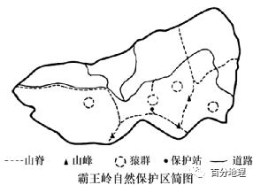
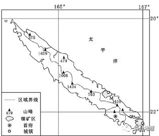
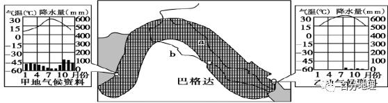
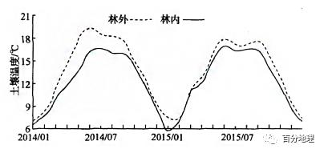
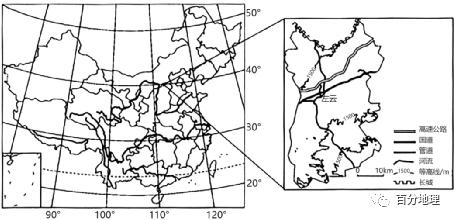
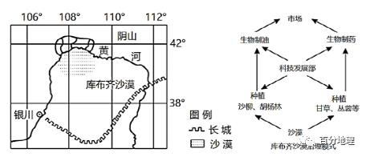
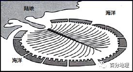
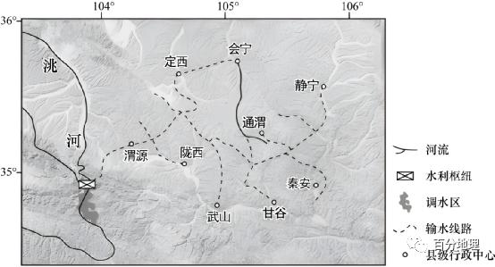
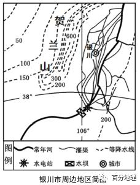
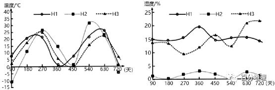

# 微专题之082自然环境整体性

```
本专题摘自“百分地理”公众号，如有侵权请告之删除，谢谢。联系hhwxyhh@163.com
```

------
（2022·全国甲卷）蒙古族将靠近山林的优质草原称为杭盖草原。杭盖草原地形和缓，多由缓丘和河谷组成。缓丘上牧草葱郁，河谷中的牧草更加繁茂。通常鼠类打洞、啃食等对草原多有破坏，而杭盖草原的河谷中鼠害却很轻。杭盖草原是古时游牧民族最喜爱的牧场。据此完成下面小题。   
1．杭盖草原附近山地对古时游牧民族越冬的重要性在于（  ）   
A．提供水源   
B．挡风保暖   
C．食物丰富   
D．围猎场所大   
2．相对于周边坡度较大的草原，杭盖草原的缓丘牧草生长更好，是因为缓丘上（  ）   
A．降水较多   
B．蒸发较弱   
C．温度较高   
D．径流较少   
3．杭盖草原的河谷鼠害很轻，是因为河谷（  ）   
A．缺乏鼠类食物   
B．冷空气易集聚   
C．地下水位高   
D．鼠类天敌多   
<span style="color: rgb(255, 0, 0);">1．B据材料可知，杭盖草原为蒙古族的牧场，纬度较高，距离冬季风源地近，冬季受西北季风的影响强烈，气候寒冷。选择有山地的地区南坡即阳坡越冬，相比北坡而言，一方面日照时间较长，光热条件较好，另一方面，位于西北季风的背风坡，受冬季风影响较小，较温暖，B正确。山地的水源、食物相比浅丘和河谷没有优势，AC错误。游牧民族以放牧为生，猎人以狩猎为生，故围猎场所与游牧民族选择山地越冬关系不大，D错误。故选B。</span>   
<span style="color: rgb(255, 0, 0);">2．B杭盖草原位于我国西北地区，温带大陆性气候，降水较少，A错误。温度与坡向和海拔有关，与坡度大小关系不大，C错误。缓坡坡面径流速度较慢，有利于下渗，地下径流更丰富，D错误。该地区纬度较高，太阳高度角比较小，与陡坡相比，缓坡太阳辐射与地面的夹角更小，单位面积获得的热量较少，土壤蒸发较弱，水分条件更好，牧草生长更茂盛，B正确。故选B。</span>   
<span style="color: rgb(255, 0, 0);">3．C据材料可知，鼠类通过打洞、啃食等，对草原多有破坏，打洞为其提供栖息和生活的场所，在河谷地区，地下水位较高，打洞常常被地下水淹没，导致无法栖息，所以鼠类往往远离河谷地区生活繁衍，故导致杭盖草原的河谷鼠害很轻，C正确。河谷中的牧草更加繁茂，鼠类食物丰富，A错误。河谷位于缓坡之间，冷空气集聚作用不明显，B错误。河谷与缓坡空间距离并不远，天敌数量差异不大，D错误。故选C。</span>   
（2022·湖南卷）我国西北某内流河下游河岸地带发育着荒漠植物群落，胡杨为主要建群种，该地地下水平均埋深3～4米。下表反映该植物群落属性及影响因子随离河岸距离增加的变化情况（其中土壤容重与土壤有机质含量呈负相关，土壤电导率与土壤含盐量呈正相关）。据此完成下面小题。   
<table cellspacing="0" cellpadding="0" width="577"><tbody><tr><td width="57" rowspan="2" valign="middle" style="padding: 3.75pt 6pt;border-width: 1pt;border-color: rgb(0, 0, 0);"><section style="margin-top: 0pt;margin-bottom: 0pt;margin-left: 0pt;text-indent: 0pt;font-size: 10.5pt;font-family: &quot;Times New Roman&quot;;text-align: left;line-height: 2em;"><span style="font-family: 楷体;">离河岸距离（</span>m<span style="font-family: 楷体;">）</span></section></td><td width="147" colspan="2" valign="middle" style="padding: 3.75pt 6pt;border-top-width: 1pt;border-top-color: rgb(0, 0, 0);border-right-width: 1pt;border-right-color: rgb(0, 0, 0);border-bottom-width: 1pt;border-bottom-color: rgb(0, 0, 0);border-left: none;"><section style="margin-top: 0pt;margin-bottom: 0pt;margin-left: 0pt;font-size: 10.5pt;font-family: &quot;Times New Roman&quot;;text-align: left;text-indent: 21pt;line-height: 2em;"><span style="font-family: 楷体;">群落属性</span></section></td><td width="245" colspan="4" valign="middle" style="padding: 3.75pt 6pt;border-top-width: 1pt;border-top-color: rgb(0, 0, 0);border-right-width: 1pt;border-right-color: rgb(0, 0, 0);border-bottom-width: 1pt;border-bottom-color: rgb(0, 0, 0);border-left: none;"><section style="margin-top: 0pt;margin-bottom: 0pt;margin-left: 0pt;font-size: 10.5pt;font-family: &quot;Times New Roman&quot;;text-align: left;text-indent: 21pt;line-height: 2em;"><span style="font-family: 楷体;">影响因子</span></section></td></tr><tr><td width="90" valign="middle" style="padding: 3.75pt 6pt;border-top-width: 1pt;border-top-color: rgb(0, 0, 0);border-right-width: 1pt;border-right-color: rgb(0, 0, 0);border-bottom-width: 1pt;border-bottom-color: rgb(0, 0, 0);border-left: none;"><section style="margin-top: 0pt;margin-bottom: 0pt;margin-left: 0pt;font-size: 10.5pt;font-family: &quot;Times New Roman&quot;;text-align: left;text-indent: 21pt;line-height: 2em;"><span style="font-family: 楷体;">群落结构</span></section></td><td width="56" valign="middle" style="padding: 3.75pt 6pt;border-top-width: 1pt;border-top-color: rgb(0, 0, 0);border-right-width: 1pt;border-right-color: rgb(0, 0, 0);border-bottom-width: 1pt;border-bottom-color: rgb(0, 0, 0);border-left: none;"><section style="margin-top: 0pt;margin-bottom: 0pt;margin-left: 0pt;text-indent: 0pt;font-size: 10.5pt;font-family: &quot;Times New Roman&quot;;text-align: left;line-height: 2em;"><span style="font-family: 楷体;">群落盖度（</span>%<span style="font-family: 楷体;">）</span></section></td><td width="56" valign="middle" style="padding: 3.75pt 6pt;border-top-width: 1pt;border-top-color: rgb(0, 0, 0);border-right-width: 1pt;border-right-color: rgb(0, 0, 0);border-bottom-width: 1pt;border-bottom-color: rgb(0, 0, 0);border-left: none;"><section style="margin-top: 0pt;margin-bottom: 0pt;margin-left: 0pt;text-indent: 0pt;font-size: 10.5pt;font-family: &quot;Times New Roman&quot;;text-align: left;line-height: 2em;"><span style="font-family: 楷体;">海拔（</span>m<span style="font-family: 楷体;">）</span></section></td><td width="63" valign="middle" style="padding: 3.75pt 6pt;border-top-width: 1pt;border-top-color: rgb(0, 0, 0);border-right-width: 1pt;border-right-color: rgb(0, 0, 0);border-bottom-width: 1pt;border-bottom-color: rgb(0, 0, 0);border-left: none;"><section style="margin-top: 0pt;margin-bottom: 0pt;margin-left: 0pt;text-indent: 0pt;font-size: 10.5pt;font-family: &quot;Times New Roman&quot;;text-align: left;line-height: 2em;"><span style="font-family: 楷体;">土壤含水量（</span>%<span style="font-family: 楷体;">）</span></section></td><td width="63" valign="middle" style="padding: 3.75pt 6pt;border-top-width: 1pt;border-top-color: rgb(0, 0, 0);border-right-width: 1pt;border-right-color: rgb(0, 0, 0);border-bottom-width: 1pt;border-bottom-color: rgb(0, 0, 0);border-left: none;"><section style="margin-top: 0pt;margin-bottom: 0pt;margin-left: 0pt;text-indent: 0pt;font-size: 10.5pt;font-family: &quot;Times New Roman&quot;;text-align: left;line-height: 2em;"><span style="font-family: 楷体;">土壤容重</span></section><section style="margin-top: 0pt;margin-bottom: 0pt;margin-left: 0pt;text-indent: 0pt;font-size: 10.5pt;font-family: &quot;Times New Roman&quot;;text-align: left;line-height: 2em;"><span style="font-family: 楷体;">（</span>g/cm<sup>3</sup><span style="font-family: 楷体;">）</span></section></td><td width="61" valign="middle" style="padding: 3.75pt 6pt;border-top-width: 1pt;border-top-color: rgb(0, 0, 0);border-right-width: 1pt;border-right-color: rgb(0, 0, 0);border-bottom-width: 1pt;border-bottom-color: rgb(0, 0, 0);border-left: none;"><section style="margin-top: 0pt;margin-bottom: 0pt;margin-left: 0pt;text-indent: 0pt;font-size: 10.5pt;font-family: &quot;Times New Roman&quot;;text-align: left;line-height: 2em;"><span style="font-family: 楷体;">土壤电导（</span>mS/cm<span style="font-family: 楷体;">）</span></section></td></tr><tr><td width="57" valign="middle" style="padding: 3.75pt 6pt;border-width: 1pt;border-color: rgb(0, 0, 0);"><section style="margin-top: 0pt;margin-bottom: 0pt;margin-left: 0pt;font-size: 10.5pt;font-family: &quot;Times New Roman&quot;;text-align: left;text-indent: 21pt;line-height: 2em;">50</section></td><td width="90" valign="middle" style="padding: 3.75pt 6pt;border-top-width: 1pt;border-top-color: rgb(0, 0, 0);border-right-width: 1pt;border-right-color: rgb(0, 0, 0);border-bottom-width: 1pt;border-bottom-color: rgb(0, 0, 0);border-left: none;"><section style="margin-top: 0pt;margin-bottom: 0pt;margin-left: 0pt;font-size: 10.5pt;font-family: &quot;Times New Roman&quot;;text-align: left;text-indent: 21pt;line-height: 2em;"><span style="font-family: 楷体;">乔</span>—<span style="font-family: 楷体;">灌</span>—<span style="font-family: 楷体;">草</span></section></td><td width="56" valign="middle" style="padding: 3.75pt 6pt;border-top-width: 1pt;border-top-color: rgb(0, 0, 0);border-right-width: 1pt;border-right-color: rgb(0, 0, 0);border-bottom-width: 1pt;border-bottom-color: rgb(0, 0, 0);border-left: none;"><section style="margin-top: 0pt;margin-bottom: 0pt;margin-left: 0pt;text-indent: 0pt;font-size: 10.5pt;font-family: &quot;Times New Roman&quot;;text-align: left;line-height: 2em;">30.33</section></td><td width="56" valign="middle" style="padding: 3.75pt 6pt;border-top-width: 1pt;border-top-color: rgb(0, 0, 0);border-right-width: 1pt;border-right-color: rgb(0, 0, 0);border-bottom-width: 1pt;border-bottom-color: rgb(0, 0, 0);border-left: none;"><section style="margin-top: 0pt;margin-bottom: 0pt;margin-left: 0pt;font-size: 10.5pt;font-family: &quot;Times New Roman&quot;;text-align: left;text-indent: 21pt;line-height: 2em;">916</section></td><td width="63" valign="middle" style="padding: 3.75pt 6pt;border-top-width: 1pt;border-top-color: rgb(0, 0, 0);border-right-width: 1pt;border-right-color: rgb(0, 0, 0);border-bottom-width: 1pt;border-bottom-color: rgb(0, 0, 0);border-left: none;"><section style="margin-top: 0pt;margin-bottom: 0pt;margin-left: 0pt;font-size: 10.5pt;font-family: &quot;Times New Roman&quot;;text-align: left;text-indent: 21pt;line-height: 2em;">5.73</section></td><td width="63" valign="middle" style="padding: 3.75pt 6pt;border-top-width: 1pt;border-top-color: rgb(0, 0, 0);border-right-width: 1pt;border-right-color: rgb(0, 0, 0);border-bottom-width: 1pt;border-bottom-color: rgb(0, 0, 0);border-left: none;"><section style="margin-top: 0pt;margin-bottom: 0pt;margin-left: 0pt;font-size: 10.5pt;font-family: &quot;Times New Roman&quot;;text-align: left;text-indent: 21pt;line-height: 2em;">1.41</section></td><td width="61" valign="middle" style="padding: 3.75pt 6pt;border-top-width: 1pt;border-top-color: rgb(0, 0, 0);border-right-width: 1pt;border-right-color: rgb(0, 0, 0);border-bottom-width: 1pt;border-bottom-color: rgb(0, 0, 0);border-left: none;"><section style="margin-top: 0pt;margin-bottom: 0pt;margin-left: 0pt;font-size: 10.5pt;font-family: &quot;Times New Roman&quot;;text-align: left;text-indent: 21pt;line-height: 2em;">0.36</section></td></tr><tr><td width="57" valign="middle" style="padding: 3.75pt 6pt;border-width: 1pt;border-color: rgb(0, 0, 0);"><section style="margin-top: 0pt;margin-bottom: 0pt;margin-left: 0pt;font-size: 10.5pt;font-family: &quot;Times New Roman&quot;;text-align: left;text-indent: 21pt;line-height: 2em;">200</section></td><td width="90" valign="middle" style="padding: 3.75pt 6pt;border-top-width: 1pt;border-top-color: rgb(0, 0, 0);border-right-width: 1pt;border-right-color: rgb(0, 0, 0);border-bottom-width: 1pt;border-bottom-color: rgb(0, 0, 0);border-left: none;"><section style="margin-top: 0pt;margin-bottom: 0pt;margin-left: 0pt;font-size: 10.5pt;font-family: &quot;Times New Roman&quot;;text-align: left;text-indent: 21pt;line-height: 2em;"><span style="font-family: 楷体;">乔</span>—<span style="font-family: 楷体;">灌</span>—<span style="font-family: 楷体;">草</span></section></td><td width="56" valign="middle" style="padding: 3.75pt 6pt;border-top-width: 1pt;border-top-color: rgb(0, 0, 0);border-right-width: 1pt;border-right-color: rgb(0, 0, 0);border-bottom-width: 1pt;border-bottom-color: rgb(0, 0, 0);border-left: none;"><section style="margin-top: 0pt;margin-bottom: 0pt;margin-left: 0pt;text-indent: 0pt;font-size: 10.5pt;font-family: &quot;Times New Roman&quot;;text-align: left;line-height: 2em;">34.00</section></td><td width="56" valign="middle" style="padding: 3.75pt 6pt;border-top-width: 1pt;border-top-color: rgb(0, 0, 0);border-right-width: 1pt;border-right-color: rgb(0, 0, 0);border-bottom-width: 1pt;border-bottom-color: rgb(0, 0, 0);border-left: none;"><section style="margin-top: 0pt;margin-bottom: 0pt;margin-left: 0pt;font-size: 10.5pt;font-family: &quot;Times New Roman&quot;;text-align: left;text-indent: 21pt;line-height: 2em;">917</section></td><td width="63" valign="middle" style="padding: 3.75pt 6pt;border-top-width: 1pt;border-top-color: rgb(0, 0, 0);border-right-width: 1pt;border-right-color: rgb(0, 0, 0);border-bottom-width: 1pt;border-bottom-color: rgb(0, 0, 0);border-left: none;"><section style="margin-top: 0pt;margin-bottom: 0pt;margin-left: 0pt;font-size: 10.5pt;font-family: &quot;Times New Roman&quot;;text-align: left;text-indent: 21pt;line-height: 2em;">5.04</section></td><td width="63" valign="middle" style="padding: 3.75pt 6pt;border-top-width: 1pt;border-top-color: rgb(0, 0, 0);border-right-width: 1pt;border-right-color: rgb(0, 0, 0);border-bottom-width: 1pt;border-bottom-color: rgb(0, 0, 0);border-left: none;"><section style="margin-top: 0pt;margin-bottom: 0pt;margin-left: 0pt;font-size: 10.5pt;font-family: &quot;Times New Roman&quot;;text-align: left;text-indent: 21pt;line-height: 2em;">1.50</section></td><td width="61" valign="middle" style="padding: 3.75pt 6pt;border-top-width: 1pt;border-top-color: rgb(0, 0, 0);border-right-width: 1pt;border-right-color: rgb(0, 0, 0);border-bottom-width: 1pt;border-bottom-color: rgb(0, 0, 0);border-left: none;"><section style="margin-top: 0pt;margin-bottom: 0pt;margin-left: 0pt;font-size: 10.5pt;font-family: &quot;Times New Roman&quot;;text-align: left;text-indent: 21pt;line-height: 2em;">0.59</section></td></tr><tr><td width="57" valign="middle" style="padding: 3.75pt 6pt;border-width: 1pt;border-color: rgb(0, 0, 0);"><section style="margin-top: 0pt;margin-bottom: 0pt;margin-left: 0pt;font-size: 10.5pt;font-family: &quot;Times New Roman&quot;;text-align: left;text-indent: 21pt;line-height: 2em;">350</section></td><td width="90" valign="middle" style="padding: 3.75pt 6pt;border-top-width: 1pt;border-top-color: rgb(0, 0, 0);border-right-width: 1pt;border-right-color: rgb(0, 0, 0);border-bottom-width: 1pt;border-bottom-color: rgb(0, 0, 0);border-left: none;"><section style="margin-top: 0pt;margin-bottom: 0pt;margin-left: 0pt;font-size: 10.5pt;font-family: &quot;Times New Roman&quot;;text-align: left;text-indent: 21pt;line-height: 2em;"><span style="font-family: 楷体;">乔</span>—<span style="font-family: 楷体;">灌</span>—<span style="font-family: 楷体;">草</span></section></td><td width="56" valign="middle" style="padding: 3.75pt 6pt;border-top-width: 1pt;border-top-color: rgb(0, 0, 0);border-right-width: 1pt;border-right-color: rgb(0, 0, 0);border-bottom-width: 1pt;border-bottom-color: rgb(0, 0, 0);border-left: none;"><section style="margin-top: 0pt;margin-bottom: 0pt;margin-left: 0pt;text-indent: 0pt;font-size: 10.5pt;font-family: &quot;Times New Roman&quot;;text-align: left;line-height: 2em;">40.33</section></td><td width="56" valign="middle" style="padding: 3.75pt 6pt;border-top-width: 1pt;border-top-color: rgb(0, 0, 0);border-right-width: 1pt;border-right-color: rgb(0, 0, 0);border-bottom-width: 1pt;border-bottom-color: rgb(0, 0, 0);border-left: none;"><section style="margin-top: 0pt;margin-bottom: 0pt;margin-left: 0pt;font-size: 10.5pt;font-family: &quot;Times New Roman&quot;;text-align: left;text-indent: 21pt;line-height: 2em;">914</section></td><td width="63" valign="middle" style="padding: 3.75pt 6pt;border-top-width: 1pt;border-top-color: rgb(0, 0, 0);border-right-width: 1pt;border-right-color: rgb(0, 0, 0);border-bottom-width: 1pt;border-bottom-color: rgb(0, 0, 0);border-left: none;"><section style="margin-top: 0pt;margin-bottom: 0pt;margin-left: 0pt;font-size: 10.5pt;font-family: &quot;Times New Roman&quot;;text-align: left;text-indent: 21pt;line-height: 2em;">4.42</section></td><td width="63" valign="middle" style="padding: 3.75pt 6pt;border-top-width: 1pt;border-top-color: rgb(0, 0, 0);border-right-width: 1pt;border-right-color: rgb(0, 0, 0);border-bottom-width: 1pt;border-bottom-color: rgb(0, 0, 0);border-left: none;"><section style="margin-top: 0pt;margin-bottom: 0pt;margin-left: 0pt;font-size: 10.5pt;font-family: &quot;Times New Roman&quot;;text-align: left;text-indent: 21pt;line-height: 2em;">1.50</section></td><td width="61" valign="middle" style="padding: 3.75pt 6pt;border-top-width: 1pt;border-top-color: rgb(0, 0, 0);border-right-width: 1pt;border-right-color: rgb(0, 0, 0);border-bottom-width: 1pt;border-bottom-color: rgb(0, 0, 0);border-left: none;"><section style="margin-top: 0pt;margin-bottom: 0pt;margin-left: 0pt;font-size: 10.5pt;font-family: &quot;Times New Roman&quot;;text-align: left;text-indent: 21pt;line-height: 2em;">0.37</section></td></tr><tr><td width="57" valign="middle" style="padding: 3.75pt 6pt;border-width: 1pt;border-color: rgb(0, 0, 0);"><section style="margin-top: 0pt;margin-bottom: 0pt;margin-left: 0pt;font-size: 10.5pt;font-family: &quot;Times New Roman&quot;;text-align: left;text-indent: 21pt;line-height: 2em;">500</section></td><td width="90" valign="middle" style="padding: 3.75pt 6pt;border-top-width: 1pt;border-top-color: rgb(0, 0, 0);border-right-width: 1pt;border-right-color: rgb(0, 0, 0);border-bottom-width: 1pt;border-bottom-color: rgb(0, 0, 0);border-left: none;"><section style="margin-top: 0pt;margin-bottom: 0pt;margin-left: 0pt;font-size: 10.5pt;font-family: &quot;Times New Roman&quot;;text-align: left;text-indent: 21pt;line-height: 2em;"><span style="font-family: 楷体;">乔</span>—<span style="font-family: 楷体;">灌</span>—<span style="font-family: 楷体;">草</span></section></td><td width="56" valign="middle" style="padding: 3.75pt 6pt;border-top-width: 1pt;border-top-color: rgb(0, 0, 0);border-right-width: 1pt;border-right-color: rgb(0, 0, 0);border-bottom-width: 1pt;border-bottom-color: rgb(0, 0, 0);border-left: none;"><section style="margin-top: 0pt;margin-bottom: 0pt;margin-left: 0pt;text-indent: 0pt;font-size: 10.5pt;font-family: &quot;Times New Roman&quot;;text-align: left;line-height: 2em;">46.67</section></td><td width="56" valign="middle" style="padding: 3.75pt 6pt;border-top-width: 1pt;border-top-color: rgb(0, 0, 0);border-right-width: 1pt;border-right-color: rgb(0, 0, 0);border-bottom-width: 1pt;border-bottom-color: rgb(0, 0, 0);border-left: none;"><section style="margin-top: 0pt;margin-bottom: 0pt;margin-left: 0pt;font-size: 10.5pt;font-family: &quot;Times New Roman&quot;;text-align: left;text-indent: 21pt;line-height: 2em;">914</section></td><td width="63" valign="middle" style="padding: 3.75pt 6pt;border-top-width: 1pt;border-top-color: rgb(0, 0, 0);border-right-width: 1pt;border-right-color: rgb(0, 0, 0);border-bottom-width: 1pt;border-bottom-color: rgb(0, 0, 0);border-left: none;"><section style="margin-top: 0pt;margin-bottom: 0pt;margin-left: 0pt;font-size: 10.5pt;font-family: &quot;Times New Roman&quot;;text-align: left;text-indent: 21pt;line-height: 2em;">18.51</section></td><td width="63" valign="middle" style="padding: 3.75pt 6pt;border-top-width: 1pt;border-top-color: rgb(0, 0, 0);border-right-width: 1pt;border-right-color: rgb(0, 0, 0);border-bottom-width: 1pt;border-bottom-color: rgb(0, 0, 0);border-left: none;"><section style="margin-top: 0pt;margin-bottom: 0pt;margin-left: 0pt;font-size: 10.5pt;font-family: &quot;Times New Roman&quot;;text-align: left;text-indent: 21pt;line-height: 2em;">1.41</section></td><td width="61" valign="middle" style="padding: 3.75pt 6pt;border-top-width: 1pt;border-top-color: rgb(0, 0, 0);border-right-width: 1pt;border-right-color: rgb(0, 0, 0);border-bottom-width: 1pt;border-bottom-color: rgb(0, 0, 0);border-left: none;"><section style="margin-top: 0pt;margin-bottom: 0pt;margin-left: 0pt;font-size: 10.5pt;font-family: &quot;Times New Roman&quot;;text-align: left;text-indent: 21pt;line-height: 2em;">2.56</section></td></tr><tr><td width="57" valign="middle" style="padding: 3.75pt 6pt;border-width: 1pt;border-color: rgb(0, 0, 0);"><section style="margin-top: 0pt;margin-bottom: 0pt;margin-left: 0pt;font-size: 10.5pt;font-family: &quot;Times New Roman&quot;;text-align: left;text-indent: 21pt;line-height: 2em;">650</section></td><td width="90" valign="middle" style="padding: 3.75pt 6pt;border-top-width: 1pt;border-top-color: rgb(0, 0, 0);border-right-width: 1pt;border-right-color: rgb(0, 0, 0);border-bottom-width: 1pt;border-bottom-color: rgb(0, 0, 0);border-left: none;"><section style="margin-top: 0pt;margin-bottom: 0pt;margin-left: 0pt;font-size: 10.5pt;font-family: &quot;Times New Roman&quot;;text-align: left;text-indent: 21pt;line-height: 2em;"><span style="font-family: 楷体;">乔</span>—<span style="font-family: 楷体;">灌</span>—<span style="font-family: 楷体;">草</span></section></td><td width="56" valign="middle" style="padding: 3.75pt 6pt;border-top-width: 1pt;border-top-color: rgb(0, 0, 0);border-right-width: 1pt;border-right-color: rgb(0, 0, 0);border-bottom-width: 1pt;border-bottom-color: rgb(0, 0, 0);border-left: none;"><section style="margin-top: 0pt;margin-bottom: 0pt;margin-left: 0pt;text-indent: 0pt;font-size: 10.5pt;font-family: &quot;Times New Roman&quot;;text-align: left;line-height: 2em;">74.33</section></td><td width="56" valign="middle" style="padding: 3.75pt 6pt;border-top-width: 1pt;border-top-color: rgb(0, 0, 0);border-right-width: 1pt;border-right-color: rgb(0, 0, 0);border-bottom-width: 1pt;border-bottom-color: rgb(0, 0, 0);border-left: none;"><section style="margin-top: 0pt;margin-bottom: 0pt;margin-left: 0pt;font-size: 10.5pt;font-family: &quot;Times New Roman&quot;;text-align: left;text-indent: 21pt;line-height: 2em;">913</section></td><td width="63" valign="middle" style="padding: 3.75pt 6pt;border-top-width: 1pt;border-top-color: rgb(0, 0, 0);border-right-width: 1pt;border-right-color: rgb(0, 0, 0);border-bottom-width: 1pt;border-bottom-color: rgb(0, 0, 0);border-left: none;"><section style="margin-top: 0pt;margin-bottom: 0pt;margin-left: 0pt;font-size: 10.5pt;font-family: &quot;Times New Roman&quot;;text-align: left;text-indent: 21pt;line-height: 2em;">19.27</section></td><td width="63" valign="middle" style="padding: 3.75pt 6pt;border-top-width: 1pt;border-top-color: rgb(0, 0, 0);border-right-width: 1pt;border-right-color: rgb(0, 0, 0);border-bottom-width: 1pt;border-bottom-color: rgb(0, 0, 0);border-left: none;"><section style="margin-top: 0pt;margin-bottom: 0pt;margin-left: 0pt;font-size: 10.5pt;font-family: &quot;Times New Roman&quot;;text-align: left;text-indent: 21pt;line-height: 2em;">1.37</section></td><td width="61" valign="middle" style="padding: 3.75pt 6pt;border-top-width: 1pt;border-top-color: rgb(0, 0, 0);border-right-width: 1pt;border-right-color: rgb(0, 0, 0);border-bottom-width: 1pt;border-bottom-color: rgb(0, 0, 0);border-left: none;"><section style="margin-top: 0pt;margin-bottom: 0pt;margin-left: 0pt;font-size: 10.5pt;font-family: &quot;Times New Roman&quot;;text-align: left;text-indent: 21pt;line-height: 2em;">0.40</section></td></tr><tr><td width="57" valign="middle" style="padding: 3.75pt 6pt;border-width: 1pt;border-color: rgb(0, 0, 0);"><section style="margin-top: 0pt;margin-bottom: 0pt;margin-left: 0pt;font-size: 10.5pt;font-family: &quot;Times New Roman&quot;;text-align: left;text-indent: 21pt;line-height: 2em;">800</section></td><td width="90" valign="middle" style="padding: 3.75pt 6pt;border-top-width: 1pt;border-top-color: rgb(0, 0, 0);border-right-width: 1pt;border-right-color: rgb(0, 0, 0);border-bottom-width: 1pt;border-bottom-color: rgb(0, 0, 0);border-left: none;"><section style="margin-top: 0pt;margin-bottom: 0pt;margin-left: 0pt;font-size: 10.5pt;font-family: &quot;Times New Roman&quot;;text-align: left;text-indent: 21pt;line-height: 2em;"><span style="font-family: 楷体;">乔</span>—<span style="font-family: 楷体;">灌</span>—<span style="font-family: 楷体;">草</span></section></td><td width="56" valign="middle" style="padding: 3.75pt 6pt;border-top-width: 1pt;border-top-color: rgb(0, 0, 0);border-right-width: 1pt;border-right-color: rgb(0, 0, 0);border-bottom-width: 1pt;border-bottom-color: rgb(0, 0, 0);border-left: none;"><section style="margin-top: 0pt;margin-bottom: 0pt;margin-left: 0pt;text-indent: 0pt;font-size: 10.5pt;font-family: &quot;Times New Roman&quot;;text-align: left;line-height: 2em;">68.67</section></td><td width="56" valign="middle" style="padding: 3.75pt 6pt;border-top-width: 1pt;border-top-color: rgb(0, 0, 0);border-right-width: 1pt;border-right-color: rgb(0, 0, 0);border-bottom-width: 1pt;border-bottom-color: rgb(0, 0, 0);border-left: none;"><section style="margin-top: 0pt;margin-bottom: 0pt;margin-left: 0pt;font-size: 10.5pt;font-family: &quot;Times New Roman&quot;;text-align: left;text-indent: 21pt;line-height: 2em;">913</section></td><td width="63" valign="middle" style="padding: 3.75pt 6pt;border-top-width: 1pt;border-top-color: rgb(0, 0, 0);border-right-width: 1pt;border-right-color: rgb(0, 0, 0);border-bottom-width: 1pt;border-bottom-color: rgb(0, 0, 0);border-left: none;"><section style="margin-top: 0pt;margin-bottom: 0pt;margin-left: 0pt;font-size: 10.5pt;font-family: &quot;Times New Roman&quot;;text-align: left;text-indent: 21pt;line-height: 2em;">15.23</section></td><td width="63" valign="middle" style="padding: 3.75pt 6pt;border-top-width: 1pt;border-top-color: rgb(0, 0, 0);border-right-width: 1pt;border-right-color: rgb(0, 0, 0);border-bottom-width: 1pt;border-bottom-color: rgb(0, 0, 0);border-left: none;"><section style="margin-top: 0pt;margin-bottom: 0pt;margin-left: 0pt;font-size: 10.5pt;font-family: &quot;Times New Roman&quot;;text-align: left;text-indent: 21pt;line-height: 2em;">1.38</section></td><td width="61" valign="middle" style="padding: 3.75pt 6pt;border-top-width: 1pt;border-top-color: rgb(0, 0, 0);border-right-width: 1pt;border-right-color: rgb(0, 0, 0);border-bottom-width: 1pt;border-bottom-color: rgb(0, 0, 0);border-left: none;"><section style="margin-top: 0pt;margin-bottom: 0pt;margin-left: 0pt;font-size: 10.5pt;font-family: &quot;Times New Roman&quot;;text-align: left;text-indent: 21pt;line-height: 2em;">1.02</section></td></tr><tr><td width="57" valign="middle" style="padding: 3.75pt 6pt;border-width: 1pt;border-color: rgb(0, 0, 0);"><section style="margin-top: 0pt;margin-bottom: 0pt;margin-left: 0pt;font-size: 10.5pt;font-family: &quot;Times New Roman&quot;;text-align: left;text-indent: 21pt;line-height: 2em;">950</section></td><td width="90" valign="middle" style="padding: 3.75pt 6pt;border-top-width: 1pt;border-top-color: rgb(0, 0, 0);border-right-width: 1pt;border-right-color: rgb(0, 0, 0);border-bottom-width: 1pt;border-bottom-color: rgb(0, 0, 0);border-left: none;"><section style="margin-top: 0pt;margin-bottom: 0pt;margin-left: 0pt;font-size: 10.5pt;font-family: &quot;Times New Roman&quot;;text-align: left;text-indent: 21pt;line-height: 2em;"><span style="font-family: 楷体;">乔</span>—<span style="font-family: 楷体;">草</span></section></td><td width="56" valign="middle" style="padding: 3.75pt 6pt;border-top-width: 1pt;border-top-color: rgb(0, 0, 0);border-right-width: 1pt;border-right-color: rgb(0, 0, 0);border-bottom-width: 1pt;border-bottom-color: rgb(0, 0, 0);border-left: none;"><section style="margin-top: 0pt;margin-bottom: 0pt;margin-left: 0pt;text-indent: 0pt;font-size: 10.5pt;font-family: &quot;Times New Roman&quot;;text-align: left;line-height: 2em;">45.00</section></td><td width="56" valign="middle" style="padding: 3.75pt 6pt;border-top-width: 1pt;border-top-color: rgb(0, 0, 0);border-right-width: 1pt;border-right-color: rgb(0, 0, 0);border-bottom-width: 1pt;border-bottom-color: rgb(0, 0, 0);border-left: none;"><section style="margin-top: 0pt;margin-bottom: 0pt;margin-left: 0pt;font-size: 10.5pt;font-family: &quot;Times New Roman&quot;;text-align: left;text-indent: 21pt;line-height: 2em;">912</section></td><td width="63" valign="middle" style="padding: 3.75pt 6pt;border-top-width: 1pt;border-top-color: rgb(0, 0, 0);border-right-width: 1pt;border-right-color: rgb(0, 0, 0);border-bottom-width: 1pt;border-bottom-color: rgb(0, 0, 0);border-left: none;"><section style="margin-top: 0pt;margin-bottom: 0pt;margin-left: 0pt;font-size: 10.5pt;font-family: &quot;Times New Roman&quot;;text-align: left;text-indent: 21pt;line-height: 2em;">7.78</section></td><td width="63" valign="middle" style="padding: 3.75pt 6pt;border-top-width: 1pt;border-top-color: rgb(0, 0, 0);border-right-width: 1pt;border-right-color: rgb(0, 0, 0);border-bottom-width: 1pt;border-bottom-color: rgb(0, 0, 0);border-left: none;"><section style="margin-top: 0pt;margin-bottom: 0pt;margin-left: 0pt;font-size: 10.5pt;font-family: &quot;Times New Roman&quot;;text-align: left;text-indent: 21pt;line-height: 2em;">1.40</section></td><td width="61" valign="middle" style="padding: 3.75pt 6pt;border-top-width: 1pt;border-top-color: rgb(0, 0, 0);border-right-width: 1pt;border-right-color: rgb(0, 0, 0);border-bottom-width: 1pt;border-bottom-color: rgb(0, 0, 0);border-left: none;"><section style="margin-top: 0pt;margin-bottom: 0pt;margin-left: 0pt;font-size: 10.5pt;font-family: &quot;Times New Roman&quot;;text-align: left;text-indent: 21pt;line-height: 2em;">0.50</section></td></tr><tr><td width="57" valign="middle" style="padding: 3.75pt 6pt;border-width: 1pt;border-color: rgb(0, 0, 0);"><section style="margin-top: 0pt;margin-bottom: 0pt;margin-left: 0pt;font-size: 10.5pt;font-family: &quot;Times New Roman&quot;;text-align: left;text-indent: 21pt;line-height: 2em;">1100</section></td><td width="90" valign="middle" style="padding: 3.75pt 6pt;border-top-width: 1pt;border-top-color: rgb(0, 0, 0);border-right-width: 1pt;border-right-color: rgb(0, 0, 0);border-bottom-width: 1pt;border-bottom-color: rgb(0, 0, 0);border-left: none;"><section style="margin-top: 0pt;margin-bottom: 0pt;margin-left: 0pt;font-size: 10.5pt;font-family: &quot;Times New Roman&quot;;text-align: left;text-indent: 21pt;line-height: 2em;"><span style="font-family: 楷体;">乔</span>—<span style="font-family: 楷体;">草</span></section></td><td width="56" valign="middle" style="padding: 3.75pt 6pt;border-top-width: 1pt;border-top-color: rgb(0, 0, 0);border-right-width: 1pt;border-right-color: rgb(0, 0, 0);border-bottom-width: 1pt;border-bottom-color: rgb(0, 0, 0);border-left: none;"><section style="margin-top: 0pt;margin-bottom: 0pt;margin-left: 0pt;text-indent: 0pt;font-size: 10.5pt;font-family: &quot;Times New Roman&quot;;text-align: left;line-height: 2em;">40.33</section></td><td width="56" valign="middle" style="padding: 3.75pt 6pt;border-top-width: 1pt;border-top-color: rgb(0, 0, 0);border-right-width: 1pt;border-right-color: rgb(0, 0, 0);border-bottom-width: 1pt;border-bottom-color: rgb(0, 0, 0);border-left: none;"><section style="margin-top: 0pt;margin-bottom: 0pt;margin-left: 0pt;font-size: 10.5pt;font-family: &quot;Times New Roman&quot;;text-align: left;text-indent: 21pt;line-height: 2em;">916</section></td><td width="63" valign="middle" style="padding: 3.75pt 6pt;border-top-width: 1pt;border-top-color: rgb(0, 0, 0);border-right-width: 1pt;border-right-color: rgb(0, 0, 0);border-bottom-width: 1pt;border-bottom-color: rgb(0, 0, 0);border-left: none;"><section style="margin-top: 0pt;margin-bottom: 0pt;margin-left: 0pt;font-size: 10.5pt;font-family: &quot;Times New Roman&quot;;text-align: left;text-indent: 21pt;line-height: 2em;">3.06</section></td><td width="63" valign="middle" style="padding: 3.75pt 6pt;border-top-width: 1pt;border-top-color: rgb(0, 0, 0);border-right-width: 1pt;border-right-color: rgb(0, 0, 0);border-bottom-width: 1pt;border-bottom-color: rgb(0, 0, 0);border-left: none;"><section style="margin-top: 0pt;margin-bottom: 0pt;margin-left: 0pt;font-size: 10.5pt;font-family: &quot;Times New Roman&quot;;text-align: left;text-indent: 21pt;line-height: 2em;">1.58</section></td><td width="61" valign="middle" style="padding: 3.75pt 6pt;border-top-width: 1pt;border-top-color: rgb(0, 0, 0);border-right-width: 1pt;border-right-color: rgb(0, 0, 0);border-bottom-width: 1pt;border-bottom-color: rgb(0, 0, 0);border-left: none;"><section style="margin-top: 0pt;margin-bottom: 0pt;margin-left: 0pt;font-size: 10.5pt;font-family: &quot;Times New Roman&quot;;text-align: left;text-indent: 21pt;line-height: 2em;">0.66</section></td></tr><tr><td width="57" valign="middle" style="padding: 3.75pt 6pt;border-width: 1pt;border-color: rgb(0, 0, 0);"><section style="margin-top: 0pt;margin-bottom: 0pt;margin-left: 0pt;font-size: 10.5pt;font-family: &quot;Times New Roman&quot;;text-align: left;text-indent: 21pt;line-height: 2em;">1250</section></td><td width="90" valign="middle" style="padding: 3.75pt 6pt;border-top-width: 1pt;border-top-color: rgb(0, 0, 0);border-right-width: 1pt;border-right-color: rgb(0, 0, 0);border-bottom-width: 1pt;border-bottom-color: rgb(0, 0, 0);border-left: none;"><section style="margin-top: 0pt;margin-bottom: 0pt;margin-left: 0pt;font-size: 10.5pt;font-family: &quot;Times New Roman&quot;;text-align: left;text-indent: 21pt;line-height: 2em;"><span style="font-family: 楷体;">乔</span>—<span style="font-family: 楷体;">草</span></section></td><td width="56" valign="middle" style="padding: 3.75pt 6pt;border-top-width: 1pt;border-top-color: rgb(0, 0, 0);border-right-width: 1pt;border-right-color: rgb(0, 0, 0);border-bottom-width: 1pt;border-bottom-color: rgb(0, 0, 0);border-left: none;"><section style="margin-top: 0pt;margin-bottom: 0pt;margin-left: 0pt;text-indent: 0pt;font-size: 10.5pt;font-family: &quot;Times New Roman&quot;;text-align: left;line-height: 2em;">34.33</section></td><td width="56" valign="middle" style="padding: 3.75pt 6pt;border-top-width: 1pt;border-top-color: rgb(0, 0, 0);border-right-width: 1pt;border-right-color: rgb(0, 0, 0);border-bottom-width: 1pt;border-bottom-color: rgb(0, 0, 0);border-left: none;"><section style="margin-top: 0pt;margin-bottom: 0pt;margin-left: 0pt;font-size: 10.5pt;font-family: &quot;Times New Roman&quot;;text-align: left;text-indent: 21pt;line-height: 2em;">915</section></td><td width="63" valign="middle" style="padding: 3.75pt 6pt;border-top-width: 1pt;border-top-color: rgb(0, 0, 0);border-right-width: 1pt;border-right-color: rgb(0, 0, 0);border-bottom-width: 1pt;border-bottom-color: rgb(0, 0, 0);border-left: none;"><section style="margin-top: 0pt;margin-bottom: 0pt;margin-left: 0pt;font-size: 10.5pt;font-family: &quot;Times New Roman&quot;;text-align: left;text-indent: 21pt;line-height: 2em;">2.32</section></td><td width="63" valign="middle" style="padding: 3.75pt 6pt;border-top-width: 1pt;border-top-color: rgb(0, 0, 0);border-right-width: 1pt;border-right-color: rgb(0, 0, 0);border-bottom-width: 1pt;border-bottom-color: rgb(0, 0, 0);border-left: none;"><section style="margin-top: 0pt;margin-bottom: 0pt;margin-left: 0pt;font-size: 10.5pt;font-family: &quot;Times New Roman&quot;;text-align: left;text-indent: 21pt;line-height: 2em;">1.62</section></td><td width="61" valign="middle" style="padding: 3.75pt 6pt;border-top-width: 1pt;border-top-color: rgb(0, 0, 0);border-right-width: 1pt;border-right-color: rgb(0, 0, 0);border-bottom-width: 1pt;border-bottom-color: rgb(0, 0, 0);border-left: none;"><section style="margin-top: 0pt;margin-bottom: 0pt;margin-left: 0pt;font-size: 10.5pt;font-family: &quot;Times New Roman&quot;;text-align: left;text-indent: 21pt;line-height: 2em;">1.98</section></td></tr></tbody></table>


4．随离河岸距离的增加，变化趋势与群落盖度总体相似的影响因子有（  ）   
①海拔   
②土壤含水量   
③土壤有机质含量   
④土壤含盐量   
A．①②   
B．②③   
C．②④   
D．③④   
5．浅根系草本植物在该植物群落中分布广泛，主要得益于（  ）   
A．胡杨涵养水源   
B．草本植物水分竞争力强   
C．地下水埋深浅   
D．草本植物耐盐碱能力强   
6．在离河岸950米到1250米的地段，该植物群落中灌木消失的主要原因可能是（  ）   
A．土壤有机质减少   
B．乔木与灌木水分竞争   
C．土壤含盐量增加   
D．草本与灌木水分竞争   
<span style="color: rgb(255, 0, 0);">4．B读表可知，随离河岸距离的增加，群落盖度大致先增后降，海拔高度变化规律不明显，土壤含水量大致先增后降，土壤容重大致先降后升，土壤电导率变化规律不明显，材料信息表明，土壤容重与土壤有机质含量呈负相关，土壤电导率与土壤含盐量呈正相关，因此随离河岸距离的增加，土壤有机质含量大致先增后降，土壤含盐量变化规律不明显，由此可知，随离河岸距离的增加，变化趋势与群落盖度总体相似的影响因子有土壤含水量和土壤有机质含量，即②、③符合题意，①、④不符合题意。综上所述，B符合题意，排除ACD。故选B。</span>   
<span style="color: rgb(255, 0, 0);">5．A材料信息表明，该地地下水平均埋深3～4米，浅根系草本植物很难直接获得地上水，但该地胡杨为主要建群种，具有较强的涵养水源作用，从而浅根系草本植物提醒水源，因此浅根系草本植物在该植物群落中分布广泛，A符合题意，排除C；草本植物根据较浅，因此水分竞争力并不强，排除B；该区域地下水较深，盐碱化现象并不严重，因此草本植物耐盐碱能力强不是广泛分布的主要原因，排除D。故选A。</span>   
<span style="color: rgb(255, 0, 0);">6．B干旱地区植物得以生存主要取决于水分水源条件，由于乔木与灌木的根系较深，在缺水地区存在明显的水分竞争状况，由乔木比灌木水分竞争能力更强，使得在离河岸950米到1250米的地段，该植物群落中灌木消失，B符合题意；草本根系较浅，与灌木的水分竞争中，灌木竞争能力更强，因此灌木消失不是草本与灌木水分竞争的结果，排除D；在离河岸950米到1250米的地段，乔木与草本植物均能生长，因此土壤有机质减少、土壤含盐量增加不是导致灌木消失的主要原因，排除AC。故选B。</span>   
（2021·海南高考真题）2021年5月7日至10日首届中国国际消费品博览会在海口举办，展会上亮相的吉祥物的原型来自海南特有物种海南长臂猿。该物种在海南曾广泛分布，后濒于灭绝，1980年建立霸王岭自然保护区后，其数量已有较大增长。海南长臂猿旱季多在海拔1000米以上，雨季常到低海拔地区的树冠层活动。读图，据此完成下列小题。   
   
   
7．在野外追踪海南长臂猿的活动轨迹，以下方案最合理的是（  ）   
A．1月，海拔1000米以下   
B．4月，海拔1000米以上   
C．7月，海拔1000米以下   
D．10月，海拔1000米以上   
8．当前，影响海南长臂猿生存和种群数量增长的因素主要表现在（  ）   
A．天敌多，食物少   
B．热带季雨林面积不断减少   
C．全球变暖，病虫害增多   
D．栖息地破碎，彼此分割   
9．基于自然地理环境整体性的原理，有效保护海南长臂猿的措施是（  ）   
A．发展基因技术，优化海南长臂猿种群结构   
B．加快道路建设，完善保护区的基础设施   
C．加强巡山和人工驯化，保护海南长臂猿的生存环境   
D．加强山水林田湖草系统治理，扩大海南长臂猿的生存空间   
<span style="color: rgb(255, 0, 0);">7．C根据材料可知，海南长臂猿旱季多在海拔1000米以上，雨季常到低海拔地区的树冠层活动。海南为热带季风气候，10月-次年3月为旱季，4-11月为雨季；1月降水少，海南长臂猿主要分布在海拔1000米以上；7月为雨季，海南长臂猿主要分布在海拔1000米以下的区域，故A错误，C正确；4月和10月为旱季和雨季的交换的季节，其活动轨迹不易追踪，故BD错误。故选C。</span>   
<span style="color: rgb(255, 0, 0);">8．D根据材料1980年建立了霸王岭自然保护区，所以当前食物增多，故A错误；建立自然保护区，热带季雨林面积增大，故B错误；全球气候变暖主要对中高纬度影响较大，对低纬度影响小，故C错误；读图可知，自然保护区中猿群分布比较分散，且有山脊、道路等将其栖息地分割，影响其生存，故D正确。故选D。</span>   
<span style="color: rgb(255, 0, 0);">9．D基因技术应主要针对濒临灭绝的生物种类，根据材料，近些年海南长臂猿数量有所增加，不需要采用基因技术，故A错误；道路建设，使栖息地更加破碎，不利于保护海南长臂猿，故B错误；加强巡山会打扰其生存环境，人工驯化不利于野生习性的保护，故C错误；加强山水林田湖草系统治理，改善生态环境，有利于扩大海南长臂猿的栖息地，进而扩大其生存空间，有效保护海南长臂猿，故D正确。故选D。</span>   
（2022·江苏扬州模拟预测）红土型镍矿大多产于基岩上部的地表红土风化壳矿床中，高温多雨的缓坡地带更有利于红土型镍矿的形成和保存，下图所示岛国是世界上重要的镍矿产区。读图，完成下面小题。   
   
   
   
10．M区域镍矿的形成和保存体现了地理环境的（  ）   
A．整体性   
B．差异性   
C．层次性   
D．非地带性现象   
11．红土型镍矿形成和保存的主要过程是（  ）   
A．外力侵蚀——搬运——堆积   
B．火山喷发——冷凝——堆积   
C．岩石风化——淋滤——沉积   
D．地壳下沉——变质——富集   
<span style="color: rgb(255, 0, 0);">10．A根据材料“高温多雨的缓坡地带更有利于红土型镍矿的形成和保存”可知，高温、多雨、易沉积的地形地势是促成红土型镍矿形成和保存的条件，这体现了地理环境各要素相互联系、相互制约和相互渗透的特点，构成了地理环境的整体性，A正确。自然地理环境的差异性体现在不同的地区，自然要素的组合情况不同，表现出极为显著的地域性，B不符合题意。层次性，即区域是有等级的。镍矿的形成和保存是一种过程和结果，不能体现层次性，C错误。非地带性现象，通常指自然地理环境各组成成分及其构成的自然综合体，在地表因受海陆差异、地势起伏、大地构造和岩性组成等因素的影响，形成与纬度地带性相异的各种地域分异现象。镍矿的形成和保存是一种过程和结果，而非现象，D不符合题意。故选择A。</span>   
<span style="color: rgb(255, 0, 0);">11．C根据材料“红土型镍矿大多产于基岩上部的地表红土风化壳矿床中，高温多雨的缓坡地带更有利于红土型镍矿的形成和保存”可知，由基岩到镍矿矿床的形成过程是地表岩石在外力作用下风化，接着在多雨的环境淋滤，然后在缓坡地带沉积而成，C正确，ABD错误。故选C。</span>   
（2022·四川省内江市第六中学高二期中）在亚洲西部，有一条弧形的狭长地带，犹如一弯新月，土壤很肥沃，因此有人称它为“新月沃地”。这里萌发了古农业文明，也是两河文明的发源地。结合下图完成下面小题。   
   
   
12．两河文明发源于“新月沃地”的原因是（  ）   
①水源充足②气候温暖③土壤肥沃④劳动力丰富   
A．①②③   
B．②③④   
C．①③④   
D．①②③④   
13．乙地气候对农业的影响是（  ）   
A．气温年较差较大，农业单产高   
B．热量不足   
C．风大、多风暴潮等气象灾害   
D．容易出现土地盐渍化问题   
14．甲气候对当地自然地理环境的影响是（  ）   
A．河流横剖面呈“V”形   
B．树叶叶质坚硬   
C．地形平坦   
D．自然灾害少   
<span style="color: rgb(255, 0, 0);">12．A本题考查“新月沃地”成为两河文明发源地的原因。读图可知，a，b两河流分别为底格里斯河和幼发拉底河，古农业时期，该流域人口少,耕地少，植被覆盖好，生产和生活用水量小,两河径流量较大，水源充足，①正确，④错误；该地为两河河流冲积形成的平原，土壤肥沃，适合耕作，③正确;读图可知，“新月沃地”临近波斯湾，临海地区相对于内陆地区气候较为温暖②正确。据此判断，A正确，BCD错误。故选A。</span>   
<span style="color: rgb(255, 0, 0);">13．D本题考查气候对农业的影响。读图中气候资料图可知，乙地为热带沙漠气候。甲地受地中海气候影响，乙地地区气候干旱，农业生产以灌溉农业为主，但由于不合理灌溉，且蒸发旺盛，故导致了土地盐碱化严重，D正确；乙地年较差较小，但水资源不足，农业单产低，A错误；乙地受热带沙漠气候影响，光热条件充足，但由于位于波斯湾沿岸,为闭合的海湾,受风暴潮影响小，BC错误。综上分析，故选D。</span>   
<span style="color: rgb(255, 0, 0);">14．B本题考查气候对自然地理环境的影响，结合材料“新月沃地”是两河形成的冲积平原，地形平坦，河流对地表影响的侵蚀作用主要以侧蚀作用为主，河流横剖面呈槽型，A错误；该地为地中海气候，高温时期少雨，低温时期多雨，这种不协调的配合，对植物十分不利。在生长季节，植物必须经过炎热干燥的锻炼，为了减少水分的蒸发，叶片一般较厚，植被的叶子上长有一层厚厚的蜡质层，叶小，很硬，B正确；地形平坦不属于气候的影响，C错误；甲地为地中海气候，夏季高温干燥，容易发生干旱，冬季温和多雨，易发生洪涝灾害，D错误，综上分析，本题选择B。</span>   
（2022·北京海淀一模）哀牢山亚热带常绿阔叶林林木茂密。2015年1月11日，哀牢山经历了一次极端降雪事件，累计积雪深度约为50厘米，林冠大面积受损。下图为2014年1月至2015年12月林下20厘米深处土壤温度逐月变化示意图。读图完成下面小题。   
   
   
15．降雪事件后，2015年比2014年（  ）   
A．夏季林内、林外土壤温差减小   
B．林外土壤温度的季节变幅增大   
C．枯枝落叶增多，腐殖质层变厚   
D．森林的分层结构发生显著变化   
16．与2014年相比，2015年夏季林内土壤温度较高的主要原因最可能是（  ）   
A．太阳高度角减小   
B．积雪融化提高地面反射率   
C．土壤含水量提高   
D．树冠对太阳辐射削弱减少   
<span style="color: rgb(255, 0, 0);">15．A根据图文可知，2015年夏季和2014年夏季相比，2015年夏季林内、林外温差减小，A选项正确。读图可知，与2014年相比，林外土壤温度的最高值明显变低，最低值相差不大，因此林外土壤温度的季节变幅减小，B选项错误。2015年1月11日哀牢山经历了一次极端降雪事件，林冠大面积受损，因此2015年枯枝落叶会减少，腐殖质层变薄，C选项错误。极端降雪事件不会使森林的分层结构发生显著变化，D选项错误。故选A。</span>   
<span style="color: rgb(255, 0, 0);">16．D太阳高度变化主要是地球自转和公转引起，不会随意改变，A选项错误。积雪会提高地面反射率，积雪融化后不会提高地面反射率，因此不会引起明显的温度变化，B选项错误。积雪融化后，土壤含水量提高，土壤比热容增大，夏季升温减慢，因此会使林内温度降低，C选项错误。极端降雪事件后林冠大面积受损，使树冠密度减小，树冠对太阳辐射削弱减少，因此达到林内的太阳辐射增多，使温度升高，D选项正确。故选D。</span>   
（2021·江苏南通二模）“时代楷模”、河北省军区副司令员张连印同志2003年退休后，然回到家乡——曾历代屯兵的边陲重镇左云县，绿化荒山、防风治沙，改善生态、造福村民，为左云县环境改善和京津风沙源治理做出了突出贡献。下图为“左云县位置与等高线地形图”。据此完成下面小题。   
   
   
17．导致左云县风沙危害严重的主要人为原因是（  ）   
A．过度垦殖   
B．过度放牧   
C．过度开矿   
D．历代战乱   
18．左云县环境改善对京津风沙治理做出重大贡献，这体现了（  ）   
A．地域之间的差异性   
B．地理要素的关联性   
C．区域特征的独特性   
D．地理环境的整体性   
19．制约左云县生态恢复的自然因素主要是（  ）   
A．地形   
B．气候   
C．水源   
D．土壤   
<span style="color: rgb(255, 0, 0);">17．A结合图文资料知，左云县位于我国农牧交错带，所以过度农垦使牧区植被破坏，导致荒漠化，A正确。故选A。</span>   
<span style="color: rgb(255, 0, 0);">18．D结合所学知识可知，左云县位于京津冀的西北地区，冬季受西北季风的影响，左云县环境改善，风沙来源减少，京津冀地区的风沙危害也减少。左云县的环境影响到京津冀地区，也就是一个区域的变化不可避免的会影响到其他区域，这是地理环境的整体性的表现，D正确。故选D。</span>   
<span style="color: rgb(255, 0, 0);">19．C结合所学知识可知，左云县位于温带季风气候向温带大陆性气候的过渡地带，生态环境脆弱，降水较少，水资源短缺，不利于植被的恢复，C正确。与地形、气候、土壤的关系不大，ABD错误。故选C。</span>   
（2022·湖北襄阳五中模拟预测）库布齐沙漠是中国第七大沙漠，当地人民不断探索沙漠治理技术，从传统植树到微创植树，从人工种植到无人机播种，经过几十年治理，2016年森林覆盖率、植被覆益率已达到15.7%、53%。库布齐沙漠的治理并不限于防风固沙，还借助沙自然资源发展经济走出了一条“治沙、生态、民生、经济”平衡驱动的可持续发展之路，被联合国环境规划署确定为“全球沙漠生态经济示范区”。据此完成下面小题。   
   
   
20．库布齐沙漠森林覆盖率、植被覆盖率大幅度提高的主导因素是（  ）   
A．政策   
B．技术   
C．市场   
D．水源   
21．与传统的沙漠治理相比，库布齐实现可持续发展的关键是（  ）   
A．治沙技术的提高   
B．产业的协调发展   
C．生态环境的改善   
D．生活水平的提高   
<span style="color: rgb(255, 0, 0);">20．B由图中库布齐沙漠治理模式图可知，库布齐沙漠治理设立了科技发展部，使库布齐沙漠治理经历了“从传统植树到微创植树，从人工种植到无人机播种”的过程，提高了沙柳、胡杨树、甘草等的种植成活率，所以技术是其主导因素，B正确；政策有一定的促进作用，但不是主导因素，A错误；市场是生物制药、生物制油的产品去向，不是库布齐沙漠森林覆盖率、植被覆盖率大幅度提高主导因素，C错误；当地处于沙漠，水资源不足，不利于森林覆盖率、植被覆盖率大幅度提高，D错误。故选B。</span>   
<span style="color: rgb(255, 0, 0);">21．B结合所学知识可知，传统的沙漠治理主要是提高植被覆盖率，治沙的成本高，收益低；在库布齐实施“治沙、生态、民生、经济”平衡驱动的可持续发展之路和模式图中，治沙技术的提高改变了传统的沙漠治理模式，沙漠的治理、生态环境的改善是该地可持续发展的基础，生活水平的提高是该地可持续发展的目的，产业的协调发展是该地可持续发展的要求，也是实现该地可持续发展的基本途径。库布齐沙漠治理过程中利用沙漠自然资源发展了生物制药、生物制油等产业，获得良好的经济效益和社会效益，实现可持续发展，所以其关键是产业的协调发展，B正确，A、C、D不符合题意。故选B。</span>   
（2022·浙江模拟预测）绿潮是世界沿海各国普遍发生的一种海洋生态异常现象，浒苔是形成绿潮现象的重要物种之一。浒苔最适宜生长的温度是20～25℃，其生长过程中会吸收大量氧气，并且在失去水分后会发出恶臭。2021年山东青岛市近海海域再次遭受大规模的浒苔侵袭。据此完成下面小题。   
22．推测青岛市发布海洋绿潮橙色预警的时间最可能是（  ）   
A．4月   
B．6月   
C．9月   
D．11月   
23．大规模浒苔的出现对青岛地理环境的影响主要有（  ）   
①为鱼类提供丰富的食物   
②威胁其它海洋生物的生存   
③形成新的自然旅游景观   
④阻塞航道，影响航运安全   
A．①③   
B．②③   
C．①④   
D．②④   
<span style="color: rgb(255, 0, 0);">22．B根据材料信息“浒苔最适宜生长的温度是20～25℃”可知，浒苔爆发的季节，水温较高，6月青岛市附近海域海水温度较高，适宜浒苔繁殖，B正确；4月、9月、11月海水温度较低，不适宜浒苔生长，ACD错误。所以选B。</span>   
<span style="color: rgb(255, 0, 0);">23．D一般的鱼类不以浒苔为食，①错误；根据材料信息“其生长过程中会吸收大量氧气”可知，浒苔大量繁殖会消耗水中的氧气，威胁其它海洋生物的生存，②正确；根据材料信息“并且在失去水分后会发出恶臭”可知，浒苔大量繁殖会产生恶臭，不会形成新的自然旅游景观，③错误；浒苔大量繁殖，会阻塞航道，影响航运安全，④正确。所以选D。</span>   
（2022·山东模拟预测）迪拜位于阿拉伯半岛东部，迪拜杰贝勒阿里人工岛以棕榈树为设计原型，跨度15公里，增加海岸线720公里，建有65个港口泊位，是世界上最大的人工港。下图为杰贝勒阿里人工岛设计图。据此完成下面小题。   
   
   
24．该人工岛的建设主要利用了海洋（  ）   
A．生物资源   
B．空间资源   
C．能源资源   
D．矿产资源   
25．杰贝勒阿里人工岛对海洋环境的影响有（  ）   
①海洋生物种类增多②改变海岸地貌③改变自然海流运动④天然沙滩范围扩大   
A．①②   
B．②③   
C．①④   
D．③④   
<span style="color: rgb(255, 0, 0);">24．B根据所学知识并结合材料“建有65个港口泊位，是世界上最大的人工港。”可知，该人工岛的建设主要是为了发展航运业，利用了海洋的空间资源，B正确，ACD错误。故选B。</span>   
<span style="color: rgb(255, 0, 0);">25．B由材料“跨度15公里，增加海岸线720公里，建有65个港口泊位，是世界上最大的人工港”可知，杰贝勒阿里人工岛对海洋环境的影响有主要有改变海岸地貌，改变自然海流运动，②③正确；海洋生物种类材料没有提及①错误；人工沙滩范围扩大，④错误；综上所述，B正确，ACD错误。故选B。</span>   
二、综合题   
26．（2022·湖北高考真题）阅读图文材料，完成下列要求。   
甘肃中南部地处黄土高原丘陵沟壑区，气候干旱，地表储水条件差，水资源极度贫乏。为了缓解区域缺水问题，国家在黄河支流一洮河上兴建水利枢纽工程，实施跨区域调水。考虑到自然环境的复杂性，输水管道多采用隧洞、暗渠和渡槽等方式，线路坡度小，且多呈直线布局。该工程于2021年9月全线通水，极大缓解了当地5市13县（区）用水短缺，600多万群众受益。图示意该调水工程。   
   
   
(1)分析该区域地表储水条件差的原因。   
(2)指出该工程输水管道多采用隧洞、暗渠和渡槽的优点。   
(3)评价输水线路网状布局的积极意义。   
<span style="color: rgb(255, 0, 0);">【答案】(1)植被稀少，涵养水源的能力差；气候干旱，蒸发旺盛；沙质土壤，下渗强。</span>   
<span style="color: rgb(255, 0, 0);">(2)当地气候干旱，隧洞、暗渠和渡槽可以减少输水过程中的水分蒸发；降低线路坡度，呈直线布局可以缩短线路长度；减少水体污染。</span>   
<span style="color: rgb(255, 0, 0);">(3)增加输水线路覆盖面积，满足更多地区生产生活用水需求；完善沿线地区基础设施；带动沿线地区相关产业发展；有利于沿线地区植被恢复。</span>   
<span style="color: rgb(255, 0, 0);">【解析】（1）本题考查区域自然环境特征。地表储水条件差意味着地表水易流失，流失的途径包括蒸发、下渗等，所以该区域地表储水条件差的原因可从下渗量大和蒸发量大两个角度分析，植被覆盖率低，涵养水源能力差；由材料可知，该地气候干旱，地表水蒸发旺盛；该地地处黄土高原丘陵沟壑区，沙质土壤，下渗强。（2）本题考查输水线路的特点。隧洞、暗渠和渡槽均能减少水分蒸发，减轻水体污染；由材料可知，线路坡度小，且多呈直线布局，可以缩短单条线路长度。（3）本题考查网状输水线路布局的积极意义。该区域水资源短缺，输水线路网状布局可以增加区域内水资源供给范围，满足沿线地区的用水需求；有利于完善沿线地区与供水相关的基础设施建设；带动沿线地区相关产业的发展；水资源的供给有利于沿线地区植被覆盖率的提高，利于生态环境恢复与保护</span>   
27．（2022·上海普陀二模）阅读图文资料，回答下列问题。   
西北名城银川市，地处塞北江南。   
材料一   
银川市周边河湖密集，湿地类型多样，湿地面积多年来持续增加，并获得全球首批“国际湿地城市”称号。   
材料二   
2021年《宁夏国家葡萄及葡萄酒产业开放发展综合试验区建设总体方案》出台后，涵盖了银川市的贺兰山东麓502.2平方千米范围被纳入到综试区。区域内酿酒葡萄种植面积达57万亩，在种植过程中形成的“浅沟种植”已成为重要的水土流失修复工程。当地在葡萄酒产业与生态修复相结合的引领下，成长为中国西部地区特色产业深度开放的重要样板。下图为银川市周边地区简图。   
   
   
(1)简述图中所示区域降水量的空间分布特点，并分析原因。   
(2)从自然环境角度分析贺兰山东麓易水土流失的主要原因。   
(3)运用地理环境整体性原理，分析银川周边湿地面积增加对当地地理环境的影响。   
(4)评价宁夏今后重点发展葡萄酒产业的合理性。   
<span style="color: rgb(255, 0, 0);">【答案】(1)分布特点：自东南向西北递减；中部地区降水偏多</span>   
<span style="color: rgb(255, 0, 0);">原因：受夏季风影响，东南多西北少；中部地区受贺兰山影响，地形抬升明显，多地形雨。</span>   
<span style="color: rgb(255, 0, 0);">(2)当地受迎风坡降雨影响降水集中，降水强度较大；山麓地带地表坡度较大，水流快，侵蚀作用较强；植被覆盖率较低，降水侵蚀作用较强等。</span>   
<span style="color: rgb(255, 0, 0);">(3)湿地面积增加后，空气湿度增加，气温日较差和年较差减小；生物多样性增加；涵养水源，补充地下水，对周边河流水系的调节作用增加；净化水体，降解环境污染的作用增强等。</span>   
<span style="color: rgb(255, 0, 0);">(4)宁夏酿酒葡萄种植面积大，产量高，发挥了气候等自然条件的优势，为葡萄酒产业的发展提供充沛的原料；葡萄酒产业的发展有利于延长产业链，促进产业升级，提高当地经济发展水平；葡萄“浅沟种植”有利于改善当地水土流失问题，提升生态效益；该产业能够促进当地就业，发挥其社会效益。</span>   
<span style="color: rgb(255, 0, 0);">【解析】（1）图中区域降水量的空间分布特点，应结合等降水量的分布状况，从降水的递变规律及多雨（少雨）区出现的位置来考虑。结合图例、读图可知，图示区域降水自东南向西北递减，其中600毫米等降水线的出现说明中部地区降水偏多。影响降水的因素包括大气环流、海陆位置、地形、洋流等因素。贺兰山为我国季风气候和非季风气候区的分界线，图示区域自东南向西北，受来自海洋的夏季风影响逐渐减弱，水汽逐渐减少，因而降水呈现自东南向西北递减的趋势；位于图示区域中部的贺兰山，东侧为夏季风的迎风坡，夏季风被地形抬升明显，形成地形雨。</span>   
<span style="color: rgb(255, 0, 0);">（2）水土流失的自然因素主要有地形、降雨、地面物质组成和植被四个方面。贺兰山东麓位于夏季风的迎风坡，易形成地形雨，降水强度大且集中；坡度较大，雨水降落至地表后形成地表径流，流速快；当地植被覆盖率较低，水土保持能力弱。因而当地流水侵蚀作用较强，易形成水土流失。（3）湿地是人类重要的生存环境之一，它与人类发展息息相关。湿地不仅为人类的生产、生活提供了多种物质资源，而且具有巨大的环境功能和生态效益。湿地在抵御洪水、调节径流、蓄洪防旱、净化水源、调节气候、控制土壤侵蚀、促淤造陆、美化环境等方面有其它系统不可替代的作用，被誉为“地球之肾”。银川位于内陆，受海洋影响较弱，气候干燥，气温日较差和年较差大；水的比热容大陆陆地砂石，因而湿地面积增加后，空气湿度增加，气温日较差和年较差减小。湿地是水禽赖以生存的繁殖地，越冬地和迁徙的“中转站”，因而湿地面积增加有利于维持生物多样性。受夏季风影响，银川降水季节变化大，湿地面积增大利于涵养水源，补充地下水，同时对周边河流水系的调节作用增加。湿地面积增加，水生生物数量增多，净化水体，降解环境污染的作用增强。</span>   
<span style="color: rgb(255, 0, 0);">（4）发展葡萄酒产业的合理性应从原料供应、增加就业及经济收入、优化产业结构、生态效益等方面考虑。“区域内酿酒葡萄种植面积达57万亩”，说明宁夏酿酒葡萄种植面积大，产量高，为葡萄酒产业的发展提供充沛的原料；“……已成为重要的水土流失修复工程”说明在栽培葡萄过程中的“浅沟种植”有利于减弱当地水土流失，发挥生态效益；葡萄酒的生产有利于对酒葡萄进行深加工，延长产业链，增加附加值，增加经济收入；葡萄酒的生产可以带动相关产业发展，增加当地就业，有助于劳动力从第一产业向二、三产业转移，优化产业结构。</span>   
28．（2022·河北模拟预测）阅读图文材料，完成下列要求。   
材料一塔里木盆地内有我国最干旱、生态环境最脆弱的荒漠生态系统。塔里木盆地古老物种较多，珍稀、濒危物种种类多，胡杨、柽柳群落是该地区的主要植被群落，受南疆季节性洪水、特殊光热条件的影响，形成季节性洪水漫溢生境、盐生生境、干旱生境3种典型生境。   
材料二凋落物指自然界植物新陈代谢的产物，温度和湿度是凋落物分解的主要控制因素。自2014年11月起，某研究团队每3个月对塔里木盆地3种不同生境下胡杨、柽柳群落的凋落物进行取样，试验时间为720天。图为不同生境中表层土壤（0—10cm）温度、湿度变化示意图（H1为盐生生境，H2为干旱生境，H3为洪水漫溢生境）。   
   
   
(1)推测塔里木盆地胡杨、柽柳等荒漠植物的生长习性。   
(2)简析塔里木盆地珍稀、濒危物种种类较多的原因。   
(3)从自然环境的整体性角度，分析凋落物对荒漠生态系统的重要作用。   
<span style="color: rgb(255, 0, 0);">【答案】(1)耐寒；耐旱；耐盐碱；耐高温；抗风沙。</span>   
<span style="color: rgb(255, 0, 0);">(2)自然环境独特，动植物演化较独立；气候干旱，生态环境脆弱，一般动、植物难以存活，地形较封闭，人类活动干扰小。</span>   
<span style="color: rgb(255, 0, 0);">(3)凋落物为植物生长、微生物活动提供营养物质与能量来源；凋落物分解后释放有机质，增加土壤肥力；凋落物涵养水源，减少地表径流和蒸发，促进水分下渗，减少土地荒漠化。</span>   
<span style="color: rgb(255, 0, 0);">【解析】 (1)植物的生长习性是适应自然环境而进化出的特征。塔里木盆地属于温带大陆性气候，夏季高温，冬季寒冷，全年降水较少，多风沙天气，盐碱地面积广。胡杨、柽柳等荒漠植物能够在塔里木盆地生长并成为该地区主要植被类型，说明其耐寒、耐旱、耐盐碱、耐高温、抗风沙。 (2)主要从区域自然环境的独特性（气候、地形）和人类活动两方面分析。塔里木盆地，深居内陆，地形封闭，自然环境独特，动植物演化较独立；深居内陆，地形封闭，使得气候干旱，生态环境脆弱，一般动、植物难以存活；地形较封闭，气候干旱，人类活动干扰小。所以珍稀、濒危物种种类较多。 (3)自然环境的整体性，是指自然地理环境各要素之间相互影响，相互制约形成一个整体。根据材料，凋落物指自然界植物新陈代谢的产物，凋落物覆盖在地表，可涵养水源，减少地表径流和蒸发，促进水分下渗，减少土地荒漠，体现凋落物对水文和地貌的影响；凋落物被微生物分解可释放有机质，增加土壤肥力，体现凋落物对土壤的影响；土壤肥力提高了，能为植物生长提供更多的养分。</span>   
   
   
   
   